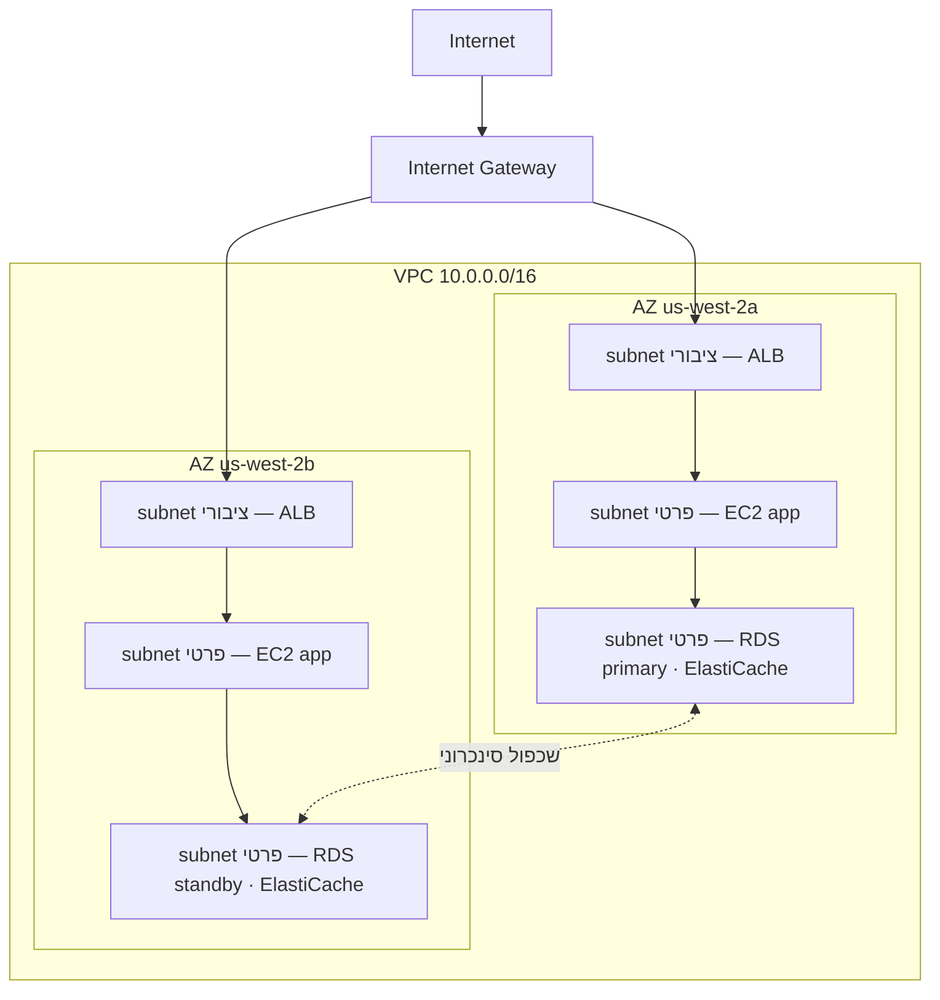

# פרק 11: הפינה הפרטית שלך בענן

ל-Priya היה דף נייר עם ציור עליו.

זה לא היה ציור מסובך. מלבן, מסומן "AWS". בתוך המלבן, אשכול קופסאות: מופעי EC2, מסד נתונים RDS, אשכול ElastiCache. קווים שמחברים הכל להכל. ומחוץ למלבן, תווית בודדת: "אינטרנט".

היא הניחה אותו במרכז השולחן.

---

*שכבת ה-caching עבדה. Redis קיצץ את טעינות הדפים מ-188 אלפיות שנייה ל-12. אבל בזמן ש-Leo חגג את הניצחון הזה, Priya קראה לוגים של רשת — והיא לא אהבה את מה שראתה. כל שירות היה על אותה רשת שטוחה. למסד הנתונים הייתה כתובת IP ציבורית. אשכול ה-Redis היה טכנית נגיש מבחוץ. היישום עבד, אבל הארכיטקטורה הייתה מגרש חניה: בלי גדרות, בלי שערים, בלי אזורים.*

---

"זה מה שיש לנו," אמרה. "למסד הנתונים שלנו יש כתובת IP ציבורית. שכבת המטמון שלנו ניתנת להגעה מהאינטרנט. מופעי ה-EC2 שלנו כולם על אותה רשת שטוחה."

"זה נראה בסדר," אמר Leo. "יש לנו security groups."

"Security groups שאתה הגדרת," אמרה Priya. "בלילה. במהלך ההתקנה הראשונית."

‏Leo לא אמר דבר.

"אני לא מבקרת את התצורה," אמרה. "אני אומרת שכשהכל גר ברשת ציבורית שטוחה, תצורה שגויה בודדת היא ההבדל בין מערכת עובדת לאחת שנגישה לכל מי שבאינטרנט."

היא הרימה טוש אדום וציירה עיגול סביב מסד הנתונים.

"זה לא צריך להיות נגיש מהאינטרנט. בכלל. לא דרך כלל security group, לא דרך תצורה מוקשחת. הוא צריך להיות בלתי נגיש מבנית."

"אנחנו צריכים לדבר על ארכיטקטורת רשת," אמרה Maya.

"היינו צריכים לדבר על זה לפני שלושה חודשים," אמרה Priya. "אבל עכשיו זה בסדר."

הצוות התאסף סביב לוח מחיק בפעם הראשונה זה שבועות.

**הבעיה עם מגרש החניה הפתוח**

דמיינו חניון ציבורי ענק. עשרת אלפים מכוניות. כל מכונית יכולה לחנות בכל מקום. אין מחסומים בין אזורים, אין שערים, אין מקטעים שמורים.

זו רשת פתוחה. כל שירות יכול להגיע לכל שירות אחר. שרת האינטרנט שלכם יכול לדבר עם מסד הנתונים שלכם. מסד הנתונים שלכם יכול להגיע לאינטרנט. שכבת המטמון שלכם יכולה לקבל חיבורים מכל מקום.

כשהכל יכול לדבר עם הכל, פריצה אחת משפיעה על הכל.

"אז אם מישהו פורץ לחניון," אמר Tom, "הוא יכול להיכנס לכל מכונית."

"ומכל מכונית, לנהוג לכל מקום," אישרה Priya. "אנחנו רוצים גדרות. אנחנו רוצים שערים נעולים. אנחנו רוצים אזורים."

ה-VPC הוא איך שאתם בונים את האזורים האלה ב-AWS.

**מה זה VPC?**

"רגע — אבל *למה* נעשה את זה ככה?" שאלה Maya. "אם כבר יש לנו security groups על כל משאב, למה אנחנו צריכים VPC? ה-security groups לא עושים את אותה עבודה?"

‏Security groups ו-VPCs מגנים ברמות שונות. security group הוא כלל המוצמד למשאב ספציפי — הוא אומר "מופע ה-EC2 הזה מקבל תנועה רק על פורט 8080 מ-מאזן העומסים." אבל הוא עדיין על הרשת הציבורית. כתובת ה-IP עדיין נגישה; הכלל פשוט חוסם את החיבור בדלת. VPC מסיר את הדלת מהרחוב הציבורי לחלוטין. משאב ב-subnet פרטי אין לו *מסלול* לאינטרנט — ולפי מוסכמה אין לו כתובת IP ציבורית — אז הוא לא יכול להיות נגיש מהאינטרנט, לא משנה מה ה-security group אומר. זו ערובה מבנית, לא ערובת תצורה.

**Virtual Private Cloud (VPC)** הוא חלק מבודד לוגית של ענן AWS — רשת פרטית שאתם מגדירים, שרק המשאבים שלכם יכולים לגשת אליה כברירת מחדל.

חשבו עליו כחלקה פרטית מגודרת בתוך החניון הציבורי הענק. לחלקה שלכם יש כללים משלה: מי יכול להיכנס, מי יכול לצאת, אילו מסלולים קיימים בין מקטעים.

כשאתם יוצרים VPC, אתם מגדירים:

**בלוק CIDR**: טווח כתובות ה-IP הזמינות בתוך הרשת שלכם. לדוגמה, `10.0.0.0/16` נותן לכם 65,536 כתובות IP אפשריות (10.0.0.0 עד 10.0.255.255).

**Subnets**: חלוקות משנה של ה-VPC שלכם, כל אחת מקבלת חלק מטווח כתובות ה-IP שלכם ומשויכת לאזור זמינות ספציפי.

**Route tables**: כללים הקובעים לאן תנועת הרשת הולכת.

**Internet Gateway**: החיבור בין ה-VPC שלכם לאינטרנט הציבורי.

**Subnets: ציבורי לעומת פרטי**

לא כל המשאבים צריכים להיות נגישים לציבור.

שרת האינטרנט שלכם צריך לקבל תנועה מהאינטרנט — הדפדפנים של המשתמשים צריכים להגיע אליו.

מסד הנתונים שלכם *לעולם* לא צריך לקבל תנועה מהאינטרנט — רק שרת האינטרנט שלכם צריך להיות מסוגל לדבר איתו.

כאן נכנסים ה-subnets.

**subnet ציבורי** מחובר ל-Internet Gateway ויכול לכלול משאבים בעלי כתובות IP ציבוריות. תנועה יכולה לזרום אל ומהאינטרנט.

**subnet פרטי** אין לו מסלול לאינטרנט ב-route table שלו. משאבים ב-subnet פרטי יכולים לתקשר רק עם משאבים אחרים ב-VPC שלכם (אלא אם תגדירו מסלולים יוצאים ספציפיים). לפי מוסכמה, גם אין להם כתובות IP ציבוריות.

עבור Nimbus, העיצוב הפך לברור:



מאזן העומסים פונה לציבור — הוא צריך לקבל תנועה מהאינטרנט. מופעי ה-EC2 פרטיים — הם מקבלים תנועה רק ממאזן העומסים. מסדי הנתונים פרטיים — הם מקבלים תנועה רק ממופעי ה-EC2.

"אז כדי להגיע למסד הנתונים," אמר Tom, "מישהו יצטרך לעבור דרך מאזן העומסים, אחר כך דרך מופע ה-EC2, אחר כך דרך ה-security group של מסד הנתונים?"

"שלוש שכבות," אישרה Priya. "הגנה בעומק."

---

**תוכנית ה-CIDR של Nimbus**

"רגע — אבל *למה* נעשה את זה ככה?" שאלה Maya, מסתכלת על בחירות בלוק ה-CIDR. "למה Priya כל כך ספציפית לגבי טווחי כתובות ה-IP? אנחנו לא יכולים פשוט להשתמש במה ש-AWS מגדירה כברירת מחדל?"

"כי בלוקי CIDR קשים מאוד לשנות מאוחר יותר," אמרה Priya. "וכי אם אי פעם נחבר את ה-VPC הזה ל-VPC אחר, או לרשת on-premises, טווחי IP חופפים גורמים לכשלי ניתוב שכואב לאבחן."

היא ציירה את התוכנית על הלוח.

ה-VPC של Nimbus: `10.0.0.0/16` — 65,536 כתובות בסך הכל.

| Subnet | CIDR | AZ | מטרה |
|---|---|---|---|
| Public A | 10.0.0.0/24 | us-west-2a | מאזני עומסים |
| Public B | 10.0.1.0/24 | us-west-2b | מאזני עומסים |
| Private App A | 10.0.10.0/24 | us-west-2a | שרתי אפליקציה EC2 |
| Private App B | 10.0.11.0/24 | us-west-2b | שרתי אפליקציה EC2 |
| Private Data A | 10.0.20.0/24 | us-west-2a | RDS, ElastiCache |
| Private Data B | 10.0.21.0/24 | us-west-2b | RDS, ElastiCache |

"למה לא פשוט להפוך הכל ל-/16?" שאל Leo.

"כי subnets באזורי זמינות שונים לא צריכים לחלוק מרחב כתובות. כל subnet נמצא באזור זמינות אחד. אם אי פעם נצמיד את ה-VPC הזה לאחר, ככל שנהיה גרנולריים יותר, כך פחות סביר שיהיו לנו התנגשויות. וכל /24 נותן לנו 251 כתובות שמישות — יותר מספיק לכל שכבה בודדת."

"AWS שומרת חמש כתובות בכל subnet," ציין Tom, מסתכל בתיעוד. "לכן זה 251, לא 256."

"נכון. ארבע הראשונות והאחרונה. כתובת רשת, נתב VPC, שרת DNS, שימוש עתידי, broadcast."

"אז /24 הוא הקטן ביותר שהיית הולכת אליו?"

"בפועל. היית משתמש ב-/28 ל-subnets קטנים מאוד — כמו subnet של VPN gateway, שצריך רק קומץ כתובות IP. אבל לשכבות יישום, /24 הוא מינימום סביר."

‏Tom רשם את המספרים וחישב את הפרש העלות החודשית בין הגדלים. הוא תמיד עשה זאת.

---

**טעויות תכנון CIDR שיש להימנע מהן**

"חשבנו על מה שקורה אם נגדל מעבר ל-subnet?" שאלה Priya. היא לא שאלה כי היא לא ידעה. היא שאלה כי שאר הצוות היה צריך להפנים את התשובה.

‏Leo חשב על זה. "אנחנו יכולים להוסיף עוד subnets?"

"אתה יכול להוסיף subnets ל-VPC. אבל אתה לא יכול לשנות גודל של subnet קיים. אם ה-subnet הפרטי של האפליקציה מתמלא — 251 כתובות לא מספיקות — היית צריך ליצור subnet חדש ולהגר אליו מופעים."

"כמה לעיתים קרובות זה באמת קורה?"

"לעיתים רחוקות, אם מתכננים טוב. אבל אנשים עושים שלוש טעויות נפוצות."

היא מנתה אותן:

**טעות ראשונה**: שימוש ב-CIDR קטן מדי ל-VPC. אם אתם משתמשים ב-`10.0.0.0/24` עבור כל ה-VPC (254 כתובות), תיגמרו לכם המקום לפני שסיימתם לתכנן subnets. התחילו עם `/16` לגמישות.

**טעות שנייה**: שימוש ב-CIDRs חופפים על פני VPCs. אם ה-VPC של הייצור שלכם הוא `10.0.0.0/16` וה-VPC של ה-staging הוא גם `10.0.0.0/16`, לעולם לא תוכלו להצמיד אותם או לחבר אותם דרך transit gateway. הנתבים לא יידעו לאיזה VPC לשלוח תנועה.

**טעות שלישית**: אי-שמירת מרחב כתובות לשכבות עתידיות. תוכנית Nimbus השאירה את `10.0.30.0/24` ו-`10.0.31.0/24` לא מוקצים — מקום לשכבת כלים פנימית עתידית, subnet ניטור, או subnet endpoint של VPN, מבלי להזדקק למבנה מחדש של כל מרחב הכתובות.

"תכננו לפי כפול ממה שאתם חושבים שאתם צריכים," אמרה Priya. "Subnets הם חינמיים. מרחב כתובות IP מ-`/16` הוא בשפע. העלות של תכנון שגוי היא הגירת רשת."

---

**ה-NAT Gateway: Subnets פרטיים שעדיין יכולים להוריד דברים**

‏Subnets פרטיים לא יכולים להגיע לאינטרנט. אבל לפעמים, הם צריכים. מופע ה-EC2 שלכם צריך להוריד עדכון תוכנה. היישום שלכם צריך לקרוא ל-API חיצוני.

כאן נכנס ה-**NAT Gateway** (Network Address Translation).

‏NAT Gateway יושב ב-subnet ציבורי. משאבים ב-subnets פרטיים יכולים לשלוח תנועה יוצאת ל-NAT Gateway, שמעביר אותה לאינטרנט — אבל האינטרנט לא יכול ליזום חיבורים בחזרה.

זה כמו דלת מסתובבת חד-כיוונית. אתם יכולים לצאת. אף אחד בחוץ לא יכול להיכנס.

"כמה זה עולה בחודש?" שאל Tom.

לתמחור NAT Gateway יש שני רכיבים: חיוב שעתי לכל NAT Gateway, בתוספת עמלת עיבוד נתונים לכל GB.

בזמן ש-Nimbus הקימה את זה, זה היה בערך $32 לחודש לכל NAT Gateway, בתוספת $0.045 לכל GB של נתונים מעובדים. עבור נפחי תנועה קטנים, העלות הקבועה דומיננטית. בקנה מידה גדול, חיובי הנתונים יכולים להיות משמעותיים.

‏Tom הקים התראת חיוב על עלויות עיבוד נתונים לפני שסיים את תצורת ה-NAT Gateway. הוא ראה איך עלויות הנתונים של AWS נראו כשאף אחד לא צפה בהן.

ההפתעה שתפסה צוותים לא מוכנים: כל בייט שזורם דרך NAT Gateway מחויב. אם מופעי ה-EC2 שלכם ב-subnets פרטיים מורידים חבילות תוכנה גדולות, מזרימים לוגים לשירותים חיצוניים, או שולחים נתונים משמעותיים ל-APIs חיצוניים, חיובי הנתונים של ה-NAT Gateway מופיעים בחשבון כהפתעה. הפתרון לתנועה מ-AWS-ל-AWS: VPC Endpoints מנתבים תנועה לשירותי AWS (S3, DynamoDB) באופן פרטי, עוקפים את ה-NAT Gateway לחלוטין ומבטלים את חיובי הנתונים האלה.

"אז מופעי ה-EC2 ב-subnet הפרטי מורידים עדכוני OS דרך ה-NAT Gateway," אמר Tom. "העדכונים האלה הם כמה גיגה-בייט?"

"לכל מופע, לכל חודש, אולי שניים עד חמישה GB," אמר Leo.

"כפול עשרה מופעים. כפול שנים עשר חודשים. ב-$0.045 לכל GB—"

"אחת עשרה עד עשרים ושבעה דולר בשנה," השלימה Priya. "במקרה הזה, מקובל."

"אבל אם היינו מזרימים לוגים — כמו שליחת כל לוגי היישום שלנו לשירות observability חיצוני—"

"היינו מנתבים אותם דרך VPC Endpoint או משתמשים ב-CloudWatch Logs במקום לצאת דרך NAT."

‏Tom סגר את המחשבון. החשבון היה ברור מספיק.

### NAT Instance: החלופה החסכונית

"רגע," אמר Tom, עדיין בוהה בדף התמחור. "אנחנו משלמים לכל גיגה-בייט רק כדי לאפשר למופעים פרטיים להגיע לאינטרנט? זו האפשרות היחידה?"

"זו האפשרות המנוהלת," אמרה Priya. "יש דרך ישנה יותר, אבל היא מגיעה עם פשרות."

לפני ש-NAT Gateway היה קיים, צוותים השיגו את אותו ניתוב יוצא עם מופע EC2 רגיל — "NAT instance." הייתם משיקים מופע EC2 ב-subnet ציבורי, מפעילים IP forwarding ב-OS, משביתים את בדיקת המקור/יעד (ש-AWS מפעילה כברירת מחדל כדי להשליך חבילות שלא מוענות למופע), ומפנים את ה-route table של ה-subnet הפרטי ל-ENI של המופע. תנועה ממופעים פרטיים הייתה זורמת דרכו לאינטרנט, בדיוק כמו NAT Gateway.

זה עדיין עובד. AWS עדיין מתעדת את זה. ובנפחי תנועה נמוכים מאוד — סביבת dev בודדת שבה קומץ מופעים מדי פעם מורידים חבילות — NAT instance מסוג `t3.micro` יכול לעלות מתחת לחמישה דולר בחודש, לעומת החיוב השעתי הקבוע של ה-NAT Gateway בתוספת עמלות לכל GB.

| | NAT Gateway | NAT Instance |
|---|---|---|
| ניהול | מנוהל לחלוטין על ידי AWS | אתם מנהלים את ה-EC2 |
| זמינות | יתיר בתוך אזור זמינות | EC2 בודד — נקודת כשל יחידה |
| רוחב פס | עד 100 Gbps, מתרחב אוטומטית | מוגבל לפי סוג מופע ה-EC2 |
| עלות | $0.045/GB + חיוב שעתי | עלות מופע ה-EC2 בלבד |

יתרון העלות נעלם במהירות. בנפחי תנועה משמעותיים, חיוב ה-NAT Gateway לכל GB תחרותי עם סוג מופע ה-EC2 שהייתם צריכים כדי לטפל ברוחב הפס הזה — ו-NAT Gateway דורש אפס תיקונים, אפס ניטור, ואפס תגובת אירוע כשהוא נכשל (הוא לא).

"אז מתי באמת היינו משתמשים ב-NAT instance?" שאל Leo.

"סביבת dev חד-פעמית," אמרה Priya. "איפשהו שאתה מריץ מופע אחד או שניים, עושה עדכוני חבילות מדי פעם, ורוצה למזער את העלות הקבועה. עומסי ייצור — כל דבר שצריך להיות זמין — NAT Gateway, אחד לכל אזור זמינות."

הבחינה בוחנת את הפשרה הזו בשמה. הדפוס: "מזער עלות NAT בסביבת dev או test עם תנועה נמוכה" מצביע על NAT Instance. "עומס ייצור הדורש זמינות גבוהה" מצביע על NAT Gateway הפרוס לכל אזור זמינות.

אולי אתם תוהים: אם security groups כבר קיימים וחוסמים תנועה כברירת מחדל, למה VPC עם subnets פרטיים מוסיף הגנה משמעותית? כי "חסום על ידי security group" ו"בלתי נגיש מבנית" הם דברים שונים. תצורה שגויה של security group — כלל אחד שגוי, פורט אחד פתוח — יכולה לחשוף משאב שיש לו כתובת IP ציבורית. למשאב ב-subnet פרטי אין כתובת IP ציבורית להגיע אליה מלכתחילה. הייתם צריכים לפרוץ את מאזן העומסים ומופע EC2 פעיל לפני שתוכלו אפילו לנסות להגיע למסד הנתונים. Subnets פרטיים אוכפים בידוד ברמת הרשת, לא ברמת הכלל.

**Route Tables: כיצד תנועה מוצאת את דרכה**

לכל subnet יש **route table** שמספרת לתנועה לאן ללכת.

‏route table טיפוסי של subnet ציבורי נראה כך:

| יעד        | מטרה                        |
|-------------|-----------------------------|
| 10.0.0.0/16 | local                       |
| 0.0.0.0/0   | igw-xxxx (Internet Gateway) |

הכלל הראשון: תנועה לכל IP בטווח ה-VPC שלכם נשארת מקומית. הכלל השני: כל שאר התנועה (`0.0.0.0/0` אומר "הכל") הולכת ל-Internet Gateway.

‏route table של subnet פרטי:

| יעד        | מטרה                   |
|-------------|------------------------|
| 10.0.0.0/16 | local                  |
| 0.0.0.0/0   | nat-xxxx (NAT Gateway) |

תנועת subnet פרטי נשארת מקומית או יוצאת דרך ה-NAT Gateway. אין מסלול ישיר ל-Internet Gateway.

**Security Groups לעומת NACLs (תצוגה מקדימה)**

בתוך ה-VPC, יש לכם שני כלים לשליטה בתנועה ברמת המשאב:

**Security Groups** (פרק 15 מכסה את זה לעומק) פועלים כ-firewalls וירטואליים למשאבים בודדים — מופע EC2, מופע RDS, מאזן עומסים. הם *stateful*: אם תנועה מורשית להיכנס, תנועת התגובה מורשית אוטומטית לצאת.

**Network ACLs (NACLs)** פועלים ברמת ה-subnet והם *stateless*: אתם חייבים להתיר במפורש תנועה נכנסת ויוצאת בנפרד.

עבור רוב מקרי השימוש, Security Groups מספיקים. NACLs מוסיפים שכבה נוספת כשאתם צריכים בקרות ברמת subnet — לדוגמה, חסימת טווח IP ספציפי מלהגיע אי פעם ל-subnet.

"Security groups ברמת המופע," כתב Leo על הלוח. "NACLs ברמת ה-subnet."

"ולעולם אל תשאיר את פורט 22 פתוח ל-0.0.0.0/0," הוסיפה Priya, מסתכלת על Leo.

"זה היה פעם אחת," אמר Leo.

"זה תמיד בדיוק פעם אחת," אמרה Priya, "עד שזה לא."

"ומה אם מישהו ינסה לפרוץ?" אמרה Priya, עדיין ליד הלוח. "לא דרך security group עם תצורה שגויה — מה אם הם יפרצו את מאזן העומסים עצמו? מה עוצר אותם מלעבור ל-subnet הפרטי?"

"מופעי ה-EC2 ב-subnet הפרטי מקבלים תנועה רק מה-security group של מאזן העומסים," אמר Leo. "אפילו אם מאזן העומסים נפרץ, התוקף יכול לבצע רק בקשות שנראות כמו קריאות API רגילות."

"ומסד הנתונים מקבל תנועה רק מה-security group של ה-EC2," אמרה Priya. "הגנה בעומק. כל שכבה מניחה שהקודמת עלולה להיכשל."

---

**VPC Flow Logs: לראות מה קורה**

"אנחנו צריכים עיניים על הרשת," אמרה Priya, שלושה ימים לתוך עיצוב ה-VPC מחדש.

"יש לנו security groups ו-NACLs," אמר Leo. "התנועה מבוקרת."

"מבוקרת לא אומר נראית. אם משהו מוזר קורה — ניסיון חיבור בלתי צפוי, תנועה לפורט מוזר — איך נדע?"

‏VPC Flow Logs לוכדים מטא-נתונים על תנועת הרשת שזורמת דרך ה-VPC שלכם. לא תוכן החבילות — רק המידע ברמת החיבור: IP מקור, IP יעד, פורט, פרוטוקול, ספירת חבילות, ספירת בייטים, זמן התחלה, זמן סיום, והאם התנועה התקבלה או נדחתה.

ערך לוג זרימה טיפוסי נראה כך:

```
2 123456789012 eni-0abc123 10.0.10.5 10.0.20.8 49321 5432 6 20 4320 1620000000 1620000060 ACCEPT OK
```

זה אומר לכם: מ-`10.0.10.5` (מופע EC2 ב-subnet האפליקציה) ל-`10.0.20.8` (מופע ה-RDS), פורט 5432 (PostgreSQL), 20 חבילות, 4,320 בייטים, התקבל. תנועה רגילה.

אבל כמה ימים אחרי הפעלת Flow Logs, Priya מצאה את זה:

```
2 123456789012 eni-0abc123 185.220.101.55 10.0.10.5 0 8080 6 1 40 1620003200 1620003201 REJECT OK
```

‏IP חיצוני — `185.220.101.55` — ניסה חיבור למופע ה-EC2 על פורט 8080. החיבור נדחה על ידי ה-security group. אבל הניסיון נרשם.

היא חיפשה את ה-IP. הוא שייך לבלוק כתובות רומני הידוע בסריקה אוטומטית — סוג רעש הרקע של בדיקות שכל IP ציבורי באינטרנט מקבל כל הזמן.

"מישהו בודק אותנו," אמרה.

"אבל נדחה," אמר Leo.

"הפעם. הפעל את GuardDuty" — שירות זיהוי איומים שנפגוש כראוי בפרק 17 — "לפני שנמשיך. אנחנו צריכים זיהוי התנהגותי, לא רק חסימת היקף."

‏Flow Logs מאוחסנים ב-CloudWatch Logs או ב-S3. ניתן לשאול אותם באמצעות CloudWatch Insights או Athena. Priya הקימה שאילתת CloudWatch Insights שרצה מדי לילה וסימנה כל ניסיון חיבור שנדחה מטווחי IP שאינם של AWS.

"כמה זה עולה בחודש?" שאל Tom.

"לוגי זרימה מחויבים לכל GB של נתונים שנקלטים ל-CloudWatch או ל-S3. בנפח התנועה שלנו, כנראה שמונה עד חמישה עשר דולר בחודש."

‏Tom השתהה. "והחלופה היא לא לדעת שמישהו בודק את הרשת שלנו."

"כן."

"זה בסדר," אמר, ופתח את הקונסול.

**קריאת סריקת פורטים ב-Flow Logs**

שבועיים אחרי הפעלת לוגי הזרימה, Priya הריצה את שאילתת CloudWatch Insights הלילית שלה ומצאה משהו חדש. לא חיבור אחד שנדחה — עשרות, ברצף מהיר, מאותו IP מקור, על פני פורטים עוקבים.

```
185.220.101.55 → 10.0.10.5 port 22   REJECT
185.220.101.55 → 10.0.10.5 port 23   REJECT
185.220.101.55 → 10.0.10.5 port 25   REJECT
185.220.101.55 → 10.0.10.5 port 80   REJECT
185.220.101.55 → 10.0.10.5 port 443  REJECT
185.220.101.55 → 10.0.10.5 port 3306 REJECT
185.220.101.55 → 10.0.10.5 port 5432 REJECT
185.220.101.55 → 10.0.10.5 port 6379 REJECT
```

כולם בתוך חלון של חמש שניות. כולם נדחו.

"זו סריקת פורטים," אמרה Priya. "מישהו בודק אילו שירותים המופע הזה מריץ."

"אבל כולם נדחו," אמר Leo. "אז ה-security group עושה את עבודתו."

"ה-security group עושה את עבודתו. הסריקה עדיין אינפורמטיבית לתוקף — היא אומרת לו אילו פורטים *לא* דחו בתוך timeout, מה שאומר שהפורטים האלה פתוחים איפשהו. והיא אומרת לו שהמארח הזה חי ושווה חקירה."

"מה אנחנו עושים?"

"שני דברים," אמרה Priya. "ראשון: הוסף כלל NACL לחסום את טווח ה-/24 שה-IP הזה שייך לו. לא רק ה-IP הזה — כל ה-subnet. סורקי פורטים מסובבים IPs בתוך טווח. שני: הוסף התראת CloudWatch שמופעלת כשכל IP מקור בודד מייצר יותר מעשרה חיבורים שנדחו בשישים שניות. הדפוס הזה הוא כמעט תמיד סריקה."

היא הקימה את שניהם. ההתראה הופעלה פעמיים בשבוע שלאחר מכן — פעם מאותו טווח רומני, פעם מסורק אוטומטי שבסיסו בסינגפור. שניהם נחסמו ב-NACL תוך דקות מהזיהוי.

לוגי זרימה לא עוצרים התקפות. הם הופכים התקפות לנראות. והתקפות נראות ניתן להגיב עליהן. החלופה — תנועה שזורמת באופן בלתי נראה — אומרת שהסימן הראשון לבעיה הוא הנזק, לא הניסיון.

---

**מלכודת ה-NAT Gateway הבודד**

שלושה חודשים אחרי עיצוב ה-VPC מחדש, Priya הריצה סימולציית כשל. היא רצתה לדעת מה יקרה ל-Nimbus אם אזור הזמינות `us-west-2a` יחווה שיבוש.

רוב זה היה בסדר. מאזן העומסים עשה failover למופעים ב-`us-west-2b`. ה-standby של RDS ב-`us-west-2b` כבר היה חי. ElastiCache קידם את העותק. היישום המשיך לשרת בקשות.

ואז Leo שם לב שמופעי ה-EC2 שלו ב-`us-west-2b` הפסיקו לקבל התראות עדכון OS. הוא בדק את תצורת ה-NAT Gateway.

היה אחד. ב-`us-west-2a`.

"כל התנועה היוצאת לאינטרנט מה-subnets הפרטיים בשני אזורי הזמינות מנותבת דרך NAT Gateway אחד באזור זמינות אחד," אמרה Priya.

"אז אם `us-west-2a` נופל—"

"כל מופע EC2 ב-`us-west-2b` מאבד גישה יוצאת לאינטרנט. הם לא יכולים להוריד עדכונים. הם לא יכולים להגיע ל-APIs חיצוניים. חיפושי Secrets Manager שלא במטמון ייכשלו. כל דבר שדורש אינטרנט יוצא יישבר."

התיקון: NAT Gateway אחד לכל אזור זמינות. ה-subnets הפרטיים של כל אזור זמינות מנתבים תנועה יוצאת ל-NAT Gateway באותו אזור זמינות. כשאזור זמינות נכשל, רק התנועה של אותו אזור זמינות מושפעת.

"ומה תג המחיר על התיקון הזה?" שאל Tom.

"שלושים ושניים דולר נוספים בחודש עבור ה-NAT Gateway של אזור הזמינות השני."

‏Tom שתק לרגע.

"קיבולת ה-EC2 ב-`us-west-2b` שנכשלת להגיע ל-APIs חיצוניים במהלך השבתה," אמרה Priya, "עולה יותר משלושים ושניים דולר."

‏Tom אישר את השינוי.

זו אחת מטעויות עיצוב ה-VPC הנפוצות ביותר: NAT Gateway שנראה זמין מאוד אבל הוא למעשה נקודת כשל יחידה. אם יש לכם משאבים בשלושה אזורי זמינות ו-NAT Gateway אחד, יש לכם חוסן מחשוב בשלושה אזורי זמינות אבל חוסן רשת באזור זמינות אחד. השניים לא תואמים.

הכלל: NAT Gateway אחד לכל אזור זמינות, ב-subnet הציבורי של אותו אזור זמינות. ה-route table הפרטי של כל אזור זמינות מצביע על ה-NAT Gateway שלו. העלות צנועה. שיפור הזמינות אמיתי.


---

**VPC Peering: חיבור רשתות פרטיות**

מה אם Nimbus תגדל למספר VPCs? (זה קורה. צוותים גדלים. שירותים מבודדים לחשבונות נפרדים.)

**VPC Peering** מאפשר לשני VPCs לתקשר באופן פרטי כאילו היו על אותה רשת. תנועה לא עוזבת את הרשת הפרטית של AWS.

מגבלות חשובות:

- VPC peering אינו טרנזיטיבי. אם VPC A מצומד ל-VPC B, ו-VPC B מצומד ל-VPC C, A ו-C לא יכולים לתקשר — אלא אם תוסיפו צימוד A-C ישיר.
- בלוקי CIDR לא יכולים לחפוף בין VPCs מצומדים.

לארכיטקטורות גדולות יותר עם הרבה VPCs, **AWS Transit Gateway** (פרק 25) מטפל בניתוב טרנזיטיבי מבלי לדרוש רשת מלאה של חיבורי peering.

---

**AWS PrivateLink: גישה פרטית לשירותי AWS**

"מה לגבי הגעה ל-S3 מה-subnet הפרטי?" שאל Leo. "מופעי ה-EC2 שלנו כותבים קבלות ל-S3. כרגע התנועה הזו יוצאת דרך ה-NAT Gateway."

"VPC Endpoints," אמרה Priya. "ספציפית, Gateway Endpoints עבור S3 ו-DynamoDB — הם חינמיים."

**VPC Endpoint** יוצר חיבור פרטי בין ה-VPC שלכם לשירות AWS, עוקף את האינטרנט הציבורי לחלוטין. תנועה בין ה-subnet הפרטי שלכם לשירות AWS נשארת על רשת AWS. אין חיוב NAT Gateway. אין חשיפה לאינטרנט.

עבור S3 ו-DynamoDB, **Gateway Endpoints** חינמיים וקלים: הוסיפו ערך ל-route table שמפנה תנועת S3/DynamoDB ל-endpoint במקום ל-NAT Gateway.

עבור שירותי AWS אחרים (Secrets Manager, KMS, SNS, SQS), **Interface Endpoints** יוצרים ממשק רשת אלסטי (ENI) ב-subnet שלכם עם כתובת IP פרטית. תנועה לשירות הולכת לאותו IP פרטי. Interface endpoints עולים כסף — בערך $0.01/שעה **לכל אזור זמינות שבו ה-endpoint מוקצה** (endpoint עם ENIs בשלושה אזורי זמינות עולה פי שלושה מהתעריף השעתי), בתוספת בערך $0.01/GB של נתונים מעובדים — אבל הם מבטלים את הצורך לנתב קריאות API רגישות (כמו חיפושי Secrets Manager) דרך NAT Gateway או על פני האינטרנט הציבורי.

"אז מופעי ה-EC2 שלנו יכולים להגיע ל-S3, DynamoDB, Secrets Manager ו-KMS," אמרה Priya, "הכל מה-subnet הפרטי, ללא שום חשיפה לאינטרנט, ועבור S3 ו-DynamoDB, ללא שום חיובי נתונים של NAT Gateway."

‏Tom חישב מחדש. החיסכון בתנועת S3 יקזז את עלות ה-Interface Endpoint עבור Secrets Manager תוך כמה חודשים.

"PrivateLink הוא השם הכללי," הוסיפה Priya. "AWS PrivateLink היא הטכנולוגיה הבסיסית עבור Interface Endpoints. הבחינה משתמשת בשני המונחים."

---

**רשימת בדיקה לדיבוג**

שלושה חודשים אחרי עיצוב ה-VPC מחדש, Leo שבר את הרשת. לא בדרמטיות — הוא שינה שיוך route table ובטעות ניתק את ה-subnet הפרטי של האפליקציה ממסלול ה-NAT Gateway שלו.

מופעי ה-EC2 לא יכלו להגיע ל-APIs חיצוניים. הם יכלו להגיע אחד לשני, והם יכלו להגיע למסדי הנתונים. רק לא לאינטרנט. קריאות HTTPS יוצאות התחילו להיכשל.

הוא בילה ארבעים דקות בפתרון תקלות לפני ש-Priya הגישה לו רשימת בדיקה.

"כשמשהו לא מגיע למשהו אחר ב-VPC, בדוק את אלה לפי הסדר," אמרה.

1. **Security group על המקור**: האם הכלל היוצא נכון? האם הוא מתיר את התנועה שאתה מנסה לשלוח?
2. **Security group על היעד**: האם הכלל הנכנס נכון? האם הוא מתיר תנועה מהמקור?
3. **NACL על subnet המקור**: האם יש כלל deny נכנס שחוסם תנועת תגובה? האם יש כלל allow יוצא?
4. **NACL על subnet היעד**: האם יש כלל allow נכנס? האם יש כלל allow יוצא לתגובות?
5. **Route table על subnet המקור**: האם יש לו מסלול ליעד? האם המסלול מצביע על המטרה הנכונה (NAT Gateway, IGW, VPC Endpoint)?
6. **Route table על subnet היעד**: האם יש לו מסלול בחזרה למקור?
7. **מדיניות VPC Endpoint**: אם משתמשים ב-VPC Endpoint, האם מדיניות ה-endpoint מתירה את הפעולה?
8. **הרשאות IAM**: האם ל-role של ה-EC2 יש הרשאה לקרוא לשירות? (עבור קריאות API של AWS)

‏Leo מצא את זה בשלב 5. ה-route table שויך מחדש ל-subnet הפרטי השגוי. מסלול ה-NAT Gateway היה חסר.

"אם היה לי את הרשימה הזו לפני שלושה חודשים," אמר, "הייתי מוצא את זה בחמש דקות."

"יהיה לך אותה מעכשיו," אמרה Priya.

## Direct Connect: הקו הייעודי

שלושה חודשים אחרי עיצוב ה-VPC מחדש, Nimbus סגרה עסקה עם Harborview Dining Group — רשת ארגונית של מאה סניפים שעיבדה שני מיליון דולר בעסקאות ביום.

שיחת הסקירה הטכנית התחילה היטב. ואז קצינת הציות שלהם הסירה את ההשתקה.

"אנחנו לא יכולים לנתב נתוני עסקאות ייצור על פני האינטרנט הציבורי," אמרה. "המבקרים שלנו דורשים נתיב רשת ייעודי, פרטי וניתן לביקורת בין מרכז הנתונים שלנו לכל סביבת ענן. Site-to-Site VPN אינו מקובל. הוא חולק רוחב פס עם כל השאר. הוא נוסע על אותם חוטים כמו תנועת צרכנים."

‏Tom הסתכל על Leo. Leo הסתכל על Priya.

"כדי להיות מדויקת," אמרה Priya בזהירות, "PCI DSS עצמו לא אוסר VPN מוצפן על פני האינטרנט — תעבורה מוצפנת מספקת את התקן. מה שאת מתארת הוא מדיניות פנימית של המבקרים שלכם, שהיא מחמירה יותר. זה לגיטימי. ויש שירות לזה."

**AWS Direct Connect** הוא חיבור רשת פיזי ייעודי בין מרכז הנתונים ה-on-premises שלכם ל-AWS. החיבור עוקף את האינטרנט הציבורי לחלוטין — התנועה שלכם לעולם לא נוגעת בתשתית משותפת, לעולם לא מתחרה על רוחב פס עם אף אחד אחר, ולעולם לא נוסעת על חוט שאינו שלכם.

הקמת Direct Connect אומרת עבודה עם AWS וספק colocation או רשת כדי להתקין cross-connect פיזי במיקום Direct Connect — מרכז נתונים שבו ל-AWS יש ציוד ייעודי. ברגע שהקישור הפיזי במקומו, אתם מקימים ממשקים וירטואליים מעליו שמתחברים ל-VPC שלכם או לשירותי AWS ישירות.

**המאפיינים המרכזיים:**

רוחב פס מגיע בשתי צורות. *חיבורים ייעודיים* הולכים ישירות לחומרת AWS: 1 Gbps, 10 Gbps, או 100 Gbps. *חיבורים מתארחים* הולכים דרך שותף AWS ומציעים אפשרויות גרנולריות יותר מ-50 Mbps עד 10 Gbps — שימושי כשאינכם צריכים פורט ייעודי מלא.

זמן תגובה עקבי. מכיוון שאינכם מתחרים על רוחב פס אינטרנט, זמן הלוך-ושוב ל-AWS צפוי. עבור Harborview, שמערכות נקודת המכירה שלה ביצעו מאות קריאות API לעסקה, זמן תגובה עקבי של מתחת ל-5ms היה ההבדל בין צ'ק-אאוט של 200ms לאחד של 400ms.

פרטיות מבנית, לא תצורתית. Site-to-Site VPN מוצפן, אבל הוא עדיין חוצה את האינטרנט הציבורי — אותה תשתית פיזית שכולם משתמשים בה. תנועת Direct Connect לעולם לא נוגעת באינטרנט הציבורי. עבור צוות הציות של Harborview, זו הייתה הדרישה, ושום כמות של תצורת VPN לא תספק אותה.

עלות גבוהה יותר מ-VPN. אתם משלמים חיוב port-hour עבור חיבור ה-Direct Connect בתוספת תמחור העברת נתונים. החיבור אינו זול, ולוקח שבועות עד חודשים להקצות — התקנת cross-connect פיזית אינה משהו שמרימים באחר צהריים של יום שישי.

"רגע," אמרה Maya. "אם VPN מוצפן, למה זה משנה שזה הולך על פני האינטרנט הציבורי?"

כי דרישת הציות אינה רק על הצפנה — היא על בידוד. VPN מצפין את תוכן התנועה, אבל התנועה עדיין חוצה תשתית פיזית משותפת. כל מי ששולט בנתב בנתיב יכול לראות את החבילות המוצפנות, להקליט אותן, ולנסות לפענח אותן מאוחר יותר. לקישור פיזי ייעודי אין נתבים משותפים. הנתיב פיזית שלכם. עבור תעשיות עם דרישות ריבונות נתונים מחמירות — פיננסים, בריאות, ממשל — ההבחנה הזו היא ההבדל בין תואם לא-תואם.

"עוד דבר אחד," אמרה Priya. "Direct Connect פרטי כברירת מחדל, אבל לא מוצפן כברירת מחדל. אם אתם רוצים את שניהם — פרטי ומוצפן — אתם מריצים IPSec VPN על חיבור ה-Direct Connect. זה נותן לכם רוחב פס ייעודי בתוספת הצפנה. שניהם."

‏Tom כבר מצא את דף התמחור. הוא הסתכל על המחויבות החודשית עבור חיבור Dedicated של 1 Gbps.

"הנפח היומי של $2M של Harborview אומר שזה מחזיר את עצמו בשגיאות עיגול," אמר.

הוא שלח את ההצעה.

---

> **עצת בחינה — Direct Connect לעומת VPN**
>
> *SAA-C03 דומיין: עיצוב ארכיטקטורות מאובטחות (דומיין 1)*
>
> - **VPN:** מוצפן, מהיר להקצאה (דקות), נוסע על האינטרנט הציבורי, רוחב פס וזמן תגובה משתנים.
> - **Direct Connect:** קישור פיזי ייעודי, רוחב פס וזמן תגובה עקביים, פרטי (התנועה לעולם לא נוגעת באינטרנט הציבורי), אבל לא מוצפן כברירת מחדל. לוקח שבועות עד חודשים להקצות.
> - **מוצפן וגם פרטי:** הריצו IPSec VPN מעל Direct Connect. אתם מקבלים גם רוחב פס ייעודי וגם הצפנה.
> - **מפעיל בחינה:** "רוחב פס עקבי, פרטי וייעודי ל-AWS" או "הציות דורש שהתנועה לא תיסע על האינטרנט הציבורי" ← Direct Connect. "מוצפן וגם פרטי" ← Direct Connect + IPSec VPN. "מהיר להקמה, עלות נמוכה יותר, מקובל להשתמש באינטרנט ציבורי" ← Site-to-Site VPN.
> - **עלות וזמן הקמה** הן הפשרות שהבחינה בוחנת: VPN = מהיר + זול; Direct Connect = איטי להקצאה + יקר + עקבי.

---

### Client VPN: גישה מרחוק למשתמשים בודדים

‏Direct Connect ו-Site-to-Site VPN מחברים רשתות — משרד שלם או מרכז נתונים ל-AWS. אבל מהנדסים גם צריכים לחבר מחשבים ניידים בודדים ל-VPC: כדי לדבג מופע EC2 פרטי, לשאול מסד נתונים RDS פרטי, או לגשת לכלים פנימיים מהבית.

"כבר אין לנו את זה?" שאלה Maya. "יש לנו bastion host. Leo לא יכול פשוט לעשות SSH דרכו?"

"עבור SSH, כן," אמרה Priya. "אבל מה אם Leo צריך להתחבר למופע ה-RDS מ-GUI של מסד נתונים על המחשב הנייד שלו? או לשאול את לוח מחווני המדדים הפנימי דרך HTTP? ה-bastion מטפל רק ב-SSH. Client VPN עובד לכל פרוטוקול."

**AWS Client VPN** הוא endpoint VPN מנוהל שמאפשר למשתמשים בודדים להתחבר ל-VPC שלכם מכל מכשיר, מכל מקום. משתמשים מתקינים לקוח OpenVPN סטנדרטי על המחשב הנייד שלהם; ה-endpoint של ה-VPN נמצא ב-AWS.

מאפיינים מרכזיים:

- מנוהל על ידי AWS — אתם לא מריצים שרת VPN
- מבוסס על OpenVPN — עובד עם כל לקוח OpenVPN סטנדרטי
- אימות דרך Active Directory (מבוסס-משתמש), TLS הדדי מבוסס-תעודה, או אימות מאוחד SAML 2.0 (SSO דרך ספק זהויות)
- כל לקוח מחובר מקבל IP פרטי ב-VPC שלכם ויכול לגשת למשאבים פרטיים (RDS, ElastiCache, שירותים פנימיים) כאילו היה בתוך ה-VPC
- תומך ב-**split-tunnel** (רק תנועת VPC הולכת דרך ה-VPN — תנועת אינטרנט הולכת ישירות) או **full-tunnel** (כל התנועה דרך ה-VPN)

"split-tunnel," אמר Tom מיד.

"למה?" שאל Leo.

"כי full-tunnel אומר שזרם ה-Netflix שלי הולך דרך ה-endpoint של ה-VPN שלנו ואני משלם עליו חיובי העברת נתונים."

זה היה נכון. split-tunnel הוא ההמלצה המוגדרת כברירת מחדל לגישת מפתחים: תנועה הקשורה ל-VPC מנותבת דרך ה-VPN, תנועת אינטרנט יוצאת ישר החוצה. ה-VPN מטפל רק במה שצריך להיות פרטי.

**לעומת Site-to-Site VPN:** Site-to-Site מחבר שתי רשתות (משרד ↔ VPC). Client VPN מחבר מכשירים בודדים (מחשב נייד ↔ VPC).

**לעומת bastion host:** bastion host דורש SSH; Client VPN עובד לכל פרוטוקול — חיבורי מסד נתונים, שירותים פנימיים HTTP, כל דבר שרץ על TCP או UDP.

> **עצת בחינה — Client VPN לעומת Site-to-Site VPN**
>
> - **Site-to-Site VPN:** רשת-לרשת (משרד ל-VPC, מרכז נתונים ל-VPC).
> - **Client VPN:** מכשיר בודד ל-VPC (מהנדסים שעובדים מרחוק, ניגשים למשאבים פרטיים מהבית).
> - מפעיל בחינה: "משתמשים צריכים לגשת למשאבי VPC פרטיים מהבית" או "מפתחים מרוחקים צריכים גישה למסד נתונים" ← Client VPN. "חבר משרד סניף שלם ל-AWS" ← Site-to-Site VPN.

---

## חוזקות ומגבלות

**למה עיצוב VPC חשוב**:

- בידוד רשת הוא הגנה בעומק — פריצת שכבה אחת לא אומרת פריצת הכל
- Subnets פרטיים מפחיתים משמעותית את משטח ההתקפה
- Route tables ו-security groups נותנים שליטה מדויקת על זרימות תנועה
- VPCs משתלבים עם כל שירות רשת של AWS (Direct Connect, VPN, Transit Gateway)
- Flow Logs הופכים את תנועת הרשת לנראית וניתנת לביקורת

**היכן זה נעשה מסובך**:

- עיצוב VPC דורש תכנון מקדים — בלוקי CIDR קשים לשנות מאוחר יותר
- יותר מדי VPCs קטנים יוצרים מורכבות peering (בעיית n-בריבוע)
- דיבוג בעיות רשת ב-VPCs דורש הבנת route tables, security groups, NACLs ושיוכי subnet בו-זמנית
- עלויות NAT Gateway יכולות להפתיע אתכם בקנה מידה גדול (עמלות עיבוד לכל GB)
- VPC Endpoints מפחיתים עלויות NAT אבל מוסיפים חיובים שעתיים משלהם עבור endpoints שאינם gateway

## סיכום

עיצוב הרשת מחדש לקח שלושה ימים. כל משאב הגיע למקום הנכון — והמקום הנכון אמר שהוא יכול להיות נגיש רק בדיוק על ידי השירותים שזקוקים לו, ולא יותר. עיצוב רשת טוב לא רק מקשה על פריצות; הוא מגביל את מה שתוקף יכול לעשות אחרי פריצה.

- **VPC** הוא רשת פרטית מבודדת לוגית ב-AWS — החלקה המגודרת שלכם בתוך הענן הציבורי.
- **Subnets** מחלקים את ה-VPC שלכם לפי אזור זמינות. Subnets ציבוריים מתחברים ל-Internet Gateway; פרטיים לא.
- שמו משאבים הפונים לאינטרנט (מאזני עומסים) ב-subnets ציבוריים. שמו כל השאר (EC2, מסדי נתונים, מטמונים) ב-subnets פרטיים.
- **Route tables** שולטים לאן תנועה זורמת. לכל subnet יש אחד.
- **NAT Gateway** (ב-subnet ציבורי) מאפשר למשאבים פרטיים ליזום חיבורי אינטרנט יוצאים מבלי לקבל חיבורים נכנסים.
- **VPC Flow Logs** רושמים מטא-נתונים על כל תנועת הרשת — חיוני לנראות אבטחה ולדיבוג.
- **VPC Endpoints** מחברים subnets פרטיים לשירותי AWS מבלי לעבור דרך NAT Gateway או האינטרנט הציבורי. Gateway Endpoints (S3, DynamoDB) חינמיים.
- תכננו את בלוקי ה-CIDR שלכם בקפידה — הם קשים מאוד לשנות אחרי שמשאבים נפרסים.

## טיפים למבחן

*SAA-C03 דומיין: עיצוב ארכיטקטורות מאובטחות (דומיין 1, משימה 1.2)*

- **Subnet ציבורי לעומת פרטי**: ההבדל הוא ה-route table. Subnet ציבורי יש לו מסלול ל-Internet Gateway. Subnet פרטי לא.
- **מיקום NAT Gateway**: תמיד ב-subnet ה*ציבורי*. משאבי subnet פרטי מנתבים אליו תנועה יוצאת.
- **זמינות גבוהה ל-NAT**: צרו NAT Gateway לכל אזור זמינות. אם יש לכם NAT Gateway אחד ב-AZ-a ומופעי AZ-b מנתבים דרכו, כשל AZ-a מפיל גם את גישת האינטרנט של AZ-b.
- **VPC Peering אינו טרנזיטיבי**: הבחינה תתאר שלושה VPCs ותשאל אם הם יכולים לתקשר דרך האמצעי — התשובה היא לא ללא peering ישיר או Transit Gateway.
- **חפיפת CIDR**: VPCs מצומדים לא יכולים שיהיו להם בלוקי CIDR חופפים. מלכוד בחינה קלאסי.
- **Bastion host (jump box)**: כדי לעשות SSH למופע EC2 פרטי, אתם צריכים bastion host ב-subnet הציבורי. ה-bastion הוא המכונה היחידה עם IP ציבורי; מופעים פרטיים מקבלים SSH רק מה-security group של ה-bastion.
- **VPC Endpoints**: מאפשרים למשאבים פרטיים להגיע לשירותי AWS (S3, DynamoDB) מבלי לעבור דרך NAT Gateway. שני סוגים: **Gateway endpoints** (S3, DynamoDB — חינם) ו-**Interface endpoints** (שירותים אחרים — מתומחרים לכל שעה בתוספת נתונים).
- **VPC Flow Logs**: מטא-נתונים בלבד — לא תוכן חבילות. משמשים לניתוח אבטחה, דיבוג רשת וציות. ניתן לשלוח ל-CloudWatch Logs או ל-S3.
- **NAT Gateway לעומת NAT Instance:** NAT Gateway מנוהל, זמין מאוד, מתרחב אוטומטית אבל עולה לכל GB. NAT Instance הוא EC2 מנוהל-עצמית עם IP forwarding — זול יותר בנפחי תנועה נמוכים מאוד, אבל נקודת כשל יחידה. מפעיל בחינה: "מזער עלות NAT ב-dev/test" ← NAT Instance.
- **Direct Connect לעומת VPN:** VPN = מוצפן, מהיר להקצאה, נוסע על האינטרנט הציבורי, רוחב פס משתנה. Direct Connect = קישור פיזי ייעודי, רוחב פס/זמן תגובה עקביים, פרטי (לא מוצפן כברירת מחדל), שבועות להקצאה. מפעיל בחינה: "רוחב פס עקבי, פרטי וייעודי" ← Direct Connect. "מוצפן וגם פרטי" ← Direct Connect + IPSec VPN מעל. "מהיר, עלות נמוכה יותר, אינטרנט ציבורי מקובל" ← Site-to-Site VPN.
- **Client VPN לעומת Site-to-Site VPN:** Site-to-Site = רשת-לרשת (משרד ל-VPC). Client VPN = מכשיר בודד ל-VPC (מהנדסים שעובדים מרחוק). מפעיל בחינה: "משתמשים צריכים לגשת למשאבים פרטיים מהבית" ← Client VPN. "חבר משרד סניף ל-AWS" ← Site-to-Site VPN.

## תרגילים

**תרגיל 1 — היזכרות**

הסבירו למה מסד נתונים צריך להיות ב-subnet פרטי. איזה איום ספציפי זה מצמצם?

*(רמז: מה מישהו יכול לעשות למסד נתונים שנמצא על האינטרנט הציבורי שהוא לא יכול לעשות לאחד שנגיש רק מתוך ה-VPC?)*

**תרגיל 2 — תרחיש SAA-C03**

*תרחיש*: חברה מתכננת יישום אינטרנט תלת-שכבתי על AWS. שכבת האינטרנט (ALB + EC2) חייבת לקבל תנועת אינטרנט. שכבת היישום (EC2) חייבת לקבל תנועה רק משכבת האינטרנט. שכבת מסד הנתונים (RDS) חייבת לקבל תנועה רק משכבת היישום. מופעי ה-EC2 של שכבת היישום צריכים להוריד חבילות תוכנה מהאינטרנט. הפתרון חייב להיות זמין מאוד.

איזו ארכיטקטורה עונה בצורה הטובה ביותר על דרישות אלה?

A) כל השכבות ב-subnets ציבוריים; security groups מגבילים תנועה בין שכבות  
B) שכבת אינטרנט ב-subnets ציבוריים; שכבות יישום ומסד נתונים ב-subnets פרטיים; NAT Gateway אחד ב-subnet ציבורי  
C) שכבת אינטרנט ב-subnets ציבוריים; שכבות יישום ומסד נתונים ב-subnets פרטיים; NAT Gateway אחד לכל אזור זמינות  
D) כל השכבות ב-subnets פרטיים; Internet Gateway מספק גישת אינטרנט דו-כיוונית לכל השכבות

**רמז 1**: "זמין מאוד" אומר אין נקודת כשל יחידה. איזו אפשרות מציגה NAT Gateway כנקודת כשל יחידה?

**רמז 2**: אם אזור הזמינות של ה-NAT Gateway נופל, אילו מופעים מאבדים גישה לאינטרנט?

**רמז 3**: קראו את הדרישה בעיון — שכבת היישום צריכה גישת אינטרנט *יוצאת*, לא נכנסת.

**תשובה**: C

**הסבר**: שכבת אינטרנט ב-subnets ציבוריים מספקת גישה הפונה לאינטרנט דרך ה-ALB. שכבות יישום ומסד נתונים ב-subnets פרטיים מבטיחות שהן לא נגישות ישירות מהאינטרנט. NAT Gateway אחד לכל אזור זמינות (אחד בכל subnet ציבורי) מספק גישת אינטרנט יוצאת בזמינות גבוהה למופעי subnet פרטי — אם אזור זמינות אחד נכשל, ה-NAT Gateway של אזור הזמינות האחר ממשיך לשרת תנועה.

**למה לא A?** subnets ציבוריים לכל השכבות חושפים את היישום ומסד הנתונים ישירות לאינטרנט, ומבטלים את מטרת מודל האבטחה השכבתי.

**למה לא B?** NAT Gateway אחד באזור זמינות בודד הוא נקודת כשל יחידה. אם ה-NAT Gateway של אותו אזור זמינות נכשל, כל המופעים הפרטיים מאבדים גישת אינטרנט יוצאת.

**למה לא D?** Internet Gateway מספק קישוריות דו-כיוונית — subnets פרטיים עם מסלול ל-Internet Gateway הם למעשה subnets ציבוריים.

*SAA-C03 דומיין: עיצוב ארכיטקטורות מאובטחות — משימה 1.2*

**תרגיל 3 — אתגר ארכיטקטורה** *(אופציונלי)*

‏Nimbus גדלה. צוות ההנדסה רוצה להפריד את "שירות התפריט" לחשבון משלו עם VPC משלו, תוך שמירה על יישום Nimbus הראשי בחשבון ו-VPC נפרדים.

איך הייתם מחברים את שני ה-VPCs האלה כך שהיישום הראשי יוכל לשאול את שירות התפריט? מהן המגבלות שהייתם צריכים לתכנן עבורן? במה הייתם משתמשים במקום אם ל-Nimbus היו עשרה VPCs נפרדים של מיקרו-שירותים שכולם היו צריכים לתקשר?

*(אין תשובה נכונה אחת. המטרה היא לתרגל עיצוב רשת רב-VPC.)*

## סצנה לאחר הקרדיטים

‏Priya עיצבה מחדש את הרשת.

שלושה ימים מאוחר יותר, כל משאב היה במקום הנכון. מופעי EC2 ב-subnets פרטיים. מאזני עומסים ב-subnets ציבוריים. RDS ו-ElastiCache נגישים רק משכבת היישום. Security groups עם הפורטים המינימליים הנדרשים.

"כבר פרסתי את זה — אה." Leo ניסה לעשות SSH ישירות למסד הנתונים כדי לבדוק משהו. הוא לא יכל. החיבור פג בזמן (timeout) — מה שהיה נכון, למעשה — אבל הוא נכנס לפאניקה ופתח כלל security group זמני לפני שהבין שהארכיטקטורה עבדה כמתוכנן.

‏Priya סגרה את הכלל ללא הערה.

"ה-timeout היה טוב," אמרה.

"רק הייתי צריך לבדוק דבר אחד," אמר Leo.

"מה?"

"אם האינדקס הוגדר נכון."

‏Priya פתחה את המחשב הנייד שלה. "אני יכולה לבדוק מה-bastion host, דרך מופע היישום, שיש לו את אישורי מסד הנתונים הנכונים ב-Secrets Manager."

"זה ארבע קפיצות."

"זה נכון." היא הקלידה משהו. "האינדקס מוגדר. בבקשה."

‏Leo הסתכל על המסך לרגע.

"אני הולך ללמוד את זה," אמר.

"אתה כבר לומד," אמרה. "פשוט התלוננת על בקרות אבטחה במקום להתלונן שהן לא קיימות."

בפרק הבא: כיצד האינטרנט מוצא את Nimbus — המכונות הבלתי נראות של שמות הדומיין.
