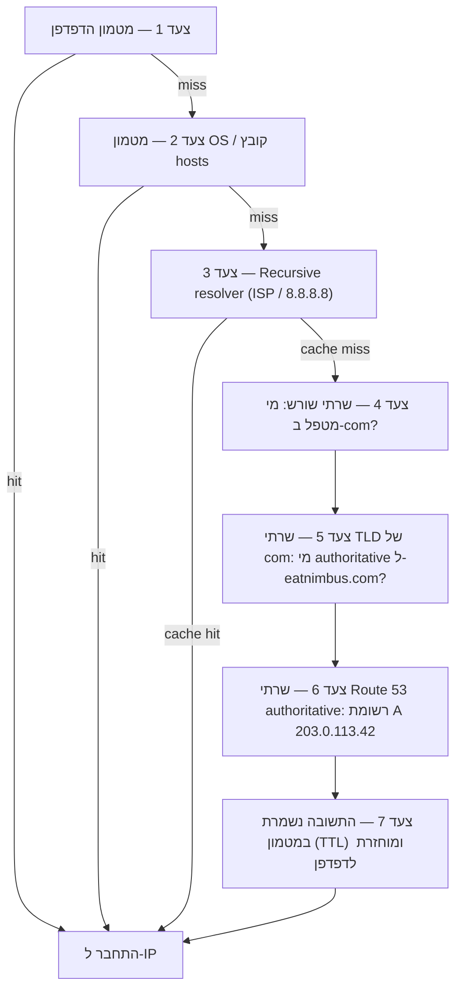

# פרק 12: כיצד האינטרנט מוצא אתכם

‏Maya רעננה את `nimbus-alb-123456789.us-west-2.elb.amazonaws.com` בדפדפן שלה עוד פעם אחת, ואז נשענה לאחור והסתכלה על התקרה. הדף נטען. האפליקציה עבדה. אבל בכל פעם שהיא שיתפה את הקישור עם שותף מסעדה, היא הרגישה מבוכה קטנה שלא ממש הצליחה לתת לה שם.

ה-URL הזה היה ארטיפקט טכני, לא מוצר.

---

*עיצוב הרשת מחדש מהפרק הקודם הלך טוב. כל משאב היה במקום הנכון — מאזני עומסים ב-subnets ציבוריים, מסדי נתונים נעולים בפרטיים. התשתית הייתה מאובטחת ומחולקת נכון. אבל כש-Nimbus התכוננה להשקה הציבורית הראשונה שלה, בעיה חדשה הופיעה: ה-URL של מאזן העומסים ש-AWS הקצתה אוטומטית נראה כמו מזהה מערכת, לא מוצר שאנשים יבטחו בו. הם היו צריכים שם דומיין אמיתי. והם היו צריכים להבין מה קרה בין הרגע שמישהו הקליד `eatnimbus.com` לרגע שהדף הופיע.*

---

‏Nimbus רצה. למאזן העומסים היה IP ציבורי. למופעי ה-EC2 היה IP פרטי. מסדי הנתונים היו נעולים ב-subnets פרטיים. Priya הנהנה בהסכמה על דיאגרמת הרשת.

‏Tom הסתכל על ה-URL של מאזן העומסים: `nimbus-alb-123456789.us-west-2.elb.amazonaws.com`.

"זה מה שלקוחות מקלידים בדפדפן שלהם?" שאל.

"זה מה ש-AWS מקצה אוטומטית," אמרה Maya.

"אני לא שם את זה על כרטיס ביקור."

"גם אני לא."

הם היו צריכים שם דומיין. הם קנו את `eatnimbus.com` מרשם דומיינים. עכשיו הם היו צריכים לחבר את השם הזה לתשתית ה-AWS שלהם.

"איך האינטרנט יודע ש-`eatnimbus.com` אומר מאזן עומסים ב-us-west-2?" שאל Leo.

שאלה טובה, Leo.

**אנלוגיית ספר הטלפונים**

לפני סמארטפונים, לכל עיר היה ספר טלפונים. אם רציתם להגיע ל"פיצה מריו", לא שיננתם את מספר הטלפון שלהם — חיפשתם את השם, קיבלתם את המספר, והתקשרתם.

לאינטרנט יש ספר טלפונים משלו: **מערכת שמות הדומיין (Domain Name System, DNS)**.

‏DNS מתרגם שמות קריאים לבני אדם (כמו `eatnimbus.com`) לכתובות IP קריאות למכונה (כמו `203.0.113.42`). בכל פעם שאתם מבקרים באתר, המחשב שלכם מחפש בשקט את שם הדומיין ב-DNS ומקבל את כתובת ה-IP להתחבר אליה.

אם שיניתם את כתובת ה-IP של השרת שלכם, הייתם מעדכנים את רשומת ה-DNS — כמו שינוי המספר שלכם בספר הטלפונים — והאינטרנט היה מוצא אתכם במיקום החדש שלכם.

**מסע פתרון ה-DNS המלא**

"אבל *איך* החיפוש באמת עובד?" שאל Leo. "כאילו, צעד אחר צעד. הדפדפן שלי יודע את השם `eatnimbus.com`. מה קורה אחר כך?"

רוב התיעוד מדלג על זה. זה חשוב.

כשהדפדפן שלכם צריך לפענח את `eatnimbus.com`, הנה כל קפיצה, לפי הסדר:

**צעד 1 — מטמון הדפדפן**: הדפדפן בודק אם הוא כבר פיענח את השם הזה לאחרונה. אם כן, הוא משתמש ב-IP שבמטמון. אם לא, ממשיכים.

**צעד 2 — מטמון מערכת ההפעלה / resolver מקומי**: מערכת ההפעלה שלכם בודקת את מטמון ה-DNS שלה ואת קובץ ה-`hosts` המקומי. אם נמצא, סיימנו. אם לא, היא מעבירה ל-resolver ה-DNS שהוגדר — בדרך כלל של ספק האינטרנט שלכם או resolver ציבורי כמו 8.8.8.8.

**צעד 3 — Recursive resolver**: ה-recursive resolver (ספק האינטרנט שלכם או 8.8.8.8 של Google) הוא הסוס העובד. גם לו יש מטמון. אם הוא יודע את התשובה, הוא מחזיר אותה מיד. אם לא, הוא מתחיל את שרשרת הפתרון בפועל.

**צעד 4 — שרתי שמות שורש (Root name servers)**: ה-recursive resolver יוצר קשר עם אחד מ-13 אשכולות שרתי השם השורש (פרוסים ברחבי העולם). שרת השורש לא יודע איפה `eatnimbus.com` נמצא. אבל הוא יודע מי מנהל את דומייני `.com` — שרתי ה-TLD של `.com`. הוא מחזיר את הכתובת שלהם.

**צעד 5 — שרתי שמות TLD (Top Level Domain)**: ה-recursive resolver יוצר קשר עם שרתי ה-TLD של `.com`. שרתי ה-TLD גם לא יודעים איפה `eatnimbus.com` נמצא. אבל הם יודעים אילו שרתי שם הם authoritative עבור `eatnimbus.com` — השרתים שבאמת מחזיקים את רשומות ה-DNS. הם מחזירים את הכתובות האלה.

**צעד 6 — שרתי שמות authoritative**: ה-recursive resolver יוצר קשר עם שרתי השם של Route 53 — שרתי השם ה-authoritative עבור `eatnimbus.com`. ל-Route 53 יש את הרשומות בפועל. הוא מחזיר את רשומת ה-A: `eatnimbus.com → 203.0.113.42`. התשובה הזו authoritative — זו התשובה האמיתית, לא תשובה ממטמון.

**צעד 7 — התשובה נשמרת במטמון ומוחזרת**: ה-recursive resolver שומר את התשובה במטמון למשך ה-TTL (Time-To-Live) של הרשומה. הוא מחזיר את ה-IP לדפדפן שלכם. הדפדפן שלכם שומר אותו במטמון. הדפדפן שלכם מתחבר.



"זה שבע קפיצות רק כדי למצוא כתובת IP," אמר Tom.

"בדרך כלל מתחת ל-100 אלפיות שנייה בסך הכל," אמרה Priya. "צעדים 3 עד 6 נשמרים במטמון באגרסיביות בכל רמה. עבור דומיינים פופולריים, צעדים 4 ו-5 — חיפושי השורש וה-TLD — לעיתים קרובות מדולגים לחלוטין כי ל-recursive resolver כבר יש את השרתים האלה במטמון. כל השרשרת בדרך כלל רצה ב-20–40 אלפיות שנייה."

"ואחרי החיפוש הראשון, מטמון הדפדפן אומר שבקשות עוקבות מדלגות על כל זה," הוסיף Leo.

"נכון. DNS מרגיש מיידי כי רוב החיפושים הם cache hits. השרשרת המלאה רצה רק כשרשומה חדשה או שה-TTL שלה פג."

**פגשו את Route 53**

‏Amazon Route 53 הוא שירות ה-DNS המנוהל של AWS. הוא נקרא Route 53 כי פורט 53 הוא פורט ה-DNS הסטנדרטי. (לפעמים AWS מעניקה שמות בצורה ישירה.)

‏Route 53 עושה כמה דברים:

**רישום דומיינים**: אתם יכולים לקנות שמות דומיין דרך Route 53 ישירות.

**אירוח DNS (hosted zones)**: אתם יוצרים *hosted zone* עבור הדומיין שלכם, ו-Route 53 מנהל את רשומות ה-DNS שמספרות לעולם איפה למצוא אתכם.

**בדיקות תקינות**: Route 53 יכול לנטר את ה-endpoints שלכם ולנתב תנועה הרחק מאלה הלא תקינים.

**מדיניות ניתוב תנועה**: Route 53 תומך במספר אסטרטגיות ניתוב מעבר ל-DNS פשוט — משוקלל, מבוסס-זמן תגובה, גיאו-מיקום, failover.

**רשומות DNS: ערכי ספר הטלפונים**

רשומת DNS ממפה שם ליעד. הסוגים הנפוצים ביותר:

**רשומת A**: ממפה שם לכתובת IPv4.
`eatnimbus.com → 203.0.113.42`

**רשומת AAAA**: ממפה שם לכתובת IPv6.

**רשומת CNAME**: ממפה שם לשם אחר (כינוי).
`www.eatnimbus.com → eatnimbus.com`

**רשומת MX**: מציינת אילו שרתים מטפלים בדואר אלקטרוני עבור הדומיין.

**רשומת TXT**: מאחסנת טקסט שרירותי. נמצאת בשימוש נפוץ לאימות דומיין (הוכחה שאתם הבעלים של הדומיין) ולאימות דואר אלקטרוני (SPF, DKIM).

עבור Nimbus, ההגדרה הראשית:

- `eatnimbus.com` → רשומת Alias שמצביעה על מאזן העומסים
- `www.eatnimbus.com` → CNAME שמצביע על `eatnimbus.com`
- `api.eatnimbus.com` → רשומת Alias שמצביעה על מאזן העומסים של ה-API

"רגע," אמר Tom. "ה-IP של מאזן העומסים יכול להשתנות. AWS אמרה זאת בתיעוד."

תפיסה טובה, Tom.

**רשומות Alias: הפתרון של AWS ל-IPs דינמיים**

למאזני עומסים, התפלגויות CloudFront ואתרי S3 יש שמות DNS, לא כתובות IP סטטיות. ה-IPs הבסיסיים יכולים להשתנות.

אם אתם יוצרים CNAME שמצביע על שם ה-DNS של מאזן עומסים, זה עובד — אבל אינכם יכולים להשתמש ב-CNAMEs עבור דומייני שורש (`eatnimbus.com` ללא ה-`www`) בגלל תקני DNS.

‏Route 53 פותר זאת עם **רשומות Alias** — הרחבה ספציפית ל-AWS של DNS. רשומת Alias ממפה שם ישירות למשאב AWS (מאזן עומסים, התפלגות CloudFront, אתר S3), ו-Route 53 מטפל בפתרון ה-IP הדינמי אוטומטית. ניתן להשתמש ברשומות Alias ברמת דומיין השורש. ובניגוד לשאילתות DNS רגילות לשירותים חיצוניים, שאילתות רשומת Alias למשאבי AWS הן חינמיות.

"אז אנחנו משתמשים ברשומת Alias עבור `eatnimbus.com` שמצביעה על מאזן העומסים," אישר Leo.

"ו-Route 53 מטפל בכל IP שמאזן העומסים משתמש בו בכל רגע נתון," הוסיפה Priya.

"בחינם," אמר Tom, פתאום מעוניין מאוד. הוא פתח את דף התמחור של Route 53. "ושאר זה?"

"חצי דולר לכל hosted zone," אמר Leo. "בתוספת בערך ארבעים סנט לכל מיליון שאילתות DNS. עבור התנועה שלנו עכשיו, כנראה מתחת לשני דולר בחודש."

‏Tom סגר את דף התמחור מרוצה.

**מדיניות ניתוב: יותר מסתם 'איפה זה?'**

כאן Route 53 נעשה מעניין. DNS אינו רק שירות חיפוש — הוא יכול להיות כלי ניהול תנועה.

**ניתוב פשוט**: רשומה אחת, יעד אחד. DNS סטנדרטי.

**ניתוב משוקלל**: פצלו תנועה בין מספר יעדים לפי משקל. שלחו 90% לשרת החדש, 10% לשרת הישן במהלך הגירה. התאימו את המשקלים עד שאתם בטוחים בשרת החדש, אז עברו ל-100%.

**ניתוב מבוסס-זמן תגובה**: נתבו משתמשים לאזור ה-AWS עם זמן התגובה הנמוך ביותר עבורם. משתמש בסיאטל מנותב ל-`us-west-2`. משתמש בטוקיו מנותב ל-`ap-northeast-1`. אותו שם דומיין, יעדים שונים.

**ניתוב גיאו-מיקום**: נתבו על בסיס המיקום הגיאוגרפי של המשתמש. כל המשתמשים האירופיים הולכים ל-`eu-west-1`. כל המשתמשים מצפון אמריקה הולכים ל-`us-east-1`. שימושי לריבונות נתונים (שמירת נתוני משתמש האיחוד האירופי באזורי האיחוד האירופי) או התאמת תוכן (שפה, מטבע). החלטות ניתוב משתמשות בגבולות קשיחים — משתמש נמצא במדינה, ביבשת, או במדינה אמריקאית, ולשם הוא הולך.

**ניתוב גיאו-קרבה (Geoproximity)**: מנתב תנועה על בסיס המיקום הגיאוגרפי של המשתמשים *וגם* מאפשר לכם להתאים את ההחלטות האלה עם ערך **bias** (הטיה). bias חיובי מרחיב את האזור הגיאוגרפי שמנותב למשאב — מושך יותר תנועה. bias שלילי מכווץ אותו. בניגוד לגיאו-מיקום, שמשתמש בגבולות מדינה ויבשת קשיחים, geoproximity הוא רציף: ערך bias קטן יכול להעביר תנועה בהדרגה מאזור אחד לאחר מבלי לצייר מחדש שום קווים קבועים.

התרחיש שמבחין בין השניים: אם חברה מהגרת בהדרגה מ-`us-east-1` ל-`us-west-2` ורוצה להעביר תנועה בהדרגה מערבה — לא להעיף מתג, אלא לחייג אותו לאורך זמן — geoproximity עם bias חיובי הולך וגדל על ה-endpoint המערבי הוא הכלי הנכון. גיאו-מיקום היה מנתב את כל משתמשי החוף המערבי לאורגון או לא; אין לו חוגה. מאז ינואר 2024, geoproximity זמין כמדיניות ניתוב רגילה ישירות על רשומות DNS (Console, API, CLI) — הוא כבר לא דורש Route 53 Traffic Flow, אם כי הוא נשאר זמין גם שם.

**ניתוב failover**: ייעדו endpoint ראשי ומשני. אם הראשי נכשל בבדיקת התקינות של Route 53, התנועה מופנית אוטומטית למשני. זוהי שכבת ה-DNS של התאוששות מאסון.

"רגע — אבל *למה* נגדיר ניתוב failover לאזור שני אם כבר יש לנו Multi-AZ?" שאלה Maya. "Multi-AZ לא אמור לטפל בכשלים?"

שאלה טובה. Multi-AZ מגן מפני כשל של אזור זמינות בודד בתוך אזור — אם מרכז נתונים אחד נופל, ה-standby באזור זמינות אחר משתלט. אבל מה אם אזור AWS שלם הופך לבלתי זמין? או מה אם יש שיבוש שירות ברמת אזור שלם? ניתוב failover של DNS פועל ברמה שונה: הוא מנתב תנועה הרחק מאזור שלם כשבדיקת התקינות של אותו אזור נכשלת. Multi-AZ הוא חוסן תוך-אזורי. failover של DNS הוא חוסן בין-אזורי.

**ניתוב Multivalue answer**: החזירו עד שמונה כתובות IP תקינות לשאילתה, מאפשרים ללקוח לבחור. חלופה פשוטה למאזן עומסים להפצת תנועה על פני מספר שרתים.

"אז Route 53 אינו רק ספר טלפונים," אמרה Maya. "הוא ספר טלפונים חכם שיכול לנתב שיחות על בסיס מאיפה אתם מתקשרים."

"ולנתק אתכם אם המספר לא תקין," הוסיפה Priya.

---

**ניתוב מבוסס-זמן תגובה בתוספת בדיקות תקינות: ניסוי מחשבתי**

‏Priya שרטטה תרחיש על הלוח. נניח שבסיס המשתמשים של החוף המזרחי של Nimbus המשיך לגדול, ויום אחד הצוות הקים ערימה קלה ב-`us-east-1` (צפון וירג'יניה) — לא הגדרת multi-region active-active מלאה, שהייתה יקרה ומורכבת, אלא מאזן עומסים וקבוצה לקריאה-בלבד של מופעי EC2 שמשרתים תוכן סטטי ודפי עיון. הזמנות עדיין היו הולכות מערבה למסד הנתונים הראשי ב-`us-west-2`. תנועת עיון — שהיוותה שבעים אחוז מהבקשות — יכלה להיות מוגשת מכל אחד מהחופים.

תצורת Route 53 עבור endpoint העיון הייתה נראית כך:

```
browse.eatnimbus.com
  → רשומת Latency: us-east-1 ALB (עם בדיקת תקינות, set-identifier "east")
  → רשומת Latency: us-west-2 ALB (עם בדיקת תקינות, set-identifier "west")
```

(שימו לב שהרשומה היא *hostname*, `browse.eatnimbus.com` — DNS מנתב שמות, לעולם לא נתיבי URL. ניתוב מבוסס-נתיב כמו `/browse` הוא תפקיד מאזן העומסים, לא של Route 53.)

עם ניתוב מבוסס-זמן תגובה, משתמש בסיאטל היה מפוענח ל-endpoint של `us-west-2`. משתמש בבוסטון היה הולך ל-`us-east-1`. Route 53 מודד זמן תגובה מהתשתית שלו לכל אזור באופן רציף ובוחר את המהיר יותר לכל משתמש.

"אבל מה אם לאזור המערב יש בעיה?" שאל Tom. "משתמשי העיון שלנו בסיאטל יהיו תקועים."

"בשביל זה בדיקות התקינות," אמרה Priya. "כל רשומת latency מקבלת בדיקת תקינות על מאזן העומסים שלה. אם בדיקת התקינות של `us-west-2` נכשלת שלוש בדיקות רצופות, Route 53 מפסיק להחזיר את הרשומה הזו — אפילו עבור משתמשים שעבורם אורגון בדרך כלל מהירה יותר. משתמשי סיאטל מנותבים מזרחה עד שאורגון מתאוששת."

"אז ניתוב מבוסס-זמן תגובה קובע איזה אזור מועדף בדרך כלל," אמרה Maya, "ובדיקות התקינות עוקפות את ההעדפה הזו אם האזור המועדף נופל?"

"בדיוק. מדיניות latency בוחרת את המנצח בתנאים רגילים. בדיקות התקינות מסירות מנצח שהפסיק לעבוד."

‏Leo חשב על תרחיש הכשל. "וה-TTL על הרשומות האלה?"

"שישים שניות," אמרה Priya. "שלוש בדיקות שנכשלו במרווחים של שלושים שניות כדי להפעיל אותו — עד תשעים שניות לזהות את הכשל — אז עד שישים שניות ל-resolvers של DNS לקלוט את השינוי."

"שתי דקות וחצי במקרה הגרוע," אמר Leo.

"וזו הסיבה שמורידים TTL לפני שאכפת לך ממנו, לא אחרי."

השילוב הזה — ניתוב מבוסס-זמן תגובה עם בדיקות תקינות על כל רשומה — הוא אחת מתצורות Route 53 העוצמתיות ביותר לפריסות רב-אזוריות. משתמשים תמיד הולכים לאזור התקין המהיר ביותר. המערכת מרפאת את עצמה כשלאזור יש בעיות. וכל הדבר הוא DNS: ללא תשתית נוספת, ללא שרתי proxy, ללא מאזני עומסים בין אזורים.

---

**תקרית כשל בדיקת התקינות**

סביבת ה-staging של Nimbus נתנה להם הדגמה מקרית של ניתוב failover.

הם הגדירו בדיקות תקינות של Route 53 על מאזן העומסים של ה-staging כמבחן — בודקים את endpoint ה-`/health` כל 30 שניות. באחר צהריים של יום שישי אחד, Leo דחף פריסה ל-staging שהיה בה באג: endpoint התקינות התחיל להחזיר שגיאות 500. זה עבר את הבדיקות המקומיות שלו אבל נשבר על השרת.

‏Route 53 ציין את הכשלים. אחרי שלוש בדיקות שנכשלו ברצף, הוא סימן את ה-endpoint כלא תקין. רשומת ה-failover הופעלה, מנתבת תנועת staging לדף נסיגה לקריאה-בלבד שאמר "תחזוקה בעיצומה".

ההתראה הראשונה של Leo הייתה הודעת Slack ממהנדס QA: "Staging מציג את דף התחזוקה."

‏Leo בדק את הפריסה. שגיאות ה-500 היו ברורות בלוגים. הוא גלגל את הפריסה אחורה. בתוך 90 שניות מרגע ש-endpoint התקינות החזיר 200, Route 53 העריך מחדש את הבדיקה, ראה שלוש הצלחות רצופות, והחזיר תנועה למאזן העומסים של ה-staging. דף התחזוקה נעלם.

זמן כולל על דף התחזוקה: שבע דקות.

"זו הייתה המערכת עובדת נכון," אמרה Priya.

"אני יודע," אמר Leo. "החלק המפחיד הוא לחשוב על מה שהיה קורה בלי בדיקת התקינות. שגיאות ה-500 היו הולכות למשתמשים אמיתיים."

"בייצור, בדיקת התקינות הייתה עושה failover לאזור המשני או לדף השגיאה הסטטי. משתמשים היו רואים חוויה מתוחזקת במקום שגיאות."

"כמה זמן failover באמת לוקח?" שאלה Maya. "מרגע שבדיקת התקינות נכשלת ועד שה-DNS מתחיל לנתב אחרת?"

"מרווח בדיקת התקינות הוא 30 שניות כברירת מחדל. שלושה כשלים רצופים כדי להפעיל את ה-failover. זה עד 90 שניות לזהות את הבעיה. אז TTL של DNS — אם זה 60 שניות, ההתפשטות היא עוד דקה."

"אז במקרה הגרוע, בערך שלוש דקות?"

"בערך. וזו הסיבה שאתם רוצים את ה-TTL נמוך על רשומות קריטיות, ואת מרווח בדיקת התקינות קצר ככל שהתקציב שלכם מאפשר."

---

**בדיקות תקינות: ניתוב סביב כשל**

"ומה אם מישהו ינסה לפרוץ?" אמרה Priya. "DNS הוא ציבורי. כל אחד יכול לחפש לאן `eatnimbus.com` מצביע. זה אומר שתוקף יודע בדיוק לאיזה IP לכוון."

"זה נכון," אמר Leo. "אבל ה-IP שהם מוצאים הוא ה-IP של מאזן העומסים. ה-ALB הוא הדבר היחיד עם כתובת ציבורית. כל מה שמאחוריו — EC2, RDS, ElastiCache — נמצא ב-subnets פרטיים. DNS אומר להם את הדלת הקדמית. הוא לא אומר להם מה מאחוריה."

‏Route 53 יכול לנטר את ה-endpoints שלכם עם בדיקות תקינות. אם endpoint נכשל, Route 53 יכול:

- להסיר אותו מתשובות DNS (להפסיק לשלוח לשם תנועה)
- להפעיל failover ל-endpoint גיבוי
- לשלוח התראה דרך CloudWatch

בדיקות תקינות הן הקישור בין ניתוב DNS לתקינות יישום בפועל. בתצורת failover: Route 53 מנטר את ה-endpoint הראשי כל 30 שניות. אם שלוש בדיקות רצופות נכשלות, Route 53 מתחיל להחזיר את כתובת ה-endpoint המשני. אף אחד מהמספרים האלה אינו קבוע: 30 שניות הוא המרווח הסטנדרטי (אפשרות "מהירה" בתשלום בודקת כל 10 שניות), וסף הכשל מוגדר כברירת מחדל ל-3 בדיקות רצופות אך ניתן להגדרה מ-1 עד 10.

זה לא מיידי — ל-DNS יש זמן התפשטות. ברגע ש-Route 53 משנה רשומת DNS, resolvers של DNS ברחבי העולם צריכים לקלוט את השינוי, מה שיכול לקחת שניות עד דקות בהתאם להגדרות ה-TTL.

**TTL: מטמון ה-DNS**

תשובות DNS נשמרות במטמון במספר רמות — בנתב שלכם, אצל ספק האינטרנט שלכם, בדפדפן שלכם. ה-**TTL (Time-To-Live)** על רשומת DNS אומר למטמונים כמה זמן לזכור את התשובה לפני בדיקה חוזרת.

‏TTL גבוה (שעה או יותר): פחות שאילתות DNS, פחות עומס על Route 53, אבל שינויים לוקחים יותר זמן להתפשט.

‏TTL נמוך (60 שניות או פחות): שינויים מתפשטים במהירות, אבל יותר שאילתות DNS נדרשות.

לפני הגירה מתוכננת (עדכון DNS להצביע על שרת חדש), הורידו את ה-TTL ל-60 שניות יום מראש. אז כשאתם עושים את השינוי, הוא מתפשט בערך בדקה. אחרי ההגירה, העלו אותו בחזרה לערך הרגיל.

"כבר פרסתי את זה — אה." Leo עדכן את רשומת ה-DNS לפני שהוריד את ה-TTL. הוא הבין את הטעות שלו והתחיל לספור: ה-TTL הישן היה שעה. חלק מהמשתמשים יקבלו את השרת הישן בשישים הדקות הבאות.

"אם אנחנו פשוט מורידים אותו במהלך ההגירה ולא לפני," אמר Leo לאט, "ה-TTL הישן אומר שחלק מהמשתמשים יראו את השרת הישן במשך שעה."

"בדיוק," אמרה Priya. "הגירות DNS דורשות תכנון לפני ההגירה, לא רק במהלכה."

אולי אתם תוהים: אם TTL מוגדר לשעה, האם זה אומר שכל משתמש יחכה שעה מלאה אחרי שינוי DNS לפני שיראה את השרת החדש? לא בדיוק. TTL אומר ש-resolvers לא יבדקו מחדש עד שה-TTL פג. אם ה-resolver של DNS של משתמש שמר את הערך הישן לפני 55 דקות עם TTL של שעה, הוא יקבל את הערך החדש בעוד 5 דקות. אם הוא שמר אותו לפני 5 דקות, הוא יחכה 55 דקות. בממוצע, משתמשים רואים את השינוי בתוך מחצית ממשך ה-TTL. זו הסיבה שהורדת TTL מראש כל כך חשובה: היא מכווצת את חלון ההתפשטות במקרה הגרוע לפני שהשינוי מתרחש.

---

**Private Hosted Zones: DNS פנימי**

‏Priya העלתה דרישה חדשה שבועיים אחרי שהדומיין הציבורי עלה.

"מופעי ה-EC2 שלנו צריכים להגיע למסד הנתונים," אמרה. "כרגע הם משתמשים בשם ה-DNS של endpoint ה-RDS — `nimbus-prod.abc123.us-west-2.rds.amazonaws.com`. זה עובד, אבל זה שם DNS ציבורי. אם אי פעם נרצה לשנות את תצורת מסד הנתונים שלנו, כל קבצי תצורת היישום צריכים עדכון."

"היינו יכולים להשתמש בשם DNS פרטי," אמר Leo. "כמו `db.nimbus.internal`. משהו שהשירותים שלנו משתמשים בו פנימית שממופה ל-endpoint מסד הנתונים הנוכחי."

"בדיוק. Route 53 private hosted zones."

**private hosted zone** היא דומיין DNS שמפוענח רק בתוך ה-VPC שלכם. שאילתות DNS חיצוניות עבור `nimbus.internal` לא מקבלות תשובה. אבל מתוך ה-VPC, `db.nimbus.internal` מפוענח ל-endpoint של ה-RDS.

הם הגדירו את זה:

- private hosted zone: `nimbus.internal`
- רשומת CNAME: `db.nimbus.internal → nimbus-prod.abc123.us-west-2.rds.amazonaws.com`
- רשומת CNAME: `cache.nimbus.internal → nimbus-cache.abc123.usw2.cache.amazonaws.com`
- רשומת A: `api.nimbus.internal → 10.0.10.5` (IP פנימי של EC2 — רשומות A ממפות שמות לכתובות IP; CNAMEs ממפים שמות לשמות אחרים. בסדר כאן כי המופע הזה שומר IP פרטי סטטי; עבור כל דבר מאחורי Auto Scaling הייתם מצביעים על מאזן עומסים במקום)

עכשיו תצורת היישום קראה:

```
DATABASE_HOST=db.nimbus.internal
CACHE_HOST=cache.nimbus.internal
```

כשהם הגרו למופע RDS חדש, הם עדכנו רשומת DNS אחת. לא נדרשה פריסת יישום.

"זו גם הסיבה ש-DNS פרטי חשוב במהלך הגירת מסד נתונים," אמרה Priya. "אתם מעדכנים את `db.nimbus.internal` להצביע על ה-endpoint החדש. תנועה עוברת. ה-endpoint הישן נשאר זמין במהלך חלון ה-TTL. אין שינויי תצורת יישום."

**סיפור דיבוג ה-DNS הפנימי**

שלושה שבועות מאוחר יותר, Leo פרס שירות חדש — worker רקע — והוא לא יכל להגיע למסד הנתונים. ה-worker היה באותו VPC, אותו subnet פרטי כמו שרתי ה-API. שרתי ה-API יכלו להגיע למסד הנתונים. ה-worker לא יכל.

הוא בדק את ה-security groups. ל-security group של ה-worker היה כלל יוצא ל-PostgreSQL. ל-security group של מסד הנתונים היה כלל נכנס מ-security group של ה-worker. הכל נראה נכון.

הוא הריץ `nslookup db.nimbus.internal` ממופע ה-worker.

אין תשובה.

"חיפוש ה-DNS נכשל," אמר ל-Priya.

היא הסתכלה על תצורת ה-VPC של מופע ה-worker. "באיזה VPC ה-worker באמת נמצא? Private hosted zones משויכים ל-VPCs — אם המופע אינו ב-VPC משויך, הזון פשוט לא קיים עבורו."

"הוא ב-VPC הראשי. כמו כל השאר."

"באמת?"

‏Private hosted zones חייבים להיות משויכים במפורש לכל VPC שהם משרתים — השיוך הוא לכל VPC, לעולם לא לכל subnet. Priya שייכה את ה-VPC הראשי כשיצרה את הזון. אבל Leo בטעות פרס את ה-worker לתוך VPC מבחן שיצר לניסוי אחר. VPC שונה. לא משויך ל-private hosted zone.

"ה-worker נמצא ב-VPC הלא נכון," אמרה Priya.

"כבר פרסתי את זה — אה." Leo העביר את ה-worker ל-VPC הנכון. ה-DNS פוענח. ה-worker התחבר למסד הנתונים.

"VPC אחד," אמר Leo, רושם הערה. "אלא אם יש לנו סיבה ליותר מאחד."

---

**DNSSEC: אימות תשובות DNS**

"חשבנו על זיוף DNS (DNS spoofing)?" שאלה Priya. "מה אם מישהו מיירט את שאילתת ה-DNS שלנו ומחזיר IP מזויף? הדפדפנים של המשתמשים שלנו היו מתחברים לשרת של התוקף במקום לשלנו."

**DNSSEC (DNS Security Extensions)** פותר זאת על ידי חתימה קריפטוגרפית של רשומות DNS. כשתשובת DNS כוללת חתימת DNSSEC, ה-resolver יכול לוודא שהתשובה הגיעה משרת השם ה-authoritative ולא שונתה.

‏Route 53 תומך בחתימת DNSSEC עבור hosted zones ציבוריים. התהליך כולל:

1. הפעלת DNSSEC על ה-hosted zone ב-Route 53
2. Route 53 מייצר key signing key (KSK) המאוחסן ב-KMS
3. Route 53 חותם על כל הרשומות עם ה-zone signing key
4. אתם מוסיפים רשומת DS (Delegation Signer) ברשם הדומיין האב (.com TLD)
5. resolvers שתומכים ב-DNSSEC יכולים עכשיו לוודא את האותנטיות של תשובות

"כמה נפוץ זיוף DNS?" שאל Leo.

"על האינטרנט הציבורי, נדיר אבל אפשרי," אמרה Priya. "רוב ה-resolvers של ספקי האינטרנט תומכים באימות DNSSEC היום. הפעלת DNSSEC לא עולה כלום ומוסיפה שכבה משמעותית של אותנטיות."

"כמה זה עולה בחודש?" שאל Tom.

"הפעלת חתימת DNSSEC עצמה חינמית ב-Route 53," אמרה Priya. "העלות האמיתית היחידה היא מפתח ה-KMS שמחזיק את ה-key-signing key: $1/חודש, בתוספת קריאות API של KMS — ומפתח אחד יכול להיות משותף על פני מספר hosted zones. ההגנה מפני התקפות חטיפת DNS היא למעשה חינמית בקנה המידה שלנו."

‏Tom הפעיל את זה לפני ארוחת הצהריים.

---

**Route 53 Resolver: DNS היברידי**

כש-Nimbus בסופו של דבר חיברה את ה-VPC של AWS שלה לרשת הפיתוח ה-on-premises שלהם דרך VPN, בעיה חדשה צצה: השרתים ה-on-premises היו צריכים לפענח שמות DNS פרטיים של AWS (כמו `db.nimbus.internal`), ומשאבי AWS היו צריכים לפענח hostnames של on-premises (כמו `jenkins.corp.nimbus.local`).

פתרון DNS לא חוצה גבולות רשת כברירת מחדל. משאבי AWS מפענחים DNS באמצעות Route 53 Resolver (מובנה בכל VPC). שרתי on-premises משתמשים בשרתי ה-DNS שלהם. אף אחד מהם לא יכול לראות את הרשומות של השני.

**Route 53 Resolver Endpoints** מגשרים על הפער הזה:

**Endpoints נכנסים**: שרתי DNS של on-premises יכולים להעביר שאילתות עבור זוני DNS המתארחים ב-AWS ל-IP של endpoint נכנס ב-VPC שלכם. Route 53 Resolver מטפל בשאילתה ומחזיר את התוצאה.

**Endpoints יוצאים**: כשמופעי EC2 צריכים לפענח hostnames של on-premises, Resolver מעביר את השאילתות האלה לשרתי DNS של on-premises דרך ה-endpoint היוצא.

"אז זה כמו שירות תרגום," אמרה Maya. "ה-DNS של AWS שלכם וה-DNS של on-premises שלכם לא מדברים ישירות זה עם זה. ה-Resolver endpoints פועלים כמתווכים."

"בדיוק. השרתים ה-on-premises שלכם יכולים עכשיו לפענח `db.nimbus.internal`. מופעי ה-EC2 שלכם יכולים לפענח `jenkins.corp.nimbus.local`. שני הצדדים רואים שמות DNS משני העולמות."

עבור Nimbus, זה הפך לרלוונטי כשצוות הפיתוח רצה להריץ בדיקות אינטגרציה מהמשרד שלהם כנגד סביבת staging ב-AWS. ללא Resolver endpoints, הם היו עורכים ידנית קבצי hosts. איתם, DNS פנימי פשוט עבד על פני ה-VPN.

הארכיטקטורה ל-Resolver endpoints:

- **Endpoint נכנס**: שני ENIs (Elastic Network Interfaces) שנוצרים בשני אזורי זמינות שונים ב-VPC שלכם. כל אחד מקבל IP פרטי. אתם מגדירים את שרת ה-DNS של ה-on-premises שלכם להעביר שאילתות עבור הזונים המתארחים ב-AWS שלכם ל-IPs האלה. התנועה נוסעת דרך ה-VPN או Direct Connect שלכם.
- **Endpoint יוצא**: שני ENIs בשני אזורי זמינות. אתם יוצרים כללי העברה: "שאילתות עבור `corp.nimbus.local` הולכות ל-IPs האלה של שרתי DNS של on-premises." מופעי EC2 משתמשים אוטומטית ב-Resolver, שמתייעץ עם כללי ההעברה שלכם ושולח את השאילתה ל-on-premises.

"למה שני ENIs לכל endpoint?" שאל Leo.

"זמינות גבוהה," אמרה Priya. "אם אזור זמינות אחד מאבד קישוריות רשת, ה-IP של ה-endpoint האחר עדיין עובד. אותו עיקרון כמו NAT Gateways."

"כמה זה עולה בחודש?" שאל Tom.

‏Resolver endpoints עולים בערך $0.125 לשעה **לכל elastic network interface**, וכל endpoint דורש לפחות שני ENIs לזמינות — אז רצפה ריאלית היא בערך $180 בחודש לכל endpoint, בתוספת $0.40 לכל מיליון שאילתות DNS. עבור צוות שמשתמש ב-DNS היברידי כדי לפענח שמות פנימיים, העלות צנועה — ומבטלת את הצורך לתחזק קבצי hosts על פני מספר מכונות מפתחים ומערכות CI/CD.

"היינו יכולים פשוט לשים את ה-hostnames בקבצי ה-hosts," הציע Leo.

"בכל מכונת מפתח, כל CI runner, כל onboarding חדש," אמרה Priya. "בכל פעם שמשהו משתנה."

"ה-endpoint שווה את זה," אמר Leo.

"הוא כן."

## חוזקות ומגבלות

**Route 53 הוא הבחירה הנכונה ל**: רישום וניהול שמות דומיין לחלוטין בתוך AWS; ניתוב תנועה על בסיס זמן תגובה, גיאו-מיקום, או הפצה משוקללת על פני מספר endpoints; failover מבוסס-בדיקת-תקינות בין אזורים או בין endpoint ראשי לאחד של התאוששות מאסון; שילוב DNS עם שירותי AWS אחרים דרך רשומות alias; private hosted zones לגילוי שירותים פנימי.

**מתי Route 53 אינו מה שאתם צריכים**: Route 53 הוא שירות DNS, לא מאזן עומסים. אם אתם צריכים להפיץ תנועה בין מספר שרתים או containers בתוך אזור, השתמשו ב-Application Load Balancer — Route 53 לא יכול לעשות round-robin משוקלל ברמת החיבור כמו שמאזן עומסים יכול. ניתוב מבוסס-זמן תגובה על פני אזורים מוסיף עלות ומורכבות תפעולית שמשתלמת רק כשהמשתמשים שלכם באמת מבוזרים גלובלית ואלפיות שנייה חשובות להמרה. עבור רוב היישומים החד-אזוריים, רשומת Alias בודדת שמצביעה על ALB היא כל תצורת Route 53 שאתם צריכים.

## סיכום

המעבר מ-`nimbus-alb-123456789.us-west-2.elb.amazonaws.com` ל-`eatnimbus.com` הרגיש כמו דבר קטן. הוא לא היה. DNS היא מערכת הכתובות שכל האינטרנט רץ עליה, ו-Route 53 נותן לכם כלים להשתמש במערכת הזו לא רק לחיפושים, אלא לניהול תנועה ולחוסן.

- **DNS** מתרגם שמות דומיין לכתובות IP — ספר הטלפונים של האינטרנט.
- **Route 53** הוא שירות ה-DNS המנוהל של AWS: רישום דומיינים, אירוח DNS, בדיקות תקינות ומדיניות ניתוב.
- **רשומות A** ממפות שמות לכתובות IPv4. **CNAMEs** ממפים שמות לשמות אחרים. **רשומות Alias** ממפות שמות למשאבי AWS (מאזני עומסים, CloudFront, S3).
- השתמשו ברשומות Alias (לא CNAMEs) עבור דומייני שורש ועבור משאבים עם IPs דינמיים.
- מדיניות ניתוב חורגת מ-DNS פשוט: **משוקלל** (פיצול תנועה), **מבוסס-זמן תגובה** (ביצועים), **גיאו-מיקום** (ריבונות נתונים — גבולות מדינה/יבשת קשיחים), **geoproximity** (מבוסס-מרחק עם חוגת bias — העברת תנועה הדרגתית), **failover** (התאוששות מאסון).
- **Private hosted zones** מספקים DNS פנימי למשאבי VPC — תקשורת שירות-לשירות לפי שם, לא IP מקודד.
- **DNSSEC** חותם קריפטוגרפית על רשומות, מגן מפני זיוף DNS.
- **Route 53 Resolver Endpoints** מגשרים על רשתות היברידיות — DNS של AWS ו-on-premises יכולים לפענח את השמות זה של זה.

## טיפים למבחן

*SAA-C03 דומיין: עיצוב ארכיטקטורות בעלות ביצועים גבוהים (דומיין 3, משימה 3.4)*

- **Alias לעומת CNAME**: ניתן להשתמש ברשומות Alias בדומיין השורש; CNAMEs לא. רשומות Alias למשאבי AWS חינמיות; שאילתות DNS של CNAME מתומחרות. כשהבחינה שואלת על מיפוי דומיין שורש למאזן עומסים ← רשומת Alias.
- **מקרי שימוש של מדיניות ניתוב** (תרחישי בחינה נפוצים):
  - "הגר תנועה בהדרגה לגרסה חדשה" ← ניתוב משוקלל
  - "נתב משתמשים לאזור ה-AWS הקרוב ביותר" ← ניתוב מבוסס-זמן תגובה
  - "שמור נתוני משתמש האיחוד האירופי באזורי האיחוד האירופי" ← ניתוב גיאו-מיקום
  - "failover אוטומטי של DNS כשהראשי נופל" ← ניתוב failover עם בדיקות תקינות
  - "העבר תנועה בהדרגה לאזור חדש" או "הגדל תנועה שנמשכת לפריסת האיחוד האירופי שלנו" ← ניתוב geoproximity עם bias חיובי
- **Geoproximity לעומת Geolocation:** Geolocation מנתב לפי מדינה/יבשת של המשתמש עם גבולות קשיחים. Geoproximity מנתב לפי מרחק גיאוגרפי עם bias שניתן להגדרה — השתמשו בו כשאתם צריכים להעביר תנועה בהדרגה לאזור חדש או למשוך יותר משתמשים לפריסה ספציפית. זמין כמדיניות ניתוב רגילה על רשומות מאז ינואר 2024 (Traffic Flow כבר לא נדרש).
- **בדיקות תקינות של Route 53**: יכולות לבדוק endpoints של HTTP/HTTPS/TCP, ויכולות להפעיל התראות CloudWatch. הבחינה משתמשת בהן בתרחישי התאוששות מאסון.
- **TTL והתפשטות**: דעו ש-TTL שולט כמה זמן resolvers של DNS שומרים רשומה במטמון. TTL קצר = שינויים מהירים יותר. תרחיש בחינה: "הצוות עדכן DNS אבל משתמשים עדיין פוגעים בשרת הישן" ← TTL גבוה מדי.
- **Private hosted zones**: Route 53 יכול ליצור רשומות DNS שמפוענחות רק בתוך VPC. הבחינה משתמשת בזה לגילוי שירותים פנימי (לדוגמה, `database.internal` שמפוענח ל-endpoint RDS פרטי).
- Route 53 הוא **גלובלי** — הוא לא נפרס באזור. אין צורך בבחירת אזור ביצירת hosted zones.
- **Route 53 Resolver Endpoints**: משמשים בתרחישים היברידיים שבהם DNS של on-premises ו-AWS צריכים לפענח את השמות זה של זה. Endpoint נכנס עבור on-premises ← AWS. Endpoint יוצא עבור AWS ← on-premises.

## תרגילים

**תרגיל 1 — היזכרות**

הסבירו את ההבדל בין רשומת CNAME לרשומת Alias. מתי הייתם משתמשים בכל אחת?

*(רמז: שקלו את המגבלות על CNAME בדומייני שורש, ואת ההתנהגות של רשומות Alias עם משאבי AWS דינמיים.)*

**תרגיל 2 — תרחיש SAA-C03**

*תרחיש*: חברת מדיה מפעילה אתר משני אזורי AWS: `us-east-1` (ראשי) ו-`eu-west-1` (משני). הצוות רוצה שתנועה תנותב אוטומטית ל-`eu-west-1` אם האזור הראשי הופך לבלתי זמין. החברה גם רוצה לוודא שמנגנון ה-failover הזה עובד נכון מבלי להפיל בפועל את האזור הראשי.

איזו תצורת Route 53 עונה בצורה הטובה ביותר על דרישות אלה?

A) ניתוב משוקלל עם משקל 100% על `us-east-1` ומשקל 0% על `eu-west-1`  
B) ניתוב מבוסס-זמן תגובה עם בדיקות תקינות על שני ה-endpoints  
C) ניתוב failover עם בדיקת תקינות על ה-endpoint הראשי ורשומה משנית שמצביעה על `eu-west-1`  
D) ניתוב גיאו-מיקום עם צפון אמריקה שמצביעה על `us-east-1` ואירופה שמצביעה על `eu-west-1`

**רמז 1**: הדרישה היא failover אוטומטי כשהראשי נופל. איזו מדיניות ניתוב מתוכננת בדיוק לזה?

**רמז 2**: "בדוק מבלי להפיל את האזור הראשי" — בדיקות תקינות ניתן להגדיר ידנית כ"לא תקין" לבדיקה.

**רמז 3**: ניתוב מבוסס-זמן תגובה מבצע אופטימיזציה למהירות, לא ל-failover.

**תשובה**: C

**הסבר**: ניתוב failover מתוכנן בדיוק למקרה שימוש זה. הרשומה הראשית מצביעה על `us-east-1` עם בדיקת תקינות. הרשומה המשנית מצביעה על `eu-west-1`. אם בדיקת התקינות נכשלת, Route 53 מגיש אוטומטית את הרשומה המשנית. בדיקות תקינות ניתן לאלץ ידנית להיכשל לצורך בדיקה מבלי לשבש בפועל את האזור הראשי.

**למה לא A?** ניתוב משוקלל עם 100%/0% הוא למעשה סטטי — הוא לא עובר אוטומטית כשהראשי נכשל.

**למה לא B?** רשומות latency *עם בדיקות תקינות* אכן מפסיקות להחזיר endpoint לא תקין, אז B הייתה שורדת השבתה אמיתית. אבל היא משנה את דפוס התנועה הרגיל (משתמשים היו מפוצלים על פני אזורים לפי זמן תגובה, לא ראשי/משני כנדרש) ואין לה דרך נקייה *לבדוק* failover: היית צריך באמת להכשיל את בדיקת התקינות של הראשי בייצור. ניתוב failover ממדל את הכוונה המוצהרת — ראשי מיועד, משני מיועד, ניתן לבדיקה על ידי אילוץ מצב בדיקת התקינות.

**למה לא D?** ניתוב גיאו-מיקום מנתב לפי מיקום המשתמש, לא לפי תקינות ה-endpoint. משתמשים אירופים היו תקועים על `eu-west-1` אפילו אם `us-east-1` תקין, ומשתמשים מצפון אמריקה לא היו עושים failover ל-`eu-west-1` אפילו אם `us-east-1` נופל.

*SAA-C03 דומיין: עיצוב ארכיטקטורות בעלות ביצועים גבוהים — משימה 3.4*

**תרגיל 3 — אתגר ארכיטקטורה** *(אופציונלי)*

‏Nimbus מתרחבת בינלאומית. הם רוצים ש-`eatnimbus.com` ייטען במהירות עבור משתמשים בחוף המערבי, בחוף המזרחי ובאוסטרליה. יש להם גם דרישה רגולטורית: הזמנות שמבצעים משתמשים אירופים חייבות להיות מעובדות על ידי שרתים באיחוד האירופי.

תכננו אסטרטגיית ניתוב Route 53 שמטפלת בשתי הדרישות. באיזו מדיניות ניתוב או שילוב של מדיניות הייתם משתמשים? איזו תשתית בכל אזור הייתם צריכים?

*(אין תשובה נכונה אחת. המטרה היא לתרגל עיצוב ניתוב רב-אזורי.)*

## סצנה לאחר הקרדיטים

‏`eatnimbus.com` עלה לאוויר.

‏Maya הקלידה אותו בדפדפן שלה, ודף ההזמנות של Nimbus נטען. היא הזמינה ארפה ממסעדת המשפחה שלה, רק כדי לבדוק את הזרימה. ההזמנה עברה. המטבח קיבל אותה.

היא נשענה לאחור.

‏Tom כבר קרא את לוגי בדיקות התקינות של Route 53. "זמן התגובה הוא 18 אלפיות שנייה מהבודקים של us-west-2."

"זה מהיר?" שאלה Maya.

"ל-DNS? כן. גם למשתמשי סיאטל — הם למעשה ממש ליד אורגון."

"אבל למשתמש בבוסטון?"

‏Tom הסתכל על גרף זמן התגובה. "בערך 80 אלפיות שנייה."

‏Maya חשבה על זה. "אם השותפים שלנו בחוף המזרחי ימשיכו לגדול, והשרתים שלנו באורגון..."

"כל בקשה נוסעת מבוסטון לאורגון ובחזרה," אמר Leo מהצד השני של החדר. "מהירות האור. אי אפשר לנצח את הפיזיקה."

"אז אנחנו צריכים שרתים קרובים יותר לבוסטון."

"או משהו קרוב יותר לבוסטון שמשרת תוכן בשמם."

המחשבה הזו נתלתה באוויר.

בפרק הבא: המחסנים ששמים את התוכן של Nimbus במרחק אלפית שנייה מכל משתמש, בכל מקום.
