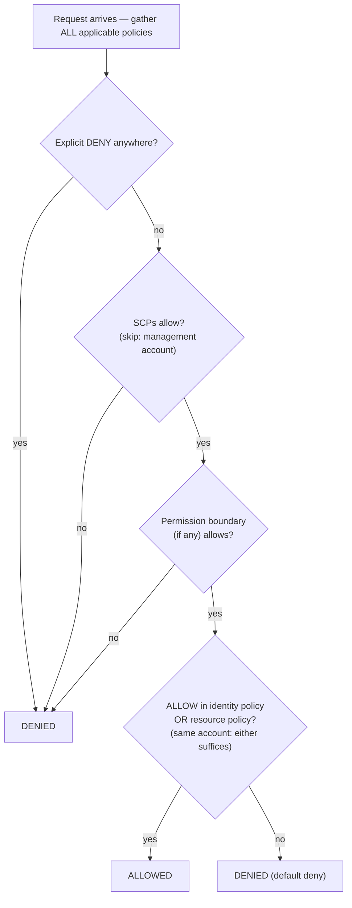

# פרק 14: מי רשאי לעשות מה

המהנדסים החדשים התחילו ביום שני. ‏Soo-Jin ו-Rafael. ‏Maya חשבה על השבוע הראשון שלהם — למה הם יזדקקו לגישה, למה הם לא צריכים לגעת, והאם תצורת ה-IAM הנוכחית הייתה בכלל מוכנה להתרחב לעוד שני אנשים.

היא ישבה עם קפה לפני שהמשרד התמלא, ועשתה רשימה.

---

*‏CloudFront נפרס. אחוזי cache hit היו טובים. הביצועים עלו. אבל כשהצוות התכונן לקלוט מהנדסים חדשים, צצה בעיה שקטה: תצורת ה-IAM נבנתה על ידי אנשים בחיפזון. מפתחות גישה היו בקבצי תצורה. לחלק מהתפקידים היו יותר הרשאות ממה שהם נזקקו להן. ושני אנשים חדשים עמדו לקבל אישורים למערכת ייצור שלא תוכננה עם מספר משתמשים בראש.*

---

‏Tom פתח את מפתחות הגישה בקובץ טקסט, מוכן להדביק.

"מה אתה עושה?" שאלה Priya.

"מכונת ה-EC2 צריכה לקרוא קבצי תצורה מ-S3. אני שם את האישורים בתצורת השרת."

היא הסתכלה על המסך לרגע. "תסגור את הקובץ הזה."

"רק רציתי—"

"אם מישהו נכנס לשרת הזה," אמרה, "הוא מקבל את המפתחות האלה. והמפתחות האלה נוגעים בכל מה שמשתמש ה-IAM מורשה לגעת בו. שזה כנראה יותר מ-S3 בלבד."

‏Tom סגר את הקובץ.

"יש דרך טובה יותר," אמרה. "השרת עצמו יכול להיות בעל תפקיד. תחשוב על זה כמו תפקיד עבודה — המכונה לא צריכה אישורים כי המערכת כבר יודעת מה היא ומה היא מורשית לעשות."

‏Tom נראה ספקן. "אז השרת מאמת את עצמו?"

"כן. בלי סיסמה. בלי מפתחות בקובץ תצורה. בלי שום דבר שאפשר בטעות לבצע commit ל-git."

החלק האחרון הזה קלע. ‏Tom כמעט ביצע commit של מפתח גישה למאגר בעצמו לפני שבועיים — תפס את זה ב-diff בשנייה האחרונה. הוא פתח כרטיסיית דפדפן חדשה.

**חזרה ל-IAM: התמונה המלאה**

פרק 3 הציג את IAM: משתמשים, קבוצות, תפקידים, ומדיניויות. עכשיו הזמן להעמיק.

מדיניויות IAM הן מסמכי JSON שמציינים אילו פעולות מותרות או אסורות על אילו משאבים. הן נראות כך:

```json
{
  "Version": "2012-10-17",
  "Statement": [
    {
      "Effect": "Allow",
      "Action": [
        "s3:GetObject",
        "s3:PutObject"
      ],
      "Resource": "arn:aws:s3:::nimbus-assets/*"
    }
  ]
}
```

מדיניות זו מאפשרת קריאה וכתיבה של אובייקטים בדלי `nimbus-assets`, ושום דבר אחר. לא מחיקה. לא רישום דליים. לא שום פעולת S3 אחרת. לא שום שירות AWS אחר.

זוהי הדרך הנכונה להעניק הרשאות: פעולות ספציפיות, משאבים ספציפיים.

**הבעיה עם "Administrator Access"**

מדיניויות מנוהלות של AWS כמו `AdministratorAccess` מתוכננות להתחלה מהירה. הן אינן מתוכננות להרצת מערכות ייצור עם חברי צוות אמיתיים.

‏`AdministratorAccess` מעניק כל פעולה על כל משאב. אם חבר צוות עם מדיניות זו עושה טעות — מוחק בטעות דלי S3, מסיים את מכונת ה-EC2 הלא-נכונה, משנה כללי security group — אין דבר ש-AWS יכולה לעשות כדי לעצור אותו. ההרשאה הוענקה.

אם האישורים של חבר צוות נפרצים (התקפת phishing, מפתח גישה שדלף, גניבת מחשב נייד), לתוקף יש גישת מנהל לכל דבר בחשבון ה-AWS שלכם.

"אז מה צריכה Soo-Jin לקבל?" שאל Leo.

"מה Soo-Jin צריכה לעשות?" השיבה Priya.

"לפרוס את ה-API. לבדוק יומנים. שום דבר אחר."

"אז היא מקבלת: יכולת לדחוף ל-code pipeline, גישת קריאה ליומני CloudWatch, ושום דבר אחר."

"זה... מאוד ספציפי."

"כן. זו הנקודה."

**תפקידי IAM: זהויות לשירותים**

פרק 3 הציג תפקידים כדרך למכונות EC2 לגשת לשירותי AWS מבלי לאחסן אישורים. בואו נעשה את זה קונקרטי.

מכונות ה-EC2 שלכם המריצות את Nimbus API צריכות:

- לקרוא מ-DynamoDB (התפריט)
- לכתוב ל-DynamoDB (הזמנות)
- לשים אובייקטים ב-S3 (קבלות, העלאות)
- לכתוב יומנים ל-CloudWatch
- לקרוא secrets מ-Secrets Manager

במקום ליצור משתמש עם מפתח גישה ולאחסן את המפתח הזה על מכונת ה-EC2 (סיוט אבטחה — מפתחות גישה יכולים להיקרא על ידי כל מי שיש לו גישת SSH), אתם יוצרים **תפקיד IAM** עבור מכונת ה-EC2 עם בדיוק ההרשאות האלה.

"רגע — אבל *למה* היינו עושים את זה כך?" שאלה Maya. "מכונת ה-EC2 כבר מריצה את הקוד שלנו. למה לא פשוט לתת לקוד מפתח גישה?"

כי מפתחות גישה הם אישורים סטטיים שחיים איפשהו — בקובץ תצורה, במשתנה סביבה, במאגר git אם מישהו עושה טעות. הם יכולים להיות מועתקים, מוצאים החוצה, מבוצעים ב-commit בטעות. תפקיד IAM עובד אחרת: מכונת ה-EC2 מקבלת את התפקיד אוטומטית. ‏AWS מספקת אישורים זמניים דרך שירות מטא-נתונים של המכונה. האישורים מתחלפים אוטומטית — הם פגים כל כמה שעות ומתרעננים ללא כל פעולה מצדכם. אין מה לדלוף, כי אין מה שמאוחסן.

"ואם מישהו פורץ למכונת ה-EC2?" שאל Leo.

"הוא יכול לעשות מה שתפקיד ה-EC2 מאפשר," אמרה Priya. "שזה לקרוא את התפריט, לכתוב הזמנות, ולשלוח יומנים. הוא לא יכול למחוק את דלי ה-S3. הוא לא יכול לסיים מכונות EC2. הוא לא יכול לגעת ב-IAM."

"כי לתפקיד ה-EC2 אין את ההרשאות האלה."

"בדיוק."

---

**כיצד קבלת תפקיד EC2 עובדת צעד אחר צעד**

"משהו לא מסתדר," אמרה Maya. "אם אין אישורים מאוחסנים על המכונה, איך המכונה למעשה מוכיחה ל-AWS מי היא? חייב להיות אישור איפשהו."

יש. אבל הוא זמני, מתחלף אוטומטית, ונגיש רק מתוך המכונה.

כשמכונת EC2 מתחילה עם תפקיד IAM מצורף, ‏AWS עושה את הדברים הבאים:

**צעד 1**: ‏AWS STS (Security Token Service) מייצר אישורים זמניים — מזהה מפתח גישה, מפתח גישה סודי, ואסימון סשן. עבור תפקידי מכונת EC2 אלה בדרך כלל תקפים לכשש שעות, ו-AWS מחליפה אותם אוטומטית לפני שהם פגים.

**צעד 2**: ‏AWS הופכת את האישורים האלה לזמינים בכתובת IP מיוחדת: ‏`169.254.169.254`. זהו **שירות מטא-נתונים של המכונה** (IMDS). הוא נגיש רק מתוך מכונת ה-EC2. שום דבר מחוץ למכונה לא יכול לגשת אליו.

**צעד 3**: כשקוד היישום שלכם קורא לכל AWS SDK (boto3, ה-Java SDK, ה-Node.js SDK), ה-SDK מבצע שאילתה אוטומטית ל-endpoint של מטא-נתוני המכונה:

```
GET http://169.254.169.254/latest/meta-data/iam/security-credentials/{role-name}
```

**צעד 4**: ה-SDK מקבל את האישורים הזמניים ומשתמש בהם לחתום על בקשת ה-API — לדוגמה, בקשה לקרוא מ-S3.

**צעד 5**: ‏AWS מאמתת את האישורים, בודקת את מדיניות ה-IAM המצורפת לתפקיד, ומתירה או דוחה את הבקשה.

**צעד 6**: כחמש-עשרה דקות לפני שהאישורים פגים, מכונת ה-EC2 מרעננת אותם אוטומטית משירות המטא-נתונים. קוד היישום לעולם אינו צריך לטפל בזה — ה-SDK עושה זאת בשקיפות.

כל התהליך בלתי-נראה למפתח. אתם כותבים `s3.get_object(...)`. ה-SDK מטפל בשאר.

"אז האישור קיים," אמרה Maya. "הוא פשוט זמני, מתחלף-אוטומטית, ונעול ל-endpoint של מטא-נתוני המכונה."

"וזו הסיבה שהוא הרבה יותר בטוח ממפתח גישה סטטי," אמרה Priya. "מפתח סטטי, ברגע שנגנב, תקף עד שמישהו מחליף אותו ידנית. אישור זמני שנגנב פג מעצמו — תוך שעות, לא חודשים."

"ואם מישהו בתוך המכונה מבצע שאילתה ל-endpoint של המטא-נתונים?"

"הוא יכול לקבל את האישור הזמני הנוכחי. זה סיכון אמיתי, וזו הסיבה ש-AWS הציגה את IMDSv2 — ‏Instance Metadata Service גרסה 2. ‏IMDSv2 דורש מהקורא קודם להשיג אסימון סשן דרך בקשת PUT. זה מונע סוג התקפה הנקרא Server-Side Request Forgery, שבו קוד זדוני מערים על השרת להביא את כתובת ה-URL של המטא-נתונים עבור התוקף."

‏Leo עדכן את תצורת ההפעלה של ה-EC2 לאכוף IMDSv2. הגדרה אחת, מוחלת בזמן ההפעלה.

---

**קבלת תפקיד: כיצד שירותים הופכים לשירותים אחרים**

תפקידים יכולים להתקבל על ידי:

- **שירותי AWS** (EC2, Lambda, משימות ECS, וכו')
- **משתמשי IAM** בחשבון שלכם (העלאת תפקיד — אתם מקבלים תפקיד עם יותר הרשאות למשימה ספציפית)
- **משתמשי IAM בחשבונות AWS אחרים** (גישה חוצה-חשבונות — חשבון של ארגון אחר יכול לקבל תפקיד בשלכם)
- **ספקי זהות חיצוניים** (Google, Active Directory, Okta — גישה מפודררת למשתמשים אנושיים)

"חשבנו על מה שקורה אם Nimbus משתמשת בשירות צד-שלישי שצריך גישה למשאבי ה-AWS שלנו?" שאלה Priya. "ספק אנליטיקה חיצוני, לדוגמה. אנחנו לא רוצים ליצור משתמש IAM עבורו ולמסור מפתח גישה."

"תפקידים חוצי-חשבונות," אמר Leo. "אנחנו יוצרים תפקיד בחשבון שלנו וכותבים מדיניות אמון שאומרת 'החשבון החיצוני הספציפי הזה מורשה לקבל את התפקיד הזה.' הם משתמשים באישורים שלהם כדי לקבל את התפקיד ולקבל גישה זמנית. אין מפתחות לנהל, אין מפתחות לדלוף."

הדפוס האחרון הזה — **פדרציית זהות** — הוא איך ארגונים גדולים נותנים לעובדיהם גישת AWS מבלי ליצור משתמשי IAM נפרדים לכל אדם. ל-Active Directory של החברה שלכם יש את האישורים שלכם. כשאתם מתחברים ל-AWS, אתם מתאמתים מול Active Directory, ו-AWS מעניקה לכם תפקיד.

---

**גישה חוצה-חשבונות: תרחיש צוות הנהלת החשבונות**

לאחר שישה חודשים, ‏Nimbus קלטה משרד הנהלת חשבונות כדי לעזור בדיווח פיננסי. צוות הנהלת החשבונות נזקק לגישת קריאה לנתוני חיוב בדלי החיוב של Nimbus ב-S3 — אבל הם פעלו מחשבון AWS נפרד משלהם. ‏Nimbus לא רצתה ליצור עבורם משתמש IAM. למסור למישהו בחברה חיצונית מפתח גישה סטטי הרגיש בדיוק לא נכון.

"תפקיד חוצה-חשבונות," אמרה Priya.

ההגדרה כוללת שלושה חלקים:

**חלק ראשון**: בחשבון Nimbus, צרו תפקיד IAM — קראו לו `AccountingReadRole`. צרפו מדיניות שמאפשרת `s3:GetObject` ו-`s3:ListBucket` על דלי החיוב ב-S3. שום דבר אחר.

**חלק שני**: הוסיפו מדיניות אמון ל-`AccountingReadRole`. מדיניות האמון אומרת איזו זהות חיצונית מורשית לקבל את התפקיד הזה:

```json
{
  "Version": "2012-10-17",
  "Statement": [{
    "Effect": "Allow",
    "Principal": {
      "AWS": "arn:aws:iam::ACCOUNTING-FIRM-ACCOUNT-ID:role/AccountingAppRole"
    },
    "Action": "sts:AssumeRole"
  }]
}
```

זה אומר: רק התפקיד הספציפי בחשבון ה-AWS של משרד הנהלת החשבונות יכול לקבל את התפקיד הזה. אף אחד אחר.

**חלק שלישי**: בחשבון של משרד הנהלת החשבונות, היישום שלהם משתמש ב-`sts:AssumeRole` כדי לקבל אישורים זמניים עבור `AccountingReadRole`. האישורים האלה מוגבלים רק למה ש-`AccountingReadRole` מאפשר. יישום הנהלת החשבונות יכול לקרוא קבצי חיוב. הוא לא יכול לכתוב אליהם. הוא לא יכול לגעת בשום דבר אחר בחשבון Nimbus.

יש עוד צעד חיזוק אחד בדיוק לתרחיש הזה — וזה נושא מבחן בעל שם. משרד הנהלת החשבונות משרת לקוחות רבים. נניח שלקוח זדוני שלהם לומד את ה-ARN של ה-`AccountingReadRole` של Nimbus ומבקש מהתוכנה של המשרד "לנתח" אותו. לתוכנת המשרד יש הרשאה לגיטימית לקבל תפקידים — אפשר להערים עליה לגשת לנתוני Nimbus עבור הלקוח הלא-נכון. זוהי **בעיית הסגן המבולבל** (confused deputy), והתיקון הוא ה-**ExternalId**: ‏Nimbus מייצרת ערך סודי ייחודי, שמה אותו במדיניות האמון כתנאי (`"sts:ExternalId": "nimbus-7f3a..."`), ומשתפת אותו רק עם משרד הנהלת החשבונות. תוכנת המשרד חייבת להעביר את ה-ExternalId הזה בכל קריאת `AssumeRole`, והיא משתמשת ב-ExternalId *שונה* לכל לקוח — כך שבקשה שנעשתה עבור הלקוח הלא-נכון נכשלת. טריגר מבחן: "צד שלישי צריך גישה חוצה-חשבונות" → תפקיד + מדיניות אמון + **ExternalId**. לעולם לא משתמש IAM עם מפתחות משותפים.

"מה אם אנחנו צריכים לבטל את הגישה שלהם?" שאל Tom.

"מחקו את מדיניות האמון או מחקו את התפקיד," אמרה Priya. "סיימתם. אין אישורים לרדוף אחריהם, אין מפתחות לבטל. התפקיד הוא הגישה. הסירו את התפקיד, הגישה נעלמת."

"ואנחנו יכולים לראות כל פעם שהם השתמשו בו ב-CloudTrail," הוסיף Leo.

"כל קריאת API שהם עשו, מתועדת. איזה דלי, איזה קובץ, איזה זמן, איזו תוצאה."

‏Tom רשם את הדפוס. זה יעלה שוב — כל שותף אינטגרציה, כל ספק חיצוני, כל כלי צד-שלישי שנזקק לגישת AWS יקבל תפקיד עם מדיניות אמון, לא משתמש עם מפתח גישה.

---

**הערכת מדיניות IAM: לוגיקת ההחלטה**

"חשבנו על מה שקורה כשמספר מדיניויות חלות על אותה בקשה?" שאלה Priya. "למשתמש IAM יש מדיניות. למשאב שהם ניגשים אליו יש מדיניות משאב. אולי יש SCP. איך AWS מחליטה?"

הדבר החשוב להבין הוא ש-AWS **אינה** בודקת מדיניויות סוג אחד בכל פעם, ברצף. היא אוספת את *כל* המדיניויות שחלות על הבקשה — מבוססות-זהות, מבוססות-משאב, ‏SCPs, גבולות הרשאה, מדיניויות סשן — ומחילה מערך כללים על כל הערימה בבת אחת:

**כלל 1 — Deny מפורש מנצח, תמיד.** אם כל מדיניות ישימה — ‏IAM, מבוססת-משאב, ‏SCP, או גבול — דוחה במפורש את הפעולה, הבקשה נדחית. שום דבר לא יכול לעקוף Deny מפורש.

**כלל 2 — SCPs וגבולות הרשאה פועלים כמסננים.** הם לעולם אינם מעניקים דבר. הפעולה חייבת להיות *מותרת* על ידי כל SCP ישים ועל ידי גבול ההרשאה (אם קיים), אחרת היא נדחית — ללא קשר למה שמדיניויות אחרות אומרות.

**כלל 3 — בתוך אותו חשבון, allow אחד מספיק.** ‏allow מפורש *או* במדיניות ה-IAM של הזהות *או* במדיניות המשאב מתיר את הפעולה. הם איחוד, לא רצף — מדיניות המשאב אינה מוערכת "לפני" מדיניות ה-IAM.

**כלל 4 — Deny כברירת מחדל.** אם שום דבר אינו מתיר במפורש את הפעולה, היא נדחית.



התוצאה: ‏Deny מפורש בכל מקום = נדחה. אין allow בשום מקום = נדחה. ‏allow ממדיניות הזהות *או* ממדיניות המשאב = מותר, כל עוד אין deny, ‏SCP, או גבול שחוסם.

עוד עובדה שהמבחן אוהב: **SCPs אינם חלים על חשבון הניהול של הארגון** (וגם לא על service-linked roles). ‏SCP שאומר "אין EC2 מחוץ ל-us-west-2" מגביל כל חשבון חבר — אבל חשבון הניהול אינו נוגע. זו אחת הסיבות ש-AWS אומרת לכם לשמור עומסי עבודה מחוץ לחשבון הניהול לחלוטין.

ניואנס אחד שמכשיל מועמדי מבחן: עבור **גישה חוצה-חשבונות**, מדיניות מבוססת-משאב בחשבון היעד אינה מספיקה בעצמה. הזהות בחשבון המקור גם זקוקה להרשאה מפורשת במדיניות ה-IAM שלה לבצע את הפעולה. אם אתם מעניקים מדיניות דלי S3 שמאפשרת לחשבון B לקרוא את האובייקטים שלכם, אבל למשתמשי ה-IAM של חשבון B אין מדיניות IAM המתירה `s3:GetObject`, הגישה עדיין נדחית. שני הצדדים חייבים להתיר את הפעולה — מדיניות המשאב פותחת את הדלת בצד היעד, ומדיניות ה-IAM בחשבון המקור מעניקה למשתמש הרשאה לעבור דרכה.

"אז אם ה-SCP של Priya אומר 'אין EC2 ב-eu-west-1,' ומדיניות ה-IAM שלה אומרת 'אפשר את כל פעולות EC2,' היא עדיין לא יכולה ליצור מכונה ב-eu-west-1?" שאל Leo.

"נכון," אמרה Priya. "ה-SCP מסנן את מה שאפשרי לפני שמדיניויות IAM מוערכות. שניהם חייבים להסכים כדי שפעולה תצליח."

"ו-Deny מפורש במדיניות IAM עוקף Allow מפורש במדיניות משאב?"

"תמיד. ‏Deny מפורש בכל מקום בשרשרת מנצח."

---

**גבולות הרשאה: הגבלת מה שתפקידים יכולים להעניק**

הנה בעיה עדינה אך חשובה: כברירת מחדל, ‏IAM אינו מונע ממשתמש להעניק הרשאות שאין לו כרגע.

אם ל-Soo-Jin יש `iam:CreatePolicy` ו-`iam:AttachUserPolicy`, היא יכולה ליצור מדיניות שמעניקה גישת כתיבה ל-S3 ולצרף אותה לעצמה — אפילו אם המדיניויות הקיימות שלה מאפשרות רק קריאת S3. סוג פגיעות זה נקרא **הסלמת הרשאות**, וזו בדיוק הסיבה שגבולות הרשאה קיימים.

אבל מה אם אתם רוצים להאציל יצירת הרשאות IAM לראש צוות, תוך הבטחה שהם לא יכולים להעניק יותר ממה שהתכוונתם?

**גבולות הרשאה** קובעים את ההרשאות המרביות שאי פעם ניתן להעניק לזהות. אפילו אם המדיניויות המצורפות של הזהות רחבות יותר, ההרשאות האפקטיביות מוגבלות על ידי גבול ההרשאה.

דוגמה: אתם נותנים לראש צוות מדיניות שמאפשרת לו ליצור תפקידי IAM. אבל אתם מצרפים גבול הרשאה שאומר "תפקידים שנוצרו על ידי ראש צוות זה לעולם לא יכולים לקבל גישת מחיקת S3." אפילו אם ראש הצוות יוצר תפקיד עם גישה מלאה ל-S3, הגבול מונע ממחיקת S3 להיכנס לתוקף.

אולי אתם תוהים: מה ההבדל בין גבול הרשאה ל-Service Control Policy? הם נשמעים דומים — שניהם מגבילים אילו הרשאות יכולות להיות אפקטיביות. ההבחנה היא היקף. גבול הרשאה חל על זהות IAM ספציפית (משתמש או תפקיד) ומגביל מה אותה זהות אי פעם יכולה לעשות. ‏SCP חל על חשבון AWS שלם או יחידה ארגונית — זה מעקה-בטיחות ברמת הארגון שמשפיע על כל זהות בחשבון, כולל מנהלים. השתמשו בגבולות הרשאה כשאתם מאצילים ניהול IAM לראש צוות. השתמשו ב-SCPs כשאתם צריכים כללים ברמת הארגון שאף אחד בחשבון לא יכול לעקוף.

זהו מושג מתקדם, אבל הוא מופיע במבחן ומשקף כיצד ארגונים מאצילים ניהול IAM בקנה מידה.

**גבול הרשאה קונקרטי: האצלת יצירת תפקידים בבטחה**

‏Nimbus צמחה. ‏Soo-Jin הציעה שכל מהנדס בכיר בצוות הפלטפורמה יורשה ליצור תפקידי IAM עבור פונקציות ה-Lambda שהוא מחזיק — מבלי לדרוש מ-Priya לאשר כל אחד.

"הסיכון," אמרה Priya, "הוא שמהנדס בכיר יוצר תפקיד Lambda עם `AdministratorAccess` — או בטעות או מחוסר מחשבה זהירה."

"אז אנחנו משתמשים בגבולות הרשאה," אמרה Soo-Jin.

‏Priya יצרה מדיניות גבול הרשאה בשם `NimbusDeveloperBoundary`:

```json
{
  "Version": "2012-10-17",
  "Statement": [
    {
      "Effect": "Allow",
      "Action": [
        "s3:GetObject", "s3:PutObject",
        "dynamodb:GetItem", "dynamodb:PutItem", "dynamodb:Query",
        "cloudwatch:PutMetricData", "logs:CreateLogGroup",
        "logs:CreateLogStream", "logs:PutLogEvents",
        "secretsmanager:GetSecretValue",
        "xray:PutTraceSegments"
      ],
      "Resource": "*"
    }
  ]
}
```

לאחר מכן היא אפשרה לכל מהנדס בכיר ליצור תפקידים, אבל רק אם הם צירפו את הגבול הזה:

```json
{
  "Effect": "Allow",
  "Action": ["iam:CreateRole", "iam:AttachRolePolicy"],
  "Resource": "*",
  "Condition": {
    "StringEquals": {
      "iam:PermissionsBoundary": "arn:aws:iam::ACCOUNT_ID:policy/NimbusDeveloperBoundary"
    }
  }
}
```

ללא התנאי, מהנדס יכול ליצור תפקיד עם כל הרשאות. עם התנאי, כל תפקיד שהם יוצרים חייב לכלול את `NimbusDeveloperBoundary` מצורף. תפקיד עם `AdministratorAccess` בתוספת `NimbusDeveloperBoundary` יש לו את החיתוך של השניים — אפקטיבית רק השירותים הרשומים בגבול.

"אז הם יכולים ליצור תפקידים," אמר Leo, "אבל התפקידים האלה לעולם לא יכולים לעשות יותר מאשר לקרוא מ-S3, לכתוב ל-DynamoDB, ולתעד ל-CloudWatch."

"נכון. הם לא יכולים ליצור תפקידים שנוגעים ב-IAM. הם לא יכולים ליצור תפקידים שמוחקים מכונות EC2. הגבול מגדיר את התקרה."

"ואם הם שוכחים לצרף את הגבול?"

"התנאי מונע מקריאת ה-`CreateRole` להצליח. היצירה נכשלת אלא אם הגבול נכלל."

‏Priya עברה על התרגיל עם Soo-Jin. עשרים דקות של הגדרה. התוצאה: מהנדסים יכלו ליצור את תפקידי ה-Lambda שלהם בשירות עצמי ללא סקירת אבטחה לכל פריסה, וצוות הפלטפורמה שמר על ביטחון שאף פונקציית Lambda לעולם לא תהיה לה יותר מההרשאות המוגדרות.

**IAM Access Analyzer: ביקורת הרשאות**

‏Priya בילתה יומיים בסקירת תצורת ה-IAM של הצוות. היא מצאה:

- למשתמש האישי של Leo הייתה גישת מנהל (כפי שהתגלה)
- לפונקציית Lambda ישנה היו הרשאות לקרוא את כל דליי ה-S3 (שריד ממבחן)
- לתפקיד שירות הייתה גישת כתיבה לטבלאות DynamoDB שכבר לא היו קיימות

זה נורמלי. תצורות IAM צוברות פסולת עם הזמן.

**IAM Access Analyzer** הוא שירות AWS שמזהה אוטומטית משאבים (דליי S3, תפקידי IAM, מפתחות KMS, פונקציות Lambda, תורי SQS) שנגישים מחוץ לחשבון ה-AWS שלכם. הוא כולל גם תכונת אימות מדיניות שבודקת מדיניויות מול שיטות עבודה מומלצות של IAM, ותכונת יצירת מדיניות שיוצרת מדיניויות least-privilege על ידי ניתוח אירועי CloudTrail.

"כמה זה עולה לחודש?" שאל Tom, מרים מבט מהדפדפן שלו.

"ניתוח הגישה החיצונית חינמי," אמרה Priya. "הוא רץ ברציפות ומדווח ממצאים בקונסולה. ניתוח הגישה הלא-בשימוש — שמזהה תפקידים והרשאות שלא היו בשימוש לאחרונה — עולה בערך $0.20 לכל תפקיד IAM שנותח לחודש."

‏Tom חזר לדפדפן שלו.

ממצאי הגישה החיצונית הם בעלי הערך המיידי ביותר. כש-Priya הפעילה את Access Analyzer, הוא מצא שני דברים:

ראשית, לדלי ה-S3 ‏`nimbus-receipts` הייתה מדיניות דלי שאפשרה קריאות מחשבון AWS חיצוני ספציפי — החשבון של קבלן שעזר לבנות את תכונת ייצוא הקבלות הראשונית לפני שמונה חודשים. הקבלן כבר לא היה מועסק. מדיניות הדלי מעולם לא נוקתה.

"שמונה חודשים של גישה שאף אחד לא התכוון אליה," אמרה Priya.

"האם הם עדיין ניגשו אליו?" שאל Tom.

‏Leo פתח את יומני הגישה של S3. אין בקשות מאותו חשבון בשישה חודשים. אבל ההרשאה הייתה שם. ‏Access Analyzer הציף אותה; אף אחד לא היה מוצא אותה בסקירה ידנית.

שנית, דלי ה-S3 ‏`nimbus-dev-assets` הוגדר לקריאה ציבורית. זה היה מכוון במהלך הפיתוח — היה קל יותר לבדוק עם גישה ציבורית. זה נשכח.

"הסירו את עקיפת חסימת הגישה הציבורית," אמרה Priya. "והפעילו S3 Block Public Access ברמת החשבון. זה מונע מכל דלי להפוך לציבורי, ללא קשר להגדרות הדלי הבודד."

הם עשו את שניהם.

ניתוח הגישה הלא-בשימוש, שרץ חודשית, יציף תפקידים שלא היו בשימוש ב-90 יום. אלה היו מועמדים למחיקה. תצורות IAM צומחות בכיוון אחד באופן טבעי — תפקידים ומדיניויות מצטברים. ‏Access Analyzer הופך את הניקוי לנראה.

ביקורות IAM סדירות צריכות להיות חלק מהתפעול שלכם. ‏Access Analyzer אינו מחליף את הביקורת — הוא הופך את הביקורת לניתנת-לניהול.

**Service Control Policies: מעקות-בטיחות ברמת הארגון**

אם סביבת ה-AWS שלכם צומחת למספר חשבונות (דפוס נפוץ לצוותים גדולים — חשבון dev, חשבון staging, חשבון production), ‏**AWS Organizations** מאפשרת לכם לנהל אותם מחשבון מרכזי. יתרון מיידי, מעשי אחד: **חיוב מאוחד**. כל חשבונות החברים מתגלגלים לחשבון יחיד המשולם על ידי חשבון הניהול, והשימוש מצטבר על פני חשבונות — כך שהנחות נפח (שכבות תמחור S3, לדוגמה) והנחות Reserved Instance או Savings Plans חלות ברחבי הארגון במקום לכל חשבון. ‏Tom אישר את Organizations לפני שהבין שום דבר אחר עליה.

בתוך Organizations, ‏**Service Control Policies (SCPs)** מחילים מעקות-בטיחות שמשפיעים על *כל* ישות IAM בחשבון, כולל מנהלים.

דוגמת SCP: "אף אחד בחשבון dev לא רשאי ליצור מכונות EC2 באזור eu-west-1."

אפילו אם למישהו יש גישת מנהל בחשבון dev, הוא לא יכול להפר את ה-SCP הזה. הוא נאכף ברמת הארגון, מעל רמת החשבון.

‏SCPs אינם מעניקים הרשאות — הם מגבילים אותן. הם מגדירים את ההרשאות המרביות שכל ישות IAM בחשבון אי פעם יכולה להחזיק.

כש-Nimbus יצרה מבנה רב-חשבונות — חשבון ייצור משותף, חשבון פיתוח, וחשבון אבטחה — ‏Priya כתבה שלושה SCPs יסודיים:

**SCP 1 — נעילת אזור**: כל החשבונות מוגבלים ל-`us-east-1` ו-`us-west-2`. אם מפתח פורס בטעות ל-`ap-southeast-1`, הפעולה נדחית. זה מונע תשתית צללים באזורים לא-מכוונים.

**SCP 2 — הגנת CloudTrail**: אף אחד בשום חשבון לא יכול לנטרל את CloudTrail או למחוק יומני CloudTrail. אפילו מנהלי חשבונות. אם CloudTrail כבה, נראות האבטחה כבה איתו — ‏SCP זה הופך את זה לבלתי-אפשרי מבנית.

**SCP 3 — נעילת משתמש root**: דוחה את כל הפעולות המבוצעות על ידי משתמש ה-root של חשבונות חברים (הדפוס המומלץ של AWS הוא deny מוחלט על `aws:PrincipalArn` המתאים ל-root, במקום דרישת MFA מותנית — ‏SCPs של MFA-מותנה שוברים זרימות שירות שלא יכולות להציג MFA). משתמש ה-root כמעט לעולם לא צריך להיות בשימוש; עבודה יומיומית שייכת לתפקידים. זכרו: ‏SCPs חלים על משתמשי root של חשבונות חברים, אבל **לעולם לא** על חשבון הניהול.

"שלוש המדיניויות האלה היו מונעות שלושה אירועים אמיתיים שראינו בשנה האחרונה," אמרה Priya. "נעילת האזור הייתה עוצרת את המפתח שהפעיל בטעות מאתיים מכונות EC2 באזור שאנחנו לא פועלים בו. הגנת ה-CloudTrail הייתה עוצרת את אירוע האיום הפנימי במקום העבודה הקודם שלנו. נעילת ה-root היא פשוט היגיינה."

"האם זה חל גם על חשבון האבטחה?" שאל Leo.

"לחשבון האבטחה יש SCP שונה — פחות הגבלות, כי צוות האבטחה לפעמים צריך לעשות דברים שחשבונות אחרים לא יכולים. אבל הגנת ה-CloudTrail חלה בכל מקום. רישום הוא קדוש."

כלל האצבע: ‏SCPs למה שלעולם לא צריך לקרות, בשום מקום, בשום חשבון, בשום נסיבות. מדיניויות IAM למה שכל צוות ושירות צריך ספציפית.

---

## אוטומציה של ה-Landing Zone: AWS Control Tower

ה-SCPs עבדו. המבנה הרב-חשבונות קיבל צורה. אבל Priya עשתה חישוב שקט, והיא לא אהבה את המספרים.

"שמונה חשבונות," אמרה. "ועדיין לא ספרנו את הרשתות החדשות."

‏Nimbus צמחה מעבר לחשבון AWS יחיד. היו להם ייצור. היו להם staging. היו להם שלוש רשתות מסעדות שנרכשו — כל אחת מריצה סביבת AWS משלה, כל אחת צריכה להיות מקופלת למודל הממשל של Nimbus. שמונה חשבונות בסך הכול, ועוד בדרך.

‏Soo-Jin הכירה את הבעיה הזו. "בחברה הקודמת שלי, הגדרנו כל חשבון חדש ידנית," אמרה. "דוא"ל חשבון root, משתמשי IAM, צירופי SCP, ‏CloudTrail, ‏Config, ‏GuardDuty — שעתיים לחשבון, מינימום. ומשהו תמיד היה מעט שונה. בחשבון אחד היה CloudTrail ב-us-east-1 בלבד. באחר היה GuardDuty מנוטרל כי מישהו שכח להפעיל אותו. עד שהיו לך חמישים חשבונות, ביקורת ההבדלים הייתה פרויקט בפני עצמו."

"זה לא איך שאנחנו עושים את זה," אמרה Priya.

**AWS Control Tower** מבצע אוטומציה של ההגדרה והממשל של סביבת AWS רב-חשבונות. במקום לחווט ידנית את Organizations, ‏SCPs, ‏CloudTrail, ‏Config, ו-GuardDuty עבור כל חשבון חדש, ‏Control Tower בונה ומתחזק את המבנה עבורכם.

כשאתם מגדירים את Control Tower, הוא יוצר **landing zone**: סביבה רב-חשבונות מוגדרת-מראש, מאובטחת עם חשבון ניהול, חשבון log archive, וחשבון audit, כולם עוקבים אחר שיטות עבודה מומלצות של AWS. חשבון ה-log archive אוסף יומני CloudTrail מכל חשבון בארגון. חשבון ה-audit מארח כלי אבטחה. הבסיס הזה מוגדר אוטומטית — לא על ידי הצוות שלכם במשך יומיים, אלא על ידי Control Tower בדקות.

ברגע שה-landing zone קיים, ‏Control Tower מנהל אותו דרך **controls** (השם הישן יותר, **guardrails**, עדיין מופיע בכל מקום, כולל במבחן) — כללי ממשל בנויים-מראש בשלוש צורות. *בקרות מונעות* הן SCPs: הן חוסמות פעולות לא-תואמות לפני שהן יכולות לקרות. *בקרות גילוייות* הן כללי AWS Config: הן סורקות סטייה ומדווחות אותה ללוח המחוונים של Control Tower. *בקרות פרואקטיביות* הן CloudFormation hooks: הן בודקות משאבים לתאימות *לפני* שהם מסופקים, ומכשילות את הפריסה במקום לסמן אותה לאחר מכן. ‏SCP הגנת ה-CloudTrail של Priya, מתורגם לשפת Control Tower, הוא בקרה מונעת. כלל Config שמסמן כל דלי S3 עם גישה ציבורית הוא בקרה גילוית. ‏hook שחוסם CloudFormation stack מליצור נפח EBS לא-מוצפן הוא בקרה פרואקטיבית.

החלק שפתר את בעיית השעתיים-לחשבון של Soo-Jin: **Account Factory**. כש-Nimbus רוכשת רשת מסעדות נוספת, צוות ההנדסה פותח את Account Factory, ממלא את שם החשבון והדוא"ל, ולוחץ provision. דקות לאחר מכן, חשבון AWS חדש מגיע מוגדר-מראש עם תפקידי ה-IAM הנכונים, ‏CloudTrail, ‏Config, וכל ה-guardrails כבר מוחלים. לא כמעט נכון. לא חסר דבר אחד. זהה לכל חשבון אחר.

"רגע — אבל *למה* היינו עושים את זה כך?" שאלה Maya. "כבר יש לנו Organizations ו-SCPs. למה להוסיף עוד שירות מעל?"

כי Organizations עם SCPs נותנת לכם מעקות-בטיחות — אבל אתם בונים ומתחזקים את כל השאר בעצמכם. ‏Control Tower נותן לכם את ה-landing zone המלא: מבנה החשבונות, ה-log archive, חשבון ה-audit, תצורת האבטחה הבסיסית, ו-Account Factory, כולם מתוחזקים על ידי AWS. ‏Control Tower משתמש ב-Organizations מתחת למכסה, אבל הוא מוסיף את ההגדרה האוטומטית בעלת-הדעה ש-Organizations לבדה אינה מספקת. אם אתם מתחילים מאפס היום וצריכים ממשל עקבי בקנה מידה, ‏Control Tower הוא התשובה. אם כבר יש לכם הגדרת Organizations בוגרת שבניתם ידנית, אתם יכולים לרשום אותה ל-Control Tower — או להשאיר אותה כפי שהיא.

ההבחנה שמכשילה מועמדי מבחן: "החל SCP כדי להגביל פעולה ספציפית על פני חשבונות" → אתם רוצים Organizations + SCP ישירות. "הגדר סביבה רב-חשבונות מאובטחת העוקבת אחר שיטות עבודה מומלצות של AWS אוטומטית, עם זרימת עבודה לאספקת חשבון חדש" → אתם רוצים Control Tower.

"כמה זמן לוקח לרשום את חשבון Meridian Kitchen?" שאל Leo.

"‏Account Factory מספק חשבון חדש בכשלושים דקות," אמרה Priya. "מוגדר במלואו. לא 'מוגדר בעיקרו'."

‏Tom לא אמר דבר. הוא הסתכל על עלות שעתיים מזמן מהנדס, כפול שמונה, כפול כמה חשבונות שעוד בדרך.

---

> **טיפ למבחן — AWS Control Tower**
>
> *תחום SAA-C03: תכנון ארכיטקטורות מאובטחות (תחום 1)*
>
> - **Control Tower** מבצע אוטומציה של הגדרת landing zone רב-חשבונות עם guardrails ו-Account Factory. השתמשו בו כשמתחילים ארגון AWS חדש או כשצריך לספק חשבונות בקנה מידה עם בסיסי ממשל עקביים.
> - **בקרות מונעות = SCPs.** הן חוסמות פעולות לא-תואמות לפני שהן קורות.
> - **בקרות גילוייות = כללי AWS Config.** הן מזהות סטייה ומדווחות אותה ללוח המחוונים.
> - **בקרות פרואקטיביות = CloudFormation hooks.** הן מאמתות משאבים לפני אספקה. שלושה סוגי בקרה, שלושה מנגנונים — המבחן בוחן את המיפוי.
> - **Account Factory** מספק חשבונות חדשים מוגדרים-מראש עם בסיס האבטחה של הארגון שלכם — ללא הגדרה ידנית.
> - **Control Tower מול Organizations:** ‏Organizations + SCPs = אתם בונים ומנהלים את הכול. ‏Control Tower = ‏AWS בונה את ה-landing zone ומנהל עדכוני guardrail עבורכם, תוך שימוש ב-Organizations מתחת למכסה.
> - **טריגר מבחן:** "הגדר חשבונות חדשים עם בסיסי אבטחה אוטומטית" → Control Tower. "החל SCP ספציפי כדי להגביל פעולה על פני חשבונות" → Organizations + SCP ישירות.

---

**צינורות CI/CD: האישורים שאתם שוכחים**

"חשבנו על מה שקורה עם אישורים בצינור הפריסה שלנו?" שאלה Priya.

זרימות העבודה של GitHub Actions שפרסו את יישום Nimbus השתמשו בעבר במפתחות גישה של AWS המאוחסנים כ-GitHub Secrets. זו הייתה שיטה סטנדרטית — אבל זה אומר שמפתחות גישה ארוכי-טווח התקיימו במערכת צד-שלישי.

"מה אם GitHub נפרץ?" שאלה Priya. "או שמאגר נהיה ציבורי בטעות ומישהו קורא את ה-secrets?"

הפתרון: ‏GitHub OIDC federation. ‏GitHub Actions תומך ב-OpenID Connect — הוא יכול להשיג אסימון זמני מספק הזהות של GitHub ולהחליף אותו לאישורי AWS דרך תפקיד IAM. שום מפתח גישה סטטי לעולם אינו נוצר.

מדיניות האמון של IAM עבור תפקיד הפריסה:

```json
{
  "Effect": "Allow",
  "Principal": {
    "Federated": "arn:aws:iam::ACCOUNT_ID:oidc-provider/token.actions.githubusercontent.com"
  },
  "Action": "sts:AssumeRoleWithWebIdentity",
  "Condition": {
    "StringEquals": {
      "token.actions.githubusercontent.com:aud": "sts.amazonaws.com",
      "token.actions.githubusercontent.com:sub": "repo:nimbus-org/nimbus-api:ref:refs/heads/main"
    }
  }
}
```

מדיניות אמון זו מאפשרת ל-GitHub Actions לקבל את תפקיד הפריסה — אבל רק כשרץ מענף ה-`main` של מאגר ה-`nimbus-api`. ‏fork, ‏pull request מתורם חיצוני, או ענף שונה אינם יכולים לקבל את התפקיד.

"אין מפתח גישה ב-GitHub Secrets," אמר Leo. "הצינור מתאמת מול AWS באמצעות אסימון הזהות של GitHub."

"והתפקיד מאפשר רק את מה שהפריסה באמת צריכה," הוסיפה Priya. "דחיפה ל-ECR, עדכון שירות ECS, שימת קובץ ב-S3. שום דבר אחר."

"כבר פרסתי את זה — אה." ‏Leo בדק את ה-OIDC federation בענף ה-`main` אבל שכח שסביבת ה-staging פורסת מענף `staging`. התנאי היה מגביל מדי. הוא עדכן את התנאי לאפשר `ref:refs/heads/main` ו-`ref:refs/heads/staging`.

מפתחות הגישה הישנים נמחקו. צינור הפריסה פעל כעת ללא כל אישורים ארוכי-טווח.

---

**IAM בקנה מידה ארגוני**

‏Soo-Jin הגיעה מחברה עם שלוש מאות מהנדסים וחמש מאות חשבונות AWS. היא הסתכלה על תצורת ה-IAM של Nimbus ולא אמרה דבר לרגע.

"זה נקי," אמרה לבסוף. "‏least privilege טוב. אבל כשלחברה הזו יהיו חמישים מהנדסים, המבנה הזה יהיה כואב."

"מה משתנה?" שאלה Maya.

"אתם מפסיקים לנהל הרשאות משתמש בודדות ומתחילים לנהל קבוצות של משתמשים דרך IAM Identity Center," אמרה Soo-Jin. "יש לכם מספר חשבונות — ‏dev, staging, production, security, ‏shared services. מהנדסים צריכים גישה לחלק מהחשבונות ולא לאחרים. לעשות זאת עם משתמשי IAM בודדים בכל חשבון זה מאות תצורות לתחזק."

‏IAM Identity Center (לשעבר AWS Single Sign-On) פותר את זה. מהנדסים מתחברים פעם אחת עם האישורים התאגידיים שלהם. ‏Identity Center ממפה את הזהות שלהם ל-permission sets — חבילות של מדיניויות — בחשבונות ספציפיים. מפתח מקבל גישת קריאה ל-dev ול-staging, גישת כתיבה למשאבי השירות שלו בייצור. מהנדס אבטחה מקבל גישת קריאה לכל החשבונות.

"מקום אחד לנהל מי יש לו גישה למה, על פני כל החשבונות," אמרה Soo-Jin. "כשמישהו מצטרף, אתם מוסיפים אותו לקבוצה. כשהוא עוזב, אתם מסירים אותו מ-Identity Center והגישה שלו לכל דבר נעלמת."

"ואין משתמשי IAM בודדים לנקות," אמר Leo.

"נכון. משתמשי ה-IAM אינם קיימים. הפדרציה כן."

הדפוס הארגוני: ‏AWS Organizations עם מספר חשבונות, ‏Identity Center מנהל גישה אנושית מרכזית, תפקידי שירות בכל חשבון לאוטומציה, ‏SCPs אוכפים מעקות-בטיחות ברחבי החשבון. אין מפתחות גישה ארוכי-טווח. אין אישורים משותפים. אין ביטול הקצאה ידני כשמישהו עוזב.

"אנחנו עדיין לא שם," אמרה Maya.

"לא," אמרה Soo-Jin. "אבל זה הכיוון. כל החלטה שאתם מקבלים עכשיו צריכה להקל על ההגעה לשם, לא להקשות."

**היכן חי הספרייה התאגידית? AWS Directory Service**

יש עוד חלק אחד בתמונת הפדרציה. ‏Identity Center צריך *מקור* זהות — מקום שבו הזהויות התאגידיות באמת חיות. עבור ארגונים רבים, המקור הזה הוא Microsoft Active Directory, ו-AWS מציעה שלוש דרכים לחבר אותו, תחת מטריית **AWS Directory Service**:

**AWS Managed Microsoft AD** הוא Microsoft Active Directory אמיתי, שרץ על domain controllers מנוהלי-AWS על פני שני AZs. הוא תומך בכל מה ש-AD אמיתי תומך: ‏group policy, יחסי אמון עם ה-AD המקומי שלכם, ועומסי AWS תלויי-AD — ‏FSx for Windows File Server, ‏Amazon RDS for SQL Server עם אימות Windows, מכונות EC2 המצורפות לדומיין. זו הבחירה כשאתם צריכים ספרייה מלאה *בתוך* AWS, או כשאתם מריצים יישומים מודעי-AD בענן. (זו הספרייה ש-Leo השתמש בה עבור הגירת FSx של Copper Kettle בפרק 6.)

**AD Connector** אינו ספרייה כלל — הוא proxy. הוא מעביר בקשות אימות ל-AD המקומי *הקיים* שלכם דרך VPN או חיבור Direct Connect. שום נתוני ספרייה אינם מאוחסנים או ממוטמנים ב-AWS; משתמשים שומרים על האישורים הקיימים שלהם, וה-AD המקומי שלכם נשאר מקור-האמת היחיד. זו הבחירה כשהדרישה אומרת "השתמש באישורים תאגידיים קיימים" ו"שום מידע זהות לא יאוחסן בענן".

**Simple AD** היא ספרייה בעלת-עלות-נמוכה, מבוססת-Samba עם תאימות AD בסיסית. היא עובדת לסביבות קטנות, עצמאיות שצריכות LDAP וצירוף-דומיין פשוט, אבל היא לא תומכת ב-trusts, ‏MFA, או תכונות AD מתקדמות. היא קיימת בעיקר כאפשרות התקציבית לספריות קטנות — וכמסיח מבחן.

"עץ ההחלטות קצר," אמרה Soo-Jin. "‏AD מקומי קיים ומנדט לא להעתיק אותו לענן? ‏AD Connector. עומסי עבודה תלויי-AD שרצים ב-AWS, או יחס אמון? ‏Managed Microsoft AD. ספרייה זעירה עצמאית ותקציב זעיר? ‏Simple AD. זה כל העניין."

---

## כשהמשתמשים אינם חשבונות AWS

פורטל מפעיל המסעדות של Nimbus היה חי במשך שלושה שבועות. בעלי מסעדות יכלו להתחבר כדי לראות את ההזמנות שלהם, לעדכן את השעות שלהם, ולהוריד את הדוחות השבועיים שלהם. ‏Maya עיצבה את החוויה. ‏Leo בנה אותה. ‏Priya הייתה שקטה לאורך כל הדבר — שקטה באופן חריג.

"איך אנחנו מטפלים באימות?" שאלה Priya ביום חמישי אחר הצהריים.

"בנינו טבלת users ב-RDS," אמר Leo. "שם משתמש, סיסמה מ-hash, מזהה מסעדה. דברים סטנדרטיים."

‏Priya הסתכלה על המסך. "אז אנחנו מנהלים סיסמאות. מאחסנים אותן. מטפלים בזרימות התחברות. דוא"ל איפוס. הגנה מפני brute-force."

"כן?"

"אנחנו גם אחראים כשהחשבון של מישהו נפרץ. כשדוא"ל האיפוס הולך לכתובת מזויפת. כשבעל מסעדה משתמש שוב בסיסמה שלו מפריצה במקום אחר."

‏Leo לא חשב על כל זה.

"יש שירות מנוהל בדיוק לבעיה הזו," אמרה Priya. "וזה לא IAM — ‏IAM הוא עבור חשבונות ה-AWS שלכם, המהנדסים שלכם, צינורות הפריסה שלכם. מה שאתם צריכים הוא משהו שמטפל באימות עבור *משתמשי היישום* שלכם. אנשים שאין להם חשבונות AWS. אנשים שפשוט מנסים להתחבר כדי לראות את ההזמנות שלהם."

השירות הזה הוא **Amazon Cognito**.

**User Pools: ספריית משתמשים מנוהלת**

תחשבו על Cognito User Pool כספריית משתמשים מנוהלת עבור היישום שלכם. הוא מטפל בכל מה שקשור למי המשתמשים שלכם וכיצד הם מתאמתים — מבלי שתבנו דבר מזה.

‏User Pool נותן לכם:

- **זרימות הרשמה והתחברות**: ‏UI מובנה או UI מותאם באמצעות הדפים המתארחים. אימות דוא"ל, אימות מספר טלפון, או שניהם.
- **ניהול סיסמאות**: מדיניויות, ‏hashing, זרימות איפוס, סיסמאות זמניות — הכול מנוהל.
- **MFA**: סיסמאות חד-פעמיות דרך SMS או אפליקציות מאמת. אתם מפעילים אותו; ‏Cognito מטפל בהנחיות.
- **ספקי זהות חברתיים**: חברו Google, Facebook, או כל ספק OpenID Connect. המשתמשים שלכם יכולים להתחבר עם החשבונות הקיימים שלהם. ‏Cognito מטפל בזרימת ה-OAuth ויוצר משתמש מקושר במאגר שלכם.

כשמשתמש מתאמת בהצלחה מול User Pool, ‏Cognito מנפיק **JWTs** — ‏JSON Web Tokens, ספציפית אסימון ID (מי המשתמש) ואסימון גישה (מה הם מורשים לעשות בתוך היישום שלכם). ה-backend שלכם מאמת את ה-JWT בכל בקשה.

"מה לא בסדר במה שהיה לנו?" שאלה Maya. "למה לא פשוט לבדוק את המשתמש מול מסד הנתונים שלנו כמו שעשינו קודם?"

כי כל מה שעשיתם קודם — ה-hashing של הסיסמה, ניהול הסשן, זרימת האיפוס, ההגנה מפני brute-force — ‏Cognito עושה אוטומטית, נכון, וללא עלות הנדסה נוספת. ה-JWT הוא אסימון חתום, פג. ה-backend שלכם לא צריך חיפוש במסד נתונים בכל בקשה; הוא פשוט מאמת את החתימה. ואם אתם מוסיפים MFA מאוחר יותר, או התחברות Google, אתם מגדירים אותו ב-Cognito מבלי לגעת בקוד האימות שלכם.

‏Leo מחק 400 שורות של קוד auth באותו אחר הצהריים.

**Identity Pools: הפיכת משתמשי אפליקציה לזהויות AWS**

‏User Pools מטפלים באימות — הם עונים על השאלה "מי האדם הזה?" אבל לפעמים היישום שלכם צריך שמשתמשיו יתקשרו עם משאבי AWS ישירות. פורטל של בעל מסעדה עשוי לייצר presigned S3 URL עבור הדוח השבועי שלו, או לקרוא ל-endpoint של API Gateway שמפעיל Lambda. לשם כך, המשתמש צריך אישורי AWS זמניים.

זה מה ש-**Cognito Identity Pools** (הנקראים גם Federated Identities) עושים. ‏Identity Pool לוקח אסימון ממקור מאומת — ‏Cognito User Pool, ‏Google, ‏Facebook, או ספק OpenID Connect אחר — ומחליף אותו לאישורי AWS זמניים דרך STS.

הזרימה:

1. המשתמש מתאמת מול ה-User Pool ← מקבל JWT
2. היישום מעביר את ה-JWT ל-Identity Pool
3. ה-Identity Pool קורא ל-STS כדי לייצר אישורים זמניים, וממפה את המשתמש לתפקיד IAM שאתם מגדירים
4. היישום משתמש באישורים האלה כדי לקרוא לשירותי AWS ישירות

זוהי "הפיכת משתמשי האפליקציה שלכם לזהויות AWS זמניות." האישורים מוגבלים בדיוק למה שאתם מאפשרים בתפקיד ה-IAM — בעל מסעדה מקבל גישת קריאה לתיקיית הדוחות שלו ב-S3 ושום דבר אחר.

**השניים עובדים יחד**

הדפוס הנפוץ ביותר:

```
User logs in
    → Cognito User Pool (authentication — issues JWT)
        → Cognito Identity Pool (authorization — JWT exchanged for AWS credentials)
            → Temporary AWS credentials for the specific IAM role
```

‏User Pool עונה: "מי האדם הזה, והאם האישורים שלו תקפים?"
‏Identity Pool עונה: "לאילו משאבי AWS האדם המאומת הזה יכול לגשת?"

עבור פורטל המסעדות של Nimbus: ה-User Pool מטפל בהתחברות, איפוסי סיסמה, והתחברות Google אופציונלית. רוב התכונות בפורטל קוראות ל-Nimbus API, שמאמת את ה-JWT ישירות. רק תכונת הורדת הדוח משתמשת ב-Identity Pool כדי לקבל אישורי S3 זמניים — ורק כדי לקרוא מהקידומת הספציפית של נתוני אותה מסעדה.

"ואם מישהו מנסה לתמרן את ה-JWT?" שאלה Priya.

"‏JWTs חתומים עם המפתח הפרטי של Cognito," אמר Leo. "ה-backend מאמת את החתימה באמצעות המפתחות הציבוריים של Cognito. ‏JWT שעבר חבלה נכשל באימות מיד."

"ואישורי ה-Identity Pool מוגבלים לאיזה תפקיד IAM?"

"תפקיד שמאפשר `s3:GetObject` על `arn:aws:s3:::nimbus-reports/{sub}/*` — כאשר `{sub}` הוא מזהה המשתמש של Cognito. כל בעל מסעדה יכול לקרוא רק את הדוחות שלו."

‏Priya אישרה את זה.

---

> **טיפ למבחן — Cognito**
>
> *תחום SAA-C03: תכנון ארכיטקטורות מאובטחות (תחום 1)*
>
> - **User Pool = אימות (מי אתה?)**. הרשמה, התחברות, ‏MFA, פדרציית IdP חברתי, הנפקת JWT. המבחן מאותת: "משתמשי יישום צריכים להתאמת," "ספריית משתמשים ליישום אינטרנט," "התחברות חברתית," "אסימוני JWT."
> - **Identity Pool = הרשאה (לאילו משאבי AWS אתה יכול לגשת?)**. מחליף אסימונים מ-User Pool או IdP חיצוני לאישורי AWS זמניים. המבחן מאותת: "משתמשים מאומתים צריכים גישה ישירה ל-S3/DynamoDB/API Gateway," "זהויות מפודררות צריכות אישורי AWS."
> - **המבחן בוחן את ההבחנה.** "אפליקציית מובייל צריכה לאפשר למשתמשים להתחבר ואז להעלות תמונות ישירות ל-S3" → User Pool ל-auth, ‏Identity Pool לאישורי ה-S3. בלבול בין השניים הוא מלכודת ה-Cognito הקלאסית.
> - **Cognito מול IAM Identity Center**: ‏Cognito הוא עבור *משתמשי היישום* שלכם (לקוחות, שותפים, צדדים חיצוניים). ‏IAM Identity Center הוא עבור *העובדים והמהנדסים* שלכם הניגשים לחשבונות AWS. הם פותרים בעיות שונות.

---

## חוזקות ומגבלות

**מדוע תפקידי IAM ו-least privilege חשובים**:

- מגביל את רדיוס הפגיעה כשאישורים נפרצים
- דורש מתוקפים להסלים דרך מספר מערכות במקום להשיג גישה מלאה מיד
- מספק עקבת ביקורת — ‏CloudTrail מתעד איזה תפקיד עשה מה
- מאלץ החלטות מודעות לגבי גישה — "מה השירות הזה באמת צריך?"

**היכן זה נעשה מסובך**:

- כתיבת מדיניויות IAM מדויקות דורשת הבנת מודל הפעולה/משאב של AWS לכל שירות (ולכל שירות יש עשרות פעולות)
- מדיניויות מגבילות מדי שוברות יישומים — ניפוי שגיאות "access denied" על פני מספר שירותים גוזל זמן
- ‏IAM מפיץ שינויים בעיכוב קל (בדרך כלל שניות, לפעמים יותר) — יכול לגרום לבעיות תזמון מבלבלות
- תפקידים חוצי-חשבונות דורשים תצורת מדיניות אמון זהירה

## סיכום

שיפוץ ה-IAM של סוף השבוע היה מצניע — לא כי העבודה הייתה קשה טכנית, אלא כי היא הפכה לנראה כמה גישה הצטברה ללא כוונה. עיצוב IAM טוב אינו עוסק בלהיות מגביל לשם עצמו. הוא עוסק בלדעת בדיוק מה כל שירות צריך, להעניק בדיוק את זה, ולהיות מסוגל להסביר כל סטייה.

- הימנעו מ-**גישת מנהל** בייצור — היא לֶהֲגדרה, לא לתפעול.
- מדיניויות IAM מציינות **Effect**, **Action**, ו-**Resource** — היו ספציפיים בכל השלושה.
- מכונות EC2, פונקציות Lambda, ושירותי AWS אחרים צריכים להשתמש ב-**תפקידי IAM**, לא במפתחות גישה.
- **גבולות הרשאה** מגבילים את ההרשאות המרביות שכל זהות יכולה להחזיק, ללא קשר למדיניויות מצורפות. השתמשו בהם כדי להאציל יצירת תפקידי IAM לראשי צוות בבטחה.
- **SCPs** (Service Control Policies) מחילים הגבלות ברחבי הארגון שאפילו מנהלים לא יכולים לעקוף.
- **תפקידים חוצי-חשבונות** מאפשרים לחשבונות חיצוניים לגשת למשאבים שלכם באמצעות אישורים זמניים — אין מפתחות גישה סטטיים.
- **הערכת מדיניות IAM**: כל המדיניויות הישימות מוערכות יחד — ‏Deny מפורש בכל מקום מנצח; ‏SCPs וגבולות הרשאה חייבים להתיר (הם מסננים, לעולם לא מעניקים); בתוך אותו חשבון allow *או* במדיניות הזהות *או* במדיניות המשאב מספיק; אחרת deny כברירת מחדל. ‏SCPs לעולם אינם חלים על חשבון הניהול.
- **IMDSv2** על מכונות EC2 מונע התקפות Server-Side Request Forgery על שירות המטא-נתונים. תמיד אכפו אותו.
- **IAM Identity Center** הוא הגישה הארגונית לגישה אנושית על פני מספר חשבונות. משתמשי IAM בודדים אינם מתרחבים.
- **Amazon Cognito** הוא שירות האימות וההרשאה המנוהל עבור *משתמשי יישום* — לקוחות ושותפים שצריכים להתחבר למוצרים שלכם, לא מהנדסים שצריכים גישה לחשבונות ה-AWS שלכם. ‏User Pools מטפלים באימות (הרשמה, התחברות, ‏MFA, ‏IdPs חברתיים, ‏JWTs). ‏Identity Pools מטפלים בהרשאה (החלפת JWT של User Pool לאישורי AWS זמניים).

## טיפים למבחן

*תחום SAA-C03: תכנון ארכיטקטורות מאובטחות (תחום 1, משימה 1.1)*

- **תפקידי IAM ל-EC2**: התשובה הקנונית כש-EC2 צריך לגשת ל-S3, ‏DynamoDB, ‏Secrets Manager, או כל שירות AWS. לעולם אל תאחסנו מפתחות גישה על מכונה.
- **לוגיקת הערכת מדיניות**: כש-IAM מעריך בקשה, הוא משתמש בהיררכיית allow/deny מפורשת. ‏**Deny** מפורש תמיד מנצח, אפילו מול Allow מפורש. ברירת המחדל היא Deny.
- **גבולות הרשאה**: בשימוש כשמאצילים ניהול IAM. תרחיש מבחן: "אפשר למפתחים ליצור תפקידים עבור פונקציות ה-Lambda שלהם, אבל מנע מהם להעניק הרשאות מעבר למה שיש להם." → גבולות הרשאה.
- **SCPs אינם מעניקים הרשאות**: הם רק מגבילים. אם SCP מאפשר S3 אבל מדיניות IAM דוחה אותו, ‏S3 נדחה. אם SCP דוחה S3 אבל מדיניות IAM מאפשרת אותו, ‏S3 נדחה.
- **מדיניויות מבוססות-משאב**: לחלק משירותי AWS (S3, SQS, Lambda) יש מדיניויות מבוססות-משאב — הרשאות המצורפות למשאב, לא לזהות. אלה עובדות לצד מדיניויות IAM.
- **גישה חוצה-חשבונות**: תפקיד IAM בחשבון A עם מדיניות אמון המאפשרת לחשבון B לקבל אותו. המשתמש/תפקיד של חשבון B אז משתמש ב-`sts:AssumeRole` כדי לקבל אישורים זמניים בחשבון A.
- **משתמשי IAM מול גישה מפודררת**: עבור ארגונים גדולים, גישה מפודררת (דרך IAM Identity Center או פדרציה ישירה עם IdP) מועדפת על פני משתמשי IAM בודדים.
- **שירות מטא-נתונים של המכונה**: תפקידי EC2 מספקים אישורים זמניים דרך `http://169.254.169.254/latest/meta-data/iam/security-credentials/`. ‏IMDSv2 מוסיף דרישת אסימון סשן כדי למנוע התקפות SSRF. המבחן עשוי לשאול באיזו גרסה להשתמש לאבטחה — תמיד IMDSv2.
- **סדר הערכת מדיניות IAM**: ‏Deny מפורש בכל מקום = נדחה. ‏SCP מגביל מקסימומים. מדיניויות מבוססות-משאב יכולות להעניק גישה באופן עצמאי. מדיניויות מבוססות-זהות דורשות allow מפורש. ברירת המחדל היא תמיד deny.
- **Access Analyzer**: מזהה משאבים המשותפים חיצונית (מחוץ לחשבונכם). חינמי. רץ ברציפות. המבחן משתמש בו בתרחישים שבהם צוות צריך לבקר אילו דליי S3 נגישים לציבור או משותפים עם חשבונות חיצוניים לא-ידועים.
- **IAM Identity Center**: הגישה המודרנית לגישה אנושית רב-חשבונות. ממפה לספקי זהות תאגידיים (Active Directory, Okta). המבחן משתמש בו בתרחישים עם "מספר חשבונות AWS" ו"ניהול גישה מרכזי."
- **Amazon Cognito User Pools**: ספריית משתמשים מנוהלת למשתמשי יישום (הרשמה, התחברות, ‏MFA, ‏IdPs חברתיים). מחזיר JWTs. אות מבחן: "אפליקציית מובייל/אינטרנט צריכה אימות משתמש," "התחברות חברתית," "‏auth מבוסס-JWT."
- **Amazon Cognito Identity Pools**: מחליף אסימון של User Pool (או IdP חיצוני) לאישורי AWS זמניים דרך STS. אות מבחן: "משתמשי אפליקציה מאומתים צריכים גישה ישירה ל-S3/DynamoDB." המבחן בוחן את ההבחנה בין User Pool ל-Identity Pool — ‏User Pool = מי אתה, ‏Identity Pool = לאילו משאבי AWS אתה יכול לגשת.
- **AWS Control Tower:** ‏landing zone רב-חשבונות אוטומטי עם controls (guardrails) ו-Account Factory. בקרות מונעות = SCPs. בקרות גילוייות = כללי Config. בקרות פרואקטיביות = CloudFormation hooks. ‏Account Factory מספק חשבונות חדשים עם בסיס האבטחה של הארגון אוטומטית. טריגר מבחן: "הגדר חשבונות חדשים עם בסיסי אבטחה אוטומטית" → Control Tower. "החל SCP כדי להגביל פעולה ספציפית" → Organizations + SCP ישירות.
- **AWS Directory Service:** שלוש אפשרויות, שלושה טריגרים. ‏**AWS Managed Microsoft AD** = ‏Microsoft AD אמיתי שרץ ב-AWS (יחסי אמון, עומסים תלויי-AD כמו FSx for Windows, >5,000 משתמשים). ‏**AD Connector** = ‏proxy ל-AD המקומי *הקיים* שלכם — אין נתוני ספרייה בענן, אין מטמון של אישורים. ‏**Simple AD** = בעלת-עלות-נמוכה, מבוססת-Samba, ספריות קטנות עצמאיות עם תכונות AD בסיסיות. טריגר מבחן: "השתמש באישורי AD מקומיים קיימים מבלי לאחסן אותם ב-AWS" → AD Connector. "הרץ עומסים מודעי-AD ב-AWS / יצירת יחס אמון עם AD מקומי" → Managed Microsoft AD.

## תרגילים

**תרגיל 1 — היזכרות**

הסבירו את ההבדל בין מדיניות IAM המצורפת למשתמש לבין תפקיד IAM המתקבל על ידי מכונת EC2. מתי הייתם משתמשים בכל אחד?

*(רמז: חשבו על אישורים — היכן הם חיים, ומי מנהל את הרוטציה שלהם?)*

**תרגיל 2 — תרחיש SAA-C03**

*תרחיש*: פונקציית Lambda צריכה לקרוא מדלי S3 ולכתוב לטבלת DynamoDB. מפתח נתן לפונקציית ה-Lambda תפקיד עם `AdministratorAccess` לפשטות במהלך הפיתוח. לפני המעבר לייצור, צוות האבטחה רוצה לעקוב אחר least privilege.

איזו מהאפשרויות הבאות היא הגישה הטובה ביותר?

A) לצרף מדיניות inline לתפקיד הביצוע של פונקציית ה-Lambda המעניקה `s3:GetObject` על הדלי הספציפי ו-`dynamodb:PutItem` על הטבלה הספציפית  
B) ליצור משתמש IAM חדש עם הרשאות קריאת S3 וכתיבת DynamoDB; לייצר מפתח גישה; לאחסן את המפתח במשתני הסביבה של ה-Lambda  
C) לשמור על `AdministratorAccess` אבל להוסיף SCP שחוסם את כל הפעולות מלבד S3 ו-DynamoDB  
D) ליצור קבוצת IAM עם הרשאות קריאת S3 וכתיבת DynamoDB ולהוסיף את פונקציית ה-Lambda לקבוצה

**רמז 1**: פונקציות Lambda משתמשות בתפקידי ביצוע, לא במפתחות גישה. איזו אפשרות מכבדת זאת?

**רמז 2**: ‏least privilege משמעו פעולות ספציפיות על משאבים ספציפיים, לא מדיניויות רחבות.

**רמז 3**: קבוצות IAM מכילות משתמשים, לא פונקציות Lambda.

**תשובה**: A

**הסבר**: לתפקיד הביצוע של ה-Lambda צריכות להיות רק ההרשאות הספציפיות שהפונקציה צריכה. מדיניויות inline המוגבלות לפעולות ספציפיות (`s3:GetObject`) ומשאבים ספציפיים (ה-ARN של הדלי, ‏ARN טבלת ה-DynamoDB) היא היישום של least-privilege.

**מדוע לא B?** אחסון מפתחות גישה במשתני הסביבה של Lambda הוא אנטי-דפוס אבטחה — המפתחות יכולים להיקרא על ידי כל מי שיש לו גישה לקונסולת Lambda או דרך הקשר הביצוע. פונקציות Lambda משתמשות בתפקידי ביצוע עם אישורים זמניים מ-IAM.

**מדוע לא C?** ‏SCPs חלים ברמת הארגון/חשבון ואינם מתפקדים כבקרות הרשאה לכל פונקציה. ‏AdministratorAccess עם SCP היא השכבה הלא-נכונה.

**מדוע לא D?** פונקציות Lambda לא יכולות להתווסף לקבוצות IAM. קבוצות הן למשתמשי IAM בלבד.

*תחום SAA-C03: תכנון ארכיטקטורות מאובטחות — משימה 1.1*

**תרגיל 3 — אתגר ארכיטקטורה** *(אופציונלי)*

‏Nimbus צמחה לשלושה צוותים: צוות ה-API הליבתי, צוות פורטל שותפי המסעדות, וצוות האנליטיקה. לכל צוות חמישה מפתחים והוא פורס לחשבון AWS משותף.

עצבו מבנה IAM ש:

- נותן לכל צוות גישה רק לשירותים שלו
- מונע מצוות האנליטיקה לכתוב למסדי נתונים בייצור
- מאפשר לראש צוות בכל צוות ליצור תפקידי IAM עבור השירותים שלו, אבל לא להסלים את ההרשאות שלו
- מספק קבוצת admin לצוות הפלטפורמה שיכולה לנהל את כל השירותים

באילו מבני IAM הייתם משתמשים? היכן יחולו גבולות הרשאה?

*(אין תשובה נכונה יחידה. המטרה היא לתרגל עיצוב IAM רב-צוותי.)*

## סצנה לאחר הקרדיטים

‏Leo התחיל לעבד מחדש את IAM ביום שישי אחר הצהריים.

"כבר פרסתי את זה — אה." הוא דחף תפקיד חדש לייצור לפני שבדק אותו ב-staging. ה-API זרק שגיאות access-denied במשך אחת-עשרה דקות לפני שהוא שם לב. הוא החזיר את זה אחורה, תיקן ב-staging, ופרס שוב. הפעם זה עבד.

עד יום שני, לכל שירות היה תפקיד עם בדיוק ההרשאות שהוא נזקק להן. ל-Soo-Jin ו-Rafael היו חברויות קבוצה התואמות לתפקידי העבודה האמיתיים שלהם. ‏Leo עצמו ויתר על גישת מנהל והשתמש בתפקיד שעיצב — עם הרשאה לעשות את עבודתו, ושום דבר יותר.

זה לקח יותר זמן מהצפוי.

‏Priya סקרה את עבודתו ביום שלישי בבוקר. היא קראה את מסמכי המדיניות בזהירות.

"זה טוב," אמרה.

"תודה," אמר Leo, עם ההקלה של מישהו שבילה סוף שבוע בלהיות מוצנע על ידי JSON.

"השארת דבר אחד."

‏Leo התקשח.

"מפתח הפריסה הישן מהגרסה הראשונה. ב-GitHub Actions secret."

"זה בוטל."

‏Priya הקלידה משהו. "באמת?"

הפסקה.

"אבטל אותו," אמר Leo.

"יומני ה-CloudTrail מראים שהוא ביצע שלוש קריאות API בשבוע שעבר."

הפסקה ארוכה יותר.

"משהו השתמש בו," אמר Leo. "אחקור."

בפרק הבא: ההבדל בין מאבטח שזוכר פנים לדלת שקוראת רק תגים.
