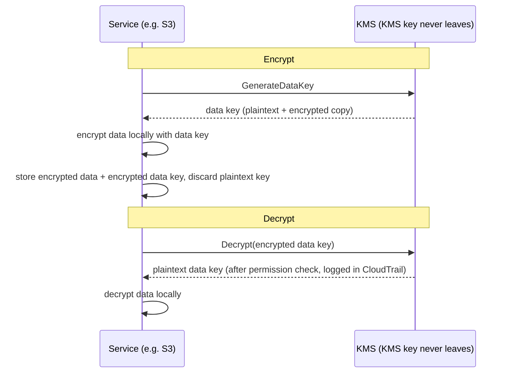

# פרק 16: מפתחות, מנעולים וסודות

למאגר ה-git היו אלפי commits שחזרו שנתיים אחורה. ‏Leo גלל במשך עשרים דקות, עקב אחר חוט דרך ההיסטוריה — מחפש מתי מחרוזת חיבור מסד נתונים מסוימת הופיעה לראשונה. הוא כמעט פספס את זה. זה היה ביום שלישי אחר הצהריים, דחוס בין שני commits לא-בולטים, שנדחף על ידי מישהו שמאז עזב את החברה.

סיסמת מסד נתונים. בטקסט גלוי. בהיסטוריה.

---

*בקרות הרשת מהפרק הקודם היו הדוקות עכשיו. ‏security groups הגבילו תנועה צידית. ‏NACLs חסמו טווחי IP ידועים-כרעים. ההיקף חוזק. אבל ביקורת האבטחה מצאה משהו שההיקף לא יכול לתקן: אישור שחי בהיסטוריית ה-git במשך שישה חודשים. אבטחת היקף מניחה שהסודות בפנים מאובטחים. זה לא היה.*

---

‏Leo סקר את היסטוריית ה-git כשמצא את זה. סיסמת מסד נתונים. בוצעה ב-commit לפני שישה חודשים, בטקסט גלוי, על ידי מישהו שכבר לא עבד ב-Nimbus — חלק מקובץ `.env` שהכיל גם את מפתח הגישה של IAM של צינור הפריסה, שתי שורות מתחת למחרוזת החיבור. ה-commit היה ציבורי. הסיסמה שונתה מאז — אבל הם לא ידעו את זה בוודאות. הם בדקו כל מערכת שאי פעם אחד האישורים נגע בה. זה לקח ארבע שעות. זה היה היום שבו Nimbus החליטה להפסיק לשים סודות בקוד.

"חשבנו על מה שקורה אם מישהו עושה fork למאגר?" אמרה Priya. "היסטוריית git היא קבועה. אפילו אם נשנה את הסיסמה, כל מי ששיכפל את המאגר לפני התיקון עדיין יש לו את האישור הישן בהיסטוריה המקומית שלו."

"בדקנו," אמר Leo. "הסיסמה שונתה לפני שלושה חודשים. כל המערכות אישרו."

"זה המינימום," אמרה Priya. "אבל כל מערכת שהאישור הזה נגע בה צריכה להיסקר. לא רק אלה שאתה יודע עליהן."

**הביקורת של ארבע השעות**

‏Leo מצא את קובץ ה-`.env` שדלף בהיסטוריית ה-git ב-10 בבוקר. עד 14:00, הייתה להם תשובה לשאלה שחשבה: האם אחד האישורים — סיסמת מסד הנתונים או מפתח הגישה שבוצע ב-commit לצידה — שימש מישהו מלבד מערכות Nimbus?

הביקורת רצה דרך ארבע קטגוריות.

**יומני גישת RDS**: כל חיבור למסד הנתונים, עם חותמת זמן ומתועד. הסיסמה שדלפה הופיעה בשלוש מחרוזות חיבור — כולן ממכונות EC2 ב-VPC של Nimbus, כולן עם כתובות IP מקור צפויות. אין חיבורים חיצוניים. הסיסמה לא שימשה להתחבר למסד הנתונים מבחוץ.

**יומני גישת S3**: מפתח הגישה שדלף השתייך למשתמש ה-IAM של צינור הפריסה, שהיו לו הרשאות לדלי `nimbus-receipts`. ‏Leo ביצע שאילתה ליומני גישת השרת של S3 עבור ששת החודשים האחרונים. כל גישה הגיעה ממכונות EC2 ב-`us-west-2` או מתפקיד ה-origin fetch של CloudFront. אין חריגות.

**קריאות API של CloudTrail**: כל קריאת AWS API שבוצעה עם מזהה מפתח הגישה שדלף. ‏Leo סינן אירועי CloudTrail עבור המפתח. שלוש מאות ושנים-עשר אירועים — כולם קריאות `s3:PutObject` שגרתיות מצינור הפריסה, כולן מאותו IP, כולן בשעות העבודה. המפתח אי פעם שימש רק מכתובת IP אחת, שתאמה לשרת ה-CI/CD.

"ושרת ה-CI/CD," אמרה Priya, "נמצא בתוך ה-VPC. הוא היה צריך להוציא נתונים דרך HTTPS ל-endpoint חיצוני, והיינו רואים את זה ב-flow logs."

"בדקנו," אמר Leo. "אין HTTPS יוצא מאותו שרת ל-IPs לא-AWS בששת החודשים האחרונים."

**פסק דין**: אף אחד מהאישורים לא שימש מישהו מחוץ לצוות Nimbus. החשיפה הייתה סיכון, לא פריצה.

"אבל אנחנו לא יכולים להיות בטוחים," אמרה Priya. "אנחנו יכולים להיות בטוחים באופן סביר על בסיס היומנים. אנחנו לא יכולים להיות בטוחים. ההבחנה הזו חשובה."

"מה היה הופך אותנו לבטוחים?"

"שום דבר לא הופך אותך לבטוח אחרי חשיפת אישור. אתה מחליף את האישור, מבקר את הגישה, מתעד את הממצאים שלך, וממשיך הלאה עם בקרות טובות יותר. ודאות אינה זמינה."

‏Tom חישב במהלך השיחה. "ארבע שעות של זמן שלושה מהנדסים. קרא לזה ארבעת אלפים דולר בעלות מלאה. בתוספת רוטציית האישור, התיעוד, סיכום האירוע."

"וזו רק החקירה," אמרה Priya. "פריצה הייתה גדולה בסדרי גודל. הודעות רגולטוריות. תקשורת עם לקוחות. קנסות אפשריים."

"אז שיעור ארבעת אלפים הדולר היה זול," אמר Tom.

"במידה ניכרת," אמרה Priya. "בואו לא נחזור עליו."

---

**שתי הבעיות: אחסון סודות והצפנת נתונים**

אבטחה סביב מידע רגיש יש לה שתי בעיות מובחנות:

**אחסון אישורים** (סיסמאות מסד נתונים, מפתחות API, מחרוזות חיבור): היכן אלה חיים? מי יכול לגשת אליהם? איך מחליפים אותם מבלי לפרוס מחדש את היישום שלכם?

**הצפנת נתונים** (מידע לקוח, רשומות תשלום, ‏PII): איך מבטיחים שאפילו אם מישהו משיג גישה לא-מורשית למסד הנתונים או לדלי ה-S3 שלכם, הוא לא יכול לקרוא את הנתונים?

ל-AWS יש שירות ייעודי לכל בעיה:

- **AWS Secrets Manager**: מאחסן ומנהל אישורים בבטחה
- **AWS KMS (Key Management Service)**: מנהל מפתחות הצפנה להצפנה ופענוח של נתונים

תחשבו על Secrets Manager כצרור מפתחות: הוא מחזיק את המפתחות שלכם (אישורים), שומר אותם מאורגנים, ומחליף אותם בלוח זמנים. תחשבו על KMS ככספת: היא לא מחזיקה את מה שיקר ערך — היא מחזיקה את המפתח שפותח את המנעול המגן על מה שיקר ערך.

**AWS Secrets Manager: אין יותר אישורים מקודדים-קשיח**

‏Secrets Manager הוא מאגר מאובטח לסודות: אישורי מסד נתונים, מפתחות API, אסימוני OAuth, מפתחות SSH, או כל דבר רגיש.

במקום שהיישום שלכם יקרא סיסמה ממשתנה סביבה או קובץ תצורה, הוא קורא ל-Secrets Manager API בהפעלה (או בעת הצורך) ומאחזר את הסוד. הסוד לעולם אינו נוגע בדיסק. הוא לעולם אינו מופיע בקוד שלכם. הוא לא במשתני הסביבה שלכם.

הנה איך נראית הזרימה:

**הדרך הישנה**:
```
DB_PASSWORD=supersecretpassword123  # in .env file or environment variable
```

**הדרך של Secrets Manager**:
```python
import boto3
client = boto3.client('secretsmanager')
secret = client.get_secret_value(SecretId='nimbus/production/db-password')
password = json.loads(secret['SecretString'])['password']
```

מכונת ה-EC2 צריכה תפקיד IAM עם הרשאה לקרוא ל-`secretsmanager:GetSecretValue` עבור אותו סוד ספציפי. שום שירות אחר לא יכול לקרוא אותו. הסוד לעולם אינו בקוד.

אולי אתם תוהים: למה לא פשוט להשתמש במשתני סביבה? הם פשוטים יותר — קבעו אותם בזמן הפריסה, והיישום קורא אותם. משתני סביבה נראים מוסתרים, אבל הם מאוחסנים בתצורת הפריסה שלכם, במאגר ה-secrets של ה-CI/CD, אולי מתועדים במהלך סשני ניפוי באגים, ונראים לכל מי שיש לו גישה לתהליך הרץ. חשוב מכך, הם סטטיים: ברגע שנקבעו, הם לא משתנים עד שמישהו מעדכן אותם ידנית. ‏Secrets Manager מאחסן אישורים בשירות מוצפן עם בקרות גישה של IAM, רישום ביקורת מלא דרך CloudTrail, ורוטציה אוטומטית. משתני סביבה אינם מתחלפים. משתנה סביבה שדלף נשאר תקף עד שמישהו משנה אותו ידנית.

**רוטציה אוטומטית: הכוח האמיתי**

התכונה הגדולה ביותר של Secrets Manager אינה אחסון סודות — היא החלפתם אוטומטית.

הנה התרחיש: כל 30 יום, ‏Secrets Manager מייצר סיסמת מסד נתונים חדשה, מעדכן אותה ב-RDS, מעדכן את הסוד המאוחסן, והיישום שלכם מאחזר את הסיסמה החדשה בפעם הבאה שהוא צריך אותה. אין התערבות ידנית. אין פריסה. אין "אני צריך לזכור להחליף את זה."

הרוטציה מיושמת כפונקציית Lambda. ‏AWS מספקת תבניות למסדי RDS (MySQL, PostgreSQL, Aurora). אתם יכולים להתאים את הפונקציה לכל סוג אישור.

"כמה זה עולה לחודש?" שאל Tom.

‏Secrets Manager גובה לכל סוד לחודש בתוספת לכל קריאת API. עבור מספר קטן של סיסמאות מסד נתונים ומפתחות API, העלות היא דולרים לחודש — זניחה בהשוואה לעלות של אירוע.

"הפריצה בשבוע שעבר," אמרה Priya, "כמה היה עולה לחקור ולתקן?"

‏Tom היה שקט לרגע. "כולל הזמן שלי, הזמן שלך, סוף השבוע של Leo... כמה אלפי דולרים."

"‏Secrets Manager היה תופס את המפתח הסטטי לפני שנוצל. והוא היה מחליף אותו אוטומטית."

‏Tom פתח את דף התמחור.

**מה קורה במהלך רוטציה**

"רגע — אבל *למה* היינו עושים את זה כך?" שאלה Maya. "אם סיסמת מסד הנתונים מתחלפת, האם היישום נשבר? איך הוא קולט את הסיסמה החדשה ללא פריסה?"

זו הייתה דאגה לגיטימית. רוטציה ללא שיבוש דורשת זהירות.

רוטציית Secrets Manager עובדת בשלבים — מתוכננת למנוע את התרחיש "הסיסמה הישנה פתאום לא תקפה, היישום קורס":

**שלב 1: יצירת גרסת סוד חדשה.** ‏Secrets Manager מייצר סיסמה חדשה ומאחסן אותה כגרסה ממתינה של הסוד. הגרסה הנוכחית עדיין פעילה.

**שלב 2: קביעה על השירות.** ‏Lambda הרוטציה קוראת למסד הנתונים כדי לעדכן את הסיסמה לערך החדש. שימו לב: עם אסטרטגיית הרוטציה של **משתמש-יחיד** ברירת המחדל יש רגע קצר שבו הסיסמה הישנה הרגע הפסיקה לעבוד (‏`ALTER ROLE ... PASSWORD` של PostgreSQL נכנס לתוקף מיד) והגרסה החדשה עדיין אינה נוכחית. לרוטציה ללא השבתה, ‏Secrets Manager תומך באסטרטגיית **משתמשים-מתחלפים**: שני משתמשי מסד נתונים עם הרשאות זהות, כאשר הרוטציה תמיד מעדכנת את הלא-*פעיל* ואז עוברת — האישורים הפעילים לעולם אינם מבוטלים באמצע. הביטוי למבחן לזכור הוא "אסטרטגיית רוטציית משתמשים-מתחלפים."

**שלב 3: בדיקת הסוד החדש.** ‏Lambda הרוטציה מאמתת שהסיסמה החדשה עובדת על ידי התחברות איתה. אם זה נכשל, הרוטציה מבוטלת.

**שלב 4: סיום.** ‏Secrets Manager מסמן את הגרסה החדשה כגרסה הנוכחית ומוריד את הגרסה הישנה לגרסה קודמת. הגרסה הקודמת נשמרת לתקופת חסד.

במהלך תקופת החסד, שתי הגרסאות ניתנות-לאחזור. אם היישום שלכם שמר במטמון את הסוד הישן ועדיין לא קלט את החדש, הוא עדיין יכול להתחבר. בפעם הבאה שהוא קורא ל-`GetSecretValue`, הוא מקבל את הגרסה הנוכחית (החדשה).

"אז היישום לעולם לא צריך להיות מופעל מחדש," אמר Leo.

"לא בהכרח. אם היישום שלכם שומר במטמון את הסוד בהפעלה ולעולם לא מרענן אותו, אתם צריכים או לרענן אותו בלוח זמנים או לטפל בכשלי אימות על ידי אחזור מחדש של הסוד."

"אז Lambda הרוטציה והיישום צריכים לשתף פעולה," אמרה Maya.

"‏Secrets Manager עושה את החצי שלו. קוד היישום שלכם צריך לעשות את החצי השני: לאחזר את הסוד בעת הצורך, לטפל בכשלי אימות על ידי אחזור מחדש."

‏Leo עדכן את היישום לתפוס חריגות אימות מסד נתונים, ובכשל, לאחזר סוד טרי מ-Secrets Manager לפני ניסיון חוזר. שתי שורות של טיפול בשגיאות. הרוטציה הפכה בלתי-נראית למשתמשים.

---

**הזרקת סודות בצינור CI/CD**

"חשבנו על איך צינור הפריסה משיג את הסודות שהוא צריך?" שאלה Priya. "הצינור פורס תשתית. הוא צריך אישורי AWS. הוא עשוי לצרוך מחרוזות חיבור מסד נתונים עבור סקריפטי מיגרציה."

‏Leo הסביר את ההגדרה הנוכחית: סודות אוחסנו כ-GitHub Actions Secrets — מוצפנים במנוחה ב-GitHub, מוזרקים כמשתני סביבה בזמן ריצה.

"האישורים נמצאים ב-GitHub," אמרה Priya.

"מוצפנים."

"במערכת צד-שלישי. פריצת GitHub אחת חושפת את כל סודות הצינור שלנו."

הפתרון: צינור הפריסה מתאמת ל-AWS דרך OIDC federation (מכוסה בפרק 14) ומאחזר כל סוד שהוא צריך מ-Secrets Manager בזמן ריצה. אין סודות מאוחסנים ב-GitHub. לתפקיד ה-AWS של הצינור יש הרשאה לקרוא סודות ספציפיים, שום דבר אחר.

```yaml
# GitHub Actions workflow
- name: Get DB Migration Credentials
  env:
    AWS_DEFAULT_REGION: us-west-2
  run: |
    SECRET=$(aws secretsmanager get-secret-value \
      --secret-id nimbus/staging/db-migration \
      --query SecretString --output text)
    DB_URL=$(echo $SECRET | jq -r '.url')
    # Run migration with DB_URL — never stored in a file
    flyway -url="$DB_URL" migrate
```

הסוד מאוחזר, נעשה בו שימוש בזיכרון, ומושלך. הוא לעולם אינו נכתב לדיסק, לעולם אינו מאוחסן במשתני סביבה שנמשכים לאחר המשימה, לעולם לא בקובץ יומן.

"מה אם הסוד מודפס ליומן?" שאל Leo.

"‏GitHub Actions ממסך אוטומטית ערכים של סודות המוגדרים כ-GitHub Secrets. אבל הסוד הזה אינו GitHub Secret — הוא מגיע מ-Secrets Manager. אתם צריכים למסך אותו ידנית, או טוב יותר, לעולם לא לתעד אותו."

"אז המשמעת היא: לאחזר, להשתמש, להשליך. לעולם לא לתעד סודות. לעולם לא לאחסן אותם בקבצים."

"המשמעת הזו," אמרה Priya, "היא מה שביקורת ארבע השעות אישרה שנכשלנו בה."


**AWS KMS: מפעל המנעולים**

"רגע — אבל *למה* היינו עושים את זה כך?" שאלה Maya. "למה שירות ניהול מפתחות נפרד? לא נוכל פשוט להצפין את הנתונים בעצמנו ולאחסן את המפתח ב-Secrets Manager?"

יכולתם לאחסן מפתחות הצפנה ב-Secrets Manager. אבל אז מי שולט בגישה למפתח? מה מבטיח שהמפתח מתחלף? מה מוכיח למבקר שהמפתח שימש רק שירותים מורשים? ‏KMS עונה על כל השאלות האלה. זה לא רק אחסון — זה שירות ניהול מחזור-חיים של מפתחות עם אבטחה מגובת-חומרה, מדיניויות IAM דקות-גרגירות לכל מפתח, ועקבת ביקורת מלאה של כל שימוש. ‏Secrets Manager מאחסן את מה שאתם צריכים כדי להתחבר למערכות. ‏KMS מגן על המערכות עצמן.

‏AWS KMS (Key Management Service) מנהל **מפתחות קריפטוגרפיים** — הערכים הסודיים המשמשים להצפנה ופענוח של נתונים.

האנלוגיה: ‏KMS הוא כמו חברת lockbox שמחזיקה את מפתח ה-master. הנתונים שלכם (תוכן הקופסה) מוצפנים. רק מישהו עם הרשאה להשתמש במפתח ה-KMS יכול לפענח אותם. ‏KMS מתעד כל שימוש בכל מפתח ב-CloudTrail.

**Customer Master Keys (CMKs)** — שנקראים כעת KMS keys — מגיעים בשלושה סוגי בעלות:

**AWS owned keys**: מפתחות ש-AWS מחזיקה ומשתמשת בהם על פני חשבונות לקוח רבים — אתם לעולם לא רואים אותם, לעולם לא משלמים עליהם, והם לא מופיעים בחשבון שלכם. כמה ברירות מחדל של שירותים משתמשות בהם (הצפנת ברירת המחדל של DynamoDB, לדוגמה).

(הבחנה אחת שכדאי לשמור ברורה: הצפנת ברירת המחדל **SSE-S3** של S3 *אינה* מודל מפתח KMS כלל — ‏S3 מנהל מפתחות AES-256 משלו לחלוטין מחוץ ל-KMS, ללא מפתח לראות וללא עקבת ביקורת של שימוש במפתח. ‏**SSE-KMS** היא אפשרות ה-S3 שעוברת דרך KMS, ומשתמשת או במפתח המנוהל-AWS ‏`aws/s3` או במפתח מנוהל-לקוח. טריגר מבחן: "בקר מי השתמש במפתח ההצפנה" או "שלוט ברוטציה ובמדיניות המפתח" → SSE-KMS עם מפתח מנוהל-לקוח — כל שימוש נוחת ב-CloudTrail.)

**AWS managed keys**: ‏AWS יוצרת ומנהלת את המפתח אוטומטית *בחשבון שלכם* עבור שירותים כמו S3, ‏EBS, ‏RDS (נקראים כמו `aws/s3`). אתם יכולים לראות אותו ולבקר את השימוש בו ב-CloudTrail, אבל אתם לא יכולים לשנות את המדיניות או הרוטציה שלו — ‏AWS מחליפה אותו אוטומטית כל שנה. חינם.

**Customer managed keys**: אתם יוצרים את המפתח ב-KMS ושולטים בכל היבט שלו: מי יכול להשתמש בו, מתי הוא מתחלף, מי יכול לנהל אותו. אתם יכולים להפעיל רוטציית מפתח אוטומטית עם תקופה ניתנת-לתצורה בין 90 יום ל-2,560 יום (7 שנים); תקופת הרוטציה ברירת המחדל היא 365 יום (שנתית). אתם יכולים גם להפעיל **רוטציה לפי דרישה** מיד — שימושי לאחר חשיפה חשודה, מבלי לחכות ללוח הזמנים. הערה: רוטציה אוטומטית חלה על מפתחות סימטריים עם חומר שנוצר-על-ידי-KMS — מפתחות אסימטריים וחומר מפתח מיובא אינם יכולים להתחלף אוטומטית. עלות: $1/חודש למפתח בתוספת חיובים לכל קריאת API.

אם אתם בוחרים מפתחות KMS מנוהלי-לקוח, אז אתם מקבלים שליטה מלאה על לוחות זמני רוטציה, מדיניויות גישה, ונראות ביקורת, אבל אתם משלמים לכל מפתח לחודש ולוקחים על עצמכם את האחריות לניהול מפתחות; אם אתם בוחרים מפתחות מנוהלי-AWS, אז אתם מקבלים הצפנה עם אפס תקורה תפעולית וללא עלות עבור המפתח עצמו, אבל אתם לא יכולים להתאים לוחות זמני רוטציה או מדיניויות מפתח — הם מנוהלים לחלוטין על ידי AWS.

**הצפנה בשירותי AWS: שילוב KMS**

רוב שירותי AWS משתלבים עם KMS להצפנה:

**S3**: הפעילו "server-side encryption with KMS" על דלי. כל אובייקט מוצפן במנוחה עם מפתח KMS. קריאת אובייקט דורשת הרשאה גם לדלי ה-S3 *וגם* למפתח ה-KMS.

**RDS**: הפעילו הצפנה בזמן היצירה. אחסון מסד הנתונים, הגיבויים, וה-snapshots כולם מוצפנים עם מפתח KMS. הערה: אי אפשר להפעיל הצפנה על מכונת RDS לא-מוצפנת קיימת — אתם חייבים לבצע snapshot, להעתיק את ה-snapshot עם הצפנה מופעלת, ולשחזר.

**EBS**: הצפינו נפחים עם KMS. נפחים חדשים שנוצרו מ-snapshots מוצפנים מוצפנים אוטומטית.

**DynamoDB**: הצפנה במנוחה באמצעות KMS מופעלת כברירת מחדל על כל הטבלאות.

**ElastiCache Redis**: הצפנה במנוחה עם KMS עבור נתונים רגישים במטמון.

העיקרון: נתונים צריכים להיות מוצפנים במנוחה (מאוחסנים על דיסק) ובמעבר (נעים על פני רשת). ‏KMS מטפל בהצפנה במנוחה. ‏TLS/SSL (מסופק אוטומטית על ידי שירותי AWS) מטפל בהצפנה במעבר.

**הצפנת מעטפה: כיצד KMS באמת עובד**

הנה פרט שעוזר להבין את התנהגות KMS ושאלות מבחן.

‏KMS אינו מצפין את הנתונים שלכם ישירות ברוב המקרים. הוא משתמש ב-**הצפנת מעטפה** (envelope encryption):

1. ‏KMS מייצר **data key** (מפתח סימטרי ייחודי)
2. השירות משתמש ב-data key כדי להצפין את הנתונים שלכם מקומית (מהיר — הצפנה סימטרית)
3. השירות מבקש מ-KMS להצפין את ה-data key עצמו (באמצעות מפתח ה-KMS שלכם)
4. גם הנתונים המוצפנים וגם ה-data key המוצפן מאוחסנים
5. הנתונים האמיתיים שלכם לעולם לא עוזבים את השירות — רק ה-data key הולך ל-KMS להצפנה/פענוח

כשאתם קוראים את הנתונים:

1. השירות מבקש מ-KMS לפענח את ה-data key
2. ‏KMS בודק הרשאות, מפענח את ה-data key, מחזיר אותו
3. השירות משתמש ב-data key המפוענח כדי לפענח את הנתונים שלכם מקומית



זה אומר ש-KMS יכול לטפל בנתונים גדולים מאוד מבלי לשלוח את כולם דרך ה-KMS API. רק מפתחות קטנים הולכים ל-KMS. ‏CloudTrail מתעד כל קריאת KMS API — כל פעולת הצפנה ופענוח.

**KMS Key Policies: מודל הגישה**

"חשבנו על מה שקורה אם מדיניות IAM ומדיניות מפתח מתנגשות?" שאלה Priya. "ל-KMS יש בקרת גישה משלו מעל IAM."

למפתחות KMS יש **key policies** — מדיניויות מבוססות-משאב המצורפות למפתח עצמו. הן מובחנות ממדיניויות IAM ועוקבות אחר כללי הערכה שונים.

כדי ש-principal ישתמש במפתח KMS, שני דברים חייבים להיות נכונים:

**ראשית**: מדיניות המפתח חייבת לאפשר זאת. אם מדיניות המפתח אינה מעניקה במפורש ל-principal גישה, הוא אינו יכול להשתמש במפתח — ללא קשר למה שמדיניות ה-IAM שלו אומרת. זה שונה מרוב משאבי AWS, שבהם מדיניויות IAM לבדן מספיקות.

**שנית**: מדיניות ה-IAM של ה-principal חייבת לאפשר את פעולת ה-KMS (לדוגמה, `kms:Decrypt`, `kms:GenerateDataKey`).

שניהם חייבים לומר כן. אם אחד מהם אומר לא, הפעולה נדחית.

מדיניות המפתח ברירת המחדל ש-AWS יוצרת עבור מפתחות מנוהלי-לקוח כוללת הצהרה שאומרת "חשבון ה-root יכול לנהל את המפתח הזה." זה חשוב: זה אומר שמנהל IAM ברמת החשבון תמיד יכול להעניק גישה למפתח, אפילו אם מדיניות המפתח אינה נוקבת בו ישירות — כי האצלת חשבון ה-root במקום.

"אז אם נסיר את חשבון ה-root ממדיניות המפתח," שאל Leo, "מדיניויות IAM מפסיקות לעבוד עבור המפתח הזה?"

"נכון. הסרת האצלת חשבון ה-root היא דרך לנעול מפתח כל כך הדוק שרק ה-principals הספציפיים הנקובים במדיניות המפתח יכולים להשתמש בו — אפילו לא מנהלי חשבון. זו גם דרך לנעול את עצמך בטעות מחוץ למפתח שלך."

"האם נוכל להתאושש?"

"רק על ידי פנייה ל-AWS Support. אם אף אחד לא יכול להשתמש במפתח ומדיניות המפתח אינה יכולה להתעדכן, הנתונים המוצפנים עם אותו מפתח בלתי-נגישים למעשה."

"אז אל תסיר את חשבון ה-root ממדיניות המפתח ללא סיבה טובה במיוחד."

"נכון."

---

**מפתחות אסימטריים: חתימה ואימות**

‏KMS תומך גם בזוגות מפתחות אסימטריים — מפתח ציבורי ומפתח פרטי.

מקרי השימוש:

**חתימה דיגיטלית**: אתם חותמים על מסמך או על אסימון JWT עם המפתח הפרטי. כל מי שיש לו את המפתח הציבורי יכול לאמת שהחתימה הגיעה ממחזיק המפתח הפרטי, ושהתוכן לא נחבל.

**הצפנת מפתח ציבורי**: כל אחד יכול להצפין נתונים עם המפתח הציבורי. רק מחזיק המפתח הפרטי יכול לפענח אותם.

עבור Nimbus, מפתחות אסימטריים הפכו רלוונטיים כשהם יישמו מערכת חתימת webhook עבור שותפי מסעדות. כש-Nimbus שלחה אירוע לשרת של שותף מסעדה (הזמנה חדשה, עדכון סטטוס), השותף נזקק לאמת שהאירוע באמת הגיע מ-Nimbus ולא זויף.

היישום:

1. ‏Nimbus יוצרת מפתח KMS אסימטרי (RSA 2048-bit, אלגוריתם SIGN_VERIFY)
2. בשליחת webhook, ‏Nimbus קוראת ל-`kms:Sign` עם המפתח הפרטי כדי לחתום על מטען האירוע
3. החתימה נכללת בכותרת ה-webhook
4. ‏Nimbus מפרסמת את המפתח הציבורי (ניתן להורדה מקונסולת KMS)
5. השרת של שותף המסעדה מביא את המפתח הציבורי ומשתמש בו לאמת את החתימה על כל webhook נכנס

המפתח הפרטי לעולם לא עוזב את KMS. ‏Nimbus לעולם אין לה גישה לחומר המפתח הפרטי הגולמי. ‏KMS מבצע את פעולת החתימה בתוך מודול האבטחה החומרתי שלו.

"אז אפילו אם מישהו פרץ שרת Nimbus," אמר Rafael, "הם לא יכלו לזייף חתימת webhook. המפתח הפרטי ב-KMS, לא על אף שרת."

"נכון. חתימה דורשת קריאת KMS API. כל קריאת API מתועדת ב-CloudTrail. אם מישהו ניסה לחתום על אירוע מזויף, היינו רואים את קריאת ה-API."

---

**סיפור מחיקת המפתח**

שלושה חודשים לאחר הגדרת ה-KMS, ‏Tom עשה טעות.

הוא ניקה משאבי AWS לא-בשימוש — פונקציות Lambda ישנות, דליי S3 מיושנים, לוחות מחוונים נטושים של CloudWatch. הוא נע במהירות. הוא תזמן בטעות מפתח KMS למחיקה.

המפתח היה `nimbus/prod/order-receipts` — המפתח המנוהל-לקוח ששימש להצפנת דלי ה-S3 של קבלות ההזמנות.

"מחקתי באצווה שנים-עשר משאבים אתמול ולא בדקתי מה השנים-עשר היה," אמר Tom באדישות. הוא תזמן את המחיקה והמשיך הלאה. הוא שם לב לטעות בבוקר שלמחרת כשסקר את הפעולות שלו.

הוא פתח את קונסולת ה-KMS. סטטוס המפתח קרא: "ממתין למחיקה. מחיקה בעוד 7 ימים."

הוא תזמן אותו לתקופת ההמתנה המינימלית.

"האם נוכל לבטל את זה?" שאל.

‏Priya פתחה את התיעוד. "כן. במהלך תקופת ההמתנה, המפתח מנוטרל אבל לא נמחק. אתם יכולים לבטל את המחיקה."

‏Tom ביטל את המחיקה תוך הדקה. המפתח שוחזר לסטטוס פעיל.

"שבעה ימים זו תקופת ההמתנה המינימלית," אמרה Priya. "‏AWS אוכפת אותה כי אם מפתח נמחק ונתונים הוצפנו איתו, הנתונים האלה אבדו לנצח. בלתי-ניתנים-לשחזור. תקופת ההמתנה נותנת לכם זמן להבין את הטעות."

"כמה ארוכה צריכה להיות תקופת ההמתנה?"

"המקסימום הוא שלושים יום. עבור כל מפתח שמצפין נתוני ייצור, השתמשו בשלושים יום. שלושת השבועות הנוספים של הגנה מפני תאונות שווים את אי-הנוחות הקלה."

‏Tom עדכן את כל הגדרות מחיקת המפתחות של הייצור לשלושים יום. הוא גם הגדיר התראת CloudWatch שמופעלת אם סטטוס של כל מפתח KMS משתנה ל"ממתין למחיקה" — כך שבפעם הבאה שמישהו (כולל הוא) עושה את אותה טעות, הצוות יידע תוך חמש דקות.

---

**Secrets Manager מול Parameter Store**

ל-AWS יש גם **Systems Manager Parameter Store**, שמאחסן ערכי תצורה (לא רק סודות). ‏Parameter Store זול יותר — חינמי לפרמטרים סטנדרטיים. הוא יכול גם לאחסן פרמטרים מוצפנים באמצעות KMS.

לסודות שצריכים רוטציה: ‏Secrets Manager.

לערכי תצורה ופרמטרים לא-רגישים: ‏Parameter Store (השכבה החינמית מאוד נדיבה).

לתצורת יישום (מספרי פורט, ‏feature flags, הגדרות ספציפיות-לסביבה): ‏Parameter Store.

| | Secrets Manager | SSM Parameter Store |
|---|---|---|
| רוטציה אוטומטית | כן (מגובת-Lambda) | לא |
| עלות | כ-$0.40/סוד/חודש | חינם (סטנדרטי) |
| הצפנה | תמיד | אופציונלי (עם KMS) |
| ניהול גרסאות | כן | כן |
| גישה חוצה-חשבונות | כן | מוגבל |
| הכי טוב ל | סיסמאות מסד נתונים, מפתחות API | ערכי תצורה, feature flags |

## האישור על הדלת

שבועיים לאחר הגירת הסודות, ‏Priya סקרה את סביבת ה-staging של Nimbus בטלפון שלה כשהיא שמה לב לשורת הכתובת.

"לא מאובטח."

היא פתחה את כתובת הייצור. אותו דבר.

"‏Leo," אמרה, מניחה את הטלפון על השולחן. "אנחנו רצים על HTTP?"

‏Leo בדק. "ה-listener של ה-ALB בפורט 80. מעולם לא הגדרנו HTTPS."

"אז כל בקשה שהמשתמשים שלנו עושים — כל הזמנה, כל התחברות — הולכת על HTTP לא-מוצפן?"

"יש לנו TLS על חיבור ה-RDS," הציע Leo.

"זה נתונים במעבר בין היישום למסד הנתונים. אני מדברת על נתונים במעבר בין הדפדפן של המשתמש ל-load balancer שלנו. זה לא מוצפן כלל."

‏Tom הקשיב. "זו בעיית אבטחה או בעיית תפיסה?"

"שתיהן," אמרה Priya. "‏HTTP לא-מוצפן משמעו שכל רשת בין המשתמש לשרת שלנו — נתב של בית קפה, ‏ISP — יכולה לקרוא את התעבורה. סיסמאות, פרטי הזמנה, אסימוני סשן. ודפדפנים מודרניים מזהירים משתמשים עם 'לא מאובטח'. זה הורג שיעורי המרה."

"אז אנחנו צריכים אישור TLS," אמרה Maya. "כמה זה עולה?"

"שום דבר," אמרה Priya. "‏AWS Certificate Manager."

**AWS Certificate Manager (ACM)** מספק אישורי TLS/SSL חינמיים לשימוש עם שירותים מנוהלי-AWS: ‏ALBs, ‏CloudFront distributions, ו-API Gateway. אתם לא קונים אישור, מנהלים לוח חידוש, או נוגעים בחומר מפתח פרטי. ‏ACM מטפל בכל מחזור החיים של האישור.

אישור שהונפק על ידי ACM תקף ל-13 חודשים. לפני שהוא פג, ‏ACM מחדש אותו אוטומטית. אם החידוש מצליח, האישור החדש מצורף ל-load balancer או distribution שלכם ללא כל פעולה מצדכם. המנעול של הדפדפן נשאר ירוק. התראת הפקיעה ששכחתם להגדיר לעולם אינה מופעלת.

**שני סוגי אישורי ACM**:

**אישורים ציבוריים** מונפקים על ידי רשות האישורים של Amazon ומהימנים על ידי כל הדפדפנים הגדולים. הם חינמיים לחלוטין לשימוש עם ALB, ‏CloudFront, ו-API Gateway. אתם מאמתים בעלות על הדומיין דרך DNS או דוא"ל.

**אישורים פרטיים** מונפקים על ידי AWS Private CA — רשות אישורים פרטית מנוהלת שאתם מריצים עבור שירותים פנימיים (mTLS שירות-לשירות, כלים פנימיים, לקוחות VPN). ל-Private CA יש עלות חודשית.

עבור Nimbus, אישורים ציבוריים היו הבחירה הנכונה.

**אימות DNS מול אימות דוא"ל**:

‏Leo פתח את קונסולת ה-ACM והתחיל בקשת אישור עבור `eatnimbus.com` ו-`*.eatnimbus.com`.

"זה שואל איך אני רוצה לאמת בעלות," אמר. "‏DNS או דוא"ל."

"‏DNS," אמרה Priya. "תמיד DNS."

עם אימות DNS, ‏ACM מוסיף רשומת CNAME ספציפית ל-hosted zone שלכם. ‏Route 53 יכול לעשות זאת אוטומטית — לחיצה אחת בקונסולה. כל עוד רשומת ה-CNAME הזו קיימת, ‏ACM יכול לחדש אוטומטית את האישור ללא כל פעולה אנושית. אימות דוא"ל שולח דוא"ל לאיש הקשר הרשום של הדומיין ודורש לחיצה ידנית בכל פעם שהאישור מתחדש. הלחיצה הזו נשכחת. אימות DNS אינו דורש שמישהו יזכור דבר.

"אז אני מוסיף את רשומת ה-CNAME פעם אחת," אמר Leo, "והוא מתחדש לנצח?"

"עד שמישהו מוחק את רשומת ה-CNAME," אמרה Priya. "אל תמחק את רשומת ה-CNAME."

‏Leo ביקש את האישור, הוסיף את ה-CNAME לאימות ב-Route 53 (ש-ACM הציע לעשות אוטומטית), וחיכה חמש דקות. סטטוס האישור השתנה ל-Issued. הוא צירף אותו ל-listener ה-HTTPS של ה-ALB בפורט 443 והוסיף כלל הפניה בפורט 80 כדי לשלוח את כל תעבורת ה-HTTP ל-HTTPS.

‏Tom רענן את כתובת הייצור.

המנעול הופיע.

פרט אזורי אחד ששווה דגל: אישור הוא משאב אזורי, והוא חייב לחיות באותו אזור כמו השירות שמשתמש בו. עבור ALB, זה האזור של ה-ALB. עבור **CloudFront**, האישור חייב להתבקש (או להיות מיובא) ב-**`us-east-1`** — תמיד, ללא קשר למיקום ה-origins שלכם — כי CloudFront הוא שירות גלובלי המעוגן שם. ‏Leo כבר נתקל בזה בפרק 13; זו גם עובדת מבחן אמינה.

**הדבר היחיד שאישורי ACM אינם יכולים לעשות**:

"האם אני יכול להוריד את האישור?" שאל Leo. "אני רוצה להתקין אותו על מכונת ה-EC2 של admin פנימי."

"לא," אמרה Priya.

אישורים ציבוריים חינמיים של ACM אינם יכולים להיות מיוצאים. אתם לא יכולים להוריד את המפתח הפרטי ולהתקין אותו על מכונת EC2, שרת Nginx, או כל דבר מחוץ לשירותים מנוהלי-AWS. חומר המפתח הפרטי לעולם לא עוזב את ACM. זה מכוון — זה מונע מהמפתח הפרטי לדלוף, להיות מאוחסן באופן לא-מאובטח, או להישכח כשהאישור פג.

עבור מקרי שימוש שדורשים אישור ניתן-להתקנה — מכונת EC2 הפועלת כ-proxy מותאם, שרת מקומי — יש שלושה מסלולים: אישור מרשות צד-שלישי (Let's Encrypt, לדוגמה), ‏AWS Private CA עם ייצוא אישורים מופעל, או — מאז יוני 2025 — **אישורים ציבוריים ניתנים-לייצוא** בתשלום של ACM (opt-in בהנפקה, מחויבים לכל FQDN או wildcard), שהמפתח הפרטי שלהם *יכול* להיות מיוצא לשימוש בכל מקום.

"עבור ה-ALB וה-CloudFront distribution שלנו," אמרה Priya, "‏ACM מתאים בדיוק. חינמי, אוטומטי, ואנחנו לעולם לא נוגעים במפתח."

## חוזקות ומגבלות

**AWS Secrets Manager**:

- רוטציית סוד אוטומטית ללא שינויי קוד או פריסות
- בקרת גישה IAM דקת-גרגירות לכל סוד (כל סוד הוא משאב IAM נפרד)
- ניהול גרסאות — הגרסה הקודמת נשארת נגישה במהלך רוטציה, ומונעת ניתוקי חיבור
- ביקורת דרך CloudTrail — כל קריאת `GetSecretValue` מתועדת עם זהות הקורא
- גישה חוצה-חשבונות — סודות של חשבון אחד ניתנים לשיתוף עם תפקיד של חשבון אחר
- עלות: כ-$0.40/סוד/חודש + קריאות API (בערך $0.05 לכל 10,000 קריאות API)

**AWS KMS**:

- ניהול מפתחות מרכזי עם עקבת ביקורת מלאה — כל הצפנה ופענוח מתועדים
- רוטציית מפתח אוטומטית ניתנת-לתצורה למפתחות מנוהלי-לקוח (90 יום עד 2,560 יום; ברירת מחדל 365 יום) — חומר המפתח הישן עדיין מפענח נתונים קיימים, חומר המפתח החדש מצפין נתונים חדשים
- הרשאות IAM דקות-גרגירות לכל מפתח (key policies + IAM policies — שניהם חייבים לאפשר)
- מגובה Hardware Security Module (HSM) — מפתחות לעולם לא עוזבים את ה-HSM בטקסט גלוי
- תמיכת מפתח Multi-Region לתרחישי התאוששות מאסון
- תמיכת מפתח אסימטרי לחתימה ואימות דיגיטליים
- עלות: $1/חודש למפתח + $0.03 לכל 10,000 קריאות API

**היכן זה נעשה מסובך**:

- ‏KMS key policies נפרדות מ-(ומוערכות לצד) מדיניויות IAM — ניפוי שגיאות access denied דורש בדיקת שניהם
- הצפנה במנוחה חייבת להיות מתוכננת מראש — אתם לא יכולים להצפין מכונת RDS לא-מוצפנת קיימת במקום
- מחיקת מפתח ב-KMS יש לה תקופת המתנה של 7-30 יום — מנגנון בטיחות, אבל קל לשכוח במהלך ההגדרה ומסוכן להפעיל בטעות
- רוטציה דורשת מקוד היישום לטפל באחזור מחדש של סודות בכשל אימות — ‏Secrets Manager מחליף את האישור, אבל היישום חייב לקלוט אותו
- עלויות Secrets Manager מתרחבות עם מספר הסודות ונפח קריאות ה-API בקנה מידה גדול
- מדיניות המפתח ברירת המחדל (כולל האצלת חשבון root) קריטית לשימור — הסרתה יכולה לנעול מנהלים מחוץ למפתח

## סיכום

ארבע השעות שהושקעו במעקב אחר אישור פרוץ דרך כל מערכת שהוא נגע בה היו ארבע שעות ש-Secrets Manager יכול היה למנוע. רוטציה אוטומטית משמעה שלאישור גנוב יש תוחלת חיים קצרה. ‏KMS משמעו שאפילו אם מישהו מגיע לנתונים, הוא לא יכול לקרוא אותם ללא מפתח שהוא לא מורשה להשתמש בו. ותקופת המתנה של שלושים יום למחיקת מפתח משמעה שמחיקה מקרית יכולה להתבטל לפני שהיא הופכת לאירוע אובדן נתונים.

- לעולם אל תאחסנו אישורים בקוד, במשתני סביבה, או בקבצי תצורה המבוצעים ב-commit לבקרת גרסאות.
- **Secrets Manager** מאחסן אישורים בבטחה ומחליף אותם אוטומטית. יישומים מאחזרים סודות דרך API בזמן ריצה.
- **רוטציה** קורית בשלבים: יצירת גרסה חדשה, עדכון על השירות, בדיקה, קידום. גם הגרסה הישנה וגם החדשה תקפות לזמן קצר, ומונעות ניתוקי חיבור במהלך רוטציה.
- **KMS** מנהל מפתחות הצפנה. רוב שירותי AWS משתלבים עם KMS להצפנה במנוחה.
- **הצפנת מעטפה**: ‏KMS מצפין את המפתח, לא את הנתונים ישירות. השירות מצפין נתונים באמצעות data key מקומי, ש-KMS מצפין. רק מפתחות קטנים חוצים את ה-KMS API.
- **מפתחות KMS מנוהלי-לקוח**: שליטה מלאה על רוטציה (ניתנת-לתצורה 90–2,560 יום, ברירת מחדל 365 יום שנתית), גישה, וביקורת ($1/חודש). **מפתחות מנוהלי-AWS**: אוטומטי, ללא צורך בתצורה, חינם.
- **KMS key policies**: מדיניות המפתח היא מדיניות מבוססת-משאב שעובדת לצד IAM. שניהם חייבים לומר כן. האצלת חשבון ה-root במדיניות המפתח ברירת המחדל מבטיחה שמנהלי IAM תמיד יכולים להעניק גישה.
- **מפתחות אסימטריים**: ‏KMS תומך בזוגות מפתחות RSA ו-ECC לחתימה ואימות. המפתח הפרטי לעולם לא עוזב את ה-HSM.
- **מחיקת מפתח**: מינימום 7 ימים, מקסימום 30 יום תקופת המתנה. מפתחות שנמחקו משמעם נתונים מוצפנים בלתי-נגישים לצמיתות. השתמשו ב-30 יום למפתחות ייצור, ונטרו סטטוס ממתין-למחיקה.
- **סודות CI/CD**: אחזרו מ-Secrets Manager בזמן ריצה באמצעות OIDC federation. לעולם אל תאחסנו סודות כמשתני פלטפורמת CI/CD.

## טיפים למבחן

*תחום SAA-C03: תכנון ארכיטקטורות מאובטחות (תחום 1, משימה 1.3)*

- **Secrets Manager מול SSM Parameter Store**: ‏Secrets Manager לאישורים שצריכים רוטציה אוטומטית; ‏Parameter Store לתצורה כללית. המבחן מבדיל ביניהם לפי דרישת רוטציה ורגישות עלות.
- **KMS key policies**: למפתח KMS יש key policy משלו (מדיניות מבוססת-משאב). מדיניויות IAM לבדן אינן מעניקות גישה למפתח KMS — מדיניות המפתח חייבת לאפשר זאת במפורש. גם מדיניות המפתח וגם מדיניות ה-IAM חייבות לאפשר את הפעולה.
- **הצפנת RDS**: אי אפשר להפעיל הצפנה על מכונת RDS לא-מוצפנת קיימת. התהליך: יצירת snapshot ← העתקת snapshot עם הצפנה מופעלת ← שחזור מ-snapshot מוצפן ← הגירת תעבורה למכונה חדשה.
- **הצפנת EBS**: נפחים חדשים יכולים להיות מוצפנים. ‏snapshots של נפחים מוצפנים תמיד מוצפנים. נפחים לא-מוצפנים אינם יכולים להיות מוצפנים ישירות — ‏snapshot + העתקה + שחזור.
- **CloudTrail + KMS**: כל קריאת KMS API מתועדת ב-CloudTrail. זו תכונת ציות מרכזית. כשמבחן שואל איך לבקר מי פענח אילו נתונים, התשובה היא CloudTrail + KMS.
- **מפתחות KMS Multi-Region**: שכפלו חומר מפתח למספר אזורים כך שפענוח יכול לקרות ללא קריאות API חוצות-אזורים. המבחן משתמש בזה להתאוששות מאסון רב-אזורית עם נתונים מוצפנים.
- **KMS מול CloudHSM**: ‏KMS הוא רב-דייר (מנוהל על ידי AWS). ‏CloudHSM הוא מודול אבטחה חומרתי ייעודי שרק אתם שולטים בו. אותות מבחן: "FIPS 140-2 Level 3," "‏HSM ייעודי," "פעולות קריפטוגרפיות מנוהלות-לקוח" → CloudHSM.
- **הצפנת מעטפה**: ‏KMS מייצר data key, השירות משתמש בו להצפין נתונים מקומית, ‏KMS מצפין את ה-data key. שאלת מבחן: "למה KMS לא מצפין כמויות גדולות של נתונים ישירות?" → ביצועים; הצפנת מעטפה שומרת נתונים גדולים מקומית.
- **מפתחות KMS אסימטריים**: בשימוש לחתימה דיגיטלית, אימות JWT, או הצפנת מפתח ציבורי. המפתח הפרטי לעולם לא עוזב את KMS. ‏`kms:Sign` היא קריאת ה-API לחתום; ‏`kms:Verify` לאמת.
- **תקופת המתנה למחיקת מפתח**: 7-30 יום. במהלך תקופה זו, המפתח מנוטרל ולא שמיש, אבל המחיקה ניתנת לביטול. לאחר המחיקה, כל נתון שהוצפן עם אותו מפתח בלתי-ניתן-לשחזור לצמיתות.
- **ACM (AWS Certificate Manager):** אישורי TLS ציבוריים חינמיים לשימוש עם ALB, ‏CloudFront, ו-API Gateway. חידוש אוטומטי דרך אימות DNS. אישורים ציבוריים חינמיים אינם יכולים לייצא את המפתח הפרטי שלהם — הם חיים בתוך AWS בלבד (אפשרות *אישור ציבורי ניתן-לייצוא* בתשלום קיימת מאז 2025 לשימוש EC2/מקומי). טריגר מבחן: "HTTPS על load balancer או CDN" → ACM.

## תרגילים

**תרגיל 1 — היזכרות**

הסבירו את מושג הצפנת המעטפה. מדוע KMS מצפין data key קטן במקום להצפין את נתוני היישום שלכם ישירות?

*(רמז: חשבו מה קורה אם יש לכם 1GB של נתונים להצפין, ומה יהיו ההשלכות הביצועיות של שליחת 1GB לשירות KMS מרוחק.)*

**תרגיל 2 — תרחיש SAA-C03**

*תרחיש*: חברת שירותים פיננסיים מאחסנת נתוני לקוח רגישים במסד נתונים RDS MySQL. דרישת ציות חדשה מחייבת ש:

1. כל הנתונים חייבים להיות מוצפנים במנוחה
2. כל שימוש במפתח הצפנה חייב להיות ניתן-לביקורת
3. מפתחות ההצפנה חייבים להיות נשלטים-לקוח (לא מנוהלים על ידי AWS)
4. סיסמת מסד הנתונים חייבת להתחלף אוטומטית כל 90 יום

מסד הנתונים נוצר לפני שישה חודשים ללא הצפנה מופעלת. איזה מערך פעולות עונה בצורה הטובה ביותר על כל ארבע הדרישות?

A) להפעיל הצפנת RDS על מסד הנתונים הקיים; ליצור מפתח KMS מנוהל-לקוח; להגדיר Secrets Manager עם רוטציה של 90 יום  
B) ליצור snapshot של מסד הנתונים הקיים; להעתיק את ה-snapshot עם הצפנה באמצעות מפתח KMS מנוהל-לקוח; לשחזר מה-snapshot המוצפן; להגדיר Secrets Manager עם רוטציה של 90 יום  
C) ליצור מכונת RDS מוצפנת חדשה עם מפתח מנוהל-AWS; להגר נתונים מהמכונה הישנה; להגדיר Secrets Manager עם רוטציה של 90 יום  
D) להפעיל הצפנת RDS במנוחה על מסד הנתונים הקיים באמצעות מפתח מנוהל-AWS; להגדיר Secrets Manager עם רוטציה של 90 יום

**רמז 1**: אתם לא יכולים להפעיל הצפנה על מכונת RDS לא-מוצפנת קיימת ישירות.

**רמז 2**: מפתחות "נשלטים-לקוח" משמעם מפתחות KMS מנוהלי-לקוח, לא מפתחות מנוהלי-AWS.

**רמז 3**: תהליך העתקת ה-snapshot הוא מסלול ההגירה הסטנדרטי ל-RDS מוצפן.

**תשובה**: B

**הסבר**: אי אפשר להפעיל הצפנת RDS על מכונה קיימת. הגישה הסטנדרטית היא: ‏snapshot של המכונה הקיימת ← העתקת ה-snapshot עם הצפנה מופעלת באמצעות מפתח KMS מנוהל-לקוח (מספק את דרישות 1, 2, ו-3) ← שחזור מה-snapshot המוצפן. מפתחות KMS מנוהלי-לקוח מתעדים אוטומטית את כל השימוש ב-CloudTrail (ביקורת) ושומרים את מפתחות ההצפנה תחת השליטה שלכם. ‏Secrets Manager מטפל ברוטציית סיסמה אוטומטית של 90 יום (מספק את דרישה 4).

**מדוע לא A?** אתם לא יכולים להפעיל הצפנה על מכונת RDS לא-מוצפנת קיימת במקום.

**מדוע לא C?** מפתחות מנוהלי-AWS אינם מספקים את דרישת "נשלט-לקוח" (דרישה 3).

**מדוע לא D?** אותה בעיה כמו A (אי אפשר להפעיל במקום) בתוספת מפתח מנוהל-AWS אינו מספק את דרישה 3.

*תחום SAA-C03: תכנון ארכיטקטורות מאובטחות — משימה 1.3*

**תרגיל 3 — אתגר ארכיטקטורה** *(אופציונלי)*

‏Nimbus צריכה לאחסן את הנתונים הרגישים הבאים:

- סיסמת מסד נתונים למכונת RDS בייצור
- מפתח API סודי של Stripe (בשימוש לעיבוד תשלומים)
- מפתח הצפנה סימטרי להצפנת היסטוריית הזמנות לקוח ב-DynamoDB
- ערכי תצורה לכל מסעדה (נקודות קצה של API, ‏feature flags — לא רגישים)

באיזה שירות AWS או גישה הייתם משתמשים לכל אחד? איזו אסטרטגיית רוטציה הייתם מחילים על כל אחד?

*(אין תשובה נכונה יחידה. המטרה היא לתרגל התאמת כלי אבטחה למקרי שימוש.)*

## סצנה לאחר הקרדיטים

"כבר פרסתי את זה — אה." ‏Leo היגר את סודות הייצור ל-Secrets Manager בזמן שסביבת הפיתוח עדיין השתמשה במשתני הסביבה הישנים. סביבת הפיתוח נשברה. הוא נאלץ להחזיר ידנית את תצורת הפיתוח.

"קודם staging," אמרה Priya. "אחר כך ייצור."

"אני יודע," אמר Leo.

הסודות הוגרו.

סיסמאות מסד נתונים: ‏Secrets Manager, מתחלפות כל 30 יום.

מפתחות API: ‏Secrets Manager, עם Lambda רוטציה שקראה ל-API של ספק התשלומים כדי לייצר מפתח חדש.

נתוני הזמנות לקוח: מוצפנים עם מפתח KMS מנוהל-לקוח.

אישורים ישנים: בוטלו. קבצי תצורה ישנים: נמחקו. ‏GitHub Actions secrets ישנים: הוסרו.

"אנחנו עכשיו מוכנים-לביקורת," אמרה Priya.

"הגדירי מוכן-לביקורת," אמרה Maya.

"אם מבקר ציות יבקש מאיתנו להוכיח שאין אישורים מקודדים-קשיח בקוד שלנו או חשופים בתשתית שלנו, נוכל להראות לו: כל סוד ב-Secrets Manager, כל מפתח הצפנה ב-KMS, כל גישה מתועדת ב-CloudTrail."

"מתי בפעם האחרונה מישהו בדק את יומני ה-CloudTrail?"

הפסקה.

"אני בודקת אותם כל שבוע," אמרה Priya.

"ואם משהו חריג יופיע, איך היינו יודעים?"

"זו," אמרה Priya, סוגרת את המחשב הנייד שלה, "השיחה הבאה."

בפרק הבא: שלוש שכבות ההגנה שעומדות בין Nimbus לאינטרנט.
