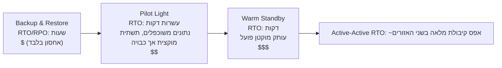

# פרק 18: כשדברים נשברים

האורות כבו בשעה 23:17.

לא במשרד של Nimbus — Leo היה בבית, על הספה, המחשב הנייד חצי-סגור. האורות כבו במרכז נתונים באורגון שמעולם לא ביקר בו, בבניין שמעולם לא ראה, בחדר מלא בשרתים שמעולם לא נגע בהם. הוא עוד לא ידע. הייתה רגע — רק רגע — של דממה מוחלטת לפני שגנרטורי הגיבוי נכנסו לפעולה אי-שם הרחק. אותו סוג של חושך שבו אי אפשר לדעת אם העיניים שלך פקוחות או עצומות.

ואז הגיעה התראת ה-Slack.

---

לאחר שמערכות הניטור מפרק 17 הוטמעו, הצוות חש משהו שדומה לביטחון. ההתראות פעלו. הדאשבורדים היו ירוקים. הלוגים זרמו אל CloudWatch. הם בילו שלושה שבועות בחיווט נראוּת לכל פינה בתשתית של Nimbus.

מה שאיש לא אמר בקול — מה שהניטור לא הגן מפניו — היה שנראוּת ועמידוּת הם דברים שונים. אפשר לצפות במשהו נכשל בפירוט מושלם. הצפייה אינה עוצרת אותו.

הלקח הזה הגיע ב-23:23 ביום חמישי.

---

Leo קיבל את התראת ה-Slack.

‏"us-west-2 — כשל אשכול מרכז נתונים — שירות ירוד."

הוא פתח את מסוף AWS. מכונות ה-EC2 באחד מאזורי הזמינות הראו כשל בבדיקות הסטטוס. קבוצת ה-Auto Scaling שלו זיהתה מכונות לא בריאות והחלה להעלות תחליפים — באותו אזור.

באשכול שנכשל.

המכונות החדשות גם הן לא הצליחו לעלות. הן היו באותו אזור כשל חומרה.

‏"ה-load balancer מנתב תנועה לשני ה-AZs," אמר Leo לאף אחד. "חצי מהתנועה שלנו הולכת למכונות שלא עובדות."

הוא פתח את מסוף ה-EC2 והתחיל ללחוץ. תחת Load Balancers, ה-Application Load Balancer הציג את שתי קבוצות היעד כבריאות — כי בדיקת הבריאות עברה על פורט 80, ואפילו המכונות הכושלות הגיבו לבדיקה הזו. הן פשוט לא יכלו לעבד בקשות אמיתיות.

הוא ניסה להסיר את ה-AZ הכושל מקבוצת היעד. המסוף קיבל את השינוי. אבל ה-Auto Scaling Group, שהוגדרה לשמור על איזון, מיד החלה לנסות להחליף את המכונות שהופסקו — באותו אזור כושל.

Leo בהה במסך. הוא בדיוק החמיר את המצב.

הוא הציג את תצורת ה-ASG. הגדרת "Balance capacity across Availability Zones" הייתה פעילה. בפעולה רגילה זה היה תכנון טוב. כרגע זה נלחם בו באופן פעיל.

הוא שינה את ה-ASG כדי להשתמש רק באזור הבריא. החיל את השינוי.

המסוף הציג את השינוי כ-"In Service."

שלוש דקות לאחר מכן, מכונות התחליף הבריאות הראשונות עלו.

ה-load balancer החל לנתב תנועה. שיעור השגיאות צנח מ-52% ל-4%. ה-4% שנותרו היו בקשות שנחתו על מספר המכונות הלא-בריאות האחרונות שעדיין ניקזו חיבורים.

עד 23:45 — עשרים ושתיים דקות לאחר תחילת הכשל — התנועה הייתה יציבה.

עשרים ושתיים דקות של שירות ירוד לפני שהבחין בכך והעביר ידנית את ה-ASG להשתמש רק באזור הבריא.

‏"זה קרה כי הכל היה ב-AZ אחד," אמרה Priya למחרת בבוקר.

‏"לא," אמר Leo. "היו לי מכונות בשני AZs. הבעיה הייתה שמכונות התחליף נוצרו ב-AZ הכושל."

‏"ומסד הנתונים?"

Leo עצר.

‏"ה-primary של RDS היה באזור הכושל," אמר. "ה-Multi-AZ למעשה עשה את עבודתו — הוא עבר ל-standby באזור הבריא תוך כתשעים שניות. אבל שרתי האפליקציה שלנו שמרו את החיבורים המתים שלהם פתוחים וניסו שוב את כתובת ה-IP השמורה במטמון במקום לפתור מחדש את שם ה-DNS של ה-endpoint. מסד הנתונים היה בריא עד 23:25. האפליקציה שלנו לא התחברה מחדש בצורה נקייה עד שהפעלתי מחדש את מאגרי החיבורים."

עשרים ושתיים דקות של שירות ירוד הפכו לשלושים ושמונה.

כש-Leo הגדיר את ה-Auto Scaling Group לפני שמונה חודשים, הוא סימן את הגדרת "balance capacity across AZs" וחשב שזה מספיק טוב. "זה יהיה בסדר," אמר ל-Maya באותו זמן. "AWS מטפל בעניין ה-AZ אוטומטית." הוא צדק בכך ש-AWS מטפל בזה — וטעה לגבי מה ש"אוטומטי" אומר.

‏"מה היה קורה," שאלה Maya למחרת בבוקר, "אם היינו מגדירים הכל כראוי? איך נראית תצורת Multi-AZ נכונה בכשל אמיתי?"

Leo חשב על זה. הוא חשב על זה מאז 23:45.

בתצורה ההיפותטית הנכונה: ל-ASG היו בדיקות בריאות של מכונות שמסתכלות על בריאות ה-ALB — לא רק על סטטוס ה-EC2. כשה-AZ נכשל, בדיקת הבריאות על אותן מכונות הייתה נכשלת תוך 30 שניות. ה-ASG היה מזהה את הכשלים ומיד מתחיל להשיק תחליפים — וכאשר השקות נכשלות באופן עקבי ב-AZ אחד, הקבוצה מעבירה קיבולת אל האזורים הבריאים שנותרו במקום להילחם בכושל.

ה-load balancer היה מוציא את יעדי ה-AZ הכושל מהרוטציה תוך אותן 30 שניות. התנועה הייתה מתרכזת ב-AZ הבריא.

לגבי מסד הנתונים: ה-failover של ה-Multi-AZ עצמו עבד — מה שחסר היה משמעת לקוח. מאגרי חיבורים שפותרים מחדש את שם ה-DNS של ה-endpoint בעת חיבור מחדש (במקום לשמור במטמון את ה-IP), ערכי TTL קצרים של מטמון DNS, ולוגיקת ניסיון חוזר. עם אלה במקום, failover של RDS הוא הפרעה של 60–120 שניות, לא זנב של 16 דקות.

השפעה כוללת הנראית ללקוח: 60-90 שניות של זמן השהיה ירוד בזמן שמסד הנתונים עובר failover. לא 38 דקות של שגיאות מתמשכות.

‏"הייתה לנו כל התשתית כדי לשרוד את זה," אמר Leo. "פשוט הגדרנו אותה בצורה שגויה."

המשפט הזה היה קשה יותר לומר מהתקרית המקורית עצמה.

**אנלוגיית רשת החשמל**

חשבו כיצד הבית שלכם מקבל חשמל. החשמל לא מגיע מחוט בודד שרץ ממחולל אחד. הוא מגיע מרשת — רשת של מחוללים, תחנות משנה וקווי שידור שמגבים זה את זה. אם תחנת משנה אחת עולה באש, האחרות מנתבות מחדש את החשמל סביבה. אתם לא שמים לב. האורות נשארים דולקים.

אזורי הזמינות של AWS עובדים באותה דרך. במקום מרכז נתונים ענקי אחד שהכל תלוי בו, AWS מפזר את המשאבים שלכם על פני מספר מתקנים פיזיים נפרדים. אם מתקן אחד מאבד חשמל או חווה כשל חומרה, האחרים ממשיכים לפעול. התנועה מנותבת מחדש אוטומטית. האפליקציה שלכם נשארת זמינה — כי מעולם לא היה חוט בודד לחתוך.

זוהי **ארכיטקטורת Multi-AZ**: פיזור המשאבים שלכם על פני מתקנים פיזיים נפרדים כך שכשל אחד לעולם לא מפיל הכל.

Multi-Region היא הרמה הבאה: דמיינו שיש לכם גנרטורי גיבוי בעיר אחרת לחלוטין. אם כל רשת החשמל המקומית נופלת, העיר המרוחקת משתלטת. מורכבת יותר להגדרה, אבל עמידה יותר בפני כשלים קטסטרופליים.

אולי אתם תוהים: אם Multi-AZ פירושו פשוט פיזור משאבים על פני שני מרכזי נתונים, מדוע AWS לא הופך זאת לברירת מחדל לכל דבר? התשובה היא עלות. Multi-AZ מכפיל בערך את התשתית — ועבור סביבת פיתוח או כלי פנימי בעל תנועה נמוכה, העלות הנוספת הזו אינה מוצדקת. עבור עומסי עבודה בייצור, לעומת זאת, השאלה מתהפכת: האם אתם יכולים להרשות לעצמכם את ההשבתה אם אין לכם זאת?

**המילון של כשל**

לפני שמתכננים לעמידות, אתם צריכים מילים למה שאתם מתכננים נגדו.

‏"איך אנחנו בכלל מודדים אם אנחנו עמידים מספיק?" שאלה Priya.

‏"שני מספרים," אמר Leo. "כמה זמן אנחנו יכולים להיות מושבתים, וכמה נתונים אנחנו יכולים לאבד."

**זמינות (Availability)**: אחוז הזמן שמערכת פועלת. "ארבע תשיעיות" (99.99%) אומר פחות מ-52 דקות השבתה בשנה. "חמש תשיעיות" (99.999%) אומר כ-5 דקות בשנה.

**RTO (Recovery Time Objective)**: כמה זמן המערכת יכולה להיות מושבתת לפני שזה הופך לבעיה עסקית? אם ה-RTO שלכם הוא 4 שעות, יש לכם 4 שעות לשחזר את השירות לפני שה-SLAs מופרים.

**RPO (Recovery Point Objective)**: כמה נתונים אתם יכולים להרשות לעצמכם לאבד? אם ה-RPO שלכם הוא שעה אחת, אתם יכולים לסבול אובדן של עד שעה אחת של נתונים בכשל קטסטרופלי. כל מה שנכתב בשעה האחרונה לפני הכשל אבד.

**עמידות בפני תקלות (Fault tolerance)**: היכולת להמשיך לפעול (ברמה כלשהי) כאשר רכיב נכשל.

**התאוששות מאסון (Disaster recovery — DR)**: התהליך של התאוששות מכשל קטסטרופלי — שריפה במרכז נתונים, השבתה ברמת האזור, מחיקה המונית בשוגג.

חמשת המושגים הללו מניעים כל החלטה ארכיטקטונית בפרק זה.

**RTO ו-RPO הם החלטות עסקיות, לא טכניות**

המספרים חשובים פחות ממי שקובע אותם. מהנדס יכול לנחש RTO. בעל עניין עסקי יודע כמה השבתה של 30 דקות באמת עולה.

שקלו שתי חברות עם אותו מערך טכנולוגי:

חברת פינטק המעבדת עסקאות תיווך: RTO של 4 דקות, RPO של אפס. מערכת מסחר שמושבתת ארבע דקות בשעות המסחר עלולה לפספס אלפי עסקאות. לכל עסקה שפוספסה יש ערך כספי ישיר. אובדן נתונים אפס אינו פילוסופי — אובדן עסקה מאושרת בודדת פירושו בעיות ציות ותביעות לקוחות. עלות הארכיטקטורה להשגת זה: Multi-AZ פעיל-פעיל עם שכפול סינכרוני, תקציב תשתית שנתי בן שש ספרות.

פלטפורמת הזמנות למסעדות: RTO של 30 דקות, RPO של 5 דקות. השבתה של 30 דקות בשיא שעות הערב כואבת באמת ועולה כסף ממשי. אבל אובדן 5 הדקות האחרונות של הזמנות לפני כשל פירושו שקומץ לקוחות צריכים להזמין מחדש — מעצבן, לא קטסטרופלי. עלות הארכיטקטורה להשגת זה: Multi-AZ של warm standby, חלק קטן מתקציב הפינטק.

‏"רגע — אבל *למה* פלטפורמת מסעדות תקבל 5 דקות של אובדן נתונים?" שאלה Maya כש-Leo הסביר זאת. "האם זה לא עדיין אובדן הזמנות של לקוחות?"

‏"השאלה היא אם מניעת אובדן הנתונים הזה עולה יותר ממה שהיא שווה," אמר Leo. "הפחתת RPO מ-5 דקות ל-0 הייתה דורשת שכפול סינכרוני בין אזורים. זו עלות והשקעה הנדסית משמעותית. עבור אפליקציית מסעדות בקנה המידה שלנו, RPO של 5 דקות הוא ה-trade-off הנכון."

הלקח: RTO ו-RPO אינם מינימומים טכניים. הם trade-offs עסקיים המבוטאים כמספרים. קביעתם דורשת גם את צוות ההנדסה (שיודע מה ניתן להשגה) וגם את בעלי העניין העסקיים (שיודעים מה מקובל).

**Multi-AZ: שרידה לכשלי אזור זמינות**

אזור זמינות (AZ) הוא מרכז נתונים נפרד פיזית בתוך אזור. ה-AZs מתוכננים להיות עצמאיים: אספקת חשמל נפרדת, קירור נפרד, תשתית רשת נפרדת. אבל הם קרובים מספיק כך שזמן ההשהיה ברשת ביניהם הוא 1-2 מילישניות.

**פריסות Multi-AZ** מפזרות את המשאבים שלכם על פני שני AZs או יותר בתוך אזור. אם AZ אחד נכשל:

- ה-load balancer מפסיק לנתב למכונות לא בריאות ב-AZ הכושל
- ה-Auto Scaling Group מחליף מכונות — אבל ב-AZ ה*בריא*
- RDS עובר failover ל-standby ב-AZ הבריא

הטעות של Leo: ה-Auto Scaling Group שלו לא הוגדרה להגביל מכונות תחליף ל-AZs בריאים. היא הוגדרה לשמור על איזון בין AZs. כשהאזור נכשל, ה-ASG ניסה לאזן את מספר המכונות על ידי העלאת תחליפים שם — באזור הכושל.

התיקון: הגדירו את ה-ASG להשיק רק לתוך AZs בריאים, עם מינימום של שני AZs פעילים תמיד.

הלקח העמוק יותר: בדיקת תרחישי הכשל שלכם לפני שהם קורים בייצור.

אם אתם בוחרים ב-Multi-AZ, אתם מקבלים failover אוטומטי ו-RPO קרוב לאפס — אבל אתם משלמים עבור תשתית שלא משרתת תנועה במהלך פעולה רגילה. מכונת ה-RDS standby הזו תמיד פועלת, תמיד משכפלת, ולעולם לא עונה על שאילתה עד שה-primary נכשל. זה ה-trade-off: אמינות עולה כסף גם כשכלום לא שבור.

**הנדסת כאוס: איך נראתה הריצה הראשונה**

ריצת הנדסת הכאוס הראשונה ב-Nimbus לא הייתה נקייה כמו שהתיעוד גרם לזה להישמע.

Leo הריץ את שלב 2 של ה-runbook: כפיית failover של RDS Multi-AZ. הוא השתמש ב-AWS CLI:

```
aws rds reboot-db-instance \
    --db-instance-identifier nimbus-prod \
    --force-failover
```

הפקודה חזרה מיד. Leo הפעיל את הטיימר.

T+0s: failover הופעל. מסוף ה-RDS מציג את סטטוס ה-primary כ-"rebooting."

T+18s: לוגי האפליקציה מתחילים להראות שגיאות חיבור למסד הנתונים. מאגר החיבורים מנסה את ה-primary הישן, שאינו עוד primary.

T+34s: מסוף ה-RDS מציג סטטוס כ-"backing-up." ה-primary החדש מקודם. ה-DNS CNAME ‏(ה-endpoint של מסד הנתונים) מתעדכן.

T+52s: לוגי האפליקציה מתחילים להראות חיבורים מוצלחים שוב. מאגר החיבורים מיצה ניסיונות חוזרים על ה-primary הישן והתחבר מחדש ל-CNAME, שמצביע כעת על ה-primary החדש.

T+4:17: כל החיבורים נוצרו מחדש. שיעור השגיאות חזר לאפס.

סך הכל: 4 דקות ו-17 שניות.

‏"זה 257 שניות של אי-זמינות מסד נתונים," אמר Tom. "הטאבלטים של שותפי המסעדות שלנו מציגים אינדיקטור מסתובב במשך 4 דקות."

‏"ה-SLA שלנו אומר 5 דקות," אמר Leo.

‏"אז עברנו," אמרה Priya. "בקושי."

‏"שתי תצפיות," אמר Tom. "ראשית: עברנו כי ההתחייבות ל-RTO שלנו הייתה נדיבה, לא כי הארכיטקטורה שלנו מהירה במיוחד. שנית: התנהגות הניסיון החוזר של מאגר החיבורים היא מה שקנה לנו את 34 השניות הנוספות. אם האפליקציה הייתה מוותרת אחרי 10 שניות, היינו נכשלים."

Leo עדכן את ה-runbook כדי לתעד את הזמנים הנצפים. היעד לרבעון הבא: הפחתת זמן זיהוי ה-failover מ-52 שניות לפחות מ-30 על ידי כוונון פרמטרי מאגר החיבורים ולוגיקת בדיקת הבריאות של האפליקציה.

‏"הנדסת כאוס אינה בדיקה חד-פעמית," אמרה Priya. "זה לולאת משוב. אתם בודקים, אתם מוצאים את המספרים האמיתיים, אתם משפרים, אתם בודקים שוב."

בפעם השלישית שהריצו את בדיקת ה-failover, שישה חודשים לאחר מכן, זמן ההתאוששות היה דקה אחת ו-44 שניות. לא כי RDS נהיה מהיר יותר — כי הם כווננו את האפליקציה.

**הדמיית כשלים: הנדסת כאוס**

‏"איך נדע שתצורת ה-Multi-AZ שלנו באמת עובדת?" שאלה Maya.

‏"אנחנו שוברים דברים בכוונה," אמר Leo.

‏"רגע — אבל *למה* לעשות את זה ככה?" אמרה Maya. "למה לא פשוט לסמוך על כך שתיעוד AWS אומר שזה עובד?"

‏"כי התיעוד מתאר איך השירות עובד. הוא לא מתאר איך *התצורה שלכם* עובדת. אלה דברים שונים."

Priya רכנה קדימה. "האם חשבנו על מה שקורה כשבדיקת הבריאות של ה-load balancer ובדיקת הבריאות של ה-ASG חלוקות? ה-load balancer עשוי להסיר מכונה מהרוטציה, אבל ה-ASG חושב שהמכונה בריאה ולא מחליף אותה. הייתה לנו קיבולת שבלתי נראית ל-load balancer."

‏"זה בדיוק הסוג של דבר שהנדסת כאוס הייתה מוצאת," אמר Leo.

זה נשמע פזיז. זה למעשה הדבר האחראי ביותר שצוות יכול לעשות.

**בדיקת התחייבויות RTO**

הנה האמת הלא נוחה על RTO: רוב הצוותים קובעים RTO, ואז אף פעם לא בודקים אם הם באמת יכולים לעמוד בו.

RTO של 30 דקות אינו ערובה. זה יעד. הדרך היחידה לדעת אם תעמדו בו היא להדמות את הכשל ולמדוד את ההתאוששות.

לאחר תקרית 23:23, צוות Nimbus התחייב לבדוק כל מצב כשל בכל רבעון. לא רק ידנית — עם קריטריוני קבלה כתובים. התאוששות מכשל AZ הייתה צריכה להסתיים תוך 10 דקות. התאוששות מ-failover של RDS הייתה צריכה להסתיים תוך 5 דקות. שחזור מסד נתונים מגיבוי (בדיקת ה-DR מסוג backup-and-restore) הייתה צריכה להסתיים תוך שעתיים.

המספרים הללו הגיעו משיחות עם שותפי מסעדות, שאמרו שהשבתה בשיא שעות הערב מתחת ל-10 דקות הייתה "כואבת אך מקובלת." מעל 30 דקות הייתה שיחת חוזה.

‏"מו"מ ה-SLA צריך לקרות לפני שאתם קובעים את ה-RTO," אמרה Maya. "לא אחרי."

היא לא טעתה. הם עשו זאת הפוך. הם קבעו את ה-RTO באופן פנימי ואז הבינו שהם צריכים לבדוק אותו מול מה שהעסק באמת דרש.

קביעת RTO ו-RPO בסדר הנכון: דרישה עסקית ראשונה, ארכיטקטורה כדי לעמוד בה שנייה, בדיקה כדי לאמת שלישית. רוב הצוותים מתחילים עם הארכיטקטורה ועובדים אחורה. המספרים סובלים מכך.

**הנדסת כאוס** היא הפרקטיקה של הזרקה מכוונת של כשלים למערכת שלכם כדי לאמת שהיא מטפלת בהם נכון. אתם מפסיקים מכונת EC2 בכוונה. אתם מבצעים failover ידני למכונת RDS. אתם חוסמים subnet מה-load balancer.

אם המערכת מתאוששת אוטומטית בתוך ה-RTO שלכם, התכנון שלכם עובד.

אם לא, למדתם זאת בסביבה מבוקרת — לא במהלך תקרית ייצור בשעה 2 לפנות בוקר.

עבור Nimbus: Leo כתב runbook (הליך מתועד) לבדיקת כל תרחיש כשל. פעם ברבעון, הם היו מכשילים בכוונה רכיב אחד ומודדים את זמן ההתאוששות. אם ההתאוששות לקחה יותר זמן מה-RTO, הם היו מתקנים את התכנון.

**Multi-Region: שרידה לכשלים אזוריים**

רוב כשלי AWS משפיעים על אזורי זמינות, לא על אזורים שלמים. כשלים אזוריים נדירים — אבל הם קורים.

בכשל אזורי (או עבור אפליקציות גלובליות שצריכות זמן השהיה נמוך מאוד בכל מקום), **Multi-Region** היא התשובה: פרסו את האפליקציה שלכם בשני אזורי AWS או יותר.

Multi-Region מציג מורכבות בסיסית:

**שכפול נתונים**: מסדי הנתונים שלכם צריכים להיות מסונכרנים בין אזורים. כל נתון שנכתב ב-us-east-1 חייב להגיע בסופו של דבר ל-eu-west-1. "בסופו של דבר" היא הבעיה — במהלך פער הזמן, לאזורים יש תצוגות מעט שונות של העולם.

**Active-passive לעומת active-active**:

- **Active-passive**: אזור אחד משרת את כל התנועה. השני הוא warm standby. בכשל, ה-DNS מעביר תנועה ל-standby. פשוט יותר, אבל ה-standby בטל ויקר.
- **Active-active**: שני האזורים משרתים תנועה בו-זמנית. מורכב יותר לבנייה (דורש פתרון קונפליקטים עבור כתיבות מקבילות), אבל זמן השהיה נמוך יותר גלובלית ואין משאבים בטלים.

Active-active נשמע מושך עד שחושבים בזהירות על כתיבות. אם לקוח מבצע הזמנה ב-us-east-1 ובו-זמנית המסעדה מעדכנת את התפריט שלה ב-eu-west-1, ויש מחיצת רשת בין האזורים, איזו כתיבה מנצחת? זהו משפט CAP בפועל: במערכת מבוזרת, במהלך מחיצת רשת, אתם חייבים לבחור בין עקביות (שני האזורים מסכימים על אותם נתונים) לבין זמינות (שני האזורים ממשיכים לקבל בקשות גם כשהם חלוקים). Active-active אינו מבטל את הבחירה הזו. הוא דורש מכם לעשות אותה במפורש, במודל הנתונים שלכם.

עבור Nimbus: active-passive. הם לא רצו להתמודד עם קונפליקטים של כתיבות מקבילות בנתוני התפריט וההזמנות שלהם. אזור primary סמכותי יחיד היה פשוט ובטוח יותר בשלב זה.

**זמן failover**: שינויי DNS לוקחים זמן להתפשט (בהתאם ל-TTL). במהלך חלון ההתפשטות, חלק מהמשתמשים עדיין פוגעים באזור הכושל. תכנון ל-RTO נמוך מאוד דורש חימום מקדים של ה-standby ומזעור ה-TTL לפני החלפות מתוכננות.

**Route 53 DNS Failover: שכבת הרשת של DR**

לפני שמגיעים לספקטרום מלא של אסטרטגיות DR, כדאי להבין כיצד DNS משתלב ב-failover — כי לעתים קרובות זה הדבר שבאמת מעביר תנועה בין אזורים.

**Amazon Route 53** תומך בניתוב מבוסס בדיקת בריאות. אתם מגדירים:

1. בדיקת בריאות שמנטרת את ה-endpoint ה-primary שלכם (בדרך כלל endpoint של HTTP שמחזיר 200 אם בריא)
2. רשומת DNS ראשית שמצביעה על האזור ה-primary שלכם
3. רשומת DNS משנית (failover) שמצביעה על אזור ה-DR שלכם

כש-Route 53 מזהה שבדיקת הבריאות ה-primary נכשלת, הוא מעביר אוטומטית את תגובות ה-DNS לרשומה המשנית. משתמשים הפותרים את הדומיין שלכם מקבלים כעת את ה-IP של אזור ה-DR.

‏"ומה אם מישהו ינסה לפרוץ פנימה במהלך חלון ה-failover?" שאלה Priya. "תעודת ה-SSL לדומיין שלנו — האם היא עובדת בשני האזורים, או ש-HTTPS נשבר?"

‏"התעודה צריכה להיות מוקצית בשני האזורים," אישר Leo. "אם אתם משתמשים ב-ACM ‏(AWS Certificate Manager), זה אומר בקשת תעודה בכל אזור באופן עצמאי."

מנגנון ה-failover של Route 53:

- בדיקות בריאות רצות ממספר מיקומי AWS ברחבי העולם כל 30 שניות
- לאחר 3 כשלים רצופים (90 שניות), Route 53 מסמן את ה-endpoint כלא בריא
- תגובות DNS מתחלפות מיד לרשומת ה-failover
- אבל: TTL של DNS עדיין חל. אם ה-TTL שלכם הוא 300 שניות, לקוחות שכבר שמרו במטמון את ה-IP ה-primary ממשיכים לפגוע באזור הכושל למשך עד 5 דקות

זו הסיבה שהפחתת TTL היא חלק מההכנה לפני אסון. אתם לא יכולים לשנות TTL במהלך תקרית (השינוי לא יתפשט בזמן). שינוי ה-TTL חייב להתבצע ימים או שבועות לפני שהוא נדרש, כך שמטמוני ה-resolver כבר משתמשים ב-TTL הקצר כשכשל מתרחש.

‏"אז הפחתת ה-TTL של ה-DNS אינה פעולת התאוששות," אמר Leo. "זו פעולת מיקום מקדים."

‏"האם עשינו את זה?" שאלה Maya.

הם לא.

לאחר אותה שיחה, Leo הפחית את ה-TTL עבור eatnimbus.com מ-300 שניות ל-60 שניות. השינוי לא עלה דבר ושיפר את זמן ה-failover במקרה הגרוע ביותר מ-8 דקות פוטנציאליות לפחות מ-3.

**אסטרטגיות התאוששות מאסון: ספקטרום**

ישנן ארבע אסטרטגיות DR נפוצות, מסודרות מהזולה ביותר (והאיטית ביותר להתאוששות) ועד היקרה ביותר (והמהירה ביותר להתאוששות):



**Backup and Restore** (שעות RPO/RTO):

- גיבוי הכל ל-S3 באזור אחר
- בעת אסון: הקמת תשתית מאפס, שחזור מגיבוי
- עלות: נמוכה מאוד (אתם משלמים רק עבור אחסון)
- זמן התאוששות: שעות

**Pilot Light** (דקות עד שעה RPO/RTO):

- שכפלו את הנתונים ברציפות ושמרו את תשתית הליבה *מוקצית אך כבויה* באזור ה-DR — תבניות, AMIs, משאבים מופסקים או בגודל אפס. שום דבר לא משרת תנועה; רק שכפול הנתונים "דולק" (זהו ה-pilot light)
- נתוני הליבה משוכפלים (RDS read replica באזור ה-DR)
- בעת אסון: הפעלה/הגדלה של המחשוב של אזור ה-DR, קידום ה-read replica ל-primary, החלפת DNS
- (בניגוד ל-Warm Standby להלן: שם, עותק מוקטן של האפליקציה למעשה *פועל*)
- עלות: בינונית (אתם משלמים עבור שכפול הנתונים והמשאבים המוקצים-אך-כבויים, לא עבור מחשוב פעיל)
- זמן התאוששות: עשרות דקות

**Warm Standby** (שניות עד דקות RPO/RTO):

- הריצו גרסה מוקטנת של האפליקציה המלאה באזור ה-DR
- מתפקדת במלואה אך בקיבולת מופחתת
- בעת אסון: הגדלה, החלפת DNS
- עלות: גבוהה יותר (תמיד מריצים את ה-stack המלא בקנה מידה מופחת)
- זמן התאוששות: דקות

**Active-Active / Multi-Site** (RPO/RTO קרוב לאפס):

- קיבולת מלאה בשני אזורים או יותר, משרתת תנועה בו-זמנית
- אין צורך בהתאוששות — אם אזור אחד נכשל, התנועה מנותבת לאחר אוטומטית
- עלות: הגבוהה ביותר (שתי פריסות מלאות בקנה מידה מלא)
- זמן התאוששות: שניות (התפשטות DNS בלבד)

שירות אחד מאוטמט את אמצע הספקטרום הזה: **AWS Elastic Disaster Recovery (DRS)** משכפל ברציפות את השרתים שלכם — on-premises או EC2 — בלוק אחר בלוק לאזור staging בעלות נמוכה, ויכול להשיק מכונות התאוששות מלאות תוך דקות כשאסון מכה. למעשה, זהו *pilot light מנוהל*: זמני התאוששות קרובים ל-warm-standby במחירים קרובים ל-backup-and-restore. סיגנל מבחן: "מזעור השבתה ואובדן נתונים עבור עומסי עבודה מבוססי-שרת עם שירות DR מנוהל" ← Elastic Disaster Recovery.

עבור Nimbus בשלב זה: warm standby. הם לא יכלו להרשות לעצמם active-active, אבל backup and restore היה איטי מדי עבור הדרישות העסקיות שלהם.

**Amazon RDS: Multi-AZ לעומת Read Replicas לעומת Multi-Region**

שלושת אלה נבדלים ולעתים קרובות מבולבלים:

| תכונה          | Multi-AZ                        | Read Replica       | Multi-Region Read Replica |
|----------------|---------------------------------|--------------------|---------------------------|
| מטרה           | זמינות גבוהה (failover)          | קנה מידה לקריאה     | קנה מידה לקריאה + DR       |
| סנכרון נתונים  | סינכרוני                         | אסינכרוני          | אסינכרוני                 |
| Failover       | אוטומטי                          | קידום ידני         | קידום ידני                |
| ניתן לקריאה?   | לא (ה-standby פסיבי)             | כן                 | כן                        |
| חוצה-אזורים?   | לא (אותו אזור)                   | כן (אופציונלי)     | כן                        |
| השתמשו עבור    | HA, RPO~0                        | עומס קריאה         | התאוששות מאסון            |

תובנת מפתח: ה-standby של Multi-AZ הוא **סינכרוני** — כל כתיבה ל-primary מאושרת ב-standby לפני שהכתיבה מאושרת. זה אומר שאם ה-primary נכשל, אין אובדן נתונים. RPO = 0.

Read replicas הם **אסינכרוניים** — יש פיגור שכפול. אם ה-primary נכשל ואתם מקדמים read replica, אתם עלולים לאבד שניות או דקות של כתיבות אחרונות. RPO > 0.

**Aurora Global Database: Multi-Region לייצור**

עבור צוותים שצריכים עמידות אמיתית רב-אזורית, **Aurora Global Database** משנה את המתמטיקה. RDS read replica סטנדרטי באזור אחר משתמש בשכפול אסינכרוני עם פיגור הנמדד בדרך כלל בשניות — כלומר כשל אזורי יאבד את אותן שניות של כתיבות. Aurora Global Database משתמש בתשתית שכפול ייעודית שמשיגה פחות משנייה אחת של פיגור שכפול בין האזור ה-primary לאזורים המשניים.

כשהצוות דן בכך בסקירת הפוסט-תקרית, Leo הציג את ההשוואה:

- RDS cross-region read replica סטנדרטי: פיגור שכפול של 1-10 שניות אופייני, עד דקות תחת עומס כבד. קידום למסד נתונים עצמאי לוקח דקות וכרוך בשלבים ידניים.
- Aurora Global Database secondary: פיגור שכפול בדרך כלל מתחת לשנייה אחת. קידום מ-secondary ל-primary לוקח פחות מדקה אחת.

‏"זה אומר שאם us-west-2 נופל לחלוטין," הסביר Leo, "יש לנו פחות משנייה אחת של אובדן נתונים פוטנציאלי ואנחנו יכולים לשרת תנועה מ-us-east-1 תוך דקה."

‏"כמה זה עולה לחודש?" שאל Tom מיד.

יותר מ-Multi-AZ סטנדרטי. Aurora Global Database מוסיף חיוב per-write I/O עבור שכפול בין אזורים. עבור הנפח הנוכחי של Nimbus, זה היה מוסיף $40-60 לחודש מעל עלויות ה-Aurora הקיימות.

‏"זה ה-trade-off," אמר Leo. "שלמו עבור המהירות. או קבלו את הקידום האיטי יותר וה-RPO הגבוה מעט יותר של read replica חוצה-אזורים סטנדרטי."

לעת עתה, Nimbus נשארו עם warm standby. Aurora Global Database עברה לרשימת המשאלות הארכיטקטונית עבור סבב המימון הבא.

‏"אותו חלון failover, השכבה הבאה למטה," אמרה Priya. "כיסינו את התעודות. עכשיו ההרשאות — הן מתחלפות במכונה אחת. האם ה-standby מסונכרן?"

Leo הציג את התיעוד. זו הייתה שאלה טובה. RDS Multi-AZ משכפל נתונים, לא תצורת secrets — רוטציה של Secrets Manager הייתה צריכה להיבדק כחלק מ-runbook ה-failover.

## חוזקות ומגבלות

**Multi-AZ**:

- חיוני עבור עומסי עבודה בייצור — single-AZ הוא נקודת כשל יחידה
- נתמך היטב על ידי שירותי AWS ‏(RDS, ElastiCache, EKS, ALB כולם תומכים ב-Multi-AZ)
- תקורת עלות נמוכה יחסית בהשוואה להגנה שהוא מספק
- כשלי AZ הם הקטגוריה הנפוצה ביותר של כשל AWS — Multi-AZ מכסה את התרחישים הסבירים ביותר

**Multi-Region**:

- מורכב ליישום נכון, במיוחד עבור מסדי נתונים
- דרישות מקום מושב נתונים/ריבונות עשויות למעשה לדרוש אותו (נתוני משתמשי EU חייבים להישאר ב-EU)
- יתרונות זמן ההשהיה למשתמשים גלובליים מגיעים מניתוב, לא מ-multi-region כשלעצמו (השתמשו ב-CloudFront לתוכן סטטי)
- רוב הארגונים אינם זקוקים ל-active-active; רובם משקיעים פחות מדי ב-warm standby
- העלות של Multi-Region warm standby אינה זניחה, אבל עלות כשל אזורי בלעדיו יכולה להיות גבוהה בהרבה

**מתי לדלג על Multi-AZ** (המקרים הנדירים):

- סביבות פיתוח ו-staging שבהן השבתה מקובלת
- כלים פנימיים שאינם קריטיים באמת ללא דרישות SLA
- עומסי batch שאפשר פשוט להריץ מחדש בעת כשל

הלחץ לדלג על Multi-AZ הוא כמעט תמיד בנוגע לעלות. לפני שאתם מקבלים את הטיעון הזה, חשבו את עלות מצבי הכשל הסבירים: נטישת לקוחות, קנסות SLA, זמן הנדסה להתאוששות. ברוב סביבות הייצור, Multi-AZ משלם על עצמו בפעם הראשונה שהוא מציל אתכם מ-page בשעה 3 לפנות בוקר.

## סיכום

עבודת הניטור מפרק 17 הפכה כשלים לנראים. פרק זה עוסק בגרימת התשתית לשרוד אותם. שניהם חשובים; אף אחד אינו מספיק בלי השני.

תקרית Nimbus באותו ליל חמישי עלתה 38 דקות של שירות ירוד. שלוש טעויות תצורה השתלבו: ה-ASG לא הוציא את ה-AZ הכושל מהשקות התחליף, ה-RDS standby במקרה היה באזור הכושל, ואף אחד לא בדק את תהליך ה-failover לפני שהסתמך עליו בייצור.

כל השלוש היו ניתנות לתיקון תוך אחר צהריים. התקרית הפכה את התיקונים לדחופים בצורה ש"תיעוד שיטות עבודה מומלצות" מעולם לא ממש עשה.

זהו הטיעון הכן עבור הנדסת כאוס: לא שזו פרקטיקה הנדסית קפדנית (אם כי כן), אלא שהיא חושפת את טעויות התצורה שנראות תיאורטיות עד הלילה שבו מרכז נתונים באורגון חווה כשל חומרה.

- **RTO** (Recovery Time Objective): כמה זמן אתם יכולים להיות מושבתים. **RPO** (Recovery Point Objective): כמה נתונים אתם יכולים לאבד.
- **Multi-AZ** מפיץ משאבים על פני אזורי זמינות בתוך אזור. מגן מפני כשלי AZ.
- **Multi-Region** פורס במספר אזורי AWS. מגן מפני כשלים אזוריים ומשרת משתמשים גלובליים בזמן השהיה נמוך יותר.
- אסטרטגיות DR (מהזול ליקר ביותר): Backup & Restore ← Pilot Light ← Warm Standby ← Active-Active.
- RDS Multi-AZ standby: סינכרוני, failover אוטומטי, RPO = 0 בתוך האזור. Read replicas: אסינכרוני, קידום ידני, RPO > 0.
- בדקו את הכשלים שלכם בכוונה (הנדסת כאוס) לפני שהם קורים בייצור.

## טיפים למבחן

*SAA-C03 Domain: Design Resilient Architectures (Domain 2, Task 2.2)*

- **RTO לעומת RPO**: צפו שהמבחן ייתן לכם דרישות ("הארגון יכול לסבול לא יותר משעה אחת של השבתה ואין אובדן נתונים") ויבקש מכם לבחור את אסטרטגיית ה-DR הנכונה. מיפוי: אין אובדן נתונים = שכפול סינכרוני = Multi-AZ או active-active. שעה אחת השבתה = backup-and-restore איטי מדי; warm standby עשוי לעבוד.
- **Multi-AZ RDS לעומת Read Replicas**: המבחן יבקש HA ‏(Multi-AZ) לעומת קנה מידה לקריאה (read replicas). ה-standby של Multi-AZ אינו ניתן לקריאה. Read replicas ניתנים לקידום ל-primary (ידנית) עבור DR.
- **Pilot Light לעומת Warm Standby**: ב-Pilot Light פועלת תשתית מינימלית (רק שכפול הנתונים). ב-Warm Standby פועלת אפליקציה מוקטנת אך מתפקדת. ההבדל הוא כמה מהר אתם יכולים להגדיל.
- **Aurora Global Database**: תכונה ספציפית ל-Aurora עבור multi-region active-passive. האזור ה-primary משרת כתיבות; אזורים משניים משרתים קריאות עם פיגור שכפול <שנייה אחת. ב-failover, ה-secondary ניתן לקידום ב-<דקה אחת. סיגנל מבחן: "Aurora, multi-region, RTO < דקה אחת."
- **AWS Backup**: שירות גיבוי מרכזי עבור EBS, RDS, DynamoDB, EFS, Storage Gateway. המבחן משתמש בו עבור תרחישי backup-and-restore.
- **Elastic Disaster Recovery (DRS)**: "DR מנוהל עם מינימום השבתה/אובדן נתונים עבור שרתים (on-premises או EC2)," "pilot light בלי לבנות אותו בעצמכם" ← DRS (שכפול ברמת בלוק רציף + השקת התאוששות לפי דרישה).
- **Route 53 failover**: שכבת ה-DNS של DR. בדיקת הבריאות ה-primary נכשלת ← Route 53 מנתב ל-secondary. זמן ההתפשטות אומר שזה לא מיידי.

## תרגילים

**תרגיל 1 — היזכרות**

הסבירו את ההבדל בין RTO ל-RPO. מדוע ארגון עשוי לקבל RTO נמוך (לא יכול להיות מושבת זמן רב) אבל RPO גבוה (יכול לסבול אובדן נתונים אחרונים)?

*(רמז: חשבו על עסק שבו חשוב יותר לשרת לקוחות במהירות מאשר לשמר כל עסקה.)*

**תרגיל 2 — תרחיש SAA-C03**

*תרחיש*: חברת בריאות מריצה מערכת רשומות מטופלים על מסד נתונים תואם-PostgreSQL ב-`us-east-1`. דרישות רגולטוריות מחייבות שהמערכת חייבת לשרוד **השבתה אזורית מלאה** עם RPO הנמדד ב**שניות** (אובדן נתונים קרוב לאפס) ו-RTO של פחות מ-30 דקות. בתוך האזור ה-primary, אין אובדן נתונים מקובל.

איזו ארכיטקטורה עונה הכי טוב על דרישות אלה?

A) RDS Multi-AZ ב-`us-east-1` עם גיבויים אוטומטיים יומיים ל-S3 ב-`us-west-2`  
B) RDS Multi-AZ ב-`us-east-1` עם read replica ב-`us-west-2` שהוגדר לקידום ידני  
C) RDS ב-`us-east-1` עם warm standby ב-`us-west-2` ושכפול active-active  
D) Aurora Global Database עם primary ב-`us-east-1` ו-secondary ב-`us-west-2`

**רמז 1**: הפרידו בין שני ההיקפים. *בתוך* אזור, RPO = 0 פירושו שכפול סינכרוני (Multi-AZ — ושכבת האחסון של Aurora היא סינכרונית על פני 3 AZs). *בין* אזורים, כל האפשרויות הריאליסטיות משכפלות אסינכרונית — השאלה היא כמה קטן הפיגור.

**רמז 2**: RTO = 30 דקות אומר שיש לכם זמן לקידום מבוקר. אתם לא צריכים failover אוטומטי לחלוטין במילישניות.

**רמז 3**: השוו את ה-RPO החוצה-אזורים של כל אפשרות: גיבויים יומיים (שעות), RDS cross-region read replica (שניות עד דקות, ללא חסם תחת עומס), Aurora Global Database (בדרך כלל מתחת לשנייה אחת).

**תשובה**: D

**הסבר**: Aurora Global Database משכפל לאזור המשני בשכבת האחסון עם פיגור אופייני מתחת לשנייה אחת — מספק "RPO בשניות" עבור אסון אזורי — ו-secondary ניתן לקידום בפחות מדקה, בנוחות בתוך ה-RTO של 30 דקות. בתוך האזור ה-primary, האחסון של Aurora משוכפל סינכרונית על פני שלושה AZs, ועונה על דרישת אובדן-האפס בתוך האזור. **שננו את הניואנס**: Aurora Global הוא *אסינכרוני* בין אזורים — ה-RPO החוצה-אזורים שלו הוא *קרוב* לאפס, לעולם לא בדיוק אפס. אם שאלת מבחן דורשת RPO מוחלט = 0, זה ממופה לשכפול *סינכרוני* (Multi-AZ, אזור יחיד) — אף אפשרות חוצה-אזורים סטנדרטית אינה מספקת זאת.

**מדוע לא A?** גיבויים יומיים ל-S3 נותנים RPO חוצה-אזורים של עד 24 שעות. זה שעות של נתוני מטופלים שאבדו בכשל אזורי.

**מדוע לא B?** RDS cross-region read replicas משתמשים בשכפול אסינכרוני סטנדרטי שהפיגור שלו יכול לגדול ללא חסם תחת עומס — "שניות" יכולות להפוך לדקות. בר-ביצוע, אבל לא הכי טוב כשקיימת אפשרות עם שכפול ברמת אחסון תת-שנייתי.

**מדוע לא C?** "שכפול active-active" עבור PostgreSQL בין אזורים אינו תכונת RDS סטנדרטית. אפשרות זו מתארת יכולת הדורשת הנדסה מותאמת אישית משמעותית.

*SAA-C03 Domain: Design Resilient Architectures — Task 2.2*

**תרגיל 3 — אתגר ארכיטקטורה** *(אופציונלי)*

Nimbus נבחרה לספק שירותי הזמנה לפסטיבל אוכל גדול בסיאטל. למשך 72 שעות, הם מצפים פי 50 מהתנועה הרגילה שלהם, ללא סובלנות להשבתה (החוזה של מארגן הפסטיבל מציין קנסות כספיים על כל השבתה במהלך האירוע).

תכננו אסטרטגיית DR עבור חלון הפסטיבל באופן ספציפי. האם הייתם עוברים ל-active-active עבור אותן 72 שעות? איך הייתם בודקים מראש את ה-failover? מה היה ה-RTO שלכם, ואיך הייתם מאמתים אותו לפני האירוע?

*(אין תשובה נכונה יחידה. המטרה היא לתרגל תכנון DR עבור דרישות SLA ספציפיות.)*

## סצנה לאחר הקרדיטים

Leo בנה את runbook הנדסת הכאוס.

בכל רבעון, בחלון תחזוקה מתוכנן, הצוות היה:

1. מפסיק מכונת EC2 אחת ב-AZ אחד וצופה ב-ASG מחליף אותה נכון באזור הבריא
2. כופה ידנית failover של RDS Multi-AZ ומאמת שהאפליקציה התחברה מחדש תוך 60 שניות
3. מדמה כשל AZ מלא על ידי התאמת אזורי הזמינות של ה-ASG
4. משחזר גיבוי בן שבוע למכונת RDS חדשה ומאמת שהנתונים נראים נכון

הריצה הראשונה — ה-failover בן 4 דקות ו-17 שניות שבקושי עבר את ה-SLA של 5 דקות — כבר הראתה להם כמה דק היה השוליים.

‏"יש קנס כספי בחוזים אם נחמיץ את זה," אמר Tom.

‏"אז אנחנו צריכים לגרום לזה להיות מהיר יותר," אמר Leo. והתחיל לקרוא את התיעוד עבור מסד נתונים מנוהל שהבטיח failovers בשניות, לא בדקות.

בפרק הבא: מכונת הכרטיסים שמאפשרת לכל חלק ב-Nimbus לעבוד בקצב שלו.
