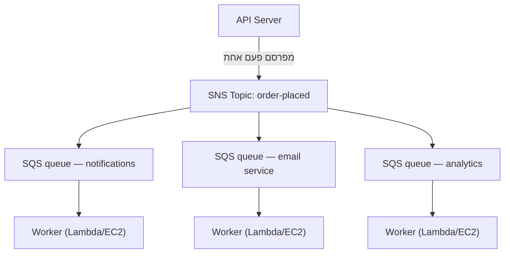

# פרק 19: מכונת הכרטיסים

מכונת הכרטיסים הייתה מהפכה שקטה. קח מספר, חכה שיקראו לך. התור הפך לתור-המתנה. אנשים יכלו לשבת. דלפק השירות עבד בקצב שלו. אף אחד לא חסם אף אחד.

לפני מכונת הכרטיסים, היית צריך לעמוד בתור. המיקום שלך בתור דרש את נוכחותך הפיזית. לא יכולת לעשות שום דבר אחר בזמן ההמתנה. ואם האדם בראש התור היה איטי, כל מי שמאחוריו נעצר.

מכונת הכרטיסים הפרידה בין הגעה לבין שירות. הגעת, לקחת מספר, והמערכת זכרה את מקומך. יכולת ללכת לשבת. דלפק השירות עבר דרך המספרים בכל קצב שהצליח לנהל. אם הדלפק היה סגור זמנית, מגיעים חדשים עדיין קיבלו מספרים. הם המתינו. העבודה לא נעלמה — היא נכנסה לתור.

ההמצאה הקטנה הזו היא אחת הדוגמאות העתיקות ביותר של decoupling במערכות אנושיות. עד סוף פרק זה, Nimbus תבנה את מכונת הכרטיסים שלה — בתוכנה — והסיבה שהיא הייתה זקוקה לה מתחילה בשש-עשרה דקות של השבתה בערב יום שישי.

---

הצוות שרד את כשל ה-AZ. Leo תיקן את תהליך הנדסת הכאוס, וה-runbook היה איתן. התנועה התאוששה והלכה וגדלה שוב — מהר יותר מקודם, למעשה. תיעוד ה-Aurora ש-Leo קרא מאוחר בלילה היה עדיין כמה פרקים לפני המקום שבו Nimbus באמת הייתה.

אבל עם תנועה גדלה ויותר מסעדות מצטרפות, סוג אחר של צוואר בקבוק הפך לנראה. לא בתשתית. בקוד האפליקציה עצמו. שרשרת הבקשות שעבדה בסדר ב-200 הזמנות לשעה החלה להראות מתח ב-800.

ואז הגיע ערב ה-14.

---

זה התחיל עם דאשבורד האנליטיקה. ב-18:47 ביום שישי, פריסה לשירות האנליטיקה הכניסה באג של timeout. השירות החל להגיב תוך 8 שניות במקום 200 המילישניות הרגילות.

זרימת ההזמנות הייתה סינכרונית. כל הזמנה חיכתה לשירות האנליטיקה לפני אישור ללקוח. שמונה שניות הפכו ל-12 כשהעומס גדל. מאגר החיבורים של ה-API החל להתמלא בבקשות שמחכות לשלב האנליטיקה להסתיים.

ב-18:53, מאגר החיבורים הגיע לגבולו. בקשות חדשות החלו להיכשל מיד — לא כי לא ניתן היה לעבד את ההזמנה, אלא כי לא היה חיבור זמין כדי להתחיל לעבד אותה.

‏"שירות האנליטיקה הפיל את זרימת ההזמנות," אמר Leo, מסתכל בלוגים למחרת בבוקר. "אין להם שום קשר זה לזה. שירות האנליטיקה רק מחשב דאשבורדים."

‏"אבל הם באותה שרשרת בקשות," אמרה Priya.

‏"שש-עשרה דקות של השבתה," אמרה Maya. "ושלושה לקוחות חויבו פעמיים."

החיוב הכפול היה גרוע יותר מההשבתה. בכאוס של רוויית מאגר החיבורים, מנגנון ניסיון חוזר הופעל עבור חלק מהבקשות שלמעשה הצליחו — שלב התשלום הסתיים, ואז הבקשה עברה timeout לפני שחזרה, וניסיון החוזר ניסה את התשלום שוב. אותו כרטיס, אותו סכום, שני חיובים.

‏"מנגנון הניסיון החוזר היה אמור לעזור," אמר Leo.

‏"הוא עזר בכיוון הלא נכון," אמרה Priya. "והאם חשבנו על מה שקורה כשננסה לזכות את הלקוחות האלה? תהליך הזיכוי משתמש באותה זרימת הזמנות שנכשלה."

שש-עשרה דקות של השבתה ושלושה חיובים כפולים. זו הייתה העלות העסקית של שרשרת הבקשות הסינכרונית.

---

ל-Nimbus הייתה בעיה שלא הרגישה כמו בעיה עד שההזמנות נעשו פופולריות.

בכל פעם שהוזמנה הזמנה, שרת ה-API היה צריך:

1. לשמור את ההזמנה במסד הנתונים
2. לשלוח הודעה לטאבלט של המסעדה
3. לשלוח אימייל אישור ללקוח
4. לעדכן את דאשבורד האנליטיקה של המסעדה
5. לרשום את האירוע לחיוב

בדלפק מעדנייה עמוס, האדם בקופה לא מחכה שהפורס יסיים לפרוס לפני שהוא עובר ללקוח הבא. הוא לוקח את ההזמנה, מוסר אותה למטבח, ומתחיל לשרת את האדם הבא. המטבח עובד דרך ההזמנות בקצב שלו. הלקוח מקבל שירות מהיר יותר. המטבח לא מוצף מהתפרצויות פתאומיות. אם למטבח יש רגע איטי, ההזמנות נערמות מאחורי הדלפק במקום לגרום לשגיאות בקופה.

זו הייתה האנלוגיה. ל-Nimbus לא היו דלפק ומטבח. היה לה אדם אחד שעושה הכל ברצף לפני שהלקוח יכול ללכת.

וב-14, לאדם שחותך את הבשר הייתה בעיה. אז הדלפק נעצר. אז כל לקוח אחריו חיכה. המטבח, הקופה, הלקוחות — כולם הושהו כי שלב אחד בשרשרת האט.

התיקון לא היה להפוך את חיתוך הבשר למהיר יותר. התיקון היה להפריד את השלבים. קח את ההזמנה בקופה, מסור כרטיס, תן למטבח לעבוד.

‏"אנחנו מחוברים הדוק," אמרה Priya. "אם שלב כלשהו במורד הזרם נכשל, כל ההזמנה נכשלת. האם חשבנו על מה שקורה אם שירות האנליטיקה נפרץ ומתחיל לצרוך מסרים פגומים? כל ההזמנה נכשלת — כי אנחנו מחכים לו."

‏"מה אם היינו יכולים לשמור את ההזמנה ומיד לאשר ללקוח," אמר Leo, "ואז לעבד את השאר ברקע?"

‏"זה תור," אמרה Priya.

תובנת המפתח: הלקוח לא צריך לדעת שדאשבורד האנליטיקה עודכן לפני שהוא מקבל את האישור שלו. הוא צריך לדעת שההזמנה שלו התקבלה. אלה דברים שונים. השרשרת הסינכרונית ערבבה ביניהם.

**מודל ה-Decoupling**

זהו **decoupling**: הפרדת הרכיב שמקבל עבודה מהרכיבים שמעבדים אותה.

כל השלבים בזרימת ההזמנות של Nimbus היו צריכים לקרות סינכרונית לפני שה-API יכל להגיב ללקוח. אם שירות האימייל היה איטי (לפעמים הוא היה), הלקוח חיכה. אם דאשבורד האנליטיקה היה מושבת (לפעמים הוא היה), ההזמנה נכשלה.

המפולת ב-14 הדגימה בדיוק מדוע זה היה חשוב. לשירות האנליטיקה לא היה שום קשר לשאלה אם הזמנת לקוח התקבלה. אבל מכיוון שהוא ישב באותה שרשרת סינכרונית, הכשל שלו הפך לכשל של כולם.

במערכות תוכנה, התור הוא לעתים קרובות message broker — שירות שמקבל מסרים ממפיקים ומוסר אותם לצרכנים.

אולי אתם תוהים: אם זרימת ההזמנות היא כעת אסינכרונית, איך הלקוח יודע שההזמנה שלו באמת התקבלה? התשובה היא בתכנון הארכיטקטורה: ה-API שומר את ההזמנה במסד הנתונים (סינכרוני — זהו האישור הסמכותי), ואז מפרסם אירועים לתור. אישור הלקוח מבוסס על הצלחת הכתיבה למסד הנתונים, לא על השלמת השירותים במורד הזרם. אם שירות האימייל איטי, ללקוח כבר יש את האישור שלו. האימייל הוא רק מעקב נחמד-שיהיה.

**Amazon SQS: התור**

**Amazon SQS (Simple Queue Service)** הוא שירות תור המסרים המנוהל של AWS. הוא מאחסן מסרים בצורה עמידה עד שהם מעובדים על ידי צרכן.

הזרימה הבסיסית:

1. **מפיק** (שרת ה-API) מניח מסר בתור: `{ "orderId": "ORD-5532", "restaurantId": "47", "items": [...] }`
2. ה-API מגיב מיד ללקוח: "הזמנה אושרה!"
3. **צרכנים** (שירותי עובד נפרדים) קוראים מסרים מהתור ומעבדים אותם: שולחים את הודעת המסעדה, שולחים את אימייל האישור, מעדכנים אנליטיקה

חוויית הלקוח: אישור מיידי. העיבוד במורד הזרם: קורה אסינכרונית, בקצב של העובדים.

**מושגי מפתח של SQS**

**Visibility timeout של מסר**: כשצרכן קורא מסר מ-SQS, המסר הופך *בלתי נראה* לצרכנים אחרים לתקופה (ברירת מחדל: 30 שניות). זה נותן לצרכן זמן לעבד אותו. אם הצרכן מסיים בהצלחה, הוא מוחק את המסר. אם הצרכן קורס, ה-visibility timeout פג והמסר הופך נראה שוב לצרכן אחר לניסיון חוזר.

זה מבטיח מסירה לפחות-פעם-אחת: כל מסר יעובד לפחות פעם אחת, גם אם צרכן נכשל באמצע העיבוד.

אולי אתם תוהים: אם המסר הופך בלתי נראה בזמן העיבוד אבל לא נמחק כשהצרכן קורס, האם לא ייתכן שהוא יעובד פעמיים? כן — וזה נקרא מסירה לפחות-פעם-אחת. זה אומר שכל צרכן חייב להיות מתוכנן לטפל בקבלת אותו מסר יותר מפעם אחת בלי לגרום לבעיה. אימייל אישור הזמנה כפול הוא מעצבן. חיוב כפול הוא כרטיס תמיכה. תכננו את הצרכנים שלכם בהתאם.

ה-visibility timeout חייב להיות ארוך יותר מזמן העיבוד הצפוי הארוך ביותר שלכם. אם העיבוד בדרך כלל לוקח 20 שניות אבל מדי פעם לוקח 90 שניות, וה-visibility timeout שלכם הוא 30 שניות, אותו עיבוד מזדמן של 90 שניות ייראה כמו כשל ל-SQS. המסר הופך נראה שוב. צרכן שני אוסף אותו. כעת שני עובדים מעבדים את אותו מסר. אם העיבוד שלכם אינו אידמפוטנטי, יש לכם בעיה.

טעות נפוצה: לקבוע את ה-visibility timeout שווה לזמן העיבוד הממוצע. הגישה הנכונה: לקבוע אותו לזמן העיבוד באחוזון ה-99, עם מרווח ביטחון. אם זמן העיבוד P99 הוא 45 שניות, קבעו את ה-visibility timeout ל-90 שניות.

**Dead-letter queues (DLQ)**: אם מסר נכשל בעיבוד יותר מדי פעמים (ניתן להגדרה — למשל, 5 ניסיונות חוזרים), SQS מעביר אותו ל-dead-letter queue. אתם בודקים את ה-DLQ כדי להבין מדוע מסרים נכשלים מבלי לאבד אותם.

ה-DLQ הוא המקום שבו אתם לומדים מה באמת נכשל בייצור. בלעדיו, מסרים שנכשלו פשוט נעלמים ואין לכם דרך לחקור.

שלושה שבועות לאחר המעבר ל-SQS, Leo הבחין ש-23 מסרים הצטברו ב-DLQ של שירות ה-notification. הוא לא בדק את ה-DLQ (הוא הגדיר אותו נכון ואז הניח שיישאר ריק).

הוא שלף מסר אחד והסתכל ב-payload:

```json
{
  "orderId": "ORD-9821",
  "restaurantId": "12",
  "customerMessage": "Extra spicy please 🌶️🔥",
  "timestamp": "2024-01-18T19:43:11Z"
}
```

האמוג'י. שירות ה-notification של המסעדה היה מקודד את ה-payloads של המסרים כ-Latin-1 לפני שליחה ל-API הטאבלט הישן של המסעדה. תווי האמוג'י — ארבעה בייטים כל אחד ב-UTF-8 — נפגמו, מה שגרם ל-API הטאבלט לדחות את הבקשה. המסר היה מנסה שוב, נכשל שוב, מנסה שוב, נכשל שוב. לאחר 5 ניסיונות חוזרים, SQS העביר אותו ל-DLQ.

‏"בכל 23 המסרים יש אמוג'י בשדה הערות הלקוח," אמר Leo.

‏"אז כל לקוח שהוסיף אמוג'י להערות ההזמנה שלו, ההערה שלו נכשלה בשקט להגיע למסעדה," אמרה Maya.

‏"כן."

‏"לכמה זמן?"

Leo בדק את חותמת הזמן של המסר הישן ביותר. "שלושה שבועות."

Priya הייתה שקטה. "ומה אם מישהו היה מבין שהוספת אמוג'י להערת הזמנה גורמת לכשל שקט? יכולת לבצע הזמנות עם אמוג'י ולהבטיח שהמסעדה לעולם לא תראה את ההוראה. ואז להתלונן על ההזמנה הלא נכונה."

אף אחד לא ניצל את זה. אבל זו הייתה השאלה הנכונה לשאול.

Leo תיקן את באג הקידוד. לאחר מכן כתב סקריפט שישחק מחדש את כל 23 המסרים התקועים מה-DLQ. המסעדות קיבלו את הוראות האמוג'י החריף שלהן (בנות שלושה שבועות). הלקוחות מעולם לא ידעו.

הלקח: יש לנטר את ה-DLQ באופן פעיל, לא להגדיר ולשכוח. DLQ הולך וגדל הוא סיגנל שקט שמשהו נכשל שוב ושוב.

**סוגי תורים**:

**תורים סטנדרטיים**: תפוקה מרבית (מסרים בלתי מוגבלים לשנייה). סדר המסירה הוא best-effort (לא מובטח). מסירה לפחות-פעם-אחת (לעתים נדירות מאוד, מסר עשוי להימסר פעמיים).

**תורי FIFO**: סדר ראשון-נכנס, ראשון-יוצא קפדני. **עיבוד** פעם-אחת-בדיוק — דה-דופליקציה מבוססת `MessageDeduplicationId` בתוך חלון של 5 דקות. הסדר מובטח *לכל* `MessageGroupId`: מסרים באותה קבוצה מגיעים בסדר; קבוצות שונות יכולות להיות מעובדות במקביל, וכך FIFO מתרחב. תפוקת הבסיס היא 3,000 מסרים לשנייה עם batching ‏(300 בלי); הפעלת **מצב high-throughput** מעלה זאת לעשרות אלפים לשנייה על ידי חלוקה למחיצות לפי קבוצות מסרים. השתמשו ב-FIFO כשהסדר חשוב (עסקאות פיננסיות, שינויי מצב סדרתיים).

אם אתם צריכים תפוקה מרבית ויכולים לסבול מסרים כפולים מזדמנים, השתמשו ב-SQS Standard — אבל אתם חייבים לתכנן כל צרכן לטפל בכפילויות בלי לגרום לבעיות. אם אתם צריכים סדר קפדני ועיבוד פעם-אחת-בדיוק, השתמשו ב-SQS FIFO — ותכננו את ה-`MessageGroupId`s שלכם היטב, כי המקבילות (ולכן התפוקה) מגיעה מהחזקת קבוצות רבות.

עבור Nimbus, רוב התורים השתמשו בתורים סטנדרטיים. תור החיוב השתמש ב-FIFO כדי להבטיח שהחיובים יעובדו בסדר.

**Auto Scaling לפי עומק תור: התאמת עובדים לפיגור**

אחד היישומים החזקים ביותר של SQS הוא שימוש בעומק התור כטריגר ל-Auto Scaling. במקום להתרחב על בסיס CPU או זיכרון, אתם מתרחבים על בסיס כמה עבודה ממתינה.

עבור שירות ה-notification של Nimbus: עומק תור ה-SQS (מספר המסרים שממתינים לעיבוד) חובר למדיניות Application Auto Scaling עבור שירות ה-ECS שמריץ את עובדי ה-notification.

מדיניות: כשבתור יש יותר מ-50 מסרים לכל משימת עובד, הוסף משימה. כשבתור יש פחות מ-10 מסרים לכל משימת עובד, הסר משימה.

האפקט המעשי: כש-1,200 הזמנות הגיעו בשיא ערב יום שישי, עומק תור ה-notification קפץ וצי העובדים התרחב מ-2 משימות ל-8 משימות תוך 3 דקות. עד חצות, התור היה ריק והצי חזר ל-2.

‏"כמה זה עולה לחודש?" שאל Tom, מסתכל בגרף ה-Auto Scaling.

‏"שום דבר נוסף עבור ה-Auto Scaling עצמו," אמר Leo. "אבל 6 משימות ECS נוספות למשך 3 שעות בערבי שישי — זה משמעותי."

Tom חישב. "בערך $14 לחודש עבור השיאים האלה. וקודם, הרצנו 8 משימות ברציפות בעלות מלאה?"

‏"כן."

‏"אז אנחנו משלמים עבור ההתפרצות כשאנחנו צריכים אותה ולא משלמים כלום אחרת."

זהו דפוס ה-scaling לפי עומק תור: התור הופך לחוצץ שסופג שיאי תנועה, וצי העובדים מתרחב כדי לרוקן את החוצץ. המשתמשים לא חווים איטיות — הם קיבלו את האישור שלהם מיד כשההזמנה התקבלה. העובדים פשוט לוקחים קצת יותר זמן להדביק את הפער. ומכיוון שאינכם מריצים קיבולת שיא 24/7, העלויות נמוכות משמעותית.

**Amazon SNS: המשדר**

**Amazon SNS (Simple Notification Service)** הוא שירות מסרים מסוג פרסום/מינוי (pub/sub). במקום מפיק אחד, צרכן אחד (תור), SNS תומך במסירת מסר אחד ל*מנויים רבים* בו-זמנית.

המודל:

1. **מפרסם** שולח מסר ל-**topic** של SNS
2. כל **המנויים** של אותו topic מקבלים את המסר בו-זמנית (fan-out)

מנויים יכולים להיות:

- תורי SQS (דוחפים את המסר לתור לעיבוד אסינכרוני)
- פונקציות Lambda (מפעילים את הפונקציה ישירות)
- endpoints של HTTP/HTTPS ‏(מסירת webhook)
- כתובות אימייל
- SMS (מספרי טלפון)

עבור Nimbus, אירוע ההזמנה-בוצעה מתפרסם ל-topic של SNS בשם `order-events`:

- שירות ה-notification של המסעדה נרשם (מקבל בתור ה-SQS שלו)
- שירות האימייל נרשם (מקבל בתור ה-SQS שלו)
- שירות האנליטיקה נרשם (מקבל בתור ה-SQS שלו)
- שירות החיוב נרשם (מקבל בתור ה-SQS FIFO שלו)

אירוע הזמנה אחד. ארבעה מנויים. כולם מקבלים הודעה בו-זמנית. כל אחד מעבד בקצב שלו.

‏"אז SNS הוא ההכרזה," אמרה Maya, "ו-SQS הוא תיבת הדואר הנכנס שבה כל צוות מעבד את ההכרזה במהירות שלו. אז למה להשתמש בשניהם? למה לא פשוט שכולם יירשמו ל-topic של SNS ישירות?"

‏"כי מסירת SNS ישירה היא fire-and-forget," אמר Leo. "אם שירות האנליטיקה מושבת כש-SNS שולח, המסר הזה אבד. עם תור SQS באמצע, המסר ממתין עד שהשירות מתאושש."

‏"בדיוק," אמרה Priya. "ה-fan-out של SNS/SQS הוא הדפוס הסטנדרטי."

**דפוס ה-Fan-Out של SNS/SQS**

השילוב הזה — topic של SNS שמזין מספר תורי SQS — הוא אחד הדפוסים הארכיטקטוניים החשובים ביותר ב-AWS:



כל תור עצמאי. שירות האנליטיקה יכול להיות איטי — התור שלו מתמלא, אבל שירותי ה-notification והאימייל ממשיכים ללא הפרעה. אם שירות האנליטיקה נופל, המסרים שלו ממתינים בתור עד שהוא חוזר. שום דבר לא אובד.

זו התכונה המרכזית: **כשל עצמאי**. בעיות בצרכן אחד לא מתפשטות לאחרים.

**סינון מסרים: לא כל מסר לכל מנוי**

ככל שמערכות גדלות, אתם לא רוצים שכל מנוי יעבד כל מסר. שירות אנליטיקה לא צריך לקבל מסרים על עיבוד תשלום שנכשל אם אכפת לו רק מהזמנות שהושלמו.

**סינון מסרים של SNS** מאפשר למנויים לציין מדיניות סינון — למסור רק מסרים שתואמים תכונות מסוימות.

שירות ה-notification של המסעדה נרשם עם פילטר: רק מסרים שבהם `status = "confirmed"`.

שירות התראת השגיאות נרשם עם פילטר: רק מסרים שבהם `status = "failed"`.

כל מנוי מקבל רק את מה שהוא צריך.

ללא סינון, כל מנוי מקבל כל מסר וחייב להתעלם ממה שלא רלוונטי. זה מבזבז עיבוד, מבזבז כסף (SQS מחייב לכל מסר), ומכניס רעש. מערכת הזמנות בנפח גבוה ללא סינון הייתה מציפה את תור התראת השגיאות בהזמנות מוצלחות — מה שמקשה למצוא את הכשלים האמיתיים.

מדיניות סינון נראית כך:

```json
{
  "status": ["confirmed"],
  "region": ["us-west-2", "us-east-1"]
}
```

מנוי זה מקבל רק מסרים שבהם הסטטוס הוא "confirmed" וגם האזור הוא או "us-west-2" או "us-east-1". מסרים שלא תואמים את המדיניות אינם נמסרים לתור של מנוי זה כלל — הם אפילו לא מגיעים ל-SQS.

‏"אז הסינון קורה בשכבת ה-SNS," אמרה Priya, "לפני שמסרים נכתבים ל-SQS?"

‏"נכון. תור ה-SQS עבור שירות ה-notification של המסעדה אי פעם רואה רק מסרים שעליו לפעול לפיהם."

‏"ומה אם מישהו ינסה לפרוץ פנימה על ידי פרסום מסר מעוצב במיוחד ל-topic של SNS שתואם את כל פילטרי המנויים?" שאלה Priya.

ל-topic של SNS הייתה מדיניות משאב IAM: רק שירות ה-API של ההזמנות (לפי תפקיד ה-IAM שלו) הורשה לפרסם. מדיניות הגישה של SNS ומדיניות התור של SQS היוו את שכבת בקרת הגישה — הסינון היה רק לניתוב, לא לאבטחה.

**מתי להשתמש ב-SQS לעומת SNS**

**SQS לבד**: מפיק אחד, צרכן אחד (או מספר צרכנים מתחרים על אותו תור). מסרים צריכים להיות מעובדים פעם אחת, בסדר (FIFO) או לא (standard). דפוס תור עובדים — תור אחד, מספר עובדים צורכים ממנו.

**SNS לבד**: התראות fire-and-forget. דחיפה לאימייל, SMS, או endpoints של HTTP. אין צורך להכניס את המסר לתור — רק להודיע ולהמשיך הלאה.

**SNS + SQS (fan-out)**: אירוע אחד, מספר צרכנים עצמאיים. לכל צרכן יש תור משלו, מעבד באופן עצמאי, ויכול להיכשל באופן עצמאי.

## SNS FIFO Topics

כל מה שלמעלה על SNS משתמש ב-topics סטנדרטיים — יש להם תפוקה למעשה בלתי מוגבלת, הם מוסרים למנויים כמעט בו-זמנית, והם עושים את העבודה עבור הרוב המכריע של מקרי השימוש.

אבל topics סטנדרטיים של SNS אינם מבטיחים סדר. אם אתם מפרסמים עשרה מסרים ברצף, מנויים עשויים לקבל אותם בסדר מעט שונה. עבור הודעות ההזמנות של Nimbus, זה בסדר — עדכון אנליטיקה שמגיע חלקיק שנייה לפני אישור אימייל לא משנה.

עבור חלק מהתרחישים, זה כן משנה. שקלו ספר חשבונות פיננסי: אם שני אירועים — זיכוי ואז חיוב — נמסרים בסדר הפוך, חישובי היתרה במהלך העיבוד יהיו שגויים גם אם שני האירועים מעובדים בסופו של דבר נכון.

**Topics של SNS FIFO** מיישמים את אותו עיקרון כמו תורי SQS FIFO על מודל ה-fan-out. מסרים נמסרים למנויים בדיוק בסדר שבו פורסמו, וכל מסר נמסר פעם אחת בדיוק.

ה-trade-off: ל-topics של SNS FIFO תפוקת בסיס דומה ל-SQS FIFO ‏(3,000 מסרים לשנייה לכל topic; ‏300 לשנייה לכל קבוצת מסרים — עם מצב high-throughput זמין מאז 2025 להרבה יותר), והם עושים fan-out רק ל-**תורי SQS** — FIFO או, מאז 2023, Standard. רישום תור Standard שימושי עבור צרכנים שלא אכפת להם מהסדר (פיד אנליטיקה, למשל), אבל סדר ופעם-אחת-בדיוק שורדים מקצה לקצה **רק** לתוך תורי FIFO. אתם לא יכולים להשתמש ב-topic של SNS FIFO כדי למסור ל-endpoints של HTTP או לכתובות אימייל.

עבור צינור החיוב של Nimbus — שבו רצף של עדכוני תמחור היה צריך להיות מיושם על חשבונות מסעדה בסדר — ה-topic של SNS לחיוב הועבר מ-standard ל-FIFO. תור החיוב של SQS כבר היה FIFO. ה-fan-out כעת הבטיח שאירוע עליית-מחיר לעולם לא יגיע למעבד החיוב לפני אירוע תחילת-התקופה שהוא תלוי בו.

> **טיפ למבחן — SNS FIFO**
>
> אם תרחיש דורש **מסירת fan-out מסודרת** על פני מספר מנויים, התשובה היא **SNS FIFO**. SNS סטנדרטי אינו מבטיח סדר. SNS FIFO עושה fan-out רק לתורי SQS — כדי לשמור על סדר ופעם-אחת-בדיוק מקצה לקצה, המנוי חייב להיות תור SQS **FIFO** (רישומי תור Standard מותרים אבל מקבלים סדר best-effort ומסירה לפחות-פעם-אחת). תפוקת ברירת המחדל היא 3,000/שנייה לכל topic — אם התרחיש מתאר נפח גבוה בהרבה *וגם* סדר קפדני, זה סיגנל להסתכל על ארכיטקטורות חלופיות (Kinesis, למשל, שמכוסה בפרק מאוחר יותר).

## כשהתור הישן לא מרפה

Nimbus עמדה לסגור את הרכישה הגדולה ביותר שלה עד כה: Barato, מתחרה במשלוחי אוכל עם 200 מסעדות ויתרון של שנתיים בתפעול. צוות ההנדסה קבע שיחת תכנון אינטגרציה.

השיחה נמשכה עשרים דקות לפני ש-Leo השתתק.

‏"מערכת עיבוד ההזמנות שלהם," אמר. "על מה היא רצה?"

‏"ActiveMQ," אמר מהנדס Barato בצד השני. "ברוקר on-prem. האפליקציה היא Java. היא רצה מאז 2018. הכל מדבר AMQP."

‏"AMQP," אמר Leo.

‏"כן."

הוא הסתכל בתרשים הארכיטקטורה במסך שלו. Nimbus הריצה SQS ו-SNS. SQS לא מדבר AMQP. SNS לא מדבר AMQP. אפליקציית Barato לא דיברה שום דבר אחר.

‏"כתיבה מחדש שלה תיקח שישה חודשים," אמר Leo לצוות אחרי השיחה. "לכל הפחות."

‏"אנחנו לא יכולים לעכב את הרכישה בשישה חודשים," אמרה Maya.

‏"ואנחנו לא יכולים להריץ ברוקר ActiveMQ על bare-metal ב-AWS," הוסיפה Priya. "האם חשבנו על איך זה נראה מנקודת מבט של אבטחה ואמינות? message broker בניהול עצמי, יושב בייצור, ללא תיקון מנוהל, ללא failover אוטומטי, מתחבר לתשתית שלנו?"

‏"יש אפשרות מנוהלת," אמר Leo לאט. הוא קרא בזמן שדיברו. "Amazon MQ."

**Amazon MQ: הברוקר המנוהל**

**Amazon MQ** הוא שירות message broker מנוהל עבור Apache ActiveMQ ו-RabbitMQ. הוא מריץ את הברוקר הקיים שלכם — אותו ברוקר שהאפליקציות שלכם היו מחוברות אליו שנים — אבל כשירות AWS מנוהל. AWS מטפל בתשתית הבסיסית: הקצאה, תיקון, failover, גיבויים.

התכונה המרכזית שהופכת את Amazon MQ לשונה מ-SQS ו-SNS: הוא מדבר את הפרוטוקולים ש-message brokers ישנים מדברים. AMQP, STOMP, MQTT, OpenWire, NMS. הפרוטוקולים ש-SQS ו-SNS פשוט לא מבינים.

עבור האינטגרציה של Barato, התוכנית הייתה פשוטה. AWS היה מריץ ברוקר Amazon MQ שהוגדר כ-ActiveMQ. אפליקציית ה-Java של Barato הייתה מופנית ל-endpoint הברוקר החדש במקום זה ה-on-premises. השינוי בצד האפליקציה: עדכון קובץ תצורה אחד עם מחרוזת החיבור החדשה. זה היה הכל. האפליקציה לא הייתה צריכה לדעת שהיא מדברת עם ברוקר ענן מנוהל במקום שרת במשרד של Barato.

‏"רגע," אמרה Maya. "אם אנחנו הולכים לשלב אותם ב-Nimbus בסופו של דבר, האם לא כדאי פשוט להעביר אותם ל-SQS מההתחלה?"

‏"כי נתיב המעבר קיים," אמר Leo. "וכדאי לעשות אותו כראוי — בסופו של דבר. אבל כרגע, אנחנו צריכים את Barato תפעולית על תשתית AWS בשלושים יום, לא בשישה חודשים. Amazon MQ מריץ את האפליקציה בלי לשנות את האפליקציה. ואז יש לנו זמן לתכנן את המעבר ל-SQS כפרויקט מכוון, לא כתנאי מוקדם מבוהל לרכישה."

‏"כמה זה עולה לחודש?" שאל Tom.

ברוקר ה-Amazon MQ — זוג active/standby יחיד לאמינות — היה בטווח של $200 לחודש עבור ברוקר מתאים לנפח של Barato. בהשוואה לעלות של שישה חודשי זמן כתיבה מחדש, זה לא היה ויכוח.

Priya אישרה את התוכנית בתנאי אחד: מכונת ה-Amazon MQ תחיה ב-subnet פרטי, עם כללי security group שמתירים חיבורים רק משרתי האפליקציה של Barato. ללא חשיפה ציבורית. רישום audit מופעל.

המעבר לקח שנים-עשר יום. אפליקציית Barato התחברה ל-Amazon MQ ביום שלושה-עשר. ביום ארבעה-עשר, היא עיבדה את ההזמנה הראשונה שלה על תשתית AWS ללא שינוי קוד אחד.

---

> **טיפ למבחן — Amazon MQ**
>
> *SAA-C03 Domain: Design Resilient Architectures (Domain 2)*
>
> המבחן מבחין בין Amazon MQ ל-SQS ו-SNS על ציר יחיד: **תאימות פרוטוקול**. אם התרחיש מתאר אפליקציה שכבר משתמשת ב-message broker ומדברת פרוטוקול ספציפי, Amazon MQ כמעט בוודאי התשובה.
>
> הסיגנלים המרכזיים: **"ActiveMQ," "RabbitMQ," "AMQP," "STOMP," "MQTT," "OpenWire,"** או כל ביטוי שווה ערך ל-**"ללא שינוי קוד האפליקציה."** אם אתם רואים את הביטויים האלה, התשובה היא Amazon MQ — לא SQS, לא SNS.
>
> אם התרחיש מתאר אפליקציה *חדשה* שצריכה decoupling, או לא מזכיר ברוקר ישן או פרוטוקול ספציפי, השתמשו ב-SQS/SNS.
>
> סיגנל נוסף: "העברת message broker on-premises קיים ל-AWS." אם האפליקציה צריכה להמשיך לדבר את אותו פרוטוקול לאותו סוג ברוקר, Amazon MQ הוא תשובת ה-lift-and-shift.

## חוזקות ומגבלות

**מדוע SQS ו-SNS חזקים**:

- SQS מספק מסירת מסרים עמידה ואמינה — מסרים מאוחסנים על פני מספר AZs
- Decoupling מאפשר קנה מידה ופריסה עצמאיים של שירותי מפיק וצרכן
- Dead-letter queues מבטיחים שאף מסר לא אובד בשקט בעת כשל
- דפוס ה-fan-out של SNS מאפשר הוספת צרכנים חדשים בלי לשנות את המפיק

**איפה זה מסתבך**:

- מסירה לפחות-פעם-אחת אומרת שצרכנים חייבים להיות *אידמפוטנטיים* — עיבוד אותו מסר פעמיים לא צריך לגרום לבעיות (הזמנות כפולות, חיובים כפולים)
- תורי FIFO יקרים יותר ויש להם מגבלות תפוקה
- ניפוי באגים של מסרים שנכשלו על פני מספר תורים ושירותים דורש רישום ותצפיתיות טובים
- ערובות סדר מסרים מוגבלות — אם סדר קפדני חשוב על פני מספר שירותים, התכנון מסתבך

**אידמפוטנטיות: צלילה מעשית לעומק**

אידמפוטנטיות נשמעת מופשטת עד שחווית שלושה לקוחות שחויבו פעמיים.

פעולה היא **אידמפוטנטית** אם הרצתה מספר פעמים מייצרת את אותה תוצאה כמו הרצתה פעם אחת. פעולת חיוב אינה אידמפוטנטית באופן טבעי: הרצתה פעמיים מחייבת פעמיים. פעולת חיוב אידמפוטנטית בודקת אם החיוב כבר עובד לפני שהיא מנסה אותו.

הדפוס: כל מסר נושא ID ייחודי (ה-order ID, או message ID נפרד). לפני עיבוד, הצרכן בודק מאגר (DynamoDB עובד טוב לזה) כדי לראות אם ה-message ID הזה כבר עובד בהצלחה. אם כן: לא לעשות כלום, למחוק את המסר. אם לא: לעבד, לרשום את ה-ID, למחוק את המסר.

```python
def process_charge(message):
    order_id = message['orderId']
    
    # בדיקת אידמפוטנטיות
    if already_processed(order_id):
        logger.info(f"Order {order_id} already charged, skipping duplicate")
        return  # המסר יימחק מהתור
    
    # עיבוד החיוב
    charge_result = payment_service.charge(
        amount=message['amount'],
        card_token=message['cardToken'],
        idempotency_key=order_id  # מעבירים גם למעבד התשלומים
    )
    
    # רישום שעיבדנו את זה
    mark_as_processed(order_id, charge_result)
```

מפתח האידמפוטנטיות צריך להיות מועבר גם לשירותים במורד הזרם (מעבדי תשלום, מערכות אימייל) שתומכים בו. Stripe, למשל, מקבל header של `Idempotency-Key` שמונע חיובים כפולים גם אם אותה קריאת API מבוצעת פעמיים.

‏"ומה לגבי correlation IDs?" שאלה Priya. "כשמסר נע דרך מספר שירותים, איך אנחנו עוקבים אחר איזו בקשה גרמה לאיזו פעולה במורד הזרם?"

**Correlation IDs: מעקב על פני שירותים**

כשלקוח מבצע הזמנה, הבקשה זורמת דרך: API ← SNS ← SQS ← עובד notification ← API הטאבלט של המסעדה ← SQS ← עובד אימייל ← SES.

ללא correlation IDs, אם ה-API של הטאבלט של המסעדה מחזיר שגיאה בשלב 6, הלוגים בכל שירות מראים את האירוע, אבל אין דרך לעקוב אחריו בחזרה להזמנה הספציפית של הלקוח מההתחלה.

**correlation ID** הוא מזהה ייחודי המצורף לבקשה המקורית ומועבר דרך כל אינטראקציה של שירות. כל שירות כולל את ה-correlation ID בלוגים שלו.

כש-Priya מחפשת ב-CloudWatch correlation ID ספציפי, היא מקבלת כל שורת לוג — על פני כל שירות — שהייתה חלק מעיבוד אותה הזמנה יחידה.

‏"הסתייגות אחת," אמרה Priya. "Correlation IDs מגיעים מבחוץ. האם מישהו יכול להזריק ID זדוני ולפגוע ברישום שלנו?"

Correlation IDs הם פנימיים — הם לא משפיעים על לוגיקת העיבוד, רק על רישום. ניקוי שלהם (אלפאנומרי, אורך קבוע) מונע התקפות הזרקה בפלטי לוג.

**מתי Decoupling היא הבחירה הלא נכונה**

‏"רגע — אבל *למה* לא נעשה decouple לכל דבר?" שאלה Maya.

זו הייתה שאלה הוגנת. אם decoupling מונע את כשלי המפולת והופך מערכות לעמידות, מדוע לא ליישם אותו בכל מקום?

כי ל-decoupling יש עלויות. ויש תרחישים שבהם העלויות האלה עולות על היתרונות.

**כשאתם צריכים עקביות מיידית**: אם תשלום חייב להיות מאושר לפני שהזמנה יכולה להמשיך — והמשתמש מחכה על המסך לתוצאה — אתם לא יכולים להכניס את התשלום לתור אסינכרוני ולהחזיר אישור לפני שאתם יודעים אם החיוב הצליח. המשתמש עלול להזמין פעמיים לפני שהחיוב הראשון מסתיים. decoupling אסינכרוני לא עובד עבור פעולות שבהן התגובה תלויה בתוצאה.

**כשזרימת העבודה סדרתית מטבעה**: אם שלב 3 חייב לראות את התוצאה של שלב 2 כדי לקבל החלטה, הם לא יכולים לרוץ במקביל מתור. כפיית שלהם לתור יוצרת מנגנון העברת-תוצאות מסורבל שלעתים קרובות מסתיים בכך שהוא מורכב יותר מהגרסה הסינכרונית.

**כשסדר המסרים קריטי והנפח נמוך**: SQS Standard אינו מבטיח סדר. SQS FIFO כן, אבל מוגבל ל-3,000 מסרים/שנייה עם batching כברירת מחדל (מצב high-throughput מעלה זאת משמעותית). אם יש לכם זרימת עבודה בנפח נמוך וסדר קפדני, תור סינכרוני פשוט (כמו נעילת שורה במסד נתונים) עשוי להיות פשוט ואמין יותר.

**כשהתקורה עולה על היתרון**: כלי פנימי קטן עם משתמש אחד וללא SLA כנראה לא צריך topics של SNS fan-out ו-DLQs. התקורה התפעולית של ניטור תורים ו-DLQs היא אמיתית. התאימו את הארכיטקטורה לגודל הבעיה.

השאלה אינה "האם עליי לעשות decouple לזה?" היא "מהי עלות הצימוד הזה, והאם decoupling מפחית את העלות הזו יותר ממה שהוא מוסיף?"

## סיכום

Decoupling הוא עקרון העמידות מפרק 18 שמיושם על ארכיטקטורה פנימית: באותו אופן ש-Multi-AZ מבטל נקודות כשל יחידות בתשתית, SQS ו-SNS מבטלים נקודות כשל יחידות בשרשרות בקשות.

- **Decoupling** מפרידה רכיבים שמייצרים עבודה מרכיבים שמעבדים אותה.
- **SQS** נותן למפיקים מקום עמיד להניח בו עבודה כשצרכנים איטיים, לא מקוונים, או מתרחבים.
- **SNS** מאפשר לאירוע אחד להגיע למספר צרכנים עצמאיים בלי שהמפרסם יודע מי הם.
- **SNS + SQS fan-out** מאפשר לכל שירות במורד הזרם לעבד את אותו אירוע בקצב שלו.
- **DLQs, אידמפוטנטיות, ו-correlation IDs** הם המשמעת התפעולית שהופכת מערכות אסינכרוניות לניתנות לניפוי באגים במקום למסתוריות.
- **אל תעשו decouple באופן עיוור**: זרימות עבודה סינכרוניות, דרישות עקביות מיידית, וכלים קטנים בסיכון נמוך עשויים שלא להצדיק את משטח התפעול הנוסף.

## טיפים למבחן

*SAA-C03 Domain: Design Resilient Architectures (Domain 2, Task 2.1)*

- **SQS Standard לעומת FIFO**: המבחן מבחין לפי ערובות סדר ומסירה. "חייב לעבד בסדר" ← FIFO. "תפוקה מרבית" ← Standard.
- **Auto Scaling לפי עומק תור**: "התאם עובדים על בסיס עומק תור" ← מדד SQS ‏(ApproximateNumberOfMessagesVisible) שמשמש עם Application Auto Scaling או ECS Service Auto Scaling.
- **Visibility timeout**: מושג מפתח למסירה לפחות-פעם-אחת. אם צרכן נכשל, המסר הופך נראה שוב לאחר ה-timeout. תרחיש מבחן: "מסרים מעובדים פעמיים" ← ה-visibility timeout קצר מדי (הצרכן לוקח יותר זמן מה-timeout לעבד).
- **Dead-letter queue**: מסרים שנכשלים לאחר N ניסיונות חוזרים מועברים לכאן. תרחיש מבחן: "ודא שאף מסר לא אובד, גם אם העיבוד נכשל שוב ושוב" ← DLQ.
- **SNS fan-out**: דפוס מבחן קלאסי לאירוע אחד שמפעיל מספר צרכנים. "הודעת הזמנה בוצעה חייבת להפעיל אימייל, SMS, ועדכון מלאי בו-זמנית" ← topic של SNS עם רישומי SQS.
- **SQS + Lambda**: ניתן להגדיר את Lambda לסקור תור SQS ולהפעיל על כל אצווה של מסרים. המבחן משתמש בזה לעיבוד מונע-אירועים בקנה מידה.
- **SQS long polling**: במקום שצרכנים יסקרו כל כמה שניות (short polling, מבזבז קריאות API), long polling ממתין עד 20 שניות למסר. מפחית עלויות ותגובות ריקות שגויות.
- **ספריית SQS extended client**: עבור מסרים גדולים ממגבלת ה-payload של התור (256KB כברירת מחדל; ניתן להעלאה ל-1MB מאז 2025), השתמשו ב-SQS Extended Client Library, ששומרת את גוף המסר ב-S3 ושולחת הפניה דרך SQS. המבחן עדיין מתייחס ל-256KB כמגבלת ה-SQS — "מסר SQS גדול מדי" ← Extended Client Library + S3.
- **סינון מסרים של SNS**: מנויים מקבלים רק מסרים שתואמים את מדיניות הסינון שלהם. תרחיש מבחן: "שלח התראות התואמות קריטריונים ספציפיים בלבד למנוי" ← סינון מסרים של SNS.
- **הערה**: SNS/SQS fan-out מופיע גם בתרחישי Domain 3 על ארכיטקטורות עיבוד אסינכרוני בתפוקה גבוהה. דעו את הדפוס הן לשאלות עמידות והן לשאלות ביצועים.
- **סיגנלים של Amazon MQ**: "ActiveMQ," "RabbitMQ," "AMQP," "STOMP," "MQTT," "OpenWire," או "ללא שינוי קוד האפליקציה" ← Amazon MQ, לא SQS. אם התרחיש אומר אפליקציה חדשה שצריכה decoupling ← SQS/SNS.
- **SNS FIFO לעומת Standard**: SNS סטנדרטי אינו מבטיח סדר. אם התרחיש דורש **fan-out מסודר** ← topic של SNS FIFO שמזין תורי SQS FIFO. זכרו: SNS FIFO לא יכול למסור ל-endpoints של HTTP או אימייל — רק לתורי SQS ‏(FIFO לסדר/פעם-אחת-בדיוק; רישומי Standard עובדים אבל יורדים לסדר best-effort ומסירה לפחות-פעם-אחת).

## תרגילים

**תרגיל 1 — היזכרות**

הסבירו את דפוס ה-fan-out של SNS/SQS. מדוע הדפוס משתמש בתורי SQS במקום שהשירותים יירשמו ישירות ל-topic של SNS עם endpoints של HTTP?

*(רמז: חשבו על מה שקורה אם אחד מ-endpoints של HTTP מושבת כש-SNS מפרסם מסר.)*

**תרגיל 2 — תרחיש SAA-C03**

*תרחיש*: פלטפורמת מסחר אלקטרוני מעבדת 10,000 הזמנות לשעה. כשמתבצעת הזמנה, המערכת חייבת: (1) לאחסן את ההזמנה במסד הנתונים, (2) לנכות מלאי, (3) לשלוח אימייל אישור, ו-(4) לעדכן את דאשבורד האנליטיקה. כרגע, כל ארבעת השלבים קורים סינכרונית — אם שירות האנליטיקה איטי, לקוחות מחכים. הצוות רוצה לשפר את זמן התגובה הפונה ללקוח תוך הבטחה שאף הזמנה לא תאבד.

איזו ארכיטקטורה עונה הכי טוב על דרישה זו?

A) השתמש בתורי SQS FIFO כדי לעבד את כל ארבעת השלבים ברצף  
B) גרום ל-API לשמור את ההזמנה ולאשר מיד ללקוח; פרסם אירוע ל-topic של SNS; גרום לשירותי המלאי, האימייל והאנליטיקה להירשם דרך תורי SQS  
C) השתמש במכונות EC2 מקבילות כדי לעבד כל שלב בו-זמנית, סינכרונית  
D) השתמש ב-API Gateway עם אימות בקשות כדי להאיץ את עיבוד ההזמנות

**רמז 1**: אישור הלקוח צריך להיות מיידי. אילו שלבים חייבים לקרות לפני התגובה, ואילו יכולים לקרות אחריה?

**רמז 2**: שירות האנליטיקה שאיטי לא צריך להשפיע על שירותי האימייל או המלאי.

**רמז 3**: SNS fan-out מאפשר לכל שלושת השירותים במורד הזרם לקבל את האירוע בו-זמנית.

**תשובה**: B

**הסבר**: ה-API שומר את ההזמנה במסד הנתונים (סינכרוני — חייב להתבצע לפני האישור) ומחזיר מיד אישור. לאחר מכן הוא מפרסם אירוע `order-placed` ל-topic של SNS. שירותי המלאי, האימייל והאנליטיקה כל אחד נרשם דרך תורי SQS עצמאיים. הם מעבדים בקצב שלהם — אם האנליטיקה איטית, התור שלה גדל אבל השירותים האחרים אינם מושפעים. אם שירות כלשהו נכשל, המסרים שלו נשארים בתור ה-SQS ומנוסים שוב; לאחר מספר הניסיונות החוזרים שהוגדר הם מועברים ל-DLQ.

**מדוע לא A?** תורי FIFO מעבדים מסרים ברצף — זה לא עוזר עם ההאטה הסינכרונית. בנוסף, עיבוד סדרתי אומר שאנליטיקה איטית עדיין חוסמת אימייל.

**מדוע לא C?** "מכונות EC2 מקבילות שמעבדות סינכרונית" עדיין דורשות שכל השלבים יסתיימו לפני התגובה ללקוח. הוספת מכונות לא פותרת את הצימוד הסינכרוני.

**מדוע לא D?** API Gateway מאיץ ניתוב ואימות API, אבל לא מבצע decouple לשלבי העיבוד במורד הזרם.

*SAA-C03 Domain: Design Resilient Architectures — Task 2.1*

**תרגיל 3 — אתגר ארכיטקטורה** *(אופציונלי)*

Nimbus בונה מערכת notification לשותפי מסעדות. כשלקוח מבצע הזמנה, יש להודיע למסעדה דרך:

- אפליקציית הטאבלט שלהם (push notification)
- מערכת תצוגת מטבח (HTTP webhook לחומרה המקומית שלהם)
- SMS גיבוי (אם ה-notification של הטאבלט נכשל)

שירות ה-notification של הטאבלט אמין. ה-webhook של המטבח לפעמים מושבת (מסעדות מכבות את החומרה שלהן בשעת הסגירה). ה-SMS צריך להישלח רק אם ה-notification של הטאבלט נכשל.

תכננו את הארכיטקטורה באמצעות SNS ו-SQS. איך הייתם מטפלים בדרישת "SMS רק אם הטאבלט נכשל"? איך הייתם מבטיחים שה-webhook של המטבח לא חוסם את ה-notification של הטאבלט כשהוא לא מקוון?

שקלו גם: איזה visibility timeout מתאים למסירת ה-webhook של המטבח אם זמן התגובה הממוצע של ה-webhook הוא 2 שניות אבל מסעדות עם חומרה איטית יכולות לקחת עד 30 שניות? איזו מדיניות DLQ תפעיל את גיבוי ה-SMS לאחר שניסיונות ה-webhook החוזרים מוצו?

*(אין תשובה נכונה יחידה. המטרה היא לתרגל תכנון fan-out עם ניתוב מותנה.)*

## סצנה לאחר הקרדיטים

זרימת ההזמנות החדשה הייתה חיה.

Leo פרס אותה בצהרי יום שלישי בלי להריץ קודם בדיקת עומס מלאה. "זה יהיה בסדר," אמר ל-Priya. "הארכיטקטורה איתנה."

לקוחות ביצעו הזמנות. ה-API הגיב תוך 95 מילישניות. האישור הופיע בטלפונים שלהם מיד.

מאחורי הקלעים: ארבעה שירותים שמעבדים אסינכרונית. לשירות האנליטיקה היה באג שגרם לו להתרסק על הזמנות שמכילות תווים מיוחדים מסוימים בשם הפריט. התור שלו גיבה ל-3,200 מסרים במשך שעתיים.

הלקוחות מעולם לא הבחינו.

כש-Leo תיקן את הבאג ושירות האנליטיקה הופעל מחדש, הוא עיבד את הפיגור תוך 18 דקות. שום נתון לא אבד. ה-DLQ היה ריק.

הוא רענן את דאשבורד ה-CloudWatch. עומק תור: 0. מסרים שעובדו: 3,200. שגיאות: 0 (לאחר התיקון).

‏"זה בדיוק איך שה-14 היה נראה," אמר. "לאנליטיקה הייתה בעיה. התור ספג אותה. כל השאר המשיך לעבוד."

‏"זה מה ש-decoupling אומר," אמרה Priya.

‏"כמה זה עולה לחודש?" שאל Tom, כבר בדף התמחור.

‏"בנפח הנוכחי שלנו, בערך שנים-עשר דולר לחודש עבור SQS." הוא בהה במסך. "ציפיתי ליותר."

הייתה לו ההבעה של מישהו שמגלה שמשהו זול באופן בלתי צפוי הוא גם טוב באופן בלתי צפוי.

‏"הגדר את התראות ה-DLQ," הזכירה Priya ל-Leo. "אנחנו לא רוצים עוד שלושה שבועות של כשלים שקטים."

‏"כבר נעשה," אמר Leo.

הוא עשה את זה הפעם.

בפרק הבא: הפונקציה שרצה רק כשמישהו דופק — ולא עולה כלום כשלא.
