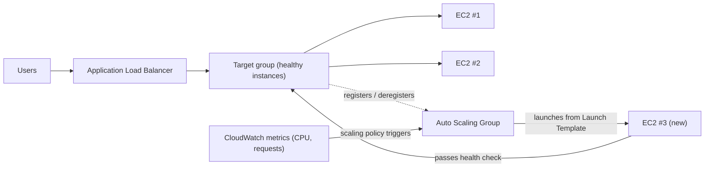

# अध्याय 7: वह रेस्तरां जो व्यस्त होने पर बढ़ता है

यह शुक्रवार की शाम 7:43 बजे था।

टॉम की कुर्सी थोड़ी पीछे खिसकी हुई थी, उस तरह जैसे तब होती थी जब वह किसी चीज़ को उस तरह की एकाग्रता से घूर रहा होता था जिसका मतलब था कि अगर आप उससे बात करेंगे तो वह जवाब नहीं देगा। ऑफ़िस एक घंटे पहले खाली हो चुका था। वह रुका रहा।

उसके पास मेट्रिक्स डैशबोर्ड पर एक टैब खुला था जिसे वह दूसरों के सोशल मीडिया चेक करने के तरीके से रिफ्रेश करता था — रिफ्लेक्सिव रूप से, लगातार, बिना पूरी तरह इरादा किए।

स्टोरेज संकट पीछे छूट चुका था। डेटाबेस के पास अपनी डिस्क थी। तस्वीरें S3 में रहती थीं। दो हफ्तों से सिस्टम स्थिर था — रोमांचक नहीं, बस स्थिर। यह अच्छा महसूस होना चाहिए था।

फिर त्रुटि दर 12% पार कर गई।

"लीओ," टॉम ने कहा।

लीओ पहले से ही देख रहा था। प्रतिक्रिया समय: बढ़ रहे थे। कतार में अनुरोध: बढ़ रहे थे। एकल EC2 इंस्टेंस — पिछले महीने की सावधानीपूर्वक राइट-साइज़िंग कवायद के बाद भी — 94% CPU पर था।

"हम ग्राहकों को लौटा रहे हैं," टॉम ने कहा।

"हम उन्हें नहीं लौटा रहे हैं," लीओ ने कहा। "सर्वर लौटा रहा है।"

"यह एक ही बात है।"

यह थी। और यह पिछले तीन हफ्तों से हर शुक्रवार हो रहा था। Nimbus ने स्टोरेज संकट को झेल लिया था — डेटाबेस की अपनी डिस्क थी, तस्वीरें S3 में रहती थीं — लेकिन स्थिर और स्केलेबल पूरी तरह से अलग समस्याएं हैं। सिस्टम काम करता था। यह बस बढ़ता नहीं था।

माया का एक Slack संदेश आया: *डैशबोर्ड कह रहा है कि पिछले शुक्रवार से ऑर्डर 40% गिर गए हैं। क्या हो रहा है?*

टॉम ने जवाब दिया: *सर्वर अपनी क्षमता पर है। इस पर काम कर रहा हूँ।*

तीन मिनट बीत गए।

माया: *हमारे पास एक रेस्तरां मालिक सपोर्ट लाइन पर फ़ोन करके कह रहा है कि ऐप टूट गया है।*

लीओ के हाथ कीबोर्ड पर थे। वह इंस्टेंस का आकार बदल रहा था — फ़िक्स का मैनुअल संस्करण, वह जिसमें सर्वर को रोकना और इंस्टेंस प्रकार बदलना ज़रूरी था। जिसका मतलब था डाउनटाइम।

"रीस्टार्ट में कितना समय लगेगा?" टॉम ने पूछा।

"सात मिनट," लीओ ने कहा।

"हमें शुक्रवार की रात सात मिनट और आउटेज झेलना होगा," टॉम ने कहा। वह पूछ नहीं रहा था। उसने माया को एक Slack संदेश टाइप किया। उसने एक ही अक्षर से जवाब दिया: *k*

रीस्टार्ट पूरा हुआ। इंस्टेंस वापस ऊपर आ गया। CPU 60% तक गिर गया। त्रुटि दर गिर गई। टॉम ने पंद्रह मिनट तक बिना बोले मेट्रिक्स देखे।

9:15 बजे, ट्रैफ़िक घट गया। संकट खत्म हो गया।

लीओ ने अपने हाथों की ओर देखा, जो रात 8 बजे थोड़े काँप रहे थे और अब नहीं काँप रहे थे।

"हम हर शुक्रवार ऐसा नहीं कर सकते," उसने कहा।

"नहीं," टॉम ने कहा। "हम नहीं कर सकते।"

टीम को अपने सिस्टम की ज़रूरत थी जो परिवर्तनशील लोड को स्वचालित रूप से संभाल सके। सबसे खराब स्थिति के लिए
इतना सर्वर खरीदने और शांत समय में पैसे बर्बाद करने के लिए नहीं। और जब ट्रैफ़िक स्पाइक्स आएं तो
मैन्युअल रूप से जूझने के लिए नहीं।

इसके लिए एक पैटर्न है। AWS के पास दो सेवाएं हैं जो इसे लागू करती हैं।

**अवधारणा: क्षैतिज स्केलिंग**

किसी सिस्टम को अधिक लोड संभालने लायक बनाने के दो तरीके हैं।

**ऊर्ध्वाधर स्केलिंग** का मतलब है एकल सर्वर को बड़ा बनाना। अधिक CPU। अधिक RAM।
हमने अध्याय 4 में ऐसा किया था जब हमने `t3.micro` से `t3.large` में अपग्रेड किया। यह मदद करता है।
लेकिन इसकी सीमाएं हैं: आप केवल इतना ही बड़ा हो सकते हैं, आकार बदलने के लिए इंस्टेंस को रीस्टार्ट करना पड़ता है,
और आपके पास अभी भी एकल बिंदु विफलता है।

**क्षैतिज स्केलिंग** का मतलब है अधिक सर्वर जोड़ना। एक बड़े सर्वर के बजाय,
पांच मध्यम सर्वर चलाएं। जब ट्रैफ़िक गिरता है, दो चलाएं। जब यह स्पाइक करता है, दस चलाएं।

क्षैतिज स्केलिंग के वे फायदे हैं जो ऊर्ध्वाधर के पास नहीं हैं:

- कोई एकल बिंदु विफलता नहीं। यदि एक सर्वर मर जाता है, तो बाकी सेवा देते रहते हैं।
- क्षमता जोड़ने के लिए रीस्टार्ट की ज़रूरत नहीं।
- केवल वही भुगतान करें जो आप उपयोग कर रहे हैं — जब ज़रूरत हो सर्वर जोड़ें, जब ज़रूरत न हो हटा दें।
- रैखिक स्केलिंग: दोगुने सर्वर, लगभग दोगुना थ्रूपुट।

एक विश्वसनीयता आयाम भी है जिससे ऊर्ध्वाधर स्केलिंग मेल नहीं खा सकती। जब आपके पास
पांच सर्वर हों और एक विफल हो जाए, तो आपकी क्षमता 80% तक गिरती है — विफल इंस्टेंस के बदले जाने तक
ट्रैफ़िक की सेवा जारी रखने के लिए पर्याप्त। जब आपके पास एक सर्वर हो और वह विफल हो जाए, तो क्षमता
0% तक गिर जाती है। यह रिडंडंसी क्षैतिज स्केलिंग में उस तरह आंतरिक रूप से मौजूद है जो ऊर्ध्वाधर
स्केलिंग किसी भी आकार पर प्रदान नहीं कर सकती।

यह रखरखाव के लिए भी मायने रखता है। जब किसी सुरक्षा पैच के लिए सर्वर रीस्टार्ट की ज़रूरत हो,
तो क्षैतिज स्केलिंग आपको इंस्टेंस एक-एक करके रीस्टार्ट करने देती है — रोलिंग रीस्टार्ट जो
सेवा निरंतरता बनाए रखते हैं। एक एकल बड़ा सर्वर या तो रीस्टार्ट के दौरान डाउनटाइम स्वीकार करने
या ब्लू/ग्रीन डिप्लॉयमेंट की जटिलता लागू करने की मांग करता है।

पेच: यदि आपके पास कई सर्वर हैं, तो उपयोगकर्ताओं को कैसे पता चलेगा कि किससे बात करनी है?

और एक डिज़ाइन बाधा है जो क्षैतिज स्केलिंग थोपती है: आपका एप्लिकेशन
कई समान सर्वरों पर एक साथ चलने में सक्षम होना चाहिए, बिना सर्वर एक-दूसरे
के साथ हस्तक्षेप किए। यह **स्टेटलेस** आवश्यकता है — प्रत्येक अनुरोध
स्वयं-निहित होना चाहिए, किसी विशिष्ट सर्वर पर संग्रहीत स्थिति पर निर्भर नहीं। हम ठीक-ठीक
देखेंगे कि यह क्यों मायने रखता है जब हम स्टिकी सेशन समस्या से रूबरू होंगे।

**एप्लिकेशन लोड बैलेंसर: एक दरवाज़ा, कई कमरे**

एक बड़े रेस्तरां की कल्पना करें जिसके दरवाज़े पर एक होस्ट स्टैंड हो। भोजन करने वाले आते हैं और होस्ट
उन्हें उपलब्ध टेबल पर निर्देशित करता है। होस्ट जानता है कि कौन सी टेबलें व्यस्त हैं और कौन सी
खुली हैं। भोजन करने वालों को यह जानने की ज़रूरत नहीं कि कितनी टेबलें हैं — वे बस अंदर आते हैं और
होस्ट वितरण संभालता है।

एक **एप्लिकेशन लोड बैलेंसर** (ALB) वेब अनुरोधों के साथ यह करता है।

उपयोगकर्ता लोड बैलेंसर से जुड़ते हैं। लोड बैलेंसर आने वाले अनुरोधों को आपके EC2 इंस्टेंसेज़ के
फ़्लीट में वितरित करता है। प्रत्येक उपयोगकर्ता एक पता देखता है (लोड बैलेंसर का URL)।
उस पते के पीछे, अनुरोधों को चल रहे जितने भी सर्वर हों उनमें फैलाया जाता है।

ALB स्वयं AWS-प्रबंधित बुनियादी ढांचे पर चलता है, जो आपके Region में कई AZ में वितरित है।
यह एकल सर्वर नहीं है — यह एक प्रबंधित, वितरित सेवा है।
जब आप क्रॉस-ज़ोन लोड बैलेंसिंग सक्षम करते हैं (ALB के लिए डिफ़ॉल्ट), तो प्रत्येक ALB नोड
सभी पंजीकृत लक्ष्यों में समान रूप से अनुरोध वितरित करता है, चाहे वे किसी भी AZ में हों।
यह उस सामान्य विफलता मोड को रोकता है जहां एक AZ में दूसरे की तुलना में दोगुने
स्वस्थ इंस्टेंस होते हैं, जिसके परिणामस्वरूप असमान लोड होता है।

यह प्रत्येक आने वाले HTTP अनुरोध को प्राप्त करता है और तय करता है कि किस EC2 इंस्टेंस (जिसे
**लक्ष्य** कहते हैं) को इसे संभालना चाहिए, ऐसे कारकों के आधार पर:

- राउंड-रॉबिन (प्रत्येक सर्वर को बारी-बारी से मौका मिलता है)
- सबसे कम बकाया अनुरोध (जिस सर्वर के पास सबसे कम इन-फ़्लाइट अनुरोध हों उसे अगला अनुरोध मिलता है)
- स्वास्थ्य — केवल स्वस्थ लक्ष्य ही ट्रैफ़िक प्राप्त करते हैं

**स्वास्थ्य जांच** आवश्यक हैं। ALB नियमित रूप से प्रत्येक लक्ष्य पर परीक्षण अनुरोध भेजता है।
यदि कोई लक्ष्य सही ढंग से प्रतिक्रिया नहीं करता, तो ALB उसे अस्वस्थ चिह्नित करता है और उसे
ट्रैफ़िक भेजना बंद कर देता है। जब लक्ष्य ठीक हो जाता है, तो ट्रैफ़िक फिर से शुरू हो जाता है।

यह स्वचालित है। आप स्वास्थ्य जांच मापदंड कॉन्फ़िगर करते हैं; ALB उन्हें लागू करता है।

आप स्वास्थ्य जांच को तीन प्रमुख मापदंडों से कॉन्फ़िगर करते हैं: जांचने के लिए **पथ** (जैसे, `/health`),
**अंतराल** (कितनी बार जांचना है — हर 5 से 300 सेकंड; डिफ़ॉल्ट 30), और **थ्रेशोल्ड** (लक्ष्य की
स्वास्थ्य स्थिति बदलने से पहले कितनी लगातार सफल या विफल जांच)।

आक्रामक स्वास्थ्य जांच अंतराल समस्याओं को तेज़ी से पकड़ते हैं लेकिन लक्ष्यों पर अधिक ट्रैफ़िक जोड़ते हैं।
3-विफलता थ्रेशोल्ड के साथ 30-सेकंड अंतराल का मतलब है कि एक विफल लक्ष्य को 90 सेकंड के भीतर
रोटेशन से हटा दिया जाता है। 2-विफलता थ्रेशोल्ड के साथ 10-सेकंड अंतराल का मतलब है 20 सेकंड के
भीतर हटाना — अधिक स्वास्थ्य जांच ट्रैफ़िक की कीमत पर।

Nimbus के लिए, प्रिया ने 3 विफलताओं के थ्रेशोल्ड (अस्वस्थ घोषित करने के लिए 90 सेकंड) और
2 सफलताओं (ठीक होने के बाद फिर से स्वस्थ घोषित करने के लिए 60 सेकंड) के साथ 30-सेकंड अंतराल चुना।
इसने तेज़ विफलता पहचान को संक्षिप्त नेटवर्क झटकों से झूठे सकारात्मक से बचने के साथ संतुलित किया।

**स्वास्थ्य जांच कॉन्फ़िगरेशन: "क्या यह जीवित है?" से अधिक**

लीओ की पहली स्वास्थ्य जांच एक साधारण TCP पिंग थी: "क्या पोर्ट 80 कनेक्शन स्वीकार कर रहा है?" यह न्यूनतम है। सर्वर पोर्ट 80 पर कनेक्शन स्वीकार कर सकता है जबकि डेटाबेस डाउन हो, जबकि एप्लिकेशन एक त्रुटि लूप में हो, जबकि डिस्क भरी हो।

प्रिया का "स्वस्थ" का मतलब क्या होना चाहिए, इस पर अलग दृष्टिकोण था।

"क्या हमने सोचा है कि अगर स्वास्थ्य जांच पास हो जाए लेकिन एप्लिकेशन टूटा हुआ हो तो क्या होगा?" उसने पूछा। "एक सर्वर जो कनेक्शन स्वीकार कर सकता है लेकिन डेटाबेस से क्वेरी नहीं कर सकता, वह स्वस्थ नहीं है। वह बस उत्तरदायी है।"

लीओ ने एप्लिकेशन कोड में एक `/health` एंडपॉइंट बनाया। एंडपॉइंट ने तीन काम किए:
1. पुष्टि की कि एप्लिकेशन प्रक्रिया चल रही है
2. डेटाबेस पर एक परीक्षण क्वेरी की (एक साधारण `SELECT 1`)
3. पुष्टि की कि S3 कनेक्शन सुलभ है

यदि तीनों पास हो जाते, तो एंडपॉइंट HTTP 200 लौटाता। यदि कोई विफल होता, तो यह HTTP 503 लौटाता।

ALB स्वास्थ्य जांच को इस एंडपॉइंट को हर 30 सेकंड में कॉल करने के लिए कॉन्फ़िगर किया गया था। यदि इसे लगातार तीन 503 प्रतिक्रियाएं मिलतीं, तो इंस्टेंस को अस्वस्थ चिह्नित किया जाता और रोटेशन से हटा दिया जाता।

"इसका मतलब है कि अगर डेटाबेस डाउन हो जाए," प्रिया ने कहा, "तो स्वास्थ्य जांच इसे पकड़ लेगी और प्रभावित सर्वरों को 90 सेकंड के भीतर लोड बैलेंसर से हटा देगी।"

"भले ही सर्वर स्वयं अभी भी चल रहे हों," टॉम ने कहा।

"भले ही वे बाहर से ठीक दिखें।"

ALB, एक वास्तविक एप्लिकेशन स्वास्थ्य जांच की ओर इंगित किया गया, वास्तविक समस्याओं का बहुत अधिक विश्वसनीय डिटेक्टर बन गया — न कि केवल सर्वर के जीवित होने का।

**ऑटो स्केलिंग: वह रेस्तरां जो अधिक टेबलें खोलता है**

एक ALB ट्रैफ़िक को आपके मौजूदा सर्वरों में वितरित करता है। लेकिन जब आपको अधिक की ज़रूरत हो
तो यह सर्वर नहीं जोड़ता।

**ऑटो स्केलिंग** जोड़ता है।

एक **ऑटो स्केलिंग ग्रुप** (ASG) एक कॉन्फ़िगरेशन है जो AWS को बताता है:

- हमेशा चलते रहने वाले इंस्टेंस की न्यूनतम संख्या
- अनुमत इंस्टेंस की अधिकतम संख्या
- वे स्थितियां जिनके तहत स्केल आउट (इंस्टेंस जोड़ना) या स्केल इन (उन्हें हटाना) करना है

स्केलिंग स्थितियों को **नीतियां** कहते हैं। चार सबसे आम प्रकार:

**लक्ष्य ट्रैकिंग**: "औसत CPU उपयोग को 70% पर रखें।" जब औसत CPU 70% से
अधिक हो जाता है, AWS नए इंस्टेंस लॉन्च करता है। जब यह नीचे गिरता है, तो इंस्टेंस समाप्त हो जाते हैं।
यह अधिकांश वर्कलोड के लिए सबसे सरल और सबसे अनुशंसित नीति है — एक लक्ष्य
मेट्रिक सेट करें और AWS को यह पता लगाने दें कि कितने इंस्टेंस की ज़रूरत है। लक्ष्य CPU
उपयोग, प्रति लक्ष्य अनुरोध गणना, या कोई भी कस्टम CloudWatch मेट्रिक हो सकता है।

**स्टेप स्केलिंग**: विशिष्ट प्रतिक्रियाओं के साथ विशिष्ट थ्रेशोल्ड परिभाषित करें। "जब CPU
60% से अधिक हो, 1 इंस्टेंस जोड़ें। जब CPU 80% से अधिक हो, 3 इंस्टेंस जोड़ें। जब CPU 30% से
नीचे गिरे, 1 इंस्टेंस हटाएं।" लक्ष्य ट्रैकिंग से अधिक बारीक नियंत्रण, लेकिन
अधिक कॉन्फ़िगरेशन और निरंतर ट्यूनिंग की ज़रूरत होती है।

**अनुसूचित स्केलिंग**: "हर शुक्रवार शाम 6:45 बजे, सुनिश्चित करें कि कम से कम 4 इंस्टेंस
चल रहे हों।" यह पूर्वानुमेय घटनाओं के लिए सक्रिय स्केलिंग है। यह प्रतिक्रियाशील स्केलिंग के
साथ काम करता है — अनुसूचित क्रिया एक फ़र्श सेट करती है, और लक्ष्य ट्रैकिंग उस फ़र्श के ऊपर
ज़रूरत के अनुसार इंस्टेंस जोड़ती है।

**पूर्वानुमेय स्केलिंग**: उसी विचार का मशीन-लर्निंग संस्करण। आपके शेड्यूल लिखने के बजाय, ऑटो स्केलिंग दो हफ्तों तक के ऐतिहासिक लोड का विश्लेषण करती है और अगले 48 घंटों का पूर्वानुमान लगाती है, पूर्वानुमानित रैम्प से *पहले* क्षमता लॉन्च करती है। चक्रीय ट्रैफ़िक के लिए — हर शुक्रवार की डिनर भीड़, हर कार्यदिवस का बाज़ार खुलना — पूर्वानुमेय स्केलिंग पैटर्न खोज लेती है और स्वचालित रूप से पहले से गर्म कर देती है, और पैटर्न खिसकने पर समायोजन करती रहती है। परीक्षा ट्रिगर: "आवर्ती/चक्रीय ट्रैफ़िक स्पाइक्स; इंस्टेंस स्पाइक से *पहले* तैयार होने चाहिए" → पूर्वानुमेय स्केलिंग। (अनुसूचित स्केलिंग मैनुअल जवाब है; पूर्वानुमेय सीखा हुआ जवाब है। दोनों केवल-प्रतिक्रियाशील स्केलिंग से बेहतर हैं, जो हमेशा इंस्टेंस बूट समय के कारण स्पाइक से पीछे रहती है।)

Nimbus के लिए, संयोजन था: प्रतिक्रियाशील स्केलिंग के लिए लक्ष्य ट्रैकिंग (CPU को
65% पर रखें), साथ ही डिनर भीड़ से पहले 2 अतिरिक्त इंस्टेंस को पहले से गर्म करने के लिए
हर शुक्रवार शाम 6:45 बजे एक अनुसूचित स्केलिंग क्रिया।

यह स्वचालित है। किसी को मेट्रिक्स देखने की ज़रूरत नहीं। किसी को मैन्युअल रूप से सर्वर लॉन्च
करने की ज़रूरत नहीं। सिस्टम लोड पर वास्तविक समय में प्रतिक्रिया करता है।

प्रिया ने पहली बार एक शुक्रवार की भीड़ के दौरान यह लाइव होते देखा। सर्वर
गणना पंद्रह मिनट में 2 से 5 हो गई, फिर भीड़ के बाद वापस 2 पर।

"वह," उसने कहा, "सचमुच प्रभावशाली है।"

टॉम इसके बजाय लागत ग्राफ़ देख रहा था। बिल भीड़ के दौरान बढ़ा और बाद में गिर
गया। "हमने केवल वही भुगतान किया जो हमने उपयोग किया," उसने उतना ही प्रभावित होकर कहा। "एक सामान्य सप्ताह में औसतन, यह प्रति माह कितना खर्च होता है?"

लीओ ने कैलकुलेटर खोला। शुक्रवार की चरम सीमाओं ने मासिक बिल में शायद 15% जोड़ा। ऑटो स्केलिंग के बिना, उन्हें पूरे सप्ताह चरम के लिए प्रावधान करना पड़ता। अंतर: निष्क्रिय चरम क्षमता पर लगभग $120/माह बर्बाद, बनाम ऑटो स्केलिंग के ठीक से कॉन्फ़िगर होने पर $0 बर्बाद।

स्केल-इन में एक सूक्ष्मता है जो टीमें अक्सर चूक जाती हैं: **स्केल-इन सुरक्षा**। आप
ASG में विशिष्ट इंस्टेंस को स्केल-इन से सुरक्षित करने के लिए कॉन्फ़िगर कर सकते हैं — मतलब
वे स्वचालित स्केल-इन घटनाओं के दौरान समाप्त नहीं होंगे। यह उन इंस्टेंसेज़ के लिए उपयोगी है
जो किसी लंबे चलने वाले काम को संसाधित करने के बीच में हैं जिसे आप बाधित नहीं करना चाहते।
एप्लिकेशन कोड किसी लंबे काम की शुरुआत में प्रोग्रामेटिक रूप से इंस्टेंस सुरक्षा सेट भी कर सकता है
और काम पूरा होने पर सुरक्षा हटा सकता है। यह ASG को सक्रिय काम के नीचे से चटाई खींचने से रोकता है।

**वार्म पूल: हर चीज़ को ठंडा शुरू होने की ज़रूरत नहीं**

जिस शुक्रवार को ऑटो स्केलिंग पहली बार सक्रिय हुई, टॉम ने समय मापा कि "CPU थ्रेशोल्ड से अधिक" से "नए इंस्टेंस ट्रैफ़िक सेवा कर रहे हैं" तक कितना समय लगा।

चार मिनट बीस सेकंड।

"वह चार मिनट हैं जब हम क्षमता पर कम हैं," उसने कहा।

"हम न्यूनतम इंस्टेंस गणना बढ़ा सकते हैं," लीओ ने कहा।

"इसका मतलब है पूरे सप्ताह निष्क्रिय इंस्टेंस के लिए भुगतान करना," टॉम ने कहा।

एक मध्यम मार्ग था: **वार्म पूल**।

एक वार्म पूल पूर्व-आरंभीकृत EC2 इंस्टेंसेज़ का समूह है जो रुकी हुई अवस्था में बैठे हैं, पहले से ही बूट किए हुए, पहले से ही कॉन्फ़िगर किए हुए, पहले से ही UserData स्क्रिप्ट से गुज़रे हुए। उन्होंने ट्रैफ़िक की सेवा शुरू करने के अलावा सब कुछ कर लिया है।

जब ऑटो स्केलिंग ग्रुप स्केल आउट करने का निर्णय लेता है, तो शुरू से एक नया ठंडा इंस्टेंस लॉन्च करने के बजाय (जिसमें बूट होने, UserData चलाने और स्वास्थ्य जांच पास करने में तीन से पांच मिनट लगते हैं), यह वार्म पूल से एक इंस्टेंस शुरू करता है। एक रुके हुए इंस्टेंस को शुरू करने में लगभग 30 से 60 सेकंड लगते हैं।

Nimbus के शुक्रवार के पैटर्न के लिए — एक ज्ञात, पूर्वानुमेय उछाल जो लगभग 7 बजे शुरू होता है — प्रिया ने व्यावसायिक घंटों के दौरान बनाए रखने के लिए दो इंस्टेंस का एक वार्म पूल कॉन्फ़िगर किया। शाम 6:45 तक, दो वार्म इंस्टेंस तैयार बैठे थे, रुके हुए लेकिन आरंभीकृत। जब शाम 7 बजे ट्रैफ़िक बढ़ा और ASG को स्केल करने की ज़रूरत पड़ी, तो वार्म इंस्टेंस एक मिनट से कम में शुरू हो गए और फ़्लीट में शामिल हो गए।

"वार्म पूल कितना खर्च होता है?" टॉम ने पूछा।

एक रुका हुआ EC2 इंस्टेंस कंप्यूट के लिए भुगतान नहीं करता — लेकिन यह संलग्न EBS स्टोरेज के लिए भुगतान करता है। वार्म पूल में दो `t3.small` इंस्टेंस: स्टोरेज लागत में लगभग $4/माह। स्केल-आउट समय में चार मिनट से एक मिनट से कम तक का सुधार शुक्रवार की रात $4/माह के लायक था।

**ALB पथ-आधारित रूटिंग**

जैसे-जैसे Nimbus बढ़ा, लीओ ने एक दूसरा घटक जोड़ा: रेस्तरां प्रबंधन के लिए एक अलग API सेवा। रेस्तरां मालिक इस सेवा को उसी डोमेन के माध्यम से लेकिन एक अलग URL पथ पर एक्सेस करते थे: `/` के बजाय `/api/restaurant/`।

"रुको — लेकिन *क्यों* हम इसे इस तरह करेंगे?" माया ने पूछा। "रेस्तरां प्रबंधन API को पूरी तरह से एक अलग डोमेन क्यों न दें?"

"हम दे सकते हैं," लीओ ने कहा। "लेकिन तब हमें एक दूसरा प्रमाणपत्र, एक दूसरा लोड बैलेंसर, एक दूसरी DNS प्रविष्टि की ज़रूरत होगी। पथ-आधारित रूटिंग इसे एक प्रमाणपत्र, एक लोड बैलेंसर के साथ संभालती है।"

ALB ने इसका मूल रूप से समर्थन किया। एक **पथ-आधारित रूटिंग नियम** ने ALB को बताया: जब URL `/api/restaurant/` से शुरू हो, तो अनुरोध को रेस्तरां प्रबंधन लक्ष्य समूह पर रूट करें। जब URL किसी और चीज़ से शुरू हो, तो इसे ग्राहक-सामना एप्लिकेशन लक्ष्य समूह पर रूट करें।

EC2 इंस्टेंसेज़ के दो अलग फ़्लीट। एक लोड बैलेंसर। URL पथ द्वारा निर्देशित ट्रैफ़िक।

"तो हम रेस्तरां प्रबंधन API को ग्राहक-सामना ऐप से स्वतंत्र रूप से स्केल कर सकते हैं?" माया ने पूछा।

"बिल्कुल," लीओ ने कहा। "यदि रेस्तरां मालिक बहुत सारे मेनू अपडेट कर रहे हैं, तो वे API सर्वर स्केल करते हैं। यदि ग्राहक भारी रूप से ऑर्डर कर रहे हैं, तो वे सर्वर स्केल करते हैं। वे एक-दूसरे को प्रभावित नहीं करते।"

माया इसके साथ बैठी। "और हम दो के बजाय केवल एक ALB के लिए भुगतान करते हैं।"

"सही," टॉम ने कहा। उसके पास एक संख्या थी। "ALB बेस फ़ीस में लगभग $20 प्रति माह प्लस डेटा प्रोसेसिंग शुल्क खर्च होता है। दो अलग की तुलना में एक ALB दोनों वर्कलोड संभालता है: लगभग $20 प्रति माह की बचत। और हम कई प्रमाणपत्र और DNS रिकॉर्ड प्रबंधित करने से बचते हैं।"

"लेकिन," प्रिया ने कहा, "यदि ALB स्वयं डाउन हो जाए, तो दोनों सेवाएं एक साथ डाउन हो जाती हैं।"

"AWS ALB को कई AZ में अत्यधिक उपलब्ध होने के लिए डिज़ाइन करता है," लीओ ने कहा। "दो अलग लोड बैलेंसर बनाए रखने की जटिलता की तुलना में ALB विफलता का जोखिम बहुत कम है।"

प्रिया ने इसे "स्वीकृत ट्रेड-ऑफ़, प्रलेखित" के तहत फ़ाइल किया।

**ALB और ASG एक साथ कैसे काम करते हैं**

दोनों सेवाओं को एक साथ उपयोग करने के लिए डिज़ाइन किया गया है।

आप ALB को आगे रखते हैं। ALB एक **लक्ष्य समूह** की ओर इंगित करता है — उन
इंस्टेंसेज़ का संग्रह जिन्हें ट्रैफ़िक प्राप्त करना चाहिए। ऑटो स्केलिंग ग्रुप उन इंस्टेंसेज़ का प्रबंधन करता है:
यह स्केल आउट होने पर उन्हें लक्ष्य समूह में जोड़ता है, स्केल इन होने पर हटाता है।

प्रवाह:

1. ट्रैफ़िक ALB पर पहुंचता है
2. ALB स्वस्थ लक्ष्यों को अनुरोध वितरित करता है
3. उन लक्ष्यों पर CPU/लोड बढ़ता है
4. ASG लोड वृद्धि का पता लगाता है, नए इंस्टेंस लॉन्च करता है
5. नए इंस्टेंस स्वास्थ्य जांच पास करते हैं, ALB के साथ पंजीकृत होते हैं
6. ALB उन्हें ट्रैफ़िक भेजना शुरू करता है
7. लोड घटता है, ASG अतिरिक्त इंस्टेंस समाप्त करता है
8. ALB समाप्त इंस्टेंसेज़ को ट्रैफ़िक भेजना बंद कर देता है

यह बिना किसी मानवीय हस्तक्षेप के होता है।

**लॉन्च टेम्प्लेट: नए इंस्टेंस के लिए ब्लूप्रिंट**

जब ASG एक नया इंस्टेंस लॉन्च करता है, तो उसे यह जानने की ज़रूरत होती है कि क्या लॉन्च करना है। यह एक
**लॉन्च टेम्प्लेट** में परिभाषित है — एक AMI, एक इंस्टेंस प्रकार, लागू करने के लिए सुरक्षा समूह,
और कोई भी यूज़र डेटा (स्टार्टअप स्क्रिप्ट जो इंस्टेंस बूट होने पर चलती हैं)।

एक सामान्य पैटर्न: आप अपने एप्लिकेशन को एक कस्टम AMI में बनाते हैं (अध्याय 4 देखें)।
जब ASG को एक नए इंस्टेंस की ज़रूरत हो, तो यह उस AMI को लॉन्च करता है। नया इंस्टेंस आपके
एप्लिकेशन के पहले से इंस्टॉल होने के साथ बूट होता है। कोई मैनुअल सेटअप ज़रूरी नहीं।

अधिक गतिशील वातावरण के लिए, आप **यूज़र डेटा स्क्रिप्ट** का भी उपयोग कर सकते हैं जो स्टार्टअप पर
आपके कोड का नवीनतम संस्करण खींचकर इंस्टॉल करती हैं। यह अधिक लचीला है लेकिन बूट होने में
अधिक समय लेता है।

सही विकल्प इस पर निर्भर करता है कि आपके इंस्टेंसेज़ को बूट होने में कितना समय चाहिए और आपका
एप्लिकेशन कितनी बार बदलता है।

**स्टिकी सेशन: एक सूक्ष्म समस्या**

यहां कुछ ऐसा है जो जब कई टीमें पहली बार लोड बैलेंसिंग लागू करती हैं तो उन्हें उलझा देता है।

कुछ वेब एप्लिकेशन सेशन डेटा संग्रहीत करते हैं — लॉगिन स्थिति, शॉपिंग कार्ट सामग्री — सर्वर पर
स्वयं (मेमोरी में या स्थानीय डिस्क पर)। यह एक सर्वर के साथ ठीक काम करता है।
कई सर्वरों के साथ, यह टूट जाता है।

एक उपयोगकर्ता लॉग इन करता है। अनुरोध सर्वर A पर जाता है। सर्वर A सेशन संग्रहीत करता है। अगला
अनुरोध सर्वर B पर जाता है। सर्वर B के पास कोई सेशन नहीं है। उपयोगकर्ता लॉग आउट प्रतीत होता है।

इसे दो तरीकों से संबोधित किया जा सकता है:

**स्टिकी सेशन** (या सेशन एफ़िनिटी): ALB को कॉन्फ़िगर करें कि वह हमेशा एक ही उपयोगकर्ता के
अनुरोधों को एक ही सर्वर पर भेजे। यह एक अल्पकालिक फ़िक्स है। यह लोड बैलेंसिंग को कमज़ोर करता है
(कुछ सर्वरों को दूसरों की तुलना में अधिक "स्टिकी" उपयोगकर्ता मिलते हैं) और जब एक इंस्टेंस समाप्त
होता है तो समस्याएं पैदा करता है।

माया ने स्टिकी सेशन कॉन्फ़िगरेशन पेज को देखा। "अगर हम उपयोगकर्ताओं को विशिष्ट सर्वरों से पिन करते हैं, तो जब वे सर्वर स्केल-इन के दौरान समाप्त हो जाते हैं तो क्या होता है?"

"वे अपना सेशन खो देते हैं," लीओ ने कहा।

"तो स्टिकी सेशन बस समस्या को टाल रहे हैं।"

"सही," प्रिया ने कहा। "असली फ़िक्स स्टेटलेस एप्लिकेशन डिज़ाइन है।"

**स्टेटलेस एप्लिकेशन डिज़ाइन**: सेशन डेटा को बाहरी रूप से संग्रहीत करें — एक डेटाबेस में या
ElastiCache जैसे कैश में (अध्याय 10)। प्रत्येक सर्वर बाहरी स्टोर से किसी भी उपयोगकर्ता का सेशन
पुनर्निर्मित कर सकता है। सर्वर विनिमेय बन जाते हैं। यह क्षैतिज रूप से स्केलेबल एप्लिकेशन के लिए
सही दृष्टिकोण है।

प्रिया ने इसे "सबसे महत्वपूर्ण वास्तुशिल्प निर्णय जो आप तब लेते हैं जब आप
मल्टी-सर्वर जाते हैं" कहा। वह सही है। हम इसका अध्याय 10 में फिर से सामना करते हैं।

**यदि स्टिकी सेशन तो कम जटिलता लेकिन अधिक जोखिम**

यदि आप सेशन स्थिति समस्या को हल करने के लिए स्टिकी सेशन का उपयोग करते हैं, तो आप अल्पकाल में बाहरी सेशन स्टोरेज स्थापित करने की ज़रूरत कम कर देते हैं — लेकिन जब एक स्टिकी सर्वर स्केल-इन के दौरान समाप्त होता है, तो उसके सभी बंधे उपयोगकर्ता एक साथ अपने सेशन खो देते हैं। विफलता क्रमिक नहीं है; यह अचानक है और एक साथ उपयोगकर्ताओं के समूह को प्रभावित करती है। यदि आप सेशन स्थिति को बाहरी बनाते हैं, तो आप एक निर्भरता जोड़ते हैं (ElastiCache या एक डेटाबेस) लेकिन उस अचानक विफलता मोड को समाप्त कर देते हैं। किसी भी एप्लिकेशन के लिए जो नियमित रूप से स्केल करता है, स्टेटलेस डिज़ाइन में निवेश पहली बार में ही अपने आप को चुका देता है जब ऑटो स्केलिंग एक इंस्टेंस को सक्रिय सेशन के साथ समाप्त करती है।

**टॉम की लागत गणना**

अगले सप्ताह, टॉम ने ALB और ASG सेटअप के लिए एक लागत मॉडल बनाया।

ALB: लगभग $20/माह बेस प्लस डेटा प्रोसेसिंग शुल्क। Nimbus के ट्रैफ़िक वॉल्यूम पर: लगभग $22/माह।

ऑटो स्केलिंग ग्रुप स्वयं: कोई अतिरिक्त लागत नहीं। आप उन इंस्टेंसेज़ के लिए भुगतान करते हैं जो यह चलाता है, लेकिन वे इंस्टेंस वैसे भी मौजूद होते। ASG मुफ़्त है; आप कंप्यूट के लिए भुगतान करते हैं।

वार्म पूल: दो रुके हुए इंस्टेंसेज़ के लिए EBS स्टोरेज में लगभग $4/माह।

कुल अतिरिक्त बुनियादी ढांचा लागत: लगभग $26/माह, या $312/वर्ष।

फिर टॉम ने ALB और ASG लागू होने से पहले के तीन शुक्रवारों के घटना लॉग को देखा। प्रत्येक घटना ने आउटेज विंडो के दौरान Nimbus को लगभग 40% शुक्रवार राजस्व का खर्च कराया था। औसत शुक्रवार राजस्व: लगभग $2,400। $2,400 का 40% प्रति घटना $960 है। तीन घटनाएं: तीन हफ्तों में लगभग $2,880 का खोया राजस्व।

"ALB और ASG की लागत $312 प्रति वर्ष है," टॉम ने कहा। "तीन बुरे शुक्रवारों ने हमें लगभग $3,000 का खर्च कराया। और यह केवल प्रत्यक्ष राजस्व हानि है — उन लोगों के ग्राहक मंथन को छोड़कर जिन्होंने एक बुरे अनुभव के बाद Nimbus का उपयोग करना बंद कर दिया।"

माया ने संख्याएं पढ़ीं। "बुनियादी ढांचा चलाओ।"

"पहले से ही चल रहा है," लीओ ने कहा।

## जब ALB पर्याप्त नहीं: NLB और GWLB

लीओ उस IoT एकीकरण की समीक्षा कर रहा था जिसे Nimbus ने रेस्तरां भागीदारों के लिए चुपचाप जोड़ा था — वॉक-इन कूलर में छोटे तापमान सेंसर जो हर तीस सेकंड में Nimbus को रीडिंग भेजते थे, ताकि किचन मैनेजर अलर्ट पा सकें अगर कोई फ्रिज सुरक्षित तापमान से ऊपर खिसक जाए।

"रुको," लीओ ने कहा। "ये सेंसर UDP पैकेट भेज रहे हैं।"

"क्या यह कोई समस्या है?" माया ने पूछा।

"ALB UDP का समर्थन नहीं करता," लीओ ने कहा। "ALB HTTP समझता है। बस यही।"

प्रिया पहले से ही दस्तावेज़ देख रही थी। "इसी के लिए नेटवर्क लोड बैलेंसर है।"

**नेटवर्क लोड बैलेंसर (NLB)** लेयर 4 — ट्रांसपोर्ट लेयर — पर काम करता है। यह TCP और UDP पैकेट रूट करता है। यह उन पैकेटों की सामग्री का निरीक्षण नहीं करता, HTTP हेडर नहीं समझता, पथ-आधारित रूटिंग नहीं करता। यह जो करता है वह है पैकेटों को क्लाइंट से लक्ष्यों तक असाधारण गति से ले जाना।

- **एकल-अंकीय मिलीसेकंड विलंबता के साथ प्रति सेकंड लाखों अनुरोध।** ALB लेयर 7 पर HTTP प्रोसेस करता है, जिसका मतलब है कि यह हेडर पार्स करता है, रूटिंग नियमों का मूल्यांकन करता है, और TLS कनेक्शन समाप्त करता है। NLB इनमें से कुछ नहीं करता — यह वेब प्रॉक्सी की तुलना में एक हाई-स्पीड ट्रैफ़िक डायरेक्टर के अधिक करीब है।
- **क्लाइंट का स्रोत IP पता संरक्षित करता है।** जब ALB एक कनेक्शन प्राप्त करता है, तो यह उसे समाप्त करता है और लक्ष्य पर एक नया खोलता है — आपका EC2 इंस्टेंस ALB का IP देखता है, उपयोगकर्ता का नहीं। NLB ऐसा नहीं करता; पैकेट का स्रोत IP लक्ष्य पर अपरिवर्तित आता है। यदि आपके एप्लिकेशन को यह जानने की ज़रूरत हो कि अनुरोध कहां से आ रहे हैं — जियोलोकेशन, रेट लिमिटिंग, या धोखाधड़ी पहचान के लिए — और आपको इसके सटीक होने की ज़रूरत हो, तो NLB सही विकल्प है। (ALB एक `X-Forwarded-For` हेडर जोड़ता है जो मूल IP रखता है, लेकिन उसके लिए एप्लिकेशन को हेडर पढ़ना पड़ता है; NLB असली IP को सीधे पैकेट में डालता है।)
- **स्थैतिक IP पते और Elastic IP।** ALB के IP पते समय के साथ बदलते हैं — AWS उन्हें प्रबंधित करता है और वे स्थिर नहीं होते। NLB प्रति उपलब्धता क्षेत्र स्थैतिक IP का समर्थन करता है, और आप उन्हें Elastic IP असाइन कर सकते हैं। यदि डाउनस्ट्रीम सिस्टम को आपके लोड बैलेंसर से ट्रैफ़िक की अनुमति देने के लिए एक विशिष्ट IP पते को वाइटलिस्ट करने की ज़रूरत हो — जो वित्तीय सेवाओं या IoT डिवाइस प्रबंधन में एक सामान्य आवश्यकता है — तो NLB ही एकमात्र विकल्प है। ALB ऐसा नहीं कर सकता।
- **TLS पास-थ्रू।** NLB एन्क्रिप्टेड TLS ट्रैफ़िक को बिना डिक्रिप्ट किए सीधे लक्ष्यों पर भेज सकता है। लक्ष्य TLS समाप्त करता है। यह तब उपयोगी है जब अनुपालन आवश्यकताएं कहती हैं कि डिक्रिप्शन एक विशिष्ट डिवाइस पर होना चाहिए, या जब आप लोड बैलेंसर पर TLS प्रमाणपत्र प्रबंधित नहीं करना चाहते।

"अगर NLB इतना तेज़ है," माया ने पूछा, "तो हम बस हर चीज़ के लिए इसका उपयोग क्यों न करें?"

"क्योंकि यह बुद्धू है," लीओ ने कहा। "सबसे अच्छे अर्थ में। NLB नहीं जानता कि HTTP क्या है। यह पथ-आधारित रूटिंग नहीं कर सकता। यह HTTP को HTTPS पर रीडायरेक्ट नहीं कर सकता। यह सुरक्षा हेडर नहीं जोड़ सकता। यह WAF के साथ एकीकृत नहीं हो सकता। एक वेब एप्लिकेशन के लिए — कुछ भी जो HTTP बोलता है — ALB की लेयर 7 जागरूकता ही वह है जो इन सभी सुविधाओं को संभव बनाती है। सेंसर डेटा के लिए, जो UDP है, हमारे पास कोई विकल्प नहीं है।"

"और हमारे वेब ट्रैफ़िक के लिए?"

"ALB, पहले की तरह।"

"वह प्रति माह कितना खर्च होता है?" टॉम ने पूछा। "क्या NLB सस्ता है?"

मूल्य निर्धारण मॉडल ALB के समान है: एक बेस प्रति घंटा शुल्क प्लस संसाधित ट्रैफ़िक के आधार पर प्रति लोड बैलेंसर कैपेसिटी यूनिट (LCU) शुल्क। समतुल्य ट्रैफ़िक वॉल्यूम पर, लागत तुलनीय है। Nimbus IoT उपयोग के मामले के लिए — कम-वॉल्यूम सेंसर डेटा — NLB लागत $20/माह से कम होगी।

**गेटवे लोड बैलेंसर (GWLB)** पूरी तरह से एक अलग जानवर है। यह लेयर 3 — IP पैकेट स्तर — पर काम करता है, और यह एक विशिष्ट उद्देश्य के लिए मौजूद है: तृतीय-पक्ष वर्चुअल नेटवर्क उपकरणों को आपके ट्रैफ़िक प्रवाह में डालना।

कल्पना करें कि Nimbus एक ऐसे आकार तक बढ़ गया जहां उनकी सुरक्षा टीम ने यह आवश्यक किया कि उनके VPC में प्रवेश करने और छोड़ने वाला सारा ट्रैफ़िक एक वाणिज्यिक फ़ायरवॉल उपकरण से गुज़रे — Palo Alto या Fortinet जैसे विक्रेता का सॉफ़्टवेयर चलाने वाली एक वर्चुअल मशीन। GWLB के बिना, आपको मैन्युअल रूप से उन उपकरणों के माध्यम से ट्रैफ़िक रूट करना और यह पता लगाना होगा कि उन्हें कैसे स्केल किया जाए और अत्यधिक उपलब्ध रखा जाए। GWLB के साथ, आप उपकरण को एक लक्ष्य के रूप में कॉन्फ़िगर करते हैं, और GENEVE प्रोटोकॉल का उपयोग करके सारा ट्रैफ़िक पारदर्शी रूप से इसके माध्यम से रूट होता है। एप्लिकेशन को पता नहीं चलता कि ट्रैफ़िक का निरीक्षण किया जा रहा है। फ़ायरवॉल को नेटवर्क टोपोलॉजी जानने की ज़रूरत नहीं। GWLB रूटिंग, स्केलिंग और फ़ेलओवर संभालता है।

प्रारंभिक और मध्य चरणों में अधिकांश वेब एप्लिकेशन के लिए — Nimbus सहित — GWLB एक ऐसी सेवा नहीं है जिसे आप कॉन्फ़िगर करेंगे। लेकिन परीक्षा के लिए, और उस दिन के लिए जब कोई सुरक्षा आवश्यकता नेटवर्क-स्तरीय निरीक्षण की मांग करे, आप जानेंगे कि यह किसलिए है।

लीओ ने उस दोपहर सेंसर एंडपॉइंट के लिए एक NLB जोड़ा। तापमान डेटा बहने लगा।

"पहले रेस्तरां को एक अलर्ट मिलता है कि उसका वॉक-इन कूलर 47 डिग्री पर है," उसने कहा। "वह सुरक्षित थ्रेशोल्ड से ऊपर है।"

"क्या यह सचमुच 47 डिग्री पर है?" माया ने पूछा।

"रेस्तरां मालिक ने पुष्टि की। उन्होंने उसी दोपहर एक मरम्मत तकनीशियन को बुलाया।"

प्रिया ने इसे Nimbus ग्राहक प्रभाव लॉग में लिख लिया। कोई सुरक्षा घटना नहीं। बस IoT सुविधा काम कर रही है।

**तीन लोड बैलेंसर, साथ-साथ**

AWS तीन प्रकार के लोड बैलेंसर प्रदान करता है। ALB लेयर 7 पर HTTP और HTTPS संभालता है —
यह प्रोटोकॉल समझता है, इसलिए यह URL पथ (`/api` को एक समूह पर, `/static` को दूसरे पर),
होस्ट हेडर और क्वेरी पैरामीटर के आधार पर रूट कर सकता है। यही अधिकांश वेब
एप्लिकेशन उपयोग करते हैं, और यही Nimbus अपने वेब ट्रैफ़िक के लिए उपयोग करता है।

ALB TLS कनेक्शन भी समाप्त करता है — SSL/HTTPS प्रमाणपत्र लोड बैलेंसर पर स्थापित होते हैं,
न कि प्रत्येक व्यक्तिगत EC2 इंस्टेंस पर। ALB अनुरोध को डिक्रिप्ट करता है,
HTTP हेडर का निरीक्षण करता है, नियमों के आधार पर रूट करता है, और (वैकल्पिक रूप से) लक्ष्य पर
अग्रेषित करने से पहले फिर से एन्क्रिप्ट करता है। यह प्रमाणपत्र प्रबंधन को काफ़ी सरल बनाता है: आप
प्रत्येक इंस्टेंस पर प्रमाणपत्र के बजाय ALB पर एक प्रमाणपत्र प्रबंधित करते हैं।

NLB, जैसा कि टीम ने तापमान सेंसर के साथ देखा, लेयर 4 पर TCP, UDP और TLS
संभालता है — कच्ची गति, स्रोत IP संरक्षण, स्थैतिक IP। GWLB लेयर 3 पर बैठता है,
फ़ायरवॉल और घुसपैठ पहचान प्रणालियों जैसे तृतीय-पक्ष उपकरणों के माध्यम से ट्रैफ़िक पिरोने के लिए
— जूनियर स्तर पर शायद ही कभी ज़रूरी।

Nimbus के लिए (और अधिकांश वेब एप्लिकेशन के लिए), ALB सही विकल्प है।

आप सोच रहे होंगे: क्या आप एक ही एप्लिकेशन के लिए ALB और NLB दोनों का उपयोग कर सकते हैं? हां। एक सामान्य पैटर्न है ALB के सामने NLB — NLB किनारे पर कच्ची TCP समाप्ति संभालता है, ALB इसके पीछे HTTP रूटिंग संभालता है। यह जटिलता और लागत जोड़ता है, और अधिकांश वेब एप्लिकेशन के लिए ज़रूरी नहीं है।

**परीक्षा के लिए ALB बनाम NLB**: मुख्य विभेदक लेयर 7 बनाम लेयर 4 है। यदि
परीक्षा परिदृश्य URL-आधारित रूटिंग, होस्ट-आधारित रूटिंग, HTTP हेडर निरीक्षण,
या WebSockets का उल्लेख करता है — तो वह ALB है। यदि यह TCP पास-थ्रू, स्रोत IP संरक्षित करने,
प्रति सेकंड लाखों अनुरोध, या गैर-HTTP प्रोटोकॉल के लिए अत्यधिक कम विलंबता का उल्लेख करता है — तो वह
NLB है। जब कोई परिदृश्य बस कहता है "एक वेब एप्लिकेशन के लिए लोड बैलेंसर," तो जवाब
लगभग हमेशा ALB होता है।

## ताकत और सीमाएं

**ALB + ऑटो स्केलिंग शक्तिशाली क्यों है**:

- शून्य-डाउनटाइम स्केलिंग (इंस्टेंस मौजूदा कनेक्शनों को बाधित किए बिना जोड़े/हटाए जाते हैं)
- स्वचालित फ़ेलओवर (अस्वस्थ इंस्टेंस स्वचालित रूप से ट्रैफ़िक से हटा दिए जाते हैं)
- लागत दक्षता (केवल चल रहे इंस्टेंसेज़ के लिए भुगतान करें)
- कोई एकल बिंदु विफलता नहीं — कई AZ में कई इंस्टेंस

**जहां यह जटिल हो जाता है**:

- स्टेटफुल एप्लिकेशन को विशेष हैंडलिंग की ज़रूरत होती है (स्टिकी सेशन या बाहरी स्थिति)
- स्केल आउट होने में समय लगता है — यदि ट्रैफ़िक तुरंत स्पाइक करता है, तो नए इंस्टेंस तैयार
  होने से पहले देरी होती है। पूर्वानुमेय चरम सीमाओं के लिए वार्म पूल या एक उच्च न्यूनतम गणना से कम करें।
- अधिक मूविंग पार्ट्स का मतलब है मॉनिटर और डिबग करने के लिए अधिक
- कुछ एप्लिकेशन को आसानी से क्षैतिज रूप से स्केल नहीं किया जा सकता (डेटाबेस, कुछ लेगेसी
  सिस्टम)। क्षैतिज स्केलिंग स्टेटलेस टियर्स के लिए सबसे अच्छी तरह काम करती है।

## सारांश

दो सेवाएं, एक पैटर्न — और पैटर्न ही वह है जो मायने रखता है। ALB वितरण संभालता है; ASG फ़्लीट आकार संभालता है। मिलकर वे एक नाज़ुक एकल-इंस्टेंस सेटअप को एक ऐसे सिस्टम में बदल देते हैं जो किसी इंसान के जागे बिना शुक्रवार की डिनर ट्रैफ़िक को अवशोषित कर सकता है। $312/वर्ष की बुनियादी ढांचा लागत बनाम तीन शुक्रवारों का खोया राजस्व (~$2,880) उस तरह का गणित है जिसे टॉम एक स्प्रेडशीट में डालता है और कभी नहीं भूलता।

- **क्षैतिज स्केलिंग** (अधिक सर्वर जोड़ना) ऊर्ध्वाधर स्केलिंग से बेहतर है क्योंकि यह एकल बिंदु विफलताओं को समाप्त करती है और लचीली लागत की अनुमति देती है। एक **एप्लिकेशन लोड बैलेंसर (ALB)** आने वाले HTTP/HTTPS ट्रैफ़िक को वितरित करता है और केवल स्वस्थ इंस्टेंसेज़ पर रूट करता है।
- **स्वास्थ्य जांच को वास्तविक एप्लिकेशन कार्यक्षमता का परीक्षण करना चाहिए** — एक `/health` एंडपॉइंट जो डेटाबेस कनेक्टिविटी सत्यापित करता है, ग्राहकों से पहले वास्तविक विफलताओं को पकड़ लेता है।
- एक **ऑटो स्केलिंग ग्रुप (ASG)** स्केलिंग नीतियों के आधार पर EC2 इंस्टेंसेज़ की संख्या को स्वचालित रूप से समायोजित करता है। लक्ष्य ट्रैकिंग सबसे आम प्रकार है; अनुसूचित स्केलिंग शुक्रवार की डिनर भीड़ जैसी पूर्वानुमेय चरम सीमाओं को संभालती है।
- स्टेटफुल एप्लिकेशन को सेशन स्थिति को बाहरी बनाना चाहिए न कि लंबे समय तक स्टिकी सेशन पर निर्भर रहना चाहिए। स्टिकी सेशन एक अल्पकालिक फ़िक्स हैं; स्थिति को बाहरी बनाना सही वास्तुकला है।
- HTTP/HTTPS ट्रैफ़िक के लिए, ALB का उपयोग करें। कच्चे TCP/UDP प्रदर्शन के लिए, NLB का उपयोग करें। ALB पथ-आधारित रूटिंग एक एकल लोड बैलेंसर को URL पथ के आधार पर कई एप्लिकेशन घटकों की सेवा करने देती है।

## परीक्षा युक्तियाँ

*SAA-C03 डोमेन 2 — कार्य 2.1 (स्केलेबल आर्किटेक्चर) / डोमेन 3 — कार्य 3.2*

- **ASG स्वास्थ्य जांच EC2 से या ALB से आ सकती है।** EC2 स्वास्थ्य जांच केवल यह पता लगाती है
  कि इंस्टेंस चल रहा है या नहीं। ALB स्वास्थ्य जांच यह पता लगाती है कि एप्लिकेशन
  सही ढंग से प्रतिक्रिया कर रहा है या नहीं। ALB स्वास्थ्य जांच अधिक व्यापक हैं और वेब एप्लिकेशन के लिए
  इन्हें प्राथमिकता दी जानी चाहिए।
- **लक्ष्य ट्रैकिंग स्केलिंग स्केलिंग नीतियों के लिए सबसे आम परीक्षा उत्तर है।**
  सरल स्केलिंग (अलार्म जलने पर N इंस्टेंस जोड़ें) पुरानी और कम अनुकूलनीय है।
- **स्केल आउट तेज़ है; स्केल इन धीमा है।** AWS स्केल इन के दौरान धीरे-धीरे इंस्टेंस समाप्त करता है
  ताकि सक्रिय कनेक्शनों को बाधित न करे — एक व्यवहार जो ALB की **डीरजिस्ट्रेशन देरी** सेटिंग द्वारा नियंत्रित होता है।
- **न्यूनतम इंस्टेंस गणना आपकी लचीलापन फ़र्श है।** यदि आप न्यूनतम = 1
  सेट करते हैं और वह इंस्टेंस विफल हो जाता है, तो ASG के प्रतिक्रिया करने से पहले आपका एप्लिकेशन डाउन हो जाता है।
  वास्तविक लचीलेपन के लिए न्यूनतम ≥ 2 सेट करें और AZ में फैलाएं।
- **ALB स्वचालित रूप से AZ में ट्रैफ़िक वितरित कर सकता है।** क्रॉस-ज़ोन लोड
  बैलेंसिंग सक्षम होने के साथ, प्रत्येक ALB नोड सभी पंजीकृत
  लक्ष्यों में समान रूप से अनुरोध वितरित करता है, चाहे AZ कोई भी हो। यह तब संतुलित लोड के लिए महत्वपूर्ण है जब AZ इंस्टेंस
  गणनाएं भिन्न होती हैं।
- **ALB पथ-आधारित रूटिंग** उन परीक्षा परिदृश्यों में दिखाई देती है जो एक एकल लोड बैलेंसर साझा करने वाले कई एप्लिकेशन
  घटकों का वर्णन करते हैं। सही शब्द है "लिस्नर नियम" जो
  URL पथ शर्तों के आधार पर रूट करते हैं।
- **लोड बैलेंसर चयन:** ALB = HTTP/HTTPS, लेयर 7, पथ/हेडर रूटिंग, WebSockets, WAF एकीकरण। NLB = TCP/UDP, लेयर 4, अत्यधिक प्रदर्शन, स्थैतिक IP, स्रोत IP संरक्षण। GWLB = लेयर 3, ट्रैफ़िक पथ में वर्चुअल फ़ायरवॉल/उपकरण डालना। परीक्षा ट्रिगर: "UDP प्रोटोकॉल" या "लोड बैलेंसर पर स्थैतिक IP" → NLB। "ट्रैफ़िक प्रवाह में फ़ायरवॉल उपकरण डालना" → GWLB।

## अभ्यास

**अभ्यास 1 — स्मरण**

अपने शब्दों में: एप्लिकेशन लोड बैलेंसर और ऑटो स्केलिंग ग्रुप के बीच क्या अंतर है? प्रत्येक
किस समस्या को हल करता है, और आप आमतौर पर उन्हें एक साथ क्यों
उपयोग करते हैं?

*(संकेत: एक पहले से मौजूद ट्रैफ़िक वितरित करता है; दूसरा समायोजित करता है कि आपके पास कितनी
क्षमता है।)*

**अभ्यास 2 — SAA-C03 परिदृश्य**

*परिदृश्य*: एक खुदरा कंपनी की ई-कॉमर्स वेबसाइट अत्यधिक परिवर्तनशील ट्रैफ़िक का अनुभव करती है:
कार्यदिवसों के दौरान कम ट्रैफ़िक, सप्ताहांत और फ्लैश सेल इवेंट के दौरान भारी स्पाइक्स।
वे चाहते हैं कि उनका एप्लिकेशन शांत अवधियों के दौरान अप्रयुक्त क्षमता बनाए रखे बिना
चरम लोड संभाले। एप्लिकेशन वर्तमान में सेशन डेटा को सर्वर मेमोरी में संग्रहीत करता है।

कौन सा वास्तुकला परिवर्तन उनकी स्केलेबिलिटी आवश्यकताओं को सबसे अच्छी तरह संबोधित करेगा?

A) एक एकल बहुत बड़े EC2 इंस्टेंस में अपग्रेड करें जो चरम ट्रैफ़िक संभाल सके
B) एक ALB के पीछे एक ऑटो स्केलिंग ग्रुप के साथ कई EC2 इंस्टेंस तैनात करें, और
   सेशन स्टोरेज को ElastiCache में बाहरी बनाएं
C) स्टिकी सेशन सक्षम के साथ एक ALB के पीछे कई EC2 इंस्टेंस तैनात करें
D) प्रत्येक अपेक्षित ट्रैफ़िक स्पाइक से पहले मैन्युअल रूप से EC2 इंस्टेंस जोड़ें और उन्हें
   बाद में समाप्त करें

**संकेत 1**: "अप्रयुक्त क्षमता बनाए रखे बिना" का मतलब है कि आपको स्वचालित स्केलिंग की ज़रूरत है,
एक निश्चित बड़े इंस्टेंस या मैनुअल प्रबंधन की नहीं।

**संकेत 2**: सर्वर मेमोरी में सेशन स्टोरेज मल्टी-इंस्टेंस
तैनाती के लिए एक समस्या है। कौन से विकल्प इसे संबोधित करते हैं?

**संकेत 3**: विकल्प C स्टिकी सेशन का उपयोग करता है — यह एक वर्कअराउंड है, फ़िक्स नहीं।
कौन सा विकल्प स्केलिंग और सेशन स्टोरेज समस्या दोनों को ठीक से संबोधित करता है?

**उत्तर**: B

**व्याख्या**: एक ऑटो स्केलिंग ग्रुप के साथ एक ALB स्वचालित, लचीली स्केलिंग प्रदान करता है
— इंस्टेंस स्पाइक्स के दौरान जोड़े जाते हैं और शांत अवधियों के दौरान हटाए जाते हैं। सेशन
स्टोरेज को ElastiCache (एक बाहरी कैश) में ले जाना एप्लिकेशन को स्टेटलेस बनाता है: कोई भी
इंस्टेंस किसी भी उपयोगकर्ता के अनुरोध को संभाल सकता है, और ALB ट्रैफ़िक को स्वतंत्र रूप से
वितरित कर सकता है। यह वास्तुशिल्प रूप से सही समाधान है।

**A क्यों नहीं?** एक एकल बड़ा इंस्टेंस, चाहे कितना भी बड़ा हो, अभी भी एक एकल बिंदु
विफलता है। यह शांत अवधियों के दौरान भी पैसे बर्बाद करता है जब इसकी अधिकांश क्षमता निष्क्रिय बैठी रहती है।

**C क्यों नहीं?** स्टिकी सेशन एक उपयोगकर्ता को एक ही इंस्टेंस पर रूट करते हैं, जो सेशन समस्या को
आंशिक रूप से कम करता है लेकिन लोड बैलेंसिंग को कमज़ोर करता है। यदि वह इंस्टेंस
समाप्त हो जाता है (स्केल-इन या विफलता के दौरान), तो उपयोगकर्ता वैसे भी अपना सेशन खो देता है।

**D क्यों नहीं?** मैनुअल स्केलिंग के लिए किसी को ट्रैफ़िक स्पाइक्स की सही भविष्यवाणी करनी होती है
और पहले से कार्य करना होता है। यह धीमा, त्रुटि-प्रवण और श्रम-गहन है। ऑटो स्केलिंग इसे
स्वचालित रूप से संभालती है।

*SAA-C03 डोमेन 2 — कार्य 2.1 / डोमेन 3 — कार्य 3.2*

**अभ्यास 3 — वास्तुकला चुनौती** *(वैकल्पिक)*

Nimbus का एक प्रमुख प्रचार आ रहा है: अगले शनिवार 4 घंटे के लिए सभी ऑर्डर पर 50% की छूट।
पिछले साल, एक समान प्रचार ने सामान्य ट्रैफ़िक का 10 गुना ट्रैफ़िक पैदा किया। टीम
उम्मीद करती है कि स्पाइक अचानक होगा और ठीक 4 घंटे तक चलेगा।

ऑटो स्केलिंग अंततः प्रतिक्रिया करेगी, लेकिन एक देरी है। आप इस ज्ञात स्पाइक के लिए कैसे
डिज़ाइन करेंगे? प्रतिक्रियाशील और सक्रिय स्केलिंग के बीच क्या अंतर है, और प्रत्येक कब
समझ में आता है?

*(कोई एक सही जवाब नहीं है। अनुसूचित स्केलिंग क्रियाओं,
पूर्व-वार्मिंग, और प्रत्येक दृष्टिकोण के लागत प्रभावों के बारे में सोचें।)*

## पोस्ट-क्रेडिट दृश्य

ऑटो स्केलिंग और ALB तैनात करने के बाद पहले शुक्रवार को, टीम ने
मेट्रिक्स एक साथ देखे।

7:15pm: दो इंस्टेंस चल रहे थे। सामान्य लोड।
7:45pm: लोड बढ़ता है। ऑटो स्केलिंग दो और इंस्टेंस लॉन्च करती है।
8:00pm: चार इंस्टेंस चरम को संभाल रहे थे। प्रतिक्रिया समय स्थिर।
9:30pm: लोड गिरता है। ऑटो स्केलिंग दो इंस्टेंस समाप्त करती है।
9:45pm: वापस दो इंस्टेंस।

साइट कभी डाउन नहीं हुई। एक बार भी नहीं।

लीओ ने मेट्रिक्स पेज को तीन बार रिफ्रेश किया, जैसे उसे एक ऐसी विफलता मिलने की उम्मीद हो जिसे उसने चूक दिया हो।

"क्या यह अजीब है कि मुझे थोड़ा निराश महसूस हो रहा है कि कुछ नहीं टूटा?" उसने कहा।

"हां," प्रिया ने कहा।

टॉम बिल देख रहा था। लागत ने ट्रैफ़िक को लगभग पूरी तरह से ट्रैक किया।
"हमने ठीक वही भुगतान किया जो हमने उपयोग किया," उसने कहा। "अधिक नहीं। कम नहीं।"

वह सचमुच आश्चर्यचकित लग रहा था।

अगली सुबह, माया ने त्रुटि लॉग में एक नई समस्या पाई। कोई आउटेज नहीं — उससे बदतर।

"हमारा डेटाबेस," उसने कहा, "औसतन आठ सेकंड के क्वेरी समय लौटा रहा है।"

आठ सेकंड। एक रेस्तरां ऑर्डरिंग ऐप के लिए।

"हर बार जब कोई मेनू लोड करता है, हम पेज बनाने के लिए डेटाबेस में हर
आइटम को क्वेरी कर रहे हैं," लीओ ने कहा। "और अब हमारे पास सैंतालीस रेस्तरां हैं।"

"कुल कितने मेनू आइटम?" टॉम ने पूछा।

लीओ ने क्वेरी चलाई।

"लगभग बाईस हज़ार।"

मौन।

अगले अध्याय में: वह डेटाबेस जिसके लिए किसी DBA की ज़रूरत नहीं — बस एक क्रेडिट कार्ड।
