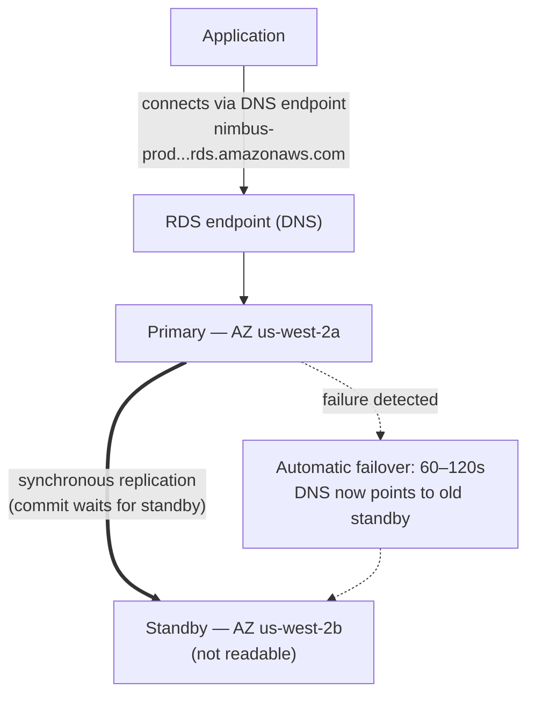

# अध्याय 8: वह डेटाबेस प्रशासक जो कभी बीमार होकर छुट्टी नहीं लेता

रात के 3 बजे थे जब अलर्ट आया।

प्रिया अकेली जाग रही थी। उसका फ़ोन नाइटस्टैंड पर जगमगा उठा और उसने अंधेरे में इसे पढ़ा, स्क्रीन की चमक बहुत ज़्यादा थी। वह उठ बैठी। उसने स्मृति के सहारे अपना लैपटॉप ढूंढा और बत्ती जलाए बिना उसे खोला।

अंधेरे कमरे में कीबोर्ड चुपचाप क्लिक करता रहा।

डेटाबेस सर्वर को एक सुरक्षा पैच की ज़रूरत थी — वह प्रकार जिसमें रीस्टार्ट ज़रूरी था। यह
भेद्यता वास्तविक थी, पैच उपलब्ध था, और ग्राहकों को बाधित किए बिना इसे लागू करने की
खिड़की अभी थी, आधी रात में, जब ट्रैफ़िक
कम था।

वह सर्वर से जुड़ी। उसने पैच खींचा। उसने इसे लागू किया।

फिर उसने रिलीज़ नोट्स पढ़े।

पैकेज अपडेट ने उस कॉन्फ़िगरेशन फ़ाइल को छुआ जिसका उपयोग PostgreSQL कनेक्शन पैरामीटर परिभाषित करने के लिए करता है। रिलीज़ नोट्स में एक चेतावनी शामिल थी: इस बात पर निर्भर करते हुए कि अपग्रेड कैसे किया गया था, एक अनुकूलित कॉन्फ़िगरेशन फ़ाइल को पैकेज के डिफ़ॉल्ट संस्करण से बदला जा सकता था।

उनकी कॉन्फ़िगरेशन फ़ाइल अनुकूलित की गई थी। लीओ ने दो महीने पहले max_connections सेटिंग को ट्यून करने के लिए इसे संपादित किया था।

पैच चला। सर्वर रीस्टार्ट हुआ। डेटाबेस वापस ऑनलाइन आ गया।

प्रिया ने एक क्वेरी का परीक्षण किया। यह काम कर गई।

उसने लॉग जांचे। सब कुछ सामान्य लग रहा था।

वह सुबह 4:15 बजे फिर सोने चली गई।

सुबह 9:05 बजे, लीओ ने एप्लिकेशन खोला और एक त्रुटि मिली। उसने डेटाबेस जांचा। Max connections डिफ़ॉल्ट पर सेट था: 100। उनका एप्लिकेशन 500 तक के कनेक्शन पूल का उपयोग करने के लिए कॉन्फ़िगर किया गया था।

हर नया कनेक्शन प्रयास विफल हो रहा था। एप्लिकेशन ने प्रभावी रूप से डेटाबेस एक्सेस खो दी थी।

"क्या हुआ?" माया ने पूछा।

"पैच," प्रिया ने कहा। वह पहले से ही कॉन्फ़िगरेशन फ़ाइल देख रही थी। "पैकेज अपडेट ने हमारी अनुकूलित कॉन्फ़िग फ़ाइल को डिफ़ॉल्ट से अधिलेखित कर दिया। लीओ की max_connections ट्यूनिंग बस चली गई — सर्वर स्टॉक सेटिंग्स के साथ रीस्टार्ट हुआ और किसी को कोई त्रुटि नहीं मिली। यह चुपचाप डिफ़ॉल्ट पर वापस आ गया।"

"इसे ठीक करने में कितना समय लगेगा?" लीओ ने पूछा।

"बीस मिनट," प्रिया ने कहा। "लेकिन हमें एक रखरखाव विंडो चाहिए। इसके लिए एक कॉन्फ़िगरेशन परिवर्तन और एक रीस्टार्ट की ज़रूरत है।"

"हमारे पास दो घंटे में लंच के लिए खुलने वाले रेस्तरां हैं," टॉम ने कहा।

प्रिया ने इसे अठारह मिनट में ठीक किया। रखरखाव विंडो बारह मिनट का वास्तविक डाउनटाइम थी। रेस्तरां प्रभावित हुए, लेकिन चरम अभी शुरू नहीं हुआ था।

सुबह उसने टीम को बताया कि क्या हुआ था। एक मौन छा गया।

"यह फिर से होगा," टॉम ने कहा।

"यह हर बार होगा जब कोई पैच आएगा," प्रिया ने कहा। "और हमेशा
पैच आते रहते हैं। इसे करने का एक बेहतर तरीका होना चाहिए।"

आठ-सेकंड के क्वेरी समय अभी भी अनसुलझे थे। और उसी सप्ताह में, यह: एक रात 3 बजे की रखरखाव विंडो जो सुबह की एक घटना में बदल गई। दोनों समस्याओं की एक ही मूल वजह थी — Nimbus एक ऐसा डेटाबेस चला रहा था जिसे प्रबंधित करने के लिए वे सुसज्जित नहीं थे।

एक समाधान था। इसके लिए बस यह विचार छोड़ना ज़रूरी था कि उन्हें खुद डेटाबेस प्रबंधित करना है।

**पारंपरिक डेटाबेस समस्या**

जब आप किसी डेटाबेस को EC2 इंस्टेंस पर खुद चलाते हैं, तो आप हर चीज़ के लिए ज़िम्मेदार होते हैं।

डेटाबेस सॉफ़्टवेयर इंस्टॉल करना। इसे सुरक्षित रूप से कॉन्फ़िगर करना। सुरक्षा भेद्यताओं की खोज
होने पर इसे पैच करना। बैकअप लेना। परीक्षण करना कि बैकअप वास्तव में काम करते हैं
(एक कदम जिसे अधिकांश टीमें तब तक छोड़ देती हैं जब तक बहुत देर न हो जाए)। डिस्क स्थान की
निगरानी करना। रिडंडंसी के लिए प्रतिकृति स्थापित करना। प्राथमिक सर्वर के डाउन होने पर
फ़ेलओवर कॉन्फ़िगर करना। क्वेरी प्रदर्शन ट्यून करना। लोड के तहत कनेक्शन प्रबंधित करना।

इनमें से कुछ भी एप्लिकेशन नहीं है। इनमें से कुछ भी सुविधाएं नहीं जोड़ता। इन सबके लिए विशेषज्ञता की ज़रूरत होती है।

विशेषज्ञता की आवश्यकता मुख्य मुद्दा है। एक योग्य डेटाबेस प्रशासक न केवल यह समझता है
कि डेटाबेस कैसे चलाएं, बल्कि यह भी कि कैसे:

- धीमी क्वेरी लॉग की निगरानी करें और प्रदर्शन की अड़चनों की पहचान करें
- डिस्क I/O से बचने के लिए वर्किंग सेट के लिए मेमोरी का आकार तय करें
- पॉइंट-इन-टाइम रिकवरी के लिए WAL आर्काइविंग कॉन्फ़िगर करें
- स्वचालित फ़ेलओवर के साथ सिंक्रोनस स्ट्रीमिंग प्रतिकृति स्थापित करें
- लोड के तहत कनेक्शन थकावट को रोकने के लिए कनेक्शन पूलिंग ट्यून करें
- डेटा हानि या विस्तारित डाउनटाइम के बिना प्रमुख संस्करण अपग्रेड लागू करें

यह एक विशिष्ट, विशेषीकृत कौशल समूह है। वरिष्ठ DBA ठीक इसीलिए उच्च वेतन कमाते हैं
क्योंकि यह सब अच्छी तरह करना कठिन है। अधिकांश स्टार्टअप इसके लिए किसी को नियुक्त नहीं कर सकते। अधिकांश
विकास टीमों के पास यह नहीं होता।

अधिकांश विकास टीमें डेटाबेस प्रशासक नहीं होतीं। इससे एक पूर्वानुमेय पैटर्न बनता है:
डेटाबेस इंस्टॉल किया जाता है, न्यूनतम कॉन्फ़िगर किया जाता है, और फिर ज़्यादातर भुला दिया जाता है जब तक कि कुछ
विनाशकारी रूप से गलत न हो जाए। Nimbus का PostgreSQL इंस्टेंस डिफ़ॉल्ट
कॉन्फ़िगरेशन पर चल रहा था — max_connections 100 पर, कोई कनेक्शन पूलिंग नहीं, मैनुअल बैकअप जो लीओ ने
दो बार चलाए थे और फिर भूल गया था, और कोई प्रतिकृति बिल्कुल नहीं।

रात 3 बजे की पैच घटना उस सिस्टम का लक्षण थी जो उन लोगों द्वारा चलाया जा रहा था जो एप्लिकेशन
बनाने में उत्कृष्ट थे और जिनकी डेटाबेस संचालन में कोई पृष्ठभूमि नहीं थी। यह कोई
आलोचना नहीं है — यह अधिकांश स्टार्टअप का एक सटीक विवरण है। समाधान यह नहीं है कि
एक DBA नियुक्त किया जाए। समाधान एक ऐसी सेवा का उपयोग करना है जो स्वचालित रूप से DBA-स्तरीय संचालन
प्रदान करती है।

"क्या हमने यही किया?" माया ने पूछा।

लीओ का जवाब मौन था, जो हां के समान था।

**प्रबंधित डेटाबेस**

एक डेटाबेस प्रशासक को नियुक्त करने की कल्पना करें जो कभी बीमार होकर छुट्टी नहीं लेता, स्वचालित रूप से
हर सुरक्षा पैच संभालता है, हर रात बिना पूछे बैकअप लेता है, और कुछ टूटने पर
खुद को ठीक कर लेता है। वे यह सब आपको परेशान किए बिना करते हैं — और वे
किसी भी परिस्थिति में, आपके एप्लिकेशन तर्क को कभी नहीं छूते।

AWS इस सेवा को **RDS** — रिलेशनल डेटाबेस सर्विस — कहता है।

RDS के साथ, AWS प्रबंधित करता है:

- डेटाबेस इंजन इंस्टॉल और पैच करना
- स्वचालित बैकअप (S3 में संग्रहीत, 35 दिनों तक रखे जाते हैं)
- स्वचालित फ़ेलओवर (जब प्राथमिक डाउन होता है, एक स्टैंडबाय स्वचालित रूप से कार्यभार संभालता है)
- निगरानी और मेट्रिक्स
- रेस्ट पर और ट्रांज़िट में एन्क्रिप्शन
- स्टोरेज ऑटो-स्केलिंग (यदि आप इसे सक्षम करते हैं, तो डिस्क भर जाने पर बढ़ती है)

आप प्रबंधित करते हैं:

- डेटाबेस स्कीमा (आपकी तालिकाओं की संरचना)
- आपकी क्वेरीज़ और एप्लिकेशन तर्क
- डेटाबेस तक किसकी पहुंच है
- कौन सा इंस्टेंस प्रकार डेटाबेस चलाता है
- पैरामीटर ट्यूनिंग (हालांकि RDS समझदार डिफ़ॉल्ट प्रदान करता है)

**समर्थित इंजन**

RDS कई लोकप्रिय डेटाबेस इंजन का समर्थन करता है:

- **MySQL** — सबसे व्यापक रूप से उपयोग किया जाने वाला ओपन-सोर्स रिलेशनल डेटाबेस
- **PostgreSQL** — शक्तिशाली, विस्तार योग्य, जटिल वर्कलोड के लिए तेज़ी से लोकप्रिय
- **MariaDB** — ओपन-सोर्स MySQL फ़ोर्क, पूरी तरह संगत
- **Oracle** — एंटरप्राइज़-ग्रेड, लेगेसी आवश्यकताओं वाले बड़े संगठनों में उपयोग किया जाता है
- **Microsoft SQL Server** — विंडोज़-भारी वातावरण के लिए
- **Amazon Aurora** — AWS का अपना MySQL/PostgreSQL-संगत इंजन, क्लाउड के लिए बनाया गया
  (हम अध्याय 24 में Aurora को गहराई से कवर करते हैं)

Nimbus के लिए, विकल्प PostgreSQL था। यह वही था जिसे लीओ जानता था, और यह रिलेशनल
डेटा को अच्छी तरह संभालता था। इंजन का विकल्प अधिकांश एप्लिकेशन के लिए उतना मायने नहीं रखता जितना आप सोचेंगे —
RDS के परिचालन लाभ चाहे जो भी हो लागू होते हैं।

एक बारीकी: जब आप RDS पर एक इंजन चलाते हैं, तो AWS माइनर संस्करण पैच
स्वचालित रूप से बनाए रखता है (आपकी कॉन्फ़िगर की गई रखरखाव विंडो के दौरान)। प्रमुख संस्करण अपग्रेड —
उदाहरण के लिए PostgreSQL 14 से 15 में जाना — एक मैनुअल ऑपरेशन है जिसे आप
शेड्यूल और निष्पादित करते हैं। AWS प्रमुख संस्करण अपग्रेड को सावधानी से परीक्षण करता है, लेकिन आपको उन्हें
पहले एक स्टेजिंग वातावरण में परीक्षण करना चाहिए। प्रमुख संस्करण परिवर्तन विशिष्ट SQL सिंटैक्स,
एक्सटेंशन, या ड्राइवर संस्करणों के साथ संगतता समस्याएं ला सकते हैं।

लीओ ने यह तब खोजा जब RDS ने एक माइनर पैच लागू किया और एप्लिकेशन लॉग ने संक्षेप में
एक फ़ंक्शन के बारे में एक डेप्रिकेशन चेतावनी दिखाई जिसे एक सब-रिलीज़ में हटा दिया गया था।
माइनर पैच अनिवार्य रूप से पारदर्शी होने चाहिए — लेकिन प्रत्येक रखरखाव विंडो के बाद अपने
एप्लिकेशन लॉग की निगरानी करना अच्छा अभ्यास है।

"क्या हमने सोचा है कि अगर कोई माइनर पैच कुछ तोड़ दे तो क्या होगा?" प्रिया ने पूछा।

"हम पिछले स्नैपशॉट पर वापस रोल करते हैं," लीओ ने कहा।

"उसमें कितना समय लगता है?"

लीओ ने अपने डेटाबेस आकार के लिए RDS रिस्टोर समय देखा। एक `db.m6i.large` पर 50GB
डेटाबेस के लिए: स्नैपशॉट से रिस्टोर करने में लगभग 15 से 30 मिनट।

"तो अगर कोई पैच प्रोडक्शन तोड़ता है तो हमारे पास 15-से-30-मिनट की रिकवरी विंडो है," प्रिया ने कहा। "और हम पैच को सुबह जल्दी रखरखाव विंडो में लागू करते हैं, तो कम से कम प्रभाव न्यूनतम होता है।"

"और हम पैच को पहले स्टेजिंग में परीक्षण करते हैं," लीओ ने जोड़ा।

"हां," प्रिया ने कहा। "वह भी।"

**RDS इंस्टेंस साइज़िंग: सभी वर्कलोड समान नहीं हैं**

जब आप एक RDS इंस्टेंस बनाते हैं, तो आप एक इंस्टेंस प्रकार चुनते हैं — EC2 जैसी ही अवधारणा, लेकिन डेटाबेस वर्कलोड के दायरे में। AWS RDS इंस्टेंस प्रकारों को कुछ उपयोगी टियर्स में व्यवस्थित करता है।

**db.t3 परिवार**: बर्स्टेबल प्रदर्शन इंस्टेंस। विकास, स्टेजिंग और हल्के प्रोडक्शन वर्कलोड के लिए डिज़ाइन किए गए जिन्हें निरंतर उच्च CPU की ज़रूरत नहीं होती। एक `db.t3.micro` कम ट्रैफ़िक वाले विकास डेटाबेस के लिए उपयुक्त है। एक `db.t3.medium` कभी-कभार बर्स्ट के साथ मध्यम प्रोडक्शन लोड संभालता है।

T-सीरीज़ इंस्टेंस के साथ ट्रेड-ऑफ़: वे कम-उपयोग की अवधि के दौरान CPU क्रेडिट जमा करते हैं और बर्स्ट के दौरान उन क्रेडिट को खर्च करते हैं। यदि आप एक T-सीरीज़ इंस्टेंस को निरंतर उच्च CPU पर चलाते हैं, तो आप क्रेडिट समाप्त कर देते हैं और प्रदर्शन एक बेसलाइन तक थ्रॉटल हो जाता है जो अपर्याप्त हो सकता है।

**db.m6i परिवार**: सुसंगत, गैर-बर्स्टेबल प्रदर्शन वाले सामान्य-उद्देश्य इंस्टेंस। `db.m6i.large` प्रोडक्शन डेटाबेस के लिए एक सामान्य शुरुआती बिंदु है। इनमें क्रेडिट सीमाएं नहीं होतीं — जब भी आपको ज़रूरत हो CPU पूरी क्षमता पर उपलब्ध होता है।

**db.r6i परिवार**: मेमोरी-अनुकूलित इंस्टेंस। M परिवार की तुलना में प्रति vCPU अधिक RAM। बड़े वर्किंग सेट वाले डेटाबेस के लिए उपयुक्त — वे क्वेरीज़ जो डेटा को हर एक्सेस पर डिस्क से लाने के बजाय मेमोरी में होने से लाभ उठाती हैं। यदि RAM जोड़ने पर आपके डेटाबेस का प्रदर्शन नाटकीय रूप से बेहतर होता है, तो R परिवार सही विकल्प है।

Nimbus के लिए:

- विकास और स्टेजिंग: `db.t3.medium`। विकास क्वेरीज़ के लिए पर्याप्त, कम लागत।
- प्रोडक्शन: `db.m6i.large`। सुसंगत प्रदर्शन, मेनू और ऑर्डर वर्किंग सेट के लिए पर्याप्त RAM, कोई क्रेडिट थ्रॉटलिंग नहीं।

"m6i.large की लागत t3.medium से कितनी अधिक है?" टॉम ने पूछा।

लीओ ने मूल्य निर्धारण पेज जांचा। `db.t3.medium` लगभग $55/माह चला। `db.m6i.large` लगभग $140/माह चला। अंतर वास्तविक था, लेकिन विश्वसनीयता का अंतर भी था।

"t3 निरंतर लोड के तहत थ्रॉटल होगा," प्रिया ने कहा। "अगर हमारा शुक्रवार व्यस्त है और CPU चार घंटे तक उच्च रहता है, तो t3 के क्रेडिट खत्म हो जाते हैं और यह थ्रॉटल हो जाता है। m6i नहीं होता।"

टॉम ने संख्या लिख ली। उसने दो हफ्ते पहले के शुक्रवार आउटेज की लागत भी लिख ली। तुलना करीब नहीं थी।

प्रोडक्शन `db.m6i.large` पर गया।

**मल्टी-AZ: वह स्टैंडबाय जो कार्यभार संभालता है**

यह वह सुविधा है जो विश्वसनीयता की गणना को पूरी तरह बदल देती है।

**मल्टी-AZ तैनाती** का मतलब है कि RDS प्राथमिक से अलग एक
उपलब्धता क्षेत्र में एक सिंक्रोनस स्टैंडबाय इंस्टेंस बनाए रखता है। प्राथमिक पर प्रतिबद्ध किया गया प्रत्येक लेनदेन
प्रतिबद्धता स्वीकार किए जाने से पहले स्टैंडबाय पर सिंक्रोनस रूप से प्रतिकृत होता है।

जब प्राथमिक विफल होता है — हार्डवेयर विफलता, AZ आउटेज, सॉफ़्टवेयर क्रैश — RDS
स्वचालित रूप से स्टैंडबाय पर फ़ेलओवर करता है। डेटाबेस एंडपॉइंट के लिए DNS रिकॉर्ड
अपडेट हो जाता है। आपका एप्लिकेशन नए प्राथमिक से फिर से जुड़ता है।

फ़ेलओवर में 60–120 सेकंड लगते हैं। उस विंडो के दौरान, आपके एप्लिकेशन को कनेक्शन
त्रुटियों का अनुभव होगा। सही ढंग से लिखे गए एप्लिकेशन को इसे शालीनता से संभालना चाहिए (बैकऑफ़ के साथ
कनेक्शन रिट्राय)।

स्टैंडबाय एक रीड रेप्लिका नहीं है। यह रीड ट्रैफ़िक की सेवा नहीं करता। इसका एकमात्र उद्देश्य
कार्यभार संभालने के लिए तैयार रहना है।



(ध्यान दें: नया **मल्टी-AZ DB क्लस्टर** तैनाती विकल्प *दो* स्टैंडबाय रखता है जो
पढ़ने योग्य **होते हैं** और ~35 सेकंड में फ़ेलओवर करता है — परीक्षा इसे यहां वर्णित
क्लासिक मल्टी-AZ *इंस्टेंस* तैनाती से अलग कर सकती है।)

"मल्टी-AZ की लागत कितनी है?" टॉम ने पूछा।

मोटे तौर पर एकल इंस्टेंस की दोगुनी लागत — क्योंकि आप वस्तुतः दो
डेटाबेस इंस्टेंस चला रहे हैं। स्टैंडबाय की लागत प्राथमिक के समान होती है।

टॉम ने ऑर्डर इतिहास खोला और अपने शुक्रवार के चरम के दौरान प्रति घंटे राजस्व का अनुमान लगाया।

"और अगर कोई फ़ेलओवर विंडो के दौरान सेंध लगाने की कोशिश करे तो क्या?" प्रिया ने पूछा। "जब प्राथमिक डाउन हो और स्टैंडबाय प्रमोट हो रहा हो, तो क्या साठ सेकंड ऐसे होते हैं जब हम उजागर होते हैं?"

"फ़ेलओवर पारदर्शी है," माया ने कहा, "लेकिन सवाल जायज़ है। कनेक्शन स्ट्रिंग को RDS एंडपॉइंट का उपयोग करना चाहिए, हार्डकोडेड IP का नहीं — अन्यथा फ़ेलओवर निर्बाध नहीं होगा।"

मल्टी-AZ उस दोपहर सक्षम किया गया।

**स्वचालित बैकअप और पॉइंट-इन-टाइम रिकवरी**

RDS हर दिन स्वचालित बैकअप लेता है। AWS इन बैकअप को S3 में संग्रहीत करता है (RDS द्वारा
प्रबंधित — आप उन्हें सीधे अपने S3 कंसोल में नहीं देखते)। आप डेटाबेस को
अपनी बैकअप प्रतिधारण अवधि के भीतर किसी भी बिंदु पर रिस्टोर कर सकते हैं।

बैकअप एक कॉन्फ़िगर करने योग्य **बैकअप विंडो** के दौरान होते हैं — कम ट्रैफ़िक की अवधि,
आमतौर पर सुबह जल्दी। (यह **रखरखाव विंडो** से एक अलग सेटिंग है, जो तब होती है जब RDS
पैच और कॉन्फ़िगरेशन परिवर्तन लागू करता है। परीक्षा को यह परीक्षण करना पसंद है कि ये दो अलग विंडो
हैं।) अधिकांश इंजन प्रकारों के लिए, बैकअप डाउनटाइम का कारण नहीं बनते — और मल्टी-AZ तैनाती पर,
स्नैपशॉट स्टैंडबाय से लिया जाता है, इसलिए प्राथमिक को बिल्कुल नहीं छुआ जाता।

**पॉइंट-इन-टाइम रिकवरी** सबसे मूल्यवान सुविधाओं में से एक है: आप अपनी प्रतिधारण अवधि के भीतर
किसी भी सेकंड पर रिस्टोर कर सकते हैं। केवल दैनिक स्नैपशॉट नहीं — *किसी भी सेकंड*।
यह संभव है क्योंकि RDS दैनिक बैकअप के अलावा लगातार लेनदेन लॉग को संग्रहीत करता है।

यदि कोई गलती से 2:37pm पर `DELETE FROM orders WHERE 1=1` चलाता है, तो आप
2:36pm पर रिस्टोर कर सकते हैं।

जब लीओ को यह समझ में आया तो वह स्पष्ट रूप से आराम महसूस करने लगा।

"मैंने पहले ही बैकअप प्रतिधारण को एक दिन पर सेट कर दिया," लीओ ने कहा। "ओह — लेकिन यह ठीक है ना? हम इसे बदल सकते हैं?"

"इसे न्यूनतम सात दिन पर बदलो," प्रिया ने कहा। "प्रोडक्शन के लिए तीस।"

लीओ ने इसे तुरंत अपडेट किया।

"क्या हम उससे रिकवर कर सकते थे जो मैंने पिछले महीने डिलीट किया था?" उसने पूछा।

"RDS से पहले? नहीं," प्रिया ने कहा। "RDS के बाद? हां।"

आप सोच रहे होंगे: एक स्वचालित बैकअप और एक मैनुअल स्नैपशॉट में क्या अंतर है? प्रतिधारण अवधि समाप्त होने पर स्वचालित बैकअप हटा दिए जाते हैं (35 दिनों तक)। मैनुअल स्नैपशॉट अनिश्चित काल तक रखे जाते हैं जब तक आप उन्हें स्पष्ट रूप से हटा न दें। यदि आपको किसी डेटाबेस स्थिति को स्थायी रूप से संरक्षित करना है — किसी बड़े माइग्रेशन से पहले, किसी जोखिमपूर्ण तैनाती से पहले — तो एक मैनुअल स्नैपशॉट लें।

**RDS Proxy: स्केल पर कनेक्शन समस्या हल करना**

RDS में माइग्रेट करने के दो हफ्ते बाद, लीओ ने मेट्रिक्स में कुछ देखा।

डेटाबेस क्वेरीज़ को ठीक से संभाल रहा था। लेकिन खुले कनेक्शनों की संख्या अधिक थी — उसकी अपेक्षा से अधिक। ऑटो स्केलिंग ग्रुप के चरम के दौरान EC2 इंस्टेंस जोड़ने के साथ, प्रत्येक नया इंस्टेंस अपना डेटाबेस कनेक्शन पूल खोलता था। दस EC2 इंस्टेंस, प्रत्येक 50 के कनेक्शन पूल के साथ: डेटाबेस से पांच सौ एक साथ कनेक्शन।

"PostgreSQL में प्रत्येक कनेक्शन के लिए एक ओवरहेड होता है," प्रिया ने कहा। "मेमोरी, कनेक्शन हैंडलर के लिए CPU। पांच सौ कनेक्शन डेटाबेस के संसाधनों का एक सार्थक हिस्सा केवल कनेक्शन प्रबंधन के लिए उपयोग करते हैं — किसी वास्तविक काम को करने से पहले।"

"क्या हम कनेक्शन पूल आकार कम कर सकते हैं?" लीओ ने पूछा।

"हम कर सकते हैं," प्रिया ने कहा। "लेकिन तब हमें चरम के दौरान कनेक्शन की प्रतीक्षा में अनुरोधों के कतारबद्ध होने का जोखिम है।"

बेहतर समाधान: **RDS Proxy**।

RDS Proxy एप्लिकेशन और डेटाबेस के बीच बैठता है। EC2 इंस्टेंस Proxy से जुड़ते हैं, सीधे RDS इंस्टेंस से नहीं। Proxy डेटाबेस कनेक्शनों का एक पूल बनाए रखता है और एप्लिकेशन अनुरोधों को उनमें मल्टीप्लेक्स करता है। यदि दस EC2 इंस्टेंस प्रत्येक Proxy से पचास कनेक्शन खोलते हैं, तो Proxy शायद केवल एक सौ वास्तविक डेटाबेस कनेक्शन बनाए रखे — उन्हें सभी एप्लिकेशन अनुरोधों में कुशलता से साझा करते हुए।

लाभ:

**कनेक्शन पूलिंग**: कम वास्तविक डेटाबेस कनेक्शन का मतलब है RDS इंस्टेंस पर कम मेमोरी ओवरहेड और लोड के तहत बेहतर प्रदर्शन।

**तेज़ फ़ेलओवर**: मल्टी-AZ फ़ेलओवर के दौरान, Proxy एप्लिकेशन की ओर कनेक्शन बनाए रखता है जबकि बैकएंड पर डेटाबेस कनेक्शन फिर से स्थापित करता है। एप्लिकेशन पूर्ण कनेक्शन रीसेट के बजाय एक संक्षिप्त ठहराव देखते हैं। RDS Proxy फ़ेलओवर प्रभाव को 60–120 सेकंड से घटाकर आमतौर पर 30 सेकंड या उससे कम कर देता है।

**IAM प्रमाणीकरण**: एप्लिकेशन में डेटाबेस क्रेडेंशियल एम्बेड करने के बजाय, एप्लिकेशन एक IAM भूमिका का उपयोग करके RDS Proxy को प्रमाणित कर सकता है। Proxy वास्तविक डेटाबेस क्रेडेंशियल संभालता है। यह एप्लिकेशन वातावरण से रहस्यों को पूरी तरह समाप्त कर देता है।

"RDS Proxy की लागत कितनी है?" टॉम ने पूछा।

यह अंतर्निहित RDS इंस्टेंस के लगभग $0.015 प्रति vCPU-घंटे चलता है, इंस्टेंस से अलग बिल किया जाता है। एक `db.m6i.large` (2 vCPU) के लिए, Proxy लगभग $22/माह जोड़ता है।

टॉम ने कनेक्शन गणना ग्राफ़ देखा — चरम के दौरान डेटाबेस संसाधनों के लिए प्रतिस्पर्धा करने वाले पांच सौ कनेक्शन — और $22/माह की लागत देखी।

"यह कनेक्शन ओवरहेड संभालने के लिए एक बड़े RDS इंस्टेंस में अपग्रेड करने से सस्ता है," उसने कहा।

RDS Proxy उस सप्ताह सक्षम किया गया।

"और अगर कोई Proxy के ज़रिए सेंध लगाने की कोशिश करे तो क्या?" प्रिया ने पूछा। "क्या Proxy के लिए IAM auth अटैक सरफ़ेस को कम करता है?"

"हां," प्रिया ने अपने ही सवाल का जवाब दिया। "एप्लिकेशन वातावरण में कोई डेटाबेस क्रेडेंशियल न होने का मतलब है कि एप्लिकेशन से चुराने के लिए कोई डेटाबेस क्रेडेंशियल नहीं हैं।"

उसने Proxy के लिए IAM प्रमाणीकरण सक्षम किया।

**रीड रेप्लिका: रीड ट्रैफ़िक स्केल करना**

मल्टी-AZ उपलब्धता के बारे में है। **रीड रेप्लिका** प्रदर्शन के बारे में हैं।

एक रीड रेप्लिका आपके प्राथमिक डेटाबेस की एक अतुल्यकालिक प्रतिलिपि है जो रीड
क्वेरीज़ की सेवा कर सकती है। आप प्रमुख RDS इंजनों — MySQL, PostgreSQL, और MariaDB — के लिए 15 तक रीड रेप्लिका रख सकते हैं (Aurora भी 15 तक Aurora रेप्लिका का समर्थन करता है, जो समान स्टोरेज वॉल्यूम साझा करते हैं)।

एप्लिकेशन को रीड क्वेरीज़ को रेप्लिका और राइट क्वेरीज़ को
प्राथमिक पर भेजने के लिए संशोधित किया जाता है। यह लोड वितरित करता है: प्राथमिक राइट और जटिल
लेनदेन संभालता है; रेप्लिका रीड संभालते हैं।

मुख्य विशेषताएं:

- प्रतिकृति **अतुल्यकालिक** है — प्राथमिक और रेप्लिका के बीच एक छोटी देरी (लैग)
  हो सकती है। यदि आप एक रिकॉर्ड लिखते हैं और तुरंत रेप्लिका से पढ़ते हैं,
  तो शायद आपको यह अभी न दिखे।
- रीड रेप्लिका उसी Region में या एक अलग Region में हो सकते हैं (क्रॉस-Region
  रेप्लिका विलंबता जोड़ते हैं लेकिन भौगोलिक वितरण सक्षम करते हैं)।
- रीड रेप्लिका को आपदा परिदृश्य में स्टैंडअलोन डेटाबेस में प्रमोट किया जा सकता है।

Nimbus के लिए: मेनू लुकअप रीड हैं। ऑर्डर इतिहास रीड हैं। ट्रैफ़िक का विशाल बहुमत
रीड ट्रैफ़िक है। एक रीड रेप्लिका जोड़ना और रीड को इस पर रूट करना प्राथमिक
डेटाबेस लोड को काफ़ी कम कर देता है।

हम Aurora पर चर्चा करते समय अध्याय 24 में रीड रेप्लिका को अधिक विस्तार से कवर करते हैं।

**यदि रीड-भारी तो एक रेप्लिका जोड़ें लेकिन लैग पर नज़र रखें**

यदि आपका वर्कलोड रीड-भारी है, तो एक रीड रेप्लिका जोड़ना प्राथमिक पर लोड कम करता है और क्वेरी प्रदर्शन सुधारता है — लेकिन प्रतिकृति अतुल्यकालिक है, जिसका मतलब है कि रेप्लिका प्राथमिक से थोड़ा पीछे हो सकता है। यदि आपका एप्लिकेशन एक रिकॉर्ड लिखता है और तुरंत उसे वापस पढ़ता है, तो उसे प्राथमिक से पढ़ना चाहिए, रेप्लिका से नहीं। इसे गलत करने से सूक्ष्म, कठिन-से-डिबग करने वाले डेटा ताज़गी बग पैदा होते हैं: एक उपयोगकर्ता एक ऑर्डर देता है, पुष्टि पेज रेप्लिका से क्वेरी करता है, रेप्लिका अभी तक नहीं पकड़ पाया, ऑर्डर गायब दिखता है। इसे रीड-योर-राइट्स संगतता कहा जाता है, और यह सबसे आम गलती है जो टीमें पहली बार रेप्लिका जोड़ते समय करती हैं।

**Performance Insights: धीमी क्वेरी खोजना**

आठ-सेकंड का मेनू लोड समय अभी भी एक समस्या थी। RDS में जाने से विश्वसनीयता बेहतर हुई, लेकिन क्वेरी अभी भी धीमी थी।

लीओ ने एक रीड रेप्लिका जोड़ा और मेनू क्वेरीज़ को उस पर रूट किया। मेनू लोड समय लगभग चार सेकंड तक गिर गया। बेहतर। फिर भी अच्छा नहीं।

"क्वेरी अभी भी धीमी है," माया ने कहा। "हमने अड़चन में सुधार किया, लेकिन हमने इसे ठीक नहीं किया।"

RDS में **Performance Insights** नामक एक सुविधा शामिल है — एक निगरानी उपकरण जो दिखाता है कि कौन सी क्वेरीज़ सबसे अधिक डेटाबेस संसाधनों का उपभोग कर रही हैं, कौन से सत्र प्रतीक्षा कर रहे हैं, और वे किसका इंतज़ार कर रहे हैं।

लीओ ने रीड रेप्लिका पर Performance Insights सक्षम किया और एक दोपहर के परीक्षण सत्र के दौरान बार-बार मेनू पेज लोड किया।

Performance Insights डैशबोर्ड ने लोड पर हावी एक क्वेरी दिखाई: `menu_items` तालिका का एक फ़ुल टेबल स्कैन, हर बार मेनू पेज लोड होने पर सभी 22,000 पंक्तियां लाना। `restaurant_id` पर कोई इंडेक्स नहीं था — वह कॉलम जिसके द्वारा एप्लिकेशन फ़िल्टर कर रहा था।

इंडेक्स के बिना निष्पादन समय: 8.2 सेकंड।

लीओ ने इंडेक्स जोड़ा।

```sql
CREATE INDEX idx_menu_items_restaurant_id ON menu_items(restaurant_id);
```

इंडेक्स के साथ निष्पादन समय: 14 मिलीसेकंड।

8,200 मिलीसेकंड से 14 मिलीसेकंड। एक रेस्तरां ऑर्डरिंग ऐप जो ग्राहकों को भगा देता है और एक जिसे वे बिना सोचे उपयोग करते हैं, के बीच का अंतर।

"वही पूरे समय समस्या थी?" माया ने कहा।

"वही समस्या थी," लीओ ने कहा।

"और Performance Insights ने इसे कितने समय में खोजा?"

"लगभग बीस मिनट।"

टॉम पहले से ही गणना कर रहा था। तीन हफ्तों के उप-इष्टतम मेनू लोड समय, उस अवधि के दौरान अनुमानित 200,000 मेनू पेज लोड, धीमेपन के कारण अनुमानित 15% परित्याग। जिस संख्या पर वह पहुंचा वह असुविधाजनक थी।

"अगली बार लॉन्च से पहले गायब इंडेक्स जोड़ो," उसने कहा।

"एक चेकलिस्ट होगी," प्रिया ने कहा। वह पहले से ही इसे लिख रही थी।

**RDS का उपयोग कब न करें**

RDS रिलेशनल डेटाबेस वर्कलोड की एक विस्तृत श्रृंखला के लिए उत्कृष्ट है। यह हर चीज़ के लिए सही जवाब नहीं है।

**जब आपको OS-स्तरीय एक्सेस चाहिए**: RDS आपको अंतर्निहित ऑपरेटिंग सिस्टम तक एक्सेस नहीं देता। आप कस्टम OS पैकेज इंस्टॉल नहीं कर सकते, कर्नेल पैरामीटर संशोधित नहीं कर सकते, या ऐसे उपकरण नहीं चला सकते जिन्हें डेटाबेस सर्वर तक रूट एक्सेस की ज़रूरत हो। यदि आपके डेटाबेस की ऐसी आवश्यकताएं हैं जो OS एक्सेस की मांग करती हैं — कुछ Oracle कॉन्फ़िगरेशन, कस्टम स्टोरेज ड्राइवर, विशिष्ट नेटवर्क इंटरफ़ेस — तो आपको डेटाबेस को सीधे एक EC2 इंस्टेंस पर चलाना होगा।

**जब आप एक असमर्थित इंजन का उपयोग कर रहे हैं**: RDS MySQL, PostgreSQL, MariaDB, Oracle, SQL Server, और Aurora का समर्थन करता है। यदि आपका एप्लिकेशन एक अलग डेटाबेस इंजन का उपयोग करता है — CockroachDB, SingleStore, Greenplum — तो आप इसे EC2 पर चला रहे हैं, RDS पर नहीं।

**जब आपको राइट-भारी क्षैतिज स्केलिंग चाहिए**: RDS रेप्लिका के माध्यम से रीड स्केल करता है। राइट एक प्राथमिक इंस्टेंस पर जाते हैं। यदि आपका वर्कलोड राइट-भारी है और इसे कई राइट नोड्स में वितरित करना है, तो RDS सही वास्तुकला नहीं है। Aurora का Global Database बड़े पैमाने पर मदद कर सकता है, लेकिन चरम राइट-स्केल आवश्यकताओं के लिए, DynamoDB (अध्याय 9) या EC2 पर चलने वाले CockroachDB जैसे वितरित डेटाबेस उपयुक्त उपकरण हैं।

**जब प्रबंधित लागत परिचालन लागत से अधिक हो**: बहुत बड़े, स्थिर वर्कलोड के लिए जहां आपकी टीम के पास वास्तविक डेटाबेस प्रशासन विशेषज्ञता है, अपने स्वयं के उपकरण के साथ EC2 पर PostgreSQL चलाना RDS से सस्ता हो सकता है। यह उन टीमों के लिए असामान्य है जो मुख्य रूप से DBA दुकानें नहीं हैं। लेकिन यह वास्तविक है, और एक अच्छा आर्किटेक्ट इसे स्वीकार करता है।

Nimbus के लिए — समर्पित DBA संसाधनों के बिना एक स्टार्टअप, एक प्रबंधित सेवा पर PostgreSQL चलाते हुए, अप्रत्याशित वृद्धि के साथ — RDS स्पष्ट रूप से सही विकल्प था।

**RDS पैरामीटर समूह और विकल्प समूह**

दो कॉन्फ़िगरेशन तंत्र परीक्षा में आते हैं:

**पैरामीटर समूह** डेटाबेस इंजन सेटिंग्स को नियंत्रित करते हैं — जैसे अधिकतम कनेक्शन,
क्वेरी कैश आकार, टाइमआउट मान। RDS एक डिफ़ॉल्ट पैरामीटर समूह बनाता है जो अधिकांश मामलों के लिए
काम करता है। आप कस्टम पैरामीटर समूह तब बनाते हैं जब आपको विशिष्ट सेटिंग्स ट्यून करने की ज़रूरत हो।

**विकल्प समूह** कुछ इंजनों के लिए अतिरिक्त सुविधाएं सक्षम करते हैं — जैसे Oracle का नेटिव
नेटवर्क एन्क्रिप्शन या SQL Server का ट्रांसपेरेंट डेटा एन्क्रिप्शन। अधिकांश ओपन-सोर्स
इंजन तैनातियों को कस्टम विकल्प समूह की ज़रूरत नहीं होती।

आप इन तंत्रों के माध्यम से डेटाबेस इंजन के व्यवहार को अनुकूलित कर सकते हैं — लेकिन शुरुआत करने वाली अधिकांश टीमों के लिए डिफ़ॉल्ट काम करते हैं।

### डेटा अंदर लाना: AWS Database Migration Service

कुछ हफ्तों बाद, टॉम स्टैंडअप में एक स्लाइड के साथ आया।

Nimbus एक छोटे क्षेत्रीय प्रतियोगी का अधिग्रहण कर रहा था। उनका ऑर्डरिंग सिस्टम एक को-लोकेशन सुविधा में MySQL डेटाबेस पर चलता था। माइग्रेशन के दौरान सिस्टम ऑफ़लाइन नहीं जा सकता था — रेस्तरां इसका उपयोग कर रहे थे।

"हमें उनका डेटा RDS में ले जाना है," टॉम ने कहा। "बिना सिस्टम को डाउन किए।"

"डेटाबेस कितना बड़ा है?" लीओ ने पूछा।

"लगभग 80 गीगाबाइट।"

"उन्हें कब कटओवर करना है?"

"छह हफ्ते।"

प्रिया ने पहले ही दस्तावेज़ खोल लिया था। "AWS DMS," उसने कहा।

**AWS DMS (Database Migration Service)** डेटा को एक स्रोत डेटाबेस से एक लक्ष्य डेटाबेस में न्यूनतम डाउनटाइम के साथ ले जाता है। यह माइग्रेशन को दो चरणों में संभालता है: मौजूदा डेटा का एक फ़ुल लोड, उसके बाद स्रोत के चलते रहते हुए परिवर्तनों की निरंतर प्रतिकृति।

दो माइग्रेशन प्रकार हैं:

**समरूप माइग्रेशन:** स्रोत और लक्ष्य एक ही इंजन हैं — MySQL से RDS MySQL, PostgreSQL से Aurora PostgreSQL। स्कीमा संगत है; DMS डेटा को सीधे माइग्रेट करता है।

**विषमरूप माइग्रेशन:** स्रोत और लक्ष्य अलग इंजन हैं — Oracle से Aurora PostgreSQL, SQL Server से RDS MySQL। स्कीमा को पहले परिवर्तित करना ज़रूरी है। इसके लिए स्कीमा का अनुवाद करने के लिए **AWS Schema Conversion Tool (SCT)** चाहिए, फिर डेटा ले जाने के लिए DMS।

Nimbus अधिग्रहण के लिए: MySQL से RDS MySQL। समरूप। कोई SCT ज़रूरी नहीं।

व्यवहार में यह कैसे काम करता है:

1. DMS स्रोत से पढ़ता है — को-लोकेशन MySQL डेटाबेस
2. **फ़ुल लोड**: DMS सभी मौजूदा डेटा को लक्ष्य RDS इंस्टेंस में कॉपी करता है
3. **CDC (Change Data Capture)**: फ़ुल लोड के बाद, DMS स्रोत डेटाबेस के लेनदेन लॉग को पढ़ता है और चल रहे परिवर्तनों को लक्ष्य पर लगभग वास्तविक समय में प्रतिकृत करता है
4. स्रोत चलता रहता है। जब टीम तैयार हो, तो वे कनेक्शन स्ट्रिंग पलट देते हैं।

"तो रेस्तरां ऑर्डरिंग सिस्टम पूरे समय लाइव रहता है?" टॉम ने पूछा।

"पूरे समय," प्रिया ने पुष्टि की। "स्रोत और लक्ष्य CDC के माध्यम से सिंक में रहते हैं। जब हम तैयार होते हैं, तो हम एंडपॉइंट पलट देते हैं। डाउनटाइम बस वे सेकंड हैं जो उस परिवर्तन को प्रसारित होने में लगते हैं।"

DMS दर्जनों स्रोत और लक्ष्य संयोजनों का समर्थन करता है: Oracle, SQL Server, MySQL, PostgreSQL, MongoDB, DynamoDB, S3, Redshift, Aurora, और अधिक।

"रुको — लेकिन *क्यों* हमें विषमरूप माइग्रेशन के लिए एक अलग उपकरण चाहिए?" माया ने पूछा। "क्या DMS स्कीमा अंतरों का पता खुद नहीं लगा सकता?"

"Oracle में एक VARCHAR PostgreSQL में एक VARCHAR के समान नहीं है," प्रिया ने कहा। "डेटा प्रकार, संग्रहीत प्रक्रियाएं, अनुक्रम, स्वामित्व फ़ंक्शन — वे एक-से-एक मैप नहीं होते। SCT स्रोत स्कीमा का विश्लेषण करता है और लक्ष्य के लिए निकटतम समतुल्य उत्पन्न करता है। DMS फिर डेटा को उस परिवर्तित स्कीमा में ले जाता है। स्कीमा परिवर्तन को डेटा गतिविधि से अलग करना ही प्रक्रिया को विश्वसनीय बनाता है।"

"और अगर कोई DMS रेप्लिकेशन इंस्टेंस के ज़रिए सेंध लगाने की कोशिश करे तो क्या?" प्रिया ने एक पल बाद खुद से पूछा। "इसे स्रोत तक रीड एक्सेस और लक्ष्य तक राइट एक्सेस चाहिए।"

"दोनों छोरों पर न्यूनतम विशेषाधिकार," लीओ ने कहा। "स्रोत पर रीड-ओनली IAM। राइट एक्सेस केवल माइग्रेशन लक्ष्य तक सीमित। और रेप्लिकेशन इंस्टेंस निजी सबनेट में रहता है।"

प्रिया ने इसे लिख लिया।

## ताकत और सीमाएं

**RDS क्यों उत्कृष्ट है**:

- डेटाबेस सॉफ़्टवेयर प्रबंधित करने का परिचालन बोझ समाप्त करता है
- स्वचालित बैकअप और पॉइंट-इन-टाइम रिकवरी
- न्यूनतम RTO के साथ स्वचालित फ़ेलओवर के लिए मल्टी-AZ
- रीड ट्रैफ़िक स्केल करने के लिए रीड रेप्लिका
- रेस्ट पर और ट्रांज़िट में एन्क्रिप्शन अंतर्निहित
- सभी प्रमुख रिलेशनल डेटाबेस इंजन समर्थित
- कनेक्शन पूलिंग और बेहतर फ़ेलओवर प्रतिक्रिया के लिए RDS Proxy

**जहां RDS की सीमाएं हैं**:

- आप अंतर्निहित OS तक एक्सेस नहीं कर सकते। यदि आपके डेटाबेस की ऐसी आवश्यकताएं हैं जो
  OS-स्तरीय एक्सेस की मांग करती हैं, तो आपको अपना स्वयं का EC2-आधारित डेटाबेस चलाना पड़ सकता है।
- RDS सर्वरलेस नहीं है (अपवादों के साथ — Aurora Serverless मौजूद है, अध्याय 24 में
  कवर किया गया)। आप एक चल रहे इंस्टेंस के लिए भुगतान करते हैं भले ही वह निष्क्रिय हो।
- RDS को क्षैतिज रूप से शार्डेड डेटाबेस के लिए डिज़ाइन नहीं किया गया है। राइट-भारी
  रिलेशनल वर्कलोड के विशाल स्केल-आउट के लिए, आपको अंततः एक अलग वास्तुकला की ज़रूरत हो सकती है।
- गैर-रिलेशनल (NoSQL) डेटा पैटर्न के लिए, DynamoDB (अध्याय 9) अधिक उपयुक्त है।

## सारांश

प्रिया की रात 3 बजे की पैच विंडो लक्षण थी। मूल कारण यह था कि Nimbus एक ऐसा डेटाबेस प्रबंधित कर रहा था जिसे एक प्रबंधित सेवा बेहतर संभाल सकती थी। RDS केवल रात 3 बजे की जगाने वाली कॉल को समाप्त नहीं करता — यह पैचिंग, फ़ेलओवर, बैकअप और कनेक्शन प्रबंधन की ज़िम्मेदारी AWS पर स्थानांतरित कर देता है, टीम को उस एप्लिकेशन कोड पर ध्यान केंद्रित करने के लिए मुक्त करते हुए जो वास्तव में ग्राहकों की सेवा करता है। ट्रेड-ऑफ़ OS-स्तरीय एक्सेस की हानि है, जो शायद ही कभी मायने रखती है और जितना यह लगता है उससे कहीं कम।

- **Amazon RDS** एक प्रबंधित रिलेशनल डेटाबेस सेवा है। AWS पैचिंग, बैकअप, फ़ेलओवर और स्टोरेज संभालता है। आप स्कीमा, क्वेरीज़ और एप्लिकेशन तर्क संभालते हैं।
- **मल्टी-AZ** एक अलग AZ में एक सिंक्रोनस स्टैंडबाय बनाए रखता है। स्वचालित फ़ेलओवर 60–120 सेकंड में होता है। कनेक्शन स्ट्रिंग में हमेशा RDS एंडपॉइंट DNS नाम का उपयोग करें — हार्डकोडेड IP का नहीं — ताकि फ़ेलओवर पारदर्शी हो।
- **रीड रेप्लिका** अतुल्यकालिक प्रतिलिपियां हैं जो रीड ट्रैफ़िक की सेवा करती हैं। प्रतिकृति लैग का मतलब है कि वे थोड़ा पीछे हो सकते हैं — रीड-योर-राइट्स संगतता के लिए राइट के तुरंत बाद प्राथमिक से पढ़ना ज़रूरी है।
- **RDS Proxy** कनेक्शनों को पूल करता है, ओवरहेड कम करता है और फ़ेलओवर गति सुधारता है। Lambda-आधारित वर्कलोड के लिए महत्वपूर्ण जो हज़ारों अल्पकालिक कनेक्शन बना सकते हैं।
- **Performance Insights** धीमी क्वेरीज़ की पहचान करता है — एक गायब इंडेक्स खोजना एक 8-सेकंड की क्वेरी को 14-मिलीसेकंड की क्वेरी में बदल सकता है। प्रमुख संस्करण अपग्रेड मैनुअल होते हैं; पहले स्टेजिंग में परीक्षण करें।

## परीक्षा युक्तियाँ

*SAA-C03 डोमेन 3 — कार्य 3.3 (डेटाबेस समाधान)*

- **मल्टी-AZ उच्च उपलब्धता के लिए है, प्रदर्शन के लिए नहीं।** स्टैंडबाय रीड
  ट्रैफ़िक की सेवा नहीं करता। रीड रेप्लिका प्रदर्शन के लिए हैं। इस अंतर का अक्सर परीक्षण होता है।
- **मल्टी-AZ फ़ेलओवर स्वचालित है।** आप कॉन्फ़िगर नहीं करते कि यह कब या कैसे होता है।
  RDS प्राथमिक की निगरानी करता है और स्वचालित रूप से फ़ेलओवर ट्रिगर करता है।
- **प्रतिकृति लैग मायने रखता है।** रीड रेप्लिका प्राथमिक से थोड़ा पीछे हो सकते हैं।
  यदि आपके एप्लिकेशन को वह डेटा पढ़ने की ज़रूरत है जो उसने अभी लिखा है, तो उसे
  प्राथमिक से पढ़ना चाहिए, रेप्लिका से नहीं। इसे "रीड-योर-राइट्स संगतता" कहते हैं।
- **स्वचालित बैकअप 0–35 दिनों के लिए रखे जाते हैं।** प्रतिधारण को 0 पर सेट करना
  स्वचालित बैकअप अक्षम कर देता है। मैनुअल स्नैपशॉट अनिश्चित काल तक रखे जाते हैं जब तक
  आप उन्हें हटा न दें।
- **RDS स्टोरेज ऑटो-स्केलिंग** डिस्क-फ़ुल आउटेज को रोकता है। इसे सक्षम करें। यह केवल ऊपर
  स्केल करता है, कभी नीचे नहीं। परीक्षा यह परीक्षण कर सकती है कि आप इस असममिति को जानते हैं या नहीं।
- **RDS Proxy** उन परीक्षा परिदृश्यों में आता है जिनमें Lambda फ़ंक्शन RDS से जुड़ते हैं
  (Lambda हज़ारों अल्पकालिक कनेक्शन बना सकता है, जो Proxy के बिना डेटाबेस को अभिभूत कर देते हैं),
  या ऐसे परिदृश्य जिनमें तेज़ मल्टी-AZ फ़ेलओवर की ज़रूरत होती है।
- **db.t3 इंस्टेंस बर्स्ट और थ्रॉटल करते हैं।** छोटे RDS इंस्टेंस पर रुक-रुक कर
  प्रदर्शन गिरावट का वर्णन करने वाले परीक्षा परिदृश्य T-सीरीज़ इंस्टेंस पर CPU क्रेडिट थकावट
  का वर्णन कर सकते हैं। फ़िक्स एक M या R सीरीज़ इंस्टेंस में अपग्रेड करना है।
- **मल्टी-AZ DNS एंडपॉइंट**: जब एक मल्टी-AZ फ़ेलओवर होता है, तो RDS एंडपॉइंट DNS
  रिकॉर्ड नए प्राथमिक की ओर इंगित करने के लिए अपडेट हो जाता है। जो एप्लिकेशन RDS एंडपॉइंट का उपयोग करते हैं
  (हार्डकोडेड IP का नहीं) वे स्वचालित रूप से फिर से जुड़ते हैं। लंबे DNS TTL या
  हार्डकोडेड IP पतों वाले एप्लिकेशन स्वचालित रूप से फिर से नहीं जुड़ेंगे। हमेशा RDS एंडपॉइंट का उपयोग करें।
- **रीड रेप्लिका प्रमोशन**: एक रीड रेप्लिका को एक स्टैंडअलोन DB इंस्टेंस में प्रमोट किया जा सकता है
  — आपदा रिकवरी के लिए उपयोगी अगर प्राथमिक खो जाए और मल्टी-AZ कॉन्फ़िगर नहीं किया गया था।
  प्रमोशन एक-तरफ़ा ऑपरेशन है: रेप्लिका एक प्राथमिक बन जाता है और अब मूल से
  प्रतिकृति नहीं कर रहा होता। "मैन्युअल रूप से प्रमोट करने" या "एक रीड रेप्लिका को प्राथमिक में
  परिवर्तित करने" के बारे में पूछने वाले परीक्षा परिदृश्य इस ऑपरेशन को शामिल करते हैं।
- **Performance Insights** प्रतीक्षा समय और CPU उपयोग के आधार पर शीर्ष SQL क्वेरीज़ की पहचान करता है।
  जब कोई परीक्षा परिदृश्य पूछता है कि RDS डेटाबेस पर धीमी क्वेरीज़ का निदान कैसे किया जाए, तो Performance
  Insights AWS-नेटिव जवाब है।
- **RDS बनाम EC2 पर डेटाबेस चलाना**: परीक्षा कभी-कभी इसे एक विकल्प के रूप में प्रस्तुत करती है।
  RDS प्रबंधित संचालन प्रदान करता है लेकिन OS-स्तरीय एक्सेस सीमित करता है। EC2-आधारित डेटाबेस आपको
  पूर्ण नियंत्रण देते हैं लेकिन संचालन के लिए DBA विशेषज्ञता की ज़रूरत होती है। परीक्षा परिदृश्य में "OS-स्तरीय एक्सेस ज़रूरी"
  वाक्यांश RDS के बजाय EC2 चुनने का संकेत है।
- **AWS DMS:** फ़ुल लोड + CDC का उपयोग करके न्यूनतम डाउनटाइम के साथ डेटाबेस माइग्रेट करता है। समरूप (एक ही इंजन) = सीधे DMS। विषमरूप (अलग इंजन) = पहले स्कीमा परिवर्तित करने के लिए SCT, फिर डेटा ले जाने के लिए DMS। परीक्षा ट्रिगर: "न्यूनतम डाउनटाइम के साथ डेटाबेस माइग्रेट करें" या "Oracle से Aurora" → DMS + SCT।

## अभ्यास

**अभ्यास 1 — स्मरण**

अपने शब्दों में: RDS में मल्टी-AZ और रीड रेप्लिका में क्या अंतर है?
प्रत्येक किस समस्या को हल करता है?

*(संकेत: एक डाउनटाइम से बचाता है; दूसरा रीड-भारी
लोड के तहत प्रदर्शन सुधारता है। वे अलग समस्याओं को हल करते हैं और एक साथ उपयोग किए जा सकते हैं।)*

**अभ्यास 2 — SAA-C03 परिदृश्य**

*परिदृश्य*: एक कंपनी RDS पर एक प्रोडक्शन PostgreSQL डेटाबेस चलाती है। डेटाबेस
पूरे दिन चलने वाली रिपोर्टिंग क्वेरीज़ के कारण उच्च रीड ट्रैफ़िक का अनुभव करता है।
टीम डेटाबेस उपलब्धता के बारे में भी चिंतित है — वे एक विफलता परिदृश्य में कुछ मिनट से अधिक
डाउनटाइम वहन नहीं कर सकती। वे रिपोर्टिंग वर्कलोड से प्राथमिक डेटाबेस पर
प्रभाव को कम करना चाहते हैं।

RDS सुविधाओं का कौन सा संयोजन दोनों चिंताओं को सबसे अच्छी तरह संबोधित करता है?

A) मल्टी-AZ सक्षम करें और सभी क्वेरीज़ को स्टैंडबाय इंस्टेंस के विरुद्ध चलाएं  
B) अधिक बार मैनुअल स्नैपशॉट लें और प्राथमिक विफल होने पर उनसे रिस्टोर करें  
C) कई रीड रेप्लिका बनाएं और लागत कम करने के लिए मल्टी-AZ अक्षम करें  
D) फ़ेलओवर सुरक्षा के लिए मल्टी-AZ सक्षम करें और रिपोर्टिंग क्वेरीज़ के लिए एक रीड रेप्लिका बनाएं

**संकेत 1**: दो आवश्यकताएं हैं: (1) विफलता के दौरान उपलब्धता, (2) रीड ऑफ़लोड करना।
कौन सी सुविधाएं किस आवश्यकता को संबोधित करती हैं?

**संकेत 2**: मल्टी-AZ स्वचालित फ़ेलओवर प्रदान करता है। स्टैंडबाय रीड ट्रैफ़िक की सेवा नहीं करता।
तो मल्टी-AZ अकेले रीड समस्या में मदद नहीं करता।

**संकेत 3**: रीड रेप्लिका रीड ट्रैफ़िक की सेवा करते हैं। मल्टी-AZ फ़ेलओवर प्रदान करता है। आपको दोनों चाहिए।

**उत्तर**: D

**व्याख्या**: मल्टी-AZ एक अलग AZ में एक स्टैंडबाय पर स्वचालित फ़ेलओवर प्रदान करता है —
यह उपलब्धता आवश्यकता को संबोधित करता है। एक रीड रेप्लिका रिपोर्टिंग क्वेरीज़ को
प्राथमिक डेटाबेस को प्रभावित किए बिना चलाने देता है — यह प्रदर्शन
आवश्यकता को संबोधित करता है। दोनों सुविधाओं का एक साथ उपयोग किया जा सकता है।

**A क्यों नहीं?** मल्टी-AZ स्टैंडबाय रीड ट्रैफ़िक की सेवा नहीं कर सकता। यह विशेष रूप से
फ़ेलओवर के लिए है। इसे सीधे क्वेरी करने का प्रयास समर्थित नहीं है।

**B क्यों नहीं?** मैनुअल स्नैपशॉट डेटाबेस की एक पूरी प्रतिलिपि रिस्टोर करते हैं — एक बहुत लंबी
प्रक्रिया (बड़े डेटाबेस के लिए संभावित रूप से घंटों)। यह "कुछ मिनट
के डाउनटाइम" की आवश्यकता को पूरा नहीं करता।

**C क्यों नहीं?** रीड रेप्लिका रीड प्रदर्शन में मदद करते हैं लेकिन स्वचालित
फ़ेलओवर प्रदान नहीं करते। यदि प्राथमिक विफल हो जाता है, तो आपको एक रीड रेप्लिका को मैन्युअल रूप से प्रमोट करना होगा —
जिसमें समय लगता है और जो स्वचालित नहीं है।

*SAA-C03 डोमेन 3 — कार्य 3.3*

**अभ्यास 3 — वास्तुकला चुनौती** *(वैकल्पिक)*

Nimbus अपने मौजूदा स्व-प्रबंधित PostgreSQL डेटाबेस (एक EC2 इंस्टेंस पर
चल रहा) को RDS PostgreSQL में माइग्रेट करने पर विचार कर रहा है। माइग्रेशन को न्यूनतम
डाउनटाइम के साथ होना चाहिए — आदर्श रूप से 15 मिनट से कम। डेटाबेस 200 GB का है।

आप किस दृष्टिकोण की सिफ़ारिश करेंगे? कौन सी AWS सेवाएं माइग्रेशन में मदद कर सकती हैं?
प्रोडक्शन ट्रैफ़िक कटओवर करने से पहले आप किन जोखिमों का परीक्षण करेंगे?

*(कोई एक सही जवाब नहीं है। AWS Database Migration Service,
तार्किक प्रतिकृति, और कटओवर के दौरान डेटा असंगति के जोखिम के बारे में सोचें।)*

## पोस्ट-क्रेडिट दृश्य

दिन के अंत तक, Nimbus मल्टी-AZ सक्षम के साथ RDS PostgreSQL में माइग्रेट हो गया था।
माइग्रेशन में स्वयं अधिकांश दोपहर लगी — लीओ ने एक बैकअप-एंड-रिस्टोर दृष्टिकोण का उपयोग किया,
एक संक्षिप्त रखरखाव विंडो के साथ।

टॉम ने बिल को ध्यान से देखा था।

"RDS इंस्टेंस," उसने कहा, "EC2 डेटाबेस से दोगुनी लागत है।"

"और स्वचालित बैकअप?" माया ने पूछा।

"थोड़ा अधिक।"

"और वह फ़ेलओवर जो प्राथमिक के मरने पर हमें मुफ़्त में मिलेगा?"

टॉम के पास उसके लिए कोई कीमत नहीं थी। उसने इसे एक सवाल के रूप में लिख लिया।

तीन दिन बाद, डेटाबेस स्वस्थ था। लीओ द्वारा गायब इंडेक्स जोड़ने के बाद क्वेरी समय नाटकीय रूप से गिर गए थे। मेनू एक सेकंड से कम में लोड होता था।

"समस्या," प्रिया ने कहा, "डेटाबेस इंजन नहीं है। यह डेटा मॉडल है।"

वह रुकी।

"इसमें से कुछ डेटा बिल्कुल भी रिलेशनल नहीं है। मेनू आइटम, रेस्तरां प्रोफ़ाइल,
डिलीवरी ज़ोन — इस डेटा के आकार परिवर्तनशील हैं। SQL हमसे लड़ रहा है।"

लीओ पहले से ही कुछ शोध कर रहा था।

"क्या होगा अगर हम मेनू के लिए एक अलग प्रकार का डेटाबेस उपयोग करें?" उसने कहा।

अगले अध्याय में: वह डेटाबेस जो धीमा नहीं होता, तब भी जब एक मिलियन लोग एक साथ ऑर्डर करते हैं।
