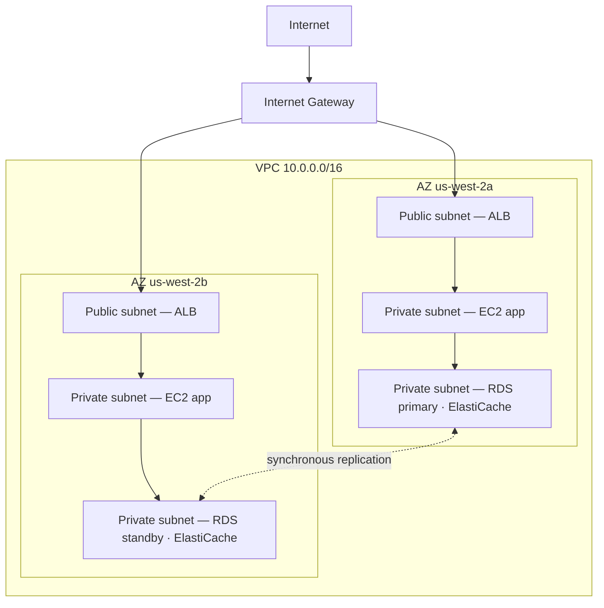

# अध्याय 11: क्लाउड का आपका निजी कोना

प्रिया के पास एक कागज़ था जिस पर एक चित्र था।

यह कोई जटिल चित्र नहीं था। एक आयत, जिस पर "AWS" लिखा था। आयत के अंदर, बक्सों का एक समूह: EC2 इंस्टेंस, एक RDS डेटाबेस, एक ElastiCache क्लस्टर। हर चीज़ को हर दूसरी चीज़ से जोड़ने वाली रेखाएं। और आयत के बाहर, एक अकेला लेबल: "इंटरनेट।"

उसने इसे टेबल के बीच में रखा।

---

*कैशिंग परत काम कर रही थी। Redis ने पेज लोड को 188 मिलीसेकंड से 12 तक काट दिया था। लेकिन जब लीओ उस जीत का जश्न मना रहा था, प्रिया नेटवर्क लॉग पढ़ रही थी — और जो उसने देखा वह उसे पसंद नहीं आया। हर सेवा एक ही सपाट नेटवर्क पर थी। डेटाबेस का एक सार्वजनिक IP पता था। Redis क्लस्टर तकनीकी रूप से बाहर से पहुंच योग्य था। एप्लिकेशन काम करता था, लेकिन वास्तुकला एक पार्किंग लॉट थी: कोई बाड़ नहीं, कोई गेट नहीं, कोई ज़ोन नहीं।*

---

"यह वही है जो हमारे पास है," उसने कहा। "हमारे डेटाबेस का एक सार्वजनिक IP पता है। हमारी कैश परत इंटरनेट से पहुंची जा सकती है। हमारे EC2 इंस्टेंस सभी एक ही सपाट नेटवर्क पर हैं।"

"यह ठीक लगता है," लीओ ने कहा। "हमारे पास सुरक्षा समूह हैं।"

"सुरक्षा समूह जो तुमने कॉन्फ़िगर किए," प्रिया ने कहा। "रात में। प्रारंभिक सेटअप के दौरान।"

लीओ कुछ नहीं बोला।

"मैं कॉन्फ़िगरेशन की आलोचना नहीं कर रही," उसने कहा। "मैं कह रही हूं कि जब सब कुछ एक सपाट सार्वजनिक नेटवर्क पर रहता है, तो एक एकल गलत कॉन्फ़िगरेशन एक काम करने वाले सिस्टम और एक ऐसे सिस्टम के बीच का अंतर है जो इंटरनेट पर हर किसी के लिए सुलभ है।"

उसने एक लाल मार्कर उठाया और डेटाबेस के चारों ओर एक वृत्त बनाया।

"यह इंटरनेट से पहुंच योग्य नहीं होना चाहिए। बिल्कुल नहीं। न किसी सुरक्षा समूह नियम के माध्यम से, न किसी कठोर कॉन्फ़िगरेशन के माध्यम से। यह संरचनात्मक रूप से अगम्य होना चाहिए।"

"हमें नेटवर्क वास्तुकला के बारे में बात करनी होगी," माया ने कहा।

"हमें तीन महीने पहले इसके बारे में बात करनी थी," प्रिया ने कहा। "लेकिन अब ठीक है।"

टीम हफ्तों में पहली बार एक व्हाइटबोर्ड के चारों ओर इकट्ठा हुई।

**खुले पार्किंग लॉट की समस्या**

एक विशाल सार्वजनिक पार्किंग गैराज की कल्पना करें। दस हज़ार कारें। कोई भी कार कहीं भी पार्क कर सकती है। ज़ोन के बीच कोई बाधाएं नहीं, कोई गेट नहीं, कोई आरक्षित खंड नहीं।

यह एक खुला नेटवर्क है। हर सेवा हर दूसरी सेवा तक पहुंच सकती है। आपका वेब सर्वर आपके डेटाबेस से बात कर सकता है। आपका डेटाबेस इंटरनेट तक पहुंच सकता है। आपकी कैशिंग परत कहीं से भी कनेक्शन प्राप्त कर सकती है।

जब सब कुछ हर चीज़ से बात कर सकता है, तो एक समझौता सब कुछ को प्रभावित करता है।

"तो अगर कोई पार्किंग गैराज में सेंध लगाता है," टॉम ने कहा, "तो वे किसी भी कार में जा सकते हैं।"

"और किसी भी कार से, कहीं भी ड्राइव कर सकते हैं," प्रिया ने पुष्टि की। "हमें बाड़ चाहिए। हमें बंद गेट चाहिए। हमें ज़ोन चाहिए।"

VPC AWS में उन ज़ोन को बनाने का तरीका है।

**VPC क्या है?**

"रुको — लेकिन *क्यों* हम इसे इस तरह करेंगे?" माया ने पूछा। "अगर हमारे पास पहले से ही हर संसाधन पर सुरक्षा समूह हैं, तो हमें एक VPC की ज़रूरत क्यों है? क्या सुरक्षा समूह वही काम नहीं कर रहे?"

सुरक्षा समूह और VPC अलग-अलग स्तरों पर रक्षा करते हैं। एक सुरक्षा समूह एक विशिष्ट संसाधन से जुड़ा नियम है — यह कहता है "यह EC2 इंस्टेंस केवल लोड बैलेंसर से पोर्ट 8080 पर ट्रैफ़िक स्वीकार करता है।" लेकिन यह अभी भी सार्वजनिक नेटवर्क पर है। IP पता अभी भी पहुंच योग्य है; नियम बस दरवाज़े पर कनेक्शन को रोकता है। एक VPC दरवाज़े को सार्वजनिक गली से पूरी तरह हटा देता है। एक निजी सबनेट में एक संसाधन का इंटरनेट तक कोई *मार्ग* नहीं होता — और परंपरा के अनुसार कोई सार्वजनिक IP नहीं — इसलिए इसे इंटरनेट से नहीं पहुंचा जा सकता, चाहे सुरक्षा समूह कुछ भी कहे। यह एक संरचनात्मक गारंटी है, कॉन्फ़िगरेशन वाली नहीं।

एक **वर्चुअल प्राइवेट क्लाउड (VPC)** AWS क्लाउड का एक तार्किक रूप से पृथक खंड है — एक निजी नेटवर्क जिसे आप परिभाषित करते हैं, जिसे डिफ़ॉल्ट रूप से केवल आपके संसाधन एक्सेस कर सकते हैं।

इसे विशाल सार्वजनिक पार्किंग गैराज के अंदर एक बाड़ वाले निजी लॉट के रूप में सोचें। आपके लॉट के अपने नियम हैं: कौन प्रवेश कर सकता है, कौन निकल सकता है, खंडों के बीच कौन से मार्ग मौजूद हैं।

जब आप एक VPC बनाते हैं, तो आप परिभाषित करते हैं:

**एक CIDR ब्लॉक**: आपके नेटवर्क के अंदर उपलब्ध IP पतों की श्रेणी। उदाहरण के लिए, `10.0.0.0/16` आपको 65,536 संभावित IP पते देता है (10.0.0.0 से 10.0.255.255 तक)।

**सबनेट**: आपके VPC के उपविभाग, प्रत्येक को आपकी IP पता श्रेणी का एक हिस्सा सौंपा गया और एक विशिष्ट उपलब्धता क्षेत्र से जुड़ा हुआ।

**राउट टेबल**: नियम जो निर्धारित करते हैं कि नेटवर्क ट्रैफ़िक कहां जाता है।

**इंटरनेट गेटवे**: आपके VPC और सार्वजनिक इंटरनेट के बीच का कनेक्शन।

**सबनेट: सार्वजनिक बनाम निजी**

सभी संसाधनों को सार्वजनिक रूप से सुलभ नहीं होना चाहिए।

आपके वेब सर्वर को इंटरनेट से ट्रैफ़िक स्वीकार करने की ज़रूरत है — उपयोगकर्ताओं के ब्राउज़र को इस तक पहुंचना होता है।

आपके डेटाबेस को *कभी* इंटरनेट से ट्रैफ़िक स्वीकार नहीं करना चाहिए — केवल आपका वेब सर्वर ही इससे बात करने में सक्षम होना चाहिए।

यहीं सबनेट आते हैं।

एक **सार्वजनिक सबनेट** एक इंटरनेट गेटवे से जुड़ा होता है और इसमें सार्वजनिक IP पतों वाले संसाधन हो सकते हैं। ट्रैफ़िक इंटरनेट से और इंटरनेट तक प्रवाहित हो सकता है।

एक **निजी सबनेट** की राउट टेबल में इंटरनेट तक कोई मार्ग नहीं होता। एक निजी सबनेट में संसाधन केवल आपके VPC में अन्य संसाधनों के साथ संवाद कर सकते हैं (जब तक आप विशिष्ट आउटबाउंड मार्ग सेट न करें)। परंपरा के अनुसार, उनके पास कोई सार्वजनिक IP पता भी नहीं होता।

Nimbus के लिए, डिज़ाइन स्पष्ट हो गया:



लोड बैलेंसर सार्वजनिक-सामना वाला है — इसे इंटरनेट से ट्रैफ़िक प्राप्त करने की ज़रूरत है। EC2 इंस्टेंस निजी हैं — वे केवल लोड बैलेंसर से ट्रैफ़िक प्राप्त करते हैं। डेटाबेस निजी हैं — वे केवल EC2 इंस्टेंसेज़ से ट्रैफ़िक प्राप्त करते हैं।

"तो डेटाबेस तक पहुंचने के लिए," टॉम ने कहा, "किसी को लोड बैलेंसर से, फिर EC2 इंस्टेंस से, फिर डेटाबेस सुरक्षा समूह से गुज़रना होगा?"

"तीन परतें," प्रिया ने पुष्टि की। "गहराई में रक्षा।"

---

**Nimbus की CIDR योजना**

"रुको — लेकिन *क्यों* हम इसे इस तरह करेंगे?" माया ने CIDR ब्लॉक विकल्पों को देखते हुए पूछा। "प्रिया IP पता श्रेणियों के बारे में इतनी विशिष्ट क्यों है? क्या हम बस वही उपयोग नहीं कर सकते जो AWS डिफ़ॉल्ट करता है?"

"क्योंकि CIDR ब्लॉक को बाद में बदलना बहुत मुश्किल है," प्रिया ने कहा। "और क्योंकि अगर हम कभी इस VPC को किसी अन्य VPC से, या एक ऑन-प्रिमाइसेस नेटवर्क से जोड़ते हैं, तो ओवरलैपिंग IP श्रेणियां ऐसी राउटिंग विफलताएं पैदा करती हैं जिन्हें डिबग करना दर्दनाक होता है।"

उसने व्हाइटबोर्ड पर योजना बनाई।

Nimbus का VPC: `10.0.0.0/16` — कुल 65,536 पते।

| सबनेट | CIDR | AZ | उद्देश्य |
|---|---|---|---|
| Public A | 10.0.0.0/24 | us-west-2a | लोड बैलेंसर |
| Public B | 10.0.1.0/24 | us-west-2b | लोड बैलेंसर |
| Private App A | 10.0.10.0/24 | us-west-2a | EC2 ऐप सर्वर |
| Private App B | 10.0.11.0/24 | us-west-2b | EC2 ऐप सर्वर |
| Private Data A | 10.0.20.0/24 | us-west-2a | RDS, ElastiCache |
| Private Data B | 10.0.21.0/24 | us-west-2b | RDS, ElastiCache |

"बस सब कुछ /16 क्यों न बनाएं?" लीओ ने पूछा।

"क्योंकि विभिन्न AZ में सबनेट को एक पता स्थान साझा नहीं करना चाहिए। प्रत्येक सबनेट एक AZ में है। अगर हम कभी इस VPC को किसी अन्य से पीयर करते हैं, तो हम जितने अधिक बारीक होंगे, उतनी ही कम संभावना है कि हमारे पास टकराव हों। और प्रत्येक /24 हमें 251 उपयोग योग्य पते देता है — किसी एकल टियर के लिए पर्याप्त से अधिक।"

"AWS प्रत्येक सबनेट में पांच पते आरक्षित करता है," टॉम ने दस्तावेज़ देखते हुए टिप्पणी की। "इसीलिए यह 251 है, 256 नहीं।"

"सही। पहले चार और आखिरी एक। नेटवर्क पता, VPC राउटर, DNS सर्वर, भविष्य का उपयोग, ब्रॉडकास्ट।"

"तो /24 सबसे छोटा है जहां तक तुम जाओगी?"

"व्यवहार में। आप बहुत छोटे सबनेट के लिए /28 का उपयोग करेंगे — जैसे एक VPN गेटवे सबनेट, जिसे केवल कुछ IP की ज़रूरत होती है। लेकिन एप्लिकेशन टियर के लिए, /24 एक उचित न्यूनतम है।"

टॉम ने संख्याएं लिख लीं और आकारों के बीच मासिक लागत अंतर की गणना की। वह हमेशा करता था।

---

**बचने लायक CIDR योजना गलतियां**

"क्या हमने सोचा है कि अगर हम एक सबनेट से बड़े हो जाएं तो क्या होगा?" प्रिया ने पूछा। वह इसलिए नहीं पूछ रही थी कि वह नहीं जानती थी। वह इसलिए पूछ रही थी क्योंकि बाकी टीम को जवाब आत्मसात करना था।

लीओ ने इस पर सोचा। "हम अधिक सबनेट जोड़ सकते हैं?"

"आप एक VPC में सबनेट जोड़ सकते हैं। लेकिन आप एक मौजूदा सबनेट का आकार नहीं बदल सकते। अगर आपका निजी ऐप सबनेट भर जाए — 251 पते पर्याप्त नहीं हैं — तो आपको एक नया सबनेट बनाना और इंस्टेंसेज़ को उसमें माइग्रेट करना होगा।"

"यह वास्तव में कितनी बार होता है?"

"शायद ही कभी, अगर आप अच्छी योजना बनाते हैं। लेकिन लोग तीन आम गलतियां करते हैं।"

उसने उन्हें सूचीबद्ध किया:

**गलती एक**: बहुत छोटा VPC CIDR उपयोग करना। अगर आप पूरे VPC के लिए `10.0.0.0/24` (254 पते) उपयोग करते हैं, तो आप सबनेट की योजना पूरी करने से पहले ही जगह से बाहर हो जाएंगे। लचीलेपन के लिए `/16` से शुरू करें।

**गलती दो**: VPC में ओवरलैपिंग CIDR उपयोग करना। अगर आपका प्रोडक्शन VPC `10.0.0.0/16` है और आपका स्टेजिंग VPC भी `10.0.0.0/16` है, तो आप उन्हें कभी पीयर नहीं कर सकते या एक ट्रांज़िट गेटवे के माध्यम से नहीं जोड़ सकते। राउटर नहीं जानेंगे कि किस VPC को ट्रैफ़िक भेजना है।

**गलती तीन**: भविष्य के टियर के लिए पता स्थान आरक्षित न करना। Nimbus की योजना ने `10.0.30.0/24` और `10.0.31.0/24` को असौंपा छोड़ा — एक भविष्य के आंतरिक टूलिंग टियर, एक मॉनिटरिंग सबनेट, या एक VPN एंडपॉइंट सबनेट के लिए जगह, पूरे पता स्थान को पुनर्संरचित किए बिना।

"जितना आपको लगता है उससे दोगुने के लिए योजना बनाएं," प्रिया ने कहा। "सबनेट मुफ़्त हैं। एक `/16` से IP पता स्थान प्रचुर है। गलत योजना बनाने की लागत एक नेटवर्क माइग्रेशन है।"

---

**NAT गेटवे: निजी सबनेट जो अभी भी चीज़ें डाउनलोड कर सकते हैं**

निजी सबनेट इंटरनेट तक नहीं पहुंच सकते। लेकिन कभी-कभी, उन्हें ज़रूरत होती है। आपके EC2 इंस्टेंस को एक सॉफ़्टवेयर अपडेट डाउनलोड करने की ज़रूरत है। आपके एप्लिकेशन को एक बाहरी API कॉल करने की ज़रूरत है।

यहीं **NAT गेटवे** (नेटवर्क एड्रेस ट्रांसलेशन) आता है।

एक NAT गेटवे एक सार्वजनिक सबनेट में बैठता है। निजी सबनेट में संसाधन NAT गेटवे को आउटबाउंड ट्रैफ़िक भेज सकते हैं, जो इसे इंटरनेट तक पहुंचाता है — लेकिन इंटरनेट वापस कनेक्शन शुरू नहीं कर सकता।

यह एक एकतरफ़ा घूमने वाले दरवाज़े जैसा है। आप बाहर जा सकते हैं। बाहर का कोई अंदर नहीं आ सकता।

"वह प्रति माह कितना खर्च होता है?" टॉम ने पूछा।

NAT गेटवे मूल्य निर्धारण के दो घटक हैं: प्रत्येक NAT गेटवे के लिए एक प्रति घंटा शुल्क, साथ ही एक प्रति-GB डेटा प्रोसेसिंग शुल्क।

जिस समय Nimbus ने इसे सेट किया, वह प्रति NAT गेटवे लगभग $32/माह था, साथ ही प्रोसेस किए गए प्रति GB डेटा $0.045। छोटे ट्रैफ़िक वॉल्यूम के लिए, निश्चित लागत हावी रहती है। स्केल पर, डेटा शुल्क पर्याप्त हो सकते हैं।

टॉम ने NAT गेटवे कॉन्फ़िगरेशन पूरा करने से पहले डेटा प्रोसेसिंग लागत के लिए एक बिलिंग अलर्ट सेट किया। उसने देखा था कि जब कोई नहीं देख रहा होता तो AWS डेटा लागत कैसी दिखती है।

वह आश्चर्य जो टीमों को चौंका देता था: हर बाइट जो एक NAT गेटवे से गुज़रती है, चार्ज की जाती है। अगर निजी सबनेट में आपके EC2 इंस्टेंस बड़े सॉफ़्टवेयर पैकेज डाउनलोड कर रहे हैं, बाहरी सेवाओं को लॉग स्ट्रीम कर रहे हैं, या बाहरी API को महत्वपूर्ण डेटा भेज रहे हैं, तो NAT गेटवे डेटा शुल्क बिल पर एक आश्चर्य के रूप में दिखाई देते हैं। AWS-से-AWS ट्रैफ़िक के लिए समाधान: VPC एंडपॉइंट AWS सेवाओं (S3, DynamoDB) को निजी रूप से ट्रैफ़िक रूट करते हैं, NAT गेटवे को पूरी तरह बायपास करते हुए और उन डेटा शुल्कों को समाप्त करते हुए।

"तो निजी सबनेट में EC2 इंस्टेंस NAT गेटवे के माध्यम से OS अपडेट डाउनलोड करते हैं," टॉम ने कहा। "वे अपडेट कितने गीगाबाइट हैं?"

"प्रति इंस्टेंस, प्रति माह, शायद दो से पांच GB," लीओ ने कहा।

"दस इंस्टेंस से गुणा। बारह महीने से गुणा। $0.045 प्रति GB पर—"

"ग्यारह से सत्ताईस डॉलर प्रति वर्ष," प्रिया ने पूरा किया। "इस मामले में, स्वीकार्य।"

"लेकिन अगर हम लॉग स्ट्रीम कर रहे होते — जैसे अपने सभी एप्लिकेशन लॉग एक बाहरी ऑब्ज़र्वेबिलिटी सेवा को भेजना—"

"हम उन्हें एक VPC एंडपॉइंट के माध्यम से रूट करेंगे या NAT के माध्यम से बाहर जाने के बजाय CloudWatch Logs का उपयोग करेंगे।"

टॉम ने कैलकुलेटर बंद किया। गणित काफ़ी स्पष्ट था।

### NAT इंस्टेंस: बजट विकल्प

"रुको," टॉम ने अभी भी मूल्य निर्धारण पेज को घूरते हुए कहा। "हम निजी इंस्टेंसेज़ को इंटरनेट तक पहुंचने देने के लिए बस प्रति गीगाबाइट भुगतान कर रहे हैं? क्या यही एकमात्र विकल्प है?"

"यह प्रबंधित विकल्प है," प्रिया ने कहा। "एक पुराना तरीका है, लेकिन यह ट्रेड-ऑफ़ के साथ आता है।"

NAT गेटवे के अस्तित्व से पहले, टीमें एक नियमित EC2 इंस्टेंस — एक "NAT इंस्टेंस" — के साथ वही आउटबाउंड राउटिंग हासिल करती थीं। आप एक सार्वजनिक सबनेट में एक EC2 इंस्टेंस लॉन्च करते, OS में IP फ़ॉरवर्डिंग सक्षम करते, स्रोत/गंतव्य जांच अक्षम करते (जिसे AWS डिफ़ॉल्ट रूप से इंस्टेंस को संबोधित न किए गए पैकेट छोड़ने के लिए सक्षम करता है), और निजी सबनेट की राउट टेबल को इंस्टेंस के ENI पर इंगित करते। निजी इंस्टेंसेज़ से ट्रैफ़िक इसके माध्यम से इंटरनेट तक प्रवाहित होता, ठीक एक NAT गेटवे की तरह।

यह अभी भी काम करता है। AWS अभी भी इसे प्रलेखित करता है। और बहुत कम ट्रैफ़िक वॉल्यूम पर — एक एकल डेव वातावरण जहां कुछ इंस्टेंस कभी-कभार पैकेज डाउनलोड करते हैं — एक `t3.micro` NAT इंस्टेंस पांच डॉलर प्रति माह से कम खर्च हो सकता है, NAT गेटवे के निश्चित प्रति घंटा शुल्क प्लस प्रति-GB शुल्क के बजाय।

| | NAT गेटवे | NAT इंस्टेंस |
|---|---|---|
| प्रबंधन | AWS द्वारा पूरी तरह प्रबंधित | आप EC2 प्रबंधित करते हैं |
| उपलब्धता | AZ के भीतर रिडंडंट | एकल EC2 — एकल बिंदु विफलता |
| बैंडविड्थ | 100 Gbps तक, स्वचालित रूप से स्केल करता है | EC2 इंस्टेंस प्रकार द्वारा सीमित |
| लागत | $0.045/GB + प्रति घंटा शुल्क | केवल EC2 इंस्टेंस लागत |

लागत लाभ जल्दी गायब हो जाता है। सार्थक ट्रैफ़िक वॉल्यूम पर, प्रति-GB NAT गेटवे शुल्क उस EC2 इंस्टेंस प्रकार के साथ प्रतिस्पर्धी है जिसकी आपको उस बैंडविड्थ को संभालने के लिए ज़रूरत होगी — और NAT गेटवे को शून्य पैचिंग, शून्य निगरानी, और इसके विफल होने पर शून्य घटना प्रतिक्रिया की ज़रूरत होती है (यह विफल नहीं होता)।

"तो हम वास्तव में एक NAT इंस्टेंस का उपयोग कब करेंगे?" लीओ ने पूछा।

"एक फेंक देने योग्य डेव वातावरण," प्रिया ने कहा। "कहीं जहां आप एक या दो इंस्टेंस चला रहे हों, कभी-कभार पैकेज अपडेट कर रहे हों, और निश्चित लागत कम करना चाहते हों। प्रोडक्शन वर्कलोड — कुछ भी जिसे उपलब्ध रहना है — NAT गेटवे, प्रति AZ एक।"

परीक्षा इस ट्रेड-ऑफ़ का नाम लेकर परीक्षण करती है। पैटर्न: "कम ट्रैफ़िक वाले एक डेव या टेस्ट वातावरण में NAT लागत कम करें" NAT इंस्टेंस की ओर इशारा करता है। "उच्च उपलब्धता की ज़रूरत वाला प्रोडक्शन वर्कलोड" प्रति AZ तैनात NAT गेटवे की ओर इशारा करता है।

आप सोच रहे होंगे: अगर सुरक्षा समूह पहले से मौजूद हैं और डिफ़ॉल्ट रूप से ट्रैफ़िक रोकते हैं, तो निजी सबनेट वाला एक VPC सार्थक सुरक्षा क्यों जोड़ता है? क्योंकि "एक सुरक्षा समूह द्वारा अवरुद्ध" और "संरचनात्मक रूप से अगम्य" अलग चीज़ें हैं। एक सुरक्षा समूह गलत कॉन्फ़िगरेशन — एक गलत नियम, एक खुला पोर्ट — एक ऐसे संसाधन को उजागर कर सकता है जिसका सार्वजनिक IP है। एक निजी सबनेट में एक संसाधन के पास पहली जगह कोई सार्वजनिक IP नहीं होता जिस तक पहुंचा जाए। आपको डेटाबेस तक पहुंचने का प्रयास करने से पहले लोड बैलेंसर और एक चल रहे EC2 इंस्टेंस से समझौता करना होगा। निजी सबनेट नेटवर्क स्तर पर अलगाव लागू करते हैं, नियम स्तर पर नहीं।

**राउट टेबल: ट्रैफ़िक अपना रास्ता कैसे खोजता है**

हर सबनेट में एक **राउट टेबल** होती है जो ट्रैफ़िक को बताती है कि कहां जाना है।

एक सामान्य सार्वजनिक सबनेट राउट टेबल इस तरह दिखती है:

| गंतव्य | लक्ष्य                      |
|-------------|-----------------------------|
| 10.0.0.0/16 | local                       |
| 0.0.0.0/0   | igw-xxxx (Internet Gateway) |

पहला नियम: आपके VPC श्रेणी में किसी भी IP तक ट्रैफ़िक स्थानीय रहता है। दूसरा नियम: अन्य सभी ट्रैफ़िक (`0.0.0.0/0` का मतलब "सब कुछ") इंटरनेट गेटवे पर जाता है।

एक निजी सबनेट राउट टेबल:

| गंतव्य | लक्ष्य                 |
|-------------|------------------------|
| 10.0.0.0/16 | local                  |
| 0.0.0.0/0   | nat-xxxx (NAT Gateway) |

निजी सबनेट ट्रैफ़िक स्थानीय रहता है या NAT गेटवे के माध्यम से निकलता है। इंटरनेट गेटवे तक कोई प्रत्यक्ष मार्ग नहीं।

**सुरक्षा समूह बनाम NACL (पूर्वावलोकन)**

VPC के अंदर, आपके पास संसाधन स्तर पर ट्रैफ़िक नियंत्रित करने के दो उपकरण हैं:

**सुरक्षा समूह** (अध्याय 15 इसे गहराई से कवर करता है) व्यक्तिगत संसाधनों — एक EC2 इंस्टेंस, एक RDS इंस्टेंस, एक लोड बैलेंसर — के लिए वर्चुअल फ़ायरवॉल के रूप में कार्य करते हैं। वे *स्टेटफुल* हैं: अगर ट्रैफ़िक को अंदर आने की अनुमति है, तो प्रतिक्रिया ट्रैफ़िक को स्वचालित रूप से बाहर जाने की अनुमति है।

**नेटवर्क ACL (NACL)** सबनेट स्तर पर काम करते हैं और *स्टेटलेस* हैं: आपको इनबाउंड और आउटबाउंड दोनों ट्रैफ़िक को अलग-अलग स्पष्ट रूप से अनुमति देनी होगी।

अधिकांश उपयोग मामलों के लिए, सुरक्षा समूह पर्याप्त हैं। NACL एक अतिरिक्त परत जोड़ते हैं जब आपको सबनेट-स्तरीय नियंत्रण चाहिए — उदाहरण के लिए, एक विशिष्ट IP श्रेणी को किसी सबनेट तक कभी पहुंचने से रोकना।

"इंस्टेंस स्तर पर सुरक्षा समूह," लीओ ने व्हाइटबोर्ड पर लिखा। "सबनेट स्तर पर NACL।"

"और पोर्ट 22 को कभी 0.0.0.0/0 के लिए खुला न छोड़ें," प्रिया ने लीओ को देखते हुए जोड़ा।

"वह एक बार था," लीओ ने कहा।

"यह हमेशा ठीक एक बार होता है," प्रिया ने कहा, "जब तक नहीं होता।"

"और अगर कोई सेंध लगाने की कोशिश करे तो क्या?" प्रिया ने अभी भी व्हाइटबोर्ड पर खड़े होकर कहा। "एक गलत कॉन्फ़िगर किए गए सुरक्षा समूह के माध्यम से नहीं — अगर वे लोड बैलेंसर से ही समझौता कर लें तो क्या? उन्हें निजी सबनेट में घुसने से क्या रोकता है?"

"निजी सबनेट EC2 इंस्टेंस केवल लोड बैलेंसर के सुरक्षा समूह से ट्रैफ़िक स्वीकार करते हैं," लीओ ने कहा। "भले ही लोड बैलेंसर से समझौता हो जाए, हमलावर केवल ऐसे अनुरोध कर सकता है जो सामान्य API कॉल जैसे दिखें।"

"और डेटाबेस केवल EC2 सुरक्षा समूह से ट्रैफ़िक स्वीकार करता है," प्रिया ने कहा। "गहराई में रक्षा। हर परत मानती है कि पिछली परत विफल हो सकती है।"

---

**VPC Flow Logs: देखना कि क्या हो रहा है**

"हमें नेटवर्क पर नज़र चाहिए," प्रिया ने VPC पुनर्डिज़ाइन के तीन दिन बाद कहा।

"हमारे पास सुरक्षा समूह और NACL हैं," लीओ ने कहा। "ट्रैफ़िक नियंत्रित है।"

"नियंत्रित का मतलब दृश्यमान नहीं है। अगर कुछ अजीब होता है — एक अप्रत्याशित कनेक्शन प्रयास, एक अजीब पोर्ट पर ट्रैफ़िक — तो हमें कैसे पता चलेगा?"

VPC Flow Logs आपके VPC के माध्यम से प्रवाहित होने वाले नेटवर्क ट्रैफ़िक के बारे में मेटाडेटा कैप्चर करते हैं। पैकेट सामग्री नहीं — बस कनेक्शन-स्तरीय जानकारी: स्रोत IP, गंतव्य IP, पोर्ट, प्रोटोकॉल, पैकेट गणना, बाइट गणना, प्रारंभ समय, अंत समय, और क्या ट्रैफ़िक स्वीकार किया गया या अस्वीकार किया गया।

एक सामान्य फ़्लो लॉग प्रविष्टि इस तरह दिखती है:

```
2 123456789012 eni-0abc123 10.0.10.5 10.0.20.8 49321 5432 6 20 4320 1620000000 1620000060 ACCEPT OK
```

यह आपको बताता है: `10.0.10.5` से (ऐप सबनेट में एक EC2 इंस्टेंस) `10.0.20.8` तक (RDS इंस्टेंस), पोर्ट 5432 (PostgreSQL), 20 पैकेट, 4,320 बाइट, स्वीकृत। सामान्य ट्रैफ़िक।

लेकिन Flow Logs सक्षम करने के कुछ दिन बाद, प्रिया ने यह पाया:

```
2 123456789012 eni-0abc123 185.220.101.55 10.0.10.5 0 8080 6 1 40 1620003200 1620003201 REJECT OK
```

एक बाहरी IP — `185.220.101.55` — ने पोर्ट 8080 पर EC2 इंस्टेंस से कनेक्शन का प्रयास किया था। कनेक्शन को सुरक्षा समूह द्वारा अस्वीकार कर दिया गया। लेकिन प्रयास लॉग किया गया।

उसने IP देखा। यह एक रोमानियाई पता ब्लॉक से संबंधित था जो स्वचालित स्कैनिंग के लिए जाना जाता है — उस तरह की पृष्ठभूमि-शोर जांच जो इंटरनेट पर हर सार्वजनिक IP लगातार प्राप्त करता है।

"कोई हमें जांच रहा है," उसने कहा।

"लेकिन अस्वीकृत हो रहा है," लीओ ने कहा।

"इस बार। GuardDuty सक्षम करो" — एक खतरा-पहचान सेवा जिससे हम अध्याय 17 में ठीक से मिलेंगे — "आगे बढ़ने से पहले। हमें व्यवहारिक पहचान चाहिए, न कि केवल परिधि अवरोधन।"

Flow Logs CloudWatch Logs या S3 में संग्रहीत होते हैं। उन्हें CloudWatch Insights या Athena का उपयोग करके क्वेरी किया जा सकता है। प्रिया ने एक CloudWatch Insights क्वेरी सेट की जो हर रात चलती थी और गैर-AWS IP श्रेणियों से किसी भी अस्वीकृत कनेक्शन प्रयास को चिह्नित करती थी।

"वह प्रति माह कितना खर्च होता है?" टॉम ने पूछा।

"फ़्लो लॉग CloudWatch या S3 में अंतर्ग्रहण किए गए प्रति GB डेटा पर चार्ज किए जाते हैं। हमारी ट्रैफ़िक वॉल्यूम पर, शायद आठ से पंद्रह डॉलर प्रति माह।"

टॉम रुका। "और विकल्प यह न जानना है कि कोई हमारे नेटवर्क की जांच कर रहा है।"

"हां।"

"यह ठीक है," उसने कहा, और कंसोल खोला।

**Flow Logs में एक पोर्ट स्कैन पढ़ना**

फ़्लो लॉग सक्षम करने के दो हफ्ते बाद, प्रिया ने अपनी रात की CloudWatch Insights क्वेरी चलाई और कुछ नया पाया। एक अस्वीकृत कनेक्शन नहीं — दर्जनों, तेज़ अनुक्रम में, एक ही स्रोत IP से, लगातार पोर्ट पर।

```
185.220.101.55 → 10.0.10.5 port 22   REJECT
185.220.101.55 → 10.0.10.5 port 23   REJECT
185.220.101.55 → 10.0.10.5 port 25   REJECT
185.220.101.55 → 10.0.10.5 port 80   REJECT
185.220.101.55 → 10.0.10.5 port 443  REJECT
185.220.101.55 → 10.0.10.5 port 3306 REJECT
185.220.101.55 → 10.0.10.5 port 5432 REJECT
185.220.101.55 → 10.0.10.5 port 6379 REJECT
```

सभी एक पांच-सेकंड की विंडो के भीतर। सभी अस्वीकृत।

"वह एक पोर्ट स्कैन है," प्रिया ने कहा। "कोई जांच रहा है कि यह इंस्टेंस कौन सी सेवाएं चला रहा है।"

"लेकिन सभी अस्वीकृत," लीओ ने कहा। "तो सुरक्षा समूह अपना काम कर रहा है।"

"सुरक्षा समूह अपना काम कर रहा है। स्कैन अभी भी हमलावर के लिए सूचनात्मक है — यह उन्हें बताता है कि कौन से पोर्ट एक टाइमआउट के भीतर अस्वीकार *नहीं* हुए, जिसका मतलब है कि वे पोर्ट कहीं खुले हैं। और यह उन्हें बताता है कि यह होस्ट जीवित है और जांच के लायक है।"

"हम क्या करें?"

"दो चीज़ें," प्रिया ने कहा। "पहली: उस /24 श्रेणी को ब्लॉक करने के लिए एक NACL नियम जोड़ें जिससे वह IP संबंधित है। केवल वह IP नहीं — पूरा सबनेट। पोर्ट स्कैनर एक श्रेणी के भीतर IP घुमाते हैं। दूसरी: एक CloudWatch अलार्म जोड़ें जो तब फ़ायर होता है जब कोई एकल स्रोत IP साठ सेकंड में दस से अधिक अस्वीकृत कनेक्शन उत्पन्न करता है। वह पैटर्न लगभग हमेशा एक स्कैन होता है।"

उसने दोनों सेट किए। अगले हफ्ते में अलार्म दो बार फ़ायर हुआ — एक बार उसी रोमानियाई श्रेणी से, एक बार सिंगापुर में स्थित एक स्वचालित स्कैनर से। दोनों को पहचान के मिनटों के भीतर NACL पर ब्लॉक कर दिया गया।

फ़्लो लॉग हमलों को नहीं रोकते। वे हमलों को दृश्यमान बनाते हैं। और दृश्यमान हमलों का जवाब दिया जा सकता है। विकल्प — ट्रैफ़िक का अदृश्य रूप से प्रवाहित होना — का मतलब है कि किसी समस्या का पहला संकेत क्षति है, प्रयास नहीं।

---

**एकल NAT गेटवे जाल**

VPC पुनर्डिज़ाइन के तीन महीने बाद, प्रिया ने एक विफलता सिमुलेशन चलाया। वह जानना चाहती थी कि अगर `us-west-2a` उपलब्धता क्षेत्र में व्यवधान आए तो Nimbus का क्या होगा।

अधिकांश ठीक था। लोड बैलेंसर `us-west-2b` में इंस्टेंसेज़ पर फ़ेलओवर हुआ। `us-west-2b` में RDS स्टैंडबाय पहले से लाइव था। ElastiCache ने रेप्लिका प्रमोट किया। एप्लिकेशन अनुरोधों की सेवा जारी रखे रहा।

फिर लीओ ने नोटिस किया कि `us-west-2b` में उसके EC2 इंस्टेंसेज़ ने OS अपडेट सूचनाएं प्राप्त करना बंद कर दिया था। उसने NAT गेटवे कॉन्फ़िगरेशन जांचा।

एक था। `us-west-2a` में।

"दोनों AZ में निजी सबनेट से सारा आउटबाउंड इंटरनेट ट्रैफ़िक एक AZ में एक NAT गेटवे के माध्यम से रूट होता है," प्रिया ने कहा।

"तो अगर `us-west-2a` डाउन हो जाए—"

"`us-west-2b` में हर EC2 इंस्टेंस आउटबाउंड इंटरनेट एक्सेस खो देता है। वे अपडेट डाउनलोड नहीं कर सकते। वे बाहरी API तक नहीं पहुंच सकते। Secrets Manager लुकअप जो कैश नहीं हैं विफल हो जाएंगे। कुछ भी जो आउटबाउंड इंटरनेट की ज़रूरत रखता है टूट जाएगा।"

फ़िक्स: प्रति AZ एक NAT गेटवे। प्रत्येक AZ के निजी सबनेट उसी AZ में NAT गेटवे को आउटबाउंड ट्रैफ़िक रूट करते हैं। जब एक AZ विफल होता है, तो केवल उस AZ का ट्रैफ़िक प्रभावित होता है।

"और उस फ़िक्स पर कीमत?" टॉम ने पूछा।

"दूसरे AZ के NAT गेटवे के लिए अतिरिक्त बत्तीस डॉलर प्रति माह।"

टॉम एक पल के लिए चुप रहा।

"एक आउटेज के दौरान `us-west-2b` में EC2 क्षमता का बाहरी API तक पहुंचने में विफल होना," प्रिया ने कहा, "बत्तीस डॉलर से अधिक खर्च होता है।"

टॉम ने परिवर्तन को मंज़ूरी दी।

यह सबसे आम VPC डिज़ाइन गलतियों में से एक है: एक NAT गेटवे जो अत्यधिक उपलब्ध दिखता है लेकिन वास्तव में एक एकल बिंदु विफलता है। अगर आपके पास तीन AZ में संसाधन हैं और एक NAT गेटवे, तो आपके पास तीन-AZ कंप्यूट लचीलापन है लेकिन एक-AZ नेटवर्क लचीलापन। दोनों मेल नहीं खाते।

नियम: प्रति AZ एक NAT गेटवे, उस AZ के सार्वजनिक सबनेट में। प्रत्येक AZ की निजी राउट टेबल अपने स्वयं के NAT गेटवे की ओर इंगित करती है। लागत मामूली है। उपलब्धता सुधार वास्तविक है।


---

**VPC पीयरिंग: निजी नेटवर्क जोड़ना**

क्या होगा अगर Nimbus कई VPC में बढ़ जाए? (यह होता है। टीमें बड़ी हो जाती हैं। सेवाएं अलग खातों में पृथक हो जाती हैं।)

**VPC पीयरिंग** दो VPC को निजी रूप से संवाद करने देता है जैसे वे एक ही नेटवर्क पर हों। ट्रैफ़िक AWS के निजी नेटवर्क को नहीं छोड़ता।

महत्वपूर्ण सीमाएं:

- VPC पीयरिंग सकर्मक नहीं है। अगर VPC A, VPC B के साथ पीयर करता है, और VPC B, VPC C के साथ पीयर करता है, तो A और C संवाद नहीं कर सकते — जब तक आप एक प्रत्यक्ष A-C पीयर न जोड़ें।
- पीयर किए गए VPC के बीच CIDR ब्लॉक ओवरलैप नहीं हो सकते।

कई VPC वाली बड़ी वास्तुकलाओं के लिए, **AWS Transit Gateway** (अध्याय 25) पीयरिंग कनेक्शनों के पूर्ण मेश की ज़रूरत के बिना सकर्मक राउटिंग संभालता है।

---

**AWS PrivateLink: AWS सेवाओं तक निजी पहुंच**

"निजी सबनेट से S3 तक पहुंचने के बारे में क्या?" लीओ ने पूछा। "हमारे EC2 इंस्टेंस S3 में रसीदें लिखते हैं। अभी वह ट्रैफ़िक NAT गेटवे के माध्यम से बाहर जाता है।"

"VPC एंडपॉइंट," प्रिया ने कहा। "विशेष रूप से, S3 और DynamoDB के लिए गेटवे एंडपॉइंट — वे मुफ़्त हैं।"

एक **VPC एंडपॉइंट** आपके VPC और एक AWS सेवा के बीच एक निजी कनेक्शन बनाता है, सार्वजनिक इंटरनेट को पूरी तरह बायपास करते हुए। आपके निजी सबनेट और AWS सेवा के बीच ट्रैफ़िक AWS नेटवर्क पर रहता है। कोई NAT गेटवे शुल्क नहीं। कोई इंटरनेट जोखिम नहीं।

S3 और DynamoDB के लिए, **गेटवे एंडपॉइंट** मुफ़्त और आसान हैं: NAT गेटवे के बजाय S3/DynamoDB ट्रैफ़िक को एंडपॉइंट की ओर इंगित करते हुए राउट टेबल में एक प्रविष्टि जोड़ें।

अन्य AWS सेवाओं (Secrets Manager, KMS, SNS, SQS) के लिए, **इंटरफ़ेस एंडपॉइंट** आपके सबनेट में एक निजी IP पते के साथ एक इलास्टिक नेटवर्क इंटरफ़ेस (ENI) बनाते हैं। सेवा तक ट्रैफ़िक उस निजी IP पर जाता है। इंटरफ़ेस एंडपॉइंट पैसे खर्च करते हैं — लगभग $0.01/घंटा **प्रति AZ जिसमें एंडपॉइंट प्रावधानित है** (तीन AZ में ENI वाला एक एंडपॉइंट प्रति घंटा दर का तीन गुना खर्च होता है), साथ ही प्रोसेस किए गए लगभग $0.01/GB डेटा — लेकिन वे संवेदनशील API कॉल (जैसे Secrets Manager लुकअप) को एक NAT गेटवे के माध्यम से या सार्वजनिक इंटरनेट पर रूट करने की ज़रूरत को समाप्त करते हैं।

"तो हमारे EC2 इंस्टेंस S3, DynamoDB, Secrets Manager, और KMS तक पहुंच सकते हैं," प्रिया ने कहा, "सभी निजी सबनेट से, बिना किसी इंटरनेट जोखिम के, और S3 और DynamoDB के लिए, बिना किसी NAT गेटवे डेटा शुल्क के।"

टॉम ने फिर गणना की। S3 ट्रैफ़िक की बचत Secrets Manager के लिए इंटरफ़ेस एंडपॉइंट लागत को कुछ महीनों के भीतर ऑफ़सेट कर देगी।

"PrivateLink सामान्य नाम है," प्रिया ने जोड़ा। "AWS PrivateLink इंटरफ़ेस एंडपॉइंट के लिए अंतर्निहित तकनीक है। परीक्षा दोनों शब्दों का उपयोग करती है।"

---

**एक डिबगिंग चेकलिस्ट**

VPC पुनर्डिज़ाइन के तीन महीने बाद, लीओ ने नेटवर्क तोड़ दिया। नाटकीय रूप से नहीं — उसने एक राउट टेबल एसोसिएशन संशोधित किया और गलती से निजी ऐप सबनेट को उसके NAT गेटवे मार्ग से डिस्कनेक्ट कर दिया।

EC2 इंस्टेंस बाहरी API तक नहीं पहुंच सके। वे एक-दूसरे तक पहुंच सकते थे, और वे डेटाबेस तक पहुंच सकते थे। बस इंटरनेट तक नहीं। आउटबाउंड HTTPS कॉल विफल होने लगीं।

उसने प्रिया द्वारा एक चेकलिस्ट देने से पहले चालीस मिनट समस्या निवारण में बिताए।

"जब कोई चीज़ एक VPC में किसी और चीज़ तक नहीं पहुंचती, तो इन्हें क्रम में जांचो," उसने कहा।

1. **स्रोत पर सुरक्षा समूह**: क्या आउटबाउंड नियम सही है? क्या यह उस ट्रैफ़िक की अनुमति देता है जो आप भेजने की कोशिश कर रहे हैं?
2. **गंतव्य पर सुरक्षा समूह**: क्या इनबाउंड नियम सही है? क्या यह स्रोत से ट्रैफ़िक की अनुमति देता है?
3. **स्रोत सबनेट पर NACL**: क्या एक इनबाउंड डिनाई नियम है जो प्रतिक्रिया ट्रैफ़िक को रोक रहा है? क्या एक आउटबाउंड अनुमति नियम है?
4. **गंतव्य सबनेट पर NACL**: क्या एक इनबाउंड अनुमति नियम है? क्या प्रतिक्रियाओं के लिए एक आउटबाउंड अनुमति नियम है?
5. **स्रोत सबनेट पर राउट टेबल**: क्या इसमें गंतव्य तक एक मार्ग है? क्या मार्ग सही लक्ष्य (NAT गेटवे, IGW, VPC एंडपॉइंट) की ओर इंगित कर रहा है?
6. **गंतव्य सबनेट पर राउट टेबल**: क्या इसमें स्रोत तक वापस एक मार्ग है?
7. **VPC एंडपॉइंट नीति**: अगर एक VPC एंडपॉइंट उपयोग कर रहे हैं, तो क्या एंडपॉइंट नीति कार्रवाई की अनुमति देती है?
8. **IAM अनुमतियां**: क्या EC2 भूमिका के पास सेवा कॉल करने की अनुमति है? (AWS API कॉल के लिए)

लीओ ने इसे चरण 5 पर पाया। राउट टेबल गलत निजी सबनेट से फिर से जुड़ी थी। NAT गेटवे मार्ग गायब था।

"अगर मेरे पास तीन महीने पहले यह सूची होती," उसने कहा, "तो मैंने इसे पांच मिनट में पा लिया होता।"

"अब से तुम्हारे पास यह होगी," प्रिया ने कहा।

## Direct Connect: समर्पित लाइन

VPC पुनर्डिज़ाइन के तीन महीने बाद, Nimbus ने Harborview Dining Group के साथ एक सौदा बंद किया — एक सौ-स्थान वाली एंटरप्राइज़ श्रृंखला जो प्रति दिन बीस लाख डॉलर के लेनदेन प्रोसेस करती थी।

तकनीकी समीक्षा कॉल अच्छी शुरू हुई। फिर उनकी अनुपालन अधिकारी ने अनम्यूट किया।

"हम सार्वजनिक इंटरनेट पर प्रोडक्शन लेनदेन डेटा रूट नहीं कर सकते," उसने कहा। "हमारे ऑडिटर को हमारे डेटा सेंटर और किसी भी क्लाउड वातावरण के बीच एक समर्पित, निजी, ऑडिट योग्य नेटवर्क पथ की ज़रूरत होती है। Site-to-Site VPN स्वीकार्य नहीं है। यह बाकी सबके साथ बैंडविड्थ साझा करता है। यह उपभोक्ता ट्रैफ़िक के समान तारों पर चलता है।"

टॉम ने लीओ को देखा। लीओ ने प्रिया को देखा।

"सटीक होने के लिए," प्रिया ने सावधानी से कहा, "PCI DSS स्वयं इंटरनेट पर एक एन्क्रिप्टेड VPN को प्रतिबंधित नहीं करता — एन्क्रिप्टेड परिवहन मानक को संतुष्ट करता है। आप जो वर्णन कर रही हैं वह आपके ऑडिटर की आंतरिक नीति है, जो सख्त है। यह वैध है। और इसके लिए एक सेवा है।"

**AWS Direct Connect** आपके ऑन-प्रिमाइसेस डेटा सेंटर और AWS के बीच एक समर्पित भौतिक नेटवर्क कनेक्शन है। कनेक्शन सार्वजनिक इंटरनेट को पूरी तरह बायपास करता है — आपका ट्रैफ़िक कभी साझा बुनियादी ढांचे को नहीं छूता, कभी किसी और के साथ बैंडविड्थ के लिए प्रतिस्पर्धा नहीं करता, और कभी एक ऐसे तार पर नहीं चलता जो आपका नहीं है।

Direct Connect सेट करने का मतलब है AWS और एक कोलोकेशन या नेटवर्क प्रदाता के साथ काम करना ताकि एक Direct Connect स्थान पर एक भौतिक क्रॉस-कनेक्ट स्थापित किया जाए — एक डेटा सेंटर जहां AWS के पास समर्पित उपकरण हैं। एक बार भौतिक लिंक जगह पर होने के बाद, आप इस पर वर्चुअल इंटरफ़ेस स्थापित करते हैं जो आपके VPC या सीधे AWS सेवाओं से जुड़ते हैं।

**मुख्य विशेषताएं:**

बैंडविड्थ दो रूपों में आती है। *समर्पित कनेक्शन* सीधे AWS हार्डवेयर तक जाते हैं: 1 Gbps, 10 Gbps, या 100 Gbps। *होस्टेड कनेक्शन* एक AWS Partner के माध्यम से जाते हैं और 50 Mbps से 10 Gbps तक अधिक बारीक विकल्प प्रदान करते हैं — तब उपयोगी जब आपको एक पूर्ण समर्पित पोर्ट की ज़रूरत न हो।

विलंबता सुसंगत है। क्योंकि आप इंटरनेट बैंडविड्थ के लिए प्रतिस्पर्धा नहीं कर रहे, AWS तक राउंड-ट्रिप समय पूर्वानुमेय है। Harborview के लिए, जिनके पॉइंट-ऑफ़-सेल सिस्टम प्रति लेनदेन सैकड़ों API कॉल करते थे, सुसंगत उप-5ms विलंबता एक 200ms चेकआउट और एक 400ms के बीच का अंतर थी।

गोपनीयता संरचनात्मक है, कॉन्फ़िगरेशन वाली नहीं। एक Site-to-Site VPN एन्क्रिप्टेड है, लेकिन यह अभी भी सार्वजनिक इंटरनेट से गुज़रता है — वही भौतिक बुनियादी ढांचा जो बाकी सब उपयोग करते हैं। Direct Connect ट्रैफ़िक कभी सार्वजनिक इंटरनेट को नहीं छूता। Harborview की अनुपालन टीम के लिए, वही आवश्यकता थी, और कोई भी VPN कॉन्फ़िगरेशन इसे संतुष्ट नहीं करेगा।

लागत VPN से अधिक है। आप Direct Connect कनेक्शन के लिए एक पोर्ट-घंटा शुल्क प्लस डेटा स्थानांतरण मूल्य निर्धारण का भुगतान करते हैं। कनेक्शन सस्ता नहीं है, और इसे प्रावधानित करने में हफ्तों से महीनों लगते हैं — एक भौतिक क्रॉस-कनेक्ट स्थापना कुछ ऐसी नहीं है जिसे आप शुक्रवार दोपहर में चालू करें।

"रुको," माया ने कहा। "अगर VPN एन्क्रिप्टेड है, तो यह क्यों मायने रखता है कि यह सार्वजनिक इंटरनेट पर जाता है?"

क्योंकि अनुपालन आवश्यकता केवल एन्क्रिप्शन के बारे में नहीं है — यह अलगाव के बारे में है। VPN ट्रैफ़िक की सामग्री को एन्क्रिप्ट करता है, लेकिन ट्रैफ़िक अभी भी साझा भौतिक बुनियादी ढांचे से गुज़रता है। पथ पर एक राउटर को नियंत्रित करने वाला कोई भी एन्क्रिप्टेड पैकेट देख सकता है, उन्हें रिकॉर्ड कर सकता है, और बाद में उन्हें डिक्रिप्ट करने का प्रयास कर सकता है। एक समर्पित भौतिक लिंक में कोई साझा राउटर नहीं होते। पथ भौतिक रूप से आपका है। सख्त डेटा संप्रभुता आवश्यकताओं वाले उद्योगों के लिए — वित्त, स्वास्थ्य सेवा, सरकार — वह भेद अनुपालन और गैर-अनुपालन के बीच का अंतर है।

"एक और बात," प्रिया ने कहा। "Direct Connect डिफ़ॉल्ट रूप से निजी है, लेकिन डिफ़ॉल्ट रूप से एन्क्रिप्टेड नहीं। अगर आप दोनों चाहते हैं — निजी और एन्क्रिप्टेड — तो आप Direct Connect कनेक्शन पर एक IPSec VPN चलाते हैं। यह आपको समर्पित बैंडविड्थ प्लस एन्क्रिप्शन देता है। दोनों।"

टॉम ने पहले ही मूल्य निर्धारण पेज पा लिया था। उसने 1 Gbps समर्पित कनेक्शन के लिए मासिक प्रतिबद्धता देखी।

"Harborview की $2M दैनिक वॉल्यूम का मतलब है कि यह राउंडिंग त्रुटियों में खुद को चुका देता है," उसने कहा।

उसने प्रस्ताव भेजा।

---

> **परीक्षा युक्ति — Direct Connect बनाम VPN**
>
> *SAA-C03 डोमेन: सुरक्षित आर्किटेक्चर डिज़ाइन (डोमेन 1)*
>
> - **VPN:** एन्क्रिप्टेड, प्रावधानित करने में तेज़ (मिनट), सार्वजनिक इंटरनेट पर चलता है, परिवर्तनशील बैंडविड्थ और विलंबता।
> - **Direct Connect:** समर्पित भौतिक लिंक, सुसंगत बैंडविड्थ और विलंबता, निजी (ट्रैफ़िक कभी सार्वजनिक इंटरनेट को नहीं छूता), लेकिन डिफ़ॉल्ट रूप से एन्क्रिप्टेड नहीं। प्रावधानित करने में हफ्तों से महीनों लगते हैं।
> - **एन्क्रिप्टेड और निजी:** Direct Connect के ऊपर एक IPSec VPN चलाएं। आपको समर्पित बैंडविड्थ और एन्क्रिप्शन दोनों मिलते हैं।
> - **परीक्षा ट्रिगर:** "AWS तक सुसंगत, निजी, समर्पित बैंडविड्थ" या "अनुपालन की ज़रूरत है कि ट्रैफ़िक सार्वजनिक इंटरनेट पर न चले" → Direct Connect। "एन्क्रिप्टेड और निजी" → Direct Connect + IPSec VPN। "सेट करने में तेज़, कम लागत, सार्वजनिक इंटरनेट उपयोग करना स्वीकार्य" → Site-to-Site VPN।
> - **लागत और सेटअप समय** वे ट्रेड-ऑफ़ हैं जो परीक्षा परखती है: VPN = तेज़ + सस्ता; Direct Connect = प्रावधानित करने में धीमा + महंगा + सुसंगत।

---

### Client VPN: व्यक्तिगत उपयोगकर्ताओं के लिए रिमोट एक्सेस

Direct Connect और Site-to-Site VPN नेटवर्क जोड़ते हैं — एक पूरा कार्यालय या डेटा सेंटर AWS से। लेकिन इंजीनियरों को व्यक्तिगत लैपटॉप को एक VPC से जोड़ने की भी ज़रूरत होती है: एक निजी EC2 इंस्टेंस डिबग करने के लिए, एक निजी RDS डेटाबेस क्वेरी करने के लिए, या घर से आंतरिक टूलिंग एक्सेस करने के लिए।

"क्या हमारे पास पहले से यह नहीं है?" माया ने पूछा। "हमारे पास एक बैस्शन होस्ट है। क्या लीओ बस उसके माध्यम से SSH नहीं कर सकता?"

"SSH के लिए, हां," प्रिया ने कहा। "लेकिन क्या होगा अगर लीओ को अपने लैपटॉप पर एक डेटाबेस GUI से RDS इंस्टेंस से जुड़ना हो? या HTTP पर आंतरिक मेट्रिक्स डैशबोर्ड क्वेरी करना हो? बैस्शन केवल SSH संभालता है। Client VPN किसी भी प्रोटोकॉल के लिए काम करता है।"

**AWS Client VPN** एक प्रबंधित VPN एंडपॉइंट है जो व्यक्तिगत उपयोगकर्ताओं को किसी भी डिवाइस से, कहीं से भी आपके VPC से जुड़ने देता है। उपयोगकर्ता अपने लैपटॉप पर एक मानक OpenVPN क्लाइंट इंस्टॉल करते हैं; VPN एंडपॉइंट AWS में है।

मुख्य विशेषताएं:

- AWS द्वारा प्रबंधित — आप एक VPN सर्वर नहीं चलाते
- OpenVPN पर आधारित — किसी भी मानक OpenVPN क्लाइंट के साथ काम करता है
- Active Directory (उपयोगकर्ता-आधारित), प्रमाणपत्र-आधारित म्यूचुअल TLS, या SAML 2.0 फ़ेडरेटेड प्रमाणीकरण (एक पहचान प्रदाता के माध्यम से SSO) के माध्यम से प्रमाणीकरण
- प्रत्येक जुड़े क्लाइंट को आपके VPC में एक निजी IP मिलता है और वह निजी संसाधनों (RDS, ElastiCache, आंतरिक सेवाएं) तक ऐसे पहुंच सकता है जैसे वे VPC के अंदर हों
- **स्प्लिट-टनल** (केवल VPC ट्रैफ़िक VPN के माध्यम से जाता है — इंटरनेट ट्रैफ़िक सीधे जाता है) या **फ़ुल-टनल** (सारा ट्रैफ़िक VPN के माध्यम से) का समर्थन करता है

"स्प्लिट-टनल," टॉम ने तुरंत कहा।

"क्यों?" लीओ ने पूछा।

"क्योंकि फ़ुल-टनल का मतलब है कि मेरी Netflix स्ट्रीम हमारे VPN एंडपॉइंट के माध्यम से जाती है और मैं उस पर डेटा स्थानांतरण शुल्क का भुगतान करता हूं।"

यह सही था। डेवलपर एक्सेस के लिए स्प्लिट-टनल डिफ़ॉल्ट सिफ़ारिश है: VPC-बाउंड ट्रैफ़िक VPN के माध्यम से रूट होता है, इंटरनेट ट्रैफ़िक सीधे बाहर जाता है। VPN केवल वही संभालता है जिसे निजी होने की ज़रूरत है।

**बनाम Site-to-Site VPN:** Site-to-Site दो नेटवर्क जोड़ता है (कार्यालय ↔ VPC)। Client VPN व्यक्तिगत डिवाइस जोड़ता है (लैपटॉप ↔ VPC)।

**बनाम बैस्शन होस्ट:** एक बैस्शन होस्ट को SSH की ज़रूरत होती है; Client VPN किसी भी प्रोटोकॉल के लिए काम करता है — डेटाबेस कनेक्शन, HTTP आंतरिक सेवाएं, कुछ भी जो TCP या UDP पर चलता है।

> **परीक्षा युक्ति — Client VPN बनाम Site-to-Site VPN**
>
> - **Site-to-Site VPN:** नेटवर्क-से-नेटवर्क (कार्यालय से VPC, डेटा सेंटर से VPC)।
> - **Client VPN:** व्यक्तिगत डिवाइस से VPC (दूरस्थ रूप से काम करने वाले इंजीनियर, घर से निजी संसाधन एक्सेस करते हुए)।
> - परीक्षा ट्रिगर: "उपयोगकर्ताओं को घर से निजी VPC संसाधन एक्सेस करने की ज़रूरत है" या "दूरस्थ डेवलपर को डेटाबेस एक्सेस चाहिए" → Client VPN। "एक पूरे शाखा कार्यालय को AWS से जोड़ें" → Site-to-Site VPN।

---

## ताकत और सीमाएं

**VPC डिज़ाइन क्यों मायने रखता है**:

- नेटवर्क अलगाव गहराई में रक्षा है — एक परत को भेदने का मतलब सब कुछ से समझौता करना नहीं है
- निजी सबनेट अटैक सरफ़ेस को काफ़ी कम करते हैं
- राउट टेबल और सुरक्षा समूह ट्रैफ़िक प्रवाह पर सटीक नियंत्रण देते हैं
- VPC हर AWS नेटवर्किंग सेवा के साथ एकीकृत होते हैं (Direct Connect, VPN, Transit Gateway)
- Flow Logs नेटवर्क ट्रैफ़िक को दृश्यमान और ऑडिट योग्य बनाते हैं

**जहां यह जटिल हो जाता है**:

- VPC डिज़ाइन को अग्रिम योजना की ज़रूरत होती है — CIDR ब्लॉक को बाद में बदलना मुश्किल है
- बहुत सारे छोटे VPC पीयरिंग जटिलता पैदा करते हैं (n-वर्ग समस्या)
- VPC में नेटवर्क समस्याओं को डिबग करने के लिए राउट टेबल, सुरक्षा समूह, NACL, और सबनेट एसोसिएशन को एक साथ समझना ज़रूरी है
- NAT गेटवे लागत स्केल पर आपको चौंका सकती है (प्रति-GB प्रोसेसिंग शुल्क)
- VPC एंडपॉइंट NAT लागत कम करते हैं लेकिन गैर-गेटवे एंडपॉइंट के लिए अपने स्वयं के प्रति घंटा शुल्क जोड़ते हैं

## सारांश

नेटवर्क पुनर्डिज़ाइन में तीन दिन लगे। हर संसाधन सही जगह पर पहुंच गया — और सही जगह का मतलब था कि इसे ठीक उन्हीं सेवाओं द्वारा पहुंचा जा सकता था जिन्हें इसकी ज़रूरत थी, और कुछ नहीं। अच्छा नेटवर्क डिज़ाइन केवल सेंध को कठिन नहीं बनाता; यह सीमित करता है कि सेंध के बाद एक हमलावर क्या कर सकता है।

- एक **VPC** AWS में एक तार्किक रूप से पृथक निजी नेटवर्क है — सार्वजनिक क्लाउड के अंदर आपका बाड़ वाला लॉट।
- **सबनेट** आपके VPC को उपलब्धता क्षेत्र के अनुसार विभाजित करते हैं। सार्वजनिक सबनेट इंटरनेट गेटवे से जुड़ते हैं; निजी सबनेट नहीं।
- इंटरनेट-सामना संसाधन (लोड बैलेंसर) सार्वजनिक सबनेट में रखें। बाकी सब कुछ (EC2, डेटाबेस, कैश) निजी सबनेट में रखें।
- **राउट टेबल** नियंत्रित करते हैं कि ट्रैफ़िक कहां प्रवाहित होता है। हर सबनेट में एक होती है।
- **NAT गेटवे** (एक सार्वजनिक सबनेट में) निजी संसाधनों को इनबाउंड कनेक्शन स्वीकार किए बिना आउटबाउंड इंटरनेट कनेक्शन शुरू करने देता है।
- **VPC Flow Logs** सभी नेटवर्क ट्रैफ़िक के बारे में मेटाडेटा रिकॉर्ड करते हैं — सुरक्षा दृश्यता और डिबगिंग के लिए आवश्यक।
- **VPC एंडपॉइंट** निजी सबनेट को NAT गेटवे या सार्वजनिक इंटरनेट के माध्यम से गए बिना AWS सेवाओं से जोड़ते हैं। गेटवे एंडपॉइंट (S3, DynamoDB) मुफ़्त हैं।
- अपने CIDR ब्लॉक की सावधानी से योजना बनाएं — संसाधन तैनात होने के बाद उन्हें बदलना बहुत मुश्किल है।

## परीक्षा युक्तियाँ

*SAA-C03 डोमेन: सुरक्षित आर्किटेक्चर डिज़ाइन (डोमेन 1, कार्य 1.2)*

- **सार्वजनिक बनाम निजी सबनेट**: अंतर राउट टेबल में है। सार्वजनिक सबनेट में एक इंटरनेट गेटवे तक मार्ग होता है। निजी सबनेट में नहीं।
- **NAT गेटवे प्लेसमेंट**: हमेशा *सार्वजनिक* सबनेट में। निजी सबनेट संसाधन आउटबाउंड ट्रैफ़िक इसे रूट करते हैं।
- **NAT के लिए उच्च उपलब्धता**: प्रति AZ एक NAT गेटवे बनाएं। अगर आपके पास AZ-a में एक NAT गेटवे है और AZ-b इंस्टेंस इसके माध्यम से रूट करते हैं, तो AZ-a विफलता AZ-b की इंटरनेट एक्सेस भी डाउन कर देती है।
- **VPC पीयरिंग सकर्मक नहीं है**: परीक्षा तीन VPC का वर्णन करेगी और पूछेगी कि क्या वे बीच वाले के माध्यम से संवाद कर सकते हैं — जवाब प्रत्यक्ष पीयरिंग या Transit Gateway के बिना नहीं है।
- **CIDR ओवरलैप**: पीयर किए गए VPC में ओवरलैपिंग CIDR ब्लॉक नहीं हो सकते। क्लासिक परीक्षा जाल।
- **बैस्शन होस्ट (जंप बॉक्स)**: एक निजी EC2 इंस्टेंस में SSH करने के लिए, आपको सार्वजनिक सबनेट में एक बैस्शन होस्ट चाहिए। बैस्शन एकमात्र मशीन है जिसका सार्वजनिक IP है; निजी इंस्टेंस केवल बैस्शन के सुरक्षा समूह से SSH स्वीकार करते हैं।
- **VPC एंडपॉइंट**: निजी संसाधनों को NAT गेटवे के माध्यम से गए बिना AWS सेवाओं (S3, DynamoDB) तक पहुंचने देते हैं। दो प्रकार: **गेटवे एंडपॉइंट** (S3, DynamoDB — मुफ़्त) और **इंटरफ़ेस एंडपॉइंट** (अन्य सेवाएं — प्रति घंटा प्लस डेटा मूल्य निर्धारित)।
- **VPC Flow Logs**: केवल मेटाडेटा — पैकेट सामग्री नहीं। सुरक्षा विश्लेषण, नेटवर्क डिबगिंग, और अनुपालन के लिए उपयोग किया जाता है। CloudWatch Logs या S3 में भेजा जा सकता है।
- **NAT गेटवे बनाम NAT इंस्टेंस:** NAT गेटवे प्रबंधित, HA, स्वचालित रूप से स्केल करता है लेकिन प्रति GB खर्च होता है। NAT इंस्टेंस IP फ़ॉरवर्डिंग वाला एक स्व-प्रबंधित EC2 है — बहुत कम ट्रैफ़िक वॉल्यूम पर सस्ता, लेकिन एक एकल बिंदु विफलता। परीक्षा ट्रिगर: "डेव/टेस्ट में NAT लागत कम करें" → NAT इंस्टेंस।
- **Direct Connect बनाम VPN:** VPN = एन्क्रिप्टेड, प्रावधानित करने में तेज़, सार्वजनिक इंटरनेट पर चलता है, परिवर्तनशील बैंडविड्थ। Direct Connect = समर्पित भौतिक लिंक, सुसंगत बैंडविड्थ/विलंबता, निजी (डिफ़ॉल्ट रूप से एन्क्रिप्टेड नहीं), प्रावधानित करने में हफ्ते। परीक्षा ट्रिगर: "सुसंगत, निजी, समर्पित बैंडविड्थ" → Direct Connect। "एन्क्रिप्टेड और निजी" → Direct Connect + ऊपर IPSec VPN। "तेज़, कम लागत, सार्वजनिक इंटरनेट स्वीकार्य" → Site-to-Site VPN।
- **Client VPN बनाम Site-to-Site VPN:** Site-to-Site = नेटवर्क-से-नेटवर्क (कार्यालय से VPC)। Client VPN = व्यक्तिगत डिवाइस से VPC (दूरस्थ रूप से काम करने वाले इंजीनियर)। परीक्षा ट्रिगर: "उपयोगकर्ताओं को घर से निजी संसाधन एक्सेस करने की ज़रूरत है" → Client VPN। "शाखा कार्यालय को AWS से जोड़ें" → Site-to-Site VPN।

## अभ्यास

**अभ्यास 1 — स्मरण**

समझाएं कि एक डेटाबेस एक निजी सबनेट में क्यों होना चाहिए। यह किस विशिष्ट खतरे को कम करता है?

*(संकेत: कोई एक डेटाबेस के साथ क्या कर सकता है जो सार्वजनिक इंटरनेट पर है जो वे एक ऐसे डेटाबेस के साथ नहीं कर सकते जो केवल VPC के भीतर से सुलभ है?)*

**अभ्यास 2 — SAA-C03 परिदृश्य**

*परिदृश्य*: एक कंपनी AWS पर एक तीन-टियर वेब एप्लिकेशन डिज़ाइन कर रही है। वेब टियर (ALB + EC2) को इंटरनेट ट्रैफ़िक स्वीकार करना चाहिए। एप्लिकेशन टियर (EC2) को केवल वेब टियर से ट्रैफ़िक प्राप्त करना चाहिए। डेटाबेस टियर (RDS) को केवल एप्लिकेशन टियर से ट्रैफ़िक प्राप्त करना चाहिए। एप्लिकेशन टियर EC2 इंस्टेंस को इंटरनेट से सॉफ़्टवेयर पैकेज डाउनलोड करने की ज़रूरत है। समाधान को अत्यधिक उपलब्ध होना चाहिए।

कौन सी वास्तुकला इन आवश्यकताओं को सबसे अच्छी तरह पूरा करती है?

A) सभी टियर सार्वजनिक सबनेट में; सुरक्षा समूह टियर के बीच ट्रैफ़िक प्रतिबंधित करते हैं  
B) वेब टियर सार्वजनिक सबनेट में; ऐप और डेटाबेस टियर निजी सबनेट में; एक सार्वजनिक सबनेट में एक NAT गेटवे  
C) वेब टियर सार्वजनिक सबनेट में; ऐप और डेटाबेस टियर निजी सबनेट में; प्रति AZ एक NAT गेटवे  
D) सभी टियर निजी सबनेट में; एक इंटरनेट गेटवे सभी टियर को द्विदिश इंटरनेट एक्सेस प्रदान करता है

**संकेत 1**: "अत्यधिक उपलब्ध" का मतलब है कोई एकल बिंदु विफलता नहीं। कौन सा विकल्प एक NAT गेटवे को एकल बिंदु विफलता के रूप में पेश करता है?

**संकेत 2**: अगर NAT गेटवे का AZ डाउन हो जाए, तो कौन से इंस्टेंस इंटरनेट एक्सेस खोते हैं?

**संकेत 3**: आवश्यकता को ध्यान से पढ़ें — एप्लिकेशन टियर को *आउटबाउंड* इंटरनेट एक्सेस चाहिए, इनबाउंड नहीं।

**उत्तर**: C

**व्याख्या**: सार्वजनिक सबनेट में वेब टियर ALB के माध्यम से इंटरनेट-सामना एक्सेस प्रदान करता है। निजी सबनेट में ऐप और डेटाबेस टियर सुनिश्चित करते हैं कि वे इंटरनेट से सीधे पहुंच योग्य नहीं हैं। प्रति AZ एक NAT गेटवे (प्रत्येक सार्वजनिक सबनेट में एक) निजी-सबनेट इंस्टेंसेज़ के लिए उच्च-उपलब्धता आउटबाउंड इंटरनेट एक्सेस प्रदान करता है — अगर एक AZ विफल होता है, तो दूसरे AZ का NAT गेटवे ट्रैफ़िक की सेवा जारी रखता है।

**A क्यों नहीं?** सभी टियर के लिए सार्वजनिक सबनेट एप्लिकेशन और डेटाबेस को सीधे इंटरनेट के सामने उजागर करते हैं, टियर वाले सुरक्षा मॉडल के उद्देश्य को विफल करते हुए।

**B क्यों नहीं?** एक एकल AZ में एक NAT गेटवे एक एकल बिंदु विफलता है। अगर उस AZ का NAT गेटवे विफल होता है, तो सभी निजी इंस्टेंस आउटबाउंड इंटरनेट एक्सेस खो देते हैं।

**D क्यों नहीं?** एक इंटरनेट गेटवे द्विदिश कनेक्टिविटी प्रदान करता है — इंटरनेट गेटवे तक मार्ग वाले निजी सबनेट प्रभावी रूप से सार्वजनिक सबनेट हैं।

*SAA-C03 डोमेन: सुरक्षित आर्किटेक्चर डिज़ाइन — कार्य 1.2*

**अभ्यास 3 — वास्तुकला चुनौती** *(वैकल्पिक)*

Nimbus बढ़ रहा है। इंजीनियरिंग टीम "मेनू सेवा" को उसके अपने VPC के साथ उसके अपने खाते में अलग करना चाहती है, जबकि मुख्य Nimbus एप्लिकेशन को एक अलग खाते और VPC में रखना चाहती है।

आप इन दो VPC को कैसे जोड़ेंगे ताकि मुख्य एप्लिकेशन मेनू सेवा को क्वेरी कर सके? आपको किन बाधाओं की योजना बनानी होगी? अगर Nimbus के पास दस अलग माइक्रोसर्विस VPC होते जिन सभी को संवाद करने की ज़रूरत होती, तो आप इसके बजाय क्या उपयोग करते?

*(कोई एक सही जवाब नहीं है। लक्ष्य बहु-VPC नेटवर्क डिज़ाइन का अभ्यास करना है।)*

## पोस्ट-क्रेडिट दृश्य

प्रिया ने नेटवर्क फिर से डिज़ाइन किया।

तीन दिन बाद, हर संसाधन सही जगह पर था। निजी सबनेट में EC2 इंस्टेंस। सार्वजनिक सबनेट में लोड बैलेंसर। RDS और ElastiCache केवल एप्लिकेशन परत से सुलभ। न्यूनतम आवश्यक पोर्ट वाले सुरक्षा समूह।

"मैंने इसे पहले ही तैनात कर दिया — ओह।" लीओ ने कुछ जांचने के लिए सीधे डेटाबेस में SSH करने की कोशिश की थी। वह नहीं कर सका। कनेक्शन टाइम आउट हो गया — जो वास्तव में सही था — लेकिन वह घबरा गया था और वास्तुकला के इरादे के अनुसार काम करने का एहसास होने से पहले एक अस्थायी सुरक्षा समूह नियम खोल दिया था।

प्रिया ने बिना टिप्पणी के नियम बंद कर दिया था।

"टाइमआउट अच्छा था," उसने कहा।

"मुझे बस एक चीज़ जांचनी थी," लीओ ने कहा।

"क्या?"

"क्या इंडेक्स सही ढंग से सेट किया गया था।"

प्रिया ने अपना लैपटॉप खोला। "मैं बैस्शन होस्ट से, एप्लिकेशन इंस्टेंस के माध्यम से जांच सकती हूं, जिसके पास Secrets Manager में सही डेटाबेस क्रेडेंशियल हैं।"

"वह चार हॉप हैं।"

"वह सही है।" उसने कुछ टाइप किया। "इंडेक्स सेट है। आपका स्वागत है।"

लीओ ने एक पल के लिए स्क्रीन देखी।

"मैं यह सीखूंगा," उसने कहा।

"तुम पहले से ही सीख रहे हो," उसने कहा। "तुमने बस सुरक्षा नियंत्रणों के बारे में शिकायत की, इसके बजाय कि वे मौजूद नहीं हैं।"

अगले अध्याय में: इंटरनेट Nimbus को कैसे खोजता है — डोमेन नामों की अदृश्य मशीनरी।
