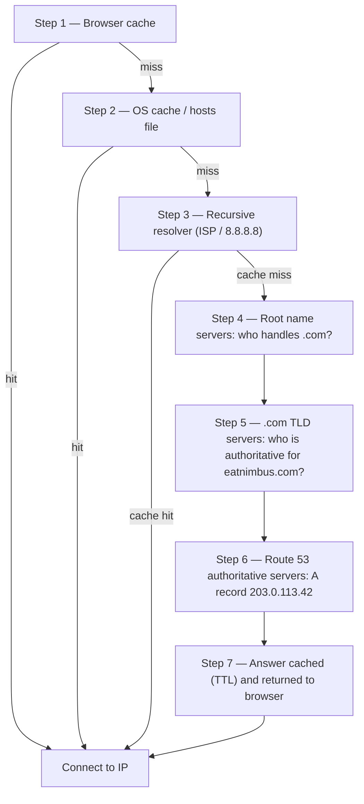

# अध्याय 12: इंटरनेट आपको कैसे ढूंढता है

माया ने अपने ब्राउज़र में `nimbus-alb-123456789.us-west-2.elb.amazonaws.com` को एक बार और रिफ्रेश किया, फिर पीछे झुककर छत की ओर देखा। पेज लोड हुआ। ऐप ने काम किया। लेकिन हर बार जब वह एक रेस्तरां भागीदार के साथ लिंक साझा करती थी, तो उसे एक छोटी सी शर्मिंदगी महसूस होती थी जिसका वह ठीक नाम नहीं रख पाती थी।

वह URL एक तकनीकी कलाकृति थी, एक उत्पाद नहीं।

---

*पिछले अध्याय का नेटवर्क पुनर्डिज़ाइन अच्छा रहा था। हर संसाधन सही जगह पर था — सार्वजनिक सबनेट में लोड बैलेंसर, निजी में बंद डेटाबेस। बुनियादी ढांचा सुरक्षित और सही ढंग से खंडित था। लेकिन जैसे ही Nimbus अपने पहले सार्वजनिक लॉन्च के लिए तैयार हुआ, एक नई समस्या प्रकट हुई: लोड बैलेंसर URL जो AWS ने स्वचालित रूप से असाइन किया था वह एक सिस्टम पहचानकर्ता जैसा दिखता था, उत्पाद नहीं जिस पर लोग भरोसा करें। उन्हें एक असली डोमेन नाम चाहिए था। और उन्हें यह समझने की ज़रूरत थी कि किसी के `eatnimbus.com` टाइप करने के क्षण और पेज दिखाई देने के क्षण के बीच क्या हुआ।*

---

Nimbus चल रहा था। लोड बैलेंसर का एक सार्वजनिक IP था। EC2 इंस्टेंसेज़ का एक निजी IP था। डेटाबेस निजी सबनेट में बंद थे। प्रिया ने नेटवर्क आरेख पर सहमति में सिर हिलाया था।

टॉम ने लोड बैलेंसर URL देखा: `nimbus-alb-123456789.us-west-2.elb.amazonaws.com`।

"यह वही है जो ग्राहक अपने ब्राउज़र में टाइप करते हैं?" उसने पूछा।

"यह वही है जो AWS स्वचालित रूप से असाइन करता है," माया ने कहा।

"मैं इसे एक बिज़नेस कार्ड पर नहीं डाल रहा।"

"न ही मैं।"

उन्हें एक डोमेन नाम चाहिए था। उन्होंने एक डोमेन रजिस्ट्रार से `eatnimbus.com` खरीदा। अब उन्हें उस नाम को अपने AWS बुनियादी ढांचे से जोड़ना था।

"इंटरनेट को कैसे पता चलता है कि `eatnimbus.com` का मतलब us-west-2 में लोड बैलेंसर है?" लीओ ने पूछा।

अच्छा सवाल, लीओ।

**फ़ोन बुक उपमा**

स्मार्टफ़ोन से पहले, हर शहर में एक फ़ोन बुक होती थी। अगर आप "मारियो'ज़ पिज़्ज़ा" तक पहुंचना चाहते थे, तो आप उनका फ़ोन नंबर याद नहीं करते थे — आप नाम देखते, नंबर लेते, और कॉल करते।

इंटरनेट की अपनी फ़ोन बुक है: **डोमेन नेम सिस्टम (DNS)**।

DNS मानव-पठनीय नामों (जैसे `eatnimbus.com`) को मशीन-पठनीय IP पतों (जैसे `203.0.113.42`) में अनुवादित करता है। हर बार जब आप किसी वेबसाइट पर जाते हैं, तो आपका कंप्यूटर चुपचाप DNS में डोमेन नाम देखता है और जुड़ने के लिए IP पता प्राप्त करता है।

अगर आप अपने सर्वर का IP पता बदलते हैं, तो आप DNS रिकॉर्ड अपडेट करेंगे — जैसे फ़ोन बुक में अपना नंबर बदलना — और इंटरनेट आपको आपके नए स्थान पर ढूंढ लेगा।

**पूर्ण DNS रिज़ोल्यूशन यात्रा**

"लेकिन लुकअप *कैसे* वास्तव में काम करता है?" लीओ ने पूछा। "जैसे, चरण दर चरण। मेरा ब्राउज़र नाम `eatnimbus.com` जानता है। आगे क्या होता है?"

अधिकांश दस्तावेज़ इस पर सरसरी नज़र डालते हैं। यह मायने रखता है।

जब आपके ब्राउज़र को `eatnimbus.com` रिज़ॉल्व करने की ज़रूरत होती है, तो यहां हर हॉप है, क्रम में:

**चरण 1 — ब्राउज़र कैश**: ब्राउज़र जांचता है कि क्या उसने हाल ही में इस नाम को रिज़ॉल्व किया है। अगर हां, तो वह कैश किए गए IP का उपयोग करता है। अगर नहीं, तो जारी रखें।

**चरण 2 — OS कैश / स्थानीय रिज़ॉल्वर**: आपका ऑपरेटिंग सिस्टम अपना खुद का DNS कैश और स्थानीय `hosts` फ़ाइल जांचता है। अगर मिल जाए, तो हो गया। अगर नहीं, तो यह आपके कॉन्फ़िगर किए गए DNS रिज़ॉल्वर को अग्रेषित करता है — आमतौर पर आपके ISP का या 8.8.8.8 जैसा एक सार्वजनिक।

**चरण 3 — रिकर्सिव रिज़ॉल्वर**: रिकर्सिव रिज़ॉल्वर (आपका ISP या Google का 8.8.8.8) मेहनती कार्यकर्ता है। इसका भी एक कैश है। अगर यह जवाब जानता है, तो यह तुरंत लौटाता है। अगर नहीं, तो यह वास्तविक रिज़ोल्यूशन श्रृंखला शुरू करता है।

**चरण 4 — रूट नेम सर्वर**: रिकर्सिव रिज़ॉल्वर 13 रूट नेम सर्वर क्लस्टर में से एक से संपर्क करता है (विश्वभर में तैनात)। रूट सर्वर नहीं जानता कि `eatnimbus.com` कहां है। लेकिन यह जानता है कि `.com` डोमेन कौन प्रबंधित करता है — `.com` TLD सर्वर। यह उनका पता लौटाता है।

**चरण 5 — TLD (टॉप लेवल डोमेन) नेम सर्वर**: रिकर्सिव रिज़ॉल्वर `.com` TLD सर्वर से संपर्क करता है। TLD सर्वर भी नहीं जानते कि `eatnimbus.com` कहां है। लेकिन वे जानते हैं कि `eatnimbus.com` के लिए कौन से नेम सर्वर आधिकारिक हैं — वे सर्वर जो वास्तव में DNS रिकॉर्ड रखते हैं। वे उन पतों को लौटाते हैं।

**चरण 6 — आधिकारिक नेम सर्वर**: रिकर्सिव रिज़ॉल्वर Route 53 के नेम सर्वर से संपर्क करता है — `eatnimbus.com` के लिए आधिकारिक नेम सर्वर। Route 53 के पास वास्तविक रिकॉर्ड हैं। यह A रिकॉर्ड लौटाता है: `eatnimbus.com → 203.0.113.42`। यह जवाब आधिकारिक है — यह असली जवाब है, कैश किया गया नहीं।

**चरण 7 — प्रतिक्रिया कैश और लौटाई गई**: रिकर्सिव रिज़ॉल्वर रिकॉर्ड पर TTL (टाइम-टू-लाइव) की अवधि के लिए जवाब कैश करता है। यह आपके ब्राउज़र को IP लौटाता है। आपका ब्राउज़र इसे कैश करता है। आपका ब्राउज़र जुड़ता है।



"यह एक IP पता खोजने के लिए सात हॉप हैं," टॉम ने कहा।

"आमतौर पर कुल मिलाकर उप-100 मिलीसेकंड," प्रिया ने कहा। "चरण 3 से 6 हर स्तर पर आक्रामक रूप से कैश किए जाते हैं। लोकप्रिय डोमेन के लिए, चरण 4 और 5 — रूट और TLD लुकअप — अक्सर पूरी तरह छोड़ दिए जाते हैं क्योंकि रिकर्सिव रिज़ॉल्वर के पास पहले से ही वे सर्वर कैश में होते हैं। पूरी श्रृंखला आमतौर पर 20–40 मिलीसेकंड में चलती है।"

"और पहले लुकअप के बाद, ब्राउज़र कैश का मतलब है कि बाद के अनुरोध यह सब छोड़ देते हैं," लीओ ने जोड़ा।

"सही। DNS तत्काल महसूस होता है क्योंकि अधिकांश लुकअप कैश हिट होते हैं। पूरी श्रृंखला केवल तब चलती है जब कोई रिकॉर्ड नया हो या उसका TTL समाप्त हो गया हो।"

**Route 53 से मिलें**

Amazon Route 53 AWS की प्रबंधित DNS सेवा है। इसे Route 53 इसलिए कहते हैं क्योंकि पोर्ट 53 मानक DNS पोर्ट है। (कभी-कभी AWS चीज़ों का नाम सीधा रखता है।)

Route 53 कई काम करता है:

**डोमेन पंजीकरण**: आप Route 53 के माध्यम से सीधे डोमेन नाम खरीद सकते हैं।

**DNS होस्टिंग (होस्टेड ज़ोन)**: आप अपने डोमेन के लिए एक *होस्टेड ज़ोन* बनाते हैं, और Route 53 उन DNS रिकॉर्ड का प्रबंधन करता है जो दुनिया को बताते हैं कि आपको कहां खोजना है।

**स्वास्थ्य जांच**: Route 53 आपके एंडपॉइंट की निगरानी कर सकता है और अस्वस्थ एंडपॉइंट से ट्रैफ़िक हटा सकता है।

**ट्रैफ़िक रूटिंग नीतियां**: Route 53 साधारण DNS से परे कई रूटिंग रणनीतियों का समर्थन करता है — भारित, विलंबता-आधारित, जियोलोकेशन, फ़ेलओवर।

**DNS रिकॉर्ड: फ़ोन बुक प्रविष्टियां**

एक DNS रिकॉर्ड एक नाम को एक गंतव्य से मैप करता है। सबसे आम प्रकार:

**A रिकॉर्ड**: एक नाम को एक IPv4 पते से मैप करता है।
`eatnimbus.com → 203.0.113.42`

**AAAA रिकॉर्ड**: एक नाम को एक IPv6 पते से मैप करता है।

**CNAME रिकॉर्ड**: एक नाम को एक अन्य नाम (एक उपनाम) से मैप करता है।
`www.eatnimbus.com → eatnimbus.com`

**MX रिकॉर्ड**: निर्दिष्ट करता है कि डोमेन के लिए कौन से सर्वर ईमेल संभालते हैं।

**TXT रिकॉर्ड**: मनमाना पाठ संग्रहीत करता है। आमतौर पर डोमेन सत्यापन (यह साबित करना कि आप डोमेन के मालिक हैं) और ईमेल प्रमाणीकरण (SPF, DKIM) के लिए उपयोग किया जाता है।

Nimbus के लिए, प्राथमिक सेटअप:

- `eatnimbus.com` → लोड बैलेंसर की ओर इंगित करने वाला Alias रिकॉर्ड
- `www.eatnimbus.com` → `eatnimbus.com` की ओर इंगित करने वाला CNAME
- `api.eatnimbus.com` → API लोड बैलेंसर की ओर इंगित करने वाला Alias रिकॉर्ड

"रुको," टॉम ने कहा। "लोड बैलेंसर का IP बदल सकता है। AWS ने दस्तावेज़ में ऐसा कहा।"

अच्छी पकड़, टॉम।

**Alias रिकॉर्ड: गतिशील IP के लिए AWS का समाधान**

लोड बैलेंसर, CloudFront वितरण, और S3 वेबसाइटों के DNS नाम होते हैं, स्थैतिक IP पते नहीं। अंतर्निहित IP बदल सकते हैं।

अगर आप एक लोड बैलेंसर के DNS नाम की ओर इंगित करने वाला CNAME बनाते हैं, तो यह काम करता है — लेकिन आप रूट डोमेन (`www` के बिना `eatnimbus.com`) के लिए CNAME का उपयोग नहीं कर सकते क्योंकि DNS मानक हैं।

Route 53 इसे **Alias रिकॉर्ड** के साथ हल करता है — DNS का एक AWS-विशिष्ट विस्तार। एक Alias रिकॉर्ड एक नाम को सीधे एक AWS संसाधन (लोड बैलेंसर, CloudFront वितरण, S3 वेबसाइट) से मैप करता है, और Route 53 गतिशील IP रिज़ोल्यूशन स्वचालित रूप से संभालता है। Alias रिकॉर्ड रूट डोमेन स्तर पर उपयोग किए जा सकते हैं। और बाहरी सेवाओं के लिए नियमित DNS क्वेरीज़ के विपरीत, AWS संसाधनों के लिए Alias रिकॉर्ड क्वेरीज़ मुफ़्त हैं।

"तो हम `eatnimbus.com` के लिए लोड बैलेंसर की ओर इंगित करने वाला एक Alias रिकॉर्ड उपयोग करते हैं," लीओ ने पुष्टि की।

"और Route 53 किसी भी क्षण लोड बैलेंसर जो भी IP उपयोग कर रहा हो उसे संभालता है," प्रिया ने जोड़ा।

"मुफ़्त में," टॉम ने अचानक बहुत रुचि लेते हुए कहा। उसने Route 53 मूल्य निर्धारण पेज खोला। "और बाकी का क्या?"

"प्रति होस्टेड ज़ोन पचास सेंट," लीओ ने कहा। "साथ ही प्रति मिलियन DNS क्वेरीज़ लगभग चालीस सेंट। अभी हमारे ट्रैफ़िक के लिए, शायद दो डॉलर प्रति माह से कम।"

टॉम ने संतुष्ट होकर मूल्य निर्धारण पेज बंद कर दिया।

**रूटिंग नीतियां: केवल "यह कहां है?" से अधिक**

यहीं Route 53 दिलचस्प हो जाता है। DNS केवल एक लुकअप सेवा नहीं है — यह एक ट्रैफ़िक प्रबंधन उपकरण हो सकता है।

**साधारण रूटिंग**: एक रिकॉर्ड, एक गंतव्य। मानक DNS।

**भारित रूटिंग**: भार के अनुसार कई गंतव्यों के बीच ट्रैफ़िक विभाजित करें। एक माइग्रेशन के दौरान 90% नए सर्वर को, 10% पुराने सर्वर को भेजें। नए सर्वर में आश्वस्त होने तक भार समायोजित करें, फिर 100% पर स्विच करें।

**विलंबता-आधारित रूटिंग**: उपयोगकर्ताओं को उनके लिए सबसे कम विलंबता वाले AWS क्षेत्र में रूट करें। सिएटल में एक उपयोगकर्ता `us-west-2` में रूट होता है। टोक्यो में एक उपयोगकर्ता `ap-northeast-1` में रूट होता है। एक ही डोमेन नाम, अलग गंतव्य।

**जियोलोकेशन रूटिंग**: उपयोगकर्ता के भौगोलिक स्थान के आधार पर रूट करें। सभी यूरोपीय उपयोगकर्ता `eu-west-1` में जाते हैं। सभी उत्तर अमेरिकी उपयोगकर्ता `us-east-1` में जाते हैं। डेटा संप्रभुता (EU उपयोगकर्ता डेटा को EU क्षेत्रों में रखना) या सामग्री अनुकूलन (भाषा, मुद्रा) के लिए उपयोगी। रूटिंग निर्णय कठोर सीमाओं का उपयोग करते हैं — एक उपयोगकर्ता एक देश में, एक महाद्वीप में, या एक US राज्य में है, और वहीं वे जाते हैं।

**जियोप्रॉक्सिमिटी रूटिंग**: उपयोगकर्ताओं के भौगोलिक स्थान के आधार पर ट्रैफ़िक रूट करता है *और* आपको उन निर्णयों को एक **बायस** मान के साथ समायोजित करने देता है। एक सकारात्मक बायस उस भौगोलिक क्षेत्र का विस्तार करता है जो एक संसाधन को रूट करता है — अधिक ट्रैफ़िक आकर्षित करते हुए। एक नकारात्मक बायस इसे सिकोड़ता है। जियोलोकेशन के विपरीत, जो कठोर देश और महाद्वीप सीमाओं का उपयोग करता है, जियोप्रॉक्सिमिटी निरंतर है: एक छोटा बायस मान बिना किसी निश्चित रेखा को फिर से खींचे धीरे-धीरे एक क्षेत्र से दूसरे में ट्रैफ़िक स्थानांतरित कर सकता है।

वह परिदृश्य जो दोनों को अलग करता है: अगर एक कंपनी `us-east-1` से `us-west-2` में धीरे-धीरे माइग्रेट कर रही है और वृद्धिशील रूप से ट्रैफ़िक पश्चिम की ओर स्थानांतरित करना चाहती है — एक स्विच पलटना नहीं, बल्कि समय के साथ इसे डायल करना — तो पश्चिमी एंडपॉइंट पर बढ़ते सकारात्मक बायस के साथ जियोप्रॉक्सिमिटी सही उपकरण है। जियोलोकेशन या तो सभी वेस्ट कोस्ट उपयोगकर्ताओं को ओरेगन में रूट करेगा या नहीं; इसमें कोई डायल नहीं है। जनवरी 2024 से, जियोप्रॉक्सिमिटी DNS रिकॉर्ड पर सीधे एक नियमित रूटिंग नीति के रूप में उपलब्ध है (कंसोल, API, CLI) — इसे अब Route 53 Traffic Flow की ज़रूरत नहीं है, हालांकि यह वहां भी उपलब्ध रहता है।

**फ़ेलओवर रूटिंग**: एक प्राथमिक और एक द्वितीयक एंडपॉइंट नामित करें। अगर प्राथमिक Route 53 की स्वास्थ्य जांच में विफल होता है, तो ट्रैफ़िक स्वचालित रूप से द्वितीयक पर पुनर्निर्देशित होता है। यह आपदा रिकवरी की DNS परत है।

"रुको — लेकिन *क्यों* हम एक दूसरे क्षेत्र में फ़ेलओवर रूटिंग सेट करेंगे अगर हमारे पास पहले से मल्टी-AZ है?" माया ने पूछा। "क्या मल्टी-AZ विफलताओं को संभालने वाला नहीं है?"

अच्छा सवाल। मल्टी-AZ एक क्षेत्र के भीतर एक एकल उपलब्धता क्षेत्र की विफलता से बचाता है — अगर एक डेटा सेंटर डाउन हो जाता है, तो दूसरे AZ में स्टैंडबाय कार्यभार संभालता है। लेकिन क्या होगा अगर एक पूरा AWS क्षेत्र अनुपलब्ध हो जाए? या क्या होगा अगर एक क्षेत्र-व्यापी सेवा व्यवधान हो? DNS फ़ेलओवर रूटिंग एक अलग स्तर पर काम करता है: यह एक पूरे क्षेत्र से ट्रैफ़िक हटाता है जब उस क्षेत्र की स्वास्थ्य जांच विफल होती है। मल्टी-AZ अंतर-क्षेत्र लचीलापन है। DNS फ़ेलओवर अंतर-क्षेत्रीय लचीलापन है।

**मल्टीवैल्यू उत्तर रूटिंग**: एक क्वेरी के लिए आठ तक स्वस्थ IP पते लौटाएं, क्लाइंट को चुनने देते हुए। कई सर्वरों में ट्रैफ़िक वितरित करने के लिए एक लोड बैलेंसर का एक सरल विकल्प।

"तो Route 53 केवल एक फ़ोन बुक नहीं है," माया ने कहा। "यह एक स्मार्ट फ़ोन बुक है जो कॉल को इस आधार पर रूट कर सकती है कि आप कहां से कॉल कर रहे हैं।"

"और अगर नंबर अस्वस्थ है तो आपको डिस्कनेक्ट कर सकती है," प्रिया ने जोड़ा।

---

**विलंबता रूटिंग प्लस स्वास्थ्य जांच: एक विचार प्रयोग**

प्रिया ने व्हाइटबोर्ड पर एक परिदृश्य बनाया। मान लें Nimbus का ईस्ट कोस्ट उपयोगकर्ता आधार बढ़ता रहा, और एक दिन टीम ने `us-east-1` (उत्तरी वर्जीनिया) में एक हल्का स्टैक खड़ा किया — एक पूर्ण बहु-क्षेत्र सक्रिय-सक्रिय सेटअप नहीं, जो महंगा और जटिल होगा, बल्कि एक लोड बैलेंसर और स्थैतिक सामग्री और ब्राउज़िंग पेज परोसने वाले EC2 इंस्टेंसेज़ का एक रीड-ओनली सेट। ऑर्डर अभी भी पश्चिम में `us-west-2` में प्राथमिक डेटाबेस तक जाते। ब्राउज़ ट्रैफ़िक — जो सत्तर प्रतिशत अनुरोधों के लिए ज़िम्मेदार था — किसी भी तट से परोसा जा सकता था।

ब्राउज़ एंडपॉइंट के लिए Route 53 कॉन्फ़िगरेशन इस तरह दिखता:

```
browse.eatnimbus.com
  → Latency record: us-east-1 ALB (with health check, set-identifier "east")
  → Latency record: us-west-2 ALB (with health check, set-identifier "west")
```

(ध्यान दें कि रिकॉर्ड एक *होस्टनाम* है, `browse.eatnimbus.com` — DNS नाम रूट करता है, कभी URL पथ नहीं। `/browse` जैसी पथ-आधारित रूटिंग लोड बैलेंसर का काम है, Route 53 का नहीं।)

विलंबता रूटिंग के साथ, सिएटल में एक उपयोगकर्ता `us-west-2` एंडपॉइंट में रिज़ॉल्व होगा। बोस्टन में एक उपयोगकर्ता `us-east-1` में जाएगा। Route 53 अपने बुनियादी ढांचे से प्रत्येक क्षेत्र तक विलंबता को लगातार मापता है और प्रति उपयोगकर्ता तेज़ वाला चुनता है।

"लेकिन क्या होगा अगर पश्चिमी क्षेत्र में कोई समस्या हो?" टॉम ने पूछा। "सिएटल में हमारे ब्राउज़िंग उपयोगकर्ता फंस जाएंगे।"

"इसी के लिए स्वास्थ्य जांच हैं," प्रिया ने कहा। "प्रत्येक विलंबता रिकॉर्ड को अपने संबंधित लोड बैलेंसर पर एक स्वास्थ्य जांच मिलती है। अगर `us-west-2` स्वास्थ्य जांच लगातार तीन जांचों में विफल होती है, तो Route 53 उस रिकॉर्ड को लौटाना बंद कर देता है — उन उपयोगकर्ताओं के लिए भी जहां ओरेगन सामान्य रूप से तेज़ होगा। सिएटल उपयोगकर्ता ओरेगन के ठीक होने तक पूर्व में रूट होते हैं।"

"तो विलंबता रूटिंग निर्धारित करती है कि कौन सा क्षेत्र सामान्य रूप से पसंदीदा है," माया ने कहा, "और स्वास्थ्य जांच उस वरीयता को ओवरराइड करती है अगर पसंदीदा क्षेत्र डाउन हो जाए?"

"बिल्कुल। विलंबता नीति सामान्य परिस्थितियों में विजेता चुनती है। स्वास्थ्य जांच उस विजेता को हटाती है जिसने काम करना बंद कर दिया है।"

लीओ ने विफलता परिदृश्य के बारे में सोचा। "और उन रिकॉर्ड पर TTL?"

"साठ सेकंड," प्रिया ने कहा। "इसे ट्रिप करने के लिए तीस-सेकंड के अंतराल पर तीन विफल जांचें — विफलता का पता लगाने के लिए नब्बे सेकंड तक — फिर DNS रिज़ॉल्वरों के परिवर्तन को पकड़ने के लिए साठ सेकंड तक।"

"सबसे खराब स्थिति में ढाई मिनट," लीओ ने कहा।

"इसीलिए आप TTL को इसकी परवाह करने से पहले कम करते हैं, बाद में नहीं।"

यह संयोजन — हर रिकॉर्ड पर स्वास्थ्य जांच के साथ विलंबता रूटिंग — बहु-क्षेत्र तैनातियों के लिए सबसे शक्तिशाली Route 53 कॉन्फ़िगरेशन में से एक है। उपयोगकर्ता हमेशा सबसे तेज़ स्वस्थ क्षेत्र में जाते हैं। जब किसी क्षेत्र में समस्याएं होती हैं तो सिस्टम खुद को ठीक करता है। और पूरी चीज़ DNS है: कोई अतिरिक्त बुनियादी ढांचा नहीं, कोई प्रॉक्सी सर्वर नहीं, क्षेत्रों के बीच कोई लोड बैलेंसर नहीं।

---

**स्वास्थ्य जांच विफलता की घटना**

Nimbus के स्टेजिंग वातावरण ने उन्हें फ़ेलओवर रूटिंग का एक आकस्मिक प्रदर्शन दिया।

उन्होंने एक परीक्षण के रूप में स्टेजिंग लोड बैलेंसर पर Route 53 स्वास्थ्य जांच कॉन्फ़िगर की थी — हर 30 सेकंड में `/health` एंडपॉइंट जांचते हुए। एक शुक्रवार दोपहर, लीओ ने स्टेजिंग में एक तैनाती धकेली जिसमें एक बग था: स्वास्थ्य एंडपॉइंट 500 त्रुटियां लौटाने लगा। यह उसके स्थानीय परीक्षण पास कर गया लेकिन सर्वर पर टूट गया।

Route 53 ने विफलताएं नोट कीं। लगातार तीन विफल जांचों के बाद, इसने एंडपॉइंट को अस्वस्थ चिह्नित किया। फ़ेलओवर रिकॉर्ड सक्रिय हुआ, स्टेजिंग ट्रैफ़िक को एक रीड-ओनली फ़ॉलबैक पेज पर रूट करते हुए जिसमें लिखा था "रखरखाव प्रगति में है।"

लीओ का पहला अलर्ट एक QA इंजीनियर से एक Slack संदेश था: "स्टेजिंग रखरखाव पेज दिखा रहा है।"

लीओ ने तैनाती जांची। 500 त्रुटियां लॉग में स्पष्ट थीं। उसने तैनाती वापस रोल की। स्वास्थ्य एंडपॉइंट के 200 लौटाने के 90 सेकंड के भीतर, Route 53 ने जांच का पुनर्मूल्यांकन किया, लगातार तीन सफलताएं देखीं, और ट्रैफ़िक स्टेजिंग लोड बैलेंसर पर लौटाया। रखरखाव पेज गायब हो गया।

रखरखाव पेज पर कुल समय: सात मिनट।

"वह सिस्टम सही ढंग से काम कर रहा था," प्रिया ने कहा।

"मुझे पता है," लीओ ने कहा। "डरावना हिस्सा यह सोचना है कि स्वास्थ्य जांच के बिना क्या होता। 500 त्रुटियां असली उपयोगकर्ताओं के पास जातीं।"

"प्रोडक्शन में, स्वास्थ्य जांच द्वितीयक क्षेत्र या स्थैतिक त्रुटि पेज पर फ़ेलओवर कर देती। उपयोगकर्ता त्रुटियों के बजाय एक बनाए रखा गया अनुभव देखते।"

"फ़ेलओवर वास्तव में कितना समय लेता है?" माया ने पूछा। "जब स्वास्थ्य जांच विफल होती है से जब DNS अलग तरीके से रूट करना शुरू करता है तक?"

"स्वास्थ्य जांच अंतराल डिफ़ॉल्ट रूप से 30 सेकंड है। फ़ेलओवर ट्रिप करने के लिए लगातार तीन विफलताएं। समस्या का पता लगाने में 90 सेकंड तक। फिर DNS TTL — अगर यह 60 सेकंड है, तो प्रसार एक और मिनट है।"

"तो सबसे खराब स्थिति में, लगभग तीन मिनट?"

"लगभग वही। इसीलिए आप अपने महत्वपूर्ण रिकॉर्ड पर TTL कम चाहते हैं, और अपना स्वास्थ्य जांच अंतराल जितना आपका बजट अनुमति देता है उतना छोटा।"

---

**स्वास्थ्य जांच: विफलता के इर्द-गिर्द रूटिंग**

"और अगर कोई सेंध लगाने की कोशिश करे तो क्या?" प्रिया ने कहा। "DNS सार्वजनिक है। कोई भी देख सकता है कि `eatnimbus.com` कहां इंगित करता है। इसका मतलब है कि एक हमलावर ठीक जानता है कि किस IP को निशाना बनाना है।"

"यह सच है," लीओ ने कहा। "लेकिन जो IP वे पाते हैं वह लोड बैलेंसर का IP है। ALB एकमात्र चीज़ है जिसका सार्वजनिक पता है। इसके पीछे सब कुछ — EC2, RDS, ElastiCache — निजी सबनेट में है। DNS उन्हें सामने का दरवाज़ा बताता है। यह उन्हें नहीं बताता कि इसके पीछे क्या है।"

Route 53 स्वास्थ्य जांच के साथ आपके एंडपॉइंट की निगरानी कर सकता है। अगर एक एंडपॉइंट विफल होता है, तो Route 53 कर सकता है:

- इसे DNS प्रतिक्रियाओं से हटा दे (वहां ट्रैफ़िक भेजना बंद कर दे)
- एक बैकअप एंडपॉइंट पर फ़ेलओवर ट्रिगर करे
- CloudWatch के माध्यम से एक अलर्ट भेजे

स्वास्थ्य जांच DNS रूटिंग और वास्तविक एप्लिकेशन स्वास्थ्य के बीच की कड़ी है। एक फ़ेलओवर कॉन्फ़िगरेशन में: Route 53 प्राथमिक एंडपॉइंट की हर 30 सेकंड में निगरानी करता है। अगर लगातार तीन जांचें विफल होती हैं, तो Route 53 द्वितीयक एंडपॉइंट का पता लौटाना शुरू कर देता है। इनमें से कोई भी संख्या निश्चित नहीं है: 30 सेकंड मानक अंतराल है (एक भुगतान वाला "तेज़" विकल्प हर 10 सेकंड में जांचता है), और विफलता थ्रेशोल्ड लगातार 3 जांचों पर डिफ़ॉल्ट होता है लेकिन 1 से 10 तक कॉन्फ़िगर करने योग्य है।

यह तत्काल नहीं है — DNS में प्रसार समय होता है। एक बार Route 53 एक DNS रिकॉर्ड बदलता है, दुनिया भर के DNS रिज़ॉल्वरों को परिवर्तन पकड़ना होता है, जो TTL सेटिंग्स के आधार पर सेकंड से मिनट तक ले सकता है।

**TTL: DNS कैश**

DNS प्रतिक्रियाएं कई स्तरों पर कैश की जाती हैं — आपके राउटर पर, आपके ISP पर, आपके ब्राउज़र में। एक DNS रिकॉर्ड पर **TTL (टाइम-टू-लाइव)** कैश को बताता है कि फिर से जांचने से पहले जवाब को कितने समय तक याद रखना है।

उच्च TTL (1 घंटा या अधिक): कम DNS क्वेरीज़, Route 53 पर कम लोड, लेकिन परिवर्तनों को प्रसारित होने में अधिक समय लगता है।

कम TTL (60 सेकंड या कम): परिवर्तन तेज़ी से प्रसारित होते हैं, लेकिन अधिक DNS क्वेरीज़ की ज़रूरत होती है।

एक नियोजित माइग्रेशन (एक नए सर्वर की ओर इंगित करने के लिए DNS अपडेट करना) से पहले, अपने TTL को एक दिन पहले 60 सेकंड तक कम करें। फिर जब आप परिवर्तन करते हैं, तो यह लगभग एक मिनट में प्रसारित होता है। माइग्रेशन के बाद, इसे सामान्य मान पर वापस बढ़ाएं।

"मैंने इसे पहले ही तैनात कर दिया — ओह।" लीओ ने TTL कम करने से पहले DNS रिकॉर्ड अपडेट कर दिया था। उसे अपनी गलती का एहसास हुआ और गिनना शुरू किया: पुराना TTL एक घंटा था। कुछ उपयोगकर्ता अगले साठ मिनट तक पुराना सर्वर पाते रहेंगे।

"अगर हम इसे माइग्रेशन के दौरान कम करते हैं और पहले नहीं," लीओ ने धीरे-धीरे कहा, "तो पुराने TTL का मतलब है कि कुछ उपयोगकर्ता एक घंटे तक पुराना सर्वर देखेंगे।"

"बिल्कुल," प्रिया ने कहा। "DNS माइग्रेशन को माइग्रेशन से पहले योजना की ज़रूरत होती है, केवल इसके दौरान नहीं।"

आप सोच रहे होंगे: अगर TTL एक घंटे पर सेट है, तो क्या इसका मतलब है कि हर उपयोगकर्ता एक DNS परिवर्तन के बाद नया सर्वर देखने से पहले पूरा एक घंटा इंतज़ार करेगा? बिल्कुल नहीं। TTL का मतलब है कि रिज़ॉल्वर TTL समाप्त होने तक फिर से जांच नहीं करेंगे। अगर एक उपयोगकर्ता के DNS रिज़ॉल्वर ने 1-घंटे TTL के साथ 55 मिनट पहले पुराना मान कैश किया, तो उन्हें 5 मिनट में नया मान मिलेगा। अगर उन्होंने इसे 5 मिनट पहले कैश किया, तो वे 55 मिनट इंतज़ार करेंगे। औसतन, उपयोगकर्ता परिवर्तन को TTL अवधि के आधे के भीतर देखते हैं। इसीलिए TTL को पहले से कम करना इतना महत्वपूर्ण है: यह परिवर्तन होने से पहले सबसे खराब स्थिति वाली प्रसार विंडो को सिकोड़ता है।

---

**निजी होस्टेड ज़ोन: आंतरिक DNS**

सार्वजनिक डोमेन लाइव होने के दो हफ्ते बाद प्रिया ने एक नई आवश्यकता उठाई।

"हमारे EC2 इंस्टेंसेज़ को डेटाबेस तक पहुंचने की ज़रूरत है," उसने कहा। "अभी वे RDS एंडपॉइंट DNS नाम का उपयोग कर रहे हैं — `nimbus-prod.abc123.us-west-2.rds.amazonaws.com`। यह काम करता है, लेकिन यह एक सार्वजनिक DNS नाम है। अगर हम कभी अपने डेटाबेस कॉन्फ़िगरेशन को बदलना चाहें, तो सभी एप्लिकेशन कॉन्फ़िग फ़ाइलों को अपडेट करने की ज़रूरत होगी।"

"हम एक निजी DNS नाम उपयोग कर सकते हैं," लीओ ने कहा। "जैसे `db.nimbus.internal`। कुछ ऐसा जो हमारी सेवाएं आंतरिक रूप से उपयोग करती हैं जो वर्तमान डेटाबेस एंडपॉइंट जो भी हो उससे मैप होता है।"

"बिल्कुल। Route 53 निजी होस्टेड ज़ोन।"

एक **निजी होस्टेड ज़ोन** एक DNS डोमेन है जो केवल आपके VPC के अंदर रिज़ॉल्व होता है। `nimbus.internal` के लिए बाहरी DNS क्वेरीज़ को कोई प्रतिक्रिया नहीं मिलती। लेकिन VPC के भीतर से, `db.nimbus.internal` RDS एंडपॉइंट में रिज़ॉल्व होता है।

उन्होंने इसे सेट किया:

- निजी होस्टेड ज़ोन: `nimbus.internal`
- CNAME रिकॉर्ड: `db.nimbus.internal → nimbus-prod.abc123.us-west-2.rds.amazonaws.com`
- CNAME रिकॉर्ड: `cache.nimbus.internal → nimbus-cache.abc123.usw2.cache.amazonaws.com`
- A रिकॉर्ड: `api.nimbus.internal → 10.0.10.5` (आंतरिक EC2 IP — A रिकॉर्ड नामों को IP पतों से मैप करते हैं; CNAME नामों को अन्य नामों से मैप करते हैं। यहां ठीक है क्योंकि यह इंस्टेंस एक स्थैतिक निजी IP रखता है; ऑटो स्केलिंग के पीछे किसी भी चीज़ के लिए आप इसके बजाय एक लोड बैलेंसर की ओर इंगित करेंगे)

अब एप्लिकेशन कॉन्फ़िग पढ़ता है:

```
DATABASE_HOST=db.nimbus.internal
CACHE_HOST=cache.nimbus.internal
```

जब वे एक नए RDS इंस्टेंस में माइग्रेट हुए, तो उन्होंने एक DNS रिकॉर्ड अपडेट किया। कोई एप्लिकेशन तैनाती ज़रूरी नहीं।

"यही कारण है कि निजी DNS एक डेटाबेस माइग्रेशन के दौरान भी मायने रखता है," प्रिया ने कहा। "आप `db.nimbus.internal` को नए एंडपॉइंट की ओर इंगित करने के लिए अपडेट करते हैं। ट्रैफ़िक स्थानांतरित होता है। पुराना एंडपॉइंट TTL विंडो के दौरान उपलब्ध रहता है। कोई एप्लिकेशन कॉन्फ़िग परिवर्तन नहीं।"

**आंतरिक DNS डिबगिंग की कहानी**

तीन हफ्ते बाद, लीओ ने एक नई सेवा तैनात की — एक बैकग्राउंड वर्कर — और यह डेटाबेस तक नहीं पहुंच सका। वर्कर API सर्वर के समान VPC में, समान निजी सबनेट में था। API सर्वर डेटाबेस तक पहुंच सकते थे। वर्कर नहीं।

उसने सुरक्षा समूह जांचे। वर्कर के सुरक्षा समूह में PostgreSQL के लिए एक आउटबाउंड नियम था। डेटाबेस सुरक्षा समूह में वर्कर के सुरक्षा समूह से एक इनबाउंड नियम था। सब कुछ सही दिखता था।

उसने वर्कर इंस्टेंस से `nslookup db.nimbus.internal` चलाया।

कोई प्रतिक्रिया नहीं।

"DNS लुकअप विफल हो रहा है," उसने प्रिया से कहा।

उसने वर्कर इंस्टेंस का VPC कॉन्फ़िगरेशन देखा। "वर्कर वास्तव में किस VPC में है? निजी होस्टेड ज़ोन VPC से जुड़े होते हैं — अगर इंस्टेंस एक जुड़े VPC में नहीं है, तो ज़ोन उसके लिए बस मौजूद नहीं है।"

"यह मुख्य VPC में है। बाकी सबकी तरह।"

"है क्या?"

निजी होस्टेड ज़ोन को उन प्रत्येक VPC के साथ स्पष्ट रूप से जोड़ा जाना चाहिए जिनकी वे सेवा करते हैं — एसोसिएशन प्रति VPC है, कभी प्रति सबनेट नहीं। प्रिया ने ज़ोन बनाते समय मुख्य VPC को जोड़ा था। लेकिन लीओ ने गलती से वर्कर को एक टेस्ट VPC में तैनात कर दिया था जो उसने एक अलग प्रयोग के लिए बनाया था। अलग VPC। निजी होस्टेड ज़ोन से जुड़ा नहीं।

"वर्कर गलत VPC में है," प्रिया ने कहा।

"मैंने इसे पहले ही तैनात कर दिया — ओह।" लीओ ने वर्कर को सही VPC में स्थानांतरित किया। DNS रिज़ॉल्व हुआ। वर्कर डेटाबेस से जुड़ा।

"एक VPC," लीओ ने एक नोट बनाते हुए कहा। "जब तक हमारे पास एक से अधिक के लिए कोई कारण न हो।"

---

**DNSSEC: DNS प्रतिक्रियाओं को प्रमाणित करना**

"क्या हमने DNS स्पूफ़िंग के बारे में सोचा है?" प्रिया ने पूछा। "क्या होगा अगर कोई हमारी DNS क्वेरी को इंटरसेप्ट करे और एक नकली IP लौटाए? हमारे उपयोगकर्ताओं के ब्राउज़र हमारे बजाय हमलावर के सर्वर से जुड़ेंगे।"

**DNSSEC (DNS Security Extensions)** इसे DNS रिकॉर्ड को क्रिप्टोग्राफ़िक रूप से हस्ताक्षरित करके हल करता है। जब एक DNS प्रतिक्रिया में एक DNSSEC हस्ताक्षर शामिल होता है, तो रिज़ॉल्वर सत्यापित कर सकता है कि प्रतिक्रिया आधिकारिक नेम सर्वर से आई है और इससे छेड़छाड़ नहीं की गई है।

Route 53 सार्वजनिक होस्टेड ज़ोन के लिए DNSSEC हस्ताक्षर का समर्थन करता है। प्रक्रिया में शामिल है:

1. Route 53 में होस्टेड ज़ोन पर DNSSEC सक्षम करना
2. Route 53 KMS में संग्रहीत एक की साइनिंग की (KSK) उत्पन्न करता है
3. Route 53 सभी रिकॉर्ड को ज़ोन साइनिंग की के साथ हस्ताक्षरित करता है
4. आप पैरेंट डोमेन रजिस्ट्रार (.com TLD) पर एक DS (डेलिगेशन साइनर) रिकॉर्ड जोड़ते हैं
5. DNSSEC का समर्थन करने वाले रिज़ॉल्वर अब प्रतिक्रियाओं की प्रामाणिकता सत्यापित कर सकते हैं

"DNS स्पूफ़िंग कितनी आम है?" लीओ ने पूछा।

"सार्वजनिक इंटरनेट पर, दुर्लभ लेकिन संभव," प्रिया ने कहा। "अधिकांश ISP रिज़ॉल्वर आज DNSSEC सत्यापन का समर्थन करते हैं। DNSSEC सक्षम करने की कोई लागत नहीं है और यह प्रामाणिकता की एक सार्थक परत जोड़ता है।"

"वह प्रति माह कितना खर्च होता है?" टॉम ने पूछा।

"DNSSEC हस्ताक्षर सक्षम करना स्वयं Route 53 में मुफ़्त है," प्रिया ने कहा। "एकमात्र वास्तविक लागत वह KMS की है जो की-साइनिंग की रखती है: $1/माह, साथ ही KMS API कॉल — और एक की को कई होस्टेड ज़ोन में साझा किया जा सकता है। DNS हाइजैकिंग हमलों से सुरक्षा हमारे स्केल पर प्रभावी रूप से मुफ़्त है।"

टॉम ने इसे लंच से पहले सक्षम कर दिया।

---

**Route 53 Resolver: हाइब्रिड DNS**

जब Nimbus ने अंततः एक VPN के माध्यम से अपने AWS VPC को अपने ऑन-प्रिमाइसेस विकास नेटवर्क से जोड़ा, तो एक नई समस्या उभरी: ऑन-प्रिमाइसेस सर्वरों को AWS निजी DNS नाम (जैसे `db.nimbus.internal`) रिज़ॉल्व करने की ज़रूरत थी, और AWS संसाधनों को ऑन-प्रिमाइसेस होस्टनाम (जैसे `jenkins.corp.nimbus.local`) रिज़ॉल्व करने की ज़रूरत थी।

DNS रिज़ोल्यूशन डिफ़ॉल्ट रूप से नेटवर्क सीमाओं को पार नहीं करता। AWS संसाधन Route 53 Resolver (हर VPC में निर्मित) का उपयोग करके DNS रिज़ॉल्व करते हैं। ऑन-प्रिमाइसेस सर्वर अपने स्वयं के DNS सर्वर का उपयोग करते हैं। कोई भी दूसरे के रिकॉर्ड नहीं देख सकता।

**Route 53 Resolver Endpoints** इस अंतर को पाटते हैं:

**इनबाउंड एंडपॉइंट**: ऑन-प्रिमाइसेस DNS सर्वर AWS-होस्टेड DNS ज़ोन के लिए क्वेरीज़ को आपके VPC में एक इनबाउंड एंडपॉइंट IP पर अग्रेषित कर सकते हैं। Route 53 Resolver क्वेरी संभालता है और परिणाम लौटाता है।

**आउटबाउंड एंडपॉइंट**: जब EC2 इंस्टेंसेज़ को ऑन-प्रिमाइसेस होस्टनाम रिज़ॉल्व करने की ज़रूरत होती है, तो Resolver उन क्वेरीज़ को आउटबाउंड एंडपॉइंट के माध्यम से ऑन-प्रिमाइसेस DNS सर्वरों को अग्रेषित करता है।

"तो यह एक अनुवाद सेवा जैसी है," माया ने कहा। "आपका AWS DNS और आपका ऑन-प्रिमाइसेस DNS एक-दूसरे से सीधे बात नहीं करते। Resolver एंडपॉइंट मध्यस्थ के रूप में कार्य करते हैं।"

"बिल्कुल। आपके ऑन-प्रिमाइसेस सर्वर अब `db.nimbus.internal` रिज़ॉल्व कर सकते हैं। आपके EC2 इंस्टेंसेज़ `jenkins.corp.nimbus.local` रिज़ॉल्व कर सकते हैं। दोनों पक्ष दोनों दुनियाओं से DNS नाम देखते हैं।"

Nimbus के लिए, यह तब प्रासंगिक हुआ जब विकास टीम अपने कार्यालय से AWS में एक स्टेजिंग वातावरण के विरुद्ध एकीकरण परीक्षण चलाना चाहती थी। Resolver एंडपॉइंट के बिना, वे मैन्युअल रूप से hosts फ़ाइलें संपादित कर रहे होते। उनके साथ, आंतरिक DNS बस VPN पर काम करता था।

Resolver एंडपॉइंट के लिए वास्तुकला:

- **इनबाउंड एंडपॉइंट**: आपके VPC में दो अलग AZ में बनाए गए दो ENI (इलास्टिक नेटवर्क इंटरफ़ेस)। प्रत्येक को एक निजी IP मिलता है। आप अपने ऑन-प्रिमाइसेस DNS सर्वर को आपके AWS-होस्टेड ज़ोन के लिए क्वेरीज़ को इन IP पर अग्रेषित करने के लिए कॉन्फ़िगर करते हैं। ट्रैफ़िक आपके VPN या Direct Connect के माध्यम से यात्रा करता है।
- **आउटबाउंड एंडपॉइंट**: दो AZ में दो ENI। आप अग्रेषण नियम बनाते हैं: "`corp.nimbus.local` के लिए क्वेरीज़ इन ऑन-प्रिमाइसेस DNS सर्वर IP पर जाती हैं।" EC2 इंस्टेंसेज़ स्वचालित रूप से Resolver का उपयोग करते हैं, जो आपके अग्रेषण नियमों से परामर्श करता है और क्वेरी ऑन-प्रिमाइसेस भेजता है।

"प्रति एंडपॉइंट दो ENI क्यों?" लीओ ने पूछा।

"उच्च उपलब्धता," प्रिया ने कहा। "अगर एक AZ नेटवर्क कनेक्टिविटी खो देता है, तो दूसरा एंडपॉइंट IP अभी भी काम करता है। NAT गेटवे जैसा ही सिद्धांत।"

"वह प्रति माह कितना खर्च होता है?" टॉम ने पूछा।

Resolver एंडपॉइंट लगभग $0.125 प्रति घंटा **प्रति इलास्टिक नेटवर्क इंटरफ़ेस** खर्च होते हैं, और प्रत्येक एंडपॉइंट को उपलब्धता के लिए कम से कम दो ENI की ज़रूरत होती है — तो एक यथार्थवादी फ़र्श प्रति एंडपॉइंट लगभग $180 प्रति माह है, साथ ही प्रति मिलियन DNS क्वेरीज़ $0.40। आंतरिक नामों को रिज़ॉल्व करने के लिए हाइब्रिड DNS का उपयोग करने वाली एक टीम के लिए, लागत मामूली है — और कई डेवलपर मशीनों और CI/CD सिस्टम में hosts फ़ाइलें बनाए रखने की ज़रूरत को समाप्त करती है।

"हम बस होस्टनाम hosts फ़ाइलों में डाल सकते हैं," लीओ ने सुझाव दिया।

"हर डेवलपर मशीन पर, हर CI रनर पर, हर नए ऑनबोर्डिंग पर," प्रिया ने कहा। "हर बार जब कुछ भी बदलता है।"

"एंडपॉइंट इसके लायक है," लीओ ने कहा।

"है।"

## ताकत और सीमाएं

**Route 53 इसके लिए सही विकल्प है**: AWS के भीतर पूरी तरह से डोमेन नाम पंजीकृत और प्रबंधित करना; कई एंडपॉइंट में विलंबता, जियोलोकेशन, या भारित वितरण के आधार पर ट्रैफ़िक रूट करना; क्षेत्रों के बीच या एक प्राथमिक और एक आपदा-रिकवरी एंडपॉइंट के बीच स्वास्थ्य-जांच-आधारित फ़ेलओवर; Alias रिकॉर्ड के माध्यम से DNS को अन्य AWS सेवाओं के साथ एकीकृत करना; आंतरिक सेवा खोज के लिए निजी होस्टेड ज़ोन।

**जब Route 53 वह नहीं है जो आपको चाहिए**: Route 53 एक DNS सेवा है, एक लोड बैलेंसर नहीं। अगर आपको एक क्षेत्र के भीतर कई सर्वरों या कंटेनरों के बीच ट्रैफ़िक वितरित करने की ज़रूरत है, तो एक एप्लिकेशन लोड बैलेंसर का उपयोग करें — Route 53 कनेक्शन स्तर पर भारित राउंड-रॉबिन उस तरह नहीं कर सकता जैसे एक लोड बैलेंसर कर सकता है। क्षेत्रों में विलंबता-आधारित रूटिंग लागत और परिचालन जटिलता जोड़ती है जो केवल तब समझ में आती है जब आपके उपयोगकर्ता वास्तव में विश्व स्तर पर वितरित हों और मिलीसेकंड रूपांतरण के लिए मायने रखते हों। अधिकांश एकल-क्षेत्र एप्लिकेशन के लिए, एक ALB की ओर इंगित करने वाला एक एकल Alias रिकॉर्ड वह सारा Route 53 कॉन्फ़िगरेशन है जिसकी आपको ज़रूरत है।

## सारांश

`nimbus-alb-123456789.us-west-2.elb.amazonaws.com` से `eatnimbus.com` तक पहुंचना एक छोटी बात महसूस हुई। यह नहीं थी। DNS वह पता प्रणाली है जिस पर पूरा इंटरनेट चलता है, और Route 53 आपको उस प्रणाली का उपयोग केवल लुकअप के लिए नहीं, बल्कि ट्रैफ़िक प्रबंधन और लचीलेपन के लिए करने के उपकरण देता है।

- **DNS** डोमेन नामों को IP पतों में अनुवादित करता है — इंटरनेट की फ़ोन बुक।
- **Route 53** AWS की प्रबंधित DNS सेवा है: डोमेन पंजीकरण, DNS होस्टिंग, स्वास्थ्य जांच, और रूटिंग नीतियां।
- **A रिकॉर्ड** नामों को IPv4 पतों से मैप करते हैं। **CNAME** नामों को अन्य नामों से मैप करते हैं। **Alias रिकॉर्ड** नामों को AWS संसाधनों (लोड बैलेंसर, CloudFront, S3) से मैप करते हैं।
- रूट डोमेन के लिए और गतिशील IP वाले संसाधनों के लिए Alias रिकॉर्ड (CNAME नहीं) का उपयोग करें।
- रूटिंग नीतियां साधारण DNS से परे जाती हैं: **भारित** (ट्रैफ़िक विभाजन), **विलंबता-आधारित** (प्रदर्शन), **जियोलोकेशन** (डेटा संप्रभुता — कठोर देश/महाद्वीप सीमाएं), **जियोप्रॉक्सिमिटी** (एक बायस डायल के साथ दूरी-आधारित — क्रमिक ट्रैफ़िक स्थानांतरण), **फ़ेलओवर** (आपदा रिकवरी)।
- **निजी होस्टेड ज़ोन** VPC संसाधनों के लिए आंतरिक DNS प्रदान करते हैं — नाम से सेवा-से-सेवा संचार, हार्ड-कोडेड IP नहीं।
- **DNSSEC** रिकॉर्ड को क्रिप्टोग्राफ़िक रूप से हस्ताक्षरित करता है, DNS स्पूफ़िंग से बचाते हुए।
- **Route 53 Resolver Endpoints** हाइब्रिड नेटवर्क को पाटते हैं — AWS और ऑन-प्रिमाइसेस DNS एक-दूसरे के नाम रिज़ॉल्व कर सकते हैं।

## परीक्षा युक्तियाँ

*SAA-C03 डोमेन: उच्च-प्रदर्शन आर्किटेक्चर डिज़ाइन (डोमेन 3, कार्य 3.4)*

- **Alias बनाम CNAME**: Alias रिकॉर्ड रूट डोमेन पर उपयोग किए जा सकते हैं; CNAME नहीं। AWS संसाधनों के लिए Alias रिकॉर्ड मुफ़्त हैं; CNAME DNS क्वेरीज़ मूल्यवान हैं। जब परीक्षा एक रूट डोमेन को एक लोड बैलेंसर से मैप करने के बारे में पूछती है → Alias रिकॉर्ड।
- **रूटिंग नीति उपयोग मामले** (आम परीक्षा परिदृश्य):
  - "धीरे-धीरे एक नए संस्करण में ट्रैफ़िक माइग्रेट करें" → भारित रूटिंग
  - "उपयोगकर्ताओं को निकटतम AWS क्षेत्र में रूट करें" → विलंबता-आधारित रूटिंग
  - "EU उपयोगकर्ता डेटा को EU क्षेत्रों में रखें" → जियोलोकेशन रूटिंग
  - "प्राथमिक डाउन होने पर स्वचालित DNS फ़ेलओवर" → स्वास्थ्य जांच के साथ फ़ेलओवर रूटिंग
  - "धीरे-धीरे एक नए क्षेत्र में ट्रैफ़िक स्थानांतरित करें" या "हमारी EU तैनाती की ओर आकर्षित ट्रैफ़िक बढ़ाएं" → सकारात्मक बायस के साथ जियोप्रॉक्सिमिटी रूटिंग
- **जियोप्रॉक्सिमिटी बनाम जियोलोकेशन:** जियोलोकेशन उपयोगकर्ता के देश/महाद्वीप के अनुसार कठोर सीमाओं के साथ रूट करता है। जियोप्रॉक्सिमिटी भौगोलिक दूरी के अनुसार एक कॉन्फ़िगर करने योग्य बायस के साथ रूट करता है — इसका उपयोग करें जब आपको एक नए क्षेत्र में धीरे-धीरे ट्रैफ़िक स्थानांतरित करना हो या एक विशिष्ट तैनाती की ओर अधिक उपयोगकर्ता आकर्षित करना हो। जनवरी 2024 से रिकॉर्ड पर एक नियमित रूटिंग नीति के रूप में उपलब्ध (Traffic Flow अब आवश्यक नहीं)।
- **Route 53 स्वास्थ्य जांच**: HTTP/HTTPS/TCP एंडपॉइंट जांच सकती है, और CloudWatch अलार्म ट्रिगर कर सकती है। परीक्षा इनका उपयोग आपदा रिकवरी परिदृश्यों में करती है।
- **TTL और प्रसार**: जानें कि TTL नियंत्रित करता है कि DNS रिज़ॉल्वर एक रिकॉर्ड को कितने समय तक कैश करते हैं। छोटा TTL = तेज़ परिवर्तन। परीक्षा परिदृश्य: "टीम ने DNS अपडेट किया लेकिन उपयोगकर्ता अभी भी पुराने सर्वर से टकरा रहे हैं" → TTL बहुत अधिक।
- **निजी होस्टेड ज़ोन**: Route 53 ऐसे DNS रिकॉर्ड बना सकता है जो केवल एक VPC के अंदर रिज़ॉल्व होते हैं। परीक्षा इसका उपयोग आंतरिक सेवा खोज के लिए करती है (जैसे, `database.internal` एक निजी RDS एंडपॉइंट में रिज़ॉल्व होते हुए)।
- Route 53 **वैश्विक** है — इसे किसी क्षेत्र में तैनात नहीं किया जाता। होस्टेड ज़ोन बनाते समय किसी क्षेत्र चयन की ज़रूरत नहीं है।
- **Route 53 Resolver Endpoints**: हाइब्रिड परिदृश्यों में उपयोग किया जाता है जहां ऑन-प्रिमाइसेस और AWS DNS को एक-दूसरे के नाम रिज़ॉल्व करने की ज़रूरत होती है। ऑन-प्रिमाइसेस → AWS के लिए इनबाउंड एंडपॉइंट। AWS → ऑन-प्रिमाइसेस के लिए आउटबाउंड एंडपॉइंट।

## अभ्यास

**अभ्यास 1 — स्मरण**

एक CNAME रिकॉर्ड और एक Alias रिकॉर्ड के बीच अंतर समझाएं। आप प्रत्येक का उपयोग कब करेंगे?

*(संकेत: रूट डोमेन पर CNAME की बाधाओं, और गतिशील AWS संसाधनों के साथ Alias रिकॉर्ड के व्यवहार पर विचार करें।)*

**अभ्यास 2 — SAA-C03 परिदृश्य**

*परिदृश्य*: एक मीडिया कंपनी दो AWS क्षेत्रों से एक वेबसाइट संचालित करती है: `us-east-1` (प्राथमिक) और `eu-west-1` (द्वितीयक)। टीम चाहती है कि अगर प्राथमिक क्षेत्र अनुपलब्ध हो जाए तो ट्रैफ़िक स्वचालित रूप से `eu-west-1` पर रूट हो। कंपनी यह भी सत्यापित करना चाहती है कि यह फ़ेलओवर तंत्र वास्तव में प्राथमिक क्षेत्र को डाउन किए बिना सही ढंग से काम करता है।

कौन सा Route 53 कॉन्फ़िगरेशन इन आवश्यकताओं को सबसे अच्छी तरह पूरा करता है?

A) `us-east-1` पर 100% भार और `eu-west-1` पर 0% भार के साथ भारित रूटिंग  
B) दोनों एंडपॉइंट पर स्वास्थ्य जांच के साथ विलंबता-आधारित रूटिंग  
C) प्राथमिक एंडपॉइंट पर एक स्वास्थ्य जांच और `eu-west-1` की ओर इंगित करने वाले एक द्वितीयक रिकॉर्ड के साथ फ़ेलओवर रूटिंग  
D) उत्तरी अमेरिका को `us-east-1` की ओर और यूरोप को `eu-west-1` की ओर इंगित करने के साथ जियोलोकेशन रूटिंग

**संकेत 1**: आवश्यकता प्राथमिक के डाउन होने पर स्वचालित फ़ेलओवर है। कौन सी रूटिंग नीति ठीक इसके लिए डिज़ाइन की गई है?

**संकेत 2**: "प्राथमिक क्षेत्र को डाउन किए बिना परीक्षण करें" — स्वास्थ्य जांच को परीक्षण के लिए मैन्युअल रूप से "अस्वस्थ" पर सेट किया जा सकता है।

**संकेत 3**: विलंबता-आधारित रूटिंग गति के लिए अनुकूलित करती है, फ़ेलओवर के लिए नहीं।

**उत्तर**: C

**व्याख्या**: फ़ेलओवर रूटिंग ठीक इस उपयोग मामले के लिए डिज़ाइन की गई है। प्राथमिक रिकॉर्ड एक स्वास्थ्य जांच के साथ `us-east-1` की ओर इंगित करता है। द्वितीयक रिकॉर्ड `eu-west-1` की ओर इंगित करता है। अगर स्वास्थ्य जांच विफल होती है, तो Route 53 स्वचालित रूप से द्वितीयक रिकॉर्ड परोसता है। स्वास्थ्य जांच को वास्तव में प्राथमिक क्षेत्र को बाधित किए बिना परीक्षण के लिए मैन्युअल रूप से विफल होने के लिए मजबूर किया जा सकता है।

**A क्यों नहीं?** 100%/0% के साथ भारित रूटिंग प्रभावी रूप से स्थैतिक है — प्राथमिक के विफल होने पर यह स्वचालित रूप से स्विच नहीं करती।

**B क्यों नहीं?** स्वास्थ्य जांच *वाले* विलंबता रिकॉर्ड एक अस्वस्थ एंडपॉइंट को लौटाना बंद कर देते हैं, इसलिए B एक वास्तविक आउटेज से बच जाएगा। लेकिन यह सामान्य ट्रैफ़िक पैटर्न बदलता है (उपयोगकर्ता क्षेत्रों में विलंबता द्वारा विभाजित होंगे, आवश्यकतानुसार प्राथमिक/द्वितीयक नहीं) और इसके पास फ़ेलओवर *परीक्षण* करने का कोई साफ़ तरीका नहीं है: आपको प्रोडक्शन में वास्तव में प्राथमिक की स्वास्थ्य जांच विफल करनी होगी। फ़ेलओवर रूटिंग बताए गए इरादे को मॉडल करती है — नामित प्राथमिक, नामित द्वितीयक, स्वास्थ्य जांच स्थिति को मजबूर करके परीक्षण योग्य।

**D क्यों नहीं?** जियोलोकेशन रूटिंग उपयोगकर्ता स्थान के अनुसार रूट करती है, एंडपॉइंट स्वास्थ्य के अनुसार नहीं। यूरोपीय उपयोगकर्ता `eu-west-1` पर फंस जाएंगे भले ही `us-east-1` स्वस्थ हो, और उत्तर अमेरिकी उपयोगकर्ता `eu-west-1` पर फ़ेलओवर नहीं करेंगे भले ही `us-east-1` डाउन हो जाए।

*SAA-C03 डोमेन: उच्च-प्रदर्शन आर्किटेक्चर डिज़ाइन — कार्य 3.4*

**अभ्यास 3 — वास्तुकला चुनौती** *(वैकल्पिक)*

Nimbus अंतरराष्ट्रीय स्तर पर विस्तार कर रहा है। वे चाहते हैं कि `eatnimbus.com` वेस्ट कोस्ट, ईस्ट कोस्ट, और ऑस्ट्रेलिया के उपयोगकर्ताओं के लिए जल्दी लोड हो। उनके पास एक नियामक आवश्यकता भी है: यूरोपीय उपयोगकर्ताओं द्वारा दिए गए ऑर्डर को EU में सर्वरों द्वारा संसाधित किया जाना चाहिए।

एक Route 53 रूटिंग रणनीति डिज़ाइन करें जो दोनों आवश्यकताओं को संबोधित करे। आप कौन सी रूटिंग नीति या नीतियों का संयोजन उपयोग करेंगे? प्रत्येक क्षेत्र में आपको किस बुनियादी ढांचे की ज़रूरत होगी?

*(कोई एक सही जवाब नहीं है। लक्ष्य बहु-क्षेत्र रूटिंग डिज़ाइन का अभ्यास करना है।)*

## पोस्ट-क्रेडिट दृश्य

`eatnimbus.com` लाइव था।

माया ने इसे अपने ब्राउज़र में टाइप किया था, और Nimbus ऑर्डरिंग पेज लोड हो गया था। उसने अपने ही परिवार के रेस्तरां से एक अरेपा ऑर्डर किया, बस प्रवाह का परीक्षण करने के लिए। ऑर्डर पूरा हो गया था। रसोई ने इसे प्राप्त कर लिया था।

वह पीछे बैठ गई।

टॉम पहले से ही Route 53 स्वास्थ्य जांच लॉग पढ़ रहा था। "us-west-2 चेकर्स से प्रतिक्रिया समय 18 मिलीसेकंड है।"

"क्या यह तेज़ है?" माया ने पूछा।

"DNS के लिए? हां। सिएटल उपयोगकर्ताओं के लिए भी — वे व्यावहारिक रूप से ओरेगन के बगल में हैं।"

"लेकिन बोस्टन में एक उपयोगकर्ता के लिए?"

टॉम ने विलंबता ग्राफ़ देखा। "लगभग 80 मिलीसेकंड।"

माया ने इस पर सोचा। "अगर हमारे ईस्ट कोस्ट भागीदार बढ़ते रहें, और हमारे सर्वर ओरेगन में हों..."

"हर अनुरोध बोस्टन से ओरेगन और वापस यात्रा करता है," लीओ ने कमरे के दूसरी ओर से कहा। "प्रकाश की गति। आप भौतिकी को नहीं हरा सकते।"

"तो हमें बोस्टन के करीब सर्वर चाहिए।"

"या बोस्टन के करीब कुछ ऐसा जो उनकी ओर से सामग्री परोसता है।"

वह विचार हवा में लटका रहा।

अगले अध्याय में: वे गोदाम जो Nimbus की सामग्री को हर उपयोगकर्ता से, हर जगह, एक मिलीसेकंड दूर रखते हैं।
