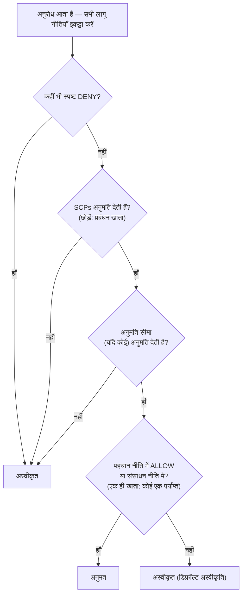

# अध्याय 14: किसे क्या करने की अनुमति है

नए इंजीनियर सोमवार से शुरू हो रहे थे। सू-जिन और राफेल। माया उनके पहले सप्ताह के बारे में सोच रही थी—उन्हें किस चीज़ तक पहुँच चाहिए होगी, उन्हें क्या नहीं छूना चाहिए, और क्या मौजूदा IAM सेटअप दो और लोगों तक विस्तारित किए जाने के लिए तैयार भी था।

ऑफ़िस भरने से पहले वह एक कॉफ़ी के साथ बैठी, एक सूची बनाती हुई।

---

*CloudFront तैनात हो चुका था। कैश हिट दरें अच्छी थीं। प्रदर्शन बेहतर हो गया था। लेकिन जैसे ही टीम नए इंजीनियरों को लाने की तैयारी कर रही थी, एक चुपचाप समस्या सामने आई: IAM कॉन्फ़िगरेशन जल्दबाज़ी में लोगों द्वारा बनाया गया था। एक्सेस कीज़ कॉन्फ़िग फ़ाइलों में थीं। कुछ भूमिकाओं के पास ज़रूरत से ज़्यादा अनुमतियाँ थीं। और दो नए लोगों को एक उत्पादन प्रणाली के क्रेडेंशियल्स सौंपे जाने वाले थे जिसे कई उपयोगकर्ताओं को ध्यान में रखकर डिज़ाइन नहीं किया गया था।*

---

टॉम के पास एक्सेस कीज़ एक टेक्स्ट फ़ाइल में खुली थीं, पेस्ट करने के लिए तैयार।

"तुम क्या कर रहे हो?" प्रिया ने पूछा।

"EC2 इंस्टेंस को S3 से कॉन्फ़िग फ़ाइलें पढ़ने की ज़रूरत है। मैं क्रेडेंशियल्स को सर्वर कॉन्फ़िगरेशन में डाल रहा हूँ।"

उसने एक पल के लिए स्क्रीन को देखा। "वह फ़ाइल बंद करो।"

"मैं बस—"

"अगर कोई उस सर्वर में घुस जाता है," उसने कहा, "तो उसे वे कीज़ मिल जाती हैं। और वे कीज़ उस हर चीज़ तक पहुँचती हैं जिसे IAM उपयोगकर्ता को छूने की अनुमति है। जो शायद सिर्फ़ S3 से कहीं ज़्यादा है।"

टॉम ने फ़ाइल बंद कर दी।

"एक बेहतर तरीका है," उसने कहा। "सर्वर के पास खुद एक भूमिका हो सकती है। इसे एक पद-नाम की तरह सोचो—इंस्टेंस को क्रेडेंशियल्स की ज़रूरत नहीं है क्योंकि सिस्टम पहले से ही जानता है कि वह क्या है और उसे क्या करने की अनुमति है।"

टॉम संशय में दिखा। "तो सर्वर खुद को प्रमाणित करता है?"

"हाँ। बिना पासवर्ड के। बिना कॉन्फ़िग फ़ाइल में कीज़ के। बिना किसी ऐसी चीज़ के जो गलती से गिट में कमिट हो सके।"

वह आखिरी बात असर कर गई। टॉम ने खुद दो हफ़्ते पहले रिपॉज़िटरी में लगभग एक एक्सेस की कमिट कर दी थी—आखिरी पल में डिफ़ में पकड़ ली। उसने एक नई ब्राउज़र टैब खोली।

**IAM पर पुनर्विचार: संपूर्ण तस्वीर**

अध्याय 3 में IAM का परिचय दिया गया था: उपयोगकर्ता, समूह, भूमिकाएँ और नीतियाँ। अब और गहराई में जाने का समय है।

IAM नीतियाँ JSON दस्तावेज़ हैं जो निर्दिष्ट करते हैं कि किन संसाधनों पर कौन-सी क्रियाएँ अनुमत या अस्वीकृत हैं। वे इस तरह दिखते हैं:

```json
{
  "Version": "2012-10-17",
  "Statement": [
    {
      "Effect": "Allow",
      "Action": [
        "s3:GetObject",
        "s3:PutObject"
      ],
      "Resource": "arn:aws:s3:::nimbus-assets/*"
    }
  ]
}
```

यह नीति `nimbus-assets` बकेट में ऑब्जेक्ट पढ़ने और लिखने की अनुमति देती है, और कुछ नहीं। न डिलीट करना। न बकेट सूचीबद्ध करना। न कोई अन्य S3 ऑपरेशन। न कोई अन्य AWS सेवा।

अनुमतियाँ देने का यही सही तरीका है: विशिष्ट क्रियाएँ, विशिष्ट संसाधन।

**"Administrator Access" की समस्या**

`AdministratorAccess` जैसी AWS Managed Policies जल्दी से शुरुआत करने के लिए डिज़ाइन की गई हैं। वे वास्तविक टीम सदस्यों के साथ उत्पादन प्रणालियाँ चलाने के लिए डिज़ाइन नहीं की गई हैं।

`AdministratorAccess` हर संसाधन पर हर क्रिया प्रदान करता है। यदि इस नीति वाला कोई टीम सदस्य गलती करता है—गलती से एक S3 बकेट डिलीट कर देता है, गलत EC2 इंस्टेंस समाप्त कर देता है, सुरक्षा समूह नियम बदल देता है—तो उन्हें रोकने के लिए AWS कुछ नहीं कर सकता। अनुमति दी जा चुकी थी।

यदि किसी टीम सदस्य के क्रेडेंशियल्स से छेड़छाड़ हो जाती है (फ़िशिंग हमला, लीक हुई एक्सेस की, लैपटॉप चोरी), तो हमलावर के पास आपके AWS खाते में हर चीज़ तक प्रशासक पहुँच होती है।

"तो सू-जिन के पास क्या होना चाहिए?" लियो ने पूछा।

"सू-जिन को क्या करने की ज़रूरत है?" प्रिया ने जवाब दिया।

"API तैनात करना। लॉग जाँचना। और कुछ नहीं।"

"तो उसे यह मिलता है: कोड पाइपलाइन में पुश करने की क्षमता, CloudWatch लॉग तक पढ़ने की पहुँच, और कुछ नहीं।"

"यह... बहुत विशिष्ट है।"

"हाँ। यही तो बात है।"

**IAM Roles: सेवाओं के लिए पहचान**

अध्याय 3 में भूमिकाओं का परिचय एक ऐसे तरीके के रूप में दिया गया था जिससे EC2 इंस्टेंस बिना क्रेडेंशियल्स संग्रहीत किए AWS सेवाओं तक पहुँच सकें। आइए इसे ठोस बनाते हैं।

Nimbus API चलाने वाले आपके EC2 इंस्टेंस को यह करने की ज़रूरत है:

- DynamoDB से पढ़ना (मेनू)
- DynamoDB में लिखना (ऑर्डर)
- S3 में ऑब्जेक्ट डालना (रसीदें, अपलोड)
- CloudWatch में लॉग लिखना
- Secrets Manager से सीक्रेट्स पढ़ना

एक्सेस की वाले उपयोगकर्ता को बनाकर और उस की को EC2 इंस्टेंस पर संग्रहीत करने के बजाय (एक सुरक्षा दुःस्वप्न—SSH पहुँच रखने वाला कोई भी एक्सेस कीज़ पढ़ सकता है), आप इन्हीं सटीक अनुमतियों के साथ EC2 इंस्टेंस के लिए एक **IAM role** बनाते हैं।

"रुको—लेकिन हम *क्यों* इसे उस तरह करेंगे?" माया ने पूछा। "EC2 इंस्टेंस तो पहले से ही हमारा कोड चलाता है। कोड को बस एक एक्सेस की क्यों न दे दें?"

क्योंकि एक्सेस कीज़ स्थिर क्रेडेंशियल्स हैं जो कहीं रहती हैं—एक कॉन्फ़िग फ़ाइल में, एक पर्यावरण चर में, एक गिट रिपॉज़िटरी में अगर कोई गलती करे। उन्हें कॉपी किया जा सकता है, बाहर निकाला जा सकता है, गलती से कमिट किया जा सकता है। एक IAM role अलग तरीके से काम करती है: EC2 इंस्टेंस स्वचालित रूप से भूमिका ग्रहण कर लेता है। AWS इंस्टेंस मेटाडेटा सेवा के माध्यम से अस्थायी क्रेडेंशियल्स प्रदान करता है। क्रेडेंशियल्स स्वचालित रूप से घूमते हैं—वे हर कुछ घंटों में समाप्त हो जाते हैं और आपकी ओर से बिना किसी क्रिया के ताज़ा कर दिए जाते हैं। लीक होने के लिए कुछ नहीं है, क्योंकि संग्रहीत कुछ नहीं है।

"और अगर कोई EC2 इंस्टेंस को हैक कर ले?" लियो ने पूछा।

"वे वही कर सकते हैं जो EC2 भूमिका अनुमति देती है," प्रिया ने कहा। "जो है मेनू पढ़ना, ऑर्डर लिखना और लॉग भेजना। वे S3 बकेट को डिलीट नहीं कर सकते। वे EC2 इंस्टेंस समाप्त नहीं कर सकते। वे IAM को छू नहीं सकते।"

"क्योंकि EC2 भूमिका के पास वे अनुमतियाँ नहीं हैं।"

"बिल्कुल।"

---

**EC2 भूमिका ग्रहण चरण-दर-चरण कैसे काम करता है**

"कुछ ठीक नहीं बैठता," माया ने कहा। "अगर इंस्टेंस पर कोई क्रेडेंशियल्स संग्रहीत नहीं हैं, तो इंस्टेंस असल में AWS को कैसे साबित करता है कि वह कौन है? कहीं तो एक क्रेडेंशियल होना चाहिए।"

होता है। लेकिन वह अस्थायी है, स्वचालित रूप से घूमता है, और केवल इंस्टेंस के अंदर से सुलभ है।

जब एक EC2 इंस्टेंस एक IAM भूमिका संलग्न के साथ शुरू होता है, तो AWS यह करता है:

**चरण 1**: AWS STS (Security Token Service) अस्थायी क्रेडेंशियल्स उत्पन्न करता है—एक एक्सेस की ID, एक सीक्रेट एक्सेस की, और एक सेशन टोकन। EC2 इंस्टेंस भूमिकाओं के लिए ये आमतौर पर लगभग छह घंटों के लिए मान्य होते हैं, और AWS उन्हें समाप्त होने से पहले स्वचालित रूप से घुमाता है।

**चरण 2**: AWS इन क्रेडेंशियल्स को एक विशेष IP पते पर उपलब्ध कराता है: `169.254.169.254`. यह **instance metadata service** (IMDS) है। यह केवल EC2 इंस्टेंस के अंदर से ही पहुँच योग्य है। इंस्टेंस के बाहर कुछ भी इसे एक्सेस नहीं कर सकता।

**चरण 3**: जब आपका एप्लिकेशन कोड किसी भी AWS SDK (boto3, Java SDK, Node.js SDK) को कॉल करता है, तो SDK स्वचालित रूप से इंस्टेंस मेटाडेटा एंडपॉइंट से क्वेरी करता है:

```
GET http://169.254.169.254/latest/meta-data/iam/security-credentials/{role-name}
```

**चरण 4**: SDK अस्थायी क्रेडेंशियल्स प्राप्त करता है और API अनुरोध पर हस्ताक्षर करने के लिए उनका उपयोग करता है—उदाहरण के लिए, S3 से पढ़ने का अनुरोध।

**चरण 5**: AWS क्रेडेंशियल्स को मान्य करता है, भूमिका से संलग्न IAM नीति की जाँच करता है, और या तो अनुरोध की अनुमति देता है या उसे अस्वीकार करता है।

**चरण 6**: क्रेडेंशियल्स समाप्त होने से लगभग पंद्रह मिनट पहले, EC2 इंस्टेंस स्वचालित रूप से उन्हें मेटाडेटा सेवा से ताज़ा कर लेता है। एप्लिकेशन कोड को इसे कभी संभालने की ज़रूरत नहीं होती—SDK इसे पारदर्शी रूप से करता है।

पूरी प्रक्रिया डेवलपर के लिए अदृश्य है। आप `s3.get_object(...)` लिखते हैं। बाकी SDK संभाल लेता है।

"तो क्रेडेंशियल मौजूद है," माया ने कहा। "बस वह अस्थायी है, स्वतः-घूमने वाला है, और इंस्टेंस मेटाडेटा एंडपॉइंट तक सीमित है।"

"यही वजह है कि यह एक स्थिर एक्सेस की से कहीं ज़्यादा सुरक्षित है," प्रिया ने कहा। "एक स्थिर की, एक बार चोरी होने पर, तब तक मान्य रहती है जब तक कोई उसे मैन्युअल रूप से न घुमा दे। एक चोरी हुआ अस्थायी क्रेडेंशियल अपने आप समाप्त हो जाता है—घंटों में, महीनों में नहीं।"

"और अगर इंस्टेंस के अंदर कोई मेटाडेटा एंडपॉइंट से क्वेरी करे?"

"वे मौजूदा अस्थायी क्रेडेंशियल पा सकते हैं। यह एक वास्तविक जोखिम है, यही वजह है कि AWS ने IMDSv2—Instance Metadata Service संस्करण 2—पेश किया। IMDSv2 के लिए कॉलर को पहले एक PUT अनुरोध के माध्यम से एक सेशन टोकन प्राप्त करना ज़रूरी है। यह Server-Side Request Forgery नामक एक प्रकार के हमले को रोकता है, जहाँ दुर्भावनापूर्ण कोड सर्वर को हमलावर की ओर से मेटाडेटा URL लाने के लिए धोखा देता है।"

लियो ने IMDSv2 को लागू करने के लिए EC2 लॉन्च कॉन्फ़िगरेशन अपडेट किया। लॉन्च समय पर लागू की गई एक सेटिंग।

---

**भूमिका ग्रहण: सेवाएँ कैसे अन्य सेवाएँ बनती हैं**

भूमिकाएँ इनके द्वारा ग्रहण की जा सकती हैं:

- **AWS सेवाएँ** (EC2, Lambda, ECS कार्य, आदि)
- आपके अपने खाते में **IAM उपयोगकर्ता** (भूमिका उन्नयन—आप किसी विशिष्ट कार्य के लिए अधिक अनुमतियों वाली एक भूमिका ग्रहण करते हैं)
- **अन्य AWS खातों में IAM उपयोगकर्ता** (क्रॉस-अकाउंट पहुँच—किसी अन्य संगठन का खाता आपके खाते में एक भूमिका ग्रहण कर सकता है)
- **बाहरी पहचान प्रदाता** (Google, Active Directory, Okta—मानव उपयोगकर्ताओं के लिए फ़ेडरेटेड पहुँच)

"क्या हमने सोचा है कि अगर Nimbus किसी तृतीय-पक्ष सेवा का उपयोग करता है जिसे हमारे AWS संसाधनों तक पहुँच चाहिए तो क्या होगा?" प्रिया ने पूछा। "उदाहरण के लिए, एक बाहरी एनालिटिक्स विक्रेता। हम उनके लिए एक IAM उपयोगकर्ता नहीं बनाना चाहते और उन्हें एक एक्सेस की नहीं सौंपना चाहते।"

"क्रॉस-अकाउंट भूमिकाएँ," लियो ने कहा। "हम अपने खाते में एक भूमिका बनाते हैं और एक ट्रस्ट पॉलिसी लिखते हैं जो कहती है 'इस विशिष्ट बाहरी खाते को इस भूमिका को ग्रहण करने की अनुमति है।' वे भूमिका ग्रहण करने और अस्थायी पहुँच पाने के लिए अपने स्वयं के क्रेडेंशियल्स का उपयोग करते हैं। प्रबंधित करने के लिए कोई कीज़ नहीं, लीक होने के लिए कोई कीज़ नहीं।"

यह आखिरी पैटर्न—**पहचान फ़ेडरेशन**—वह तरीका है जिससे बड़े संगठन प्रत्येक व्यक्ति के लिए व्यक्तिगत IAM उपयोगकर्ता बनाए बिना अपने कर्मचारियों को AWS पहुँच देते हैं। आपकी कंपनी की Active Directory में आपके क्रेडेंशियल्स हैं। जब आप AWS में लॉग इन करते हैं, तो आप Active Directory के विरुद्ध प्रमाणित होते हैं, और AWS आपको एक भूमिका प्रदान करता है।

---

**क्रॉस-अकाउंट पहुँच: अकाउंटिंग टीम का परिदृश्य**

छह महीने बाद, Nimbus ने वित्तीय रिपोर्टिंग में मदद के लिए एक अकाउंटिंग फ़र्म को लाया। अकाउंटिंग टीम को Nimbus की बिलिंग S3 बकेट में बिलिंग डेटा तक पढ़ने की पहुँच चाहिए थी—लेकिन वे अपने अलग AWS खाते से काम करते थे। Nimbus उनके लिए एक IAM उपयोगकर्ता नहीं बनाना चाहता था। किसी बाहरी कंपनी के व्यक्ति को एक स्थिर एक्सेस की सौंपना ठीक गलत लगा।

"क्रॉस-अकाउंट भूमिका," प्रिया ने कहा।

सेटअप के तीन हिस्से हैं:

**भाग एक**: Nimbus खाते में, एक IAM भूमिका बनाएँ—इसे `AccountingReadRole` कहें। एक नीति संलग्न करें जो बिलिंग S3 बकेट पर `s3:GetObject` और `s3:ListBucket` की अनुमति देती है। और कुछ नहीं।

**भाग दो**: `AccountingReadRole` में एक ट्रस्ट पॉलिसी जोड़ें। ट्रस्ट पॉलिसी बताती है कि कौन-सी बाहरी पहचान इस भूमिका को ग्रहण करने के लिए अधिकृत है:

```json
{
  "Version": "2012-10-17",
  "Statement": [{
    "Effect": "Allow",
    "Principal": {
      "AWS": "arn:aws:iam::ACCOUNTING-FIRM-ACCOUNT-ID:role/AccountingAppRole"
    },
    "Action": "sts:AssumeRole"
  }]
}
```

यह कहता है: केवल अकाउंटिंग फ़र्म के AWS खाते की विशिष्ट भूमिका ही इस भूमिका को ग्रहण कर सकती है। और कोई नहीं।

**भाग तीन**: अकाउंटिंग फ़र्म के खाते में, उनका एप्लिकेशन `AccountingReadRole` के लिए अस्थायी क्रेडेंशियल्स पाने के लिए `sts:AssumeRole` का उपयोग करता है। वे क्रेडेंशियल्स केवल उतने तक ही सीमित हैं जितना `AccountingReadRole` अनुमति देता है। अकाउंटिंग एप्लिकेशन बिलिंग फ़ाइलें पढ़ सकता है। वह उनमें लिख नहीं सकता। वह Nimbus खाते में किसी और चीज़ को छू नहीं सकता।

ठीक इसी परिदृश्य के लिए एक और कठोरीकरण कदम है—और यह एक नामित परीक्षा विषय है। अकाउंटिंग फ़र्म कई ग्राहकों की सेवा करती है। मान लीजिए उनका कोई दुर्भावनापूर्ण ग्राहक Nimbus के `AccountingReadRole` का ARN जान लेता है और फ़र्म के सॉफ़्टवेयर से उसका "विश्लेषण" करने को कहता है। फ़र्म के सॉफ़्टवेयर के पास भूमिकाएँ ग्रहण करने की वैध अनुमति है—उसे गलत ग्राहक की ओर से Nimbus के डेटा तक पहुँचने के लिए धोखा दिया जा सकता है। इसे **confused deputy problem** कहते हैं, और इसका समाधान है **ExternalId**: Nimbus एक अद्वितीय गुप्त मान उत्पन्न करता है, उसे ट्रस्ट पॉलिसी में एक शर्त के रूप में डालता है (`"sts:ExternalId": "nimbus-7f3a..."`), और इसे केवल अकाउंटिंग फ़र्म के साथ साझा करता है। फ़र्म के सॉफ़्टवेयर को हर `AssumeRole` कॉल में वह ExternalId पास करना होगा, और वह प्रति ग्राहक एक *अलग* ExternalId का उपयोग करता है—ताकि गलत ग्राहक की ओर से किया गया अनुरोध विफल हो जाए। परीक्षा ट्रिगर: "तृतीय पक्ष को क्रॉस-अकाउंट पहुँच चाहिए" → भूमिका + ट्रस्ट पॉलिसी + **ExternalId**। कभी भी साझा कीज़ वाला IAM उपयोगकर्ता नहीं।

"अगर हमें उनकी पहुँच रद्द करनी हो तो?" टॉम ने पूछा।

"ट्रस्ट पॉलिसी हटा दो या भूमिका हटा दो," प्रिया ने कहा। "हो गया। ढूँढने के लिए कोई क्रेडेंशियल्स नहीं, निष्क्रिय करने के लिए कोई कीज़ नहीं। भूमिका ही पहुँच है। भूमिका हटाओ, पहुँच चली गई।"

"और हम CloudTrail में हर बार देख सकते हैं जब उन्होंने इसका उपयोग किया," लियो ने जोड़ा।

"उनके द्वारा किया गया हर API कॉल, लॉग किया गया। कौन-सी बकेट, कौन-सी फ़ाइल, किस समय, क्या परिणाम।"

टॉम ने पैटर्न लिख लिया। यह फिर आएगा—हर इंटीग्रेशन पार्टनर, हर बाहरी विक्रेता, हर तृतीय-पक्ष टूल जिसे AWS पहुँच चाहिए होगी, उसे एक ट्रस्ट पॉलिसी वाली भूमिका मिलेगी, न कि एक्सेस की वाला उपयोगकर्ता।

---

**IAM नीति मूल्यांकन: निर्णय का तर्क**

"क्या हमने सोचा है कि जब एक ही अनुरोध पर कई नीतियाँ लागू होती हैं तो क्या होता है?" प्रिया ने पूछा। "एक IAM उपयोगकर्ता के पास एक नीति है। जिस संसाधन तक वे पहुँच रहे हैं उसकी एक संसाधन नीति है। एक SCP हो सकती है। AWS कैसे तय करता है?"

समझने वाली महत्वपूर्ण बात यह है कि AWS नीतियों की जाँच एक-एक प्रकार करके, क्रम में **नहीं** करता। वह अनुरोध पर लागू होने वाली *सभी* नीतियाँ इकट्ठा करता है—पहचान-आधारित, संसाधन-आधारित, SCPs, अनुमति सीमाएँ, सेशन नीतियाँ—और पूरे ढेर पर एक साथ नियमों का एक समूह लागू करता है:

**नियम 1 — स्पष्ट अस्वीकृति हमेशा जीतती है।** यदि कोई भी लागू नीति—IAM, संसाधन-आधारित, SCP, या सीमा—स्पष्ट रूप से क्रिया को अस्वीकार करती है, तो अनुरोध अस्वीकृत हो जाता है। कुछ भी एक स्पष्ट अस्वीकृति को ओवरराइड नहीं कर सकता।

**नियम 2 — SCPs और अनुमति सीमाएँ फ़िल्टर के रूप में काम करती हैं।** वे कभी कुछ प्रदान नहीं करतीं। क्रिया को हर लागू SCP द्वारा और अनुमति सीमा द्वारा (यदि कोई मौजूद है) *अनुमत* होना चाहिए, वरना यह अस्वीकृत है—चाहे अन्य नीतियाँ कुछ भी कहें।

**नियम 3 — एक ही खाते के भीतर, एक अनुमति काफ़ी है।** पहचान की IAM नीति *या* संसाधन की नीति में *किसी एक* में एक स्पष्ट अनुमति क्रिया को अनुमत कर देती है। वे एक संघ (union) हैं, क्रम नहीं—संसाधन नीति का मूल्यांकन IAM नीति से "पहले" नहीं होता।

**नियम 4 — डिफ़ॉल्ट अस्वीकृति।** यदि कुछ भी क्रिया को स्पष्ट रूप से अनुमति नहीं देता, तो वह अस्वीकृत है।



परिणाम: कहीं भी स्पष्ट अस्वीकृति = अस्वीकृत। कहीं कोई अनुमति नहीं = अस्वीकृत। पहचान नीति *या* संसाधन नीति से एक अनुमति = अनुमत, बशर्ते कोई अस्वीकृति, SCP, या सीमा इसे न रोके।

एक और तथ्य जो परीक्षा को बहुत पसंद है: **SCPs संगठन के प्रबंधन खाते पर लागू नहीं होतीं** (न ही service-linked roles पर)। "us-west-2 के बाहर कोई EC2 नहीं" कहने वाली एक SCP हर सदस्य खाते को बाधित करती है—लेकिन प्रबंधन खाता अछूता रहता है। यह उन कारणों में से एक है जिसके लिए AWS आपको कार्यभार को प्रबंधन खाते से पूरी तरह बाहर रखने को कहता है।

एक सूक्ष्मता जो परीक्षा अभ्यर्थियों को उलझा देती है: **क्रॉस-अकाउंट पहुँच** के लिए, लक्ष्य खाते में एक संसाधन-आधारित नीति अकेले पर्याप्त नहीं है। स्रोत खाते की पहचान को भी क्रिया करने के लिए अपनी स्वयं की IAM नीति में स्पष्ट अनुमति की ज़रूरत होती है। यदि आप एक S3 बकेट नीति देते हैं जो खाते B को आपके ऑब्जेक्ट पढ़ने की अनुमति देती है, लेकिन खाते B के IAM उपयोगकर्ताओं के पास `s3:GetObject` की अनुमति देने वाली कोई IAM नीति नहीं है, तो पहुँच फिर भी अस्वीकृत है। दोनों पक्षों को क्रिया अनुमत करनी चाहिए—संसाधन नीति लक्ष्य पक्ष पर दरवाज़ा खोलती है, और स्रोत खाते की IAM नीति उपयोगकर्ता को उसमें से चलने की अनुमति देती है।

"तो अगर प्रिया की SCP कहती है 'eu-west-1 में कोई EC2 नहीं,' और उसकी IAM नीति कहती है 'सभी EC2 क्रियाओं की अनुमति,' तो वह फिर भी eu-west-1 में एक इंस्टेंस नहीं बना सकती?" लियो ने पूछा।

"सही," प्रिया ने कहा। "IAM नीतियों के मूल्यांकन से पहले SCP फ़िल्टर करती है कि क्या संभव है। किसी क्रिया के सफल होने के लिए दोनों को सहमत होना चाहिए।"

"और एक IAM नीति में एक स्पष्ट अस्वीकृति एक संसाधन नीति में एक स्पष्ट अनुमति को ओवरराइड कर देती है?"

"हमेशा। श्रृंखला में कहीं भी एक स्पष्ट अस्वीकृति जीतती है।"

---

**अनुमति सीमाएँ: भूमिकाएँ क्या दे सकती हैं उसे सीमित करना**

यहाँ एक सूक्ष्म लेकिन महत्वपूर्ण समस्या है: डिफ़ॉल्ट रूप से, IAM किसी उपयोगकर्ता को ऐसी अनुमतियाँ देने से नहीं रोकता जो उनके पास वर्तमान में नहीं हैं।

यदि सू-जिन के पास `iam:CreatePolicy` और `iam:AttachUserPolicy` है, तो वह S3 लिखने की पहुँच देने वाली एक नीति बना सकती है और उसे खुद से संलग्न कर सकती है—भले ही उसकी मौजूदा नीतियाँ केवल S3 पढ़ने की अनुमति देती हों। इस प्रकार की भेद्यता को **privilege escalation** कहते हैं, और ठीक यही वजह है कि अनुमति सीमाएँ मौजूद हैं।

लेकिन अगर आप IAM अनुमति निर्माण को एक टीम लीड को सौंपना चाहते हैं, जबकि यह सुनिश्चित करना चाहते हैं कि वे आपके इरादे से अधिक न दे सकें?

**अनुमति सीमाएँ** अधिकतम अनुमतियाँ निर्धारित करती हैं जो किसी पहचान को कभी दी जा सकती हैं। भले ही पहचान की संलग्न नीतियाँ व्यापक हों, प्रभावी अनुमतियाँ अनुमति सीमा द्वारा बाधित होती हैं।

उदाहरण: आप एक टीम लीड को एक नीति देते हैं जो उन्हें IAM भूमिकाएँ बनाने की अनुमति देती है। लेकिन आप एक अनुमति सीमा संलग्न करते हैं जो कहती है "इस टीम लीड द्वारा बनाई गई भूमिकाओं के पास कभी S3 डिलीट पहुँच नहीं हो सकती।" भले ही टीम लीड S3 पूर्ण पहुँच वाली एक भूमिका बनाए, सीमा S3 डिलीट को प्रभावी होने से रोकती है।

आप सोच रहे होंगे: एक अनुमति सीमा और एक Service Control Policy में क्या अंतर है? वे समान लगती हैं—दोनों सीमित करती हैं कि कौन-सी अनुमतियाँ प्रभावी हो सकती हैं। अंतर दायरे का है। एक अनुमति सीमा एक विशिष्ट IAM पहचान (एक उपयोगकर्ता या भूमिका) पर लागू होती है और सीमित करती है कि वह पहचान कभी क्या कर सकती है। एक SCP एक पूरे AWS खाते या संगठनात्मक इकाई पर लागू होती है—यह एक संगठन-स्तरीय गार्डरेल है जो खाते में हर पहचान को प्रभावित करता है, प्रशासकों सहित। अनुमति सीमाओं का उपयोग तब करें जब आप IAM प्रबंधन को एक टीम लीड को सौंप रहे हों। SCPs का उपयोग तब करें जब आपको संगठन-व्यापी नियमों की ज़रूरत हो जिन्हें खाते में कोई ओवरराइड न कर सके।

यह एक उन्नत अवधारणा है, लेकिन यह परीक्षा में दिखाई देती है और यह दर्शाती है कि संगठन बड़े पैमाने पर IAM प्रबंधन कैसे सौंपते हैं।

**एक ठोस अनुमति सीमा: भूमिका निर्माण को सुरक्षित रूप से सौंपना**

Nimbus बढ़ रहा था। सू-जिन ने प्रस्ताव दिया कि प्लेटफ़ॉर्म टीम के प्रत्येक वरिष्ठ इंजीनियर को उनके स्वामित्व वाले Lambda फ़ंक्शन के लिए IAM भूमिकाएँ बनाने की अनुमति दी जाए—बिना प्रिया द्वारा प्रत्येक को अनुमोदित किए।

"जोखिम," प्रिया ने कहा, "यह है कि एक वरिष्ठ इंजीनियर `AdministratorAccess` के साथ एक Lambda भूमिका बना देता है—या तो गलती से या ध्यान से न सोचकर।"

"तो हम अनुमति सीमाओं का उपयोग करते हैं," सू-जिन ने कहा।

प्रिया ने `NimbusDeveloperBoundary` नामक एक अनुमति सीमा नीति बनाई:

```json
{
  "Version": "2012-10-17",
  "Statement": [
    {
      "Effect": "Allow",
      "Action": [
        "s3:GetObject", "s3:PutObject",
        "dynamodb:GetItem", "dynamodb:PutItem", "dynamodb:Query",
        "cloudwatch:PutMetricData", "logs:CreateLogGroup",
        "logs:CreateLogStream", "logs:PutLogEvents",
        "secretsmanager:GetSecretValue",
        "xray:PutTraceSegments"
      ],
      "Resource": "*"
    }
  ]
}
```

फिर उसने प्रत्येक वरिष्ठ इंजीनियर को भूमिकाएँ बनाने की अनुमति दी, लेकिन केवल तभी जब वे इस सीमा को संलग्न करें:

```json
{
  "Effect": "Allow",
  "Action": ["iam:CreateRole", "iam:AttachRolePolicy"],
  "Resource": "*",
  "Condition": {
    "StringEquals": {
      "iam:PermissionsBoundary": "arn:aws:iam::ACCOUNT_ID:policy/NimbusDeveloperBoundary"
    }
  }
}
```

शर्त के बिना, एक इंजीनियर किसी भी अनुमति के साथ एक भूमिका बना सकता था। शर्त के साथ, उनके द्वारा बनाई गई किसी भी भूमिका में `NimbusDeveloperBoundary` संलग्न होना चाहिए। `AdministratorAccess` प्लस `NimbusDeveloperBoundary` वाली एक भूमिका के पास दोनों का प्रतिच्छेदन (intersection) होता है—प्रभावी रूप से केवल सीमा में सूचीबद्ध सेवाएँ।

"तो वे भूमिकाएँ बना सकते हैं," लियो ने कहा, "लेकिन वे भूमिकाएँ कभी S3 से पढ़ने, DynamoDB में लिखने और CloudWatch में लॉग करने से अधिक कुछ नहीं कर सकतीं।"

"सही। वे ऐसी भूमिकाएँ नहीं बना सकते जो IAM को छूएँ। वे ऐसी भूमिकाएँ नहीं बना सकते जो EC2 इंस्टेंस डिलीट करें। सीमा अधिकतम सीमा को परिभाषित करती है।"

"और अगर वे सीमा संलग्न करना भूल जाएँ?"

"शर्त `CreateRole` कॉल को सफल होने से रोक देती है। जब तक सीमा शामिल नहीं है, निर्माण विफल हो जाता है।"

प्रिया ने सू-जिन के साथ अभ्यास किया। बीस मिनट का सेटअप। परिणाम: इंजीनियर हर तैनाती के लिए सुरक्षा समीक्षा के बिना अपनी Lambda भूमिका निर्माण स्वयं कर सकते थे, और प्लेटफ़ॉर्म टीम को यह भरोसा बना रहा कि कोई भी Lambda फ़ंक्शन कभी परिभाषित अनुमतियों से अधिक नहीं रखेगा।

**IAM Access Analyzer: अनुमतियों का ऑडिट करना**

प्रिया ने टीम के IAM सेटअप की समीक्षा में दो दिन बिताए। उसने पाया:

- लियो के व्यक्तिगत उपयोगकर्ता के पास प्रशासक पहुँच थी (जैसा खोजा गया)
- एक पुराने Lambda फ़ंक्शन के पास सभी S3 बकेट पढ़ने की अनुमतियाँ थीं (एक परीक्षण से बचा हुआ)
- एक सेवा भूमिका के पास उन DynamoDB तालिकाओं में लिखने की पहुँच थी जो अब मौजूद नहीं थीं

यह सामान्य है। IAM कॉन्फ़िगरेशन समय के साथ कचरा जमा कर लेते हैं।

**IAM Access Analyzer** एक AWS सेवा है जो स्वचालित रूप से उन संसाधनों (S3 बकेट, IAM भूमिकाएँ, KMS कुंजियाँ, Lambda फ़ंक्शन, SQS कतारें) की पहचान करती है जो आपके AWS खाते के बाहर से पहुँच योग्य हैं। इसमें एक नीति सत्यापन सुविधा भी शामिल है जो नीतियों को IAM सर्वोत्तम प्रथाओं के विरुद्ध जाँचती है, और एक नीति निर्माण सुविधा जो CloudTrail इवेंट्स का विश्लेषण करके न्यूनतम-विशेषाधिकार नीतियाँ बनाती है।

"वह प्रति माह कितना खर्च होता है?" टॉम ने अपने ब्राउज़र से ऊपर देखते हुए पूछा।

"बाहरी पहुँच विश्लेषण मुफ़्त है," प्रिया ने कहा। "यह लगातार चलता है और निष्कर्षों को कंसोल में रिपोर्ट करता है। अप्रयुक्त पहुँच विश्लेषण—जो उन भूमिकाओं और अनुमतियों की पहचान करता है जिनका हाल ही में उपयोग नहीं हुआ—प्रति IAM भूमिका विश्लेषित प्रति माह लगभग $0.20 खर्च होता है।"

टॉम अपने ब्राउज़र पर वापस चला गया।

बाहरी पहुँच के निष्कर्ष सबसे तुरंत मूल्यवान हैं। जब प्रिया ने Access Analyzer सक्षम किया, तो उसे दो चीज़ें मिलीं:

पहली, `nimbus-receipts` S3 बकेट के पास एक बकेट नीति थी जो एक विशिष्ट बाहरी AWS खाते से पढ़ने की अनुमति देती थी—एक ठेकेदार का खाता जिसने आठ महीने पहले शुरुआती रसीद निर्यात सुविधा बनाने में मदद की थी। ठेकेदार अब जुड़ा नहीं था। बकेट नीति को कभी साफ़ नहीं किया गया था।

"आठ महीने की पहुँच जो किसी ने इरादतन नहीं दी," प्रिया ने कहा।

"क्या वे अभी भी इसे एक्सेस कर रहे थे?" टॉम ने पूछा।

लियो ने S3 एक्सेस लॉग खींचे। छह महीनों में उस खाते से कोई अनुरोध नहीं। लेकिन अनुमति वहाँ थी। Access Analyzer ने इसे उभारा था; किसी मैन्युअल समीक्षा में इसे कोई नहीं पाता।

दूसरी, `nimbus-dev-assets` S3 बकेट सार्वजनिक पढ़ने के लिए सेट थी। विकास के दौरान यह जानबूझकर था—सार्वजनिक पहुँच के साथ परीक्षण करना आसान था। इसे भुला दिया गया था।

"सार्वजनिक पहुँच ब्लॉक ओवरराइड हटा दो," प्रिया ने कहा। "और खाता स्तर पर S3 Block Public Access सक्षम करो। यह किसी भी बकेट को सार्वजनिक होने से रोकता है, चाहे व्यक्तिगत बकेट सेटिंग्स कुछ भी हों।"

उन्होंने दोनों किए।

मासिक रूप से चलाया गया अप्रयुक्त पहुँच विश्लेषण उन भूमिकाओं को उभारता जिनका 90 दिनों में उपयोग नहीं हुआ। वे डिलीट करने के उम्मीदवार थे। IAM कॉन्फ़िगरेशन स्वाभाविक रूप से एक ही दिशा में बढ़ते हैं—भूमिकाएँ और नीतियाँ जमा होती जाती हैं। Access Analyzer सफ़ाई को दृश्यमान बनाता है।

नियमित IAM ऑडिट आपके संचालन का हिस्सा होने चाहिए। Access Analyzer ऑडिट की जगह नहीं लेता—यह ऑडिट को प्रबंधनीय बनाता है।

**Service Control Policies: संगठन-स्तरीय गार्डरेल**

यदि आपका AWS वातावरण कई खातों में बढ़ता है (बड़ी टीमों के लिए एक सामान्य पैटर्न—dev खाता, staging खाता, production खाता), तो **AWS Organizations** आपको उन्हें एक केंद्रीय खाते से प्रबंधित करने देता है। एक तत्काल, व्यावहारिक लाभ: **consolidated billing**। सभी सदस्य खाते एक एकल बिल में जुड़ जाते हैं जिसे प्रबंधन खाता चुकाता है, और उपयोग खातों भर में एकत्रित होता है—इसलिए वॉल्यूम छूट (उदाहरण के लिए, S3 मूल्य निर्धारण स्तर) और Reserved Instance या Savings Plans की छूट प्रति खाते के बजाय संगठन-व्यापी रूप से लागू होती हैं। टॉम ने Organizations के बारे में बाकी कुछ भी समझने से पहले ही उसे मंज़ूरी दे दी।

Organizations के भीतर, **Service Control Policies (SCPs)** ऐसे गार्डरेल लागू करती हैं जो खाते में *हर* IAM इकाई को प्रभावित करते हैं, प्रशासकों सहित।

उदाहरण SCP: "dev खाते में कोई भी eu-west-1 क्षेत्र में EC2 इंस्टेंस नहीं बना सकता।"

भले ही किसी के पास dev खाते में प्रशासक पहुँच हो, वे इस SCP का उल्लंघन नहीं कर सकते। यह संगठन स्तर पर, खाते स्तर के ऊपर लागू होती है।

SCPs अनुमतियाँ प्रदान नहीं करतीं—वे उन्हें प्रतिबंधित करती हैं। वे अधिकतम अनुमतियों को परिभाषित करती हैं जो किसी खाते में कोई भी IAM इकाई कभी रख सकती है।

जब Nimbus ने एक बहु-खाता संरचना स्थापित की—एक साझा production खाता, एक development खाता, और एक security खाता—तो प्रिया ने तीन मूलभूत SCPs लिखीं:

**SCP 1 — Region lock**: सभी खाते `us-east-1` और `us-west-2` तक सीमित हैं। यदि कोई डेवलपर गलती से `ap-southeast-1` में तैनात करता है, तो क्रिया अस्वीकृत हो जाती है। यह अनपेक्षित क्षेत्रों में छाया अवसंरचना को रोकता है।

**SCP 2 — CloudTrail protection**: किसी भी खाते में कोई CloudTrail को अक्षम नहीं कर सकता या CloudTrail लॉग डिलीट नहीं कर सकता। खाता प्रशासक भी नहीं। यदि CloudTrail अंधेरे में चला जाता है, तो सुरक्षा दृश्यता भी उसके साथ चली जाती है—यह SCP इसे संरचनात्मक रूप से असंभव बना देती है।

**SCP 3 — Root user lockdown**: सदस्य खातों के root उपयोगकर्ता द्वारा की गई सभी क्रियाओं को अस्वीकार करती है (AWS का अनुशंसित पैटर्न root से मेल खाने वाले `aws:PrincipalArn` पर सीधी अस्वीकृति है, बजाय सशर्त रूप से MFA की आवश्यकता के—सशर्त-MFA SCPs उन सेवा प्रवाहों को तोड़ देती हैं जो MFA प्रस्तुत नहीं कर सकते)। root उपयोगकर्ता का लगभग कभी उपयोग नहीं होना चाहिए; रोज़मर्रा का काम भूमिकाओं का है। याद रखें: SCPs सदस्य-खाता root उपयोगकर्ताओं पर लागू होती हैं, लेकिन प्रबंधन खाते पर **कभी नहीं**।

"ये तीन नीतियाँ तीन वास्तविक घटनाओं को रोक देतीं जो हमने पिछले साल देखीं," प्रिया ने कहा। "Region lock उस डेवलपर को रोक देता जिसने गलती से एक ऐसे क्षेत्र में दो सौ EC2 इंस्टेंस लॉन्च कर दिए जहाँ हम काम नहीं करते। CloudTrail protection हमारे पिछले नियोक्ता पर हुई अंदरूनी खतरे की घटना को रोक देता। Root lockdown बस स्वच्छता है।"

"क्या यह security खाते पर भी लागू होता है?" लियो ने पूछा।

"security खाते की एक अलग SCP है—कम प्रतिबंध, क्योंकि सुरक्षा टीम को कभी-कभी ऐसे काम करने पड़ते हैं जो अन्य खाते नहीं कर सकते। लेकिन CloudTrail protection हर जगह लागू होती है। लॉगिंग पवित्र है।"

अंगूठे का नियम: SCPs उसके लिए जो किसी भी परिस्थिति में, किसी भी खाते में, कहीं भी कभी नहीं होना चाहिए। IAM नीतियाँ उसके लिए जो प्रत्येक टीम और सेवा को विशेष रूप से चाहिए।

---

## Landing Zone को स्वचालित करना: AWS Control Tower

SCPs काम कर रही थीं। बहु-खाता संरचना आकार ले रही थी। लेकिन प्रिया एक चुपचाप गणना कर रही थी, और उसे संख्याएँ पसंद नहीं थीं।

"आठ खाते," उसने कहा। "और हमने नई चेन को गिना तक नहीं है।"

Nimbus एक एकल AWS खाते से आगे बढ़ चुका था। उनके पास production था। उनके पास staging था। उनके पास तीन अधिग्रहित रेस्तरां चेन थीं—प्रत्येक अपना AWS वातावरण चला रही थी, प्रत्येक को Nimbus शासन मॉडल में समेटे जाने की ज़रूरत थी। कुल आठ खाते, और भी आने वाले।

सू-जिन इस समस्या को जानती थी। "मेरी पिछली कंपनी में, हम प्रत्येक नए खाते को मैन्युअल रूप से सेट करते थे," उसने कहा। "Root खाता ईमेल, IAM उपयोगकर्ता, SCP संलग्नक, CloudTrail, Config, GuardDuty—प्रति खाता दो घंटे, न्यूनतम। और कुछ न कुछ हमेशा थोड़ा अलग होता। एक खाते में CloudTrail केवल us-east-1 में था। दूसरे में GuardDuty अक्षम था क्योंकि किसी ने इसे सक्षम करना भूल दिया था। जब तक आपके पास पचास खाते होते, अंतरों का ऑडिट करना अपने आप में एक परियोजना थी।"

"हम इसे इस तरह नहीं करेंगे," प्रिया ने कहा।

**AWS Control Tower** एक बहु-खाता AWS वातावरण की स्थापना और शासन को स्वचालित करता है। प्रत्येक नए खाते के लिए Organizations, SCPs, CloudTrail, Config, और GuardDuty को मैन्युअल रूप से जोड़ने के बजाय, Control Tower आपके लिए संरचना बनाता और बनाए रखता है।

जब आप Control Tower सेट करते हैं, तो यह एक **landing zone** बनाता है: एक पूर्व-कॉन्फ़िगर, सुरक्षित बहु-खाता वातावरण जिसमें एक प्रबंधन खाता, एक log archive खाता, और एक audit खाता होता है, सभी AWS सर्वोत्तम प्रथाओं का पालन करते हुए। log archive खाता संगठन के हर खाते से CloudTrail लॉग एकत्र करता है। audit खाता सुरक्षा टूलिंग को होस्ट करता है। यह आधार स्वचालित रूप से सेट होता है—आपकी टीम द्वारा दो दिनों में नहीं, बल्कि Control Tower द्वारा मिनटों में।

एक बार landing zone मौजूद हो जाने पर, Control Tower इसे **controls** के माध्यम से प्रबंधित करता है (पुराना नाम, **guardrails**, अभी भी हर जगह दिखाई देता है, परीक्षा सहित)—तीन रूपों में पूर्व-निर्मित शासन नियम। *Preventive controls* SCPs हैं: वे गैर-अनुपालक क्रियाओं को होने से पहले ही रोक देती हैं। *Detective controls* AWS Config नियम हैं: वे विचलन (drift) के लिए स्कैन करती हैं और इसे Control Tower डैशबोर्ड पर रिपोर्ट करती हैं। *Proactive controls* CloudFormation hooks हैं: वे संसाधनों के प्रावधानित होने से *पहले* अनुपालन की जाँच करती हैं, बाद में चिह्नित करने के बजाय तैनाती को विफल कर देती हैं। प्रिया की CloudTrail protection SCP, Control Tower भाषा में अनुवादित, एक preventive control है। किसी भी सार्वजनिक पहुँच वाली S3 बकेट को चिह्नित करने वाला एक Config नियम एक detective control है। एक अनएन्क्रिप्टेड EBS वॉल्यूम बनाने से CloudFormation स्टैक को रोकने वाला एक hook एक proactive control है।

सू-जिन की प्रति-खाता-दो-घंटे की समस्या को हल करने वाला टुकड़ा: **Account Factory**। जब Nimbus एक और रेस्तरां चेन का अधिग्रहण करता है, तो इंजीनियरिंग टीम Account Factory खोलती है, खाता नाम और ईमेल भरती है, और provision पर क्लिक करती है। मिनटों बाद, एक नया AWS खाता पहले से ही सही IAM भूमिकाओं, CloudTrail, Config, और सभी guardrails के साथ पूर्व-कॉन्फ़िगर आ जाता है। लगभग सही नहीं। एक चीज़ छूटी हुई नहीं। हर दूसरे खाते के समान।

"रुको—लेकिन हम *क्यों* इसे उस तरह करेंगे?" माया ने पूछा। "हमारे पास पहले से ही Organizations और SCPs हैं। ऊपर एक और सेवा क्यों जोड़ें?"

क्योंकि SCPs वाला Organizations आपको guardrails देता है—लेकिन बाकी सब आप खुद बनाते और बनाए रखते हैं। Control Tower आपको पूरी landing zone देता है: खाता संरचना, log archive, audit खाता, आधारभूत सुरक्षा कॉन्फ़िगरेशन, और Account Factory, सभी AWS द्वारा बनाए रखे गए। Control Tower पर्दे के पीछे Organizations का उपयोग करता है, लेकिन यह स्वचालित, राय-आधारित सेटअप जोड़ता है जो अकेला Organizations प्रदान नहीं करता। यदि आप आज शून्य से शुरू करते हैं और बड़े पैमाने पर सुसंगत शासन की ज़रूरत है, तो Control Tower उत्तर है। यदि आपके पास पहले से ही एक परिपक्व Organizations सेटअप है जिसे आपने मैन्युअल रूप से बनाया है, तो आप इसे Control Tower में नामांकित कर सकते हैं—या इसे वैसे ही छोड़ सकते हैं।

परीक्षा अभ्यर्थियों को उलझाने वाला अंतर: "खातों भर में एक विशिष्ट क्रिया को प्रतिबंधित करने के लिए एक SCP लागू करें" → आप सीधे Organizations + SCP चाहते हैं। "एक नए खाते प्रावधान वर्कफ़्लो के साथ, AWS सर्वोत्तम प्रथाओं का पालन करते हुए स्वचालित रूप से एक सुरक्षित बहु-खाता वातावरण सेट करें" → आप Control Tower चाहते हैं।

"Meridian Kitchen खाते को नामांकित करने में कितना समय लगता है?" लियो ने पूछा।

"Account Factory लगभग तीस मिनट में एक नया खाता प्रावधानित करता है," प्रिया ने कहा। "पूरी तरह कॉन्फ़िगर। 'अधिकांश रूप से कॉन्फ़िगर' नहीं।"

टॉम ने कुछ नहीं कहा। वह एक इंजीनियर के दो घंटे की लागत देख रहा था, आठ से गुणा, और जितने भी खाते आने वाले थे उनसे गुणा।

---

> **परीक्षा युक्ति — AWS Control Tower**
>
> *SAA-C03 डोमेन: सुरक्षित आर्किटेक्चर डिज़ाइन करना (डोमेन 1)*
>
> - **Control Tower** guardrails और Account Factory के साथ बहु-खाता landing zone सेटअप को स्वचालित करता है। इसका उपयोग तब करें जब एक नया AWS संगठन शुरू कर रहे हों या सुसंगत शासन आधारों के साथ बड़े पैमाने पर खाते प्रावधानित करने की ज़रूरत हो।
> - **Preventive controls = SCPs.** वे गैर-अनुपालक क्रियाओं को होने से पहले रोक देती हैं।
> - **Detective controls = AWS Config नियम.** वे विचलन का पता लगाती हैं और इसे डैशबोर्ड पर रिपोर्ट करती हैं।
> - **Proactive controls = CloudFormation hooks.** वे प्रावधान से पहले संसाधनों को मान्य करती हैं। तीन control प्रकार, तीन तंत्र—परीक्षा इस मानचित्रण का परीक्षण करती है।
> - **Account Factory** नए खातों को आपके संगठन के सुरक्षा आधार के साथ पूर्व-कॉन्फ़िगर प्रावधानित करता है—कोई मैन्युअल सेटअप नहीं।
> - **Control Tower बनाम Organizations:** Organizations + SCPs = आप सब कुछ बनाते और प्रबंधित करते हैं। Control Tower = AWS landing zone बनाता है और आपके लिए guardrail अपडेट प्रबंधित करता है, पर्दे के पीछे Organizations का उपयोग करते हुए।
> - **परीक्षा ट्रिगर:** "सुरक्षा आधारों के साथ नए खाते स्वचालित रूप से सेट करें" → Control Tower। "खातों भर में एक क्रिया को प्रतिबंधित करने के लिए एक विशिष्ट SCP लागू करें" → सीधे Organizations + SCP।

---

**CI/CD पाइपलाइन: वे क्रेडेंशियल्स जिन्हें आप भूल जाते हैं**

"क्या हमने सोचा है कि हमारी तैनाती पाइपलाइन में क्रेडेंशियल्स के साथ क्या होता है?" प्रिया ने पूछा।

Nimbus एप्लिकेशन को तैनात करने वाले GitHub Actions वर्कफ़्लो ने पहले GitHub Secrets के रूप में संग्रहीत AWS एक्सेस कीज़ का उपयोग किया था। यह मानक प्रथा थी—लेकिन इसका मतलब था कि एक तृतीय-पक्ष प्रणाली में लंबे समय तक चलने वाली एक्सेस कीज़ मौजूद थीं।

"अगर GitHub से छेड़छाड़ हो जाए तो?" प्रिया ने पूछा। "या कोई रिपॉज़िटरी गलती से सार्वजनिक हो जाए और कोई सीक्रेट्स पढ़ ले?"

समाधान: GitHub OIDC फ़ेडरेशन। GitHub Actions OpenID Connect का समर्थन करता है—यह GitHub के पहचान प्रदाता से एक अस्थायी टोकन प्राप्त कर सकता है और उसे एक IAM भूमिका के माध्यम से AWS क्रेडेंशियल्स के लिए विनिमय कर सकता है। कोई स्थिर एक्सेस की कभी नहीं बनाई जाती।

तैनाती भूमिका के लिए IAM ट्रस्ट पॉलिसी:

```json
{
  "Effect": "Allow",
  "Principal": {
    "Federated": "arn:aws:iam::ACCOUNT_ID:oidc-provider/token.actions.githubusercontent.com"
  },
  "Action": "sts:AssumeRoleWithWebIdentity",
  "Condition": {
    "StringEquals": {
      "token.actions.githubusercontent.com:aud": "sts.amazonaws.com",
      "token.actions.githubusercontent.com:sub": "repo:nimbus-org/nimbus-api:ref:refs/heads/main"
    }
  }
}
```

यह ट्रस्ट पॉलिसी GitHub Actions को तैनाती भूमिका ग्रहण करने की अनुमति देती है—लेकिन केवल तभी जब वह `nimbus-api` रिपॉज़िटरी की `main` ब्रांच से चल रहा हो। एक फ़ोर्क, एक बाहरी योगदानकर्ता से एक पुल रिक्वेस्ट, या एक अलग ब्रांच भूमिका को ग्रहण नहीं कर सकती।

"GitHub Secrets में कोई एक्सेस की नहीं," लियो ने कहा। "पाइपलाइन GitHub के पहचान टोकन का उपयोग करके AWS के साथ प्रमाणित होती है।"

"और भूमिका केवल वही अनुमति देती है जो तैनाती को वास्तव में चाहिए," प्रिया ने जोड़ा। "ECR में पुश करना, ECS सेवा अपडेट करना, S3 में एक फ़ाइल डालना। और कुछ नहीं।"

"मैंने इसे पहले ही तैनात कर दिया—ओह।" लियो ने `main` ब्रांच में OIDC फ़ेडरेशन का परीक्षण किया था लेकिन भूल गया था कि staging वातावरण एक `staging` ब्रांच से तैनात होता है। शर्त बहुत प्रतिबंधात्मक थी। उसने शर्त को `ref:refs/heads/main` और `ref:refs/heads/staging` दोनों की अनुमति देने के लिए अपडेट किया।

पुरानी एक्सेस कीज़ डिलीट कर दी गईं। तैनाती पाइपलाइन अब बिना किसी लंबे समय तक चलने वाले क्रेडेंशियल्स के काम करती थी।

---

**उद्यम पैमाने पर IAM**

सू-जिन तीन सौ इंजीनियरों और पाँच सौ AWS खातों वाली एक कंपनी से आई थी। उसने Nimbus के IAM सेटअप को देखा और एक पल के लिए कुछ नहीं कहा।

"यह साफ़ है," उसने आख़िरकार कहा। "अच्छा न्यूनतम विशेषाधिकार। लेकिन जब इस कंपनी में पचास इंजीनियर होंगे, तो यह संरचना दर्दनाक होगी।"

"क्या बदलता है?" माया ने पूछा।

"आप व्यक्तिगत उपयोगकर्ता अनुमतियाँ प्रबंधित करना बंद कर देते हैं और IAM Identity Center के माध्यम से उपयोगकर्ताओं के समूह प्रबंधित करना शुरू कर देते हैं," सू-जिन ने कहा। "आपके पास कई खाते हैं—dev, staging, production, security, shared services। इंजीनियरों को कुछ खातों तक पहुँच चाहिए और कुछ तक नहीं। प्रत्येक खाते में व्यक्तिगत IAM उपयोगकर्ताओं के साथ ऐसा करना सैकड़ों कॉन्फ़िगरेशन बनाए रखना है।"

IAM Identity Center (पूर्व में AWS Single Sign-On) इसे हल करता है। इंजीनियर अपने कॉर्पोरेट क्रेडेंशियल्स के साथ एक बार लॉग इन करते हैं। Identity Center उनकी पहचान को विशिष्ट खातों में permission sets—नीतियों के बंडल—से मैप करता है। एक डेवलपर को dev और staging तक पढ़ने की पहुँच मिलती है, production में अपनी सेवा के संसाधनों तक लिखने की पहुँच। एक सुरक्षा इंजीनियर को सभी खातों तक पढ़ने की पहुँच मिलती है।

"सभी खातों भर में किसके पास किस चीज़ तक पहुँच है, इसे प्रबंधित करने के लिए एक ही जगह," सू-जिन ने कहा। "जब कोई जुड़ता है, तो आप उन्हें एक समूह में जोड़ते हैं। जब वे जाते हैं, तो आप उन्हें Identity Center से हटा देते हैं और हर चीज़ तक उनकी पहुँच गायब हो जाती है।"

"और साफ़ करने के लिए कोई व्यक्तिगत IAM उपयोगकर्ता नहीं," लियो ने कहा।

"सही। IAM उपयोगकर्ता मौजूद ही नहीं होते। फ़ेडरेशन होता है।"

उद्यम पैटर्न: कई खातों के साथ AWS Organizations, मानव पहुँच को केंद्रीय रूप से प्रबंधित करने वाला Identity Center, स्वचालन के लिए प्रत्येक खाते में सेवा भूमिकाएँ, खाता-व्यापी guardrails लागू करने वाली SCPs। कोई लंबे समय तक चलने वाली एक्सेस कीज़ नहीं। कोई साझा क्रेडेंशियल्स नहीं। किसी के जाने पर कोई मैन्युअल डीप्रोविज़निंग नहीं।

"हम अभी वहाँ नहीं हैं," माया ने कहा।

"नहीं," सू-जिन ने कहा। "लेकिन यह दिशा है। अभी आप जो भी निर्णय लें, उसे वहाँ पहुँचना आसान बनाना चाहिए, कठिन नहीं।"

**कॉर्पोरेट डायरेक्टरी कहाँ रहती है? AWS Directory Service**

फ़ेडरेशन तस्वीर का एक और टुकड़ा है। Identity Center को एक पहचान *स्रोत* चाहिए—कहीं जहाँ कॉर्पोरेट पहचानें वास्तव में रहती हैं। कई उद्यमों के लिए, वह स्रोत Microsoft Active Directory है, और AWS इसे जोड़ने के तीन तरीके प्रदान करता है, **AWS Directory Service** की छतरी के तहत:

**AWS Managed Microsoft AD** वास्तविक Microsoft Active Directory है, जो दो AZs भर में AWS-प्रबंधित डोमेन नियंत्रकों पर चलता है। यह वह सब कुछ समर्थन करता है जो वास्तविक AD समर्थन करता है: group policy, आपके ऑन-प्रिमाइसेस AD के साथ ट्रस्ट संबंध, और AD-निर्भर AWS कार्यभार—FSx for Windows File Server, Windows प्रमाणीकरण के साथ Amazon RDS for SQL Server, डोमेन से जुड़े EC2 इंस्टेंस। यह विकल्प तब है जब आपको AWS *में* एक पूर्ण डायरेक्टरी चाहिए, या जब आप क्लाउड में AD-जागरूक एप्लिकेशन चला रहे हों। (यह वही डायरेक्टरी है जिसे लियो ने अध्याय 6 में Copper Kettle FSx माइग्रेशन के लिए इस्तेमाल किया था।)

**AD Connector** बिल्कुल एक डायरेक्टरी नहीं है—यह एक प्रॉक्सी है। यह प्रमाणीकरण अनुरोधों को एक VPN या Direct Connect लिंक के ज़रिए आपके *मौजूदा ऑन-प्रिमाइसेस* AD को अग्रेषित करता है। AWS में कोई डायरेक्टरी डेटा संग्रहीत या कैश नहीं होता; उपयोगकर्ता अपने मौजूदा क्रेडेंशियल्स रखते हैं, और आपका ऑन-प्रिमाइसेस AD सत्य का एकल स्रोत बना रहता है। यह विकल्प तब है जब आवश्यकता कहती है "मौजूदा कॉर्पोरेट क्रेडेंशियल्स का उपयोग करें" और "कोई पहचान जानकारी क्लाउड में संग्रहीत न की जाए।"

**Simple AD** एक कम लागत वाली, Samba-आधारित डायरेक्टरी है जिसमें बुनियादी AD संगतता है। यह छोटे, स्टैंडअलोन वातावरणों के लिए काम करती है जिन्हें LDAP और सरल डोमेन-जॉइन चाहिए, लेकिन यह ट्रस्ट, MFA, या उन्नत AD सुविधाओं का समर्थन नहीं करती। यह ज़्यादातर छोटी डायरेक्टरी के लिए बजट विकल्प के रूप में—और एक परीक्षा डिस्ट्रैक्टर के रूप में मौजूद है।

"निर्णय वृक्ष छोटा है," सू-जिन ने कहा। "मौजूदा ऑन-प्रिमाइसेस AD और इसे क्लाउड में कॉपी न करने का आदेश? AD Connector। AWS में चल रहे AD-निर्भर कार्यभार, या एक ट्रस्ट संबंध? Managed Microsoft AD। छोटी स्टैंडअलोन डायरेक्टरी और छोटा बजट? Simple AD। यही पूरी बात है।"

---

## जब उपयोगकर्ता AWS खाते नहीं होते

Nimbus रेस्तरां ऑपरेटर पोर्टल तीन सप्ताह से लाइव था। रेस्तरां मालिक अपने ऑर्डर देखने, अपने घंटे अपडेट करने, और अपनी साप्ताहिक रिपोर्ट डाउनलोड करने के लिए लॉग इन कर सकते थे। माया ने अनुभव डिज़ाइन किया था। लियो ने इसे बनाया था। प्रिया पूरे समय शांत रही थी—असामान्य रूप से शांत।

"हम प्रमाणीकरण कैसे संभाल रहे हैं?" प्रिया ने एक गुरुवार दोपहर पूछा।

"हमने RDS में एक उपयोगकर्ता तालिका बनाई," लियो ने कहा। "उपयोगकर्ता नाम, हैश किया गया पासवर्ड, रेस्तरां ID। मानक चीज़ें।"

प्रिया ने स्क्रीन देखी। "तो हम पासवर्ड प्रबंधित कर रहे हैं। उन्हें संग्रहीत कर रहे हैं। लॉगिन प्रवाह संभाल रहे हैं। रीसेट ईमेल। ब्रूट-फ़ोर्स सुरक्षा।"

"हाँ?"

"जब किसी का खाता हैक हो जाता है तब भी हम ज़िम्मेदार हैं। जब रीसेट ईमेल एक स्पूफ़्ड पते पर जाता है। जब एक रेस्तरां मालिक कहीं और के डेटा उल्लंघन से अपना पासवर्ड दोबारा इस्तेमाल करता है।"

लियो ने यह सब नहीं सोचा था।

"ठीक इसी समस्या के लिए एक प्रबंधित सेवा है," प्रिया ने कहा। "और यह IAM नहीं है—IAM आपके AWS खातों, आपके इंजीनियरों, आपकी तैनाती पाइपलाइनों के लिए है। आपको जो चाहिए वह कुछ ऐसा है जो आपके *एप्लिकेशन उपयोगकर्ताओं* के लिए प्रमाणीकरण संभालता है। ऐसे लोग जिनके पास AWS खाते नहीं हैं। ऐसे लोग जो बस अपने ऑर्डर देखने के लिए लॉग इन करने की कोशिश कर रहे हैं।"

वह सेवा है **Amazon Cognito**।

**User Pools: एक प्रबंधित उपयोगकर्ता डायरेक्टरी**

एक Cognito User Pool को अपने एप्लिकेशन के लिए एक प्रबंधित उपयोगकर्ता डायरेक्टरी के रूप में सोचें। यह आपके उपयोगकर्ता कौन हैं और वे कैसे प्रमाणित होते हैं, इसके बारे में सब कुछ संभालता है—बिना आपके इसमें से कुछ भी बनाए।

एक User Pool आपको देता है:

- **साइन-अप और साइन-इन प्रवाह**: होस्ट किए गए पेज का उपयोग करके अंतर्निहित UI या कस्टम UI। ईमेल सत्यापन, फ़ोन नंबर सत्यापन, या दोनों।
- **पासवर्ड प्रबंधन**: नीतियाँ, हैशिंग, रीसेट प्रवाह, अस्थायी पासवर्ड—सभी प्रबंधित।
- **MFA**: SMS या ऑथेंटिकेटर ऐप्स के माध्यम से वन-टाइम पासवर्ड। आप इसे सक्षम करते हैं; Cognito प्रॉम्प्ट संभालता है।
- **सोशल पहचान प्रदाता**: Google, Facebook, या किसी भी OpenID Connect प्रदाता को जोड़ें। आपके उपयोगकर्ता अपने मौजूदा खातों के साथ साइन इन कर सकते हैं। Cognito OAuth प्रवाह संभालता है और आपके पूल में एक लिंक किया गया उपयोगकर्ता बनाता है।

जब एक उपयोगकर्ता एक User Pool के विरुद्ध सफलतापूर्वक प्रमाणित होता है, तो Cognito **JWTs** जारी करता है—JSON Web Tokens, विशेष रूप से एक ID token (उपयोगकर्ता कौन है) और एक access token (आपके एप्लिकेशन के भीतर उन्हें क्या करने की अनुमति है)। आपका बैकएंड प्रत्येक अनुरोध पर JWT को मान्य करता है।

"जो हमारे पास था उसमें क्या गलत है?" माया ने पूछा। "जैसा हम पहले कर रहे थे, बस अपने डेटाबेस के विरुद्ध उपयोगकर्ता की जाँच क्यों न करें?"

क्योंकि पहले आप जो कुछ कर रहे थे—पासवर्ड हैशिंग, सेशन प्रबंधन, रीसेट प्रवाह, ब्रूट-फ़ोर्स सुरक्षा—Cognito इसे स्वचालित रूप से, सही ढंग से, और बिना किसी अतिरिक्त इंजीनियरिंग लागत के करता है। JWT एक हस्ताक्षरित, समाप्त होने वाला टोकन है। आपके बैकएंड को प्रत्येक अनुरोध पर डेटाबेस लुकअप की ज़रूरत नहीं होती; यह बस हस्ताक्षर को मान्य करता है। और यदि आप बाद में MFA, या Google साइन-इन जोड़ते हैं, तो आप इसे अपने प्रमाणीकरण कोड को छुए बिना Cognito में कॉन्फ़िगर करते हैं।

लियो ने उस दोपहर 400 लाइनें auth कोड डिलीट कर दिया।

**Identity Pools: ऐप उपयोगकर्ताओं को AWS पहचान में बदलना**

User Pools प्रमाणीकरण संभालते हैं—वे प्रश्न का उत्तर देते हैं "यह व्यक्ति कौन है?" लेकिन कभी-कभी आपके एप्लिकेशन को अपने उपयोगकर्ताओं को सीधे AWS संसाधनों के साथ इंटरैक्ट करने की ज़रूरत होती है। एक रेस्तरां मालिक का पोर्टल उनकी साप्ताहिक रिपोर्ट के लिए एक presigned S3 URL उत्पन्न कर सकता है, या एक API Gateway एंडपॉइंट को कॉल कर सकता है जो एक Lambda को इनवोक करता है। इसके लिए, उपयोगकर्ता को अस्थायी AWS क्रेडेंशियल्स चाहिए।

यही **Cognito Identity Pools** (जिन्हें Federated Identities भी कहते हैं) करते हैं। एक Identity Pool एक प्रमाणित स्रोत से एक टोकन लेता है—एक Cognito User Pool, Google, Facebook, या कोई अन्य OpenID Connect प्रदाता—और इसे STS के माध्यम से अस्थायी AWS क्रेडेंशियल्स के लिए विनिमय करता है।

प्रवाह:

1. उपयोगकर्ता User Pool के विरुद्ध प्रमाणित होता है → एक JWT प्राप्त करता है
2. एप्लिकेशन JWT को Identity Pool को पास करता है
3. Identity Pool अस्थायी क्रेडेंशियल्स उत्पन्न करने के लिए STS को कॉल करता है, उपयोगकर्ता को आपके द्वारा परिभाषित एक IAM भूमिका से मैप करते हुए
4. एप्लिकेशन उन क्रेडेंशियल्स का उपयोग सीधे AWS सेवाओं को कॉल करने के लिए करता है

यह "अपने ऐप उपयोगकर्ताओं को अस्थायी AWS पहचान में बदलना" है। क्रेडेंशियल्स ठीक उतने तक सीमित हैं जितना आप IAM भूमिका में अनुमति देते हैं—एक रेस्तरां मालिक को अपने S3 रिपोर्ट फ़ोल्डर तक पढ़ने की पहुँच मिलती है और कुछ नहीं।

**दोनों मिलकर काम करते हैं**

सबसे आम पैटर्न:

```
उपयोगकर्ता लॉग इन करता है
    → Cognito User Pool (प्रमाणीकरण — JWT जारी करता है)
        → Cognito Identity Pool (प्राधिकरण — JWT को AWS क्रेडेंशियल्स के लिए विनिमय)
            → विशिष्ट IAM भूमिका के लिए अस्थायी AWS क्रेडेंशियल्स
```

User Pool उत्तर देता है: "यह व्यक्ति कौन है, और क्या उनके क्रेडेंशियल्स मान्य हैं?"
Identity Pool उत्तर देता है: "यह प्रमाणित व्यक्ति किन AWS संसाधनों तक पहुँच सकता है?"

Nimbus रेस्तरां पोर्टल के लिए: User Pool लॉगिन, पासवर्ड रीसेट, और वैकल्पिक Google साइन-इन संभालता है। पोर्टल में अधिकांश सुविधाएँ Nimbus API को कॉल करती हैं, जो JWT को सीधे मान्य करता है। केवल रिपोर्ट डाउनलोड सुविधा अस्थायी S3 क्रेडेंशियल्स पाने के लिए Identity Pool का उपयोग करती है—और केवल उस रेस्तरां के डेटा के विशिष्ट प्रीफ़िक्स से पढ़ने के लिए।

"और अगर कोई JWT में हेरफेर करने की कोशिश करे?" प्रिया ने पूछा।

"JWTs Cognito की निजी कुंजी से हस्ताक्षरित होते हैं," लियो ने कहा। "बैकएंड Cognito की सार्वजनिक कुंजियों का उपयोग करके हस्ताक्षर को मान्य करता है। एक छेड़छाड़ किया गया JWT तुरंत सत्यापन में विफल हो जाता है।"

"और Identity Pool क्रेडेंशियल्स किस IAM भूमिका तक सीमित हैं?"

"एक भूमिका जो `arn:aws:s3:::nimbus-reports/{sub}/*` पर `s3:GetObject` की अनुमति देती है—जहाँ `{sub}` उपयोगकर्ता की Cognito उपयोगकर्ता ID है। प्रत्येक रेस्तरां मालिक केवल अपनी रिपोर्ट पढ़ सकता है।"

प्रिया ने इसे मंज़ूरी दी।

---

> **परीक्षा युक्ति — Cognito**
>
> *SAA-C03 डोमेन: सुरक्षित आर्किटेक्चर डिज़ाइन करना (डोमेन 1)*
>
> - **User Pool = प्रमाणीकरण (आप कौन हैं?)**। साइन-अप, साइन-इन, MFA, सोशल IdP फ़ेडरेशन, JWT जारी करना। परीक्षा संकेत: "एप्लिकेशन उपयोगकर्ताओं को प्रमाणित होने की ज़रूरत है," "एक वेब एप्लिकेशन के लिए उपयोगकर्ता डायरेक्टरी," "सोशल साइन-इन," "JWT टोकन।"
> - **Identity Pool = प्राधिकरण (आप किन AWS संसाधनों तक पहुँच सकते हैं?)**। एक User Pool या बाहरी IdP से टोकन को अस्थायी AWS क्रेडेंशियल्स के लिए विनिमय करता है। परीक्षा संकेत: "प्रमाणित उपयोगकर्ताओं को S3/DynamoDB/API Gateway तक सीधी पहुँच चाहिए," "फ़ेडरेटेड पहचानों को AWS क्रेडेंशियल्स चाहिए।"
> - **परीक्षा अंतर का परीक्षण करती है।** "एक मोबाइल ऐप को उपयोगकर्ताओं को साइन इन करने और फिर सीधे S3 में फ़ोटो अपलोड करने देना है" → auth के लिए User Pool, S3 क्रेडेंशियल्स के लिए Identity Pool। दोनों को भ्रमित करना क्लासिक Cognito जाल है।
> - **Cognito बनाम IAM Identity Center**: Cognito आपके *एप्लिकेशन उपयोगकर्ताओं* (ग्राहक, पार्टनर, बाहरी पक्ष) के लिए है। IAM Identity Center आपके AWS खातों तक पहुँचने वाले *कर्मचारियों और इंजीनियरों* के लिए है। वे अलग समस्याएँ हल करते हैं।

---

## ताकत और सीमाएँ

**क्यों IAM भूमिकाएँ और न्यूनतम विशेषाधिकार मायने रखते हैं**:

- क्रेडेंशियल्स से छेड़छाड़ होने पर ब्लास्ट रेडियस को सीमित करता है
- हमलावरों को तुरंत पूर्ण पहुँच पाने के बजाय कई प्रणालियों के माध्यम से बढ़ने के लिए मजबूर करता है
- एक ऑडिट ट्रेल प्रदान करता है—CloudTrail लॉग करता है कि किस भूमिका ने क्या किया
- पहुँच के बारे में सचेत निर्णयों के लिए मजबूर करता है—"इस सेवा को वास्तव में क्या चाहिए?"

**यह कब जटिल हो जाता है**:

- सटीक IAM नीतियाँ लिखने के लिए प्रत्येक सेवा के लिए AWS के क्रिया/संसाधन मॉडल को समझना ज़रूरी है (और प्रत्येक सेवा में दर्जनों क्रियाएँ हैं)
- अत्यधिक प्रतिबंधात्मक नीतियाँ एप्लिकेशन तोड़ देती हैं—कई सेवाओं भर में "access denied" त्रुटियों को डीबग करना समय लेने वाला है
- IAM परिवर्तनों को थोड़ी देरी के साथ प्रसारित करता है (आमतौर पर सेकंड, कभी-कभी अधिक)—भ्रमित करने वाले समय की समस्याएँ पैदा कर सकता है
- क्रॉस-अकाउंट भूमिकाओं को सावधानीपूर्वक ट्रस्ट पॉलिसी कॉन्फ़िगरेशन की ज़रूरत होती है

## सारांश

सप्ताहांत का IAM सुधार विनम्र करने वाला था—इसलिए नहीं कि काम तकनीकी रूप से कठिन था, बल्कि इसलिए कि इसने दृश्यमान बना दिया कि बिना इरादे के कितनी पहुँच जमा हो गई थी। अच्छा IAM डिज़ाइन अपने आप में प्रतिबंधात्मक होने के बारे में नहीं है। यह ठीक-ठीक जानने के बारे में है कि प्रत्येक सेवा को क्या चाहिए, ठीक वही देने के बारे में, और किसी भी विचलन को समझा पाने में सक्षम होने के बारे में है।

- उत्पादन में **administrator access** से बचें—यह सेटअप के लिए है, संचालन के लिए नहीं।
- IAM नीतियाँ **Effect**, **Action**, और **Resource** निर्दिष्ट करती हैं—तीनों पर विशिष्ट रहें।
- EC2 इंस्टेंस, Lambda फ़ंक्शन, और अन्य AWS सेवाओं को एक्सेस कीज़ नहीं, बल्कि **IAM roles** का उपयोग करना चाहिए।
- **अनुमति सीमाएँ** किसी भी पहचान की अधिकतम अनुमतियों को सीमित करती हैं, संलग्न नीतियों की परवाह किए बिना। उनका उपयोग टीम लीड को IAM भूमिका निर्माण सुरक्षित रूप से सौंपने के लिए करें।
- **SCPs** (Service Control Policies) संगठन-व्यापी प्रतिबंध लागू करती हैं जिन्हें प्रशासक भी ओवरराइड नहीं कर सकते।
- **क्रॉस-अकाउंट भूमिकाएँ** बाहरी खातों को अस्थायी क्रेडेंशियल्स का उपयोग करके आपके संसाधनों तक पहुँचने देती हैं—कोई स्थिर एक्सेस कीज़ नहीं।
- **IAM नीति मूल्यांकन**: सभी लागू नीतियों का एक साथ मूल्यांकन होता है—कहीं भी स्पष्ट अस्वीकृति जीतती है; SCPs और अनुमति सीमाओं को अनुमति देनी चाहिए (वे फ़िल्टर करती हैं, कभी प्रदान नहीं करतीं); एक ही खाते के भीतर पहचान नीति *या* संसाधन नीति में से किसी एक में एक अनुमति पर्याप्त है; अन्यथा डिफ़ॉल्ट अस्वीकृति। SCPs कभी प्रबंधन खाते पर लागू नहीं होतीं।
- EC2 इंस्टेंस पर **IMDSv2** मेटाडेटा सेवा पर Server-Side Request Forgery हमलों को रोकता है। हमेशा इसे लागू करें।
- **IAM Identity Center** कई खातों भर में मानव पहुँच के लिए उद्यम दृष्टिकोण है। व्यक्तिगत IAM उपयोगकर्ता स्केल नहीं करते।
- **Amazon Cognito** *एप्लिकेशन उपयोगकर्ताओं* के लिए प्रबंधित प्रमाणीकरण और प्राधिकरण सेवा है—वे ग्राहक और पार्टनर जिन्हें आपके उत्पादों में लॉग इन करने की ज़रूरत है, न कि वे इंजीनियर जिन्हें आपके AWS खातों तक पहुँच चाहिए। User Pools प्रमाणीकरण संभालते हैं (साइन-अप, साइन-इन, MFA, सोशल IdPs, JWTs)। Identity Pools प्राधिकरण संभालते हैं (एक User Pool JWT को अस्थायी AWS क्रेडेंशियल्स के लिए विनिमय)।

## परीक्षा युक्तियाँ

*SAA-C03 डोमेन: सुरक्षित आर्किटेक्चर डिज़ाइन करना (डोमेन 1, कार्य 1.1)*

- **EC2 के लिए IAM roles**: जब EC2 को S3, DynamoDB, Secrets Manager, या किसी AWS सेवा तक पहुँचने की ज़रूरत हो तो यही कैनोनिकल उत्तर है। कभी किसी इंस्टेंस पर एक्सेस कीज़ संग्रहीत न करें।
- **नीति मूल्यांकन तर्क**: जब IAM किसी अनुरोध का मूल्यांकन करता है, तो यह एक स्पष्ट अनुमति/अस्वीकृति पदानुक्रम का उपयोग करता है। एक स्पष्ट **Deny** हमेशा जीतती है, एक स्पष्ट Allow के विरुद्ध भी। डिफ़ॉल्ट Deny है।
- **अनुमति सीमाएँ**: IAM प्रशासन सौंपते समय उपयोग की जाती हैं। परीक्षा परिदृश्य: "डेवलपर्स को अपने Lambda फ़ंक्शन के लिए भूमिकाएँ बनाने की अनुमति दें, लेकिन उन्हें उनके पास मौजूद से अधिक अनुमतियाँ देने से रोकें।" → अनुमति सीमाएँ।
- **SCPs अनुमतियाँ प्रदान नहीं करतीं**: वे केवल प्रतिबंधित करती हैं। यदि एक SCP S3 की अनुमति देती है लेकिन एक IAM नीति इसे अस्वीकार करती है, तो S3 अस्वीकृत है। यदि एक SCP S3 को अस्वीकार करती है लेकिन एक IAM नीति इसे अनुमति देती है, तो S3 अस्वीकृत है।
- **संसाधन-आधारित नीतियाँ**: कुछ AWS सेवाओं (S3, SQS, Lambda) में संसाधन-आधारित नीतियाँ होती हैं—संसाधन से संलग्न अनुमतियाँ, पहचान से नहीं। ये IAM नीतियों के साथ-साथ काम करती हैं।
- **क्रॉस-अकाउंट पहुँच**: खाते A में एक IAM भूमिका जिसमें खाते B को इसे ग्रहण करने की अनुमति देने वाली एक ट्रस्ट पॉलिसी है। खाते B का उपयोगकर्ता/भूमिका फिर खाते A में अस्थायी क्रेडेंशियल्स पाने के लिए `sts:AssumeRole` का उपयोग करती है।
- **IAM उपयोगकर्ता बनाम फ़ेडरेटेड पहुँच**: बड़े संगठनों के लिए, व्यक्तिगत IAM उपयोगकर्ताओं की तुलना में फ़ेडरेटेड पहुँच (IAM Identity Center या किसी IdP के साथ सीधे फ़ेडरेशन के माध्यम से) को प्राथमिकता दी जाती है।
- **इंस्टेंस मेटाडेटा सेवा**: EC2 भूमिकाएँ `http://169.254.169.254/latest/meta-data/iam/security-credentials/` के माध्यम से अस्थायी क्रेडेंशियल्स पहुँचाती हैं। IMDSv2 SSRF हमलों को रोकने के लिए एक सेशन टोकन की आवश्यकता जोड़ता है। परीक्षा पूछ सकती है कि सुरक्षा के लिए किस संस्करण का उपयोग करें—हमेशा IMDSv2।
- **IAM नीति मूल्यांकन क्रम**: कहीं भी स्पष्ट अस्वीकृति = अस्वीकृत। SCP अधिकतम को प्रतिबंधित करती है। संसाधन-आधारित नीतियाँ स्वतंत्र रूप से पहुँच प्रदान कर सकती हैं। पहचान-आधारित नीतियों को स्पष्ट अनुमति चाहिए। डिफ़ॉल्ट हमेशा अस्वीकृति है।
- **Access Analyzer**: बाहरी रूप से साझा किए गए (आपके खाते के बाहर) संसाधनों की पहचान करता है। मुफ़्त। लगातार चलता है। परीक्षा इसका उपयोग ऐसे परिदृश्यों में करती है जहाँ एक टीम को यह ऑडिट करने की ज़रूरत हो कि कौन-सी S3 बकेट सार्वजनिक रूप से पहुँच योग्य हैं या अज्ञात बाहरी खातों के साथ साझा हैं।
- **IAM Identity Center**: बहु-खाता मानव पहुँच के लिए आधुनिक दृष्टिकोण। कॉर्पोरेट पहचान प्रदाताओं (Active Directory, Okta) से मैप होता है। परीक्षा इसका उपयोग "कई AWS खाते" और "केंद्रीकृत पहुँच प्रबंधन" वाले परिदृश्यों में करती है।
- **Amazon Cognito User Pools**: एप्लिकेशन उपयोगकर्ताओं के लिए प्रबंधित उपयोगकर्ता डायरेक्टरी (साइन-अप, साइन-इन, MFA, सोशल IdPs)। JWTs लौटाता है। परीक्षा संकेत: "मोबाइल/वेब ऐप को उपयोगकर्ता प्रमाणीकरण चाहिए," "सोशल साइन-इन," "JWT-आधारित auth।"
- **Amazon Cognito Identity Pools**: एक User Pool (या बाहरी IdP) टोकन को STS के माध्यम से अस्थायी AWS क्रेडेंशियल्स के लिए विनिमय करता है। परीक्षा संकेत: "प्रमाणित ऐप उपयोगकर्ताओं को S3/DynamoDB तक सीधी पहुँच चाहिए।" परीक्षा User Pool बनाम Identity Pool अंतर का परीक्षण करती है—User Pool = आप कौन हैं, Identity Pool = आप किन AWS संसाधनों तक पहुँच सकते हैं।
- **AWS Control Tower:** controls (guardrails) और Account Factory के साथ स्वचालित बहु-खाता landing zone। Preventive controls = SCPs। Detective controls = Config नियम। Proactive controls = CloudFormation hooks। Account Factory नए खातों को आपके संगठन के सुरक्षा आधार के साथ स्वचालित रूप से प्रावधानित करता है। परीक्षा ट्रिगर: "सुरक्षा आधारों के साथ नए खाते स्वचालित रूप से सेट करें" → Control Tower। "एक विशिष्ट क्रिया को प्रतिबंधित करने के लिए एक SCP लागू करें" → सीधे Organizations + SCP।
- **AWS Directory Service:** तीन विकल्प, तीन ट्रिगर। **AWS Managed Microsoft AD** = AWS में चल रहा वास्तविक Microsoft AD (ट्रस्ट संबंध, FSx for Windows जैसे AD-निर्भर कार्यभार, >5,000 उपयोगकर्ता)। **AD Connector** = आपके *मौजूदा ऑन-प्रिमाइसेस* AD के लिए एक प्रॉक्सी—क्लाउड में कोई डायरेक्टरी डेटा नहीं, क्रेडेंशियल्स का कोई कैशिंग नहीं। **Simple AD** = कम लागत, Samba-आधारित, बुनियादी AD सुविधाओं वाली छोटी स्टैंडअलोन डायरेक्टरी। परीक्षा ट्रिगर: "मौजूदा ऑन-प्रिमाइसेस AD क्रेडेंशियल्स का उपयोग करें बिना उन्हें AWS में संग्रहीत किए" → AD Connector। "AWS में AD-जागरूक कार्यभार चलाएँ / ऑन-प्रिमाइसेस AD के साथ एक ट्रस्ट स्थापित करें" → Managed Microsoft AD।

## अभ्यास

**अभ्यास 1 — स्मरण**

स्पष्ट करें कि किसी उपयोगकर्ता से संलग्न एक IAM नीति और एक EC2 इंस्टेंस द्वारा ग्रहण की गई एक IAM भूमिका के बीच क्या अंतर है। आप प्रत्येक का उपयोग कब करेंगे?

*(संकेत: क्रेडेंशियल्स के बारे में सोचें—वे कहाँ रहते हैं, और उनके रोटेशन को कौन प्रबंधित करता है?)*

**अभ्यास 2 — SAA-C03 परिदृश्य**

*परिदृश्य*: एक Lambda फ़ंक्शन को एक S3 बकेट से पढ़ने और एक DynamoDB तालिका में लिखने की ज़रूरत है। एक डेवलपर ने विकास के दौरान सरलता के लिए Lambda फ़ंक्शन को `AdministratorAccess` वाली एक भूमिका दी है। उत्पादन में जाने से पहले, सुरक्षा टीम न्यूनतम विशेषाधिकार का पालन करना चाहती है।

निम्नलिखित में से कौन-सा सबसे अच्छा दृष्टिकोण है?

A) Lambda फ़ंक्शन की निष्पादन भूमिका में एक इनलाइन नीति संलग्न करें जो विशिष्ट बकेट पर `s3:GetObject` और विशिष्ट तालिका पर `dynamodb:PutItem` प्रदान करती है  
B) S3 पढ़ने और DynamoDB लिखने की अनुमतियों के साथ एक नया IAM उपयोगकर्ता बनाएँ; एक एक्सेस की उत्पन्न करें; की को Lambda पर्यावरण चर में संग्रहीत करें  
C) `AdministratorAccess` को बनाए रखें लेकिन एक SCP जोड़ें जो S3 और DynamoDB को छोड़कर सभी क्रियाओं को अवरुद्ध करती है  
D) S3 पढ़ने और DynamoDB लिखने की अनुमतियों के साथ एक IAM समूह बनाएँ और Lambda फ़ंक्शन को समूह में जोड़ें

**सुझाव 1**: Lambda फ़ंक्शन निष्पादन भूमिकाओं का उपयोग करते हैं, एक्सेस कीज़ का नहीं। कौन-सा विकल्प इसका सम्मान करता है?

**सुझाव 2**: न्यूनतम विशेषाधिकार का अर्थ है विशिष्ट संसाधनों पर विशिष्ट क्रियाएँ, व्यापक नीतियाँ नहीं।

**सुझाव 3**: IAM समूहों में उपयोगकर्ता होते हैं, Lambda फ़ंक्शन नहीं।

**उत्तर**: A

**व्याख्या**: Lambda निष्पादन भूमिका के पास केवल वही विशिष्ट अनुमतियाँ होनी चाहिए जिनकी फ़ंक्शन को ज़रूरत है। विशिष्ट क्रियाओं (`s3:GetObject`) और विशिष्ट संसाधनों (बकेट ARN, DynamoDB तालिका ARN) तक सीमित इनलाइन नीतियाँ न्यूनतम-विशेषाधिकार कार्यान्वयन हैं।

**B क्यों नहीं?** Lambda पर्यावरण चर में एक्सेस कीज़ संग्रहीत करना एक सुरक्षा एंटीपैटर्न है—कीज़ को Lambda कंसोल पहुँच वाला कोई भी या निष्पादन संदर्भ के माध्यम से पढ़ सकता है। Lambda फ़ंक्शन IAM से अस्थायी क्रेडेंशियल्स के साथ निष्पादन भूमिकाओं का उपयोग करते हैं।

**C क्यों नहीं?** SCPs संगठन/खाता स्तर पर लागू होती हैं और प्रति-फ़ंक्शन अनुमति नियंत्रण के रूप में काम नहीं करतीं। SCP के साथ AdministratorAccess गलत परत है।

**D क्यों नहीं?** Lambda फ़ंक्शन को IAM समूहों में नहीं जोड़ा जा सकता। समूह केवल IAM उपयोगकर्ताओं के लिए हैं।

*SAA-C03 डोमेन: सुरक्षित आर्किटेक्चर डिज़ाइन करना — कार्य 1.1*

**अभ्यास 3 — आर्किटेक्चर चुनौती** *(वैकल्पिक)*

Nimbus तीन टीमों तक बढ़ गया है: कोर API टीम, रेस्तरां पार्टनर पोर्टल टीम, और एनालिटिक्स टीम। प्रत्येक टीम में पाँच डेवलपर हैं और वे एक साझा AWS खाते में तैनात करते हैं।

एक IAM संरचना डिज़ाइन करें जो:

- प्रत्येक टीम को केवल उनकी सेवाओं तक पहुँच दे
- एनालिटिक्स टीम को उत्पादन डेटाबेस में लिखने से रोके
- प्रत्येक टीम के एक टीम लीड को अपनी सेवाओं के लिए IAM भूमिकाएँ बनाने की अनुमति दे, लेकिन अपनी स्वयं की अनुमतियाँ बढ़ाने की नहीं
- प्लेटफ़ॉर्म टीम के लिए एक admin समूह प्रदान करे जो सभी सेवाओं का प्रबंधन कर सके

आप किन IAM निर्माणों का उपयोग करेंगे? अनुमति सीमाएँ कहाँ लागू होंगी?

*(कोई एकल सही उत्तर नहीं है। लक्ष्य बहु-टीम IAM डिज़ाइन का अभ्यास करना है।)*

## पोस्ट-क्रेडिट दृश्य

लियो ने शुक्रवार दोपहर को IAM को फिर से काम करना शुरू किया था।

"मैंने इसे पहले ही तैनात कर दिया—ओह।" उसने staging में परीक्षण करने से पहले उत्पादन में एक नई भूमिका पुश कर दी थी। API ने ग्यारह मिनट तक access-denied त्रुटियाँ फेंकीं जब तक उसने ध्यान नहीं दिया। उसने इसे वापस रोल किया, staging में ठीक किया, और फिर से तैनात किया। इस बार यह काम कर गया।

सोमवार तक, प्रत्येक सेवा के पास ठीक वही अनुमतियाँ थीं जिनकी उसे ज़रूरत थी। सू-जिन और राफेल के पास उनके वास्तविक नौकरी कार्यों से मेल खाती समूह सदस्यताएँ थीं। लियो ने खुद प्रशासक पहुँच छोड़ दी थी और एक ऐसी भूमिका का उपयोग कर रहा था जिसे उसने डिज़ाइन किया था—अपना काम करने की अनुमति के साथ, और कुछ नहीं।

यह अपेक्षा से अधिक समय लगा।

प्रिया ने मंगलवार सुबह उसके काम की समीक्षा की। उसने नीति दस्तावेज़ों को ध्यान से पढ़ा।

"यह अच्छा है," उसने कहा।

"धन्यवाद," लियो ने कहा, उस व्यक्ति की राहत के साथ जिसने एक सप्ताहांत JSON से विनम्र होते हुए बिताया था।

"आपने एक चीज़ छोड़ दी।"

लियो अकड़ गया।

"पहले संस्करण की पुरानी डिप्लॉय की। एक GitHub Actions सीक्रेट में।"

"उसे निष्क्रिय कर दिया गया था।"

प्रिया ने कुछ टाइप किया। "क्या वह?"

एक विराम।

"मैं इसे निष्क्रिय कर दूँगा," लियो ने कहा।

"CloudTrail लॉग दिखाते हैं कि इसने पिछले सप्ताह तीन API कॉल किए।"

एक लंबा विराम।

"कुछ इसका उपयोग कर रहा था," लियो ने कहा। "मैं जाँच करूँगा।"

अगले अध्याय में: एक सुरक्षा गार्ड के बीच का अंतर जो चेहरे याद रखता है और एक दरवाज़ा जो केवल बैज पढ़ता है।
