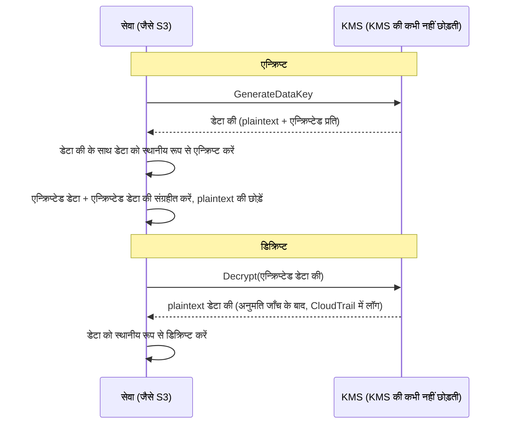

# अध्याय 16: कुंजियाँ, ताले और सीक्रेट्स

गिट रिपॉज़िटरी में दो साल पुराने हज़ारों कमिट थे। लियो बीस मिनट से स्क्रॉल कर रहा था, इतिहास के माध्यम से एक धागे का पीछा करते हुए—यह देखने के लिए कि एक निश्चित डेटाबेस कनेक्शन स्ट्रिंग पहली बार कब दिखाई दी थी। वह इसे लगभग चूक गया। यह एक मंगलवार दोपहर को था, दो साधारण कमिट के बीच दबा हुआ, किसी ऐसे व्यक्ति द्वारा पुश किया गया जो तब से कंपनी छोड़ चुका था।

एक डेटाबेस पासवर्ड। सादे पाठ में। इतिहास में।

---

*पिछले अध्याय के नेटवर्क नियंत्रण अब कसे हुए थे। सुरक्षा समूहों ने पार्श्व आवाजाही सीमित की। NACLs ने ज्ञात-खराब IP श्रेणियों को अवरुद्ध किया। परिधि को कठोर किया गया था। लेकिन सुरक्षा ऑडिट ने कुछ ऐसा पाया जिसे परिधि ठीक नहीं कर सकती थी: एक क्रेडेंशियल जो छह महीने से गिट इतिहास में जी रहा था। परिधि सुरक्षा मानती है कि अंदर के सीक्रेट्स सुरक्षित हैं। यह नहीं था।*

---

लियो गिट इतिहास की समीक्षा कर रहा था जब उसे यह मिला। एक डेटाबेस पासवर्ड। छह महीने पहले, सादे पाठ में, किसी ऐसे व्यक्ति द्वारा कमिट किया गया जो अब Nimbus में काम नहीं करता था—एक `.env` फ़ाइल का हिस्सा जिसमें तैनाती पाइपलाइन की IAM एक्सेस की भी थी, कनेक्शन स्ट्रिंग से दो लाइन नीचे। कमिट सार्वजनिक था। पासवर्ड तब से बदल दिया गया था—लेकिन वे यह निश्चित रूप से नहीं जानते थे। उन्होंने हर उस सिस्टम की जाँच की जिसे किसी भी क्रेडेंशियल ने कभी छुआ था। इसमें चार घंटे लगे। उस दिन Nimbus ने सीक्रेट्स को कोड में रखना बंद करने का फ़ैसला किया।

"क्या हमने सोचा है कि अगर कोई रिपॉज़िटरी को फ़ोर्क करता है तो क्या होगा?" प्रिया ने कहा। "गिट इतिहास स्थायी है। भले ही हम पासवर्ड बदल दें, जिसने भी सुधार से पहले रिपॉज़िटरी क्लोन की, उसके स्थानीय इतिहास में अभी भी पुराना क्रेडेंशियल है।"

"हमने जाँचा," लियो ने कहा। "पासवर्ड तीन महीने पहले बदला गया था। सभी सिस्टम की पुष्टि हुई।"

"वह न्यूनतम है," प्रिया ने कहा। "लेकिन हर उस सिस्टम की समीक्षा करनी होगी जिसे उस क्रेडेंशियल ने छुआ। केवल वे नहीं जिनके बारे में तुम जानते हो।"

**चार घंटे का ऑडिट**

लियो ने सुबह 10 बजे गिट इतिहास में लीक हुई `.env` फ़ाइल पाई थी। दोपहर 2 बजे तक, उनके पास उस प्रश्न का उत्तर था जो मायने रखता था: क्या किसी भी क्रेडेंशियल—डेटाबेस पासवर्ड या उसके साथ कमिट की गई एक्सेस की—का उपयोग Nimbus सिस्टम के अलावा किसी और ने किया था?

ऑडिट चार श्रेणियों से होकर गुज़रा।

**RDS एक्सेस लॉग**: डेटाबेस से हर कनेक्शन, टाइमस्टैम्प और लॉग किया गया। लीक हुआ पासवर्ड तीन कनेक्शन स्ट्रिंग में दिखाई दिया—सभी Nimbus VPC में EC2 इंस्टेंस से, सभी अपेक्षित स्रोत IPs के साथ। कोई बाहरी कनेक्शन नहीं। पासवर्ड का उपयोग बाहर से डेटाबेस से जुड़ने के लिए नहीं किया गया था।

**S3 एक्सेस लॉग**: लीक हुई एक्सेस की तैनाती पाइपलाइन के IAM उपयोगकर्ता की थी, जिसके पास `nimbus-receipts` बकेट के लिए अनुमतियाँ थीं। लियो ने पिछले छह महीनों के लिए S3 सर्वर एक्सेस लॉग की क्वेरी की। हर पहुँच `us-west-2` EC2 इंस्टेंस से या CloudFront origin fetch भूमिका से आई। कोई विसंगति नहीं।

**CloudTrail API कॉल**: लीक हुई एक्सेस की ID के साथ किया गया हर AWS API कॉल। लियो ने की के लिए CloudTrail इवेंट्स फ़िल्टर किए। तीन सौ बारह इवेंट्स—सभी तैनाती पाइपलाइन से नियमित `s3:PutObject` कॉल, सभी एक ही IP से, सभी व्यावसायिक घंटों के भीतर। की का उपयोग केवल एक IP पते से किया गया था, जो CI/CD सर्वर से मेल खाता था।

"और CI/CD सर्वर," प्रिया ने कहा, "VPC के अंदर है। इसे एक बाहरी एंडपॉइंट पर HTTPS के माध्यम से डेटा बाहर निकालना पड़ता, और हम इसे फ़्लो लॉग में देखते।"

"हमने जाँचा," लियो ने कहा। "पिछले छह महीनों में उस सर्वर से गैर-AWS IPs पर कोई आउटबाउंड HTTPS नहीं।"

**फ़ैसला**: किसी भी क्रेडेंशियल का उपयोग Nimbus टीम के बाहर किसी ने नहीं किया था। एक्सपोज़र एक जोखिम था, उल्लंघन नहीं।

"लेकिन हम निश्चित नहीं हो सकते," प्रिया ने कहा। "हम लॉग के आधार पर यथोचित रूप से आश्वस्त हो सकते हैं। हम निश्चित नहीं हो सकते। वह अंतर मायने रखता है।"

"हमें निश्चित क्या बनाएगा?"

"एक क्रेडेंशियल एक्सपोज़र के बाद कुछ भी तुम्हें निश्चित नहीं बनाता। तुम क्रेडेंशियल को घुमाते हो, पहुँच का ऑडिट करते हो, अपने निष्कर्षों का दस्तावेज़ीकरण करते हो, और बेहतर नियंत्रणों के साथ आगे बढ़ते हो। निश्चितता उपलब्ध नहीं है।"

टॉम बातचीत के दौरान गणना कर रहा था। "तीन इंजीनियरों के चार घंटे का समय। इसे पूरी तरह लोडेड लागत में चार हज़ार डॉलर कह दो। साथ ही क्रेडेंशियल रोटेशन, दस्तावेज़ीकरण, घटना का विवरण।"

"और यह सिर्फ़ जाँच है," प्रिया ने कहा। "एक उल्लंघन परिमाण के क्रमों में अधिक होता। नियामक अधिसूचनाएँ। ग्राहक संचार। संभावित जुर्माने।"

"तो चार हज़ार डॉलर का सबक सस्ता था," टॉम ने कहा।

"काफ़ी," प्रिया ने कहा। "इसे न दोहराएँ।"

---

**दो समस्याएँ: सीक्रेट्स संग्रहीत करना और डेटा एन्क्रिप्ट करना**

संवेदनशील जानकारी के आसपास सुरक्षा की दो अलग समस्याएँ हैं:

**क्रेडेंशियल्स संग्रहीत करना** (डेटाबेस पासवर्ड, API कीज़, कनेक्शन स्ट्रिंग): ये कहाँ रहते हैं? कौन इन्हें एक्सेस कर सकता है? आप इन्हें अपने एप्लिकेशन को फिर से तैनात किए बिना कैसे घुमाते हैं?

**डेटा एन्क्रिप्ट करना** (ग्राहक जानकारी, भुगतान रिकॉर्ड, PII): आप यह कैसे सुनिश्चित करते हैं कि भले ही किसी को आपके डेटाबेस या S3 बकेट तक अनधिकृत पहुँच मिल जाए, वे डेटा नहीं पढ़ सकें?

AWS के पास प्रत्येक समस्या के लिए एक समर्पित सेवा है:

- **AWS Secrets Manager**: क्रेडेंशियल्स को सुरक्षित रूप से संग्रहीत और प्रबंधित करता है
- **AWS KMS (Key Management Service)**: डेटा को एन्क्रिप्ट और डिक्रिप्ट करने के लिए एन्क्रिप्शन कुंजियों का प्रबंधन करता है

Secrets Manager को एक चाबी के गुच्छे (keychain) के रूप में सोचें: यह आपकी कुंजियाँ (क्रेडेंशियल्स) रखता है, उन्हें व्यवस्थित रखता है, और उन्हें एक शेड्यूल पर घुमाता है। KMS को एक तिजोरी के रूप में सोचें: यह मूल्यवान चीज़ नहीं रखता—यह वह कुंजी रखता है जो मूल्यवान चीज़ की रक्षा करने वाले ताले को खोलती है।

**AWS Secrets Manager: अब और हार्डकोडेड क्रेडेंशियल्स नहीं**

Secrets Manager सीक्रेट्स के लिए एक सुरक्षित भंडार है: डेटाबेस क्रेडेंशियल्स, API कीज़, OAuth टोकन, SSH कीज़, या कुछ भी संवेदनशील।

आपके एप्लिकेशन के एक पर्यावरण चर या कॉन्फ़िग फ़ाइल से पासवर्ड पढ़ने के बजाय, यह स्टार्टअप पर (या ज़रूरत पड़ने पर) Secrets Manager API को कॉल करता है और सीक्रेट प्राप्त करता है। सीक्रेट कभी डिस्क को नहीं छूता। यह आपके कोड में कभी प्रकट नहीं होता। यह आपके पर्यावरण चर में नहीं है।

प्रवाह इस तरह दिखता है:

**पुराना तरीका**:
```
DB_PASSWORD=supersecretpassword123  # in .env file or environment variable
```

**Secrets Manager तरीका**:
```python
import boto3
client = boto3.client('secretsmanager')
secret = client.get_secret_value(SecretId='nimbus/production/db-password')
password = json.loads(secret['SecretString'])['password']
```

EC2 इंस्टेंस को उस विशिष्ट सीक्रेट के लिए `secretsmanager:GetSecretValue` कॉल करने की अनुमति वाली एक IAM भूमिका चाहिए। कोई अन्य सेवा इसे पढ़ नहीं सकती। सीक्रेट कभी कोड में नहीं होता।

आप सोच रहे होंगे: बस पर्यावरण चर का उपयोग क्यों न करें? वे सरल हैं—उन्हें तैनाती के समय सेट करें, और एप्लिकेशन उन्हें पढ़ता है। पर्यावरण चर छिपे हुए लगते हैं, लेकिन वे आपके तैनाती कॉन्फ़िगरेशन में, CI/CD सीक्रेट्स स्टोर में संग्रहीत होते हैं, संभवतः डिबग सत्रों के दौरान लॉग किए जाते हैं, और चल रही प्रक्रिया तक पहुँच रखने वाले किसी भी व्यक्ति को दिखाई देते हैं। अधिक महत्वपूर्ण रूप से, वे स्थिर हैं: एक बार सेट होने पर, वे तब तक नहीं बदलते जब तक कोई उन्हें मैन्युअल रूप से अपडेट न करे। Secrets Manager क्रेडेंशियल्स को IAM पहुँच नियंत्रण, CloudTrail के माध्यम से पूर्ण ऑडिट लॉगिंग, और स्वचालित रोटेशन के साथ एक एन्क्रिप्टेड सेवा में संग्रहीत करता है। पर्यावरण चर नहीं घूमते। एक लीक हुआ पर्यावरण चर तब तक मान्य रहता है जब तक कोई इसे मैन्युअल रूप से न बदले।

**स्वचालित रोटेशन: असली ताकत**

Secrets Manager की सबसे बड़ी विशेषता सीक्रेट्स संग्रहीत करना नहीं है—यह उन्हें स्वचालित रूप से घुमाना है।

परिदृश्य यह है: हर 30 दिन में, Secrets Manager एक नया डेटाबेस पासवर्ड उत्पन्न करता है, इसे RDS में अपडेट करता है, संग्रहीत सीक्रेट अपडेट करता है, और आपका एप्लिकेशन अगली बार ज़रूरत पड़ने पर नया पासवर्ड प्राप्त करता है। कोई मैन्युअल हस्तक्षेप नहीं। कोई तैनाती नहीं। कोई "मुझे इसे घुमाना याद रखना है" नहीं।

रोटेशन को एक Lambda फ़ंक्शन के रूप में लागू किया जाता है। AWS RDS डेटाबेस (MySQL, PostgreSQL, Aurora) के लिए टेम्पलेट प्रदान करता है। आप किसी भी क्रेडेंशियल प्रकार के लिए फ़ंक्शन को अनुकूलित कर सकते हैं।

"वह प्रति माह कितना खर्च होता है?" टॉम ने पूछा।

Secrets Manager प्रति सीक्रेट प्रति माह प्लस प्रति API कॉल शुल्क लेता है। कुछ डेटाबेस पासवर्ड और API कीज़ की छोटी संख्या के लिए, लागत प्रति माह कुछ डॉलर है—एक घटना की लागत की तुलना में नगण्य।

"पिछले सप्ताह का समझौता," प्रिया ने कहा, "जाँच और सुधार में कितना खर्च होता?"

टॉम एक पल के लिए चुप रहा। "मेरा समय, तुम्हारा समय, लियो का सप्ताहांत मिलाकर... कुछ हज़ार डॉलर।"

"Secrets Manager स्थिर की को इसका शोषण होने से पहले पकड़ लेता। और इसे स्वचालित रूप से घुमा देता।"

टॉम ने मूल्य निर्धारण पृष्ठ खोला।

**रोटेशन के दौरान क्या होता है**

"रुको—लेकिन हम *क्यों* इसे उस तरह करेंगे?" माया ने पूछा। "अगर डेटाबेस पासवर्ड घूमता है, तो क्या एप्लिकेशन टूट जाता है? यह बिना तैनाती के नया पासवर्ड कैसे उठाता है?"

यह एक वैध चिंता थी। बिना व्यवधान के रोटेशन के लिए सावधानी चाहिए।

Secrets Manager रोटेशन चरणों में काम करता है—"पुराना पासवर्ड अचानक अमान्य, एप्लिकेशन क्रैश" परिदृश्य को रोकने के लिए डिज़ाइन किया गया:

**चरण 1: नया सीक्रेट संस्करण बनाएँ।** Secrets Manager एक नया पासवर्ड उत्पन्न करता है और इसे सीक्रेट के एक लंबित (pending) संस्करण के रूप में संग्रहीत करता है। वर्तमान संस्करण अभी भी सक्रिय है।

**चरण 2: सेवा पर सेट करें।** रोटेशन Lambda पासवर्ड को नए मान पर अपडेट करने के लिए डेटाबेस को कॉल करता है। ध्यान दें: डिफ़ॉल्ट **single-user** रोटेशन रणनीति के साथ एक संक्षिप्त क्षण होता है जब पुराना पासवर्ड बस काम करना बंद कर चुका होता है (PostgreSQL का `ALTER ROLE ... PASSWORD` तुरंत प्रभावी होता है) और नया संस्करण अभी वर्तमान नहीं है। शून्य-डाउनटाइम रोटेशन के लिए, Secrets Manager एक **alternating-users** रणनीति का समर्थन करता है: समान अनुमतियों वाले दो डेटाबेस उपयोगकर्ता, जहाँ रोटेशन हमेशा *निष्क्रिय* वाले को अपडेट करता है और फिर स्विच करता है—सक्रिय क्रेडेंशियल्स कभी बीच में अमान्य नहीं होते। याद रखने वाला परीक्षा वाक्यांश है "alternating users rotation strategy।"

**चरण 3: नए सीक्रेट का परीक्षण करें।** रोटेशन Lambda इससे जुड़कर सत्यापित करता है कि नया पासवर्ड काम करता है। यदि यह विफल होता है, तो रोटेशन वापस रोल किया जाता है।

**चरण 4: समाप्त करें।** Secrets Manager नए संस्करण को वर्तमान संस्करण के रूप में चिह्नित करता है और पुराने संस्करण को पिछले संस्करण में अवनत करता है। पिछला संस्करण एक छूट अवधि (grace period) के लिए रखा जाता है।

छूट अवधि के दौरान, दोनों संस्करण प्राप्त किए जा सकते हैं। यदि आपके एप्लिकेशन ने पुराने सीक्रेट को कैश किया है और अभी तक नया नहीं उठाया है, तो यह फिर भी जुड़ सकता है। अगली बार जब यह `GetSecretValue` कॉल करता है, तो इसे वर्तमान (नया) संस्करण मिलता है।

"तो एप्लिकेशन को कभी पुनः आरंभ करने की ज़रूरत नहीं होती," लियो ने कहा।

"ज़रूरी नहीं। अगर तुम्हारा एप्लिकेशन स्टार्टअप पर सीक्रेट कैश करता है और इसे कभी ताज़ा नहीं करता, तो तुम्हें या तो इसे एक शेड्यूल पर ताज़ा करना होगा या सीक्रेट को फिर से लाकर प्रमाणीकरण विफलताओं को संभालना होगा।"

"तो रोटेशन Lambda और एप्लिकेशन को सहयोग करने की ज़रूरत है," माया ने कहा।

"Secrets Manager अपना आधा करता है। तुम्हारे एप्लिकेशन कोड को दूसरा आधा करना होगा: ज़रूरत पड़ने पर सीक्रेट लाना, फिर से लाकर प्रमाणीकरण विफलताओं को संभालना।"

लियो ने एप्लिकेशन को डेटाबेस प्रमाणीकरण अपवादों को पकड़ने और, विफलता पर, फिर से कोशिश करने से पहले Secrets Manager से एक ताज़ा सीक्रेट लाने के लिए अपडेट किया। दो लाइन त्रुटि हैंडलिंग। रोटेशन उपयोगकर्ताओं के लिए अदृश्य हो गया।

---

**CI/CD पाइपलाइन सीक्रेट्स इंजेक्शन**

"क्या हमने सोचा है कि तैनाती पाइपलाइन को ज़रूरी सीक्रेट्स कैसे मिलते हैं?" प्रिया ने पूछा। "पाइपलाइन अवसंरचना तैनात करती है। इसे AWS क्रेडेंशियल्स चाहिए। इसे माइग्रेशन स्क्रिप्ट के लिए डेटाबेस कनेक्शन स्ट्रिंग चाहिए हो सकती है।"

लियो ने मौजूदा सेटअप समझाया: सीक्रेट्स GitHub Actions Secrets के रूप में संग्रहीत थे—GitHub में आराम में एन्क्रिप्टेड, रनटाइम पर पर्यावरण चर के रूप में इंजेक्ट किए गए।

"क्रेडेंशियल्स GitHub में हैं," प्रिया ने कहा।

"एन्क्रिप्टेड।"

"एक तृतीय-पक्ष प्रणाली में। एक GitHub उल्लंघन हमारे सभी पाइपलाइन सीक्रेट्स को उजागर कर देता है।"

समाधान: तैनाती पाइपलाइन OIDC फ़ेडरेशन (अध्याय 14 में शामिल) के माध्यम से AWS को प्रमाणित करती है और रनटाइम पर Secrets Manager से ज़रूरी सीक्रेट्स प्राप्त करती है। GitHub में कोई सीक्रेट्स संग्रहीत नहीं। पाइपलाइन की AWS भूमिका के पास विशिष्ट सीक्रेट्स पढ़ने की अनुमति है, और कुछ नहीं।

```yaml
# GitHub Actions workflow
- name: Get DB Migration Credentials
  env:
    AWS_DEFAULT_REGION: us-west-2
  run: |
    SECRET=$(aws secretsmanager get-secret-value \
      --secret-id nimbus/staging/db-migration \
      --query SecretString --output text)
    DB_URL=$(echo $SECRET | jq -r '.url')
    # Run migration with DB_URL — never stored in a file
    flyway -url="$DB_URL" migrate
```

सीक्रेट लाया जाता है, मेमोरी में उपयोग किया जाता है, और छोड़ दिया जाता है। यह कभी डिस्क पर नहीं लिखा जाता, कभी ऐसे पर्यावरण चर में संग्रहीत नहीं होता जो जॉब के बाद बने रहते हैं, कभी लॉग फ़ाइल में नहीं।

"अगर सीक्रेट लॉग में प्रिंट हो जाए तो?" लियो ने पूछा।

"GitHub Actions उन सीक्रेट्स के मानों को स्वचालित रूप से मास्क करता है जो GitHub Secrets के रूप में कॉन्फ़िगर किए गए हैं। लेकिन यह सीक्रेट GitHub Secret नहीं है—यह Secrets Manager से आता है। तुम्हें इसे मैन्युअल रूप से मास्क करना होगा, या बेहतर, इसे कभी लॉग न करो।"

"तो अनुशासन है: लाओ, उपयोग करो, छोड़ दो। कभी सीक्रेट्स लॉग न करो। कभी उन्हें फ़ाइलों में संग्रहीत न करो।"

"वह अनुशासन," प्रिया ने कहा, "ही वह है जिस पर चार घंटे के ऑडिट ने पुष्टि की कि हम विफल हो रहे थे।"


**AWS KMS: ताला कारख़ाना**

"रुको—लेकिन हम *क्यों* इसे उस तरह करेंगे?" माया ने पूछा। "एक अलग कुंजी प्रबंधन सेवा क्यों? क्या हम बस खुद डेटा एन्क्रिप्ट करके की को Secrets Manager में संग्रहीत नहीं कर सकते?"

आप एन्क्रिप्शन कुंजियाँ Secrets Manager में संग्रहीत कर सकते हैं। लेकिन फिर की तक पहुँच को कौन नियंत्रित करता है? क्या सुनिश्चित करता है कि की घुमाई जाती है? एक ऑडिटर को क्या साबित करता है कि की का उपयोग केवल अधिकृत सेवाओं द्वारा किया गया था? KMS इन सभी प्रश्नों का उत्तर देता है। यह केवल भंडारण नहीं है—यह हार्डवेयर-समर्थित सुरक्षा, प्रति की बारीक IAM नीतियों, और हर उपयोग के पूर्ण ऑडिट ट्रेल के साथ एक की लाइफ़साइकल प्रबंधन सेवा है। Secrets Manager वह संग्रहीत करता है जो आपको सिस्टम से जुड़ने के लिए चाहिए। KMS स्वयं सिस्टम की रक्षा करता है।

AWS KMS (Key Management Service) **क्रिप्टोग्राफ़िक कुंजियों** का प्रबंधन करता है—डेटा को एन्क्रिप्ट और डिक्रिप्ट करने के लिए उपयोग किए जाने वाले गुप्त मान।

उपमा: KMS एक लॉकबॉक्स कंपनी की तरह है जो मास्टर की रखती है। आपका डेटा (बॉक्स की सामग्री) एन्क्रिप्टेड है। केवल KMS की का उपयोग करने की अनुमति वाला कोई व्यक्ति ही इसे डिक्रिप्ट कर सकता है। KMS हर की के हर उपयोग को CloudTrail में लॉग करता है।

**Customer Master Keys (CMKs)**—जिन्हें अब KMS keys कहा जाता है—तीन प्रकार के स्वामित्व में आती हैं:

**AWS owned keys**: ऐसी कुंजियाँ जो AWS के स्वामित्व में हैं और कई ग्राहक खातों भर में उपयोग की जाती हैं—आप उन्हें कभी नहीं देखते, कभी उनके लिए भुगतान नहीं करते, और वे आपके खाते में दिखाई नहीं देतीं। कई सेवा डिफ़ॉल्ट उनका उपयोग करते हैं (उदाहरण के लिए, DynamoDB का डिफ़ॉल्ट एन्क्रिप्शन)।

(एक अंतर जिसे सीधा रखना उचित है: S3 का डिफ़ॉल्ट **SSE-S3** एन्क्रिप्शन बिल्कुल KMS की मॉडल नहीं है—S3 अपनी AES-256 कुंजियों को पूरी तरह KMS के बाहर प्रबंधित करता है, बिना देखने के लिए की और बिना की-उपयोग ऑडिट ट्रेल के। **SSE-KMS** वह S3 विकल्प है जो KMS से होकर जाता है, या तो AWS managed key `aws/s3` या एक customer-managed key का उपयोग करते हुए। परीक्षा ट्रिगर: "ऑडिट करें कि एन्क्रिप्शन की का उपयोग किसने किया" या "रोटेशन और की पॉलिसी को नियंत्रित करें" → एक customer-managed key के साथ SSE-KMS—हर उपयोग CloudTrail में आता है।)

**AWS managed keys**: AWS S3, EBS, RDS जैसी सेवाओं के लिए की को स्वचालित रूप से *आपके खाते में* बनाता और प्रबंधित करता है (`aws/s3` जैसे नाम वाली)। आप इसे देख सकते हैं और CloudTrail में इसके उपयोग का ऑडिट कर सकते हैं, लेकिन आप इसकी नीति या रोटेशन नहीं बदल सकते—AWS इसे हर साल स्वचालित रूप से घुमाता है। मुफ़्त।

**Customer managed keys**: आप KMS में की बनाते हैं और इसके हर पहलू को नियंत्रित करते हैं: इसका उपयोग कौन कर सकता है, यह कब घूमती है, इसे कौन प्रशासित कर सकता है। आप 90 दिन और 2,560 दिन (7 साल) के बीच एक कॉन्फ़िगर करने योग्य अवधि के साथ स्वचालित की रोटेशन सक्षम कर सकते हैं; डिफ़ॉल्ट रोटेशन अवधि 365 दिन (वार्षिक) है। आप तुरंत एक **on-demand rotation** भी ट्रिगर कर सकते हैं—एक संदिग्ध एक्सपोज़र के बाद उपयोगी, शेड्यूल का इंतज़ार किए बिना। ध्यान दें: स्वचालित रोटेशन KMS-जनित सामग्री वाली सममित कुंजियों पर लागू होता है—असममित कुंजियाँ और आयातित की सामग्री स्वतः-घूम नहीं सकतीं। लागत: प्रति की प्रति माह $1 प्लस प्रति-API-कॉल शुल्क।

यदि आप customer-managed KMS keys चुनते हैं, तो आपको रोटेशन शेड्यूल, पहुँच नीतियों, और ऑडिट दृश्यता पर पूर्ण नियंत्रण मिलता है, लेकिन आप प्रति की प्रति माह भुगतान करते हैं और की प्रबंधन की ज़िम्मेदारी लेते हैं; यदि आप AWS-managed keys चुनते हैं, तो आपको शून्य परिचालन ओवरहेड और की के लिए कोई लागत के बिना एन्क्रिप्शन मिलता है, लेकिन आप रोटेशन शेड्यूल या की नीतियों को अनुकूलित नहीं कर सकते—वे पूरी तरह AWS द्वारा प्रबंधित होते हैं।

**AWS सेवाओं में एन्क्रिप्शन: KMS एकीकरण**

अधिकांश AWS सेवाएँ एन्क्रिप्शन के लिए KMS के साथ एकीकृत होती हैं:

**S3**: एक बकेट पर "KMS के साथ सर्वर-साइड एन्क्रिप्शन" सक्षम करें। हर ऑब्जेक्ट एक KMS की के साथ आराम में एन्क्रिप्टेड होता है। एक ऑब्जेक्ट पढ़ने के लिए S3 बकेट *और* KMS की दोनों की अनुमति चाहिए।

**RDS**: निर्माण के समय एन्क्रिप्शन सक्षम करें। डेटाबेस भंडारण, बैकअप, और स्नैपशॉट सभी एक KMS की के साथ एन्क्रिप्टेड होते हैं। ध्यान दें: एक मौजूदा अनएन्क्रिप्टेड RDS इंस्टेंस पर एन्क्रिप्शन सक्षम नहीं किया जा सकता—आपको स्नैपशॉट लेना होगा, एन्क्रिप्शन सक्षम के साथ स्नैपशॉट कॉपी करना होगा, और पुनर्स्थापित करना होगा।

**EBS**: KMS के साथ वॉल्यूम एन्क्रिप्ट करें। एन्क्रिप्टेड स्नैपशॉट से बनाए गए नए वॉल्यूम स्वचालित रूप से एन्क्रिप्टेड होते हैं।

**DynamoDB**: KMS का उपयोग करके आराम में एन्क्रिप्शन सभी तालिकाओं पर डिफ़ॉल्ट रूप से सक्षम है।

**ElastiCache Redis**: संवेदनशील कैश किए गए डेटा के लिए KMS के साथ आराम में एन्क्रिप्शन।

सिद्धांत: डेटा को आराम में (डिस्क पर संग्रहीत) और परिवहन में (एक नेटवर्क भर में चलते हुए) एन्क्रिप्ट किया जाना चाहिए। KMS आराम-में एन्क्रिप्शन संभालता है। TLS/SSL (AWS सेवाओं द्वारा स्वचालित रूप से प्रदान किया गया) परिवहन-में एन्क्रिप्शन संभालता है।

**Envelope Encryption: KMS असल में कैसे काम करता है**

यहाँ एक विवरण है जो आपको KMS व्यवहार और परीक्षा प्रश्नों को समझने में मदद करता है।

KMS अधिकांश मामलों में आपके डेटा को सीधे एन्क्रिप्ट नहीं करता। यह **envelope encryption** का उपयोग करता है:

1. KMS एक **data key** उत्पन्न करता है (एक अद्वितीय सममित की)
2. सेवा आपके डेटा को स्थानीय रूप से एन्क्रिप्ट करने के लिए data key का उपयोग करती है (तेज़—सममित एन्क्रिप्शन)
3. सेवा KMS से डेटा की को स्वयं एन्क्रिप्ट करने को कहती है (आपकी KMS की का उपयोग करते हुए)
4. एन्क्रिप्टेड डेटा और एन्क्रिप्टेड डेटा की दोनों संग्रहीत किए जाते हैं
5. आपका वास्तविक डेटा कभी सेवा को नहीं छोड़ता—केवल डेटा की एन्क्रिप्शन/डिक्रिप्शन के लिए KMS को जाती है

जब आप डेटा पढ़ते हैं:

1. सेवा KMS से डेटा की को डिक्रिप्ट करने को कहती है
2. KMS अनुमतियाँ जाँचता है, डेटा की डिक्रिप्ट करता है, उसे लौटाता है
3. सेवा आपके डेटा को स्थानीय रूप से डिक्रिप्ट करने के लिए डिक्रिप्ट की गई डेटा की का उपयोग करती है



इसका मतलब है कि KMS बहुत बड़े डेटा को बिना इसे सब KMS API के माध्यम से भेजे संभाल सकता है। केवल छोटी कुंजियाँ KMS को जाती हैं। CloudTrail हर KMS API कॉल को लॉग करता है—हर एन्क्रिप्ट और डिक्रिप्ट ऑपरेशन।

**KMS Key Policies: पहुँच मॉडल**

"क्या हमने सोचा है कि अगर एक IAM नीति और एक की पॉलिसी टकराएँ तो क्या होगा?" प्रिया ने पूछा। "KMS के पास IAM के ऊपर अपना खुद का पहुँच नियंत्रण है।"

KMS keys के पास **key policies** होती हैं—की से ही संलग्न संसाधन-आधारित नीतियाँ। वे IAM नीतियों से अलग हैं और अलग मूल्यांकन नियमों का पालन करती हैं।

एक प्रिंसिपल के लिए एक KMS की का उपयोग करने के लिए, दो चीज़ें सच होनी चाहिए:

**पहला**: की पॉलिसी को इसकी अनुमति देनी चाहिए। यदि की पॉलिसी स्पष्ट रूप से प्रिंसिपल को पहुँच नहीं देती, तो वे की का उपयोग नहीं कर सकते—चाहे उनकी IAM नीति कुछ भी कहे। यह अधिकांश AWS संसाधनों से अलग है, जहाँ अकेले IAM नीतियाँ पर्याप्त हैं।

**दूसरा**: प्रिंसिपल की IAM नीति को KMS क्रिया (जैसे `kms:Decrypt`, `kms:GenerateDataKey`) की अनुमति देनी चाहिए।

दोनों को हाँ कहना चाहिए। किसी एक के भी नहीं कहने का मतलब है कि क्रिया अस्वीकृत है।

AWS द्वारा customer-managed keys के लिए बनाई गई डिफ़ॉल्ट की पॉलिसी में एक कथन शामिल होता है जो कहता है "root खाता इस की को प्रबंधित कर सकता है।" यह महत्वपूर्ण है: इसका मतलब है कि एक खाता-स्तरीय IAM प्रशासक हमेशा एक की तक पहुँच दे सकता है, भले ही की पॉलिसी उन्हें सीधे नाम न दे—क्योंकि root खाता प्रत्यायोजन (delegation) मौजूद है।

"तो अगर हम की पॉलिसी से root खाता हटा दें," लियो ने पूछा, "तो उस की के लिए IAM नीतियाँ काम करना बंद कर देती हैं?"

"सही। root खाता प्रत्यायोजन हटाना एक की को इतना कसकर लॉक करने का तरीका है कि केवल की पॉलिसी में नामित विशिष्ट प्रिंसिपल ही इसका उपयोग कर सकें—खाता प्रशासक भी नहीं। यह अपनी खुद की की से गलती से खुद को बाहर कर लेने का भी तरीका है।"

"क्या हम पुनर्प्राप्त कर सकते हैं?"

"केवल AWS Support से संपर्क करके। यदि कोई की का उपयोग नहीं कर सकता और की पॉलिसी अपडेट नहीं की जा सकती, तो उस की से एन्क्रिप्ट किया गया डेटा प्रभावी रूप से दुर्गम है।"

"तो किसी अत्यंत अच्छे कारण के बिना की पॉलिसी से root खाता न हटाएँ।"

"सही।"

---

**असममित कुंजियाँ: हस्ताक्षर और सत्यापन**

KMS असममित की जोड़ियों का भी समर्थन करता है—एक सार्वजनिक की और एक निजी की।

उपयोग के मामले:

**डिजिटल हस्ताक्षर**: आप एक दस्तावेज़ या एक JWT टोकन को निजी की से हस्ताक्षरित करते हैं। सार्वजनिक की वाला कोई भी सत्यापित कर सकता है कि हस्ताक्षर निजी की के धारक से आया, और सामग्री से छेड़छाड़ नहीं हुई।

**सार्वजनिक की एन्क्रिप्शन**: कोई भी सार्वजनिक की से डेटा एन्क्रिप्ट कर सकता है। केवल निजी की का धारक ही इसे डिक्रिप्ट कर सकता है।

Nimbus के लिए, असममित कुंजियाँ तब प्रासंगिक हुईं जब उन्होंने रेस्तरां पार्टनरों के लिए एक webhook हस्ताक्षर प्रणाली लागू की। जब Nimbus एक रेस्तरां पार्टनर के सर्वर को एक इवेंट भेजता था (एक नया ऑर्डर, एक स्थिति अपडेट), तो पार्टनर को सत्यापित करने की ज़रूरत होती थी कि इवेंट वास्तव में Nimbus से आया था और जाली नहीं था।

कार्यान्वयन:

1. Nimbus एक असममित KMS की बनाता है (RSA 2048-बिट, SIGN_VERIFY एल्गोरिथम)
2. एक webhook भेजते समय, Nimbus इवेंट पेलोड पर हस्ताक्षर करने के लिए निजी की के साथ `kms:Sign` कॉल करता है
3. हस्ताक्षर webhook हेडर में शामिल होता है
4. Nimbus सार्वजनिक की प्रकाशित करता है (KMS कंसोल से डाउनलोड करने योग्य)
5. रेस्तरां पार्टनर का सर्वर सार्वजनिक की लाता है और हर आने वाले webhook पर हस्ताक्षर सत्यापित करने के लिए इसका उपयोग करता है

निजी की कभी KMS को नहीं छोड़ती। Nimbus के पास कभी कच्ची निजी की सामग्री तक पहुँच नहीं होती। KMS हस्ताक्षर ऑपरेशन अपने hardware security module के अंदर करता है।

"तो भले ही किसी ने एक Nimbus सर्वर से समझौता कर लिया," राफेल ने कहा, "वे एक webhook हस्ताक्षर जाली नहीं बना सकते। निजी की KMS में है, किसी सर्वर पर नहीं।"

"सही। हस्ताक्षर के लिए एक KMS API कॉल चाहिए। हर API कॉल CloudTrail में लॉग होता है। यदि किसी ने एक धोखाधड़ी वाले इवेंट पर हस्ताक्षर करने की कोशिश की, तो हम API कॉल देखेंगे।"

---

**की डिलीशन कहानी**

KMS सेटअप के तीन महीने बाद, टॉम ने एक गलती की।

वह अप्रयुक्त AWS संसाधनों को साफ़ कर रहा था—पुराने Lambda फ़ंक्शन, बासी S3 बकेट, परित्यक्त CloudWatch डैशबोर्ड। वह तेज़ी से आगे बढ़ रहा था। उसने गलती से एक KMS की को डिलीशन के लिए शेड्यूल कर दिया।

की `nimbus/prod/order-receipts` थी—ऑर्डर रसीद S3 बकेट को एन्क्रिप्ट करने के लिए उपयोग की गई customer-managed की।

"मैंने कल बारह संसाधन बैच-डिलीट किए और जाँच नहीं की कि बारहवाँ क्या था," टॉम ने सपाट कहा। उसने डिलीशन शेड्यूल किया था और आगे बढ़ गया था। उसने अगली सुबह अपनी क्रियाओं की समीक्षा करते समय गलती देखी।

उसने KMS कंसोल खोला। की स्थिति पढ़ रही थी: "Pending deletion. Deletion in 7 days।"

उसने इसे न्यूनतम प्रतीक्षा अवधि के लिए शेड्यूल किया था।

"क्या हम इसे रद्द कर सकते हैं?" उसने पूछा।

प्रिया ने दस्तावेज़ खोले। "हाँ। प्रतीक्षा अवधि के दौरान, की अक्षम है लेकिन डिलीट नहीं हुई। तुम डिलीशन रद्द कर सकते हो।"

टॉम ने एक मिनट के भीतर डिलीशन रद्द कर दिया। की सक्रिय स्थिति में बहाल हो गई।

"सात दिन न्यूनतम प्रतीक्षा अवधि है," प्रिया ने कहा। "AWS इसे लागू करता है क्योंकि अगर एक की डिलीट हो जाती है और उससे डेटा एन्क्रिप्ट किया गया था, तो वह डेटा हमेशा के लिए चला जाता है। अपुनर्प्राप्य। प्रतीक्षा अवधि तुम्हें गलती को महसूस करने का समय देती है।"

"प्रतीक्षा अवधि कितनी लंबी होनी चाहिए?"

"अधिकतम तीस दिन है। उत्पादन डेटा एन्क्रिप्ट करने वाली किसी भी की के लिए, तीस दिन का उपयोग करो। दुर्घटनाओं के विरुद्ध तीन अतिरिक्त सप्ताह की सुरक्षा मामूली असुविधा के लायक है।"

टॉम ने सभी उत्पादन की डिलीशन सेटिंग्स को तीस दिन में अपडेट किया। उसने एक CloudWatch अलार्म भी सेट किया जो तब चलता अगर किसी KMS की की स्थिति "Pending deletion" में बदल जाए—ताकि अगली बार जब कोई (उसके सहित) वही गलती करे, तो टीम को पाँच मिनट के भीतर पता चल जाए।

---

**Secrets Manager बनाम Parameter Store**

AWS के पास **Systems Manager Parameter Store** भी है, जो कॉन्फ़िगरेशन मान संग्रहीत करता है (केवल सीक्रेट्स नहीं)। Parameter Store सस्ता है—मानक पैरामीटर के लिए मुफ़्त। यह KMS का उपयोग करके एन्क्रिप्टेड पैरामीटर भी संग्रहीत कर सकता है।

रोटेशन की ज़रूरत वाले सीक्रेट्स के लिए: Secrets Manager।

कॉन्फ़िगरेशन मानों और गैर-संवेदनशील पैरामीटर के लिए: Parameter Store (मुफ़्त टियर बहुत उदार है)।

एप्लिकेशन कॉन्फ़िगरेशन (पोर्ट नंबर, फ़ीचर फ़्लैग, पर्यावरण-विशिष्ट सेटिंग्स) के लिए: Parameter Store।

| | Secrets Manager | SSM Parameter Store |
|---|---|---|
| स्वचालित रोटेशन | हाँ (Lambda-समर्थित) | नहीं |
| लागत | ~$0.40/सीक्रेट/माह | मुफ़्त (मानक) |
| एन्क्रिप्शन | हमेशा | वैकल्पिक (KMS के साथ) |
| संस्करणीकरण | हाँ | हाँ |
| क्रॉस-अकाउंट पहुँच | हाँ | सीमित |
| इसके लिए सर्वोत्तम | डेटाबेस पासवर्ड, API कीज़ | कॉन्फ़िग मान, फ़ीचर फ़्लैग |

## दरवाज़े पर प्रमाणपत्र

सीक्रेट्स माइग्रेशन के दो सप्ताह बाद, प्रिया अपने फ़ोन पर Nimbus स्टेजिंग वातावरण की समीक्षा कर रही थी जब उसने एड्रेस बार पर ध्यान दिया।

"Not Secure।"

उसने उत्पादन URL खोला। वही बात।

"लियो," उसने अपना फ़ोन मेज़ पर रखते हुए कहा। "क्या हम HTTP पर चल रहे हैं?"

लियो ने जाँचा। "ALB लिसनर पोर्ट 80 पर है। हमने कभी HTTPS सेट नहीं किया।"

"तो हमारे उपयोगकर्ता जो भी अनुरोध करते हैं—हर ऑर्डर, हर लॉगिन—अनएन्क्रिप्टेड HTTP पर जा रहा है?"

"हमारे पास RDS कनेक्शन पर TLS है," लियो ने पेश किया।

"वह एप्लिकेशन और डेटाबेस के बीच परिवहन में डेटा है। मैं उपयोगकर्ता के ब्राउज़र और हमारे लोड बैलेंसर के बीच परिवहन में डेटा की बात कर रही हूँ। वह बिल्कुल एन्क्रिप्टेड नहीं है।"

टॉम सुन रहा था। "क्या यह एक सुरक्षा समस्या है या एक धारणा समस्या?"

"दोनों," प्रिया ने कहा। "अनएन्क्रिप्टेड HTTP का मतलब है कि उपयोगकर्ता और हमारे सर्वर के बीच का कोई भी नेटवर्क—एक कॉफ़ी शॉप राउटर, एक ISP—ट्रैफ़िक पढ़ सकता है। पासवर्ड, ऑर्डर विवरण, सेशन टोकन। और आधुनिक ब्राउज़र उपयोगकर्ताओं को 'Not Secure' से चेतावनी देते हैं। यह रूपांतरण दरों को मार देता है।"

"तो हमें एक TLS प्रमाणपत्र चाहिए," माया ने कहा। "वह कितना खर्च होता है?"

"कुछ नहीं," प्रिया ने कहा। "AWS Certificate Manager।"

**AWS Certificate Manager (ACM)** AWS-प्रबंधित सेवाओं के साथ उपयोग के लिए मुफ़्त TLS/SSL प्रमाणपत्र प्रावधानित करता है: ALBs, CloudFront वितरण, और API Gateway। आप एक प्रमाणपत्र नहीं खरीदते, एक नवीनीकरण कैलेंडर प्रबंधित नहीं करते, या निजी की सामग्री को नहीं छूते। ACM पूरे प्रमाणपत्र जीवनचक्र को संभालता है।

ACM द्वारा जारी एक प्रमाणपत्र 13 महीनों के लिए मान्य है। इसके समाप्त होने से पहले, ACM इसे स्वचालित रूप से नवीनीकृत करता है। यदि नवीनीकरण सफल होता है, तो नया प्रमाणपत्र आपकी ओर से बिना किसी क्रिया के आपके लोड बैलेंसर या वितरण से संलग्न हो जाता है। ब्राउज़र का ताला हरा रहता है। वह समाप्ति अलर्ट जो आप सेट करना भूल गए, कभी नहीं चलता।

**ACM प्रमाणपत्रों के दो प्रकार**:

**सार्वजनिक प्रमाणपत्र** Amazon के प्रमाणपत्र प्राधिकरण द्वारा जारी किए जाते हैं और सभी प्रमुख ब्राउज़रों द्वारा भरोसेमंद होते हैं। वे ALB, CloudFront, और API Gateway के साथ उपयोग के लिए पूरी तरह मुफ़्त हैं। आप डोमेन के स्वामित्व को या तो DNS या ईमेल के माध्यम से मान्य करते हैं।

**निजी प्रमाणपत्र** AWS Private CA द्वारा जारी किए जाते हैं—एक प्रबंधित निजी प्रमाणपत्र प्राधिकरण जिसे आप आंतरिक सेवाओं (सेवा-से-सेवा mTLS, आंतरिक टूलिंग, VPN क्लाइंट) के लिए चलाते हैं। Private CA की मासिक लागत होती है।

Nimbus के लिए, सार्वजनिक प्रमाणपत्र सही विकल्प थे।

**DNS सत्यापन बनाम ईमेल सत्यापन**:

लियो ने ACM कंसोल खोला और `eatnimbus.com` और `*.eatnimbus.com` के लिए एक प्रमाणपत्र अनुरोध शुरू किया।

"यह पूछ रहा है कि मैं स्वामित्व कैसे मान्य करना चाहता हूँ," उसने कहा। "DNS या ईमेल।"

"DNS," प्रिया ने कहा। "हमेशा DNS।"

DNS सत्यापन के साथ, ACM आपके होस्टेड ज़ोन में एक विशिष्ट CNAME रिकॉर्ड जोड़ता है। Route 53 इसे स्वचालित रूप से कर सकता है—कंसोल में एक क्लिक। जब तक वह CNAME रिकॉर्ड मौजूद है, ACM बिना किसी मानवीय क्रिया के प्रमाणपत्र को स्वतः-नवीनीकृत कर सकता है। ईमेल सत्यापन डोमेन के पंजीकृत संपर्क को एक ईमेल भेजता है और हर बार प्रमाणपत्र नवीनीकृत होने पर एक मैन्युअल क्लिक की ज़रूरत होती है। वह क्लिक भुला दिया जाता है। DNS सत्यापन के लिए किसी को कुछ याद रखने की ज़रूरत नहीं होती।

"तो मैं एक बार CNAME रिकॉर्ड जोड़ता हूँ," लियो ने कहा, "और यह हमेशा के लिए नवीनीकृत होता है?"

"जब तक कोई CNAME रिकॉर्ड डिलीट न कर दे," प्रिया ने कहा। "CNAME रिकॉर्ड डिलीट मत करो।"

लियो ने प्रमाणपत्र अनुरोध किया, Route 53 में सत्यापन CNAME जोड़ा (जिसे ACM ने स्वचालित रूप से करने की पेशकश की), और पाँच मिनट इंतज़ार किया। प्रमाणपत्र स्थिति Issued में बदल गई। उसने इसे पोर्ट 443 पर ALB के HTTPS लिसनर से संलग्न किया और सभी HTTP ट्रैफ़िक को HTTPS पर भेजने के लिए पोर्ट 80 पर एक रीडायरेक्ट नियम जोड़ा।

टॉम ने उत्पादन URL रीफ़्रेश किया।

ताला दिखाई दिया।

एक क्षेत्रीय विवरण ध्यान देने योग्य है: एक प्रमाणपत्र एक क्षेत्रीय संसाधन है, और इसे उस सेवा के समान क्षेत्र में रहना चाहिए जो इसका उपयोग करती है। एक ALB के लिए, वह ALB का क्षेत्र है। **CloudFront** के लिए, प्रमाणपत्र को **`us-east-1`** में अनुरोध (या आयात) किया जाना चाहिए—हमेशा, चाहे आपके origins कहीं भी चलें—क्योंकि CloudFront वहाँ एंकर की गई एक वैश्विक सेवा है। लियो पहले ही अध्याय 13 में इस पर ठोकर खा चुका था; यह एक विश्वसनीय परीक्षा तथ्य भी है।

**एक चीज़ जो ACM प्रमाणपत्र नहीं कर सकते**:

"क्या मैं प्रमाणपत्र डाउनलोड कर सकता हूँ?" लियो ने पूछा। "मैं इसे आंतरिक admin EC2 इंस्टेंस पर स्थापित करना चाहता हूँ।"

"नहीं," प्रिया ने कहा।

मुफ़्त ACM सार्वजनिक प्रमाणपत्र निर्यात नहीं किए जा सकते। आप निजी की डाउनलोड नहीं कर सकते और इसे एक EC2 इंस्टेंस, एक Nginx सर्वर, या AWS-प्रबंधित सेवाओं के बाहर किसी भी चीज़ पर स्थापित नहीं कर सकते। निजी की सामग्री कभी ACM को नहीं छोड़ती। यह जानबूझकर है—यह निजी की को लीक होने, असुरक्षित रूप से संग्रहीत होने, या प्रमाणपत्र समाप्त होने पर भुला दिए जाने से रोकता है।

ऐसे उपयोग मामलों के लिए जिन्हें एक स्थापित करने योग्य प्रमाणपत्र चाहिए—एक EC2 इंस्टेंस जो एक कस्टम प्रॉक्सी के रूप में काम कर रहा है, एक ऑन-प्रिमाइसेस सर्वर—तीन रास्ते हैं: एक तृतीय-पक्ष प्राधिकरण से एक प्रमाणपत्र (उदाहरण के लिए, Let's Encrypt), प्रमाणपत्र निर्यात सक्षम के साथ AWS Private CA, या—जून 2025 से—ACM के सशुल्क **निर्यात योग्य सार्वजनिक प्रमाणपत्र** (जारी करने के समय ऑप्ट-इन, प्रति FQDN या वाइल्डकार्ड शुल्क), जिनकी निजी की कहीं भी उपयोग के लिए निर्यात की *जा सकती* है।

"हमारे ALB और हमारे CloudFront वितरण के लिए," प्रिया ने कहा, "ACM बिल्कुल सही है। मुफ़्त, स्वचालित, और हम कभी एक की को नहीं छूते।"

## ताकत और सीमाएँ

**AWS Secrets Manager**:

- कोड परिवर्तन या तैनाती के बिना स्वचालित सीक्रेट रोटेशन
- प्रति सीक्रेट बारीक IAM पहुँच नियंत्रण (हर सीक्रेट एक अलग IAM संसाधन है)
- संस्करणीकरण—रोटेशन के दौरान पिछला संस्करण सुलभ रहता है, कनेक्शन ड्रॉप को रोकता है
- CloudTrail के माध्यम से ऑडिट—हर `GetSecretValue` कॉल कॉलर की पहचान के साथ लॉग होता है
- क्रॉस-अकाउंट पहुँच—एक खाते के सीक्रेट्स दूसरे खाते की भूमिका के साथ साझा किए जा सकते हैं
- लागत: ~$0.40/सीक्रेट/माह + API कॉल (लगभग $0.05 प्रति 10,000 API कॉल)

**AWS KMS**:

- पूर्ण ऑडिट ट्रेल के साथ केंद्रीकृत की प्रबंधन—हर एन्क्रिप्ट और डिक्रिप्ट लॉग होता है
- customer-managed keys के लिए कॉन्फ़िगर करने योग्य स्वचालित की रोटेशन (90 दिन से 2,560 दिन; डिफ़ॉल्ट 365 दिन)—पुरानी की सामग्री अभी भी मौजूदा डेटा डिक्रिप्ट करती है, नई की सामग्री नया डेटा एन्क्रिप्ट करती है
- प्रति की बारीक IAM अनुमतियाँ (की पॉलिसी + IAM नीतियाँ—दोनों को अनुमति देनी चाहिए)
- Hardware Security Module (HSM) समर्थित—कुंजियाँ कभी plaintext में HSM नहीं छोड़तीं
- आपदा रिकवरी परिदृश्यों के लिए Multi-Region की समर्थन
- डिजिटल हस्ताक्षर और सत्यापन के लिए असममित की समर्थन
- लागत: प्रति की प्रति माह $1 + प्रति 10,000 API कॉल $0.03

**यह कब जटिल हो जाता है**:

- KMS की पॉलिसी IAM नीतियों से अलग हैं (और उनके साथ-साथ मूल्यांकित होती हैं)—access denied त्रुटियों को डिबग करने के लिए दोनों जाँचना ज़रूरी है
- आराम में एन्क्रिप्शन की योजना पहले से बनानी होगी—आप मौजूदा अनएन्क्रिप्टेड RDS इंस्टेंस को यथास्थान एन्क्रिप्ट नहीं कर सकते
- KMS में की डिलीशन में 7-30 दिन की प्रतीक्षा अवधि है—एक सुरक्षा तंत्र, लेकिन सेटअप के दौरान भूलना आसान और गलती से ट्रिगर करना खतरनाक
- रोटेशन के लिए एप्लिकेशन कोड को प्रमाणीकरण विफलता पर सीक्रेट्स को फिर से लाना संभालना होगा—Secrets Manager क्रेडेंशियल घुमाता है, लेकिन एप्लिकेशन को इसे उठाना होगा
- Secrets Manager की लागत बड़े पैमाने पर सीक्रेट्स की संख्या और API कॉल मात्रा के साथ बढ़ती है
- डिफ़ॉल्ट की पॉलिसी (root खाता प्रत्यायोजन सहित) को संरक्षित करना महत्वपूर्ण है—इसे हटाना प्रशासकों को की से बाहर लॉक कर सकता है

## सारांश

एक समझौता किए गए क्रेडेंशियल का हर उस सिस्टम के माध्यम से पता लगाने में बिताए गए चार घंटे जिसे उसने छुआ, वे चार घंटे थे जिन्हें Secrets Manager रोक सकता था। स्वचालित रोटेशन का मतलब है एक चुराए गए क्रेडेंशियल का जीवनकाल छोटा होता है। KMS का मतलब है कि भले ही कोई डेटा तक पहुँच जाए, वे इसे ऐसी की के बिना नहीं पढ़ सकते जिसका उपयोग करने के लिए वे अधिकृत नहीं हैं। और एक तीस-दिन की की डिलीशन प्रतीक्षा अवधि का मतलब है कि एक आकस्मिक डिलीशन को डेटा हानि की घटना बनने से पहले रद्द किया जा सकता है।

- क्रेडेंशियल्स को कभी कोड, पर्यावरण चर, या संस्करण नियंत्रण में कमिट की गई कॉन्फ़िग फ़ाइलों में संग्रहीत न करें।
- **Secrets Manager** क्रेडेंशियल्स को सुरक्षित रूप से संग्रहीत करता है और उन्हें स्वचालित रूप से घुमाता है। एप्लिकेशन रनटाइम पर API के माध्यम से सीक्रेट्स लाते हैं।
- **रोटेशन** चरणों में होता है: नया संस्करण बनाएँ, सेवा पर अपडेट करें, परीक्षण करें, प्रोमोट करें। पुराने और नए दोनों संस्करण संक्षेप में मान्य होते हैं, रोटेशन के दौरान कनेक्शन ड्रॉप को रोकते हैं।
- **KMS** एन्क्रिप्शन कुंजियों का प्रबंधन करता है। अधिकांश AWS सेवाएँ आराम में एन्क्रिप्शन के लिए KMS के साथ एकीकृत होती हैं।
- **Envelope encryption**: KMS की को एन्क्रिप्ट करता है, डेटा को सीधे नहीं। सेवा एक स्थानीय डेटा की का उपयोग करके डेटा एन्क्रिप्ट करती है, जिसे KMS एन्क्रिप्ट करता है। केवल छोटी कुंजियाँ KMS API से गुज़रती हैं।
- **Customer-managed KMS keys**: रोटेशन (कॉन्फ़िगर करने योग्य 90–2,560 दिन, डिफ़ॉल्ट 365 दिन वार्षिक), पहुँच, और ऑडिट पर पूर्ण नियंत्रण ($1/माह)। **AWS-managed keys**: स्वचालित, कोई कॉन्फ़िगरेशन ज़रूरी नहीं, मुफ़्त।
- **KMS key policies**: की पॉलिसी एक संसाधन-आधारित नीति है जो IAM के साथ-साथ काम करती है। दोनों को हाँ कहना चाहिए। डिफ़ॉल्ट की पॉलिसी में root खाता प्रत्यायोजन यह सुनिश्चित करता है कि IAM प्रशासक हमेशा पहुँच दे सकें।
- **असममित कुंजियाँ**: KMS हस्ताक्षर और सत्यापन के लिए RSA और ECC की जोड़ियों का समर्थन करता है। निजी की कभी HSM नहीं छोड़ती।
- **की डिलीशन**: न्यूनतम 7-दिन, अधिकतम 30-दिन प्रतीक्षा अवधि। डिलीट की गई कुंजियों का मतलब स्थायी रूप से दुर्गम एन्क्रिप्टेड डेटा है। उत्पादन कुंजियों के लिए 30 दिन का उपयोग करें, और लंबित डिलीशन स्थिति की निगरानी करें।
- **CI/CD सीक्रेट्स**: OIDC फ़ेडरेशन का उपयोग करके रनटाइम पर Secrets Manager से लाएँ। सीक्रेट्स को कभी CI/CD प्लेटफ़ॉर्म चर के रूप में संग्रहीत न करें।

## परीक्षा युक्तियाँ

*SAA-C03 डोमेन: सुरक्षित आर्किटेक्चर डिज़ाइन करना (डोमेन 1, कार्य 1.3)*

- **Secrets Manager बनाम SSM Parameter Store**: स्वचालित रोटेशन की ज़रूरत वाले क्रेडेंशियल्स के लिए Secrets Manager; सामान्य कॉन्फ़िगरेशन के लिए Parameter Store। परीक्षा उन्हें रोटेशन आवश्यकता और लागत संवेदनशीलता द्वारा अलग करती है।
- **KMS key policies**: एक KMS की की अपनी की पॉलिसी (एक संसाधन-आधारित नीति) होती है। अकेले IAM नीतियाँ एक KMS की तक पहुँच नहीं देतीं—की पॉलिसी को इसे स्पष्ट रूप से अनुमति देनी चाहिए। की पॉलिसी और IAM नीति दोनों को क्रिया की अनुमति देनी चाहिए।
- **RDS एन्क्रिप्ट करना**: एक मौजूदा अनएन्क्रिप्टेड RDS इंस्टेंस पर एन्क्रिप्शन सक्षम नहीं किया जा सकता। प्रक्रिया: एक स्नैपशॉट बनाएँ → एन्क्रिप्शन सक्षम के साथ स्नैपशॉट कॉपी करें → एन्क्रिप्टेड स्नैपशॉट से पुनर्स्थापित करें → नए इंस्टेंस पर ट्रैफ़िक माइग्रेट करें।
- **EBS एन्क्रिप्शन**: नए वॉल्यूम एन्क्रिप्ट किए जा सकते हैं। एन्क्रिप्टेड वॉल्यूम के स्नैपशॉट हमेशा एन्क्रिप्टेड होते हैं। अनएन्क्रिप्टेड वॉल्यूम को सीधे एन्क्रिप्ट नहीं किया जा सकता—स्नैपशॉट + कॉपी + पुनर्स्थापित।
- **CloudTrail + KMS**: हर KMS API कॉल CloudTrail में लॉग होता है। यह एक प्रमुख अनुपालन सुविधा है। जब परीक्षा पूछती है कि कैसे ऑडिट करें कि किसने कौन-सा डेटा डिक्रिप्ट किया, तो उत्तर है CloudTrail + KMS।
- **Multi-Region KMS keys**: की सामग्री को कई क्षेत्रों में प्रतिकृत करें ताकि डिक्रिप्शन क्रॉस-क्षेत्र API कॉल के बिना हो सके। परीक्षा इसका उपयोग एन्क्रिप्टेड डेटा के साथ बहु-क्षेत्र आपदा रिकवरी के लिए करती है।
- **KMS बनाम CloudHSM**: KMS मल्टी-टेनेंट है (AWS द्वारा प्रबंधित)। CloudHSM एक समर्पित hardware security module है जिसे केवल आप नियंत्रित करते हैं। परीक्षा संकेत: "FIPS 140-2 Level 3," "समर्पित HSM," "ग्राहक-प्रबंधित क्रिप्टोग्राफ़िक संचालन" → CloudHSM।
- **Envelope encryption**: KMS एक डेटा की उत्पन्न करता है, सेवा इसका उपयोग डेटा को स्थानीय रूप से एन्क्रिप्ट करने के लिए करती है, KMS डेटा की को एन्क्रिप्ट करता है। परीक्षा प्रश्न: "KMS बड़ी मात्रा में डेटा को सीधे एन्क्रिप्ट क्यों नहीं करता?" → प्रदर्शन; envelope encryption बड़े डेटा को स्थानीय रखता है।
- **असममित KMS keys**: डिजिटल हस्ताक्षर, JWT सत्यापन, या सार्वजनिक की एन्क्रिप्शन के लिए उपयोग। निजी की कभी KMS नहीं छोड़ती। `kms:Sign` हस्ताक्षर करने का API कॉल है; `kms:Verify` सत्यापित करने का।
- **की डिलीशन प्रतीक्षा अवधि**: 7-30 दिन। इस अवधि के दौरान, की अक्षम और अनुपयोगी है, लेकिन डिलीशन रद्द किया जा सकता है। डिलीशन के बाद, उस की से एन्क्रिप्ट किया गया कोई भी डेटा स्थायी रूप से अपुनर्प्राप्य है।
- **ACM (AWS Certificate Manager):** ALB, CloudFront, और API Gateway के साथ उपयोग के लिए मुफ़्त सार्वजनिक TLS प्रमाणपत्र। DNS सत्यापन के माध्यम से स्वतः-नवीनीकरण। मुफ़्त सार्वजनिक प्रमाणपत्रों की निजी की निर्यात नहीं की जा सकती—वे केवल AWS के अंदर रहते हैं (EC2/ऑन-प्रिमाइसेस उपयोग के लिए 2025 से एक सशुल्क *निर्यात योग्य सार्वजनिक प्रमाणपत्र* विकल्प मौजूद है)। परीक्षा ट्रिगर: "लोड बैलेंसर या CDN पर HTTPS" → ACM।

## अभ्यास

**अभ्यास 1 — स्मरण**

envelope encryption की अवधारणा समझाएँ। KMS आपके एप्लिकेशन डेटा को सीधे एन्क्रिप्ट करने के बजाय एक छोटी डेटा की को क्यों एन्क्रिप्ट करता है?

*(संकेत: सोचें कि अगर आपके पास एन्क्रिप्ट करने के लिए 1GB डेटा है, और एक दूरस्थ KMS सेवा को 1GB भेजने के प्रदर्शन निहितार्थ क्या होंगे, तो क्या होगा।)*

**अभ्यास 2 — SAA-C03 परिदृश्य**

*परिदृश्य*: एक वित्तीय सेवा कंपनी एक RDS MySQL डेटाबेस में संवेदनशील ग्राहक डेटा संग्रहीत करती है। एक नई अनुपालन आवश्यकता अनिवार्य करती है कि:

1. सभी डेटा आराम में एन्क्रिप्टेड होना चाहिए
2. सभी एन्क्रिप्शन की उपयोग ऑडिट योग्य होना चाहिए
3. एन्क्रिप्शन कुंजियाँ ग्राहक-नियंत्रित होनी चाहिए (AWS द्वारा प्रबंधित नहीं)
4. डेटाबेस पासवर्ड हर 90 दिन में स्वचालित रूप से घुमाया जाना चाहिए

डेटाबेस छह महीने पहले बिना एन्क्रिप्शन सक्षम के बनाया गया था। निम्नलिखित में से कौन-सा क्रियाओं का सेट सभी चार आवश्यकताओं को सबसे अच्छे से पूरा करता है?

A) मौजूदा डेटाबेस पर RDS एन्क्रिप्शन सक्षम करें; एक customer-managed KMS की बनाएँ; 90-दिन रोटेशन के साथ Secrets Manager कॉन्फ़िगर करें  
B) मौजूदा डेटाबेस का एक स्नैपशॉट बनाएँ; एक customer-managed KMS की का उपयोग करके एन्क्रिप्शन के साथ स्नैपशॉट कॉपी करें; एन्क्रिप्टेड स्नैपशॉट से पुनर्स्थापित करें; 90-दिन रोटेशन के साथ Secrets Manager कॉन्फ़िगर करें  
C) एक AWS-managed की के साथ एक नया एन्क्रिप्टेड RDS इंस्टेंस बनाएँ; पुराने इंस्टेंस से डेटा माइग्रेट करें; 90-दिन रोटेशन के साथ Secrets Manager कॉन्फ़िगर करें  
D) एक AWS-managed की का उपयोग करके मौजूदा डेटाबेस पर आराम-में RDS एन्क्रिप्शन सक्षम करें; 90-दिन रोटेशन के साथ Secrets Manager कॉन्फ़िगर करें

**सुझाव 1**: आप एक मौजूदा अनएन्क्रिप्टेड RDS इंस्टेंस पर सीधे एन्क्रिप्शन सक्षम नहीं कर सकते।

**सुझाव 2**: "ग्राहक-नियंत्रित" कुंजियों का मतलब है customer-managed KMS keys, AWS-managed keys नहीं।

**सुझाव 3**: स्नैपशॉट कॉपी प्रक्रिया एन्क्रिप्टेड RDS का मानक माइग्रेशन पथ है।

**उत्तर**: B

**व्याख्या**: RDS एन्क्रिप्शन एक मौजूदा इंस्टेंस पर सक्षम नहीं किया जा सकता। मानक दृष्टिकोण है: मौजूदा इंस्टेंस का स्नैपशॉट लें → एक customer-managed KMS की का उपयोग करके एन्क्रिप्शन सक्षम के साथ स्नैपशॉट कॉपी करें (आवश्यकताएँ 1, 2, और 3 को पूरा करता है) → एन्क्रिप्टेड स्नैपशॉट से पुनर्स्थापित करें। customer-managed KMS keys स्वचालित रूप से CloudTrail में सभी उपयोग लॉग करती हैं (ऑडिटिंग) और एन्क्रिप्शन कुंजियों को आपके नियंत्रण में रखती हैं। Secrets Manager स्वचालित 90-दिन पासवर्ड रोटेशन संभालता है (आवश्यकता 4 को पूरा करता है)।

**A क्यों नहीं?** आप एक मौजूदा अनएन्क्रिप्टेड RDS इंस्टेंस पर यथास्थान एन्क्रिप्शन सक्षम नहीं कर सकते।

**C क्यों नहीं?** AWS-managed keys "ग्राहक-नियंत्रित" आवश्यकता (आवश्यकता 3) को पूरा नहीं करतीं।

**D क्यों नहीं?** A जैसी ही समस्या (यथास्थान सक्षम नहीं किया जा सकता) प्लस AWS-managed की आवश्यकता 3 को पूरा नहीं करती।

*SAA-C03 डोमेन: सुरक्षित आर्किटेक्चर डिज़ाइन करना — कार्य 1.3*

**अभ्यास 3 — आर्किटेक्चर चुनौती** *(वैकल्पिक)*

Nimbus को निम्नलिखित संवेदनशील डेटा संग्रहीत करने की ज़रूरत है:

- उत्पादन RDS इंस्टेंस के लिए डेटाबेस पासवर्ड
- Stripe API सीक्रेट की (भुगतान प्रसंस्करण के लिए उपयोग की जाती है)
- DynamoDB में ग्राहक ऑर्डर इतिहास को एन्क्रिप्ट करने के लिए एक सममित एन्क्रिप्शन की
- प्रति-रेस्तरां कॉन्फ़िगरेशन मान (API एंडपॉइंट, फ़ीचर फ़्लैग—संवेदनशील नहीं)

प्रत्येक के लिए आप कौन-सी AWS सेवा या दृष्टिकोण का उपयोग करेंगे? प्रत्येक पर आप कौन-सी रोटेशन रणनीति लागू करेंगे?

*(कोई एकल सही उत्तर नहीं है। लक्ष्य सुरक्षा उपकरणों को उपयोग मामलों से मिलाने का अभ्यास करना है।)*

## पोस्ट-क्रेडिट दृश्य

"मैंने इसे पहले ही तैनात कर दिया—ओह।" लियो ने उत्पादन सीक्रेट्स को Secrets Manager में माइग्रेट किया जबकि विकास वातावरण अभी भी पुराने पर्यावरण चर का उपयोग कर रहा था। dev वातावरण टूट गया। उसे dev कॉन्फ़िग को मैन्युअल रूप से वापस रोल करना पड़ा।

"पहले स्टेज," प्रिया ने कहा। "फिर उत्पादन।"

"मुझे पता है," लियो ने कहा।

सीक्रेट्स माइग्रेट हो गए।

डेटाबेस पासवर्ड: Secrets Manager, हर 30 दिन में घूमते हुए।

API कीज़: Secrets Manager, एक रोटेशन Lambda के साथ जो एक नई की उत्पन्न करने के लिए भुगतान प्रदाता के API को कॉल करता था।

ग्राहक ऑर्डर डेटा: एक customer-managed KMS की के साथ एन्क्रिप्टेड।

पुराने क्रेडेंशियल्स: निष्क्रिय। पुरानी कॉन्फ़िग फ़ाइलें: डिलीट। पुराने GitHub Actions सीक्रेट्स: हटाए गए।

"हम अब ऑडिट के लिए तैयार हैं," प्रिया ने कहा।

"ऑडिट के लिए तैयार को परिभाषित करो," माया ने कहा।

"अगर एक अनुपालन ऑडिटर हमसे यह साबित करने को कहे कि हमारे कोड में कोई क्रेडेंशियल हार्डकोड नहीं हैं या हमारी अवसंरचना में उजागर नहीं हैं, तो हम उन्हें दिखा सकते हैं: हर सीक्रेट Secrets Manager में है, हर एन्क्रिप्शन की KMS में है, हर पहुँच CloudTrail में लॉग है।"

"आख़िरी बार किसी ने CloudTrail लॉग कब जाँचे थे?"

एक विराम।

"मैं उन्हें हर हफ़्ते जाँचती हूँ," प्रिया ने कहा।

"और अगर कुछ असामान्य दिखाई दे, तो हमें कैसे पता चलेगा?"

"वह," प्रिया ने अपना लैपटॉप बंद करते हुए कहा, "अगली बातचीत है।"

अगले अध्याय में: रक्षा की तीन परतें जो Nimbus और इंटरनेट के बीच खड़ी हैं।
