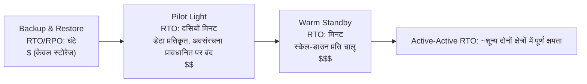

# अध्याय 18: जब चीज़ें टूटती हैं

रात 11:17 बजे बत्तियाँ बुझ गईं।

Nimbus ऑफ़िस में नहीं—लियो घर पर था, सोफ़े पर, लैपटॉप आधा बंद। बत्तियाँ Oregon के एक डेटा सेंटर में बुझ गईं जहाँ वह कभी नहीं गया था, एक ऐसी इमारत में जिसे उसने कभी नहीं देखा था, सर्वरों से भरे एक कमरे में जिन्हें उसने कभी नहीं छुआ था। उसे अभी पता नहीं था। एक पल था—बस एक पल—पूर्ण सन्नाटे का इससे पहले कि बैकअप जनरेटर कहीं दूर शुरू हुए। उस तरह का अँधेरा जहाँ आप बता नहीं सकते कि आपकी आँखें खुली हैं या बंद।

फिर Slack अधिसूचना आई।

---

अध्याय 17 की निगरानी प्रणालियाँ स्थापित हो जाने के बाद, टीम ने आत्मविश्वास जैसा कुछ महसूस किया था। अलर्ट चल रहे थे। डैशबोर्ड हरे थे। लॉग CloudWatch में प्रवाहित हो रहे थे। उन्होंने Nimbus अवसंरचना के हर कोने में दृश्यता जोड़ने में तीन सप्ताह बिताए थे।

जो किसी ने ज़ोर से नहीं कहा था—जिसके विरुद्ध निगरानी रक्षा नहीं करती थी—वह यह था कि दृश्यता और लचीलापन अलग चीज़ें हैं। आप किसी चीज़ को पूर्ण विस्तार से विफल होते देख सकते हैं। उसे देखना उसे रोकता नहीं।

वह सबक एक गुरुवार रात 11:23 बजे आया।

---

लियो को Slack अधिसूचना मिली।

"us-west-2 — डेटा सेंटर क्लस्टर विफलता — कमज़ोर सेवा।"

उसने AWS कंसोल खोला। एक Availability Zone के EC2 इंस्टेंस स्थिति जाँच विफल दिखा रहे थे। उसके Auto Scaling Group ने अस्वस्थ इंस्टेंस का पता लगाया था और प्रतिस्थापन बना रहा था—उसी ज़ोन में।

उस क्लस्टर में जो विफल हो रहा था।

नए इंस्टेंस भी शुरू नहीं हो सके। वे उसी हार्डवेयर विफलता ज़ोन में थे।

"लोड बैलेंसर दोनों AZs पर ट्रैफ़िक रूट कर रहा है," लियो ने किसी से नहीं कहा। "हमारा आधा ट्रैफ़िक उन इंस्टेंस पर जा रहा है जो काम नहीं करते।"

उसने EC2 कंसोल खोला और क्लिक करना शुरू किया। Load Balancers के तहत, Application Load Balancer दोनों target groups को स्वस्थ दिखा रहा था—क्योंकि स्वास्थ्य जाँच पोर्ट 80 पर पास हुई, और विफल इंस्टेंस भी उस जाँच का जवाब दे रहे थे। वे बस वास्तविक अनुरोधों को संसाधित नहीं कर सकते थे।

उसने target group से विफल AZ हटाने की कोशिश की। कंसोल ने परिवर्तन स्वीकार किया। लेकिन Auto Scaling Group, संतुलन बनाए रखने के लिए कॉन्फ़िगर, तुरंत समाप्त किए गए इंस्टेंस को बदलने की कोशिश करने लगा—उसी विफल ज़ोन में।

लियो स्क्रीन को घूरता रहा। उसने इसे अभी और बदतर बना दिया था।

उसने ASG कॉन्फ़िगरेशन खोला। "Balance capacity across Availability Zones" सेटिंग सक्रिय थी। सामान्य संचालन में यह अच्छा डिज़ाइन था। अभी यह सक्रिय रूप से उससे लड़ रहा था।

उसने ASG को केवल स्वस्थ ज़ोन का उपयोग करने के लिए बदला। परिवर्तन लागू किया।

कंसोल ने परिवर्तन को "In Service" दिखाया।

तीन मिनट बाद, पहले स्वस्थ प्रतिस्थापन इंस्टेंस ऊपर आए।

लोड बैलेंसर ट्रैफ़िक रूट करने लगा। त्रुटि दर 52% से गिरकर 4% हो गई। शेष 4% वे अनुरोध थे जो आख़िरी कुछ अस्वस्थ इंस्टेंस पर उतरे थे जो अभी भी कनेक्शन ड्रेन कर रहे थे।

रात 11:45 बजे तक—विफलता शुरू होने के बाईस मिनट बाद—ट्रैफ़िक स्थिर था।

बाईस मिनट की कमज़ोर सेवा इससे पहले कि उसने ध्यान दिया और ASG को केवल स्वस्थ ज़ोन का उपयोग करने के लिए मैन्युअल रूप से स्थानांतरित किया।

"यह इसलिए हुआ क्योंकि सब कुछ एक AZ में था," प्रिया ने अगली सुबह कहा।

"नहीं," लियो ने कहा। "मेरे पास दो AZs में इंस्टेंस थे। समस्या यह थी कि प्रतिस्थापन इंस्टेंस विफल AZ में बन रहे थे।"

"और डेटाबेस?"

लियो रुक गया।

"RDS प्राइमरी विफल ज़ोन में था," उसने कहा। "Multi-AZ ने असल में अपना काम किया—यह लगभग नब्बे सेकंड में स्वस्थ ज़ोन के standby पर failover हो गया। लेकिन हमारे एप्लिकेशन सर्वरों ने अपने मृत कनेक्शन खुले रखे और एंडपॉइंट के DNS नाम को फिर से हल करने के बजाय कैश किए गए IP पते को फिर से आज़माया। डेटाबेस 11:25 तक स्वस्थ था। हमारा ऐप तब तक साफ़ ढंग से फिर से नहीं जुड़ा जब तक मैंने कनेक्शन पूल पुनः आरंभ नहीं किए।"

बाईस मिनट की कमज़ोर सेवा अड़तीस मिनट बन गई थी।

जब लियो ने आठ महीने पहले Auto Scaling Group सेट किया था, उसने "balance capacity across AZs" सेटिंग जाँची थी और सोचा था कि यह काफ़ी अच्छा है। "यह ठीक रहेगा," उसने उस समय माया से कहा था। "AWS AZ का मामला स्वचालित रूप से संभालता है।" वह सही था कि AWS इसे संभालता है—और इस बारे में गलत था कि "स्वचालित रूप से" का क्या मतलब था।

"क्या होता," माया ने अगली सुबह पूछा, "अगर हमने सब कुछ ठीक से कॉन्फ़िगर किया होता? एक वास्तविक विफलता में सही Multi-AZ सेटअप कैसा दिखता है?"

लियो ने इसके बारे में सोचा। वह रात 11:45 बजे से इसके बारे में सोच रहा था।

काल्पनिक सही सेटअप में: ASG में ऐसे इंस्टेंस स्वास्थ्य जाँच होतीं जो ALB स्वास्थ्य देखतीं—केवल EC2 स्थिति नहीं। जब AZ विफल हुआ, उन इंस्टेंस पर स्वास्थ्य जाँच 30 सेकंड के भीतर विफल हो जाती। ASG विफलताओं का पता लगाता और तुरंत प्रतिस्थापन लॉन्च करना शुरू करता—और जब लॉन्च एक AZ में लगातार विफल होते हैं, तो समूह विफल ज़ोन से लड़ने के बजाय शेष स्वस्थ ज़ोन में क्षमता स्थानांतरित कर देता है।

लोड बैलेंसर उन्हीं 30 सेकंड के भीतर विफल AZ targets को रोटेशन से बाहर ले लेता। ट्रैफ़िक स्वस्थ AZ में केंद्रित हो जाता।

डेटाबेस के लिए: Multi-AZ failover खुद काम कर गया था—जो गायब था वह क्लाइंट अनुशासन था। कनेक्शन पूल जो फिर से कनेक्ट होने पर एंडपॉइंट के DNS नाम को फिर से हल करते हैं (IP कैश करने के बजाय), छोटे DNS कैश TTL, और रिट्राई लॉजिक। उनके मौजूद होने पर, एक RDS failover 60–120 सेकंड का झटका है, 16-मिनट की पूँछ नहीं।

कुल ग्राहक-दृश्य प्रभाव: डेटाबेस के failover होने के दौरान 60-90 सेकंड की कमज़ोर लेटेंसी। न कि 38 मिनट की कैस्केडिंग त्रुटियाँ।

"हमारे पास इससे बचने के लिए सारी अवसंरचना थी," लियो ने कहा। "हमने इसे बस गलत कॉन्फ़िगर किया।"

वह वाक्य मूल घटना से कहीं कठिन था कहना।

**बिजली ग्रिड उपमा**

सोचें कि आपके घर को बिजली कैसे मिलती है। बिजली एक जनरेटर से चलने वाले एकल तार से नहीं आती। यह एक ग्रिड से आती है—जनरेटर, सबस्टेशन, और ट्रांसमिशन लाइनों का एक नेटवर्क जो एक-दूसरे का समर्थन करते हैं। अगर एक सबस्टेशन में आग लग जाए, तो अन्य उसके आसपास बिजली को फिर से रूट कर देते हैं। आप ध्यान नहीं देते। बत्तियाँ जलती रहती हैं।

AWS Availability Zones उसी तरह काम करते हैं। एक विशाल डेटा सेंटर के बजाय जिस पर सब कुछ निर्भर करता है, AWS आपके संसाधनों को कई भौतिक रूप से अलग सुविधाओं भर में फैलाता है। अगर एक सुविधा बिजली खो देती है या उसमें हार्डवेयर विफलता होती है, तो अन्य चलती रहती हैं। ट्रैफ़िक स्वचालित रूप से फिर से रूट होता है। आपका एप्लिकेशन चालू रहता है—क्योंकि कभी काटने के लिए एक तार था ही नहीं।

यह **Multi-AZ आर्किटेक्चर** है: आपके संसाधनों को भौतिक रूप से अलग सुविधाओं भर में फैलाना ताकि एक विफलता कभी सब कुछ नीचे न ले जाए।

Multi-Region अगला स्तर है: कल्पना करें कि एक पूरी तरह अलग शहर में बैकअप जनरेटर हों। अगर पूरा स्थानीय बिजली ग्रिड नीचे चला जाए, तो दूरस्थ शहर संभाल लेता है। सेट करने में अधिक जटिल, लेकिन विनाशकारी विफलताओं के प्रति अधिक लचीला।

आप सोच रहे होंगे: अगर Multi-AZ का मतलब बस संसाधनों को दो डेटा सेंटरों भर में फैलाना है, तो AWS इसे हर चीज़ के लिए डिफ़ॉल्ट क्यों नहीं बनाता? उत्तर लागत है। Multi-AZ मोटे तौर पर अवसंरचना को दोगुना कर देता है—और एक विकास वातावरण या एक कम-ट्रैफ़िक आंतरिक टूल के लिए, वह अतिरिक्त लागत उचित नहीं है। उत्पादन कार्यभार के लिए, हालाँकि, प्रश्न पलट जाता है: अगर आपके पास यह नहीं है तो क्या आप डाउनटाइम वहन कर सकते हैं?

**विफलता की शब्दावली**

लचीलेपन के लिए डिज़ाइन करने से पहले, आपको उन शब्दों की ज़रूरत है जिनके विरुद्ध आप डिज़ाइन कर रहे हैं।

"हम यह भी कैसे मापें कि हम पर्याप्त लचीले हैं?" प्रिया ने पूछा।

"दो संख्याएँ," लियो ने कहा। "हम कितनी देर नीचे रह सकते हैं, और हम कितना डेटा खो सकते हैं।"

**उपलब्धता**: समय का प्रतिशत जब एक सिस्टम परिचालन में है। "चार नाइन्स" (99.99%) का मतलब प्रति वर्ष 52 मिनट से कम डाउनटाइम। "पाँच नाइन्स" (99.999%) का मतलब प्रति वर्ष लगभग 5 मिनट।

**RTO (Recovery Time Objective)**: सिस्टम कितनी देर नीचे रह सकता है इससे पहले कि यह एक व्यावसायिक समस्या बन जाए? अगर आपका RTO 4 घंटे है, तो SLAs के उल्लंघन से पहले आपके पास सेवा बहाल करने के लिए 4 घंटे हैं।

**RPO (Recovery Point Objective)**: आप कितना डेटा खोने का जोखिम उठा सकते हैं? अगर आपका RPO 1 घंटा है, तो आप एक विनाशकारी विफलता में एक घंटे तक का डेटा खोने को सहन कर सकते हैं। विफलता से पहले के आख़िरी घंटे में लिखा गया सब कुछ चला गया।

**दोष सहिष्णुता (Fault tolerance)**: जब एक घटक विफल होता है तब (किसी स्तर पर) संचालन जारी रखने की क्षमता।

**आपदा रिकवरी (DR)**: एक विनाशकारी विफलता से उबरने की प्रक्रिया—डेटा सेंटर आग, क्षेत्र-व्यापी आउटेज, आकस्मिक सामूहिक विलोपन।

ये पाँच अवधारणाएँ इस अध्याय के हर वास्तुशिल्प निर्णय को संचालित करती हैं।

**RTO और RPO व्यावसायिक निर्णय हैं, तकनीकी नहीं**

संख्याएँ उतनी मायने नहीं रखतीं जितना यह कि उन्हें कौन निर्धारित करता है। एक इंजीनियर RTO का अनुमान लगा सकता है। एक व्यावसायिक हितधारक जानता है कि 30-मिनट का आउटेज असल में क्या खर्च करता है।

समान तकनीक स्टैक वाली दो कंपनियों पर विचार करें:

एक फ़िनटेक कंपनी जो ब्रोकरेज ट्रेड संसाधित करती है: 4 मिनट का RTO, शून्य का RPO। बाज़ार के घंटों के दौरान चार मिनट के लिए नीचे रहने वाला एक ट्रेडिंग सिस्टम हज़ारों लेनदेन चूक सकता है। हर चूका हुआ लेनदेन का एक सीधा डॉलर मूल्य है। शून्य डेटा हानि दार्शनिक नहीं है—एक एकल पुष्ट ट्रेड खोने का मतलब अनुपालन समस्याएँ और ग्राहक मुक़दमे हैं। इसे हासिल करने की वास्तुकला लागत: सिंक्रोनस प्रतिकृति के साथ active-active Multi-AZ, छह-अंकीय वार्षिक अवसंरचना बजट।

एक रेस्तरां ऑर्डरिंग प्लेटफ़ॉर्म: 30 मिनट का RTO, 5 मिनट का RPO। डिनर की भीड़ के दौरान 30-मिनट का आउटेज वास्तव में दर्दनाक है और असली पैसा खर्च करता है। लेकिन एक विफलता से पहले ऑर्डर के आख़िरी 5 मिनट खोने का मतलब है कि मुट्ठी भर ग्राहकों को फिर से ऑर्डर करना पड़ता है—परेशान करने वाला, विनाशकारी नहीं। इसे हासिल करने की वास्तुकला लागत: warm standby Multi-AZ, फ़िनटेक बजट का एक अंश।

"रुको—लेकिन एक रेस्तरां प्लेटफ़ॉर्म *क्यों* 5 मिनट का डेटा नुकसान स्वीकार करेगा?" माया ने पूछा जब लियो ने यह समझाया। "क्या यह अभी भी ग्राहक ऑर्डर खोना नहीं है?"

"प्रश्न यह है कि क्या उस डेटा हानि को रोकने में उससे अधिक खर्च होता है जितना यह मूल्यवान है," लियो ने कहा। "RPO को 5 मिनट से 0 तक कम करने के लिए क्षेत्रों भर में सिंक्रोनस प्रतिकृति की ज़रूरत होगी। वह एक महत्वपूर्ण लागत और इंजीनियरिंग निवेश है। हमारे पैमाने पर एक रेस्तरां ऐप के लिए, 5-मिनट का RPO सही समझौता है।"

सबक: RTO और RPO तकनीकी न्यूनतम नहीं हैं। वे संख्याओं के रूप में व्यक्त व्यावसायिक समझौते हैं। उन्हें निर्धारित करने के लिए इंजीनियरिंग टीम (जो जानती है कि क्या हासिल किया जा सकता है) और व्यावसायिक हितधारक (जो जानते हैं कि क्या स्वीकार्य है) दोनों चाहिए।

**Multi-AZ: Availability Zone विफलताओं से बचना**

एक Availability Zone (AZ) एक क्षेत्र के भीतर एक भौतिक रूप से अलग डेटा सेंटर है। AZs स्वतंत्र होने के लिए डिज़ाइन किए गए हैं: अलग बिजली आपूर्ति, अलग कूलिंग, अलग नेटवर्क अवसंरचना। लेकिन वे इतने करीब हैं कि उनके बीच नेटवर्क लेटेंसी 1-2 मिलीसेकंड है।

**Multi-AZ तैनाती** आपके संसाधनों को एक क्षेत्र के भीतर दो या अधिक AZs भर में फैलाती है। अगर एक AZ विफल होता है:

- लोड बैलेंसर विफल AZ में अस्वस्थ इंस्टेंस पर रूट करना बंद कर देता है
- Auto Scaling Group इंस्टेंस को बदलता है—लेकिन *स्वस्थ* AZ में
- RDS स्वस्थ AZ में standby पर failover हो जाता है

लियो की गलती: उसका Auto Scaling Group प्रतिस्थापन इंस्टेंस को स्वस्थ AZs तक सीमित करने के लिए कॉन्फ़िगर नहीं था। यह AZs के बीच संतुलन बनाए रखने के लिए कॉन्फ़िगर था। जब ज़ोन विफल हुआ, तो ASG ने वहाँ प्रतिस्थापन बनाकर इंस्टेंस संख्या को संतुलित करने की कोशिश की—विफल ज़ोन में।

सुधार: ASG को केवल स्वस्थ AZs में लॉन्च करने के लिए कॉन्फ़िगर करें, जिसमें हमेशा कम से कम दो AZs सक्रिय हों।

गहरा सबक: उत्पादन में होने से पहले अपने विफलता परिदृश्यों का परीक्षण करना।

अगर आप Multi-AZ चुनते हैं, तो आपको स्वचालित failover और निकट-शून्य RPO मिलता है—लेकिन आप ऐसी अवसंरचना के लिए भुगतान कर रहे हैं जो सामान्य संचालन के दौरान कोई ट्रैफ़िक नहीं परोसती। वह standby RDS इंस्टेंस हमेशा चल रहा है, हमेशा प्रतिकृति कर रहा है, और प्राइमरी विफल होने तक कभी क्वेरी का जवाब नहीं देता। यही समझौता है: विश्वसनीयता पैसा खर्च करती है, तब भी जब कुछ टूटा नहीं हो।

**Chaos Engineering: पहला रन कैसा दिखा**

Nimbus में पहला chaos engineering रन उतना साफ़ नहीं था जितना दस्तावेज़ीकरण ने लगवाया था।

लियो ने रनबुक का चरण 2 चलाया: एक RDS Multi-AZ failover को मजबूर करना। उसने AWS CLI का उपयोग किया:

```
aws rds reboot-db-instance \
    --db-instance-identifier nimbus-prod \
    --force-failover
```

कमांड तुरंत लौटा। लियो ने टाइमर शुरू किया।

T+0s: Failover शुरू हुआ। RDS कंसोल प्राइमरी स्थिति को "rebooting" दिखाता है।

T+18s: एप्लिकेशन लॉग डेटाबेस कनेक्शन त्रुटियाँ दिखाना शुरू करते हैं। कनेक्शन पूल पुराने प्राइमरी को आज़मा रहा है, जो अब प्राइमरी नहीं है।

T+34s: RDS कंसोल स्थिति को "backing-up" दिखाता है। नया प्राइमरी प्रोमोट किया जा रहा है। DNS CNAME (डेटाबेस एंडपॉइंट) अपडेट किया जा रहा है।

T+52s: एप्लिकेशन लॉग फिर से सफल कनेक्शन दिखाना शुरू करते हैं। कनेक्शन पूल ने पुराने प्राइमरी पर रिट्राई समाप्त कर दिए हैं और CNAME से फिर से जुड़ गया है, जो अब नए प्राइमरी की ओर इशारा करता है।

T+4:17: सभी कनेक्शन फिर से स्थापित। त्रुटि दर वापस शून्य पर।

कुल: 4 मिनट 17 सेकंड।

"वह 257 सेकंड की डेटाबेस अनुपलब्धता है," टॉम ने कहा। "हमारे रेस्तरां पार्टनरों के टैबलेट 4 मिनट के लिए एक घूमता संकेतक दिखाते हैं।"

"हमारी SLA 5 मिनट कहती है," लियो ने कहा।

"तो हम पास हो गए," प्रिया ने कहा। "मुश्किल से।"

"दो अवलोकन," टॉम ने कहा। "पहला: हम पास हुए क्योंकि हमारी RTO प्रतिबद्धता उदार थी, इसलिए नहीं कि हमारी वास्तुकला विशेष रूप से तेज़ है। दूसरा: कनेक्शन पूल रिट्राई व्यवहार ही वह है जिसने हमें अतिरिक्त 34 सेकंड दिलाए। अगर एप्लिकेशन ने 10 सेकंड बाद हार मान ली होती, तो हम विफल हो जाते।"

लियो ने देखे गए समयों को दस्तावेज़ीकृत करने के लिए रनबुक अपडेट किया। अगली तिमाही का लक्ष्य: कनेक्शन पूल पैरामीटर और एप्लिकेशन के स्वास्थ्य जाँच लॉजिक को ट्यून करके failover पहचान समय को 52 सेकंड से 30 के नीचे कम करना।

"Chaos engineering एक एकमुश्त परीक्षण नहीं है," प्रिया ने कहा। "यह एक फ़ीडबैक लूप है। तुम परीक्षण करते हो, वास्तविक संख्याएँ पाते हो, सुधार करते हो, फिर से परीक्षण करते हो।"

तीसरी बार जब उन्होंने failover परीक्षण चलाया, छह महीने बाद, रिकवरी समय 1 मिनट 44 सेकंड था। इसलिए नहीं कि RDS तेज़ हो गया—बल्कि इसलिए कि उन्होंने एप्लिकेशन को ट्यून किया था।

**विफलताओं का अनुकरण: Chaos Engineering**

"हमें कैसे पता कि हमारा Multi-AZ सेटअप असल में काम करता है?" माया ने पूछा।

"हम जानबूझकर चीज़ें तोड़ते हैं," लियो ने कहा।

"रुको—लेकिन हम *क्यों* इसे उस तरह करेंगे?" माया ने कहा। "बस यह भरोसा क्यों न करें कि AWS दस्तावेज़ीकरण कहता है कि यह काम करता है?"

"क्योंकि दस्तावेज़ीकरण वर्णन करता है कि सेवा कैसे काम करती है। यह वर्णन नहीं करता कि *आपका कॉन्फ़िगरेशन* कैसे काम करता है। वे अलग चीज़ें हैं।"

प्रिया आगे झुकी। "क्या हमने सोचा है कि जब लोड बैलेंसर स्वास्थ्य जाँच और ASG स्वास्थ्य जाँच असहमत होती हैं तो क्या होता है? लोड बैलेंसर एक इंस्टेंस को रोटेशन से हटा सकता है, लेकिन ASG सोचता है कि इंस्टेंस स्वस्थ है और इसे नहीं बदलता। हमारे पास ऐसी क्षमता होती जो लोड बैलेंसर के लिए अदृश्य है।"

"यह ठीक उसी तरह की चीज़ है जिसे chaos engineering पाएगा," लियो ने कहा।

यह लापरवाह लगता है। यह असल में सबसे ज़िम्मेदार चीज़ है जो एक टीम कर सकती है।

**RTO प्रतिबद्धताओं का परीक्षण**

RTO के बारे में असहज सच यहाँ है: अधिकांश टीमें एक RTO निर्धारित करती हैं, फिर कभी परीक्षण नहीं करतीं कि वे इसे असल में पूरा कर सकती हैं या नहीं।

30 मिनट का RTO एक गारंटी नहीं है। यह एक लक्ष्य है। यह जानने का एकमात्र तरीका कि आप इसे पूरा करेंगे या नहीं, विफलता का अनुकरण करना और रिकवरी का समय मापना है।

11:23 PM की घटना के बाद, Nimbus टीम ने हर तिमाही प्रत्येक विफलता मोड का परीक्षण करने की प्रतिबद्धता की। केवल मैन्युअल रूप से नहीं—लिखित स्वीकृति मानदंड के साथ। एक AZ विफलता से रिकवरी 10 मिनट के भीतर पूरी होनी थी। एक RDS failover से रिकवरी 5 मिनट के भीतर पूरी होनी थी। बैकअप से डेटाबेस पुनर्स्थापना (backup-and-restore DR परीक्षण) 2 घंटे के भीतर पूरी होनी थी।

ये संख्याएँ रेस्तरां पार्टनरों के साथ बातचीत से आईं, जिन्होंने कहा कि 10 मिनट से कम का डिनर-रश आउटेज "दर्दनाक लेकिन स्वीकार्य" था। 30 मिनट से अधिक एक अनुबंध बातचीत थी।

"SLA बातचीत RTO निर्धारित करने से पहले होनी चाहिए," माया ने कहा। "बाद में नहीं।"

वह गलत नहीं थी। उन्होंने इसे उल्टा किया था। उन्होंने RTO आंतरिक रूप से निर्धारित किया था और फिर महसूस किया कि उन्हें इसे व्यवसाय की असल ज़रूरत के विरुद्ध जाँचना होगा।

RTO और RPO को सही क्रम में निर्धारित करना: पहले व्यावसायिक आवश्यकता, इसे पूरा करने के लिए दूसरी वास्तुकला, सत्यापित करने के लिए तीसरा परीक्षण। अधिकांश टीमें वास्तुकला से शुरू करती हैं और पीछे की ओर काम करती हैं। संख्याएँ इसके लिए भुगतती हैं।

**Chaos engineering** यह सत्यापित करने के लिए कि आपका सिस्टम विफलताओं को सही ढंग से संभालता है, जानबूझकर इसमें विफलताएँ इंजेक्ट करने का अभ्यास है। आप जानबूझकर एक EC2 इंस्टेंस समाप्त करते हैं। आप मैन्युअल रूप से RDS इंस्टेंस को failover करते हैं। आप लोड बैलेंसर से एक सबनेट अवरुद्ध करते हैं।

अगर सिस्टम आपके RTO के भीतर स्वचालित रूप से ठीक हो जाता है, तो आपका डिज़ाइन काम करता है।

अगर नहीं होता, तो आपने यह एक नियंत्रित सेटिंग में सीखा है—2 बजे रात की उत्पादन घटना के दौरान नहीं।

Nimbus के लिए: लियो ने प्रत्येक विफलता परिदृश्य के परीक्षण के लिए एक रनबुक (एक प्रलेखित प्रक्रिया) लिखी। तिमाही में एक बार, वे जानबूझकर एक घटक को विफल करते और रिकवरी समय मापते। अगर रिकवरी RTO से अधिक समय लेती, तो वे डिज़ाइन ठीक करते।

**Multi-Region: क्षेत्रीय विफलताओं से बचना**

अधिकांश AWS विफलताएँ Availability Zones को प्रभावित करती हैं, पूरे क्षेत्रों को नहीं। क्षेत्रीय विफलताएँ दुर्लभ हैं—लेकिन वे होती हैं।

एक क्षेत्रीय विफलता में (या वैश्विक एप्लिकेशन के लिए जिन्हें हर जगह बहुत कम लेटेंसी चाहिए), **Multi-Region** उत्तर है: अपने एप्लिकेशन को दो या अधिक AWS क्षेत्रों में तैनात करें।

Multi-Region मौलिक जटिलता पेश करता है:

**डेटा प्रतिकृति**: आपके डेटाबेस को क्षेत्रों भर में सिंक में होना चाहिए। us-east-1 में लिखा गया कोई भी डेटा आख़िरकार eu-west-1 तक पहुँचना चाहिए। "आख़िरकार" ही समस्या है—समय अंतराल के दौरान, क्षेत्रों के पास दुनिया के थोड़े अलग दृश्य होते हैं।

**Active-passive बनाम active-active**:

- **Active-passive**: एक क्षेत्र सारा ट्रैफ़िक परोसता है। दूसरा एक warm standby है। विफलता पर, DNS ट्रैफ़िक को standby पर स्विच करता है। सरल, लेकिन standby निष्क्रिय और महँगा है।
- **Active-active**: दोनों क्षेत्र एक साथ ट्रैफ़िक परोसते हैं। बनाने में अधिक जटिल (समवर्ती लेखन के लिए संघर्ष समाधान की आवश्यकता), लेकिन विश्व स्तर पर कम लेटेंसी और कोई निष्क्रिय संसाधन नहीं।

Active-active आकर्षक लगता है जब तक आप लेखन के बारे में ध्यान से न सोचें। अगर एक ग्राहक us-east-1 में एक ऑर्डर देता है और साथ ही रेस्तरां eu-west-1 में अपना मेनू अपडेट करता है, और क्षेत्रों के बीच एक नेटवर्क विभाजन है, तो कौन-सा लेखन जीतता है? यह व्यवहार में CAP प्रमेय है: एक वितरित प्रणाली में, एक नेटवर्क विभाजन के दौरान, आपको consistency (दोनों क्षेत्र समान डेटा पर सहमत होते हैं) और availability (दोनों क्षेत्र असहमत होते हुए भी अनुरोध स्वीकार करते रहते हैं) के बीच चुनना होगा। Active-active इस विकल्प को समाप्त नहीं करता। यह आपसे इसे स्पष्ट रूप से, अपने डेटा मॉडल में, बनाने की माँग करता है।

Nimbus के लिए: active-passive। वे अपने मेनू और ऑर्डर डेटा में समवर्ती लेखन संघर्षों के बारे में तर्क नहीं करना चाहते थे। एक एकल आधिकारिक प्राइमरी क्षेत्र इस चरण में सरल और सुरक्षित था।

**Failover समय**: DNS परिवर्तनों को प्रचारित होने में समय लगता है (TTL पर निर्भर)। प्रचार खिड़की के दौरान, कुछ उपयोगकर्ता अभी भी विफल क्षेत्र को टकराते हैं। बहुत कम RTO के लिए डिज़ाइन करने के लिए standby को पहले से गर्म करना और योजनाबद्ध स्विच से पहले TTL को कम करना ज़रूरी है।

**Route 53 DNS Failover: DR की नेटवर्क परत**

पूर्ण DR रणनीतियों के स्पेक्ट्रम तक पहुँचने से पहले, यह समझना उचित है कि DNS failover में कैसे फ़िट होता है—क्योंकि अक्सर यही वह चीज़ है जो असल में क्षेत्रों के बीच ट्रैफ़िक स्विच करती है।

**Amazon Route 53** स्वास्थ्य-जाँच-आधारित रूटिंग का समर्थन करता है। आप कॉन्फ़िगर करते हैं:

1. एक स्वास्थ्य जाँच जो आपके प्राइमरी एंडपॉइंट की निगरानी करती है (आमतौर पर एक HTTP एंडपॉइंट जो स्वस्थ होने पर 200 लौटाता है)
2. आपके प्राइमरी क्षेत्र की ओर इशारा करता एक प्राइमरी DNS रिकॉर्ड
3. आपके DR क्षेत्र की ओर इशारा करता एक द्वितीयक (failover) DNS रिकॉर्ड

जब Route 53 पता लगाता है कि प्राइमरी स्वास्थ्य जाँच विफल हो रही है, तो यह स्वचालित रूप से DNS प्रतिक्रियाओं को द्वितीयक रिकॉर्ड पर स्विच कर देता है। आपके डोमेन को हल करने वाले उपयोगकर्ता अब DR क्षेत्र का IP पाते हैं।

"और अगर कोई failover खिड़की के दौरान घुसने की कोशिश करे तो?" प्रिया ने पूछा। "हमारे डोमेन के लिए SSL प्रमाणपत्र—क्या यह दोनों क्षेत्रों में काम करता है, या HTTPS टूट जाता है?"

"प्रमाणपत्र को दोनों क्षेत्रों में प्रावधानित करना होगा," लियो ने पुष्टि की। "अगर तुम ACM (AWS Certificate Manager) का उपयोग कर रहे हो, तो इसका मतलब है हर क्षेत्र में स्वतंत्र रूप से एक प्रमाणपत्र अनुरोध करना।"

Route 53 failover की कार्यप्रणाली:

- स्वास्थ्य जाँच हर 30 सेकंड में दुनिया भर के कई AWS स्थानों से चलती हैं
- 3 लगातार विफलताओं (90 सेकंड) के बाद, Route 53 एंडपॉइंट को अस्वस्थ के रूप में चिह्नित करता है
- DNS प्रतिक्रियाएँ तुरंत failover रिकॉर्ड पर स्विच हो जाती हैं
- लेकिन: DNS TTL अभी भी लागू होता है। अगर आपका TTL 300 सेकंड है, तो जो क्लाइंट पहले से ही प्राइमरी IP कैश कर चुके हैं वे 5 मिनट तक विफल क्षेत्र को टकराते रहते हैं

यही वजह है कि TTL को कम करना आपदा-पूर्व तैयारी का हिस्सा है। आप एक घटना के दौरान TTL नहीं बदल सकते (परिवर्तन समय पर प्रचारित नहीं होगा)। TTL परिवर्तन ज़रूरत पड़ने से दिनों या हफ़्तों पहले किया जाना चाहिए, ताकि जब विफलता हो तो रिज़ॉल्वर कैश पहले से ही छोटे TTL का उपयोग कर रहे हों।

"तो DNS TTL को कम करना एक रिकवरी क्रिया नहीं है," लियो ने कहा। "यह एक पूर्व-स्थिति क्रिया है।"

"क्या हमने यह किया है?" माया ने पूछा।

उन्होंने नहीं किया था।

उस बातचीत के बाद, लियो ने eatnimbus.com के लिए TTL को 300 सेकंड से 60 सेकंड तक कम किया। परिवर्तन में कुछ खर्च नहीं हुआ और उनके सबसे खराब-स्थिति failover समय को संभावित रूप से 8 मिनट से 3 मिनट से कुछ कम तक सुधारा।

**आपदा रिकवरी रणनीतियाँ: एक स्पेक्ट्रम**

चार आम DR रणनीतियाँ हैं, जो सबसे सस्ती (और रिकवरी में सबसे धीमी) से सबसे महँगी (और रिकवरी में सबसे तेज़) तक व्यवस्थित हैं:



**Backup and Restore** (घंटे RPO/RTO):

- सब कुछ एक अलग क्षेत्र में S3 में बैकअप करें
- आपदा पर: स्क्रैच से अवसंरचना प्रावधानित करें, बैकअप से पुनर्स्थापित करें
- लागत: बहुत कम (आप केवल स्टोरेज के लिए भुगतान कर रहे हैं)
- रिकवरी समय: घंटे

**Pilot Light** (मिनट से 1 घंटे RPO/RTO):

- डेटा को लगातार प्रतिकृत करें और कोर अवसंरचना को DR क्षेत्र में *प्रावधानित पर बंद* रखें—टेम्पलेट, AMIs, रोके गए या शून्य-आकार संसाधन। कुछ भी ट्रैफ़िक नहीं परोसता; केवल डेटा प्रतिकृति "जली हुई" है (वही pilot light है)
- कोर डेटा प्रतिकृत है (DR क्षेत्र में RDS read replica)
- आपदा पर: DR क्षेत्र की कंप्यूट शुरू/स्केल अप करें, read replica को प्राइमरी में प्रोमोट करें, DNS स्विच करें
- (नीचे Warm Standby के विपरीत: वहाँ, एप्लिकेशन की एक स्केल-डाउन प्रति असल में *चल रही* होती है)
- लागत: मध्यम (आप डेटा प्रतिकृति और प्रावधानित-पर-बंद संसाधनों के लिए भुगतान कर रहे हैं, चल रही कंप्यूट के लिए नहीं)
- रिकवरी समय: दसियों मिनट

**Warm Standby** (सेकंड से मिनट RPO/RTO):

- DR क्षेत्र में पूर्ण एप्लिकेशन का एक स्केल-डाउन संस्करण चलाएँ
- पूरी तरह परिचालन लेकिन कम क्षमता पर
- आपदा पर: स्केल अप करें, DNS स्विच करें
- लागत: अधिक (हमेशा पूर्ण स्टैक को कम पैमाने पर चलाना)
- रिकवरी समय: मिनट

**Active-Active / Multi-Site** (निकट-शून्य RPO/RTO):

- दो या अधिक क्षेत्रों में पूर्ण क्षमता, एक साथ ट्रैफ़िक परोसते हुए
- कोई रिकवरी ज़रूरी नहीं—अगर एक क्षेत्र विफल होता है, तो ट्रैफ़िक स्वचालित रूप से दूसरे को रूट होता है
- लागत: सबसे अधिक (पूर्ण पैमाने पर दो पूर्ण तैनातियाँ)
- रिकवरी समय: सेकंड (केवल DNS प्रचार)

एक सेवा इस स्पेक्ट्रम के बीच को स्वचालित करती है: **AWS Elastic Disaster Recovery (DRS)** आपके सर्वरों—ऑन-प्रिमाइसेस या EC2—को ब्लॉक-दर-ब्लॉक एक कम-लागत स्टेजिंग क्षेत्र में लगातार प्रतिकृत करता है, और आपदा आने पर मिनटों में पूर्ण रिकवरी इंस्टेंस लॉन्च कर सकता है। प्रभाव में, यह एक *प्रबंधित pilot light* है: backup-and-restore कीमतों के करीब निकट-warm-standby रिकवरी समय। परीक्षा संकेत: "एक प्रबंधित DR सेवा के साथ सर्वर-आधारित कार्यभार के लिए डाउनटाइम और डेटा हानि को न्यूनतम करें" → Elastic Disaster Recovery।

इस चरण में Nimbus के लिए: warm standby। वे active-active वहन नहीं कर सकते थे, लेकिन backup and restore उनकी व्यावसायिक आवश्यकताओं के लिए बहुत धीमा था।

**Amazon RDS: Multi-AZ बनाम Read Replicas बनाम Multi-Region**

ये तीनों अलग हैं और आमतौर पर भ्रमित होते हैं:

| सुविधा       | Multi-AZ                     | Read Replica     | Multi-Region Read Replica |
|---------------|------------------------------|------------------|---------------------------|
| उद्देश्य       | उच्च उपलब्धता (failover) | रीड स्केलिंग     | रीड स्केलिंग + DR         |
| डेटा सिंक     | सिंक्रोनस                  | एसिंक्रोनस     | एसिंक्रोनस              |
| Failover      | स्वचालित                    | मैन्युअल प्रोमोशन | मैन्युअल प्रोमोशन          |
| पठनीय?     | नहीं (standby निष्क्रिय है)      | हाँ              | हाँ                       |
| क्रॉस-क्षेत्र? | नहीं (एक ही क्षेत्र)             | हाँ (वैकल्पिक)   | हाँ                       |
| इसके लिए उपयोग | HA, RPO~0                    | रीड लोड        | आपदा रिकवरी         |

मुख्य अंतर्दृष्टि: Multi-AZ standby **सिंक्रोनस** है—प्राइमरी पर हर लेखन की standby पर पुष्टि लेखन स्वीकार किए जाने से पहले होती है। इसका मतलब है कि अगर प्राइमरी विफल होता है, तो कोई डेटा नहीं खोता। RPO = 0।

Read replicas **एसिंक्रोनस** हैं—प्रतिकृति विलंब है। अगर प्राइमरी विफल होता है और आप एक read replica को प्रोमोट करते हैं, तो आप हाल के लेखन के सेकंड या मिनट खो सकते हैं। RPO > 0।

**Aurora Global Database: उत्पादन के लिए Multi-Region**

उन टीमों के लिए जिन्हें वास्तविक बहु-क्षेत्र लचीलापन चाहिए, **Aurora Global Database** गणित बदल देता है। दूसरे क्षेत्र में एक मानक RDS read replica एसिंक्रोनस प्रतिकृति का उपयोग करता है जिसमें विलंब आमतौर पर सेकंड में मापा जाता है—मतलब एक क्षेत्रीय विफलता उन सेकंड के लेखन खो देगी। Aurora Global Database एक समर्पित प्रतिकृति अवसंरचना का उपयोग करता है जो प्राइमरी क्षेत्र और द्वितीयक क्षेत्रों के बीच 1 सेकंड से कम प्रतिकृति विलंब हासिल करती है।

जब टीम ने घटना के बाद की समीक्षा में इस पर चर्चा की, लियो ने तुलना खींची:

- मानक RDS क्रॉस-क्षेत्र read replica: प्रतिकृति विलंब आमतौर पर 1-10 सेकंड, भारी लोड के तहत मिनटों तक। स्टैंडअलोन डेटाबेस में प्रोमोशन में मिनट लगते हैं और मैन्युअल कदम शामिल होते हैं।
- Aurora Global Database द्वितीयक: प्रतिकृति विलंब आमतौर पर 1 सेकंड से कम। द्वितीयक से प्राइमरी में प्रोमोशन में 1 मिनट से कम लगता है।

"इसका मतलब है कि अगर us-west-2 पूरी तरह नीचे चला जाता है," लियो ने समझाया, "तो हमारे पास 1 सेकंड से कम संभावित डेटा हानि है और हम एक मिनट के भीतर us-east-1 से ट्रैफ़िक परोस सकते हैं।"

"वह प्रति माह कितना खर्च होता है?" टॉम ने तुरंत पूछा।

मानक Multi-AZ से अधिक। Aurora Global Database क्षेत्रों भर में प्रतिकृति के लिए प्रति-लेखन I/O शुल्क जोड़ता है। Nimbus की वर्तमान मात्रा के लिए, यह मौजूदा Aurora लागतों के ऊपर $40-60/माह जोड़ेगा।

"यही समझौता है," लियो ने कहा। "गति के लिए भुगतान करो। या एक मानक क्रॉस-क्षेत्र read replica के धीमे प्रोमोशन और थोड़े अधिक RPO को स्वीकार करो।"

अभी के लिए, Nimbus warm standby के साथ रहा। Aurora Global Database अगले फ़ंडिंग राउंड के लिए आर्किटेक्चर इच्छा सूची पर चला गया।

"वही failover खिड़की, अगली परत नीचे," प्रिया ने कहा। "हमने प्रमाणपत्र कवर किए। अब क्रेडेंशियल्स—वे एक इंस्टेंस पर घूम रहे हैं। क्या standby सिंक में है?"

लियो ने दस्तावेज़ीकरण खोला। यह एक अच्छा प्रश्न था। RDS Multi-AZ डेटा प्रतिकृत करता है, सीक्रेट्स कॉन्फ़िगरेशन नहीं—Secrets Manager रोटेशन को failover रनबुक के हिस्से के रूप में परीक्षण करना था।

## ताकत और सीमाएँ

**Multi-AZ**:

- उत्पादन कार्यभार के लिए आवश्यक—single-AZ एक एकल विफलता बिंदु है
- AWS सेवाओं द्वारा अच्छी तरह समर्थित (RDS, ElastiCache, EKS, ALB सभी Multi-AZ का समर्थन करते हैं)
- इससे मिलने वाली सुरक्षा की तुलना में अपेक्षाकृत कम लागत ओवरहेड
- AZ विफलताएँ AWS विफलता की सबसे आम श्रेणी हैं—Multi-AZ सबसे संभावित परिदृश्यों को कवर करता है

**Multi-Region**:

- सही ढंग से लागू करना जटिल, विशेष रूप से डेटाबेस के लिए
- डेटा निवास/संप्रभुता आवश्यकताएँ असल में इसकी माँग कर सकती हैं (EU उपयोगकर्ता डेटा को EU में रहना चाहिए)
- वैश्विक उपयोगकर्ताओं के लिए लेटेंसी लाभ रूटिंग से आते हैं, स्वयं multi-region से नहीं (स्थिर सामग्री के लिए CloudFront का उपयोग करें)
- अधिकांश संगठनों को active-active की ज़रूरत नहीं; अधिकांश warm standby में कम निवेश करते हैं
- Multi-Region warm standby की लागत तुच्छ नहीं है, लेकिन इसके बिना एक क्षेत्रीय विफलता की लागत बहुत अधिक हो सकती है

**Multi-AZ कब छोड़ें** (दुर्लभ मामले):

- विकास और staging वातावरण जहाँ डाउनटाइम स्वीकार्य है
- वास्तव में गैर-महत्वपूर्ण आंतरिक टूल जिनकी कोई SLA आवश्यकता नहीं
- बैच कार्यभार जिन्हें विफलता पर बस फिर से चलाया जा सकता है

Multi-AZ छोड़ने का दबाव लगभग हमेशा लागत के बारे में होता है। उस तर्क को स्वीकार करने से पहले, संभावित विफलता मोड की लागत की गणना करें: ग्राहक मंथन, SLA दंड, रिकवरी के लिए इंजीनियरिंग समय। अधिकांश उत्पादन वातावरणों में, Multi-AZ पहली बार ही अपने आप का भुगतान कर देता है जब यह आपको 3 बजे रात के पेज से बचाता है।

## सारांश

अध्याय 17 का निगरानी कार्य विफलताओं को दृश्यमान बनाता है। यह अध्याय अवसंरचना को उन्हें झेलने योग्य बनाने के बारे में है। दोनों मायने रखते हैं; कोई भी दूसरे के बिना पर्याप्त नहीं।

उस गुरुवार रात की Nimbus घटना ने 38 मिनट की कमज़ोर सेवा खर्च की। तीन कॉन्फ़िगरेशन गलतियाँ मिलीं: ASG ने प्रतिस्थापन लॉन्च से विफल AZ को बाहर नहीं किया, RDS standby संयोग से विफल ज़ोन में था, और किसी ने उत्पादन में इस पर निर्भर रहने से पहले failover प्रक्रिया का परीक्षण नहीं किया था।

तीनों एक दोपहर में ठीक करने योग्य थे। घटना ने सुधारों को इस तरह से तत्काल बना दिया जैसा "सर्वोत्तम प्रथा दस्तावेज़ीकरण" ने कभी नहीं किया।

यही chaos engineering का ईमानदार मामला है: यह नहीं कि यह कठोर इंजीनियरिंग अभ्यास है (हालाँकि यह है), बल्कि यह कि यह उन कॉन्फ़िगरेशन गलतियों को उजागर करता है जो उस रात तक सैद्धांतिक लगती हैं जब Oregon डेटा सेंटर में हार्डवेयर विफलता होती है।

- **RTO** (Recovery Time Objective): आप कितनी देर नीचे रह सकते हैं। **RPO** (Recovery Point Objective): आप कितना डेटा खो सकते हैं।
- **Multi-AZ** संसाधनों को एक क्षेत्र के भीतर Availability Zones भर में फैलाता है। AZ विफलताओं से रक्षा करता है।
- **Multi-Region** कई AWS क्षेत्रों में तैनात करता है। क्षेत्रीय विफलताओं से रक्षा करता है और वैश्विक उपयोगकर्ताओं को कम लेटेंसी के साथ सेवा देता है।
- DR रणनीतियाँ (सबसे सस्ती से सबसे महँगी): Backup & Restore → Pilot Light → Warm Standby → Active-Active।
- RDS Multi-AZ standby: सिंक्रोनस, स्वचालित failover, क्षेत्र के भीतर RPO = 0। Read replicas: एसिंक्रोनस, मैन्युअल प्रोमोशन, RPO > 0।
- अपनी विफलताओं का जानबूझकर परीक्षण करें (chaos engineering) इससे पहले कि वे उत्पादन में हों।

## परीक्षा युक्तियाँ

*SAA-C03 डोमेन: लचीले आर्किटेक्चर डिज़ाइन करना (डोमेन 2, कार्य 2.2)*

- **RTO बनाम RPO**: परीक्षा से अपेक्षा करें कि वह आपको आवश्यकताएँ देगी ("संगठन 1 घंटे से अधिक डाउनटाइम और कोई डेटा हानि सहन नहीं कर सकता") और आपसे सही DR रणनीति चुनने को कहेगी। मानचित्र: कोई डेटा हानि नहीं = सिंक्रोनस प्रतिकृति = Multi-AZ या active-active। 1 घंटा डाउनटाइम = backup-and-restore बहुत धीमा है; warm standby काम कर सकता है।
- **Multi-AZ RDS बनाम Read Replicas**: परीक्षा HA (Multi-AZ) बनाम रीड स्केलिंग (read replicas) के लिए पूछेगी। Multi-AZ standby पठनीय नहीं है। Read replicas को DR के लिए (मैन्युअल रूप से) प्राइमरी में प्रोमोट किया जा सकता है।
- **Pilot Light बनाम Warm Standby**: Pilot Light में न्यूनतम अवसंरचना चल रही है (केवल डेटा प्रतिकृति)। Warm Standby में एक स्केल-डाउन लेकिन कार्यात्मक एप्लिकेशन चल रहा है। अंतर यह है कि आप कितनी जल्दी स्केल अप कर सकते हैं।
- **Aurora Global Database**: बहु-क्षेत्र active-passive के लिए Aurora-विशिष्ट सुविधा। प्राइमरी क्षेत्र लेखन परोसता है; द्वितीयक क्षेत्र <1 सेकंड प्रतिकृति विलंब के साथ रीड परोसते हैं। failover पर, द्वितीयक को <1 मिनट में प्रोमोट किया जा सकता है। परीक्षा संकेत: "Aurora, बहु-क्षेत्र, RTO < 1 मिनट।"
- **AWS Backup**: EBS, RDS, DynamoDB, EFS, Storage Gateway के लिए एक केंद्रीकृत बैकअप सेवा। परीक्षा इसका उपयोग backup-and-restore परिदृश्यों के लिए करती है।
- **Elastic Disaster Recovery (DRS)**: "सर्वरों (ऑन-प्रिमाइसेस या EC2) के लिए न्यूनतम डाउनटाइम/डेटा हानि के साथ प्रबंधित DR," "इसे खुद बनाए बिना pilot light" → DRS (निरंतर ब्लॉक-स्तरीय प्रतिकृति + ऑन-डिमांड रिकवरी लॉन्च)।
- **Route 53 failover**: DR की DNS परत। प्राइमरी स्वास्थ्य जाँच विफल होती है → Route 53 द्वितीयक पर रूट करता है। प्रचार समय का मतलब है यह तत्काल नहीं है।

## अभ्यास

**अभ्यास 1 — स्मरण**

RTO और RPO के बीच अंतर समझाएँ। एक संगठन का RTO कम (लंबे समय तक नीचे नहीं रह सकता) लेकिन RPO अधिक (हाल के डेटा को खोना सहन कर सकता है) क्यों हो सकता है?

*(संकेत: एक ऐसे व्यवसाय के बारे में सोचें जहाँ हर लेनदेन संरक्षित करने से अधिक ग्राहकों को जल्दी सेवा देना महत्वपूर्ण है।)*

**अभ्यास 2 — SAA-C03 परिदृश्य**

*परिदृश्य*: एक स्वास्थ्य सेवा कंपनी `us-east-1` में एक PostgreSQL-संगत डेटाबेस पर एक रोगी रिकॉर्ड सिस्टम चलाती है। नियामक आवश्यकताएँ अनिवार्य करती हैं कि सिस्टम को **सेकंड** में मापे गए RPO (निकट-शून्य डेटा हानि) और 30 मिनट से कम के RTO के साथ एक **पूर्ण क्षेत्रीय आउटेज** झेलना चाहिए। प्राइमरी क्षेत्र के भीतर, कोई डेटा हानि स्वीकार्य नहीं है।

कौन-सी वास्तुकला इन आवश्यकताओं को सबसे अच्छे से पूरा करती है?

A) दैनिक स्वचालित बैकअप के साथ `us-east-1` में RDS Multi-AZ, `us-west-2` में S3 को  
B) मैन्युअल प्रोमोशन के लिए कॉन्फ़िगर `us-west-2` में एक read replica के साथ `us-east-1` में RDS Multi-AZ  
C) `us-east-1` में RDS के साथ `us-west-2` में एक warm standby और active-active प्रतिकृति  
D) `us-east-1` में प्राइमरी और `us-west-2` में द्वितीयक के साथ Aurora Global Database

**सुझाव 1**: दो दायरों को अलग करें। एक क्षेत्र के *भीतर*, RPO = 0 का मतलब सिंक्रोनस प्रतिकृति (Multi-AZ—और Aurora की स्टोरेज परत 3 AZs भर में सिंक्रोनस है)। क्षेत्रों के *पार*, सभी यथार्थवादी विकल्प एसिंक्रोनस रूप से प्रतिकृत करते हैं—प्रश्न यह है कि विलंब कितना छोटा है।

**सुझाव 2**: RTO = 30 मिनट का मतलब है आपके पास एक नियंत्रित प्रोमोशन के लिए समय है। आपको पूरी तरह स्वचालित मिलीसेकंड failover की ज़रूरत नहीं है।

**सुझाव 3**: प्रत्येक विकल्प के क्रॉस-क्षेत्र RPO की तुलना करें: दैनिक बैकअप (घंटे), RDS क्रॉस-क्षेत्र read replica (सेकंड से मिनट, लोड के तहत असीमित), Aurora Global Database (आमतौर पर 1 सेकंड से कम)।

**उत्तर**: D

**व्याख्या**: Aurora Global Database स्टोरेज परत पर द्वितीयक क्षेत्र को आमतौर पर एक सेकंड से कम विलंब के साथ प्रतिकृत करता है—एक क्षेत्रीय आपदा के लिए "सेकंड में RPO" को संतुष्ट करता है—और एक द्वितीयक को एक मिनट से कम में प्रोमोट किया जा सकता है, 30-मिनट के RTO के भीतर आराम से। प्राइमरी क्षेत्र के भीतर, Aurora का स्टोरेज तीन AZs भर में सिंक्रोनस रूप से प्रतिकृत है, क्षेत्र-के-भीतर शून्य-हानि आवश्यकता को पूरा करता है। **सूक्ष्मता याद रखें**: Aurora Global क्षेत्रों के पार *एसिंक्रोनस* है—इसका क्रॉस-क्षेत्र RPO *निकट* शून्य है, कभी ठीक शून्य नहीं। अगर एक परीक्षा प्रश्न पूर्ण RPO = 0 की माँग करता है, तो वह *सिंक्रोनस* प्रतिकृति (Multi-AZ, एकल क्षेत्र) से मैप होता है—कोई मानक क्रॉस-क्षेत्र विकल्प इसे प्रदान नहीं करता।

**A क्यों नहीं?** दैनिक S3 बैकअप 24 घंटे तक का क्रॉस-क्षेत्र RPO देते हैं। यह एक क्षेत्रीय विफलता में घंटों का रोगी डेटा खोना है।

**B क्यों नहीं?** RDS क्रॉस-क्षेत्र read replicas मानक एसिंक्रोनस प्रतिकृति का उपयोग करते हैं जिसका विलंब लोड के तहत असीमित रूप से बढ़ सकता है—"सेकंड" मिनट बन सकते हैं। व्यावहारिक, लेकिन सबसे अच्छा नहीं जब एक उप-सेकंड, स्टोरेज-स्तरीय प्रतिकृति वाला विकल्प मौजूद हो।

**C क्यों नहीं?** क्षेत्रों भर में PostgreSQL के लिए "active-active प्रतिकृति" एक मानक RDS सुविधा नहीं है। यह विकल्प एक ऐसी क्षमता का वर्णन करता है जिसके लिए महत्वपूर्ण कस्टम इंजीनियरिंग की ज़रूरत है।

*SAA-C03 डोमेन: लचीले आर्किटेक्चर डिज़ाइन करना — कार्य 2.2*

**अभ्यास 3 — आर्किटेक्चर चुनौती** *(वैकल्पिक)*

Nimbus को Seattle में एक प्रमुख खाद्य उत्सव के लिए ऑर्डरिंग सेवाएँ प्रदान करने के लिए चुना गया है। 72 घंटों के लिए, वे अपने सामान्य ट्रैफ़िक से 50 गुना अपेक्षा करते हैं, डाउनटाइम के लिए शून्य सहिष्णुता के साथ (उत्सव आयोजक का अनुबंध घटना के दौरान किसी भी डाउनटाइम के लिए वित्तीय दंड निर्दिष्ट करता है)।

विशेष रूप से उत्सव खिड़की के लिए एक DR रणनीति डिज़ाइन करें। क्या आप उन 72 घंटों के लिए active-active पर स्विच करेंगे? आप failover का पूर्व-परीक्षण कैसे करेंगे? आपका RTO क्या होगा, और आप इसे घटना से पहले कैसे मान्य करेंगे?

*(कोई एकल सही उत्तर नहीं है। लक्ष्य विशिष्ट SLA आवश्यकताओं के लिए DR डिज़ाइन करने का अभ्यास करना है।)*

## पोस्ट-क्रेडिट दृश्य

लियो ने chaos engineering रनबुक बनाई।

हर तिमाही, एक योजनाबद्ध रखरखाव खिड़की पर, टीम यह करती:

1. एक AZ में एक EC2 इंस्टेंस समाप्त करें और देखें कि ASG इसे स्वस्थ ज़ोन में सही ढंग से बदलता है
2. मैन्युअल रूप से एक RDS Multi-AZ failover मजबूर करें और सत्यापित करें कि एप्लिकेशन 60 सेकंड के भीतर फिर से जुड़ गया
3. ASG के availability zones को समायोजित करके एक पूर्ण AZ विफलता का अनुकरण करें
4. एक सप्ताह पुराना बैकअप एक नए RDS इंस्टेंस पर पुनर्स्थापित करें और सत्यापित करें कि डेटा सही दिखता है

पहला रन—4-मिनट-17-सेकंड का failover जिसने मुश्किल से उनकी 5-मिनट SLA को पार किया—पहले ही उन्हें दिखा चुका था कि मार्जिन कितना पतला था।

"अगर हम इसे चूकते हैं तो अनुबंधों में एक वित्तीय दंड है," टॉम ने कहा।

"तो हमें इसे तेज़ करना होगा," लियो ने कहा। और उसने एक प्रबंधित डेटाबेस के लिए दस्तावेज़ीकरण पढ़ना शुरू किया जो सेकंड में failover का वादा करता था, मिनटों में नहीं।

अगले अध्याय में: टिकट मशीन जो Nimbus के हर हिस्से को अपनी गति से काम करने देती है।
