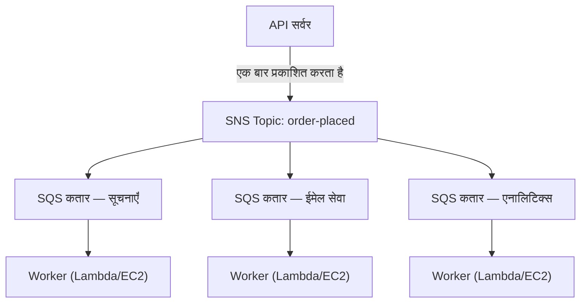

# अध्याय 19: टिकट मशीन

टिकट मशीन एक शांत क्रांति थी। एक नंबर लो, बुलाए जाने का इंतज़ार करो। लाइन एक कतार बन गई। लोग बैठ सकते थे। सेवा काउंटर अपनी गति से काम करता था। कोई किसी को अवरुद्ध नहीं करता था।

टिकट मशीन से पहले, आपको लाइन में खड़ा होना पड़ता था। लाइन में आपकी जगह के लिए आपकी भौतिक उपस्थिति ज़रूरी थी। इंतज़ार करते हुए आप कुछ और नहीं कर सकते थे। और अगर लाइन के सामने वाला व्यक्ति धीमा था, तो उसके पीछे सब रुक जाते थे।

टिकट मशीन ने आगमन को सेवा से अलग कर दिया। आप पहुँचते, एक नंबर लेते, और सिस्टम आपकी जगह याद रखता। आप जाकर बैठ सकते थे। सेवा काउंटर नंबरों के माध्यम से जिस गति से वह संभाल सकता था काम करता। अगर काउंटर अस्थायी रूप से बंद था, नए आगंतुकों को फिर भी नंबर मिलते। वे इंतज़ार करते। काम गायब नहीं होता—यह कतार में लग जाता।

यह छोटा आविष्कार मानव प्रणालियों में decoupling के सबसे पुराने उदाहरणों में से एक है। इस अध्याय के अंत तक, Nimbus ने अपनी खुद की टिकट मशीन बना ली होगी—सॉफ़्टवेयर में—और इसकी ज़रूरत क्यों थी यह एक शुक्रवार शाम के सोलह मिनट के डाउनटाइम से शुरू होता है।

---

टीम AZ विफलता से बच गई थी। लियो ने chaos engineering प्रक्रिया ठीक कर दी थी, और रनबुक ठोस था। ट्रैफ़िक बहाल हो गया था और फिर से बढ़ रहा था—असल में पहले से तेज़। जो Aurora दस्तावेज़ीकरण लियो देर रात पढ़ रहा था वह अभी भी Nimbus की वास्तविक स्थिति से कुछ अध्याय आगे था।

लेकिन ट्रैफ़िक बढ़ने और अधिक रेस्तरां जुड़ने के साथ, एक अलग तरह की अड़चन दृश्यमान होती जा रही थी। अवसंरचना में नहीं। एप्लिकेशन कोड में ही। जो अनुरोध श्रृंखला 200 ऑर्डर प्रति घंटे पर ठीक काम करती थी वह 800 पर तनाव दिखाने लगी थी।

और फिर 14 तारीख की शाम आई।

---

यह एनालिटिक्स डैशबोर्ड से शुरू हुआ था। एक शुक्रवार शाम 6:47 बजे, एनालिटिक्स सेवा में एक तैनाती ने एक टाइमआउट बग पेश किया। सेवा सामान्य 200 मिलीसेकंड के बजाय 8 सेकंड में जवाब देने लगी।

ऑर्डर प्रवाह सिंक्रोनस था। हर ऑर्डर ग्राहक को पुष्टि करने से पहले एनालिटिक्स सेवा का इंतज़ार करता। लोड बढ़ने पर आठ सेकंड 12 बन गए। API का कनेक्शन पूल एनालिटिक्स चरण के पूरा होने का इंतज़ार करते अनुरोधों से भरने लगा।

शाम 6:53 बजे, कनेक्शन पूल अपनी सीमा पर पहुँच गया। नए अनुरोध तुरंत विफल होने लगे—इसलिए नहीं कि ऑर्डर संसाधित नहीं हो सकता था, बल्कि इसलिए कि इसे संसाधित करना शुरू करने के लिए कोई उपलब्ध कनेक्शन नहीं था।

"एनालिटिक्स सेवा ने ऑर्डर प्रवाह को नीचे ले आया," लियो ने अगली सुबह लॉग देखते हुए कहा। "उनका एक-दूसरे से कोई लेना-देना नहीं है। एनालिटिक्स सेवा बस डैशबोर्ड की गणना करती है।"

"लेकिन वे एक ही अनुरोध श्रृंखला में हैं," प्रिया ने कहा।

"सोलह मिनट का डाउनटाइम," माया ने कहा। "और तीन ग्राहकों से दो बार शुल्क लिया गया।"

डबल-चार्ज डाउनटाइम से बदतर था। कनेक्शन पूल संतृप्ति की अराजकता में, कुछ ऐसे अनुरोधों के लिए एक रिट्राई तंत्र चला था जो असल में सफल हुए थे—भुगतान चरण पूरा हुआ, फिर अनुरोध लौटने से पहले टाइम आउट हो गया, और रिट्राई ने भुगतान फिर से आज़माया। वही कार्ड, वही राशि, दो शुल्क।

"रिट्राई तंत्र को मदद करनी थी," लियो ने कहा।

"इसने गलत दिशा में मदद की," प्रिया ने कहा। "और क्या हमने सोचा है कि जब हम उन ग्राहकों को रिफ़ंड करने की कोशिश करेंगे तो क्या होगा? रिफ़ंड प्रक्रिया उसी ऑर्डर प्रवाह का उपयोग करती है जो विफल हुआ।"

सोलह मिनट का डाउनटाइम और तीन डबल-चार्ज। यह सिंक्रोनस अनुरोध श्रृंखला की व्यावसायिक लागत थी।

---

Nimbus के पास एक समस्या थी जो समस्या जैसी महसूस नहीं हुई जब तक ऑर्डर लोकप्रिय नहीं हुए।

हर बार जब एक ऑर्डर दिया जाता, API सर्वर को यह करना पड़ता:

1. ऑर्डर को डेटाबेस में सहेजना
2. रेस्तरां के टैबलेट को एक सूचना भेजना
3. ग्राहक को एक पुष्टि ईमेल भेजना
4. रेस्तरां का एनालिटिक्स डैशबोर्ड अपडेट करना
5. बिलिंग के लिए इवेंट लॉग करना

एक व्यस्त डेली काउंटर पर, रजिस्टर पर खड़ा व्यक्ति अगले ग्राहक की ओर बढ़ने से पहले कटर के काटना समाप्त करने का इंतज़ार नहीं करता। वे ऑर्डर लेते हैं, इसे रसोई को सौंपते हैं, और अगले व्यक्ति को सेवा देना शुरू करते हैं। रसोई अपनी गति से ऑर्डर पूरे करती है। ग्राहक को तेज़ सेवा मिलती है। रसोई अचानक उछाल से अभिभूत नहीं होती। अगर रसोई का एक धीमा क्षण है, तो ऑर्डर रजिस्टर पर त्रुटियाँ पैदा करने के बजाय काउंटर के पीछे जमा हो जाते हैं।

वह उपमा थी। Nimbus के पास एक काउंटर और एक रसोई नहीं थी। उसके पास एक व्यक्ति था जो ग्राहक के जाने से पहले सब कुछ क्रम में करता था।

और 14 तारीख को, मांस काटने वाले व्यक्ति को एक समस्या थी। तो काउंटर रुक गया। तो उसके बाद हर ग्राहक ने इंतज़ार किया। रसोई, रजिस्टर, ग्राहक—सभी रुक गए क्योंकि श्रृंखला में एक चरण धीमा हो गया था।

समाधान मांस-काटने को तेज़ करना नहीं था। समाधान चरणों को अलग करना था। रजिस्टर पर ऑर्डर लो, एक टिकट सौंपो, रसोई को काम करने दो।

"हम कसकर युग्मित (tightly coupled) हैं," प्रिया ने कहा। "अगर कोई डाउनस्ट्रीम चरण विफल होता है, तो पूरा ऑर्डर विफल हो जाता है। क्या हमने सोचा है कि अगर एनालिटिक्स सेवा से समझौता हो जाए और वह खराब संदेश खाना शुरू कर दे तो क्या होगा? पूरा ऑर्डर विफल हो जाता है—क्योंकि हम उसका इंतज़ार कर रहे हैं।"

"अगर हम ऑर्डर सहेज सकें और तुरंत ग्राहक को पुष्टि कर सकें," लियो ने कहा, "और फिर बाकी को पृष्ठभूमि में संसाधित करें?"

"वह एक कतार है," प्रिया ने कहा।

मुख्य अंतर्दृष्टि: ग्राहक को यह जानने की ज़रूरत नहीं कि पुष्टि मिलने से पहले एनालिटिक्स डैशबोर्ड अपडेट हुआ था। उन्हें यह जानने की ज़रूरत है कि उनका ऑर्डर प्राप्त हुआ। वे अलग चीज़ें हैं। सिंक्रोनस श्रृंखला ने उन्हें मिला दिया।

**Decoupling मॉडल**

यह **decoupling** है: काम स्वीकार करने वाले घटक को इसे संसाधित करने वाले घटकों से अलग करना।

Nimbus के ऑर्डर प्रवाह के सभी चरणों को API द्वारा ग्राहक को जवाब देने से पहले सिंक्रोनस रूप से होना पड़ता था। अगर ईमेल सेवा धीमी थी (कभी-कभी थी), तो ग्राहक इंतज़ार करता। अगर एनालिटिक्स डैशबोर्ड नीचे था (कभी-कभी था), तो ऑर्डर विफल हो जाता।

14 तारीख का कैस्केड ठीक यही दर्शाता है कि यह क्यों मायने रखता है। एनालिटिक्स सेवा का इस बात से कोई लेना-देना नहीं था कि ग्राहक का ऑर्डर स्वीकार हुआ या नहीं। लेकिन क्योंकि यह उसी सिंक्रोनस श्रृंखला में बैठा था, इसकी विफलता सबकी विफलता बन गई।

सॉफ़्टवेयर सिस्टम में, कतार अक्सर एक message broker होती है—एक सेवा जो उत्पादकों से संदेश स्वीकार करती है और उन्हें उपभोक्ताओं को पहुँचाती है।

आप सोच रहे होंगे: अगर ऑर्डर प्रवाह अब एसिंक्रोनस है, तो ग्राहक को कैसे पता चलता है कि उनका ऑर्डर असल में प्राप्त हुआ? उत्तर वास्तुकला डिज़ाइन में है: API ऑर्डर को डेटाबेस में सहेजता है (सिंक्रोनस—यह आधिकारिक पुष्टि है), फिर कतार में इवेंट प्रकाशित करता है। ग्राहक पुष्टि डेटाबेस लेखन के सफल होने पर आधारित है, डाउनस्ट्रीम सेवाओं के पूरा होने पर नहीं। अगर ईमेल सेवा धीमी है, तो ग्राहक के पास पहले से ही उनकी पुष्टि है। ईमेल बस एक अच्छा-होता-तो-अच्छा अनुवर्ती है।

**Amazon SQS: कतार**

**Amazon SQS (Simple Queue Service)** AWS की प्रबंधित संदेश कतार सेवा है। यह संदेशों को टिकाऊ रूप से तब तक संग्रहीत करता है जब तक वे एक उपभोक्ता द्वारा संसाधित न हो जाएँ।

मूल प्रवाह:

1. **उत्पादक** (API सर्वर) कतार में एक संदेश रखता है: `{ "orderId": "ORD-5532", "restaurantId": "47", "items": [...] }`
2. API तुरंत ग्राहक को जवाब देता है: "ऑर्डर पुष्ट!"
3. **उपभोक्ता** (अलग वर्कर सेवाएँ) कतार से संदेश पढ़ते हैं और उन्हें संसाधित करते हैं: रेस्तरां सूचना भेजें, पुष्टि ईमेल भेजें, एनालिटिक्स अपडेट करें

ग्राहक अनुभव: तत्काल पुष्टि। डाउनस्ट्रीम प्रसंस्करण: एसिंक्रोनस रूप से, वर्करों की गति से होता है।

**SQS मुख्य अवधारणाएँ**

**Message visibility timeout**: जब एक उपभोक्ता SQS से एक संदेश पढ़ता है, तो संदेश एक अवधि (डिफ़ॉल्ट: 30 सेकंड) के लिए अन्य उपभोक्ताओं के लिए *अदृश्य* हो जाता है। यह उपभोक्ता को इसे संसाधित करने का समय देता है। अगर उपभोक्ता सफलतापूर्वक समाप्त करता है, तो यह संदेश हटा देता है। अगर उपभोक्ता क्रैश हो जाता है, तो visibility timeout समाप्त हो जाता है और संदेश एक और उपभोक्ता द्वारा रिट्राई के लिए फिर से दृश्यमान हो जाता है।

यह at-least-once delivery सुनिश्चित करता है: हर संदेश कम से कम एक बार संसाधित होगा, भले ही एक उपभोक्ता प्रसंस्करण के बीच में विफल हो जाए।

आप सोच रहे होंगे: अगर संदेश संसाधित होते समय अदृश्य हो जाता है लेकिन उपभोक्ता क्रैश होने पर डिलीट नहीं होता, तो क्या इसे दो बार संसाधित नहीं किया जा सकता? हाँ—और इसे at-least-once delivery कहते हैं। इसका मतलब है कि हर उपभोक्ता को बिना समस्या पैदा किए एक ही संदेश को एक से अधिक बार प्राप्त करने को संभालने के लिए डिज़ाइन किया जाना चाहिए। एक डुप्लिकेट ऑर्डर पुष्टि ईमेल परेशान करने वाला है। एक डुप्लिकेट शुल्क एक सपोर्ट टिकट है। अपने उपभोक्ताओं को तदनुसार डिज़ाइन करें।

Visibility timeout आपके सबसे लंबे अपेक्षित प्रसंस्करण समय से अधिक होना चाहिए। अगर प्रसंस्करण आमतौर पर 20 सेकंड लेता है लेकिन कभी-कभी 90 सेकंड, और आपका visibility timeout 30 सेकंड है, तो वह कभी-कभार 90-सेकंड प्रसंस्करण SQS को एक विफलता जैसा दिखेगा। संदेश फिर से दृश्यमान हो जाता है। एक दूसरा उपभोक्ता इसे उठाता है। अब दो वर्कर एक ही संदेश को संसाधित कर रहे हैं। अगर आपका प्रसंस्करण idempotent नहीं है, तो आपको एक समस्या है।

एक आम गलती: visibility timeout को औसत प्रसंस्करण समय के बराबर सेट करना। सही दृष्टिकोण: इसे 99वें पर्सेंटाइल प्रसंस्करण समय पर, एक सुरक्षा मार्जिन के साथ सेट करना। अगर P99 प्रसंस्करण समय 45 सेकंड है, तो visibility timeout को 90 सेकंड सेट करें।

**Dead-letter queues (DLQ)**: अगर एक संदेश प्रसंस्करण में बहुत बार विफल होता है (कॉन्फ़िगर करने योग्य—जैसे 5 रिट्राई), तो SQS इसे एक dead-letter queue में ले जाता है। आप संदेशों को खोए बिना यह समझने के लिए DLQ का निरीक्षण करते हैं कि संदेश क्यों विफल हो रहे हैं।

DLQ वह जगह है जहाँ आप सीखते हैं कि उत्पादन में असल में क्या विफल हो रहा है। इसके बिना, विफल संदेश बस गायब हो जाते हैं और आपके पास जाँच करने का कोई तरीका नहीं होता।

SQS माइग्रेशन के तीन सप्ताह बाद, लियो ने देखा कि सूचना सेवा के DLQ में 23 संदेश जमा हो गए थे। वह DLQ की जाँच नहीं कर रहा था (उसने इसे सही ढंग से सेट किया था और फिर मान लिया था कि यह खाली रहेगा)।

उसने एक संदेश खींचा और पेलोड देखा:

```json
{
  "orderId": "ORD-9821",
  "restaurantId": "12",
  "customerMessage": "Extra spicy please 🌶️🔥",
  "timestamp": "2024-01-18T19:43:11Z"
}
```

इमोजी। रेस्तरां सूचना सेवा रेस्तरां के लेगसी टैबलेट API को भेजने से पहले संदेश पेलोड को Latin-1 के रूप में एन्कोड कर रही थी। इमोजी अक्षर—UTF-8 में प्रत्येक चार बाइट—भ्रष्ट हो रहे थे, जिससे टैबलेट API अनुरोध को अस्वीकार कर रहा था। संदेश रिट्राई करता, फिर विफल होता, फिर रिट्राई करता, फिर विफल होता। 5 रिट्राई के बाद, SQS इसे DLQ में ले जाता।

"सभी 23 संदेशों में customer notes फ़ील्ड में इमोजी है," लियो ने कहा।

"तो हर ग्राहक जिसने अपने ऑर्डर नोट्स में एक इमोजी जोड़ा, उसका नोट चुपचाप रेस्तरां तक पहुँचने में विफल रहा," माया ने कहा।

"हाँ।"

"कितने समय तक?"

लियो ने सबसे पुराने संदेश का टाइमस्टैम्प जाँचा। "तीन सप्ताह।"

प्रिया चुप थी। "और अगर किसी ने पता लगा लिया कि एक ऑर्डर नोट में एक इमोजी जोड़ने से एक चुपचाप विफलता होती है? तुम इमोजी के साथ ऑर्डर दे सकते हो और गारंटी दे सकते हो कि रेस्तरां ने निर्देश कभी नहीं देखा। फिर गलत ऑर्डर के बारे में शिकायत करो।"

किसी ने इसका शोषण नहीं किया था। लेकिन यह पूछने के लिए सही प्रश्न था।

लियो ने एन्कोडिंग बग ठीक किया। फिर उसने DLQ से सभी 23 अटके संदेशों को फिर से चलाने के लिए एक स्क्रिप्ट लिखी। रेस्तरांओं को उनके (तीन-सप्ताह पुराने) मसालेदार इमोजी निर्देश मिले। ग्राहकों को कभी पता नहीं चला।

सबक: DLQ की सक्रिय रूप से निगरानी की जानी चाहिए, सेट करके भुलाई नहीं। एक बढ़ता DLQ एक चुपचाप संकेत है कि कुछ बार-बार विफल हो रहा है।

**कतार प्रकार**:

**Standard queues**: अधिकतम थ्रूपुट (असीमित संदेश प्रति सेकंड)। डिलीवरी क्रम best-effort है (गारंटी नहीं)। At-least-once delivery (बहुत कम ही, एक संदेश दो बार डिलीवर हो सकता है)।

**FIFO queues**: सख्त first-in, first-out क्रम। Exactly-once **प्रसंस्करण**—5-मिनट खिड़की के भीतर एक `MessageDeduplicationId` के आधार पर deduplication। क्रम की गारंटी `MessageGroupId` के *अनुसार* होती है: एक ही समूह के संदेश क्रम में आते हैं; अलग समूह समानांतर में संसाधित किए जा सकते हैं, यही FIFO स्केल करता है। बेसलाइन थ्रूपुट batching के साथ 3,000 संदेश प्रति सेकंड है (बिना batching के 300); **high-throughput mode** सक्षम करना इसे संदेश समूहों भर में विभाजन करके दसियों हज़ार प्रति सेकंड तक बढ़ा देता है। FIFO का उपयोग तब करें जब क्रम मायने रखता है (वित्तीय लेनदेन, अनुक्रमिक स्थिति परिवर्तन)।

अगर आपको अधिकतम थ्रूपुट चाहिए और कभी-कभार डुप्लिकेट संदेश सहन कर सकते हैं, तो SQS Standard का उपयोग करें—लेकिन आपको हर उपभोक्ता को बिना समस्या पैदा किए डुप्लिकेट संभालने के लिए डिज़ाइन करना होगा। अगर आपको सख्त क्रम और exactly-once प्रसंस्करण चाहिए, तो SQS FIFO का उपयोग करें—और अपने `MessageGroupId`s को अच्छी तरह डिज़ाइन करें, क्योंकि समानांतरता (और इसलिए थ्रूपुट) कई समूह होने से आती है।

Nimbus के लिए, अधिकांश कतारें standard queues का उपयोग करती थीं। बिलिंग कतार ने यह सुनिश्चित करने के लिए FIFO का उपयोग किया कि शुल्क क्रम में संसाधित हों।

**Queue Depth Auto Scaling: बैकलॉग से मेल खाने के लिए वर्करों को स्केल करना**

SQS के सबसे शक्तिशाली अनुप्रयोगों में से एक queue depth को एक Auto Scaling ट्रिगर के रूप में उपयोग करना है। CPU या मेमोरी के आधार पर स्केल करने के बजाय, आप इस आधार पर स्केल करते हैं कि कितना काम इंतज़ार कर रहा है।

Nimbus की सूचना सेवा के लिए: SQS queue depth (संसाधित होने का इंतज़ार करते संदेशों की संख्या) सूचना वर्कर चलाने वाली ECS सेवा के लिए एक Application Auto Scaling नीति से जुड़ी थी।

नीति: जब कतार में प्रति वर्कर टास्क 50 से अधिक संदेश हों, एक टास्क जोड़ें। जब कतार में प्रति वर्कर टास्क 10 से कम संदेश हों, एक टास्क हटाएँ।

व्यावहारिक प्रभाव: जब शुक्रवार शाम के पीक पर 1,200 ऑर्डर आए, सूचना कतार की गहराई उछल गई और वर्कर फ़्लीट 3 मिनट के भीतर 2 टास्क से 8 टास्क तक स्केल हो गया। आधी रात तक, कतार खाली थी और फ़्लीट वापस 2 पर था।

"वह प्रति माह कितना खर्च होता है?" टॉम ने Auto Scaling ग्राफ़ देखते हुए पूछा।

"Auto Scaling के लिए कुछ अतिरिक्त नहीं," लियो ने कहा। "लेकिन शुक्रवार शाम को 3 घंटे के लिए 6 अतिरिक्त ECS टास्क—वह सार्थक है।"

टॉम ने गणना की। "उन पीक के लिए लगभग $14/माह। और पहले, हम 8 टास्क लगातार पूरी लागत पर चला रहे थे?"

"हाँ।"

"तो हम तब बर्स्ट के लिए भुगतान करते हैं जब हमें इसकी ज़रूरत होती है और अन्यथा कुछ नहीं।"

यह queue-depth scaling पैटर्न है: कतार एक बफ़र बन जाती है जो ट्रैफ़िक उछाल को अवशोषित करता है, और वर्कर फ़्लीट बफ़र को निकालने के लिए स्केल होता है। उपयोगकर्ता धीमेपन का अनुभव नहीं करते—जब ऑर्डर स्वीकार हुआ तब उन्हें तुरंत अपनी पुष्टि मिली। वर्कर बस पकड़ने में थोड़ा अधिक समय लेते हैं। और क्योंकि आप 24/7 पीक क्षमता नहीं चला रहे हैं, लागत काफ़ी कम है।

**Amazon SNS: प्रसारक**

**Amazon SNS (Simple Notification Service)** एक publish/subscribe (pub/sub) संदेश सेवा है। एक उत्पादक, एक उपभोक्ता (कतार) के बजाय, SNS एक संदेश को *कई* सब्सक्राइबरों को एक साथ पहुँचाने का समर्थन करता है।

मॉडल:

1. एक **प्रकाशक** एक SNS **topic** को एक संदेश भेजता है
2. उस topic के सभी **सब्सक्राइबर** एक साथ संदेश प्राप्त करते हैं (fan-out)

सब्सक्राइबर हो सकते हैं:

- SQS कतारें (एसिंक्रोनस प्रसंस्करण के लिए संदेश को एक कतार में धकेलें)
- Lambda फ़ंक्शन (फ़ंक्शन को सीधे ट्रिगर करें)
- HTTP/HTTPS एंडपॉइंट (webhook डिलीवरी)
- ईमेल पते
- SMS (फ़ोन नंबर)

Nimbus के लिए, order placed इवेंट `order-events` नामक एक SNS topic पर प्रकाशित होता है:

- रेस्तरां सूचना सेवा सब्सक्राइब करती है (अपनी SQS कतार पर प्राप्त करती है)
- ईमेल सेवा सब्सक्राइब करती है (अपनी SQS कतार पर प्राप्त करती है)
- एनालिटिक्स सेवा सब्सक्राइब करती है (अपनी SQS कतार पर प्राप्त करती है)
- बिलिंग सेवा सब्सक्राइब करती है (अपनी FIFO SQS कतार पर प्राप्त करती है)

एक ऑर्डर इवेंट। चार सब्सक्राइबर। सभी एक साथ सूचित। प्रत्येक अपनी गति से संसाधित करता है।

"तो SNS घोषणा है," माया ने कहा, "और SQS इनबॉक्स है जहाँ हर टीम घोषणा को अपनी गति से संसाधित करती है। तो दोनों क्यों उपयोग करें? बस हर किसी को सीधे SNS topic पर सब्सक्राइब क्यों न करें?"

"क्योंकि सीधी SNS डिलीवरी fire-and-forget है," लियो ने कहा। "अगर SNS चलने पर एनालिटिक्स सेवा नीचे है, तो वह संदेश चला गया। बीच में एक SQS कतार के साथ, संदेश सेवा के ठीक होने तक इंतज़ार करता है।"

"बिल्कुल," प्रिया ने कहा। "SNS/SQS fan-out मानक पैटर्न है।"

**SNS/SQS Fan-Out पैटर्न**

यह संयोजन—SNS topic कई SQS कतारों को खिलाता—AWS में सबसे महत्वपूर्ण वास्तुशिल्प पैटर्न में से एक है:



प्रत्येक कतार स्वतंत्र है। एनालिटिक्स सेवा धीमी हो सकती है—इसकी कतार भर जाती है, लेकिन सूचना और ईमेल सेवाएँ अप्रभावित रहती हैं। अगर एनालिटिक्स सेवा नीचे चली जाती है, तो इसके संदेश कतार में तब तक इंतज़ार करते हैं जब तक यह वापस ऊपर न आ जाए। कुछ नहीं खोता।

यह मुख्य गुण है: **स्वतंत्र विफलता**। एक उपभोक्ता में समस्याएँ दूसरों में नहीं फैलतीं।

**संदेश फ़िल्टरिंग: हर संदेश हर सब्सक्राइबर के लिए नहीं**

जैसे-जैसे सिस्टम बढ़ते हैं, आप नहीं चाहते कि हर सब्सक्राइबर हर संदेश को संसाधित करे। एक एनालिटिक्स सेवा को विफल भुगतान प्रसंस्करण के बारे में संदेश प्राप्त नहीं करने चाहिए अगर वह केवल पूर्ण ऑर्डर की परवाह करती है।

**SNS message filtering** सब्सक्राइबरों को filter policies निर्दिष्ट करने देता है—केवल वे संदेश डिलीवर करें जो कुछ विशेषताओं से मेल खाते हैं।

रेस्तरां सूचना सेवा एक फ़िल्टर के साथ सब्सक्राइब करती है: केवल वे संदेश जहाँ `status = "confirmed"`।

त्रुटि अलर्टिंग सेवा एक फ़िल्टर के साथ सब्सक्राइब करती है: केवल वे संदेश जहाँ `status = "failed"`।

हर सब्सक्राइबर को केवल वही मिलता है जिसकी उसे ज़रूरत है।

फ़िल्टरिंग के बिना, हर सब्सक्राइबर हर संदेश प्राप्त करता है और जो अप्रासंगिक है उसे अनदेखा करना पड़ता है। यह प्रसंस्करण बर्बाद करता है, पैसा बर्बाद करता है (SQS प्रति संदेश शुल्क लेता है), और शोर पेश करता है। फ़िल्टरिंग के बिना एक उच्च-मात्रा ऑर्डर सिस्टम त्रुटि अलर्टिंग कतार को सफल ऑर्डर से भर देगा—असली विफलताओं को ढूँढना कठिन बना देगा।

Filter policies इस तरह दिखती हैं:

```json
{
  "status": ["confirmed"],
  "region": ["us-west-2", "us-east-1"]
}
```

यह सब्सक्राइबर केवल वे संदेश प्राप्त करता है जहाँ status "confirmed" है और region या तो "us-west-2" या "us-east-1" है। नीति से मेल न खाने वाले संदेश इस सब्सक्राइबर की कतार में बिल्कुल डिलीवर नहीं होते—वे SQS तक पहुँचते भी नहीं।

"तो फ़िल्टरिंग SNS परत पर होती है," प्रिया ने कहा, "संदेशों के SQS में लिखे जाने से पहले?"

"सही। रेस्तरां सूचना सेवा के लिए SQS कतार केवल वे संदेश देखती है जिन पर उसे कार्य करने की ज़रूरत है।"

"और अगर कोई SNS topic पर एक विशेष रूप से तैयार किया गया संदेश प्रकाशित करके घुसने की कोशिश करे जो सभी सब्सक्राइबर फ़िल्टर से मेल खाता हो?" प्रिया ने पूछा।

SNS topic की एक IAM संसाधन नीति थी: केवल order API सेवा (इसकी IAM भूमिका द्वारा) को प्रकाशित करने की अनुमति थी। SNS access policies और SQS queue policies पहुँच नियंत्रण परत बनाती थीं—फ़िल्टरिंग केवल रूटिंग के लिए थी, सुरक्षा के लिए नहीं।

**SQS बनाम SNS का उपयोग कब करें**

**केवल SQS**: एक उत्पादक, एक उपभोक्ता (या एक ही कतार पर कई प्रतिस्पर्धी उपभोक्ता)। संदेशों को एक बार संसाधित करने की ज़रूरत है, क्रम में (FIFO) या नहीं (standard)। वर्कर कतार पैटर्न—एक कतार, कई वर्कर इससे उपभोग करते हुए।

**केवल SNS**: Fire-and-forget सूचनाएँ। ईमेल, SMS, या HTTP एंडपॉइंट पर धकेलें। संदेश को कतार में रखने की ज़रूरत नहीं—बस सूचित करें और आगे बढ़ें।

**SNS + SQS (fan-out)**: एक इवेंट, कई स्वतंत्र उपभोक्ता। प्रत्येक उपभोक्ता की अपनी कतार होती है, स्वतंत्र रूप से संसाधित करता है, और स्वतंत्र रूप से विफल हो सकता है।

## SNS FIFO Topics

SNS के बारे में ऊपर सब कुछ standard topics का उपयोग करता है—उनके पास प्रभावी रूप से असीमित थ्रूपुट है, सब्सक्राइबरों को लगभग एक साथ डिलीवर करते हैं, और अधिकांश उपयोग मामलों के लिए काम पूरा कर देते हैं।

लेकिन standard SNS topics क्रम की गारंटी नहीं देते। अगर आप दस संदेश क्रम में प्रकाशित करते हैं, तो सब्सक्राइबर उन्हें थोड़े अलग क्रम में प्राप्त कर सकते हैं। Nimbus ऑर्डर सूचनाओं के लिए, यह ठीक है—एक ईमेल पुष्टि से एक सेकंड के अंश पहले आता एक एनालिटिक्स अपडेट मायने नहीं रखता।

कुछ परिदृश्यों के लिए, यह मायने रखता है। एक वित्तीय खाता-बही पर विचार करें: अगर दो इवेंट—एक क्रेडिट और फिर एक डेबिट—उल्टे क्रम में डिलीवर होते हैं, तो प्रसंस्करण के दौरान बैलेंस गणनाएँ गलत होंगी, भले ही दोनों इवेंट आख़िरकार सही ढंग से संसाधित हो जाएँ।

**SNS FIFO topics** SQS FIFO कतारों के समान सिद्धांत को fan-out मॉडल पर लागू करते हैं। संदेश सब्सक्राइबरों को ठीक उसी क्रम में डिलीवर होते हैं जिसमें वे प्रकाशित हुए थे, और हर संदेश exactly once डिलीवर होता है।

समझौता: SNS FIFO topics का बेसलाइन थ्रूपुट SQS FIFO के समान है (3,000 संदेश प्रति सेकंड प्रति topic; 300 प्रति सेकंड प्रति message group—2025 से एक high-throughput mode बहुत अधिक के लिए उपलब्ध), और वे केवल **SQS कतारों** को fan-out करते हैं—FIFO या, 2023 से, Standard। एक Standard कतार सब्सक्राइब करना उन उपभोक्ताओं के लिए उपयोगी है जो क्रम की परवाह नहीं करते (उदाहरण के लिए एक एनालिटिक्स फ़ीड), लेकिन क्रम और exactly-once अंत-से-अंत तक **केवल** FIFO कतारों में जीवित रहते हैं। आप एक SNS FIFO topic का उपयोग HTTP एंडपॉइंट या ईमेल पतों पर डिलीवर करने के लिए नहीं कर सकते।

Nimbus की बिलिंग पाइपलाइन के लिए—जहाँ मूल्य निर्धारण अपडेट के एक अनुक्रम को रेस्तरां खातों पर क्रम में लागू करना था—बिलिंग SNS topic को standard से FIFO में माइग्रेट किया गया। SQS बिलिंग कतार पहले से ही FIFO थी। fan-out अब गारंटी देता था कि एक price-increase इवेंट कभी उस period-start इवेंट से पहले बिलिंग प्रोसेसर पर नहीं पहुँचेगा जिस पर यह निर्भर था।

> **परीक्षा युक्ति — SNS FIFO**
>
> अगर एक परिदृश्य कई सब्सक्राइबरों भर में **ordered fan-out delivery** की माँग करता है, तो उत्तर है **SNS FIFO**। Standard SNS क्रम की गारंटी नहीं देता। SNS FIFO केवल SQS कतारों को fan-out करता है—क्रम और exactly-once को अंत-से-अंत रखने के लिए, सब्सक्राइबर एक SQS **FIFO** कतार होनी चाहिए (Standard कतार सब्सक्रिप्शन की अनुमति है लेकिन best-effort क्रम मिलता है)। डिफ़ॉल्ट थ्रूपुट 3,000/सेकंड प्रति topic है—अगर परिदृश्य बहुत अधिक मात्रा *और* सख्त क्रम का वर्णन करता है, तो यह वैकल्पिक वास्तुकलाओं को देखने का संकेत है (उदाहरण के लिए Kinesis, जो एक बाद के अध्याय में शामिल है)।

## जब लेगसी कतार जाने नहीं देती

Nimbus अपना अब तक का सबसे बड़ा अधिग्रहण बंद करने वाला था: Barato, 200 रेस्तरां और संचालन में दो-वर्षीय बढ़त वाला एक खाद्य वितरण प्रतिस्पर्धी। इंजीनियरिंग टीम ने एक इंटीग्रेशन योजना कॉल शेड्यूल की।

कॉल बीस मिनट चली इससे पहले कि लियो चुप हो गया।

"उनका ऑर्डर प्रसंस्करण सिस्टम," उसने कहा। "यह किस पर चलता है?"

"ActiveMQ," दूसरे छोर पर Barato इंजीनियर ने कहा। "On-prem broker। ऐप Java है। यह 2018 से चल रहा है। सब कुछ AMQP बोलता है।"

"AMQP," लियो ने कहा।

"हाँ।"

उसने अपनी स्क्रीन पर आर्किटेक्चर आरेख देखा। Nimbus SQS और SNS चलाता था। SQS AMQP नहीं बोलता। SNS AMQP नहीं बोलता। Barato एप्लिकेशन और कुछ नहीं बोलता था।

"इसे फिर से लिखने में छह महीने लगेंगे," लियो ने कॉल के बाद टीम से कहा। "कम से कम।"

"हम छह महीने के लिए अधिग्रहण में देरी नहीं कर सकते," माया ने कहा।

"और हम AWS में एक बेयर-मेटल ActiveMQ broker नहीं चला सकते," प्रिया ने जोड़ा। "क्या हमने सोचा है कि वह सुरक्षा और विश्वसनीयता के दृष्टिकोण से कैसा दिखता है? एक स्व-प्रबंधित message broker, उत्पादन में बैठा, बिना प्रबंधित पैचिंग, बिना स्वचालित failover, हमारी अवसंरचना से जुड़ता हुआ?"

"एक प्रबंधित विकल्प है," लियो ने धीरे से कहा। वह उनकी बातचीत के दौरान पढ़ रहा था। "Amazon MQ।"

**Amazon MQ: प्रबंधित Broker**

**Amazon MQ** Apache ActiveMQ और RabbitMQ के लिए एक प्रबंधित message broker सेवा है। यह आपके मौजूदा broker को चलाता है—वही broker जिससे आपके एप्लिकेशन वर्षों से जुड़े रहे हैं—लेकिन एक प्रबंधित AWS सेवा के रूप में। AWS अंतर्निहित अवसंरचना संभालता है: प्रावधान, पैचिंग, failover, बैकअप।

मुख्य गुण जो Amazon MQ को SQS और SNS से अलग बनाता है: यह उन प्रोटोकॉल को बोलता है जो लेगसी message brokers बोलते हैं। AMQP, STOMP, MQTT, OpenWire, NMS। वे प्रोटोकॉल जिन्हें SQS और SNS बस नहीं समझते।

Barato इंटीग्रेशन के लिए, योजना सीधी थी। AWS एक Amazon MQ broker चलाता जो ActiveMQ के रूप में कॉन्फ़िगर था। Barato Java एप्लिकेशन को ऑन-प्रिमाइसेस के बजाय नए broker एंडपॉइंट की ओर इंगित किया जाता। एप्लिकेशन पक्ष पर परिवर्तन: नई कनेक्शन स्ट्रिंग के साथ एक कॉन्फ़िग फ़ाइल अपडेट करना। बस इतना ही। एप्लिकेशन को यह जानने की ज़रूरत नहीं थी कि वह Barato ऑफ़िस में एक सर्वर के बजाय एक प्रबंधित क्लाउड broker से बात कर रहा था।

"रुको," माया ने कहा। "अगर हम उन्हें आख़िरकार Nimbus में एकीकृत करने जा रहे हैं, तो हमें उन्हें शुरू से ही SQS में माइग्रेट नहीं करना चाहिए?"

"क्योंकि माइग्रेशन पथ मौजूद है," लियो ने कहा। "और इसे ठीक से करना उचित है—आख़िरकार। लेकिन अभी, हमें Barato को 30 दिनों में AWS अवसंरचना पर परिचालन में लाना है, छह महीने में नहीं। Amazon MQ एप्लिकेशन को बदले बिना उसे चलाता है। फिर हमारे पास SQS माइग्रेशन को एक सुविचारित परियोजना के रूप में योजना बनाने का समय है, अधिग्रहण के लिए एक हड़बड़ी पूर्वापेक्षा के रूप में नहीं।"

"वह प्रति माह कितना खर्च होता है?" टॉम ने पूछा।

Amazon MQ broker—विश्वसनीयता के लिए एक एकल active/standby जोड़ी—Barato की मात्रा के लिए उपयुक्त एक broker के लिए $200/माह की सीमा में था। छह महीने के पुनर्लेखन समय की लागत की तुलना में, यह कोई बहस नहीं थी।

प्रिया ने एक शर्त के साथ योजना को मंज़ूरी दी: Amazon MQ इंस्टेंस एक निजी सबनेट में रहेगा, सुरक्षा समूह नियमों के साथ जो केवल Barato एप्लिकेशन सर्वरों से कनेक्शन की अनुमति देते हैं। कोई सार्वजनिक एक्सपोज़र नहीं। ऑडिट लॉगिंग सक्षम।

माइग्रेशन में बारह दिन लगे। Barato एप्लिकेशन तेरहवें दिन Amazon MQ से जुड़ा। चौदहवें दिन, इसने एक भी कोड परिवर्तन के बिना AWS अवसंरचना पर अपना पहला ऑर्डर संसाधित किया।

---

> **परीक्षा युक्ति — Amazon MQ**
>
> *SAA-C03 डोमेन: लचीले आर्किटेक्चर डिज़ाइन करना (डोमेन 2)*
>
> परीक्षा Amazon MQ को SQS और SNS से एक ही अक्ष पर अलग करती है: **प्रोटोकॉल संगतता**। अगर परिदृश्य एक ऐसे एप्लिकेशन का वर्णन करता है जो पहले से ही एक message broker का उपयोग करता है और एक विशिष्ट प्रोटोकॉल बोलता है, तो Amazon MQ लगभग निश्चित रूप से उत्तर है।
>
> मुख्य संकेत: **"ActiveMQ," "RabbitMQ," "AMQP," "STOMP," "MQTT," "OpenWire,"** या **"बिना एप्लिकेशन कोड बदले"** के समकक्ष कोई वाक्यांश। अगर आप वे वाक्यांश देखते हैं, तो उत्तर Amazon MQ है—SQS नहीं, SNS नहीं।
>
> अगर परिदृश्य एक *नए* एप्लिकेशन का वर्णन करता है जिसे decoupling की ज़रूरत है, या किसी लेगसी broker या विशिष्ट प्रोटोकॉल का उल्लेख नहीं करता, तो SQS/SNS का उपयोग करें।
>
> एक और संकेत: "मौजूदा ऑन-प्रिमाइसेस message broker को AWS में माइग्रेट करें।" अगर ऐप को उसी तरह के broker से वही प्रोटोकॉल बोलते रहने की ज़रूरत है, तो Amazon MQ lift-and-shift उत्तर है।

## ताकत और सीमाएँ

**SQS और SNS क्यों शक्तिशाली हैं**:

- SQS टिकाऊ, विश्वसनीय संदेश डिलीवरी प्रदान करता है—संदेश कई AZs भर में संग्रहीत होते हैं
- Decoupling उत्पादक और उपभोक्ता सेवाओं की स्वतंत्र स्केलिंग और तैनाती सक्षम करता है
- Dead-letter queues सुनिश्चित करती हैं कि विफलता पर कोई संदेश चुपचाप न खोए
- SNS fan-out पैटर्न उत्पादक को बदले बिना नए उपभोक्ता जोड़ने देता है

**यह कब जटिल हो जाता है**:

- At-least-once delivery का मतलब है उपभोक्ताओं को *idempotent* होना चाहिए—एक ही संदेश को दो बार संसाधित करना समस्याएँ नहीं पैदा करना चाहिए (डुप्लिकेट ऑर्डर, डुप्लिकेट शुल्क)
- FIFO कतारें अधिक महँगी हैं और उनकी थ्रूपुट सीमाएँ हैं
- कई कतारों और सेवाओं भर में विफल संदेशों को डिबग करने के लिए अच्छी लॉगिंग और अवलोकनीयता चाहिए
- संदेश क्रम गारंटी सीमित हैं—अगर कई सेवाओं भर में सख्त क्रम मायने रखता है, तो डिज़ाइन जटिल हो जाता है

**Idempotency: एक व्यावहारिक गहन अध्ययन**

Idempotency अमूर्त लगती है जब तक आपके तीन ग्राहकों से दोगुना शुल्क न लिया गया हो।

एक ऑपरेशन **idempotent** है अगर इसे कई बार चलाना उसी परिणाम को उत्पन्न करता है जो इसे एक बार चलाना। एक शुल्क ऑपरेशन स्वाभाविक रूप से idempotent नहीं है: इसे दो बार चलाना दो बार शुल्क लेता है। एक idempotent शुल्क ऑपरेशन प्रयास करने से पहले जाँचता है कि शुल्क पहले ही संसाधित हो चुका है या नहीं।

पैटर्न: हर संदेश एक अद्वितीय ID रखता है (ऑर्डर ID, या एक अलग संदेश ID)। संसाधित करने से पहले, उपभोक्ता एक स्टोर (DynamoDB इसके लिए अच्छा काम करता है) जाँचता है कि इस संदेश ID को पहले ही सफलतापूर्वक संसाधित किया गया है या नहीं। अगर हाँ: कुछ न करें, संदेश हटा दें। अगर नहीं: संसाधित करें, ID रिकॉर्ड करें, संदेश हटा दें।

```python
def process_charge(message):
    order_id = message['orderId']
    
    # Idempotency check
    if already_processed(order_id):
        logger.info(f"Order {order_id} already charged, skipping duplicate")
        return  # Message will be deleted from queue
    
    # Process the charge
    charge_result = payment_service.charge(
        amount=message['amount'],
        card_token=message['cardToken'],
        idempotency_key=order_id  # Also pass to payment processor
    )
    
    # Record that we've processed this
    mark_as_processed(order_id, charge_result)
```

Idempotency की को उन डाउनस्ट्रीम सेवाओं (भुगतान प्रोसेसर, ईमेल सिस्टम) को भी पास किया जाना चाहिए जो इसका समर्थन करती हैं। उदाहरण के लिए Stripe, एक `Idempotency-Key` हेडर स्वीकार करता है जो डुप्लिकेट शुल्क रोकता है, भले ही वही API कॉल दो बार किया जाए।

"और correlation IDs के बारे में क्या?" प्रिया ने पूछा। "जब एक संदेश कई सेवाओं से गुज़रता है, तो हम कैसे ट्रेस करते हैं कि किस अनुरोध ने किस डाउनस्ट्रीम क्रिया का कारण बना?"

**Correlation IDs: सेवाओं भर में ट्रेसिंग**

जब एक ग्राहक एक ऑर्डर देता है, तो अनुरोध इससे होकर बहता है: API → SNS → SQS → सूचना वर्कर → रेस्तरां टैबलेट API → SQS → ईमेल वर्कर → SES।

Correlation IDs के बिना, अगर रेस्तरां टैबलेट API चरण 6 पर एक त्रुटि लौटाता है, तो हर सेवा के लॉग इवेंट दिखाते हैं, लेकिन शुरुआत से विशिष्ट ग्राहक के ऑर्डर तक इसे वापस ट्रेस करने का कोई तरीका नहीं है।

एक **correlation ID** एक अद्वितीय पहचानकर्ता है जो मूल अनुरोध से संलग्न होता है और हर सेवा इंटरैक्शन से गुज़रता है। हर सेवा अपने लॉग में correlation ID शामिल करती है।

जब प्रिया एक विशिष्ट correlation ID के लिए CloudWatch खोजती है, तो उसे हर लॉग लाइन मिलती है—हर सेवा भर में—जो उस एकल ऑर्डर के प्रसंस्करण का हिस्सा थी।

"एक चेतावनी," प्रिया ने कहा। "Correlation IDs बाहर से आते हैं। क्या कोई एक दुर्भावनापूर्ण ID इंजेक्ट करके हमारी लॉगिंग में गड़बड़ी कर सकता है?"

Correlation IDs आंतरिक हैं—वे प्रसंस्करण लॉजिक को प्रभावित नहीं करते, केवल लॉगिंग को। उन्हें साफ़ करना (अल्फ़ान्यूमेरिक, निश्चित लंबाई) लॉग आउटपुट में injection हमलों को रोकता है।

**जब Decoupling गलत विकल्प है**

"रुको—लेकिन हम *क्यों* सब कुछ decouple नहीं करेंगे?" माया ने पूछा।

यह एक उचित प्रश्न था। अगर decoupling कैस्केड विफलताओं को रोकता है और सिस्टम को लचीला बनाता है, तो इसे हर जगह क्यों न लागू करें?

क्योंकि decoupling की लागतें हैं। और ऐसे परिदृश्य हैं जहाँ वे लागतें लाभों से अधिक होती हैं।

**जब आपको तत्काल सुसंगतता चाहिए**: अगर एक ऑर्डर आगे बढ़ने से पहले एक भुगतान की पुष्टि होनी चाहिए—और उपयोगकर्ता परिणाम के लिए स्क्रीन पर इंतज़ार कर रहा है—तो आप भुगतान को एक एसिंक्रोनस कतार में नहीं डाल सकते और यह जानने से पहले एक पुष्टि नहीं लौटा सकते कि शुल्क सफल हुआ या नहीं। उपयोगकर्ता पहला शुल्क पूरा होने से पहले दो बार ऑर्डर दे सकता है। एसिंक्रोनस decoupling उन ऑपरेशनों के लिए काम नहीं करता जहाँ प्रतिक्रिया परिणाम पर निर्भर करती है।

**जब वर्कफ़्लो स्वाभाविक रूप से अनुक्रमिक है**: अगर चरण 3 को निर्णय लेने के लिए चरण 2 का परिणाम देखना चाहिए, तो वे एक कतार से समानांतर में नहीं चल सकते। उन्हें एक कतार में मजबूर करना एक अजीब परिणाम-पासिंग तंत्र बनाता है जो अक्सर सिंक्रोनस संस्करण से अधिक जटिल हो जाता है।

**जब संदेश क्रम महत्वपूर्ण है और मात्रा कम है**: SQS Standard क्रम की गारंटी नहीं देता। SQS FIFO देता है, लेकिन डिफ़ॉल्ट रूप से batching के साथ 3,000 संदेश/सेकंड पर सीमित है (high-throughput mode इसे काफ़ी बढ़ाता है)। अगर आपके पास एक कम-मात्रा, सख्ती से क्रमबद्ध वर्कफ़्लो है, तो एक सरल सिंक्रोनस कतार (जैसे एक डेटाबेस row lock) सरल और अधिक विश्वसनीय हो सकती है।

**जब ओवरहेड लाभ से अधिक है**: एक छोटा आंतरिक टूल जिसमें एक उपयोगकर्ता और कोई SLA नहीं, शायद fan-out SNS topics और DLQs की ज़रूरत नहीं है। कतारों और DLQs की निगरानी का परिचालन ओवरहेड वास्तविक है। वास्तुकला को समस्या के आकार के अनुसार रखें।

प्रश्न यह नहीं है कि "क्या मुझे इसे decouple करना चाहिए?" यह है "इस coupling की लागत क्या है, और क्या decoupling उस लागत को जोड़ने से अधिक कम करता है?"

## सारांश

Decoupling अध्याय 18 का लचीलापन सिद्धांत है जो आंतरिक वास्तुकला पर लागू होता है: जिस तरह Multi-AZ अवसंरचना में एकल विफलता बिंदुओं को समाप्त करता है, SQS और SNS अनुरोध श्रृंखलाओं में एकल विफलता बिंदुओं को समाप्त करते हैं।

- **Decoupling** काम उत्पन्न करने वाले घटकों को इसे संसाधित करने वाले घटकों से अलग करता है।
- **SQS** उत्पादकों को काम रखने के लिए एक टिकाऊ जगह देता है जब उपभोक्ता धीमे, ऑफ़लाइन, या स्केल अप हो रहे हों।
- **SNS** एक इवेंट को कई स्वतंत्र उपभोक्ताओं तक पहुँचने देता है बिना प्रकाशक के यह जाने कि वे कौन हैं।
- **SNS + SQS fan-out** हर डाउनस्ट्रीम सेवा को एक ही इवेंट को अपनी गति से संसाधित करने देता है।
- **DLQs, idempotency, और correlation IDs** वह परिचालन अनुशासन हैं जो एसिंक्रोनस सिस्टम को रहस्यमय के बजाय डिबग करने योग्य बनाते हैं।
- **आँख मूँदकर decouple न करें**: सिंक्रोनस वर्कफ़्लो, तत्काल सुसंगतता आवश्यकताएँ, और छोटे कम-जोखिम वाले टूल अतिरिक्त परिचालन सतह को उचित नहीं ठहरा सकते।

## परीक्षा युक्तियाँ

*SAA-C03 डोमेन: लचीले आर्किटेक्चर डिज़ाइन करना (डोमेन 2, कार्य 2.1)*

- **SQS Standard बनाम FIFO**: परीक्षा क्रम और डिलीवरी गारंटियों द्वारा अलग करती है। "क्रम में संसाधित करना चाहिए" → FIFO। "अधिकतम थ्रूपुट" → Standard।
- **Queue depth Auto Scaling**: "queue depth के आधार पर वर्कर स्केल करें" → Application Auto Scaling या ECS Service Auto Scaling के साथ उपयोग किया गया SQS मेट्रिक (ApproximateNumberOfMessagesVisible)।
- **Visibility timeout**: At-least-once delivery के लिए मुख्य अवधारणा। अगर एक उपभोक्ता विफल होता है, तो संदेश timeout के बाद फिर से दृश्यमान हो जाता है। परीक्षा परिदृश्य: "संदेश दो बार संसाधित हो रहे हैं" → visibility timeout बहुत छोटा है (उपभोक्ता संसाधित करने में timeout से अधिक समय लेता है)।
- **Dead-letter queue**: N रिट्राई के बाद विफल होने वाले संदेश यहाँ ले जाए जाते हैं। परीक्षा परिदृश्य: "सुनिश्चित करें कि कोई संदेश न खोए, भले ही प्रसंस्करण बार-बार विफल हो" → DLQ।
- **SNS fan-out**: एक इवेंट कई उपभोक्ताओं को ट्रिगर करने के लिए क्लासिक परीक्षा पैटर्न। "Order placed सूचना को ईमेल, SMS, और इन्वेंट्री अपडेट को एक साथ ट्रिगर करना चाहिए" → SQS सब्सक्रिप्शन के साथ SNS topic।
- **SQS + Lambda**: Lambda को एक SQS कतार पोल करने और हर संदेश बैच पर ट्रिगर करने के लिए कॉन्फ़िगर किया जा सकता है। परीक्षा इसका उपयोग बड़े पैमाने पर इवेंट-संचालित प्रसंस्करण के लिए करती है।
- **SQS long polling**: उपभोक्ताओं द्वारा हर कुछ सेकंड में पोल करने के बजाय (short polling, API कॉल बर्बाद करता है), long polling एक संदेश के लिए 20 सेकंड तक इंतज़ार करता है। लागत और झूठी खाली प्रतिक्रियाओं को कम करता है।
- **SQS extended client library**: कतार की पेलोड सीमा से बड़े संदेशों के लिए (डिफ़ॉल्ट रूप से 256KB; 2025 से 1MB तक बढ़ाया जा सकता है), SQS Extended Client Library का उपयोग करें, जो संदेश बॉडी को S3 में संग्रहीत करता है और SQS के माध्यम से एक संदर्भ भेजता है। परीक्षा अभी भी 256KB को SQS सीमा मानती है—"SQS संदेश बहुत बड़ा" → Extended Client Library + S3।
- **SNS message filtering**: सब्सक्राइबर केवल अपनी filter policy से मेल खाने वाले संदेश प्राप्त करते हैं। परीक्षा परिदृश्य: "एक सब्सक्राइबर को केवल विशिष्ट मानदंड से मेल खाने वाली सूचनाएँ भेजें" → SNS message filtering।
- **नोट**: SNS/SQS fan-out उच्च-थ्रूपुट एसिंक्रोनस प्रसंस्करण वास्तुकलाओं के बारे में डोमेन 3 परिदृश्यों में भी दिखाई देता है। लचीलापन और प्रदर्शन दोनों प्रश्नों के लिए पैटर्न जानें।
- **Amazon MQ संकेत**: "ActiveMQ," "RabbitMQ," "AMQP," "STOMP," "MQTT," "OpenWire," या "बिना एप्लिकेशन कोड बदले" → Amazon MQ, SQS नहीं। अगर परिदृश्य कहता है नया एप्लिकेशन जिसे decoupling चाहिए → SQS/SNS।
- **SNS FIFO बनाम Standard**: Standard SNS क्रम की गारंटी नहीं देता। अगर परिदृश्य **ordered fan-out** की माँग करता है → SQS FIFO कतारों को खिलाता SNS FIFO topic। याद रखें: SNS FIFO HTTP एंडपॉइंट या ईमेल को डिलीवर नहीं कर सकता—केवल SQS कतारों को (क्रम/exactly-once के लिए FIFO; Standard सब्सक्रिप्शन काम करते हैं लेकिन best-effort क्रम और at-least-once में गिर जाते हैं)।

## अभ्यास

**अभ्यास 1 — स्मरण**

SNS/SQS fan-out पैटर्न समझाएँ। पैटर्न सेवाओं को HTTP एंडपॉइंट के साथ सीधे SNS topic पर सब्सक्राइब कराने के बजाय SQS कतारों का उपयोग क्यों करता है?

*(संकेत: सोचें कि जब SNS एक संदेश प्रकाशित करता है तब अगर HTTP एंडपॉइंट में से एक नीचे है तो क्या होता है।)*

**अभ्यास 2 — SAA-C03 परिदृश्य**

*परिदृश्य*: एक ई-कॉमर्स प्लेटफ़ॉर्म प्रति घंटे 10,000 ऑर्डर संसाधित करता है। जब एक ऑर्डर दिया जाता है, तो सिस्टम को यह करना चाहिए: (1) ऑर्डर को डेटाबेस में संग्रहीत करना, (2) इन्वेंट्री घटाना, (3) एक पुष्टि ईमेल भेजना, और (4) एनालिटिक्स डैशबोर्ड अपडेट करना। वर्तमान में, चारों चरण सिंक्रोनस रूप से होते हैं—अगर एनालिटिक्स सेवा धीमी है, तो ग्राहक इंतज़ार करते हैं। टीम ग्राहक-सामने वाले प्रतिक्रिया समय में सुधार करना चाहती है जबकि यह सुनिश्चित करते हुए कि कोई ऑर्डर न खोए।

कौन-सी वास्तुकला इस आवश्यकता को सबसे अच्छे से संबोधित करती है?

A) सभी चार चरणों को क्रम में संसाधित करने के लिए SQS FIFO कतारों का उपयोग करें  
B) API को ऑर्डर सहेजने और तुरंत ग्राहक को पुष्टि करने दें; एक SNS topic पर एक इवेंट प्रकाशित करें; इन्वेंट्री, ईमेल, और एनालिटिक्स सेवाओं को SQS कतारों के माध्यम से सब्सक्राइब कराएँ  
C) प्रत्येक चरण को एक साथ, सिंक्रोनस रूप से संसाधित करने के लिए समानांतर EC2 इंस्टेंस का उपयोग करें  
D) ऑर्डर प्रसंस्करण को गति देने के लिए अनुरोध सत्यापन के साथ एक API Gateway का उपयोग करें

**सुझाव 1**: ग्राहक पुष्टि तत्काल होनी चाहिए। कौन-से चरण प्रतिक्रिया से पहले होने चाहिए, और कौन-से बाद में हो सकते हैं?

**सुझाव 2**: एनालिटिक्स सेवा का धीमा होना ईमेल या इन्वेंट्री सेवाओं को प्रभावित नहीं करना चाहिए।

**सुझाव 3**: SNS fan-out तीनों डाउनस्ट्रीम सेवाओं को एक साथ इवेंट प्राप्त करने देता है।

**उत्तर**: B

**व्याख्या**: API ऑर्डर को डेटाबेस में सहेजता है (सिंक्रोनस—पुष्टि करने से पहले किया जाना चाहिए) और तुरंत एक पुष्टि लौटाता है। फिर यह एक SNS topic पर एक `order-placed` इवेंट प्रकाशित करता है। इन्वेंट्री, ईमेल, और एनालिटिक्स सेवाएँ प्रत्येक स्वतंत्र SQS कतारों के माध्यम से सब्सक्राइब करती हैं। वे अपनी गति से संसाधित करती हैं—अगर एनालिटिक्स धीमी है, तो इसकी कतार बढ़ती है लेकिन अन्य सेवाएँ अप्रभावित रहती हैं। अगर कोई सेवा विफल होती है, तो इसके संदेश SQS कतार में रहते हैं और रिट्राई किए जाते हैं; कॉन्फ़िगर की गई विफल रिट्राई संख्या के बाद उन्हें DLQ में ले जाया जाता है।

**A क्यों नहीं?** FIFO कतारें संदेशों को क्रम में संसाधित करती हैं—यह सिंक्रोनस धीमेपन में मदद नहीं करता। साथ ही, अनुक्रमिक प्रसंस्करण का मतलब है एनालिटिक्स का धीमा होना अभी भी ईमेल को अवरुद्ध करता है।

**C क्यों नहीं?** "समानांतर EC2 इंस्टेंस सिंक्रोनस रूप से संसाधित करते हुए" अभी भी ग्राहक को जवाब देने से पहले सभी चरणों के पूरा होने की ज़रूरत है। इंस्टेंस जोड़ना सिंक्रोनस coupling को हल नहीं करता।

**D क्यों नहीं?** API Gateway API रूटिंग और सत्यापन को तेज़ करता है, लेकिन डाउनस्ट्रीम प्रसंस्करण चरणों को decouple नहीं करता।

*SAA-C03 डोमेन: लचीले आर्किटेक्चर डिज़ाइन करना — कार्य 2.1*

**अभ्यास 3 — आर्किटेक्चर चुनौती** *(वैकल्पिक)*

Nimbus रेस्तरां पार्टनरों के लिए एक सूचना प्रणाली बना रहा है। जब एक ग्राहक एक ऑर्डर देता है, तो रेस्तरां को इनके माध्यम से सूचित करने की ज़रूरत होती है:

- उनका टैबलेट ऐप (पुश नोटिफिकेशन)
- एक रसोई डिस्प्ले सिस्टम (उनके स्थानीय हार्डवेयर को HTTP webhook)
- एक बैकअप SMS (अगर टैबलेट सूचना विफल हो जाए)

टैबलेट सूचना सेवा विश्वसनीय है। रसोई webhook कभी-कभी नीचे रहता है (रेस्तरां बंद होने के समय अपना हार्डवेयर बंद कर देते हैं)। SMS केवल तभी चलना चाहिए जब टैबलेट सूचना विफल हो।

SNS और SQS का उपयोग करके वास्तुकला डिज़ाइन करें। आप "SMS केवल अगर टैबलेट विफल हो" आवश्यकता को कैसे संभालेंगे? आप कैसे सुनिश्चित करेंगे कि रसोई webhook ऑफ़लाइन होने पर टैबलेट सूचना को अवरुद्ध न करे?

यह भी विचार करें: रसोई webhook डिलीवरी के लिए कौन-सा visibility timeout उपयुक्त है अगर औसत webhook प्रतिक्रिया समय 2 सेकंड है लेकिन धीमे हार्डवेयर वाले रेस्तरां 30 सेकंड तक ले सकते हैं? webhook रिट्राई समाप्त होने के बाद SMS फ़ॉलबैक को कौन-सी DLQ नीति ट्रिगर करेगी?

*(कोई एकल सही उत्तर नहीं है। लक्ष्य सशर्त रूटिंग के साथ fan-out डिज़ाइन का अभ्यास करना है।)*

## पोस्ट-क्रेडिट दृश्य

नया ऑर्डर प्रवाह लाइव था।

लियो ने इसे एक मंगलवार दोपहर पहले एक पूर्ण लोड परीक्षण चलाए बिना तैनात किया था। "यह ठीक रहेगा," उसने प्रिया से कहा था। "वास्तुकला ठोस है।"

ग्राहकों ने ऑर्डर दिए। API 95 मिलीसेकंड में जवाब देता। पुष्टि तुरंत उनके फ़ोन पर दिखाई देती।

पर्दे के पीछे: चार सेवाएँ एसिंक्रोनस रूप से संसाधित करती हुईं। एनालिटिक्स सेवा में एक बग था जिसके कारण यह आइटम नाम में कुछ विशेष अक्षरों वाले ऑर्डर पर क्रैश हो जाती। इसकी कतार दो घंटे में 3,200 संदेशों तक बढ़ गई।

ग्राहकों ने कभी ध्यान नहीं दिया।

जब लियो ने बग ठीक किया और एनालिटिक्स सेवा पुनः आरंभ की, तो इसने 18 मिनट में बैकलॉग संसाधित किया। कोई डेटा नहीं खोया। DLQ खाली था।

उसने CloudWatch डैशबोर्ड रीफ़्रेश किया। Queue depth: 0। संसाधित संदेश: 3,200। त्रुटियाँ: 0 (सुधार के बाद)।

"यह ठीक वही है जैसा 14 तारीख दिखती होती," उसने कहा। "एनालिटिक्स को एक समस्या थी। कतार ने इसे अवशोषित किया। बाकी सब काम करता रहा।"

"यही decoupling का मतलब है," प्रिया ने कहा।

"वह प्रति माह कितना खर्च होता है?" टॉम ने पूछा, पहले से ही मूल्य निर्धारण पृष्ठ पर।

"हमारी वर्तमान मात्रा पर, SQS के लिए लगभग बारह डॉलर प्रति माह।" उसने स्क्रीन को घूरा। "मुझे अधिक की उम्मीद थी।"

उसके पास उस व्यक्ति की नज़र थी जो कुछ अप्रत्याशित रूप से सस्ता खोज रहा था जो अप्रत्याशित रूप से अच्छा भी था।

"DLQ अलर्ट सेट करो," प्रिया ने लियो को याद दिलाया। "हम तीन सप्ताह की चुपचाप विफलताएँ फिर नहीं चाहते।"

"पहले ही हो गया," लियो ने कहा।

इस बार उसने यह कर दिया था।

अगले अध्याय में: वह फ़ंक्शन जो केवल तब चलता है जब कोई दस्तक देता है—और जब वे नहीं देते तब कुछ खर्च नहीं होता।
