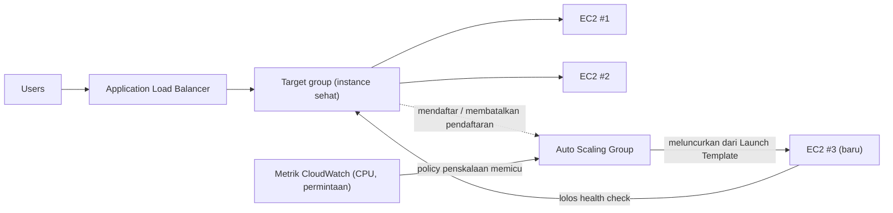

# Bab 7: Restoran yang Berkembang Ketika Sibuk

Saat itu pukul 7:43 malam di hari Jumat.

Kursi Tom didorong sedikit ke belakang, seperti yang terjadi ketika ia menatap sesuatu dengan jenis fokus yang berarti ia tidak akan menjawab jika Anda berbicara kepadanya. Kantor telah kosong sejam yang lalu. Ia tinggal.

Ia punya tab terbuka ke dasbor metrik yang ia segarkan seperti orang lain memeriksa media sosial — secara refleks, terus-menerus, tanpa benar-benar bermaksud demikian.

Krisis penyimpanan ada di belakang mereka. Basis data punya disknya sendiri. Foto hidup di S3. Selama dua minggu, sistem telah stabil — tidak mengasyikkan, hanya stabil. Itu seharusnya terasa baik.

Lalu tingkat kesalahan melampaui 12%.

"Leo," kata Tom.

Leo sudah melihat. Waktu respons: menanjak. Permintaan yang mengantri: menanjak. Satu instance EC2 — bahkan setelah latihan right-sizing yang hati-hati bulan lalu — berada di 94% CPU.

"Kita menolak pelanggan," kata Tom.

"Kita tidak menolak mereka," kata Leo. "Servernya yang menolak."

"Itu sama saja."

Memang. Dan itu telah terjadi setiap Jumat selama tiga minggu. Nimbus telah bertahan dari krisis penyimpanan — basis data punya disknya sendiri, foto hidup di S3 — tetapi stabil dan dapat diskalakan adalah masalah yang sama sekali berbeda. Sistem bekerja. Ia hanya tidak tumbuh.

Sebuah pesan Slack muncul dari Maya: *dasbor bilang pesanan turun 40% dari Jumat lalu. apa yang terjadi?*

Tom membalas: *server pada kapasitas. sedang dikerjakan.*

Tiga menit berlalu.

Maya: *kita punya pemilik restoran yang menelepon jalur dukungan bilang aplikasinya rusak.*

Leo punya tangannya di keyboard. Ia mengubah ukuran instance — versi manual dari perbaikan, yang membutuhkan menghentikan server dan mengubah tipe instance. Yang berarti downtime.

"Berapa lama restart akan memakan?" tanya Tom.

"Tujuh menit," kata Leo.

"Kita akan punya tujuh menit lagi pemadaman di malam Jumat," kata Tom. Ia tidak bertanya. Ia mengetik pesan Slack ke Maya. Ia membalas dengan satu karakter: *k*

Restart selesai. Instance kembali naik. CPU turun ke 60%. Tingkat kesalahan turun. Tom mengawasi metrik selama lima belas menit tanpa berbicara.

Pukul 9:15, lalu lintas menurun. Krisis berakhir.

Leo melihat tangannya, yang sedikit gemetar pada pukul 8 malam dan sekarang tidak lagi.

"Kita tidak bisa melakukan itu setiap Jumat," katanya.

"Tidak," kata Tom. "Kita tidak bisa."

Tim membutuhkan sistem mereka untuk menangani beban variabel secara otomatis. Bukan untuk membeli cukup
server untuk kasus terburuk dan membuang uang selama waktu sepi. Dan bukan untuk berjuang
secara manual ketika lonjakan lalu lintas menghantam.

Ada pola untuk ini. AWS punya dua layanan yang mengimplementasikannya.

**Konsep: Penskalaan Horizontal**

Ada dua cara untuk membuat sistem menangani lebih banyak beban.

**Penskalaan vertikal** berarti membuat satu server lebih besar. Lebih banyak CPU. Lebih banyak RAM.
Kita melakukan ini di Bab 4 ketika kita meng-upgrade dari `t3.micro` ke `t3.large`. Itu membantu.
Tapi punya batasan: Anda hanya bisa sebesar itu, instance harus mulai ulang untuk diubah ukurannya,
dan Anda tetap punya titik kegagalan tunggal.

**Penskalaan horizontal** berarti menambah lebih banyak server. Alih-alih satu server besar, jalankan
lima server medium. Ketika lalu lintas turun, jalankan dua. Ketika melonjak, jalankan sepuluh.

Penskalaan horizontal punya keunggulan yang tidak dimiliki vertikal:

- Tidak ada titik kegagalan tunggal. Jika satu server mati, yang lain tetap melayani.
- Tidak ada restart yang dibutuhkan untuk menambah kapasitas.
- Bayar hanya untuk yang Anda gunakan — tambah server ketika Anda butuh, hapus ketika tidak.
- Penskalaan linear: dua kali server, kira-kira dua kali throughput.

Ada juga dimensi keandalan yang tidak bisa ditandingi penskalaan vertikal. Ketika Anda punya
lima server dan satu gagal, kapasitas Anda turun ke 80% — cukup untuk terus melayani lalu lintas
sementara instance yang gagal diganti. Ketika Anda punya satu server dan ia gagal, kapasitas
turun ke 0%. Redundansi intrinsik pada penskalaan horizontal dengan cara yang tidak bisa
disediakan penskalaan vertikal pada ukuran apa pun.

Ini penting untuk pemeliharaan juga. Ketika patch keamanan membutuhkan restart server,
penskalaan horizontal membiarkan Anda me-restart instance satu per satu — rolling restart yang
mempertahankan kontinuitas layanan. Satu server besar membutuhkan entah menerima downtime
selama restart atau mengimplementasikan kompleksitas deployment blue/green.

Tangkapannya: jika Anda punya banyak server, bagaimana pengguna tahu mana yang harus diajak bicara?

Dan ada kendala desain yang dipaksakan penskalaan horizontal: aplikasi Anda
harus mampu berjalan di banyak server identik secara bersamaan tanpa server
saling mengganggu. Ini adalah persyaratan **stateless** — setiap permintaan
harus mandiri, tidak tergantung pada keadaan yang disimpan di server tertentu. Kita akan melihat
persis mengapa ini penting ketika kita menemui masalah sticky session.

**Application Load Balancer: Satu Pintu, Banyak Ruangan**

Bayangkan restoran besar dengan meja host di pintu. Pengunjung tiba dan host
mengarahkan mereka ke meja yang tersedia. Host tahu meja mana yang sibuk dan mana yang
kosong. Pengunjung tidak perlu tahu berapa banyak meja yang ada — mereka hanya masuk dan
host menangani distribusi.

Sebuah **Application Load Balancer** (ALB) melakukan ini dengan permintaan web.

Pengguna terhubung ke load balancer. Load balancer mendistribusikan permintaan masuk
di seluruh armada instance EC2 Anda. Setiap pengguna melihat satu alamat (URL load balancer).
Di balik alamat itu, permintaan tersebar di berapa pun server yang berjalan.

ALB sendiri berjalan di infrastruktur yang dikelola AWS, terdistribusi di beberapa AZ
di Region Anda. Ia bukan satu server — ia adalah layanan terkelola dan terdistribusi.
Ketika Anda mengaktifkan cross-zone load balancing (default untuk ALB), setiap node ALB
mendistribusikan permintaan secara merata di semua target yang terdaftar terlepas dari AZ mana
mereka berada. Ini mencegah mode kegagalan umum di mana satu AZ punya dua kali lebih banyak
instance sehat daripada yang lain, menghasilkan beban yang tidak merata.

Ia menerima setiap permintaan HTTP masuk dan memutuskan instance EC2 mana (disebut
**target**) yang harus menanganinya, berdasarkan faktor seperti:

- Round-robin (setiap server mendapat giliran dalam rotasi)
- Least outstanding requests (server dengan permintaan dalam-proses paling sedikit mendapat permintaan berikutnya)
- Kesehatan — hanya target yang sehat yang menerima lalu lintas

**Health check** sangat penting. ALB secara teratur mengirim permintaan uji ke setiap target.
Jika target tidak merespons dengan benar, ALB menandainya tidak sehat dan berhenti mengirim
lalu lintas kepadanya. Ketika target pulih, lalu lintas dilanjutkan.

Ini otomatis. Anda mengonfigurasi parameter health check; ALB menegakkannya.

Anda mengonfigurasi health check dengan tiga parameter kunci: **path** untuk diperiksa (mis., `/health`),
**interval** (seberapa sering memeriksa — setiap 5 hingga 300 detik; default 30), dan **threshold** (berapa
banyak pemeriksaan berhasil atau gagal berturut-turut sebelum mengubah status kesehatan target).

Interval health check yang agresif menangkap masalah lebih cepat tetapi menambah lebih banyak lalu lintas ke target.
Interval 30 detik dengan threshold 3-kegagalan berarti target yang gagal dihapus dari
rotasi dalam 90 detik. Interval 10 detik dengan threshold 2-kegagalan berarti
penghapusan dalam 20 detik — dengan biaya lebih banyak lalu lintas health check.

Untuk Nimbus, Priya memilih interval 30 detik dengan threshold 3 kegagalan (90 detik
untuk menyatakan tidak sehat) dan 2 keberhasilan (60 detik untuk menyatakan sehat lagi setelah pemulihan).
Ini menyeimbangkan deteksi kegagalan cepat dengan menghindari positif palsu dari gangguan jaringan
singkat.

**Konfigurasi Health Check: Lebih Dari "Apakah Ia Hidup?"**

Health check pertama Leo adalah ping TCP sederhana: "Apakah port 80 menerima koneksi?" Itu minimum. Server bisa menerima koneksi pada port 80 sementara basis data mati, sementara aplikasi dalam loop kesalahan, sementara disk penuh.

Priya punya pandangan berbeda tentang apa arti "sehat" seharusnya.

"Sudahkah kita memikirkan apa yang terjadi jika health check lolos tetapi aplikasi rusak?" tanyanya. "Server yang bisa menerima koneksi tetapi tidak bisa mengkueri basis data tidak sehat. Ia hanya responsif."

Leo membangun endpoint `/health` di kode aplikasi. Endpoint melakukan tiga hal:
1. Mengonfirmasi proses aplikasi berjalan
2. Membuat kueri uji ke basis data (sebuah `SELECT 1` sederhana)
3. Mengonfirmasi koneksi S3 dapat diakses

Jika ketiganya lolos, endpoint mengembalikan HTTP 200. Jika ada yang gagal, ia mengembalikan HTTP 503.

Health check ALB dikonfigurasi untuk memanggil endpoint ini setiap 30 detik. Jika ia menerima tiga respons 503 berturut-turut, instance ditandai tidak sehat dan dihapus dari rotasi.

"Itu berarti jika basis data mati," kata Priya, "health check akan menangkapnya dan menghapus server yang terpengaruh dari load balancer dalam 90 detik."

"Bahkan jika server itu sendiri masih berjalan," kata Tom.

"Bahkan jika mereka terlihat baik dari luar."

ALB, yang diarahkan ke health check aplikasi nyata, menjadi detektor masalah aktual yang jauh lebih andal — bukan hanya keaktifan server.

**Auto Scaling: Restoran yang Membuka Lebih Banyak Meja**

ALB mendistribusikan lalu lintas di seluruh server yang ada. Tapi ia tidak menambah server
ketika Anda butuh lebih.

**Auto Scaling** melakukannya.

Sebuah **Auto Scaling Group** (ASG) adalah konfigurasi yang memberi tahu AWS:

- Jumlah minimum instance yang selalu berjalan
- Jumlah maksimum instance yang diizinkan
- Kondisi di mana harus scale out (menambah instance) atau scale in (menghapusnya)

Kondisi penskalaan disebut **policy**. Empat tipe yang paling umum:

**Target tracking**: "Jaga rata-rata utilisasi CPU pada 70%." Ketika rata-rata CPU melebihi
70%, AWS meluncurkan instance baru. Ketika turun di bawah, instance di-terminate.
Ini adalah policy yang paling sederhana dan paling direkomendasikan untuk sebagian besar beban kerja — atur metrik
target dan biarkan AWS mencari tahu berapa banyak instance yang dibutuhkan. Targetnya bisa berupa utilisasi
CPU, jumlah permintaan per target, atau metrik CloudWatch kustom apa pun.

**Step scaling**: Definisikan threshold spesifik dengan respons spesifik. "Ketika CPU
melebihi 60%, tambah 1 instance. Ketika CPU melebihi 80%, tambah 3 instance. Ketika CPU turun
di bawah 30%, hapus 1 instance." Kontrol yang lebih granular daripada target tracking, tetapi
membutuhkan lebih banyak konfigurasi dan penyetelan berkelanjutan.

**Scheduled scaling**: "Pada pukul 6:45 malam setiap Jumat, pastikan setidaknya 4 instance
berjalan." Ini adalah penskalaan proaktif untuk peristiwa yang dapat diprediksi. Ia bekerja bersama
penskalaan reaktif — tindakan terjadwal mengatur lantai, dan target tracking menambahkan
instance di atas lantai itu sesuai kebutuhan.

**Predictive scaling**: versi machine-learning dari ide yang sama. Alih-alih Anda menulis jadwal, Auto Scaling menganalisis hingga dua minggu beban historis dan meramalkan 48 jam berikutnya, meluncurkan kapasitas *sebelum* ramp yang diprediksi. Untuk lalu lintas siklus — jam sibuk makan malam setiap Jumat, pembukaan pasar setiap hari kerja — predictive scaling menemukan polanya dan memanaskan terlebih dahulu secara otomatis, dan terus menyesuaikan saat pola bergeser. Pemicu ujian: "lonjakan lalu lintas berulang/siklus; instance harus siap *sebelum* lonjakan" → predictive scaling. (Scheduled scaling adalah jawaban manual; predictive adalah yang dipelajari. Keduanya mengalahkan penskalaan reaktif-saja, yang selalu tertinggal dari lonjakan sebesar waktu boot instance.)

Untuk Nimbus, kombinasinya adalah: target tracking untuk penskalaan reaktif (jaga CPU
pada 65%), ditambah tindakan scheduled scaling setiap Jumat pukul 6:45 malam untuk memanaskan 2
instance tambahan sebelum jam sibuk makan malam.

Ini otomatis. Tidak ada yang harus mengawasi metrik. Tidak ada yang harus secara manual meluncurkan
server. Sistem bereaksi terhadap beban secara real time.

Priya menyaksikan ini terjadi langsung selama jam sibuk Jumat untuk pertama kalinya. Jumlah server
naik dari 2 ke 5 selama lima belas menit, lalu kembali ke 2 setelah jam sibuk.

"Itu," katanya, "benar-benar mengesankan."

Tom mengawasi grafik biaya sebagai gantinya. Tagihan meningkat selama jam sibuk dan turun
sesudahnya. "Kita hanya membayar untuk yang kita gunakan," katanya, sama-sama terkesan. "Berapa biayanya per bulan, dirata-rata di seminggu normal?"

Leo membuka kalkulator. Puncak Jumat menambah mungkin 15% ke tagihan bulanan. Tanpa Auto Scaling, mereka akan butuh menyediakan untuk puncak sepanjang minggu. Selisihnya: kira-kira $120/bulan terbuang untuk kapasitas puncak yang menganggur, versus $0 terbuang dengan Auto Scaling yang dikonfigurasi dengan benar.

Ada satu kehalusan dalam scale-in yang sering dilewatkan tim: **perlindungan scale-in**. Anda
bisa mengonfigurasi instance tertentu dalam ASG agar dilindungi dari scale-in — artinya
mereka tidak akan di-terminate selama peristiwa scale-in otomatis. Ini berguna untuk instance
yang sedang di tengah memproses pekerjaan jangka panjang yang tidak ingin Anda interupsi.
Kode aplikasi juga bisa mengatur perlindungan instance secara programatik ketika ia memulai
pekerjaan panjang dan menghapus perlindungan ketika pekerjaan selesai. Ini mencegah ASG dari
menarik karpet dari bawah pekerjaan aktif.

**Warm Pool: Tidak Semuanya Perlu Mulai Dingin**

Jumat ketika Auto Scaling pertama kali aktif, Tom mengukur berapa lama waktu dari "CPU melebihi threshold" ke "instance baru melayani lalu lintas."

Empat menit dua puluh detik.

"Itu empat menit di mana kita kekurangan kapasitas," katanya.

"Kita bisa menaikkan jumlah instance minimum," kata Leo.

"Itu berarti membayar untuk instance menganggur sepanjang minggu," kata Tom.

Ada jalan tengah: **Warm Pool**.

Warm Pool adalah grup instance EC2 yang sudah diinisialisasi yang duduk dalam keadaan terhenti, sudah di-boot, sudah dikonfigurasi, sudah melalui skrip UserData. Mereka telah melakukan segalanya kecuali mulai melayani lalu lintas.

Ketika Auto Scaling Group memutuskan untuk scale out, alih-alih meluncurkan instance dingin baru dari awal (yang memakan tiga hingga lima menit untuk boot, menjalankan UserData, dan lolos health check), ia memulai instance dari Warm Pool. Memulai instance yang terhenti memakan sekitar 30 hingga 60 detik.

Untuk pola Jumat Nimbus — lonjakan yang diketahui dan dapat diprediksi yang dimulai sekitar pukul 7 malam — Priya mengonfigurasi Warm Pool dua instance untuk dipertahankan selama jam kerja. Pada pukul 6:45 malam, dua instance hangat duduk siap, terhenti tetapi terinisialisasi. Ketika lalu lintas menanjak pada pukul 7 malam dan ASG perlu scale, instance hangat mulai dalam kurang dari satu menit dan bergabung dengan armada.

"Berapa biaya Warm Pool?" tanya Tom.

Instance EC2 yang terhenti tidak membayar untuk komputasi — tetapi ia membayar untuk penyimpanan EBS yang terlampir. Dua instance `t3.small` di Warm Pool: sekitar $4/bulan dalam biaya penyimpanan. Peningkatan waktu scale-out dari empat menit menjadi kurang dari satu menit layak $4/bulan di malam Jumat.

**Path-Based Routing ALB**

Saat Nimbus tumbuh, Leo menambahkan komponen kedua: layanan API terpisah untuk manajemen restoran. Pemilik restoran mengakses layanan ini melalui domain yang sama tetapi di path URL yang berbeda: `/api/restaurant/` alih-alih `/`.

"Tunggu — tapi *mengapa* kita melakukannya dengan cara itu?" tanya Maya. "Mengapa tidak memberi API manajemen restoran domain yang sama sekali berbeda?"

"Kita bisa," kata Leo. "Tapi kemudian kita akan butuh sertifikat kedua, load balancer kedua, entri DNS kedua. Path-based routing menanganinya dengan satu sertifikat, satu load balancer."

ALB mendukung ini secara natif. Sebuah **aturan path-based routing** memberi tahu ALB: ketika URL dimulai dengan `/api/restaurant/`, rutekan permintaan ke target group manajemen restoran. Ketika URL dimulai dengan yang lain, rutekan ke target group aplikasi yang menghadap pelanggan.

Dua armada instance EC2 terpisah. Satu load balancer. Lalu lintas diarahkan oleh path URL.

"Jadi kita bisa menskalakan API manajemen restoran secara independen dari aplikasi yang menghadap pelanggan?" tanya Maya.

"Tepat," kata Leo. "Jika pemilik restoran melakukan banyak pembaruan menu, server API itu scale. Jika pelanggan memesan banyak, server itu scale. Mereka tidak saling memengaruhi."

Maya merenungkan ini. "Dan kita hanya membayar untuk satu ALB alih-alih dua."

"Benar," kata Tom. Ia punya angka. "ALB berharga sekitar $20 sebulan dalam biaya dasar ditambah biaya pemrosesan data. Satu ALB menangani kedua beban kerja versus dua yang terpisah: kira-kira $20 dihemat per bulan. Dan kita menghindari mengelola banyak sertifikat dan catatan DNS."

"Tapi," kata Priya, "jika ALB itu sendiri mati, kedua layanan mati bersama-sama."

"AWS merancang ALB agar sangat tersedia di beberapa AZ," kata Leo. "Risiko kegagalan ALB sangat rendah dibandingkan dengan kompleksitas memelihara dua load balancer terpisah."

Priya mengarsipkan ini di bawah "kompromi yang diterima, terdokumentasi."

**Bagaimana ALB dan ASG Bekerja Bersama**

Kedua layanan dirancang untuk digunakan bersama.

Anda menempatkan ALB di depan. ALB menunjuk ke **target group** — kumpulan
instance yang harus menerima lalu lintas. Auto Scaling Group mengelola instance itu:
ia menambahkannya ke target group saat scale out, menghapusnya saat scale in.

Alurnya:

1. Lalu lintas tiba di ALB
2. ALB mendistribusikan permintaan ke target yang sehat
3. CPU/beban menanjak pada target itu
4. ASG mendeteksi peningkatan beban, meluncurkan instance baru
5. Instance baru lolos health check, terdaftar dengan ALB
6. ALB mulai mengirim lalu lintas kepada mereka
7. Beban menurun, ASG men-terminate instance ekstra
8. ALB berhenti mengirim lalu lintas ke instance yang di-terminate

Ini terjadi tanpa intervensi manusia apa pun.

**Launch Template: Cetak Biru untuk Instance Baru**

Ketika ASG meluncurkan instance baru, ia perlu tahu apa yang harus diluncurkan. Ini didefinisikan
dalam **Launch Template** — sebuah AMI, tipe instance, security group untuk diterapkan,
dan user data apa pun (skrip startup yang berjalan ketika instance boot).

Pola umum: Anda membangun aplikasi Anda ke dalam AMI kustom (lihat Bab 4).
Ketika ASG butuh instance baru, ia meluncurkan AMI itu. Instance baru boot dengan
aplikasi Anda sudah terpasang. Tidak ada penyiapan manual yang dibutuhkan.

Untuk lingkungan yang lebih dinamis, Anda juga bisa menggunakan **skrip user data** yang menarik dan
memasang versi terbaru kode Anda saat startup. Ini lebih fleksibel tetapi memakan
lebih lama untuk boot.

Pilihan yang tepat tergantung pada berapa lama instance Anda perlu boot dan seberapa sering
aplikasi Anda berubah.

**Sticky Session: Masalah yang Halus**

Inilah sesuatu yang menjebak banyak tim ketika mereka pertama kali mengimplementasikan load balancing.

Beberapa aplikasi web menyimpan data sesi — keadaan login, isi keranjang belanja — di
server itu sendiri (di memori atau di disk lokal). Ini bekerja baik dengan satu server.
Dengan banyak server, ia rusak.

Pengguna masuk. Permintaan pergi ke Server A. Server A menyimpan sesi. Permintaan
berikutnya pergi ke Server B. Server B tidak punya sesi. Pengguna tampak keluar.

Ini bisa diatasi dengan dua cara:

**Sticky session** (atau session affinity): Konfigurasi ALB untuk selalu mengirim permintaan
dari pengguna yang sama ke server yang sama. Ini adalah perbaikan jangka pendek. Ia merusak load
balancing (beberapa server mendapat lebih banyak pengguna "sticky" daripada yang lain) dan menciptakan masalah
ketika instance di-terminate.

Maya melihat halaman konfigurasi sticky session. "Jika kita menyematkan pengguna ke server tertentu, apa yang terjadi ketika server itu di-terminate selama scale-in?"

"Mereka kehilangan sesi mereka," kata Leo.

"Jadi sticky session hanya menunda masalah."

"Benar," kata Priya. "Perbaikan sebenarnya adalah desain aplikasi stateless."

**Desain aplikasi stateless**: Simpan data sesi secara eksternal — di basis data atau
cache seperti ElastiCache (Bab 10). Setiap server bisa merekonstruksi sesi pengguna mana pun
dari penyimpanan eksternal. Server menjadi dapat dipertukarkan. Ini adalah pendekatan yang tepat
untuk aplikasi yang dapat diskalakan secara horizontal.

Priya menyebut ini "keputusan arsitektur paling penting yang Anda buat ketika Anda menjadi
multi-server." Ia benar. Kita menemuinya lagi di Bab 10.

**Jika Sticky Session Maka Kompleksitas Lebih Sedikit Tapi Risiko Lebih Banyak**

Jika Anda menggunakan sticky session untuk memecahkan masalah keadaan sesi, maka Anda mengurangi kebutuhan untuk menyiapkan penyimpanan sesi eksternal dalam jangka pendek — tetapi ketika server sticky di-terminate selama scale-in, semua pengguna yang terikat padanya kehilangan sesi mereka sekaligus. Kegagalannya tidak bertahap; ia mendadak dan memengaruhi sekelompok pengguna secara bersamaan. Jika Anda mengeksternalisasi keadaan sesi, Anda menambah dependensi (ElastiCache atau basis data) tetapi menghilangkan mode kegagalan mendadak itu. Untuk aplikasi apa pun yang scale secara teratur, investasi dalam desain stateless membayar dirinya sendiri pertama kali Auto Scaling men-terminate instance dengan sesi aktif di atasnya.

**Kalkulasi Biaya Tom**

Minggu berikutnya, Tom membangun model biaya untuk penyiapan ALB dan ASG.

ALB: kira-kira $20/bulan dasar ditambah biaya pemrosesan data. Pada volume lalu lintas Nimbus: sekitar $22/bulan.

Auto Scaling Group sendiri: tidak ada biaya tambahan. Anda membayar untuk instance yang ia jalankan, tetapi instance itu akan ada terlepas. ASG gratis; Anda membayar untuk komputasi.

Warm Pool: sekitar $4/bulan dalam penyimpanan EBS untuk dua instance yang terhenti.

Total biaya infrastruktur tambahan: kira-kira $26/bulan, atau $312/tahun.

Tom kemudian melihat log insiden dari tiga Jumat sebelum ALB dan ASG terpasang. Setiap insiden telah berbiaya Nimbus kira-kira 40% pendapatan Jumat selama jendela pemadaman. Pendapatan Jumat rata-rata: kira-kira $2.400. 40% dari $2.400 adalah $960 per insiden. Tiga insiden: kira-kira $2.880 dalam pendapatan yang hilang dalam tiga minggu.

"ALB dan ASG berbiaya $312 setahun," kata Tom. "Tiga Jumat buruk berbiaya kita hampir $3.000. Dan itu hanya kehilangan pendapatan langsung — bukan churn pelanggan dari orang-orang yang berhenti menggunakan Nimbus setelah pengalaman buruk."

Maya membaca angkanya. "Jalankan infrastrukturnya."

"Sudah berjalan," kata Leo.

## Ketika ALB Tidak Cukup: NLB dan GWLB

Leo sedang meninjau integrasi IoT yang diam-diam ditambahkan Nimbus untuk mitra restoran — sensor suhu kecil di walk-in cooler yang mengirim pembacaan ke Nimbus setiap tiga puluh detik, sehingga manajer dapur bisa mendapat peringatan jika kulkas melayang di atas suhu aman.

"Tunggu," kata Leo. "Sensor ini mengirim paket UDP."

"Apakah itu masalah?" tanya Maya.

"ALB tidak mendukung UDP," kata Leo. "ALB memahami HTTP. Itu saja."

Priya sudah melihat dokumentasi. "Itulah untuk apa Network Load Balancer."

**Network Load Balancer (NLB)** beroperasi di Layer 4 — lapisan transport. Ia merutekan paket TCP dan UDP. Ia tidak memeriksa konten paket itu, tidak memahami header HTTP, tidak melakukan path-based routing. Yang ia lakukan adalah memindahkan paket dari klien ke target pada kecepatan luar biasa.

- **Jutaan permintaan per detik dengan latensi milidetik satu digit.** ALB memproses HTTP di Layer 7, yang berarti ia mem-parsing header, mengevaluasi aturan routing, dan men-terminate koneksi TLS. NLB tidak melakukan semua itu — ia lebih dekat ke pengarah lalu lintas kecepatan-tinggi daripada proxy web.
- **Mempertahankan alamat IP sumber klien.** Ketika ALB menerima koneksi, ia men-terminate-nya dan membuka yang baru ke target — instance EC2 Anda melihat IP ALB, bukan IP pengguna. NLB tidak melakukan ini; IP sumber paket tiba tidak berubah di target. Jika aplikasi Anda perlu tahu dari mana permintaan datang — untuk geolokasi, pembatasan tarif, atau deteksi penipuan — dan Anda butuh itu akurat, NLB adalah pilihan yang tepat. (ALB menambahkan header `X-Forwarded-For` yang membawa IP asli, tetapi itu mengharuskan aplikasi membaca header; NLB menempatkan IP nyata langsung di paket.)
- **Alamat IP statis dan Elastic IP.** Alamat IP ALB berubah seiring waktu — AWS mengelolanya dan mereka tidak tetap. NLB mendukung IP statis per Availability Zone, dan Anda bisa menetapkan Elastic IP ke mereka. Jika sistem hilir perlu memasukkan alamat IP tertentu ke daftar putih untuk mengizinkan lalu lintas dari load balancer Anda — persyaratan umum dalam layanan keuangan atau manajemen perangkat IoT — NLB adalah satu-satunya opsi. ALB tidak bisa melakukan ini.
- **TLS pass-through.** NLB bisa meneruskan lalu lintas TLS terenkripsi langsung ke target tanpa mendekripsinya. Target men-terminate TLS. Ini berguna ketika persyaratan kepatuhan mengatakan dekripsi harus terjadi pada perangkat tertentu, atau ketika Anda tidak ingin mengelola sertifikat TLS pada load balancer.

"Jika NLB begitu cepat," tanya Maya, "mengapa kita tidak menggunakannya saja untuk segalanya?"

"Karena ia bodoh," kata Leo. "Dalam arti terbaik. NLB tidak tahu apa itu HTTP. Ia tidak bisa melakukan path-based routing. Ia tidak bisa mengalihkan HTTP ke HTTPS. Ia tidak bisa menambah header keamanan. Ia tidak bisa terintegrasi dengan WAF. Untuk aplikasi web — apa pun yang berbicara HTTP — kesadaran Layer 7 ALB adalah yang membuat semua fitur itu mungkin. Untuk data sensor, yang UDP, kita tidak punya pilihan."

"Dan untuk lalu lintas web kita?"

"ALB, sama seperti sebelumnya."

"Berapa biayanya per bulan?" tanya Tom. "Apakah NLB lebih murah?"

Model harganya sama dengan ALB: biaya dasar per jam ditambah biaya per Load Balancer Capacity Unit (LCU) berdasarkan lalu lintas yang diproses. Pada volume lalu lintas yang setara, biayanya sebanding. Untuk kasus penggunaan IoT Nimbus — data sensor volume-rendah — biaya NLB akan di bawah $20/bulan.

**Gateway Load Balancer (GWLB)** adalah hewan yang sama sekali berbeda. Ia beroperasi di Layer 3 — tingkat paket IP — dan ia ada untuk satu tujuan spesifik: menyisipkan perangkat jaringan virtual pihak ketiga ke dalam alur lalu lintas Anda.

Bayangkan Nimbus tumbuh ke ukuran di mana tim keamanan mereka mensyaratkan semua lalu lintas yang masuk dan keluar VPC mereka melewati perangkat firewall komersial — mesin virtual yang menjalankan perangkat lunak dari vendor seperti Palo Alto atau Fortinet. Tanpa GWLB, Anda harus secara manual merutekan lalu lintas melalui perangkat itu dan mencari tahu cara menskalakannya dan menjaganya sangat tersedia. Dengan GWLB, Anda mengonfigurasi perangkat sebagai target, dan semua lalu lintas dirutekan secara transparan melaluinya menggunakan protokol GENEVE. Aplikasi tidak tahu lalu lintas sedang diperiksa. Firewall tidak perlu tahu topologi jaringan. GWLB menangani routing, penskalaan, dan failover.

Untuk sebagian besar aplikasi web pada tahap awal dan menengah — termasuk Nimbus — GWLB bukan layanan yang akan Anda konfigurasi. Tapi untuk ujian, dan untuk hari ketika persyaratan keamanan menuntut inspeksi tingkat-jaringan, Anda akan tahu untuk apa ia.

Leo menambahkan NLB untuk endpoint sensor sore itu. Data suhu mulai mengalir.

"Restoran pertama mendapat peringatan bahwa walk-in cooler mereka pada 47 derajat," katanya. "Itu di atas threshold aman."

"Apakah benar-benar pada 47 derajat?" tanya Maya.

"Pemilik restoran mengonfirmasi. Mereka memanggil teknisi perbaikan di sore yang sama."

Priya menuliskan ini di log dampak pelanggan Nimbus. Bukan peristiwa keamanan. Hanya fitur IoT yang berfungsi.

**Tiga Load Balancer, Berdampingan**

AWS menawarkan tiga tipe load balancer. ALB menangani HTTP dan HTTPS di Layer 7 —
ia memahami protokol, jadi ia bisa merutekan berdasarkan path URL (`/api` ke satu group,
`/static` ke yang lain), header host, dan parameter kueri. Ini adalah yang digunakan sebagian besar aplikasi
web, dan itu adalah yang digunakan Nimbus untuk lalu lintas webnya.

ALB juga men-terminate koneksi TLS — sertifikat SSL/HTTPS dipasang pada
load balancer, bukan pada setiap instance EC2 individu. ALB mendekripsi permintaan,
memeriksa header HTTP, merutekan berdasarkan aturan, dan (secara opsional) mengenkripsi ulang sebelum
meneruskan ke target. Ini menyederhanakan manajemen sertifikat secara signifikan: Anda
mengelola satu sertifikat pada ALB alih-alih sertifikat pada setiap instance.

NLB, seperti yang dilihat tim dengan sensor suhu, menangani TCP, UDP, dan TLS di
Layer 4 — kecepatan mentah, pelestarian IP sumber, IP statis. GWLB berada di Layer 3 untuk
menjalin lalu lintas melalui perangkat pihak ketiga seperti firewall dan sistem deteksi intrusi
— jarang dibutuhkan di tingkat junior.

Untuk Nimbus (dan untuk sebagian besar aplikasi web), ALB adalah pilihan yang tepat.

Anda mungkin bertanya-tanya: bisakah Anda menggunakan baik ALB maupun NLB untuk aplikasi yang sama? Ya. Pola umum adalah NLB di depan ALB — NLB menangani terminasi TCP mentah di tepi, ALB menangani routing HTTP di belakangnya. Ini menambah kompleksitas dan biaya, dan tidak dibutuhkan untuk sebagian besar aplikasi web.

**ALB vs. NLB untuk ujian**: Pembeda kuncinya adalah Layer 7 vs. Layer 4. Jika
skenario ujian menyebutkan routing berbasis-URL, routing berbasis-host, inspeksi header HTTP,
atau WebSocket — itu ALB. Jika menyebutkan TCP pass-through, mempertahankan IP sumber,
jutaan permintaan per detik, atau latensi sangat rendah untuk protokol non-HTTP — itu
NLB. Ketika skenario hanya mengatakan "load balancer untuk aplikasi web," jawabannya
hampir selalu ALB.

## Kekuatan dan Keterbatasan

**Mengapa ALB + Auto Scaling itu kuat**:

- Penskalaan tanpa-downtime (instance ditambah/dihapus tanpa mengganggu koneksi yang ada)
- Failover otomatis (instance tidak sehat dihapus dari lalu lintas secara otomatis)
- Efisiensi biaya (bayar hanya untuk instance yang berjalan)
- Tidak ada titik kegagalan tunggal — banyak instance di beberapa AZ

**Di mana menjadi rumit**:

- Aplikasi stateful butuh penanganan khusus (sticky session atau keadaan eksternal)
- Scale out memakan waktu — jika lalu lintas melonjak seketika, ada jeda sebelum instance
  baru siap. Mitigasi dengan Warm Pool untuk puncak yang dapat diprediksi atau jumlah minimum yang lebih tinggi.
- Lebih banyak bagian bergerak berarti lebih banyak untuk dipantau dan di-debug
- Beberapa aplikasi tidak bisa diskalakan secara horizontal dengan mudah (basis data, sistem
  legacy tertentu). Penskalaan horizontal bekerja paling baik untuk tier stateless.

## Ringkasan

Dua layanan, satu pola — dan polanya yang penting. ALB menangani distribusi; ASG menangani ukuran armada. Bersama mereka mengubah penyiapan single-instance yang rapuh menjadi sistem yang bisa menyerap lalu lintas makan malam Jumat tanpa manusia terjaga. Biaya infrastruktur $312/tahun versus tiga Jumat pendapatan yang hilang (~$2.880) adalah jenis matematika yang Tom masukkan ke spreadsheet dan tidak pernah lupakan.

- **Penskalaan horizontal** (menambah lebih banyak server) lebih disukai daripada penskalaan vertikal karena ia menghilangkan titik kegagalan tunggal dan memungkinkan biaya elastis. Sebuah **Application Load Balancer (ALB)** mendistribusikan lalu lintas HTTP/HTTPS masuk dan hanya merutekan ke instance yang sehat.
- **Health check harus menguji fungsionalitas aplikasi yang sebenarnya** — endpoint `/health` yang memverifikasi konektivitas basis data menangkap kegagalan nyata sebelum pelanggan melakukannya.
- Sebuah **Auto Scaling Group (ASG)** secara otomatis menyesuaikan jumlah instance EC2 berdasarkan policy penskalaan. Target tracking adalah tipe yang paling umum; scheduled scaling menangani puncak yang dapat diprediksi seperti jam sibuk makan malam Jumat.
- Aplikasi stateful harus mengeksternalisasi keadaan sesi alih-alih mengandalkan sticky session jangka panjang. Sticky session adalah perbaikan jangka pendek; mengeksternalisasi keadaan adalah arsitektur yang benar.
- Untuk lalu lintas HTTP/HTTPS, gunakan ALB. Untuk performa TCP/UDP mentah, gunakan NLB. Path-based routing ALB membiarkan satu load balancer melayani banyak komponen aplikasi berdasarkan path URL.

## Tips Ujian

*Domain SAA-C03 2 — Tugas 2.1 (arsitektur yang dapat diskalakan) / Domain 3 — Tugas 3.2*

- **Health check ASG bisa datang dari EC2 atau ALB.** Health check EC2 hanya mendeteksi
  apakah instance berjalan. Health check ALB mendeteksi apakah aplikasi
  merespons dengan benar. Health check ALB lebih menyeluruh dan harus lebih disukai
  untuk aplikasi web.
- **Penskalaan target tracking adalah jawaban ujian yang paling umum** untuk policy penskalaan.
  Simple scaling (tambah N instance ketika alarm berbunyi) lebih lama dan kurang adaptif.
- **Scale-out cepat; scale-in lambat.** AWS men-terminate instance secara bertahap selama
  scale-in untuk menghindari mengganggu koneksi aktif — perilaku yang dikontrol oleh pengaturan **deregistration delay** ALB.
- **Jumlah instance minimum adalah lantai ketahanan Anda.** Jika Anda mengatur minimum = 1
  dan instance itu gagal, aplikasi Anda mati sebelum ASG bisa bereaksi. Atur
  minimum ≥ 2 dan sebarkan di seluruh AZ untuk ketahanan nyata.
- **ALB bisa mendistribusikan lalu lintas di seluruh AZ secara otomatis.** Dengan cross-zone load
  balancing diaktifkan, setiap node ALB mendistribusikan permintaan secara merata di semua target
  yang terdaftar terlepas dari AZ. Ini penting untuk beban yang seimbang ketika jumlah instance AZ
  berbeda.
- **Path-based routing ALB** muncul dalam skenario ujian yang mendeskripsikan banyak komponen
  aplikasi berbagi satu load balancer. Istilah yang benar adalah "listener rules" yang
  merutekan berdasarkan kondisi path URL.
- **Pemilihan Load Balancer:** ALB = HTTP/HTTPS, Layer 7, routing path/header, WebSocket, integrasi WAF. NLB = TCP/UDP, Layer 4, performa ekstrem, IP statis, pelestarian IP sumber. GWLB = Layer 3, menyisipkan firewall/perangkat virtual ke jalur lalu lintas. Pemicu ujian: "protokol UDP" atau "IP statis pada load balancer" → NLB. "Sisipkan perangkat firewall ke alur lalu lintas" → GWLB.

## Latihan

**Latihan 1 — Mengingat Kembali**

Dengan kata-kata Anda sendiri: apa perbedaan antara Application Load Balancer dan
Auto Scaling Group? Masalah apa yang dipecahkan masing-masing, dan mengapa Anda biasanya
menggunakannya bersama?

*(Petunjuk: Satu mendistribusikan lalu lintas yang sudah ada; yang lain menyesuaikan berapa banyak
kapasitas yang Anda miliki.)*

**Latihan 2 — Skenario SAA-C03**

*Skenario*: Situs e-commerce perusahaan ritel mengalami lalu lintas yang sangat variabel:
lalu lintas rendah selama hari kerja, lonjakan masif pada akhir pekan dan selama acara flash sale.
Mereka ingin aplikasi mereka menangani beban puncak tanpa mempertahankan kapasitas yang tidak digunakan
selama periode sepi. Aplikasi saat ini menyimpan data sesi di memori server.

Perubahan arsitektur mana yang PALING BAIK mengatasi persyaratan skalabilitas mereka?

A) Upgrade ke satu instance EC2 sangat besar yang bisa menangani lalu lintas puncak
B) Deploy banyak instance EC2 di belakang ALB dengan Auto Scaling Group, dan
   eksternalisasi penyimpanan sesi ke ElastiCache
C) Deploy banyak instance EC2 di belakang ALB dengan sticky session diaktifkan
D) Secara manual tambahkan instance EC2 sebelum setiap lonjakan lalu lintas yang diharapkan dan terminate mereka
   sesudahnya

**Petunjuk 1**: "Tanpa mempertahankan kapasitas yang tidak digunakan" berarti Anda butuh penskalaan otomatis,
bukan instance besar tetap atau manajemen manual.

**Petunjuk 2**: Penyimpanan sesi di memori server adalah masalah untuk deployment
multi-instance. Pilihan mana yang mengatasi ini?

**Petunjuk 3**: Pilihan C menggunakan sticky session — itu solusi sementara, bukan perbaikan.
Pilihan mana yang mengatasi baik masalah penskalaan maupun penyimpanan sesi dengan benar?

**Jawaban**: B

**Penjelasan**: ALB dengan Auto Scaling Group menyediakan penskalaan otomatis dan elastis
— instance ditambah selama lonjakan dan dihapus selama periode sepi. Memindahkan penyimpanan
sesi ke ElastiCache (cache eksternal) membuat aplikasi stateless: instance
mana pun bisa menangani permintaan pengguna mana pun, dan ALB bisa mendistribusikan lalu lintas secara bebas.
Ini adalah solusi yang benar secara arsitektur.

**Mengapa bukan A?** Satu instance besar, sebesar apa pun, tetap titik kegagalan
tunggal. Ia juga membuang uang selama periode sepi ketika sebagian besar kapasitasnya menganggur.

**Mengapa bukan C?** Sticky session merutekan pengguna ke instance yang sama, yang sebagian
memitigasi masalah sesi tetapi merusak load balancing. Jika instance itu
di-terminate (selama scale-in atau kegagalan), pengguna kehilangan sesi mereka bagaimanapun.

**Mengapa bukan D?** Penskalaan manual membutuhkan seseorang untuk memprediksi lonjakan lalu lintas dengan benar
dan bertindak di muka. Itu lambat, rentan kesalahan, dan padat karya. Auto Scaling menangani
ini secara otomatis.

*Domain SAA-C03 2 — Tugas 2.1 / Domain 3 — Tugas 3.2*

**Latihan 3 — Tantangan Arsitektur** *(Opsional)*

Nimbus punya promosi besar yang akan datang: diskon 50% pada semua pesanan selama 4 jam
Sabtu depan. Tahun lalu, promosi serupa menyebabkan lalu lintas 10x normal. Tim
mengharapkan lonjakan menjadi mendadak dan berlangsung tepat 4 jam.

Auto Scaling akhirnya akan bereaksi, tetapi ada jeda. Bagaimana Anda akan merancang untuk
lonjakan yang diketahui ini? Apa perbedaan antara penskalaan reaktif dan proaktif, dan kapan
masing-masing masuk akal?

*(Tidak ada satu jawaban yang benar. Pikirkan tentang tindakan scheduled scaling,
pemanasan-awal, dan implikasi biaya dari setiap pendekatan.)*

## Adegan Pasca-Kredit

Jumat pertama setelah men-deploy Auto Scaling dan ALB, tim mengawasi
metrik bersama.

7:15 malam: dua instance berjalan. Beban normal.
7:45 malam: beban menanjak. Auto Scaling meluncurkan dua instance lagi.
8:00 malam: empat instance menangani puncak. Waktu respons stabil.
9:30 malam: beban turun. Auto Scaling men-terminate dua instance.
9:45 malam: kembali ke dua instance.

Situs tidak pernah mati. Tidak sekali pun.

Leo menyegarkan halaman metrik tiga kali, seolah ia mengharapkan menemukan kegagalan yang ia lewatkan.

"Apakah aneh bahwa saya merasa sedikit kecewa tidak ada yang rusak?" katanya.

"Ya," kata Priya.

Tom melihat tagihan. Biaya telah melacak lalu lintas hampir sempurna.
"Kita membayar untuk persis yang kita gunakan," katanya. "Tidak lebih. Tidak kurang."

Ia terdengar benar-benar terkejut.

Keesokan paginya, Maya menemukan masalah baru di log kesalahan. Bukan pemadaman — lebih buruk.

"Basis data kita," katanya, "mengembalikan waktu kueri delapan detik rata-rata."

Delapan detik. Untuk aplikasi pemesanan restoran.

"Setiap kali seseorang memuat menu, kita mengkueri setiap item di basis data untuk
membangun halaman," kata Leo. "Dan kita punya empat puluh tujuh restoran sekarang."

"Berapa total item menu?" tanya Tom.

Leo menjalankan kueri.

"Sekitar dua puluh dua ribu."

Hening.

Di bab berikutnya: basis data yang tidak membutuhkan DBA — hanya kartu kredit.
