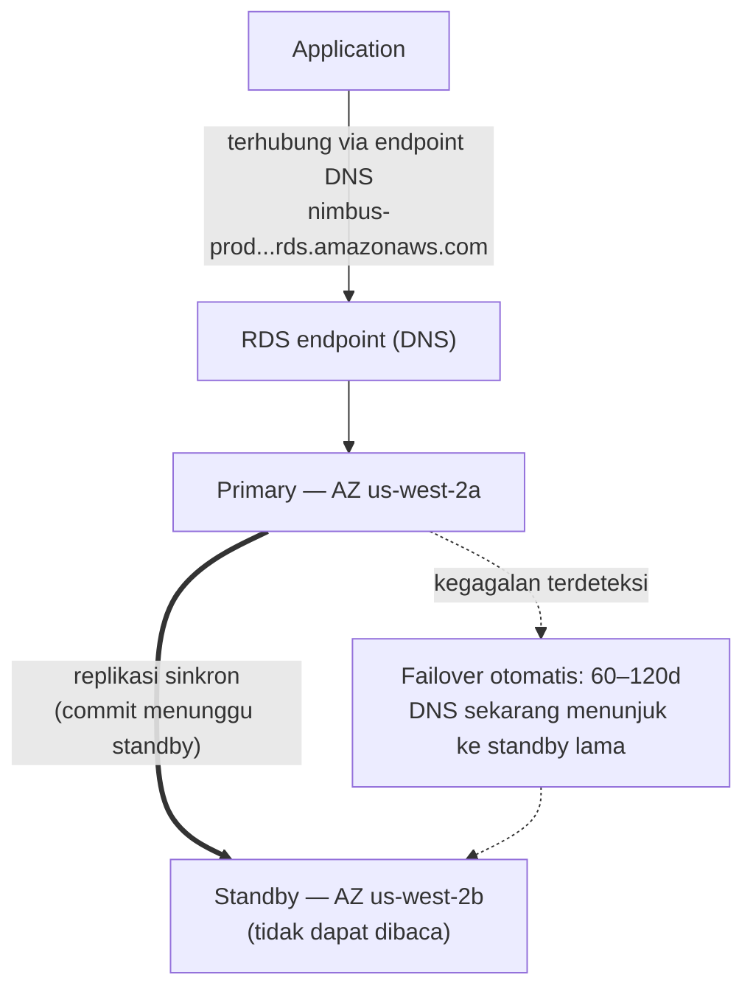

# Bab 8: Administrator Database yang Tidak Pernah Sakit

Saat itu pukul 3 pagi ketika peringatan itu masuk.

Priya satu-satunya yang terjaga. Ponselnya menyala di meja samping tempat tidur dan ia membacanya dalam gelap, kecerahan layar terlalu tinggi. Ia duduk. Ia menemukan laptopnya dari ingatan dan membukanya tanpa menyalakan lampu.

Keyboard berbunyi pelan di ruangan gelap.

Server basis data butuh patch keamanan — jenis yang membutuhkan restart. Kerentanan
itu nyata, patch tersedia, dan jendela untuk menerapkannya
tanpa mengganggu pelanggan adalah sekarang, di tengah malam, ketika lalu lintas
rendah.

Ia terhubung ke server. Ia menarik patch. Ia menerapkannya.

Lalu ia membaca catatan rilis.

Pembaruan paket menyentuh file konfigurasi yang digunakan PostgreSQL untuk mendefinisikan parameter koneksi. Catatan rilis menyertakan peringatan: tergantung pada bagaimana upgrade dilakukan, file konfigurasi yang dikustomisasi bisa diganti dengan versi default paket.

File konfigurasi mereka telah dikustomisasi. Leo telah mengeditnya dua bulan lalu untuk menyetel pengaturan max_connections.

Patch berjalan. Server restart. Basis data kembali online.

Priya menguji sebuah kueri. Itu berfungsi.

Ia memeriksa log. Semuanya terlihat normal.

Ia kembali tidur pukul 4:15 pagi.

Pukul 9:05 pagi, Leo membuka aplikasi dan mendapat kesalahan. Ia memeriksa basis data. Max connections diatur ke default: 100. Aplikasi mereka dikonfigurasi untuk menggunakan connection pool hingga 500.

Setiap upaya koneksi baru gagal. Aplikasi secara efektif kehilangan akses basis data.

"Apa yang terjadi?" tanya Maya.

"Patch-nya," kata Priya. Ia sudah melihat file konfigurasi. "Pembaruan paket menimpa file konfigurasi kustom kita dengan yang default. Penyetelan max_connections Leo hilang begitu saja — server restart dengan pengaturan bawaan dan tidak ada yang mendapat kesalahan. Ia diam-diam kembali ke default."

"Berapa lama untuk memperbaikinya?" tanya Leo.

"Dua puluh menit," kata Priya. "Tapi kita butuh jendela pemeliharaan. Ini membutuhkan perubahan konfigurasi dan restart."

"Kita punya restoran yang buka untuk makan siang dalam dua jam," kata Tom.

Priya memperbaikinya dalam delapan belas menit. Jendela pemeliharaan adalah dua belas menit downtime sebenarnya. Restoran terpengaruh, tetapi puncak belum dimulai.

Di pagi hari ia memberi tahu tim apa yang terjadi. Ada keheningan.

"Itu akan terjadi lagi," kata Tom.

"Itu akan terjadi setiap kali ada patch," kata Priya. "Dan selalu ada
patch. Pasti ada cara yang lebih baik untuk melakukan ini."

Waktu kueri delapan detik masih belum terselesaikan. Dan di minggu yang sama, ini: jendela pemeliharaan pukul 3 pagi yang berubah menjadi insiden pagi. Kedua masalah punya akar penyebab yang sama — Nimbus menjalankan basis data yang tidak siap mereka kelola.

Ada solusi. Itu hanya membutuhkan menyerahkan gagasan bahwa mereka perlu mengelola basis data sendiri.

**Masalah Basis Data Tradisional**

Ketika Anda menjalankan basis data sendiri di instance EC2, Anda bertanggung jawab atas segalanya.

Memasang perangkat lunak basis data. Mengonfigurasinya dengan aman. Mem-patch-nya ketika kerentanan
keamanan ditemukan. Mengambil cadangan. Menguji bahwa cadangan benar-benar berfungsi
(langkah yang dilewatkan sebagian besar tim sampai terlambat). Memantau ruang disk. Menyiapkan
replikasi untuk redundansi. Mengonfigurasi failover untuk ketika server utama mati.
Menyetel performa kueri. Mengelola koneksi di bawah beban.

Tidak satu pun dari ini adalah aplikasi. Tidak satu pun menambah fitur. Semuanya membutuhkan keahlian.

Persyaratan keahlian adalah masalah kuncinya. Administrator basis data yang berkualifikasi memahami
bukan hanya cara menjalankan basis data, tetapi cara:

- Memantau log kueri lambat dan mengidentifikasi bottleneck performa
- Mengukur memori untuk working set agar menghindari I/O disk
- Mengonfigurasi pengarsipan WAL untuk pemulihan titik-waktu
- Menyiapkan replikasi streaming sinkron dengan failover otomatis
- Menyetel connection pooling untuk mencegah kehabisan koneksi di bawah beban
- Menerapkan upgrade versi mayor tanpa kehilangan data atau downtime yang lama

Ini adalah keterampilan yang berbeda dan terspesialisasi. DBA senior menuntut gaji tinggi persis
karena melakukan semua ini dengan baik itu sulit. Sebagian besar startup tidak bisa mempekerjakan untuk itu. Sebagian besar
tim pengembangan tidak memilikinya.

Sebagian besar tim pengembangan bukan administrator basis data. Ini menciptakan pola yang dapat diprediksi:
basis data dipasang, dikonfigurasi minimal, lalu sebagian besar dilupakan sampai sesuatu
menjadi sangat salah secara katastrofik. Instance PostgreSQL Nimbus berjalan pada konfigurasi
default — max_connections pada 100, tidak ada connection pooling, cadangan manual yang telah Leo
jalankan dua kali lalu lupakan, dan tidak ada replikasi sama sekali.

Insiden patch pukul 3 pagi adalah gejala dari sistem yang dijalankan oleh orang-orang yang luar biasa
dalam membangun aplikasi dan tidak punya latar belakang dalam operasi basis data. Itu bukan
kritik — itu deskripsi akurat dari sebagian besar startup. Solusinya bukan untuk
mempekerjakan DBA. Solusinya adalah menggunakan layanan yang menyediakan operasi tingkat-DBA
secara otomatis.

"Apakah itu yang kita lakukan?" tanya Maya.

Jawaban Leo adalah keheningan, yang sama dengan ya.

**Basis Data Terkelola**

Bayangkan mempekerjakan administrator basis data yang tidak pernah sakit, secara otomatis menangani
setiap patch keamanan, mengambil cadangan setiap malam tanpa diminta, dan memperbaiki
diri mereka sendiri ketika sesuatu rusak. Mereka melakukan semua ini tanpa mengganggu Anda — dan mereka
tidak pernah, dalam keadaan apa pun, menyentuh logika aplikasi Anda.

AWS menyebut layanan ini **RDS** — Relational Database Service.

Dengan RDS, AWS mengelola:

- Memasang dan mem-patch mesin basis data
- Cadangan otomatis (disimpan di S3, dipertahankan hingga 35 hari)
- Failover otomatis (ketika utama mati, standby mengambil alih secara otomatis)
- Monitoring dan metrik
- Enkripsi at rest dan dalam transit
- Auto-scaling penyimpanan (jika Anda mengaktifkannya, disk tumbuh ketika penuh)

Anda mengelola:

- Skema basis data (struktur tabel Anda)
- Kueri dan logika aplikasi Anda
- Siapa yang punya akses ke basis data
- Tipe instance mana yang menjalankan basis data
- Penyetelan parameter (meskipun RDS menyediakan default yang masuk akal)

**Mesin yang Didukung**

RDS mendukung beberapa mesin basis data populer:

- **MySQL** — basis data relasional open-source yang paling banyak digunakan
- **PostgreSQL** — kuat, dapat diperluas, semakin populer untuk beban kerja kompleks
- **MariaDB** — fork MySQL open-source, sepenuhnya kompatibel
- **Oracle** — kelas-enterprise, digunakan di organisasi besar dengan persyaratan legacy
- **Microsoft SQL Server** — untuk lingkungan yang banyak Windows
- **Amazon Aurora** — mesin kompatibel-MySQL/PostgreSQL milik AWS sendiri, dibangun untuk cloud
  (kita membahas Aurora secara mendalam di Bab 24)

Untuk Nimbus, pilihannya adalah PostgreSQL. Itu yang dikenal Leo, dan ia menangani data
relasional dengan baik. Pilihan mesin lebih sedikit penting dari yang Anda kira untuk sebagian besar aplikasi —
manfaat operasional RDS berlaku terlepas dari itu.

Satu nuansa: ketika Anda menjalankan mesin di RDS, AWS memelihara patch versi minor
secara otomatis (selama jendela pemeliharaan yang Anda konfigurasi). Upgrade versi mayor —
beralih dari PostgreSQL 14 ke 15, misalnya — adalah operasi manual yang Anda
jadwalkan dan eksekusi. AWS menguji upgrade versi mayor dengan hati-hati, tetapi Anda harus mengujinya
di lingkungan staging terlebih dahulu. Perubahan versi mayor bisa memperkenalkan masalah
kompatibilitas dengan sintaks SQL spesifik, ekstensi, atau versi driver.

Leo menemukan ini ketika RDS menerapkan patch minor dan log aplikasi sebentar
menunjukkan peringatan deprecation tentang fungsi yang telah dihapus dalam sub-rilis.
Patch minor seharusnya pada dasarnya transparan — tetapi memantau log aplikasi Anda
setelah setiap jendela pemeliharaan adalah praktik yang baik.

"Sudahkah kita memikirkan apa yang terjadi jika patch minor merusak sesuatu?" tanya Priya.

"Kita rollback ke snapshot sebelumnya," kata Leo.

"Berapa lama itu memakan?"

Leo mencari waktu pemulihan RDS untuk ukuran basis data mereka. Untuk basis data 50GB pada
`db.m6i.large`: kira-kira 15 hingga 30 menit untuk memulihkan dari snapshot.

"Jadi kita punya jendela pemulihan 15-sampai-30-menit jika patch merusak produksi," kata Priya. "Dan kita menerapkan patch di jendela pemeliharaan pagi-pagi, jadi setidaknya dampaknya minimal."

"Dan kita menguji patch di staging terlebih dahulu," tambah Leo.

"Ya," kata Priya. "Itu juga."

**Pengukuran Instance RDS: Tidak Semua Beban Kerja Sama**

Ketika Anda membuat instance RDS, Anda memilih tipe instance — konsep yang sama dengan EC2, tetapi berlingkup pada beban kerja basis data. AWS mengorganisasi tipe instance RDS ke dalam beberapa tier yang berguna.

**Keluarga db.t3**: Instance performa burstable. Dirancang untuk pengembangan, staging, dan beban kerja produksi ringan yang tidak butuh CPU tinggi berkelanjutan. Sebuah `db.t3.micro` sesuai untuk basis data pengembangan dengan lalu lintas rendah. Sebuah `db.t3.medium` menangani beban produksi moderat dengan lonjakan sesekali.

Kompromi dengan instance T-series: mereka mengakumulasi kredit CPU selama periode utilisasi rendah dan membelanjakan kredit itu selama lonjakan. Jika Anda menjalankan instance T-series pada CPU tinggi berkelanjutan, Anda menghabiskan kredit dan performa di-throttle ke baseline yang mungkin tidak cukup.

**Keluarga db.m6i**: Instance general-purpose dengan performa konsisten dan non-burstable. `db.m6i.large` adalah titik awal yang umum untuk basis data produksi. Ini tidak punya batas kredit — CPU tersedia pada kapasitas penuh kapan pun Anda membutuhkannya.

**Keluarga db.r6i**: Instance memory-optimized. Lebih banyak RAM per vCPU daripada keluarga M. Sesuai untuk basis data dengan working set besar — kueri yang diuntungkan dari data berada di memori alih-alih mengambilnya dari disk pada setiap akses. Jika performa basis data Anda membaik secara dramatis ketika Anda menambah RAM, keluarga R adalah pilihan yang tepat.

Untuk Nimbus:

- Pengembangan dan staging: `db.t3.medium`. Memadai untuk kueri pengembangan, biaya rendah.
- Produksi: `db.m6i.large`. Performa konsisten, cukup RAM untuk working set menu dan pesanan, tanpa throttling kredit.

"Berapa lebih mahalnya m6i.large daripada t3.medium?" tanya Tom.

Leo memeriksa halaman harga. `db.t3.medium` berharga sekitar $55/bulan. `db.m6i.large` berharga sekitar $140/bulan. Selisihnya nyata, tetapi begitu juga selisih keandalannya.

"T3 akan throttle di bawah beban berkelanjutan," kata Priya. "Jika kita punya Jumat sibuk dan CPU tetap tinggi selama empat jam, t3 kehabisan kredit dan throttle. M6i tidak."

Tom menuliskan angkanya. Ia juga menuliskan biaya pemadaman Jumat dari dua minggu lalu. Perbandingannya tidak dekat.

Produksi berjalan di `db.m6i.large`.

**Multi-AZ: Standby yang Mengambil Alih**

Ini adalah fitur yang mengubah kalkulus keandalan sepenuhnya.

**Deployment Multi-AZ** berarti RDS memelihara instance standby sinkron di
Availability Zone yang berbeda dari utama. Setiap transaksi yang di-commit ke utama
direplikasi secara sinkron ke standby sebelum commit diakui.

Ketika utama gagal — kegagalan perangkat keras, pemadaman AZ, crash perangkat lunak — RDS
secara otomatis failover ke standby. Catatan DNS untuk endpoint basis data
diperbarui. Aplikasi Anda terhubung kembali ke utama yang baru.

Failover memakan 60–120 detik. Selama jendela itu, aplikasi Anda akan mengalami
kesalahan koneksi. Aplikasi yang ditulis dengan benar harus menangani ini dengan anggun (percobaan ulang
koneksi dengan backoff).

Standby bukan read replica. Ia tidak melayani lalu lintas baca. Satu-satunya tujuannya adalah
untuk siap mengambil alih.



(Catatan: opsi deployment **Multi-AZ DB Cluster** yang lebih baru menyimpan *dua* standby yang
**dapat** dibaca dan failover dalam ~35 detik — ujian mungkin membedakannya dari
deployment *instance* Multi-AZ klasik yang dideskripsikan di sini.)

"Berapa biaya Multi-AZ?" tanya Tom.

Kira-kira dua kali biaya satu instance — karena Anda secara harfiah menjalankan dua
instance basis data. Standby berbiaya sama dengan utama.

Tom membuka riwayat pesanan dan memperkirakan pendapatan per jam selama puncak Jumat mereka.

"Dan bagaimana jika seseorang mencoba masuk paksa selama jendela failover?" tanya Priya. "Ketika utama mati dan standby sedang dipromosikan, apakah ada enam puluh detik di mana kita terekspos?"

"Failover-nya transparan," kata Maya, "tapi pertanyaannya wajar. String koneksi harus menggunakan endpoint RDS, bukan IP yang di-hardcode — jika tidak, failover tidak akan mulus."

Multi-AZ diaktifkan sore itu.

**Cadangan Otomatis dan Pemulihan Titik-Waktu**

RDS mengambil cadangan otomatis setiap hari. AWS menyimpan cadangan ini di S3 (dikelola oleh
RDS — Anda tidak melihatnya langsung di konsol S3 Anda). Anda bisa memulihkan basis data
ke titik mana pun dalam periode retensi cadangan Anda.

Cadangan terjadi selama **jendela cadangan** yang dapat dikonfigurasi — periode lalu lintas rendah,
biasanya di pagi-pagi. (Ini adalah pengaturan terpisah dari **jendela
pemeliharaan**, yaitu ketika RDS menerapkan patch dan perubahan konfigurasi. Ujian
suka menguji bahwa ini adalah dua jendela yang berbeda.) Untuk sebagian besar tipe mesin, cadangan
tidak menyebabkan downtime — dan pada deployment Multi-AZ, snapshot diambil dari
standby, jadi utama tidak disentuh sama sekali.

**Pemulihan titik-waktu** adalah salah satu fitur yang paling berharga: Anda bisa memulihkan ke
detik mana pun dalam periode retensi Anda. Bukan hanya snapshot harian — *detik mana pun*.
Ini mungkin karena RDS terus-menerus mengarsipkan log transaksi selain
cadangan harian.

Jika seseorang secara tidak sengaja menjalankan `DELETE FROM orders WHERE 1=1` pada pukul 2:37 siang, Anda bisa
memulihkan ke pukul 2:36 siang.

Leo terlihat rileks ketika ia memahami ini.

"Saya sudah mengatur retensi cadangan ke satu hari," kata Leo. "Oh — tapi itu baik-baik saja, kan? Kita bisa mengubahnya?"

"Ubah ke tujuh hari minimum," kata Priya. "Tiga puluh untuk produksi."

Leo memperbaruinya segera.

"Bisakah kita memulihkan dari apa yang saya hapus bulan lalu?" tanyanya.

"Sebelum RDS? Tidak," kata Priya. "Setelah RDS? Ya."

Anda mungkin bertanya-tanya: apa perbedaan antara cadangan otomatis dan snapshot manual? Cadangan otomatis dihapus ketika periode retensi berakhir (hingga 35 hari). Snapshot manual dipertahankan tanpa batas sampai Anda secara eksplisit menghapusnya. Jika Anda perlu mempertahankan keadaan basis data secara permanen — sebelum migrasi besar, sebelum deployment berisiko — ambil snapshot manual.

**RDS Proxy: Memecahkan Masalah Koneksi dalam Skala Besar**

Dua minggu setelah migrasi ke RDS, Leo memperhatikan sesuatu di metrik.

Basis data menangani kueri dengan baik. Tapi jumlah koneksi terbuka tinggi — lebih tinggi dari yang ia harapkan. Dengan Auto Scaling Group menambahkan instance EC2 selama puncak, setiap instance baru membuka pool koneksi basis datanya sendiri. Sepuluh instance EC2, masing-masing dengan connection pool 50: lima ratus koneksi simultan ke basis data.

"PostgreSQL punya overhead untuk setiap koneksi," kata Priya. "Memori, CPU untuk connection handler. Lima ratus koneksi menggunakan jumlah sumber daya basis data yang berarti hanya untuk manajemen koneksi — sebelum ia melakukan pekerjaan sebenarnya."

"Bisakah kita mengurangi ukuran connection pool?" tanya Leo.

"Kita bisa," kata Priya. "Tapi kemudian kita berisiko permintaan mengantri menunggu koneksi selama puncak."

Solusi yang lebih baik: **RDS Proxy**.

RDS Proxy berada di antara aplikasi dan basis data. Instance EC2 terhubung ke Proxy, bukan langsung ke instance RDS. Proxy memelihara pool koneksi basis data dan melakukan multiplex permintaan aplikasi di seluruhnya. Jika sepuluh instance EC2 masing-masing membuka lima puluh koneksi ke Proxy, Proxy mungkin hanya memelihara seratus koneksi basis data aktual — membaginya secara efisien di semua permintaan aplikasi.

Manfaatnya:

**Connection pooling**: Lebih sedikit koneksi basis data aktual berarti lebih sedikit overhead memori pada instance RDS dan performa lebih baik di bawah beban.

**Failover lebih cepat**: Selama failover Multi-AZ, Proxy memelihara koneksi ke sisi aplikasi sambil membangun kembali koneksi basis data di backend. Aplikasi melihat jeda singkat alih-alih reset koneksi penuh. RDS Proxy mengurangi dampak failover dari 60–120 detik menjadi biasanya 30 detik atau kurang.

**Autentikasi IAM**: Alih-alih menyematkan kredensial basis data di aplikasi, aplikasi bisa mengautentikasi ke RDS Proxy menggunakan IAM role. Proxy menangani kredensial basis data yang sebenarnya. Ini menghilangkan rahasia dari lingkungan aplikasi sepenuhnya.

"Berapa biaya RDS Proxy?" tanya Tom.

Ia berharga kira-kira $0,015 per vCPU-jam dari instance RDS yang mendasari, ditagih terpisah dari instance itu sendiri. Untuk `db.m6i.large` (2 vCPU), Proxy menambah kira-kira $22/bulan.

Tom melihat grafik jumlah koneksi — lima ratus koneksi bersaing untuk sumber daya basis data selama puncak — dan melihat biaya $22/bulan.

"Itu lebih murah daripada meng-upgrade ke instance RDS yang lebih besar untuk menangani overhead koneksi," katanya.

RDS Proxy diaktifkan minggu itu.

"Dan bagaimana jika seseorang mencoba masuk paksa melalui Proxy?" tanya Priya. "Apakah autentikasi IAM untuk Proxy mengurangi permukaan serangan?"

"Ya," Priya menjawab pertanyaannya sendiri. "Tidak ada kredensial basis data di lingkungan aplikasi berarti tidak ada kredensial basis data untuk dicuri dari aplikasi."

Ia mengaktifkan autentikasi IAM untuk Proxy.

**Read Replica: Menskalakan Lalu Lintas Baca**

Multi-AZ adalah tentang ketersediaan. **Read replica** adalah tentang performa.

Read replica adalah salinan asinkron dari basis data utama Anda yang bisa melayani kueri
baca. Anda bisa punya hingga 15 read replica untuk mesin RDS utama — MySQL, PostgreSQL, dan MariaDB (Aurora juga mendukung hingga 15 Aurora Replica, berbagi volume penyimpanan yang sama).

Aplikasi dimodifikasi untuk mengirim kueri baca ke replica dan kueri tulis ke
utama. Ini mendistribusikan beban: utama menangani tulis dan transaksi
kompleks; replica menangani baca.

Karakteristik kunci:

- Replikasi bersifat **asinkron** — bisa ada penundaan kecil (lag) antara
  utama dan replica. Jika Anda menulis catatan dan langsung membaca dari replica,
  Anda mungkin belum melihatnya.
- Read replica bisa di Region yang sama atau di Region berbeda (replica lintas-Region
  menambah latensi tetapi memungkinkan distribusi geografis).
- Read replica bisa dipromosikan menjadi basis data mandiri dalam skenario bencana.

Untuk Nimbus: pencarian menu adalah baca. Riwayat pesanan adalah baca. Sebagian besar
lalu lintas adalah lalu lintas baca. Menambahkan read replica dan merutekan baca kepadanya memotong beban
basis data utama secara signifikan.

Kita membahas read replica lebih menyeluruh di Bab 24 ketika kita membahas Aurora.

**Jika Berat-Baca Maka Tambah Replica Tapi Awasi Lag**

Jika beban kerja Anda berat-baca, menambahkan read replica mengurangi beban pada utama dan meningkatkan performa kueri — tetapi replikasi asinkron, yang berarti replica bisa sedikit di belakang utama. Jika aplikasi Anda menulis catatan dan langsung membacanya kembali, ia harus membaca dari utama, bukan replica. Salah tentang ini menghasilkan bug kesegaran data yang halus dan sulit-di-debug: pengguna memesan, halaman konfirmasi mengkueri replica, replica belum menyusul, pesanan tampak hilang. Ini disebut konsistensi read-your-writes, dan itu adalah kesalahan paling umum yang dibuat tim ketika mereka pertama kali menambahkan replica.

**Performance Insights: Menemukan Kueri yang Lambat**

Waktu pemuatan menu delapan detik masih menjadi masalah. Pindah ke RDS meningkatkan keandalan, tetapi kuerinya masih lambat.

Leo menambahkan read replica dan merutekan kueri menu kepadanya. Waktu pemuatan menu turun ke sekitar empat detik. Lebih baik. Masih tidak bagus.

"Kuerinya masih lambat," kata Maya. "Kita memperbaiki bottleneck, tetapi kita tidak memperbaikinya."

RDS menyertakan fitur yang disebut **Performance Insights** — alat monitoring yang menunjukkan kueri mana yang mengonsumsi sumber daya basis data terbanyak, sesi mana yang menunggu, dan apa yang mereka tunggu.

Leo mengaktifkan Performance Insights pada read replica dan memuat halaman menu berulang kali selama sesi uji sore.

Dasbor Performance Insights menunjukkan satu kueri mendominasi beban: pemindaian tabel penuh dari tabel `menu_items`, mengambil semua 22.000 baris setiap kali halaman menu dimuat. Tidak ada indeks pada `restaurant_id` — kolom yang aplikasi gunakan untuk memfilter.

Waktu eksekusi tanpa indeks: 8,2 detik.

Leo menambahkan indeks.

```sql
CREATE INDEX idx_menu_items_restaurant_id ON menu_items(restaurant_id);
```

Waktu eksekusi dengan indeks: 14 milidetik.

8.200 milidetik menjadi 14 milidetik. Perbedaan antara aplikasi pemesanan restoran yang mengusir pelanggan dan yang mereka gunakan tanpa berpikir.

"Itu masalahnya selama ini?" kata Maya.

"Itu masalahnya," kata Leo.

"Dan Performance Insights menemukannya dalam berapa lama?"

"Sekitar dua puluh menit."

Tom sudah menghitung. Tiga minggu waktu pemuatan menu yang tidak optimal, diperkirakan 200.000 pemuatan halaman menu selama periode itu, diperkirakan 15% pengabaian karena lambat. Angka yang ia dapatkan tidak menyenangkan.

"Tambahkan indeks yang hilang sebelum peluncuran lain kali," katanya.

"Akan ada daftar periksa," kata Priya. Ia sudah menulisnya.

**Kapan Tidak Menggunakan RDS**

RDS sangat baik untuk berbagai macam beban kerja basis data relasional. Ia bukan jawaban yang tepat untuk segalanya.

**Ketika Anda butuh akses tingkat-OS**: RDS tidak memberi Anda akses ke sistem operasi yang mendasari. Anda tidak bisa memasang paket OS kustom, memodifikasi parameter kernel, atau menjalankan alat yang membutuhkan akses root ke server basis data. Jika basis data Anda punya persyaratan yang menuntut akses OS — konfigurasi Oracle tertentu, driver penyimpanan kustom, antarmuka jaringan spesifik — Anda perlu menjalankan basis data di instance EC2 secara langsung.

**Ketika Anda menggunakan mesin yang tidak didukung**: RDS mendukung MySQL, PostgreSQL, MariaDB, Oracle, SQL Server, dan Aurora. Jika aplikasi Anda menggunakan mesin basis data yang berbeda — CockroachDB, SingleStore, Greenplum — Anda menjalankannya di EC2, bukan RDS.

**Ketika Anda butuh penskalaan horizontal berat-tulis**: RDS menskalakan baca melalui replica. Tulis pergi ke satu instance utama. Jika beban kerja Anda berat-tulis dan perlu didistribusikan di banyak node tulis, RDS bukan arsitektur yang tepat. Global Database Aurora bisa membantu pada skala besar, tetapi untuk persyaratan skala-tulis ekstrem, basis data terdistribusi seperti DynamoDB (Bab 9) atau CockroachDB yang berjalan di EC2 adalah alat yang sesuai.

**Ketika biaya terkelola melebihi biaya operasional**: Untuk beban kerja yang sangat besar dan stabil di mana tim Anda punya keahlian administrasi basis data yang sejati, menjalankan PostgreSQL di EC2 dengan tooling Anda sendiri bisa lebih murah daripada RDS. Ini tidak biasa untuk tim yang bukan terutama toko DBA. Tapi itu nyata, dan arsitek yang baik mengakuinya.

Untuk Nimbus — startup tanpa sumber daya DBA khusus, menjalankan PostgreSQL di layanan terkelola, dengan pertumbuhan yang tidak dapat diprediksi — RDS jelas pilihan yang tepat.

**Parameter Group dan Option Group RDS**

Dua mekanisme konfigurasi muncul dalam ujian:

**Parameter group** mengontrol pengaturan mesin basis data — seperti koneksi maksimum,
ukuran query cache, nilai timeout. RDS membuat parameter group default yang berfungsi
untuk sebagian besar kasus. Anda membuat parameter group kustom ketika Anda perlu menyetel pengaturan spesifik.

**Option group** mengaktifkan fitur tambahan untuk beberapa mesin — seperti enkripsi
jaringan natif Oracle atau enkripsi data transparan SQL Server. Sebagian besar deployment mesin
open-source tidak butuh option group kustom.

Anda bisa mengkustomisasi perilaku mesin basis data melalui mekanisme ini — tetapi default berfungsi untuk sebagian besar tim yang baru memulai.

### Memasukkan Data: AWS Database Migration Service

Beberapa minggu kemudian, Tom tiba di standup dengan slide.

Nimbus sedang mengakuisisi pesaing regional kecil. Sistem pemesanan mereka berjalan di basis data MySQL di fasilitas co-location. Sistem tidak bisa offline selama migrasi — restoran menggunakannya.

"Kita perlu memindahkan data mereka ke RDS," kata Tom. "Tanpa mematikan sistem."

"Seberapa besar basis datanya?" tanya Leo.

"Sekitar 80 gigabyte."

"Kapan mereka perlu beralih?"

"Enam minggu."

Priya sudah membuka dokumentasi. "AWS DMS," katanya.

**AWS DMS (Database Migration Service)** memindahkan data dari basis data sumber ke basis data target dengan downtime minimal. Ia menangani migrasi dalam dua fase: pemuatan penuh data yang ada, diikuti oleh replikasi berkelanjutan perubahan saat sumber terus berjalan.

Ada dua tipe migrasi:

**Migrasi homogen:** sumber dan target adalah mesin yang sama — MySQL ke RDS MySQL, PostgreSQL ke Aurora PostgreSQL. Skema kompatibel; DMS memigrasikan data secara langsung.

**Migrasi heterogen:** sumber dan target adalah mesin yang berbeda — Oracle ke Aurora PostgreSQL, SQL Server ke RDS MySQL. Skema harus dikonversi terlebih dahulu. Ini membutuhkan **AWS Schema Conversion Tool (SCT)** untuk menerjemahkan skema, lalu DMS untuk memindahkan data.

Untuk akuisisi Nimbus: MySQL ke RDS MySQL. Homogen. Tidak butuh SCT.

Bagaimana ia bekerja dalam praktik:

1. DMS membaca dari sumber — basis data MySQL co-location
2. **Pemuatan penuh**: DMS menyalin semua data yang ada ke instance RDS target
3. **CDC (Change Data Capture)**: setelah pemuatan penuh, DMS membaca log transaksi basis data sumber dan mereplikasi perubahan berkelanjutan ke target dalam waktu mendekati real-time
4. Sumber terus berjalan. Ketika tim siap, mereka membalik string koneksi.

"Jadi sistem pemesanan restoran tetap hidup sepanjang waktu?" tanya Tom.

"Sepanjang waktu," Priya mengonfirmasi. "Sumber dan target tetap sinkron via CDC. Ketika kita siap, kita membalik endpoint. Downtime-nya adalah detik yang dibutuhkan untuk perubahan itu menyebar."

DMS mendukung puluhan kombinasi sumber dan target: Oracle, SQL Server, MySQL, PostgreSQL, MongoDB, DynamoDB, S3, Redshift, Aurora, dan lainnya.

"Tunggu — tapi *mengapa* kita butuh alat terpisah untuk migrasi heterogen?" tanya Maya. "Tidak bisakah DMS hanya mencari tahu perbedaan skema?"

"VARCHAR di Oracle tidak sama dengan VARCHAR di PostgreSQL," kata Priya. "Tipe data, stored procedure, sequence, fungsi proprietari — mereka tidak memetakan satu-ke-satu. SCT menganalisis skema sumber dan menghasilkan ekuivalen terdekat untuk target. DMS kemudian memindahkan data ke skema yang dikonversi itu. Memisahkan konversi skema dari pemindahan data adalah yang membuat prosesnya andal."

"Dan bagaimana jika seseorang mencoba masuk paksa melalui instance replikasi DMS?" tanya Priya pada dirinya sendiri sesaat kemudian. "Ia butuh akses baca ke sumber dan akses tulis ke target."

"Hak istimewa terkecil di kedua ujung," kata Leo. "IAM hanya-baca di sumber. Akses tulis berlingkup hanya ke target migrasi. Dan instance replikasi tetap di subnet privat."

Priya menuliskannya.

## Kekuatan dan Keterbatasan

**Mengapa RDS sangat baik**:

- Menghilangkan beban operasional mengelola perangkat lunak basis data
- Cadangan otomatis dan pemulihan titik-waktu
- Multi-AZ untuk failover otomatis dengan RTO minimal
- Read replica untuk menskalakan lalu lintas baca
- Enkripsi at rest dan dalam transit bawaan
- Semua mesin basis data relasional utama didukung
- RDS Proxy untuk connection pooling dan respons failover yang ditingkatkan

**Di mana RDS punya batasan**:

- Anda tidak bisa mengakses OS yang mendasari. Jika basis data Anda punya persyaratan yang menuntut
  akses tingkat-OS, Anda mungkin perlu menjalankan basis data berbasis-EC2 Anda sendiri.
- RDS bukan serverless (dengan pengecualian — Aurora Serverless ada, dibahas di
  Bab 24). Anda membayar untuk instance yang berjalan bahkan jika menganggur.
- RDS tidak dirancang untuk basis data yang di-shard secara horizontal. Untuk scale-out masif
  beban kerja relasional berat-tulis, Anda mungkin akhirnya butuh arsitektur yang berbeda.
- Untuk pola data non-relasional (NoSQL), DynamoDB (Bab 9) lebih sesuai.

## Ringkasan

Jendela patch pukul 3 pagi Priya adalah gejalanya. Akar penyebabnya adalah Nimbus mengelola basis data yang bisa ditangani layanan terkelola dengan lebih baik. RDS tidak hanya menghilangkan panggilan bangun pukul 3 pagi — ia menggeser tanggung jawab patching, failover, cadangan, dan manajemen koneksi ke AWS, membebaskan tim untuk fokus pada kode aplikasi yang sebenarnya melayani pelanggan. Kompromi-nya adalah kehilangan akses tingkat-OS, yang jarang penting dan jauh lebih sedikit dari kedengarannya.

- **Amazon RDS** adalah layanan basis data relasional terkelola. AWS menangani patching, cadangan, failover, dan penyimpanan. Anda menangani skema, kueri, dan logika aplikasi.
- **Multi-AZ** memelihara standby sinkron di AZ yang berbeda. Failover otomatis terjadi dalam 60–120 detik. Selalu gunakan nama DNS endpoint RDS dalam string koneksi — bukan IP yang di-hardcode — sehingga failover transparan.
- **Read replica** adalah salinan asinkron yang melayani lalu lintas baca. Lag replikasi berarti mereka mungkin sedikit di belakang — konsistensi read-your-writes membutuhkan membaca dari utama segera setelah tulis.
- **RDS Proxy** mem-pool koneksi, mengurangi overhead dan meningkatkan kecepatan failover. Kritis untuk beban kerja berbasis-Lambda yang bisa membuat ribuan koneksi berumur pendek.
- **Performance Insights** mengidentifikasi kueri lambat — menemukan indeks yang hilang bisa mengubah kueri 8 detik menjadi 14 milidetik. Upgrade versi mayor bersifat manual; uji di staging terlebih dahulu.

## Tips Ujian

*Domain SAA-C03 3 — Tugas 3.3 (solusi basis data)*

- **Multi-AZ adalah untuk ketersediaan tinggi, bukan performa.** Standby tidak melayani
  lalu lintas baca. Read replica untuk performa. Perbedaan ini sering diuji.
- **Failover Multi-AZ otomatis.** Anda tidak mengonfigurasi kapan atau bagaimana itu terjadi.
  RDS memantau utama dan memicu failover secara otomatis.
- **Lag replikasi penting.** Read replica bisa sedikit di belakang utama.
  Jika aplikasi Anda membutuhkan membaca data yang baru saja ditulis, ia harus membaca dari
  utama, bukan replica. Ini disebut "konsistensi read-your-writes."
- **Cadangan otomatis dipertahankan selama 0–35 hari.** Mengatur retensi ke 0
  menonaktifkan cadangan otomatis. Snapshot manual dipertahankan tanpa batas sampai
  Anda menghapusnya.
- **Auto-scaling penyimpanan RDS** mencegah pemadaman disk-penuh. Aktifkan itu. Ia hanya berskala
  naik, tidak pernah turun. Ujian mungkin menguji apakah Anda tahu asimetri ini.
- **RDS Proxy** muncul dalam skenario ujian yang melibatkan fungsi Lambda terhubung ke RDS
  (Lambda bisa membuat ribuan koneksi berumur pendek, yang membanjiri basis data
  tanpa Proxy), atau skenario yang membutuhkan failover Multi-AZ lebih cepat.
- **Instance db.t3 burst dan throttle.** Skenario ujian yang mendeskripsikan degradasi
  performa intermiten pada instance RDS kecil mungkin mendeskripsikan kehabisan kredit CPU
  pada instance T-series. Perbaikannya adalah meng-upgrade ke instance seri M atau R.
- **Endpoint DNS Multi-AZ**: Ketika failover Multi-AZ terjadi, catatan DNS endpoint RDS
  diperbarui untuk menunjuk ke utama baru. Aplikasi yang menggunakan endpoint RDS
  (bukan IP yang di-hardcode) terhubung kembali secara otomatis. Aplikasi dengan TTL DNS panjang atau
  alamat IP yang di-hardcode tidak akan terhubung kembali secara otomatis. Selalu gunakan endpoint RDS.
- **Promosi read replica**: Read replica bisa dipromosikan menjadi instance DB mandiri
  — berguna untuk pemulihan bencana jika utama hilang dan Multi-AZ tidak dikonfigurasi.
  Promosi adalah operasi satu-arah: replica menjadi utama dan tidak lagi
  bereplikasi dari yang asli. Skenario ujian yang menanyakan tentang "secara manual mempromosikan" atau
  "mengonversi read replica menjadi utama" melibatkan operasi ini.
- **Performance Insights** mengidentifikasi kueri SQL teratas berdasarkan waktu tunggu dan penggunaan CPU.
  Ketika skenario ujian menanyakan cara mendiagnosis kueri lambat pada basis data RDS, Performance
  Insights adalah jawaban natif-AWS.
- **RDS vs. menjalankan basis data di EC2**: Ujian terkadang menyajikan ini sebagai pilihan.
  RDS menyediakan operasi terkelola tetapi membatasi akses tingkat-OS. Basis data berbasis-EC2 memberi
  Anda kontrol penuh tetapi membutuhkan keahlian DBA untuk operasi. Frasa "akses tingkat-OS dibutuhkan"
  dalam skenario ujian adalah sinyal untuk memilih EC2 daripada RDS.
- **AWS DMS:** Memigrasikan basis data dengan downtime minimal menggunakan pemuatan penuh + CDC. Homogen (mesin sama) = DMS secara langsung. Heterogen (mesin berbeda) = SCT untuk mengonversi skema terlebih dahulu, lalu DMS untuk memindahkan data. Pemicu ujian: "migrasi basis data dengan downtime minimal" atau "Oracle ke Aurora" → DMS + SCT.

## Latihan

**Latihan 1 — Mengingat Kembali**

Dengan kata-kata Anda sendiri: apa perbedaan antara Multi-AZ dan read replica di RDS?
Masalah apa yang dipecahkan masing-masing?

*(Petunjuk: Satu melindungi dari downtime; yang lain meningkatkan performa di bawah beban
berat-baca. Mereka memecahkan masalah yang berbeda dan bisa digunakan bersama.)*

**Latihan 2 — Skenario SAA-C03**

*Skenario*: Sebuah perusahaan menjalankan basis data PostgreSQL produksi di RDS. Basis data
mengalami lalu lintas baca tinggi karena kueri pelaporan yang berjalan sepanjang hari.
Tim juga khawatir tentang ketersediaan basis data — mereka tidak mampu lebih dari
beberapa menit downtime dalam skenario kegagalan. Mereka ingin meminimalkan dampak pada
basis data utama dari beban kerja pelaporan.

Kombinasi fitur RDS mana yang PALING BAIK mengatasi kedua kekhawatiran?

A) Aktifkan Multi-AZ dan jalankan semua kueri terhadap instance standby  
B) Ambil snapshot manual lebih sering dan pulihkan dari mereka jika utama gagal  
C) Buat banyak read replica dan nonaktifkan Multi-AZ untuk mengurangi biaya  
D) Aktifkan Multi-AZ untuk perlindungan failover dan buat read replica untuk kueri pelaporan

**Petunjuk 1**: Dua persyaratannya adalah: (1) ketersediaan selama kegagalan, (2) mengalihkan
baca. Fitur mana yang mengatasi persyaratan mana?

**Petunjuk 2**: Multi-AZ menyediakan failover otomatis. Standby TIDAK melayani lalu lintas baca.
Jadi Multi-AZ sendiri tidak membantu dengan masalah baca.

**Petunjuk 3**: Read replica melayani lalu lintas baca. Multi-AZ menyediakan failover. Anda butuh keduanya.

**Jawaban**: D

**Penjelasan**: Multi-AZ menyediakan failover otomatis ke standby di AZ yang berbeda —
ini mengatasi persyaratan ketersediaan. Read replica memungkinkan kueri pelaporan
berjalan tanpa memengaruhi basis data utama — ini mengatasi persyaratan
performa. Kedua fitur bisa digunakan secara bersamaan.

**Mengapa bukan A?** Standby Multi-AZ tidak bisa melayani lalu lintas baca. Ia khusus untuk
failover. Mencoba mengkuerinya secara langsung tidak didukung.

**Mengapa bukan B?** Snapshot manual memulihkan salinan penuh basis data — proses yang jauh
lebih lama (berpotensi berjam-jam untuk basis data besar). Ini tidak memenuhi persyaratan "beberapa menit
downtime."

**Mengapa bukan C?** Read replica membantu dengan performa baca tetapi tidak menyediakan failover
otomatis. Jika utama gagal, Anda perlu secara manual mempromosikan read replica —
yang memakan waktu dan tidak otomatis.

*Domain SAA-C03 3 — Tugas 3.3*

**Latihan 3 — Tantangan Arsitektur** *(Opsional)*

Nimbus sedang mempertimbangkan memigrasikan basis data PostgreSQL yang dikelola sendiri yang ada
(berjalan di instance EC2) ke RDS PostgreSQL. Migrasi perlu terjadi
dengan downtime minimal — idealnya di bawah 15 menit. Basis datanya 200 GB.

Pendekatan apa yang akan Anda rekomendasikan? Layanan AWS apa yang mungkin membantu dengan migrasi?
Risiko apa yang akan Anda uji sebelum beralih lalu lintas produksi?

*(Tidak ada satu jawaban yang benar. Pikirkan tentang AWS Database Migration Service,
replikasi logis, dan risiko inkonsistensi data selama cutover.)*

## Adegan Pasca-Kredit

Pada akhir hari, Nimbus telah bermigrasi ke RDS PostgreSQL dengan Multi-AZ diaktifkan. Migrasi
itu sendiri memakan sebagian besar sore — Leo menggunakan pendekatan backup-and-restore,
dengan jendela pemeliharaan singkat.

Tom telah mengawasi tagihan dengan hati-hati.

"Instance RDS," katanya, "berharga dua kali lipat dari basis data EC2."

"Dan cadangan otomatis?" tanya Maya.

"Sedikit lebih."

"Dan failover yang akan kita dapat gratis jika utama mati?"

Tom tidak punya harga untuk itu. Ia menuliskannya sebagai pertanyaan.

Tiga hari kemudian, basis data sehat. Waktu kueri telah turun secara dramatis setelah Leo menambahkan indeks yang hilang. Menu dimuat dalam kurang dari satu detik.

"Masalahnya," kata Priya, "bukan mesin basis datanya. Itu model datanya."

Ia berhenti.

"Beberapa data ini tidak relasional sama sekali. Item menu, profil restoran,
zona pengiriman — data ini punya bentuk yang bervariasi. SQL melawan kita."

Leo sudah meneliti sesuatu.

"Bagaimana jika kita menggunakan jenis basis data yang berbeda untuk menu?" katanya.

Di bab berikutnya: basis data yang tidak melambat, bahkan ketika sejuta orang memesan sekaligus.
