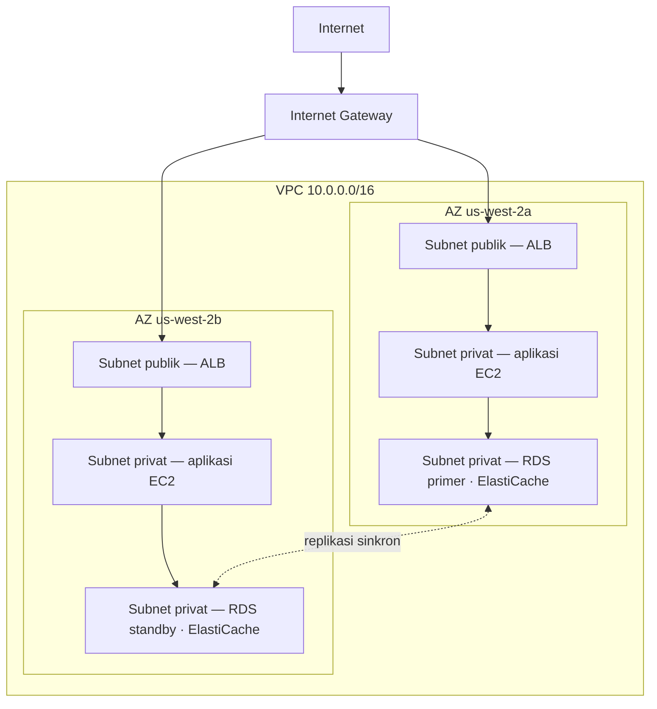

# Bab 11: Sudut Pribadi Anda di Cloud

Priya memiliki selembar kertas dengan gambar di atasnya.

Gambar itu tidak rumit. Sebuah persegi panjang, berlabel "AWS." Di dalam persegi panjang, sekelompok kotak: instans EC2, database RDS, klaster ElastiCache. Garis-garis yang menghubungkan semuanya ke semuanya. Dan di luar persegi panjang, sebuah label tunggal: "Internet."

Ia meletakkannya di tengah meja.

---

*Lapisan caching sudah bekerja. Redis telah memangkas pemuatan halaman dari 188 milidetik menjadi 12. Tetapi selama Leo merayakan kemenangan itu, Priya telah membaca log jaringan — dan ia tidak menyukai apa yang dilihatnya. Setiap layanan berada di jaringan datar yang sama. Database memiliki alamat IP publik. Klaster Redis secara teknis dapat dijangkau dari luar. Aplikasi berfungsi, tetapi arsitekturnya adalah sebuah tempat parkir: tanpa pagar, tanpa gerbang, tanpa zona.*

---

"Ini yang kita miliki," katanya. "Database kita memiliki alamat IP publik. Lapisan cache kita dapat dijangkau dari internet. Instans EC2 kita semuanya berada di jaringan datar yang sama."

"Kedengarannya baik-baik saja," kata Leo. "Kita memiliki security group."

"Security group yang Anda konfigurasi," kata Priya. "Di malam hari. Selama pengaturan awal."

Leo tidak mengatakan apa-apa.

"Aku tidak mengkritik konfigurasinya," katanya. "Aku mengatakan bahwa ketika semuanya hidup di jaringan publik yang datar, satu kesalahan konfigurasi adalah perbedaan antara sistem yang berfungsi dan sistem yang dapat diakses oleh semua orang di internet."

Ia mengambil spidol merah dan menggambar lingkaran di sekitar database.

"Ini seharusnya tidak dapat dijangkau dari internet. Sama sekali. Tidak melalui aturan security group, tidak melalui konfigurasi yang diperkuat. Ini seharusnya tidak dapat dijangkau secara struktural."

"Kita perlu berbicara tentang arsitektur jaringan," kata Maya.

"Kita perlu membicarakannya tiga bulan lalu," kata Priya. "Tetapi sekarang juga tidak apa-apa."

Tim berkumpul di sekitar papan tulis untuk pertama kalinya dalam beberapa minggu.

**Masalah dengan Tempat Parkir Terbuka**

Bayangkan sebuah garasi parkir publik yang sangat besar. Sepuluh ribu mobil. Mobil apa pun dapat parkir di mana saja. Tidak ada penghalang antara zona, tidak ada gerbang, tidak ada bagian yang dipesan.

Ini adalah jaringan terbuka. Setiap layanan dapat menjangkau setiap layanan lain. Server web Anda dapat berbicara dengan database Anda. Database Anda dapat menjangkau internet. Lapisan caching Anda dapat menerima koneksi dari mana saja.

Ketika semuanya dapat berbicara dengan semuanya, satu kompromi memengaruhi semuanya.

"Jadi jika seseorang menerobos masuk ke garasi parkir," kata Tom, "mereka dapat masuk ke mobil mana pun."

"Dan dari mobil mana pun, berkendara ke mana saja," konfirmasi Priya. "Kita menginginkan pagar. Kita menginginkan gerbang terkunci. Kita menginginkan zona."

VPC adalah cara Anda membangun zona-zona itu di AWS.

**Apa Itu VPC?**

"Tunggu — tetapi *mengapa* kita melakukannya seperti itu?" tanya Maya. "Jika kita sudah memiliki security group di setiap sumber daya, mengapa kita membutuhkan VPC? Bukankah security group melakukan pekerjaan yang sama?"

Security group dan VPC melindungi pada level yang berbeda. Sebuah security group adalah aturan yang dilampirkan ke sumber daya tertentu — ia mengatakan "instans EC2 ini hanya menerima lalu lintas pada port 8080 dari load balancer." Tetapi ia tetap berada di jaringan publik. Alamat IP-nya tetap dapat dijangkau; aturan hanya memblokir koneksi di pintu. Sebuah VPC menghilangkan pintu dari jalan publik sepenuhnya. Sebuah sumber daya di subnet privat tidak memiliki *rute* ke internet — dan secara konvensi tidak ada IP publik — sehingga ia tidak dapat dijangkau dari internet, apa pun yang dikatakan security group. Itu adalah jaminan struktural, bukan jaminan konfigurasi.

Sebuah **Virtual Private Cloud (VPC)** adalah bagian dari cloud AWS yang terisolasi secara logis — sebuah jaringan privat yang Anda definisikan, yang secara default hanya dapat diakses oleh sumber daya Anda.

Anggap saja sebagai sebuah lahan privat berpagar di dalam garasi parkir publik yang sangat besar. Lahan Anda memiliki aturannya sendiri: siapa yang bisa masuk, siapa yang bisa keluar, rute apa yang ada di antara bagian-bagian.

Ketika Anda membuat VPC, Anda mendefinisikan:

**Sebuah blok CIDR**: Rentang alamat IP yang tersedia di dalam jaringan Anda. Misalnya, `10.0.0.0/16` memberi Anda 65.536 kemungkinan alamat IP (10.0.0.0 hingga 10.0.255.255).

**Subnet**: Subdivisi dari VPC Anda, masing-masing diberi sebagian dari rentang alamat IP Anda dan dikaitkan dengan Availability Zone tertentu.

**Route table**: Aturan yang menentukan ke mana lalu lintas jaringan pergi.

**Internet Gateway**: Koneksi antara VPC Anda dan internet publik.

**Subnet: Publik vs Privat**

Tidak semua sumber daya harus dapat diakses publik.

Server web Anda perlu menerima lalu lintas dari internet — peramban pengguna perlu menjangkaunya.

Database Anda seharusnya *tidak pernah* menerima lalu lintas dari internet — hanya server web Anda yang seharusnya dapat berbicara dengannya.

Di sinilah subnet berperan.

Sebuah **subnet publik** terhubung ke Internet Gateway dan dapat memiliki sumber daya dengan alamat IP publik. Lalu lintas dapat mengalir ke dan dari internet.

Sebuah **subnet privat** tidak memiliki rute ke internet di route table-nya. Sumber daya di subnet privat hanya dapat berkomunikasi dengan sumber daya lain di VPC Anda (kecuali Anda menyiapkan rute keluar tertentu). Secara konvensi, mereka juga tidak memiliki alamat IP publik.

Untuk Nimbus, desainnya menjadi jelas:



Load balancer menghadap publik — ia perlu menerima lalu lintas dari internet. Instans EC2 bersifat privat — mereka hanya menerima lalu lintas dari load balancer. Database bersifat privat — mereka hanya menerima lalu lintas dari instans EC2.

"Jadi untuk menjangkau database," kata Tom, "seseorang harus melewati load balancer, lalu melewati instans EC2, lalu melewati security group database?"

"Tiga lapisan," konfirmasi Priya. "Defense in depth."

---

**Rencana CIDR Nimbus**

"Tunggu — tetapi *mengapa* kita melakukannya seperti itu?" tanya Maya, melihat pilihan blok CIDR. "Mengapa Priya begitu spesifik tentang rentang alamat IP? Tidak bisakah kita gunakan saja apa pun yang menjadi default AWS?"

"Karena blok CIDR sangat sulit diubah kemudian," kata Priya. "Dan karena jika kita pernah menghubungkan VPC ini ke VPC lain, atau ke jaringan on-premises, rentang IP yang tumpang tindih menyebabkan kegagalan routing yang menyakitkan untuk di-debug."

Ia menggambar rencananya di papan tulis.

VPC Nimbus: `10.0.0.0/16` — total 65.536 alamat.

| Subnet | CIDR | AZ | Tujuan |
|---|---|---|---|
| Public A | 10.0.0.0/24 | us-west-2a | Load balancer |
| Public B | 10.0.1.0/24 | us-west-2b | Load balancer |
| Private App A | 10.0.10.0/24 | us-west-2a | Server aplikasi EC2 |
| Private App B | 10.0.11.0/24 | us-west-2b | Server aplikasi EC2 |
| Private Data A | 10.0.20.0/24 | us-west-2a | RDS, ElastiCache |
| Private Data B | 10.0.21.0/24 | us-west-2b | RDS, ElastiCache |

"Mengapa tidak jadikan saja semuanya /16?" tanya Leo.

"Karena subnet di AZ yang berbeda tidak boleh berbagi ruang alamat. Setiap subnet berada di satu AZ. Jika kita pernah mem-peer VPC ini dengan yang lain, semakin granular kita, semakin kecil kemungkinan kita memiliki konflik. Dan setiap /24 memberi kita 251 alamat yang dapat digunakan — lebih dari cukup untuk satu tier mana pun."

"AWS mencadangkan lima alamat di setiap subnet," Tom mengamati, melihat dokumentasi. "Itu sebabnya 251, bukan 256."

"Benar. Empat pertama dan satu terakhir. Alamat jaringan, router VPC, server DNS, penggunaan masa depan, broadcast."

"Jadi /24 adalah yang terkecil yang akan Anda gunakan?"

"Dalam praktiknya. Anda akan menggunakan /28 untuk subnet yang sangat kecil — seperti subnet gateway VPN, yang hanya membutuhkan segelintir IP. Tetapi untuk tier aplikasi, /24 adalah minimum yang masuk akal."

Tom mencatat angka-angka itu dan menghitung selisih biaya bulanan antar ukuran. Ia selalu melakukannya.

---

**Kesalahan Perencanaan CIDR yang Harus Dihindari**

"Apakah kita sudah memikirkan apa yang terjadi jika kita melampaui sebuah subnet?" tanya Priya. Ia bertanya bukan karena ia tidak tahu. Ia bertanya karena anggota tim lainnya perlu menghayati jawabannya.

Leo memikirkannya. "Kita bisa menambahkan lebih banyak subnet?"

"Anda bisa menambahkan subnet ke VPC. Tetapi Anda tidak dapat mengubah ukuran subnet yang sudah ada. Jika subnet aplikasi privat Anda penuh — 251 alamat tidak cukup — Anda perlu membuat subnet baru dan memigrasikan instans ke sana."

"Seberapa sering itu benar-benar terjadi?"

"Jarang, jika Anda merencanakan dengan baik. Tetapi orang membuat tiga kesalahan umum."

Ia mencantumkannya:

**Kesalahan satu**: Menggunakan blok CIDR VPC yang terlalu kecil. Jika Anda menggunakan `10.0.0.0/24` untuk seluruh VPC (254 alamat), Anda akan kehabisan ruang sebelum selesai merencanakan subnet. Mulailah dengan `/16` untuk fleksibilitas.

**Kesalahan dua**: Menggunakan CIDR yang tumpang tindih di seluruh VPC. Jika VPC produksi Anda adalah `10.0.0.0/16` dan VPC staging Anda juga `10.0.0.0/16`, Anda tidak akan pernah bisa mem-peer-nya atau menghubungkannya melalui transit gateway. Router tidak akan tahu ke VPC mana harus mengirim lalu lintas.

**Kesalahan tiga**: Tidak mencadangkan ruang alamat untuk tier masa depan. Rencana Nimbus menyisakan `10.0.30.0/24` dan `10.0.31.0/24` tidak terpakai — ruang untuk tier perkakas internal masa depan, subnet pemantauan, atau subnet endpoint VPN, tanpa harus merestrukturisasi seluruh ruang alamat.

"Rencanakan untuk dua kali dari yang Anda pikir Anda butuhkan," kata Priya. "Subnet itu gratis. Ruang alamat IP dari `/16` melimpah. Biaya dari salah merencanakan adalah migrasi jaringan."

---

**NAT Gateway: Subnet Privat yang Masih Bisa Mengunduh Sesuatu**

Subnet privat tidak dapat menjangkau internet. Tetapi terkadang, mereka perlu. Instans EC2 Anda perlu mengunduh pembaruan perangkat lunak. Aplikasi Anda perlu memanggil API eksternal.

Di sinilah **NAT Gateway** (Network Address Translation) berperan.

Sebuah NAT Gateway berada di subnet publik. Sumber daya di subnet privat dapat mengirim lalu lintas keluar ke NAT Gateway, yang meneruskannya ke internet — tetapi internet tidak dapat memulai koneksi kembali.

Ini seperti pintu putar satu arah. Anda bisa keluar. Tidak ada di luar yang bisa masuk.

"Berapa biayanya per bulan?" tanya Tom.

Harga NAT Gateway memiliki dua komponen: biaya per jam untuk setiap NAT Gateway, ditambah biaya pemrosesan data per-GB.

Pada saat Nimbus menyiapkan ini, itu sekitar $32/bulan per NAT Gateway, ditambah $0,045 per GB data yang diproses. Untuk volume lalu lintas kecil, biaya tetap mendominasi. Pada skala besar, biaya data bisa substansial.

Tom menyiapkan peringatan tagihan untuk biaya pemrosesan data sebelum ia menyelesaikan konfigurasi NAT Gateway. Ia telah melihat seperti apa biaya data AWS ketika tidak ada yang mengawasinya.

Kejutan yang membuat tim lengah: setiap byte yang mengalir melalui NAT Gateway dikenakan biaya. Jika instans EC2 Anda di subnet privat mengunduh paket perangkat lunak besar, melakukan streaming log ke layanan eksternal, atau mengirim data signifikan ke API eksternal, biaya data NAT Gateway muncul di tagihan sebagai kejutan. Solusi untuk lalu lintas AWS-ke-AWS: VPC Endpoint mengarahkan lalu lintas ke layanan AWS (S3, DynamoDB) secara privat, melewati NAT Gateway sepenuhnya dan menghilangkan biaya data tersebut.

"Jadi instans EC2 di subnet privat mengunduh pembaruan OS melalui NAT Gateway," kata Tom. "Pembaruan itu berapa gigabyte?"

"Per instans, per bulan, mungkin dua hingga lima GB," kata Leo.

"Dikali sepuluh instans. Dikali dua belas bulan. Pada $0,045 per GB—"

"Sebelas hingga dua puluh tujuh dolar per tahun," Priya menyelesaikan. "Dalam hal ini, dapat diterima."

"Tetapi jika kita melakukan streaming log — seperti mengirim semua log aplikasi kita ke layanan observability eksternal—"

"Kita akan mengarahkannya melalui VPC Endpoint atau menggunakan CloudWatch Logs alih-alih keluar melalui NAT."

Tom menutup kalkulator. Perhitungannya sudah cukup jelas.

### NAT Instance: Alternatif Hemat

"Tunggu," kata Tom, masih menatap halaman harga. "Kita membayar per gigabyte hanya untuk membiarkan instans privat menjangkau internet? Itu satu-satunya opsi?"

"Itu opsi terkelola," kata Priya. "Ada cara yang lebih lama, tetapi itu datang dengan kompromi."

Sebelum NAT Gateway ada, tim mencapai routing keluar yang sama dengan instans EC2 biasa — sebuah "NAT instance." Anda akan meluncurkan instans EC2 di subnet publik, mengaktifkan IP forwarding di OS, menonaktifkan pemeriksaan source/destination (yang diaktifkan AWS secara default untuk membuang paket yang tidak dialamatkan ke instans), dan mengarahkan route table subnet privat ke ENI instans. Lalu lintas dari instans privat akan mengalir melaluinya ke internet, sama seperti NAT Gateway.

Itu masih berfungsi. AWS masih mendokumentasikannya. Dan pada volume lalu lintas yang sangat rendah — satu lingkungan dev di mana segelintir instans sesekali mengunduh paket — sebuah NAT instance `t3.micro` dapat berbiaya di bawah lima dolar sebulan, dibandingkan dengan biaya per jam tetap NAT Gateway ditambah biaya per-GB.

| | NAT Gateway | NAT Instance |
|---|---|---|
| Manajemen | Sepenuhnya dikelola oleh AWS | Anda mengelola EC2-nya |
| Ketersediaan | Redundan dalam AZ | EC2 tunggal — titik kegagalan tunggal |
| Bandwidth | Hingga 100 Gbps, menskalakan otomatis | Dibatasi oleh tipe instans EC2 |
| Biaya | $0,045/GB + biaya per jam | Hanya biaya instans EC2 |

Keunggulan biaya menghilang dengan cepat. Pada volume lalu lintas yang berarti, biaya NAT Gateway per-GB kompetitif dengan tipe instans EC2 yang Anda butuhkan untuk menangani bandwidth itu — dan NAT Gateway tidak memerlukan patching, tidak memerlukan pemantauan, dan tidak memerlukan respons insiden ketika gagal (ia tidak gagal).

"Jadi kapan kita akan benar-benar menggunakan NAT instance?" tanya Leo.

"Lingkungan dev sekali pakai," kata Priya. "Suatu tempat di mana Anda menjalankan satu atau dua instans, melakukan pembaruan paket sesekali, dan ingin meminimalkan biaya tetap. Beban kerja produksi — apa pun yang perlu tersedia — NAT Gateway, satu per AZ."

Ujian menguji kompromi ini dengan namanya. Polanya: "minimalkan biaya NAT di lingkungan dev atau test dengan lalu lintas rendah" mengarah ke NAT Instance. "Beban kerja produksi yang membutuhkan ketersediaan tinggi" mengarah ke NAT Gateway yang di-deploy per AZ.

Anda mungkin bertanya-tanya: jika security group sudah ada dan memblokir lalu lintas secara default, mengapa VPC dengan subnet privat menambah perlindungan yang berarti? Karena "diblokir oleh security group" dan "tidak dapat dijangkau secara struktural" adalah hal yang berbeda. Kesalahan konfigurasi security group — satu aturan yang salah, satu port terbuka — dapat mengekspos sumber daya yang memiliki IP publik. Sumber daya di subnet privat tidak memiliki IP publik untuk dijangkau sejak awal. Anda harus mengkompromikan load balancer dan instans EC2 yang berjalan sebelum Anda bahkan dapat mencoba menjangkau database. Subnet privat menegakkan isolasi di level jaringan, bukan level aturan.

**Route Table: Bagaimana Lalu Lintas Menemukan Jalannya**

Setiap subnet memiliki **route table** yang memberi tahu lalu lintas ke mana harus pergi.

Route table subnet publik yang umum terlihat seperti ini:

| Tujuan | Target                      |
|-------------|-----------------------------|
| 10.0.0.0/16 | local                       |
| 0.0.0.0/0   | igw-xxxx (Internet Gateway) |

Aturan pertama: lalu lintas ke IP mana pun dalam rentang VPC Anda tetap lokal. Aturan kedua: semua lalu lintas lain (`0.0.0.0/0` berarti "semuanya") pergi ke Internet Gateway.

Route table subnet privat:

| Tujuan | Target                 |
|-------------|------------------------|
| 10.0.0.0/16 | local                  |
| 0.0.0.0/0   | nat-xxxx (NAT Gateway) |

Lalu lintas subnet privat tetap lokal atau keluar melalui NAT Gateway. Tidak ada rute langsung ke Internet Gateway.

**Security Group vs NACL (Pratinjau)**

Di dalam VPC, Anda memiliki dua alat untuk mengontrol lalu lintas di level sumber daya:

**Security Group** (Bab 15 membahas ini secara mendalam) bertindak sebagai firewall virtual untuk sumber daya individual — sebuah instans EC2, sebuah instans RDS, sebuah load balancer. Mereka bersifat *stateful*: jika lalu lintas diizinkan masuk, lalu lintas respons otomatis diizinkan keluar.

**Network ACL (NACL)** beroperasi di level subnet dan bersifat *stateless*: Anda harus secara eksplisit mengizinkan lalu lintas masuk dan keluar secara terpisah.

Untuk sebagian besar kasus penggunaan, Security Group sudah cukup. NACL menambah lapisan tambahan ketika Anda membutuhkan kontrol level subnet — misalnya, memblokir rentang IP tertentu agar tidak pernah menjangkau sebuah subnet.

"Security group di level instans," Leo menulis di papan tulis. "NACL di level subnet."

"Dan jangan pernah membiarkan port 22 terbuka ke 0.0.0.0/0," Priya menambahkan, melihat ke arah Leo.

"Itu sekali saja," kata Leo.

"Selalu tepat sekali saja," kata Priya, "sampai tidak lagi."

"Dan bagaimana jika seseorang mencoba menerobos masuk?" kata Priya, masih di papan tulis. "Bukan melalui security group yang salah dikonfigurasi — bagaimana jika mereka mengkompromikan load balancer itu sendiri? Apa yang menghentikan mereka melakukan pivot ke subnet privat?"

"Instans EC2 subnet privat hanya menerima lalu lintas dari security group load balancer," kata Leo. "Bahkan jika load balancer dikompromikan, penyerang hanya bisa membuat permintaan yang terlihat seperti panggilan API normal."

"Dan database hanya menerima lalu lintas dari security group EC2," kata Priya. "Defense in depth. Setiap lapisan berasumsi yang sebelumnya mungkin gagal."

---

**VPC Flow Logs: Melihat Apa yang Terjadi**

"Kita perlu mata di jaringan," kata Priya, tiga hari setelah perancangan ulang VPC.

"Kita punya security group dan NACL," kata Leo. "Lalu lintas terkendali."

"Terkendali tidak berarti terlihat. Jika sesuatu yang aneh terjadi — upaya koneksi yang tak terduga, lalu lintas ke port yang aneh — bagaimana kita tahu?"

VPC Flow Logs menangkap metadata tentang lalu lintas jaringan yang mengalir melalui VPC Anda. Bukan isi paketnya — hanya informasi level koneksi: IP sumber, IP tujuan, port, protokol, jumlah paket, jumlah byte, waktu mulai, waktu berakhir, dan apakah lalu lintas diterima atau ditolak.

Entri flow log yang umum terlihat seperti ini:

```
2 123456789012 eni-0abc123 10.0.10.5 10.0.20.8 49321 5432 6 20 4320 1620000000 1620000060 ACCEPT OK
```

Ini memberi tahu Anda: dari `10.0.10.5` (sebuah instans EC2 di subnet aplikasi) ke `10.0.20.8` (instans RDS), port 5432 (PostgreSQL), 20 paket, 4.320 byte, diterima. Lalu lintas normal.

Tetapi beberapa hari setelah mengaktifkan Flow Logs, Priya menemukan ini:

```
2 123456789012 eni-0abc123 185.220.101.55 10.0.10.5 0 8080 6 1 40 1620003200 1620003201 REJECT OK
```

Sebuah IP eksternal — `185.220.101.55` — telah mencoba koneksi ke instans EC2 pada port 8080. Koneksi ditolak oleh security group. Tetapi upayanya dicatat.

Ia mencari IP itu. Itu milik blok alamat Rumania yang dikenal untuk pemindaian otomatis — jenis probing kebisingan latar belakang yang diterima setiap IP publik di internet terus-menerus.

"Seseorang sedang memprobe kita," katanya.

"Tetapi ditolak," kata Leo.

"Kali ini. Aktifkan GuardDuty" — layanan deteksi ancaman yang akan kita temui secara layak di Bab 17 — "sebelum kita lanjut. Kita perlu deteksi perilaku, bukan hanya pemblokiran perimeter."

Flow Logs disimpan di CloudWatch Logs atau S3. Mereka dapat dikueri menggunakan CloudWatch Insights atau Athena. Priya menyiapkan kueri CloudWatch Insights yang berjalan setiap malam dan menandai setiap upaya koneksi yang ditolak dari rentang IP non-AWS.

"Berapa biayanya per bulan?" tanya Tom.

"Flow log dikenakan biaya per GB data yang diserap ke CloudWatch atau S3. Pada volume lalu lintas kita, mungkin delapan hingga lima belas dolar sebulan."

Tom berhenti sejenak. "Dan alternatifnya adalah tidak tahu seseorang sedang memprobe jaringan kita."

"Ya."

"Itu tidak apa-apa," katanya, dan membuka konsol.

**Membaca Port Scan di Flow Logs**

Dua minggu setelah mengaktifkan flow log, Priya menjalankan kueri CloudWatch Insights malamnya dan menemukan sesuatu yang baru. Bukan satu koneksi yang ditolak — puluhan, dalam urutan cepat, dari IP sumber yang sama, di seluruh port yang berurutan.

```
185.220.101.55 → 10.0.10.5 port 22   REJECT
185.220.101.55 → 10.0.10.5 port 23   REJECT
185.220.101.55 → 10.0.10.5 port 25   REJECT
185.220.101.55 → 10.0.10.5 port 80   REJECT
185.220.101.55 → 10.0.10.5 port 443  REJECT
185.220.101.55 → 10.0.10.5 port 3306 REJECT
185.220.101.55 → 10.0.10.5 port 5432 REJECT
185.220.101.55 → 10.0.10.5 port 6379 REJECT
```

Semua dalam jendela lima detik. Semua ditolak.

"Itu adalah port scan," kata Priya. "Seseorang sedang memprobe layanan apa yang dijalankan instans ini."

"Tetapi semua ditolak," kata Leo. "Jadi security group sedang melakukan tugasnya."

"Security group sedang melakukan tugasnya. Pemindaian tetap informatif bagi penyerang — ia memberi tahu mereka port mana yang *tidak* ditolak dalam batas waktu, yang berarti port itu terbuka di suatu tempat. Dan ia memberi tahu mereka host ini hidup dan layak diselidiki."

"Apa yang kita lakukan?"

"Dua hal," kata Priya. "Pertama: tambahkan aturan NACL untuk memblokir rentang /24 yang menjadi milik IP itu. Bukan hanya IP itu — seluruh subnet. Port scanner merotasi IP dalam suatu rentang. Kedua: tambahkan alarm CloudWatch yang menyala ketika satu IP sumber menghasilkan lebih dari sepuluh koneksi yang ditolak dalam enam puluh detik. Pola itu hampir selalu sebuah pemindaian."

Ia menyiapkan keduanya. Alarm menyala dua kali pada minggu berikutnya — sekali dari rentang Rumania yang sama, sekali dari pemindai otomatis yang berbasis di Singapura. Keduanya diblokir di NACL dalam hitungan menit sejak deteksi.

Flow log tidak menghentikan serangan. Mereka membuat serangan terlihat. Dan serangan yang terlihat dapat direspons. Alternatifnya — lalu lintas yang mengalir tak terlihat — berarti tanda pertama dari masalah adalah kerusakannya, bukan upayanya.

---

**Jebakan NAT Gateway Tunggal**

Tiga bulan setelah perancangan ulang VPC, Priya menjalankan simulasi kegagalan. Ia ingin tahu apa yang akan terjadi pada Nimbus jika availability zone `us-west-2a` mengalami gangguan.

Sebagian besar baik-baik saja. Load balancer melakukan failover ke instans di `us-west-2b`. Standby RDS di `us-west-2b` sudah aktif. ElastiCache mempromosikan replikanya. Aplikasi terus melayani permintaan.

Lalu Leo menyadari bahwa instans EC2-nya di `us-west-2b` berhenti menerima notifikasi pembaruan OS. Ia memeriksa konfigurasi NAT Gateway.

Ada satu. Di `us-west-2a`.

"Semua lalu lintas internet keluar dari subnet privat di kedua AZ dirutekan melalui satu NAT Gateway di satu AZ," kata Priya.

"Jadi jika `us-west-2a` mati—"

"Setiap instans EC2 di `us-west-2b` kehilangan akses internet keluar. Mereka tidak bisa mengunduh pembaruan. Mereka tidak bisa menjangkau API eksternal. Pencarian Secrets Manager yang tidak di-cache akan gagal. Apa pun yang membutuhkan internet keluar akan rusak."

Perbaikannya: satu NAT Gateway per AZ. Subnet privat setiap AZ merutekan lalu lintas keluar ke NAT Gateway di AZ yang sama. Ketika sebuah AZ gagal, hanya lalu lintas AZ itu yang terpengaruh.

"Dan label harga pada perbaikan itu?" tanya Tom.

"Tambahan tiga puluh dua dolar sebulan untuk NAT Gateway AZ kedua."

Tom diam sejenak.

"Kapasitas EC2 di `us-west-2b` yang gagal menjangkau API eksternal selama outage," kata Priya, "berbiaya lebih dari tiga puluh dua dolar."

Tom menyetujui perubahan itu.

Ini adalah salah satu kesalahan desain VPC yang paling umum: NAT Gateway yang terlihat sangat tersedia tetapi sebenarnya adalah titik kegagalan tunggal. Jika Anda memiliki sumber daya di tiga AZ dan satu NAT Gateway, Anda memiliki ketahanan komputasi tiga AZ tetapi ketahanan jaringan satu AZ. Keduanya tidak cocok.

Aturannya: satu NAT Gateway per AZ, di subnet publik AZ tersebut. Route table privat setiap AZ menunjuk ke NAT Gateway-nya sendiri. Biayanya sederhana. Peningkatan ketersediaannya nyata.


---

**VPC Peering: Menghubungkan Jaringan Privat**

Bagaimana jika Nimbus berkembang menjadi beberapa VPC? (Ini terjadi. Tim menjadi besar. Layanan diisolasi ke akun terpisah.)

**VPC Peering** memungkinkan dua VPC berkomunikasi secara privat seolah-olah mereka berada di jaringan yang sama. Lalu lintas tidak meninggalkan jaringan privat AWS.

Batasan penting:

- VPC peering tidak bersifat transitif. Jika VPC A mem-peer dengan VPC B, dan VPC B mem-peer dengan VPC C, A dan C tidak dapat berkomunikasi — kecuali Anda menambahkan peer A-C langsung.
- Blok CIDR tidak boleh tumpang tindih antara VPC yang di-peer.

Untuk arsitektur yang lebih besar dengan banyak VPC, **AWS Transit Gateway** (Bab 25) menangani routing transitif tanpa memerlukan mesh penuh koneksi peering.

---

**AWS PrivateLink: Akses Privat ke Layanan AWS**

"Bagaimana dengan menjangkau S3 dari subnet privat?" tanya Leo. "Instans EC2 kita menulis struk ke S3. Saat ini lalu lintas itu keluar melalui NAT Gateway."

"VPC Endpoint," kata Priya. "Khususnya, Gateway Endpoint untuk S3 dan DynamoDB — mereka gratis."

Sebuah **VPC Endpoint** membuat koneksi privat antara VPC Anda dan layanan AWS, melewati internet publik sepenuhnya. Lalu lintas antara subnet privat Anda dan layanan AWS tetap di jaringan AWS. Tidak ada biaya NAT Gateway. Tidak ada eksposur internet.

Untuk S3 dan DynamoDB, **Gateway Endpoint** gratis dan mudah: tambahkan entri ke route table yang mengarahkan lalu lintas S3/DynamoDB ke endpoint alih-alih ke NAT Gateway.

Untuk layanan AWS lain (Secrets Manager, KMS, SNS, SQS), **Interface Endpoint** membuat elastic network interface (ENI) di subnet Anda dengan alamat IP privat. Lalu lintas ke layanan pergi ke IP privat itu. Interface endpoint memakan biaya — sekitar $0,01/jam **per AZ tempat endpoint disediakan** (sebuah endpoint dengan ENI di tiga AZ berbiaya tiga kali tarif per jam), ditambah sekitar $0,01/GB data yang diproses — tetapi mereka menghilangkan kebutuhan untuk merutekan panggilan API sensitif (seperti pencarian Secrets Manager) melalui NAT Gateway atau melalui internet publik.

"Jadi instans EC2 kita dapat menjangkau S3, DynamoDB, Secrets Manager, dan KMS," kata Priya, "semua dari subnet privat, tanpa eksposur internet apa pun, dan untuk S3 dan DynamoDB, tanpa biaya data NAT Gateway apa pun."

Tom menghitung ulang. Penghematan lalu lintas S3 akan mengimbangi biaya Interface Endpoint untuk Secrets Manager dalam beberapa bulan.

"PrivateLink adalah nama umumnya," Priya menambahkan. "AWS PrivateLink adalah teknologi yang mendasari Interface Endpoint. Ujian menggunakan kedua istilah itu."

---

**Daftar Periksa Debugging**

Tiga bulan setelah perancangan ulang VPC, Leo merusak jaringan. Tidak secara dramatis — ia telah memodifikasi asosiasi route table dan secara tidak sengaja memutuskan subnet aplikasi privat dari rute NAT Gateway-nya.

Instans EC2 tidak dapat menjangkau API eksternal. Mereka dapat menjangkau satu sama lain, dan mereka dapat menjangkau database. Hanya tidak internet. Panggilan HTTPS keluar mulai gagal.

Ia menghabiskan empat puluh menit memecahkan masalah sebelum Priya memberinya daftar periksa.

"Ketika sesuatu tidak menjangkau sesuatu yang lain di VPC, periksa ini secara berurutan," katanya.

1. **Security group pada sumber**: Apakah aturan keluarnya benar? Apakah ia mengizinkan lalu lintas yang Anda coba kirim?
2. **Security group pada tujuan**: Apakah aturan masuknya benar? Apakah ia mengizinkan lalu lintas dari sumber?
3. **NACL pada subnet sumber**: Apakah ada aturan deny masuk yang memblokir lalu lintas respons? Apakah ada aturan allow keluar?
4. **NACL pada subnet tujuan**: Apakah ada aturan allow masuk? Apakah ada aturan allow keluar untuk respons?
5. **Route table pada subnet sumber**: Apakah ia memiliki rute ke tujuan? Apakah rute menunjuk ke target yang benar (NAT Gateway, IGW, VPC Endpoint)?
6. **Route table pada subnet tujuan**: Apakah ia memiliki rute kembali ke sumber?
7. **Kebijakan VPC Endpoint**: Jika menggunakan VPC Endpoint, apakah kebijakan endpoint mengizinkan aksinya?
8. **Izin IAM**: Apakah role EC2 memiliki izin untuk memanggil layanan? (Untuk panggilan API AWS)

Leo menemukannya pada langkah 5. Route table telah diasosiasikan ulang ke subnet privat yang salah. Rute NAT Gateway hilang.

"Jika aku punya daftar ini tiga bulan lalu," katanya, "aku akan menemukannya dalam lima menit."

"Anda akan memilikinya mulai sekarang," kata Priya.

## Direct Connect: Jalur Khusus

Tiga bulan setelah perancangan ulang VPC, Nimbus menutup kesepakatan dengan Harborview Dining Group — jaringan enterprise seratus lokasi yang memproses transaksi senilai dua juta dolar per hari.

Panggilan tinjauan teknis dimulai dengan baik. Lalu petugas kepatuhan mereka membuka mikrofonnya.

"Kami tidak dapat merutekan data transaksi produksi melalui internet publik," katanya. "Auditor kami mengharuskan jalur jaringan yang khusus, privat, dan dapat diaudit antara pusat data kami dan lingkungan cloud mana pun. Site-to-Site VPN tidak dapat diterima. Ia berbagi bandwidth dengan semua orang. Ia melewati kabel yang sama dengan lalu lintas konsumen."

Tom melihat Leo. Leo melihat Priya.

"Untuk lebih tepatnya," kata Priya dengan hati-hati, "PCI DSS sendiri tidak melarang VPN terenkripsi melalui internet — transport terenkripsi memenuhi standarnya. Yang Anda jelaskan adalah kebijakan internal auditor Anda, yang lebih ketat. Itu sah. Dan ada layanan untuk itu."

**AWS Direct Connect** adalah koneksi jaringan fisik khusus antara pusat data on-premises Anda dan AWS. Koneksi ini melewati internet publik sepenuhnya — lalu lintas Anda tidak pernah menyentuh infrastruktur bersama, tidak pernah bersaing untuk bandwidth dengan siapa pun, dan tidak pernah melewati kabel yang bukan milik Anda.

Menyiapkan Direct Connect berarti bekerja dengan AWS dan penyedia kolokasi atau jaringan untuk memasang cross-connect fisik di lokasi Direct Connect — sebuah pusat data tempat AWS memiliki peralatan khusus. Setelah tautan fisik terpasang, Anda menetapkan virtual interface di atasnya yang terhubung ke VPC Anda atau ke layanan AWS secara langsung.

**Karakteristik kuncinya:**

Bandwidth datang dalam dua bentuk. *Dedicated connection* langsung ke perangkat keras AWS: 1 Gbps, 10 Gbps, atau 100 Gbps. *Hosted connection* melalui AWS Partner dan menawarkan opsi yang lebih granular dari 50 Mbps hingga 10 Gbps — berguna ketika Anda tidak membutuhkan port khusus penuh.

Latensi konsisten. Karena Anda tidak bersaing untuk bandwidth internet, waktu pulang-pergi ke AWS dapat diprediksi. Untuk Harborview, yang sistem point-of-sale-nya melakukan ratusan panggilan API per transaksi, latensi sub-5ms yang konsisten adalah perbedaan antara checkout 200ms dan checkout 400ms.

Privasi bersifat struktural, bukan konfigurasi. Site-to-Site VPN terenkripsi, tetapi tetap melintasi internet publik — infrastruktur fisik yang sama yang digunakan semua orang. Lalu lintas Direct Connect tidak pernah menyentuh internet publik. Untuk tim kepatuhan Harborview, itu adalah persyaratannya, dan tidak ada konfigurasi VPN yang akan memenuhinya.

Biaya lebih tinggi daripada VPN. Anda membayar biaya port-hour untuk koneksi Direct Connect ditambah harga transfer data. Koneksinya tidak murah, dan butuh waktu berminggu-minggu hingga berbulan-bulan untuk disediakan — instalasi cross-connect fisik bukanlah sesuatu yang Anda nyalakan pada Jumat sore.

"Tunggu," kata Maya. "Jika VPN terenkripsi, mengapa penting bahwa ia melewati internet publik?"

Karena persyaratan kepatuhan bukan hanya tentang enkripsi — ini tentang isolasi. VPN mengenkripsi isi lalu lintas, tetapi lalu lintas tetap melintasi infrastruktur fisik bersama. Siapa pun yang mengontrol router di jalur tersebut dapat melihat paket terenkripsi, merekamnya, dan mencoba mendekripsinya kemudian. Tautan fisik khusus tidak memiliki router bersama. Jalurnya secara fisik milik Anda. Untuk industri dengan persyaratan kedaulatan data yang ketat — keuangan, perawatan kesehatan, pemerintah — perbedaan itu adalah perbedaan antara patuh dan tidak.

"Satu hal lagi," kata Priya. "Direct Connect bersifat privat secara default, tetapi tidak terenkripsi secara default. Jika Anda menginginkan keduanya — privat dan terenkripsi — Anda menjalankan IPSec VPN di atas koneksi Direct Connect. Itu memberi Anda bandwidth khusus ditambah enkripsi. Keduanya."

Tom sudah menemukan halaman harga. Ia melihat komitmen bulanan untuk koneksi Dedicated 1 Gbps.

"Volume harian $2 juta Harborview berarti ini membayar dirinya sendiri dalam kesalahan pembulatan," katanya.

Ia mengirim proposalnya.

---

> **Tips Ujian — Direct Connect vs. VPN**
>
> *SAA-C03 Domain: Desain Arsitektur Aman (Domain 1)*
>
> - **VPN:** terenkripsi, cepat disediakan (menit), melewati internet publik, bandwidth dan latensi bervariasi.
> - **Direct Connect:** tautan fisik khusus, bandwidth dan latensi konsisten, privat (lalu lintas tidak pernah menyentuh internet publik), tetapi tidak terenkripsi secara default. Butuh waktu berminggu-minggu hingga berbulan-bulan untuk disediakan.
> - **Terenkripsi DAN privat:** jalankan IPSec VPN di atas Direct Connect. Anda mendapatkan bandwidth khusus dan enkripsi.
> - **Pemicu ujian:** "bandwidth yang konsisten, privat, khusus ke AWS" atau "kepatuhan mengharuskan lalu lintas tidak melewati internet publik" → Direct Connect. "Terenkripsi DAN privat" → Direct Connect + IPSec VPN. "Cepat disiapkan, biaya lebih rendah, dapat diterima menggunakan internet publik" → Site-to-Site VPN.
> - **Biaya dan waktu penyiapan** adalah kompromi yang diuji ujian: VPN = cepat + murah; Direct Connect = lambat disediakan + mahal + konsisten.

---

### Client VPN: Akses Jarak Jauh untuk Pengguna Individual

Direct Connect dan Site-to-Site VPN menghubungkan jaringan — seluruh kantor atau pusat data ke AWS. Tetapi insinyur juga perlu menghubungkan laptop individual ke VPC: untuk men-debug instans EC2 privat, mengkueri database RDS privat, atau mengakses perkakas internal dari rumah.

"Bukankah kita sudah punya ini?" tanya Maya. "Kita punya bastion host. Tidak bisakah Leo cukup SSH melaluinya?"

"Untuk SSH, ya," kata Priya. "Tetapi bagaimana jika Leo perlu terhubung ke instans RDS dari GUI database di laptopnya? Atau mengkueri dasbor metrik internal melalui HTTP? Bastion hanya menangani SSH. Client VPN bekerja untuk protokol apa pun."

**AWS Client VPN** adalah endpoint VPN terkelola yang memungkinkan pengguna individual terhubung ke VPC Anda dari perangkat apa pun, dari mana saja. Pengguna memasang klien OpenVPN standar di laptop mereka; endpoint VPN berada di AWS.

Karakteristik kunci:

- Dikelola oleh AWS — Anda tidak menjalankan server VPN
- Berbasis OpenVPN — bekerja dengan klien OpenVPN standar apa pun
- Autentikasi melalui Active Directory (berbasis pengguna), mutual TLS berbasis sertifikat, atau autentikasi terfederasi SAML 2.0 (SSO melalui penyedia identitas)
- Setiap klien yang terhubung mendapat IP privat di VPC Anda dan dapat mengakses sumber daya privat (RDS, ElastiCache, layanan internal) seolah-olah mereka berada di dalam VPC
- Mendukung **split-tunnel** (hanya lalu lintas VPC yang melalui VPN — lalu lintas internet langsung) atau **full-tunnel** (semua lalu lintas melalui VPN)

"Split-tunnel," kata Tom langsung.

"Mengapa?" tanya Leo.

"Karena full-tunnel berarti stream Netflix-ku melalui endpoint VPN kita dan aku membayar biaya transfer data untuknya."

Itu benar. Split-tunnel adalah rekomendasi default untuk akses developer: lalu lintas yang terikat VPC dirutekan melalui VPN, lalu lintas internet langsung keluar. VPN hanya menangani apa yang perlu privat.

**vs. Site-to-Site VPN:** Site-to-Site menghubungkan dua jaringan (kantor ↔ VPC). Client VPN menghubungkan perangkat individual (laptop ↔ VPC).

**vs. bastion host:** bastion host membutuhkan SSH; Client VPN bekerja untuk protokol apa pun — koneksi database, layanan internal HTTP, apa pun yang berjalan di atas TCP atau UDP.

> **Tips Ujian — Client VPN vs Site-to-Site VPN**
>
> - **Site-to-Site VPN:** jaringan-ke-jaringan (kantor ke VPC, pusat data ke VPC).
> - **Client VPN:** perangkat individual ke VPC (insinyur bekerja jarak jauh, mengakses sumber daya privat dari rumah).
> - Pemicu ujian: "pengguna perlu mengakses sumber daya VPC privat dari rumah" atau "developer jarak jauh membutuhkan akses database" → Client VPN. "Hubungkan seluruh kantor cabang ke AWS" → Site-to-Site VPN.

---

## Kekuatan dan Batasan

**Mengapa desain VPC penting**:

- Isolasi jaringan adalah defense in depth — menembus satu lapisan tidak berarti mengkompromikan semuanya
- Subnet privat mengurangi permukaan serangan secara signifikan
- Route table dan security group memberikan kontrol yang presisi atas aliran lalu lintas
- VPC terintegrasi dengan setiap layanan jaringan AWS (Direct Connect, VPN, Transit Gateway)
- Flow Logs membuat lalu lintas jaringan terlihat dan dapat diaudit

**Di mana menjadi rumit**:

- Desain VPC membutuhkan perencanaan di muka — blok CIDR sulit diubah kemudian
- Terlalu banyak VPC kecil menciptakan kompleksitas peering (masalah n-kuadrat)
- Men-debug masalah jaringan di VPC membutuhkan pemahaman route table, security group, NACL, dan asosiasi subnet secara bersamaan
- Biaya NAT Gateway bisa mengejutkan Anda pada skala besar (biaya pemrosesan per-GB)
- VPC Endpoint mengurangi biaya NAT tetapi menambah biaya per jamnya sendiri untuk endpoint non-gateway

## Ringkasan

Perancangan ulang jaringan butuh tiga hari. Setiap sumber daya berakhir di tempat yang tepat — dan tempat yang tepat berarti ia hanya dapat dijangkau oleh persis layanan yang membutuhkannya, dan tidak ada yang lain. Desain jaringan yang baik tidak hanya membuat pelanggaran lebih sulit; ia membatasi apa yang dapat dilakukan penyerang setelah pelanggaran.

- Sebuah **VPC** adalah jaringan privat yang terisolasi secara logis di AWS — lahan berpagar Anda di dalam cloud publik.
- **Subnet** membagi VPC Anda berdasarkan Availability Zone. Subnet publik terhubung ke Internet Gateway; subnet privat tidak.
- Letakkan sumber daya yang menghadap internet (load balancer) di subnet publik. Letakkan yang lain (EC2, database, cache) di subnet privat.
- **Route table** mengontrol ke mana lalu lintas mengalir. Setiap subnet memiliki satu.
- **NAT Gateway** (di subnet publik) memungkinkan sumber daya privat memulai koneksi internet keluar tanpa menerima koneksi masuk.
- **VPC Flow Logs** mencatat metadata tentang semua lalu lintas jaringan — penting untuk visibilitas keamanan dan debugging.
- **VPC Endpoint** menghubungkan subnet privat ke layanan AWS tanpa melalui NAT Gateway atau internet publik. Gateway Endpoint (S3, DynamoDB) gratis.
- Rencanakan blok CIDR Anda dengan hati-hati — mereka sangat sulit diubah setelah sumber daya di-deploy.

## Tips Ujian

*SAA-C03 Domain: Desain Arsitektur Aman (Domain 1, Tugas 1.2)*

- **Subnet publik vs privat**: perbedaannya adalah route table. Subnet publik memiliki rute ke Internet Gateway. Subnet privat tidak.
- **Penempatan NAT Gateway**: selalu di subnet *publik*. Sumber daya subnet privat merutekan lalu lintas keluar ke sana.
- **Ketersediaan tinggi untuk NAT**: buat NAT Gateway per AZ. Jika Anda memiliki satu NAT Gateway di AZ-a dan instans AZ-b dirutekan melaluinya, kegagalan AZ-a juga mematikan akses internet AZ-b.
- **VPC Peering tidak transitif**: ujian akan menjelaskan tiga VPC dan menanyakan apakah mereka dapat berkomunikasi melalui yang di tengah — jawabannya tidak tanpa peering langsung atau Transit Gateway.
- **Tumpang tindih CIDR**: VPC yang di-peer tidak boleh memiliki blok CIDR yang tumpang tindih. Jebakan ujian klasik.
- **Bastion host (jump box)**: untuk SSH ke instans EC2 privat, Anda membutuhkan bastion host di subnet publik. Bastion adalah satu-satunya mesin dengan IP publik; instans privat hanya menerima SSH dari security group bastion.
- **VPC Endpoint**: memungkinkan sumber daya privat menjangkau layanan AWS (S3, DynamoDB) tanpa melalui NAT Gateway. Dua tipe: **Gateway endpoint** (S3, DynamoDB — gratis) dan **Interface endpoint** (layanan lain — dikenakan biaya per jam ditambah data).
- **VPC Flow Logs**: metadata saja — bukan isi paket. Digunakan untuk analisis keamanan, debugging jaringan, dan kepatuhan. Dapat dikirim ke CloudWatch Logs atau S3.
- **NAT Gateway vs. NAT Instance:** NAT Gateway terkelola, HA, menskalakan otomatis tetapi berbiaya per GB. NAT Instance adalah EC2 yang dikelola sendiri dengan IP forwarding — lebih murah pada volume lalu lintas yang sangat rendah, tetapi titik kegagalan tunggal. Pemicu ujian: "minimalkan biaya NAT di dev/test" → NAT Instance.
- **Direct Connect vs. VPN:** VPN = terenkripsi, cepat disediakan, melewati internet publik, bandwidth bervariasi. Direct Connect = tautan fisik khusus, bandwidth/latensi konsisten, privat (tidak terenkripsi secara default), berminggu-minggu untuk disediakan. Pemicu ujian: "bandwidth yang konsisten, privat, khusus" → Direct Connect. "Terenkripsi DAN privat" → Direct Connect + IPSec VPN di atasnya. "Cepat, biaya lebih rendah, internet publik dapat diterima" → Site-to-Site VPN.
- **Client VPN vs. Site-to-Site VPN:** Site-to-Site = jaringan-ke-jaringan (kantor ke VPC). Client VPN = perangkat individual ke VPC (insinyur bekerja jarak jauh). Pemicu ujian: "pengguna perlu mengakses sumber daya privat dari rumah" → Client VPN. "Hubungkan kantor cabang ke AWS" → Site-to-Site VPN.

## Latihan

**Latihan 1 — Ingat**

Jelaskan mengapa sebuah database harus berada di subnet privat. Ancaman spesifik apa yang dimitigasi oleh ini?

*(Petunjuk: Apa yang dapat dilakukan seseorang terhadap database yang berada di internet publik yang tidak dapat mereka lakukan terhadap database yang hanya dapat diakses dari dalam VPC?)*

**Latihan 2 — Skenario SAA-C03**

*Skenario*: Sebuah perusahaan merancang aplikasi web tiga tier di AWS. Tier web (ALB + EC2) harus menerima lalu lintas internet. Tier aplikasi (EC2) hanya boleh menerima lalu lintas dari tier web. Tier database (RDS) hanya boleh menerima lalu lintas dari tier aplikasi. Instans EC2 tier aplikasi perlu mengunduh paket perangkat lunak dari internet. Solusinya harus sangat tersedia (highly available).

Arsitektur mana yang PALING memenuhi persyaratan ini?

A) Semua tier di subnet publik; security group membatasi lalu lintas antar tier  
B) Tier web di subnet publik; tier aplikasi dan database di subnet privat; satu NAT Gateway di subnet publik  
C) Tier web di subnet publik; tier aplikasi dan database di subnet privat; satu NAT Gateway per AZ  
D) Semua tier di subnet privat; sebuah Internet Gateway menyediakan akses internet dua arah ke semua tier

**Petunjuk 1**: "Sangat tersedia" berarti tidak ada titik kegagalan tunggal. Opsi mana yang memperkenalkan NAT Gateway sebagai titik kegagalan tunggal?

**Petunjuk 2**: Jika AZ milik NAT Gateway mati, instans mana yang kehilangan akses internet?

**Petunjuk 3**: Baca persyaratan dengan cermat — tier aplikasi membutuhkan akses internet *keluar*, bukan masuk.

**Jawaban**: C

**Penjelasan**: Tier web di subnet publik menyediakan akses menghadap internet melalui ALB. Tier aplikasi dan database di subnet privat memastikan mereka tidak dapat langsung dijangkau dari internet. Satu NAT Gateway per AZ (satu di setiap subnet publik) menyediakan akses internet keluar yang sangat tersedia untuk instans subnet privat — jika satu AZ gagal, NAT Gateway AZ lain terus melayani lalu lintas.

**Mengapa tidak A?** Subnet publik untuk semua tier mengekspos aplikasi dan database langsung ke internet, menggagalkan tujuan model keamanan berlapis.

**Mengapa tidak B?** Satu NAT Gateway di satu AZ adalah titik kegagalan tunggal. Jika NAT Gateway AZ itu gagal, semua instans privat kehilangan akses internet keluar.

**Mengapa tidak D?** Internet Gateway menyediakan konektivitas dua arah — subnet privat dengan rute ke Internet Gateway secara efektif adalah subnet publik.

*SAA-C03 Domain: Desain Arsitektur Aman — Tugas 1.2*

**Latihan 3 — Tantangan Arsitektur** *(Opsional)*

Nimbus berkembang. Tim teknik ingin memisahkan "layanan menu" ke akunnya sendiri dengan VPC-nya sendiri, sambil menjaga aplikasi utama Nimbus di akun dan VPC terpisah.

Bagaimana Anda akan menghubungkan kedua VPC ini agar aplikasi utama dapat mengkueri layanan menu? Apa saja batasan yang perlu Anda rencanakan? Apa yang akan Anda gunakan sebagai gantinya jika Nimbus memiliki sepuluh VPC microservice terpisah yang semuanya perlu berkomunikasi?

*(Tidak ada satu jawaban yang benar. Tujuannya adalah berlatih desain jaringan multi-VPC.)*

## Adegan Pasca-Kredit

Priya merancang ulang jaringan.

Tiga hari kemudian, setiap sumber daya berada di tempat yang tepat. Instans EC2 di subnet privat. Load balancer di subnet publik. RDS dan ElastiCache hanya dapat diakses dari lapisan aplikasi. Security group dengan port minimum yang diperlukan.

"Aku sudah men-deploy-nya — oh." Leo telah mencoba SSH langsung ke database untuk memeriksa sesuatu. Ia tidak bisa. Koneksinya time out — yang sebenarnya benar — tetapi ia panik dan membuka aturan security group sementara sebelum menyadari bahwa arsitekturnya bekerja sebagaimana dimaksud.

Priya telah menutup aturan itu tanpa komentar.

"Time out-nya bagus," katanya.

"Aku hanya perlu memeriksa satu hal," kata Leo.

"Apa?"

"Apakah indeksnya disiapkan dengan benar."

Priya membuka laptopnya. "Aku bisa memeriksa dari bastion host, melalui instans aplikasi, yang memiliki kredensial database yang benar di Secrets Manager."

"Itu empat lompatan."

"Itu benar." Ia mengetik sesuatu. "Indeks sudah disiapkan. Sama-sama."

Leo menatap layar sejenak.

"Aku akan mempelajari ini," katanya.

"Anda sudah mulai," katanya. "Anda baru saja mengeluh tentang kontrol keamanan alih-alih mengeluh bahwa mereka tidak ada."

Di bab berikutnya: bagaimana internet menemukan Nimbus — mesin tak terlihat dari nama domain.
