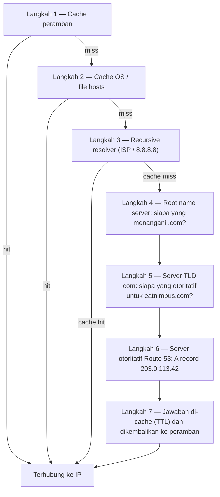

# Bab 12: Bagaimana Internet Menemukan Anda

Maya menyegarkan `nimbus-alb-123456789.us-west-2.elb.amazonaws.com` di perambannya sekali lagi, lalu bersandar dan menatap langit-langit. Halaman dimuat. Aplikasi berfungsi. Tetapi setiap kali ia membagikan tautan itu kepada seorang mitra restoran, ia merasakan rasa malu kecil yang tidak bisa ia namai.

URL itu adalah artefak teknis, bukan produk.

---

*Perancangan ulang jaringan dari bab sebelumnya berjalan baik. Setiap sumber daya berada di tempat yang tepat — load balancer di subnet publik, database terkunci di subnet privat. Infrastrukturnya aman dan tersegmentasi dengan benar. Tetapi saat Nimbus bersiap untuk peluncuran publik pertamanya, sebuah masalah baru muncul: URL load balancer yang ditetapkan AWS secara otomatis terlihat seperti pengenal sistem, bukan produk yang akan dipercaya orang. Mereka membutuhkan nama domain yang sesungguhnya. Dan mereka perlu memahami apa yang terjadi antara momen seseorang mengetik `eatnimbus.com` dan momen halaman muncul.*

---

Nimbus sedang berjalan. Load balancer memiliki IP publik. Instans EC2 memiliki IP privat. Database terkunci di subnet privat. Priya mengangguk setuju melihat diagram jaringan.

Tom melihat URL load balancer: `nimbus-alb-123456789.us-west-2.elb.amazonaws.com`.

"Itu yang diketik pelanggan ke peramban mereka?" tanyanya.

"Itu yang ditetapkan AWS secara otomatis," kata Maya.

"Aku tidak akan menaruh itu di kartu nama."

"Aku juga tidak."

Mereka membutuhkan nama domain. Mereka membeli `eatnimbus.com` dari sebuah registrar domain. Sekarang mereka perlu menghubungkan nama itu ke infrastruktur AWS mereka.

"Bagaimana internet tahu bahwa `eatnimbus.com` berarti load balancer di us-west-2?" tanya Leo.

Pertanyaan bagus, Leo.

**Analogi Buku Telepon**

Sebelum smartphone, setiap kota memiliki buku telepon. Jika Anda ingin menghubungi "Mario's Pizza," Anda tidak menghafal nomor teleponnya — Anda mencari namanya, mendapatkan nomornya, lalu menelepon.

Internet memiliki buku teleponnya sendiri: **Domain Name System (DNS)**.

DNS menerjemahkan nama yang dapat dibaca manusia (seperti `eatnimbus.com`) menjadi alamat IP yang dapat dibaca mesin (seperti `203.0.113.42`). Setiap kali Anda mengunjungi sebuah situs web, komputer Anda secara diam-diam mencari nama domain di DNS dan mendapatkan alamat IP untuk dihubungkan.

Jika Anda mengubah alamat IP server Anda, Anda akan memperbarui catatan DNS — seperti mengubah nomor Anda di buku telepon — dan internet akan menemukan Anda di lokasi baru Anda.

**Perjalanan Resolusi DNS Lengkap**

"Tetapi *bagaimana* pencariannya benar-benar bekerja?" tanya Leo. "Seperti, langkah demi langkah. Peramban-ku tahu nama `eatnimbus.com`. Apa yang terjadi selanjutnya?"

Sebagian besar dokumentasi melewatkan ini. Ini penting.

Ketika peramban Anda perlu me-resolve `eatnimbus.com`, berikut setiap lompatannya, secara berurutan:

**Langkah 1 — Cache peramban**: Peramban memeriksa apakah ia telah me-resolve nama ini baru-baru ini. Jika ya, ia menggunakan IP yang di-cache. Jika tidak, lanjutkan.

**Langkah 2 — Cache OS / resolver lokal**: Sistem operasi Anda memeriksa cache DNS-nya sendiri dan file `hosts` lokal. Jika ditemukan, selesai. Jika tidak, ia meneruskan ke resolver DNS yang Anda konfigurasi — biasanya milik ISP Anda atau resolver publik seperti 8.8.8.8.

**Langkah 3 — Recursive resolver**: Recursive resolver (ISP Anda atau 8.8.8.8 milik Google) adalah pekerja kerasnya. Ia juga memiliki cache. Jika ia tahu jawabannya, ia mengembalikannya segera. Jika tidak, ia memulai rantai resolusi yang sebenarnya.

**Langkah 4 — Root name server**: Recursive resolver menghubungi salah satu dari 13 klaster root name server (di-deploy di seluruh dunia). Root server tidak tahu di mana `eatnimbus.com` berada. Tetapi ia tahu siapa yang mengelola domain `.com` — server TLD `.com`. Ia mengembalikan alamat mereka.

**Langkah 5 — TLD (Top Level Domain) name server**: Recursive resolver menghubungi server TLD `.com`. Server TLD juga tidak tahu di mana `eatnimbus.com` berada. Tetapi mereka tahu name server mana yang otoritatif untuk `eatnimbus.com` — server yang benar-benar menyimpan catatan DNS. Mereka mengembalikan alamat-alamat itu.

**Langkah 6 — Authoritative name server**: Recursive resolver menghubungi name server Route 53 — name server otoritatif untuk `eatnimbus.com`. Route 53 memiliki catatan yang sebenarnya. Ia mengembalikan A record: `eatnimbus.com → 203.0.113.42`. Jawaban ini otoritatif — ini jawaban yang sesungguhnya, bukan yang di-cache.

**Langkah 7 — Respons di-cache dan dikembalikan**: Recursive resolver meng-cache jawabannya selama durasi TTL (Time-To-Live) pada catatan. Ia mengembalikan IP ke peramban Anda. Peramban Anda meng-cache-nya. Peramban Anda terhubung.



"Itu tujuh lompatan hanya untuk menemukan satu alamat IP," kata Tom.

"Biasanya total di bawah 100 milidetik," kata Priya. "Langkah 3 hingga 6 di-cache secara agresif di setiap level. Untuk domain populer, langkah 4 dan 5 — pencarian root dan TLD — sering dilewati sepenuhnya karena recursive resolver sudah memiliki server-server itu di cache. Seluruh rantai biasanya berjalan dalam 20–40 milidetik."

"Dan setelah pencarian pertama, cache peramban berarti permintaan berikutnya melewati semuanya," tambah Leo.

"Benar. DNS terasa instan karena sebagian besar pencarian adalah cache hit. Rantai lengkap hanya berjalan ketika sebuah catatan baru atau TTL-nya telah kedaluwarsa."

**Perkenalkan Route 53**

Amazon Route 53 adalah layanan DNS terkelola AWS. Ia disebut Route 53 karena port 53 adalah port DNS standar. (Terkadang AWS menamai sesuatu secara lugas.)

Route 53 melakukan beberapa hal:

**Registrasi domain**: Anda dapat membeli nama domain melalui Route 53 secara langsung.

**Hosting DNS (hosted zone)**: Anda membuat sebuah *hosted zone* untuk domain Anda, dan Route 53 mengelola catatan DNS yang memberi tahu dunia di mana menemukan Anda.

**Health checking**: Route 53 dapat memantau endpoint Anda dan mengarahkan lalu lintas menjauh dari yang tidak sehat.

**Kebijakan routing lalu lintas**: Route 53 mendukung beberapa strategi routing di luar DNS sederhana — weighted, berbasis latensi, geolocation, failover.

**Catatan DNS: Entri Buku Telepon**

Sebuah catatan DNS memetakan nama ke tujuan. Tipe yang paling umum:

**A record**: Memetakan nama ke alamat IPv4.
`eatnimbus.com → 203.0.113.42`

**AAAA record**: Memetakan nama ke alamat IPv6.

**CNAME record**: Memetakan nama ke nama lain (sebuah alias).
`www.eatnimbus.com → eatnimbus.com`

**MX record**: Menentukan server mana yang menangani email untuk domain.

**TXT record**: Menyimpan teks sembarang. Umumnya digunakan untuk verifikasi domain (membuktikan Anda memiliki domain) dan autentikasi email (SPF, DKIM).

Untuk Nimbus, pengaturan utamanya:

- `eatnimbus.com` → Alias record yang menunjuk ke load balancer
- `www.eatnimbus.com` → CNAME yang menunjuk ke `eatnimbus.com`
- `api.eatnimbus.com` → Alias record yang menunjuk ke load balancer API

"Tunggu," kata Tom. "IP load balancer bisa berubah. AWS mengatakannya di dokumentasi."

Tangkapan bagus, Tom.

**Alias Record: Solusi AWS untuk IP Dinamis**

Load balancer, distribusi CloudFront, dan situs web S3 memiliki nama DNS, bukan alamat IP statis. IP yang mendasarinya bisa berubah.

Jika Anda membuat CNAME yang menunjuk ke nama DNS load balancer, itu berfungsi — tetapi Anda tidak dapat menggunakan CNAME untuk domain root (`eatnimbus.com` tanpa `www`) karena standar DNS.

Route 53 menyelesaikan ini dengan **Alias record** — ekstensi khusus AWS untuk DNS. Sebuah Alias record memetakan nama langsung ke sumber daya AWS (load balancer, distribusi CloudFront, situs web S3), dan Route 53 menangani resolusi IP dinamis secara otomatis. Alias record dapat digunakan di level domain root. Dan tidak seperti kueri DNS biasa ke layanan eksternal, kueri Alias record ke sumber daya AWS gratis.

"Jadi kita gunakan Alias record untuk `eatnimbus.com` yang menunjuk ke load balancer," Leo mengonfirmasi.

"Dan Route 53 menangani IP apa pun yang digunakan load balancer pada saat tertentu," tambah Priya.

"Gratis," kata Tom, tiba-tiba sangat tertarik. Ia membuka halaman harga Route 53. "Dan sisanya?"

"Lima puluh sen per hosted zone," kata Leo. "Ditambah sekitar empat puluh sen per juta kueri DNS. Untuk lalu lintas kita saat ini, mungkin di bawah dua dolar sebulan."

Tom menutup halaman harga dengan puas.

**Kebijakan Routing: Lebih dari Sekadar "Di Mana Itu?"**

Di sinilah Route 53 menjadi menarik. DNS bukan hanya layanan pencarian — ia bisa menjadi alat manajemen lalu lintas.

**Simple routing**: Satu catatan, satu tujuan. DNS standar.

**Weighted routing**: Bagi lalu lintas antara beberapa tujuan berdasarkan bobot. Kirim 90% ke server baru, 10% ke server lama selama migrasi. Sesuaikan bobotnya sampai Anda yakin pada server baru, lalu beralih ke 100%.

**Latency-based routing**: Arahkan pengguna ke region AWS dengan latensi terendah bagi mereka. Pengguna di Seattle diarahkan ke `us-west-2`. Pengguna di Tokyo diarahkan ke `ap-northeast-1`. Nama domain yang sama, tujuan yang berbeda.

**Geolocation routing**: Arahkan berdasarkan lokasi geografis pengguna. Semua pengguna Eropa pergi ke `eu-west-1`. Semua pengguna Amerika Utara pergi ke `us-east-1`. Berguna untuk kedaulatan data (menjaga data pengguna UE di region UE) atau kustomisasi konten (bahasa, mata uang). Keputusan routing menggunakan batas yang kaku — pengguna berada di sebuah negara, benua, atau negara bagian AS, dan ke sanalah mereka pergi.

**Geoproximity routing**: Mengarahkan lalu lintas berdasarkan lokasi geografis pengguna *dan* memungkinkan Anda menyesuaikan keputusan tersebut dengan nilai **bias**. Bias positif memperluas area geografis yang dirutekan ke sebuah sumber daya — menarik lebih banyak lalu lintas. Bias negatif mengecilkannya. Tidak seperti geolocation, yang menggunakan batas negara dan benua yang kaku, geoproximity bersifat kontinu: nilai bias kecil dapat secara bertahap menggeser lalu lintas dari satu region ke region lain tanpa menggambar ulang garis tetap apa pun.

Skenario yang membedakan keduanya: jika sebuah perusahaan secara bertahap bermigrasi dari `us-east-1` ke `us-west-2` dan ingin menggeser lalu lintas secara bertahap ke barat — bukan membalik sakelar, tetapi memutarnya seiring waktu — geoproximity dengan bias positif yang tumbuh pada endpoint barat adalah alat yang tepat. Geolocation akan mengarahkan semua pengguna Pantai Barat ke Oregon atau tidak sama sekali; ia tidak memiliki pemutar. Sejak Januari 2024, geoproximity tersedia sebagai kebijakan routing biasa langsung pada catatan DNS (Console, API, CLI) — ia tidak lagi memerlukan Route 53 Traffic Flow, meskipun tetap tersedia di sana juga.

**Failover routing**: Tetapkan endpoint primer dan sekunder. Jika primer gagal pada health check Route 53, lalu lintas otomatis dialihkan ke sekunder. Ini adalah lapisan DNS dari pemulihan bencana.

"Tunggu — tetapi *mengapa* kita menyiapkan failover routing ke region kedua jika kita sudah punya Multi-AZ?" tanya Maya. "Bukankah Multi-AZ seharusnya menangani kegagalan?"

Pertanyaan bagus. Multi-AZ melindungi dari kegagalan satu Availability Zone dalam sebuah region — jika satu pusat data mati, standby di AZ lain mengambil alih. Tetapi bagaimana jika seluruh region AWS menjadi tidak tersedia? Atau bagaimana jika ada gangguan layanan di seluruh region? Failover routing DNS beroperasi pada level yang berbeda: ia mengarahkan lalu lintas menjauh dari seluruh region ketika health check region itu gagal. Multi-AZ adalah ketahanan intra-region. Failover DNS adalah ketahanan inter-region.

**Multivalue answer routing**: Mengembalikan hingga delapan alamat IP yang sehat untuk sebuah kueri, membiarkan klien memilih. Alternatif sederhana untuk load balancer untuk mendistribusikan lalu lintas di beberapa server.

"Jadi Route 53 bukan hanya buku telepon," kata Maya. "Ini buku telepon pintar yang dapat mengarahkan panggilan berdasarkan dari mana Anda menelepon."

"Dan memutus Anda jika nomornya tidak sehat," tambah Priya.

---

**Latency Routing Plus Health Check: Eksperimen Pikiran**

Priya membuat sketsa skenario di papan tulis. Misalkan basis pengguna Pantai Timur Nimbus terus bertambah, dan suatu hari tim membangun stack ringan di `us-east-1` (Northern Virginia) — bukan pengaturan multi-region active-active penuh, yang akan mahal dan kompleks, tetapi sebuah load balancer dan sekumpulan instans EC2 read-only yang melayani konten statis dan halaman penelusuran. Pesanan tetap pergi ke barat ke database primer di `us-west-2`. Lalu lintas penelusuran — yang menyumbang tujuh puluh persen permintaan — bisa dilayani dari pantai mana pun.

Konfigurasi Route 53 untuk endpoint penelusuran akan terlihat seperti ini:

```
browse.eatnimbus.com
  → Catatan latency: ALB us-east-1 (dengan health check, set-identifier "east")
  → Catatan latency: ALB us-west-2 (dengan health check, set-identifier "west")
```

(Perhatikan catatannya adalah *hostname*, `browse.eatnimbus.com` — DNS merutekan nama, tidak pernah path URL. Routing berbasis path seperti `/browse` adalah tugas load balancer, bukan Route 53.)

Dengan latency routing, seorang pengguna di Seattle akan di-resolve ke endpoint `us-west-2`. Seorang pengguna di Boston akan pergi ke `us-east-1`. Route 53 mengukur latensi dari infrastrukturnya ke setiap region secara terus-menerus dan memilih yang lebih cepat per pengguna.

"Tetapi bagaimana jika region barat memiliki masalah?" tanya Tom. "Pengguna penelusuran kita di Seattle akan terjebak."

"Itulah gunanya health check," kata Priya. "Setiap catatan latency mendapat health check pada load balancer-nya masing-masing. Jika health check `us-west-2` gagal tiga kali berturut-turut, Route 53 berhenti mengembalikan catatan itu — bahkan untuk pengguna di mana Oregon biasanya lebih cepat. Pengguna Seattle dirutekan ke timur sampai Oregon pulih."

"Jadi latency routing menentukan region mana yang biasanya disukai," kata Maya, "dan health check menimpa preferensi itu jika region yang disukai mati?"

"Tepat sekali. Kebijakan latency memilih pemenang dalam kondisi normal. Health check menghapus pemenang yang berhenti bekerja."

Leo memikirkan skenario kegagalan. "Dan TTL pada catatan-catatan itu?"

"Enam puluh detik," kata Priya. "Tiga pemeriksaan gagal pada interval tiga puluh detik untuk memicunya — hingga sembilan puluh detik untuk mendeteksi kegagalan — lalu hingga enam puluh detik bagi resolver DNS untuk menangkap perubahannya."

"Dua setengah menit dalam kasus terburuk," kata Leo.

"Itulah mengapa Anda menurunkan TTL sebelum Anda peduli tentangnya, bukan sesudahnya."

Kombinasi ini — latency routing dengan health check pada setiap catatan — adalah salah satu konfigurasi Route 53 yang paling kuat untuk deployment multi-region. Pengguna selalu pergi ke region sehat tercepat. Sistem menyembuhkan dirinya sendiri ketika sebuah region memiliki masalah. Dan semuanya adalah DNS: tanpa infrastruktur tambahan, tanpa server proxy, tanpa load balancer antar region.

---

**Insiden Kegagalan Health Check**

Lingkungan staging Nimbus memberi mereka demonstrasi failover routing yang tidak disengaja.

Mereka telah mengonfigurasi health check Route 53 pada load balancer staging sebagai uji coba — memeriksa endpoint `/health` setiap 30 detik. Suatu Jumat sore, Leo mendorong sebuah deployment ke staging yang memiliki bug: endpoint health mulai mengembalikan error 500. Ia lolos uji lokalnya tetapi rusak di server.

Route 53 mencatat kegagalannya. Setelah tiga pemeriksaan gagal berturut-turut, ia menandai endpoint tidak sehat. Catatan failover aktif, mengarahkan lalu lintas staging ke halaman fallback read-only yang berbunyi "Pemeliharaan sedang berlangsung."

Peringatan pertama Leo adalah pesan Slack dari seorang QA engineer: "Staging menampilkan halaman pemeliharaan."

Leo memeriksa deploy. Error 500 jelas di log. Ia me-roll back deployment-nya. Dalam 90 detik sejak endpoint health mengembalikan 200, Route 53 mengevaluasi ulang pemeriksaan, melihat tiga keberhasilan berturut-turut, dan mengembalikan lalu lintas ke load balancer staging. Halaman pemeliharaan menghilang.

Total waktu di halaman pemeliharaan: tujuh menit.

"Itu sistem yang bekerja dengan benar," kata Priya.

"Aku tahu," kata Leo. "Bagian yang menakutkan adalah memikirkan apa yang akan terjadi tanpa health check. Error 500 itu akan masuk ke pengguna nyata."

"Di produksi, health check akan melakukan failover ke region sekunder atau halaman error statis. Pengguna akan melihat pengalaman yang terjaga alih-alih error."

"Berapa lama failover sebenarnya berlangsung?" tanya Maya. "Dari saat health check gagal sampai saat DNS mulai merutekan berbeda?"

"Interval health check 30 detik secara default. Tiga kegagalan berturut-turut untuk memicu failover. Itu hingga 90 detik untuk mendeteksi masalah. Lalu TTL DNS — jika 60 detik, propagasi adalah satu menit lagi."

"Jadi kasus terburuk, sekitar tiga menit?"

"Sekitar itu. Itulah mengapa Anda ingin TTL Anda rendah pada catatan kritis, dan interval health check Anda sependek yang diizinkan anggaran Anda."

---

**Health Check: Merutekan di Sekitar Kegagalan**

"Dan bagaimana jika seseorang mencoba menerobos masuk?" kata Priya. "DNS bersifat publik. Siapa pun dapat mencari ke mana `eatnimbus.com` menunjuk. Itu berarti penyerang tahu persis IP mana yang harus ditargetkan."

"Itu benar," kata Leo. "Tetapi IP yang mereka temukan adalah IP load balancer. ALB adalah satu-satunya yang memiliki alamat publik. Semua yang di belakangnya — EC2, RDS, ElastiCache — berada di subnet privat. DNS memberi tahu mereka pintu depan. Ia tidak memberi tahu mereka apa yang ada di baliknya."

Route 53 dapat memantau endpoint Anda dengan health check. Jika sebuah endpoint gagal, Route 53 dapat:

- Menghapusnya dari respons DNS (berhenti mengirim lalu lintas ke sana)
- Memicu failover ke endpoint cadangan
- Mengirim peringatan via CloudWatch

Health check adalah penghubung antara routing DNS dan kesehatan aplikasi yang sebenarnya. Dalam konfigurasi failover: Route 53 memantau endpoint primer setiap 30 detik. Jika tiga pemeriksaan berturut-turut gagal, Route 53 mulai mengembalikan alamat endpoint sekunder. Tidak ada angka ini yang tetap: 30 detik adalah interval standar (opsi "fast" berbayar memeriksa setiap 10 detik), dan ambang kegagalan default ke 3 pemeriksaan berturut-turut tetapi dapat dikonfigurasi dari 1 hingga 10.

Ini tidak instan — DNS memiliki waktu propagasi. Setelah Route 53 mengubah sebuah catatan DNS, resolver DNS di seluruh dunia perlu menangkap perubahannya, yang dapat memakan waktu detik hingga menit tergantung pada pengaturan TTL.

**TTL: Cache DNS**

Respons DNS di-cache di beberapa level — di router Anda, di ISP Anda, di peramban Anda. **TTL (Time-To-Live)** pada sebuah catatan DNS memberi tahu cache berapa lama mengingat jawabannya sebelum memeriksa lagi.

TTL tinggi (1 jam atau lebih): Lebih sedikit kueri DNS, lebih sedikit beban pada Route 53, tetapi perubahan butuh lebih lama untuk menyebar.

TTL rendah (60 detik atau kurang): Perubahan menyebar dengan cepat, tetapi lebih banyak kueri DNS dibutuhkan.

Sebelum migrasi terencana (memperbarui DNS untuk menunjuk ke server baru), turunkan TTL Anda menjadi 60 detik sehari sebelumnya. Lalu ketika Anda membuat perubahan, ia menyebar dalam sekitar satu menit. Setelah migrasi, naikkan kembali ke nilai normal.

"Aku sudah men-deploy-nya — oh." Leo telah memperbarui catatan DNS sebelum menurunkan TTL. Ia menyadari kesalahannya dan mulai menghitung: TTL lama adalah satu jam. Beberapa pengguna akan mendapatkan server lama selama enam puluh menit ke depan.

"Jika kita hanya menurunkannya selama migrasi dan bukan sebelumnya," kata Leo perlahan, "TTL lama berarti beberapa pengguna akan melihat server lama selama satu jam."

"Tepat sekali," kata Priya. "Migrasi DNS membutuhkan perencanaan sebelum migrasi, bukan hanya selama."

Anda mungkin bertanya-tanya: jika TTL disetel ke satu jam, apakah itu berarti setiap pengguna akan menunggu satu jam penuh setelah perubahan DNS sebelum melihat server baru? Tidak persis. TTL berarti resolver tidak akan memeriksa ulang sampai TTL kedaluwarsa. Jika resolver DNS pengguna meng-cache nilai lama 55 menit yang lalu dengan TTL 1 jam, mereka akan mendapatkan nilai baru dalam 5 menit. Jika mereka meng-cache-nya 5 menit yang lalu, mereka akan menunggu 55 menit. Rata-rata, pengguna melihat perubahan dalam separuh durasi TTL. Itulah mengapa menurunkan TTL di muka sangat penting: ia mengecilkan jendela propagasi kasus terburuk sebelum perubahan terjadi.

---

**Private Hosted Zone: DNS Internal**

Priya mengangkat persyaratan baru dua minggu setelah domain publik aktif.

"Instans EC2 kita perlu menjangkau database," katanya. "Saat ini mereka menggunakan nama DNS endpoint RDS — `nimbus-prod.abc123.us-west-2.rds.amazonaws.com`. Itu berfungsi, tetapi itu nama DNS publik. Jika kita pernah ingin mengubah konfigurasi database kita, semua file konfigurasi aplikasi perlu diperbarui."

"Kita bisa menggunakan nama DNS privat," kata Leo. "Seperti `db.nimbus.internal`. Sesuatu yang digunakan layanan kita secara internal yang memetakan ke apa pun endpoint database saat ini."

"Tepat sekali. Private hosted zone Route 53."

Sebuah **private hosted zone** adalah domain DNS yang hanya me-resolve di dalam VPC Anda. Kueri DNS eksternal untuk `nimbus.internal` tidak mendapat respons. Tetapi dari dalam VPC, `db.nimbus.internal` me-resolve ke endpoint RDS.

Mereka menyiapkannya:

- Private hosted zone: `nimbus.internal`
- CNAME record: `db.nimbus.internal → nimbus-prod.abc123.us-west-2.rds.amazonaws.com`
- CNAME record: `cache.nimbus.internal → nimbus-cache.abc123.usw2.cache.amazonaws.com`
- A record: `api.nimbus.internal → 10.0.10.5` (IP EC2 internal — A record memetakan nama ke alamat IP; CNAME memetakan nama ke nama lain. Tidak masalah di sini karena instans ini mempertahankan IP privat statis; untuk apa pun di balik Auto Scaling Anda akan menunjuk ke load balancer)

Sekarang konfigurasi aplikasi berbunyi:

```
DATABASE_HOST=db.nimbus.internal
CACHE_HOST=cache.nimbus.internal
```

Ketika mereka bermigrasi ke instans RDS baru, mereka memperbarui satu catatan DNS. Tidak ada deployment aplikasi yang diperlukan.

"Inilah juga mengapa DNS privat penting selama migrasi database," kata Priya. "Anda memperbarui `db.nimbus.internal` untuk menunjuk ke endpoint baru. Lalu lintas bergeser. Endpoint lama tetap tersedia selama jendela TTL. Tidak ada perubahan konfigurasi aplikasi."

**Kisah Debugging DNS Internal**

Tiga minggu kemudian, Leo men-deploy layanan baru — sebuah background worker — dan ia tidak dapat menjangkau database. Worker berada di VPC yang sama, subnet privat yang sama dengan server API. Server API dapat menjangkau database. Worker tidak bisa.

Ia memeriksa security group. Security group worker memiliki aturan keluar untuk PostgreSQL. Security group database memiliki aturan masuk dari security group worker. Semuanya terlihat benar.

Ia menjalankan `nslookup db.nimbus.internal` dari instans worker.

Tidak ada respons.

"Pencarian DNS-nya gagal," katanya kepada Priya.

Ia melihat konfigurasi VPC instans worker. "Di VPC mana worker sebenarnya berada? Private hosted zone diasosiasikan dengan VPC — jika instans tidak berada di VPC yang terasosiasi, zone-nya sama sekali tidak ada baginya."

"Ia di VPC utama. Sama seperti yang lain."

"Benarkah?"

Private hosted zone harus secara eksplisit diasosiasikan dengan setiap VPC yang dilayaninya — asosiasinya per VPC, tidak pernah per subnet. Priya telah mengasosiasikan VPC utama ketika ia membuat zone. Tetapi Leo secara tidak sengaja telah men-deploy worker ke sebuah VPC test yang ia buat untuk eksperimen berbeda. VPC yang berbeda. Tidak terasosiasi dengan private hosted zone.

"Worker berada di VPC yang salah," kata Priya.

"Aku sudah men-deploy-nya — oh." Leo memindahkan worker ke VPC yang benar. DNS me-resolve. Worker terhubung ke database.

"Satu VPC," kata Leo, membuat catatan. "Kecuali kita punya alasan untuk lebih dari satu."

---

**DNSSEC: Mengautentikasi Respons DNS**

"Apakah kita sudah memikirkan DNS spoofing?" tanya Priya. "Bagaimana jika seseorang mencegat kueri DNS kita dan mengembalikan IP palsu? Peramban pengguna kita akan terhubung ke server penyerang alih-alih server kita."

**DNSSEC (DNS Security Extensions)** menyelesaikan ini dengan menandatangani catatan DNS secara kriptografis. Ketika respons DNS menyertakan tanda tangan DNSSEC, resolver dapat memverifikasi bahwa respons berasal dari name server otoritatif dan belum dirusak.

Route 53 mendukung penandatanganan DNSSEC untuk public hosted zone. Prosesnya melibatkan:

1. Mengaktifkan DNSSEC pada hosted zone di Route 53
2. Route 53 menghasilkan key signing key (KSK) yang disimpan di KMS
3. Route 53 menandatangani semua catatan dengan zone signing key
4. Anda menambahkan DS (Delegation Signer) record di registrar domain induk (TLD .com)
5. Resolver yang mendukung DNSSEC sekarang dapat memverifikasi keaslian respons

"Seberapa umum DNS spoofing?" tanya Leo.

"Di internet publik, jarang tetapi mungkin," kata Priya. "Sebagian besar resolver ISP mendukung validasi DNSSEC saat ini. Mengaktifkan DNSSEC tidak memakan biaya dan menambah lapisan keaslian yang berarti."

"Berapa biayanya per bulan?" tanya Tom.

"Mengaktifkan penandatanganan DNSSEC itu sendiri gratis di Route 53," kata Priya. "Satu-satunya biaya nyata adalah kunci KMS yang menyimpan key-signing key: $1/bulan, ditambah panggilan API KMS — dan satu kunci dapat dibagikan di beberapa hosted zone. Perlindungan terhadap serangan DNS hijacking secara efektif gratis pada skala kita."

Tom mengaktifkannya sebelum makan siang.

---

**Route 53 Resolver: DNS Hibrida**

Ketika Nimbus akhirnya menghubungkan VPC AWS mereka ke jaringan pengembangan on-premises mereka melalui VPN, sebuah masalah baru muncul: server on-premises perlu me-resolve nama DNS privat AWS (seperti `db.nimbus.internal`), dan sumber daya AWS perlu me-resolve hostname on-premises (seperti `jenkins.corp.nimbus.local`).

Resolusi DNS tidak melintasi batas jaringan secara default. Sumber daya AWS me-resolve DNS menggunakan Route 53 Resolver (terbangun di setiap VPC). Server on-premises menggunakan server DNS mereka sendiri. Tidak ada yang bisa melihat catatan satu sama lain.

**Route 53 Resolver Endpoint** menjembatani celah ini:

**Inbound endpoint**: Server DNS on-premises dapat meneruskan kueri untuk zone DNS yang di-host AWS ke IP inbound endpoint di VPC Anda. Route 53 Resolver menangani kueri dan mengembalikan hasilnya.

**Outbound endpoint**: Ketika instans EC2 perlu me-resolve hostname on-premises, Resolver meneruskan kueri tersebut ke server DNS on-premises melalui outbound endpoint.

"Jadi ini seperti layanan terjemahan," kata Maya. "DNS AWS Anda dan DNS on-premises Anda tidak berbicara langsung satu sama lain. Resolver endpoint bertindak sebagai perantara."

"Tepat sekali. Server on-premises Anda sekarang dapat me-resolve `db.nimbus.internal`. Instans EC2 Anda dapat me-resolve `jenkins.corp.nimbus.local`. Kedua sisi melihat nama DNS dari kedua dunia."

Untuk Nimbus, ini menjadi relevan ketika tim pengembangan ingin menjalankan tes integrasi dari kantor mereka terhadap lingkungan staging di AWS. Tanpa Resolver endpoint, mereka akan mengedit file hosts secara manual. Dengan itu, DNS internal berfungsi begitu saja melintasi VPN.

Arsitektur untuk Resolver endpoint:

- **Inbound endpoint**: Dua ENI (Elastic Network Interface) dibuat di dua AZ berbeda di VPC Anda. Masing-masing mendapat IP privat. Anda mengonfigurasi server DNS on-premises Anda untuk meneruskan kueri untuk zone yang di-host AWS ke IP ini. Lalu lintas melewati VPN atau Direct Connect Anda.
- **Outbound endpoint**: Dua ENI di dua AZ. Anda membuat aturan penerusan: "kueri untuk `corp.nimbus.local` pergi ke IP server DNS on-premises ini." Instans EC2 otomatis menggunakan Resolver, yang berkonsultasi dengan aturan penerusan Anda dan mengirim kueri ke on-premises.

"Mengapa dua ENI per endpoint?" tanya Leo.

"Ketersediaan tinggi," kata Priya. "Jika satu AZ kehilangan konektivitas jaringan, IP endpoint lain tetap berfungsi. Prinsip yang sama dengan NAT Gateway."

"Berapa biayanya per bulan?" tanya Tom.

Resolver endpoint berbiaya sekitar $0,125 per jam **per elastic network interface**, dan setiap endpoint membutuhkan setidaknya dua ENI untuk ketersediaan — jadi batas bawah yang realistis adalah sekitar $180 per bulan per endpoint, ditambah $0,40 per juta kueri DNS. Untuk tim yang menggunakan DNS hibrida untuk me-resolve nama internal, biayanya sederhana — dan menghilangkan kebutuhan untuk memelihara file hosts di beberapa mesin developer dan sistem CI/CD.

"Kita bisa saja menaruh hostname di file hosts," Leo menyarankan.

"Di setiap mesin developer, setiap CI runner, setiap onboarding baru," kata Priya. "Setiap kali ada yang berubah."

"Endpoint-nya sepadan," kata Leo.

"Memang."

## Kekuatan dan Batasan

**Route 53 adalah pilihan yang tepat untuk**: mendaftarkan dan mengelola nama domain sepenuhnya di dalam AWS; merutekan lalu lintas berdasarkan latensi, geolocation, atau distribusi weighted di beberapa endpoint; failover berbasis health check antar region atau antara endpoint primer dan endpoint pemulihan bencana; mengintegrasikan DNS dengan layanan AWS lain melalui alias record; private hosted zone untuk penemuan layanan internal.

**Ketika Route 53 bukan yang Anda butuhkan**: Route 53 adalah layanan DNS, bukan load balancer. Jika Anda perlu mendistribusikan lalu lintas antara beberapa server atau kontainer dalam sebuah region, gunakan Application Load Balancer — Route 53 tidak dapat melakukan weighted round-robin di level koneksi seperti yang dapat dilakukan load balancer. Latency-based routing antar region menambah biaya dan kompleksitas operasional yang hanya masuk akal ketika pengguna Anda benar-benar terdistribusi secara global dan milidetik penting bagi konversi. Untuk sebagian besar aplikasi single-region, satu Alias record yang menunjuk ke ALB adalah semua konfigurasi Route 53 yang Anda butuhkan.

## Ringkasan

Beralih dari `nimbus-alb-123456789.us-west-2.elb.amazonaws.com` ke `eatnimbus.com` terasa seperti hal kecil. Ternyata bukan. DNS adalah sistem alamat yang menjalankan seluruh internet, dan Route 53 memberi Anda alat untuk menggunakan sistem itu bukan hanya untuk pencarian, tetapi untuk manajemen lalu lintas dan ketahanan.

- **DNS** menerjemahkan nama domain menjadi alamat IP — buku telepon internet.
- **Route 53** adalah layanan DNS terkelola AWS: registrasi domain, hosting DNS, health check, dan kebijakan routing.
- **A record** memetakan nama ke alamat IPv4. **CNAME** memetakan nama ke nama lain. **Alias record** memetakan nama ke sumber daya AWS (load balancer, CloudFront, S3).
- Gunakan Alias record (bukan CNAME) untuk domain root dan untuk sumber daya dengan IP dinamis.
- Kebijakan routing melampaui DNS sederhana: **weighted** (pembagian lalu lintas), **latency-based** (performa), **geolocation** (kedaulatan data — batas negara/benua yang kaku), **geoproximity** (berbasis jarak dengan pemutar bias — pergeseran lalu lintas bertahap), **failover** (pemulihan bencana).
- **Private hosted zone** menyediakan DNS internal untuk sumber daya VPC — komunikasi layanan-ke-layanan berdasarkan nama, bukan IP yang di-hardcode.
- **DNSSEC** menandatangani catatan secara kriptografis, melindungi dari DNS spoofing.
- **Route 53 Resolver Endpoint** menjembatani jaringan hibrida — DNS AWS dan on-premises dapat me-resolve nama satu sama lain.

## Tips Ujian

*SAA-C03 Domain: Desain Arsitektur Berkinerja Tinggi (Domain 3, Tugas 3.4)*

- **Alias vs CNAME**: Alias record dapat digunakan di domain root; CNAME tidak. Alias record ke sumber daya AWS gratis; kueri DNS CNAME dikenakan biaya. Ketika ujian menanyakan tentang memetakan domain root ke load balancer → Alias record.
- **Kasus penggunaan kebijakan routing** (skenario ujian umum):
  - "Migrasikan lalu lintas secara bertahap ke versi baru" → Weighted routing
  - "Arahkan pengguna ke region AWS terdekat" → Latency-based routing
  - "Jaga data pengguna UE di region UE" → Geolocation routing
  - "Failover DNS otomatis saat primer mati" → Failover routing dengan health check
  - "Geser lalu lintas secara bertahap ke region baru" atau "tingkatkan lalu lintas yang ditarik ke deployment UE kita" → Geoproximity routing dengan bias positif
- **Geoproximity vs. Geolocation:** Geolocation merutekan berdasarkan negara/benua pengguna dengan batas yang kaku. Geoproximity merutekan berdasarkan jarak geografis dengan bias yang dapat dikonfigurasi — gunakan ketika Anda perlu menggeser lalu lintas secara bertahap ke region baru atau menarik lebih banyak pengguna ke deployment tertentu. Tersedia sebagai kebijakan routing biasa pada catatan sejak Januari 2024 (Traffic Flow tidak lagi diperlukan).
- **Health check Route 53**: Dapat memeriksa endpoint HTTP/HTTPS/TCP, dan dapat memicu alarm CloudWatch. Ujian menggunakan ini dalam skenario pemulihan bencana.
- **TTL dan propagasi**: Ketahui bahwa TTL mengontrol berapa lama resolver DNS meng-cache sebuah catatan. TTL pendek = perubahan lebih cepat. Skenario ujian: "tim memperbarui DNS tetapi pengguna masih menghantam server lama" → TTL terlalu tinggi.
- **Private hosted zone**: Route 53 dapat membuat catatan DNS yang hanya me-resolve di dalam VPC. Ujian menggunakan ini untuk penemuan layanan internal (mis., `database.internal` me-resolve ke endpoint RDS privat).
- Route 53 bersifat **global** — ia tidak di-deploy di sebuah region. Tidak diperlukan pemilihan region saat membuat hosted zone.
- **Route 53 Resolver Endpoint**: Digunakan dalam skenario hibrida di mana DNS on-premises dan AWS perlu me-resolve nama satu sama lain. Inbound endpoint untuk on-premises → AWS. Outbound endpoint untuk AWS → on-premises.

## Latihan

**Latihan 1 — Ingat**

Jelaskan perbedaan antara CNAME record dan Alias record. Kapan Anda akan menggunakan masing-masing?

*(Petunjuk: Pertimbangkan batasan pada CNAME di domain root, dan perilaku Alias record dengan sumber daya AWS dinamis.)*

**Latihan 2 — Skenario SAA-C03**

*Skenario*: Sebuah perusahaan media mengoperasikan situs web dari dua region AWS: `us-east-1` (primer) dan `eu-west-1` (sekunder). Tim ingin lalu lintas otomatis dirutekan ke `eu-west-1` jika region primer menjadi tidak tersedia. Perusahaan juga ingin memverifikasi bahwa mekanisme failover ini bekerja dengan benar tanpa benar-benar mematikan region primer.

Konfigurasi Route 53 mana yang PALING memenuhi persyaratan ini?

A) Weighted routing dengan bobot 100% pada `us-east-1` dan bobot 0% pada `eu-west-1`  
B) Latency-based routing dengan health check pada kedua endpoint  
C) Failover routing dengan health check pada endpoint primer dan catatan sekunder yang menunjuk ke `eu-west-1`  
D) Geolocation routing dengan Amerika Utara menunjuk ke `us-east-1` dan Eropa menunjuk ke `eu-west-1`

**Petunjuk 1**: Persyaratannya adalah failover otomatis ketika primer mati. Kebijakan routing mana yang dirancang persis untuk ini?

**Petunjuk 2**: "Uji tanpa mematikan region primer" — health check dapat disetel manual ke "tidak sehat" untuk pengujian.

**Petunjuk 3**: Latency-based routing mengoptimalkan kecepatan, bukan failover.

**Jawaban**: C

**Penjelasan**: Failover routing dirancang persis untuk kasus penggunaan ini. Catatan primer menunjuk ke `us-east-1` dengan health check. Catatan sekunder menunjuk ke `eu-west-1`. Jika health check gagal, Route 53 otomatis menyajikan catatan sekunder. Health check dapat dipaksa gagal secara manual untuk pengujian tanpa benar-benar mengganggu region primer.

**Mengapa tidak A?** Weighted routing dengan 100%/0% secara efektif statis — ia tidak otomatis beralih ketika primer gagal.

**Mengapa tidak B?** Catatan latency *dengan health check* memang berhenti mengembalikan endpoint yang tidak sehat, jadi B akan bertahan dari outage nyata. Tetapi ia mengubah pola lalu lintas normal (pengguna akan terbagi di seluruh region berdasarkan latensi, bukan primer/sekunder seperti yang dipersyaratkan) dan tidak ada cara yang bersih untuk *menguji* failover: Anda harus benar-benar menggagalkan health check primer di produksi. Failover routing memodelkan maksud yang dinyatakan — primer yang ditentukan, sekunder yang ditentukan, dapat diuji dengan memaksa keadaan health check.

**Mengapa tidak D?** Geolocation routing merutekan berdasarkan lokasi pengguna, bukan berdasarkan kesehatan endpoint. Pengguna Eropa akan terjebak di `eu-west-1` bahkan jika `us-east-1` sehat, dan pengguna Amerika Utara tidak akan failover ke `eu-west-1` bahkan jika `us-east-1` mati.

*SAA-C03 Domain: Desain Arsitektur Berkinerja Tinggi — Tugas 3.4*

**Latihan 3 — Tantangan Arsitektur** *(Opsional)*

Nimbus berekspansi secara internasional. Mereka ingin `eatnimbus.com` dimuat dengan cepat untuk pengguna di Pantai Barat, Pantai Timur, dan Australia. Mereka juga memiliki persyaratan regulasi: pesanan yang ditempatkan oleh pengguna Eropa harus diproses oleh server di UE.

Rancang strategi routing Route 53 yang menangani kedua persyaratan. Kebijakan routing atau kombinasi kebijakan apa yang akan Anda gunakan? Infrastruktur apa di setiap region yang Anda butuhkan?

*(Tidak ada satu jawaban yang benar. Tujuannya adalah berlatih desain routing multi-region.)*

## Adegan Pasca-Kredit

`eatnimbus.com` sudah aktif.

Maya telah mengetiknya ke perambannya, dan halaman pemesanan Nimbus telah dimuat. Ia telah memesan arepa dari restoran keluarganya sendiri, hanya untuk menguji alurnya. Pesanan telah berhasil. Dapur telah menerimanya.

Ia bersandar.

Tom sudah membaca log health check Route 53. "Waktu respons 18 milidetik dari pemeriksa us-west-2."

"Apakah itu cepat?" tanya Maya.

"Untuk DNS? Ya. Untuk pengguna Seattle juga — mereka praktis bersebelahan dengan Oregon."

"Tetapi untuk pengguna di Boston?"

Tom melihat grafik latensi. "Sekitar 80 milidetik."

Maya memikirkannya. "Jika mitra Pantai Timur kita terus bertambah, dan server kita ada di Oregon..."

"Setiap permintaan melakukan perjalanan dari Boston ke Oregon dan kembali," kata Leo dari seberang ruangan. "Kecepatan cahaya. Anda tidak bisa mengalahkan fisika."

"Jadi kita butuh server lebih dekat ke Boston."

"Atau sesuatu yang lebih dekat ke Boston yang melayani konten atas nama mereka."

Pikiran itu menggantung di udara.

Di bab berikutnya: gudang-gudang yang menempatkan konten Nimbus semilidetik dari setiap pengguna, di mana saja.
