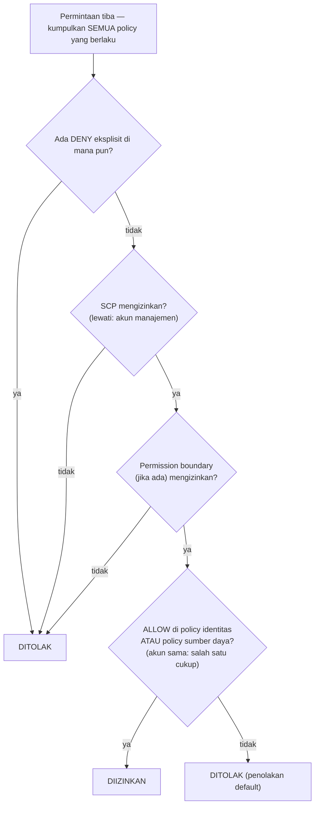

# Bab 14: Siapa yang Diizinkan Melakukan Apa

Para engineer baru akan mulai hari Senin. Soo-Jin dan Rafael. Maya telah memikirkan minggu pertama mereka — apa yang akan mereka butuhkan aksesnya, apa yang tidak boleh mereka sentuh, dan apakah pengaturan IAM saat ini bahkan siap untuk diperluas ke dua orang lagi.

Ia duduk dengan secangkir kopi sebelum kantor terisi, membuat daftar.

---

*CloudFront telah di-deploy. Cache hit rate bagus. Performa meningkat. Tetapi saat tim bersiap untuk merekrut engineer baru, sebuah masalah diam-diam muncul ke permukaan: konfigurasi IAM telah dibangun oleh orang-orang yang terburu-buru. Access key ada di file konfigurasi. Beberapa role memiliki lebih banyak izin daripada yang mereka butuhkan. Dan dua orang baru akan segera diberi kredensial ke sistem produksi yang tidak dirancang dengan mempertimbangkan banyak pengguna.*

---

Tom memiliki access key terbuka dalam sebuah file teks, siap untuk ditempel.

"Apa yang sedang kamu lakukan?" tanya Priya.

"Instans EC2 perlu membaca file konfigurasi dari S3. Aku memasukkan kredensialnya ke konfigurasi server."

Ia melihat layar sejenak. "Tutup file itu."

"Aku baru saja—"

"Jika seseorang masuk ke server itu," katanya, "mereka mendapatkan kunci itu. Dan kunci itu menyentuh apa pun yang diizinkan untuk disentuh oleh pengguna IAM. Yang mungkin lebih dari sekadar S3."

Tom menutup file itu.

"Ada cara yang lebih baik," katanya. "Server itu sendiri bisa memiliki sebuah role. Anggap saja seperti jabatan pekerjaan — instans tidak membutuhkan kredensial karena sistem sudah tahu apa itu dan apa yang diizinkan untuk dilakukannya."

Tom terlihat skeptis. "Jadi server mengautentikasi dirinya sendiri?"

"Ya. Tanpa kata sandi. Tanpa kunci di file konfigurasi. Tanpa apa pun yang bisa secara tidak sengaja di-commit ke git."

Bagian terakhir itu mengena. Tom hampir saja meng-commit sebuah access key ke repo dua minggu lalu — tertangkap di diff pada detik terakhir. Ia membuka tab peramban baru.

**Meninjau Kembali IAM: Gambaran Lengkap**

Bab 3 memperkenalkan IAM: user, group, role, dan policy. Sekarang saatnya untuk masuk lebih dalam.

Policy IAM adalah dokumen JSON yang menentukan aksi apa yang diizinkan atau ditolak pada sumber daya mana. Mereka terlihat seperti ini:

```json
{
  "Version": "2012-10-17",
  "Statement": [
    {
      "Effect": "Allow",
      "Action": [
        "s3:GetObject",
        "s3:PutObject"
      ],
      "Resource": "arn:aws:s3:::nimbus-assets/*"
    }
  ]
}
```

Policy ini mengizinkan membaca dan menulis objek di bucket `nimbus-assets`, dan tidak ada yang lain. Tidak menghapus. Tidak men-listing bucket. Tidak ada operasi S3 lain. Tidak ada layanan AWS lain.

Inilah cara yang benar untuk memberikan izin: aksi spesifik, sumber daya spesifik.

**Masalah dengan "Administrator Access"**

AWS Managed Policy seperti `AdministratorAccess` dirancang untuk memulai dengan cepat. Mereka tidak dirancang untuk menjalankan sistem produksi dengan anggota tim sungguhan.

`AdministratorAccess` memberikan setiap aksi pada setiap sumber daya. Jika seorang anggota tim dengan policy ini membuat kesalahan — secara tidak sengaja menghapus bucket S3, menghentikan instans EC2 yang salah, mengubah aturan security group — tidak ada yang dapat dilakukan AWS untuk menghentikan mereka. Izinnya telah diberikan.

Jika kredensial seorang anggota tim dikompromikan (serangan phishing, access key bocor, pencurian laptop), penyerang memiliki akses administrator ke segala sesuatu di akun AWS Anda.

"Jadi apa yang seharusnya dimiliki Soo-Jin?" tanya Leo.

"Apa yang perlu dilakukan Soo-Jin?" Priya menanggapi.

"Men-deploy API. Memeriksa log. Tidak ada yang lain."

"Maka ia mendapat: kemampuan untuk push ke pipeline kode, akses baca ke log CloudWatch, dan tidak ada yang lain."

"Itu... sangat spesifik."

"Ya. Itulah intinya."

**IAM Role: Identitas untuk Layanan**

Bab 3 memperkenalkan role sebagai cara bagi instans EC2 untuk mengakses layanan AWS tanpa menyimpan kredensial. Mari kita buat ini konkret.

Instans EC2 Anda yang menjalankan API Nimbus perlu:

- Membaca dari DynamoDB (menu)
- Menulis ke DynamoDB (pesanan)
- Menaruh objek di S3 (struk, unggahan)
- Menulis log ke CloudWatch
- Membaca rahasia dari Secrets Manager

Alih-alih membuat pengguna dengan access key dan menyimpan kunci itu di instans EC2 (mimpi buruk keamanan — access key dapat dibaca oleh siapa pun dengan akses SSH), Anda membuat **IAM role** untuk instans EC2 dengan persis izin-izin ini.

"Tunggu — tetapi *mengapa* kita melakukannya seperti itu?" tanya Maya. "Instans EC2 sudah menjalankan kode kita. Mengapa tidak memberi kode itu access key saja?"

Karena access key adalah kredensial statis yang tinggal di suatu tempat — di file konfigurasi, variabel lingkungan, repository git jika seseorang membuat kesalahan. Mereka dapat disalin, dieksfiltrasi, di-commit secara tidak sengaja. IAM role bekerja berbeda: instans EC2 mengasumsikan role secara otomatis. AWS menyediakan kredensial sementara melalui layanan metadata instans. Kredensial berotasi secara otomatis — mereka kedaluwarsa setiap beberapa jam dan disegarkan tanpa tindakan apa pun dari Anda. Tidak ada yang bisa bocor, karena tidak ada yang disimpan.

"Dan jika seseorang meretas instans EC2?" tanya Leo.

"Mereka dapat melakukan apa yang diizinkan role EC2," kata Priya. "Yaitu membaca menu, menulis pesanan, dan mengirim log. Mereka tidak dapat menghapus bucket S3. Mereka tidak dapat menghentikan instans EC2. Mereka tidak dapat menyentuh IAM."

"Karena role EC2 tidak memiliki izin-izin itu."

"Tepat sekali."

---

**Bagaimana Asumsi Role EC2 Bekerja Langkah demi Langkah**

"Ada yang tidak masuk akal," kata Maya. "Jika tidak ada kredensial yang disimpan di instans, bagaimana instans sebenarnya membuktikan ke AWS siapa dirinya? Pasti ada kredensial di suatu tempat."

Memang ada. Tetapi ia sementara, berotasi otomatis, dan hanya dapat diakses dari dalam instans.

Ketika instans EC2 dimulai dengan IAM role terlampir, AWS melakukan hal berikut:

**Langkah 1**: AWS STS (Security Token Service) menghasilkan kredensial sementara — sebuah access key ID, secret access key, dan session token. Untuk role instans EC2 ini biasanya valid sekitar enam jam, dan AWS merotasinya secara otomatis sebelum kedaluwarsa.

**Langkah 2**: AWS membuat kredensial ini tersedia di alamat IP khusus: `169.254.169.254`. Ini adalah **instance metadata service** (IMDS). Ia hanya dapat dijangkau dari dalam instans EC2. Tidak ada di luar instans yang dapat mengaksesnya.

**Langkah 3**: Ketika kode aplikasi Anda memanggil SDK AWS apa pun (boto3, SDK Java, SDK Node.js), SDK secara otomatis mengkueri endpoint metadata instans:

```
GET http://169.254.169.254/latest/meta-data/iam/security-credentials/{role-name}
```

**Langkah 4**: SDK menerima kredensial sementara dan menggunakannya untuk menandatangani permintaan API — misalnya, permintaan untuk membaca dari S3.

**Langkah 5**: AWS memvalidasi kredensial, memeriksa policy IAM yang terlampir pada role, dan mengizinkan atau menolak permintaan.

**Langkah 6**: Sekitar lima belas menit sebelum kredensial kedaluwarsa, instans EC2 secara otomatis menyegarkannya dari layanan metadata. Kode aplikasi tidak pernah perlu menangani ini — SDK melakukannya secara transparan.

Seluruh proses tidak terlihat oleh developer. Anda menulis `s3.get_object(...)`. SDK menangani sisanya.

"Jadi kredensialnya ada," kata Maya. "Ia hanya sementara, berotasi otomatis, dan terkunci ke endpoint metadata instans."

"Itulah mengapa ia jauh lebih aman daripada access key statis," kata Priya. "Kunci statis, sekali dicuri, valid sampai seseorang merotasinya secara manual. Kredensial sementara yang dicuri kedaluwarsa dengan sendirinya — dalam hitungan jam, bukan bulan."

"Dan jika seseorang di dalam instans mengkueri endpoint metadata?"

"Mereka bisa mendapatkan kredensial sementara saat ini. Itu adalah risiko nyata, itulah mengapa AWS memperkenalkan IMDSv2 — Instance Metadata Service versi 2. IMDSv2 mengharuskan pemanggil terlebih dahulu mendapatkan session token via permintaan PUT. Ini mencegah suatu kelas serangan yang disebut Server-Side Request Forgery, di mana kode jahat menipu server agar mengambil URL metadata atas nama penyerang."

Leo memperbarui konfigurasi peluncuran EC2 untuk menegakkan IMDSv2. Satu pengaturan, diterapkan pada saat peluncuran.

---

**Asumsi Role: Bagaimana Layanan Menjadi Layanan Lain**

Role dapat diasumsikan oleh:

- **Layanan AWS** (EC2, Lambda, task ECS, dll.)
- **Pengguna IAM** di akun Anda sendiri (elevasi role — Anda mengasumsikan role dengan lebih banyak izin untuk tugas tertentu)
- **Pengguna IAM di akun AWS lain** (akses lintas-akun — akun organisasi lain dapat mengasumsikan role di akun Anda)
- **Penyedia identitas eksternal** (Google, Active Directory, Okta — akses terfederasi untuk pengguna manusia)

"Apakah kita sudah memikirkan apa yang terjadi jika Nimbus menggunakan layanan pihak ketiga yang membutuhkan akses ke sumber daya AWS kita?" tanya Priya. "Vendor analitik eksternal, misalnya. Kita tidak ingin membuat pengguna IAM untuk mereka dan menyerahkan access key."

"Role lintas-akun," kata Leo. "Kita membuat role di akun kita dan menulis trust policy yang mengatakan 'akun eksternal tertentu ini diizinkan untuk mengasumsikan role ini.' Mereka menggunakan kredensial mereka sendiri untuk mengasumsikan role dan mendapatkan akses sementara. Tidak ada kunci untuk dikelola, tidak ada kunci untuk dibocorkan."

Pola terakhir ini — **identity federation** — adalah cara organisasi besar memberi karyawan mereka akses AWS tanpa membuat pengguna IAM individual untuk setiap orang. Active Directory perusahaan Anda memiliki kredensial Anda. Ketika Anda masuk ke AWS, Anda mengautentikasi terhadap Active Directory, dan AWS memberi Anda sebuah role.

---

**Akses Lintas-Akun: Skenario Tim Akuntansi**

Enam bulan berjalan, Nimbus merekrut sebuah firma akuntansi untuk membantu pelaporan keuangan. Tim akuntansi membutuhkan akses baca ke data tagihan di bucket S3 tagihan Nimbus — tetapi mereka beroperasi dari akun AWS mereka sendiri yang terpisah. Nimbus tidak ingin membuat pengguna IAM untuk mereka. Menyerahkan access key statis kepada seseorang di perusahaan eksternal terasa benar-benar salah.

"Role lintas-akun," kata Priya.

Pengaturannya memiliki tiga bagian:

**Bagian satu**: Di akun Nimbus, buat IAM role — sebut saja `AccountingReadRole`. Lampirkan policy yang mengizinkan `s3:GetObject` dan `s3:ListBucket` pada bucket S3 tagihan. Tidak ada yang lain.

**Bagian dua**: Tambahkan trust policy ke `AccountingReadRole`. Trust policy mengatakan identitas eksternal mana yang diizinkan mengasumsikan role ini:

```json
{
  "Version": "2012-10-17",
  "Statement": [{
    "Effect": "Allow",
    "Principal": {
      "AWS": "arn:aws:iam::ACCOUNTING-FIRM-ACCOUNT-ID:role/AccountingAppRole"
    },
    "Action": "sts:AssumeRole"
  }]
}
```

Ini mengatakan: hanya role tertentu di akun AWS firma akuntansi yang dapat mengasumsikan role ini. Tidak ada yang lain.

**Bagian tiga**: Di akun firma akuntansi, aplikasi mereka menggunakan `sts:AssumeRole` untuk mendapatkan kredensial sementara untuk `AccountingReadRole`. Kredensial itu dibatasi hanya pada apa yang diizinkan `AccountingReadRole`. Aplikasi akuntansi dapat membaca file tagihan. Ia tidak dapat menulis ke file itu. Ia tidak dapat menyentuh apa pun yang lain di akun Nimbus.

Ada satu langkah pengerasan lagi untuk skenario persis ini — dan ini adalah topik ujian yang disebutkan namanya. Firma akuntansi melayani banyak klien. Misalkan klien jahat dari mereka mempelajari ARN dari `AccountingReadRole` Nimbus dan meminta perangkat lunak firma untuk "menganalisis"-nya. Perangkat lunak firma memiliki izin sah untuk mengasumsikan role — ia bisa ditipu untuk mengakses data Nimbus atas nama pelanggan yang salah. Ini adalah **confused deputy problem**, dan perbaikannya adalah **ExternalId**: Nimbus menghasilkan nilai rahasia yang unik, memasukkannya ke trust policy sebagai sebuah kondisi (`"sts:ExternalId": "nimbus-7f3a..."`), dan membagikannya hanya dengan firma akuntansi. Perangkat lunak firma harus melewatkan ExternalId itu di setiap panggilan `AssumeRole`, dan ia menggunakan ExternalId yang *berbeda* per pelanggan — sehingga permintaan yang dibuat atas nama pelanggan yang salah gagal. Pemicu ujian: "pihak ketiga membutuhkan akses lintas-akun" → role + trust policy + **ExternalId**. Tidak pernah pengguna IAM dengan kunci bersama.

"Bagaimana jika kita perlu mencabut akses mereka?" tanya Tom.

"Hapus trust policy atau hapus role-nya," kata Priya. "Selesai. Tidak ada kredensial untuk diburu, tidak ada kunci untuk dinonaktifkan. Role adalah aksesnya. Hapus role, akses hilang."

"Dan kita bisa melihat setiap kali mereka menggunakannya di CloudTrail," tambah Leo.

"Setiap panggilan API yang mereka buat, tercatat. Bucket mana, file mana, jam berapa, hasil apa."

Tom mencatat polanya. Itu akan muncul lagi — setiap mitra integrasi, setiap vendor eksternal, setiap alat pihak ketiga yang membutuhkan akses AWS akan mendapat role dengan trust policy, bukan pengguna dengan access key.

---

**Evaluasi Policy IAM: Logika Keputusan**

"Apakah kita sudah memikirkan apa yang terjadi ketika beberapa policy berlaku untuk permintaan yang sama?" tanya Priya. "Seorang pengguna IAM memiliki policy. Sumber daya yang mereka akses memiliki resource policy. Mungkin ada SCP. Bagaimana AWS memutuskan?"

Hal penting yang perlu dipahami adalah bahwa AWS **tidak** memeriksa policy satu tipe pada satu waktu, secara berurutan. Ia mengumpulkan *semua* policy yang berlaku untuk permintaan — berbasis identitas, berbasis sumber daya, SCP, permission boundary, session policy — dan menerapkan seperangkat aturan ke seluruh tumpukan sekaligus:

**Aturan 1 — Penolakan eksplisit menang, selalu.** Jika policy yang berlaku mana pun — IAM, berbasis sumber daya, SCP, atau boundary — secara eksplisit menolak aksi, permintaan ditolak. Tidak ada yang dapat menimpa penolakan eksplisit.

**Aturan 2 — SCP dan permission boundary bertindak sebagai filter.** Mereka tidak pernah memberikan apa pun. Aksi harus *diizinkan* oleh setiap SCP yang berlaku dan oleh permission boundary (jika ada), atau ia ditolak — terlepas dari apa yang dikatakan policy lain.

**Aturan 3 — Dalam akun yang sama, satu izin sudah cukup.** Sebuah izin eksplisit di *salah satu* policy IAM identitas *atau* policy sumber daya mengizinkan aksi. Mereka adalah union, bukan urutan — policy sumber daya tidak dievaluasi "sebelum" policy IAM.

**Aturan 4 — Penolakan default.** Jika tidak ada yang secara eksplisit mengizinkan aksi, ia ditolak.



Hasilnya: penolakan eksplisit di mana pun = ditolak. Tidak ada izin di mana pun = ditolak. Sebuah izin dari policy identitas *atau* policy sumber daya = diizinkan, selama tidak ada penolakan, SCP, atau boundary yang memblokirnya.

Satu fakta lagi yang disukai ujian: **SCP tidak berlaku untuk akun manajemen organisasi** (juga tidak untuk service-linked role). Sebuah SCP yang mengatakan "tidak ada EC2 di luar us-west-2" membatasi setiap akun anggota — tetapi akun manajemen tidak tersentuh. Ini adalah salah satu alasan AWS menyuruh Anda menjauhkan beban kerja dari akun manajemen sepenuhnya.

Satu nuansa yang menjebak kandidat ujian: untuk **akses lintas-akun**, policy berbasis sumber daya di akun target tidak cukup dengan sendirinya. Identitas di akun sumber juga membutuhkan izin eksplisit di policy IAM-nya sendiri untuk melakukan aksi. Jika Anda memberikan bucket policy S3 yang mengizinkan Akun B membaca objek Anda, tetapi pengguna IAM Akun B tidak memiliki policy IAM yang mengizinkan `s3:GetObject`, aksesnya tetap ditolak. Kedua sisi harus mengizinkan aksi — policy sumber daya membuka pintu di sisi target, dan policy IAM di akun sumber memberi pengguna izin untuk melewatinya.

"Jadi jika SCP Priya mengatakan 'tidak ada EC2 di eu-west-1,' dan policy IAM-nya mengatakan 'izinkan semua aksi EC2,' ia tetap tidak bisa membuat instans di eu-west-1?" tanya Leo.

"Benar," kata Priya. "SCP memfilter apa yang mungkin sebelum policy IAM dievaluasi. Keduanya harus setuju agar sebuah aksi berhasil."

"Dan penolakan eksplisit di policy IAM menimpa izin eksplisit di policy sumber daya?"

"Selalu. Penolakan eksplisit di mana pun dalam rantai menang."

---

**Permission Boundary: Membatasi Apa yang Dapat Diberikan Role**

Berikut adalah masalah yang halus tetapi penting: secara default, IAM tidak mencegah seorang pengguna memberikan izin yang saat ini tidak mereka miliki.

Jika Soo-Jin memiliki `iam:CreatePolicy` dan `iam:AttachUserPolicy`, ia dapat membuat policy yang memberikan akses tulis S3 dan melampirkannya ke dirinya sendiri — bahkan jika policy-nya yang ada hanya mengizinkan baca S3. Kelas kerentanan ini disebut **privilege escalation**, dan inilah persis mengapa permission boundary ada.

Tetapi bagaimana jika Anda ingin mendelegasikan pembuatan izin IAM ke seorang team lead, sambil memastikan mereka tidak dapat memberikan lebih dari yang Anda maksudkan?

**Permission boundary** menetapkan izin maksimum yang dapat diberikan kepada sebuah identitas. Bahkan jika policy yang terlampir pada identitas lebih luas, izin efektif dibatasi oleh permission boundary.

Contoh: Anda memberi seorang team lead policy yang mengizinkan mereka membuat IAM role. Tetapi Anda melampirkan permission boundary yang mengatakan "role yang dibuat oleh team lead ini tidak akan pernah bisa memiliki akses delete S3." Bahkan jika team lead membuat role dengan akses penuh S3, boundary mencegah delete S3 berlaku.

Anda mungkin bertanya-tanya: apa perbedaan antara permission boundary dan Service Control Policy? Mereka terdengar mirip — keduanya membatasi izin apa yang dapat efektif. Perbedaannya adalah cakupan. Permission boundary berlaku untuk identitas IAM tertentu (pengguna atau role) dan membatasi apa yang dapat dilakukan identitas itu. SCP berlaku untuk seluruh akun AWS atau organizational unit — ini adalah pagar pengaman level organisasi yang memengaruhi setiap identitas di akun, termasuk administrator. Gunakan permission boundary ketika Anda mendelegasikan manajemen IAM ke team lead. Gunakan SCP ketika Anda membutuhkan aturan seluruh organisasi yang tidak dapat ditimpa siapa pun di sebuah akun.

Ini adalah konsep tingkat lanjut, tetapi ia muncul di ujian dan mencerminkan bagaimana organisasi mendelegasikan manajemen IAM dalam skala besar.

**Permission Boundary Konkret: Mendelegasikan Pembuatan Role dengan Aman**

Nimbus sedang berkembang. Soo-Jin mengusulkan bahwa setiap senior engineer di tim platform diizinkan membuat IAM role untuk fungsi Lambda yang mereka miliki — tanpa memerlukan Priya untuk menyetujui setiap satunya.

"Risikonya," kata Priya, "adalah seorang senior engineer membuat role Lambda dengan `AdministratorAccess` — entah karena kesalahan atau karena tidak berpikir dengan hati-hati."

"Jadi kita menggunakan permission boundary," kata Soo-Jin.

Priya membuat policy permission boundary bernama `NimbusDeveloperBoundary`:

```json
{
  "Version": "2012-10-17",
  "Statement": [
    {
      "Effect": "Allow",
      "Action": [
        "s3:GetObject", "s3:PutObject",
        "dynamodb:GetItem", "dynamodb:PutItem", "dynamodb:Query",
        "cloudwatch:PutMetricData", "logs:CreateLogGroup",
        "logs:CreateLogStream", "logs:PutLogEvents",
        "secretsmanager:GetSecretValue",
        "xray:PutTraceSegments"
      ],
      "Resource": "*"
    }
  ]
}
```

Ia kemudian mengizinkan setiap senior engineer membuat role, tetapi hanya jika mereka melampirkan boundary ini:

```json
{
  "Effect": "Allow",
  "Action": ["iam:CreateRole", "iam:AttachRolePolicy"],
  "Resource": "*",
  "Condition": {
    "StringEquals": {
      "iam:PermissionsBoundary": "arn:aws:iam::ACCOUNT_ID:policy/NimbusDeveloperBoundary"
    }
  }
}
```

Tanpa kondisi, seorang engineer dapat membuat role dengan izin apa pun. Dengan kondisi, role apa pun yang mereka buat harus memiliki `NimbusDeveloperBoundary` terlampir. Sebuah role dengan `AdministratorAccess` ditambah `NimbusDeveloperBoundary` memiliki irisan dari keduanya — secara efektif hanya layanan yang tercantum dalam boundary.

"Jadi mereka bisa membuat role," kata Leo, "tetapi role itu tidak akan pernah bisa melakukan lebih dari membaca dari S3, menulis ke DynamoDB, dan mencatat ke CloudWatch."

"Benar. Mereka tidak dapat membuat role yang menyentuh IAM. Mereka tidak dapat membuat role yang menghapus instans EC2. Boundary mendefinisikan plafonnya."

"Dan jika mereka lupa melampirkan boundary?"

"Kondisi mencegah panggilan `CreateRole` berhasil. Pembuatan gagal kecuali boundary disertakan."

Priya menjalankan latihan dengan Soo-Jin. Dua puluh menit penyiapan. Hasilnya: engineer dapat melayani sendiri pembuatan role Lambda mereka tanpa tinjauan keamanan untuk setiap deployment, dan tim platform mempertahankan keyakinan bahwa tidak ada fungsi Lambda yang akan pernah memiliki lebih dari izin yang didefinisikan.

**IAM Access Analyzer: Mengaudit Izin**

Priya menghabiskan dua hari meninjau pengaturan IAM tim. Ia menemukan:

- Pengguna pribadi Leo memiliki akses administrator (sebagaimana ditemukan)
- Sebuah fungsi Lambda lama memiliki izin untuk membaca semua bucket S3 (sisa dari sebuah uji coba)
- Sebuah service role memiliki akses tulis ke tabel DynamoDB yang sudah tidak ada lagi

Ini normal. Konfigurasi IAM mengakumulasi kerak seiring waktu.

**IAM Access Analyzer** adalah layanan AWS yang secara otomatis mengidentifikasi sumber daya (bucket S3, IAM role, kunci KMS, fungsi Lambda, antrean SQS) yang dapat diakses dari luar akun AWS Anda. Ia juga menyertakan fitur validasi policy yang memeriksa policy terhadap praktik terbaik IAM, dan fitur pembuatan policy yang membuat policy least-privilege dengan menganalisis peristiwa CloudTrail.

"Berapa biayanya per bulan?" tanya Tom, mendongak dari perambannya.

"Analisis akses eksternal gratis," kata Priya. "Ia berjalan terus-menerus dan melaporkan temuan di konsol. Analisis akses tidak terpakai — yang mengidentifikasi role dan izin yang belum digunakan baru-baru ini — berbiaya sekitar $0,20 per IAM role yang dianalisis per bulan."

Tom kembali ke perambannya.

Temuan akses eksternal adalah yang paling langsung berharga. Ketika Priya mengaktifkan Access Analyzer, ia menemukan dua hal:

Pertama, bucket S3 `nimbus-receipts` memiliki bucket policy yang mengizinkan baca dari akun AWS eksternal tertentu — akun seorang kontraktor yang telah membantu membangun fitur ekspor struk awal delapan bulan lalu. Kontraktor itu tidak lagi terlibat. Bucket policy tidak pernah dibersihkan.

"Delapan bulan akses yang tidak diinginkan siapa pun," kata Priya.

"Apakah mereka masih mengaksesnya?" tanya Tom.

Leo membuka log akses S3. Tidak ada permintaan dari akun itu dalam enam bulan. Tetapi izinnya ada di sana. Access Analyzer telah memunculkannya; tidak ada yang akan menemukannya dalam tinjauan manual.

Kedua, bucket S3 `nimbus-dev-assets` disetel ke baca publik. Itu sengaja selama pengembangan — lebih mudah menguji dengan akses publik. Itu telah dilupakan.

"Hapus override blokir akses publik," kata Priya. "Dan aktifkan S3 Block Public Access di level akun. Itu mencegah bucket mana pun menjadi publik, terlepas dari pengaturan bucket individual."

Mereka melakukan keduanya.

Analisis akses tidak terpakai, dijalankan bulanan, akan memunculkan role yang belum digunakan dalam 90 hari. Itu adalah kandidat untuk penghapusan. Konfigurasi IAM tumbuh dalam satu arah secara alami — role dan policy mengakumulasi. Access Analyzer membuat pembersihan terlihat.

Audit IAM rutin harus menjadi bagian dari operasi Anda. Access Analyzer tidak menggantikan audit — ia membuat audit dapat dikelola.

**Service Control Policy: Pagar Pengaman Level Organisasi**

Jika lingkungan AWS Anda tumbuh menjadi beberapa akun (pola umum untuk tim besar — akun dev, akun staging, akun produksi), **AWS Organizations** memungkinkan Anda mengelolanya dari akun pusat. Satu manfaat langsung dan praktis: **consolidated billing**. Semua akun anggota tergabung menjadi satu tagihan yang dibayar oleh akun manajemen, dan penggunaan diagregasi di seluruh akun — sehingga diskon volume (tier harga S3, misalnya) dan diskon Reserved Instance atau Savings Plans berlaku di seluruh organisasi alih-alih per akun. Tom menyetujui Organizations sebelum ia memahami apa pun yang lain tentangnya.

Dalam Organizations, **Service Control Policy (SCP)** menerapkan pagar pengaman yang memengaruhi *setiap* entitas IAM di akun, termasuk administrator.

Contoh SCP: "Tidak ada seorang pun di akun dev yang boleh membuat instans EC2 di region eu-west-1."

Bahkan jika seseorang memiliki akses administrator di akun dev, mereka tidak dapat melanggar SCP ini. Ia ditegakkan di level organisasi, di atas level akun.

SCP tidak memberikan izin — mereka membatasinya. Mereka mendefinisikan izin maksimum yang dapat dimiliki entitas IAM mana pun di sebuah akun.

Ketika Nimbus membangun struktur multi-akun — akun produksi bersama, akun pengembangan, dan akun keamanan — Priya menulis tiga SCP fondasi:

**SCP 1 — Region lock**: Semua akun dibatasi ke `us-east-1` dan `us-west-2`. Jika seorang developer secara tidak sengaja men-deploy ke `ap-southeast-1`, aksinya ditolak. Ini mencegah infrastruktur bayangan di region yang tidak dimaksudkan.

**SCP 2 — Perlindungan CloudTrail**: Tidak ada seorang pun di akun mana pun yang dapat menonaktifkan CloudTrail atau menghapus log CloudTrail. Bahkan administrator akun. Jika CloudTrail padam, visibilitas keamanan ikut padam — SCP ini membuatnya secara struktural tidak mungkin.

**SCP 3 — Pengunci root user**: Menolak semua aksi yang dilakukan oleh root user akun anggota (pola yang direkomendasikan AWS adalah penolakan langsung pada `aws:PrincipalArn` yang cocok dengan root, alih-alih secara kondisional mensyaratkan MFA — SCP MFA-kondisional merusak alur layanan yang tidak dapat menyajikan MFA). Root user hampir tidak pernah boleh digunakan; pekerjaan sehari-hari milik role. Ingat: SCP berlaku untuk root user akun anggota, tetapi **tidak pernah** untuk akun manajemen.

"Ketiga policy ini akan mencegah tiga insiden nyata yang kita lihat dalam setahun terakhir," kata Priya. "Region lock akan menghentikan developer yang secara tidak sengaja meluncurkan dua ratus instans EC2 di region yang tidak kita operasikan. Perlindungan CloudTrail akan menghentikan insiden ancaman orang dalam di pemberi kerja kita sebelumnya. Pengunci root hanyalah higienis."

"Apakah ini berlaku untuk akun keamanan juga?" tanya Leo.

"Akun keamanan memiliki SCP yang berbeda — lebih sedikit batasan, karena tim keamanan terkadang perlu melakukan hal-hal yang tidak bisa dilakukan akun lain. Tetapi perlindungan CloudTrail berlaku di mana saja. Logging itu sakral."

Aturan praktisnya: SCP untuk apa yang seharusnya tidak pernah terjadi, di mana pun, di akun mana pun dalam keadaan apa pun. Policy IAM untuk apa yang secara spesifik dibutuhkan setiap tim dan layanan.

---

## Mengotomatiskan Landing Zone: AWS Control Tower

SCP-nya bekerja. Struktur multi-akun mulai terbentuk. Tetapi Priya telah melakukan perhitungan diam-diam, dan ia tidak menyukai angkanya.

"Delapan akun," katanya. "Dan kita bahkan belum menghitung chain-chain baru."

Nimbus telah tumbuh melampaui satu akun AWS. Mereka memiliki produksi. Mereka memiliki staging. Mereka memiliki tiga jaringan restoran yang diakuisisi — masing-masing menjalankan lingkungan AWS mereka sendiri, masing-masing perlu dilipat ke dalam model tata kelola Nimbus. Delapan akun secara total, dengan lebih banyak yang akan datang.

Soo-Jin tahu masalah ini. "Di perusahaan terakhirku, kami menyiapkan setiap akun baru secara manual," katanya. "Email akun root, pengguna IAM, lampiran SCP, CloudTrail, Config, GuardDuty — dua jam per akun, minimum. Dan selalu ada sesuatu yang sedikit berbeda. Satu akun memiliki CloudTrail hanya di us-east-1. Akun lain memiliki GuardDuty dinonaktifkan karena seseorang lupa mengaktifkannya. Pada saat Anda punya lima puluh akun, mengaudit perbedaannya adalah proyek tersendiri."

"Bukan begitu cara kita melakukan ini," kata Priya.

**AWS Control Tower** mengotomatiskan penyiapan dan tata kelola lingkungan AWS multi-akun. Alih-alih secara manual menyambungkan Organizations, SCP, CloudTrail, Config, dan GuardDuty untuk setiap akun baru, Control Tower membangun dan memelihara strukturnya untuk Anda.

Ketika Anda menyiapkan Control Tower, ia membuat sebuah **landing zone**: lingkungan multi-akun yang aman dan terkonfigurasi sebelumnya dengan akun manajemen, akun log archive, dan akun audit, semuanya mengikuti praktik terbaik AWS. Akun log archive mengumpulkan log CloudTrail dari setiap akun di organisasi. Akun audit menampung perkakas keamanan. Baseline ini disiapkan secara otomatis — bukan oleh tim Anda selama dua hari, tetapi oleh Control Tower dalam hitungan menit.

Setelah landing zone ada, Control Tower mengelolanya melalui **control** (nama yang lebih lama, **guardrail**, masih muncul di mana-mana, termasuk di ujian) — aturan tata kelola yang sudah dibangun sebelumnya dalam tiga bentuk. *Preventive control* adalah SCP: mereka memblokir aksi yang tidak patuh sebelum terjadi. *Detective control* adalah aturan AWS Config: mereka memindai drift dan melaporkannya ke dasbor Control Tower. *Proactive control* adalah CloudFormation hook: mereka memeriksa sumber daya untuk kepatuhan *sebelum* disediakan, menggagalkan deployment alih-alih menandainya setelahnya. SCP perlindungan CloudTrail milik Priya, diterjemahkan ke bahasa Control Tower, adalah preventive control. Aturan Config yang menandai bucket S3 mana pun dengan akses publik adalah detective control. Sebuah hook yang memblokir stack CloudFormation membuat volume EBS yang tidak terenkripsi adalah proactive control.

Bagian yang menyelesaikan masalah dua-jam-per-akun Soo-Jin: **Account Factory**. Ketika Nimbus mengakuisisi jaringan restoran lain, tim teknik membuka Account Factory, mengisi nama akun dan email, dan klik provision. Beberapa menit kemudian, akun AWS baru tiba terkonfigurasi sebelumnya dengan IAM role yang tepat, CloudTrail, Config, dan semua guardrail yang sudah diterapkan. Bukan hampir benar. Bukan kehilangan satu hal. Identik dengan setiap akun lain.

"Tunggu — tetapi *mengapa* kita melakukannya seperti itu?" tanya Maya. "Kita sudah punya Organizations dan SCP. Mengapa menambahkan layanan lain di atasnya?"

Karena Organizations dengan SCP memberi Anda guardrail — tetapi Anda membangun dan memelihara segala sesuatu yang lain sendiri. Control Tower memberi Anda landing zone penuh: struktur akun, log archive, akun audit, konfigurasi keamanan baseline, dan Account Factory, semuanya dipelihara oleh AWS. Control Tower menggunakan Organizations di balik layar, tetapi ia menambahkan penyiapan otomatis yang berpendirian yang tidak disediakan Organizations saja. Jika Anda mulai dari awal hari ini dan membutuhkan tata kelola yang konsisten dalam skala besar, Control Tower adalah jawabannya. Jika Anda sudah memiliki pengaturan Organizations matang yang Anda bangun secara manual, Anda dapat mendaftarkannya ke Control Tower — atau membiarkannya apa adanya.

Perbedaan yang menjebak kandidat ujian: "terapkan SCP untuk membatasi aksi tertentu di seluruh akun" → Anda menginginkan Organizations + SCP secara langsung. "Siapkan lingkungan multi-akun yang aman mengikuti praktik terbaik AWS secara otomatis, dengan alur kerja penyediaan akun baru" → Anda menginginkan Control Tower.

"Berapa lama untuk mendaftarkan akun Meridian Kitchen?" tanya Leo.

"Account Factory menyediakan akun baru dalam sekitar tiga puluh menit," kata Priya. "Terkonfigurasi penuh. Bukan 'sebagian besar terkonfigurasi.'"

Tom tidak mengatakan apa-apa. Ia melihat biaya dua jam waktu seorang engineer, dikalikan delapan, dikalikan berapa pun akun yang akan datang.

---

> **Tips Ujian — AWS Control Tower**
>
> *SAA-C03 Domain: Desain Arsitektur Aman (Domain 1)*
>
> - **Control Tower** mengotomatiskan penyiapan landing zone multi-akun dengan guardrail dan Account Factory. Gunakan ketika memulai organisasi AWS baru atau perlu menyediakan akun dalam skala besar dengan baseline tata kelola yang konsisten.
> - **Preventive control = SCP.** Mereka memblokir aksi yang tidak patuh sebelum terjadi.
> - **Detective control = aturan AWS Config.** Mereka mendeteksi drift dan melaporkannya ke dasbor.
> - **Proactive control = CloudFormation hook.** Mereka memvalidasi sumber daya sebelum penyediaan. Tiga tipe control, tiga mekanisme — ujian menguji pemetaannya.
> - **Account Factory** menyediakan akun baru yang terkonfigurasi sebelumnya dengan baseline keamanan organisasi Anda — tanpa penyiapan manual.
> - **Control Tower vs. Organizations:** Organizations + SCP = Anda membangun dan mengelola semuanya. Control Tower = AWS membangun landing zone dan mengelola pembaruan guardrail untuk Anda, menggunakan Organizations di balik layar.
> - **Pemicu ujian:** "siapkan akun baru dengan baseline keamanan secara otomatis" → Control Tower. "Terapkan SCP tertentu untuk membatasi aksi di seluruh akun" → Organizations + SCP secara langsung.

---

**Pipeline CI/CD: Kredensial yang Anda Lupakan**

"Apakah kita sudah memikirkan apa yang terjadi dengan kredensial di pipeline deployment kita?" tanya Priya.

Workflow GitHub Actions yang men-deploy aplikasi Nimbus sebelumnya menggunakan access key AWS yang disimpan sebagai GitHub Secrets. Ini adalah praktik standar — tetapi ia berarti access key berumur panjang ada di sistem pihak ketiga.

"Bagaimana jika GitHub dikompromikan?" tanya Priya. "Atau sebuah repository secara tidak sengaja dibuat publik dan seseorang membaca rahasianya?"

Solusinya: federasi OIDC GitHub. GitHub Actions mendukung OpenID Connect — ia dapat memperoleh token sementara dari penyedia identitas GitHub dan menukarnya untuk kredensial AWS melalui IAM role. Tidak ada access key statis yang pernah dibuat.

Trust policy IAM untuk role deployment:

```json
{
  "Effect": "Allow",
  "Principal": {
    "Federated": "arn:aws:iam::ACCOUNT_ID:oidc-provider/token.actions.githubusercontent.com"
  },
  "Action": "sts:AssumeRoleWithWebIdentity",
  "Condition": {
    "StringEquals": {
      "token.actions.githubusercontent.com:aud": "sts.amazonaws.com",
      "token.actions.githubusercontent.com:sub": "repo:nimbus-org/nimbus-api:ref:refs/heads/main"
    }
  }
}
```

Trust policy ini mengizinkan GitHub Actions mengasumsikan role deployment — tetapi hanya ketika berjalan dari branch `main` repository `nimbus-api`. Sebuah fork, pull request dari kontributor eksternal, atau branch berbeda tidak dapat mengasumsikan role.

"Tidak ada access key di GitHub Secrets," kata Leo. "Pipeline mengautentikasi dengan AWS menggunakan token identitas GitHub."

"Dan role hanya mengizinkan apa yang benar-benar dibutuhkan deployment," tambah Priya. "Push ke ECR, perbarui layanan ECS, taruh file di S3. Tidak ada yang lain."

"Aku sudah men-deploy-nya — oh." Leo telah menguji federasi OIDC di branch `main` tetapi lupa bahwa lingkungan staging men-deploy dari branch `staging`. Kondisinya terlalu membatasi. Ia memperbarui kondisi untuk mengizinkan `ref:refs/heads/main` dan `ref:refs/heads/staging`.

Access key lama dihapus. Pipeline deployment sekarang beroperasi tanpa kredensial berumur panjang apa pun.

---

**IAM dalam Skala Enterprise**

Soo-Jin datang dari perusahaan dengan tiga ratus engineer dan lima ratus akun AWS. Ia melihat pengaturan IAM Nimbus dan tidak mengatakan apa-apa sejenak.

"Ini bersih," katanya akhirnya. "Least privilege yang baik. Tetapi ketika perusahaan ini punya lima puluh engineer, struktur ini akan menyakitkan."

"Apa yang berubah?" tanya Maya.

"Anda berhenti mengelola izin pengguna individual dan mulai mengelola kelompok pengguna melalui IAM Identity Center," kata Soo-Jin. "Anda memiliki beberapa akun — dev, staging, produksi, keamanan, layanan bersama. Engineer membutuhkan akses ke beberapa akun dan tidak ke yang lain. Melakukan itu dengan pengguna IAM individual di setiap akun adalah ratusan konfigurasi untuk dipelihara."

IAM Identity Center (sebelumnya AWS Single Sign-On) menyelesaikan ini. Engineer masuk sekali dengan kredensial korporat mereka. Identity Center memetakan identitas mereka ke permission set — bundel policy — di akun-akun tertentu. Seorang developer mendapat akses baca ke dev dan staging, akses tulis ke sumber daya layanan mereka sendiri di produksi. Seorang security engineer mendapat akses baca ke semua akun.

"Satu tempat untuk mengelola siapa yang memiliki akses ke apa, di semua akun," kata Soo-Jin. "Ketika seseorang bergabung, Anda menambahkannya ke sebuah grup. Ketika mereka pergi, Anda menghapusnya dari Identity Center dan akses mereka ke segala sesuatu menghilang."

"Dan tidak ada pengguna IAM individual untuk dibersihkan," kata Leo.

"Benar. Pengguna IAM tidak ada. Federasinya yang ada."

Pola enterprise: AWS Organizations dengan beberapa akun, Identity Center mengelola akses manusia secara terpusat, service role di setiap akun untuk otomasi, SCP menegakkan guardrail di seluruh akun. Tidak ada access key berumur panjang. Tidak ada kredensial bersama. Tidak ada deprovisioning manual ketika seseorang pergi.

"Kita belum sampai di sana," kata Maya.

"Belum," kata Soo-Jin. "Tetapi itu arahnya. Setiap keputusan yang Anda buat sekarang harus membuatnya lebih mudah untuk sampai ke sana, bukan lebih sulit."

**Di Mana Direktori Korporat Tinggal? AWS Directory Service**

Ada satu bagian lagi dari gambaran federasi. Identity Center membutuhkan *sumber* identitas — suatu tempat di mana identitas korporat sebenarnya tinggal. Untuk banyak enterprise, sumber itu adalah Microsoft Active Directory, dan AWS menawarkan tiga cara untuk menghubungkannya, di bawah payung **AWS Directory Service**:

**AWS Managed Microsoft AD** adalah Microsoft Active Directory yang sesungguhnya, berjalan di domain controller yang dikelola AWS di dua AZ. Ia mendukung semua yang didukung AD sungguhan: group policy, hubungan trust dengan AD on-premises Anda, dan beban kerja AWS yang bergantung pada AD — FSx for Windows File Server, Amazon RDS for SQL Server dengan autentikasi Windows, instans EC2 yang bergabung ke domain. Ini adalah pilihan ketika Anda membutuhkan direktori penuh *di* AWS, atau ketika Anda menjalankan aplikasi yang sadar-AD di cloud. (Ini adalah direktori yang digunakan Leo untuk migrasi FSx Copper Kettle di Bab 6.)

**AD Connector** sama sekali bukan direktori — ia adalah proxy. Ia meneruskan permintaan autentikasi ke AD *on-premises yang sudah ada* melalui VPN atau tautan Direct Connect. Tidak ada data direktori yang disimpan atau di-cache di AWS; pengguna mempertahankan kredensial mereka yang ada, dan AD on-premises Anda tetap menjadi satu-satunya sumber kebenaran. Ini adalah pilihan ketika persyaratan mengatakan "gunakan kredensial korporat yang ada" dan "tidak ada informasi identitas yang boleh disimpan di cloud."

**Simple AD** adalah direktori berbasis Samba berbiaya rendah dengan kompatibilitas AD dasar. Ia bekerja untuk lingkungan kecil mandiri yang membutuhkan LDAP dan domain-join sederhana, tetapi ia tidak mendukung trust, MFA, atau fitur AD tingkat lanjut. Ia ada sebagian besar sebagai opsi hemat untuk direktori kecil — dan sebagai distraktor ujian.

"Pohon keputusannya pendek," kata Soo-Jin. "AD on-premises yang sudah ada dan mandat untuk tidak menyalinnya ke cloud? AD Connector. Beban kerja yang bergantung pada AD berjalan di AWS, atau hubungan trust? Managed Microsoft AD. Direktori mandiri kecil dan anggaran kecil? Simple AD. Itu saja."

---

## Ketika Penggunanya Bukan Akun AWS

Portal operator restoran Nimbus telah aktif selama tiga minggu. Pemilik restoran dapat masuk untuk melihat pesanan mereka, memperbarui jam buka mereka, dan mengunduh laporan mingguan mereka. Maya telah merancang pengalamannya. Leo telah membangunnya. Priya telah diam sepanjang ini — diam yang tidak biasa.

"Bagaimana kita menangani autentikasi?" tanya Priya pada suatu Kamis sore.

"Kita membangun tabel users di RDS," kata Leo. "Username, kata sandi ter-hash, ID restoran. Hal standar."

Priya melihat layar. "Jadi kita mengelola kata sandi. Menyimpannya. Menangani alur login. Email reset. Perlindungan brute-force."

"Ya?"

"Kita juga bertanggung jawab ketika akun seseorang dikompromikan. Ketika email reset pergi ke alamat yang dipalsukan. Ketika seorang pemilik restoran menggunakan ulang kata sandi mereka dari sebuah pelanggaran di tempat lain."

Leo tidak memikirkan semua itu.

"Ada layanan terkelola persis untuk masalah ini," kata Priya. "Dan itu bukan IAM — IAM adalah untuk akun AWS Anda, engineer Anda, pipeline deployment Anda. Yang Anda butuhkan adalah sesuatu yang menangani autentikasi untuk *pengguna aplikasi* Anda. Orang-orang yang tidak punya akun AWS. Orang-orang yang hanya mencoba masuk untuk melihat pesanan mereka."

Layanan itu adalah **Amazon Cognito**.

**User Pool: Direktori Pengguna Terkelola**

Anggap Cognito User Pool sebagai direktori pengguna terkelola untuk aplikasi Anda. Ia menangani segala sesuatu tentang siapa pengguna Anda dan bagaimana mereka mengautentikasi — tanpa Anda membangun apa pun darinya.

Sebuah User Pool memberi Anda:

- **Alur sign-up dan sign-in**: UI bawaan atau UI kustom menggunakan halaman yang di-host. Verifikasi email, verifikasi nomor telepon, atau keduanya.
- **Manajemen kata sandi**: policy, hashing, alur reset, kata sandi sementara — semuanya dikelola.
- **MFA**: kata sandi sekali pakai via SMS atau aplikasi authenticator. Anda mengaktifkannya; Cognito menangani prompt-nya.
- **Penyedia identitas sosial**: hubungkan Google, Facebook, atau penyedia OpenID Connect mana pun. Pengguna Anda dapat masuk dengan akun mereka yang ada. Cognito menangani alur OAuth dan membuat pengguna tertaut di pool Anda.

Ketika seorang pengguna berhasil mengautentikasi terhadap User Pool, Cognito mengeluarkan **JWT** — JSON Web Token, khususnya sebuah ID token (siapa penggunanya) dan access token (apa yang diizinkan mereka lakukan dalam aplikasi Anda). Backend Anda memvalidasi JWT pada setiap permintaan.

"Apa yang salah dengan apa yang kita miliki?" tanya Maya. "Mengapa tidak memeriksa pengguna terhadap database kita seperti yang kita lakukan sebelumnya?"

Karena segala sesuatu yang Anda lakukan sebelumnya — hashing kata sandi, manajemen sesi, alur reset, perlindungan brute-force — Cognito lakukan secara otomatis, benar, dan tanpa biaya teknik tambahan. JWT adalah token yang ditandatangani dan kedaluwarsa. Backend Anda tidak membutuhkan pencarian database pada setiap permintaan; ia hanya memvalidasi tanda tangannya. Dan jika Anda menambahkan MFA nanti, atau sign-in Google, Anda mengonfigurasinya di Cognito tanpa menyentuh kode autentikasi Anda.

Leo menghapus 400 baris kode auth sore itu.

**Identity Pool: Mengubah Pengguna Aplikasi Menjadi Identitas AWS**

User Pool menangani autentikasi — mereka menjawab pertanyaan "siapa orang ini?" Tetapi terkadang aplikasi Anda membutuhkan penggunanya untuk berinteraksi dengan sumber daya AWS secara langsung. Portal pemilik restoran mungkin menghasilkan presigned S3 URL untuk laporan mingguan mereka, atau memanggil endpoint API Gateway yang memanggil Lambda. Untuk itu, pengguna membutuhkan kredensial AWS sementara.

Itulah yang dilakukan **Cognito Identity Pool** (juga disebut Federated Identities). Sebuah Identity Pool mengambil token dari sumber yang terautentikasi — Cognito User Pool, Google, Facebook, atau penyedia OpenID Connect lain — dan menukarnya untuk kredensial AWS sementara via STS.

Alurnya:

1. Pengguna mengautentikasi terhadap User Pool → menerima JWT
2. Aplikasi melewatkan JWT ke Identity Pool
3. Identity Pool memanggil STS untuk menghasilkan kredensial sementara, memetakan pengguna ke IAM role yang Anda definisikan
4. Aplikasi menggunakan kredensial itu untuk memanggil layanan AWS secara langsung

Ini adalah "mengubah pengguna aplikasi Anda menjadi identitas AWS sementara." Kredensial dibatasi persis pada apa yang Anda izinkan di IAM role — seorang pemilik restoran mendapat akses baca ke folder laporan S3 mereka dan tidak ada yang lain.

**Keduanya Bekerja Bersama**

Pola yang paling umum:

```
Pengguna masuk
    → Cognito User Pool (autentikasi — mengeluarkan JWT)
        → Cognito Identity Pool (otorisasi — JWT ditukar untuk kredensial AWS)
            → Kredensial AWS sementara untuk IAM role tertentu
```

User Pool menjawab: "Siapa orang ini, dan apakah kredensial mereka valid?"
Identity Pool menjawab: "Sumber daya AWS apa yang dapat diakses orang yang terautentikasi ini?"

Untuk portal restoran Nimbus: User Pool menangani login, reset kata sandi, dan sign-in Google opsional. Sebagian besar fitur di portal memanggil API Nimbus, yang memvalidasi JWT secara langsung. Hanya fitur unduh laporan yang menggunakan Identity Pool untuk mendapatkan kredensial S3 sementara — dan hanya untuk membaca dari prefix tertentu untuk data restoran itu.

"Dan jika seseorang mencoba memanipulasi JWT?" tanya Priya.

"JWT ditandatangani dengan kunci privat Cognito," kata Leo. "Backend memvalidasi tanda tangan menggunakan kunci publik Cognito. JWT yang dirusak gagal validasi segera."

"Dan kredensial Identity Pool dibatasi ke IAM role apa?"

"Sebuah role yang mengizinkan `s3:GetObject` pada `arn:aws:s3:::nimbus-reports/{sub}/*` — di mana `{sub}` adalah ID pengguna Cognito. Setiap pemilik restoran hanya dapat membaca laporan mereka sendiri."

Priya menyetujuinya.

---

> **Tips Ujian — Cognito**
>
> *SAA-C03 Domain: Desain Arsitektur Aman (Domain 1)*
>
> - **User Pool = autentikasi (siapa Anda?)**. Sign-up, sign-in, MFA, federasi IdP sosial, penerbitan JWT. Sinyal ujian: "pengguna aplikasi perlu mengautentikasi," "direktori pengguna untuk aplikasi web," "sign-in sosial," "token JWT."
> - **Identity Pool = otorisasi (sumber daya AWS apa yang dapat Anda akses?)**. Menukar token dari User Pool atau IdP eksternal untuk kredensial AWS sementara. Sinyal ujian: "pengguna terautentikasi membutuhkan akses langsung ke S3/DynamoDB/API Gateway," "identitas terfederasi membutuhkan kredensial AWS."
> - **Ujian menguji perbedaannya.** "Aplikasi mobile perlu membiarkan pengguna masuk lalu langsung mengunggah foto ke S3" → User Pool untuk auth, Identity Pool untuk kredensial S3. Membingungkan keduanya adalah jebakan Cognito klasik.
> - **Cognito vs IAM Identity Center**: Cognito adalah untuk *pengguna aplikasi* Anda (pelanggan, mitra, pihak eksternal). IAM Identity Center adalah untuk *karyawan dan engineer* Anda yang mengakses akun AWS. Mereka menyelesaikan masalah yang berbeda.

---

## Kekuatan dan Batasan

**Mengapa IAM role dan least privilege penting**:

- Membatasi blast radius ketika kredensial dikompromikan
- Mengharuskan penyerang melakukan eskalasi melalui beberapa sistem alih-alih mendapatkan akses penuh segera
- Menyediakan jejak audit — CloudTrail mencatat role mana melakukan apa
- Memaksa keputusan sadar tentang akses — "apa yang sebenarnya dibutuhkan layanan ini?"

**Di mana menjadi rumit**:

- Menulis policy IAM yang presisi membutuhkan pemahaman model aksi/sumber daya AWS untuk setiap layanan (dan setiap layanan memiliki puluhan aksi)
- Policy yang terlalu membatasi merusak aplikasi — men-debug error "access denied" di beberapa layanan memakan waktu
- IAM menyebarkan perubahan dengan sedikit penundaan (biasanya detik, terkadang lebih) — dapat menyebabkan masalah waktu yang membingungkan
- Role lintas-akun membutuhkan konfigurasi trust policy yang hati-hati

## Ringkasan

Perombakan IAM akhir pekan itu memang merendahkan hati — bukan karena pekerjaannya sulit secara teknis, tetapi karena ia membuat terlihat seberapa banyak akses yang telah terakumulasi tanpa niat. Desain IAM yang baik bukan tentang menjadi membatasi demi kepentingannya sendiri. Ini tentang mengetahui persis apa yang dibutuhkan setiap layanan, memberikan persis itu, dan mampu menjelaskan setiap penyimpangan.

- Hindari **administrator access** di produksi — itu untuk penyiapan, bukan operasi.
- Policy IAM menentukan **Effect**, **Action**, dan **Resource** — spesifiklah pada ketiganya.
- Instans EC2, fungsi Lambda, dan layanan AWS lain harus menggunakan **IAM role**, bukan access key.
- **Permission boundary** membatasi izin maksimum yang dapat dimiliki identitas mana pun, terlepas dari policy yang terlampir. Gunakan untuk mendelegasikan pembuatan IAM role ke team lead dengan aman.
- **SCP** (Service Control Policy) menerapkan batasan di seluruh organisasi yang bahkan administrator tidak dapat timpa.
- **Role lintas-akun** memungkinkan akun eksternal mengakses sumber daya Anda menggunakan kredensial sementara — tanpa access key statis.
- **Evaluasi policy IAM**: semua policy yang berlaku dievaluasi bersama — penolakan eksplisit di mana pun menang; SCP dan permission boundary harus mengizinkan (mereka memfilter, tidak pernah memberi); dalam akun yang sama sebuah izin di *salah satu* policy identitas atau policy sumber daya sudah cukup; jika tidak, penolakan default. SCP tidak pernah berlaku untuk akun manajemen.
- **IMDSv2** pada instans EC2 mencegah serangan Server-Side Request Forgery pada layanan metadata. Selalu tegakkan.
- **IAM Identity Center** adalah pendekatan enterprise untuk akses manusia di beberapa akun. Pengguna IAM individual tidak berskala.
- **Amazon Cognito** adalah layanan autentikasi dan otorisasi terkelola untuk *pengguna aplikasi* — pelanggan dan mitra yang perlu masuk ke produk Anda, bukan engineer yang perlu akses ke akun AWS Anda. User Pool menangani autentikasi (sign-up, sign-in, MFA, IdP sosial, JWT). Identity Pool menangani otorisasi (menukar JWT User Pool untuk kredensial AWS sementara).

## Tips Ujian

*SAA-C03 Domain: Desain Arsitektur Aman (Domain 1, Tugas 1.1)*

- **IAM role untuk EC2**: Jawaban kanonik ketika EC2 perlu mengakses S3, DynamoDB, Secrets Manager, atau layanan AWS mana pun. Jangan pernah menyimpan access key di instans.
- **Logika evaluasi policy**: Ketika IAM mengevaluasi permintaan, ia menggunakan hierarki allow/deny eksplisit. Sebuah **Deny** eksplisit selalu menang, bahkan terhadap Allow eksplisit. Default adalah Deny.
- **Permission boundary**: Digunakan ketika mendelegasikan administrasi IAM. Skenario ujian: "izinkan developer membuat role untuk fungsi Lambda mereka, tetapi cegah mereka memberikan izin melebihi yang mereka miliki." → Permission boundary.
- **SCP tidak memberikan izin**: Mereka hanya membatasi. Jika SCP mengizinkan S3 tetapi policy IAM menolaknya, S3 ditolak. Jika SCP menolak S3 tetapi policy IAM mengizinkannya, S3 ditolak.
- **Policy berbasis sumber daya**: Beberapa layanan AWS (S3, SQS, Lambda) memiliki policy berbasis sumber daya — izin yang dilampirkan ke sumber daya, bukan identitas. Ini bekerja bersama policy IAM.
- **Akses lintas-akun**: IAM role di Akun A dengan trust policy yang mengizinkan Akun B mengasumsikannya. Pengguna/role Akun B kemudian menggunakan `sts:AssumeRole` untuk mendapatkan kredensial sementara di Akun A.
- **Pengguna IAM vs Akses Terfederasi**: Untuk organisasi besar, akses terfederasi (via IAM Identity Center atau federasi langsung dengan IdP) lebih disukai daripada pengguna IAM individual.
- **Instance metadata service**: Role EC2 mengirimkan kredensial sementara via `http://169.254.169.254/latest/meta-data/iam/security-credentials/`. IMDSv2 menambahkan persyaratan session token untuk mencegah serangan SSRF. Ujian mungkin menanyakan versi mana yang digunakan untuk keamanan — selalu IMDSv2.
- **Urutan evaluasi policy IAM**: Penolakan eksplisit di mana pun = ditolak. SCP membatasi maksimum. Policy berbasis sumber daya dapat memberikan akses secara independen. Policy berbasis identitas membutuhkan izin eksplisit. Default selalu deny.
- **Access Analyzer**: Mengidentifikasi sumber daya yang dibagikan secara eksternal (di luar akun Anda). Gratis. Berjalan terus-menerus. Ujian menggunakannya dalam skenario di mana tim perlu mengaudit bucket S3 mana yang dapat diakses publik atau dibagikan dengan akun eksternal yang tidak dikenal.
- **IAM Identity Center**: Pendekatan modern untuk akses manusia multi-akun. Memetakan ke penyedia identitas korporat (Active Directory, Okta). Ujian menggunakannya dalam skenario dengan "beberapa akun AWS" dan "manajemen akses terpusat."
- **Amazon Cognito User Pool**: Direktori pengguna terkelola untuk pengguna aplikasi (sign-up, sign-in, MFA, IdP sosial). Mengembalikan JWT. Sinyal ujian: "aplikasi mobile/web membutuhkan autentikasi pengguna," "sign-in sosial," "auth berbasis JWT."
- **Amazon Cognito Identity Pool**: Menukar token User Pool (atau IdP eksternal) untuk kredensial AWS sementara via STS. Sinyal ujian: "pengguna aplikasi terautentikasi membutuhkan akses langsung ke S3/DynamoDB." Ujian menguji perbedaan User Pool vs Identity Pool — User Pool = siapa Anda, Identity Pool = sumber daya AWS apa yang dapat Anda akses.
- **AWS Control Tower:** Landing zone multi-akun otomatis dengan control (guardrail) dan Account Factory. Preventive control = SCP. Detective control = aturan Config. Proactive control = CloudFormation hook. Account Factory menyediakan akun baru dengan baseline keamanan organisasi Anda secara otomatis. Pemicu ujian: "siapkan akun baru dengan baseline keamanan secara otomatis" → Control Tower. "Terapkan SCP untuk membatasi aksi tertentu" → Organizations + SCP secara langsung.
- **AWS Directory Service:** Tiga opsi, tiga pemicu. **AWS Managed Microsoft AD** = Microsoft AD yang sesungguhnya berjalan di AWS (hubungan trust, beban kerja yang bergantung pada AD seperti FSx for Windows, >5.000 pengguna). **AD Connector** = proxy ke AD *on-premises yang sudah ada* — tidak ada data direktori di cloud, tidak ada caching kredensial. **Simple AD** = berbasis Samba, berbiaya rendah, direktori mandiri kecil dengan fitur AD dasar. Pemicu ujian: "gunakan kredensial AD on-premises yang ada tanpa menyimpannya di AWS" → AD Connector. "Jalankan beban kerja yang sadar-AD di AWS / bangun trust dengan AD on-premises" → Managed Microsoft AD.

## Latihan

**Latihan 1 — Ingat**

Jelaskan perbedaan antara policy IAM yang dilampirkan ke pengguna dan IAM role yang diasumsikan oleh instans EC2. Kapan Anda akan menggunakan masing-masing?

*(Petunjuk: Pikirkan tentang kredensial — di mana mereka tinggal, dan siapa yang mengelola rotasinya?)*

**Latihan 2 — Skenario SAA-C03**

*Skenario*: Sebuah fungsi Lambda perlu membaca dari bucket S3 dan menulis ke tabel DynamoDB. Seorang developer telah memberi fungsi Lambda sebuah role dengan `AdministratorAccess` untuk kesederhanaan selama pengembangan. Sebelum pindah ke produksi, tim keamanan ingin mengikuti least privilege.

Mana dari berikut yang merupakan pendekatan TERBAIK?

A) Lampirkan inline policy ke execution role fungsi Lambda yang memberikan `s3:GetObject` pada bucket tertentu dan `dynamodb:PutItem` pada tabel tertentu  
B) Buat pengguna IAM baru dengan izin baca S3 dan tulis DynamoDB; hasilkan access key; simpan kunci di variabel lingkungan Lambda  
C) Pertahankan `AdministratorAccess` tetapi tambahkan SCP yang memblokir semua aksi kecuali S3 dan DynamoDB  
D) Buat grup IAM dengan izin baca S3 dan tulis DynamoDB dan tambahkan fungsi Lambda ke grup

**Petunjuk 1**: Fungsi Lambda menggunakan execution role, bukan access key. Opsi mana yang menghormati ini?

**Petunjuk 2**: Least privilege berarti aksi spesifik pada sumber daya spesifik, bukan policy yang luas.

**Petunjuk 3**: Grup IAM berisi pengguna, bukan fungsi Lambda.

**Jawaban**: A

**Penjelasan**: Execution role Lambda hanya boleh memiliki izin spesifik yang dibutuhkan fungsi. Inline policy yang dibatasi pada aksi spesifik (`s3:GetObject`) dan sumber daya spesifik (ARN bucket, ARN tabel DynamoDB) adalah implementasi least-privilege.

**Mengapa tidak B?** Menyimpan access key di variabel lingkungan Lambda adalah antipola keamanan — kunci dapat dibaca oleh siapa pun dengan akses konsol Lambda atau melalui konteks eksekusi. Fungsi Lambda menggunakan execution role dengan kredensial sementara dari IAM.

**Mengapa tidak C?** SCP berlaku di level Organization/akun dan tidak berfungsi sebagai kontrol izin per-fungsi. AdministratorAccess dengan SCP adalah lapisan yang salah.

**Mengapa tidak D?** Fungsi Lambda tidak dapat ditambahkan ke grup IAM. Grup hanya untuk pengguna IAM.

*SAA-C03 Domain: Desain Arsitektur Aman — Tugas 1.1*

**Latihan 3 — Tantangan Arsitektur** *(Opsional)*

Nimbus telah berkembang menjadi tiga tim: tim API inti, tim portal mitra restoran, dan tim analitik. Setiap tim memiliki lima developer dan men-deploy ke akun AWS bersama.

Rancang struktur IAM yang:

- Memberi setiap tim akses hanya ke layanan mereka
- Mencegah tim analitik menulis ke database produksi
- Mengizinkan seorang team lead di setiap tim membuat IAM role untuk layanan mereka, tetapi tidak untuk mengeskalasi izin mereka sendiri
- Menyediakan grup admin untuk tim platform yang dapat mengelola semua layanan

Konstruksi IAM apa yang akan Anda gunakan? Di mana permission boundary akan berlaku?

*(Tidak ada satu jawaban yang benar. Tujuannya adalah berlatih desain IAM multi-tim.)*

## Adegan Pasca-Kredit

Leo telah mulai mengerjakan ulang IAM pada Jumat sore.

"Aku sudah men-deploy-nya — oh." Ia telah mendorong sebuah role baru ke produksi sebelum mengujinya di staging. API melempar error access-denied selama sebelas menit sebelum ia menyadarinya. Ia me-roll back-nya, memperbaikinya di staging, dan men-deploy lagi. Kali ini berhasil.

Pada hari Senin, setiap layanan memiliki role dengan persis izin yang dibutuhkannya. Soo-Jin dan Rafael memiliki keanggotaan grup yang cocok dengan fungsi pekerjaan mereka yang sebenarnya. Leo sendiri telah melepaskan akses administrator dan menggunakan role yang ia rancang — dengan izin untuk melakukan pekerjaannya, dan tidak lebih.

Itu memakan waktu lebih lama dari yang diharapkan.

Priya meninjau pekerjaannya pada Selasa pagi. Ia membaca dokumen policy dengan cermat.

"Ini bagus," katanya.

"Terima kasih," kata Leo, dengan kelegaan seseorang yang telah menghabiskan akhir pekan direndahkan oleh JSON.

"Anda meninggalkan satu hal."

Leo menegang.

"Deploy key lama dari versi pertama. Di sebuah GitHub Actions secret."

"Itu sudah dinonaktifkan."

Priya mengetik sesuatu. "Benarkah?"

Sebuah jeda.

"Aku akan menonaktifkannya," kata Leo.

"Log CloudTrail menunjukkan ia membuat tiga panggilan API minggu lalu."

Jeda yang lebih lama.

"Ada sesuatu yang menggunakannya," kata Leo. "Aku akan menyelidiki."

Di bab berikutnya: perbedaan antara penjaga keamanan yang mengingat wajah dan pintu yang hanya membaca lencana.
