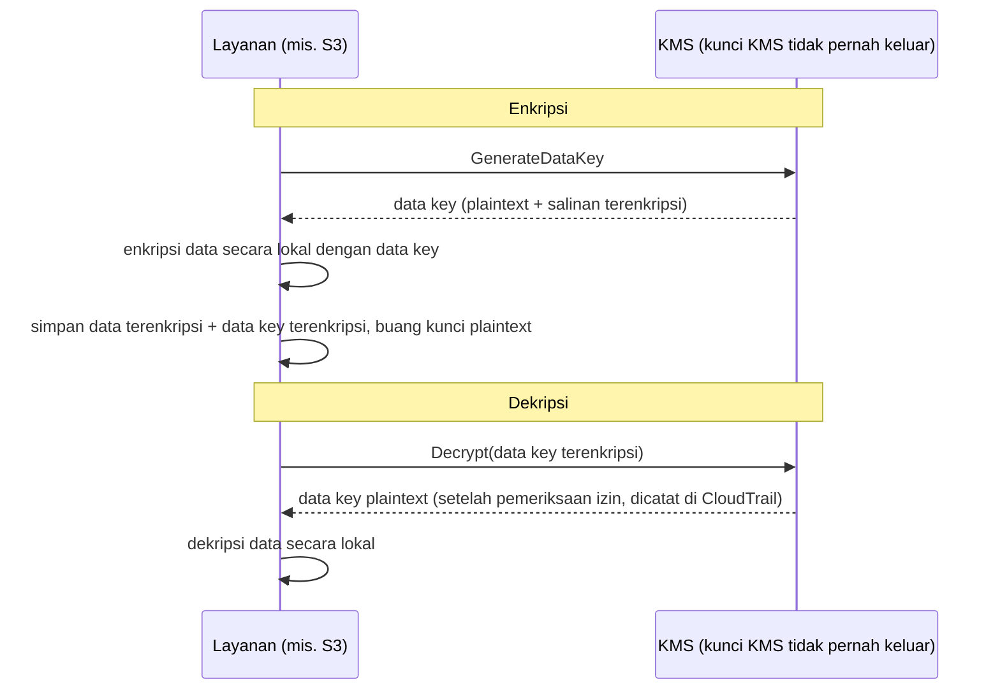

# Bab 16: Kunci, Gembok, dan Rahasia

Repository git memiliki ribuan commit yang membentang dua tahun ke belakang. Leo telah menggulir selama dua puluh menit, mengikuti sebuah benang melalui sejarah — mencari kapan sebuah connection string database tertentu pertama kali muncul. Ia hampir melewatkannya. Itu pada suatu Selasa sore, terjepit di antara dua commit biasa, didorong oleh seseorang yang sejak itu telah meninggalkan perusahaan.

Sebuah kata sandi database. Dalam teks biasa. Di dalam riwayat.

---

*Kontrol jaringan dari bab sebelumnya sekarang sudah ketat. Security group membatasi pergerakan lateral. NACL memblokir rentang IP yang diketahui buruk. Perimeter telah diperkuat. Tetapi audit keamanan menemukan sesuatu yang tidak bisa diperbaiki perimeter: sebuah kredensial yang telah hidup di riwayat git selama enam bulan. Keamanan perimeter berasumsi rahasia di dalamnya aman. Yang satu ini tidak.*

---

Leo sedang meninjau riwayat git ketika ia menemukannya. Sebuah kata sandi database. Di-commit enam bulan lalu, dalam teks biasa, oleh seseorang yang tidak lagi bekerja di Nimbus — bagian dari sebuah file `.env` yang juga berisi access key IAM pipeline deployment, dua baris di bawah connection string. Commit itu bersifat publik. Kata sandi tersebut telah diubah sejak itu — tetapi mereka tidak tahu itu dengan pasti. Mereka memeriksa setiap sistem yang pernah disentuh salah satu kredensial. Itu memakan waktu empat jam. Hari itu Nimbus memutuskan untuk berhenti menempatkan rahasia dalam kode.

"Apakah kita sudah memikirkan apa yang terjadi jika seseorang mem-fork repo?" kata Priya. "Riwayat git itu permanen. Bahkan jika kita mengubah kata sandi, siapa pun yang meng-clone repo sebelum perbaikan masih memiliki kredensial lama di riwayat lokal mereka."

"Kita sudah memeriksa," kata Leo. "Kata sandi diubah tiga bulan lalu. Semua sistem dikonfirmasi."

"Itu minimum," kata Priya. "Tetapi setiap sistem yang disentuh kredensial itu perlu ditinjau. Bukan hanya yang Anda ketahui."

**Audit Empat Jam**

Leo telah menemukan file `.env` yang bocor di riwayat git pada pukul 10 pagi. Pada pukul 2 siang, mereka punya jawaban atas pertanyaan yang penting: apakah salah satu kredensial — kata sandi database atau access key yang di-commit bersamanya — telah digunakan oleh siapa pun selain sistem Nimbus?

Audit menelusuri empat kategori.

**Log akses RDS**: Setiap koneksi ke database, ber-timestamp dan tercatat. Kata sandi yang bocor muncul di tiga connection string — semua dari instans EC2 di VPC Nimbus, semua dengan IP sumber yang diharapkan. Tidak ada koneksi eksternal. Kata sandi tidak digunakan untuk terhubung ke database dari luar.

**Log akses S3**: Access key yang bocor milik pengguna IAM pipeline deployment, yang memiliki izin untuk bucket `nimbus-receipts`. Leo mengkueri log akses server S3 untuk enam bulan terakhir. Setiap akses datang dari instans EC2 `us-west-2` atau dari role origin fetch CloudFront. Tidak ada anomali.

**Panggilan API CloudTrail**: Setiap panggilan API AWS yang dibuat dengan access key ID yang bocor. Leo memfilter peristiwa CloudTrail untuk kunci itu. Tiga ratus dua belas peristiwa — semua panggilan `s3:PutObject` rutin dari pipeline deployment, semua dari IP yang sama, semua dalam jam kerja. Kunci itu hanya pernah digunakan dari satu alamat IP, yang cocok dengan server CI/CD.

"Dan server CI/CD," kata Priya, "ada di dalam VPC. Ia harus mengeksfiltrasi data via HTTPS ke endpoint eksternal, dan kita akan melihatnya di flow logs."

"Kita sudah memeriksa," kata Leo. "Tidak ada HTTPS keluar dari server itu ke IP non-AWS dalam enam bulan terakhir."

**Putusan**: Tidak ada kredensial yang digunakan oleh siapa pun di luar tim Nimbus. Eksposurnya adalah risiko, bukan pelanggaran.

"Tetapi kita tidak bisa yakin," kata Priya. "Kita bisa cukup percaya diri berdasarkan log. Kita tidak bisa yakin. Perbedaan itu penting."

"Apa yang akan membuat kita yakin?"

"Tidak ada yang membuat Anda yakin setelah eksposur kredensial. Anda merotasi kredensial, mengaudit aksesnya, mendokumentasikan temuan Anda, dan bergerak maju dengan kontrol yang lebih baik. Kepastian tidak tersedia."

Tom telah menghitung selama percakapan. "Empat jam waktu tiga engineer. Sebut saja empat ribu dolar dalam biaya yang sudah dibebani penuh. Ditambah rotasi kredensial, dokumentasi, penulisan insiden."

"Dan itu baru investigasinya," kata Priya. "Sebuah pelanggaran akan menjadi beberapa kali lipat lebih besar. Notifikasi regulasi. Komunikasi pelanggan. Kemungkinan denda."

"Jadi pelajaran empat ribu dolar itu murah," kata Tom.

"Sangat," kata Priya. "Mari kita tidak mengulanginya."

---

**Dua Masalah: Menyimpan Rahasia dan Mengenkripsi Data**

Keamanan seputar informasi sensitif memiliki dua masalah yang berbeda:

**Menyimpan kredensial** (kata sandi database, kunci API, connection string): Di mana ini tinggal? Siapa yang dapat mengaksesnya? Bagaimana Anda merotasinya tanpa men-deploy ulang aplikasi Anda?

**Mengenkripsi data** (informasi pelanggan, catatan pembayaran, PII): Bagaimana Anda memastikan bahwa bahkan jika seseorang mendapatkan akses tidak sah ke database atau bucket S3 Anda, mereka tidak dapat membaca datanya?

AWS memiliki layanan khusus untuk setiap masalah:

- **AWS Secrets Manager**: Menyimpan dan mengelola kredensial dengan aman
- **AWS KMS (Key Management Service)**: Mengelola kunci enkripsi untuk mengenkripsi dan mendekripsi data

Anggap Secrets Manager sebagai gantungan kunci: ia menyimpan kunci Anda (kredensial), menjaganya terorganisir, dan merotasinya sesuai jadwal. Anggap KMS sebagai brankas: ia tidak menyimpan apa yang berharga — ia menyimpan kunci yang membuka gembok yang melindungi apa yang berharga.

**AWS Secrets Manager: Tidak Ada Lagi Kredensial Hardcoded**

Secrets Manager adalah penyimpanan aman untuk rahasia: kredensial database, kunci API, token OAuth, kunci SSH, atau apa pun yang sensitif.

Alih-alih aplikasi Anda membaca kata sandi dari variabel lingkungan atau file konfigurasi, ia memanggil API Secrets Manager saat startup (atau saat dibutuhkan) dan mengambil rahasianya. Rahasia tidak pernah menyentuh disk. Ia tidak pernah muncul di kode Anda. Ia tidak ada di variabel lingkungan Anda.

Berikut seperti apa alurnya:

**Cara lama**:
```
DB_PASSWORD=supersecretpassword123  # di file .env atau variabel lingkungan
```

**Cara Secrets Manager**:
```python
import boto3
client = boto3.client('secretsmanager')
secret = client.get_secret_value(SecretId='nimbus/production/db-password')
password = json.loads(secret['SecretString'])['password']
```

Instans EC2 membutuhkan IAM role dengan izin untuk memanggil `secretsmanager:GetSecretValue` untuk rahasia tertentu itu. Tidak ada layanan lain yang dapat membacanya. Rahasia tidak pernah ada di kode.

Anda mungkin bertanya-tanya: mengapa tidak menggunakan variabel lingkungan saja? Mereka lebih sederhana — atur saat deploy, dan aplikasi membacanya. Variabel lingkungan tampak tersembunyi, tetapi mereka disimpan di konfigurasi deployment Anda, penyimpanan rahasia CI/CD, mungkin dicatat selama sesi debug, dan terlihat oleh siapa pun dengan akses ke proses yang berjalan. Yang lebih penting, mereka statis: sekali diatur, mereka tidak berubah sampai seseorang memperbaruinya secara manual. Secrets Manager menyimpan kredensial dalam layanan terenkripsi dengan kontrol akses IAM, logging audit penuh via CloudTrail, dan rotasi otomatis. Variabel lingkungan tidak berotasi. Variabel lingkungan yang bocor tetap valid sampai seseorang mengubahnya secara manual.

**Rotasi Otomatis: Kekuatan Sesungguhnya**

Fitur terhebat Secrets Manager bukanlah menyimpan rahasia — melainkan merotasinya secara otomatis.

Berikut skenarionya: setiap 30 hari, Secrets Manager menghasilkan kata sandi database baru, memperbaruinya di RDS, memperbarui rahasia yang tersimpan, dan aplikasi Anda mengambil kata sandi baru saat berikutnya membutuhkannya. Tanpa intervensi manual. Tanpa deployment. Tanpa "aku perlu ingat untuk merotasi ini."

Rotasi diimplementasikan sebagai fungsi Lambda. AWS menyediakan template untuk database RDS (MySQL, PostgreSQL, Aurora). Anda dapat menyesuaikan fungsinya untuk tipe kredensial apa pun.

"Berapa biayanya per bulan?" tanya Tom.

Secrets Manager mengenakan biaya per rahasia per bulan ditambah per panggilan API. Untuk sejumlah kecil kata sandi database dan kunci API, biayanya beberapa dolar per bulan — dapat diabaikan dibandingkan dengan biaya sebuah insiden.

"Kompromi minggu lalu," kata Priya, "berapa biayanya untuk menyelidiki dan memperbaikinya?"

Tom diam sejenak. "Termasuk waktuku, waktumu, akhir pekan Leo... beberapa ribu dolar."

"Secrets Manager akan menangkap kunci statis sebelum dieksploitasi. Dan ia akan merotasinya secara otomatis."

Tom membuka halaman harga.

**Apa yang Terjadi Selama Rotasi**

"Tunggu — tetapi *mengapa* kita melakukannya seperti itu?" tanya Maya. "Jika kata sandi database berotasi, apakah aplikasi rusak? Bagaimana ia mengambil kata sandi baru tanpa deployment?"

Ini adalah kekhawatiran yang sah. Rotasi tanpa gangguan membutuhkan kehati-hatian.

Rotasi Secrets Manager bekerja dalam tahapan — dirancang untuk mencegah skenario "kata sandi lama tiba-tiba tidak valid, aplikasi crash":

**Tahap 1: Buat versi rahasia baru.** Secrets Manager menghasilkan kata sandi baru dan menyimpannya sebagai versi pending dari rahasia. Versi saat ini masih aktif.

**Tahap 2: Setel pada layanan.** Rotation Lambda memanggil database untuk memperbarui kata sandi ke nilai baru. Perhatikan: dengan strategi rotasi **single-user** default ada momen singkat ketika kata sandi lama baru saja berhenti bekerja (`ALTER ROLE ... PASSWORD` PostgreSQL berlaku segera) dan versi baru belum menjadi yang saat ini. Untuk rotasi tanpa downtime, Secrets Manager mendukung strategi **alternating-users**: dua pengguna database dengan izin identik, di mana rotasi selalu memperbarui yang *tidak aktif* lalu beralih — kredensial aktif tidak pernah diinvalidasi di tengah jalan. Frasa ujian yang perlu diingat adalah "alternating users rotation strategy."

**Tahap 3: Uji rahasia baru.** Rotation Lambda memverifikasi bahwa kata sandi baru berfungsi dengan terhubung menggunakannya. Jika ini gagal, rotasi di-roll back.

**Tahap 4: Selesai.** Secrets Manager menandai versi baru sebagai versi saat ini dan menurunkan versi lama menjadi versi sebelumnya. Versi sebelumnya disimpan untuk masa tenggang.

Selama masa tenggang, kedua versi dapat diambil. Jika aplikasi Anda meng-cache rahasia lama dan belum mengambil yang baru, ia masih dapat terhubung. Saat berikutnya ia memanggil `GetSecretValue`, ia mendapatkan versi saat ini (baru).

"Jadi aplikasi tidak pernah perlu di-restart," kata Leo.

"Tidak harus. Jika aplikasi Anda meng-cache rahasia saat startup dan tidak pernah menyegarkannya, Anda perlu entah menyegarkannya sesuai jadwal atau menangani kegagalan autentikasi dengan mengambil ulang rahasia."

"Jadi rotation Lambda dan aplikasi perlu bekerja sama," kata Maya.

"Secrets Manager melakukan bagiannya. Kode aplikasi Anda perlu melakukan bagian lainnya: mengambil rahasia saat dibutuhkan, menangani kegagalan autentikasi dengan mengambil ulang."

Leo memperbarui aplikasi untuk menangkap exception autentikasi database dan, saat gagal, mengambil rahasia segar dari Secrets Manager sebelum mencoba lagi. Dua baris penanganan error. Rotasi menjadi tak terlihat bagi pengguna.

---

**Injeksi Rahasia Pipeline CI/CD**

"Apakah kita sudah memikirkan bagaimana pipeline deployment mendapatkan rahasia yang dibutuhkannya?" tanya Priya. "Pipeline men-deploy infrastruktur. Ia membutuhkan kredensial AWS. Ia mungkin membutuhkan connection string database untuk skrip migrasi."

Leo menjelaskan pengaturan saat ini: rahasia disimpan sebagai GitHub Actions Secrets — terenkripsi at rest di GitHub, diinjeksikan sebagai variabel lingkungan saat runtime.

"Kredensialnya ada di GitHub," kata Priya.

"Terenkripsi."

"Di sistem pihak ketiga. Satu pelanggaran GitHub mengekspos semua rahasia pipeline kita."

Solusinya: pipeline deployment mengautentikasi ke AWS via federasi OIDC (dibahas di Bab 14) dan mengambil rahasia apa pun yang dibutuhkannya dari Secrets Manager saat runtime. Tidak ada rahasia yang disimpan di GitHub. Role AWS pipeline memiliki izin untuk membaca rahasia tertentu, tidak ada yang lain.

```yaml
# Workflow GitHub Actions
- name: Get DB Migration Credentials
  env:
    AWS_DEFAULT_REGION: us-west-2
  run: |
    SECRET=$(aws secretsmanager get-secret-value \
      --secret-id nimbus/staging/db-migration \
      --query SecretString --output text)
    DB_URL=$(echo $SECRET | jq -r '.url')
    # Jalankan migrasi dengan DB_URL — tidak pernah disimpan dalam file
    flyway -url="$DB_URL" migrate
```

Rahasia diambil, digunakan dalam memori, dan dibuang. Ia tidak pernah ditulis ke disk, tidak pernah disimpan dalam variabel lingkungan yang bertahan setelah job, tidak pernah dalam file log.

"Bagaimana jika rahasianya tercetak ke log?" tanya Leo.

"GitHub Actions otomatis menyamarkan nilai rahasia yang dikonfigurasi sebagai GitHub Secrets. Tetapi rahasia ini bukan GitHub Secret — ia datang dari Secrets Manager. Anda perlu menyamarkannya secara manual, atau lebih baik, jangan pernah mencatatnya."

"Jadi disiplinnya adalah: ambil, gunakan, buang. Jangan pernah mencatat rahasia. Jangan pernah menyimpannya dalam file."

"Disiplin itu," kata Priya, "adalah apa yang dikonfirmasi audit empat jam bahwa kita telah gagal melakukannya."


**AWS KMS: Pabrik Gembok**

"Tunggu — tetapi *mengapa* kita melakukannya seperti itu?" tanya Maya. "Mengapa layanan manajemen kunci terpisah? Tidak bisakah kita mengenkripsi datanya sendiri dan menyimpan kuncinya di Secrets Manager?"

Anda bisa menyimpan kunci enkripsi di Secrets Manager. Tetapi lalu siapa yang mengontrol akses ke kunci? Apa yang memastikan kunci dirotasi? Apa yang membuktikan kepada auditor bahwa kunci hanya digunakan oleh layanan yang berwenang? KMS menjawab semua pertanyaan ini. Ia bukan hanya penyimpanan — ia adalah layanan manajemen siklus hidup kunci dengan keamanan yang didukung perangkat keras, policy IAM yang halus per kunci, dan jejak audit lengkap dari setiap penggunaan. Secrets Manager menyimpan apa yang Anda butuhkan untuk terhubung ke sistem. KMS melindungi sistem itu sendiri.

AWS KMS (Key Management Service) mengelola **kunci kriptografis** — nilai rahasia yang digunakan untuk mengenkripsi dan mendekripsi data.

Analoginya: KMS seperti perusahaan lockbox yang memegang kunci utama. Data Anda (isi kotak) terenkripsi. Hanya seseorang dengan izin untuk menggunakan kunci KMS yang dapat mendekripsinya. KMS mencatat setiap penggunaan setiap kunci di CloudTrail.

**Customer Master Keys (CMK)** — sekarang disebut KMS keys — datang dalam tiga tipe kepemilikan:

**AWS owned keys**: Kunci yang dimiliki AWS dan digunakan di banyak akun pelanggan — Anda tidak pernah melihatnya, tidak pernah membayarnya, dan mereka tidak muncul di akun Anda. Beberapa default layanan menggunakannya (enkripsi default DynamoDB, misalnya).

(Satu perbedaan yang patut diluruskan: enkripsi default **SSE-S3** S3 *bukan* model kunci KMS sama sekali — S3 mengelola kunci AES-256-nya sendiri sepenuhnya di luar KMS, tanpa kunci yang terlihat dan tanpa jejak audit penggunaan kunci. **SSE-KMS** adalah opsi S3 yang melalui KMS, menggunakan entah kunci yang dikelola AWS `aws/s3` atau kunci yang dikelola pelanggan. Pemicu ujian: "audit siapa yang menggunakan kunci enkripsi" atau "kontrol rotasi dan key policy" → SSE-KMS dengan kunci yang dikelola pelanggan — setiap penggunaan mendarat di CloudTrail.)

**AWS managed keys**: AWS membuat dan mengelola kunci secara otomatis *di akun Anda* untuk layanan seperti S3, EBS, RDS (diberi nama seperti `aws/s3`). Anda dapat melihatnya dan mengaudit penggunaannya di CloudTrail, tetapi Anda tidak dapat mengubah policy atau rotasinya — AWS merotasinya secara otomatis setiap tahun. Gratis.

**Customer managed keys**: Anda membuat kunci di KMS dan mengontrol setiap aspeknya: siapa yang dapat menggunakannya, kapan ia berotasi, siapa yang dapat mengelolanya. Anda dapat mengaktifkan rotasi kunci otomatis dengan periode yang dapat dikonfigurasi antara 90 hari dan 2.560 hari (7 tahun); periode rotasi default adalah 365 hari (tahunan). Anda juga dapat memicu **rotasi on-demand** segera — berguna setelah dugaan eksposur, tanpa menunggu jadwal. Catatan: rotasi otomatis berlaku untuk kunci simetris dengan material yang dihasilkan KMS — kunci asimetris dan material kunci yang diimpor tidak dapat berotasi otomatis. Biaya: $1/bulan per kunci ditambah biaya per panggilan API.

Jika Anda memilih kunci KMS yang dikelola pelanggan, maka Anda mendapatkan kontrol penuh atas jadwal rotasi, policy akses, dan visibilitas audit, tetapi Anda membayar per kunci per bulan dan mengambil tanggung jawab manajemen kunci; jika Anda memilih kunci yang dikelola AWS, maka Anda mendapatkan enkripsi dengan nol overhead operasional dan tanpa biaya untuk kunci itu sendiri, tetapi Anda tidak dapat menyesuaikan jadwal rotasi atau key policy — mereka dikelola sepenuhnya oleh AWS.

**Enkripsi di Layanan AWS: Integrasi KMS**

Sebagian besar layanan AWS terintegrasi dengan KMS untuk enkripsi:

**S3**: Aktifkan "server-side encryption dengan KMS" pada bucket. Setiap objek terenkripsi at rest dengan kunci KMS. Membaca objek memerlukan izin untuk bucket S3 *dan* kunci KMS.

**RDS**: Aktifkan enkripsi saat pembuatan. Penyimpanan database, cadangan, dan snapshot semuanya terenkripsi dengan kunci KMS. Catatan: enkripsi tidak dapat diaktifkan pada instans RDS yang sudah ada yang tidak terenkripsi — Anda harus mengambil snapshot, menyalin snapshot dengan enkripsi diaktifkan, dan memulihkan.

**EBS**: Enkripsi volume dengan KMS. Volume baru yang dibuat dari snapshot terenkripsi otomatis terenkripsi.

**DynamoDB**: Enkripsi at rest menggunakan KMS diaktifkan secara default pada semua tabel.

**ElastiCache Redis**: Enkripsi at rest dengan KMS untuk data cache yang sensitif.

Prinsipnya: data harus terenkripsi at rest (disimpan di disk) dan in transit (bergerak melintasi jaringan). KMS menangani enkripsi at-rest. TLS/SSL (disediakan otomatis oleh layanan AWS) menangani enkripsi in-transit.

**Envelope Encryption: Bagaimana KMS Sebenarnya Bekerja**

Berikut detail yang membantu Anda memahami perilaku KMS dan pertanyaan ujian.

KMS tidak mengenkripsi data Anda secara langsung dalam sebagian besar kasus. Ia menggunakan **envelope encryption**:

1. KMS menghasilkan **data key** (kunci simetris unik)
2. Layanan menggunakan data key untuk mengenkripsi data Anda secara lokal (cepat — enkripsi simetris)
3. Layanan meminta KMS untuk mengenkripsi data key itu sendiri (menggunakan kunci KMS Anda)
4. Baik data terenkripsi maupun data key terenkripsi disimpan
5. Data aktual Anda tidak pernah meninggalkan layanan — hanya data key yang pergi ke KMS untuk enkripsi/dekripsi

Ketika Anda membaca data:

1. Layanan meminta KMS untuk mendekripsi data key
2. KMS memeriksa izin, mendekripsi data key, mengembalikannya
3. Layanan menggunakan data key yang didekripsi untuk mendekripsi data Anda secara lokal



Ini berarti KMS dapat menangani data yang sangat besar tanpa mengirim semuanya melalui API KMS. Hanya kunci kecil yang pergi ke KMS. CloudTrail mencatat setiap panggilan API KMS — setiap operasi enkripsi dan dekripsi.

**KMS Key Policy: Model Akses**

"Apakah kita sudah memikirkan apa yang terjadi jika policy IAM dan key policy berkonflik?" tanya Priya. "KMS memiliki kontrol akses sendiri di atas IAM."

Kunci KMS memiliki **key policy** — policy berbasis sumber daya yang dilampirkan ke kunci itu sendiri. Mereka berbeda dari policy IAM dan mengikuti aturan evaluasi yang berbeda.

Agar sebuah principal dapat menggunakan kunci KMS, dua hal harus benar:

**Pertama**: Key policy harus mengizinkannya. Jika key policy tidak secara eksplisit memberikan akses principal, mereka tidak dapat menggunakan kunci — terlepas dari apa yang dikatakan policy IAM mereka. Ini berbeda dari sebagian besar sumber daya AWS, di mana policy IAM saja sudah cukup.

**Kedua**: Policy IAM principal harus mengizinkan aksi KMS (mis., `kms:Decrypt`, `kms:GenerateDataKey`).

Keduanya harus mengatakan ya. Salah satunya mengatakan tidak berarti aksi ditolak.

Key policy default yang dibuat AWS untuk kunci yang dikelola pelanggan menyertakan pernyataan yang mengatakan "akun root dapat mengelola kunci ini." Ini penting: ini berarti administrator IAM level akun selalu dapat memberikan akses ke kunci, bahkan jika key policy tidak menyebut mereka secara langsung — karena delegasi akun root sudah ada.

"Jadi jika kita menghapus akun root dari key policy," tanya Leo, "policy IAM berhenti bekerja untuk kunci itu?"

"Benar. Menghapus delegasi akun root adalah cara untuk mengunci kunci begitu ketat sehingga hanya principal tertentu yang disebutkan dalam key policy yang dapat menggunakannya — bahkan administrator akun pun tidak. Ini juga cara untuk secara tidak sengaja mengunci diri Anda sendiri keluar dari kunci Anda sendiri."

"Bisakah kita pulih?"

"Hanya dengan menghubungi AWS Support. Jika tidak ada yang bisa menggunakan kunci dan key policy tidak dapat diperbarui, data yang dienkripsi dengan kunci itu secara efektif tidak dapat diakses."

"Jadi jangan menghapus akun root dari key policy tanpa alasan yang sangat baik."

"Benar."

---

**Kunci Asimetris: Penandatanganan dan Verifikasi**

KMS juga mendukung pasangan kunci asimetris — kunci publik dan kunci privat.

Kasus penggunaannya:

**Penandatanganan digital**: Anda menandatangani dokumen atau token JWT dengan kunci privat. Siapa pun dengan kunci publik dapat memverifikasi bahwa tanda tangan berasal dari pemegang kunci privat, dan bahwa kontennya belum dirusak.

**Enkripsi kunci publik**: Siapa pun dapat mengenkripsi data dengan kunci publik. Hanya pemegang kunci privat yang dapat mendekripsinya.

Untuk Nimbus, kunci asimetris menjadi relevan ketika mereka mengimplementasikan sistem tanda tangan webhook untuk mitra restoran. Ketika Nimbus mengirim sebuah peristiwa ke server mitra restoran (pesanan baru, pembaruan status), mitra perlu memverifikasi bahwa peristiwa itu benar-benar datang dari Nimbus dan tidak dipalsukan.

Implementasinya:

1. Nimbus membuat kunci KMS asimetris (RSA 2048-bit, algoritma SIGN_VERIFY)
2. Saat mengirim webhook, Nimbus memanggil `kms:Sign` dengan kunci privat untuk menandatangani payload peristiwa
3. Tanda tangan disertakan dalam header webhook
4. Nimbus mempublikasikan kunci publik (dapat diunduh dari konsol KMS)
5. Server mitra restoran mengambil kunci publik dan menggunakannya untuk memverifikasi tanda tangan pada setiap webhook yang masuk

Kunci privat tidak pernah meninggalkan KMS. Nimbus tidak pernah memiliki akses ke material kunci privat mentah. KMS melakukan operasi penandatanganan di dalam hardware security module-nya.

"Jadi bahkan jika seseorang mengkompromikan server Nimbus," kata Rafael, "mereka tidak bisa memalsukan tanda tangan webhook. Kunci privat ada di KMS, bukan di server mana pun."

"Benar. Penandatanganan memerlukan panggilan API KMS. Setiap panggilan API dicatat di CloudTrail. Jika seseorang mencoba menandatangani peristiwa palsu, kita akan melihat panggilan API-nya."

---

**Kisah Penghapusan Kunci**

Tiga bulan setelah penyiapan KMS, Tom membuat kesalahan.

Ia sedang membersihkan sumber daya AWS yang tidak terpakai — fungsi Lambda lama, bucket S3 basi, dasbor CloudWatch yang ditinggalkan. Ia bergerak cepat. Ia secara tidak sengaja menjadwalkan sebuah kunci KMS untuk penghapusan.

Kuncinya adalah `nimbus/prod/order-receipts` — kunci yang dikelola pelanggan yang digunakan untuk mengenkripsi bucket S3 struk pesanan.

"Aku menghapus dua belas sumber daya secara batch kemarin dan tidak memeriksa apa yang kedua belas," kata Tom datar. Ia telah menjadwalkan penghapusan dan melanjutkan. Ia menyadari kesalahannya keesokan paginya ketika ia meninjau tindakannya.

Ia membuka konsol KMS. Status kunci berbunyi: "Pending deletion. Penghapusan dalam 7 hari."

Ia telah menjadwalkannya untuk periode tunggu minimum.

"Bisakah kita membatalkannya?" tanyanya.

Priya membuka dokumentasi. "Ya. Selama periode tunggu, kunci dinonaktifkan tetapi tidak dihapus. Anda dapat membatalkan penghapusannya."

Tom membatalkan penghapusan dalam waktu kurang dari semenit. Kunci dipulihkan ke status aktif.

"Tujuh hari adalah periode tunggu minimum," kata Priya. "AWS menegakkannya karena jika sebuah kunci dihapus dan data dienkripsi dengannya, data itu hilang selamanya. Tidak dapat dipulihkan. Periode tunggu memberi Anda waktu untuk menyadari kesalahan."

"Berapa lama periode tunggu seharusnya?"

"Maksimum adalah tiga puluh hari. Untuk kunci apa pun yang mengenkripsi data produksi, gunakan tiga puluh hari. Tambahan tiga minggu perlindungan terhadap kecelakaan sepadan dengan ketidaknyamanan kecilnya."

Tom memperbarui semua pengaturan penghapusan kunci produksi menjadi tiga puluh hari. Ia juga menyiapkan alarm CloudWatch yang menyala jika status kunci KMS mana pun berubah menjadi "Pending deletion" — sehingga lain kali seseorang (termasuk dia) membuat kesalahan yang sama, tim akan tahu dalam lima menit.

---

**Secrets Manager vs Parameter Store**

AWS juga memiliki **Systems Manager Parameter Store**, yang menyimpan nilai konfigurasi (bukan hanya rahasia). Parameter Store lebih murah — gratis untuk parameter standar. Ia juga dapat menyimpan parameter terenkripsi menggunakan KMS.

Untuk rahasia yang membutuhkan rotasi: Secrets Manager.

Untuk nilai konfigurasi dan parameter yang tidak sensitif: Parameter Store (tier gratis sangat murah hati).

Untuk konfigurasi aplikasi (nomor port, feature flag, pengaturan spesifik lingkungan): Parameter Store.

| | Secrets Manager | SSM Parameter Store |
|---|---|---|
| Rotasi otomatis | Ya (didukung Lambda) | Tidak |
| Biaya | ~$0,40/rahasia/bulan | Gratis (standar) |
| Enkripsi | Selalu | Opsional (dengan KMS) |
| Versioning | Ya | Ya |
| Akses lintas-akun | Ya | Terbatas |
| Terbaik untuk | Kata sandi database, kunci API | Nilai konfigurasi, feature flag |

## Sertifikat di Pintu

Dua minggu setelah migrasi rahasia, Priya sedang meninjau lingkungan staging Nimbus di teleponnya ketika ia menyadari bilah alamat.

"Tidak Aman."

Ia membuka URL produksi. Hal yang sama.

"Leo," katanya, meletakkan teleponnya di meja. "Apakah kita berjalan di HTTP?"

Leo memeriksa. "Listener ALB ada di port 80. Kita tidak pernah menyiapkan HTTPS."

"Jadi setiap permintaan yang dibuat pengguna kita — setiap pesanan, setiap login — melewati HTTP yang tidak terenkripsi?"

"Kita punya TLS pada koneksi RDS," tawar Leo.

"Itu data in transit antara aplikasi dan database. Aku berbicara tentang data in transit antara peramban pengguna dan load balancer kita. Itu tidak terenkripsi sama sekali."

Tom sudah mendengarkan. "Apakah itu masalah keamanan atau masalah persepsi?"

"Keduanya," kata Priya. "HTTP yang tidak terenkripsi berarti jaringan mana pun antara pengguna dan server kita — router kedai kopi, ISP — dapat membaca lalu lintasnya. Kata sandi, detail pesanan, token sesi. Dan peramban modern memperingatkan pengguna dengan 'Tidak Aman.' Itu membunuh tingkat konversi."

"Jadi kita butuh sertifikat TLS," kata Maya. "Berapa biayanya?"

"Tidak ada," kata Priya. "AWS Certificate Manager."

**AWS Certificate Manager (ACM)** menyediakan sertifikat TLS/SSL gratis untuk digunakan dengan layanan yang dikelola AWS: ALB, distribusi CloudFront, dan API Gateway. Anda tidak membeli sertifikat, mengelola kalender pembaruan, atau menyentuh material kunci privat. ACM menangani seluruh siklus hidup sertifikat.

Sertifikat yang diterbitkan oleh ACM valid selama 13 bulan. Sebelum kedaluwarsa, ACM memperbaruinya secara otomatis. Jika pembaruan berhasil, sertifikat baru dilampirkan ke load balancer atau distribusi Anda tanpa tindakan apa pun dari Anda. Gembok peramban tetap hijau. Peringatan kedaluwarsa yang Anda lupa setel tidak pernah menyala.

**Dua tipe sertifikat ACM**:

**Sertifikat publik** diterbitkan oleh certificate authority Amazon dan dipercaya oleh semua peramban utama. Mereka sepenuhnya gratis untuk digunakan dengan ALB, CloudFront, dan API Gateway. Anda memvalidasi kepemilikan domain entah via DNS atau email.

**Sertifikat privat** diterbitkan oleh AWS Private CA — certificate authority privat terkelola yang Anda jalankan untuk layanan internal (mTLS layanan-ke-layanan, perkakas internal, klien VPN). Private CA memiliki biaya bulanan.

Untuk Nimbus, sertifikat publik adalah pilihan yang tepat.

**Validasi DNS vs. validasi email**:

Leo membuka konsol ACM dan memulai permintaan sertifikat untuk `eatnimbus.com` dan `*.eatnimbus.com`.

"Ia menanyakan bagaimana aku ingin memvalidasi kepemilikan," katanya. "DNS atau email."

"DNS," kata Priya. "Selalu DNS."

Dengan validasi DNS, ACM menambahkan catatan CNAME tertentu ke hosted zone Anda. Route 53 dapat melakukan ini secara otomatis — satu klik di konsol. Selama catatan CNAME itu ada, ACM dapat memperbarui sertifikat secara otomatis tanpa tindakan manusia apa pun. Validasi email mengirim email ke kontak terdaftar domain dan membutuhkan klik manual setiap kali sertifikat diperbarui. Klik itu terlupakan. Validasi DNS tidak membutuhkan siapa pun untuk mengingat apa pun.

"Jadi aku menambahkan catatan CNAME sekali," kata Leo, "dan ia memperbarui selamanya?"

"Sampai seseorang menghapus catatan CNAME," kata Priya. "Jangan hapus catatan CNAME."

Leo meminta sertifikat, menambahkan CNAME validasi di Route 53 (yang ACM tawarkan untuk dilakukan secara otomatis), dan menunggu lima menit. Status sertifikat berubah menjadi Issued. Ia melampirkannya ke listener HTTPS ALB pada port 443 dan menambahkan aturan redirect pada port 80 untuk mengirim semua lalu lintas HTTP ke HTTPS.

Tom menyegarkan URL produksi.

Gemboknya muncul.

Satu detail regional yang patut ditandai: sebuah sertifikat adalah sumber daya regional, dan ia harus tinggal di region yang sama dengan layanan yang menggunakannya. Untuk ALB, itu adalah region ALB. Untuk **CloudFront**, sertifikat harus diminta (atau diimpor) di **`us-east-1`** — selalu, terlepas dari di mana origin Anda berjalan — karena CloudFront adalah layanan global yang berlabuh di sana. Leo sudah pernah tersandung ini di Bab 13; ini juga fakta ujian yang andal.

**Satu hal yang tidak bisa dilakukan sertifikat ACM**:

"Bisakah aku mengunduh sertifikatnya?" tanya Leo. "Aku ingin menginstalnya di instans EC2 admin internal."

"Tidak," kata Priya.

Sertifikat publik ACM gratis tidak dapat diekspor. Anda tidak dapat mengunduh kunci privat dan menginstalnya di instans EC2, server Nginx, atau apa pun di luar layanan yang dikelola AWS. Material kunci privat tidak pernah meninggalkan ACM. Ini disengaja — ini mencegah kunci privat bocor, disimpan dengan tidak aman, atau dilupakan saat sertifikat kedaluwarsa.

Untuk kasus penggunaan yang membutuhkan sertifikat yang dapat diinstal — instans EC2 yang bertindak sebagai proxy kustom, server on-premises — ada tiga rute: sertifikat dari otoritas pihak ketiga (Let's Encrypt, misalnya), AWS Private CA dengan ekspor sertifikat diaktifkan, atau — sejak Juni 2025 — **sertifikat publik yang dapat diekspor** berbayar dari ACM (opt-in saat penerbitan, dikenakan biaya per FQDN atau wildcard), yang kunci privatnya *dapat* diekspor untuk digunakan di mana saja.

"Untuk ALB dan distribusi CloudFront kita," kata Priya, "ACM persis tepat. Gratis, otomatis, dan kita tidak pernah menyentuh kunci."

## Kekuatan dan Batasan

**AWS Secrets Manager**:

- Rotasi rahasia otomatis tanpa perubahan kode atau deployment
- Kontrol akses IAM yang halus per rahasia (setiap rahasia adalah sumber daya IAM terpisah)
- Versioning — versi sebelumnya tetap dapat diakses selama rotasi, mencegah putusnya koneksi
- Audit via CloudTrail — setiap panggilan `GetSecretValue` dicatat dengan identitas pemanggil
- Akses lintas-akun — rahasia satu akun dapat dibagikan dengan role akun lain
- Biaya: ~$0,40/rahasia/bulan + panggilan API (sekitar $0,05 per 10.000 panggilan API)

**AWS KMS**:

- Manajemen kunci terpusat dengan jejak audit penuh — setiap enkripsi dan dekripsi dicatat
- Rotasi kunci otomatis yang dapat dikonfigurasi untuk kunci yang dikelola pelanggan (90 hari hingga 2.560 hari; default 365 hari) — material kunci lama masih mendekripsi data yang ada, material kunci baru mengenkripsi data baru
- Izin IAM yang halus per kunci (key policy + policy IAM — keduanya harus mengizinkan)
- Didukung Hardware Security Module (HSM) — kunci tidak pernah meninggalkan HSM dalam plaintext
- Dukungan kunci Multi-Region untuk skenario pemulihan bencana
- Dukungan kunci asimetris untuk penandatanganan dan verifikasi digital
- Biaya: $1/bulan per kunci + $0,03 per 10.000 panggilan API

**Di mana menjadi rumit**:

- Key policy KMS terpisah dari (dan dievaluasi bersama) policy IAM — men-debug error access denied membutuhkan pemeriksaan keduanya
- Enkripsi at rest harus direncanakan di muka — Anda tidak dapat mengenkripsi instans RDS yang sudah ada yang tidak terenkripsi di tempat
- Penghapusan kunci di KMS memiliki periode tunggu 7-30 hari — mekanisme keamanan, tetapi mudah dilupakan selama penyiapan dan berbahaya jika dipicu secara tidak sengaja
- Rotasi membutuhkan kode aplikasi untuk menangani pengambilan ulang rahasia saat kegagalan autentikasi — Secrets Manager merotasi kredensial, tetapi aplikasi harus mengambilnya
- Biaya Secrets Manager berskala dengan jumlah rahasia dan volume panggilan API pada skala besar
- Key policy default (termasuk delegasi akun root) penting untuk dipertahankan — menghapusnya dapat mengunci administrator keluar dari kunci

## Ringkasan

Empat jam yang dihabiskan menelusuri kredensial yang dikompromikan melalui setiap sistem yang disentuhnya adalah empat jam yang bisa dicegah Secrets Manager. Rotasi otomatis berarti kredensial yang dicuri memiliki masa hidup yang singkat. KMS berarti bahkan jika seseorang sampai ke data, mereka tidak dapat membacanya tanpa kunci yang tidak berwenang mereka gunakan. Dan periode tunggu penghapusan kunci tiga puluh hari berarti penghapusan yang tidak disengaja dapat dibatalkan sebelum menjadi peristiwa kehilangan data.

- Jangan pernah menyimpan kredensial dalam kode, variabel lingkungan, atau file konfigurasi yang di-commit ke version control.
- **Secrets Manager** menyimpan kredensial dengan aman dan merotasinya secara otomatis. Aplikasi mengambil rahasia via API saat runtime.
- **Rotasi** terjadi dalam tahapan: buat versi baru, perbarui pada layanan, uji, promosikan. Baik versi lama maupun baru sebentar valid, mencegah putusnya koneksi selama rotasi.
- **KMS** mengelola kunci enkripsi. Sebagian besar layanan AWS terintegrasi dengan KMS untuk enkripsi at rest.
- **Envelope encryption**: KMS mengenkripsi kunci, bukan data secara langsung. Layanan mengenkripsi data menggunakan data key lokal, yang dienkripsi KMS. Hanya kunci kecil yang melintasi API KMS.
- **Kunci KMS yang dikelola pelanggan**: kontrol penuh atas rotasi (dapat dikonfigurasi 90–2.560 hari, default 365 hari tahunan), akses, dan audit ($1/bulan). **Kunci yang dikelola AWS**: otomatis, tanpa konfigurasi, gratis.
- **Key policy KMS**: Key policy adalah policy berbasis sumber daya yang bekerja bersama IAM. Keduanya harus mengatakan ya. Delegasi akun root di key policy default memastikan administrator IAM selalu dapat memberikan akses.
- **Kunci asimetris**: KMS mendukung pasangan kunci RSA dan ECC untuk penandatanganan dan verifikasi. Kunci privat tidak pernah meninggalkan HSM.
- **Penghapusan kunci**: Periode tunggu minimum 7 hari, maksimum 30 hari. Kunci yang dihapus berarti data terenkripsi yang permanen tidak dapat diakses. Gunakan 30 hari untuk kunci produksi, dan pantau status pending deletion.
- **Rahasia CI/CD**: Ambil dari Secrets Manager saat runtime menggunakan federasi OIDC. Jangan pernah menyimpan rahasia sebagai variabel platform CI/CD.

## Tips Ujian

*SAA-C03 Domain: Desain Arsitektur Aman (Domain 1, Tugas 1.3)*

- **Secrets Manager vs SSM Parameter Store**: Secrets Manager untuk kredensial yang membutuhkan rotasi otomatis; Parameter Store untuk konfigurasi umum. Ujian membedakannya berdasarkan persyaratan rotasi dan sensitivitas biaya.
- **Key policy KMS**: Kunci KMS memiliki key policy-nya sendiri (policy berbasis sumber daya). Policy IAM saja tidak memberikan akses ke kunci KMS — key policy harus secara eksplisit mengizinkannya. Baik key policy maupun policy IAM harus mengizinkan aksi.
- **Mengenkripsi RDS**: Tidak dapat mengaktifkan enkripsi pada instans RDS yang sudah ada yang tidak terenkripsi. Prosesnya: buat snapshot → salin snapshot dengan enkripsi diaktifkan → pulihkan dari snapshot terenkripsi → migrasikan lalu lintas ke instans baru.
- **Enkripsi EBS**: Volume baru dapat dienkripsi. Snapshot dari volume terenkripsi selalu terenkripsi. Volume yang tidak terenkripsi tidak dapat dienkripsi langsung — snapshot + salin + pulihkan.
- **CloudTrail + KMS**: Setiap panggilan API KMS dicatat di CloudTrail. Ini adalah fitur kepatuhan utama. Ketika ujian menanyakan cara mengaudit siapa yang mendekripsi data apa, jawabannya adalah CloudTrail + KMS.
- **Kunci KMS Multi-Region**: Replikasi material kunci ke beberapa region sehingga dekripsi dapat terjadi tanpa panggilan API lintas-region. Ujian menggunakan ini untuk pemulihan bencana multi-region dengan data terenkripsi.
- **KMS vs CloudHSM**: KMS bersifat multi-tenant (dikelola oleh AWS). CloudHSM adalah hardware security module khusus yang hanya Anda kontrol. Sinyal ujian: "FIPS 140-2 Level 3," "HSM khusus," "operasi kriptografis yang dikelola pelanggan" → CloudHSM.
- **Envelope encryption**: KMS menghasilkan data key, layanan menggunakannya untuk mengenkripsi data secara lokal, KMS mengenkripsi data key. Pertanyaan ujian: "mengapa KMS tidak mengenkripsi data dalam jumlah besar secara langsung?" → performa; envelope encryption menjaga data besar tetap lokal.
- **Kunci KMS asimetris**: Digunakan untuk penandatanganan digital, verifikasi JWT, atau enkripsi kunci publik. Kunci privat tidak pernah meninggalkan KMS. `kms:Sign` adalah panggilan API untuk menandatangani; `kms:Verify` untuk memverifikasi.
- **Periode tunggu penghapusan kunci**: 7-30 hari. Selama periode ini, kunci dinonaktifkan dan tidak dapat digunakan, tetapi penghapusan dapat dibatalkan. Setelah penghapusan, data apa pun yang dienkripsi dengan kunci itu permanen tidak dapat dipulihkan.
- **ACM (AWS Certificate Manager):** Sertifikat TLS publik gratis untuk digunakan dengan ALB, CloudFront, dan API Gateway. Perbarui otomatis via validasi DNS. Sertifikat publik gratis tidak dapat mengekspor kunci privatnya — mereka hanya tinggal di dalam AWS (opsi *sertifikat publik yang dapat diekspor* berbayar ada sejak 2025 untuk penggunaan EC2/on-premises). Pemicu ujian: "HTTPS pada load balancer atau CDN" → ACM.

## Latihan

**Latihan 1 — Ingat**

Jelaskan konsep envelope encryption. Mengapa KMS mengenkripsi data key kecil alih-alih mengenkripsi data aplikasi Anda secara langsung?

*(Petunjuk: Pikirkan tentang apa yang terjadi jika Anda memiliki 1GB data untuk dienkripsi, dan apa implikasi performa dari mengirim 1GB ke layanan KMS jarak jauh.)*

**Latihan 2 — Skenario SAA-C03**

*Skenario*: Sebuah perusahaan jasa keuangan menyimpan data pelanggan sensitif di database RDS MySQL. Persyaratan kepatuhan baru mengamanatkan bahwa:

1. Semua data harus terenkripsi at rest
2. Semua penggunaan kunci enkripsi harus dapat diaudit
3. Kunci enkripsi harus dikontrol pelanggan (tidak dikelola AWS)
4. Kata sandi database harus dirotasi secara otomatis setiap 90 hari

Database dibuat enam bulan lalu tanpa enkripsi diaktifkan. Set tindakan mana yang PALING memenuhi keempat persyaratan?

A) Aktifkan enkripsi RDS pada database yang ada; buat kunci KMS yang dikelola pelanggan; konfigurasikan Secrets Manager dengan rotasi 90-hari  
B) Buat snapshot dari database yang ada; salin snapshot dengan enkripsi menggunakan kunci KMS yang dikelola pelanggan; pulihkan dari snapshot terenkripsi; konfigurasikan Secrets Manager dengan rotasi 90-hari  
C) Buat instans RDS terenkripsi baru dengan kunci yang dikelola AWS; migrasikan data dari instans lama; konfigurasikan Secrets Manager dengan rotasi 90-hari  
D) Aktifkan enkripsi at-rest RDS pada database yang ada menggunakan kunci yang dikelola AWS; konfigurasikan Secrets Manager dengan rotasi 90-hari

**Petunjuk 1**: Anda tidak dapat mengaktifkan enkripsi pada instans RDS yang sudah ada yang tidak terenkripsi secara langsung.

**Petunjuk 2**: Kunci "dikontrol pelanggan" berarti kunci KMS yang dikelola pelanggan, bukan kunci yang dikelola AWS.

**Petunjuk 3**: Proses penyalinan snapshot adalah jalur migrasi standar ke RDS terenkripsi.

**Jawaban**: B

**Penjelasan**: Enkripsi RDS tidak dapat diaktifkan pada instans yang sudah ada. Pendekatan standarnya adalah: snapshot instans yang ada → salin snapshot dengan enkripsi diaktifkan menggunakan kunci KMS yang dikelola pelanggan (memenuhi persyaratan 1, 2, dan 3) → pulihkan dari snapshot terenkripsi. Kunci KMS yang dikelola pelanggan secara otomatis mencatat semua penggunaan di CloudTrail (audit) dan menjaga kunci enkripsi di bawah kontrol Anda. Secrets Manager menangani rotasi kata sandi 90-hari otomatis (memenuhi persyaratan 4).

**Mengapa tidak A?** Anda tidak dapat mengaktifkan enkripsi pada instans RDS yang sudah ada yang tidak terenkripsi di tempat.

**Mengapa tidak C?** Kunci yang dikelola AWS tidak memenuhi persyaratan "dikontrol pelanggan" (persyaratan 3).

**Mengapa tidak D?** Masalah yang sama dengan A (tidak bisa mengaktifkan di tempat) ditambah kunci yang dikelola AWS tidak memenuhi persyaratan 3.

*SAA-C03 Domain: Desain Arsitektur Aman — Tugas 1.3*

**Latihan 3 — Tantangan Arsitektur** *(Opsional)*

Nimbus perlu menyimpan data sensitif berikut:

- Kata sandi database untuk instans RDS produksi
- Kunci rahasia API Stripe (digunakan untuk pemrosesan pembayaran)
- Kunci enkripsi simetris untuk mengenkripsi riwayat pesanan pelanggan di DynamoDB
- Nilai konfigurasi per-restoran (endpoint API, feature flag — tidak sensitif)

Layanan atau pendekatan AWS mana yang akan Anda gunakan untuk masing-masing? Strategi rotasi apa yang akan Anda terapkan untuk masing-masing?

*(Tidak ada satu jawaban yang benar. Tujuannya adalah berlatih mencocokkan alat keamanan dengan kasus penggunaan.)*

## Adegan Pasca-Kredit

"Aku sudah men-deploy-nya — oh." Leo telah memigrasikan rahasia produksi ke Secrets Manager sementara lingkungan pengembangan masih menggunakan variabel lingkungan lama. Lingkungan dev rusak. Ia harus me-roll back konfigurasi dev secara manual.

"Stage dulu," kata Priya. "Lalu produksi."

"Aku tahu," kata Leo.

Rahasia dimigrasikan.

Kata sandi database: Secrets Manager, berotasi setiap 30 hari.

Kunci API: Secrets Manager, dengan rotation Lambda yang memanggil API penyedia pembayaran untuk menghasilkan kunci baru.

Data pesanan pelanggan: dienkripsi dengan kunci KMS yang dikelola pelanggan.

Kredensial lama: dinonaktifkan. File konfigurasi lama: dihapus. GitHub Actions secrets lama: dihapus.

"Kita sekarang siap-audit," kata Priya.

"Definisikan siap-audit," kata Maya.

"Jika seorang auditor kepatuhan meminta kita membuktikan tidak ada kredensial yang di-hardcode dalam kode kita atau terekspos di infrastruktur kita, kita bisa menunjukkan kepada mereka: setiap rahasia ada di Secrets Manager, setiap kunci enkripsi ada di KMS, setiap akses dicatat di CloudTrail."

"Kapan terakhir kali seseorang memeriksa log CloudTrail?"

Sebuah jeda.

"Aku memeriksanya setiap minggu," kata Priya.

"Dan jika sesuatu yang tidak biasa muncul, bagaimana kita akan tahu?"

"Itu," kata Priya, menutup laptopnya, "adalah percakapan berikutnya."

Di bab berikutnya: tiga lapisan pertahanan yang berdiri antara Nimbus dan internet.
