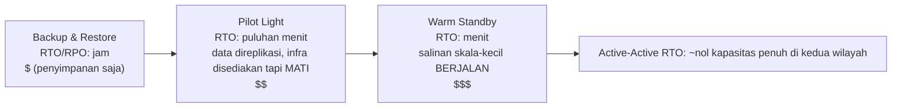

# Bab 18: Ketika Hal-Hal Rusak

Lampu padam pada pukul 23:17.

Bukan di kantor Nimbus—Leo sedang di rumah, di sofa, laptop setengah tertutup. Lampu padam di sebuah pusat data di Oregon yang belum pernah ia kunjungi, di sebuah gedung yang belum pernah ia lihat, di sebuah ruangan penuh server yang belum pernah ia sentuh. Ia belum tahu. Ada satu momen—hanya satu momen—keheningan total sebelum generator cadangan menyala di suatu tempat yang jauh. Kegelapan yang membuat Anda tak bisa membedakan apakah mata Anda terbuka atau tertutup.

Lalu notifikasi Slack tiba.

---

Setelah sistem pemantauan dari bab 17 terpasang, tim merasakan sesuatu yang menyerupai keyakinan. Peringatan menyala. Dasbor hijau. Log mengalir ke CloudWatch. Mereka telah menghabiskan tiga minggu memasang visibilitas ke setiap sudut infrastruktur Nimbus.

Apa yang tak seorang pun ucapkan dengan lantang—apa yang tidak dilindungi oleh pemantauan—adalah bahwa visibilitas dan ketahanan adalah dua hal yang berbeda. Anda bisa menyaksikan sesuatu gagal dengan detail yang sempurna. Menyaksikannya tidak menghentikannya.

Pelajaran itu datang pada pukul 23:23 di hari Kamis.

---

Leo menerima notifikasi Slack.

"us-west-2 — kegagalan klaster pusat data — layanan terdegradasi."

Ia membuka konsol AWS. Instans EC2 di salah satu Availability Zone menunjukkan pemeriksaan status yang gagal. Auto Scaling Group-nya telah mendeteksi instans yang tidak sehat dan sedang membuat penggantinya—di zona yang sama.

Di klaster yang sedang gagal.

Instans baru juga tidak bisa dimulai. Mereka berada di zona kegagalan perangkat keras yang sama.

"Load balancer mengarahkan lalu lintas ke kedua AZ," kata Leo kepada siapa pun. "Setengah dari lalu lintas kami mengarah ke instans yang tidak berfungsi."

Ia membuka konsol EC2 dan mulai mengeklik. Di bawah Load Balancers, Application Load Balancer menunjukkan kedua target group sebagai sehat—karena pemeriksaan kesehatan lolos pada port 80, dan bahkan instans yang gagal pun merespons pemeriksaan itu. Mereka hanya tidak bisa memproses permintaan yang sebenarnya.

Ia mencoba menghapus AZ yang gagal dari target group. Konsol menerima perubahan itu. Tetapi Auto Scaling Group, yang dikonfigurasi untuk menjaga keseimbangan, langsung mencoba mengganti instans yang dihentikan—di zona yang sama yang gagal.

Leo menatap layar. Ia baru saja memperburuk keadaan.

Ia membuka konfigurasi ASG. Pengaturan "Balance capacity across Availability Zones" aktif. Dalam operasi normal ini adalah desain yang baik. Saat ini ia justru melawannya.

Ia mengubah ASG untuk hanya menggunakan zona yang sehat. Menerapkan perubahan.

Konsol menampilkan perubahan itu sebagai "In Service."

Tiga menit kemudian, instans pengganti yang sehat pertama menyala.

Load balancer mulai mengarahkan lalu lintas. Tingkat kesalahan turun dari 52% menjadi 4%. Sisa 4% adalah permintaan yang mendarat di beberapa instans terakhir yang tidak sehat yang masih menghabiskan koneksi.

Pada pukul 23:45—dua puluh dua menit setelah kegagalan dimulai—lalu lintas menjadi stabil.

Dua puluh dua menit layanan terdegradasi sebelum ia menyadarinya dan secara manual memindahkan ASG untuk hanya menggunakan zona yang sehat.

"Ini terjadi karena semuanya berada di satu AZ," kata Priya keesokan paginya.

"Tidak," kata Leo. "Saya memiliki instans di dua AZ. Masalahnya adalah instans pengganti muncul di AZ yang gagal."

"Dan database?"

Leo berhenti.

"Primary RDS berada di zona yang gagal," katanya. "Multi-AZ sebenarnya melakukan tugasnya—ia melakukan failover ke standby di zona yang sehat dalam waktu sekitar sembilan puluh detik. Tetapi server aplikasi kami terus mempertahankan koneksi mati mereka dan mencoba ulang alamat IP yang di-cache alih-alih me-resolve ulang nama DNS endpoint. Database sudah sehat pada pukul 23:25. Aplikasi kami tidak terhubung kembali dengan bersih sampai saya me-restart connection pool."

Dua puluh dua menit layanan terdegradasi telah menjadi tiga puluh delapan.

Ketika Leo menyiapkan Auto Scaling Group delapan bulan yang lalu, ia mencentang pengaturan "balance capacity across AZs" dan mengira itu sudah cukup baik. "Akan baik-baik saja," katanya kepada Maya saat itu. "AWS menangani urusan AZ secara otomatis." Ia benar bahwa AWS menanganinya—dan salah tentang apa arti "secara otomatis."

"Apa yang akan terjadi," tanya Maya keesokan paginya, "jika kita mengonfigurasi semuanya dengan benar? Seperti apa setup Multi-AZ yang benar dalam kegagalan nyata?"

Leo memikirkannya. Ia telah memikirkannya sejak pukul 23:45.

Dalam setup yang benar secara hipotetis: ASG akan memiliki pemeriksaan kesehatan instans yang melihat kesehatan ALB—bukan hanya status EC2. Ketika AZ gagal, pemeriksaan kesehatan pada instans-instans itu akan gagal dalam waktu 30 detik. ASG akan mendeteksi kegagalan dan langsung mulai meluncurkan pengganti—dan ketika peluncuran terus-menerus gagal di satu AZ, grup akan memindahkan kapasitas ke zona sehat yang tersisa alih-alih melawan zona yang gagal.

Load balancer akan mengeluarkan target AZ yang gagal dari rotasi dalam 30 detik yang sama. Lalu lintas akan terkonsentrasi di AZ yang sehat.

Untuk database: failover Multi-AZ itu sendiri sudah berhasil—yang hilang adalah disiplin klien. Connection pool yang me-resolve ulang nama DNS endpoint saat menghubungkan kembali (alih-alih meng-cache IP), TTL cache DNS yang singkat, dan logika percobaan ulang. Dengan semua itu terpasang, failover RDS adalah gangguan 60–120 detik, bukan ekor 16 menit.

Total dampak yang terlihat oleh pelanggan: 60-90 detik latensi terdegradasi sementara database melakukan failover. Bukan 38 menit kesalahan beruntun.

"Kami memiliki semua infrastruktur untuk bertahan dari ini," kata Leo. "Kami hanya mengonfigurasinya dengan salah."

Kalimat itu lebih sulit diucapkan daripada insiden aslinya.

**Analogi Jaringan Listrik**

Pikirkan tentang bagaimana rumah Anda mendapatkan listrik. Listrik tidak datang dari satu kabel yang berjalan dari satu generator. Itu datang dari jaringan—jaringan generator, gardu induk, dan saluran transmisi yang saling mendukung. Jika satu gardu induk terbakar, yang lain mengarahkan ulang daya di sekitarnya. Anda tidak menyadarinya. Lampu tetap menyala.

Availability Zone AWS bekerja dengan cara yang sama. Alih-alih satu pusat data raksasa yang menjadi tumpuan semuanya, AWS menyebarkan sumber daya Anda ke beberapa fasilitas yang terpisah secara fisik. Jika satu fasilitas kehilangan daya atau mengalami kegagalan perangkat keras, yang lain terus berjalan. Lalu lintas dialihkan ulang secara otomatis. Aplikasi Anda tetap aktif—karena memang tidak pernah ada satu kabel pun yang bisa diputus.

Inilah **arsitektur Multi-AZ**: menyebarkan sumber daya Anda ke fasilitas yang terpisah secara fisik sehingga satu kegagalan tidak pernah menjatuhkan semuanya.

Multi-Region adalah tingkat berikutnya: bayangkan memiliki generator cadangan di kota yang sama sekali berbeda. Jika seluruh jaringan listrik lokal mati, kota yang jauh mengambil alih. Lebih kompleks untuk diatur, tetapi lebih tangguh terhadap kegagalan katastropik.

Anda mungkin bertanya-tanya: jika Multi-AZ hanya berarti menyebarkan sumber daya ke dua pusat data, mengapa AWS tidak menjadikannya default untuk segalanya? Jawabannya adalah biaya. Multi-AZ kira-kira menggandakan infrastruktur—dan untuk lingkungan pengembangan atau alat internal dengan lalu lintas rendah, biaya tambahan itu tidak terbenarkan. Namun untuk beban kerja produksi, pertanyaannya terbalik: mampukah Anda menanggung waktu henti jika tidak memilikinya?

**Kosakata Kegagalan**

Sebelum mendesain untuk ketahanan, Anda perlu kata-kata untuk apa yang Anda hadapi dalam desain Anda.

"Bagaimana kita bahkan mengukur apakah kita cukup tangguh?" tanya Priya.

"Dua angka," kata Leo. "Berapa lama kita bisa down, dan berapa banyak data yang bisa kita hilangkan."

**Ketersediaan (Availability)**: Persentase waktu suatu sistem beroperasi. "Empat sembilan" (99,99%) berarti kurang dari 52 menit waktu henti per tahun. "Lima sembilan" (99,999%) berarti sekitar 5 menit per tahun.

**RTO (Recovery Time Objective)**: Berapa lama sistem bisa down sebelum menjadi masalah bisnis? Jika RTO Anda 4 jam, Anda punya 4 jam untuk memulihkan layanan sebelum SLA dilanggar.

**RPO (Recovery Point Objective)**: Berapa banyak data yang mampu Anda hilangkan? Jika RPO Anda 1 jam, Anda dapat mentolerir kehilangan hingga satu jam data dalam kegagalan katastropik. Semua yang ditulis dalam satu jam terakhir sebelum kegagalan hilang.

**Toleransi kesalahan (Fault tolerance)**: Kemampuan untuk terus beroperasi (pada tingkat tertentu) ketika sebuah komponen gagal.

**Pemulihan bencana (Disaster recovery, DR)**: Proses pemulihan dari kegagalan katastropik—kebakaran pusat data, pemadaman seluruh wilayah, penghapusan massal yang tidak disengaja.

Kelima konsep ini mendorong setiap keputusan arsitektur dalam bab ini.

**RTO dan RPO Adalah Keputusan Bisnis, Bukan Keputusan Teknis**

Angka-angkanya tidak sepenting siapa yang menetapkannya. Seorang insinyur bisa menebak RTO. Seorang pemangku kepentingan bisnis tahu berapa biaya sebenarnya dari pemadaman 30 menit.

Bayangkan dua perusahaan dengan tumpukan teknologi yang sama:

Sebuah perusahaan fintech yang memproses perdagangan brokerage: RTO 4 menit, RPO nol. Sebuah sistem perdagangan yang down selama empat menit pada jam pasar mungkin melewatkan ribuan transaksi. Setiap transaksi yang terlewat memiliki nilai dolar langsung. Nol kehilangan data bukanlah hal filosofis—kehilangan satu perdagangan yang telah dikonfirmasi berarti masalah kepatuhan dan tuntutan hukum pelanggan. Biaya arsitektur untuk mencapai ini: Multi-AZ active-active dengan replikasi sinkron, anggaran infrastruktur tahunan enam digit.

Sebuah platform pemesanan restoran: RTO 30 menit, RPO 5 menit. Pemadaman 30 menit selama jam sibuk makan malam benar-benar menyakitkan dan menghabiskan uang sungguhan. Tetapi kehilangan 5 menit pesanan terakhir sebelum kegagalan berarti segelintir pelanggan perlu memesan ulang—menjengkelkan, bukan katastropik. Biaya arsitektur untuk mencapai ini: Multi-AZ warm standby, sebagian kecil dari anggaran fintech.

"Tunggu—tapi *mengapa* platform restoran mau menerima kehilangan data 5 menit?" tanya Maya ketika Leo menjelaskan ini. "Bukankah itu tetap kehilangan pesanan pelanggan?"

"Pertanyaannya adalah apakah mencegah kehilangan data itu berbiaya lebih mahal daripada nilainya," kata Leo. "Mengurangi RPO dari 5 menit menjadi 0 akan membutuhkan replikasi sinkron antarwilayah. Itu adalah biaya dan investasi rekayasa yang signifikan. Untuk aplikasi restoran pada skala kita, RPO 5 menit adalah trade-off yang tepat."

Pelajarannya: RTO dan RPO bukan minimum teknis. Mereka adalah trade-off bisnis yang dinyatakan sebagai angka. Menetapkannya membutuhkan baik tim rekayasa (yang tahu apa yang bisa dicapai) maupun pemangku kepentingan bisnis (yang tahu apa yang dapat diterima).

**Multi-AZ: Bertahan dari Kegagalan Availability Zone**

Availability Zone (AZ) adalah pusat data yang terpisah secara fisik di dalam sebuah Region. AZ dirancang untuk independen: pasokan daya terpisah, pendinginan terpisah, infrastruktur jaringan terpisah. Tetapi mereka cukup dekat sehingga latensi jaringan di antara mereka adalah 1-2 milidetik.

**Penyebaran Multi-AZ** menyebarkan sumber daya Anda ke dua atau lebih AZ dalam sebuah Region. Jika satu AZ gagal:

- Load balancer berhenti mengarahkan lalu lintas ke instans yang tidak sehat di AZ yang gagal
- Auto Scaling Group mengganti instans—tetapi di AZ yang *sehat*
- RDS melakukan failover ke standby di AZ yang sehat

Kesalahan Leo: Auto Scaling Group-nya tidak dikonfigurasi untuk membatasi instans pengganti ke AZ yang sehat. Ia dikonfigurasi untuk menjaga keseimbangan antar-AZ. Ketika zona gagal, ASG mencoba menyeimbangkan jumlah instans dengan membuat penggantinya di sana—di zona yang gagal.

Solusinya: konfigurasikan ASG untuk meluncurkan hanya ke AZ yang sehat, dengan minimum dua AZ selalu aktif.

Pelajaran yang lebih dalam: menguji skenario kegagalan Anda sebelum mereka terjadi di produksi.

Jika Anda memilih Multi-AZ, Anda mendapatkan failover otomatis dan RPO mendekati nol—tetapi Anda membayar untuk infrastruktur yang tidak melayani lalu lintas selama operasi normal. Instans RDS standby itu selalu berjalan, selalu mereplikasi, dan tidak pernah menjawab kueri sampai primary gagal. Itulah trade-off-nya: keandalan menghabiskan uang bahkan ketika tidak ada yang rusak.

**Chaos Engineering: Seperti Apa Percobaan Pertama**

Percobaan chaos engineering pertama di Nimbus tidak semulus seperti yang terdengar dalam dokumentasi.

Leo menjalankan langkah 2 dari runbook: memaksa failover RDS Multi-AZ. Ia menggunakan AWS CLI:

```
aws rds reboot-db-instance \
    --db-instance-identifier nimbus-prod \
    --force-failover
```

Perintah itu langsung kembali. Leo memulai pengatur waktu.

T+0d: Failover dimulai. Konsol RDS menunjukkan status primary sebagai "rebooting."

T+18d: Log aplikasi mulai menunjukkan kesalahan koneksi database. Connection pool mencoba primary lama, yang sudah bukan primary lagi.

T+34d: Konsol RDS menunjukkan status sebagai "backing-up." Primary baru sedang dipromosikan. CNAME DNS (endpoint database) sedang diperbarui.

T+52d: Log aplikasi mulai menunjukkan koneksi yang berhasil lagi. Connection pool telah kehabisan percobaan ulang pada primary lama dan terhubung kembali ke CNAME, yang sekarang menunjuk ke primary baru.

T+4:17: Semua koneksi terjalin kembali. Tingkat kesalahan kembali ke nol.

Total: 4 menit 17 detik.

"Itu 257 detik ketidaktersediaan database," kata Tom. "Tablet mitra restoran kami menampilkan indikator berputar selama 4 menit."

"SLA kami menyebutkan 5 menit," kata Leo.

"Jadi kita lolos," kata Priya. "Nyaris."

"Dua pengamatan," kata Tom. "Pertama: kita lolos karena komitmen RTO kita longgar, bukan karena arsitektur kita sangat cepat. Kedua: perilaku percobaan ulang connection pool itulah yang membelikan kita tambahan 34 detik. Jika aplikasi menyerah setelah 10 detik, kita akan gagal."

Leo memperbarui runbook untuk mendokumentasikan waktu yang teramati. Target untuk kuartal berikutnya: mengurangi waktu deteksi failover dari 52 detik menjadi di bawah 30 dengan menyetel parameter connection pool dan logika pemeriksaan kesehatan aplikasi.

"Chaos engineering bukan tes sekali jalan," kata Priya. "Ini adalah lingkaran umpan balik. Anda menguji, Anda menemukan angka sebenarnya, Anda memperbaiki, Anda menguji lagi."

Ketika mereka menjalankan tes failover untuk ketiga kalinya, enam bulan kemudian, waktu pemulihannya adalah 1 menit 44 detik. Bukan karena RDS menjadi lebih cepat—karena mereka telah menyetel aplikasinya.

**Mensimulasikan Kegagalan: Chaos Engineering**

"Bagaimana kita tahu setup Multi-AZ kita benar-benar berfungsi?" tanya Maya.

"Kita merusak hal-hal dengan sengaja," kata Leo.

"Tunggu—tapi *mengapa* kita melakukannya dengan cara itu?" kata Maya. "Mengapa tidak sekadar percaya bahwa dokumentasi AWS mengatakan itu berfungsi?"

"Karena dokumentasi menggambarkan bagaimana layanan itu bekerja. Ia tidak menggambarkan bagaimana *konfigurasi Anda* bekerja. Keduanya adalah hal yang berbeda."

Priya mencondongkan badan ke depan. "Sudahkah kita memikirkan apa yang terjadi ketika pemeriksaan kesehatan load balancer dan pemeriksaan kesehatan ASG tidak sepakat? Load balancer mungkin mengeluarkan instans dari rotasi, tetapi ASG mengira instans itu sehat dan tidak menggantinya. Kita akan punya kapasitas yang tak terlihat oleh load balancer."

"Itu persis jenis hal yang akan ditemukan oleh chaos engineering," kata Leo.

Ini terdengar sembrono. Sebenarnya inilah hal yang paling bertanggung jawab yang bisa dilakukan sebuah tim.

**Menguji Komitmen RTO**

Inilah kebenaran yang tidak nyaman tentang RTO: kebanyakan tim menetapkan RTO, lalu tidak pernah menguji apakah mereka benar-benar bisa mencapainya.

RTO 30 menit bukanlah jaminan. Itu adalah target. Satu-satunya cara untuk tahu apakah Anda akan mencapainya adalah dengan mensimulasikan kegagalan dan mengukur pemulihannya.

Setelah insiden pukul 23:23, tim Nimbus berkomitmen untuk menguji setiap mode kegagalan setiap kuartal. Bukan hanya secara manual—dengan kriteria penerimaan tertulis. Pemulihan dari kegagalan AZ harus selesai dalam 10 menit. Pemulihan dari failover RDS harus selesai dalam 5 menit. Pemulihan database dari backup (tes DR backup-and-restore) harus selesai dalam 2 jam.

Angka-angka ini berasal dari percakapan dengan mitra restoran, yang mengatakan bahwa pemadaman jam sibuk makan malam di bawah 10 menit "menyakitkan tetapi dapat diterima." Lebih dari 30 menit adalah percakapan kontrak.

"Negosiasi SLA seharusnya terjadi sebelum Anda menetapkan RTO," kata Maya. "Bukan setelahnya."

Ia tidak salah. Mereka telah melakukannya secara terbalik. Mereka menetapkan RTO secara internal lalu menyadari bahwa mereka perlu memeriksanya terhadap apa yang sebenarnya dibutuhkan oleh bisnis.

Menetapkan RTO dan RPO dalam urutan yang benar: persyaratan bisnis lebih dulu, arsitektur untuk memenuhinya kedua, tes untuk memverifikasi ketiga. Kebanyakan tim mulai dengan arsitektur dan bekerja mundur. Angka-angka menderita karenanya.

**Chaos engineering** adalah praktik menyuntikkan kegagalan secara sengaja ke dalam sistem Anda untuk memverifikasi bahwa sistem menanganinya dengan benar. Anda dengan sengaja menghentikan sebuah instans EC2. Anda secara manual melakukan failover instans RDS. Anda memblokir sebuah subnet dari load balancer.

Jika sistem pulih secara otomatis dalam RTO Anda, desain Anda berfungsi.

Jika tidak, Anda telah mempelajarinya dalam pengaturan yang terkendali—bukan selama insiden produksi pukul 2 pagi.

Untuk Nimbus: Leo menulis sebuah runbook (prosedur terdokumentasi) untuk menguji setiap skenario kegagalan. Sekali setiap kuartal, mereka akan dengan sengaja menggagalkan satu komponen dan mengukur waktu pemulihan. Jika pemulihan membutuhkan waktu lebih lama dari RTO, mereka akan memperbaiki desainnya.

**Multi-Region: Bertahan dari Kegagalan Regional**

Sebagian besar kegagalan AWS memengaruhi Availability Zone, bukan seluruh Region. Kegagalan regional jarang terjadi—tetapi itu bisa terjadi.

Dalam kegagalan regional (atau untuk aplikasi global yang membutuhkan latensi sangat rendah di mana-mana), **Multi-Region** adalah jawabannya: sebarkan aplikasi Anda di dua atau lebih Region AWS.

Multi-Region memperkenalkan kompleksitas mendasar:

**Replikasi data**: Database Anda perlu sinkron di seluruh wilayah. Setiap data yang ditulis di us-east-1 pada akhirnya harus mencapai eu-west-1. "Pada akhirnya" itulah masalahnya—selama jeda waktu, wilayah-wilayah memiliki pandangan dunia yang sedikit berbeda.

**Active-passive vs active-active**:

- **Active-passive**: Satu wilayah melayani semua lalu lintas. Yang lain adalah warm standby. Pada kegagalan, DNS mengalihkan lalu lintas ke standby. Lebih sederhana, tetapi standby menganggur dan mahal.
- **Active-active**: Kedua wilayah melayani lalu lintas secara bersamaan. Lebih kompleks untuk dibangun (membutuhkan resolusi konflik untuk penulisan bersamaan), tetapi latensi lebih rendah secara global dan tidak ada sumber daya yang menganggur.

Active-active terdengar menarik sampai Anda memikirkan penulisan dengan cermat. Jika seorang pelanggan menempatkan pesanan di us-east-1 dan secara bersamaan restoran memperbarui menunya di eu-west-1, dan ada partisi jaringan di antara wilayah-wilayah itu, penulisan mana yang menang? Inilah teorema CAP dalam praktik: dalam sistem terdistribusi, selama partisi jaringan, Anda harus memilih antara konsistensi (kedua wilayah sepakat pada data yang sama) dan ketersediaan (kedua wilayah terus menerima permintaan meskipun mereka tidak sepakat). Active-active tidak menghilangkan pilihan ini. Ia mengharuskan Anda membuatnya secara eksplisit, dalam model data Anda.

Untuk Nimbus: active-passive. Mereka tidak ingin menalar konflik penulisan bersamaan dalam data menu dan pesanan mereka. Satu wilayah primary yang otoritatif lebih sederhana dan lebih aman pada tahap ini.

**Waktu failover**: Perubahan DNS membutuhkan waktu untuk disebarkan (tergantung TTL). Selama jendela penyebaran, sebagian pengguna masih mengenai wilayah yang gagal. Merancang untuk RTO yang sangat rendah membutuhkan pemanasan standby di awal dan meminimalkan TTL sebelum peralihan yang direncanakan.

**Route 53 DNS Failover: Lapisan Jaringan dari DR**

Sebelum membahas spektrum strategi DR secara lengkap, ada baiknya memahami bagaimana DNS cocok ke dalam failover—karena seringkali itulah yang sebenarnya mengalihkan lalu lintas antarwilayah.

**Amazon Route 53** mendukung perutean berbasis pemeriksaan kesehatan. Anda mengonfigurasi:

1. Pemeriksaan kesehatan yang memantau endpoint primary Anda (biasanya endpoint HTTP yang mengembalikan 200 jika sehat)
2. Sebuah record DNS primary yang menunjuk ke wilayah primary Anda
3. Sebuah record DNS sekunder (failover) yang menunjuk ke wilayah DR Anda

Ketika Route 53 mendeteksi bahwa pemeriksaan kesehatan primary gagal, ia secara otomatis mengalihkan respons DNS ke record sekunder. Pengguna yang me-resolve domain Anda sekarang mendapatkan IP wilayah DR.

"Dan bagaimana jika seseorang mencoba menerobos masuk selama jendela failover?" tanya Priya. "Sertifikat SSL untuk domain kita—apakah ia berfungsi di kedua wilayah, atau apakah HTTPS rusak?"

"Sertifikat perlu disediakan di kedua wilayah," Leo memastikan. "Jika Anda menggunakan ACM (AWS Certificate Manager), itu berarti meminta sertifikat di setiap wilayah secara independen."

Mekanisme failover Route 53:

- Pemeriksaan kesehatan berjalan dari beberapa lokasi AWS di seluruh dunia setiap 30 detik
- Setelah 3 kegagalan berturut-turut (90 detik), Route 53 menandai endpoint sebagai tidak sehat
- Respons DNS langsung beralih ke record failover
- Tetapi: TTL DNS tetap berlaku. Jika TTL Anda 300 detik, klien yang sudah meng-cache IP primary terus mengenai wilayah yang gagal hingga 5 menit

Inilah mengapa mengurangi TTL adalah bagian dari persiapan pra-bencana. Anda tidak bisa mengubah TTL selama insiden (perubahan tidak akan menyebar tepat waktu). Perubahan TTL harus dilakukan beberapa hari atau minggu sebelum dibutuhkan, sehingga cache resolver sudah menggunakan TTL yang singkat ketika kegagalan terjadi.

"Jadi mengurangi TTL DNS bukanlah tindakan pemulihan," kata Leo. "Itu adalah tindakan pra-pemosisian."

"Sudahkah kita melakukannya?" tanya Maya.

Mereka belum.

Setelah percakapan itu, Leo mengurangi TTL untuk eatnimbus.com dari 300 detik menjadi 60 detik. Perubahan itu tidak berbiaya apa pun dan memperbaiki waktu failover skenario terburuk mereka dari kemungkinan 8 menit menjadi hanya di bawah 3.

**Strategi Pemulihan Bencana: Sebuah Spektrum**

Ada empat strategi DR yang umum, diatur dari yang termurah (dan paling lambat untuk dipulihkan) hingga yang paling mahal (dan tercepat untuk dipulihkan):



**Backup and Restore** (RPO/RTO jam):

- Buat backup semuanya ke S3 di wilayah yang berbeda
- Pada bencana: sediakan infrastruktur dari awal, pulihkan dari backup
- Biaya: sangat rendah (Anda hanya membayar penyimpanan)
- Waktu pemulihan: jam

**Pilot Light** (RPO/RTO menit hingga 1 jam):

- Replikasi data secara terus-menerus dan jaga infrastruktur inti *disediakan tetapi dimatikan* di wilayah DR—template, AMI, sumber daya yang dihentikan atau berukuran nol. Tidak ada yang melayani lalu lintas; hanya replikasi data yang "menyala" (itulah pilot light-nya)
- Data inti direplikasi (read replica RDS di wilayah DR)
- Pada bencana: nyalakan/skala up komputasi wilayah DR, promosikan read replica menjadi primary, alihkan DNS
- (Bandingkan dengan Warm Standby di bawah: di sana, salinan aplikasi yang diperkecil benar-benar *berjalan*)
- Biaya: moderat (Anda membayar untuk replikasi data dan sumber daya yang disediakan-tetapi-mati, bukan untuk komputasi yang berjalan)
- Waktu pemulihan: puluhan menit

**Warm Standby** (RPO/RTO detik hingga menit):

- Jalankan versi yang diperkecil dari aplikasi penuh di wilayah DR
- Sepenuhnya operasional tetapi pada kapasitas yang berkurang
- Pada bencana: skala up, alihkan DNS
- Biaya: lebih tinggi (selalu menjalankan tumpukan penuh pada skala yang berkurang)
- Waktu pemulihan: menit

**Active-Active / Multi-Site** (RPO/RTO mendekati nol):

- Kapasitas penuh di dua atau lebih wilayah, melayani lalu lintas secara bersamaan
- Tidak perlu pemulihan—jika satu wilayah gagal, lalu lintas dialihkan ke wilayah lain secara otomatis
- Biaya: tertinggi (dua penyebaran penuh pada skala penuh)
- Waktu pemulihan: detik (hanya penyebaran DNS)

Satu layanan mengotomatiskan bagian tengah spektrum ini: **AWS Elastic Disaster Recovery (DRS)** terus-menerus mereplikasi server Anda—on-premises atau EC2—blok demi blok ke area staging berbiaya rendah, dan dapat meluncurkan instans pemulihan penuh dalam hitungan menit ketika bencana melanda. Pada dasarnya, ini adalah *pilot light terkelola*: waktu pemulihan mendekati warm standby dengan harga mendekati backup-and-restore. Sinyal ujian: "minimalkan waktu henti dan kehilangan data untuk beban kerja berbasis server dengan layanan DR terkelola" → Elastic Disaster Recovery.

Untuk Nimbus pada tahap ini: warm standby. Mereka tidak mampu active-active, tetapi backup and restore terlalu lambat untuk persyaratan bisnis mereka.

**Amazon RDS: Multi-AZ vs Read Replicas vs Multi-Region**

Ketiganya berbeda dan sering disalahartikan:

| Fitur       | Multi-AZ                     | Read Replica     | Multi-Region Read Replica |
|---------------|------------------------------|------------------|---------------------------|
| Tujuan       | Ketersediaan tinggi (failover) | Penskalaan baca     | Penskalaan baca + DR         |
| Sinkronisasi data     | Sinkron                  | Asinkron     | Asinkron              |
| Failover      | Otomatis                    | Promosi manual | Promosi manual          |
| Dapat dibaca?     | Tidak (standby pasif)      | Ya              | Ya                       |
| Lintas wilayah? | Tidak (wilayah sama)             | Ya (opsional)   | Ya                       |
| Gunakan untuk       | HA, RPO~0                    | Beban baca        | Pemulihan bencana         |

Wawasan kunci: standby Multi-AZ bersifat **sinkron**—setiap penulisan ke primary dikonfirmasi pada standby sebelum penulisan diakui. Ini berarti jika primary gagal, tidak ada data yang hilang. RPO = 0.

Read replica bersifat **asinkron**—ada lag replikasi. Jika primary gagal dan Anda mempromosikan read replica, Anda mungkin kehilangan beberapa detik atau menit penulisan terbaru. RPO > 0.

**Aurora Global Database: Multi-Region untuk Produksi**

Untuk tim yang membutuhkan ketahanan multi-region yang sesungguhnya, **Aurora Global Database** mengubah perhitungannya. Read replica RDS standar di wilayah lain menggunakan replikasi asinkron dengan lag yang biasanya diukur dalam detik—artinya kegagalan regional akan kehilangan detik-detik penulisan itu. Aurora Global Database menggunakan infrastruktur replikasi khusus yang mencapai lag replikasi di bawah 1 detik antara wilayah primary dan wilayah sekunder.

Ketika tim membahasnya dalam tinjauan pasca-insiden, Leo memunculkan perbandingannya:

- Read replica lintas wilayah RDS standar: lag replikasi 1-10 detik secara tipikal, hingga menit di bawah beban berat. Promosi menjadi database mandiri membutuhkan beberapa menit dan melibatkan langkah-langkah manual.
- Sekunder Aurora Global Database: lag replikasi biasanya di bawah 1 detik. Promosi dari sekunder ke primary membutuhkan di bawah 1 menit.

"Itu berarti jika us-west-2 mati total," Leo menjelaskan, "kita memiliki kehilangan data potensial kurang dari 1 detik dan bisa melayani lalu lintas dari us-east-1 dalam satu menit."

"Berapa biayanya per bulan?" Tom langsung bertanya.

Lebih dari Multi-AZ standar. Aurora Global Database menambahkan biaya I/O per penulisan untuk replikasi antarwilayah. Untuk volume Nimbus saat ini, itu akan menambah $40-60/bulan di atas biaya Aurora yang ada.

"Itulah trade-off-nya," kata Leo. "Bayar untuk kecepatan. Atau terima promosi yang lebih lambat dan RPO yang sedikit lebih tinggi dari read replica lintas wilayah standar."

Untuk saat ini, Nimbus tetap dengan warm standby. Aurora Global Database masuk ke daftar keinginan arsitektur untuk putaran pendanaan berikutnya.

"Jendela failover yang sama, lapisan di bawahnya," kata Priya. "Kita sudah membahas sertifikat. Sekarang kredensial—mereka berotasi di satu instans. Apakah standby sinkron?"

Leo memunculkan dokumentasinya. Itu pertanyaan yang bagus. RDS Multi-AZ mereplikasi data, bukan konfigurasi rahasia—rotasi Secrets Manager harus diuji sebagai bagian dari runbook failover.

## Kekuatan dan Keterbatasan

**Multi-AZ**:

- Penting untuk beban kerja produksi—single-AZ adalah titik kegagalan tunggal
- Didukung dengan baik oleh layanan AWS (RDS, ElastiCache, EKS, ALB semuanya mendukung Multi-AZ)
- Overhead biaya relatif rendah dibandingkan perlindungan yang diberikannya
- Kegagalan AZ adalah kategori kegagalan AWS yang paling umum—Multi-AZ mencakup skenario yang paling mungkin

**Multi-Region**:

- Kompleks untuk diimplementasikan dengan benar, terutama untuk database
- Persyaratan residensi/kedaulatan data mungkin justru mengharuskannya (data pengguna UE harus tetap di UE)
- Manfaat latensi untuk pengguna global berasal dari perutean, bukan dari multi-region itu sendiri (gunakan CloudFront untuk konten statis)
- Sebagian besar organisasi tidak membutuhkan active-active; sebagian besar kurang berinvestasi dalam warm standby
- Biaya warm standby Multi-Region tidak sepele, tetapi biaya kegagalan regional tanpanya bisa jauh lebih tinggi

**Kapan melewatkan Multi-AZ** (kasus yang jarang):

- Lingkungan pengembangan dan staging di mana waktu henti dapat diterima
- Alat internal yang benar-benar non-kritis tanpa persyaratan SLA
- Beban kerja batch yang cukup dijalankan ulang saat gagal

Tekanan untuk melewatkan Multi-AZ hampir selalu tentang biaya. Sebelum menerima argumen itu, hitung biaya mode kegagalan yang mungkin: churn pelanggan, penalti SLA, waktu rekayasa untuk pemulihan. Di sebagian besar lingkungan produksi, Multi-AZ membayar dirinya sendiri pertama kali ia menyelamatkan Anda dari panggilan darurat pukul 3 pagi.

## Ringkasan

Pekerjaan pemantauan bab 17 membuat kegagalan terlihat. Bab ini tentang membuat infrastruktur bertahan dari kegagalan itu. Keduanya penting; tidak satu pun cukup tanpa yang lain.

Insiden Nimbus pada malam Kamis itu menghabiskan 38 menit layanan terdegradasi. Tiga kesalahan konfigurasi bergabung: ASG tidak mengecualikan AZ yang gagal dari peluncuran pengganti, standby RDS kebetulan berada di zona yang gagal, dan tak seorang pun telah menguji proses failover sebelum mengandalkannya di produksi.

Ketiganya bisa diperbaiki dalam satu sore. Insiden itu membuat perbaikan menjadi mendesak dengan cara yang tidak pernah benar-benar dilakukan oleh "dokumentasi praktik terbaik".

Itulah argumen jujur untuk chaos engineering: bukan karena ia adalah praktik rekayasa yang ketat (meskipun memang demikian), tetapi karena ia memunculkan kesalahan konfigurasi yang tampak teoretis sampai malam ketika sebuah pusat data Oregon mengalami kegagalan perangkat keras.

- **RTO** (Recovery Time Objective): berapa lama Anda bisa down. **RPO** (Recovery Point Objective): berapa banyak data yang bisa Anda hilangkan.
- **Multi-AZ** menyebarkan sumber daya ke seluruh Availability Zone dalam sebuah Region. Melindungi terhadap kegagalan AZ.
- **Multi-Region** menyebarkan di beberapa Region AWS. Melindungi terhadap kegagalan regional dan melayani pengguna global dengan latensi lebih rendah.
- Strategi DR (termurah hingga paling mahal): Backup & Restore → Pilot Light → Warm Standby → Active-Active.
- Standby RDS Multi-AZ: sinkron, failover otomatis, RPO = 0 dalam wilayah. Read replica: asinkron, promosi manual, RPO > 0.
- Uji kegagalan Anda secara sengaja (chaos engineering) sebelum terjadi di produksi.

## Tips Ujian

*SAA-C03 Domain: Design Resilient Architectures (Domain 2, Task 2.2)*

- **RTO vs RPO**: Harapkan ujian memberi Anda persyaratan ("organisasi dapat mentolerir tidak lebih dari 1 jam downtime dan tidak ada kehilangan data") dan meminta Anda memilih strategi DR yang tepat. Peta: tidak ada kehilangan data = replikasi sinkron = Multi-AZ atau active-active. 1 jam downtime = backup-and-restore terlalu lambat; warm standby mungkin berfungsi.
- **Multi-AZ RDS vs Read Replicas**: Ujian akan meminta HA (Multi-AZ) vs penskalaan baca (read replicas). Standby Multi-AZ tidak dapat dibaca. Read replicas dapat dipromosikan ke primary (secara manual) untuk DR.
- **Pilot Light vs Warm Standby**: Pilot Light memiliki infrastruktur minimal yang berjalan (hanya replikasi data). Warm Standby memiliki aplikasi yang diperkecil tetapi fungsional yang berjalan. Perbedaannya adalah seberapa cepat Anda dapat menskalakan.
- **Aurora Global Database**: Fitur khusus Aurora untuk multi-region active-passive. Wilayah primary melayani tulis; wilayah sekunder melayani baca dengan lag replikasi <1 detik. Pada failover, sekunder dapat dipromosikan dalam <1 menit. Sinyal ujian: "Aurora, multi-region, RTO < 1 menit."
- **AWS Backup**: Layanan backup terpusat untuk EBS, RDS, DynamoDB, EFS, Storage Gateway. Ujian menggunakannya untuk skenario backup-and-restore.
- **Elastic Disaster Recovery (DRS)**: "DR terkelola dengan waktu henti/kehilangan data minimal untuk server (on-premises atau EC2)," "pilot light tanpa membangunnya sendiri" → DRS (replikasi tingkat blok berkelanjutan + peluncuran pemulihan sesuai permintaan).
- **Route 53 failover**: Lapisan DNS dari DR. Pemeriksaan kesehatan primary gagal → Route 53 merutekan ke sekunder. Waktu propagasi berarti ini bukan instan.

## Latihan

**Latihan 1 — Mengingat**

Jelaskan perbedaan antara RTO dan RPO. Mengapa sebuah organisasi mungkin memiliki RTO yang rendah (tidak bisa down lama) tetapi RPO yang tinggi (dapat mentolerir kehilangan data terbaru)?

*(Petunjuk: Pikirkan tentang bisnis di mana melayani pelanggan dengan cepat lebih penting daripada menyimpan setiap transaksi.)*

**Latihan 2 — Skenario SAA-C03**

*Skenario*: Sebuah perusahaan perawatan kesehatan menjalankan sistem catatan pasien pada database yang kompatibel dengan PostgreSQL di `us-east-1`. Persyaratan regulasi mengharuskan sistem harus bertahan dari **pemadaman regional total** dengan RPO yang diukur dalam **detik** (kehilangan data mendekati nol) dan RTO di bawah 30 menit. Di dalam wilayah primary, tidak ada kehilangan data yang dapat diterima.

Arsitektur mana yang PALING memenuhi persyaratan ini?

A) RDS Multi-AZ di `us-east-1` dengan backup otomatis harian ke S3 di `us-west-2`  
B) RDS Multi-AZ di `us-east-1` dengan read replica di `us-west-2` yang dikonfigurasi untuk promosi manual  
C) RDS di `us-east-1` dengan warm standby di `us-west-2` dan replikasi active-active  
D) Aurora Global Database dengan primary di `us-east-1` dan sekunder di `us-west-2`

**Petunjuk 1**: Pisahkan dua cakupan itu. *Di dalam* sebuah wilayah, RPO = 0 berarti replikasi sinkron (Multi-AZ—dan lapisan penyimpanan Aurora bersifat sinkron di 3 AZ). *Antar* wilayah, semua opsi realistis mereplikasi secara asinkron—pertanyaannya adalah seberapa kecil lag-nya.

**Petunjuk 2**: RTO = 30 menit berarti Anda punya waktu untuk promosi yang terkendali. Anda tidak memerlukan failover otomatis dalam milidetik sepenuhnya.

**Petunjuk 3**: Bandingkan RPO lintas wilayah dari setiap opsi: backup harian (jam), read replica lintas wilayah RDS (detik hingga menit, tak terbatas di bawah beban), Aurora Global Database (biasanya di bawah 1 detik).

**Jawaban**: D

**Penjelasan**: Aurora Global Database mereplikasi ke wilayah sekunder pada lapisan penyimpanan dengan lag tipikal di bawah satu detik—memenuhi "RPO dalam detik" untuk bencana regional—dan sekunder dapat dipromosikan dalam di bawah satu menit, nyaman dalam RTO 30 menit. Di dalam wilayah primary, penyimpanan Aurora direplikasi secara sinkron di tiga AZ, memenuhi persyaratan nol kehilangan dalam wilayah. **Hafalkan nuansanya**: Aurora Global bersifat *asinkron* antarwilayah—RPO lintas wilayahnya *mendekati* nol, tidak pernah persis nol. Jika sebuah soal ujian menuntut RPO = 0 mutlak, itu memetakan ke replikasi *sinkron* (Multi-AZ, wilayah tunggal)—tidak ada opsi lintas wilayah standar yang menyediakannya.

**Mengapa bukan A?** Backup S3 harian memberi RPO lintas wilayah hingga 24 jam. Itu adalah berjam-jam data pasien yang hilang dalam kegagalan regional.

**Mengapa bukan B?** Read replica lintas wilayah RDS menggunakan replikasi asinkron standar yang lag-nya bisa tumbuh tak terbatas di bawah beban—"detik" bisa menjadi menit. Bisa dilakukan, tetapi bukan yang TERBAIK ketika ada opsi dengan replikasi tingkat penyimpanan di bawah satu detik.

**Mengapa bukan C?** "Replikasi active-active" untuk PostgreSQL antarwilayah bukan fitur RDS standar. Opsi ini menggambarkan kemampuan yang membutuhkan rekayasa kustom yang signifikan.

*SAA-C03 Domain: Design Resilient Architectures — Task 2.2*

**Latihan 3 — Tantangan Arsitektur** *(Opsional)*

Nimbus telah dipilih untuk menyediakan layanan pemesanan untuk festival makanan besar di Seattle. Selama 72 jam, mereka memperkirakan 50x lalu lintas normal mereka, dengan nol toleransi untuk waktu henti (kontrak penyelenggara festival menetapkan penalti finansial untuk setiap waktu henti selama acara).

Rancang strategi DR untuk jendela festival secara khusus. Apakah Anda akan beralih ke active-active untuk 72 jam tersebut? Bagaimana Anda akan melakukan pra-uji failover? Berapa RTO Anda, dan bagaimana Anda akan memvalidasinya sebelum acara?

*(Tidak ada jawaban benar tunggal. Tujuannya adalah berlatih merancang DR untuk persyaratan SLA tertentu.)*

## Adegan Pasca Kredit

Leo membangun runbook chaos engineering.

Setiap kuartal, pada jendela pemeliharaan yang direncanakan, tim akan:

1. Menghentikan satu instans EC2 di satu AZ dan mengamati ASG menggantinya dengan benar di zona yang sehat
2. Memaksa failover RDS Multi-AZ secara manual dan memverifikasi aplikasi terhubung kembali dalam waktu 60 detik
3. Mensimulasikan kegagalan AZ total dengan menyesuaikan availability zone milik ASG
4. Memulihkan backup berusia satu minggu ke instans RDS baru dan memverifikasi data terlihat benar

Percobaan pertama—failover 4 menit 17 detik yang nyaris melewati SLA 5 menit mereka—telah menunjukkan kepada mereka betapa tipisnya margin itu.

"Ada penalti finansial dalam kontrak jika kita gagal memenuhinya," kata Tom.

"Maka kita perlu membuatnya lebih cepat," kata Leo. Dan ia mulai membaca dokumentasi untuk sebuah database terkelola yang menjanjikan failover dalam hitungan detik, bukan menit.

Pada bab berikutnya: mesin tiket yang memungkinkan setiap bagian dari Nimbus bekerja dengan kecepatannya masing-masing.
