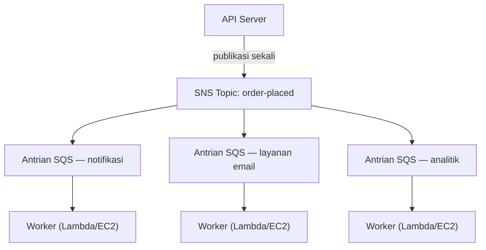

# Bab 19: Mesin Tiket

Mesin tiket adalah revolusi yang tenang. Ambil nomor, tunggu dipanggil. Antrean menjadi antrian. Orang bisa duduk. Loket layanan bekerja dengan kecepatannya sendiri. Tidak ada yang menghalangi siapa pun.

Sebelum ada mesin tiket, Anda harus berdiri dalam barisan. Posisi Anda dalam barisan membutuhkan kehadiran fisik Anda. Anda tidak bisa melakukan apa pun yang lain sambil menunggu. Dan jika orang di depan barisan lambat, semua orang di belakangnya berhenti.

Mesin tiket memisahkan kedatangan dari layanan. Anda datang, mengambil nomor, dan sistem mengingat tempat Anda. Anda bisa pergi duduk. Loket layanan menyelesaikan nomor-nomor dengan kecepatan apa pun yang bisa ia tangani. Jika loket sementara ditutup, kedatangan baru tetap mendapatkan nomor. Mereka menunggu. Pekerjaan tidak hilang—ia mengantre.

Penemuan kecil ini adalah salah satu contoh dekupling tertua dalam sistem manusia. Pada akhir bab ini, Nimbus akan telah membangun mesin tiketnya sendiri—dalam perangkat lunak—dan alasan mengapa ia membutuhkannya dimulai dengan enam belas menit waktu henti pada suatu Jumat malam.

---

Tim telah selamat dari kegagalan AZ. Leo telah memperbaiki proses chaos engineering, dan runbook-nya kokoh. Lalu lintas telah pulih dan tumbuh lagi—bahkan lebih cepat dari sebelumnya. Dokumentasi Aurora yang Leo baca larut malam masih beberapa bab di depan posisi Nimbus yang sebenarnya.

Tetapi dengan lalu lintas yang tumbuh dan lebih banyak restoran bergabung, jenis penyumbatan yang berbeda mulai terlihat. Bukan di infrastruktur. Di kode aplikasi itu sendiri. Rantai permintaan yang bekerja dengan baik pada 200 pesanan per jam mulai menunjukkan ketegangan pada 800.

Lalu datanglah malam tanggal 14.

---

Semuanya dimulai dengan dasbor analitik. Pada pukul 18:47 pada suatu Jumat, sebuah deploy ke layanan analitik memperkenalkan bug timeout. Layanan mulai merespons dalam 8 detik alih-alih 200 milidetik yang biasa.

Alur pesanan bersifat sinkron. Setiap pesanan menunggu layanan analitik sebelum mengonfirmasi ke pelanggan. Delapan detik menjadi 12 seiring beban meningkat. Connection pool API mulai terisi dengan permintaan yang menunggu langkah analitik selesai.

Pada pukul 18:53, connection pool mencapai batasnya. Permintaan baru mulai langsung gagal—bukan karena pesanan tidak bisa diproses, tetapi karena tidak ada koneksi tersedia untuk mulai memprosesnya.

"Layanan analitik menjatuhkan alur pesanan," kata Leo, menatap log keesokan paginya. "Keduanya tidak ada hubungannya satu sama lain. Layanan analitik hanya menghitung dasbor."

"Tetapi mereka berada di rantai permintaan yang sama," kata Priya.

"Enam belas menit waktu henti," kata Maya. "Dan tiga pelanggan ditagih dua kali."

Tagihan ganda lebih buruk daripada waktu henti. Dalam kekacauan saturasi connection pool, mekanisme percobaan ulang menyala untuk beberapa permintaan yang sebenarnya berhasil—langkah pembayaran selesai, lalu permintaan timeout sebelum kembali, dan percobaan ulang mencoba pembayaran lagi. Kartu yang sama, jumlah yang sama, dua tagihan.

"Mekanisme percobaan ulang seharusnya membantu," kata Leo.

"Ia membantu ke arah yang salah," kata Priya. "Dan sudahkah kita memikirkan apa yang terjadi ketika kita mencoba mengembalikan dana kepada pelanggan itu? Proses pengembalian dana menggunakan alur pesanan yang sama yang gagal."

Enam belas menit waktu henti dan tiga tagihan ganda. Itulah biaya bisnis dari rantai permintaan sinkron.

---

Nimbus memiliki masalah yang tidak terasa seperti masalah sampai pesanan menjadi populer.

Setiap kali sebuah pesanan ditempatkan, server API harus:

1. Menyimpan pesanan ke database
2. Mengirim notifikasi ke tablet restoran
3. Mengirim email konfirmasi ke pelanggan
4. Memperbarui dasbor analitik restoran
5. Mencatat kejadian untuk penagihan

Di sebuah loket deli yang sibuk, orang di kasir tidak menunggu pemotong selesai mengiris sebelum beralih ke pelanggan berikutnya. Mereka mengambil pesanan, menyerahkannya ke dapur, dan mulai melayani orang berikutnya. Dapur menyelesaikan pesanan dengan kecepatannya sendiri. Pelanggan mendapatkan layanan yang lebih cepat. Dapur tidak kewalahan oleh lonjakan mendadak. Jika dapur mengalami momen lambat, pesanan menumpuk di belakang loket alih-alih menyebabkan kesalahan di kasir.

Itulah analoginya. Nimbus tidak memiliki loket dan dapur. Ia memiliki satu orang yang melakukan segalanya secara berurutan sebelum pelanggan bisa pergi.

Dan pada tanggal 14, orang yang memotong daging mengalami masalah. Maka loket berhenti. Maka setiap pelanggan setelah itu menunggu. Dapur, kasir, para pelanggan—semua berhenti karena satu langkah dalam rantai melambat.

Solusinya bukanlah membuat pemotongan daging lebih cepat. Solusinya adalah memisahkan langkah-langkah. Ambil pesanan di kasir, serahkan sebuah tiket, biarkan dapur bekerja.

"Kita terkopel ketat," kata Priya. "Jika langkah hilir mana pun gagal, seluruh pesanan gagal. Sudahkah kita memikirkan apa yang terjadi jika layanan analitik disusupi dan mulai mengonsumsi pesan yang cacat? Seluruh pesanan gagal—karena kita menunggunya."

"Bagaimana jika kita bisa menyimpan pesanan dan langsung mengonfirmasi ke pelanggan," kata Leo, "lalu memproses sisanya di latar belakang?"

"Itu sebuah antrian," kata Priya.

Wawasan kuncinya: pelanggan tidak perlu tahu bahwa dasbor analitik telah diperbarui sebelum mereka mendapatkan konfirmasi mereka. Mereka perlu tahu bahwa pesanan mereka diterima. Itu adalah hal-hal yang berbeda. Rantai sinkron mencampuradukkannya.

**Model Dekupling**

Inilah **dekupling**: memisahkan komponen yang menerima pekerjaan dari komponen yang memprosesnya.

Semua langkah dalam alur pesanan Nimbus harus terjadi secara sinkron sebelum API bisa merespons pelanggan. Jika layanan email lambat (kadang memang demikian), pelanggan menunggu. Jika dasbor analitik mati (kadang memang demikian), pesanan gagal.

Kaskade pada tanggal 14 menunjukkan dengan tepat mengapa ini penting. Layanan analitik tidak ada hubungannya dengan apakah pesanan seorang pelanggan diterima. Tetapi karena ia berada di rantai sinkron yang sama, kegagalannya menjadi kegagalan semua orang.

Dalam sistem perangkat lunak, antrian seringkali adalah message broker—sebuah layanan yang menerima pesan dari produser dan mengirimkannya ke konsumen.

Anda mungkin bertanya-tanya: jika alur pesanan sekarang asinkron, bagaimana pelanggan tahu pesanan mereka benar-benar diterima? Jawabannya ada dalam desain arsitektur: API menyimpan pesanan ke database (sinkron—inilah konfirmasi yang otoritatif), lalu memublikasikan kejadian ke antrian. Konfirmasi pelanggan didasarkan pada keberhasilan penulisan database, bukan pada selesainya layanan hilir. Jika layanan email lambat, pelanggan sudah memiliki konfirmasi mereka. Email hanyalah tindak lanjut yang bagus untuk dimiliki.

**Amazon SQS: Antrian**

**Amazon SQS (Simple Queue Service)** adalah layanan antrian pesan terkelola dari AWS. Ia menyimpan pesan secara tahan lama sampai diproses oleh konsumen.

Alur dasarnya:

1. **Produser** (server API) menempatkan sebuah pesan di antrian: `{ "orderId": "ORD-5532", "restaurantId": "47", "items": [...] }`
2. API langsung merespons pelanggan: "Pesanan dikonfirmasi!"
3. **Konsumen** (layanan pekerja terpisah) membaca pesan dari antrian dan memprosesnya: mengirim notifikasi restoran, mengirim email konfirmasi, memperbarui analitik

Pengalaman pelanggan: konfirmasi instan. Pemrosesan hilir: terjadi secara asinkron, dengan kecepatan pekerja.

**Konsep Kunci SQS**

**Visibility timeout pesan**: Ketika konsumen membaca pesan dari SQS, pesan menjadi *tidak terlihat* bagi konsumen lain selama suatu periode (default: 30 detik). Ini memberi konsumen waktu untuk memprosesnya. Jika konsumen selesai dengan sukses, ia menghapus pesan. Jika konsumen mogok, visibility timeout kedaluwarsa dan pesan menjadi terlihat lagi untuk dicoba ulang oleh konsumen lain.

Ini memastikan pengiriman setidaknya-sekali (at-least-once): setiap pesan akan diproses setidaknya sekali, bahkan jika konsumen gagal di tengah pemrosesan.

Anda mungkin bertanya-tanya: jika pesan menjadi tidak terlihat saat diproses tetapi tidak dihapus ketika konsumen mogok, bukankah ia bisa diproses dua kali? Ya—dan ini disebut pengiriman setidaknya-sekali. Itu berarti setiap konsumen harus dirancang untuk menangani penerimaan pesan yang sama lebih dari sekali tanpa menimbulkan masalah. Email konfirmasi pesanan ganda itu menjengkelkan. Tagihan ganda itu adalah tiket dukungan. Rancang konsumen Anda dengan tepat.

Visibility timeout harus lebih panjang dari waktu pemrosesan terlama yang Anda harapkan. Jika pemrosesan biasanya memakan 20 detik tetapi sesekali memakan 90 detik, dan visibility timeout Anda 30 detik, pemrosesan 90-detik yang sesekali itu akan terlihat seperti kegagalan bagi SQS. Pesan menjadi terlihat lagi. Konsumen kedua mengambilnya. Sekarang dua pekerja memproses pesan yang sama. Jika pemrosesan Anda tidak idempoten, Anda punya masalah.

Kesalahan umum: menetapkan visibility timeout sama dengan waktu pemrosesan rata-rata. Pendekatan yang benar: tetapkan ke waktu pemrosesan persentil ke-99, dengan margin keamanan. Jika waktu pemrosesan P99 adalah 45 detik, tetapkan visibility timeout ke 90 detik.

**Dead-letter queue (DLQ)**: Jika sebuah pesan gagal diproses terlalu banyak kali (dapat dikonfigurasi—mis. 5 percobaan ulang), SQS memindahkannya ke dead-letter queue. Anda memeriksa DLQ untuk memahami mengapa pesan gagal tanpa kehilangannya.

DLQ adalah tempat Anda belajar apa yang sebenarnya gagal di produksi. Tanpanya, pesan yang gagal hanya menghilang dan Anda tidak punya cara untuk menyelidikinya.

Tiga minggu setelah migrasi SQS, Leo menyadari 23 pesan telah menumpuk di DLQ layanan notifikasi. Ia belum memeriksa DLQ (ia telah menyiapkannya dengan benar lalu mengasumsikan ia akan tetap kosong).

Ia menarik satu pesan dan melihat payload-nya:

```json
{
  "orderId": "ORD-9821",
  "restaurantId": "12",
  "customerMessage": "Extra spicy please 🌶️🔥",
  "timestamp": "2024-01-18T19:43:11Z"
}
```

Emoji itu. Layanan notifikasi restoran menyandikan payload pesan sebagai Latin-1 sebelum mengirim ke API tablet legacy restoran. Karakter emoji—empat byte masing-masing dalam UTF-8—menjadi rusak, menyebabkan API tablet menolak permintaan. Pesan akan mencoba ulang, gagal lagi, mencoba ulang lagi, gagal lagi. Setelah 5 percobaan ulang, SQS memindahkannya ke DLQ.

"Ke-23 pesan memiliki emoji di kolom catatan pelanggan," kata Leo.

"Jadi setiap pelanggan yang menambahkan emoji ke catatan pesanan mereka, catatannya secara diam-diam gagal mencapai restoran," kata Maya.

"Ya."

"Selama berapa lama?"

Leo memeriksa timestamp pesan tertua. "Tiga minggu."

Priya terdiam. "Dan bagaimana jika seseorang mengetahui bahwa menambahkan emoji ke catatan pesanan menyebabkan kegagalan diam-diam? Anda bisa menempatkan pesanan dengan emoji dan menjamin restoran tidak pernah melihat instruksinya. Lalu mengeluh tentang pesanan yang salah."

Tak seorang pun mengeksploitasi ini. Tetapi itu adalah pertanyaan yang tepat untuk diajukan.

Leo memperbaiki bug penyandian. Ia kemudian menulis skrip untuk memutar ulang ke-23 pesan yang terdampar dari DLQ. Restoran-restoran menerima instruksi emoji pedas (berusia tiga minggu) mereka. Para pelanggan tidak pernah tahu.

Pelajarannya: DLQ harus dipantau secara aktif, bukan disiapkan lalu dilupakan. DLQ yang bertambah adalah sinyal diam-diam bahwa sesuatu gagal berulang kali.

**Jenis antrian**:

**Antrian standar**: Throughput maksimum (pesan per detik tak terbatas). Urutan pengiriman bersifat best-effort (tidak dijamin). Pengiriman setidaknya-sekali (sangat jarang, sebuah pesan mungkin dikirim dua kali).

**Antrian FIFO**: Urutan masuk-pertama, keluar-pertama yang ketat. **Pemrosesan** tepat-sekali (exactly-once)—deduplikasi berdasarkan `MessageDeduplicationId` dalam jendela 5 menit. Urutan dijamin *per* `MessageGroupId`: pesan dalam grup yang sama tiba secara berurutan; grup yang berbeda dapat diproses secara paralel, dan begitulah FIFO menskala. Throughput dasar adalah 3.000 pesan per detik dengan batching (300 tanpa); mengaktifkan **mode throughput tinggi** menaikkan ini menjadi puluhan ribu per detik dengan mempartisi lintas grup pesan. Gunakan FIFO ketika urutan penting (transaksi keuangan, perubahan status berurutan).

Jika Anda membutuhkan throughput maksimum dan dapat mentolerir pesan duplikat sesekali, gunakan SQS Standard—tetapi Anda harus merancang setiap konsumen untuk menangani duplikat tanpa menimbulkan masalah. Jika Anda membutuhkan urutan yang ketat dan pemrosesan tepat-sekali, gunakan SQS FIFO—dan rancang `MessageGroupId` Anda dengan baik, karena paralelisme (dan karenanya throughput) berasal dari memiliki banyak grup.

Untuk Nimbus, sebagian besar antrian menggunakan antrian standar. Antrian penagihan menggunakan FIFO untuk memastikan tagihan diproses dalam urutan.

**Queue Depth Auto Scaling: Menskalakan Pekerja agar Sesuai dengan Backlog**

Salah satu aplikasi SQS yang paling kuat adalah menggunakan kedalaman antrian sebagai pemicu Auto Scaling. Alih-alih menskala berdasarkan CPU atau memori, Anda menskala berdasarkan berapa banyak pekerjaan yang menunggu.

Untuk layanan notifikasi Nimbus: kedalaman antrian SQS (jumlah pesan yang menunggu untuk diproses) dihubungkan ke kebijakan Application Auto Scaling untuk layanan ECS yang menjalankan pekerja notifikasi.

Kebijakan: ketika antrian memiliki lebih dari 50 pesan per task pekerja, tambahkan sebuah task. Ketika antrian memiliki kurang dari 10 pesan per task pekerja, kurangi sebuah task.

Efek praktisnya: ketika 1.200 pesanan masuk di puncak Jumat malam, kedalaman antrian notifikasi melonjak dan armada pekerja menskala dari 2 task menjadi 8 task dalam 3 menit. Pada tengah malam, antrian kosong dan armada kembali ke 2.

"Berapa biayanya per bulan?" tanya Tom, menatap grafik Auto Scaling.

"Tidak ada tambahan untuk Auto Scaling itu sendiri," kata Leo. "Tetapi 6 task ECS tambahan selama 3 jam pada Jumat malam—itu berarti."

Tom menghitung. "Sekitar $14/bulan untuk puncak-puncak itu. Dan sebelumnya, kita menjalankan 8 task terus-menerus dengan biaya penuh?"

"Ya."

"Jadi kita membayar untuk lonjakan ketika kita membutuhkannya dan tidak membayar apa pun di luar itu."

Inilah pola penskalaan berbasis kedalaman antrian: antrian menjadi penyangga yang menyerap lonjakan lalu lintas, dan armada pekerja menskala untuk menguras penyangga. Pengguna tidak mengalami kelambatan—mereka mendapatkan konfirmasi langsung ketika pesanan diterima. Pekerja hanya butuh sedikit lebih lama untuk menyusul. Dan karena Anda tidak menjalankan kapasitas puncak 24/7, biaya jauh lebih rendah.

**Amazon SNS: Pemancar Siaran**

**Amazon SNS (Simple Notification Service)** adalah layanan pesan publish/subscribe (pub/sub). Alih-alih satu produser, satu konsumen (antrian), SNS mendukung satu pesan yang dikirim ke *banyak* pelanggan secara bersamaan.

Modelnya:

1. Seorang **penerbit (publisher)** mengirim pesan ke sebuah **topic** SNS
2. Semua **pelanggan (subscriber)** dari topic itu menerima pesan secara bersamaan (fan-out)

Pelanggan bisa berupa:

- Antrian SQS (mendorong pesan ke antrian untuk pemrosesan asinkron)
- Fungsi Lambda (memicu fungsi secara langsung)
- Endpoint HTTP/HTTPS (pengiriman webhook)
- Alamat email
- SMS (nomor telepon)

Untuk Nimbus, kejadian pesanan-ditempatkan dipublikasikan ke topic SNS bernama `order-events`:

- Layanan notifikasi restoran berlangganan (menerima di antrian SQS-nya)
- Layanan email berlangganan (menerima di antrian SQS-nya)
- Layanan analitik berlangganan (menerima di antrian SQS-nya)
- Layanan penagihan berlangganan (menerima di antrian SQS FIFO-nya)

Satu kejadian pesanan. Empat pelanggan. Semua diberi tahu secara bersamaan. Masing-masing memproses dengan kecepatannya sendiri.

"Jadi SNS adalah pengumumannya," kata Maya, "dan SQS adalah kotak masuk tempat setiap tim memproses pengumuman dengan kecepatannya sendiri. Lalu mengapa menggunakan keduanya? Mengapa tidak membuat semua orang berlangganan langsung ke topic SNS?"

"Karena pengiriman SNS langsung bersifat fire-and-forget," kata Leo. "Jika layanan analitik mati ketika SNS menyala, pesan itu hilang. Dengan antrian SQS di antaranya, pesan menunggu sampai layanan pulih."

"Tepat," kata Priya. "Fan-out SNS/SQS adalah pola standar."

**Pola Fan-Out SNS/SQS**

Kombinasi ini—topic SNS yang memberi makan beberapa antrian SQS—adalah salah satu pola arsitektur terpenting di AWS:



Setiap antrian bersifat independen. Layanan analitik bisa lambat—antriannya terisi, tetapi layanan notifikasi dan email terus tanpa terpengaruh. Jika layanan analitik mati, pesannya menunggu di antrian sampai ia kembali aktif. Tidak ada yang hilang.

Inilah properti kuncinya: **kegagalan independen**. Masalah dalam satu konsumen tidak menyebar ke yang lain.

**Penyaringan Pesan: Tidak Setiap Pesan untuk Setiap Pelanggan**

Saat sistem berkembang, Anda tidak ingin setiap pelanggan memproses setiap pesan. Layanan analitik seharusnya tidak menerima pesan tentang pemrosesan pembayaran yang gagal jika ia hanya peduli pada pesanan yang selesai.

**Penyaringan pesan SNS** memungkinkan pelanggan menentukan kebijakan filter—hanya kirim pesan yang cocok dengan atribut tertentu.

Layanan notifikasi restoran berlangganan dengan filter: hanya pesan di mana `status = "confirmed"`.

Layanan peringatan kesalahan berlangganan dengan filter: hanya pesan di mana `status = "failed"`.

Setiap pelanggan hanya mendapatkan apa yang ia butuhkan.

Tanpa penyaringan, setiap pelanggan menerima setiap pesan dan harus mengabaikan apa yang tidak relevan. Ini membuang pemrosesan, membuang uang (SQS menagih per pesan), dan memperkenalkan kebisingan. Sistem pesanan bervolume tinggi tanpa penyaringan akan membanjiri antrian peringatan kesalahan dengan pesanan yang berhasil—membuat kegagalan yang sebenarnya sulit ditemukan.

Kebijakan filter terlihat seperti:

```json
{
  "status": ["confirmed"],
  "region": ["us-west-2", "us-east-1"]
}
```

Pelanggan ini hanya menerima pesan di mana status adalah "confirmed" DAN region adalah salah satu dari "us-west-2" atau "us-east-1". Pesan yang tidak cocok dengan kebijakan sama sekali tidak dikirim ke antrian pelanggan ini—mereka bahkan tidak pernah mencapai SQS.

"Jadi penyaringan terjadi di lapisan SNS," kata Priya, "sebelum pesan ditulis ke SQS?"

"Benar. Antrian SQS untuk layanan notifikasi restoran hanya pernah melihat pesan yang perlu ia tanggapi."

"Dan bagaimana jika seseorang mencoba menerobos masuk dengan memublikasikan pesan yang dibuat khusus ke topic SNS yang cocok dengan semua filter pelanggan?" tanya Priya.

Topic SNS memiliki kebijakan resource IAM: hanya layanan API pesanan (berdasarkan peran IAM-nya) yang diizinkan memublikasikan. Kebijakan akses SNS dan kebijakan antrian SQS membentuk lapisan kontrol akses—penyaringan hanya untuk perutean, bukan keamanan.

**Kapan Menggunakan SQS vs SNS**

**SQS saja**: Satu produser, satu konsumen (atau beberapa konsumen yang bersaing pada antrian yang sama). Pesan perlu diproses sekali, dalam urutan (FIFO) atau tidak (standar). Pola antrian pekerja—satu antrian, beberapa pekerja yang mengonsumsi darinya.

**SNS saja**: Notifikasi fire-and-forget. Dorong ke email, SMS, atau endpoint HTTP. Tidak perlu mengantrekan pesan—cukup beri tahu dan lanjutkan.

**SNS + SQS (fan-out)**: Satu kejadian, beberapa konsumen independen. Setiap konsumen memiliki antriannya sendiri, memproses secara independen, dan dapat gagal secara independen.

## Topic FIFO SNS

Semua hal di atas tentang SNS menggunakan topic standar—mereka memiliki throughput yang secara efektif tak terbatas, mengirim ke pelanggan hampir bersamaan, dan menyelesaikan tugas untuk sebagian besar kasus penggunaan.

Tetapi topic SNS standar tidak menjamin urutan. Jika Anda memublikasikan sepuluh pesan secara berurutan, pelanggan mungkin menerimanya dalam urutan yang sedikit berbeda. Untuk notifikasi pesanan Nimbus, itu tidak masalah—pembaruan analitik yang tiba sepersekian detik sebelum konfirmasi email tidaklah penting.

Untuk beberapa skenario, itu memang penting. Bayangkan sebuah buku besar keuangan: jika dua kejadian—sebuah kredit lalu sebuah debit—dikirim dalam urutan terbalik, perhitungan saldo selama pemrosesan akan salah meskipun kedua kejadian pada akhirnya diproses dengan benar.

**Topic FIFO SNS** menerapkan prinsip yang sama dengan antrian FIFO SQS pada model fan-out. Pesan dikirim ke pelanggan dalam urutan persis seperti yang dipublikasikan, dan setiap pesan dikirim tepat sekali.

Trade-off-nya: topic FIFO SNS memiliki throughput dasar yang serupa dengan FIFO SQS (3.000 pesan per detik per topic; 300 per detik per grup pesan—dengan mode throughput tinggi yang tersedia sejak 2025 untuk jauh lebih banyak), dan mereka hanya melakukan fan-out ke **antrian SQS**—FIFO atau, sejak 2023, Standard. Berlangganan antrian Standard berguna untuk konsumen yang tidak peduli urutan (misalnya feed analitik), tetapi urutan dan tepat-sekali bertahan ujung-ke-ujung **hanya** ke antrian FIFO. Anda tidak bisa menggunakan topic FIFO SNS untuk mengirim ke endpoint HTTP atau alamat email.

Untuk pipeline penagihan Nimbus—di mana urutan pembaruan harga harus diterapkan ke akun restoran secara berurutan—topic SNS penagihan dimigrasikan dari standar ke FIFO. Antrian penagihan SQS sudah FIFO. Fan-out sekarang menjamin bahwa kejadian kenaikan-harga tidak akan pernah tiba di pemroses penagihan sebelum kejadian awal-periode yang menjadi dasarnya.

> **Tips Ujian — SNS FIFO**
>
> Jika sebuah skenario membutuhkan **pengiriman fan-out yang terurut** lintas beberapa pelanggan, jawabannya adalah **SNS FIFO**. SNS standar tidak menjamin urutan. SNS FIFO hanya melakukan fan-out ke antrian SQS—untuk menjaga urutan dan tepat-sekali ujung-ke-ujung, pelanggan harus berupa antrian SQS **FIFO** (langganan antrian Standard diperbolehkan tetapi mendapat urutan best-effort dan pengiriman setidaknya-sekali). Throughput default adalah 3.000/detik per topic—jika skenario menggambarkan volume yang jauh lebih tinggi *dan* urutan yang ketat, itu adalah sinyal untuk melihat arsitektur alternatif (Kinesis, misalnya, yang dibahas di bab berikutnya).

## Ketika Antrian Legacy Tak Mau Melepaskan

Nimbus akan menutup akuisisi terbesarnya hingga saat itu: Barato, pesaing pengantaran makanan dengan 200 restoran dan keunggulan dua tahun dalam operasi. Tim rekayasa menjadwalkan panggilan perencanaan integrasi.

Panggilan itu berlangsung dua puluh menit sebelum Leo terdiam.

"Sistem pemrosesan pesanan mereka," katanya. "Berjalan di atas apa?"

"ActiveMQ," kata insinyur Barato di ujung lain. "Broker on-prem. Aplikasinya Java. Sudah berjalan sejak 2018. Semuanya berbicara AMQP."

"AMQP," kata Leo.

"Ya."

Ia menatap diagram arsitektur di layarnya. Nimbus menjalankan SQS dan SNS. SQS tidak berbicara AMQP. SNS tidak berbicara AMQP. Aplikasi Barato tidak berbicara apa pun selain itu.

"Menulis ulangnya akan memakan enam bulan," kata Leo kepada tim setelah panggilan. "Minimal."

"Kita tidak bisa menunda akuisisi selama enam bulan," kata Maya.

"Dan kita tidak bisa menjalankan broker ActiveMQ bare-metal di AWS," tambah Priya. "Sudahkah kita memikirkan seperti apa itu dari sudut pandang keamanan dan keandalan? Broker pesan yang dikelola sendiri, duduk di produksi, tanpa patching terkelola, tanpa failover otomatis, terhubung ke infrastruktur kita?"

"Ada opsi terkelola," kata Leo perlahan. Ia telah membaca selagi mereka berbicara. "Amazon MQ."

**Amazon MQ: Broker Terkelola**

**Amazon MQ** adalah layanan message broker terkelola untuk Apache ActiveMQ dan RabbitMQ. Ia menjalankan broker Anda yang sudah ada—broker yang sama yang telah terhubung dengan aplikasi Anda selama bertahun-tahun—tetapi sebagai layanan AWS yang terkelola. AWS menangani infrastruktur dasarnya: penyediaan, patching, failover, backup.

Properti kunci yang membuat Amazon MQ berbeda dari SQS dan SNS: ia berbicara protokol yang dibicarakan oleh message broker legacy. AMQP, STOMP, MQTT, OpenWire, NMS. Protokol-protokol yang sama sekali tidak dipahami SQS dan SNS.

Untuk integrasi Barato, rencananya lugas. AWS akan menjalankan sebuah broker Amazon MQ yang dikonfigurasi sebagai ActiveMQ. Aplikasi Java Barato akan diarahkan ke endpoint broker baru alih-alih yang on-premises. Perubahan di sisi aplikasi: memperbarui satu file konfigurasi dengan connection string baru. Hanya itu. Aplikasi tidak perlu tahu bahwa ia berbicara dengan broker cloud terkelola alih-alih sebuah server di kantor Barato.

"Tunggu," kata Maya. "Jika kita pada akhirnya akan mengintegrasikan mereka ke Nimbus, bukankah seharusnya kita langsung memigrasikan mereka ke SQS dari awal?"

"Karena jalur migrasi itu ada," kata Leo. "Dan layak dilakukan dengan benar—pada akhirnya. Tetapi saat ini, kita membutuhkan Barato beroperasi di infrastruktur AWS dalam tiga puluh hari, bukan enam bulan. Amazon MQ membuat aplikasi berjalan tanpa mengubah aplikasi. Lalu kita punya waktu untuk merencanakan migrasi SQS sebagai proyek yang disengaja, bukan prasyarat yang terburu-buru untuk akuisisi."

"Berapa biayanya per bulan?" tanya Tom.

Broker Amazon MQ—satu pasangan active/standby untuk keandalan—berada di kisaran $200/bulan untuk broker yang cocok untuk volume Barato. Dibandingkan dengan biaya enam bulan waktu menulis ulang, itu bukan perdebatan.

Priya menyetujui rencana dengan satu syarat: instans Amazon MQ akan berada di subnet privat, dengan aturan security group yang hanya mengizinkan koneksi dari server aplikasi Barato. Tanpa paparan publik. Audit logging diaktifkan.

Migrasi memakan dua belas hari. Aplikasi Barato terhubung ke Amazon MQ pada hari ketiga belas. Pada hari keempat belas, ia memproses pesanan pertamanya di infrastruktur AWS tanpa satu pun perubahan kode.

---

> **Tips Ujian — Amazon MQ**
>
> *SAA-C03 Domain: Design Resilient Architectures (Domain 2)*
>
> Ujian membedakan Amazon MQ dari SQS dan SNS pada satu sumbu: **kompatibilitas protokol**. Jika skenario menggambarkan aplikasi yang sudah menggunakan message broker dan berbicara protokol tertentu, Amazon MQ hampir pasti jawabannya.
>
> Sinyal kuncinya: **"ActiveMQ," "RabbitMQ," "AMQP," "STOMP," "MQTT," "OpenWire,"** atau frasa apa pun yang setara dengan **"tanpa mengubah kode aplikasi."** Jika Anda melihat frasa itu, jawabannya adalah Amazon MQ—bukan SQS, bukan SNS.
>
> Jika skenario menggambarkan aplikasi *baru* yang membutuhkan dekupling, atau tidak menyebut broker legacy atau protokol tertentu, gunakan SQS/SNS.
>
> Satu sinyal lagi: "migrasikan message broker on-premises yang ada ke AWS." Jika aplikasi perlu terus berbicara protokol yang sama ke jenis broker yang sama, Amazon MQ adalah jawaban lift-and-shift.

## Kekuatan dan Keterbatasan

**Mengapa SQS dan SNS itu kuat**:

- SQS menyediakan pengiriman pesan yang tahan lama dan andal—pesan disimpan di beberapa AZ
- Dekupling memungkinkan penskalaan dan penerapan independen dari layanan produser dan konsumen
- Dead-letter queue memastikan tidak ada pesan yang hilang secara diam-diam saat gagal
- Pola fan-out SNS memungkinkan penambahan konsumen baru tanpa mengubah produser

**Di mana hal ini menjadi rumit**:

- Pengiriman setidaknya-sekali berarti konsumen harus *idempoten*—memproses pesan yang sama dua kali tidak boleh menimbulkan masalah (pesanan duplikat, tagihan duplikat)
- Antrian FIFO lebih mahal dan memiliki batas throughput
- Men-debug pesan yang gagal lintas beberapa antrian dan layanan membutuhkan logging dan observabilitas yang baik
- Jaminan urutan pesan terbatas—jika urutan ketat penting lintas beberapa layanan, desainnya menjadi kompleks

**Idempotensi: Pendalaman Praktis**

Idempotensi terdengar abstrak sampai Anda mengalami tiga pelanggan ditagih ganda.

Sebuah operasi bersifat **idempoten** jika menjalankannya berkali-kali menghasilkan hasil yang sama dengan menjalankannya sekali. Operasi penagihan tidak secara alami idempoten: menjalankannya dua kali menagih dua kali. Operasi penagihan yang idempoten memeriksa apakah tagihan sudah diproses sebelum mencobanya.

Polanya: setiap pesan membawa ID unik (ID pesanan, atau ID pesan terpisah). Sebelum memproses, konsumen memeriksa sebuah penyimpanan (DynamoDB cocok untuk ini) untuk melihat apakah ID pesan ini sudah berhasil diproses. Jika ya: tidak melakukan apa pun, hapus pesan. Jika tidak: proses, catat ID-nya, hapus pesan.

```python
def process_charge(message):
    order_id = message['orderId']
    
    # Pemeriksaan idempotensi
    if already_processed(order_id):
        logger.info(f"Order {order_id} already charged, skipping duplicate")
        return  # Pesan akan dihapus dari antrian
    
    # Proses tagihan
    charge_result = payment_service.charge(
        amount=message['amount'],
        card_token=message['cardToken'],
        idempotency_key=order_id  # Teruskan juga ke pemroses pembayaran
    )
    
    # Catat bahwa kita telah memproses ini
    mark_as_processed(order_id, charge_result)
```

Kunci idempotensi juga harus diteruskan ke layanan hilir (pemroses pembayaran, sistem email) yang mendukungnya. Stripe, misalnya, menerima header `Idempotency-Key` yang mencegah tagihan duplikat bahkan jika panggilan API yang sama dibuat dua kali.

"Dan bagaimana dengan correlation ID?" tanya Priya. "Ketika sebuah pesan bergerak melalui beberapa layanan, bagaimana kita melacak permintaan mana yang menyebabkan tindakan hilir mana?"

**Correlation ID: Melacak Lintas Layanan**

Ketika seorang pelanggan menempatkan pesanan, permintaan mengalir melalui: API → SNS → SQS → pekerja notifikasi → API tablet restoran → SQS → pekerja email → SES.

Tanpa correlation ID, jika API tablet restoran mengembalikan kesalahan di langkah 6, log di setiap layanan menunjukkan kejadiannya, tetapi tidak ada cara untuk melacaknya kembali ke pesanan pelanggan tertentu dari awal.

Sebuah **correlation ID** adalah pengidentifikasi unik yang dilampirkan ke permintaan asli dan diteruskan melalui setiap interaksi layanan. Setiap layanan menyertakan correlation ID dalam log-nya.

Ketika Priya mencari correlation ID tertentu di CloudWatch, ia mendapatkan setiap baris log—lintas setiap layanan—yang merupakan bagian dari pemrosesan satu pesanan itu.

"Satu peringatan," kata Priya. "Correlation ID datang dari luar. Bisakah seseorang menyuntikkan ID berbahaya dan mengacaukan logging kita?"

Correlation ID bersifat internal—mereka tidak memengaruhi logika pemrosesan, hanya logging. Membersihkannya (alfanumerik, panjang tetap) mencegah serangan injeksi di keluaran log.

**Kapan Dekupling Adalah Pilihan yang Salah**

"Tunggu—tapi *mengapa* kita tidak men-dekupling segalanya?" tanya Maya.

Itu pertanyaan yang adil. Jika dekupling mencegah kegagalan kaskade dan membuat sistem tangguh, mengapa tidak menerapkannya di mana-mana?

Karena dekupling memiliki biaya. Dan ada skenario di mana biaya itu melebihi manfaatnya.

**Ketika Anda membutuhkan konsistensi langsung**: Jika sebuah pembayaran harus dikonfirmasi sebelum pesanan bisa berlanjut—dan pengguna sedang menunggu di layar untuk hasilnya—Anda tidak bisa menempatkan pembayaran di antrian asinkron dan mengembalikan konfirmasi sebelum Anda tahu apakah tagihan berhasil. Pengguna mungkin memesan dua kali sebelum tagihan pertama selesai. Dekupling asinkron tidak berfungsi untuk operasi di mana respons bergantung pada hasilnya.

**Ketika alur kerja secara inheren berurutan**: Jika langkah 3 harus melihat hasil langkah 2 untuk membuat keputusan, mereka tidak bisa berjalan paralel dari antrian. Memaksa mereka ke dalam antrian menciptakan mekanisme penyerahan hasil yang canggung yang seringkali berakhir lebih kompleks daripada versi sinkronnya.

**Ketika urutan pesan kritis dan volume rendah**: SQS Standard tidak menjamin urutan. SQS FIFO menjamin, tetapi terbatas pada 3.000 pesan/detik dengan batching secara default (mode throughput tinggi menaikkannya secara substansial). Jika Anda memiliki alur kerja bervolume rendah dengan urutan ketat, antrian sinkron sederhana (seperti row lock database) mungkin lebih sederhana dan lebih andal.

**Ketika overhead melebihi manfaat**: Sebuah alat internal kecil dengan satu pengguna dan tanpa SLA mungkin tidak membutuhkan topic SNS fan-out dan DLQ. Overhead operasional pemantauan antrian dan DLQ itu nyata. Sesuaikan arsitektur dengan masalahnya.

Pertanyaannya bukan "haruskah saya men-dekupling ini?" Tetapi "berapa biaya kopling ini, dan apakah dekupling mengurangi biaya itu lebih banyak daripada yang ia tambahkan?"

## Ringkasan

Dekupling adalah prinsip ketahanan Bab 18 yang diterapkan pada arsitektur internal: dengan cara yang sama Multi-AZ menghilangkan titik kegagalan tunggal di infrastruktur, SQS dan SNS menghilangkan titik kegagalan tunggal di rantai permintaan.

- **Dekupling** memisahkan komponen yang memproduksi pekerjaan dari komponen yang memprosesnya.
- **SQS** memberi produser tempat yang tahan lama untuk menaruh pekerjaan ketika konsumen lambat, offline, atau sedang menskala.
- **SNS** memungkinkan satu kejadian mencapai beberapa konsumen independen tanpa penerbit tahu siapa mereka.
- **Fan-out SNS + SQS** memungkinkan setiap layanan hilir memproses kejadian yang sama dengan kecepatannya sendiri.
- **DLQ, idempotensi, dan correlation ID** adalah disiplin operasional yang membuat sistem asinkron dapat di-debug alih-alih misterius.
- **Jangan men-dekupling secara membabi buta**: alur kerja sinkron, persyaratan konsistensi langsung, dan alat kecil berisiko rendah mungkin tidak membenarkan permukaan operasional tambahan.

## Tips Ujian

*SAA-C03 Domain: Design Resilient Architectures (Domain 2, Task 2.1)*

- **SQS Standard vs FIFO**: Ujian membedakan berdasarkan jaminan urutan dan pengiriman. "Harus diproses dalam urutan" → FIFO. "Throughput maksimum" → Standard.
- **Queue depth Auto Scaling**: "Menskalakan pekerja berdasarkan kedalaman antrian" → metrik SQS (ApproximateNumberOfMessagesVisible) digunakan dengan Application Auto Scaling atau ECS Service Auto Scaling.
- **Visibility timeout**: Konsep kunci untuk pengiriman setidaknya-sekali. Jika konsumen gagal, pesan menjadi terlihat lagi setelah timeout. Skenario ujian: "pesan diproses dua kali" → visibility timeout terlalu pendek (konsumen butuh waktu lebih lama dari timeout untuk memproses).
- **Dead-letter queue**: Pesan yang gagal setelah N percobaan ulang dipindahkan ke sini. Skenario ujian: "memastikan tidak ada pesan yang hilang, bahkan jika pemrosesan gagal berulang kali" → DLQ.
- **Fan-out SNS**: Pola ujian klasik untuk satu kejadian yang memicu beberapa konsumen. "Notifikasi pesanan-ditempatkan harus memicu email, SMS, dan pembaruan inventaris secara bersamaan" → topic SNS dengan langganan SQS.
- **SQS + Lambda**: Lambda dapat dikonfigurasi untuk mem-poll antrian SQS dan memicu pada setiap batch pesan. Ujian menggunakan ini untuk pemrosesan berbasis kejadian pada skala besar.
- **SQS long polling**: Alih-alih konsumen mem-poll setiap beberapa detik (short polling, membuang panggilan API), long polling menunggu hingga 20 detik untuk sebuah pesan. Mengurangi biaya dan respons kosong palsu.
- **SQS extended client library**: Untuk pesan yang lebih besar dari batas payload antrian (256KB secara default; dapat dinaikkan ke 1MB sejak 2025), gunakan SQS Extended Client Library, yang menyimpan body pesan di S3 dan mengirim referensi melalui SQS. Ujian masih memperlakukan 256KB sebagai batas SQS—"pesan SQS terlalu besar" → Extended Client Library + S3.
- **Penyaringan pesan SNS**: Pelanggan hanya menerima pesan yang cocok dengan kebijakan filter mereka. Skenario ujian: "hanya kirim notifikasi yang cocok dengan kriteria tertentu ke seorang pelanggan" → penyaringan pesan SNS.
- **Catatan**: Fan-out SNS/SQS juga muncul di skenario Domain 3 tentang arsitektur pemrosesan asinkron throughput tinggi. Kenali polanya baik untuk pertanyaan ketahanan maupun performa.
- **Sinyal Amazon MQ**: "ActiveMQ," "RabbitMQ," "AMQP," "STOMP," "MQTT," "OpenWire," atau "tanpa mengubah kode aplikasi" → Amazon MQ, BUKAN SQS. Jika skenario mengatakan aplikasi baru yang membutuhkan dekupling → SQS/SNS.
- **SNS FIFO vs Standard**: SNS standar tidak menjamin urutan. Jika skenario membutuhkan **fan-out terurut** → topic SNS FIFO yang memberi makan antrian SQS FIFO. Ingat: SNS FIFO tidak bisa mengirim ke endpoint HTTP atau email—hanya ke antrian SQS (FIFO untuk urutan/tepat-sekali; langganan Standard berfungsi tetapi turun ke urutan best-effort dan pengiriman setidaknya-sekali).

## Latihan

**Latihan 1 — Mengingat**

Jelaskan pola fan-out SNS/SQS. Mengapa pola ini menggunakan antrian SQS alih-alih membuat layanan berlangganan langsung ke topic SNS dengan endpoint HTTP?

*(Petunjuk: Pikirkan apa yang terjadi jika salah satu endpoint HTTP mati ketika SNS memublikasikan sebuah pesan.)*

**Latihan 2 — Skenario SAA-C03**

*Skenario*: Sebuah platform e-commerce memproses 10.000 pesanan per jam. Ketika sebuah pesanan ditempatkan, sistem harus: (1) menyimpan pesanan dalam database, (2) mengurangi inventaris, (3) mengirim email konfirmasi, dan (4) memperbarui dasbor analitik. Saat ini, keempat langkah terjadi secara sinkron—jika layanan analitik lambat, pelanggan menunggu. Tim ingin meningkatkan waktu respons yang dihadapi pelanggan sambil memastikan tidak ada pesanan yang hilang.

Arsitektur mana yang PALING baik mengatasi persyaratan ini?

A) Gunakan antrian SQS FIFO untuk memproses keempat langkah secara berurutan  
B) Buat API menyimpan pesanan dan langsung mengonfirmasi ke pelanggan; publikasikan sebuah kejadian ke topic SNS; buat layanan inventaris, email, dan analitik berlangganan melalui antrian SQS  
C) Gunakan instans EC2 paralel untuk memproses setiap langkah secara bersamaan, secara sinkron  
D) Gunakan API Gateway dengan validasi permintaan untuk mempercepat pemrosesan pesanan

**Petunjuk 1**: Konfirmasi pelanggan harus segera. Langkah mana yang harus terjadi sebelum respons, dan mana yang bisa terjadi setelahnya?

**Petunjuk 2**: Layanan analitik yang lambat seharusnya tidak memengaruhi layanan email atau inventaris.

**Petunjuk 3**: Fan-out SNS memungkinkan ketiga layanan hilir menerima kejadian secara bersamaan.

**Jawaban**: B

**Penjelasan**: API menyimpan pesanan ke database (sinkron—harus dilakukan sebelum mengonfirmasi) dan langsung mengembalikan konfirmasi. Ia kemudian memublikasikan kejadian `order-placed` ke topic SNS. Layanan inventaris, email, dan analitik masing-masing berlangganan melalui antrian SQS independen. Mereka memproses dengan kecepatannya sendiri—jika analitik lambat, antriannya tumbuh tetapi layanan lain tidak terpengaruh. Jika layanan mana pun gagal, pesannya tetap di antrian SQS dan dicoba ulang; setelah jumlah percobaan ulang gagal yang dikonfigurasi, mereka dipindahkan ke DLQ.

**Mengapa bukan A?** Antrian FIFO memproses pesan secara berurutan—ini tidak membantu dengan perlambatan sinkron. Selain itu, pemrosesan berurutan berarti analitik yang lambat tetap memblokir email.

**Mengapa bukan C?** "Instans EC2 paralel yang memproses secara sinkron" masih membutuhkan semua langkah selesai sebelum merespons pelanggan. Menambahkan instans tidak menyelesaikan kopling sinkron.

**Mengapa bukan D?** API Gateway mempercepat perutean dan validasi API, tetapi tidak men-dekupling langkah-langkah pemrosesan hilir.

*SAA-C03 Domain: Design Resilient Architectures — Task 2.1*

**Latihan 3 — Tantangan Arsitektur** *(Opsional)*

Nimbus sedang membangun sistem notifikasi untuk mitra restoran. Ketika seorang pelanggan menempatkan pesanan, restoran perlu diberi tahu melalui:

- Aplikasi tablet mereka (notifikasi push)
- Sistem tampilan dapur (webhook HTTP ke perangkat keras lokal mereka)
- SMS cadangan (jika notifikasi tablet gagal)

Layanan notifikasi tablet andal. Webhook dapur kadang mati (restoran mematikan perangkat keras mereka saat tutup). SMS hanya boleh menyala jika notifikasi tablet gagal.

Rancang arsitektur menggunakan SNS dan SQS. Bagaimana Anda menangani persyaratan "SMS hanya jika tablet gagal"? Bagaimana Anda memastikan webhook dapur tidak memblokir notifikasi tablet saat ia offline?

Pertimbangkan juga: visibility timeout apa yang sesuai untuk pengiriman webhook dapur jika waktu respons webhook rata-rata 2 detik tetapi restoran dengan perangkat keras lambat bisa memakan hingga 30 detik? Kebijakan DLQ apa yang akan memicu fallback SMS setelah percobaan ulang webhook habis?

*(Tidak ada jawaban benar tunggal. Tujuannya adalah berlatih desain fan-out dengan perutean kondisional.)*

## Adegan Pasca Kredit

Alur pesanan baru sudah aktif.

Leo telah menerapkannya pada suatu Selasa sore tanpa menjalankan uji beban penuh terlebih dahulu. "Akan baik-baik saja," katanya kepada Priya. "Arsitekturnya kokoh."

Pelanggan menempatkan pesanan. API merespons dalam 95 milidetik. Konfirmasi muncul di ponsel mereka secara instan.

Di balik layar: empat layanan memproses secara asinkron. Layanan analitik memiliki bug yang menyebabkannya mogok pada pesanan yang berisi karakter khusus tertentu dalam nama item. Antriannya menumpuk hingga 3.200 pesan selama dua jam.

Pelanggan tidak pernah menyadarinya.

Ketika Leo memperbaiki bug dan layanan analitik dimulai ulang, ia memproses backlog dalam 18 menit. Tidak ada data yang hilang. DLQ kosong.

Ia me-refresh dasbor CloudWatch. Kedalaman antrian: 0. Pesan diproses: 3.200. Kesalahan: 0 (setelah perbaikan).

"Inilah persis seperti apa tanggal 14 seharusnya terlihat," katanya. "Analitik bermasalah. Antrian menyerapnya. Semua hal lain terus bekerja."

"Inilah arti dekupling," kata Priya.

"Berapa biayanya per bulan?" tanya Tom, sudah di halaman harga.

"Pada volume kita saat ini, sekitar dua belas dolar per bulan untuk SQS." Ia menatap layar. "Saya mengharapkan lebih."

Ia memiliki tatapan seseorang yang menemukan sesuatu yang tak terduga murahnya juga tak terduga baiknya.

"Siapkan peringatan DLQ," Priya mengingatkan Leo. "Kita tidak mau tiga minggu lagi kegagalan diam-diam."

"Sudah dilakukan," kata Leo.

Ia telah melakukannya kali ini.

Pada bab berikutnya: fungsi yang berjalan hanya ketika seseorang mengetuk—dan tidak berbiaya apa pun ketika mereka tidak mengetuk.
