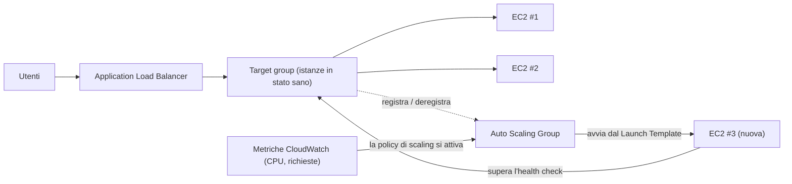

# Capitolo 7: Il Ristorante Che Cresce Quando è Affollato

Erano le 19:43 di un venerdì sera.

La sedia di Tom era leggermente spinta all'indietro, nel modo in cui si spostava quando stava fissando qualcosa con il tipo di concentrazione che significava che non avrebbe risposto se gli avessi parlato. L'ufficio si era svuotato un'ora prima. Lui era rimasto.

Aveva una scheda aperta sul dashboard delle metriche che aggiornava come altre persone controllano i social media — in modo riflessivo, costantemente, senza quasi volerlo.

La crisi dello storage era alle spalle. Il database aveva il suo disco. Le foto vivevano in S3. Per due settimane, il sistema era stato stabile — non entusiasmante, solo stabile. Avrebbe dovuto sembrare una buona cosa.

Poi il tasso di errore superò il 12%.

"Leo," disse Tom.

Leo stava già guardando. Tempi di risposta: in aumento. Richieste in coda: in aumento. La singola istanza EC2 — anche dopo l'accurato esercizio di right-sizing del mese scorso — era al 94% di CPU.

"Stiamo rifiutando clienti," disse Tom.

"Non li stiamo rifiutando," disse Leo. "Lo sta facendo il server."

"È la stessa cosa."

Lo era. E stava succedendo ogni venerdì da tre settimane. Nimbus era sopravvissuta alla crisi dello storage — il database aveva il suo disco, le foto vivevano in S3 — ma stabile e scalabile sono problemi completamente diversi. Il sistema funzionava. Semplicemente non cresceva.

Un messaggio Slack apparve da Maya: *il dashboard dice che gli ordini sono giù del 40% rispetto a venerdì scorso. cosa sta succedendo?*

Tom rispose: *server al massimo. ci stiamo lavorando.*

Passarono tre minuti.

Maya: *abbiamo un proprietario di ristorante che chiama la linea di supporto dicendo che l'app è rotta.*

Leo aveva le mani sulla tastiera. Stava ridimensionando l'istanza — la versione manuale della soluzione, quella che richiedeva di arrestare il server e cambiare il tipo di istanza. Il che significava downtime.

"Quanto durerà il riavvio?" chiese Tom.

"Sette minuti," disse Leo.

"Avremo altri sette minuti di interruzione un venerdì sera," disse Tom. Non era una domanda. Scrisse un messaggio Slack a Maya. Lei rispose con un solo carattere: *k*

Il riavvio completò. L'istanza tornò online. La CPU scese al 60%. Il tasso di errore calò. Tom guardò le metriche per quindici minuti senza parlare.

Alle 21:15, il traffico calò. La crisi era finita.

Leo guardò le sue mani, che alle 20:00 stavano tremando leggermente e ora non più.

"Non possiamo farlo ogni venerdì," disse.

"No," disse Tom. "Non possiamo."

Il team aveva bisogno che il proprio sistema gestisse il carico variabile automaticamente. Non comprare abbastanza server per il caso peggiore e sprecare denaro durante i periodi tranquilli. E non doversi arrabattare manualmente quando arrivano i picchi di traffico.

Per questo esiste un pattern. AWS ha due servizi che lo implementano.

**Il Concetto: Scalabilità Orizzontale**

Ci sono due modi per far gestire a un sistema un carico maggiore.

**Scalabilità verticale** significa rendere il singolo server più grande. Più CPU. Più RAM.
L'abbiamo fatto nel Capitolo 4 quando siamo passati da `t3.micro` a `t3.large`. Aiuta.
Ma ha dei limiti: puoi andare solo così in grande, l'istanza deve riavviarsi per essere ridimensionata,
e hai ancora un singolo punto di guasto.

**Scalabilità orizzontale** significa aggiungere più server. Invece di un singolo server grande, esegui
cinque server di medie dimensioni. Quando il traffico cala, esegui due. Quando sale, esegui dieci.

La scalabilità orizzontale ha vantaggi che quella verticale non ha:

- Nessun singolo punto di guasto. Se un server muore, gli altri continuano a servire.
- Nessun riavvio richiesto per aggiungere capacità.
- Paghi solo per quello che stai usando — aggiungi server quando ne hai bisogno, rimuovili quando non ne hai bisogno.
- Scalabilità lineare: il doppio dei server, circa il doppio della throughput.

C'è anche una dimensione di affidabilità che la scalabilità verticale non può eguagliare. Quando hai
cinque server e uno fallisce, la tua capacità scende all'80% — abbastanza per continuare a servire il traffico
mentre l'istanza guasta viene sostituita. Quando hai un server e fallisce, la capacità
scende a 0%. La ridondanza è intrinseca alla scalabilità orizzontale in un modo che quella verticale
non può fornire a qualsiasi dimensione.

Questo è importante anche per la manutenzione. Quando una patch di sicurezza richiede il riavvio di un server,
la scalabilità orizzontale ti consente di riavviare le istanze una alla volta — riavvii progressivi che
mantengono la continuità del servizio. Un singolo server grande richiede di accettare il downtime
durante il riavvio o di implementare la complessità del deployment blue/green.

L'insidia: se hai più server, come fanno gli utenti a sapere a quale rivolgersi?

E c'è un vincolo di design che la scalabilità orizzontale impone: la tua applicazione
deve poter girare su più server identici contemporaneamente senza che i server
interferiscano tra loro. Questo è il requisito **stateless** — ogni richiesta
deve essere autonoma, non dipendente dallo stato memorizzato su un server specifico. Vedremo
esattamente perché questo è importante quando incontriamo il problema delle sticky session.

**L'Application Load Balancer: Una Porta, Molte Stanze**

Pensa a un grande ristorante con una postazione accoglienza all'ingresso. I commensali arrivano e l'host
li dirige a un tavolo disponibile. L'host sa quali tavoli sono occupati e quali sono
liberi. I commensali non hanno bisogno di sapere quanti tavoli ci sono — entrano semplicemente e l'host
gestisce la distribuzione.

Un **Application Load Balancer** (ALB) fa questo con le richieste web.

Gli utenti si connettono al load balancer. Il load balancer distribuisce le richieste in entrata
tra la tua flotta di istanze EC2. Ogni utente vede un unico indirizzo (l'URL del load balancer).
Dietro quell'indirizzo, le richieste vengono distribuite su quanti server sono in esecuzione.

L'ALB stesso gira sull'infrastruttura gestita da AWS, distribuita su più AZ
nella tua Region. Non è un singolo server — è un servizio gestito e distribuito.
Quando abiliti il bilanciamento del carico cross-zone (il valore predefinito per gli ALB), ogni nodo ALB
distribuisce le richieste uniformemente tra tutti i target registrati indipendentemente dalla AZ
in cui si trovano. Questo previene il comune scenario di guasto in cui una AZ ha il doppio delle
istanze in stato sano di un'altra, risultando in un carico non uniforme.

Riceve ogni richiesta HTTP in entrata e decide quale istanza EC2 (chiamata
**target**) dovrebbe gestirla, in base a fattori come:

- Round-robin (ogni server riceve richieste a turno)
- Least outstanding requests (il server con meno richieste in volo riceve la prossima)
- Salute — solo i target in stato sano ricevono traffico

Gli **health check** sono essenziali. L'ALB invia regolarmente richieste di test a ciascun target.
Se un target non risponde correttamente, l'ALB lo contrassegna come non sano e smette di inviare
traffico ad esso. Quando il target si riprende, il traffico riprende.

Questo è automatico. Configuri i parametri dell'health check; l'ALB li applica.

Configuri gli health check con tre parametri chiave: il **percorso** da controllare (es. `/health`),
l'**intervallo** (quanto spesso controllare — ogni 5-300 secondi; valore predefinito 30), e la **soglia** (quante
verifiche consecutive riuscite o fallite prima di cambiare lo stato di salute del target).

Intervalli di health check aggressivi rilevano i problemi più velocemente ma aggiungono più traffico ai target.
Un intervallo di 30 secondi con una soglia di 3 fallimenti significa che un target in errore viene rimosso dalla
rotazione entro 90 secondi. Un intervallo di 10 secondi con una soglia di 2 fallimenti significa
rimozione entro 20 secondi — al costo di più traffico di health check.

Per Nimbus, Priya scelse un intervallo di 30 secondi con una soglia di 3 fallimenti (90 secondi
per dichiarare non sano) e 2 successi (60 secondi per dichiarare di nuovo sano dopo il recupero).
Questo bilanciava il rilevamento rapido dei guasti con l'evitare falsi positivi da brevi
interruzioni di rete.

**Configurazione dell'Health Check: Più che "È Vivo?"**

Il primo health check di Leo era un semplice ping TCP: "La porta 80 sta accettando connessioni?" Questo è il minimo. Il server poteva accettare connessioni sulla porta 80 mentre il database era giù, mentre l'applicazione era in un ciclo di errori, mentre il disco era pieno.

Priya aveva una visione diversa di cosa dovesse significare "sano".

"Abbiamo pensato a cosa succede se l'health check passa ma l'applicazione è rotta?" chiese. "Un server che può accettare connessioni ma non riesce a interrogare il database non è sano. È solo reattivo."

Leo costruì un endpoint `/health` nel codice dell'applicazione. L'endpoint faceva tre cose:
1. Confermava che il processo dell'applicazione era in esecuzione
2. Eseguiva una query di test al database (un semplice `SELECT 1`)
3. Confermava che la connessione S3 era accessibile

Se tutte e tre passavano, l'endpoint restituiva HTTP 200. Se una falliva, restituiva HTTP 503.

L'health check dell'ALB fu configurato per chiamare questo endpoint ogni 30 secondi. Se riceveva tre risposte 503 consecutive, l'istanza veniva contrassegnata come non sana e rimossa dalla rotazione.

"Questo significa che se il database va giù," disse Priya, "l'health check lo rileverà e rimuoverà i server interessati dal load balancer entro 90 secondi."

"Anche se i server stessi sono ancora in esecuzione," disse Tom.

"Anche se sembrano a posto dall'esterno."

L'ALB, puntato a un vero health check dell'applicazione, divenne un rilevatore molto più affidabile di problemi reali — non solo della vivacità del server.

**Auto Scaling: Il Ristorante Che Apre Più Tavoli**

Un ALB distribuisce il traffico tra i tuoi server esistenti. Ma non aggiunge server
quando ne hai bisogno.

**Auto Scaling** lo fa.

Un **Auto Scaling Group** (ASG) è una configurazione che dice ad AWS:

- Il numero minimo di istanze da tenere sempre in esecuzione
- Il numero massimo di istanze consentito
- Le condizioni in base alle quali scalare verso l'esterno (aggiungere istanze) o verso l'interno (rimuoverle)

Le condizioni di scaling si chiamano **policy**. I quattro tipi più comuni:

**Target tracking**: "Mantieni l'utilizzo medio della CPU al 70%." Quando la CPU media supera
il 70%, AWS lancia nuove istanze. Quando scende al di sotto, le istanze vengono terminate.
Questa è la policy più semplice e consigliata per la maggior parte dei carichi di lavoro — imposta un target
e lascia che AWS capisca quante istanze sono necessarie. Il target può essere l'utilizzo della CPU,
il conteggio delle richieste per target o qualsiasi metrica CloudWatch personalizzata.

**Step scaling**: Definisci soglie specifiche con risposte specifiche. "Quando la CPU
supera il 60%, aggiungi 1 istanza. Quando supera l'80%, aggiungi 3 istanze. Quando la CPU scende
sotto il 30%, rimuovi 1 istanza." Controllo più granulare rispetto al target tracking, ma
richiede più configurazione e messa a punto continua.

**Scheduled scaling**: "Alle 18:45 di ogni venerdì, assicurati che siano in esecuzione almeno 4 istanze."
Questo è lo scaling proattivo per eventi prevedibili. Funziona insieme allo
scaling reattivo — l'azione pianificata imposta un piano minimo, e il target tracking aggiunge
istanze sopra quel piano secondo necessità.

**Predictive scaling**: la versione machine learning della stessa idea. Invece di scrivere tu la pianificazione, Auto Scaling analizza fino a due settimane di carico storico e prevede le prossime 48 ore, avviando capacità *prima* del picco previsto. Per il traffico ciclico — un'ora di cena ogni venerdì, un'apertura di mercato ogni giorno feriale — il predictive scaling scopre il pattern e pre-scalda automaticamente, adattandosi man mano che il pattern cambia. Segnale dell'esame: "picchi di traffico ricorrenti/ciclici; le istanze devono essere pronte *prima* del picco" → predictive scaling. (Lo scheduled scaling è la risposta manuale; il predictive è quello appreso. Entrambi battono lo scaling solo reattivo, che è sempre in ritardo rispetto al picco del tempo di avvio dell'istanza.)

Per Nimbus, la combinazione era: target tracking per lo scaling reattivo (mantieni la CPU
al 65%), più un'azione di scaling pianificata ogni venerdì alle 18:45 per pre-scaldare 2
istanze aggiuntive prima del picco della cena.

Questo è automatico. Nessuno deve guardare le metriche. Nessuno deve avviare manualmente
server. Il sistema reagisce al carico in tempo reale.

Priya osservò questo accadere in diretta durante un picco del venerdì per la prima volta. Il conteggio dei server
passò da 2 a 5 nell'arco di quindici minuti, poi tornò a 2 dopo il picco.

"Questo," disse, "è genuinamente impressionante."

Tom stava guardando il grafico dei costi invece. La bolletta aumentava durante il picco e calava
dopo. "Abbiamo pagato solo per quello che abbiamo usato," disse, ugualmente impressionato. "Quanto costa al mese, in media su una settimana normale?"

Leo aprì il calcolatore. I picchi del venerdì aggiungevano forse il 15% alla bolletta mensile. Senza Auto Scaling, avrebbero dovuto provisionare per il picco per tutta la settimana. La differenza: circa 120 dollari al mese sprecati in capacità di picco inattiva, contro 0 dollari sprecati con Auto Scaling correttamente configurato.

C'è una sottigliezza nello scale-in che i team spesso non considerano: la **protezione dallo scale-in**. Puoi
configurare istanze specifiche in un ASG per essere protette dallo scale-in — ovvero
non verranno terminate durante gli eventi di scale-in automatici. Questo è utile per le istanze
che stanno elaborando un job di lunga durata che non vuoi interrompere.
Il codice dell'applicazione può anche impostare la protezione dell'istanza in modo programmatico quando avvia
un job lungo e rimuovere la protezione quando il job è completato. Questo impedisce all'ASG di
togliere il tappeto da sotto ai lavori attivi.

**Warm Pool: Non Tutto Deve Partire da Freddo**

Il venerdì in cui Auto Scaling si attivò per la prima volta, Tom cronometrò quanto tempo ci volle da "CPU supera la soglia" a "nuove istanze che servono traffico."

Quattro minuti e venti secondi.

"Sono quattro minuti in cui siamo a corto di capacità," disse.

"Potremmo aumentare il conteggio minimo delle istanze," disse Leo.

"Questo significa pagare per istanze inattive tutta la settimana," disse Tom.

C'era una via di mezzo: i **Warm Pool**.

Un Warm Pool è un gruppo di istanze EC2 pre-inizializzate che rimangono in uno stato arrestato, già avviate, già configurate, già attraverso lo script UserData. Hanno fatto tutto tranne iniziare a servire traffico.

Quando l'Auto Scaling Group decide di scalare verso l'esterno, invece di lanciare una nuova istanza fredda da zero (che richiede tre-cinque minuti per avviarsi, eseguire UserData e superare gli health check), avvia un'istanza dal Warm Pool. Avviare un'istanza arrestata richiede circa 30-60 secondi.

Per il pattern del venerdì di Nimbus — un picco noto e prevedibile che inizia intorno alle 19:00 — Priya configurò un Warm Pool di due istanze da mantenere durante l'orario lavorativo. Entro le 18:45, due istanze calde erano sedute pronte, arrestate ma inizializzate. Quando il traffico salì alle 19:00 e l'ASG aveva bisogno di scalare, le istanze calde si avviarono in meno di un minuto e si unirono alla flotta.

"Quanto costa il Warm Pool?" chiese Tom.

Un'istanza EC2 arrestata non paga per il compute — ma paga per lo storage EBS collegato. Due istanze `t3.small` in un Warm Pool: circa 4 dollari al mese in costi di storage. Il miglioramento del tempo di scale-out da quattro minuti a meno di un minuto valeva 4 dollari al mese un venerdì sera.

**Routing Basato sul Percorso dell'ALB**

Man mano che Nimbus cresceva, Leo aggiunse un secondo componente: un servizio API separato per la gestione dei ristoranti. I proprietari dei ristoranti accedevano a questo servizio attraverso lo stesso dominio ma a un percorso URL diverso: `/api/restaurant/` invece di `/`.

"Aspetta — ma *perché* faremmo così?" chiese Maya. "Perché non dare all'API di gestione del ristorante un dominio completamente diverso?"

"Potremmo," disse Leo. "Ma allora avremmo bisogno di un secondo certificato, un secondo load balancer, una seconda voce DNS. Il routing basato sul percorso lo gestisce con un certificato, un load balancer."

L'ALB supportava questo nativamente. Una **regola di routing basata sul percorso** diceva all'ALB: quando l'URL inizia con `/api/restaurant/`, instrada la richiesta al target group di gestione del ristorante. Quando l'URL inizia con qualsiasi altra cosa, instradala al target group dell'applicazione rivolta ai clienti.

Due flotte separate di istanze EC2. Un load balancer. Traffico diretto dal percorso URL.

"Quindi possiamo scalare l'API di gestione del ristorante indipendentemente dall'app rivolta ai clienti?" chiese Maya.

"Esattamente," disse Leo. "Se i proprietari dei ristoranti stanno facendo molti aggiornamenti del menu, quei server API scalano. Se i clienti stanno ordinando intensamente, quei server scalano. Non si influenzano a vicenda."

Maya elaborò il concetto. "E paghiamo solo un ALB invece di due."

"Corretto," disse Tom. Aveva un numero. "L'ALB costa circa 20 dollari al mese in tariffe base più addebiti per l'elaborazione dati. Un ALB che gestisce entrambi i carichi di lavoro contro due separati: circa 20 dollari risparmiati al mese. E evitiamo di gestire più certificati e record DNS."

"Ma," disse Priya, "se l'ALB stesso va giù, entrambi i servizi vanno giù insieme."

"AWS progetta l'ALB per essere altamente disponibile su più AZ," disse Leo. "Il rischio di guasto dell'ALB è molto basso rispetto alla complessità di mantenere due load balancer separati."

Priya archiviò questo sotto "trade-off accettato, documentato."

**Come ALB e ASG Lavorano Insieme**

I due servizi sono progettati per essere usati insieme.

Metti l'ALB davanti. L'ALB punta a un **target group** — una raccolta di
istanze che dovrebbero ricevere traffico. L'Auto Scaling Group gestisce quelle istanze:
le aggiunge al target group quando scala verso l'esterno, le rimuove quando scala verso l'interno.

Il flusso:

1. Il traffico arriva all'ALB
2. L'ALB distribuisce le richieste ai target in stato sano
3. CPU/carico aumenta su quei target
4. L'ASG rileva l'aumento del carico, lancia nuove istanze
5. Le nuove istanze superano gli health check, vengono registrate con l'ALB
6. L'ALB inizia a inviare traffico a loro
7. Il carico diminuisce, l'ASG termina le istanze in eccesso
8. L'ALB smette di inviare traffico alle istanze terminate

Questo accade senza alcun intervento umano.

**Launch Template: Il Blueprint per le Nuove Istanze**

Quando l'ASG lancia una nuova istanza, deve sapere cosa lanciare. Questo è definito
in un **Launch Template** — un AMI, un tipo di istanza, i gruppi di sicurezza da applicare,
e qualsiasi user data (script di avvio che vengono eseguiti quando l'istanza si avvia).

Un pattern comune: costruisci la tua applicazione in un AMI personalizzato (vedi Capitolo 4).
Quando l'ASG ha bisogno di una nuova istanza, lancia quell'AMI. La nuova istanza si avvia con
la tua applicazione già installata. Nessuna configurazione manuale richiesta.

Per ambienti più dinamici, puoi anche usare **script user data** che scaricano e
installano l'ultima versione del tuo codice all'avvio. Questo è più flessibile ma richiede
più tempo per avviarsi.

La scelta giusta dipende da quanto tempo devono impiegare le tue istanze per avviarsi e da quanto spesso
cambia la tua applicazione.

**Sticky Session: Un Problema Sottile**

Ecco qualcosa che inganna molti team quando implementano il load balancing per la prima volta.

Alcune applicazioni web memorizzano i dati di sessione — stato del login, contenuto del carrello — sul
server stesso (in memoria o su disco locale). Questo funziona bene con un server.
Con più server, si rompe.

Un utente effettua il login. La richiesta va al Server A. Il Server A memorizza la sessione. La richiesta successiva
va al Server B. Il Server B non ha la sessione. L'utente appare disconnesso.

Questo può essere affrontato in due modi:

**Sticky session** (o affinità di sessione): Configura l'ALB per inviare sempre le richieste
dallo stesso utente allo stesso server. Questa è una soluzione a breve termine. Mina il load
balancing (alcuni server ottengono più utenti "sticky" di altri) e crea problemi
quando un'istanza viene terminata.

Maya guardò la pagina di configurazione delle sticky session. "Se fissiamo gli utenti a server specifici, cosa succede quando quei server vengono terminati durante lo scale-in?"

"Perdono la sessione," disse Leo.

"Quindi le sticky session stanno solo rimandando il problema."

"Corretto," disse Priya. "La vera soluzione è il design dell'applicazione stateless."

**Design dell'applicazione stateless**: Memorizza i dati di sessione esternamente — in un database o
in una cache come ElastiCache (Capitolo 10). Ogni server può ricostruire la sessione di qualsiasi utente
dall'archivio esterno. I server diventano intercambiabili. Questo è l'approccio giusto
per le applicazioni scalabili orizzontalmente.

Priya lo definì "la decisione architettuale più importante che prendi quando vai
multi-server." Ha ragione. La incontriamo di nuovo nel Capitolo 10.

**Se Sticky Session Allora Meno Complessità Ma Più Rischio**

Se usi le sticky session per risolvere il problema dello stato di sessione, riduci la necessità di impostare uno storage di sessione esterno nel breve termine — ma quando un server sticky viene terminato durante lo scale-in, tutti i suoi utenti legati perdono le sessioni contemporaneamente. Il guasto non è graduale; è improvviso e colpisce un gruppo di utenti simultaneamente. Se esternalizzi lo stato di sessione, aggiungi una dipendenza (ElastiCache o un database) ma elimini quel modo di fallire improvviso. Per qualsiasi applicazione che scala regolarmente, l'investimento nel design stateless si ripaga la prima volta che Auto Scaling termina un'istanza con sessioni attive.

**Il Calcolo dei Costi di Tom**

La settimana successiva, Tom costruì un modello di costo per la configurazione ALB e ASG.

L'ALB: circa 20 dollari al mese di base più addebiti per l'elaborazione dati. Al volume di traffico di Nimbus: circa 22 dollari al mese.

L'Auto Scaling Group stesso: nessun costo aggiuntivo. Paghi per le istanze che esegue, ma quelle istanze esisterebbero comunque. L'ASG è gratuito; paghi per il compute.

Il Warm Pool: circa 4 dollari al mese in storage EBS per due istanze arrestate.

Costo totale aggiuntivo dell'infrastruttura: circa 26 dollari al mese, ovvero 312 dollari all'anno.

Tom poi guardò il log degli incidenti dei tre venerdì precedenti alla messa in produzione di ALB e ASG. Ogni incidente aveva costato a Nimbus circa il 40% del fatturato del venerdì durante la finestra di interruzione. Fatturato medio del venerdì: circa 2.400 dollari. Il 40% di 2.400 dollari fa 960 dollari per incidente. Tre incidenti: circa 2.880 dollari di fatturato perso in tre settimane.

"ALB e ASG costano 312 dollari all'anno," disse Tom. "Tre brutti venerdì ci sono costati quasi 3.000 dollari. E questa è solo la perdita diretta di fatturato — non il churn dei clienti che hanno smesso di usare Nimbus dopo una brutta esperienza."

Maya lesse i numeri. "Fai girare l'infrastruttura."

"Già in esecuzione," disse Leo.

## Quando l'ALB Non Basta: NLB e GWLB

Leo stava esaminando l'integrazione IoT che Nimbus aveva silenziosamente aggiunto per i partner ristoratori — piccoli sensori di temperatura nei walk-in cooler che inviavano letture a Nimbus ogni trenta secondi, in modo che i responsabili di cucina potessero ricevere avvisi se un frigorifero superava la temperatura di sicurezza.

"Aspetta," disse Leo. "Questi sensori inviano pacchetti UDP."

"È un problema?" chiese Maya.

"L'ALB non supporta UDP," disse Leo. "L'ALB capisce HTTP. Tutto qui."

Priya stava già guardando la documentazione. "È per questo che esiste il Network Load Balancer."

**Network Load Balancer (NLB)** opera al Layer 4 — il livello di trasporto. Instrada pacchetti TCP e UDP. Non ispeziona il contenuto di quei pacchetti, non capisce le intestazioni HTTP, non esegue il routing basato sul percorso. Quello che fa è spostare pacchetti dai client ai target a velocità straordinaria.

- **Milioni di richieste al secondo con latenza a singola cifra di millisecondi.** L'ALB elabora HTTP al Layer 7, il che significa che analizza le intestazioni, valuta le regole di routing e termina le connessioni TLS. L'NLB non fa nulla di questo — è più vicino a un direttore di traffico ad alta velocità che a un proxy web.
- **Preserva l'indirizzo IP sorgente del client.** Quando un ALB riceve una connessione, la termina e ne apre una nuova verso il target — la tua istanza EC2 vede l'IP dell'ALB, non quello dell'utente. L'NLB non lo fa; l'IP sorgente del pacchetto arriva invariato al target. Se la tua applicazione ha bisogno di sapere da dove provengono le richieste — per la geolocalizzazione, la limitazione del rate o il rilevamento delle frodi — e hai bisogno che sia accurato, NLB è la scelta giusta. (L'ALB aggiunge un'intestazione `X-Forwarded-For` che porta l'IP originale, ma richiede che l'applicazione legga l'intestazione; l'NLB mette l'IP reale direttamente nel pacchetto.)
- **Indirizzi IP statici ed Elastic IP.** Gli indirizzi IP dell'ALB cambiano nel tempo — AWS li gestisce e non sono fissi. L'NLB supporta IP statici per Availability Zone e puoi assegnare Elastic IP a quelli. Se i sistemi downstream devono aggiungere in whitelist un indirizzo IP specifico per consentire il traffico dal tuo load balancer — un requisito comune nei servizi finanziari o nella gestione dei dispositivi IoT — NLB è l'unica opzione. L'ALB non può farlo.
- **TLS pass-through.** L'NLB può passare il traffico TLS crittografato direttamente ai target senza decifrarlo. Il target termina TLS. Questo è utile quando i requisiti di conformità richiedono che la decifratura avvenga su un dispositivo specifico, o quando non vuoi gestire i certificati TLS sul load balancer.

"Se l'NLB è così veloce," chiese Maya, "perché non lo usiamo per tutto?"

"Perché è stupido," disse Leo. "Nel senso migliore. L'NLB non sa cosa sia HTTP. Non può fare routing basato sul percorso. Non può reindirizzare HTTP su HTTPS. Non può aggiungere intestazioni di sicurezza. Non può integrarsi con WAF. Per un'applicazione web — qualsiasi cosa che parli HTTP — la consapevolezza del Layer 7 dell'ALB è ciò che rende possibili tutte quelle funzionalità. Per i dati del sensore, che sono UDP, non abbiamo scelta."

"E per il nostro traffico web?"

"ALB, come prima."

"Quanto costa al mese?" chiese Tom. "L'NLB è più economico?"

Il modello di pricing è lo stesso dell'ALB: una tariffa oraria base più un addebito per Load Balancer Capacity Unit (LCU) in base al traffico elaborato. A volumi di traffico equivalenti, il costo è comparabile. Per il caso d'uso IoT di Nimbus — dati di sensori a basso volume — il costo dell'NLB sarebbe stato sotto i 20 dollari al mese.

**Gateway Load Balancer (GWLB)** è un animale completamente diverso. Opera al Layer 3 — il livello del pacchetto IP — ed esiste per un unico scopo specifico: inserire appliance di rete virtuali di terze parti nel flusso del tuo traffico.

Immagina che Nimbus crescesse fino a una dimensione in cui il loro team di sicurezza richiedesse che tutto il traffico che entra ed esce dai loro VPC passasse attraverso un'appliance firewall commerciale — una macchina virtuale che esegue software di un vendor come Palo Alto o Fortinet. Senza GWLB, dovresti instradare manualmente il traffico attraverso quelle appliance e capire come scalarle e mantenerle altamente disponibili. Con GWLB, configuri l'appliance come target e tutto il traffico viene instradato trasparentemente attraverso di essa usando il protocollo GENEVE. L'applicazione non sa che il traffico viene ispezionato. Il firewall non ha bisogno di conoscere la topologia di rete. GWLB gestisce il routing, lo scaling e il failover.

Per la maggior parte delle applicazioni web nelle fasi iniziali e intermedie — Nimbus inclusa — GWLB non è un servizio che configurerai. Ma per l'esame, e per il giorno in cui un requisito di sicurezza richiede l'ispezione a livello di rete, saprai a cosa serve.

Leo aggiunse un NLB per l'endpoint del sensore quel pomeriggio. I dati di temperatura iniziarono a fluire.

"Il primo ristorante riceve un avviso che il suo walk-in cooler è a 47 gradi," disse. "È sopra la soglia di sicurezza."

"È davvero a 47 gradi?" chiese Maya.

"Il proprietario del ristorante ha confermato. Hanno chiamato un tecnico di riparazione lo stesso pomeriggio."

Priya lo scrisse nel log degli impatti sui clienti di Nimbus. Non un evento di sicurezza. Solo la funzionalità IoT che funzionava.

**I Tre Load Balancer, Uno Accanto all'Altro**

AWS offre tre tipi di load balancer. L'ALB gestisce HTTP e HTTPS al Layer 7 —
capisce il protocollo, quindi può instradare in base al percorso URL (`/api` a un gruppo,
`/static` a un altro), alle intestazioni host e ai parametri di query. Questo è quello che la maggior parte delle applicazioni
web usa, ed è quello che Nimbus usa per il suo traffico web.

L'ALB termina anche le connessioni TLS — i certificati SSL/HTTPS sono installati sul
load balancer, non su ogni singola istanza EC2. L'ALB decifra la richiesta,
ispeziona le intestazioni HTTP, instrada in base alle regole e (opzionalmente) re-cifra prima
di inoltrarla al target. Questo semplifica significativamente la gestione dei certificati: gestisci
un certificato sull'ALB invece di un certificato su ogni istanza.

L'NLB, come il team ha visto con i sensori di temperatura, gestisce TCP, UDP e TLS al
Layer 4 — velocità pura, preservazione dell'IP sorgente, IP statici. Il GWLB si trova al Layer 3 per
instradare il traffico attraverso appliance di rete di terze parti come firewall e sistemi di rilevamento
delle intrusioni — raramente necessario al livello base.

Per Nimbus (e per la maggior parte delle applicazioni web), ALB è la scelta giusta.

Ti starai chiedendo: puoi usare sia ALB che NLB per la stessa applicazione? Sì. Un pattern comune è NLB davanti all'ALB — l'NLB gestisce la terminazione TCP grezza all'edge, l'ALB gestisce il routing HTTP dietro di esso. Questo aggiunge complessità e costo, e non è necessario per la maggior parte delle applicazioni web.

**ALB vs. NLB per l'esame**: Il differenziatore chiave è Layer 7 vs. Layer 4. Se
lo scenario d'esame menziona il routing basato su URL, il routing basato sull'host, l'ispezione delle intestazioni HTTP
o WebSocket — quello è l'ALB. Se menziona il pass-through TCP, la preservazione dell'IP sorgente,
milioni di richieste al secondo o latenza estrema e bassa per protocolli non HTTP — quello è
l'NLB. Quando uno scenario dice semplicemente "load balancer per un'applicazione web", la risposta è
quasi sempre ALB.

## Punti di Forza e Limitazioni

**Perché ALB + Auto Scaling è potente**:

- Scaling senza downtime (le istanze vengono aggiunte/rimosse senza interrompere le connessioni esistenti)
- Failover automatico (le istanze non in stato sano vengono rimosse automaticamente dal traffico)
- Efficienza dei costi (paghi solo per le istanze in esecuzione)
- Nessun singolo punto di guasto — più istanze su più AZ

**Dove si complica**:

- Le applicazioni stateful hanno bisogno di una gestione speciale (sticky session o stato esterno)
- Lo scale-out richiede tempo — se il traffico sale improvvisamente, c'è un ritardo prima che le nuove
  istanze siano pronte. Mitigalo con Warm Pool per i picchi prevedibili o un conteggio minimo più alto.
- Più parti in movimento significa più cose da monitorare e debuggare
- Alcune applicazioni non possono essere facilmente scalate orizzontalmente (database, alcuni sistemi legacy).
  La scalabilità orizzontale funziona meglio per i livelli stateless.

## Riepilogo

Due servizi, un pattern — e il pattern è quello che conta. L'ALB gestisce la distribuzione; l'ASG gestisce la dimensione della flotta. Insieme trasformano una configurazione fragile a singola istanza in un sistema che può assorbire il traffico della cena del venerdì senza che un essere umano sia sveglio. Il costo dell'infrastruttura di 312 dollari all'anno contro tre venerdì di fatturato perso (~2.880 dollari) è il tipo di matematica che Tom mette in un foglio di calcolo e non dimentica mai.

- **La scalabilità orizzontale** (aggiungere più server) è preferita rispetto a quella verticale perché elimina i singoli punti di guasto e consente costi elastici. Un **Application Load Balancer (ALB)** distribuisce il traffico HTTP/HTTPS in entrata e instrada solo verso le istanze in stato sano.
- **Gli health check dovrebbero testare la funzionalità effettiva dell'applicazione** — un endpoint `/health` che verifica la connettività del database rileva i guasti reali prima dei clienti.
- Un **Auto Scaling Group (ASG)** regola automaticamente il numero di istanze EC2 in base alle policy di scaling. Il target tracking è il tipo più comune; lo scheduled scaling gestisce i picchi prevedibili come il picco della cena del venerdì.
- Le applicazioni stateful devono esternalizzare lo stato di sessione piuttosto che fare affidamento sulle sticky session a lungo termine. Le sticky session sono una soluzione a breve termine; l'esternalizzazione dello stato è l'architettura corretta.
- Per il traffico HTTP/HTTPS, usa ALB. Per le prestazioni TCP/UDP grezze, usa NLB. Il routing basato sul percorso dell'ALB consente a un singolo load balancer di servire più componenti dell'applicazione per percorso URL.

## Suggerimenti per l'Esame

*SAA-C03 Dominio 2 — Task 2.1 (architetture scalabili) / Dominio 3 — Task 3.2*

- **Gli health check dell'ASG possono provenire da EC2 o dall'ALB.** Gli health check di EC2 rilevano solo
  se l'istanza è in esecuzione. Gli health check dell'ALB rilevano se l'applicazione sta
  rispondendo correttamente. Gli health check dell'ALB sono più approfonditi e dovrebbero essere preferiti
  per le applicazioni web.
- **Il target tracking scaling è la risposta più comune all'esame** per le policy di scaling.
  Il simple scaling (aggiungi N istanze quando si attiva l'allarme) è più vecchio e meno adattivo.
- **Lo scale-out è veloce; lo scale-in è lento.** AWS termina le istanze gradualmente durante
  lo scale-in per evitare di interrompere le connessioni attive — un comportamento controllato dall'impostazione di **deregistration delay** dell'ALB.
- **Il conteggio minimo delle istanze è il tuo piano di resilienza.** Se imposti minimum = 1
  e quell'istanza fallisce, la tua applicazione è giù prima che l'ASG possa reagire. Imposta
  minimum ≥ 2 e distribuisci tra le AZ per una vera resilienza.
- **L'ALB può distribuire il traffico tra AZ automaticamente.** Con il bilanciamento del carico cross-zone
  abilitato, ogni nodo ALB distribuisce le richieste uniformemente tra tutti i target registrati
  indipendentemente dalla AZ. Questo è importante per il carico bilanciato quando i conteggi delle istanze nelle AZ differiscono.
- **Il routing basato sul percorso dell'ALB** appare negli scenari d'esame che descrivono più componenti dell'applicazione
  che condividono un singolo load balancer. Il termine corretto è "regole listener" che
  instradano in base alle condizioni del percorso URL.
- **Selezione del Load Balancer:** ALB = HTTP/HTTPS, Layer 7, routing per percorso/intestazione, WebSocket, integrazione WAF. NLB = TCP/UDP, Layer 4, prestazioni estreme, IP statici, preservazione dell'IP sorgente. GWLB = Layer 3, inserimento di firewall/appliance virtuali nel flusso del traffico. Segnale dell'esame: "protocollo UDP" o "IP statico sul load balancer" → NLB. "Inserire un'appliance firewall nel flusso del traffico" → GWLB.

## Esercizi

**Esercizio 1 — Ricordo**

In parole tue: qual è la differenza tra un Application Load Balancer e
un Auto Scaling Group? Quale problema risolve ciascuno, e perché li usi tipicamente
insieme?

*(Suggerimento: Pensa all'analogia del ristorante — uno è l'host che dirige i commensali ai tavoli liberi;
l'altro decide quanti tavoli e camerieri il ristorante apre.)*

**Esercizio 2 — Scenario SAA-C03**

*Scenario*: Il sito web di e-commerce di un'azienda retail sperimenta traffico altamente variabile:
basso durante i giorni feriali, picchi massicci nei fine settimana e durante gli eventi di flash sale.
Vogliono che la loro applicazione gestisca i carichi di punta senza mantenere capacità inutilizzata
durante i periodi tranquilli. L'applicazione attualmente memorizza i dati di sessione in memoria del server.

Quale cambiamento architetturale affronterebbe MEGLIO i loro requisiti di scalabilità?

A) Aggiornare a una singola istanza EC2 molto grande che può gestire il traffico di punta
B) Distribuire più istanze EC2 dietro un ALB con un Auto Scaling Group, ed
   esternalizzare lo storage di sessione in una cache di sessione esterna
C) Distribuire più istanze EC2 dietro un ALB con sticky session abilitate
D) Aggiungere manualmente istanze EC2 prima di ogni picco di traffico previsto e terminarle
   dopo

**Suggerimento 1**: "Senza mantenere capacità inutilizzata" significa che hai bisogno di scaling automatico,
non di un'istanza grande fissa o di gestione manuale.

**Suggerimento 2**: Lo storage dei dati di sessione in memoria del server è un problema per i deployment
multi-istanza. Quali opzioni affrontano questo?

**Suggerimento 3**: L'opzione C usa le sticky session — è un workaround, non una soluzione.
Quale opzione affronta sia il problema di scaling che quello di storage della sessione correttamente?

**Risposta**: B

**Spiegazione**: Un ALB con un Auto Scaling Group fornisce scaling automatico ed elastico
— le istanze vengono aggiunte durante i picchi e rimosse durante i periodi tranquilli. Spostare lo storage
della sessione in una cache esterna (come ElastiCache, trattata nel Capitolo 10) rende l'applicazione stateless: qualsiasi
istanza può gestire la richiesta di qualsiasi utente, e l'ALB può distribuire il traffico liberamente.
Questa è la soluzione architettonicamente corretta.

**Perché non A?** Una singola istanza grande, per quanto grande, è ancora un singolo punto
di guasto. Spreca anche denaro durante i periodi tranquilli quando la maggior parte della sua capacità è inattiva.

**Perché non C?** Le sticky session instradano un utente alla stessa istanza, il che mitiga parzialmente
il problema della sessione ma mina il load balancing. Se quell'istanza
termina (durante lo scale-in o un guasto), l'utente perde la sua sessione comunque.

**Perché non D?** Lo scaling manuale richiede a qualcuno di prevedere correttamente i picchi di traffico
e agire in anticipo. È lento, soggetto a errori e laborioso. Auto Scaling lo gestisce
automaticamente.

*Dominio SAA-C03 2 — Task 2.1 / Dominio 3 — Task 3.2*

**Esercizio 3 — Sfida di Architettura** *(Opzionale)*

Nimbus ha una grande promozione in arrivo: uno sconto del 50% su tutti gli ordini per 4 ore
il prossimo sabato. L'anno scorso, una promozione simile ha causato 10 volte il traffico normale. Il team
si aspetta che il picco sia improvviso e duri esattamente 4 ore.

Auto Scaling reagirà alla fine, ma c'è un ritardo. Come progetteresti per questo
picco noto? Qual è la differenza tra scaling reattivo e proattivo, e quando
ha senso ciascuno?

*(Non esiste una risposta corretta unica. Pensa alle azioni di scaling pianificate,
al pre-riscaldamento e alle implicazioni sui costi di ciascun approccio.)*

## Scena Post-Crediti

Il primo venerdì dopo aver distribuito Auto Scaling e l'ALB, il team guardò
le metriche insieme.

19:15: due istanze in esecuzione. Carico normale.
19:45: il carico aumenta. Auto Scaling lancia altre due istanze.
20:00: quattro istanze gestiscono il picco. Tempi di risposta stabili.
21:30: il carico diminuisce. Auto Scaling termina due istanze.
21:45: torna a due istanze.

Il sito non andò mai giù. Nemmeno una volta.

Leo aggiornò la pagina delle metriche tre volte, come se si aspettasse di trovare un guasto che aveva mancato.

"È strano che mi senta leggermente deluso che niente si sia rotto?" disse.

"Sì," disse Priya.

Tom stava guardando la bolletta. Il costo aveva seguito il traffico quasi perfettamente.
"Abbiamo pagato esattamente per quello che abbiamo usato," disse. "Non di più. Non di meno."

Sembrava genuinamente sorpreso.

La mattina dopo, Maya trovò un nuovo problema nei log degli errori. Non un'interruzione — peggio.

"Il nostro database," disse, "restituisce tempi di query di otto secondi in media."

Otto secondi. Per un'app di ordinazione di ristoranti.

"Ogni volta che qualcuno carica il menu, interroghiamo ogni elemento nel database per
costruire la pagina," disse Leo. "E abbiamo quarantasette ristoranti ora."

"Quanti elementi di menu in totale?" chiese Tom.

Leo eseguì la query.

"Circa ventiduemila."

Silenzio.

Nel prossimo capitolo: il database che non richiede un DBA — solo una carta di credito.
