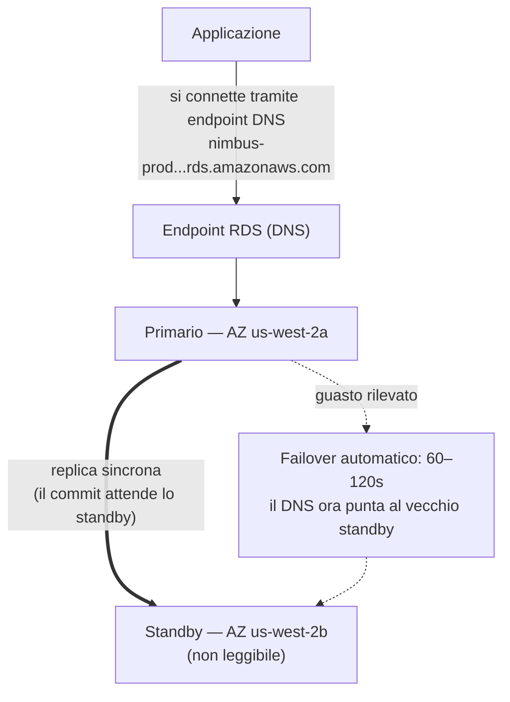

# Capitolo 8: L'Amministratore di Database che Non Fa Mai Ferie

Erano le 3 del mattino quando arrivò l'allarme.

Priya era l'unica sveglia. Il telefono si illuminò sul comodino e lei lo lesse al buio, con la luminosità dello schermo troppo alta. Si mise a sedere. Trovò il laptop a memoria e lo aprì senza accendere la luce.

La tastiera ticchettava piano nella stanza buia.

Il problema dello scaling, almeno, era alle spalle. La configurazione con load balancer e Auto Scaling era sopravvissuta a due venerdì consecutivi senza un singolo ordine perso — la flotta cresceva quando arrivava il picco della cena e si riduceva quando passava, esattamente come da progetto. Tom aveva smesso di aggiornare la pagina delle metriche per ansia e aveva iniziato ad aggiornarla per qualcosa di più simile all'orgoglio. Ma lo scaling automatico aveva risolto solo il livello web. Il database sottostante era ancora una sola macchina, configurata a mano e patchata a mano — ed era per questo che Priya era quella sveglia alle 3 del mattino.

Il server di database necessitava di una patch di sicurezza — del tipo che richiedeva un riavvio. La
vulnerabilità era reale, la patch era disponibile e la finestra per applicarla
senza interrompere i clienti era proprio adesso, nel bel mezzo della notte, quando il traffico
era basso.

Si connesse al server. Scaricò la patch. La applicò.

Poi lesse le release notes.

L'aggiornamento del pacchetto toccava il file di configurazione che PostgreSQL usa per definire i parametri di connessione. Le release notes includevano un avvertimento: a seconda di come veniva eseguito l'upgrade, un file di configurazione personalizzato poteva essere sostituito con la versione predefinita del pacchetto.

Il loro file di configurazione era stato personalizzato. Leo lo aveva modificato due mesi prima per mettere a punto l'impostazione max_connections.

La patch girò. Il server si riavviò. Il database tornò online.

Priya testò una query. Funzionava.

Controllò i log. Tutto sembrava normale.

Tornò a letto alle 4:15 del mattino.

Alle 9:05, Leo aprì l'applicazione e ricevette un errore. Controllò il database. Max connections era impostato al valore predefinito: 100. La loro applicazione era configurata per usare pool di connessioni fino a 500.

Ogni nuovo tentativo di connessione falliva. L'applicazione aveva di fatto perso l'accesso al database.

"Cos'è successo?" chiese Maya.

"La patch," disse Priya. Stava già guardando il file di configurazione. "L'aggiornamento del pacchetto ha sovrascritto il nostro file di configurazione personalizzato con quello predefinito. La messa a punto di max_connections di Leo è semplicemente sparita — il server si è riavviato con le impostazioni di fabbrica e nessuno ha ricevuto un errore. È tornato silenziosamente al valore predefinito."

"Quanto ci vuole per sistemarlo?" chiese Leo.

"Venti minuti," disse Priya. "Ma ci serve una finestra di manutenzione. Richiede una modifica di configurazione e un riavvio."

"Abbiamo ristoranti che aprono per pranzo tra due ore," disse Tom.

Priya lo sistemò in diciotto minuti. La finestra di manutenzione fu di dodici minuti di downtime effettivo. I ristoranti ne furono toccati, ma il picco non era ancora iniziato.

La mattina, raccontò al team quello che era successo. Ci fu un silenzio.

"Questo succederà di nuovo," disse Tom.

"Succederà ogni volta che c'è una patch," disse Priya. "E ci sono sempre
patch. Deve esserci un modo migliore per farlo."

I tempi di query di otto secondi erano ancora irrisolti. E nella stessa settimana, anche questo: una finestra di manutenzione alle 3 di notte trasformata in un incidente mattutino. Entrambi i problemi avevano la stessa causa radice — Nimbus stava facendo girare un database che non era attrezzata per gestire.

C'era una soluzione. Richiedeva solo di rinunciare all'idea che avessero bisogno di gestire il database da soli.

**Il Problema Tradizionale del Database**

Quando si esegue un database da soli su un'istanza EC2, si è responsabili di tutto.

Installare il software del database. Configurarlo in modo sicuro. Patcharlo quando vengono scoperte vulnerabilità
di sicurezza. Eseguire backup. Verificare che i backup funzionino effettivamente
(un passo che la maggior parte dei team salta fino a quando non è troppo tardi). Monitorare lo spazio su disco. Configurare
la replica per la ridondanza. Configurare il failover per quando il server primario va giù.
Ottimizzare le prestazioni delle query. Gestire le connessioni sotto carico.

Nessuna di queste cose è l'applicazione. Nessuna aggiunge funzionalità. Tutte richiedono competenza.

Il requisito di competenza è la questione chiave. Un amministratore di database qualificato capisce
non solo come far girare un database, ma anche come:

- Monitorare i log delle query lente e identificare i colli di bottiglia delle prestazioni
- Dimensionare la memoria per il working set per evitare l'I/O su disco
- Configurare l'archiviazione WAL per il ripristino point-in-time
- Impostare la replica sincrona in streaming con failover automatico
- Mettere a punto il connection pooling per prevenire l'esaurimento delle connessioni sotto carico
- Applicare upgrade di versione major senza perdita di dati o downtime prolungato

Questo è un insieme di competenze distinto e specializzato. I DBA senior hanno stipendi elevati proprio
perché fare bene tutto questo è difficile. La maggior parte delle startup non può assumere per questo ruolo. La maggior parte
dei team di sviluppo non lo possiede.

La maggior parte dei team di sviluppo non è composta da amministratori di database. Questo crea un pattern prevedibile:
il database viene installato, configurato al minimo e poi in gran parte dimenticato fino a quando qualcosa
non va catastroficamente storto. L'istanza PostgreSQL di Nimbus girava con la configurazione
predefinita — max_connections a 100, nessun connection pooling, backup manuali che Leo
aveva eseguito due volte e poi dimenticato, e nessuna replica di alcun tipo.

L'incidente della patch delle 3 di notte era il sintomo di un sistema gestito da persone eccellenti
nel costruire applicazioni e senza alcuna esperienza nelle operazioni sui database. Non è una
critica — è una descrizione accurata della maggior parte delle startup. La soluzione non è
assumere un DBA. La soluzione è usare un servizio che fornisce operazioni a livello di DBA
automaticamente.

"È questo quello che abbiamo fatto?" chiese Maya.

La risposta di Leo fu un silenzio, che era lo stesso di sì.

**Il Database Gestito**

Immagina di assumere un amministratore di database che non si dà mai malato, gestisce automaticamente
ogni patch di sicurezza, esegue un backup ogni notte senza che glielo si chieda, e si
ripara da solo quando qualcosa si rompe. Fa tutto questo senza disturbarti — e
non tocca mai, in nessuna circostanza, la logica della tua applicazione.

AWS chiama questo servizio **RDS** — Relational Database Service.

Con RDS, AWS gestisce:

- Installare e patchare il motore di database
- Backup automatici (memorizzati in S3, conservati per un massimo di 35 giorni)
- Failover automatico (quando il primario va giù, uno standby subentra automaticamente)
- Monitoraggio e metriche
- Crittografia a riposo e in transito
- Scalabilità automatica dello storage (se la abiliti, il disco cresce quando si riempie)

Tu gestisci:

- Lo schema del database (la struttura delle tue tabelle)
- Le tue query e la logica dell'applicazione
- Chi ha accesso al database
- Quale tipo di istanza esegue il database
- La messa a punto dei parametri (anche se RDS fornisce valori predefiniti ragionevoli)

**Motori Supportati**

RDS supporta diversi motori di database popolari:

- **MySQL** — il database relazionale open-source più utilizzato
- **PostgreSQL** — potente, estendibile, sempre più popolare per carichi di lavoro complessi
- **MariaDB** — fork open-source di MySQL, completamente compatibile
- **Oracle** — di livello enterprise, utilizzato in grandi organizzazioni con requisiti legacy
- **Microsoft SQL Server** — per ambienti fortemente orientati a Windows
- **Amazon Aurora** — il motore proprietario di AWS compatibile con MySQL/PostgreSQL, costruito per il cloud
  (copriamo Aurora in profondità nel Capitolo 24)

Per Nimbus, la scelta fu PostgreSQL. Era quello che Leo conosceva, e gestiva bene i dati
relazionali. La scelta del motore conta meno di quanto si pensi per la maggior parte delle applicazioni —
i vantaggi operativi di RDS si applicano comunque.

Una sfumatura: quando esegui un motore su RDS, AWS mantiene automaticamente le patch di versione
minor (durante la finestra di manutenzione che hai configurato). Gli upgrade di versione major —
passare da PostgreSQL 14 a 15, per esempio — sono un'operazione manuale che pianifichi
ed esegui tu. AWS testa con cura gli upgrade di versione major, ma dovresti testarli
prima in un ambiente di staging. I cambiamenti di versione major possono introdurre problemi di compatibilità
con sintassi SQL specifiche, estensioni o versioni dei driver.

Leo lo scoprì quando RDS applicò una patch minor e il log dell'applicazione mostrò brevemente
un avviso di deprecazione su una funzione che era stata rimossa in una sub-release.
Le patch minor dovrebbero essere essenzialmente trasparenti — ma monitorare i log dell'applicazione
dopo ogni finestra di manutenzione è una buona pratica.

"Abbiamo pensato a cosa succede se una patch minor rompe qualcosa?" chiese Priya.

"Torniamo indietro allo snapshot precedente," disse Leo.

"Quanto ci vuole?"

Leo cercò il tempo di restore di RDS per la dimensione del loro database. Per un database da 50 GB su una
`db.m6i.large`: circa 15-30 minuti per il ripristino da uno snapshot.

"Quindi abbiamo una finestra di recupero di 15-30 minuti se una patch rompe la produzione," disse Priya. "E applichiamo la patch nella finestra di manutenzione del primo mattino, così almeno l'impatto è minimo."

"E testiamo prima le patch in staging," aggiunse Leo.

"Sì," disse Priya. "Anche quello."

**Dimensionamento delle Istanze RDS: Non Tutti i Carichi di Lavoro Sono Uguali**

Quando crei un'istanza RDS, scegli un tipo di istanza — lo stesso concetto di EC2, ma orientato ai carichi di lavoro di database. AWS organizza i tipi di istanza RDS in alcuni livelli utili.

**Famiglia db.t3**: Istanze a prestazioni burstable. Progettate per sviluppo, staging e carichi di produzione leggeri che non necessitano di CPU elevata sostenuta. Una `db.t3.micro` è appropriata per un database di sviluppo con poco traffico. Una `db.t3.medium` gestisce un carico di produzione moderato con burst occasionali.

Il trade-off con le istanze della serie T: accumulano crediti CPU durante i periodi di basso utilizzo e spendono quei crediti durante i burst. Se esegui un'istanza della serie T a CPU elevata sostenuta, esaurisci i crediti e le prestazioni vengono limitate a una baseline che potrebbe essere insufficiente.

**Famiglia db.m6i**: Istanze general-purpose con prestazioni costanti e non burstable. La `db.m6i.large` è un punto di partenza comune per i database di produzione. Queste non hanno limiti di crediti — la CPU è disponibile a piena capacità ogni volta che ti serve.

**Famiglia db.r6i**: Istanze ottimizzate per la memoria. Più RAM per vCPU rispetto alla famiglia M. Appropriate per database con working set di grandi dimensioni — query che beneficiano del fatto che i dati siano in memoria invece di doverli recuperare dal disco a ogni accesso. Se le prestazioni del tuo database migliorano drasticamente quando aggiungi RAM, la famiglia R è la scelta giusta.

Per Nimbus:

- Sviluppo e staging: `db.t3.medium`. Adeguata per le query di sviluppo, basso costo.
- Produzione: `db.m6i.large`. Prestazioni costanti, RAM sufficiente per il working set di menu e ordini, nessuna limitazione da crediti.

"Quanto costa in più la m6i.large rispetto alla t3.medium?" chiese Tom.

Leo controllò la pagina dei prezzi. La `db.t3.medium` costava circa 55 dollari al mese. La `db.m6i.large` circa 140 dollari al mese. La differenza era reale, ma lo era anche la differenza di affidabilità.

"La t3 verrà limitata sotto carico sostenuto," disse Priya. "Se abbiamo un venerdì impegnativo e la CPU resta alta per quattro ore, la t3 esaurisce i crediti e rallenta. La m6i no."

Tom annotò il numero. Annotò anche il costo delle interruzioni del venerdì di due settimane prima. Il confronto non fu nemmeno combattuto.

La produzione andò sulla `db.m6i.large`.

**Multi-AZ: Lo Standby che Subentra**

Questa è la funzionalità che cambia completamente il calcolo dell'affidabilità.

**Il deployment Multi-AZ** significa che RDS mantiene un'istanza standby sincrona in una
Availability Zone diversa da quella del primario. Ogni transazione confermata sul primario
viene replicata in modo sincrono allo standby prima che il commit venga riconosciuto.

Quando il primario fallisce — guasto hardware, interruzione dell'AZ, crash del software — RDS
esegue automaticamente il failover verso lo standby. Il record DNS dell'endpoint del database
viene aggiornato. La tua applicazione si riconnette al nuovo primario.

Il failover richiede 60-120 secondi. Durante quella finestra, la tua applicazione sperimenterà
errori di connessione. Le applicazioni scritte correttamente dovrebbero gestirli con eleganza (tentativi
di riconnessione con backoff).

Lo standby non è una replica di lettura. Non serve traffico di lettura. Il suo unico scopo è
essere pronto a subentrare.



(Nota: la più recente opzione di deployment **Multi-AZ DB Cluster** mantiene *due* standby che
**sono** leggibili ed esegue il failover in ~35 secondi — l'esame potrebbe distinguerla dal
classico deployment Multi-AZ a *istanza* descritto qui.)

"Quanto costa Multi-AZ?" chiese Tom.

Circa il doppio del costo di un'istanza singola — perché stai letteralmente eseguendo due
istanze di database. Lo standby costa quanto il primario.

Tom aprì la cronologia degli ordini e stimò il fatturato orario durante il loro picco del venerdì.

"E se qualcuno prova a intrufolarsi durante la finestra di failover?" chiese Priya. "Quando il primario è giù e lo standby viene promosso, ci sono sessanta secondi in cui siamo esposti?"

"Il failover è trasparente," disse Leo, "ma la domanda è legittima. Le stringhe di connessione dovrebbero usare l'endpoint RDS, non IP hardcoded — altrimenti il failover non sarà senza interruzioni."

"Quindi l'indirizzo resta lo stesso anche quando la macchina dietro di esso cambia?" chiese Maya.

"È esattamente il punto dell'endpoint," disse Leo.

Multi-AZ fu abilitato quel pomeriggio.

**Backup Automatici e Ripristino Point-in-Time**

RDS esegue backup automatici ogni giorno. AWS memorizza questi backup in S3 (gestiti da
RDS — non li vedi direttamente nella tua console S3). Puoi ripristinare il database
a qualsiasi punto all'interno del tuo periodo di retention dei backup.

I backup avvengono durante una **finestra di backup** configurabile — un periodo di basso traffico,
tipicamente nelle prime ore del mattino. (È un'impostazione separata dalla **finestra di
manutenzione**, che è quando RDS applica patch e modifiche di configurazione. All'esame
piace verificare che si tratti di due finestre diverse.) Per la maggior parte dei tipi di motore, i backup
non causano downtime — e nei deployment Multi-AZ, lo snapshot viene preso dallo
standby, quindi il primario non viene toccato affatto.

Il **ripristino point-in-time** è una delle funzionalità più preziose: puoi ripristinare a
qualsiasi secondo all'interno del tuo periodo di retention. Non solo snapshot giornalieri — *qualsiasi secondo*.
Questo è possibile perché RDS archivia continuamente i log delle transazioni oltre ai
backup giornalieri.

Se qualcuno esegue accidentalmente `DELETE FROM orders WHERE 1=1` alle 14:37, puoi
ripristinare alle 14:36.

Leo si rilassò visibilmente quando capì questo.

"Ho già impostato la retention dei backup a un giorno," disse Leo. "Oh — ma va bene, giusto? Possiamo cambiarla?"

"Cambiala ad almeno sette giorni," disse Priya. "Trenta per la produzione."

Leo la aggiornò immediatamente.

"Avremmo potuto recuperare quello che ho cancellato il mese scorso?" chiese.

"Prima di RDS? No," disse Priya. "Dopo RDS? Sì."

Ti starai chiedendo: qual è la differenza tra un backup automatico e uno snapshot manuale? I backup automatici vengono eliminati quando scade il periodo di retention (fino a 35 giorni). Gli snapshot manuali vengono conservati indefinitamente finché non li elimini esplicitamente. Se devi preservare permanentemente lo stato di un database — prima di una grande migrazione, prima di un deployment rischioso — prendi uno snapshot manuale.

**RDS Proxy: Risolvere il Problema delle Connessioni su Larga Scala**

Due settimane dopo la migrazione a RDS, Leo notò qualcosa nelle metriche.

Il database gestiva le query senza problemi. Ma il numero di connessioni aperte era alto — più alto di quanto si aspettasse. Con l'Auto Scaling Group che aggiungeva istanze EC2 durante il picco, ogni nuova istanza apriva il proprio pool di connessioni al database. Dieci istanze EC2, ciascuna con un pool di connessioni di 50: cinquecento connessioni simultanee al database.

"PostgreSQL ha un overhead per ogni connessione," disse Priya. "Memoria, CPU per il gestore della connessione. Cinquecento connessioni usano una quantità significativa delle risorse del database solo per la gestione delle connessioni — prima ancora di aver fatto qualsiasi lavoro effettivo."

"Possiamo ridurre la dimensione del pool di connessioni?" chiese Leo.

"Potremmo," disse Priya. "Ma allora rischiamo che le richieste si mettano in coda in attesa di una connessione durante il picco."

La soluzione migliore: **RDS Proxy**.

RDS Proxy si trova tra l'applicazione e il database. Le istanze EC2 si connettono al Proxy, non direttamente all'istanza RDS. Il Proxy mantiene un pool di connessioni al database e multiplexa le richieste dell'applicazione su di esse. Se dieci istanze EC2 aprono ciascuna cinquanta connessioni verso il Proxy, il Proxy potrebbe mantenere solo cento connessioni effettive al database — condividendole in modo efficiente tra tutte le richieste dell'applicazione.

I vantaggi:

**Connection pooling**: Meno connessioni effettive al database significa meno overhead di memoria sull'istanza RDS e migliori prestazioni sotto carico.

**Failover più veloce**: Durante un failover Multi-AZ, il Proxy mantiene la connessione sul lato applicazione mentre ristabilisce la connessione al database sul backend. Le applicazioni vedono una breve pausa invece di un reset completo della connessione. RDS Proxy riduce l'impatto del failover da 60-120 secondi a tipicamente 30 secondi o meno.

**Autenticazione IAM**: Invece di incorporare le credenziali del database nell'applicazione, l'applicazione può autenticarsi a RDS Proxy usando un ruolo IAM. Il Proxy gestisce le credenziali effettive del database. Questo elimina completamente i segreti dall'ambiente dell'applicazione.

"Quanto costa RDS Proxy?" chiese Tom.

Costa circa 0,015 dollari per vCPU-ora dell'istanza RDS sottostante, fatturato separatamente dall'istanza stessa. Per una `db.m6i.large` (2 vCPU), il Proxy aggiunge circa 22 dollari al mese.

Tom guardò il grafico del numero di connessioni — cinquecento connessioni in competizione per le risorse del database durante il picco — e guardò il costo di 22 dollari al mese.

"È più economico che passare a un'istanza RDS più grande per gestire l'overhead delle connessioni," disse.

RDS Proxy fu abilitato quella settimana.

"E se qualcuno prova a intrufolarsi attraverso il Proxy?" chiese Priya. "L'autenticazione IAM per il Proxy riduce la superficie d'attacco?"

"Sì," Priya rispose alla sua stessa domanda. "Nessuna credenziale del database nell'ambiente dell'applicazione significa che non ci sono credenziali del database da rubare dall'applicazione."

Abilitò l'autenticazione IAM per il Proxy.

**Replica di Lettura: Scalare il Traffico di Lettura**

Multi-AZ riguarda la disponibilità. Le **repliche di lettura** riguardano le prestazioni.

Una replica di lettura è una copia asincrona del tuo database primario che può servire query
di lettura. Puoi avere fino a 15 repliche di lettura per i principali motori RDS — MySQL, PostgreSQL e MariaDB (anche Aurora supporta fino a 15 Aurora Replica, che condividono lo stesso volume di storage).

L'applicazione viene modificata per inviare le query di lettura alla replica e le query di scrittura al
primario. Questo distribuisce il carico: il primario gestisce le scritture e le transazioni
complesse; le repliche gestiscono le letture.

Caratteristiche principali:

- La replica è **asincrona** — può esserci un piccolo ritardo (lag) tra il
  primario e la replica. Se scrivi un record e lo leggi immediatamente dalla replica,
  potresti non vederlo ancora.
- Le repliche di lettura possono essere nella stessa Region o in una Region diversa (le repliche
  cross-Region aggiungono latenza ma consentono la distribuzione geografica).
- Le repliche di lettura possono essere promosse a database autonomi in uno scenario di disastro.

Per Nimbus: i lookup del menu sono letture. La cronologia degli ordini è letture. La stragrande maggioranza del
traffico è traffico di lettura. Aggiungere una replica di lettura e instradare le letture verso di essa riduce
significativamente il carico del database primario.

Trattiamo le repliche di lettura in modo più approfondito nel Capitolo 24 quando parliamo di Aurora.

**Se il Carico è Read-Heavy Allora Aggiungi una Replica Ma Attento al Lag**

Se il tuo carico di lavoro è read-heavy, aggiungere una replica di lettura riduce il carico sul primario e migliora le prestazioni delle query — ma la replica è asincrona, il che significa che la replica può essere leggermente indietro rispetto al primario. Se la tua applicazione scrive un record e lo rilegge immediatamente, deve leggere dal primario, non dalla replica. Sbagliare questo produce bug sottili e difficili da debuggare sulla freschezza dei dati: un utente effettua un ordine, la pagina di conferma interroga la replica, la replica non si è ancora aggiornata, l'ordine sembra mancante. Questo si chiama coerenza read-your-writes, ed è l'errore più comune che i team commettono quando aggiungono repliche per la prima volta.

**Performance Insights: Trovare la Query Lenta**

Il tempo di caricamento del menu di otto secondi era ancora un problema. Il passaggio a RDS aveva migliorato l'affidabilità, ma la query era ancora lenta.

Leo aggiunse una replica di lettura e instradò le query del menu verso di essa. Il tempo di caricamento del menu scese a circa quattro secondi. Meglio. Ancora non bene.

"La query è ancora lenta," disse Maya. "Abbiamo migliorato il collo di bottiglia, ma non l'abbiamo risolto."

RDS include una funzionalità chiamata **Performance Insights** — uno strumento di monitoraggio che mostra quali query stanno consumando più risorse del database, quali sessioni sono in attesa e cosa stanno aspettando.

Leo abilitò Performance Insights sulla replica di lettura e caricò ripetutamente la pagina del menu durante una sessione di test pomeridiana.

La dashboard di Performance Insights mostrò una query che dominava il carico: una scansione completa della tabella `menu_items`, che recuperava tutte le 22.000 righe ogni volta che veniva caricata una pagina del menu. Non c'era nessun indice su `restaurant_id` — la colonna su cui l'applicazione stava filtrando.

Tempo di esecuzione senza indice: 8,2 secondi.

Leo aggiunse l'indice.

```sql
CREATE INDEX idx_menu_items_restaurant_id ON menu_items(restaurant_id);
```

Tempo di esecuzione con l'indice: 14 millisecondi.

Da 8.200 millisecondi a 14 millisecondi. La differenza tra un'app di ordinazione per ristoranti che allontana i clienti e una che usano senza pensarci.

"Era questo il problema per tutto il tempo?" disse Maya.

"Era questo il problema," disse Leo.

"E Performance Insights l'ha trovato in quanto tempo?"

"Circa venti minuti."

Tom stava già calcolando. Tre settimane di tempi di caricamento del menu sub-ottimali, una stima di 200.000 caricamenti di pagine del menu in quel periodo, una stima del 15% di abbandono dovuto alla lentezza. Il numero a cui arrivò era scomodo.

"La prossima volta aggiungete gli indici mancanti prima del lancio," disse.

"Ci sarà una checklist," disse Priya. La stava già scrivendo.

**Quando Non Usare RDS**

RDS è eccellente per un'ampia gamma di carichi di lavoro di database relazionali. Non è la risposta giusta per tutto.

**Quando hai bisogno di accesso a livello di sistema operativo**: RDS non ti dà accesso al sistema operativo sottostante. Non puoi installare pacchetti OS personalizzati, modificare i parametri del kernel o eseguire strumenti che richiedono accesso root al server del database. Se il tuo database ha requisiti che richiedono l'accesso al sistema operativo — certe configurazioni Oracle, driver di storage personalizzati, interfacce di rete specifiche — devi eseguire il database direttamente su un'istanza EC2.

**Quando usi un motore non supportato**: RDS supporta MySQL, PostgreSQL, MariaDB, Oracle, SQL Server e Aurora. Se la tua applicazione usa un motore di database diverso — CockroachDB, SingleStore, Greenplum — lo eseguirai su EC2, non su RDS.

**Quando hai bisogno di scalabilità orizzontale per carichi write-heavy**: RDS scala le letture attraverso le repliche. Le scritture vanno a una sola istanza primaria. Se il tuo carico di lavoro è write-heavy e deve essere distribuito su più nodi di scrittura, RDS non è l'architettura giusta. Il Global Database di Aurora può aiutare su larga scala, ma per requisiti estremi di scala in scrittura, i database distribuiti come DynamoDB (Capitolo 9) o CockroachDB in esecuzione su EC2 sono gli strumenti appropriati.

**Quando il costo del servizio gestito supera il costo operativo**: Per carichi di lavoro molto grandi e stabili in cui il tuo team possiede una genuina competenza di amministrazione di database, eseguire PostgreSQL su EC2 con i tuoi strumenti può essere più economico di RDS. È insolito per i team che non sono principalmente shop di DBA. Ma è reale, e un buon architetto lo riconosce.

Per Nimbus — una startup senza risorse DBA dedicate, con PostgreSQL su un servizio gestito, con una crescita imprevedibile — RDS era chiaramente la scelta giusta.

**Parameter Group e Option Group di RDS**

Due meccanismi di configurazione che emergono all'esame:

I **parameter group** controllano le impostazioni del motore di database — come il numero massimo di connessioni,
la dimensione della cache delle query, i valori di timeout. RDS crea un parameter group predefinito che funziona
per la maggior parte dei casi. Crei parameter group personalizzati quando devi mettere a punto impostazioni specifiche.

Gli **option group** abilitano funzionalità aggiuntive per alcuni motori — come la crittografia di rete nativa
di Oracle o la transparent data encryption di SQL Server. La maggior parte dei deployment di motori
open-source non ha bisogno di option group personalizzati.

Puoi personalizzare il comportamento del motore di database attraverso questi meccanismi — ma i valori predefiniti funzionano per la maggior parte dei team agli inizi.

### Far Entrare i Dati: AWS Database Migration Service

Qualche settimana dopo, Tom arrivò allo standup con una slide.

Nimbus stava acquisendo un piccolo concorrente regionale. Il loro sistema di ordinazione girava su un database MySQL in una struttura di co-location. Il sistema non poteva andare offline durante la migrazione — i ristoranti lo stavano usando.

"Dobbiamo spostare i loro dati in RDS," disse Tom. "Senza spegnere il sistema."

"Quanto è grande il database?" chiese Leo.

"Circa 80 gigabyte."

"Quando devono fare il cutover?"

"Sei settimane."

Priya aveva già aperto la documentazione. "AWS DMS," disse.

**AWS DMS (Database Migration Service)** sposta i dati da un database di origine a un database di destinazione con downtime minimo. Gestisce la migrazione in due fasi: un caricamento completo dei dati esistenti, seguito dalla replica continua delle modifiche mentre l'origine continua a funzionare.

Esistono due tipi di migrazione:

**Migrazione omogenea:** origine e destinazione sono lo stesso motore — MySQL verso RDS MySQL, PostgreSQL verso Aurora PostgreSQL. Lo schema è compatibile; DMS migra i dati direttamente.

**Migrazione eterogenea:** origine e destinazione sono motori diversi — Oracle verso Aurora PostgreSQL, SQL Server verso RDS MySQL. Lo schema deve essere prima convertito. Questo richiede l'**AWS Schema Conversion Tool (SCT)** per tradurre lo schema, e poi DMS per spostare i dati.

Per l'acquisizione di Nimbus: MySQL verso RDS MySQL. Omogenea. Nessun bisogno di SCT.

Come funziona in pratica:

1. DMS legge dall'origine — il database MySQL in co-location
2. **Full load**: DMS copia tutti i dati esistenti nell'istanza RDS di destinazione
3. **CDC (Change Data Capture)**: dopo il full load, DMS legge il log delle transazioni del database di origine e replica le modifiche in corso verso la destinazione quasi in tempo reale
4. L'origine continua a funzionare. Quando il team è pronto, cambia la stringa di connessione.

"Quindi il sistema di ordinazione del ristorante resta attivo per tutto il tempo?" chiese Tom.

"Per tutto il tempo," confermò Priya. "L'origine e la destinazione restano sincronizzate tramite CDC. Quando siamo pronti, cambiamo l'endpoint. Il downtime sono i secondi che servono a quella modifica per propagarsi."

DMS supporta decine di combinazioni di origini e destinazioni: Oracle, SQL Server, MySQL, PostgreSQL, MongoDB, DynamoDB, S3, Redshift, Aurora e altro.

"Aspetta — ma *perché* abbiamo bisogno di uno strumento separato per le migrazioni eterogenee?" chiese Maya. "DMS non può semplicemente capire le differenze di schema?"

"Un VARCHAR in Oracle non è la stessa cosa di un VARCHAR in PostgreSQL," disse Priya. "Tipi di dati, stored procedure, sequenze, funzioni proprietarie — non hanno una corrispondenza uno a uno. SCT analizza lo schema di origine e genera l'equivalente più vicino per la destinazione. DMS poi sposta i dati in quello schema convertito. Separare la conversione dello schema dallo spostamento dei dati è ciò che rende affidabile il processo."

"E se qualcuno prova a intrufolarsi attraverso l'istanza di replica di DMS?" si chiese Priya un momento dopo. "Ha bisogno di accesso in lettura all'origine e in scrittura alla destinazione."

"Privilegio minimo su entrambi i lati," disse Leo. "IAM in sola lettura sull'origine. Accesso in scrittura limitato alla sola destinazione della migrazione. E l'istanza di replica resta nella subnet privata."

Priya lo annotò.

## Punti di Forza e Limitazioni

**Perché RDS è eccellente**:

- Elimina l'onere operativo della gestione del software di database
- Backup automatici e ripristino point-in-time
- Multi-AZ per il failover automatico con RTO minimo
- Repliche di lettura per scalare il traffico di lettura
- Crittografia a riposo e in transito integrata
- Tutti i principali motori di database relazionali supportati
- RDS Proxy per il connection pooling e una risposta al failover migliorata

**Dove RDS ha limiti**:

- Non puoi accedere al sistema operativo sottostante. Se il tuo database ha requisiti che richiedono
  l'accesso a livello di sistema operativo, potresti dover eseguire il tuo database su EC2.
- RDS non è serverless (con eccezioni — Aurora Serverless esiste, trattata nel
  Capitolo 24). Paghi per un'istanza in esecuzione anche se è inattiva.
- RDS non è progettato per database shardati orizzontalmente. Per uno scale-out massiccio
  di carichi relazionali write-heavy, potresti alla fine aver bisogno di un'architettura diversa.
- Per i pattern di dati non relazionali (NoSQL), DynamoDB (Capitolo 9) è più appropriato.

## Riepilogo

La finestra di patch delle 3 di notte di Priya era il sintomo. La causa radice era che Nimbus stava gestendo un database che un servizio gestito poteva gestire meglio. RDS non elimina solo la sveglia delle 3 di notte — sposta la responsabilità di patching, failover, backup e gestione delle connessioni su AWS, liberando il team per concentrarsi sul codice dell'applicazione che serve davvero i clienti. Il trade-off è la perdita dell'accesso a livello di sistema operativo, che conta raramente e molto meno di quanto sembri.

- **Amazon RDS** è un servizio di database relazionale gestito. AWS gestisce patching, backup, failover e storage. Tu gestisci schema, query e logica dell'applicazione.
- **Multi-AZ** mantiene uno standby sincrono in un'AZ diversa. Il failover automatico avviene in 60-120 secondi. Usa sempre il nome DNS dell'endpoint RDS nelle stringhe di connessione — non IP hardcoded — così il failover è trasparente.
- Le **repliche di lettura** sono copie asincrone che servono il traffico di lettura. Il lag di replica significa che possono essere leggermente indietro — la coerenza read-your-writes richiede di leggere dal primario subito dopo una scrittura.
- **RDS Proxy** mette in pool le connessioni, riducendo l'overhead e migliorando la velocità di failover. Critico per i carichi di lavoro basati su Lambda che possono creare migliaia di connessioni di breve durata.
- **Performance Insights** identifica le query lente — trovare un indice mancante può trasformare una query da 8 secondi in una da 14 millisecondi. Gli upgrade di versione major sono manuali; testali prima in staging.

## Suggerimenti per l'Esame

*SAA-C03 Dominio 3 — Task 3.3 (soluzioni di database)*

- **Multi-AZ è per l'alta disponibilità, non per le prestazioni.** Lo standby non serve
  traffico di lettura. Le repliche di lettura sono per le prestazioni. Questa distinzione viene testata frequentemente.
- **Il failover Multi-AZ è automatico.** Non configuri quando o come avviene.
  RDS monitora il primario e attiva il failover automaticamente.
- **Il lag di replica è importante.** Le repliche di lettura possono essere leggermente indietro rispetto al primario.
  Se la tua applicazione richiede di leggere dati appena scritti, deve leggere dal
  primario, non dalla replica. Questo si chiama "coerenza read-your-writes".
- **I backup automatici sono conservati per 0-35 giorni.** Impostare la retention a 0
  disabilita i backup automatici. Gli snapshot manuali sono conservati indefinitamente finché
  non li elimini.
- **Lo storage auto-scaling di RDS** previene le interruzioni da disco pieno. Abilitalo. Scala solo
  verso l'alto, mai verso il basso. L'esame potrebbe verificare se conosci questa asimmetria.
- **RDS Proxy** appare negli scenari d'esame che coinvolgono funzioni Lambda che si connettono a RDS
  (Lambda può creare migliaia di connessioni di breve durata, che sovraccaricano il database
  senza un Proxy), o negli scenari che richiedono un failover Multi-AZ più veloce.
- **Le istanze db.t3 fanno burst e vengono limitate.** Gli scenari d'esame che descrivono un degrado
  intermittente delle prestazioni su piccole istanze RDS potrebbero descrivere l'esaurimento dei crediti CPU
  sulle istanze della serie T. La soluzione è passare a un'istanza della serie M o R.
- **Endpoint DNS Multi-AZ**: Quando avviene un failover Multi-AZ, il record DNS dell'endpoint
  RDS viene aggiornato per puntare al nuovo primario. Le applicazioni che usano l'endpoint RDS
  (non un IP hardcoded) si riconnettono automaticamente. Le applicazioni con TTL DNS lunghi o
  indirizzi IP hardcoded non si riconnetteranno automaticamente. Usa sempre l'endpoint RDS.
- **Promozione della replica di lettura**: Una replica di lettura può essere promossa a istanza DB autonoma
  — utile per il disaster recovery se il primario viene perso e Multi-AZ non era configurato.
  La promozione è un'operazione a senso unico: la replica diventa un primario e non sta più
  replicando dall'originale. Gli scenari d'esame che chiedono di "promuovere manualmente" o
  "convertire una replica di lettura in primario" riguardano questa operazione.
- **Performance Insights** identifica le query SQL principali per tempo di attesa e utilizzo della CPU.
  Quando uno scenario d'esame chiede come diagnosticare query lente su un database RDS, Performance
  Insights è la risposta nativa AWS.
- **RDS vs. eseguire un database su EC2**: L'esame a volte lo presenta come una scelta.
  RDS fornisce operazioni gestite ma limita l'accesso a livello di sistema operativo. I database basati su EC2 ti danno
  pieno controllo ma richiedono competenze DBA per le operazioni. La frase "è richiesto l'accesso a livello di sistema operativo"
  in uno scenario d'esame è un segnale per scegliere EC2 invece di RDS.
- **AWS DMS:** Migra database con downtime minimo usando full load + CDC. Omogenea (stesso motore) = DMS direttamente. Eterogenea (motori diversi) = prima SCT per convertire lo schema, poi DMS per spostare i dati. Segnale dell'esame: "migrare database con downtime minimo" o "Oracle verso Aurora" → DMS + SCT.

## Esercizi

**Esercizio 1 — Ricordo**

In parole tue: qual è la differenza tra Multi-AZ e le repliche di lettura in RDS?
Quale problema risolve ciascuno?

*(Suggerimento: Pensa al DBA che non si dà mai malato — una funzionalità è il sostituto che prende
il turno quando il titolare crolla, l'altra è personale extra assunto solo per rispondere
alle domande di lettura.)*

**Esercizio 2 — Scenario SAA-C03**

*Scenario*: Un'azienda gestisce un database PostgreSQL di produzione su RDS. Il database
sperimenta un alto traffico di lettura a causa di query di reporting eseguite durante tutto il giorno.
Il team è anche preoccupato per la disponibilità del database — non possono permettersi più di
pochi minuti di downtime in uno scenario di guasto. Vogliono ridurre al minimo l'impatto sul
database primario dei carichi di lavoro di reporting.

Quale combinazione di funzionalità RDS affronta MEGLIO entrambe le preoccupazioni?

A) Abilitare Multi-AZ ed eseguire tutte le query contro l'istanza standby  
B) Prendere snapshot manuali più frequenti e ripristinare da essi se il primario fallisce  
C) Creare più repliche di lettura e disabilitare Multi-AZ per ridurre i costi  
D) Abilitare Multi-AZ per la protezione dal failover e creare una replica di lettura per le query di reporting

**Suggerimento 1**: I due requisiti sono: (1) disponibilità durante un guasto, (2) scaricare
le letture. Quali funzionalità affrontano quale requisito?

**Suggerimento 2**: Multi-AZ fornisce il failover automatico. Lo standby NON serve traffico di lettura.
Quindi Multi-AZ da solo non aiuta con il problema delle letture.

**Suggerimento 3**: Le repliche di lettura servono il traffico di lettura. Multi-AZ fornisce il failover. Ti servono entrambi.

**Risposta**: D

**Spiegazione**: Multi-AZ fornisce il failover automatico verso uno standby in un'AZ diversa —
questo affronta il requisito di disponibilità. Una replica di lettura consente alle query di reporting
di essere eseguite senza impattare il database primario — questo affronta il requisito di
prestazioni. Entrambe le funzionalità possono essere usate simultaneamente.

**Perché non A?** Lo standby Multi-AZ non può servire traffico di lettura. È esclusivamente per il
failover. Tentare di interrogarlo direttamente non è supportato.

**Perché non B?** Gli snapshot manuali ripristinano una copia completa del database — un processo
molto più lungo (potenzialmente ore per database di grandi dimensioni). Questo non soddisfa un requisito
di "pochi minuti di downtime".

**Perché non C?** Le repliche di lettura aiutano con le prestazioni di lettura ma non forniscono il failover
automatico. Se il primario fallisce, dovresti promuovere manualmente una replica di lettura —
il che richiede tempo e non è automatico.

*SAA-C03 Dominio 3 — Task 3.3*

**Esercizio 3 — Sfida di Architettura**

Nimbus sta considerando di migrare il proprio database PostgreSQL self-managed esistente
(in esecuzione su un'istanza EC2) a RDS PostgreSQL. La migrazione deve avvenire
con downtime minimo — idealmente sotto i 15 minuti. Il database è di 200 GB.

Quale approccio raccomanderesti? Quali servizi AWS potrebbero aiutare con la migrazione?
Quali rischi testeresti prima di effettuare il cutover del traffico di produzione?

*(Non esiste una risposta corretta unica. Pensa a AWS Database Migration Service,
alla replica logica e al rischio di incoerenza dei dati durante il cutover.)*

## Scena Post-Crediti

Entro la fine della giornata, Nimbus aveva migrato a RDS PostgreSQL con Multi-AZ abilitato. La
migrazione stessa richiese la maggior parte del pomeriggio — Leo usò un approccio backup-and-restore,
con una breve finestra di manutenzione.

Tom aveva monitorato attentamente la bolletta.

"L'istanza RDS," disse, "costa il doppio di quanto costava il database su EC2."

"E i backup automatici?" chiese Maya.

"Un po' di più."

"E il failover che otterremo gratis se il primario muore?"

Tom non aveva un prezzo per quello. Lo annotò come una domanda.

Tre giorni dopo, il database era sano. I tempi di query erano calati drasticamente dopo che Leo aveva aggiunto l'indice mancante. Il menu si caricava in meno di un secondo.

"Il problema," disse Priya, "non è il motore del database. È il modello dei dati."

Fece una pausa.

"Alcuni di questi dati non sono affatto relazionali. Voci di menu, profili dei ristoranti,
zone di consegna — questi dati hanno forme variabili. SQL ci sta combattendo."

Leo stava già facendo ricerche su qualcosa.

"E se usassimo un tipo di database diverso per il menu?" disse.

Nel prossimo capitolo: il database che non rallenta, nemmeno quando un milione di persone ordina contemporaneamente.
