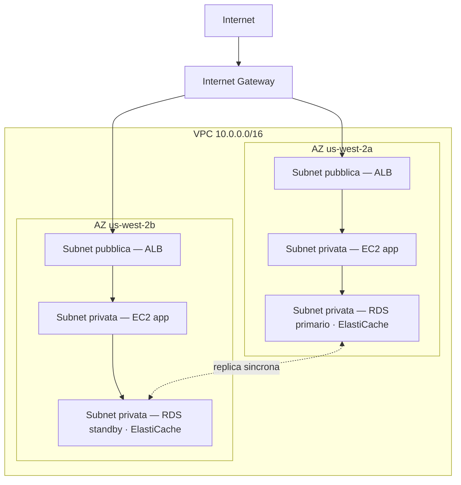

# Capitolo 11: Il Tuo Angolo Privato nel Cloud

Priya aveva un foglio di carta con un disegno sopra.

Non era un disegno complicato. Un rettangolo, etichettato "AWS". All'interno del rettangolo, un gruppo di scatole: i loro server, il loro database, la loro cache. Linee che collegavano tutto a tutto il resto. E all'esterno del rettangolo, un'unica etichetta: "Internet".

Lo posò al centro del tavolo.

---

*Il livello di caching funzionava. Redis aveva tagliato i caricamenti di pagina da 188 millisecondi a 12. Ma mentre Leo festeggiava quella vittoria, Priya aveva letto i log di rete — e non le piaceva quello che vedeva. Ogni servizio era sulla stessa rete piatta. Il database aveva un indirizzo IP pubblico. Il cluster Redis era tecnicamente raggiungibile dall'esterno. L'applicazione funzionava, ma l'architettura era un parcheggio: niente recinzioni, niente cancelli, niente zone.*

---

"Questo è quello che abbiamo," disse. "Il nostro database ha un indirizzo IP pubblico. Il nostro livello di cache può essere raggiunto da internet. Le nostre istanze EC2 sono tutte sulla stessa rete piatta."

"Sembra tutto a posto," disse Leo. "Abbiamo i security group."

"Security group che hai configurato tu," disse Priya. "Di notte. Durante la configurazione iniziale."

Leo non disse nulla.

"Non sto criticando la configurazione," disse lei. "Sto dicendo che quando tutto vive su una rete pubblica piatta, una singola configurazione errata è la differenza tra un sistema funzionante e uno accessibile a chiunque su internet."

Prese un pennarello rosso e disegnò un cerchio attorno al database.

"Questo non dovrebbe essere raggiungibile da internet. Per niente. Non tramite una regola del security group, non tramite una configurazione rafforzata. Dovrebbe essere strutturalmente irraggiungibile."

"Dobbiamo parlare di architettura di rete," disse Maya.

"Dovevamo parlarne tre mesi fa," disse Priya. "Ma va bene anche adesso."

Il team si riunì attorno a una lavagna per la prima volta da settimane.

**Il Problema del Parcheggio Aperto**

Immagina un enorme parcheggio pubblico multipiano. Diecimila auto. Qualsiasi auto può parcheggiare ovunque. Non ci sono barriere tra le zone, niente cancelli, nessuna sezione riservata.

Questa è una rete aperta. Ogni servizio può raggiungere ogni altro servizio. Il tuo server web può parlare con il tuo database. Il tuo database può raggiungere internet. Il tuo livello di caching può ricevere connessioni da qualsiasi luogo.

Quando tutto può parlare con tutto, una sola compromissione influisce su tutto.

"Quindi se qualcuno fa irruzione nel parcheggio," disse Tom, "può entrare in qualsiasi auto."

"E da qualsiasi auto, guidare ovunque," confermò Priya. "Vogliamo recinzioni. Vogliamo cancelli chiusi. Vogliamo zone."

Il VPC è il modo in cui costruisci quelle zone in AWS.

**Cos'è un VPC?**

"Aspetta — ma *perché* dovremmo farlo in questo modo?" chiese Maya. "Se abbiamo già i security group su ogni risorsa, perché ci serve un VPC? I security group non stanno facendo lo stesso lavoro?"

I security group e i VPC proteggono a livelli diversi. Un security group è una regola attaccata a una risorsa specifica — dice "questa istanza EC2 accetta traffico solo sulla porta 8080 dal load balancer." Ma è ancora sulla rete pubblica. L'indirizzo IP è ancora raggiungibile; la regola blocca semplicemente la connessione alla porta. Un VPC rimuove completamente la porta dalla strada pubblica. Una risorsa in una subnet privata non ha alcuna *route* verso internet — e per convenzione nessun IP pubblico — quindi non può essere raggiunta da internet, qualunque cosa dica il security group. Quella è una garanzia strutturale, non di configurazione.

Un **Virtual Private Cloud (VPC)** è una sezione logicamente isolata del cloud AWS — una rete privata che definisci tu, a cui per impostazione predefinita possono accedere solo le tue risorse.

Pensalo come un'area privata recintata all'interno dell'enorme parcheggio pubblico. La tua area ha le sue regole: chi può entrare, chi può uscire, quali percorsi esistono tra le sezioni.

Quando crei un VPC, definisci:

**Un blocco CIDR**: L'intervallo di indirizzi IP disponibili all'interno della tua rete. Ad esempio, `10.0.0.0/16` ti fornisce 65.536 indirizzi IP possibili (da 10.0.0.0 a 10.0.255.255).

**Subnet**: Suddivisioni del tuo VPC, ognuna assegnata a una porzione del tuo intervallo di indirizzi IP e associata a una specifica Availability Zone.

**Tabelle di routing**: Regole che determinano dove va il traffico di rete.

**Internet Gateway**: La connessione tra il tuo VPC e l'internet pubblico.

**Subnet: Pubbliche vs Private**

Non tutte le risorse dovrebbero essere accessibili pubblicamente.

Il tuo server web deve accettare traffico da internet — i browser degli utenti devono raggiungerlo.

Il tuo database non dovrebbe *mai* accettare traffico da internet — solo il tuo server web dovrebbe poter parlare con lui.

Qui entrano in gioco le subnet.

Una **subnet pubblica** è connessa a un Internet Gateway e può avere risorse con indirizzi IP pubblici. Il traffico può fluire verso e da internet.

Una **subnet privata** non ha alcuna route verso internet nella sua tabella di routing. Le risorse in una subnet privata possono comunicare solo con altre risorse nel tuo VPC (a meno che tu non configuri route in uscita specifiche). Per convenzione, non hanno nemmeno indirizzi IP pubblici.

Per Nimbus, il design divenne chiaro:



Il load balancer è esposto al pubblico — deve ricevere traffico da internet. Le istanze EC2 sono private — ricevono traffico solo dal load balancer. I database sono privati — ricevono traffico solo dalle istanze EC2.

"Quindi per raggiungere il database," disse Tom, "qualcuno dovrebbe passare attraverso il load balancer, poi attraverso l'istanza EC2, poi attraverso il security group del database?"

"Tre livelli," confermò Priya. "Difesa in profondità."

---

**Il Piano CIDR di Nimbus**

"Aspetta — ma *perché* dovremmo farlo in questo modo?" chiese Maya, guardando le scelte dei blocchi CIDR. "Perché Priya è così specifica sugli intervalli di indirizzi IP? Non possiamo usare semplicemente quello che AWS imposta per default?"

"Perché i blocchi CIDR sono molto difficili da cambiare in seguito," disse Priya. "E perché se mai connettessimo questo VPC a un altro VPC, o a una rete on-premises, gli intervalli IP sovrapposti causano fallimenti di routing dolorosi da debuggare."

Disegnò il piano sulla lavagna.

Il VPC di Nimbus: `10.0.0.0/16` — 65.536 indirizzi in totale.

| Subnet | CIDR | AZ | Scopo |
|---|---|---|---|
| Pubblica A | 10.0.0.0/24 | us-west-2a | Load balancer |
| Pubblica B | 10.0.1.0/24 | us-west-2b | Load balancer |
| Privata App A | 10.0.10.0/24 | us-west-2a | Server applicativi EC2 |
| Privata App B | 10.0.11.0/24 | us-west-2b | Server applicativi EC2 |
| Privata Dati A | 10.0.20.0/24 | us-west-2a | RDS, ElastiCache |
| Privata Dati B | 10.0.21.0/24 | us-west-2b | RDS, ElastiCache |

"Perché non rendere tutto un /16?" chiese Leo.

"Perché le subnet in AZ diverse non dovrebbero condividere uno spazio di indirizzi. Ogni subnet è in una sola AZ. Se mai facessimo il peering di questo VPC con un altro, più siamo granulari, meno è probabile che abbiamo conflitti. E ogni /24 ci dà 251 indirizzi utilizzabili — più che sufficienti per qualsiasi singolo livello."

"AWS riserva cinque indirizzi in ogni subnet," osservò Tom, guardando la documentazione. "Ecco perché sono 251, non 256."

"Corretto. I primi quattro e l'ultimo. Indirizzo di rete, router del VPC, server DNS, uso futuro, broadcast."

"Quindi /24 è il minimo a cui scenderesti?"

"In pratica. Useresti /28 per subnet molto piccole — come una subnet per un gateway VPN, che ha bisogno solo di una manciata di IP. Ma per i livelli applicativi, /24 è un minimo ragionevole."

Tom annotò i numeri e iniziò una colonna per le parti della rete che sarebbero effettivamente apparse in fattura — i NAT gateway e gli endpoint. Trovava sempre qualcosa.

---

**Errori di Pianificazione CIDR da Evitare**

"Abbiamo pensato a cosa succede se una subnet ci sta stretta?" chiese Priya. Non lo chiedeva perché non lo sapesse. Lo chiedeva perché il resto del team aveva bisogno di interiorizzare la risposta.

Leo ci pensò. "Possiamo aggiungere altre subnet?"

"Puoi aggiungere subnet a un VPC. Ma non puoi ridimensionare una subnet esistente. Se la tua subnet privata delle app si riempie — 251 indirizzi non bastano — dovresti creare una nuova subnet e migrarci le istanze."

"Quanto spesso succede davvero?"

"Raramente, se pianifichi bene. Ma le persone fanno tre errori comuni."

Li elencò:

**Errore uno**: Usare un CIDR del VPC troppo piccolo. Se usi `10.0.0.0/24` per l'intero VPC (254 indirizzi), finirai lo spazio prima di aver finito di pianificare le subnet. Inizia con un `/16` per flessibilità.

**Errore due**: Usare CIDR sovrapposti tra VPC. Se il tuo VPC di produzione è `10.0.0.0/16` e anche il tuo VPC di staging è `10.0.0.0/16`, non potrai mai farne il peering né connetterli attraverso un transit gateway. I router non sapranno a quale VPC inviare il traffico.

**Errore tre**: Non riservare spazio di indirizzi per livelli futuri. Il piano di Nimbus lasciava `10.0.30.0/24` e `10.0.31.0/24` non assegnati — spazio per un futuro livello di tooling interno, una subnet di monitoraggio o una subnet per endpoint VPN, senza dover ristrutturare l'intero spazio di indirizzi.

"Pianifica per il doppio di quello che pensi ti serva," disse Priya. "Le subnet sono gratuite. Lo spazio di indirizzi di un `/16` è abbondante. Il costo di una pianificazione sbagliata è una migrazione di rete."

---

**Il NAT Gateway: Subnet Private che Possono Comunque Scaricare le Cose**

Le subnet private non possono raggiungere internet. Ma a volte ne hanno bisogno. La tua istanza EC2 deve scaricare un aggiornamento software. La tua applicazione deve chiamare un'API esterna.

Qui entra in gioco il **NAT Gateway** (Network Address Translation).

Un NAT Gateway si trova in una subnet pubblica. Le risorse nelle subnet private possono inviare traffico in uscita al NAT Gateway, che lo inoltra a internet — ma internet non può avviare connessioni di ritorno.

È come una porta girevole a senso unico. Puoi uscire. Nessuno da fuori può entrare.

"Quanto costa al mese?" chiese Tom.

Il prezzo del NAT Gateway ha due componenti: una tariffa oraria per ogni NAT Gateway, più una tariffa per GB di dati elaborati.

All'epoca in cui Nimbus lo configurò, erano circa $32/mese per NAT Gateway, più $0.045 per GB di dati elaborati. Per piccoli volumi di traffico, il costo fisso domina. Su larga scala, i costi dei dati possono diventare considerevoli.

Tom impostò un avviso di fatturazione per i costi di elaborazione dei dati prima di finire la configurazione del NAT Gateway. Aveva visto come apparivano i costi dei dati di AWS quando nessuno li guardava.

La sorpresa che coglieva i team alla sprovvista: ogni byte che passa attraverso un NAT Gateway viene addebitato. Se le tue istanze EC2 nelle subnet private scaricano grandi pacchetti software, trasmettono log a servizi esterni o inviano dati significativi ad API esterne, gli addebiti per i dati del NAT Gateway appaiono in fattura come una sorpresa. La soluzione per il traffico da AWS a AWS: i VPC Endpoint instradano il traffico verso i servizi AWS (S3, DynamoDB) privatamente, bypassando completamente il NAT Gateway ed eliminando quegli addebiti per i dati.

"Quindi le istanze EC2 nella subnet privata scaricano gli aggiornamenti del sistema operativo attraverso il NAT Gateway," disse Tom. "Quegli aggiornamenti sono quanti gigabyte?"

"Per istanza, al mese, forse da due a cinque GB," disse Leo.

"Per dieci istanze. Per dodici mesi. A $0.045 per GB—"

"Da undici a ventisette dollari all'anno," finì Priya. "In questo caso, accettabile."

"Ma se trasmettessimo log — tipo inviare tutti i log applicativi a un servizio di osservabilità esterno—"

"Li instraderemmo attraverso un VPC Endpoint o useremmo CloudWatch Logs invece di uscire attraverso il NAT."

Tom chiuse la calcolatrice. I conti erano abbastanza chiari.

### NAT Instance: l'Alternativa Economica

"Aspetta," disse Tom, ancora fissando la pagina dei prezzi. "Stiamo pagando per gigabyte solo per lasciare che le istanze private raggiungano internet? È l'unica opzione?"

"È l'opzione gestita," disse Priya. "C'è un modo più vecchio, ma comporta dei compromessi."

Prima che esistesse il NAT Gateway, i team ottenevano lo stesso instradamento in uscita con una normale istanza EC2 — una "NAT instance". Lanciavi un'istanza EC2 in una subnet pubblica, abilitavi l'IP forwarding nel sistema operativo, disabilitavi il controllo source/destination (che AWS abilita per default per scartare i pacchetti non indirizzati all'istanza) e puntavi la tabella di routing della subnet privata verso la ENI dell'istanza. Il traffico dalle istanze private fluiva attraverso di essa verso internet, come con un NAT Gateway.

Funziona ancora. AWS lo documenta ancora. E a volumi di traffico molto bassi — un singolo ambiente di sviluppo dove una manciata di istanze scarica occasionalmente pacchetti — una NAT instance `t3.micro` può costare meno di cinque dollari al mese, contro la tariffa oraria fissa del NAT Gateway più le tariffe per GB.

| | NAT Gateway | NAT Instance |
|---|---|---|
| Gestione | Completamente gestito da AWS | Gestisci tu l'EC2 |
| Disponibilità | Ridondante all'interno dell'AZ | Singola EC2 — single point of failure |
| Banda | Fino a 100 Gbps, scala automaticamente | Limitata dal tipo di istanza EC2 |
| Costo | $0.045/GB + tariffa oraria | Solo il costo dell'istanza EC2 |

Il vantaggio di costo svanisce rapidamente. A volumi di traffico significativi, la tariffa per GB del NAT Gateway è competitiva con il tipo di istanza EC2 che ti servirebbe per gestire quella banda — e il NAT Gateway richiede zero patching, zero monitoraggio e zero risposta agli incidenti quando fallisce (non fallisce).

"Quindi quando useremmo davvero una NAT instance?" chiese Leo.

"Un ambiente di sviluppo usa e getta," disse Priya. "Un posto dove esegui una o due istanze, fai aggiornamenti di pacchetti occasionali e vuoi minimizzare il costo fisso. Carichi di lavoro di produzione — qualsiasi cosa che debba essere disponibile — NAT Gateway, uno per AZ."

L'esame testa questo compromesso per nome. Il pattern: "minimizzare il costo del NAT in un ambiente di dev o test con poco traffico" punta verso la NAT Instance. "Carico di lavoro di produzione che richiede alta disponibilità" punta verso il NAT Gateway deployato per AZ.

Potresti chiederti: se i security group esistono già e bloccano il traffico per default, perché un VPC con subnet private aggiunge una protezione significativa? Perché "bloccato da un security group" e "strutturalmente irraggiungibile" sono cose diverse. Una configurazione errata di un security group — una regola sbagliata, una porta aperta — può esporre una risorsa che ha un IP pubblico. Una risorsa in una subnet privata non ha alcun IP pubblico da raggiungere in primo luogo. Dovresti compromettere il load balancer e un'istanza EC2 in esecuzione prima di poter anche solo tentare di raggiungere il database. Le subnet private impongono l'isolamento a livello di rete, non a livello di regole.

**Tabelle di Routing: Come il Traffico Trova la Sua Strada**

Ogni subnet ha una **tabella di routing** che dice al traffico dove andare.

Una tipica tabella di routing di una subnet pubblica appare così:

| Destinazione | Target                      |
|-------------|-----------------------------|
| 10.0.0.0/16 | local                       |
| 0.0.0.0/0   | igw-xxxx (Internet Gateway) |

La prima regola: il traffico verso qualsiasi IP nell'intervallo del tuo VPC resta locale. La seconda regola: tutto il resto del traffico (`0.0.0.0/0` significa "tutto") va all'Internet Gateway.

Una tabella di routing di una subnet privata:

| Destinazione | Target                 |
|-------------|------------------------|
| 10.0.0.0/16 | local                  |
| 0.0.0.0/0   | nat-xxxx (NAT Gateway) |

Il traffico della subnet privata resta locale o esce attraverso il NAT Gateway. Nessuna route diretta verso l'Internet Gateway.

**Security Group vs NACL (Anteprima)**

All'interno del VPC, hai due strumenti per controllare il traffico a livello di risorsa:

I **Security Group** (il Capitolo 15 li tratta in profondità) agiscono come firewall virtuali per le singole risorse — un'istanza EC2, un'istanza RDS, un load balancer. Sono *stateful*: se il traffico è consentito in entrata, il traffico di risposta è automaticamente consentito in uscita.

Le **Network ACL (NACL)** operano a livello di subnet e sono *stateless*: devi consentire esplicitamente sia il traffico in entrata che quello in uscita, separatamente.

Per la maggior parte dei casi d'uso, i Security Group sono sufficienti. Le NACL aggiungono un livello extra quando hai bisogno di controlli a livello di subnet — per esempio, bloccare uno specifico intervallo di IP dal raggiungere mai una subnet.

"Security group a livello di istanza," scrisse Leo sulla lavagna. "NACL a livello di subnet."

"E non lasciare mai la porta 22 aperta a 0.0.0.0/0," aggiunse Priya, guardando Leo.

"È successo una volta," disse Leo.

"È sempre esattamente una volta," disse Priya, "finché non lo è più."

"E se qualcuno tenta di violare il sistema?" disse Priya, ancora alla lavagna. "Non attraverso un security group mal configurato — e se compromettessero il load balancer stesso? Cosa gli impedisce di fare un pivot verso la subnet privata?"

"Le istanze EC2 nella subnet privata accettano traffico solo dal security group del load balancer," disse Leo. "Anche se il load balancer è compromesso, l'attaccante può solo fare richieste che sembrano normali chiamate API."

"E il database accetta traffico solo dal security group delle EC2," disse Priya. "Difesa in profondità. Ogni livello presume che il precedente possa fallire."

---

**VPC Flow Logs: Vedere Cosa Sta Succedendo**

"Ci servono occhi sulla rete," disse Priya, tre giorni dopo l'inizio della riprogettazione del VPC.

"Abbiamo security group e NACL," disse Leo. "Il traffico è controllato."

"Controllato non significa visibile. Se succede qualcosa di strano — un tentativo di connessione inaspettato, traffico verso una porta insolita — come lo sappiamo?"

I VPC Flow Logs catturano metadati sul traffico di rete che fluisce attraverso il tuo VPC. Non il contenuto dei pacchetti — solo le informazioni a livello di connessione: IP di origine, IP di destinazione, porta, protocollo, conteggio dei pacchetti, conteggio dei byte, ora di inizio, ora di fine e se il traffico è stato accettato o rifiutato.

Una tipica voce di flow log appare così:

```
2 123456789012 eni-0abc123 10.0.10.5 10.0.20.8 49321 5432 6 20 4320 1620000000 1620000060 ACCEPT OK
```

Questo ti dice: da `10.0.10.5` (un'istanza EC2 nella subnet delle app) verso `10.0.20.8` (l'istanza RDS), porta 5432 (PostgreSQL), 20 pacchetti, 4.320 byte, accettato. Traffico normale.

Ma pochi giorni dopo aver abilitato i Flow Logs, Priya trovò questo:

```
2 123456789012 eni-0abc123 185.220.101.55 10.0.10.5 0 8080 6 1 40 1620003200 1620003201 REJECT OK
```

Un IP esterno — `185.220.101.55` — aveva tentato una connessione all'istanza EC2 sulla porta 8080. La connessione era stata rifiutata dal security group. Ma il tentativo era stato registrato.

Cercò l'IP. Apparteneva a un blocco di indirizzi rumeno noto per lo scanning automatizzato — il tipo di sondaggio di rumore di fondo che ogni IP pubblico su internet riceve costantemente.

"Qualcuno ci sta sondando," disse.

"Ma viene rifiutato," disse Leo.

"Questa volta. Abilita GuardDuty" — un servizio di rilevamento delle minacce che incontreremo come si deve nel Capitolo 17 — "prima di andare avanti. Ci serve il rilevamento comportamentale, non solo il blocco perimetrale."

I Flow Logs sono archiviati in CloudWatch Logs o S3. Possono essere interrogati usando CloudWatch Insights o Athena. Priya configurò una query CloudWatch Insights che girava ogni notte e segnalava qualsiasi tentativo di connessione rifiutato da intervalli IP non-AWS.

"Quanto costa al mese?" chiese Tom.

"I flow log vengono addebitati per GB di dati ingeriti in CloudWatch o S3. Al nostro volume di traffico, probabilmente da otto a quindici dollari al mese."

Tom si fermò. "E l'alternativa è non sapere che qualcuno sta sondando la nostra rete."

"Sì."

"Va bene," disse, e aprì la console.

**Leggere un Port Scan nei Flow Logs**

Due settimane dopo aver abilitato i flow log, Priya eseguì la sua query notturna di CloudWatch Insights e trovò qualcosa di nuovo. Non una connessione rifiutata — dozzine, in rapida sequenza, dallo stesso IP di origine, su porte consecutive.

```
185.220.101.55 → 10.0.10.5 port 22   REJECT
185.220.101.55 → 10.0.10.5 port 23   REJECT
185.220.101.55 → 10.0.10.5 port 25   REJECT
185.220.101.55 → 10.0.10.5 port 80   REJECT
185.220.101.55 → 10.0.10.5 port 443  REJECT
185.220.101.55 → 10.0.10.5 port 3306 REJECT
185.220.101.55 → 10.0.10.5 port 5432 REJECT
185.220.101.55 → 10.0.10.5 port 6379 REJECT
```

Tutto in una finestra di cinque secondi. Tutto rifiutato.

"Questo è un port scan," disse Priya. "Qualcuno sta sondando quali servizi gira questa istanza."

"Ma tutto rifiutato," disse Leo. "Quindi il security group sta facendo il suo lavoro."

"Il security group sta facendo il suo lavoro. Lo scan resta comunque informativo per l'attaccante — gli dice quali porte *non* hanno rifiutato entro un timeout, il che significa che quelle porte sono aperte da qualche parte. E gli dice che questo host è vivo e vale la pena indagarlo."

"Cosa facciamo?"

"Due cose," disse Priya. "Primo: aggiungiamo una regola NACL per bloccare l'intervallo /24 a cui appartiene quell'IP. Non solo quell'IP — l'intera subnet. I port scanner ruotano gli IP all'interno di un intervallo. Secondo: aggiungiamo un allarme CloudWatch che scatta quando un singolo IP di origine genera più di dieci connessioni rifiutate in sessanta secondi. Quel pattern è quasi sempre uno scan."

Configurò entrambe le cose. L'allarme scattò due volte nella settimana successiva — una volta dallo stesso intervallo rumeno, una volta da uno scanner automatizzato con base a Singapore. Entrambi vennero bloccati alla NACL entro pochi minuti dal rilevamento.

I flow log non fermano gli attacchi. Rendono gli attacchi visibili. E agli attacchi visibili si può rispondere. L'alternativa — traffico che fluisce invisibilmente — significa che il primo segnale di un problema è il danno, non il tentativo.

---

**La Trappola del Singolo NAT Gateway**

Tre mesi dopo la riprogettazione del VPC, Priya eseguì una simulazione di guasto. Voleva sapere cosa sarebbe successo a Nimbus se la availability zone `us-west-2a` avesse subito un'interruzione.

La maggior parte andava bene. Il load balancer faceva failover sulle istanze in `us-west-2b`. Lo standby RDS in `us-west-2b` era già attivo. ElastiCache promuoveva la replica. L'applicazione continuava a servire richieste.

Poi Leo notò che le sue istanze EC2 in `us-west-2b` avevano smesso di ricevere le notifiche di aggiornamento del sistema operativo. Controllò la configurazione del NAT Gateway.

Ce n'era uno. In `us-west-2a`.

"Tutto il traffico internet in uscita dalle subnet private di entrambe le AZ passa attraverso un solo NAT Gateway in una sola AZ," disse Priya.

"Quindi se `us-west-2a` va giù—"

"Ogni istanza EC2 in `us-west-2b` perde l'accesso internet in uscita. Non possono scaricare aggiornamenti. Non possono raggiungere API esterne. Le ricerche su Secrets Manager — un archivio gestito di credenziali che incontreremo come si deve nel Capitolo 16 — falliranno a meno che non siano in cache. Qualsiasi cosa richieda internet in uscita si romperà."

La soluzione: un NAT Gateway per AZ. Le subnet private di ogni AZ instradano il traffico in uscita verso il NAT Gateway nella stessa AZ. Quando un'AZ fallisce, viene colpito solo il traffico di quell'AZ.

"E il prezzo di quella soluzione?" chiese Tom.

"Trentadue dollari extra al mese per il NAT Gateway della seconda AZ."

Tom rimase in silenzio per un momento.

"La capacità EC2 in `us-west-2b` che non riesce a raggiungere le API esterne durante un'interruzione," disse Priya, "costa più di trentadue dollari."

Tom approvò la modifica.

Questo è uno degli errori di design VPC più comuni: un NAT Gateway che sembra altamente disponibile ma è in realtà un single point of failure. Se hai risorse in tre AZ e un solo NAT Gateway, hai resilienza di calcolo su tre AZ ma resilienza di rete su una sola AZ. Le due cose non combaciano.

La regola: un NAT Gateway per AZ, nella subnet pubblica di quell'AZ. La tabella di routing privata di ogni AZ punta al proprio NAT Gateway. Il costo è modesto. Il miglioramento di disponibilità è reale.


---

**VPC Peering: Connettere Reti Private**

E se Nimbus crescesse in più VPC? (Succede. I team diventano grandi. I servizi vengono isolati in account separati.)

Il **VPC Peering** consente a due VPC di comunicare privatamente come se fossero sulla stessa rete. Il traffico non lascia la rete privata di AWS.

Limiti importanti:

- Il VPC peering non è transitivo. Se il VPC A è in peering con il VPC B, e il VPC B è in peering con il VPC C, A e C non possono comunicare — a meno che non si aggiunga un peering diretto A-C.
- I blocchi CIDR non possono sovrapporsi tra VPC in peering.

Per architetture più grandi con molti VPC, **AWS Transit Gateway** (Capitolo 25) gestisce il routing transitivo senza richiedere una mesh completa di connessioni di peering.

---

**AWS PrivateLink: Accesso Privato ai Servizi AWS**

"E per raggiungere S3 dalla subnet privata?" chiese Leo. "Le nostre istanze EC2 scrivono le ricevute su S3. In questo momento quel traffico esce attraverso il NAT Gateway."

"VPC Endpoint," disse Priya. "Nello specifico, Gateway Endpoint per S3 e DynamoDB — sono gratuiti."

Un **VPC Endpoint** crea una connessione privata tra il tuo VPC e un servizio AWS, bypassando completamente l'internet pubblico. Il traffico tra la tua subnet privata e il servizio AWS resta sulla rete AWS. Nessun addebito da NAT Gateway. Nessuna esposizione a internet.

Per S3 e DynamoDB, i **Gateway Endpoint** sono gratuiti e facili: aggiungi una voce alla tabella di routing che punta il traffico S3/DynamoDB all'endpoint invece che al NAT Gateway.

Per altri servizi AWS (Secrets Manager, KMS, SNS, SQS), gli **Interface Endpoint** creano un'elastic network interface (ENI) nella tua subnet con un indirizzo IP privato. Il traffico verso il servizio va a quell'IP privato. Gli interface endpoint costano — circa $0.01/ora **per AZ in cui l'endpoint è provvisionato** (un endpoint con ENI in tre AZ costa tre volte la tariffa oraria), più circa $0.01/GB di dati elaborati — ma eliminano la necessità di instradare chiamate API sensibili (come le ricerche su Secrets Manager) attraverso un NAT Gateway o sull'internet pubblico.

"Quindi le nostre istanze EC2 possono raggiungere S3, DynamoDB, Secrets Manager e KMS," disse Priya, "tutto dalla subnet privata, senza alcuna esposizione a internet, e per S3 e DynamoDB, senza alcun addebito dati da NAT Gateway."

Tom ricalcolò. I risparmi sul traffico S3 avrebbero compensato il costo dell'Interface Endpoint per Secrets Manager nel giro di pochi mesi.

"PrivateLink è il nome generale," aggiunse Priya. "AWS PrivateLink è la tecnologia sottostante degli Interface Endpoint. L'esame usa entrambi i termini."

---

**Una Checklist di Debugging**

Tre mesi dopo la riprogettazione del VPC, Leo ruppe la rete. Non in modo drammatico — aveva modificato un'associazione di tabella di routing e accidentalmente disconnesso la subnet privata delle app dalla sua route verso il NAT Gateway.

Le istanze EC2 non riuscivano a raggiungere le API esterne. Potevano raggiungersi tra loro, e potevano raggiungere i database. Solo non internet. Le chiamate HTTPS in uscita iniziarono a fallire.

Passò quaranta minuti a fare troubleshooting prima che Priya gli passasse una checklist.

"Quando qualcosa non raggiunge qualcos'altro in un VPC, controlla queste cose in ordine," disse.

1. **Security group sull'origine**: La regola in uscita è corretta? Consente il traffico che stai cercando di inviare?
2. **Security group sulla destinazione**: La regola in entrata è corretta? Consente il traffico dall'origine?
3. **NACL sulla subnet di origine**: C'è una regola di deny in entrata che blocca il traffico di risposta? C'è una regola di allow in uscita?
4. **NACL sulla subnet di destinazione**: C'è una regola di allow in entrata? C'è una regola di allow in uscita per le risposte?
5. **Tabella di routing sulla subnet di origine**: Ha una route verso la destinazione? La route punta al target corretto (NAT Gateway, IGW, VPC Endpoint)?
6. **Tabella di routing sulla subnet di destinazione**: Ha una route di ritorno verso l'origine?
7. **Policy del VPC Endpoint**: Se usi un VPC Endpoint, la policy dell'endpoint consente l'azione?
8. **Permessi IAM**: Il ruolo dell'EC2 ha il permesso di chiamare il servizio? (Per le chiamate API AWS)

Leo lo trovò al punto 5. La tabella di routing era stata riassociata alla subnet privata sbagliata. La route verso il NAT Gateway mancava.

"Se avessi avuto questa lista tre mesi fa," disse, "l'avrei trovato in cinque minuti."

"La avrai d'ora in poi," disse Priya.

## Direct Connect: la Linea Dedicata

Tre mesi dopo la riprogettazione del VPC, Nimbus chiuse un accordo con Harborview Dining Group — una catena enterprise da cento sedi che processava due milioni di dollari di transazioni al giorno.

La call di revisione tecnica iniziò bene. Poi la loro responsabile compliance riattivò il microfono.

"Non possiamo instradare dati di transazioni di produzione sull'internet pubblico," disse. "I nostri auditor richiedono un percorso di rete dedicato, privato e verificabile tra il nostro data center e qualsiasi ambiente cloud. Una Site-to-Site VPN non è accettabile. Condivide la banda con tutti gli altri. Viaggia sugli stessi cavi del traffico consumer."

Tom guardò Leo. Leo guardò Priya.

"Per essere precisi," disse Priya con attenzione, "PCI DSS in sé non proibisce una VPN cifrata su internet — il trasporto cifrato soddisfa lo standard. Quello che state descrivendo è la policy interna dei vostri auditor, che è più rigida. È legittimo. E c'è un servizio per questo."

**AWS Direct Connect** è una connessione di rete fisica dedicata tra il tuo data center on-premises e AWS. La connessione bypassa completamente l'internet pubblico — il tuo traffico non tocca mai infrastrutture condivise, non compete mai per la banda con nessun altro e non viaggia mai su un cavo che non è tuo.

Configurare Direct Connect significa lavorare con AWS e un provider di colocation o di rete per installare un cross-connect fisico in una location Direct Connect — un data center dove AWS ha apparecchiature dedicate. Una volta che il collegamento fisico è in posizione, stabilisci interfacce virtuali su di esso che si connettono al tuo VPC o direttamente ai servizi AWS.

**Le caratteristiche chiave:**

La banda arriva in due forme. Le *connessioni dedicate* vanno dirette all'hardware AWS: 1 Gbps, 10 Gbps o 100 Gbps. Le *connessioni hosted* passano attraverso un Partner AWS e offrono opzioni più granulari da 50 Mbps fino a 10 Gbps — utili quando non ti serve una porta dedicata completa.

La latenza è consistente. Poiché non stai competendo per la banda di internet, il tempo di andata e ritorno verso AWS è prevedibile. Per Harborview, i cui sistemi point-of-sale facevano centinaia di chiamate API per transazione, una latenza consistente sotto i 5ms era la differenza tra un checkout da 200ms e uno da 400ms.

La privacy è strutturale, non di configurazione. Una Site-to-Site VPN è cifrata, ma attraversa comunque l'internet pubblico — la stessa infrastruttura fisica usata da tutti gli altri. Il traffico Direct Connect non tocca mai l'internet pubblico. Per il team di compliance di Harborview, quello era il requisito, e nessuna quantità di configurazione VPN l'avrebbe soddisfatto.

Il costo è più alto della VPN. Paghi una tariffa porta-ora per la connessione Direct Connect più il prezzo del trasferimento dati. La connessione non è economica, e ci vogliono da settimane a mesi per provvisionarla — l'installazione di un cross-connect fisico non è qualcosa che attivi un venerdì pomeriggio.

"Un momento," disse Maya. "Se la VPN è cifrata, perché importa che passi sull'internet pubblico?"

Perché il requisito di compliance non riguarda solo la crittografia — riguarda l'isolamento. La VPN cifra il contenuto del traffico, ma il traffico attraversa comunque infrastrutture fisiche condivise. Chiunque controlli un router sul percorso può vedere i pacchetti cifrati, registrarli e tentare di decifrarli in seguito. Un collegamento fisico dedicato non ha router condivisi. Il percorso è fisicamente tuo. Per i settori con requisiti rigidi di sovranità dei dati — finanza, sanità, governo — quella distinzione è la differenza tra conforme e non conforme.

"Un'ultima cosa," disse Priya. "Direct Connect è privato per default, ma non cifrato per default. Se vuoi entrambe le cose — privato e cifrato — esegui una VPN IPSec sopra la connessione Direct Connect. Questo ti dà banda dedicata più crittografia. Entrambe."

Tom aveva già trovato la pagina dei prezzi. Guardò l'impegno mensile per una connessione Dedicated da 1 Gbps.

"Il volume giornaliero da $2M di Harborview significa che questo si ripaga negli errori di arrotondamento," disse.

Inviò la proposta.

---

> **Suggerimento per l'Esame — Direct Connect vs VPN**
>
> *Dominio SAA-C03: Progettazione di Architetture Sicure (Dominio 1)*
>
> - **VPN:** cifrata, veloce da provvisionare (minuti), viaggia sull'internet pubblico, banda e latenza variabili.
> - **Direct Connect:** collegamento fisico dedicato, banda e latenza consistenti, privato (il traffico non tocca mai l'internet pubblico), ma non cifrato per default. Richiede da settimane a mesi per il provisioning.
> - **Cifrato E privato:** esegui una VPN IPSec sopra Direct Connect. Ottieni sia banda dedicata che crittografia.
> - **Trigger d'esame:** "banda consistente, privata e dedicata verso AWS" o "la compliance richiede che il traffico non viaggi sull'internet pubblico" → Direct Connect. "Cifrato E privato" → Direct Connect + VPN IPSec. "Veloce da configurare, costo inferiore, accettabile usare l'internet pubblico" → Site-to-Site VPN.
> - **Costo e tempo di setup** sono i compromessi che l'esame testa: VPN = veloce + economica; Direct Connect = lento da provvisionare + costoso + consistente.

---

### Client VPN: Accesso Remoto per Singoli Utenti

Direct Connect e la Site-to-Site VPN connettono reti — un intero ufficio o data center ad AWS. Ma gli ingegneri hanno anche bisogno di connettere singoli laptop a un VPC: per debuggare un'istanza EC2 privata, interrogare un database RDS privato o accedere al tooling interno da casa.

"Non l'abbiamo già?" chiese Maya. "Abbiamo un bastion host. Leo non può semplicemente fare SSH attraverso quello?"

"Per SSH, sì," disse Priya. "Ma se Leo ha bisogno di connettersi all'istanza RDS da una GUI per database sul suo laptop? O di interrogare la dashboard interna delle metriche via HTTP? Il bastion gestisce solo SSH. La Client VPN funziona per qualsiasi protocollo."

**AWS Client VPN** è un endpoint VPN gestito che consente a singoli utenti di connettersi al tuo VPC da qualsiasi dispositivo, da qualsiasi luogo. Gli utenti installano un client OpenVPN standard sul loro laptop; l'endpoint VPN è in AWS.

Caratteristiche chiave:

- Gestito da AWS — non esegui tu un server VPN
- Basato su OpenVPN — funziona con qualsiasi client OpenVPN standard
- Autenticazione tramite Active Directory (basata sull'utente), mutual TLS basato su certificati, o autenticazione federata SAML 2.0 (SSO attraverso un identity provider)
- Ogni client connesso ottiene un IP privato nel tuo VPC e può accedere alle risorse private (RDS, ElastiCache, servizi interni) come se fosse dentro il VPC
- Supporta lo **split-tunnel** (solo il traffico verso il VPC passa attraverso la VPN — il traffico internet va diretto) o il **full-tunnel** (tutto il traffico attraverso la VPN)

"Split-tunnel," disse Tom immediatamente.

"Perché?" chiese Leo.

"Perché full-tunnel significa che il mio stream di Netflix passa attraverso il nostro endpoint VPN e io pago i costi di trasferimento dati su di esso."

Era corretto. Lo split-tunnel è la raccomandazione predefinita per l'accesso degli sviluppatori: il traffico diretto al VPC passa attraverso la VPN, il traffico internet esce direttamente. La VPN gestisce solo ciò che deve essere privato.

**vs Site-to-Site VPN:** la Site-to-Site connette due reti (ufficio ↔ VPC). La Client VPN connette singoli dispositivi (laptop ↔ VPC).

**vs bastion host:** un bastion host richiede SSH; la Client VPN funziona per qualsiasi protocollo — connessioni a database, servizi interni HTTP, qualsiasi cosa giri su TCP o UDP.

> **Suggerimento per l'Esame — Client VPN vs Site-to-Site VPN**
>
> - **Site-to-Site VPN:** rete-a-rete (ufficio verso VPC, data center verso VPC).
> - **Client VPN:** singolo dispositivo verso VPC (ingegneri che lavorano da remoto, accesso a risorse private da casa).
> - Trigger d'esame: "gli utenti devono accedere a risorse private del VPC da casa" o "gli sviluppatori remoti hanno bisogno di accesso al database" → Client VPN. "Connettere un'intera filiale ad AWS" → Site-to-Site VPN.

---

## Punti di Forza e Limitazioni

**Perché il design del VPC è importante**:

- L'isolamento di rete è difesa in profondità — violare un livello non significa compromettere tutto
- Le subnet private riducono significativamente la superficie di attacco
- Le tabelle di routing e i security group danno controllo preciso sui flussi di traffico
- I VPC si integrano con ogni servizio di rete AWS (Direct Connect, VPN, Transit Gateway)
- I Flow Logs rendono il traffico di rete visibile e verificabile

**Dove diventa complicato**:

- Il design del VPC richiede pianificazione iniziale — i blocchi CIDR sono difficili da cambiare in seguito
- Troppi VPC piccoli creano complessità di peering (problema n-quadrato)
- Debuggare i problemi di rete nei VPC richiede di comprendere simultaneamente tabelle di routing, security group, NACL e associazioni di subnet
- I costi del NAT Gateway possono sorprenderti su larga scala (tariffe per GB di elaborazione)
- I VPC Endpoint riducono i costi del NAT ma aggiungono le proprie tariffe orarie per gli endpoint non-gateway

## Riepilogo

La riprogettazione della rete richiese tre giorni. Ogni risorsa finì nel posto giusto — e il posto giusto significava che poteva essere raggiunta solo esattamente dai servizi che ne avevano bisogno, e da nient'altro. Un buon design di rete non rende solo più difficili le violazioni; limita ciò che un attaccante può fare dopo una violazione.

- Un **VPC** è una rete privata logicamente isolata in AWS — la tua area recintata all'interno del cloud pubblico.
- Le **subnet** dividono il tuo VPC per Availability Zone. Le subnet pubbliche si connettono all'Internet Gateway; le subnet private no.
- Metti le risorse esposte a internet (load balancer) nelle subnet pubbliche. Metti tutto il resto (EC2, database, cache) nelle subnet private.
- Le **tabelle di routing** controllano dove fluisce il traffico. Ogni subnet ne ha una.
- Il **NAT Gateway** (in una subnet pubblica) consente alle risorse private di avviare connessioni internet in uscita senza accettare connessioni in entrata.
- I **VPC Flow Logs** registrano metadati su tutto il traffico di rete — essenziali per la visibilità di sicurezza e il debugging.
- I **VPC Endpoint** connettono le subnet private ai servizi AWS senza passare per il NAT Gateway o l'internet pubblico. I Gateway Endpoint (S3, DynamoDB) sono gratuiti.
- Pianifica i tuoi blocchi CIDR con attenzione — sono molto difficili da cambiare dopo che le risorse sono deployate.

## Suggerimenti per l'Esame

*Dominio SAA-C03: Progettazione di Architetture Sicure (Dominio 1, Task 1.2)*

- **Subnet pubblica vs privata**: la differenza è la tabella di routing. La subnet pubblica ha una route verso un Internet Gateway. La subnet privata no.
- **Posizionamento del NAT Gateway**: sempre nella subnet *pubblica*. Le risorse della subnet privata instradano il traffico in uscita verso di esso.
- **Alta disponibilità per il NAT**: crea un NAT Gateway per AZ. Se hai un NAT Gateway in AZ-a e le istanze di AZ-b instradano attraverso di esso, il guasto di AZ-a fa cadere anche l'accesso internet di AZ-b.
- **Il VPC Peering non è transitivo**: l'esame descriverà tre VPC e chiederà se possono comunicare attraverso quello in mezzo — la risposta è no senza peering diretto o Transit Gateway.
- **Sovrapposizione CIDR**: i VPC in peering non possono avere blocchi CIDR sovrapposti. Classica trappola d'esame.
- **Bastion host (jump box)**: per fare SSH in un'istanza EC2 privata, hai bisogno di un bastion host nella subnet pubblica. Il bastion è l'unica macchina con un IP pubblico; le istanze private accettano SSH solo dal security group del bastion.
- **VPC Endpoint**: consentono alle risorse private di raggiungere i servizi AWS (S3, DynamoDB) senza passare per il NAT Gateway. Due tipi: **Gateway endpoint** (S3, DynamoDB — gratuiti) e **Interface endpoint** (altri servizi — a pagamento per ora più dati).
- **VPC Flow Logs**: solo metadati — non il contenuto dei pacchetti. Usati per analisi di sicurezza, debugging di rete e compliance. Possono essere inviati a CloudWatch Logs o S3.
- **NAT Gateway vs NAT Instance:** il NAT Gateway è gestito, HA, scala automaticamente ma costa per GB. La NAT Instance è un'EC2 autogestita con IP forwarding — più economica a volumi di traffico molto bassi, ma un single point of failure. Trigger d'esame: "minimizzare il costo del NAT in dev/test" → NAT Instance.
- **Direct Connect vs VPN:** VPN = cifrata, veloce da provvisionare, viaggia sull'internet pubblico, banda variabile. Direct Connect = collegamento fisico dedicato, banda/latenza consistenti, privato (non cifrato per default), settimane per il provisioning. Trigger d'esame: "banda consistente, privata, dedicata" → Direct Connect. "Cifrato E privato" → Direct Connect + VPN IPSec sopra. "Veloce, costo inferiore, internet pubblico accettabile" → Site-to-Site VPN.
- **Client VPN vs Site-to-Site VPN:** Site-to-Site = rete-a-rete (ufficio verso VPC). Client VPN = singolo dispositivo verso VPC (ingegneri che lavorano da remoto). Trigger d'esame: "gli utenti devono accedere a risorse private da casa" → Client VPN. "Connettere una filiale ad AWS" → Site-to-Site VPN.

## Esercizi

**Esercizio 1 — Ricordo**

Spiega perché un database dovrebbe stare in una subnet privata. Quale minaccia specifica mitiga questa scelta?

*(Suggerimento: Pensa all'area recintata dentro il parcheggio pubblico — cosa può fare un estraneo a un'auto parcheggiata nel parcheggio aperto che non può fare a una dietro la recinzione?)*

**Esercizio 2 — Scenario SAA-C03**

*Scenario*: Un'azienda sta progettando un'applicazione web a tre livelli su AWS. Il livello web (ALB + EC2) deve accettare traffico internet. Il livello applicativo (EC2) deve ricevere traffico solo dal livello web. Il livello database (RDS) deve ricevere traffico solo dal livello applicativo. Le istanze EC2 del livello applicativo devono scaricare pacchetti software da internet. La soluzione deve essere altamente disponibile.

Quale architettura soddisfa MEGLIO questi requisiti?

A) Tutti i livelli in subnet pubbliche; i security group limitano il traffico tra i livelli  
B) Livello web in subnet pubbliche; livelli app e database in subnet private; un NAT Gateway in una subnet pubblica  
C) Livello web in subnet pubbliche; livelli app e database in subnet private; un NAT Gateway per AZ  
D) Tutti i livelli in subnet private; un Internet Gateway fornisce accesso internet bidirezionale a tutti i livelli

**Suggerimento 1**: "Altamente disponibile" significa nessun single point of failure. Quale opzione introduce un NAT Gateway come single point of failure?

**Suggerimento 2**: Se l'AZ del NAT Gateway va giù, quali istanze perdono l'accesso a internet?

**Suggerimento 3**: Leggi attentamente il requisito — il livello applicativo ha bisogno di accesso internet *in uscita*, non in entrata.

**Risposta**: C

**Spiegazione**: Il livello web nelle subnet pubbliche fornisce l'accesso esposto a internet attraverso l'ALB. I livelli app e database nelle subnet private assicurano che non siano direttamente raggiungibili da internet. Un NAT Gateway per AZ (uno in ogni subnet pubblica) fornisce accesso internet in uscita ad alta disponibilità per le istanze nelle subnet private — se un'AZ fallisce, il NAT Gateway dell'altra AZ continua a servire il traffico.

**Perché non A?** Le subnet pubbliche per tutti i livelli espongono l'applicazione e il database direttamente a internet, vanificando lo scopo del modello di sicurezza a livelli.

**Perché non B?** Un NAT Gateway in una singola AZ è un single point of failure. Se il NAT Gateway di quell'AZ fallisce, tutte le istanze private perdono l'accesso internet in uscita.

**Perché non D?** Un Internet Gateway fornisce connettività bidirezionale — le subnet private con una route verso l'Internet Gateway sono effettivamente subnet pubbliche.

*Dominio SAA-C03: Progettazione di Architetture Sicure — Task 1.2*

**Esercizio 3 — Sfida di Architettura**

Nimbus sta crescendo. Il team di ingegneria vuole separare il "servizio menu" in un proprio account con un proprio VPC, mantenendo l'applicazione Nimbus principale in un account e un VPC separati.

Come connetteresti questi due VPC in modo che l'applicazione principale possa interrogare il servizio menu? Quali sono i vincoli per cui dovresti pianificare? Cosa useresti invece se Nimbus avesse dieci VPC di microservizi separati che devono tutti comunicare tra loro?

*(Non esiste un'unica risposta corretta. L'obiettivo è esercitarsi nel design di rete multi-VPC.)*

## Scena Post-Crediti

Priya riprogettò la rete.

Tre giorni dopo, ogni risorsa era al posto giusto. Istanze EC2 nelle subnet private. Load balancer nelle subnet pubbliche. RDS ed ElastiCache accessibili solo dal livello applicativo. Security group con le porte minime richieste.

"L'ho già deployato — oh." Leo aveva provato a fare SSH direttamente nel database per controllare una cosa. Non ci riusciva. La connessione andava in timeout — il che era corretto, in realtà — ma era andato nel panico e aveva aperto una regola temporanea nel security group prima di rendersi conto che l'architettura stava funzionando come previsto.

Priya aveva chiuso la regola senza commenti.

"Il timeout era una cosa buona," disse.

"Dovevo solo controllare una cosa," disse Leo.

"Cosa?"

"Se l'indice era stato configurato correttamente."

Priya aprì il suo laptop. "Posso controllare dal bastion host, attraverso l'istanza applicativa, che ha le credenziali corrette del database in Secrets Manager."

"Sono quattro salti."

"Esatto." Digitò qualcosa. "L'indice è configurato. Prego."

Leo guardò lo schermo per un momento.

"Lo imparerò," disse.

"Lo stai già facendo," disse lei. "Ti sei appena lamentato dei controlli di sicurezza invece di lamentarti che non esistessero."

Nel prossimo capitolo: come internet trova Nimbus — la macchina invisibile dei nomi di dominio.
