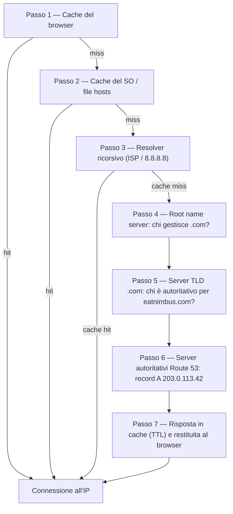

# Capitolo 12: Come Internet Ti Trova

Maya aggiornò ancora una volta nel browser il lungo indirizzo generato automaticamente dell'app, poi si appoggiò allo schienale e guardò il soffitto. La pagina si caricò. L'app funzionava. Ma ogni volta che condivideva il link con un ristorante partner, provava un piccolo imbarazzo che non riusciva bene a definire.

Quell'URL era un artefatto tecnico, non un prodotto.

---

*La riprogettazione della rete guidata da Priya nel capitolo precedente era andata bene. Ogni risorsa era al posto giusto — load balancer nelle subnet pubbliche, database chiusi in quelle private. L'infrastruttura era sicura e correttamente segmentata. Ma mentre Nimbus si preparava al suo primo lancio pubblico, era comparso un nuovo problema: l'URL del load balancer che AWS aveva assegnato automaticamente sembrava un identificatore di sistema, non un prodotto di cui le persone si sarebbero fidate. Avevano bisogno di un vero nome di dominio. E avevano bisogno di capire cosa succedeva tra il momento in cui qualcuno digitava `eatnimbus.com` e il momento in cui la pagina appariva.*

---

Nimbus era in esecuzione. Il load balancer aveva un indirizzo IP pubblico. Le istanze EC2 avevano un indirizzo IP privato. I database erano bloccati in subnet private. Priya aveva annuito approvando il diagramma di rete.

Tom guardava l'URL del load balancer: `nimbus-alb-123456789.us-west-2.elb.amazonaws.com`.

"È quello che i clienti digitano nel loro browser?" chiese.

"È quello che AWS assegna automaticamente," disse Maya.

"Non metterò questo su un biglietto da visita."

"Nemmeno io."

Avevano bisogno di un nome di dominio. Comprarono `eatnimbus.com` da un registrar di domini. Ora avevano bisogno di collegare quel nome alla loro infrastruttura AWS.

"Come fa Internet a sapere che `eatnimbus.com` significa il load balancer in us-west-2?" chiese Leo.

Buona domanda, Leo.

**L'Analogia dell'Elenco Telefonico**

Prima degli smartphone, ogni città aveva un elenco telefonico. Se volevi raggiungere la "Pizzeria Mario", non memorizzavi il loro numero di telefono — cercavi il nome, ottenevi il numero e chiamavi.

Internet ha il suo elenco telefonico: il **Domain Name System (DNS)**.

Il DNS traduce i nomi leggibili dall'uomo (come `eatnimbus.com`) in indirizzi IP leggibili dalle macchine (come `203.0.113.42`). Ogni volta che visiti un sito web, il tuo computer cerca silenziosamente il nome di dominio nel DNS e ottiene l'indirizzo IP a cui connettersi.

Se cambiassi l'indirizzo IP del tuo server, aggiorneresti il record DNS — come cambiare il tuo numero nell'elenco telefonico — e Internet ti troverebbe nella tua nuova posizione.

**Il Viaggio Completo della Risoluzione DNS**

"Ma *come* funziona davvero la ricerca?" chiese Leo. "Cioè, passo per passo. Il mio browser conosce il nome `eatnimbus.com`. Cosa succede dopo?"

La maggior parte della documentazione sorvola su questo punto. Invece conta.

Quando il tuo browser deve risolvere `eatnimbus.com`, ecco ogni passaggio, in ordine:

**Passo 1 — Cache del browser**: Il browser controlla se ha già risolto questo nome di recente. Se sì, usa l'IP in cache. Se no, si continua.

**Passo 2 — Cache del sistema operativo / resolver locale**: Il tuo sistema operativo controlla la propria cache DNS e il file `hosts` locale. Se trova la risposta, fatto. Se no, inoltra la richiesta al resolver DNS configurato — di solito quello del tuo ISP o uno pubblico come 8.8.8.8.

**Passo 3 — Resolver ricorsivo**: Il resolver ricorsivo (il tuo ISP o l'8.8.8.8 di Google) è il cavallo da tiro. Anche lui ha una cache. Se conosce la risposta, la restituisce immediatamente. Se no, avvia la vera catena di risoluzione.

**Passo 4 — Root name server**: Il resolver ricorsivo contatta uno dei 13 cluster di root name server (distribuiti in tutto il mondo). Il root server non sa dove si trova `eatnimbus.com`. Ma sa chi gestisce i domini `.com` — i server TLD `.com`. Restituisce il loro indirizzo.

**Passo 5 — Name server TLD (Top Level Domain)**: Il resolver ricorsivo contatta i server TLD `.com`. Nemmeno i server TLD sanno dove si trova `eatnimbus.com`. Ma sanno quali name server sono autoritativi per `eatnimbus.com` — i server che detengono effettivamente i record DNS. Restituiscono quegli indirizzi.

**Passo 6 — Name server autoritativi**: Il resolver ricorsivo contatta i name server di Route 53 — i name server autoritativi per `eatnimbus.com`. Route 53 ha i record veri e propri. Restituisce il record A: `eatnimbus.com → 203.0.113.42`. Questa risposta è autoritativa — è la risposta reale, non una copia in cache.

**Passo 7 — Risposta memorizzata in cache e restituita**: Il resolver ricorsivo mette in cache la risposta per la durata del TTL (Time-To-Live) del record. Restituisce l'IP al tuo browser. Il tuo browser lo mette in cache. Il tuo browser si connette.



"Sono sette passaggi solo per trovare un indirizzo IP," disse Tom.

"Di solito meno di 100 millisecondi in totale," disse Priya. "I passi dal 3 al 6 vengono messi in cache in modo aggressivo a ogni livello. Per i domini popolari, i passi 4 e 5 — le ricerche root e TLD — vengono spesso saltati del tutto perché il resolver ricorsivo ha già quei server in cache. L'intera catena di solito si esaurisce in 20–40 millisecondi."

"E dopo la prima ricerca, la cache del browser fa sì che le richieste successive saltino tutto quanto," aggiunse Leo.

"Esatto. Il DNS sembra istantaneo perché la maggior parte delle ricerche sono cache hit. La catena completa viene eseguita solo quando un record è nuovo o il suo TTL è scaduto."

**Ecco a Voi Route 53**

Amazon Route 53 è il servizio DNS gestito di AWS. Si chiama Route 53 perché la porta 53 è la porta DNS standard. (A volte AWS dà alle cose nomi semplici e diretti.)

Route 53 fa diverse cose:

**Registrazione di domini**: Puoi acquistare nomi di dominio direttamente tramite Route 53.

**Hosting DNS (hosted zone)**: Crei una *hosted zone* per il tuo dominio e Route 53 gestisce i record DNS che dicono al mondo dove trovarti.

**Health check**: Route 53 può monitorare i tuoi endpoint e allontanare il traffico da quelli non integri.

**Policy di routing del traffico**: Route 53 supporta più strategie di routing oltre al semplice DNS — ponderato, basato sulla latenza, geolocalizzazione, failover.

**Record DNS: Le Voci dell'Elenco Telefonico**

Un record DNS mappa un nome a una destinazione. I tipi più comuni:

**Record A**: Mappa un nome a un indirizzo IPv4.
`eatnimbus.com → 203.0.113.42`

**Record AAAA**: Mappa un nome a un indirizzo IPv6.

**Record CNAME**: Mappa un nome a un altro nome (un alias).
`www.eatnimbus.com → eatnimbus.com`

**Record MX**: Specifica quali server gestiscono la posta elettronica per il dominio.

**Record TXT**: Memorizza testo arbitrario. Comunemente usato per la verifica del dominio (dimostrare di possedere il dominio) e l'autenticazione della posta elettronica (SPF, DKIM).

Per Nimbus, la configurazione principale:

- `eatnimbus.com` → Record Alias che punta al load balancer
- `www.eatnimbus.com` → CNAME che punta a `eatnimbus.com`
- `api.eatnimbus.com` → Record Alias che punta al load balancer delle API

"Aspetta," disse Tom. "L'IP del load balancer può cambiare. AWS lo dice nella documentazione."

Bella osservazione, Tom.

**Record Alias: La Soluzione di AWS agli IP Dinamici**

I load balancer, le distribuzioni CloudFront e i siti web S3 hanno nomi DNS, non indirizzi IP statici. Gli IP sottostanti possono cambiare.

Se crei un CNAME che punta al nome DNS di un load balancer, funziona — ma non puoi usare i CNAME per i domini root (`eatnimbus.com` senza il `www`) a causa degli standard DNS.

Route 53 risolve questo con i **record Alias** — un'estensione del DNS specifica di AWS. Un record Alias mappa un nome direttamente a una risorsa AWS (load balancer, distribuzione CloudFront, sito web S3), e Route 53 gestisce automaticamente la risoluzione degli IP dinamici. I record Alias possono essere usati a livello di dominio root. E a differenza delle normali query DNS verso servizi esterni, le query dei record Alias verso risorse AWS sono gratuite.

"Quindi usiamo un record Alias per `eatnimbus.com` che punta al load balancer," confermò Leo.

"E Route 53 gestisce qualsiasi IP il load balancer stia usando in un dato momento," aggiunse Priya.

"Gratis," disse Tom, improvvisamente molto interessato. Aprì la pagina dei prezzi di Route 53. "E il resto?"

"Cinquanta centesimi per hosted zone," disse Leo. "Più circa quaranta centesimi per milione di query DNS. Per il nostro traffico attuale, probabilmente meno di due dollari al mese."

Tom chiuse la pagina dei prezzi soddisfatto.

**Policy di Routing: Più che un Semplice "Dove Si Trova?"**

È qui che Route 53 diventa interessante. Il DNS non è solo un servizio di ricerca — può essere uno strumento di gestione del traffico.

**Routing semplice**: Un record, una destinazione. DNS standard.

**Routing ponderato (weighted)**: Dividi il traffico tra più destinazioni in base a un peso. Invia il 90% al nuovo server, il 10% al vecchio durante una migrazione. Regola i pesi finché non sei sicuro del nuovo server, poi passa al 100%.

**Routing basato sulla latenza**: Instrada gli utenti verso la regione AWS con la latenza più bassa per loro. Un utente a Seattle viene instradato verso `us-west-2`. Un utente a Tokyo viene instradato verso `ap-northeast-1`. Stesso nome di dominio, destinazioni diverse.

**Routing basato sulla geolocalizzazione**: Instrada in base alla posizione geografica dell'utente. Tutti gli utenti europei vanno su `eu-west-1`. Tutti gli utenti nordamericani vanno su `us-east-1`. Utile per la sovranità dei dati (mantenere i dati degli utenti UE nelle regioni UE) o per la personalizzazione dei contenuti (lingua, valuta). Le decisioni di routing usano confini rigidi — un utente è in un paese, in un continente o in uno stato USA, e va lì.

**Routing geoproximity**: Instrada il traffico in base alla posizione geografica degli utenti *e* ti permette di regolare quelle decisioni con un valore di **bias**. Un bias positivo espande l'area geografica che viene instradata verso una risorsa — attirando più traffico. Un bias negativo la restringe. A differenza della geolocalizzazione, che usa confini rigidi per paesi e continenti, il geoproximity è continuo: un piccolo valore di bias può spostare gradualmente il traffico da una regione all'altra senza ridisegnare alcuna linea fissa.

Lo scenario che distingue i due: se un'azienda sta migrando gradualmente da `us-east-1` a `us-west-2` e vuole spostare il traffico verso ovest in modo incrementale — non premere un interruttore, ma regolare una manopola nel tempo — il geoproximity con un bias positivo crescente sull'endpoint ovest è lo strumento giusto. La geolocalizzazione instraderebbe tutti gli utenti della West Coast verso l'Oregon oppure no; non ha una manopola. Da gennaio 2024, il geoproximity è disponibile come policy di routing normale direttamente sui record DNS (Console, API, CLI) — non richiede più Route 53 Traffic Flow, anche se rimane disponibile anche lì.

**Routing di failover**: Designa un endpoint primario e uno secondario. Se il primario fallisce l'health check di Route 53, il traffico viene reindirizzato automaticamente al secondario. Questo è il livello DNS del disaster recovery.

"Aspetta — ma *perché* dovremmo configurare il routing di failover verso una seconda regione se abbiamo già il Multi-AZ?" chiese Maya. "Il Multi-AZ non dovrebbe gestire i guasti?"

Buona domanda. Il Multi-AZ protegge dal guasto di una singola Availability Zone all'interno di una regione — se un data center va giù, lo standby in un'altra AZ subentra. Ma cosa succede se un'intera regione AWS diventa non disponibile? O se c'è un'interruzione di servizio a livello di regione? Il routing di failover DNS opera a un livello diverso: allontana il traffico da un'intera regione quando l'health check di quella regione fallisce. Il Multi-AZ è resilienza intra-regione. Il failover DNS è resilienza inter-regione.

**Routing multivalue answer**: Restituisce fino a otto indirizzi IP integri per una query, lasciando scegliere al client. Una semplice alternativa a un load balancer per distribuire il traffico su più server.

"Quindi Route 53 non è solo un elenco telefonico," disse Maya. "È un elenco telefonico intelligente che può instradare le chiamate in base a da dove stai chiamando."

"E scollegarti se il numero non è integro," aggiunse Priya.

---

**Routing a Latenza Più Health Check: Un Esperimento Mentale**

Priya abbozzò uno scenario sulla lavagna. Supponiamo che la base utenti di Nimbus sulla East Coast continuasse a crescere, e che un giorno il team mettesse in piedi uno stack leggero in `us-east-1` (Virginia del Nord) — non un setup multi-regione attivo-attivo completo, che sarebbe costoso e complesso, ma un load balancer e un insieme di istanze EC2 in sola lettura che servono contenuti statici e pagine di navigazione. Gli ordini andrebbero comunque a ovest, verso il database primario in `us-west-2`. Il traffico di navigazione — che rappresentava il settanta percento delle richieste — potrebbe essere servito da entrambe le coste.

La configurazione Route 53 per l'endpoint di navigazione sarebbe così:

```
browse.eatnimbus.com
  → Record a latenza: ALB us-east-1 (con health check, set-identifier "east")
  → Record a latenza: ALB us-west-2 (con health check, set-identifier "west")
```

(Nota che il record è un *hostname*, `browse.eatnimbus.com` — il DNS instrada nomi, mai percorsi URL. Il routing basato sul percorso come `/browse` è compito del load balancer, non di Route 53.)

Con il routing a latenza, un utente a Seattle verrebbe risolto sull'endpoint `us-west-2`. Un utente a Boston andrebbe su `us-east-1`. Route 53 misura continuamente la latenza dalla sua infrastruttura verso ciascuna regione e sceglie la più veloce per ogni utente.

"Ma cosa succede se la regione ovest ha un problema?" chiese Tom. "I nostri utenti che navigano da Seattle resterebbero bloccati."

"È a questo che servono gli health check," disse Priya. "Ogni record a latenza riceve un health check sul rispettivo load balancer. Se l'health check di `us-west-2` fallisce tre controlli consecutivi, Route 53 smette di restituire quel record — anche per gli utenti per cui l'Oregon sarebbe normalmente più veloce. Gli utenti di Seattle vengono instradati a est finché l'Oregon non si riprende."

"Quindi il routing a latenza determina quale regione è normalmente preferita," disse Maya, "e gli health check sovrascrivono quella preferenza se la regione preferita va giù?"

"Esatto. La policy a latenza sceglie il vincitore in condizioni normali. Gli health check rimuovono un vincitore che ha smesso di funzionare."

Leo pensò allo scenario di guasto. "E il TTL su quei record?"

"Sessanta secondi," disse Priya. "Tre controlli falliti a intervalli di trenta secondi per far scattare il meccanismo — fino a novanta secondi per rilevare il guasto — poi fino a sessanta secondi perché i resolver DNS recepiscano il cambiamento."

"Due minuti e mezzo nel caso peggiore," disse Leo.

"Ed è per questo che si abbassa il TTL prima che ti serva, non dopo."

Questa combinazione — routing a latenza con health check su ogni record — è una delle configurazioni Route 53 più potenti per i deployment multi-regione. Gli utenti vanno sempre alla regione integra più veloce. Il sistema si auto-ripara quando una regione ha problemi. E il tutto è DNS: nessuna infrastruttura aggiuntiva, nessun server proxy, nessun load balancer tra le regioni.

---

**L'Incidente del Fallimento dell'Health Check**

L'ambiente di staging di Nimbus diede loro una dimostrazione accidentale del routing di failover.

Avevano configurato gli health check di Route 53 sul load balancer di staging come test — controllando l'endpoint `/health` ogni 30 secondi. Un venerdì pomeriggio, Leo fece un deployment su staging che conteneva un bug: l'endpoint di health iniziò a restituire errori 500. Aveva superato i suoi test locali ma si era rotto sul server.

Route 53 registrò i fallimenti. Dopo tre controlli consecutivi falliti, contrassegnò l'endpoint come non integro. Il record di failover si attivò, instradando il traffico di staging verso una pagina di fallback in sola lettura che diceva "Manutenzione in corso".

Il primo avviso per Leo fu un messaggio Slack di un QA engineer: "Staging mostra la pagina di manutenzione."

Leo controllò il deploy. Gli errori 500 erano evidenti nei log. Fece il rollback del deployment. Entro 90 secondi da quando l'endpoint di health era tornato a restituire 200, Route 53 rivalutò il controllo, vide tre successi consecutivi e riportò il traffico sul load balancer di staging. La pagina di manutenzione scomparve.

Tempo totale sulla pagina di manutenzione: sette minuti.

"Quello era il sistema che funzionava correttamente," disse Priya.

"Lo so," disse Leo. "La parte spaventosa è pensare a cosa sarebbe successo senza l'health check. Gli errori 500 sarebbero arrivati a utenti reali."

"In produzione, l'health check avrebbe fatto il failover verso la regione secondaria o la pagina di errore statica. Gli utenti avrebbero visto un'esperienza presidiata invece degli errori."

"Quanto tempo richiede effettivamente il failover?" chiese Maya. "Da quando l'health check fallisce a quando il DNS inizia a instradare diversamente?"

"L'intervallo dell'health check è di 30 secondi di default. Tre fallimenti consecutivi per far scattare il failover. Sono fino a 90 secondi per rilevare il problema. Poi il TTL del DNS — se è 60 secondi, la propagazione è un altro minuto."

"Quindi nel caso peggiore, circa tre minuti?"

"Più o meno. Ed è per questo che vuoi un TTL basso sui record critici, e un intervallo di health check il più breve che il tuo budget permette."

---

**Health Check: Instradare Aggirando i Guasti**

"E se qualcuno prova a entrare?" disse Priya. "Il DNS è pubblico. Chiunque può cercare dove punta `eatnimbus.com`. Significa che un attaccante sa esattamente quale IP colpire."

"È vero," disse Leo. "Ma l'IP che trova è l'IP del load balancer. L'ALB è l'unica cosa con un indirizzo pubblico. Tutto quello che c'è dietro — EC2, RDS, ElastiCache — è in subnet private. Il DNS gli dice qual è la porta d'ingresso. Non gli dice cosa c'è dietro."

Route 53 può monitorare i tuoi endpoint con gli health check. Se un endpoint fallisce, Route 53 può:

- Rimuoverlo dalle risposte DNS (smettere di inviare traffico lì)
- Attivare un failover verso un endpoint di backup
- Inviare un avviso tramite CloudWatch

Gli health check sono il collegamento tra il routing DNS e la salute effettiva dell'applicazione. In una configurazione di failover: Route 53 monitora l'endpoint primario ogni 30 secondi. Se tre controlli consecutivi falliscono, Route 53 inizia a restituire l'indirizzo dell'endpoint secondario. Nessuno di questi numeri è fisso: 30 secondi è l'intervallo standard (un'opzione "fast" a pagamento controlla ogni 10 secondi), e la soglia di fallimento è di default 3 controlli consecutivi ma è configurabile da 1 a 10.

Questo non è istantaneo — il DNS ha tempi di propagazione. Una volta che Route 53 cambia un record DNS, i resolver DNS in tutto il mondo devono recepire il cambiamento, il che può richiedere da secondi a minuti a seconda delle impostazioni del TTL.

**TTL: La Cache del DNS**

Le risposte DNS vengono messe in cache a più livelli — sul tuo router, presso il tuo ISP, nel tuo browser. Il **TTL (Time-To-Live)** su un record DNS dice alle cache per quanto tempo ricordare la risposta prima di controllare di nuovo.

TTL alto (1 ora o più): meno query DNS, meno carico su Route 53, ma i cambiamenti impiegano più tempo a propagarsi.

TTL basso (60 secondi o meno): i cambiamenti si propagano rapidamente, ma servono più query DNS.

Prima di una migrazione pianificata (aggiornare il DNS perché punti a un nuovo server), abbassa il TTL a 60 secondi con un giorno di anticipo. Poi, quando fai la modifica, si propaga in circa un minuto. Dopo la migrazione, rialzalo al valore normale.

"L'ho già deployato — oh." Leo aveva aggiornato il record DNS prima di abbassare il TTL. Si era reso conto dell'errore e aveva iniziato a contare: il vecchio TTL era di un'ora. Alcuni utenti avrebbero raggiunto il vecchio server per i successivi sessanta minuti.

"Se lo abbassiamo soltanto durante la migrazione e non prima," disse Leo lentamente, "il vecchio TTL significa che alcuni utenti vedranno il vecchio server per un'ora."

"Esattamente," disse Priya. "Le migrazioni DNS richiedono pianificazione prima della migrazione, non solo durante."

Potresti chiederti: se il TTL è impostato a un'ora, significa che ogni utente aspetterà un'ora piena dopo un cambiamento DNS prima di vedere il nuovo server? Non esattamente. Il TTL significa che i resolver non ricontrolleranno finché il TTL non scade. Se il resolver DNS di un utente ha messo in cache il vecchio valore 55 minuti fa con un TTL di 1 ora, otterrà il nuovo valore in 5 minuti. Se l'ha messo in cache 5 minuti fa, aspetterà 55 minuti. In media, gli utenti vedono il cambiamento entro metà della durata del TTL. Ecco perché abbassare il TTL in anticipo è così importante: riduce la finestra di propagazione del caso peggiore prima che il cambiamento avvenga.

---

**Private Hosted Zone: DNS Interno**

Priya sollevò un nuovo requisito due settimane dopo che il dominio pubblico era online.

"Le nostre istanze EC2 devono raggiungere il database," disse. "In questo momento stanno usando il nome DNS dell'endpoint RDS — `nimbus-prod.abc123.us-west-2.rds.amazonaws.com`. Funziona, ma è un nome DNS pubblico. Se mai volessimo cambiare la configurazione del nostro database, tutti i file di configurazione delle applicazioni andrebbero aggiornati."

"Potremmo usare un nome DNS privato," disse Leo. "Tipo `db.nimbus.internal`. Qualcosa che i nostri servizi usano internamente e che mappa a qualunque sia l'endpoint corrente del database."

"Esattamente. Le private hosted zone di Route 53."

Una **private hosted zone** è un dominio DNS che si risolve solo all'interno della tua VPC. Le query DNS esterne per `nimbus.internal` non ottengono risposta. Ma dall'interno della VPC, `db.nimbus.internal` si risolve nell'endpoint RDS.

La configurarono:

- Private hosted zone: `nimbus.internal`
- Record CNAME: `db.nimbus.internal → nimbus-prod.abc123.us-west-2.rds.amazonaws.com`
- Record CNAME: `cache.nimbus.internal → nimbus-cache.abc123.usw2.cache.amazonaws.com`
- Record A: `api.nimbus.internal → 10.0.10.5` (IP interno EC2 — i record A mappano nomi a indirizzi IP; i CNAME mappano nomi ad altri nomi. Qui va bene perché questa istanza mantiene un IP privato statico; per qualunque cosa dietro un Auto Scaling punteresti invece a un load balancer)

Ora la configurazione dell'applicazione recitava:

```
DATABASE_HOST=db.nimbus.internal
CACHE_HOST=cache.nimbus.internal
```

Quando migrarono a una nuova istanza RDS, aggiornarono un solo record DNS. Nessun deployment dell'applicazione richiesto.

"Ecco anche perché il DNS privato conta durante una migrazione del database," disse Priya. "Aggiorni `db.nimbus.internal` perché punti al nuovo endpoint. Il traffico si sposta. Il vecchio endpoint resta disponibile durante la finestra del TTL. Nessuna modifica alla configurazione delle applicazioni."

**La Storia del Debugging del DNS Interno**

Tre settimane dopo, Leo deployò un nuovo servizio — un worker in background — e quello non riusciva a raggiungere il database. Il worker era nella stessa VPC, nella stessa subnet privata dei server API. I server API riuscivano a raggiungere il database. Il worker no.

Controllò i security group. Il security group del worker aveva una regola in uscita per PostgreSQL. Il security group del database aveva una regola in entrata dal security group del worker. Tutto sembrava corretto.

Eseguì `nslookup db.nimbus.internal` dall'istanza del worker.

Nessuna risposta.

"La risoluzione DNS sta fallendo," disse a Priya.

Lei guardò la configurazione VPC dell'istanza del worker. "In quale VPC si trova effettivamente il worker? Le private hosted zone sono associate alle VPC — se l'istanza non è in una VPC associata, la zona semplicemente non esiste per lei."

"È nella VPC principale. Come tutto il resto."

"Davvero?"

Le private hosted zone devono essere esplicitamente associate a ogni VPC che servono — l'associazione è per VPC, mai per subnet. Priya aveva associato la VPC principale quando aveva creato la zona. Ma Leo aveva accidentalmente deployato il worker in una VPC di test che aveva creato per un esperimento diverso. VPC diversa. Non associata alla private hosted zone.

"Il worker è nella VPC sbagliata," disse Priya.

"L'ho già deployato — oh." Leo spostò il worker nella VPC corretta. Il DNS si risolse. Il worker si connesse al database.

"Una sola VPC," disse Leo, prendendo nota. "A meno che non abbiamo una ragione per averne più di una."

---

**DNSSEC: Autenticare le Risposte DNS**

"Abbiamo pensato allo spoofing DNS?" chiese Priya. "Cosa succede se qualcuno intercetta la nostra query DNS e restituisce un IP falso? I browser dei nostri utenti si connetterebbero al server dell'attaccante invece che al nostro."

Il **DNSSEC (DNS Security Extensions)** risolve questo problema firmando crittograficamente i record DNS. Quando una risposta DNS include una firma DNSSEC, il resolver può verificare che la risposta provenga dal name server autoritativo e non sia stata manomessa.

Route 53 supporta la firma DNSSEC per le hosted zone pubbliche. Il processo prevede:

1. Abilitare il DNSSEC sulla hosted zone in Route 53
2. Crei una chiave asimmetrica in KMS — l'argomento del Capitolo 16 — e la fornisci a Route 53 come key signing key (KSK); Route 53 non genera questa chiave per te
3. Route 53 firma tutti i record con la zone signing key
4. Aggiungi un record DS (Delegation Signer) presso il registrar del dominio padre (il TLD .com)
5. I resolver che supportano il DNSSEC possono ora verificare l'autenticità delle risposte

"Quanto è comune lo spoofing DNS?" chiese Leo.

"Sull'internet pubblico, raro ma possibile," disse Priya. "La maggior parte dei resolver degli ISP supporta la validazione DNSSEC oggi. Abilitare il DNSSEC non costa nulla e aggiunge un livello significativo di autenticità."

"Quanto costa al mese?" chiese Tom.

"Abilitare la firma DNSSEC in sé è gratuito in Route 53," disse Priya. "L'unico costo reale è la chiave KMS che contiene la key-signing key: $1/mese, più le chiamate API di KMS — e una chiave può essere condivisa tra più hosted zone. La protezione contro gli attacchi di hijacking DNS è di fatto gratuita alla nostra scala."

Tom la abilitò prima di pranzo.

---

**Route 53 Resolver: DNS Ibrido**

Quando alla fine Nimbus collegò la propria VPC AWS alla rete di sviluppo on-premises tramite una VPN, emerse un nuovo problema: i server on-premises dovevano risolvere i nomi DNS privati di AWS (come `db.nimbus.internal`), e le risorse AWS dovevano risolvere gli hostname on-premises (come `jenkins.corp.nimbus.local`).

La risoluzione DNS non attraversa i confini di rete di default. Le risorse AWS risolvono il DNS usando Route 53 Resolver (integrato in ogni VPC). I server on-premises usano i propri server DNS. Nessuno dei due può vedere i record dell'altro.

I **Route 53 Resolver Endpoint** colmano questo divario:

**Endpoint inbound**: I server DNS on-premises possono inoltrare le query per le zone DNS ospitate in AWS a un IP di endpoint inbound nella tua VPC. Route 53 Resolver gestisce la query e restituisce il risultato.

**Endpoint outbound**: Quando le istanze EC2 devono risolvere hostname on-premises, il Resolver inoltra quelle query ai server DNS on-premises attraverso l'endpoint outbound.

"Quindi è come un servizio di traduzione," disse Maya. "Il tuo DNS AWS e il tuo DNS on-premises non si parlano direttamente. Gli endpoint del Resolver fanno da intermediari."

"Esattamente. I tuoi server on-premises ora possono risolvere `db.nimbus.internal`. Le tue istanze EC2 possono risolvere `jenkins.corp.nimbus.local`. Entrambi i lati vedono i nomi DNS di entrambi i mondi."

Per Nimbus, questo divenne rilevante quando il team di sviluppo volle eseguire test di integrazione dal proprio ufficio contro un ambiente di staging in AWS. Senza i Resolver endpoint, avrebbero dovuto modificare manualmente i file hosts. Con quelli, il DNS interno funzionò e basta attraverso la VPN.

L'architettura dei Resolver endpoint:

- **Endpoint inbound**: Due ENI (Elastic Network Interface) create in due AZ diverse nella tua VPC. Ognuna riceve un IP privato. Configuri il tuo server DNS on-premises perché inoltri a questi IP le query per le tue zone ospitate in AWS. Il traffico viaggia attraverso la tua VPN o Direct Connect.
- **Endpoint outbound**: Due ENI in due AZ. Crei regole di inoltro: "le query per `corp.nimbus.local` vanno a questi IP di server DNS on-premises." Le istanze EC2 usano automaticamente il Resolver, che consulta le tue regole di inoltro e invia la query on-premises.

"Perché due ENI per endpoint?" chiese Leo.

"Alta disponibilità," disse Priya. "Se un'AZ perde la connettività di rete, l'IP dell'altro endpoint funziona ancora. Stesso principio dei NAT Gateway."

"Quanto costa al mese?" chiese Tom.

I Resolver endpoint costano circa $0.125 all'ora **per elastic network interface**, e ogni endpoint richiede almeno due ENI per la disponibilità — quindi una base realistica è di circa $180 al mese per endpoint, più $0.40 per milione di query DNS. Per un team che usa il DNS ibrido per risolvere nomi interni, il costo è modesto — ed elimina la necessità di mantenere file hosts su più macchine di sviluppo e sistemi CI/CD.

"Potremmo semplicemente mettere gli hostname nei file hosts," suggerì Leo.

"Su ogni macchina di sviluppo, ogni runner CI, ogni nuovo onboarding," disse Priya. "Ogni volta che qualcosa cambia."

"L'endpoint vale la spesa," disse Leo.

"La vale."

## Punti di Forza e Limitazioni

**Route 53 è la scelta giusta per**: registrare e gestire nomi di dominio interamente all'interno di AWS; instradare il traffico in base a latenza, geolocalizzazione o distribuzione ponderata su più endpoint; failover basato su health check tra regioni o tra un endpoint primario e uno di disaster recovery; integrare il DNS con altri servizi AWS tramite record alias; private hosted zone per il service discovery interno.

**Quando Route 53 non è quello che ti serve**: Route 53 è un servizio DNS, non un load balancer. Se devi distribuire il traffico tra più server o container all'interno di una regione, usa un Application Load Balancer — Route 53 non può fare round-robin ponderato a livello di connessione come può fare un load balancer. Il routing a latenza tra regioni aggiunge costi e complessità operativa che hanno senso solo quando i tuoi utenti sono genuinamente distribuiti a livello globale e i millisecondi contano per la conversione. Per la maggior parte delle applicazioni a singola regione, un singolo record Alias che punta a un ALB è tutta la configurazione Route 53 di cui hai bisogno.

## Riepilogo

Passare da `nimbus-alb-123456789.us-west-2.elb.amazonaws.com` a `eatnimbus.com` sembrava una piccola cosa. Non lo era. Il DNS è il sistema di indirizzamento su cui gira l'intero Internet, e Route 53 ti dà gli strumenti per usare quel sistema non solo per le ricerche, ma per la gestione del traffico e la resilienza.

- Il **DNS** traduce i nomi di dominio in indirizzi IP — l'elenco telefonico di Internet.
- **Route 53** è il servizio DNS gestito di AWS: registrazione di domini, hosting DNS, health check e policy di routing.
- I **record A** mappano i nomi a indirizzi IPv4. I **CNAME** mappano i nomi ad altri nomi. I **record Alias** mappano i nomi a risorse AWS (load balancer, CloudFront, S3).
- Usa i record Alias (non i CNAME) per i domini root e per le risorse con IP dinamici.
- Le policy di routing vanno oltre il DNS semplice: **ponderato** (suddivisione del traffico), **a latenza** (prestazioni), **geolocalizzazione** (sovranità dei dati — confini rigidi per paese/continente), **geoproximity** (basato sulla distanza con una manopola di bias — spostamento graduale del traffico), **failover** (disaster recovery).
- Le **private hosted zone** forniscono DNS interno per le risorse della VPC — comunicazione servizio-a-servizio per nome, non IP scritto nel codice.
- Il **DNSSEC** firma crittograficamente i record, proteggendo dallo spoofing DNS.
- I **Route 53 Resolver Endpoint** collegano le reti ibride — il DNS di AWS e quello on-premises possono risolvere i nomi l'uno dell'altro.

## Suggerimenti per l'Esame

*SAA-C03 Dominio: Progettare Architetture ad Alte Prestazioni (Dominio 3, Task 3.4)*

- **Alias vs CNAME**: I record Alias possono essere usati sul dominio root; i CNAME no. I record Alias verso risorse AWS sono gratuiti; le query DNS dei CNAME sono a pagamento. Quando l'esame chiede di mappare un dominio root a un load balancer → record Alias.
- **Casi d'uso delle policy di routing** (scenari comuni d'esame):
  - "Migrare gradualmente il traffico a una nuova versione" → Routing ponderato
  - "Instradare gli utenti verso la regione AWS più vicina" → Routing a latenza
  - "Mantenere i dati degli utenti UE nelle regioni UE" → Routing basato sulla geolocalizzazione
  - "Failover DNS automatico quando il primario va giù" → Routing di failover con health check
  - "Spostare gradualmente il traffico verso una nuova regione" o "aumentare il traffico attirato verso il nostro deployment UE" → Routing geoproximity con bias positivo
- **Geoproximity vs. Geolocalizzazione:** La geolocalizzazione instrada in base al paese/continente dell'utente con confini rigidi. Il geoproximity instrada in base alla distanza geografica con un bias configurabile — usalo quando devi spostare gradualmente il traffico verso una nuova regione o attirare più utenti verso un deployment specifico. Disponibile come policy di routing normale sui record da gennaio 2024 (Traffic Flow non più richiesto).
- **Health check di Route 53**: Possono controllare endpoint HTTP/HTTPS/TCP e possono attivare allarmi CloudWatch. L'esame li usa negli scenari di disaster recovery.
- **TTL e propagazione**: Sappi che il TTL controlla per quanto tempo i resolver DNS mettono in cache un record. TTL breve = cambiamenti più rapidi. Scenario d'esame: "il team ha aggiornato il DNS ma gli utenti stanno ancora raggiungendo il vecchio server" → TTL troppo alto.
- **Private hosted zone**: Route 53 può creare record DNS che si risolvono solo all'interno di una VPC. L'esame le usa per il service discovery interno (ad esempio, `database.internal` che si risolve in un endpoint RDS privato).
- Route 53 è **globale** — non è deployato in una regione. Non serve selezionare una regione quando si creano le hosted zone.
- **Route 53 Resolver Endpoint**: Usati negli scenari ibridi in cui il DNS on-premises e quello AWS devono risolvere i nomi l'uno dell'altro. Endpoint inbound per on-premises → AWS. Endpoint outbound per AWS → on-premises.

## Esercizi

**Esercizio 1 — Richiamo**

Spiega la differenza tra un record CNAME e un record Alias. Quando useresti ciascuno dei due?

*(Suggerimento: Nell'elenco telefonico di Internet, un CNAME è una voce che dice "vedi quest'altro nome", mentre una voce Alias segue sempre il punto in cui la risorsa AWS si trova in quel momento.)*

**Esercizio 2 — Scenario SAA-C03**

*Scenario*: Una società di media gestisce un sito web da due regioni AWS: `us-east-1` (primaria) e `eu-west-1` (secondaria). Il team vuole che il traffico venga instradato automaticamente verso `eu-west-1` se la regione primaria diventa non disponibile. L'azienda vuole anche verificare che questo meccanismo di failover funzioni correttamente senza mettere effettivamente fuori servizio la regione primaria.

Quale configurazione di Route 53 soddisfa MEGLIO questi requisiti?

A) Routing ponderato con peso del 100% su `us-east-1` e peso dello 0% su `eu-west-1`  
B) Routing a latenza con health check su entrambi gli endpoint  
C) Routing di failover con un health check sull'endpoint primario e un record secondario che punta a `eu-west-1`  
D) Routing basato sulla geolocalizzazione con il Nord America che punta a `us-east-1` e l'Europa che punta a `eu-west-1`

**Suggerimento 1**: Il requisito è il failover automatico quando il primario va giù. Quale policy di routing è progettata esattamente per questo?

**Suggerimento 2**: "Testare senza mettere fuori servizio la regione primaria" — gli health check possono essere impostati manualmente su "non integro" per i test.

**Suggerimento 3**: Il routing a latenza ottimizza per la velocità, non per il failover.

**Risposta**: C

**Spiegazione**: Il routing di failover è progettato esattamente per questo caso d'uso. Il record primario punta a `us-east-1` con un health check. Il record secondario punta a `eu-west-1`. Se l'health check fallisce, Route 53 serve automaticamente il record secondario. Gli health check possono essere forzati manualmente a fallire per i test senza interrompere effettivamente la regione primaria.

**Perché non A?** Il routing ponderato con 100%/0% è di fatto statico — non commuta automaticamente quando il primario fallisce.

**Perché non B?** I record a latenza *con health check* smettono effettivamente di restituire un endpoint non integro, quindi B sopravvivrebbe a un'interruzione reale. Ma cambia il pattern di traffico normale (gli utenti verrebbero suddivisi tra le regioni in base alla latenza, non primario/secondario come richiesto) e non ha un modo pulito per *testare* il failover: dovresti far fallire davvero l'health check del primario in produzione. Il routing di failover modella l'intento dichiarato — primario designato, secondario designato, testabile forzando lo stato dell'health check.

**Perché non D?** Il routing basato sulla geolocalizzazione instrada in base alla posizione dell'utente, non alla salute dell'endpoint. Gli utenti europei rimarrebbero bloccati su `eu-west-1` anche se `us-east-1` è integro, e gli utenti nordamericani non passerebbero a `eu-west-1` anche se `us-east-1` va giù.

*SAA-C03 Dominio: Progettare Architetture ad Alte Prestazioni — Task 3.4*

**Esercizio 3 — Sfida di Architettura**

Nimbus si sta espandendo a livello internazionale. Vogliono che `eatnimbus.com` si carichi rapidamente per gli utenti della West Coast, della East Coast e dell'Australia. Hanno anche un requisito normativo: gli ordini effettuati da utenti europei devono essere elaborati da server nell'UE.

Progetta una strategia di routing Route 53 che soddisfi entrambi i requisiti. Quale policy di routing o combinazione di policy useresti? Quale infrastruttura ti servirebbe in ciascuna regione?

*(Non esiste un'unica risposta corretta. L'obiettivo è esercitarsi nella progettazione del routing multi-regione.)*

## Scena Post-Crediti

`eatnimbus.com` era online.

Maya l'aveva digitato nel suo browser, e la pagina di ordinazione di Nimbus si era caricata. Aveva ordinato un'arepa dal ristorante della sua stessa famiglia, solo per testare il flusso. L'ordine era andato a buon fine. La cucina l'aveva ricevuto.

Si appoggiò allo schienale.

Tom stava già leggendo i log degli health check di Route 53. "Il tempo di risposta è di 18 millisecondi dai checker di us-west-2."

"È veloce?" chiese Maya.

"Per il DNS? Sì. Anche per gli utenti di Seattle — sono praticamente porta a porta con l'Oregon."

"Ma per un utente a Boston?"

Tom guardò il grafico della latenza. "Circa 80 millisecondi."

Maya ci pensò su. "Se i nostri partner della East Coast continuano a crescere, e i nostri server sono in Oregon..."

"Ogni richiesta viaggia da Boston all'Oregon e ritorno," disse Leo dall'altra parte della stanza. "Velocità della luce. Non si può battere la fisica."

"Quindi ci servono server più vicini a Boston."

"O qualcosa di più vicino a Boston che serva i contenuti per loro conto."

Quel pensiero rimase sospeso nell'aria.

Nel prossimo capitolo: i magazzini che mettono i contenuti di Nimbus a un millisecondo da ogni utente, ovunque.
