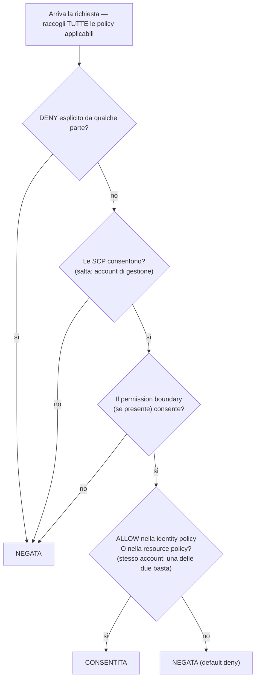

# Capitolo 14: Chi Ha il Diritto di Fare Cosa

I nuovi ingegneri iniziavano lunedì. Soo-Jin e Rafael. Maya stava pensando alla loro prima settimana — a cosa avrebbero avuto bisogno di accedere, cosa non avrebbero dovuto toccare, e se la configurazione dei permessi fosse anche solo pronta per essere estesa ad altre due persone.

Si sedette con un caffè prima che l'ufficio si riempisse, facendo una lista.

---

*CloudFront era deployato. Gli hit rate della cache erano buoni. Le prestazioni erano migliorate. Ma mentre Maya si preparava ad accogliere nuovi ingegneri, era emerso un problema silenzioso: la configurazione IAM era stata costruita da persone di fretta. Le chiavi di accesso erano nei file di configurazione. Alcuni ruoli avevano più permessi del necessario. E due nuove persone stavano per ricevere le credenziali di un sistema di produzione che non era stato progettato pensando a più utenti.*

---

Tom aveva le chiavi di accesso aperte in un file di testo, pronte da incollare.

"Cosa stai facendo?" chiese Priya.

"L'istanza EC2 deve leggere i file di configurazione da S3. Sto mettendo le credenziali nella configurazione del server."

Lei guardò lo schermo per un momento. "Chiudi quel file."

"Stavo giusto—"

"Se qualcuno entra in quel server," disse, "ottiene quelle chiavi. E quelle chiavi toccano qualunque cosa l'utente IAM sia autorizzato a toccare. Che probabilmente è più del solo S3."

Tom chiuse il file.

"C'è un modo migliore," disse lei. "Il server stesso può avere un ruolo. Pensalo come una qualifica professionale — l'istanza non ha bisogno di credenziali perché il sistema sa già cos'è e cosa le è permesso fare."

Tom sembrava scettico. "Quindi il server si autentica da solo?"

"Sì. Senza password. Senza chiavi in un file di configurazione. Senza nulla che possa finire accidentalmente in un commit su git."

Quell'ultima frase colpì nel segno. Tom stesso aveva quasi committato una chiave di accesso nel repository due settimane prima — l'aveva beccata nel diff all'ultimo secondo. Aprì una nuova scheda del browser.

**Rivisitare IAM: Il Quadro Completo**

Il Capitolo 3 ha introdotto IAM: utenti, gruppi, ruoli e policy. Ora è il momento di andare più a fondo.

Le policy IAM sono documenti JSON che specificano quali azioni sono consentite o negate su quali risorse. Hanno questo aspetto:

```json
{
  "Version": "2012-10-17",
  "Statement": [
    {
      "Effect": "Allow",
      "Action": [
        "s3:GetObject",
        "s3:PutObject"
      ],
      "Resource": "arn:aws:s3:::nimbus-assets/*"
    }
  ]
}
```

Questa policy consente di leggere e scrivere oggetti nel bucket `nimbus-assets`, e nient'altro. Non eliminare. Non elencare i bucket. Nessun'altra operazione S3. Nessun altro servizio AWS.

Questo è il modo corretto di concedere i permessi: azioni specifiche, risorse specifiche.

**Il Problema di "Administrator Access"**

Le policy gestite da AWS come `AdministratorAccess` sono progettate per partire in fretta. Non sono progettate per gestire sistemi di produzione con veri membri del team.

`AdministratorAccess` concede ogni azione su ogni risorsa. Se un membro del team con questa policy commette un errore — elimina accidentalmente un bucket S3, termina l'istanza EC2 sbagliata, modifica le regole dei security group — AWS non può fare nulla per fermarlo. Il permesso era stato concesso.

Se le credenziali di un membro del team vengono compromesse (attacco di phishing, chiave di accesso trapelata, furto del laptop), l'attaccante ha accesso da amministratore a tutto ciò che è nel tuo account AWS.

"Quindi cosa dovrebbe avere Soo-Jin?" chiese Leo.

"Cosa deve fare Soo-Jin?" rispose Priya.

"Deployare l'API. Controllare i log. Nient'altro."

"Allora riceve: la possibilità di fare push sulla pipeline del codice, l'accesso in lettura ai log di CloudWatch, e nient'altro."

"È... molto specifico."

"Sì. È proprio questo il punto."

**Ruoli IAM: Identità per i Servizi**

Il Capitolo 3 ha introdotto i ruoli come modo per le istanze EC2 di accedere ai servizi AWS senza memorizzare credenziali. Rendiamolo concreto.

Le tue istanze EC2 che eseguono l'API di Nimbus devono:

- Leggere da DynamoDB (il menu)
- Scrivere su DynamoDB (gli ordini)
- Mettere oggetti in S3 (ricevute, upload)
- Scrivere i log su CloudWatch
- Leggere i segreti da Secrets Manager

Invece di creare un utente con una chiave di accesso e memorizzare quella chiave sull'istanza EC2 (un incubo di sicurezza — le chiavi di accesso possono essere lette da chiunque abbia accesso SSH), crei un **ruolo IAM** per l'istanza EC2 con esattamente questi permessi.

"Aspetta — ma *perché* dovremmo farlo in questo modo?" chiese Maya. "L'istanza EC2 esegue già il nostro codice. Perché non dare semplicemente al codice una chiave di accesso?"

Perché le chiavi di accesso sono credenziali statiche che vivono da qualche parte — in un file di configurazione, in una variabile d'ambiente, in un repository git se qualcuno commette un errore. Possono essere copiate, esfiltrate, committate per sbaglio. Un ruolo IAM funziona diversamente: l'istanza EC2 assume il ruolo automaticamente. AWS fornisce credenziali temporanee attraverso il servizio di metadati dell'istanza. Le credenziali ruotano automaticamente — scadono ogni poche ore e vengono rinnovate senza alcuna azione da parte tua. Non c'è nulla da far trapelare, perché non c'è nulla di memorizzato.

"E se qualcuno hackerasse l'istanza EC2?" chiese Leo.

"Può fare quello che il ruolo dell'EC2 consente," disse Priya. "Cioè leggere il menu, scrivere ordini e inviare log. Non può eliminare il bucket S3. Non può terminare istanze EC2. Non può toccare IAM."

"Perché il ruolo dell'EC2 non ha quei permessi."

"Esattamente."

---

**Come Funziona l'Assunzione del Ruolo da Parte di EC2, Passo per Passo**

"C'è qualcosa che non torna," disse Maya. "Se non ci sono credenziali memorizzate sull'istanza, come fa l'istanza a dimostrare ad AWS chi è? Da qualche parte una credenziale deve esserci."

C'è. Ma è temporanea, ruotata automaticamente, e accessibile solo dall'interno dell'istanza.

Quando un'istanza EC2 si avvia con un ruolo IAM associato, AWS fa quanto segue:

**Passo 1**: AWS STS (Security Token Service) genera credenziali temporanee — un access key ID, una secret access key e un session token. Per i ruoli delle istanze EC2 queste sono tipicamente valide per circa sei ore, e AWS le ruota automaticamente prima che scadano.

**Passo 2**: AWS rende queste credenziali disponibili a un indirizzo IP speciale: `169.254.169.254`. Questo è il **servizio di metadati dell'istanza** (IMDS). È raggiungibile solo dall'interno dell'istanza EC2. Nulla al di fuori dell'istanza può accedervi.

**Passo 3**: Quando il codice della tua applicazione chiama un qualsiasi SDK AWS (boto3, l'SDK Java, l'SDK Node.js), l'SDK interroga automaticamente l'endpoint di metadati dell'istanza:

```
GET http://169.254.169.254/latest/meta-data/iam/security-credentials/{role-name}
```

**Passo 4**: L'SDK riceve le credenziali temporanee e le usa per firmare la richiesta API — per esempio, una richiesta di lettura da S3.

**Passo 5**: AWS convalida le credenziali, controlla la policy IAM associata al ruolo, e consente o nega la richiesta.

**Passo 6**: Poco prima che le credenziali scadano, l'istanza EC2 le rinnova automaticamente dal servizio di metadati. Il codice dell'applicazione non deve mai gestire questo passaggio — l'SDK lo fa in modo trasparente.

L'intero processo è invisibile allo sviluppatore. Tu scrivi `s3.get_object(...)`. L'SDK gestisce il resto.

"Quindi la credenziale esiste," disse Maya. "È solo temporanea, si auto-ruota, ed è confinata all'endpoint dei metadati dell'istanza."

"Ed è per questo che è molto più sicura di una chiave di accesso statica," disse Priya. "Una chiave statica, una volta rubata, è valida finché qualcuno non la ruota manualmente. Una credenziale temporanea rubata scade da sola — nel giro di ore, non di mesi."

"E se qualcuno dentro l'istanza interroga l'endpoint dei metadati?"

"Può ottenere la credenziale temporanea corrente. È un rischio reale, ed è per questo che AWS ha introdotto IMDSv2 — Instance Metadata Service versione 2. IMDSv2 richiede che il chiamante ottenga prima un session token tramite una richiesta PUT. Questo previene una classe di attacchi chiamata Server-Side Request Forgery, in cui del codice malevolo inganna il server inducendolo a richiamare l'URL dei metadati per conto dell'attaccante."

Leo aggiornò la configurazione di lancio delle EC2 per imporre IMDSv2. Una sola impostazione, applicata al momento del lancio.

---

**Assunzione di Ruolo: Come i Servizi Diventano Altri Servizi**

I ruoli possono essere assunti da:

- **Servizi AWS** (EC2, Lambda, task ECS, ecc.)
- **Utenti IAM** nel tuo stesso account (elevazione di ruolo — assumi un ruolo con più permessi per un compito specifico)
- **Utenti IAM in altri account AWS** (accesso cross-account — l'account di un'altra organizzazione può assumere un ruolo nel tuo)
- **Identity provider esterni** (Google, Active Directory, Okta — accesso federato per gli utenti umani)

"Abbiamo pensato a cosa succede se Nimbus usa un servizio di terze parti che ha bisogno di accedere alle nostre risorse AWS?" chiese Priya. "Un fornitore esterno di analytics, per esempio. Non vogliamo creare un utente IAM per loro e consegnargli una chiave di accesso."

"Ruoli cross-account," disse Leo. "Creiamo un ruolo nel nostro account e scriviamo una trust policy che dice 'questo specifico account esterno è autorizzato ad assumere questo ruolo.' Loro usano le proprie credenziali per assumere il ruolo e ottengono accesso temporaneo. Nessuna chiave da gestire, nessuna chiave da far trapelare."

Quest'ultimo pattern — la **federazione delle identità** — è il modo in cui le grandi organizzazioni danno ai propri dipendenti l'accesso ad AWS senza creare singoli utenti IAM per ogni persona. L'Active Directory della tua azienda ha le tue credenziali. Quando accedi ad AWS, ti autentichi contro Active Directory, e AWS ti concede un ruolo.

---

**Accesso Cross-Account: Lo Scenario del Team di Contabilità**

Sei mesi dopo, Nimbus ingaggiò uno studio di contabilità per aiutare con la rendicontazione finanziaria. Il team di contabilità aveva bisogno di accesso in lettura ai dati di fatturazione nel bucket S3 di fatturazione di Nimbus — ma operava dal proprio account AWS separato. Nimbus non voleva creare un utente IAM per loro. Consegnare a qualcuno di un'azienda esterna una chiave di accesso statica sembrava esattamente la cosa sbagliata.

"Ruolo cross-account," disse Priya.

La configurazione ha tre parti:

**Parte uno**: Nell'account Nimbus, crea un ruolo IAM — chiamiamolo `AccountingReadRole`. Associa una policy che consente `s3:GetObject` e `s3:ListBucket` sul bucket S3 di fatturazione. Nient'altro.

**Parte due**: Aggiungi una trust policy ad `AccountingReadRole`. La trust policy dice quale identità esterna è autorizzata ad assumere questo ruolo:

```json
{
  "Version": "2012-10-17",
  "Statement": [{
    "Effect": "Allow",
    "Principal": {
      "AWS": "arn:aws:iam::ACCOUNTING-FIRM-ACCOUNT-ID:role/AccountingAppRole"
    },
    "Action": "sts:AssumeRole"
  }]
}
```

Questa dice: solo quel ruolo specifico nell'account AWS dello studio di contabilità può assumere questo ruolo. Nessun altro.

**Parte tre**: Nell'account dello studio di contabilità, la loro applicazione usa `sts:AssumeRole` per ottenere credenziali temporanee per `AccountingReadRole`. Quelle credenziali sono limitate solo a ciò che `AccountingReadRole` consente. L'applicazione di contabilità può leggere i file di fatturazione. Non può scriverci. Non può toccare nient'altro nell'account Nimbus.

C'è un ulteriore passo di rafforzamento esattamente per questo scenario — ed è un argomento d'esame con un nome preciso. Lo studio di contabilità serve molti clienti. Supponiamo che un loro cliente malintenzionato venga a conoscenza dell'ARN dell'`AccountingReadRole` di Nimbus e chieda al software dello studio di "analizzarlo". Il software dello studio ha il permesso legittimo di assumere ruoli — potrebbe essere ingannato e indotto ad accedere ai dati di Nimbus per conto del cliente sbagliato. Questo è il **confused deputy problem**, e la soluzione è l'**ExternalId**: Nimbus genera un valore segreto univoco, lo inserisce nella trust policy come condizione (`"sts:ExternalId": "nimbus-7f3a..."`), e lo condivide solo con lo studio di contabilità. Il software dello studio deve passare quell'ExternalId in ogni chiamata `AssumeRole`, e usa un ExternalId *diverso* per ogni cliente — così una richiesta fatta per conto del cliente sbagliato fallisce. Trigger d'esame: "una terza parte ha bisogno di accesso cross-account" → ruolo + trust policy + **ExternalId**. Mai un utente IAM con chiavi condivise.

"E se dobbiamo revocare il loro accesso?" chiese Tom.

"Elimini la trust policy o elimini il ruolo," disse Priya. "Fatto. Nessuna credenziale da rintracciare, nessuna chiave da disattivare. Il ruolo è l'accesso. Rimuovi il ruolo, e l'accesso è sparito."

"E possiamo vedere in CloudTrail ogni volta che l'hanno usato," aggiunse Leo.

"Ogni chiamata API che hanno fatto, registrata. Quale bucket, quale file, a che ora, con quale risultato."

Tom annotò il pattern. Sarebbe tornato utile — ogni partner di integrazione, ogni fornitore esterno, ogni strumento di terze parti che avesse bisogno di accesso ad AWS avrebbe ricevuto un ruolo con una trust policy, non un utente con una chiave di accesso.

---

**Valutazione delle Policy IAM: La Logica Decisionale**

"Abbiamo pensato a cosa succede quando più policy si applicano alla stessa richiesta?" chiese Priya. "Un utente IAM ha una policy. La risorsa a cui sta accedendo ha una resource policy. Potrebbe esserci una SCP. Come decide AWS?"

La cosa importante da capire è che AWS **non** controlla le policy un tipo alla volta, in sequenza. Raccoglie *tutte* le policy che si applicano alla richiesta — identity-based, resource-based, SCP, permission boundary, session policy — e applica un insieme di regole all'intero mucchio in una volta sola:

**Regola 1 — Il deny esplicito vince, sempre.** Se una qualsiasi policy applicabile — IAM, resource-based, SCP o boundary — nega esplicitamente l'azione, la richiesta è negata. Nulla può sovrascrivere un deny esplicito.

**Regola 2 — Le SCP e i permission boundary agiscono come filtri.** Non concedono mai nulla. L'azione deve essere *consentita* da ogni SCP applicabile e dal permission boundary (se esiste), altrimenti è negata — indipendentemente da cosa dicono le altre policy.

**Regola 3 — All'interno dello stesso account, un solo allow è sufficiente.** Un allow esplicito *o* nella policy IAM dell'identità *o* nella policy della risorsa consente l'azione. Sono un'unione, non una sequenza — la resource policy non viene valutata "prima" della policy IAM.

**Regola 4 — Default deny.** Se nulla consente esplicitamente l'azione, è negata.



Il risultato: deny esplicito ovunque = negata. Nessun allow da nessuna parte = negata. Un allow dalla identity policy *o* dalla resource policy = consentita, purché nessun deny, SCP o boundary la blocchi.

Un altro fatto che l'esame adora: **le SCP non si applicano all'account di gestione dell'organizzazione** (né ai service-linked role). Una SCP che dice "niente EC2 fuori da us-west-2" vincola ogni account membro — ma l'account di gestione resta intatto. Questo è uno dei motivi per cui AWS ti dice di tenere i carichi di lavoro completamente fuori dall'account di gestione.

Una sfumatura che fa inciampare i candidati all'esame: per l'**accesso cross-account**, una resource-based policy nell'account di destinazione non basta da sola. Anche l'identità nell'account di origine ha bisogno di un permesso esplicito nella propria policy IAM per eseguire l'azione. Se concedi una bucket policy S3 che consente all'Account B di leggere i tuoi oggetti, ma gli utenti IAM dell'Account B non hanno alcuna policy IAM che permette `s3:GetObject`, l'accesso è comunque negato. Entrambi i lati devono consentire l'azione — la resource policy apre la porta sul lato di destinazione, e la policy IAM nell'account di origine dà all'utente il permesso di attraversarla.

"Quindi se la SCP di Priya dice 'niente EC2 in eu-west-1', e la sua policy IAM dice 'consenti tutte le azioni EC2', lei non può comunque creare un'istanza in eu-west-1?" chiese Leo.

"Corretto," disse Priya. "La SCP filtra ciò che è possibile prima che le policy IAM vengano valutate. Entrambe devono essere d'accordo perché un'azione riesca."

"E un deny esplicito in una policy IAM sovrascrive un allow esplicito in una resource policy?"

"Sempre. Un deny esplicito in qualsiasi punto della catena vince."

---

**Permission Boundary: Limitare Ciò che i Ruoli Possono Concedere**

Ecco un problema sottile ma importante: di default, IAM non impedisce a un utente di concedere permessi che attualmente non possiede.

Se Soo-Jin ha `iam:CreatePolicy` e `iam:AttachUserPolicy`, potrebbe creare una policy che concede l'accesso in scrittura a S3 e attaccarla a se stessa — anche se le sue policy esistenti consentono solo la lettura di S3. Questa classe di vulnerabilità si chiama **privilege escalation**, ed è esattamente il motivo per cui esistono i permission boundary.

Ma cosa succede se vuoi delegare la creazione di permessi IAM a un team lead, assicurandoti al contempo che non possa concedere più di quanto previsto?

I **permission boundary** impostano i permessi massimi che possono mai essere concessi a un'identità. Anche se le policy attaccate all'identità sono più ampie, i permessi effettivi sono limitati dal permission boundary.

Esempio: dai a un team lead una policy che gli consente di creare ruoli IAM. Ma attacchi un permission boundary che dice "i ruoli creati da questo team lead non possono mai avere il permesso di eliminazione su S3". Anche se il team lead crea un ruolo con accesso completo a S3, il boundary impedisce che l'eliminazione su S3 abbia effetto.

Potresti chiederti: qual è la differenza tra un permission boundary e una Service Control Policy? Sembrano simili — entrambi limitano quali permessi possono essere effettivi. La distinzione è l'ambito. Un permission boundary si applica a una specifica identità IAM (un utente o un ruolo) e limita ciò che quell'identità può mai fare. Una SCP si applica a un intero account AWS o a un'unità organizzativa — è un guardrail a livello di organizzazione che riguarda ogni identità nell'account, amministratori inclusi. Usa i permission boundary quando deleghi la gestione di IAM a un team lead. Usa le SCP quando ti servono regole a livello di organizzazione che nessuno in un account può scavalcare.

Questo è un concetto avanzato, ma compare all'esame e riflette il modo in cui le organizzazioni delegano la gestione di IAM su larga scala.

**Un Permission Boundary Concreto: Delegare la Creazione di Ruoli in Sicurezza**

Nimbus stava crescendo. Soo-Jin propose che a ogni ingegnere senior del team di piattaforma fosse consentito creare ruoli IAM per le funzioni Lambda di cui era responsabile — senza richiedere che Priya approvasse ciascuna di esse.

"Il rischio," disse Priya, "è che un ingegnere senior crei un ruolo Lambda con `AdministratorAccess` — per errore o per non averci pensato abbastanza."

"Quindi usiamo i permission boundary," disse Soo-Jin.

Priya creò una policy di permission boundary chiamata `NimbusDeveloperBoundary`:

```json
{
  "Version": "2012-10-17",
  "Statement": [
    {
      "Effect": "Allow",
      "Action": [
        "s3:GetObject", "s3:PutObject",
        "dynamodb:GetItem", "dynamodb:PutItem", "dynamodb:Query",
        "cloudwatch:PutMetricData", "logs:CreateLogGroup",
        "logs:CreateLogStream", "logs:PutLogEvents",
        "secretsmanager:GetSecretValue",
        "xray:PutTraceSegments"
      ],
      "Resource": "*"
    }
  ]
}
```

Poi consentì a ogni ingegnere senior di creare ruoli, ma solo se attaccava questo boundary:

```json
{
  "Effect": "Allow",
  "Action": ["iam:CreateRole", "iam:AttachRolePolicy"],
  "Resource": "*",
  "Condition": {
    "StringEquals": {
      "iam:PermissionsBoundary": "arn:aws:iam::ACCOUNT_ID:policy/NimbusDeveloperBoundary"
    }
  }
}
```

Senza la condizione, un ingegnere potrebbe creare un ruolo con qualsiasi permesso. Con la condizione, ogni ruolo che crea deve avere `NimbusDeveloperBoundary` attaccato. Un ruolo con `AdministratorAccess` più `NimbusDeveloperBoundary` ha l'intersezione dei due — di fatto solo i servizi elencati nel boundary.

"Quindi possono creare ruoli," disse Leo, "ma quei ruoli non potranno mai fare più che leggere da S3, scrivere su DynamoDB e mandare log a CloudWatch."

"Corretto. Non possono creare ruoli che toccano IAM. Non possono creare ruoli che eliminano istanze EC2. Il boundary definisce il tetto massimo."

"E se si dimenticano di attaccare il boundary?"

"La condizione impedisce alla chiamata `CreateRole` di riuscire. La creazione fallisce a meno che il boundary non sia incluso."

Priya fece l'esercizio insieme a Soo-Jin. Venti minuti di configurazione. Il risultato: gli ingegneri potevano creare in autonomia i ruoli per le loro Lambda senza una revisione di sicurezza per ogni deployment, e il team di piattaforma manteneva la certezza che nessuna funzione Lambda avrebbe mai avuto più dei permessi definiti.

**IAM Access Analyzer: Verificare i Permessi**

Priya passò due giorni a rivedere la configurazione IAM del team. Trovò:

- L'utente personale di Leo aveva accesso da amministratore
- Una vecchia funzione Lambda aveva i permessi per leggere tutti i bucket S3 (un residuo di un test)
- Un ruolo di servizio aveva accesso in scrittura a tabelle DynamoDB che non esistevano più

Questo è normale. Le configurazioni IAM accumulano scorie nel tempo.

**IAM Access Analyzer** è un servizio AWS che identifica automaticamente le risorse (bucket S3, ruoli IAM, chiavi KMS, funzioni Lambda, code SQS) accessibili dall'esterno del tuo account AWS. Include anche una funzionalità di validazione delle policy che le confronta con le best practice IAM, e una funzionalità di generazione delle policy che crea policy a privilegio minimo analizzando gli eventi di CloudTrail.

"Quanto costa al mese?" chiese Tom, alzando lo sguardo dal browser.

"L'analisi dell'accesso esterno è gratuita," disse Priya. "Gira continuamente e riporta i risultati nella console. L'analisi degli accessi inutilizzati — che identifica ruoli e permessi che non sono stati usati di recente — costa circa $0.20 per ruolo IAM analizzato al mese."

Tom tornò al suo browser.

I risultati sull'accesso esterno sono i più immediatamente preziosi. Quando Priya abilitò Access Analyzer, trovò due cose:

Primo, il bucket S3 `nimbus-receipts` aveva una bucket policy che consentiva la lettura da uno specifico account AWS esterno — l'account di un consulente che aveva aiutato a costruire la prima funzionalità di esportazione delle ricevute otto mesi prima. Il consulente non collaborava più con loro. La bucket policy non era mai stata ripulita.

"Otto mesi di accesso che nessuno aveva voluto," disse Priya.

"Stavano ancora accedendo?" chiese Tom.

Leo aprì i log di accesso di S3. Nessuna richiesta da quell'account negli ultimi sei mesi. Ma il permesso era lì. Access Analyzer l'aveva fatto emergere; nessuno l'avrebbe trovato in una revisione manuale.

Secondo, il bucket S3 `nimbus-dev-assets` era impostato in lettura pubblica. Era stato intenzionale durante lo sviluppo — era più facile testare con l'accesso pubblico. Era stato dimenticato.

"Rimuovi l'override del blocco dell'accesso pubblico," disse Priya. "E abilita S3 Block Public Access a livello di account. Questo impedisce a qualsiasi bucket di diventare pubblico, indipendentemente dalle impostazioni dei singoli bucket."

Fecero entrambe le cose.

L'analisi degli accessi inutilizzati, eseguita mensilmente, avrebbe fatto emergere i ruoli non usati da 90 giorni. Quelli erano candidati all'eliminazione. Le configurazioni IAM crescono naturalmente in una sola direzione — ruoli e policy si accumulano. Access Analyzer rende visibile la pulizia da fare.

Gli audit IAM regolari dovrebbero far parte delle tue operazioni. Access Analyzer non sostituisce l'audit — lo rende gestibile.

**Le Service Control Policy: Guardrail a Livello di Organizzazione**

Se il tuo ambiente AWS cresce fino a comprendere più account (un pattern comune per i team grandi — account di sviluppo, account di staging, account di produzione), **AWS Organizations** ti permette di gestirli da un account centrale. Un beneficio immediato e pratico: la **fatturazione consolidata**. Tutti gli account membri confluiscono in un'unica fattura pagata dall'account di gestione, e l'utilizzo viene aggregato tra gli account — così gli sconti per volume (le fasce di prezzo di S3, per esempio) e gli sconti delle Reserved Instance o dei Savings Plans si applicano a livello di organizzazione invece che per singolo account. Tom approvò Organizations prima ancora di capirne qualunque altro aspetto.

All'interno di Organizations, le **Service Control Policy (SCP)** applicano guardrail che riguardano *ogni* entità IAM nell'account, amministratori inclusi.

Esempio di SCP: "Nessuno nell'account di sviluppo può creare istanze EC2 nella regione eu-west-1."

Anche se qualcuno ha accesso da amministratore nell'account di sviluppo, non può violare questa SCP. È applicata a livello di organizzazione, al di sopra del livello dell'account.

Le SCP non concedono permessi — li restringono. Definiscono i permessi massimi che qualsiasi entità IAM in un account potrà mai avere.

Quando Nimbus stabilì una struttura multi-account — un account di produzione condiviso, un account di sviluppo e un account di sicurezza — Priya scrisse tre SCP fondamentali:

**SCP 1 — Blocco delle regioni**: Tutti gli account sono limitati a `us-east-1` e `us-west-2`. Se uno sviluppatore deploya per sbaglio in `ap-southeast-1`, l'azione è negata. Questo previene infrastrutture ombra in regioni non previste.

**SCP 2 — Protezione di CloudTrail**: Nessuno in nessun account può disabilitare CloudTrail o eliminare i log di CloudTrail. Nemmeno gli amministratori degli account. Se CloudTrail si spegne, la visibilità sulla sicurezza se ne va con lui — questa SCP lo rende strutturalmente impossibile.

**SCP 3 — Blocco dell'utente root**: Nega tutte le azioni eseguite dall'utente root degli account membri (il pattern raccomandato da AWS è un deny secco su `aws:PrincipalArn` corrispondente a root, piuttosto che richiedere condizionatamente l'MFA — le SCP con MFA condizionale rompono i flussi di servizio che non possono presentare l'MFA). L'utente root non dovrebbe quasi mai essere usato; il lavoro quotidiano appartiene ai ruoli. Ricorda: le SCP si applicano agli utenti root degli account membri, ma **mai** all'account di gestione.

"Queste tre policy avrebbero prevenuto tre incidenti reali che abbiamo visto nell'ultimo anno," disse Priya. "Il blocco delle regioni avrebbe fermato lo sviluppatore che ha lanciato per sbaglio duecento istanze EC2 in una regione in cui non operiamo. La protezione di CloudTrail avrebbe fermato l'incidente di minaccia interna del nostro precedente datore di lavoro. Il blocco di root è semplicemente igiene."

"Questo vale anche per l'account di sicurezza?" chiese Leo.

"L'account di sicurezza ha una SCP diversa — meno restrizioni, perché il team di sicurezza a volte deve fare cose che gli altri account non possono. Ma la protezione di CloudTrail si applica ovunque. Il logging è sacro."

La regola pratica: SCP per ciò che non dovrebbe mai accadere, da nessuna parte, in nessun account e in nessuna circostanza. Policy IAM per ciò di cui ogni team e servizio ha specificamente bisogno.

---

## Automatizzare la Landing Zone: AWS Control Tower

Le SCP funzionavano. La struttura multi-account stava prendendo forma. Ma Priya stava facendo un calcolo silenzioso, e i numeri non le piacevano.

"Otto account," disse. "E non abbiamo nemmeno contato le nuove catene."

Nimbus era cresciuta oltre il singolo account AWS. Avevano la produzione. Avevano lo staging. Avevano tre catene di ristoranti acquisite — ognuna con il proprio ambiente AWS, ognuna da integrare nel modello di governance di Nimbus. Otto account in totale, con altri in arrivo.

Soo-Jin conosceva questo problema. "Nella mia ultima azienda, configuravamo ogni nuovo account manualmente," disse. "Email dell'account root, utenti IAM, attacco delle SCP, CloudTrail, Config, GuardDuty — due ore per account, minimo. E c'era sempre qualcosa di leggermente diverso. Un account aveva CloudTrail solo in us-east-1. Un altro aveva GuardDuty disabilitato perché qualcuno si era dimenticato di abilitarlo. Quando arrivavi a cinquanta account, verificare le differenze era un progetto a sé."

"Non è così che lo faremo noi," disse Priya.

**AWS Control Tower** automatizza la configurazione e la governance di un ambiente AWS multi-account. Invece di collegare manualmente Organizations, SCP, CloudTrail, Config e GuardDuty per ogni nuovo account, Control Tower costruisce e mantiene la struttura per te.

Quando configuri Control Tower, questo crea una **landing zone**: un ambiente multi-account sicuro e pre-configurato con un account di gestione, un account di archivio log e un account di audit, tutti secondo le best practice AWS. L'account di archivio log raccoglie i log di CloudTrail da ogni account dell'organizzazione. L'account di audit ospita gli strumenti di sicurezza. Questa base viene configurata automaticamente — non dal tuo team in due giorni, ma da Control Tower in pochi minuti.

Una volta che la landing zone esiste, Control Tower la gestisce tramite i **controls** (il nome più vecchio, **guardrail**, compare ancora ovunque, esame incluso) — regole di governance predefinite in tre forme. I *controlli preventivi* sono SCP: bloccano le azioni non conformi prima che possano accadere. I *controlli investigativi* sono regole AWS Config: cercano le derive e le segnalano alla dashboard di Control Tower. I *controlli proattivi* sono hook di CloudFormation: verificano la conformità delle risorse *prima* che vengano fornite, facendo fallire il deployment invece di segnalarlo a posteriori. La SCP di protezione di CloudTrail di Priya, tradotta nel linguaggio di Control Tower, è un controllo preventivo. Una regola Config che segnala qualsiasi bucket S3 con accesso pubblico è un controllo investigativo. Un hook che blocca uno stack CloudFormation dal creare un volume EBS non crittografato è un controllo proattivo.

Il pezzo che risolse il problema delle due-ore-per-account di Soo-Jin: l'**Account Factory**. Quando Nimbus acquisisce un'altra catena di ristoranti, il team di ingegneria apre l'Account Factory, compila il nome e l'email dell'account, e clicca su provision. Pochi minuti dopo, arriva un nuovo account AWS pre-configurato con i ruoli IAM giusti, CloudTrail, Config e tutti i guardrail già applicati. Non quasi giusto. Non con una cosa mancante. Identico a ogni altro account.

"Aspetta — ma *perché* dovremmo farlo in questo modo?" chiese Maya. "Abbiamo già Organizations e le SCP. Perché aggiungere un altro servizio sopra?"

Perché Organizations con le SCP ti dà i guardrail — ma tutto il resto lo costruisci e lo mantieni tu. Control Tower ti dà la landing zone completa: la struttura degli account, l'archivio log, l'account di audit, la configurazione di sicurezza di base e l'Account Factory, tutto mantenuto da AWS. Control Tower usa Organizations sotto il cofano, ma aggiunge la configurazione automatizzata e opinionata che Organizations da solo non fornisce. Se parti da zero oggi e ti serve una governance coerente su larga scala, Control Tower è la risposta. Se hai già una configurazione Organizations matura che hai costruito manualmente, puoi arruolarla in Control Tower — o lasciarla com'è.

La distinzione che fa inciampare i candidati all'esame: "applicare una SCP per limitare un'azione specifica tra gli account" → vuoi Organizations + SCP direttamente. "Configurare automaticamente un ambiente multi-account sicuro secondo le best practice AWS, con un flusso di provisioning di nuovi account" → vuoi Control Tower.

"Quanto tempo ci vuole per arruolare l'account di Meridian Kitchen?" chiese Leo.

"L'Account Factory fornisce un nuovo account in circa trenta minuti," disse Priya. "Completamente configurato. Non 'quasi configurato.'"

Tom non disse nulla. Stava guardando il costo di due ore del tempo di un ingegnere, moltiplicato per otto, moltiplicato per quanti account sarebbero ancora arrivati.

---

> **Nota — AWS Control Tower**
>
> *SAA-C03 Dominio: Progettare Architetture Sicure (Dominio 1)*
>
> - **Control Tower** automatizza la configurazione di una landing zone multi-account con guardrail e Account Factory. Usalo quando avvii una nuova organizzazione AWS o devi fornire account su larga scala con basi di governance coerenti.
> - **Controlli preventivi = SCP.** Bloccano le azioni non conformi prima che accadano.
> - **Controlli investigativi = regole AWS Config.** Rilevano le derive e le segnalano alla dashboard.
> - **Controlli proattivi = hook di CloudFormation.** Convalidano le risorse prima del provisioning. Tre tipi di controllo, tre meccanismi — l'esame verifica questa mappatura.
> - L'**Account Factory** fornisce nuovi account pre-configurati con la baseline di sicurezza della tua organizzazione — nessuna configurazione manuale.
> - **Control Tower vs. Organizations:** Organizations + SCP = costruisci e gestisci tutto tu. Control Tower = AWS costruisce la landing zone e gestisce gli aggiornamenti dei guardrail per te, usando Organizations sotto il cofano.
> - **Trigger d'esame:** "configurare automaticamente nuovi account con baseline di sicurezza" → Control Tower. "Applicare una SCP specifica per limitare un'azione tra gli account" → Organizations + SCP direttamente.

---

**Pipeline CI/CD: Le Credenziali che Dimentichi**

"Abbiamo pensato a cosa succede con le credenziali nella nostra pipeline di deployment?" chiese Priya.

I workflow di GitHub Actions che deployavano l'applicazione Nimbus avevano fin lì usato chiavi di accesso AWS memorizzate come GitHub Secrets. Era la prassi standard — ma significava che chiavi di accesso a lunga vita esistevano in un sistema di terze parti.

"E se GitHub venisse compromesso?" chiese Priya. "O se un repository venisse reso pubblico per sbaglio e qualcuno leggesse i secret?"

La soluzione: la federazione OIDC di GitHub. GitHub Actions supporta OpenID Connect — può ottenere un token temporaneo dall'identity provider di GitHub e scambiarlo con credenziali AWS attraverso un ruolo IAM. Nessuna chiave di accesso statica viene mai creata.

La trust policy IAM per il ruolo di deployment:

```json
{
  "Effect": "Allow",
  "Principal": {
    "Federated": "arn:aws:iam::ACCOUNT_ID:oidc-provider/token.actions.githubusercontent.com"
  },
  "Action": "sts:AssumeRoleWithWebIdentity",
  "Condition": {
    "StringEquals": {
      "token.actions.githubusercontent.com:aud": "sts.amazonaws.com",
      "token.actions.githubusercontent.com:sub": "repo:nimbus-org/nimbus-api:ref:refs/heads/main"
    }
  }
}
```

Questa trust policy consente a GitHub Actions di assumere il ruolo di deployment — ma solo quando viene eseguito dal branch `main` del repository `nimbus-api`. Un fork, una pull request di un contributore esterno o un branch diverso non possono assumere il ruolo.

"Nessuna chiave di accesso nei GitHub Secrets," disse Leo. "La pipeline si autentica con AWS usando il token di identità di GitHub."

"E il ruolo consente solo ciò che serve davvero al deployment," aggiunse Priya. "Push su ECR, aggiornamento del servizio ECS, caricamento di un file su S3. Nient'altro."

"L'ho già deployato — oh." Leo aveva testato la federazione OIDC sul branch `main` ma aveva dimenticato che l'ambiente di staging deployava da un branch `staging`. La condizione era troppo restrittiva. Aggiornò la condizione per consentire `ref:refs/heads/main` e `ref:refs/heads/staging`.

Le vecchie chiavi di accesso furono eliminate. La pipeline di deployment ora operava senza alcuna credenziale a lunga vita.

---

**IAM su Scala Enterprise**

Soo-Jin veniva da un'azienda con trecento ingegneri e cinquecento account AWS. Guardò la configurazione IAM di Nimbus e per un momento non disse nulla.

"È pulita," disse infine. "Buon privilegio minimo. Ma quando questa azienda avrà cinquanta ingegneri, questa struttura sarà dolorosa."

"Cosa cambia?" chiese Maya.

"Smetti di gestire i permessi dei singoli utenti e inizi a gestire gruppi di utenti attraverso IAM Identity Center," disse Soo-Jin. "Hai più account — dev, staging, produzione, sicurezza, servizi condivisi. Gli ingegneri hanno bisogno di accedere ad alcuni account e non ad altri. Farlo con singoli utenti IAM in ogni account significa centinaia di configurazioni da mantenere."

IAM Identity Center (in precedenza AWS Single Sign-On) risolve questo problema. Gli ingegneri accedono una volta sola con le loro credenziali aziendali. Identity Center mappa la loro identità a permission set — pacchetti di policy — in account specifici. Uno sviluppatore ottiene l'accesso in lettura a dev e staging, l'accesso in scrittura alle risorse del proprio servizio in produzione. Un ingegnere di sicurezza ottiene l'accesso in lettura a tutti gli account.

"Un unico posto per gestire chi ha accesso a cosa, in tutti gli account," disse Soo-Jin. "Quando qualcuno entra, lo aggiungi a un gruppo. Quando se ne va, lo rimuovi da Identity Center e il suo accesso a tutto scompare."

"E nessun utente IAM individuale da ripulire," disse Leo.

"Corretto. Gli utenti IAM non esistono. Esiste la federazione."

Il pattern enterprise: AWS Organizations con più account, Identity Center che gestisce centralmente l'accesso umano, ruoli di servizio in ogni account per l'automazione, SCP che impongono guardrail a livello di account. Nessuna chiave di accesso a lunga vita. Nessuna credenziale condivisa. Nessun deprovisioning manuale quando qualcuno se ne va.

"Non siamo ancora a quel punto," disse Maya.

"No," disse Soo-Jin. "Ma è la direzione. Ogni decisione che prendi ora dovrebbe rendere più facile arrivarci, non più difficile."

**Dove Vive la Directory Aziendale? AWS Directory Service**

C'è un altro pezzo nel quadro della federazione. Identity Center ha bisogno di una *fonte* di identità — un posto dove le identità aziendali vivono davvero. Per molte aziende, quella fonte è Microsoft Active Directory, e AWS offre tre modi per collegarla, sotto l'ombrello di **AWS Directory Service**:

**AWS Managed Microsoft AD** è vero Microsoft Active Directory, in esecuzione su domain controller gestiti da AWS distribuiti su due AZ. Supporta tutto ciò che supporta l'AD reale: group policy, relazioni di trust con il tuo AD on-premises, e i carichi di lavoro AWS che dipendono da AD — FSx for Windows File Server, Amazon RDS for SQL Server con autenticazione Windows, istanze EC2 unite al dominio. È la scelta quando ti serve una directory completa *in* AWS, o quando esegui applicazioni AD-aware nel cloud. (Questa è la directory che Leo ha usato per la migrazione FSx di Copper Kettle nel Capitolo 6.)

**AD Connector** non è affatto una directory — è un proxy. Inoltra le richieste di autenticazione al tuo AD on-premises *esistente* attraverso un collegamento VPN o Direct Connect. Nessun dato di directory viene memorizzato o messo in cache in AWS; gli utenti mantengono le credenziali esistenti, e il tuo AD on-premises resta l'unica fonte di verità. È la scelta quando il requisito dice "usare le credenziali aziendali esistenti" e "nessuna informazione di identità può essere memorizzata nel cloud."

**Simple AD** è una directory a basso costo, basata su Samba, con compatibilità AD di base. Funziona per ambienti piccoli e autonomi che hanno bisogno di LDAP e di un semplice domain-join, ma non supporta i trust, l'MFA o le funzionalità AD avanzate. Esiste per lo più come opzione economica per le piccole directory — e come distrattore d'esame.

"L'albero decisionale è corto," disse Soo-Jin. "AD on-premises esistente e il mandato di non copiarlo nel cloud? AD Connector. Carichi di lavoro dipendenti da AD in esecuzione in AWS, o una relazione di trust? Managed Microsoft AD. Directory minuscola e autonoma con un budget minuscolo? Simple AD. Tutto qui."

---

## Quando gli Utenti Non Sono Account AWS

Il portale per i gestori dei ristoranti di Nimbus era online da tre settimane. I proprietari dei ristoranti potevano accedere per vedere i loro ordini, aggiornare gli orari e scaricare i report settimanali. Maya aveva progettato l'esperienza. Leo l'aveva costruita. Priya era rimasta in silenzio per tutto il tempo — insolitamente in silenzio.

"Come stiamo gestendo l'autenticazione?" chiese Priya un giovedì pomeriggio.

"Abbiamo costruito una tabella users in RDS," disse Leo. "Username, password con hash, ID del ristorante. Roba standard."

Priya guardò lo schermo. "Quindi stiamo gestendo le password. Memorizzandole. Gestendo i flussi di login. Le email di reset. La protezione dal brute-force."

"Sì?"

"Siamo anche responsabili quando l'account di qualcuno viene compromesso. Quando l'email di reset va a un indirizzo contraffatto. Quando un proprietario di ristorante riusa la sua password trapelata da una violazione da qualche altra parte."

Leo non aveva pensato a tutto questo.

"C'è un servizio gestito esattamente per questo problema," disse Priya. "E non è IAM — IAM è per i tuoi account AWS, i tuoi ingegneri, le tue pipeline di deployment. Quello che ti serve è qualcosa che gestisca l'autenticazione per gli *utenti della tua applicazione*. Persone che non hanno account AWS. Persone che stanno semplicemente cercando di accedere per vedere i loro ordini."

Quel servizio è **Amazon Cognito**.

**User Pool: Una Directory di Utenti Gestita**

Pensa a un Cognito User Pool come a una directory di utenti gestita per la tua applicazione. Gestisce tutto ciò che riguarda chi sono i tuoi utenti e come si autenticano — senza che tu debba costruire nulla.

Un User Pool ti dà:

- **Flussi di registrazione e accesso**: UI integrata o UI personalizzata usando le pagine ospitate. Verifica dell'email, verifica del numero di telefono, o entrambe.
- **Gestione delle password**: policy, hashing, flussi di reset, password temporanee — tutto gestito.
- **MFA**: password monouso via SMS o app di autenticazione. Tu la abiliti; Cognito gestisce le richieste.
- **Identity provider social**: collega Google, Facebook o qualsiasi provider OpenID Connect. I tuoi utenti possono accedere con i loro account esistenti. Cognito gestisce il flusso OAuth e crea un utente collegato nel tuo pool.

Quando un utente si autentica con successo contro uno User Pool, Cognito emette dei **JWT** — JSON Web Token, nello specifico un ID token (chi è l'utente) e un access token (cosa è autorizzato a fare all'interno della tua applicazione). Il tuo backend convalida il JWT a ogni richiesta.

"Cosa c'era di sbagliato in quello che avevamo?" chiese Maya. "Perché non controllare semplicemente l'utente nel nostro database come facevamo prima?"

Perché tutto quello che facevi prima — l'hashing delle password, la gestione delle sessioni, il flusso di reset, la protezione dal brute-force — Cognito lo fa automaticamente, correttamente e senza costo ingegneristico aggiuntivo. Il JWT è un token firmato e a scadenza. Il tuo backend non ha bisogno di una ricerca nel database a ogni richiesta; deve solo convalidare la firma. E se in seguito aggiungi l'MFA, o l'accesso con Google, lo configuri in Cognito senza toccare il tuo codice di autenticazione.

Quel pomeriggio Leo cancellò 400 righe di codice di autenticazione.

**Identity Pool: Trasformare gli Utenti dell'App in Identità AWS**

Gli User Pool gestiscono l'autenticazione — rispondono alla domanda "chi è questa persona?" Ma a volte la tua applicazione ha bisogno che i suoi utenti interagiscano direttamente con le risorse AWS. Il portale di un proprietario di ristorante potrebbe generare un URL S3 pre-firmato per il suo report settimanale, o chiamare un endpoint API Gateway che invoca una Lambda. Per quello, all'utente servono credenziali AWS temporanee.

È quello che fanno i **Cognito Identity Pool** (chiamati anche Federated Identities). Un Identity Pool prende un token da una fonte autenticata — un Cognito User Pool, Google, Facebook o un altro provider OpenID Connect — e lo scambia con credenziali AWS temporanee tramite STS.

Il flusso:

1. L'utente si autentica contro lo User Pool → riceve un JWT
2. L'applicazione passa il JWT all'Identity Pool
3. L'Identity Pool chiama STS per generare credenziali temporanee, mappando l'utente a un ruolo IAM che definisci tu
4. L'applicazione usa quelle credenziali per chiamare direttamente i servizi AWS

Questo è "trasformare gli utenti della tua app in identità AWS temporanee". Le credenziali sono limitate esattamente a ciò che consenti nel ruolo IAM — un proprietario di ristorante ottiene l'accesso in lettura alla sua cartella di report su S3 e nient'altro.

**I Due Lavorano Insieme**

Il pattern più comune:

```
L'utente effettua il login
    → Cognito User Pool (autenticazione — emette il JWT)
        → Cognito Identity Pool (autorizzazione — il JWT viene scambiato con credenziali AWS)
            → Credenziali AWS temporanee per lo specifico ruolo IAM
```

Lo User Pool risponde: "Chi è questa persona, e le sue credenziali sono valide?"
L'Identity Pool risponde: "A quali risorse AWS può accedere questa persona autenticata?"

Per il portale ristoranti di Nimbus: lo User Pool gestisce il login, i reset delle password e l'accesso opzionale con Google. La maggior parte delle funzionalità del portale chiama l'API di Nimbus, che convalida direttamente il JWT. Solo la funzionalità di download dei report usa l'Identity Pool per ottenere credenziali S3 temporanee — e solo per leggere dallo specifico prefisso dei dati di quel ristorante.

"E se qualcuno prova a manipolare il JWT?" chiese Priya.

"I JWT sono firmati con la chiave privata di Cognito," disse Leo. "Il backend convalida la firma usando le chiavi pubbliche di Cognito. Un JWT manomesso fallisce la convalida immediatamente."

"E le credenziali dell'Identity Pool sono limitate a quale ruolo IAM?"

"Un ruolo che consente `s3:GetObject` su `arn:aws:s3:::nimbus-reports/{sub}/*` — dove `{sub}` è l'ID utente Cognito. Ogni proprietario di ristorante può leggere solo i propri report."

Priya approvò.

---

> **Nota — Cognito**
>
> *SAA-C03 Dominio: Progettare Architetture Sicure (Dominio 1)*
>
> - **User Pool = autenticazione (chi sei?)**. Registrazione, accesso, MFA, federazione con IdP social, emissione di JWT. I segnali d'esame: "gli utenti dell'applicazione devono autenticarsi", "directory utenti per un'applicazione web", "accesso social", "token JWT".
> - **Identity Pool = autorizzazione (a quali risorse AWS puoi accedere?)**. Scambia i token di uno User Pool o di un IdP esterno con credenziali AWS temporanee. I segnali d'esame: "gli utenti autenticati hanno bisogno di accesso diretto a S3/DynamoDB/API Gateway", "le identità federate hanno bisogno di credenziali AWS".
> - **L'esame verifica la distinzione.** "Un'app mobile deve permettere agli utenti di accedere e poi caricare direttamente foto su S3" → User Pool per l'autenticazione, Identity Pool per le credenziali S3. Confondere i due è la classica trappola di Cognito.
> - **Cognito vs IAM Identity Center**: Cognito è per gli *utenti della tua applicazione* (clienti, partner, parti esterne). IAM Identity Center è per i tuoi *dipendenti e ingegneri* che accedono agli account AWS. Risolvono problemi diversi.

---

## Punti di Forza e Limitazioni

**Perché i ruoli IAM e il privilegio minimo contano**:

- Limitano il raggio d'impatto quando le credenziali vengono compromesse
- Costringono gli attaccanti a scalare attraverso più sistemi invece di ottenere subito l'accesso completo
- Forniscono una traccia di audit — CloudTrail registra quale ruolo ha fatto cosa
- Impongono decisioni consapevoli sull'accesso — "di cosa ha davvero bisogno questo servizio?"

**Dove si complica**:

- Scrivere policy IAM precise richiede la comprensione del modello azione/risorsa di AWS per ogni servizio (e ogni servizio ha decine di azioni)
- Le policy troppo restrittive rompono le applicazioni — il debug degli errori "access denied" attraverso più servizi richiede tempo
- IAM propaga le modifiche con un leggero ritardo (di solito secondi, a volte di più) — può causare problemi di tempistica che confondono
- I ruoli cross-account richiedono una configurazione attenta delle trust policy

## Riepilogo

La revisione di IAM del weekend fu un'esperienza che insegnò l'umiltà — non perché il lavoro fosse tecnicamente difficile, ma perché rese visibile quanto accesso si fosse accumulato senza intenzione. Una buona progettazione IAM non significa essere restrittivi fine a se stessi. Significa sapere esattamente di cosa ha bisogno ogni servizio, concedere esattamente quello, ed essere in grado di spiegare ogni deviazione.

- Evita l'**accesso da amministratore** in produzione — serve per la configurazione iniziale, non per le operazioni. Le policy IAM specificano **Effect**, **Action** e **Resource** — sii specifico su tutti e tre.
- Le istanze EC2, le funzioni Lambda e gli altri servizi AWS dovrebbero usare i **ruoli IAM**, non le chiavi di accesso.
- I **permission boundary** fissano il tetto massimo dei permessi che un'identità può avere, indipendentemente dalle policy attaccate — usali per delegare in sicurezza la creazione di ruoli IAM ai team lead. Le **SCP** (Service Control Policy) applicano restrizioni a livello di organizzazione che nemmeno gli amministratori possono scavalcare.
- I **ruoli cross-account** permettono ad account esterni di accedere alle tue risorse usando credenziali temporanee — nessuna chiave di accesso statica.
- **Valutazione delle policy IAM**: tutte le policy applicabili vengono valutate insieme — un deny esplicito ovunque vince; le SCP e i permission boundary devono consentire (filtrano, non concedono mai); all'interno dello stesso account basta un allow *o* nella identity policy *o* nella resource policy; altrimenti default deny. Le SCP non si applicano mai all'account di gestione.
- **IMDSv2** sulle istanze EC2 previene gli attacchi Server-Side Request Forgery sul servizio di metadati. Imponilo sempre.
- **IAM Identity Center** è l'approccio enterprise all'accesso umano su più account. I singoli utenti IAM non scalano.
- **Amazon Cognito** è il servizio gestito di autenticazione e autorizzazione per gli *utenti delle applicazioni* — clienti e partner che devono accedere ai tuoi prodotti, non ingegneri che hanno bisogno di accedere ai tuoi account AWS. Gli User Pool gestiscono l'autenticazione (registrazione, accesso, MFA, IdP social, JWT). Gli Identity Pool gestiscono l'autorizzazione (scambiano un JWT dello User Pool con credenziali AWS temporanee).

## Suggerimenti per l'Esame

*SAA-C03 Dominio: Progettare Architetture Sicure (Dominio 1, Task 1.1)*

- **Ruoli IAM per EC2**: La risposta canonica quando EC2 deve accedere a S3, DynamoDB, Secrets Manager o qualsiasi servizio AWS. Mai memorizzare chiavi di accesso su un'istanza.
- **Logica di valutazione delle policy**: Quando IAM valuta una richiesta, usa una gerarchia esplicita di allow/deny. Un **Deny** esplicito vince sempre, anche contro un Allow esplicito. Il default è Deny.
- **Permission boundary**: Si usano quando si delega l'amministrazione di IAM. Scenario d'esame: "consentire agli sviluppatori di creare ruoli per le loro funzioni Lambda, ma impedire che concedano permessi oltre quelli che hanno" → Permission boundary.
- **Le SCP non concedono permessi**: Restringono soltanto. Se una SCP consente S3 ma una policy IAM lo nega, S3 è negato. Se una SCP nega S3 ma una policy IAM lo consente, S3 è negato.
- **Resource-based policy**: Alcuni servizi AWS (S3, SQS, Lambda) hanno policy basate sulle risorse — permessi attaccati alla risorsa, non all'identità. Funzionano insieme alle policy IAM.
- **Accesso cross-account**: Ruolo IAM nell'Account A con una trust policy che consente all'Account B di assumerlo. L'utente/ruolo dell'Account B usa poi `sts:AssumeRole` per ottenere credenziali temporanee nell'Account A.
- **Utenti IAM vs Accesso Federato**: Per le grandi organizzazioni, l'accesso federato (tramite IAM Identity Center o la federazione diretta con un IdP) è preferito rispetto ai singoli utenti IAM.
- **Servizio di metadati dell'istanza**: I ruoli EC2 consegnano credenziali temporanee tramite `http://169.254.169.254/latest/meta-data/iam/security-credentials/`. IMDSv2 aggiunge il requisito di un session token per prevenire gli attacchi SSRF. L'esame può chiedere quale versione usare per la sicurezza — sempre IMDSv2.
- **Ordine di valutazione delle policy IAM**: Deny esplicito ovunque = negato. Le SCP limitano i massimi. Le resource-based policy possono concedere l'accesso in modo indipendente. Le identity-based policy richiedono un allow esplicito. Il default è sempre deny.
- **Access Analyzer**: Identifica le risorse condivise esternamente (fuori dal tuo account). Gratuito. Gira continuamente. L'esame lo usa in scenari in cui un team deve verificare quali bucket S3 sono accessibili pubblicamente o condivisi con account esterni sconosciuti.
- **IAM Identity Center**: L'approccio moderno per l'accesso umano multi-account. Si mappa sugli identity provider aziendali (Active Directory, Okta). L'esame lo usa in scenari con "più account AWS" e "gestione centralizzata degli accessi".
- **Amazon Cognito User Pool**: Directory utenti gestita per gli utenti delle applicazioni (registrazione, accesso, MFA, IdP social). Restituisce JWT. Segnale d'esame: "un'app mobile/web ha bisogno di autenticazione utenti", "accesso social", "autenticazione basata su JWT".
- **Amazon Cognito Identity Pool**: Scambia un token di uno User Pool (o di un IdP esterno) con credenziali AWS temporanee tramite STS. Segnale d'esame: "gli utenti autenticati dell'app hanno bisogno di accesso diretto a S3/DynamoDB". L'esame verifica la distinzione User Pool vs Identity Pool — User Pool = chi sei, Identity Pool = a quali risorse AWS puoi accedere.
- **AWS Control Tower:** Landing zone multi-account automatizzata con controls (guardrail) e Account Factory. Controlli preventivi = SCP. Controlli investigativi = regole Config. Controlli proattivi = hook di CloudFormation. L'Account Factory fornisce nuovi account con la baseline di sicurezza della tua organizzazione automaticamente. Trigger d'esame: "configurare automaticamente nuovi account con baseline di sicurezza" → Control Tower. "Applicare una SCP per limitare un'azione specifica" → Organizations + SCP direttamente.
- **AWS Directory Service:** Tre opzioni, tre trigger. **AWS Managed Microsoft AD** = vero Microsoft AD in esecuzione in AWS (relazioni di trust, carichi di lavoro dipendenti da AD come FSx for Windows, >5.000 utenti). **AD Connector** = un proxy verso il tuo AD on-premises *esistente* — nessun dato di directory nel cloud, nessuna cache delle credenziali. **Simple AD** = a basso costo, basato su Samba, per piccole directory autonome con funzionalità AD di base. Trigger d'esame: "usare le credenziali AD on-premises esistenti senza memorizzarle in AWS" → AD Connector. "Eseguire carichi di lavoro AD-aware in AWS / stabilire un trust con l'AD on-premises" → Managed Microsoft AD.

## Esercizi

**Esercizio 1 — Richiamo**

Spiega la differenza tra una policy IAM attaccata a un utente e un ruolo IAM assunto da un'istanza EC2. Quando useresti ciascuno dei due?

*(Suggerimento: Un ruolo è come una qualifica professionale che concede un accesso temporaneo finché la ricopri — non una chiave personale che porti in giro e che potresti perdere.)*

**Esercizio 2 — Scenario SAA-C03**

*Scenario*: Una funzione Lambda deve leggere da un bucket S3 e scrivere su una tabella DynamoDB. Uno sviluppatore ha dato alla funzione Lambda un ruolo con `AdministratorAccess` per semplicità durante lo sviluppo. Prima di passare in produzione, il team di sicurezza vuole seguire il privilegio minimo.

Quale dei seguenti è l'approccio MIGLIORE?

A) Attaccare una policy inline al ruolo di esecuzione della funzione Lambda che concede `s3:GetObject` sul bucket specifico e `dynamodb:PutItem` sulla tabella specifica  
B) Creare un nuovo utente IAM con permessi di lettura S3 e scrittura DynamoDB; generare una chiave di accesso; memorizzare la chiave nelle variabili d'ambiente della Lambda  
C) Mantenere `AdministratorAccess` ma aggiungere una SCP che blocca tutte le azioni tranne S3 e DynamoDB  
D) Creare un gruppo IAM con permessi di lettura S3 e scrittura DynamoDB e aggiungere la funzione Lambda al gruppo

**Suggerimento 1**: Le funzioni Lambda usano ruoli di esecuzione, non chiavi di accesso. Quale opzione lo rispetta?

**Suggerimento 2**: Privilegio minimo significa azioni specifiche su risorse specifiche, non policy ampie.

**Suggerimento 3**: I gruppi IAM contengono utenti, non funzioni Lambda.

**Risposta**: A

**Spiegazione**: Il ruolo di esecuzione della Lambda dovrebbe avere solo i permessi specifici di cui la funzione ha bisogno. Una policy inline limitata ad azioni specifiche (`s3:GetObject`) e risorse specifiche (l'ARN del bucket, l'ARN della tabella DynamoDB) è l'implementazione del privilegio minimo.

**Perché non B?** Memorizzare le chiavi di accesso nelle variabili d'ambiente della Lambda è un antipattern di sicurezza — le chiavi possono essere lette da chiunque abbia accesso alla console Lambda o tramite il contesto di esecuzione. Le funzioni Lambda usano ruoli di esecuzione con credenziali temporanee da IAM.

**Perché non C?** Le SCP si applicano a livello di Organizzazione/account e non funzionano come controlli di permesso per singola funzione. AdministratorAccess con una SCP è il livello sbagliato.

**Perché non D?** Le funzioni Lambda non possono essere aggiunte ai gruppi IAM. I gruppi sono solo per gli utenti IAM.

*SAA-C03 Dominio: Progettare Architetture Sicure — Task 1.1*

**Esercizio 3 — Sfida di Architettura**

Nimbus è cresciuta fino ad avere tre team: il team dell'API principale, il team del portale per i partner ristoratori e il team di analytics. Ogni team ha cinque sviluppatori e deploya in un account AWS condiviso.

Progetta una struttura IAM che:

- Dia a ogni team accesso solo ai propri servizi
- Impedisca al team di analytics di scrivere sui database di produzione
- Consenta a un team lead in ogni team di creare ruoli IAM per i propri servizi, ma non di elevare i propri permessi
- Fornisca un gruppo admin per il team di piattaforma che possa gestire tutti i servizi

Quali costrutti IAM useresti? Dove si applicherebbero i permission boundary?

*(Non esiste un'unica risposta corretta. L'obiettivo è esercitarsi nella progettazione IAM multi-team.)*

## Scena Post-Crediti

Leo aveva iniziato a rilavorare IAM venerdì pomeriggio.

"L'ho già deployato — oh." Aveva pubblicato un nuovo ruolo in produzione prima di testarlo in staging. L'API aveva lanciato errori di access-denied per undici minuti prima che se ne accorgesse. Fece il rollback, lo corresse in staging e fece di nuovo il deploy. Questa volta funzionò.

Entro lunedì, ogni servizio aveva un ruolo con esattamente i permessi di cui aveva bisogno. Soo-Jin e Rafael avevano appartenenze ai gruppi corrispondenti alle loro reali funzioni lavorative. Lo stesso Leo aveva abbandonato l'accesso da amministratore e usava un ruolo che aveva progettato lui — con il permesso di fare il suo lavoro, e niente di più.

C'era voluto più tempo del previsto.

Priya revisionò il suo lavoro martedì mattina. Lesse attentamente i documenti delle policy.

"Questo è buono," disse.

"Grazie," disse Leo, con il sollievo di chi aveva passato un weekend a farsi insegnare l'umiltà dal JSON.

"Hai lasciato una cosa."

Leo si irrigidì.

"La vecchia chiave di deploy della prima versione. In un secret di GitHub Actions."

"Era stata disattivata."

Priya digitò qualcosa. "Davvero?"

Una pausa.

"La disattiverò," disse Leo.

"I log di CloudTrail mostrano che ha fatto tre chiamate API la settimana scorsa."

Una pausa più lunga.

"Qualcosa la stava usando," disse Leo. "Indagherò."

Nel prossimo capitolo: la differenza tra una guardia di sicurezza che ricorda i volti e una porta che legge soltanto i badge.
