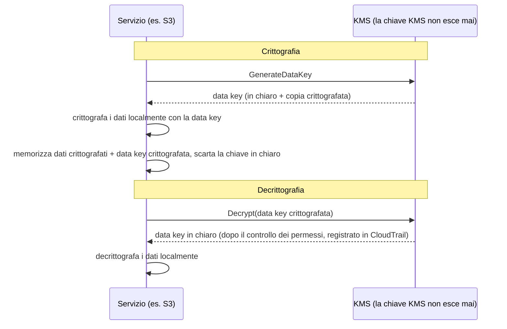

# Capitolo 16: Chiavi, Serrature e Segreti

Il repository git aveva migliaia di commit che risalivano a due anni prima. Leo stava scorrendo da venti minuti, seguendo un filo attraverso la cronologia — cercando quando una certa stringa di connessione al database fosse apparsa per la prima volta. Per poco non se la perse. Era un martedì pomeriggio, incastrata tra due commit qualunque, pubblicata da qualcuno che da allora aveva lasciato l'azienda.

Una password di database. In testo in chiaro. Nella cronologia.

---

*I controlli di rete del capitolo precedente erano ormai stretti. I security group limitavano il movimento laterale. Le NACL bloccavano intervalli IP noti come dannosi. Il perimetro era stato rinforzato. Ma l'audit di sicurezza di Leo aveva trovato qualcosa che il perimetro non poteva risolvere: una credenziale che viveva nella cronologia git da sei mesi. La sicurezza perimetrale assume che i segreti all'interno siano sicuri. Questo non lo era.*

---

Leo stava rivedendo la cronologia git quando la trovò. Una password di database. Committata sei mesi prima, in testo in chiaro, da qualcuno che non lavorava più in Nimbus — parte di un file `.env` che conteneva anche la chiave di accesso IAM della pipeline di deployment, due righe sotto la stringa di connessione. Il commit era pubblico. La password era stata cambiata da allora — ma non lo sapevano con certezza. Controllarono ogni sistema che una delle due credenziali avesse mai toccato. Ci vollero quattro ore. Quello fu il giorno in cui Nimbus decise di smettere di mettere segreti nel codice.

"Abbiamo pensato a cosa succede se qualcuno fa il fork del repo?" disse Priya. "La cronologia git è permanente. Anche se cambiamo la password, chiunque abbia clonato il repo prima della correzione ha ancora la vecchia credenziale nella sua cronologia locale."

"Abbiamo controllato," disse Leo. "La password è stata cambiata tre mesi fa. Tutti i sistemi confermati."

"Quello è il minimo," disse Priya. "Ma ogni sistema che quella credenziale ha toccato deve essere rivisto. Non solo quelli che conosci."

**L'Audit di Quattro Ore**

Leo aveva trovato il file `.env` trapelato nella cronologia git alle 10 del mattino. Alle 14, avevano una risposta alla domanda che contava: una delle due credenziali — la password del database o la chiave di accesso committata insieme a essa — era stata usata da qualcuno diverso dai sistemi Nimbus?

L'audit passò attraverso quattro categorie.

**Log di accesso RDS**: Ogni connessione al database, con timestamp e registrata. La password trapelata appariva in tre stringhe di connessione — tutte da istanze EC2 nel VPC di Nimbus, tutte con IP sorgente attesi. Nessuna connessione esterna. La password non era stata usata per connettersi al database dall'esterno.

**Log di accesso S3**: La chiave di accesso trapelata apparteneva all'utente IAM della pipeline di deployment, che aveva permessi sul bucket `nimbus-receipts`. Leo interrogò i server access log di S3 degli ultimi sei mesi. Ogni accesso proveniva da istanze EC2 in `us-west-2` o dal ruolo di fetch dell'origine di CloudFront. Nessuna anomalia.

**Chiamate API in CloudTrail**: Ogni chiamata API AWS effettuata con l'ID della chiave di accesso trapelata. Leo filtrò gli eventi CloudTrail per quella chiave. Trecentododici eventi — tutte chiamate `s3:PutObject` di routine dalla pipeline di deployment, tutte dallo stesso IP, tutte in orario lavorativo. La chiave era stata usata sempre e solo da un indirizzo IP, che corrispondeva al server CI/CD.

"E il server CI/CD," disse Priya, "è dentro il VPC. Avrebbe dovuto esfiltrare i dati via HTTPS verso un endpoint esterno, e l'avremmo visto nei flow log."

"Abbiamo controllato," disse Leo. "Nessun HTTPS in uscita da quel server verso IP non-AWS negli ultimi sei mesi."

**Verdetto**: Nessuna delle due credenziali era stata usata da qualcuno al di fuori del team Nimbus. L'esposizione era un rischio, non una violazione.

"Ma non possiamo esserne certi," disse Priya. "Possiamo essere ragionevolmente fiduciosi sulla base dei log. Non possiamo esserne certi. Quella distinzione conta."

"Cosa ci renderebbe certi?"

"Niente ti rende certo dopo l'esposizione di una credenziale. Ruoti la credenziale, verifichi gli accessi, documenti le tue conclusioni e vai avanti con controlli migliori. La certezza non è disponibile."

Tom aveva fatto i conti durante la conversazione. "Quattro ore del tempo di tre ingegneri. Diciamo quattromila dollari di costo a pieno carico. Più la rotazione delle credenziali, la documentazione, il resoconto dell'incidente."

"E quella è solo l'indagine," disse Priya. "Una violazione sarebbe costata ordini di grandezza in più. Notifiche alle autorità. Comunicazioni ai clienti. Possibili sanzioni."

"Quindi la lezione da quattromila dollari è stata economica," disse Tom.

"Considerevolmente," disse Priya. "Cerchiamo di non ripeterla."

---

**I Due Problemi: Memorizzare Segreti e Crittografare Dati**

La sicurezza attorno alle informazioni sensibili presenta due problemi distinti:

**Memorizzare le credenziali** (password di database, chiavi API, stringhe di connessione): Dove vivono? Chi può accedervi? Come le ruoti senza rideployare la tua applicazione?

**Crittografare i dati** (informazioni sui clienti, registri di pagamento, PII): Come ti assicuri che, anche se qualcuno ottiene un accesso non autorizzato al tuo database o al tuo bucket S3, non possa leggere i dati?

Pensala come un portachiavi e una cassaforte: il portachiavi contiene le tue chiavi (le credenziali), le tiene organizzate e le ruota secondo un programma; la cassaforte non contiene ciò che è prezioso — contiene la chiave che apre la serratura che protegge ciò che è prezioso.

AWS ha un servizio dedicato per ciascun problema:

- **AWS Secrets Manager** è il portachiavi: memorizza e gestisce le credenziali in modo sicuro
- **AWS KMS (Key Management Service)** è la cassaforte: gestisce le chiavi di crittografia per crittografare e decrittografare i dati

**AWS Secrets Manager: Basta Credenziali Hardcoded**

Secrets Manager è un archivio sicuro per i segreti: credenziali di database, chiavi API, token OAuth, chiavi SSH o qualsiasi cosa sensibile.

Invece di leggere una password da una variabile d'ambiente o da un file di configurazione, la tua applicazione chiama l'API di Secrets Manager all'avvio (o quando necessario) e recupera il segreto. Il segreto non tocca mai il disco. Non appare mai nel tuo codice. Non è nelle tue variabili d'ambiente.

Ecco come appare il flusso:

**Vecchio metodo**:
```
DB_PASSWORD=supersecretpassword123  # in un file .env o in una variabile d'ambiente
```

**Metodo Secrets Manager**:
```python
import boto3
client = boto3.client('secretsmanager')
secret = client.get_secret_value(SecretId='nimbus/production/db-password')
password = json.loads(secret['SecretString'])['password']
```

L'istanza EC2 ha bisogno di un ruolo IAM con il permesso di chiamare `secretsmanager:GetSecretValue` per quello specifico segreto. Nessun altro servizio può leggerlo. Il segreto non è mai nel codice.

Forse ti starai chiedendo: perché non usare semplicemente le variabili d'ambiente? Sono più semplici — le imposti al momento del deploy, e l'applicazione le legge. Le variabili d'ambiente sembrano nascoste, ma sono memorizzate nella tua configurazione di deployment, nello store dei segreti del CI/CD, possibilmente registrate nei log durante le sessioni di debug, e visibili a chiunque abbia accesso al processo in esecuzione. Cosa più importante, sono statiche: una volta impostate, non cambiano finché qualcuno non le aggiorna manualmente. Secrets Manager memorizza le credenziali in un servizio crittografato con controlli di accesso IAM, logging di audit completo via CloudTrail e rotazione automatica. Le variabili d'ambiente non ruotano. Una variabile d'ambiente trapelata resta valida finché qualcuno non la cambia manualmente.

**Rotazione Automatica: Il Vero Potere**

La funzionalità più importante di Secrets Manager non è memorizzare i segreti — è ruotarli automaticamente.

Ecco lo scenario: ogni 30 giorni, Secrets Manager genera una nuova password per il database, la aggiorna in RDS, aggiorna il segreto memorizzato, e la tua applicazione recupera la nuova password la prossima volta che ne ha bisogno. Nessun intervento manuale. Nessun deployment. Nessun "devo ricordarmi di ruotare questa cosa."

La rotazione è implementata come funzione Lambda. AWS fornisce template per i database RDS (MySQL, PostgreSQL, Aurora). Puoi personalizzare la funzione per qualsiasi tipo di credenziale.

"Quanto costa al mese?" chiese Tom.

Secrets Manager addebita per segreto al mese più per chiamata API. Per un piccolo numero di password di database e chiavi API, il costo è di pochi dollari al mese — trascurabile rispetto al costo di un incidente.

"La compromissione della settimana scorsa," disse Priya, "quanto sarebbe costato investigarla e rimediare?"

Tom rimase in silenzio per un momento. "Includendo il mio tempo, il tuo tempo, il weekend di Leo... un paio di migliaia di dollari."

"Con Secrets Manager, la rotazione automatica avrebbe invalidato la chiave trapelata nel giro di giorni."

Tom aprì la pagina dei prezzi.

**Cosa Succede Durante la Rotazione**

"Aspetta — ma *perché* dovremmo farlo in questo modo?" chiese Maya. "Se la password del database ruota, l'applicazione si rompe? Come fa a prendere la nuova password senza un deployment?"

Era una preoccupazione legittima. La rotazione senza interruzioni richiede attenzione.

La rotazione di Secrets Manager funziona per fasi — progettate per prevenire lo scenario "la vecchia password diventa improvvisamente invalida, l'applicazione va in crash":

**Fase 1: Creazione della nuova versione del segreto.** Secrets Manager genera una nuova password e la memorizza come versione pendente del segreto. La versione corrente è ancora attiva.

**Fase 2: Impostazione sul servizio.** La Lambda di rotazione chiama il database per aggiornare la password al nuovo valore. Attenzione: con la strategia di rotazione predefinita **single-user** c'è un breve momento in cui la vecchia password ha appena smesso di funzionare (l'`ALTER ROLE ... PASSWORD` di PostgreSQL ha effetto immediato) e la nuova versione non è ancora quella corrente. Per una rotazione a zero downtime, Secrets Manager supporta una strategia ad **alternating users** (utenti alternati): due utenti di database con permessi identici, dove la rotazione aggiorna sempre quello *inattivo* e poi fa lo scambio — le credenziali attive non vengono mai invalidate in corsa. La frase d'esame da ricordare è "alternating users rotation strategy."

**Fase 3: Test del nuovo segreto.** La Lambda di rotazione verifica che la nuova password funzioni connettendosi con essa. Se fallisce, la rotazione viene annullata.

**Fase 4: Conclusione.** Secrets Manager contrassegna la nuova versione come versione corrente e retrocede la vecchia versione a versione precedente. La versione precedente viene conservata per un periodo di grazia.

Durante il periodo di grazia, entrambe le versioni sono recuperabili. Se la tua applicazione ha messo in cache il vecchio segreto e non ha ancora preso il nuovo, può ancora connettersi. La prossima volta che chiama `GetSecretValue`, riceve la versione corrente (nuova).

"Quindi l'applicazione non ha mai bisogno di essere riavviata," disse Leo.

"Non necessariamente. Se la tua applicazione mette in cache il segreto all'avvio e non lo aggiorna mai, devi o aggiornarlo a intervalli programmati o gestire i fallimenti di autenticazione recuperando di nuovo il segreto."

"Quindi la Lambda di rotazione e l'applicazione devono cooperare," disse Maya.

"Secrets Manager fa la sua metà. Il codice della tua applicazione deve fare l'altra metà: recuperare il segreto quando serve, gestire i fallimenti di autenticazione recuperandolo di nuovo."

Leo aggiornò l'applicazione per catturare le eccezioni di autenticazione del database e, in caso di fallimento, recuperare un segreto fresco da Secrets Manager prima di riprovare. Due righe di gestione degli errori. La rotazione divenne invisibile per gli utenti.

---

**Iniezione di Segreti nella Pipeline CI/CD**

"Abbiamo pensato a come la pipeline di deployment ottiene i segreti di cui ha bisogno?" chiese Priya. "La pipeline deploya l'infrastruttura. Ha bisogno di credenziali AWS. Potrebbe aver bisogno di stringhe di connessione al database per gli script di migrazione."

Leo spiegò la configurazione attuale: i segreti erano memorizzati come GitHub Actions Secrets — crittografati a riposo in GitHub, iniettati come variabili d'ambiente a runtime.

"Le credenziali sono in GitHub," disse Priya.

"Crittografate."

"In un sistema di terze parti. Una violazione di GitHub espone tutti i segreti della nostra pipeline."

La soluzione: la pipeline di deployment si autentica su AWS tramite la federazione OIDC (trattata nel Capitolo 14) e recupera i segreti di cui ha bisogno da Secrets Manager a runtime. Nessun segreto memorizzato in GitHub. Il ruolo AWS della pipeline ha il permesso di leggere segreti specifici, nient'altro.

```yaml
# Workflow di GitHub Actions
- name: Get DB Migration Credentials
  env:
    AWS_DEFAULT_REGION: us-west-2
  run: |
    SECRET=$(aws secretsmanager get-secret-value \
      --secret-id nimbus/staging/db-migration \
      --query SecretString --output text)
    DB_URL=$(echo $SECRET | jq -r '.url')
    # Esegui la migrazione con DB_URL — mai memorizzata in un file
    flyway -url="$DB_URL" migrate
```

Il segreto viene recuperato, usato in memoria e scartato. Non viene mai scritto su disco, mai memorizzato in variabili d'ambiente che persistono dopo il job, mai in un file di log.

"E se il segreto viene stampato nel log?" chiese Leo.

"GitHub Actions maschera automaticamente i valori dei segreti configurati come GitHub Secrets. Ma questo segreto non è un GitHub Secret — viene da Secrets Manager. Devi mascherarlo manualmente, o meglio, non loggarlo mai."

"Quindi la disciplina è: recupera, usa, scarta. Mai loggare i segreti. Mai memorizzarli in file."

"Quella disciplina," disse Priya, "è ciò su cui l'audit di quattro ore ha confermato che stavamo fallendo."


**AWS KMS: La Fabbrica di Serrature**

"Aspetta — ma *perché* dovremmo farlo in questo modo?" chiese Maya. "Perché un servizio separato di gestione delle chiavi? Non possiamo semplicemente crittografare i dati da soli e memorizzare la chiave in Secrets Manager?"

Potresti memorizzare le chiavi di crittografia in Secrets Manager. Ma allora chi controlla l'accesso alla chiave? Cosa garantisce che la chiave venga ruotata? Cosa dimostra a un auditor che la chiave è stata usata solo da servizi autorizzati? KMS risponde a tutte queste domande. Non è solo archiviazione — è un servizio di gestione del ciclo di vita delle chiavi con sicurezza basata su hardware, policy IAM a grana fine per ogni chiave e una traccia di audit completa di ogni utilizzo. Secrets Manager memorizza ciò che ti serve per connetterti ai sistemi. KMS protegge i sistemi stessi.

AWS KMS (Key Management Service) gestisce le **chiavi crittografiche** — i valori segreti usati per crittografare e decrittografare i dati.

L'analogia: KMS è come un'azienda di cassette di sicurezza che custodisce la chiave master. I tuoi dati (il contenuto della cassetta) sono crittografati. Solo qualcuno con il permesso di usare la chiave KMS può decrittografarli. KMS registra ogni utilizzo di ogni chiave in CloudTrail.

Le **Customer Master Key (CMK)** — ora chiamate chiavi KMS — esistono in tre tipi di proprietà:

**Chiavi di proprietà di AWS (AWS owned keys)**: Chiavi che AWS possiede e usa su molti account cliente — non le vedi mai, non le paghi mai, e non appaiono nel tuo account. Diversi servizi le usano come predefinite (la crittografia predefinita di DynamoDB, per esempio).

(Una distinzione da tenere ben chiara: la crittografia predefinita **SSE-S3** di S3 *non* è affatto un modello a chiave KMS — S3 gestisce le proprie chiavi AES-256 interamente al di fuori di KMS, senza alcuna chiave da vedere e senza traccia di audit sull'uso della chiave. **SSE-KMS** è l'opzione di S3 che passa attraverso KMS, usando o la chiave gestita da AWS `aws/s3` o una chiave gestita dal cliente. Trigger d'esame: "verificare chi ha usato la chiave di crittografia" o "controllare la rotazione e la key policy" → SSE-KMS con una chiave gestita dal cliente — ogni utilizzo finisce in CloudTrail.)

**Chiavi gestite da AWS (AWS managed keys)**: AWS crea e gestisce la chiave automaticamente *nel tuo account* per servizi come S3, EBS, RDS (con nomi tipo `aws/s3`). Puoi vederla e verificarne l'uso in CloudTrail, ma non puoi cambiarne la policy o la rotazione — AWS la ruota automaticamente ogni anno. Gratuita.

**Chiavi gestite dal cliente (Customer managed keys)**: Crei la chiave in KMS e ne controlli ogni aspetto: chi può usarla, quando ruota, chi può amministrarla. Puoi abilitare la rotazione automatica della chiave con un periodo configurabile tra 90 giorni e 2.560 giorni (7 anni); il periodo di rotazione predefinito è di 365 giorni (annuale). Puoi anche attivare una **rotazione on-demand** immediatamente — utile dopo un sospetto di esposizione, senza aspettare il calendario. Nota: la rotazione automatica si applica alle chiavi simmetriche con materiale generato da KMS — le chiavi asimmetriche e il materiale di chiave importato non possono ruotare automaticamente. Costo: $1/mese per chiave più tariffe per chiamata API.

Se scegli le chiavi KMS gestite dal cliente, ottieni il controllo completo su calendari di rotazione, policy di accesso e visibilità di audit, ma paghi per chiave al mese e ti assumi la responsabilità della gestione delle chiavi; se scegli le chiavi gestite da AWS, ottieni la crittografia con zero carico operativo e nessun costo per la chiave in sé, ma non puoi personalizzare i calendari di rotazione o le key policy — sono gestiti interamente da AWS.

**Crittografia nei Servizi AWS: l'Integrazione con KMS**

La maggior parte dei servizi AWS si integra con KMS per la crittografia:

**S3**: Abilita la "crittografia lato server con KMS" su un bucket. Ogni oggetto è crittografato a riposo con una chiave KMS. Leggere un oggetto richiede il permesso sia sul bucket S3 *sia* sulla chiave KMS.

**RDS**: Abilita la crittografia al momento della creazione. Lo storage del database, i backup e gli snapshot sono tutti crittografati con una chiave KMS. Nota: la crittografia non può essere abilitata su un'istanza RDS esistente non crittografata — devi fare uno snapshot, copiare lo snapshot con la crittografia abilitata e ripristinare.

**EBS**: Crittografa i volumi con KMS. I nuovi volumi creati da snapshot crittografati sono automaticamente crittografati.

**DynamoDB**: La crittografia a riposo con KMS è abilitata per impostazione predefinita su tutte le tabelle.

**ElastiCache Redis**: Crittografia a riposo con KMS per i dati sensibili in cache.

Il principio: i dati devono essere crittografati a riposo (memorizzati su disco) e in transito (in movimento attraverso una rete). KMS gestisce la crittografia a riposo. TLS/SSL (fornito automaticamente dai servizi AWS) gestisce la crittografia in transito.

**Envelope Encryption: Come Funziona Davvero KMS**

Ecco un dettaglio che ti aiuta a capire il comportamento di KMS e le domande d'esame.

Nella maggior parte dei casi, KMS non crittografa direttamente i tuoi dati. Usa la **envelope encryption** (crittografia a busta):

1. KMS genera una **data key** (una chiave simmetrica univoca)
2. Il servizio usa la data key per crittografare i tuoi dati localmente (veloce — crittografia simmetrica)
3. Il servizio chiede a KMS di crittografare la data key stessa (usando la tua chiave KMS)
4. Vengono memorizzati sia i dati crittografati sia la data key crittografata
5. I tuoi dati reali non lasciano mai il servizio — solo la data key va a KMS per la crittografia/decrittografia

Quando leggi i dati:

1. Il servizio chiede a KMS di decrittografare la data key
2. KMS verifica i permessi, decrittografa la data key, la restituisce
3. Il servizio usa la data key decrittografata per decrittografare i tuoi dati localmente



Questo significa che KMS può gestire dati molto grandi senza farli passare tutti attraverso l'API di KMS. Solo piccole chiavi vanno a KMS. CloudTrail registra ogni chiamata API a KMS — ogni operazione di crittografia e decrittografia.

**Le Key Policy di KMS: Il Modello di Accesso**

"Abbiamo pensato a cosa succede se una policy IAM e una key policy sono in conflitto?" chiese Priya. "KMS ha il proprio controllo degli accessi sopra IAM."

Le chiavi KMS hanno delle **key policy** — policy basate sulla risorsa collegate alla chiave stessa. Sono distinte dalle policy IAM e seguono regole di valutazione diverse.

Perché un principal possa usare una chiave KMS, due cose devono essere vere:

**Primo**: La key policy deve consentirlo. Se la key policy non concede esplicitamente l'accesso al principal, questi non può usare la chiave — indipendentemente da ciò che dice la sua policy IAM. Questo è diverso dalla maggior parte delle risorse AWS, dove le policy IAM da sole sono sufficienti.

**Secondo**: La policy IAM del principal deve consentire l'azione KMS (es. `kms:Decrypt`, `kms:GenerateDataKey`).

Entrambe devono dire sì. Se anche una sola dice no, l'azione viene negata.

La key policy predefinita che AWS crea per le chiavi gestite dal cliente include una dichiarazione che dice "l'account root può gestire questa chiave." Questo è importante: significa che un amministratore IAM a livello di account può sempre concedere l'accesso a una chiave, anche se la key policy non lo nomina direttamente — perché la delega all'account root è in essere.

"Quindi se rimuoviamo l'account root dalla key policy," chiese Leo, "le policy IAM smettono di funzionare per quella chiave?"

"Corretto. Rimuovere la delega all'account root è un modo per blindare una chiave così strettamente che solo i principal specifici nominati nella key policy possono usarla — nemmeno gli amministratori dell'account. È anche un modo per chiudersi accidentalmente fuori dalla propria chiave."

"Possiamo recuperarla?"

"Solo contattando il Supporto AWS. Se nessuno può usare la chiave e la key policy non può essere aggiornata, i dati crittografati con quella chiave sono di fatto inaccessibili."

"Quindi non rimuovere l'account root dalla key policy senza una ragione estremamente valida."

"Corretto."

---

**Chiavi Asimmetriche: Firma e Verifica**

KMS supporta anche coppie di chiavi asimmetriche — una chiave pubblica e una chiave privata.

I casi d'uso:

**Firma digitale**: Firmi un documento o un token JWT con la chiave privata. Chiunque abbia la chiave pubblica può verificare che la firma provenga dal detentore della chiave privata, e che il contenuto non sia stato manomesso.

**Crittografia a chiave pubblica**: Chiunque può crittografare i dati con la chiave pubblica. Solo il detentore della chiave privata può decrittografarli.

Per Nimbus, le chiavi asimmetriche divennero rilevanti quando implementarono un sistema di firma dei webhook per i ristoranti partner. Quando Nimbus inviava un evento al server di un ristorante partner (un nuovo ordine, un aggiornamento di stato), il partner doveva verificare che l'evento provenisse davvero da Nimbus e non fosse stato falsificato.

L'implementazione:

1. Nimbus crea una chiave KMS asimmetrica (RSA 2048 bit, algoritmo SIGN_VERIFY)
2. Quando invia un webhook, Nimbus chiama `kms:Sign` con la chiave privata per firmare il payload dell'evento
3. La firma viene inclusa nell'header del webhook
4. Nimbus pubblica la chiave pubblica (scaricabile dalla console KMS)
5. Il server del ristorante partner recupera la chiave pubblica e la usa per verificare la firma su ogni webhook in arrivo

La chiave privata non lascia mai KMS. Nimbus non ha mai accesso al materiale grezzo della chiave privata. KMS esegue l'operazione di firma all'interno del suo hardware security module.

"Quindi anche se qualcuno compromettesse un server di Nimbus," disse Rafael, "non potrebbe falsificare la firma di un webhook. La chiave privata è in KMS, non su alcun server."

"Corretto. Firmare richiede una chiamata API a KMS. Ogni chiamata API è registrata in CloudTrail. Se qualcuno provasse a firmare un evento fraudolento, vedremmo la chiamata API."

---

**La Storia della Cancellazione della Chiave**

Tre mesi dopo la configurazione di KMS, Tom commise un errore.

Stava ripulendo le risorse AWS inutilizzate — vecchie funzioni Lambda, bucket S3 obsoleti, dashboard CloudWatch abbandonate. Si stava muovendo velocemente. Programmò accidentalmente la cancellazione di una chiave KMS.

La chiave era `nimbus/prod/order-receipts` — la chiave gestita dal cliente usata per crittografare il bucket S3 delle ricevute degli ordini.

"Ho cancellato in blocco dodici risorse ieri e non ho controllato cosa fosse la dodicesima," disse Tom con tono piatto. Aveva programmato la cancellazione ed era passato oltre. Si accorse dell'errore la mattina dopo, quando rivide le proprie azioni.

Aprì la console KMS. Lo stato della chiave diceva: "In attesa di eliminazione. Eliminazione tra 7 giorni."

L'aveva programmata con il periodo di attesa minimo.

"Possiamo annullarla?" chiese.

Priya aprì la documentazione. "Sì. Durante il periodo di attesa, la chiave è disabilitata ma non eliminata. Puoi annullare l'eliminazione."

Tom annullò l'eliminazione nel giro di un minuto. La chiave fu riportata allo stato attivo.

"Sette giorni è il periodo di attesa minimo," disse Priya. "AWS lo impone perché se una chiave viene eliminata e dei dati erano crittografati con essa, quei dati sono persi per sempre. Irrecuperabili. Il periodo di attesa ti dà il tempo di accorgerti dell'errore."

"Quanto dovrebbe durare il periodo di attesa?"

"Il massimo è trenta giorni. Per qualsiasi chiave che crittografa dati di produzione, usa trenta giorni. Le tre settimane extra di protezione contro gli incidenti valgono il piccolo inconveniente."

Tom aggiornò tutte le impostazioni di eliminazione delle chiavi di produzione a trenta giorni. Configurò anche un allarme CloudWatch che scattava se lo stato di una qualsiasi chiave KMS cambiava in "In attesa di eliminazione" — così la prossima volta che qualcuno (lui incluso) avesse fatto lo stesso errore, il team lo avrebbe saputo entro cinque minuti.

---

**Secrets Manager vs Parameter Store**

AWS ha anche **Systems Manager Parameter Store**, che memorizza valori di configurazione (non solo segreti). Parameter Store è più economico — gratuito per i parametri standard. Può anche memorizzare parametri crittografati usando KMS.

Per i segreti che richiedono rotazione: Secrets Manager.

Per i valori di configurazione e i parametri non sensibili: Parameter Store (il piano gratuito è molto generoso).

Per la configurazione dell'applicazione (numeri di porta, feature flag, impostazioni specifiche per ambiente): Parameter Store.

| | Secrets Manager | SSM Parameter Store |
|---|---|---|
| Rotazione automatica | Sì (basata su Lambda) | No |
| Costo | ~$0.40/segreto/mese | Gratuito (standard) |
| Crittografia | Sempre | Opzionale (con KMS) |
| Versionamento | Sì | Sì |
| Accesso cross-account | Sì | Limitato |
| Ideale per | Password di database, chiavi API | Valori di configurazione, feature flag |

## Il Certificato sulla Porta

Due settimane dopo la migrazione dei segreti, Priya stava controllando l'ambiente di staging di Nimbus sul suo telefono quando notò la barra degli indirizzi.

"Non sicuro."

Aprì l'URL di produzione. Stessa cosa.

"Leo," disse, posando il telefono sul tavolo. "Stiamo girando su HTTP?"

Leo controllò. "Il listener dell'ALB è sulla porta 80. Non abbiamo mai configurato HTTPS."

"Quindi ogni richiesta che fanno i nostri utenti — ogni ordine, ogni login — sta viaggiando su HTTP non crittografato?"

"Abbiamo TLS sulla connessione a RDS," offrì Leo.

"Quello è il dato in transito tra l'applicazione e il database. Io sto parlando dei dati in transito tra il browser dell'utente e il nostro load balancer. Quelli non sono affatto crittografati."

Tom era rimasto ad ascoltare. "È un problema di sicurezza o un problema di percezione?"

"Entrambi," disse Priya. "HTTP non crittografato significa che qualsiasi rete tra l'utente e il nostro server — il router di un bar, un ISP — può leggere il traffico. Password, dettagli degli ordini, token di sessione. E i browser moderni avvertono gli utenti con 'Non sicuro.' Quello uccide i tassi di conversione."

"Quindi ci serve un certificato TLS," disse Maya. "Quanto costa?"

"Niente," disse Priya. "AWS Certificate Manager."

**AWS Certificate Manager (ACM)** fornisce certificati TLS/SSL gratuiti da usare con i servizi gestiti da AWS: ALB, distribuzioni CloudFront e API Gateway. Non compri un certificato, non gestisci un calendario di rinnovi, non tocchi il materiale della chiave privata. ACM gestisce l'intero ciclo di vita del certificato.

Un certificato emesso da ACM è valido per 13 mesi. Prima che scada, ACM lo rinnova automaticamente. Se il rinnovo riesce, il nuovo certificato viene collegato al tuo load balancer o alla tua distribuzione senza alcuna azione da parte tua. Il lucchetto del browser resta verde. L'avviso di scadenza che hai dimenticato di impostare non scatta mai.

**Due tipi di certificati ACM**:

I **certificati pubblici** sono emessi dall'autorità di certificazione di Amazon e considerati affidabili da tutti i principali browser. Sono completamente gratuiti per l'uso con ALB, CloudFront e API Gateway. Convalidi la proprietà del dominio via DNS o via email.

I **certificati privati** sono emessi da AWS Private CA — un'autorità di certificazione privata gestita che usi per i servizi interni (mTLS tra servizi, strumenti interni, client VPN). Private CA ha un costo mensile.

Per Nimbus, i certificati pubblici erano la scelta giusta.

**Validazione DNS vs validazione email**:

Leo aprì la console ACM e avviò una richiesta di certificato per `eatnimbus.com` e `*.eatnimbus.com`.

"Mi chiede come voglio convalidare la proprietà," disse. "DNS o email."

"DNS," disse Priya. "Sempre DNS."

Con la validazione DNS, ACM aggiunge uno specifico record CNAME alla tua hosted zone. Route 53 può farlo automaticamente — un clic nella console. Finché quel record CNAME esiste, ACM può rinnovare automaticamente il certificato senza alcuna azione umana. La validazione via email invia un'email al contatto registrato del dominio e richiede un clic manuale ogni volta che il certificato si rinnova. Quel clic viene dimenticato. La validazione DNS non richiede che nessuno si ricordi di niente.

"Quindi aggiungo il record CNAME una volta," disse Leo, "e si rinnova per sempre?"

"Finché qualcuno non cancella il record CNAME," disse Priya. "Non cancellare il record CNAME."

Leo richiese il certificato, aggiunse il CNAME di validazione in Route 53 (che ACM si offrì di fare automaticamente) e aspettò cinque minuti. Lo stato del certificato passò a Emesso. Lo collegò al listener HTTPS dell'ALB sulla porta 443 e aggiunse una regola di redirect sulla porta 80 per inviare tutto il traffico HTTP verso HTTPS.

Tom ricaricò l'URL di produzione.

Il lucchetto apparve.

Un dettaglio regionale che merita una bandierina: un certificato è una risorsa regionale, e deve vivere nella stessa regione del servizio che lo usa. Per un ALB, è la regione dell'ALB. Per **CloudFront**, il certificato deve essere richiesto (o importato) in **`us-east-1`** — sempre, indipendentemente da dove girano le tue origini — perché CloudFront è un servizio globale ancorato lì. Leo c'era già inciampato nel Capitolo 13; è anche un fatto d'esame affidabile.

**L'unica cosa che i certificati ACM non possono fare**:

"Posso scaricare il certificato?" chiese Leo. "Voglio installarlo sull'istanza EC2 di amministrazione interna."

"No," disse Priya.

I certificati pubblici gratuiti di ACM non possono essere esportati. Non puoi scaricare la chiave privata e installarla su un'istanza EC2, un server Nginx o qualsiasi cosa al di fuori dei servizi gestiti da AWS. Il materiale della chiave privata non lascia mai ACM. È intenzionale — impedisce che la chiave privata venga trafugata, memorizzata in modo insicuro o dimenticata quando il certificato scade.

Per i casi d'uso che richiedono un certificato installabile — un'istanza EC2 che fa da proxy personalizzato, un server on-premises — ci sono tre strade: un certificato da un'autorità di terze parti (Let's Encrypt, per esempio), AWS Private CA con l'esportazione dei certificati abilitata, oppure — da giugno 2025 — i **certificati pubblici esportabili** a pagamento di ACM (opt-in all'emissione, addebitati per FQDN o wildcard), la cui chiave privata *può* essere esportata per l'uso ovunque.

"Per il nostro ALB e la nostra distribuzione CloudFront," disse Priya, "ACM è esattamente la scelta giusta. Gratuito, automatico, e non tocchiamo mai una chiave."

## Punti di Forza e Limitazioni

**AWS Secrets Manager**:

- Rotazione automatica dei segreti senza modifiche al codice o deployment
- Controllo degli accessi IAM a grana fine per segreto (ogni segreto è una risorsa IAM separata)
- Versionamento — la versione precedente resta accessibile durante la rotazione, prevenendo cadute di connessione
- Audit via CloudTrail — ogni chiamata `GetSecretValue` viene registrata con l'identità del chiamante
- Accesso cross-account — i segreti di un account possono essere condivisi con il ruolo di un altro account
- Costo: ~$0.40/segreto/mese + chiamate API (circa $0.05 per 10.000 chiamate API)

**AWS KMS**:

- Gestione centralizzata delle chiavi con traccia di audit completa — ogni crittografia e decrittografia registrata
- Rotazione automatica configurabile delle chiavi gestite dal cliente (da 90 giorni a 2.560 giorni; predefinito 365 giorni) — il vecchio materiale di chiave continua a decrittografare i dati esistenti, il nuovo materiale crittografa i nuovi dati
- Permessi IAM a grana fine per chiave (key policy + policy IAM — entrambe devono consentire)
- Basato su Hardware Security Module (HSM) — le chiavi non lasciano mai l'HSM in chiaro
- Supporto per chiavi Multi-Region per scenari di disaster recovery
- Supporto per chiavi asimmetriche per firma digitale e verifica
- Costo: $1/mese per chiave + $0.03 per 10.000 chiamate API

**Dove le cose si complicano**:

- Le key policy di KMS sono separate dalle policy IAM (e valutate insieme a esse) — il debug degli errori di accesso negato richiede di controllare entrambe
- La crittografia a riposo va pianificata in anticipo — non puoi crittografare sul posto un'istanza RDS esistente non crittografata
- La cancellazione delle chiavi in KMS ha un periodo di attesa di 7-30 giorni — un meccanismo di sicurezza, ma facile da dimenticare durante la configurazione e pericoloso da attivare per errore
- La rotazione richiede che il codice applicativo gestisca il recupero dei segreti in caso di fallimento di autenticazione — Secrets Manager ruota la credenziale, ma l'applicazione deve recepirla
- I costi di Secrets Manager scalano con il numero di segreti e il volume di chiamate API su larga scala
- La key policy predefinita (inclusa la delega all'account root) è fondamentale da preservare — rimuoverla può chiudere gli amministratori fuori dalla chiave

## Riepilogo

Le quattro ore passate a tracciare una credenziale compromessa attraverso ogni sistema che aveva toccato erano quattro ore che Secrets Manager avrebbe potuto evitare. La rotazione automatica significa che una credenziale rubata ha vita breve. KMS significa che anche se qualcuno arriva ai dati, non può leggerli senza una chiave che non è autorizzato a usare. E un periodo di attesa di trenta giorni per la cancellazione delle chiavi significa che una cancellazione accidentale può essere annullata prima che diventi un evento di perdita di dati.

- Non memorizzare mai le credenziali nel codice, nelle variabili d'ambiente o nei file di configurazione committati nel controllo di versione. **Secrets Manager** memorizza le credenziali in modo sicuro e le ruota automaticamente — le applicazioni recuperano i segreti via API a runtime.
- La **rotazione** avviene per fasi: crea la nuova versione, aggiorna sul servizio, testa, promuovi. Sia la vecchia che la nuova versione sono brevemente valide, prevenendo cadute di connessione durante la rotazione.
- **KMS** gestisce le chiavi di crittografia; la maggior parte dei servizi AWS si integra con KMS per la crittografia a riposo. **Envelope encryption**: KMS crittografa la chiave, non i dati direttamente — il servizio crittografa i dati usando una data key locale, che KMS crittografa, così solo piccole chiavi attraversano l'API di KMS.
- **Chiavi KMS gestite dal cliente**: controllo completo su rotazione (configurabile 90–2.560 giorni, predefinita 365 giorni annuale), accesso e audit ($1/mese). **Chiavi gestite da AWS**: automatiche, nessuna configurazione necessaria, gratuite.
- **Key policy di KMS**: La key policy è una policy basata sulla risorsa che lavora insieme a IAM. Entrambe devono dire sì. La delega all'account root nella key policy predefinita garantisce che gli amministratori IAM possano sempre concedere l'accesso.
- **Chiavi asimmetriche**: KMS supporta coppie di chiavi RSA ed ECC per firma e verifica. La chiave privata non lascia mai l'HSM.
- **Cancellazione delle chiavi**: Periodo di attesa minimo di 7 giorni, massimo di 30. Le chiavi cancellate significano dati crittografati permanentemente inaccessibili. Usa 30 giorni per le chiavi di produzione, e monitora lo stato di attesa di eliminazione.
- **Segreti CI/CD**: Recuperali da Secrets Manager a runtime usando la federazione OIDC. Non memorizzare mai i segreti come variabili della piattaforma CI/CD.

## Suggerimenti per l'Esame

*SAA-C03 Dominio: Progettazione di Architetture Sicure (Dominio 1, Task 1.3)*

- **Secrets Manager vs SSM Parameter Store**: Secrets Manager per le credenziali che richiedono rotazione automatica; Parameter Store per la configurazione generale. L'esame li distingue in base al requisito di rotazione e alla sensibilità ai costi.
- **Key policy di KMS**: Una chiave KMS ha la propria key policy (una policy basata sulla risorsa). Le policy IAM da sole non concedono l'accesso a una chiave KMS — la key policy deve consentirlo esplicitamente. Sia la key policy che la policy IAM devono consentire l'azione.
- **Crittografare RDS**: Non è possibile abilitare la crittografia su un'istanza RDS esistente non crittografata. Il processo: crea uno snapshot → copia lo snapshot con la crittografia abilitata → ripristina dallo snapshot crittografato → migra il traffico alla nuova istanza.
- **Crittografia EBS**: I nuovi volumi possono essere crittografati. Gli snapshot di volumi crittografati sono sempre crittografati. I volumi non crittografati non possono essere crittografati direttamente — snapshot + copia + ripristino.
- **CloudTrail + KMS**: Ogni chiamata API a KMS viene registrata in CloudTrail. Questa è una funzionalità di compliance fondamentale. Quando l'esame chiede come verificare chi ha decrittografato quali dati, la risposta è CloudTrail + KMS.
- **Chiavi KMS Multi-Region**: Replica il materiale della chiave in più regioni così la decrittografia può avvenire senza chiamate API cross-region. L'esame lo usa per il disaster recovery multi-regione con dati crittografati.
- **KMS vs CloudHSM**: KMS è multi-tenant (gestito da AWS). CloudHSM è un hardware security module dedicato che controlli solo tu. Segnali d'esame: "FIPS 140-2 Level 3," "HSM dedicato," "operazioni crittografiche gestite dal cliente" → CloudHSM.
- **Envelope encryption**: KMS genera una data key, il servizio la usa per crittografare i dati localmente, KMS crittografa la data key. Domanda d'esame: "perché KMS non crittografa direttamente grandi quantità di dati?" → prestazioni; la envelope encryption mantiene i dati grandi in locale.
- **Chiavi KMS asimmetriche**: Usate per firma digitale, verifica di JWT o crittografia a chiave pubblica. La chiave privata non lascia mai KMS. `kms:Sign` è la chiamata API per firmare; `kms:Verify` per verificare.
- **Periodo di attesa per la cancellazione delle chiavi**: 7-30 giorni. Durante questo periodo, la chiave è disabilitata e non utilizzabile, ma la cancellazione può essere annullata. Dopo la cancellazione, qualsiasi dato crittografato con quella chiave è permanentemente irrecuperabile.
- **ACM (AWS Certificate Manager):** Certificati TLS pubblici gratuiti per l'uso con ALB, CloudFront e API Gateway. Rinnovo automatico tramite validazione DNS. I certificati pubblici gratuiti non consentono l'esportazione della chiave privata — vivono solo dentro AWS (esiste dal 2025 un'opzione a pagamento di *certificato pubblico esportabile* per l'uso su EC2/on-premises). Trigger d'esame: "HTTPS su load balancer o CDN" → ACM.

## Esercizi

**Esercizio 1 — Richiamo**

Spiega il concetto di envelope encryption. Perché KMS crittografa una piccola data key invece di crittografare direttamente i dati della tua applicazione?

*(Suggerimento: ricorda la cassetta di sicurezza — la cassaforte custodisce la piccola chiave, non i valori in sé, così non devi mai trasportare 1 GB di dati fino alla cassaforte e ritorno.)*

**Esercizio 2 — Scenario SAA-C03**

*Scenario*: Un'azienda di servizi finanziari memorizza dati sensibili dei clienti in un database RDS MySQL. Un nuovo requisito di conformità impone che:

1. Tutti i dati devono essere crittografati a riposo
2. Ogni utilizzo delle chiavi di crittografia deve essere verificabile
3. Le chiavi di crittografia devono essere controllate dal cliente (non gestite da AWS)
4. La password del database deve essere ruotata automaticamente ogni 90 giorni

Il database è stato creato sei mesi fa senza crittografia abilitata. Quale insieme di azioni soddisfa MEGLIO tutti e quattro i requisiti?

A) Abilitare la crittografia RDS sul database esistente; creare una chiave KMS gestita dal cliente; configurare Secrets Manager con rotazione a 90 giorni  
B) Creare uno snapshot del database esistente; copiare lo snapshot con la crittografia usando una chiave KMS gestita dal cliente; ripristinare dallo snapshot crittografato; configurare Secrets Manager con rotazione a 90 giorni  
C) Creare una nuova istanza RDS crittografata con una chiave gestita da AWS; migrare i dati dalla vecchia istanza; configurare Secrets Manager con rotazione a 90 giorni  
D) Abilitare la crittografia a riposo RDS sul database esistente usando una chiave gestita da AWS; configurare Secrets Manager con rotazione a 90 giorni

**Suggerimento 1**: Non è possibile abilitare direttamente la crittografia su un'istanza RDS esistente non crittografata.

**Suggerimento 2**: Chiavi "controllate dal cliente" significa chiavi KMS gestite dal cliente, non chiavi gestite da AWS.

**Suggerimento 3**: Il processo di copia dello snapshot è il percorso di migrazione standard verso RDS crittografato.

**Risposta**: B

**Spiegazione**: La crittografia RDS non può essere abilitata su un'istanza esistente. L'approccio standard è: fare lo snapshot dell'istanza esistente → copiare lo snapshot con la crittografia abilitata usando una chiave KMS gestita dal cliente (soddisfa i requisiti 1, 2 e 3) → ripristinare dallo snapshot crittografato. Le chiavi KMS gestite dal cliente registrano automaticamente ogni utilizzo in CloudTrail (audit) e mantengono le chiavi di crittografia sotto il tuo controllo. Secrets Manager gestisce la rotazione automatica della password a 90 giorni (soddisfa il requisito 4).

**Perché non A?** Non è possibile abilitare la crittografia sul posto su un'istanza RDS esistente non crittografata.

**Perché non C?** Le chiavi gestite da AWS non soddisfano il requisito "controllate dal cliente" (requisito 3).

**Perché non D?** Stesso problema di A (impossibile abilitare sul posto), in più la chiave gestita da AWS non soddisfa il requisito 3.

*SAA-C03 Dominio: Progettazione di Architetture Sicure — Task 1.3*

**Esercizio 3 — Sfida di Architettura**

Nimbus deve memorizzare i seguenti dati sensibili:

- La password del database per l'istanza RDS di produzione
- La chiave segreta API di Stripe (usata per l'elaborazione dei pagamenti)
- Una chiave di crittografia simmetrica per crittografare la cronologia degli ordini dei clienti in DynamoDB
- Valori di configurazione per ristorante (endpoint API, feature flag — non sensibili)

Quale servizio o approccio AWS useresti per ciascuno? Quale strategia di rotazione applicheresti a ciascuno?

*(Non esiste una singola risposta corretta. L'obiettivo è esercitarsi ad abbinare gli strumenti di sicurezza ai casi d'uso.)*

## Scena Post-Crediti

"L'ho già deployato — oh." Leo aveva migrato i segreti di produzione su Secrets Manager mentre l'ambiente di sviluppo usava ancora le vecchie variabili d'ambiente. L'ambiente di sviluppo si ruppe. Aveva dovuto fare il rollback della configurazione di dev manualmente.

"Prima lo staging," disse Priya. "Poi la produzione."

"Lo so," disse Leo.

I segreti furono migrati.

Password del database: Secrets Manager, con rotazione ogni 30 giorni.

Chiavi API: Secrets Manager, con una Lambda di rotazione che chiamava l'API del fornitore di pagamenti per generare una nuova chiave.

Dati degli ordini dei clienti: crittografati con una chiave KMS gestita dal cliente.

Vecchie credenziali: disattivate. Vecchi file di configurazione: eliminati. Vecchi segreti di GitHub Actions: rimossi.

"Ora siamo pronti per l'audit," disse Priya.

"Definisci pronti per l'audit," disse Maya.

"Se un auditor di conformità ci chiedesse di dimostrare che nessuna credenziale è hardcoded nel nostro codice o esposta nella nostra infrastruttura, potremmo mostrarglielo: ogni segreto è in Secrets Manager, ogni chiave di crittografia è in KMS, ogni accesso è registrato in CloudTrail."

"Quand'è stata l'ultima volta che qualcuno ha controllato i log di CloudTrail?"

Una pausa.

"Li controllo ogni settimana," disse Priya.

"E se apparisse qualcosa di insolito, come lo sapremmo?"

"Questa," disse Priya, chiudendo il laptop, "è la prossima conversazione."

Nel prossimo capitolo: i tre strati di difesa che stanno tra Nimbus e internet.
