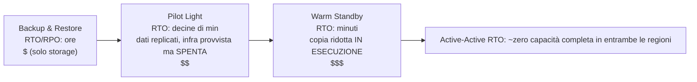

# Capitolo 18: Quando le Cose Si Rompono

Le luci si spensero alle 23:17.

Non nell'ufficio di Nimbus — Leo era a casa, sul divano, con il laptop semichiuso. Le luci si spensero in un data center in Oregon che non aveva mai visitato, in un edificio che non aveva mai visto, in una sala piena di server che non aveva mai toccato. Lui non lo sapeva ancora. Ci fu un momento — solo un momento — di silenzio completo prima che i generatori di backup si attivassero da qualche parte, lontano. Quel tipo di buio in cui non riesci a capire se i tuoi occhi sono aperti o chiusi.

Poi arrivò la notifica Slack.

---

Dopo che i sistemi di monitoraggio del capitolo 17 erano stati messi in funzione, il team aveva provato qualcosa di simile alla fiducia. Gli alert scattavano. Le dashboard erano verdi. I log fluivano in CloudWatch. Leo e Priya avevano passato tre settimane a cablare la visibilità in ogni angolo dell'infrastruttura di Nimbus.

Quello che nessuno aveva detto ad alta voce — quello da cui il monitoraggio non proteggeva — era che visibilità e resilienza sono cose diverse. Puoi osservare qualcosa che fallisce in perfetto dettaglio. Osservarlo non lo ferma.

Quella lezione arrivò alle 23:23 di un giovedì.

---

Leo ricevette la notifica Slack.

"us-west-2 — guasto del cluster del data center — servizio degradato."

Aprì la console AWS. Le istanze EC2 in una delle Availability Zone mostravano controlli di stato in errore. Il suo Auto Scaling Group aveva rilevato istanze non sane e stava avviando le sostituzioni — nella stessa zona.

Nel cluster che stava fallendo.

Anche le nuove istanze non riuscivano a partire. Erano nella stessa zona del guasto hardware.

"Il load balancer sta instradando il traffico a entrambe le AZ," disse Leo a nessuno. "Metà del nostro traffico sta andando a istanze che non funzionano."

Aprì la console EC2 e iniziò a cliccare. Sotto Load Balancers, l'Application Load Balancer mostrava entrambi i target group come sani — perché l'health check passava sulla porta 80, e anche le istanze in errore rispondevano a quel controllo. Semplicemente non riuscivano a elaborare le richieste reali.

Provò a rimuovere l'AZ in errore dal target group. La console accettò la modifica. Ma l'Auto Scaling Group, configurato per mantenere l'equilibrio, iniziò immediatamente a cercare di sostituire le istanze terminate — nella stessa zona in errore.

Leo fissò lo schermo. Aveva appena peggiorato le cose.

Aprì la configurazione dell'ASG. L'impostazione "Balance capacity across Availability Zones" era attiva. In condizioni operative normali era una buona scelta progettuale. In quel momento lo stava attivamente combattendo.

Cambiò l'ASG per usare solo la zona sana. Applicò la modifica.

La console mostrò la modifica come "In Service".

Tre minuti dopo, le prime istanze sostitutive sane vennero su.

Il load balancer iniziò a instradare il traffico. Il tasso di errore scese dal 52% al 4%. Il restante 4% erano richieste finite sulle ultime istanze non sane ancora in fase di drenaggio delle connessioni.

Alle 23:45 — ventidue minuti dopo l'inizio del guasto — il traffico era stabile.

Ventidue minuti di servizio degradato prima che se ne accorgesse e spostasse manualmente l'ASG per usare solo la zona sana.

"Questo è successo perché tutto era in una sola AZ," disse Priya la mattina seguente.

"No," disse Leo. "Avevo istanze in due AZ. Il problema era che le istanze di sostituzione venivano generate nell'AZ in errore."

"E il database?"

Leo si fermò.

"Il primario RDS era nella zona in errore," disse. "Multi-AZ ha effettivamente fatto il suo lavoro — ha eseguito il failover allo standby nella zona sana in circa novanta secondi. Ma i nostri application server hanno tenuto aperte le loro connessioni morte e hanno ritentato l'indirizzo IP in cache invece di risolvere di nuovo il nome DNS dell'endpoint. Il database era sano alle 23:25. La nostra app non si è riconnessa in modo pulito finché non ho riavviato i connection pool."

Ventidue minuti di servizio degradato erano diventati trentotto.

Quando Leo aveva configurato l'Auto Scaling Group otto mesi prima, aveva spuntato l'impostazione "balance capacity across AZs" e aveva pensato che fosse sufficiente. "Andrà tutto bene," aveva detto a Maya all'epoca. "AWS gestisce le cose delle AZ automaticamente." Aveva avuto ragione sul fatto che AWS le gestisse — e torto su cosa significasse "automaticamente".

"Cosa sarebbe successo," chiese Maya la mattina seguente, "se avessimo configurato tutto correttamente? Che aspetto ha la configurazione Multi-AZ corretta in un guasto reale?"

Leo ci pensò. Ci stava pensando dalle 23:45.

Nell'ipotetica configurazione corretta: l'ASG avrebbe avuto health check delle istanze basati sulla salute dell'ALB — non solo sullo stato EC2. Quando l'AZ è fallita, l'health check su quelle istanze sarebbe fallito entro 30 secondi. L'ASG avrebbe rilevato i guasti e avrebbe immediatamente iniziato a lanciare le sostituzioni — e quando i lanci falliscono in modo persistente in una AZ, il gruppo sposta la capacità nelle restanti zone sane invece di combattere quella in errore.

Il load balancer avrebbe tolto dalla rotazione i target dell'AZ in errore entro gli stessi 30 secondi. Il traffico si sarebbe concentrato nell'AZ sana.

Per il database: il failover Multi-AZ in sé aveva funzionato — quello che mancava era la disciplina lato client. Connection pool che risolvono di nuovo il nome DNS dell'endpoint alla riconnessione (invece di mettere in cache l'IP), TTL brevi per la cache DNS e logica di retry. Con queste misure in atto, un failover RDS è un'interruzione di 60–120 secondi, non una coda di 16 minuti.

Impatto totale visibile ai clienti: 60-90 secondi di latenza degradata mentre il database eseguiva il failover. Non 38 minuti di errori a cascata.

"Avevamo tutta l'infrastruttura per sopravvivere a questo," disse Leo. "L'avevamo semplicemente configurata in modo sbagliato."

Quella frase era stata più difficile da pronunciare di quanto fosse stato l'incidente originale.

**L'Analogia della Rete Elettrica**

Pensa a come la tua casa riceve l'elettricità. La corrente non arriva da un singolo cavo che parte da un unico generatore. Arriva da una rete — una rete di generatori, sottostazioni e linee di trasmissione che si fanno da backup a vicenda. Se una sottostazione prende fuoco, le altre deviano la corrente intorno ad essa. Tu non te ne accorgi. Le luci restano accese.

Le Availability Zone di AWS funzionano allo stesso modo. Invece di un unico gigantesco data center da cui tutto dipende, AWS distribuisce le tue risorse su più strutture fisicamente separate. Se una struttura perde l'alimentazione o ha un guasto hardware, le altre continuano a funzionare. Il traffico viene reinstradato automaticamente. La tua applicazione rimane attiva — perché non c'è mai stato un singolo cavo da tagliare.

Questa è l'**architettura Multi-AZ**: distribuire le tue risorse su strutture fisicamente separate in modo che un singolo guasto non butti mai giù tutto.

Multi-Region è il livello successivo: immagina di avere generatori di backup in una città completamente diversa. Se l'intera rete elettrica locale va giù, la città remota prende il sopravvento. Più complesso da configurare, ma più resiliente ai guasti catastrofici.

Forse ti starai chiedendo: se Multi-AZ significa semplicemente distribuire le risorse su due data center, perché AWS non lo rende il default per tutto? La risposta è il costo. Multi-AZ raddoppia all'incirca l'infrastruttura — e per un ambiente di sviluppo o uno strumento interno a basso traffico, quel costo extra non è giustificato. Per i carichi di lavoro di produzione, però, la domanda si capovolge: puoi permetterti il downtime se non ce l'hai?

**Il Vocabolario del Guasto**

Prima di progettare per la resilienza, ti servono le parole per ciò contro cui stai progettando.

"Come facciamo anche solo a misurare se siamo abbastanza resilienti?" chiese Priya.

"Due numeri," disse Leo. "Per quanto tempo possiamo restare giù, e quanti dati possiamo perdere."

**Disponibilità**: la percentuale di tempo in cui un sistema è operativo. "Quattro nove" (99,99%) significa circa 53 minuti di downtime all'anno. "Cinque nove" (99,999%) significa circa 5 minuti all'anno.

**RTO (Recovery Time Objective)**: per quanto tempo il sistema può restare inattivo prima che diventi un problema di business? Se il tuo RTO è di 4 ore, hai 4 ore per ripristinare il servizio prima che le SLA vengano violate.

**RPO (Recovery Point Objective)**: quanti dati puoi permetterti di perdere? Se il tuo RPO è di 1 ora, puoi tollerare la perdita di fino a un'ora di dati in un guasto catastrofico. Tutto ciò che è stato scritto nell'ultima ora prima del guasto è perso.

**Tolleranza ai guasti**: la capacità di continuare a operare (a un certo livello) quando un componente fallisce.

**Disaster recovery (DR)**: il processo di recupero da un guasto catastrofico — incendio di un data center, interruzione a livello di regione, cancellazione di massa accidentale.

Questi cinque concetti guidano ogni decisione architetturale in questo capitolo.

**RTO e RPO Sono Decisioni di Business, Non Tecniche**

I numeri contano meno di chi li stabilisce. Un ingegnere può tirare a indovinare un RTO. Uno stakeholder di business sa quanto costa davvero un'interruzione di 30 minuti.

Considera due aziende con lo stesso stack tecnologico:

Una società fintech che elabora operazioni di intermediazione finanziaria: RTO di 4 minuti, RPO pari a zero. Un sistema di trading fermo per quattro minuti durante l'orario di mercato potrebbe perdere migliaia di transazioni. Ogni transazione persa ha un valore diretto in dollari. La perdita zero di dati non è filosofica — perdere una singola operazione confermata significa problemi di compliance e cause legali dei clienti. Il costo architetturale per ottenerlo: Multi-AZ attivo-attivo con replicazione sincrona, budget infrastrutturale annuale a sei cifre.

Una piattaforma di ordinazioni per ristoranti: RTO di 30 minuti, RPO di 5 minuti. Un'interruzione di 30 minuti durante l'ora di punta della cena è davvero dolorosa e costa denaro reale. Ma perdere gli ultimi 5 minuti di ordini prima di un guasto significa che una manciata di clienti deve riordinare — fastidioso, non catastrofico. Il costo architetturale per ottenerlo: warm standby Multi-AZ, una frazione del budget della fintech.

"Aspetta — ma *perché* una piattaforma per ristoranti dovrebbe accettare 5 minuti di perdita di dati?" chiese Maya quando Leo lo spiegò. "Non significa comunque perdere ordini dei clienti?"

"La domanda è se prevenire quella perdita di dati costa più di quanto vale," disse Leo. "Ridurre l'RPO da 5 minuti a 0 richiederebbe la replicazione sincrona tra regioni. È un costo e un investimento ingegneristico significativi. Per un'app di ristorazione alla nostra scala, l'RPO di 5 minuti è il compromesso giusto."

La lezione: RTO e RPO non sono minimi tecnici. Sono compromessi di business espressi in numeri. Stabilirli richiede sia il team di ingegneria (che sa cosa è realizzabile) sia gli stakeholder di business (che sanno cosa è accettabile).

**Multi-AZ: Sopravvivere ai Guasti delle Availability Zone**

Una Availability Zone (AZ) è un data center fisicamente separato all'interno di una Regione. Le AZ sono progettate per essere indipendenti: alimentazione separata, raffreddamento separato, infrastruttura di rete separata. Ma sono abbastanza vicine che la latenza di rete tra di loro è di 1-2 millisecondi.

**I deployment Multi-AZ** distribuiscono le tue risorse su due o più AZ all'interno di una Regione. Se una AZ fallisce:

- Il load balancer smette di instradare verso le istanze non sane nell'AZ in errore
- L'Auto Scaling Group sostituisce le istanze — ma nell'AZ *sana*
- RDS esegue il failover allo standby nell'AZ sana

L'errore di Leo: il suo Auto Scaling Group non era configurato per limitare le istanze di sostituzione alle AZ sane. Era configurato per mantenere l'equilibrio tra le AZ. Quando la zona è fallita, l'ASG ha cercato di bilanciare il numero di istanze avviando le sostituzioni lì — nella zona in errore.

La soluzione: configurare l'ASG per lanciare solo nelle AZ sane, con un minimo di due AZ sempre attive.

La lezione più profonda: testare i tuoi scenari di guasto prima che accadano in produzione.

Se scegli Multi-AZ, ottieni failover automatico e RPO quasi zero — ma stai pagando per un'infrastruttura che non serve traffico durante il funzionamento normale. Quell'istanza RDS standby è sempre in esecuzione, replica sempre, e non risponde mai a una query finché il primario non fallisce. Questo è il compromesso: l'affidabilità costa denaro anche quando niente è rotto.

**Simulare i Guasti: Chaos Engineering**

"Come sappiamo che la nostra configurazione Multi-AZ funziona davvero?" chiese Maya.

"Rompiamo le cose di proposito," disse Leo.

"Aspetta — ma *perché* dovremmo farlo in questo modo?" disse Maya. "Perché non fidarci semplicemente del fatto che la documentazione AWS dice che funziona?"

"Perché la documentazione descrive come funziona il servizio. Non descrive come funziona *la tua configurazione*. Sono cose diverse."

Priya si sporse in avanti. "Abbiamo pensato a cosa succede quando l'health check del load balancer e l'health check dell'ASG sono in disaccordo? Il load balancer potrebbe rimuovere un'istanza dalla rotazione, ma l'ASG pensa che l'istanza sia sana e non la sostituisce. Avremmo capacità invisibile al load balancer."

"È esattamente il genere di cosa che il chaos engineering scoprirebbe," disse Leo.

Suona da incoscienti. In realtà è la cosa più responsabile che un team possa fare.

**Testare gli Impegni sull'RTO**

Ecco la scomoda verità sull'RTO: la maggior parte dei team stabilisce un RTO, e poi non testa mai se è davvero in grado di rispettarlo.

Un RTO di 30 minuti non è una garanzia. È un obiettivo. L'unico modo per sapere se lo raggiungerai è simulare il guasto e cronometrare il recupero.

Dopo l'incidente delle 23:23, il team di Nimbus si impegnò a testare ogni modalità di guasto ogni trimestre. Non solo manualmente — con criteri di accettazione scritti. Il recupero da un guasto di AZ doveva completarsi entro 10 minuti. Il recupero da un failover RDS doveva completarsi entro 5 minuti. Il ripristino del database da backup (il test DR di backup-and-restore) doveva completarsi entro 2 ore.

Questi numeri venivano da conversazioni con i ristoranti partner, che avevano detto che un'interruzione sotto i 10 minuti durante l'ora di punta della cena era "dolorosa ma accettabile". Oltre i 30 minuti era una conversazione contrattuale.

"La negoziazione delle SLA dovrebbe avvenire prima di stabilire l'RTO," disse Maya. "Non dopo."

Non aveva torto. Lo avevano fatto al contrario. Avevano stabilito l'RTO internamente e poi si erano resi conto che dovevano verificarlo rispetto a ciò che il business richiedeva davvero.

Stabilire RTO e RPO nell'ordine corretto: prima il requisito di business, poi l'architettura per soddisfarlo, infine il test per verificarlo. La maggior parte dei team parte dall'architettura e procede a ritroso. I numeri ne soffrono.

Il **chaos engineering** è la pratica di iniettare intenzionalmente guasti nel tuo sistema per verificare che li gestisca correttamente. Termini deliberatamente un'istanza EC2. Esegui manualmente il failover dell'istanza RDS. Blocchi una subnet dal load balancer.

Se il sistema si riprende automaticamente entro il tuo RTO, il tuo design funziona.

Se non lo fa, l'hai imparato in un contesto controllato — non durante un incidente di produzione alle 2 di notte.

Per Nimbus: Leo scrisse un runbook (una procedura documentata) per testare ogni scenario di guasto. Una volta a trimestre, avrebbero intenzionalmente fatto fallire un componente e misurato il tempo di recupero. Se il recupero richiedeva più dell'RTO, avrebbero corretto il design.

**Chaos Engineering: Com'è Andata la Prima Esecuzione**

La prima esecuzione di chaos engineering a Nimbus non fu così pulita come la documentazione faceva sembrare.

Leo eseguì il passo 2 del runbook: forzare un failover RDS Multi-AZ. Usò la AWS CLI:

```
aws rds reboot-db-instance \
    --db-instance-identifier nimbus-prod \
    --force-failover
```

Il comando ritornò immediatamente. Leo fece partire il timer.

T+0s: failover avviato. La console RDS mostra lo stato del primario come "rebooting".

T+18s: i log applicativi iniziano a mostrare errori di connessione al database. Il connection pool sta tentando il vecchio primario, che non è più primario.

T+34s: la console RDS mostra lo stato come "backing-up". Il nuovo primario viene promosso. Il CNAME DNS (l'endpoint del database) viene aggiornato.

T+52s: i log applicativi iniziano di nuovo a mostrare connessioni riuscite. Il connection pool ha esaurito i retry sul vecchio primario e si è riconnesso al CNAME, che ora punta al nuovo primario.

T+4:17: tutte le connessioni ristabilite. Tasso di errore tornato a zero.

Totale: 4 minuti e 17 secondi.

"Sono 257 secondi di indisponibilità del database," disse Tom. "I tablet dei nostri ristoranti partner mostrano un indicatore che gira per 4 minuti."

"La nostra SLA dice 5 minuti," disse Leo.

"Quindi abbiamo passato il test," disse Priya. "Per un pelo."

"Due osservazioni," disse Tom. "Primo: abbiamo passato il test perché il nostro impegno sull'RTO era generoso, non perché la nostra architettura sia particolarmente veloce. Secondo: il comportamento di retry del connection pool è ciò che ci ha guadagnato i 34 secondi extra. Se l'applicazione si fosse arresa dopo 10 secondi, avremmo fallito."

Leo aggiornò il runbook per documentare i tempi osservati. L'obiettivo per il trimestre successivo: ridurre il tempo di rilevamento del failover da 52 secondi a meno di 30 regolando i parametri del connection pool e la logica di health check dell'applicazione.

"Il chaos engineering non è un test una tantum," disse Priya. "È un ciclo di feedback. Testi, trovi i numeri reali, migliori, testi di nuovo."

La terza volta che eseguirono il test di failover, sei mesi dopo, il tempo di recupero fu di 1 minuto e 44 secondi. Non perché RDS fosse diventato più veloce — perché avevano messo a punto l'applicazione.

**Multi-Region: Sopravvivere ai Guasti Regionali**

La maggior parte dei guasti AWS colpisce le Availability Zone, non intere Regioni. I guasti regionali sono rari — ma accadono.

In un guasto regionale (o per applicazioni globali che necessitano di latenza molto bassa ovunque), **Multi-Region** è la risposta: distribuisci la tua applicazione in due o più Regioni AWS.

Multi-Region introduce una complessità fondamentale:

**Replicazione dei dati**: i tuoi database devono essere sincronizzati tra le regioni. Qualsiasi dato scritto in us-east-1 deve prima o poi raggiungere eu-west-1. "Prima o poi" è il problema — durante il ritardo temporale, le regioni hanno visioni del mondo leggermente diverse.

**Attivo-passivo vs attivo-attivo**:

- **Attivo-passivo**: una regione serve tutto il traffico. L'altra è un warm standby. In caso di guasto, il DNS sposta il traffico sullo standby. Più semplice, ma lo standby è inattivo e costoso.
- **Attivo-attivo**: entrambe le regioni servono il traffico simultaneamente. Più complesso da costruire (richiede la risoluzione dei conflitti per le scritture concorrenti), ma latenza globale inferiore e nessuna risorsa inattiva.

L'attivo-attivo suona attraente finché non pensi attentamente alle scritture. Se un cliente effettua un ordine in us-east-1 e simultaneamente il ristorante aggiorna il proprio menu in eu-west-1, e c'è una partizione di rete tra le regioni, quale scrittura vince? Questo è il teorema CAP nella pratica: in un sistema distribuito, durante una partizione di rete, devi scegliere tra coerenza (entrambe le regioni concordano sugli stessi dati) e disponibilità (entrambe le regioni continuano ad accettare richieste anche mentre sono in disaccordo). L'attivo-attivo non elimina questa scelta. Ti richiede di farla esplicitamente, nel tuo modello dei dati.

Per Nimbus: attivo-passivo. Non volevano dover ragionare sui conflitti di scritture concorrenti nei loro dati di menu e ordini. Un'unica regione primaria autoritativa era più semplice e sicura a questo stadio.

**Tempo di failover**: le modifiche DNS richiedono tempo per propagarsi (a seconda del TTL). Durante la finestra di propagazione, alcuni utenti raggiungono ancora la regione in errore. Progettare per un RTO molto basso richiede di pre-riscaldare lo standby e minimizzare il TTL in anticipo rispetto ai passaggi pianificati.

**Failover DNS con Route 53: Il Livello di Rete del DR**

Prima di arrivare allo spettro completo delle strategie DR, vale la pena capire come il DNS si inserisce nel failover — perché spesso è la cosa che effettivamente sposta il traffico tra le regioni.

**Amazon Route 53** supporta il routing basato su health check. Configuri:

1. Un health check che monitora il tuo endpoint primario (tipicamente un endpoint HTTP che restituisce 200 se sano)
2. Un record DNS primario che punta alla tua regione primaria
3. Un record DNS secondario (di failover) che punta alla tua regione DR

Quando Route 53 rileva che l'health check primario sta fallendo, passa automaticamente le risposte DNS al record secondario. Gli utenti che risolvono il tuo dominio ottengono ora l'IP della regione DR.

"E se qualcuno cercasse di intrufolarsi durante la finestra di failover?" chiese Priya. "Il certificato SSL per il nostro dominio — funziona in entrambe le regioni, o HTTPS si rompe?"

"Il certificato deve essere provvisto in entrambe le regioni," confermò Leo. "Se usi ACM (AWS Certificate Manager), significa richiedere un certificato in ogni regione indipendentemente."

I meccanismi del failover di Route 53:

- Gli health check vengono eseguiti da più località AWS in tutto il mondo ogni 30 secondi
- Dopo 3 fallimenti consecutivi (90 secondi), Route 53 marca l'endpoint come non sano
- Le risposte DNS passano immediatamente al record di failover
- Ma: il TTL del DNS si applica comunque. Se il tuo TTL è di 300 secondi, i client che hanno già messo in cache l'IP primario continuano a colpire la regione in errore per fino a 5 minuti

Ecco perché ridurre il TTL fa parte della preparazione pre-disastro. Non puoi cambiare il TTL durante un incidente (la modifica non si propagherà in tempo). La modifica del TTL deve essere fatta giorni o settimane prima che serva, in modo che le cache dei resolver stiano già usando il TTL breve quando si verifica un guasto.

"Quindi ridurre il TTL del DNS non è un'azione di recupero," disse Leo. "È un'azione di pre-posizionamento."

"L'abbiamo fatto?" chiese Maya.

Non l'avevano fatto.

Dopo quella conversazione, Leo ridusse il TTL per eatnimbus.com da 300 secondi a 60 secondi. La modifica non costò nulla e migliorò il loro tempo di failover nel caso peggiore da potenzialmente 8 minuti a poco meno di 3.

**Strategie di Disaster Recovery: Uno Spettro**

Esistono quattro strategie DR comuni, disposte dalla più economica (e più lenta da recuperare) alla più costosa (e più veloce da recuperare):



**Backup and Restore** (RPO/RTO di ore):

- Effettua il backup di tutto su S3 in una regione diversa
- In caso di disastro: provvedi l'infrastruttura da zero, ripristina dal backup
- Costo: molto basso (paghi solo lo storage)
- Tempo di recupero: ore

**Pilot Light** (RPO/RTO da minuti a 1 ora):

- Replica i dati in modo continuo e mantieni l'infrastruttura principale *provvista ma spenta* nella regione DR — template, AMI, risorse fermate o a dimensione zero. Niente serve traffico; solo la replicazione dei dati è "accesa" (questa è la fiammella pilota, il pilot light)
- I dati principali sono replicati (read replica RDS nella regione DR)
- In caso di disastro: avvia/scala il compute della regione DR, promuovi la read replica a primaria, sposta il DNS
- (Confronta con il Warm Standby qui sotto: lì, una copia ridotta dell'applicazione è effettivamente *in esecuzione*)
- Costo: moderato (paghi per la replicazione dei dati e le risorse provviste-ma-spente, non per compute in esecuzione)
- Tempo di recupero: decine di minuti

**Warm Standby** (RPO/RTO da secondi a minuti):

- Esegui una versione ridotta dell'intera applicazione nella regione DR
- Pienamente operativa ma a capacità ridotta
- In caso di disastro: scala, sposta il DNS
- Costo: più alto (esecuzione costante dell'intero stack a scala ridotta)
- Tempo di recupero: minuti

**Active-Active / Multi-Site** (RPO/RTO quasi zero):

- Capacità completa in due o più regioni, che servono traffico simultaneamente
- Nessun recupero necessario — se una regione fallisce, il traffico viene instradato all'altra automaticamente
- Costo: il più alto (due deployment completi a piena scala)
- Tempo di recupero: secondi (solo propagazione DNS)

Un servizio automatizza la parte centrale di questo spettro: **AWS Elastic Disaster Recovery (DRS)** replica continuamente i tuoi server — on-premises o EC2 — blocco per blocco in un'area di staging a basso costo, e può lanciare istanze di recupero complete in pochi minuti quando il disastro colpisce. In pratica, è un *pilot light gestito*: tempi di recupero da quasi-warm-standby a prezzi vicini a quelli del backup-and-restore. Segnale d'esame: "minimizzare downtime e perdita di dati per carichi di lavoro basati su server con un servizio DR gestito" → Elastic Disaster Recovery.

Per Nimbus a questo stadio: warm standby. Non potevano permettersi l'active-active, ma il backup and restore era troppo lento per i loro requisiti di business.

**Amazon RDS: Multi-AZ vs Read Replicas vs Multi-Region**

Questi tre sono distinti e comunemente confusi:

| Caratteristica | Multi-AZ                      | Read Replica       | Read Replica Multi-Region |
|----------------|-------------------------------|--------------------|---------------------------|
| Scopo          | Alta disponibilità (failover) | Scalabilità in lettura | Scalabilità in lettura + DR |
| Sincronizzazione dati | Sincrona               | Asincrona          | Asincrona                 |
| Failover       | Automatico                    | Promozione manuale | Promozione manuale        |
| Leggibile?     | No (lo standby è passivo)     | Sì                 | Sì                        |
| Cross-region?  | No (stessa regione)           | Sì (opzionale)     | Sì                        |
| Si usa per     | HA, RPO~0                     | Carico di lettura  | Disaster recovery         |

Una precisazione che vale la pena conoscere per l'esame: esistono anche i **Multi-AZ DB cluster** — un writer più due standby *leggibili*; lo standby mai leggibile nella tabella si applica ai deployment Multi-AZ di tipo *istanza*.

Insight chiave: lo standby Multi-AZ è **sincrono** — ogni scrittura sul primario viene confermata sullo standby prima che la scrittura venga riconosciuta. Questo significa che se il primario fallisce, nessun dato viene perso. RPO = 0.

Le read replica sono **asincrone** — c'è un ritardo di replicazione. Se il primario fallisce e promuovi una read replica, potresti perdere secondi o minuti di scritture recenti. RPO > 0.

**Aurora Global Database: Multi-Region per la Produzione**

Per i team che hanno bisogno di una resilienza multi-regione autentica, **Aurora Global Database** cambia i conti. Una read replica RDS standard in un'altra regione usa la replicazione asincrona con un ritardo tipicamente misurato in secondi — il che significa che un guasto regionale perderà quei secondi di scritture. Aurora Global Database usa un'infrastruttura di replicazione dedicata che ottiene meno di 1 secondo di ritardo di replicazione tra la regione primaria e le regioni secondarie.

Quando il team ne discusse nella revisione post-incidente, Leo aprì il confronto:

- Read replica cross-region RDS standard: ritardo di replicazione tipicamente di 1-10 secondi, fino a minuti sotto carico pesante. La promozione a database standalone richiede minuti e comporta passaggi manuali.
- Secondaria di Aurora Global Database: ritardo di replicazione tipicamente sotto 1 secondo. La promozione da secondaria a primaria richiede meno di 1 minuto.

"Significa che se us-west-2 va giù completamente," spiegò Leo, "abbiamo meno di 1 secondo di potenziale perdita di dati e possiamo servire il traffico da us-east-1 entro un minuto."

"Quanto costa al mese?" chiese immediatamente Tom.

Più del Multi-AZ standard. Aurora Global Database aggiunge un costo per I/O di scrittura per la replicazione tra regioni. Per il volume attuale di Nimbus, avrebbe aggiunto $40-60/mese in cima ai costi di database esistenti — e avrebbe richiesto prima la migrazione da RDS PostgreSQL ad Aurora, un progetto a sé stante.

"Questo è il compromesso," disse Leo. "Paga per la velocità. Oppure accetta la promozione più lenta e l'RPO leggermente più alto di una read replica cross-region standard."

Per ora, Nimbus rimase con il warm standby. Aurora Global Database finì nella lista dei desideri architetturali per il prossimo round di finanziamento.

"Stessa finestra di failover, un livello più giù," disse Priya. "Abbiamo coperto i certificati. Ora le credenziali — stanno ruotando su un'istanza. Lo standby è sincronizzato?"

Leo aprì la documentazione. Era una buona domanda. RDS Multi-AZ replica i dati, non la configurazione dei segreti — la rotazione di Secrets Manager doveva essere testata come parte del runbook di failover.

## Punti di Forza e Limitazioni

**Multi-AZ**:

- Essenziale per i carichi di lavoro di produzione — una singola AZ è un singolo punto di guasto
- Ben supportato dai servizi AWS (RDS, ElastiCache, EKS, ALB supportano tutti Multi-AZ)
- Sovraccosto relativamente basso rispetto alla protezione che fornisce
- I guasti di AZ sono la categoria più comune di guasto AWS — Multi-AZ copre gli scenari più probabili

**Multi-Region**:

- Complesso da implementare correttamente, soprattutto per i database
- I requisiti di residenza/sovranità dei dati possono effettivamente richiederlo (i dati degli utenti UE devono rimanere nell'UE)
- I vantaggi di latenza per gli utenti globali derivano dal routing, non dal multi-regione in sé (usa CloudFront per i contenuti statici)
- La maggior parte delle organizzazioni non ha bisogno dell'active-active; la maggior parte investe troppo poco nel warm standby
- Il costo del warm standby Multi-Region non è banale, ma il costo di un guasto regionale senza di esso può essere molto più alto

**Quando saltare Multi-AZ** (i rari casi):

- Ambienti di sviluppo e staging dove il downtime è accettabile
- Strumenti interni davvero non critici senza requisiti di SLA
- Carichi di lavoro batch che possono semplicemente essere rieseguiti in caso di guasto

La pressione a saltare Multi-AZ riguarda quasi sempre il costo. Prima di accettare quell'argomento, calcola il costo delle probabili modalità di guasto: abbandono dei clienti, penali SLA, tempo di ingegneria per il recupero. Nella maggior parte degli ambienti di produzione, Multi-AZ si ripaga da solo la prima volta che ti salva da una chiamata alle 3 di notte.

## Riepilogo

L'incidente di Nimbus di quel giovedì notte costò 38 minuti di servizio degradato — tre errori di configurazione combinati, tutti risolvibili in un pomeriggio. Il monitoraggio rese il guasto visibile; solo una configurazione resiliente poteva sopravvivergli. Questo è l'argomento onesto a favore del chaos engineering: fa emergere gli errori di configurazione che sembrano teorici fino alla notte in cui un data center in Oregon ha un guasto hardware.

- **RTO** (Recovery Time Objective): per quanto tempo puoi restare giù. **RPO** (Recovery Point Objective): quanti dati puoi perdere.
- **Multi-AZ** distribuisce le risorse su più Availability Zone all'interno di una Regione. Protegge dai guasti di AZ.
- **Multi-Region** distribuisce in più Regioni AWS. Protegge dai guasti regionali e serve gli utenti globali con latenza inferiore.
- Strategie DR (dalla più economica alla più costosa): Backup & Restore → Pilot Light → Warm Standby → Active-Active.
- Standby RDS Multi-AZ: sincrono, failover automatico, RPO = 0 all'interno della regione. Read replica: asincrone, promozione manuale, RPO > 0.
- Testa i tuoi guasti intenzionalmente (chaos engineering) prima che accadano in produzione.

## Suggerimenti per l'Esame

*SAA-C03 Dominio: Progettare Architetture Resilienti (Dominio 2, Task 2.2)*

- **RTO vs RPO**: aspettati che l'esame ti dia dei requisiti ("l'organizzazione può tollerare non più di 1 ora di downtime e nessuna perdita di dati") e ti chieda di scegliere la strategia DR corretta. Mappa: nessuna perdita di dati = replicazione sincrona = Multi-AZ o active-active. 1 ora di downtime = backup-and-restore è troppo lento; il warm standby potrebbe funzionare.
- **RDS Multi-AZ vs Read Replicas**: l'esame chiederà HA (Multi-AZ) vs scalabilità in lettura (read replica). Lo standby Multi-AZ non è leggibile. Le read replica possono essere promosse a primarie (manualmente) per il DR.
- **Pilot Light vs Warm Standby**: il Pilot Light ha un'infrastruttura minima in esecuzione (solo la replicazione dei dati). Il Warm Standby ha un'applicazione ridotta ma funzionante in esecuzione. La differenza è quanto velocemente puoi scalare.
- **Aurora Global Database**: funzionalità specifica di Aurora per il multi-regione attivo-passivo. La regione primaria serve le scritture; le regioni secondarie servono le letture con <1 secondo di ritardo di replicazione. In caso di failover, la secondaria può essere promossa in <1 minuto. Segnale d'esame: "Aurora, multi-regione, RTO < 1 minuto."
- **AWS Backup**: servizio di backup centralizzato per EBS, RDS, DynamoDB, EFS, Storage Gateway. L'esame lo usa per gli scenari di backup-and-restore.
- **Elastic Disaster Recovery (DRS)**: "DR gestito con downtime/perdita di dati minimi per server (on-premises o EC2)," "pilot light senza costruirlo da soli" → DRS (replicazione continua a livello di blocco + lancio del recupero on-demand).
- **Failover Route 53**: il livello DNS del DR. L'health check primario fallisce → Route 53 instrada verso il secondario. Il tempo di propagazione significa che non è istantaneo.

## Esercizi

**Esercizio 1 — Richiamo**

Spiega la differenza tra RTO e RPO. Perché un'organizzazione potrebbe avere un RTO basso (non può restare giù a lungo) ma un RPO alto (può tollerare la perdita di dati recenti)?

*(Suggerimento: pensa al generatore di backup — l'RTO è quanto velocemente riaccende le luci, l'RPO è ciò che è andato perso mentre la corrente era assente.)*

**Esercizio 2 — Scenario SAA-C03**

*Scenario*: un'azienda sanitaria esegue un sistema di cartelle cliniche su un database compatibile con PostgreSQL in `us-east-1`. I requisiti normativi impongono che il sistema sopravviva a un'**interruzione regionale completa** con un RPO misurato in **secondi** (perdita di dati quasi zero) e un RTO inferiore a 30 minuti. All'interno della regione primaria, nessuna perdita di dati è accettabile.

Quale architettura soddisfa MEGLIO questi requisiti?

A) RDS Multi-AZ in `us-east-1` con backup automatizzati giornalieri su S3 in `us-west-2`  
B) RDS Multi-AZ in `us-east-1` con una read replica in `us-west-2` configurata per la promozione manuale  
C) RDS in `us-east-1` con un warm standby in `us-west-2` e replicazione active-active  
D) Aurora Global Database con primaria in `us-east-1` e secondaria in `us-west-2`

**Suggerimento 1**: separa i due ambiti. *All'interno* di una regione, RPO = 0 significa replicazione sincrona (Multi-AZ — e il livello di storage di Aurora è sincrono su 3 AZ). *Tra* le regioni, tutte le opzioni realistiche replicano in modo asincrono — la domanda è quanto è piccolo il ritardo.

**Suggerimento 2**: RTO = 30 minuti significa che hai tempo per una promozione controllata. Non ti serve un failover completamente automatico al millisecondo.

**Suggerimento 3**: confronta l'RPO cross-region di ogni opzione: backup giornalieri (ore), read replica cross-region RDS (da secondi a minuti, illimitato sotto carico), Aurora Global Database (tipicamente sotto 1 secondo).

**Risposta**: D

**Spiegazione**: Aurora Global Database replica nella regione secondaria a livello di storage con un ritardo tipico inferiore a un secondo — soddisfacendo "RPO in secondi" per un disastro regionale — e una secondaria può essere promossa in meno di un minuto, comodamente entro l'RTO di 30 minuti. All'interno della regione primaria, lo storage di Aurora è replicato in modo sincrono su tre AZ, soddisfacendo il requisito di perdita zero in-region. **Memorizza la sfumatura**: Aurora Global è *asincrono* tra le regioni — il suo RPO cross-region è *quasi* zero, mai esattamente zero. Se una domanda d'esame richiede un RPO = 0 assoluto, quello corrisponde alla replicazione *sincrona* (Multi-AZ, singola regione) — nessuna opzione cross-region standard la fornisce.

**Perché non A?** I backup giornalieri su S3 danno un RPO cross-region fino a 24 ore. Sono ore di dati dei pazienti persi in un guasto regionale.

**Perché non B?** Le read replica cross-region RDS usano la replicazione asincrona standard il cui ritardo può crescere senza limiti sotto carico — i "secondi" possono diventare minuti. Praticabile, ma non la MIGLIORE quando esiste un'opzione con replicazione sub-secondo a livello di storage.

**Perché non C?** La "replicazione active-active" per PostgreSQL tra regioni non è una funzionalità RDS standard. Questa opzione descrive una capacità che richiede un significativo lavoro di ingegneria custom.

*SAA-C03 Dominio: Progettare Architetture Resilienti — Task 2.2*

**Esercizio 3 — Sfida di Architettura**

Nimbus è stata selezionata per fornire i servizi di ordinazione per un importante festival gastronomico a Seattle. Per 72 ore, si aspettano un traffico 50 volte superiore al normale, con tolleranza zero per il downtime (il contratto dell'organizzatore del festival specifica penali finanziarie per qualsiasi interruzione durante l'evento).

Progetta una strategia DR specifica per la finestra del festival. Passeresti all'active-active per quelle 72 ore? Come pre-testeresti il failover? Quale sarebbe il tuo RTO, e come lo convalideresti prima dell'evento?

*(Non esiste un'unica risposta corretta. L'obiettivo è esercitarsi a progettare il DR per requisiti SLA specifici.)*

## Scena Post-Crediti

Leo costruì il runbook di chaos engineering.

Ogni trimestre, durante una finestra di manutenzione pianificata, il team avrebbe:

1. Terminato un'istanza EC2 in una AZ e osservato l'ASG sostituirla correttamente nella zona sana
2. Forzato manualmente un failover RDS Multi-AZ e verificato che l'applicazione si riconnettesse entro 60 secondi
3. Simulato un guasto completo di una AZ regolando le availability zone dell'ASG
4. Ripristinato un backup vecchio di una settimana su una nuova istanza RDS e verificato che i dati apparissero corretti

La prima esecuzione — il failover di 4 minuti e 17 secondi che aveva superato per un pelo la loro SLA di 5 minuti — aveva già mostrato loro quanto fosse sottile il margine.

"C'è una penale finanziaria nei contratti se la manchiamo," disse Tom.

"Allora dobbiamo renderlo più veloce," disse Leo. E iniziò a leggere la documentazione di un database gestito che prometteva failover in secondi, non minuti.

Nel prossimo capitolo: la biglietteria che permette a ogni parte di Nimbus di lavorare al proprio ritmo.
