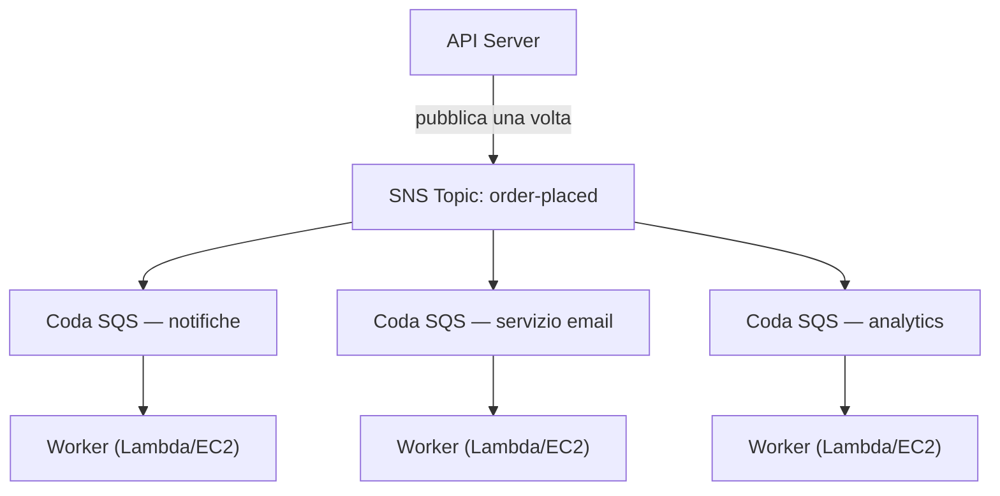

# Capitolo 19: La Macchina dei Biglietti

La macchina dei biglietti era una rivoluzione silenziosa. Prima di essa, dovevi stare in fila — la tua posizione richiedeva la tua presenza fisica, e se la persona davanti era lenta, tutti quelli dietro si fermavano. Prendi un numero, e la fila diventava una coda. Le persone potevano sedersi. Il bancone del servizio lavorava al proprio ritmo. Nessuno bloccava nessuno.

La macchina dei biglietti separò l'arrivo dal servizio. Arrivavi, prendevi un numero, e il sistema ricordava il tuo posto. Potevi andare a sederti. Il bancone del servizio smaltiva i numeri al ritmo che riusciva a gestire. Se il bancone era temporaneamente chiuso, i nuovi arrivati ricevevano comunque i numeri. Aspettavano. Il lavoro non spariva — si metteva in coda.

Questa piccola invenzione è uno dei più antichi esempi di decoupling nei sistemi umani. Entro la fine di questo capitolo, Nimbus avrà costruito la propria macchina dei biglietti — in software — e il motivo per cui ne aveva bisogno comincia con sedici minuti di downtime un venerdì sera.

---

Il team era sopravvissuto al guasto dell'AZ. Leo aveva sistemato il processo di chaos engineering, e il runbook era solido. Il traffico si era ripreso e stava crescendo di nuovo — più velocemente di prima, in effetti. La documentazione di Aurora che Leo leggeva a tarda notte era ancora qualche capitolo più avanti rispetto a dove Nimbus si trovava davvero.

Ma con il traffico in crescita e più ristoranti in fase di onboarding, un tipo diverso di collo di bottiglia stava diventando visibile. Non nell'infrastruttura. Nel codice dell'applicazione stessa. La catena di richieste che funzionava bene a 200 ordini all'ora cominciava a mostrare segni di sforzo a 800.

E poi arrivò la sera del 14.

---

Era cominciato con la dashboard di analytics. Alle 18:47 di un venerdì, un deploy al servizio di analytics introdusse un bug di timeout. Il servizio iniziò a rispondere in 8 secondi invece dei soliti 200 millisecondi.

Il flusso degli ordini era sincrono. Ogni ordine aspettava il servizio di analytics prima di confermare al cliente. Otto secondi diventarono 12 con l'aumentare del carico. Il connection pool dell'API iniziò a riempirsi di richieste in attesa che il passaggio di analytics si completasse.

Alle 18:53, il connection pool raggiunse il suo limite. Le nuove richieste iniziarono a fallire immediatamente — non perché l'ordine non potesse essere elaborato, ma perché non c'era nessuna connessione disponibile per iniziare a elaborarlo.

"Il servizio di analytics ha buttato giù il flusso degli ordini," disse Leo, guardando i log la mattina seguente. "Non hanno niente a che fare l'uno con l'altro. Il servizio di analytics calcola solo le dashboard."

"Ma sono nella stessa catena di richieste," disse Priya.

"Sedici minuti di downtime," disse Maya. "E tre clienti sono stati addebitati due volte."

Il doppio addebito era peggio del downtime. Nel caos della saturazione del connection pool, un meccanismo di retry era scattato per alcune richieste che in realtà erano riuscite — il passaggio di pagamento si era completato, poi la richiesta era andata in timeout prima di ritornare, e il retry aveva tentato di nuovo il pagamento. Stessa carta, stesso importo, due addebiti.

"Il meccanismo di retry doveva aiutare," disse Leo.

"Ha aiutato nella direzione sbagliata," disse Priya. "E abbiamo pensato a cosa succede quando proviamo a rimborsare quei clienti? Il processo di rimborso usa lo stesso flusso degli ordini che è fallito."

Sedici minuti di downtime e tre doppi addebiti. Quello era il costo di business della catena di richieste sincrona.

---

Nimbus aveva un problema che non sembrava un problema finché gli ordini non diventarono popolari.

Ogni volta che veniva effettuato un ordine, il server API doveva:

1. Salvare l'ordine nel database
2. Inviare una notifica al tablet del ristorante
3. Inviare un'email di conferma al cliente
4. Aggiornare la dashboard di analytics del ristorante
5. Registrare l'evento per la fatturazione

A un bancone di gastronomia affollato, la persona alla cassa non aspetta che l'affettatrice finisca di tagliare prima di passare al cliente successivo. Prende l'ordine, lo passa alla cucina e inizia a servire la persona successiva. La cucina smaltisce gli ordini al proprio ritmo. Il cliente riceve un servizio più veloce. La cucina non viene sopraffatta da picchi improvvisi. Se la cucina ha un momento di lentezza, gli ordini si accumulano dietro il bancone invece di causare errori alla cassa.

Quella era l'analogia. Nimbus non aveva un bancone e una cucina. Aveva una sola persona che faceva tutto in sequenza prima che il cliente potesse andarsene.

E il 14, la persona che tagliava la carne aveva avuto un problema. Quindi il bancone si era fermato. Quindi ogni cliente dopo di quello aveva aspettato. La cucina, la cassa, i clienti — tutti in pausa perché un passaggio della catena aveva rallentato.

La soluzione non era rendere più veloce il taglio della carne. La soluzione era separare i passaggi. Prendere l'ordine alla cassa, consegnare un biglietto, lasciare lavorare la cucina.

"Siamo strettamente accoppiati," disse Priya. "Se un qualsiasi passaggio a valle fallisce, l'intero ordine fallisce. Abbiamo pensato a cosa succede se il servizio di analytics viene compromesso e inizia a consumare messaggi malformati? L'intero ordine fallisce — perché lo stiamo aspettando."

"E se potessimo salvare l'ordine e confermare immediatamente al cliente," disse Leo, "e poi elaborare il resto in background?"

"Quella è una coda," disse Priya.

L'intuizione chiave: il cliente non ha bisogno di sapere che la dashboard di analytics è stata aggiornata prima di ricevere la sua conferma. Ha bisogno di sapere che il suo ordine è stato ricevuto. Sono cose diverse. La catena sincrona le confondeva.

**Il Modello del Decoupling**

Questo è il **decoupling**: separare il componente che accetta il lavoro dai componenti che lo elaborano.

Tutti i passaggi del flusso degli ordini di Nimbus dovevano avvenire in modo sincrono prima che l'API potesse rispondere al cliente. Se il servizio email era lento (a volte lo era), il cliente aspettava. Se la dashboard di analytics era giù (a volte lo era), l'ordine falliva.

La cascata del 14 dimostrò esattamente perché questo era importante. Il servizio di analytics non aveva niente a che fare con l'accettazione dell'ordine di un cliente. Ma poiché si trovava nella stessa catena sincrona, il suo guasto diventò il guasto di tutti.

Nei sistemi software, la coda è spesso un message broker — un servizio che accetta messaggi dai produttori e li consegna ai consumatori.

Forse ti starai chiedendo: se il flusso degli ordini ora è asincrono, come fa il cliente a sapere che il suo ordine è stato davvero ricevuto? La risposta è nel design dell'architettura: l'API salva l'ordine nel database (sincrono — questa è la conferma autoritativa), poi pubblica gli eventi sulla coda. La conferma al cliente si basa sul successo della scrittura nel database, non sul completamento dei servizi a valle. Se il servizio email è lento, il cliente ha già la sua conferma. L'email è solo un follow-up gradito ma non essenziale.

**Amazon SQS: La Coda**

**Amazon SQS (Simple Queue Service)** è il servizio di code di messaggi gestito di AWS. Memorizza i messaggi in modo durevole finché non vengono elaborati da un consumatore.

Il flusso di base:

1. Il **produttore** (il server API) mette un messaggio nella coda: `{ "orderId": "ORD-5532", "restaurantId": "47", "items": [...] }`
2. L'API risponde immediatamente al cliente: "Ordine confermato!"
3. I **consumatori** (servizi worker separati) leggono i messaggi dalla coda e li elaborano: inviano la notifica al ristorante, inviano l'email di conferma, aggiornano l'analytics

L'esperienza del cliente: conferma istantanea. L'elaborazione a valle: avviene in modo asincrono, al ritmo dei worker.

**Concetti Chiave di SQS**

**Visibility timeout del messaggio**: quando un consumatore legge un messaggio da SQS, il messaggio diventa *invisibile* agli altri consumatori per un periodo (default: 30 secondi). Questo dà al consumatore il tempo di elaborarlo. Se il consumatore finisce con successo, elimina il messaggio. Se il consumatore va in crash, il visibility timeout scade e il messaggio torna visibile perché un altro consumatore possa riprovare.

Questo garantisce la consegna at-least-once: ogni messaggio verrà elaborato almeno una volta, anche se un consumatore fallisce a metà elaborazione.

Forse ti starai chiedendo: se il messaggio diventa invisibile durante l'elaborazione ma non viene eliminato quando il consumatore va in crash, non potrebbe essere elaborato due volte? Sì — e questa si chiama consegna at-least-once. Significa che ogni consumatore deve essere progettato per gestire la ricezione dello stesso messaggio più di una volta senza causare problemi. Un'email di conferma d'ordine duplicata è fastidiosa. Un addebito duplicato è un ticket di assistenza. Progetta i tuoi consumatori di conseguenza.

Il visibility timeout deve essere più lungo del tuo tempo di elaborazione massimo atteso. Se l'elaborazione richiede tipicamente 20 secondi ma occasionalmente ne richiede 90, e il tuo visibility timeout è di 30 secondi, quell'occasionale elaborazione di 90 secondi sembrerà un fallimento a SQS. Il messaggio torna visibile. Un secondo consumatore lo prende. Ora due worker stanno elaborando lo stesso messaggio. Se la tua elaborazione non è idempotente, hai un problema.

Un errore comune: impostare il visibility timeout uguale al tempo medio di elaborazione. L'approccio corretto: impostarlo al tempo di elaborazione del 99° percentile, con un margine di sicurezza. Se il tempo di elaborazione P99 è di 45 secondi, imposta il visibility timeout a 90 secondi.

**Dead-letter queue (DLQ)**: se un messaggio fallisce l'elaborazione troppe volte (configurabile — ad esempio, 5 tentativi), SQS lo sposta in una dead-letter queue. Ispezioni la DLQ per capire perché i messaggi stanno fallendo, senza perderli.

La DLQ è dove impari cosa sta davvero fallendo in produzione. Senza di essa, i messaggi falliti semplicemente spariscono e non hai modo di indagare.

Tre settimane dopo la migrazione a SQS, Leo notò che 23 messaggi si erano accumulati nella DLQ del servizio di notifica. Non aveva controllato la DLQ (l'aveva configurata correttamente e poi aveva dato per scontato che sarebbe rimasta vuota).

Estrasse un messaggio e guardò il payload:

```json
{
  "orderId": "ORD-9821",
  "restaurantId": "12",
  "customerMessage": "Extra spicy please 🌶️🔥",
  "timestamp": "2024-01-18T19:43:11Z"
}
```

L'emoji. Il servizio di notifica ai ristoranti codificava i payload dei messaggi in Latin-1 prima di inviarli all'API legacy dei tablet del ristorante. I caratteri emoji — quattro byte ciascuno in UTF-8 — venivano corrotti, facendo sì che l'API del tablet rifiutasse la richiesta. Il messaggio ritentava, falliva di nuovo, ritentava ancora, falliva ancora. Dopo 5 tentativi, SQS lo spostava nella DLQ.

"Tutti e 23 i messaggi hanno emoji nel campo delle note del cliente," disse Leo.

"Quindi a ogni cliente che ha aggiunto un'emoji alle note dell'ordine, la nota non è mai arrivata al ristorante, silenziosamente," disse Maya.

"Sì."

"Per quanto tempo?"

Leo controllò il timestamp del messaggio più vecchio. "Tre settimane."

Priya rimase in silenzio. "E se qualcuno avesse capito che aggiungere un'emoji a una nota d'ordine causava un fallimento silenzioso? Potresti effettuare ordini con emoji e garantire che il ristorante non vedesse mai l'istruzione. E poi lamentarti dell'ordine sbagliato."

Nessuno lo aveva sfruttato. Ma era la domanda giusta da fare.

Leo corresse il bug di encoding. Poi scrisse uno script per rigiocare tutti i 23 messaggi bloccati dalla DLQ. I ristoranti ricevettero le loro istruzioni piccanti con emoji (vecchie di tre settimane). I clienti non lo seppero mai.

La lezione: la DLQ deve essere monitorata attivamente, non configurata e dimenticata. Una DLQ in crescita è un segnale silenzioso che qualcosa sta fallendo ripetutamente.

**Tipi di coda**:

**Code Standard**: throughput massimo (messaggi al secondo illimitati). L'ordine di consegna è best-effort (non garantito). Consegna at-least-once (molto raramente, un messaggio potrebbe essere consegnato due volte).

**Code FIFO**: ordinamento first-in, first-out rigoroso. **Elaborazione** exactly-once — deduplicazione basata su un `MessageDeduplicationId` entro una finestra di 5 minuti. L'ordinamento è garantito *per* `MessageGroupId`: i messaggi nello stesso gruppo arrivano in ordine; gruppi diversi possono essere elaborati in parallelo, ed è così che FIFO scala. Il throughput di base è di 3.000 messaggi al secondo con il batching (300 senza); abilitando la **high-throughput mode** si arriva a decine di migliaia al secondo partizionando tra i message group. Usa FIFO quando l'ordine conta (transazioni finanziarie, cambiamenti di stato sequenziali).

Se hai bisogno del throughput massimo e puoi tollerare occasionali messaggi duplicati, usa SQS Standard — ma devi progettare ogni consumatore per gestire i duplicati senza causare problemi. Se hai bisogno di ordinamento rigoroso ed elaborazione exactly-once, usa SQS FIFO — e progetta bene i tuoi `MessageGroupId`, perché il parallelismo (e quindi il throughput) viene dall'avere molti gruppi.

Per Nimbus, la maggior parte delle code usava code standard. La coda di fatturazione usava FIFO per garantire che gli addebiti venissero elaborati in ordine.

**Auto Scaling sulla Profondità della Coda: Scalare i Worker in Base all'Arretrato**

Una delle applicazioni più potenti di SQS è usare la profondità della coda come trigger di Auto Scaling. Invece di scalare in base a CPU o memoria, scali in base a quanto lavoro è in attesa.

Per il servizio di notifica di Nimbus: la profondità della coda SQS (il numero di messaggi in attesa di essere elaborati) era collegata a una policy di Application Auto Scaling per il servizio ECS che eseguiva i worker di notifica.

Policy: quando la coda ha più di 50 messaggi per task worker, aggiungi un task. Quando la coda ha meno di 10 messaggi per task worker, rimuovi un task.

L'effetto pratico: quando 1.200 ordini arrivarono durante il picco del venerdì sera, la profondità della coda di notifica schizzò e la flotta di worker scalò da 2 task a 8 task in 3 minuti. A mezzanotte, la coda era vuota e la flotta era tornata a 2.

"Quanto costa al mese?" chiese Tom, guardando il grafico dell'Auto Scaling.

"Niente di extra per l'Auto Scaling in sé," disse Leo. "Ma 6 task ECS extra per 3 ore il venerdì sera — quello è significativo."

Tom fece i conti. "Circa $14/mese per quei picchi. E prima, eseguivamo 8 task continuamente a costo pieno?"

"Sì."

"Quindi paghiamo per il burst quando ci serve e niente altrimenti."

Questo è il pattern di scaling sulla profondità della coda: la coda diventa un buffer che assorbe i picchi di traffico, e la flotta di worker scala per svuotare il buffer. Gli utenti non sperimentano lentezza — hanno ricevuto la loro conferma immediatamente quando l'ordine è stato accettato. I worker impiegano solo un po' più di tempo per recuperare. E poiché non stai eseguendo la capacità di picco 24 ore su 24, 7 giorni su 7, i costi sono significativamente più bassi.

**Amazon SNS: Il Trasmettitore**

**Amazon SNS (Simple Notification Service)** è un servizio di messaggi publish/subscribe (pub/sub). Invece di un produttore, un consumatore (coda), SNS supporta un messaggio consegnato a *molti* sottoscrittori simultaneamente.

Il modello:

1. Un **publisher** invia un messaggio a un **topic** SNS
2. Tutti i **sottoscrittori** di quel topic ricevono il messaggio simultaneamente (fan-out)

I sottoscrittori possono essere:

- Code SQS (il messaggio viene spinto in una coda per l'elaborazione asincrona)
- Funzioni Lambda (la funzione viene attivata direttamente)
- Endpoint HTTP/HTTPS (consegna webhook)
- Indirizzi email
- SMS (numeri di telefono)

Per Nimbus, l'evento di ordine effettuato viene pubblicato su un topic SNS chiamato `order-events`:

- Il servizio di notifica ai ristoranti si sottoscrive (riceve sulla sua coda SQS)
- Il servizio email si sottoscrive (riceve sulla sua coda SQS)
- Il servizio di analytics si sottoscrive (riceve sulla sua coda SQS)
- Il servizio di fatturazione si sottoscrive (riceve sulla sua coda SQS FIFO)

Un evento di ordine. Quattro sottoscrittori. Tutti notificati simultaneamente. Ognuno elabora al proprio ritmo.

"Quindi SNS è l'annuncio," disse Maya, "e SQS è la casella di posta dove ogni team elabora l'annuncio alla propria velocità. Ma allora perché usare entrambi? Perché non far sottoscrivere tutti direttamente al topic SNS?"

"Perché la consegna diretta di SNS è fire-and-forget," disse Leo. "Se il servizio di analytics è giù quando SNS spara, quel messaggio è perso. Con una coda SQS in mezzo, il messaggio aspetta finché il servizio non si riprende."

"Esattamente," disse Priya. "Il fan-out SNS/SQS è il pattern standard."

**Il Pattern Fan-Out SNS/SQS**

Questa combinazione — un topic SNS che alimenta più code SQS — è uno dei pattern architetturali più importanti di AWS:



Ogni coda è indipendente. Il servizio di analytics può essere lento — la sua coda si riempie, ma i servizi di notifica ed email continuano senza essere toccati. Se il servizio di analytics va giù, i suoi messaggi aspettano nella coda finché non torna su. Niente viene perso.

Questa è la proprietà chiave: il **guasto indipendente**. I problemi in un consumatore non si propagano agli altri.

**Filtraggio dei Messaggi: Non Ogni Messaggio per Ogni Sottoscrittore**

Man mano che i sistemi crescono, non vuoi che ogni sottoscrittore elabori ogni messaggio. Un servizio di analytics non dovrebbe ricevere messaggi sulle elaborazioni di pagamento fallite se gli interessano solo gli ordini completati.

**Il filtraggio dei messaggi SNS** consente ai sottoscrittori di specificare filter policy — consegnare solo i messaggi che corrispondono a determinati attributi.

Il servizio di notifica ai ristoranti si sottoscrive con un filtro: solo i messaggi dove `status = "confirmed"`.

Il servizio di alerting degli errori si sottoscrive con un filtro: solo i messaggi dove `status = "failed"`.

Ogni sottoscrittore riceve solo ciò di cui ha bisogno.

Senza filtraggio, ogni sottoscrittore riceve ogni messaggio e deve ignorare ciò che è irrilevante. Questo spreca elaborazione, spreca denaro (SQS fattura per messaggio) e introduce rumore. Un sistema di ordini ad alto volume senza filtraggio inonderebbe la coda di alerting degli errori con ordini riusciti — rendendo difficili da trovare i veri fallimenti.

Le filter policy hanno questo aspetto:

```json
{
  "status": ["confirmed"],
  "region": ["us-west-2", "us-east-1"]
}
```

Questo sottoscrittore riceve solo i messaggi dove status è "confirmed" E region è "us-west-2" oppure "us-east-1". I messaggi che non corrispondono alla policy non vengono consegnati affatto alla coda di questo sottoscrittore — non raggiungono nemmeno SQS.

"Quindi il filtraggio avviene al livello SNS," disse Priya, "prima che i messaggi vengano scritti su SQS?"

"Corretto. La coda SQS del servizio di notifica ai ristoranti vede sempre e solo i messaggi su cui deve agire."

"E se qualcuno cercasse di intrufolarsi pubblicando sul topic SNS un messaggio costruito appositamente per corrispondere a tutti i filtri dei sottoscrittori?" chiese Priya.

Il topic SNS aveva una resource policy IAM: solo il servizio API degli ordini (tramite il suo ruolo IAM) era autorizzato a pubblicare. Le access policy di SNS e le queue policy di SQS formavano il livello di controllo degli accessi — il filtraggio serviva solo per il routing, non per la sicurezza.

**Quando Usare SQS vs SNS**

**SQS da solo**: un produttore, un consumatore (o più consumatori in competizione sulla stessa coda). I messaggi devono essere elaborati una volta, in ordine (FIFO) o no (standard). Pattern della worker queue — una coda, più worker che consumano da essa.

**SNS da solo**: notifiche fire-and-forget. Push verso email, SMS o endpoint HTTP. Nessun bisogno di mettere in coda il messaggio — basta notificare e andare avanti.

**SNS + SQS (fan-out)**: un evento, più consumatori indipendenti. Ogni consumatore ha la propria coda, elabora in modo indipendente e può fallire in modo indipendente.

## Topic SNS FIFO

Tutto quanto detto sopra su SNS usa topic standard — hanno un throughput di fatto illimitato, consegnano ai sottoscrittori quasi simultaneamente, e fanno il loro lavoro per la stragrande maggioranza dei casi d'uso.

Ma i topic SNS standard non garantiscono l'ordinamento. Se pubblichi dieci messaggi in sequenza, i sottoscrittori potrebbero riceverli in un ordine leggermente diverso. Per le notifiche degli ordini di Nimbus, va bene — un aggiornamento di analytics che arriva una frazione di secondo prima di un'email di conferma non importa.

Per alcuni scenari, importa. Considera un libro mastro finanziario: se due eventi — un accredito e poi un addebito — vengono consegnati in ordine inverso, i calcoli del saldo durante l'elaborazione saranno sbagliati anche se entrambi gli eventi vengono alla fine elaborati correttamente.

I **topic SNS FIFO** applicano lo stesso principio delle code SQS FIFO al modello fan-out. I messaggi vengono consegnati ai sottoscrittori nell'esatto ordine in cui sono stati pubblicati, e ogni messaggio viene consegnato esattamente una volta.

Il compromesso: i topic SNS FIFO hanno un throughput di base simile a SQS FIFO (3.000 messaggi al secondo per topic; 300 al secondo per message group — con una high-throughput mode disponibile dal 2025 per molto di più), e fanno fan-out solo verso **code SQS** — FIFO o, dal 2023, Standard. Sottoscrivere una coda Standard è utile per i consumatori a cui l'ordine non interessa (un feed di analytics, per esempio), ma ordinamento ed exactly-once sopravvivono end-to-end **solo** verso le code FIFO. Non puoi usare un topic SNS FIFO per consegnare a endpoint HTTP o indirizzi email.

Per la pipeline di fatturazione di Nimbus — dove una sequenza di aggiornamenti di prezzo doveva essere applicata agli account dei ristoranti in ordine — il topic SNS di fatturazione fu migrato da standard a FIFO. La coda SQS di fatturazione era già FIFO. Il fan-out ora garantiva che un evento di aumento di prezzo non arrivasse mai al processore di fatturazione prima dell'evento di inizio periodo da cui dipendeva.

> **Nota — SNS FIFO**
>
> Se uno scenario richiede una **consegna fan-out ordinata** verso più sottoscrittori, la risposta è **SNS FIFO**. SNS Standard non garantisce l'ordinamento. SNS FIFO fa fan-out solo verso code SQS — per mantenere ordinamento ed exactly-once end-to-end, il sottoscrittore deve essere una coda SQS **FIFO** (le sottoscrizioni con code Standard sono consentite ma ottengono ordinamento best-effort e consegna at-least-once). Il throughput di default è 3.000/sec per topic — se lo scenario descrive un volume molto più alto *e* ordinamento rigoroso, è un segnale per guardare ad architetture alternative (Kinesis, per esempio, trattato in un capitolo successivo).

## Quando la Coda Legacy Non Molla la Presa

Nimbus stava per chiudere la sua acquisizione più grande di sempre: Barato, un concorrente nel food delivery con 200 ristoranti e due anni di vantaggio sulle operazioni. Il team di ingegneria fissò una call di pianificazione dell'integrazione.

La call durò venti minuti prima che Leo ammutolisse.

"Il loro sistema di elaborazione degli ordini," disse. "Su cosa gira?"

"ActiveMQ," disse l'ingegnere di Barato dall'altra parte. "Broker on-prem. L'app è Java. Gira dal 2018. Tutto parla AMQP."

"AMQP," disse Leo.

"Sì."

Guardò il diagramma di architettura sul suo schermo. Nimbus eseguiva SQS e SNS. SQS non parla AMQP. SNS non parla AMQP. L'applicazione di Barato non parlava nient'altro.

"Riscriverla richiederà sei mesi," disse Leo al team dopo la call. "Come minimo."

"Non possiamo ritardare l'acquisizione di sei mesi," disse Maya.

"E non possiamo eseguire un broker ActiveMQ bare-metal in AWS," aggiunse Priya. "Abbiamo pensato a come appare dal punto di vista della sicurezza e dell'affidabilità? Un message broker auto-gestito, in produzione, senza patching gestito, senza failover automatico, connesso alla nostra infrastruttura?"

"C'è un'opzione gestita," disse Leo lentamente. Aveva letto mentre parlavano. "Amazon MQ."

**Amazon MQ: Il Broker Gestito**

**Amazon MQ** è un servizio di message broker gestito per Apache ActiveMQ e RabbitMQ. Esegue il tuo broker esistente — lo stesso broker a cui le tue applicazioni sono connesse da anni — ma come servizio AWS gestito. AWS si occupa dell'infrastruttura sottostante: provisioning, patching, failover, backup.

La proprietà chiave che rende Amazon MQ diverso da SQS e SNS: parla i protocolli che parlano i message broker legacy. AMQP, STOMP, MQTT, OpenWire, NMS. I protocolli che SQS e SNS semplicemente non capiscono.

Per l'integrazione di Barato, il piano era semplice. AWS avrebbe eseguito un broker Amazon MQ configurato come ActiveMQ. L'applicazione Java di Barato sarebbe stata puntata al nuovo endpoint del broker invece che a quello on-premises. La modifica lato applicazione: aggiornare un file di configurazione con la nuova connection string. Tutto qui. L'applicazione non aveva bisogno di sapere che stava parlando con un broker cloud gestito invece che con un server nell'ufficio di Barato.

"Un momento," disse Maya. "Se alla fine li integreremo in Nimbus, non dovremmo semplicemente migrarli a SQS fin dall'inizio?"

"Perché il percorso di migrazione esiste," disse Leo. "E vale la pena farlo per bene — prima o poi. Ma in questo momento, ci serve Barato operativo su infrastruttura AWS in trenta giorni, non sei mesi. Amazon MQ fa funzionare l'applicazione senza cambiare l'applicazione. Poi avremo tempo per pianificare la migrazione a SQS come progetto deliberato, non come prerequisito raffazzonato per l'acquisizione."

"Quanto costa al mese?" chiese Tom.

Il broker Amazon MQ — una singola coppia attivo/standby per l'affidabilità — era nell'ordine di $200/mese per un broker adatto al volume di Barato. Confrontato con il costo di sei mesi di tempo di riscrittura, non c'era discussione.

Priya approvò il piano con una condizione: l'istanza Amazon MQ sarebbe vissuta in una subnet privata, con regole di security group che permettevano connessioni solo dagli application server di Barato. Nessuna esposizione pubblica. Audit logging abilitato.

La migrazione richiese dodici giorni. L'applicazione di Barato si connesse ad Amazon MQ il tredicesimo giorno. Il quattordicesimo giorno, elaborò il suo primo ordine su infrastruttura AWS senza una singola modifica al codice.

---

> **Nota — Amazon MQ**
>
> *SAA-C03 Dominio: Progettare Architetture Resilienti (Dominio 2)*
>
> L'esame distingue Amazon MQ da SQS e SNS su un singolo asse: la **compatibilità di protocollo**. Se lo scenario descrive un'applicazione che usa già un message broker e parla un protocollo specifico, Amazon MQ è quasi certamente la risposta.
>
> I segnali chiave: **"ActiveMQ," "RabbitMQ," "AMQP," "STOMP," "MQTT," "OpenWire,"** o qualsiasi frase equivalente a **"senza modificare il codice dell'applicazione."** Se vedi queste frasi, la risposta è Amazon MQ — non SQS, non SNS.
>
> Se lo scenario descrive un'applicazione *nuova* che ha bisogno di decoupling, o non menziona un broker legacy o un protocollo specifico, usa SQS/SNS.
>
> Un altro segnale: "migrare un message broker on-premises esistente su AWS." Se l'app deve continuare a parlare lo stesso protocollo allo stesso tipo di broker, Amazon MQ è la risposta lift-and-shift.

**Idempotenza: Un Approfondimento Pratico**

L'idempotenza suona astratta finché non hai avuto tre clienti con doppio addebito.

Un'operazione è **idempotente** se eseguirla più volte produce lo stesso risultato di eseguirla una volta. Un'operazione di addebito non è naturalmente idempotente: eseguirla due volte addebita due volte. Un'operazione di addebito idempotente verifica se l'addebito è già stato elaborato prima di tentarlo.

Il pattern: ogni messaggio porta con sé un ID univoco (l'ID dell'ordine, o un message ID separato). Prima dell'elaborazione, il consumatore controlla uno store (DynamoDB funziona bene per questo) per vedere se questo message ID è già stato elaborato con successo. Se sì: non fare nulla, elimina il messaggio. Se no: elabora, registra l'ID, elimina il messaggio.

```python
def process_charge(message):
    order_id = message['orderId']
    
    # Controllo di idempotenza
    if already_processed(order_id):
        logger.info(f"Ordine {order_id} già addebitato, salto il duplicato")
        return  # Il messaggio verrà eliminato dalla coda
    
    # Elabora l'addebito
    charge_result = payment_service.charge(
        amount=message['amount'],
        card_token=message['cardToken'],
        idempotency_key=order_id  # Passalo anche al processore di pagamento
    )
    
    # Registra che abbiamo elaborato questo messaggio
    mark_as_processed(order_id, charge_result)
```

La chiave di idempotenza dovrebbe essere passata anche ai servizi a valle (processori di pagamento, sistemi email) che la supportano. Stripe, per esempio, accetta un header `Idempotency-Key` che previene addebiti duplicati anche se la stessa chiamata API viene fatta due volte.

"E i correlation ID?" chiese Priya. "Quando un messaggio si muove attraverso più servizi, come tracciamo quale richiesta ha causato quale azione a valle?"

**Correlation ID: Tracciare Attraverso i Servizi**

Quando un cliente effettua un ordine, la richiesta fluisce attraverso: API → SNS → SQS → worker di notifica → API del tablet del ristorante → SQS → worker email → SES.

Senza correlation ID, se l'API del tablet del ristorante restituisce un errore al passo 6, i log di ogni servizio mostrano l'evento, ma non c'è modo di risalire dall'inizio all'ordine specifico di quel cliente.

Un **correlation ID** è un identificatore univoco allegato alla richiesta originale e passato attraverso ogni interazione tra servizi. Ogni servizio include il correlation ID nei propri log.

Quando Priya cerca in CloudWatch un correlation ID specifico, ottiene ogni riga di log — attraverso ogni servizio — che ha fatto parte dell'elaborazione di quel singolo ordine.

"Una precisazione," disse Priya. "I correlation ID arrivano dall'esterno. Qualcuno potrebbe iniettare un ID malevolo e manomettere il nostro logging?"

I correlation ID sono interni — non influenzano la logica di elaborazione, solo il logging. Sanificarli (alfanumerici, lunghezza fissa) previene attacchi di injection negli output dei log.

**Quando il Decoupling È la Scelta Sbagliata**

"Aspetta — ma *perché* non dovremmo disaccoppiare tutto?" chiese Maya.

Era una domanda giusta. Se il decoupling previene i guasti a cascata e rende i sistemi resilienti, perché non applicarlo ovunque?

Perché il decoupling ha dei costi. E ci sono scenari in cui quei costi superano i benefici.

**Quando serve coerenza immediata**: se un pagamento deve essere confermato prima che un ordine possa procedere — e l'utente sta aspettando il risultato sullo schermo — non puoi mettere il pagamento in una coda asincrona e restituire una conferma prima di sapere se l'addebito è riuscito. L'utente potrebbe ordinare due volte prima che il primo addebito si completi. Il decoupling asincrono non funziona per operazioni in cui la risposta dipende dall'esito.

**Quando il workflow è intrinsecamente sequenziale**: se il passo 3 deve vedere il risultato del passo 2 per prendere una decisione, non possono girare in parallelo da una coda. Forzarli in una coda crea un goffo meccanismo di passaggio dei risultati che spesso finisce per essere più complesso della versione sincrona.

**Quando l'ordinamento dei messaggi è critico e il volume è basso**: SQS Standard non garantisce l'ordinamento. SQS FIFO sì, ma ha un tetto di 3.000 messaggi/secondo con batching di default (la high-throughput mode lo alza sostanzialmente). Se hai un workflow a basso volume e rigorosamente ordinato, una semplice coda sincrona (come un row lock di database) potrebbe essere più semplice e affidabile.

**Quando l'overhead supera il beneficio**: un piccolo strumento interno con un utente e nessuna SLA probabilmente non ha bisogno di topic SNS in fan-out e DLQ. L'overhead operativo di monitorare code e DLQ è reale. Dimensiona l'architettura sul problema.

La domanda non è "dovrei disaccoppiare questo?" È "qual è il costo di questo accoppiamento, e il decoupling riduce quel costo più di quanto ne aggiunga?"

## Punti di Forza e Limitazioni

**Perché SQS e SNS sono potenti**:

- SQS fornisce una consegna di messaggi durevole e affidabile — i messaggi sono memorizzati su più AZ
- Il decoupling consente scaling e deployment indipendenti dei servizi produttore e consumatore
- Le dead-letter queue assicurano che nessun messaggio venga perso silenziosamente in caso di errore
- Il pattern fan-out di SNS consente di aggiungere nuovi consumatori senza modificare il produttore

**Dove si complica**:

- La consegna at-least-once significa che i consumatori devono essere *idempotenti* — elaborare lo stesso messaggio due volte non deve causare problemi (ordini duplicati, addebiti duplicati)
- Le code FIFO sono più costose e hanno limiti di throughput
- Il debugging dei messaggi falliti attraverso più code e servizi richiede buon logging e osservabilità
- Le garanzie di ordinamento dei messaggi sono limitate — se l'ordinamento rigoroso conta attraverso più servizi, il design diventa complesso

## Riepilogo

Il decoupling è il principio di resilienza del Capitolo 18 applicato all'architettura interna: nello stesso modo in cui Multi-AZ elimina i singoli punti di guasto nell'infrastruttura, SQS e SNS eliminano i singoli punti di guasto nelle catene di richieste.

- Il **decoupling** separa i componenti che producono lavoro dai componenti che lo elaborano.
- **SQS** dà ai produttori un posto durevole dove mettere il lavoro quando i consumatori sono lenti, offline o in fase di scaling.
- **SNS** permette a un evento di raggiungere più consumatori indipendenti senza che il publisher sappia chi sono.
- **SNS + SQS fan-out** permette a ogni servizio a valle di elaborare lo stesso evento al proprio ritmo.
- **DLQ, idempotenza e correlation ID** sono la disciplina operativa che rende i sistemi asincroni debuggabili invece che misteriosi.
- **Non disaccoppiare alla cieca**: workflow sincroni, requisiti di coerenza immediata e piccoli strumenti a basso rischio potrebbero non giustificare la superficie operativa aggiuntiva.

## Suggerimenti per l'Esame

*SAA-C03 Dominio: Progettare Architetture Resilienti (Dominio 2, Task 2.1)*

- **SQS Standard vs FIFO**: l'esame distingue per ordinamento e garanzie di consegna. "Deve elaborare in ordine" → FIFO. "Throughput massimo" → Standard.
- **Auto Scaling sulla profondità della coda**: "scalare i worker in base alla profondità della coda" → metrica SQS (ApproximateNumberOfMessagesVisible) usata con Application Auto Scaling o ECS Service Auto Scaling.
- **Visibility timeout**: concetto chiave per la consegna at-least-once. Se un consumatore fallisce, il messaggio torna visibile dopo il timeout. Scenario d'esame: "i messaggi vengono elaborati due volte" → il visibility timeout è troppo breve (il consumatore impiega più del timeout per elaborare).
- **Dead-letter queue**: i messaggi che falliscono dopo N tentativi vengono spostati qui. Scenario d'esame: "garantire che nessun messaggio venga perso, anche se l'elaborazione fallisce ripetutamente" → DLQ.
- **Fan-out SNS**: pattern d'esame classico per un evento che attiva più consumatori. "La notifica di ordine effettuato deve attivare email, SMS e aggiornamento dell'inventario simultaneamente" → topic SNS con sottoscrizioni SQS.
- **SQS + Lambda**: Lambda può essere configurato per fare polling su una coda SQS e attivarsi su ogni batch di messaggi. L'esame lo usa per l'elaborazione event-driven su larga scala.
- **Long polling SQS**: invece di consumatori che fanno polling ogni pochi secondi (short polling, spreca chiamate API), il long polling attende fino a 20 secondi per un messaggio. Riduce i costi e le false risposte vuote.
- **SQS Extended Client Library**: per messaggi più grandi del limite di payload della coda (256KB di default; aumentabile a 1MB dal 2025), usa la SQS Extended Client Library, che memorizza il corpo del messaggio in S3 e invia un riferimento via SQS. L'esame tratta ancora 256KB come il limite di SQS — "messaggio SQS troppo grande" → Extended Client Library + S3.
- **Filtraggio dei messaggi SNS**: i sottoscrittori ricevono solo i messaggi che corrispondono alla loro filter policy. Scenario d'esame: "inviare a un sottoscrittore solo le notifiche che corrispondono a criteri specifici" → filtraggio dei messaggi SNS.
- **Nota**: il fan-out SNS/SQS appare anche negli scenari del Dominio 3 sulle architetture di elaborazione asincrona ad alto throughput. Conosci il pattern sia per le domande di resilienza sia per quelle di performance.
- **Segnali Amazon MQ**: "ActiveMQ," "RabbitMQ," "AMQP," "STOMP," "MQTT," "OpenWire," o "senza modificare il codice dell'applicazione" → Amazon MQ, NON SQS. Se lo scenario dice applicazione nuova che ha bisogno di decoupling → SQS/SNS.
- **SNS FIFO vs Standard**: SNS Standard non garantisce l'ordinamento. Se lo scenario richiede un **fan-out ordinato** → topic SNS FIFO che alimenta code SQS FIFO. Ricorda: SNS FIFO non può consegnare a endpoint HTTP o email — solo a code SQS (FIFO per ordinamento/exactly-once; le sottoscrizioni Standard funzionano ma degradano a ordinamento best-effort e at-least-once).

## Esercizi

**Esercizio 1 — Richiamo**

Spiega il pattern fan-out SNS/SQS. Perché il pattern usa code SQS invece di far sottoscrivere i servizi direttamente al topic SNS con endpoint HTTP?

*(Suggerimento: pensa alla macchina dei biglietti al bancone della gastronomia — un biglietto in coda aspetta finché il bancone non è pronto, ma un annuncio gridato una volta sola è perso se nessuno stava ascoltando.)*

**Esercizio 2 — Scenario SAA-C03**

*Scenario*: una piattaforma di e-commerce elabora 10.000 ordini all'ora. Quando viene effettuato un ordine, il sistema deve: (1) memorizzare l'ordine nel database, (2) scalare l'inventario, (3) inviare un'email di conferma e (4) aggiornare la dashboard di analytics. Attualmente, tutti e quattro i passaggi avvengono in modo sincrono — se il servizio di analytics è lento, i clienti aspettano. Il team vuole migliorare il tempo di risposta verso il cliente garantendo al contempo che nessun ordine venga perso.

Quale architettura affronta MEGLIO questo requisito?

A) Usare code SQS FIFO per elaborare tutti e quattro i passaggi in sequenza  
B) Far salvare all'API l'ordine e confermare immediatamente al cliente; pubblicare un evento su un topic SNS; far sottoscrivere i servizi di inventario, email e analytics tramite code SQS  
C) Usare istanze EC2 parallele per elaborare ogni passaggio simultaneamente, in modo sincrono  
D) Usare un API Gateway con validazione delle richieste per velocizzare l'elaborazione degli ordini

**Suggerimento 1**: la conferma al cliente dovrebbe essere immediata. Quali passaggi devono avvenire prima della risposta, e quali possono avvenire dopo?

**Suggerimento 2**: la lentezza del servizio di analytics non dovrebbe influenzare i servizi email o di inventario.

**Suggerimento 3**: il fan-out SNS permette a tutti e tre i servizi a valle di ricevere l'evento simultaneamente.

**Risposta**: B

**Spiegazione**: l'API salva l'ordine nel database (sincrono — deve essere fatto prima di confermare) e restituisce immediatamente una conferma. Poi pubblica un evento `order-placed` su un topic SNS. I servizi di inventario, email e analytics si sottoscrivono ciascuno tramite code SQS indipendenti. Elaborano al proprio ritmo — se l'analytics è lento, la sua coda cresce ma gli altri servizi non sono toccati. Se un servizio fallisce, i suoi messaggi rimangono nella coda SQS e vengono ritentati; dopo il numero configurato di tentativi falliti, vengono spostati nella DLQ.

**Perché non A?** Le code FIFO elaborano i messaggi in sequenza — questo non aiuta con il rallentamento sincrono. Inoltre, l'elaborazione sequenziale significa che la lentezza dell'analytics blocca comunque l'email.

**Perché non C?** "Istanze EC2 parallele che elaborano in modo sincrono" richiede comunque che tutti i passaggi si completino prima di rispondere al cliente. Aggiungere istanze non risolve l'accoppiamento sincrono.

**Perché non D?** API Gateway accelera il routing e la validazione delle API, ma non disaccoppia i passaggi di elaborazione a valle.

*SAA-C03 Dominio: Progettare Architetture Resilienti — Task 2.1*

**Esercizio 3 — Sfida di Architettura**

Nimbus sta costruendo un sistema di notifiche per i ristoranti partner. Quando un cliente effettua un ordine, il ristorante deve essere notificato tramite:

- La loro app tablet (notifica push)
- Un sistema di display in cucina (webhook HTTP verso il loro hardware locale)
- Un SMS di backup (se la notifica al tablet fallisce)

Il servizio di notifica al tablet è affidabile. Il webhook della cucina a volte è giù (i ristoranti spengono l'hardware all'orario di chiusura). L'SMS dovrebbe scattare solo se la notifica al tablet fallisce.

Progetta l'architettura usando SNS e SQS. Come gestiresti il requisito "SMS solo se il tablet fallisce"? Come ti assicureresti che il webhook della cucina non blocchi la notifica al tablet quando è offline?

Considera anche: quale visibility timeout è appropriato per la consegna del webhook della cucina se il tempo medio di risposta del webhook è di 2 secondi ma i ristoranti con hardware lento possono richiedere fino a 30 secondi? Quale policy di DLQ attiverebbe il fallback SMS dopo l'esaurimento dei retry del webhook?

*(Non esiste un'unica risposta corretta. L'obiettivo è esercitarsi nel design fan-out con routing condizionale.)*

## Scena Post-Crediti

Il nuovo flusso degli ordini era in produzione.

Leo lo aveva deployato un martedì pomeriggio senza prima eseguire un load test completo. "Andrà tutto bene," aveva detto a Priya. "L'architettura è solida."

I clienti effettuavano ordini. L'API rispondeva in 95 millisecondi. La conferma appariva sui loro telefoni istantaneamente.

Dietro le quinte: quattro servizi che elaboravano in modo asincrono. Il servizio di analytics aveva un bug che lo faceva andare in crash sugli ordini contenenti certi caratteri speciali nel nome dell'articolo. La sua coda si accumulò fino a 3.200 messaggi nell'arco di due ore.

I clienti non se ne accorsero mai.

Quando Leo corresse il bug e il servizio di analytics ripartì, elaborò l'arretrato in 18 minuti. Nessun dato fu perso. La DLQ era vuota.

Aggiornò la dashboard di CloudWatch. Profondità della coda: 0. Messaggi elaborati: 3.200. Errori: 0 (dopo la correzione).

"Questo è esattamente come sarebbe stato il 14," disse. "L'analytics ha avuto un problema. La coda lo ha assorbito. Tutto il resto ha continuato a funzionare."

"Questo è ciò che significa decoupling," disse Priya.

"Quanto costa al mese?" chiese Tom, già sulla pagina dei prezzi.

"Al nostro volume attuale, circa dodici dollari al mese per SQS." Fissò lo schermo. "Mi aspettavo di più."

Aveva lo sguardo di chi scopre che qualcosa di inaspettatamente economico era anche inaspettatamente buono.

"Configura gli alert sulla DLQ," ricordò Priya a Leo. "Non vogliamo altre tre settimane di fallimenti silenziosi."

"Già fatto," disse Leo.

Questa volta lo aveva fatto davvero.

Nel prossimo capitolo: la funzione che gira solo quando qualcuno bussa — e non costa niente quando non bussano.
