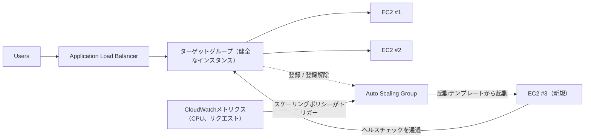

# 第7章：忙しくなると大きくなるレストラン

金曜の夜7時43分でした。

Tomの椅子はわずかに引かれていました。彼が何かを、話しかけても答えないことを意味する種類の集中で見つめているときになる引き方です。オフィスは1時間前に空っぽになっていました。彼は残っていました。

彼は、他の人がソーシャルメディアを確認するようにリフレッシュするメトリクスダッシュボードのタブを開いていました——反射的に、絶えず、ほとんど意図せずに。

ストレージの危機は彼らの後方にありました。データベースは自分自身のディスクを持っていました。写真はS3に存在していました。2週間、システムは安定していました——わくわくするものではなく、ただ安定。それは気分が良いはずでした。

それからエラー率が12%を超えました。

「Leo」とTomは言いました。

Leoはすでに見ていました。応答時間：上昇中。キューに入ったリクエスト：上昇中。単一のEC2インスタンス——先月の慎重な適正サイジングの作業の後でさえ——はCPU 94%でした。

「俺たちは顧客を追い返している」とTomは言いました。

「俺たちが追い返してるんじゃない」とLeoは言いました。「サーバーがだ。」

「それは同じことだ。」

そうでした。そしてそれは3週間、毎週金曜に起きていました。Nimbusはストレージの危機を生き延びました——データベースは自分自身のディスクを持ち、写真はS3に存在しました——しかし安定とスケーラブルはまったく別の問題です。システムは機能しました。ただ、成長しなかったのです。

Mayaからのslackメッセージが現れました。*ダッシュボードによると注文が先週の金曜から40%減ってる。何が起きてるの?*

Tomは返信しました。*サーバーがキャパシティいっぱい。対応中。*

3分が過ぎました。

Maya：*レストランのオーナーがサポートラインに電話してきて、アプリが壊れてるって言ってる。*

Leoはキーボードに手を置いていました。彼はインスタンスをリサイズしていました——手動版の修正、サーバーを停止してインスタンスタイプを変えることを要するもの。それはダウンタイムを意味しました。

「再起動にどれくらいかかる?」とTomは尋ねました。

「7分」とLeoは言いました。

「金曜の夜にあと7分の障害があることになる」とTomは言いました。彼は尋ねているのではありませんでした。彼はMayaにslackメッセージをタイプしました。彼女は1文字で返信しました。*k*

再起動が完了しました。インスタンスが戻ってきました。CPUは60%に下がりました。エラー率が下がりました。Tomは15分間、口をきかずにメトリクスを見ていました。

9時15分、トラフィックが下がりました。危機は終わりました。

Leoは自分の手を見ました。それは夜8時にわずかに震えていて、今はもう震えていませんでした。

「毎週金曜にこれはできない」と彼は言いました。

「ああ」とTomは言いました。「できない。」

チームには、変動する負荷を自動的に処理するシステムが必要でした。最悪のケースのために十分なサーバーを買い、静かな時間にお金を無駄にするのではなく。そして、トラフィックスパイクが当たったときに手作業で奔走するのでもなく。

このためのパターンがあります。AWSにはそれを実装する2つのサービスがあります。

**コンセプト：水平スケーリング**

システムにより多くの負荷を処理させる方法は2つあります。

**垂直スケーリング**は、単一のサーバーをより大きくすることを意味します。より多くのCPU。より多くのRAM。第4章で`t3.micro`から`t3.large`にアップグレードしたときにこれをしました。それは役立ちます。しかし限界があります。大きくできるのには限度があり、リサイズするにはインスタンスを再起動しなければならず、それでも単一障害点があります。

**水平スケーリング**は、より多くのサーバーを追加することを意味します。1台の大きなサーバーの代わりに、5台の中くらいのサーバーを動かす。トラフィックが下がったら、2台動かす。スパイクしたら、10台動かす。

水平スケーリングには垂直にはない利点があります：

- 単一障害点なし。1台のサーバーが死んでも、他が配信し続ける。
- キャパシティを追加するのに再起動不要。
- 使った分だけ払う——必要なときにサーバーを追加し、不要なときに取り除く。
- 線形のスケーリング：2倍のサーバーで、おおよそ2倍のスループット。

垂直スケーリングが一致できない信頼性の側面もあります。5台のサーバーがあって1台が故障すると、キャパシティは80%に下がります——故障したインスタンスが交換される間、トラフィックを配信し続けるのに十分です。1台のサーバーがあってそれが故障すると、キャパシティは0%に下がります。冗長性は、垂直スケーリングがどんなサイズでも提供できないやり方で、水平スケーリングに本質的に備わっています。

これはメンテナンスにとっても重要です。セキュリティパッチがサーバーの再起動を要求するとき、水平スケーリングはインスタンスを一度に1台ずつ再起動させます——サービスの継続性を維持するローリング再起動です。単一の大きなサーバーは、再起動中のダウンタイムを受け入れるか、ブルー/グリーンデプロイメントの複雑さを実装するかのどちらかを要求します。

落とし穴：複数のサーバーがあるなら、ユーザーはどれと話せばいいかをどう知るのでしょうか?

そして水平スケーリングが課す設計上の制約があります。あなたのアプリケーションは、サーバーが互いに干渉することなく、複数の同一のサーバーで同時に動けなければなりません。これが**ステートレス**の要件です——各リクエストは自己完結していなければならず、特定のサーバーに保存された状態に依存してはなりません。スティッキーセッションの問題に出会うとき、これがなぜ重要かを正確に見ます。

**Application Load Balancer：1つのドア、多くの部屋**

入り口にホストスタンドのある大きなレストランを想像してください。客が到着すると、ホストが空いているテーブルに案内します。ホストはどのテーブルが忙しく、どれが空いているかを知っています。客はテーブルがいくつあるか知る必要はありません——ただ入ってきて、ホストが分配を扱います。

**Application Load Balancer**（ALB）は、これをウェブリクエストでします。

ユーザーはロードバランサーに接続します。ロードバランサーは、受信したリクエストをあなたのEC2インスタンスのフリートにまたがって分配します。各ユーザーは1つのアドレス（ロードバランサーのURL）を見ます。そのアドレスの背後で、リクエストは動いているいくつものサーバーにまたがって分散されます。

ALB自体は、あなたのリージョンの複数のAZにまたがって分散された、AWSが管理するインフラで動きます。それは単一のサーバーではありません——マネージドの、分散したサービスです。クロスゾーンロードバランシングを有効にすると（ALBのデフォルト）、各ALBノードは、登録されたすべてのターゲットに、それらがどのAZにいるかに関わらず、リクエストを均等に分配します。これは、1つのAZが別のAZの2倍の健全なインスタンスを持ち、不均等な負荷をもたらすという、よくある障害モードを防ぎます。

それは各受信HTTPリクエストを受け取り、以下のような要因に基づいて、どのEC2インスタンス（**ターゲット**と呼ばれる）がそれを処理すべきかを決めます：

- ラウンドロビン（各サーバーがローテーションで順番を得る）
- 最少未処理リクエスト（処理中のリクエストが最も少ないサーバーが次のリクエストを得る）
- 健全性——健全なターゲットだけがトラフィックを受け取る

**ヘルスチェック**は不可欠です。ALBは定期的に各ターゲットにテストリクエストを送ります。ターゲットが正しく応答しないと、ALBはそれを不健全とマークし、トラフィックを送るのをやめます。ターゲットが回復すると、トラフィックが再開します。

これは自動です。ヘルスチェックのパラメータを構成し、ALBがそれらを強制します。

ヘルスチェックを3つの重要なパラメータで構成します。チェックする**パス**（例：`/health`）、**間隔**（どれくらいの頻度でチェックするか——5〜300秒ごと、デフォルト30）、そして**しきい値**（ターゲットの健全性のステータスを変える前に何回連続で成功または失敗したか）。

積極的なヘルスチェックの間隔は問題をより速く捉えますが、ターゲットにより多くのトラフィックを加えます。3回失敗のしきい値を持つ30秒の間隔は、失敗しているターゲットが90秒以内にローテーションから取り除かれることを意味します。2回失敗のしきい値を持つ10秒の間隔は、20秒以内の除去を意味します——より多くのヘルスチェックのトラフィックを代償に。

Nimbusのために、Priyaは3回失敗のしきい値（不健全と宣言するのに90秒）と2回成功（回復後に再び健全と宣言するのに60秒）を持つ30秒の間隔を選びました。これは、速い障害検出を、短いネットワークの途切れからの偽陽性を避けることと両立させました。

**ヘルスチェックの構成：「生きているか?」以上のもの**

Leoの最初のヘルスチェックはシンプルなTCP ping でした。「ポート80は接続を受け付けているか?」それは最低限です。サーバーは、データベースがダウンしている間も、アプリケーションがエラーループにある間も、ディスクがいっぱいの間も、ポート80で接続を受け付けられます。

Priyaは「健全」が何を意味すべきかについて別の見方を持っていました。

「ヘルスチェックは通るけどアプリケーションが壊れていたら何が起きるか、考えたことある?」と彼女は尋ねました。「接続を受け付けられるけどデータベースをクエリできないサーバーは、健全じゃない。ただ応答しているだけ。」

Leoはアプリケーションコードに`/health`エンドポイントを作りました。エンドポイントは3つのことをしました：
1. アプリケーションプロセスが動いていることを確認
2. データベースへのテストクエリ（シンプルな`SELECT 1`）を実行
3. S3接続がアクセス可能であることを確認

3つすべてが通れば、エンドポイントはHTTP 200を返しました。いずれかが失敗すれば、HTTP 503を返しました。

ALBのヘルスチェックは、このエンドポイントを30秒ごとに呼ぶよう構成されました。3回連続の503応答を受け取ると、インスタンスは不健全とマークされ、ローテーションから取り除かれました。

「それは、データベースがダウンしたら」とPriyaは言いました。「ヘルスチェックがそれを捉えて、影響を受けたサーバーを90秒以内にロードバランサーから取り除く、ということ。」

「サーバー自体がまだ動いていても」とTomは言いました。

「外からは問題なく見えても。」

ALBは、実際のアプリケーションのヘルスチェックに向けられて、実際の問題のはるかに信頼できる検出器になりました——単なるサーバーの生存ではなく。

**Auto Scaling：もっとテーブルを開けるレストラン**

ALBは既存のサーバーにまたがってトラフィックを分配します。しかし、もっと必要なときにサーバーを追加しません。

**Auto Scaling**がそれをします。

**Auto Scaling Group**（ASG）は、AWSに以下を伝える構成です：

- 常に動かしておく最小のインスタンス数
- 許可される最大のインスタンス数
- スケールアウト（インスタンスを追加）またはスケールイン（取り除く）する条件

スケーリングの条件は**ポリシー**と呼ばれます。最も一般的な4つのタイプ：

**ターゲット追跡**：「平均CPU稼働率を70%に保つ。」平均CPUが70%を超えると、AWSが新しいインスタンスを起動します。それを下回ると、インスタンスが終了されます。これは、ほとんどのワークロードにとって最もシンプルで最も推奨されるポリシーです——ターゲットメトリクスを設定し、AWSに必要なインスタンス数を割り出させます。ターゲットはCPU稼働率、ターゲットあたりのリクエスト数、または任意のカスタムCloudWatchメトリクスでありえます。

**ステップスケーリング**：特定のしきい値を特定の応答とともに定義します。「CPUが60%を超えたら、1インスタンス追加。CPUが80%を超えたら、3インスタンス追加。CPUが30%を下回ったら、1インスタンス削除。」ターゲット追跡よりきめ細かい制御ですが、より多くの構成と継続的なチューニングを要します。

**スケジュールされたスケーリング**：「毎週金曜の午後6時45分に、少なくとも4インスタンスが動いていることを確実にする。」これは予測可能なイベントのための予防的なスケーリングです。それはリアクティブなスケーリングと並んで機能します——スケジュールされたアクションが床を設定し、ターゲット追跡が必要に応じてその床の上にインスタンスを追加します。

**予測スケーリング**：同じ考えの機械学習版です。あなたがスケジュールを書く代わりに、Auto Scalingが最大2週間の歴史的な負荷を分析し、次の48時間を予測し、予測された立ち上がりの*前に*キャパシティを起動します。周期的なトラフィック——毎週金曜のディナーラッシュ、毎平日の市場の開場——には、予測スケーリングがパターンを発見して自動的に事前にウォームアップし、パターンがずれるにつれて調整し続けます。試験のトリガー：「繰り返す/周期的なトラフィックスパイク。インスタンスがスパイクの*前に*準備できていなければならない」 → 予測スケーリング。（スケジュールされたスケーリングは手動の答え。予測は学習された答えです。両方とも、常にインスタンスのブート時間の分だけスパイクに遅れるリアクティブのみのスケーリングに勝ります。）

Nimbusのために、組み合わせはこうでした。リアクティブなスケーリングのためのターゲット追跡（CPUを65%に保つ）、加えて、ディナーラッシュの前に2つの追加インスタンスを事前にウォームアップする毎週金曜の午後6時45分のスケジュールされたスケーリングアクション。

これは自動です。誰もメトリクスを見守る必要はありません。誰も手作業でサーバーを起動する必要はありません。システムはリアルタイムで負荷に反応します。

Priyaは初めて金曜のラッシュ中にこれがライブで起きるのを見ました。サーバー数は15分かけて2から5になり、それからラッシュの後に2に戻りました。

「あれは」と彼女は言いました。「本当に見事ね。」

Tomは代わりにコストのグラフを見ていました。請求はラッシュ中に増え、後に下がりました。「使った分だけ払った」と彼は、同じく感心して言いました。「通常の1週間で平均すると、それは月いくらかかるんだ?」

Leoは計算ツールを開きました。金曜のピークは月の請求にせいぜい15%加えました。Auto Scalingなしでは、1週間中ピークのためにプロビジョニングする必要があったでしょう。差：アイドルのピークキャパシティに月およそ120ドルの無駄、対、Auto Scalingが適切に構成されてゼロの無駄。

スケールインには、チームがしばしば見落とす1つの微妙な点があります。**スケールイン保護**です。ASGの特定のインスタンスをスケールインから保護されるよう構成できます——つまり、それらは自動のスケールインのイベント中に終了されません。これは、中断されたくない長時間実行のジョブを処理している最中のインスタンスに役立ちます。アプリケーションコードは、長いジョブを開始するときにプログラムでインスタンス保護を設定し、ジョブが完了したときに保護を取り除くこともできます。これは、ASGがアクティブな作業の下から敷物を引き抜くのを防ぎます。

**ウォームプール：すべてがコールドで始まる必要はない**

Auto Scalingが初めて作動した金曜、Tomは「CPUがしきい値を超える」から「新しいインスタンスがトラフィックを配信する」までにどれくらいかかるかを計りました。

4分20秒。

「それは俺たちがキャパシティ不足の4分だ」と彼は言いました。

「最小のインスタンス数を増やせる」とLeoは言いました。

「それは1週間中アイドルのインスタンスに払うことを意味する」とTomは言いました。

中間地点がありました。**ウォームプール**です。

ウォームプールは、停止した状態で座っている、すでにブートされ、すでに構成され、すでにUserDataスクリプトを通過した、事前初期化されたEC2インスタンスのグループです。それらは、トラフィックの配信を始めること以外のすべてをしています。

Auto Scaling Groupがスケールアウトを決めると、ゼロから新しいコールドインスタンスを起動する（ブート、UserDataの実行、ヘルスチェックの通過に3〜5分かかる）代わりに、ウォームプールからインスタンスを開始します。停止したインスタンスを開始するのには約30〜60秒かかります。

Nimbusの金曜のパターン——午後7時ごろに始まる、既知の、予測可能な急増——のために、Priyaは営業時間中に維持する2つのインスタンスのウォームプールを構成しました。午後6時45分までに、2つのウォームインスタンスが準備して座っていました。停止しているが初期化済み。午後7時にトラフィックが上がってASGがスケールする必要があったとき、ウォームインスタンスは1分未満で開始し、フリートに加わりました。

「ウォームプールはいくらかかる?」とTomは尋ねました。

停止したEC2インスタンスはコンピュートには払いません——しかしアタッチされたEBSストレージには払います。ウォームプールの2つの`t3.small`インスタンス：ストレージコストで月約4ドル。スケールアウト時間が4分から1分未満になる改善は、金曜の夜に月4ドルの価値がありました。

**ALBのパスベースルーティング**

Nimbusが成長するにつれ、Leoは2つ目のコンポーネントを追加しました。レストラン管理のための別個のAPIサービスです。レストランのオーナーは、同じドメインを通じて、しかし別のURLパス——`/`の代わりに`/api/restaurant/`——でこのサービスにアクセスしました。

「待って——でも*なぜ*そういうやり方でやるの?」とMayaは尋ねました。「なぜレストラン管理APIにまったく別のドメインを与えないの?」

「できる」とLeoは言いました。「でもそうすると、2つ目の証明書、2つ目のロードバランサー、2つ目のDNSエントリが必要になる。パスベースルーティングは、1つの証明書、1つのロードバランサーでそれを扱う。」

ALBはこれをネイティブにサポートしました。**パスベースルーティングのルール**がALBに伝えました。URLが`/api/restaurant/`で始まるとき、リクエストをレストラン管理のターゲットグループにルーティングする。URLが他の何かで始まるとき、それを顧客向けアプリケーションのターゲットグループにルーティングする。

2つの別個のEC2インスタンスのフリート。1つのロードバランサー。URLパスによって導かれるトラフィック。

「じゃあ、レストラン管理APIを顧客向けアプリから独立してスケールできるの?」とMayaは尋ねました。

「その通り」とLeoは言いました。「レストランのオーナーがたくさんのメニュー更新をしているなら、それらのAPIサーバーがスケールする。顧客が大量に注文しているなら、それらのサーバーがスケールする。互いに影響しない。」

Mayaはこれをじっくり考えました。「それに、2つの代わりに1つのALBにだけ払う。」

「正解」とTomは言いました。彼は数字を持っていました。「ALBは基本料金で月約20ドルに、データ処理料金を加えたもの。両方のワークロードを扱う1つのALB対2つの別々のもの：月およそ20ドルの節約。そして複数の証明書とDNSレコードを管理するのを避ける。」

「でも」とPriyaは言いました。「ALB自体がダウンしたら、両方のサービスが一緒にダウンする。」

「AWSはALBを複数のAZにまたがって高可用性になるよう設計している」とLeoは言いました。「ALBの障害のリスクは、2つの別々のロードバランサーを維持する複雑さに比べて非常に低い。」

Priyaはこれを「受け入れられたトレードオフ、文書化済み」の下に整理しました。

**ALBとASGがどう連携するか**

2つのサービスは一緒に使われるよう設計されています。

ALBを前に置きます。ALBは**ターゲットグループ**——トラフィックを受け取るべきインスタンスの集まり——を指します。Auto Scaling Groupはそれらのインスタンスを管理します。スケールアウトするときにそれらをターゲットグループに追加し、スケールインするときに取り除きます。

フロー：

1. トラフィックがALBに到着する
2. ALBがリクエストを健全なターゲットに分配する
3. それらのターゲットでCPU/負荷が上昇する
4. ASGが負荷の増加を検知し、新しいインスタンスを起動する
5. 新しいインスタンスがヘルスチェックを通過し、ALBに登録される
6. ALBがそれらにトラフィックを送り始める
7. 負荷が下がり、ASGが余分なインスタンスを終了する
8. ALBが終了されたインスタンスにトラフィックを送るのをやめる

これは人間の介入なしに起きます。

**起動テンプレート：新しいインスタンスの設計図**

ASGが新しいインスタンスを起動するとき、何を起動すべきかを知る必要があります。これは**起動テンプレート**——AMI、インスタンスタイプ、適用するセキュリティグループ、そして任意のユーザーデータ（インスタンスがブートするときに実行される起動スクリプト）——で定義されます。

よくあるパターン：アプリケーションをカスタムAMIに組み込みます（第4章参照）。ASGが新しいインスタンスを必要とするとき、それはそのAMIを起動します。新しいインスタンスは、アプリケーションがすでにインストールされた状態でブートします。手作業のセットアップは不要です。

よりダイナミックな環境には、起動時に最新バージョンのコードを取得してインストールする**ユーザーデータスクリプト**も使えます。これはより柔軟ですが、ブートに時間がかかります。

正しい選択は、インスタンスがどれくらいブートする必要があるか、そしてアプリケーションがどれくらい頻繁に変わるかに依存します。

**スティッキーセッション：微妙な問題**

多くのチームが初めてロードバランシングを実装するときにつまずくものがあります。

一部のウェブアプリケーションは、セッションデータ——ログイン状態、ショッピングカートの内容——をサーバー自体に（メモリまたはローカルディスクに）保存します。これは1つのサーバーでは問題なく機能します。複数のサーバーでは、壊れます。

ユーザーがログインします。リクエストはサーバーAに行きます。サーバーAがセッションを保存します。次のリクエストはサーバーBに行きます。サーバーBにはセッションがありません。ユーザーはログアウトしているように見えます。

これは2つの方法で対処できます：

**スティッキーセッション**（またはセッションアフィニティ）：同じユーザーからのリクエストを常に同じサーバーに送るようALBを構成します。これは短期的な修正です。それはロードバランシングを損ない（一部のサーバーが他より多くの「スティッキー」なユーザーを得る）、インスタンスが終了されたときに問題を生みます。

Mayaはスティッキーセッションの構成ページを見ました。「ユーザーを特定のサーバーに固定したら、それらのサーバーがスケールイン中に終了されたとき何が起きるの?」

「セッションを失う」とLeoは言いました。

「じゃあスティッキーセッションは、ただ問題を遅らせているだけね。」

「正解」とPriyaは言いました。「本当の修正はステートレスなアプリケーション設計よ。」

**ステートレスなアプリケーション設計**：セッションデータを外部に保存します——データベースか、ElastiCache（第10章）のようなキャッシュに。各サーバーは外部のストアから任意のユーザーのセッションを再構築できます。サーバーは交換可能になります。これが水平にスケーラブルなアプリケーションのための正しいアプローチです。

Priyaはこれを「マルチサーバーになるときに下す最も重要なアーキテクチャの決定」と呼びました。彼女は正しい。第10章で再びそれに出会います。

**スティッキーセッションにすれば、複雑さは減るがリスクは増える**

セッション状態の問題を解決するためにスティッキーセッションを使うなら、短期的には外部のセッションストレージを設定する必要を減らせます——しかしスティッキーなサーバーがスケールイン中に終了されると、それに束縛されたすべてのユーザーが一度にセッションを失います。障害は段階的ではありません。突然で、ユーザーのクラスターに同時に影響します。セッション状態を外部化すれば、依存関係（ElastiCacheまたはデータベース）を加えますが、その突然の障害モードを排除します。定期的にスケールするあらゆるアプリケーションにとって、ステートレス設計への投資は、Auto Scalingがアクティブなセッションを持つインスタンスを初めて終了したときに元が取れます。

**Tomのコスト計算**

翌週、TomはALBとASGのセットアップのためのコストモデルを構築しました。

ALB：データ処理料金を加えて約月20ドルの基本。Nimbusのトラフィック量で：約月22ドル。

Auto Scaling Group自体：追加コストなし。それが動かすインスタンスには払いますが、それらのインスタンスはどのみち存在するでしょう。ASGは無料です。コンピュートに払います。

ウォームプール：2つの停止したインスタンスのEBSストレージで約月4ドル。

追加のインフラコストの合計：約月26ドル、つまり年312ドル。

それからTomは、ALBとASGが整う前の3つの金曜のインシデントログを見ました。各インシデントは、障害の窓の間にNimbusに金曜の収益のおよそ40%のコストをかけていました。平均の金曜の収益：おおよそ2,400ドル。2,400ドルの40%は、インシデントあたり960ドルです。3つのインシデント：3週間でおよそ2,880ドルの失われた収益。

「ALBとASGは年312ドルかかる」とTomは言いました。「3つの悪い金曜は俺たちに3,000ドル近くかかった。それも直接の収益の損失だけだ——悪い経験の後にNimbusを使うのをやめた人々からの顧客の離反じゃない。」

Mayaは数字を読みました。「インフラを動かして。」

「もう動いてる」とLeoは言いました。

## ALBで足りないとき：NLBとGWLB

Leoは、Nimbusがレストランのパートナーのために静かに追加していたIoTの統合をレビューしていました——ウォークイン冷蔵庫の小さな温度センサーが、30秒ごとにNimbusに測定値を送り、キッチンマネージャーが冷蔵庫が安全な温度を超えてドリフトしたらアラートを得られるように。

「待った」とLeoは言いました。「これらのセンサーはUDPパケットを送っている。」

「それは問題?」とMayaは尋ねました。

「ALBはUDPをサポートしていない」とLeoは言いました。「ALBはHTTPを理解する。それだけだ。」

Priyaはすでにドキュメントを見ていました。「それがNetwork Load Balancerの目的よ。」

**Network Load Balancer（NLB）**は、レイヤー4——トランスポート層——で動作します。それはTCPとUDPのパケットをルーティングします。それはそれらのパケットの内容を検査せず、HTTPヘッダーを理解せず、パスベースルーティングをしません。それがするのは、クライアントからターゲットへ、並外れた速度でパケットを移動させることです。

- **1秒あたり数百万のリクエストを、1桁ミリ秒のレイテンシで。** ALBはレイヤー7でHTTPを処理し、それはヘッダーを解析し、ルーティングルールを評価し、TLS接続を終端することを意味します。NLBはそのどれもしません——それはウェブプロキシというより高速の交通整理係に近い。
- **クライアントのソースIPアドレスを保持する。** ALBが接続を受け取ると、それはそれを終端してターゲットへの新しいものを開きます——あなたのEC2インスタンスはユーザーのではなく、ALBのIPを見ます。NLBはこれをしません。パケットのソースIPは変わらずにターゲットに到着します。アプリケーションがリクエストがどこから来ているかを知る必要があり——地理位置情報、レート制限、または不正検出のため——それが正確である必要があるなら、NLBが正しい選択です。（ALBは元のIPを運ぶ`X-Forwarded-For`ヘッダーを加えますが、それはアプリケーションがヘッダーを読むことを要求します。NLBは本物のIPをパケットに直接入れます。）
- **静的IPアドレスとElastic IP。** ALBのIPアドレスは時とともに変わります——AWSがそれらを管理し、固定されていません。NLBはアベイラビリティーゾーンごとに静的IPをサポートし、それらにElastic IPを割り当てられます。下流のシステムがあなたのロードバランサーからのトラフィックを許可するために特定のIPアドレスをホワイトリストに入れる必要があるなら——金融サービスやIoTデバイス管理でよくある要件——NLBが唯一のオプションです。ALBはこれをできません。
- **TLSパススルー。** NLBは暗号化されたTLSトラフィックを復号せずにターゲットに直接渡せます。ターゲットがTLSを終端します。これは、コンプライアンス要件が復号を特定のデバイスで起こさなければならないと言うとき、またはロードバランサーでTLS証明書を管理したくないときに役立ちます。

「NLBがそんなに速いなら」とMayaは尋ねました。「なぜすべてにそれを使わないの?」

「ダメだからだ」とLeoは言いました。「いちばん良い意味で。NLBはHTTPが何か知らない。パスベースルーティングができない。HTTPをHTTPSにリダイレクトできない。セキュリティヘッダーを加えられない。WAFと統合できない。ウェブアプリケーション——HTTPを話す何か——には、ALBのレイヤー7の認識がそれらすべての機能を可能にするものだ。UDPであるセンサーのデータには、選択肢がない。」

「で、ウェブトラフィックには?」

「ALB、前と同じ。」

「それは月いくらかかるんだ?」とTomは尋ねました。「NLBの方が安い?」

価格モデルはALBと同じです。基本の時間料金に、処理されたトラフィックに基づくロードバランサーキャパシティユニット（LCU）ごとの料金を加えたもの。同等のトラフィック量では、コストは同程度です。NimbusのIoTのユースケース——低ボリュームのセンサーデータ——には、NLBのコストは月20ドル未満でしょう。

**Gateway Load Balancer（GWLB）**はまったく別物です。それはレイヤー3——IPパケットのレベル——で動作し、1つの特定の目的のために存在します。サードパーティの仮想ネットワークアプライアンスをあなたのトラフィックフローに挿入することです。

Nimbusが、セキュリティチームがVPCに出入りするすべてのトラフィックを商用ファイアウォールアプライアンス——Palo AltoやFortinetのようなベンダーのソフトウェアを動かす仮想マシン——を通すことを要求するサイズに成長したと想像してください。GWLBなしでは、それらのアプライアンスを通じてトラフィックを手作業でルーティングし、それらをどうスケールして高可用性に保つかを割り出さなければなりません。GWLBを使えば、アプライアンスをターゲットとして構成し、すべてのトラフィックがGENEVEプロトコルを使って透過的にそれを通じてルーティングされます。アプリケーションはトラフィックが検査されていることを知りません。ファイアウォールはネットワークトポロジーを知る必要がありません。GWLBがルーティング、スケーリング、フェイルオーバーを扱います。

初期と中期段階のほとんどのウェブアプリケーション——Nimbusを含む——にとって、GWLBは構成するサービスではありません。しかし試験のため、そしてセキュリティ要件がネットワークレベルの検査を要求する日のために、それが何のためのものかを知っておくでしょう。

Leoはその日の午後、センサーのエンドポイントのためにNLBを追加しました。温度データが流れ始めました。

「最初のレストランが、ウォークイン冷蔵庫が47度だというアラートを得た」と彼は言いました。「それは安全なしきい値を超えている。」

「実際に47度なの?」とMayaは尋ねました。

「レストランのオーナーが確認した。彼らは同じ日の午後に修理技術者を呼んだ。」

PriyaはこれをNimbusの顧客への影響ログに書きました。セキュリティのイベントではありません。ただIoT機能が機能していること。

**3つのロードバランサー、並べて**

AWSは3種類のロードバランサーを提供しています。ALBはレイヤー7でHTTPとHTTPSを扱います——それはプロトコルを理解するので、URLパス（`/api`を1つのグループに、`/static`を別のグループに）、ホストヘッダー、クエリパラメータに基づいてルーティングできます。これがほとんどのウェブアプリケーションが使うもので、Nimbusがそのウェブトラフィックに使うものです。

ALBはTLS接続も終端します——SSL/HTTPS証明書は、各個別のEC2インスタンスではなく、ロードバランサーにインストールされます。ALBはリクエストを復号し、HTTPヘッダーを検査し、ルールに基づいてルーティングし、（任意で）ターゲットに転送する前に再暗号化します。これは証明書の管理を大幅に簡素化します。すべてのインスタンスの証明書ではなく、ALB上の1つの証明書を管理します。

NLBは、チームが温度センサーで見たように、レイヤー4でTCP、UDP、TLSを扱います——生の速度、ソースIPの保持、静的IP。GWLBはレイヤー3に位置し、ファイアウォールや侵入検知システムのようなサードパーティのアプライアンスを通じてトラフィックを通します——ジュニアレベルではめったに必要ありません。

Nimbus（そしてほとんどのウェブアプリケーション）には、ALBが正しい選択です。

こう思っているかもしれません。同じアプリケーションにALBとNLBの両方を使えるか? はい。よくあるパターンはALBの前のNLBです——NLBがエッジで生のTCPの終端を扱い、ALBがその後ろでHTTPのルーティングを扱います。これは複雑さとコストを加え、ほとんどのウェブアプリケーションには必要ありません。

**試験のためのALB対NLB**：重要な差別化要因はレイヤー7対レイヤー4です。試験のシナリオがURLベースのルーティング、ホストベースのルーティング、HTTPヘッダーの検査、またはWebSocketに言及するなら——それはALBです。TCPパススルー、ソースIPの保持、1秒あたり数百万のリクエスト、または非HTTPプロトコルのための極めて低いレイテンシに言及するなら——それはNLBです。シナリオが単に「ウェブアプリケーションのためのロードバランサー」と言うとき、答えはほぼ常にALBです。

## 強みと限界

**ALB + Auto Scalingが強力な理由**：

- ゼロダウンタイムのスケーリング（既存の接続を妨げずにインスタンスが追加/削除される）
- 自動フェイルオーバー（不健全なインスタンスが自動的にトラフィックから取り除かれる）
- コスト効率（動いているインスタンスにだけ払う）
- 単一障害点なし——複数のAZにまたがる複数のインスタンス

**複雑になるところ**：

- ステートフルなアプリケーションは特別な扱いを必要とする（スティッキーセッションまたは外部の状態）
- スケールアウトには時間がかかる——トラフィックが即座にスパイクすると、新しい
  インスタンスが準備できるまでラグがある。予測可能なピークにはウォームプールで、またはより高い最小数で緩和しましょう。
- より多くの可動部分は、より多くの監視とデバッグを意味する
- 一部のアプリケーションは簡単に水平にスケールできない（データベース、特定のレガシー
  システム）。水平スケーリングはステートレスな層に最も適しています。

## まとめ

2つのサービス、1つのパターン——そしてパターンが重要なものです。ALBは分配を扱います。ASGはフリートのサイズを扱います。一緒に、それらは脆弱な単一インスタンスのセットアップを、人間が起きていなくても金曜のディナーのトラフィックを吸収できるシステムに変えます。年312ドルのインフラコスト対3つの金曜の失われた収益（約2,880ドル）は、Tomがスプレッドシートに入れて決して忘れない種類の計算です。

- **水平スケーリング**（より多くのサーバーを追加すること）は、単一障害点を排除し弾力的なコストを可能にするので、垂直スケーリングより好まれます。**Application Load Balancer（ALB）**は、受信したHTTP/HTTPSトラフィックを分配し、健全なインスタンスにのみルーティングします。
- **ヘルスチェックは実際のアプリケーションの機能をテストすべきです**——データベースの接続性を検証する`/health`エンドポイントは、顧客が気づく前に本物の障害を捉えます。
- **Auto Scaling Group（ASG）**は、スケーリングポリシーに基づいてEC2インスタンスの数を自動的に調整します。ターゲット追跡が最も一般的なタイプです。スケジュールされたスケーリングは、金曜のディナーラッシュのような予測可能なピークを扱います。
- ステートフルなアプリケーションは、長期的にスティッキーセッションに頼るのではなく、セッション状態を外部化しなければなりません。スティッキーセッションは短期的な修正です。状態を外部化することが正しいアーキテクチャです。
- HTTP/HTTPSトラフィックには、ALBを使います。生のTCP/UDPのパフォーマンスには、NLBを使います。ALBのパスベースルーティングは、単一のロードバランサーが複数のアプリケーションコンポーネントをURLパスで配信することを可能にします。

## 試験のヒント

*SAA-C03ドメイン2——タスク2.1（スケーラブルなアーキテクチャ）／ドメイン3——タスク3.2*

- **ASGのヘルスチェックはEC2またはALBから来うります。** EC2のヘルスチェックは、インスタンスが
  動いているかだけを検出します。ALBのヘルスチェックは、アプリケーションが
  正しく応答しているかを検出します。ALBのヘルスチェックはより徹底的で、ウェブアプリケーション
  には好まれるべきです。
- **ターゲット追跡のスケーリングは最も一般的な試験の答えです**、スケーリングポリシーについて。
  シンプルスケーリング（アラームが発火したときにN個のインスタンスを追加）は古く、適応性が低い。
- **スケールアウトは速い。スケールインは遅い。** AWSはアクティブな接続を妨げるのを避けるため、
  スケールイン中にインスタンスを段階的に終了します——ALBの**登録解除の遅延**設定によって制御される振る舞いです。
- **最小のインスタンス数は、あなたの耐性の床です。** 最小 = 1を設定して
  そのインスタンスが故障すると、ASGが反応する前にアプリケーションがダウンします。本物の耐性のために
  最小 ≥ 2を設定し、AZにまたがって分散させましょう。
- **ALBはトラフィックをAZにまたがって自動的に分配できます。** クロスゾーンロード
  バランシングが有効だと、各ALBノードは、AZに関わらず、登録された
  すべてのターゲットにリクエストを均等に分配します。これは、AZのインスタンス
  数が異なるときのバランスの取れた負荷にとって重要です。
- **ALBのパスベースルーティング**は、単一のロードバランサーを共有する複数のアプリケーション
  コンポーネントを描写する試験のシナリオに現れます。正しい用語は、URLパスの条件に
  基づいてルーティングする「リスナールール」です。
- **ロードバランサーの選択：** ALB = HTTP/HTTPS、レイヤー7、パス/ヘッダーのルーティング、WebSocket、WAF統合。NLB = TCP/UDP、レイヤー4、極端なパフォーマンス、静的IP、ソースIPの保持。GWLB = レイヤー3、仮想ファイアウォール/アプライアンスをトラフィックの経路に挿入する。試験のトリガー：「UDPプロトコル」または「ロードバランサーの静的IP」 → NLB。「ファイアウォールアプライアンスをトラフィックフローに挿入する」 → GWLB。

## 演習

**演習1——想起**

自分の言葉で：Application Load BalancerとAuto Scaling Groupの違いは何ですか?
それぞれがどんな問題を解決し、なぜたいてい
それらを一緒に使うのでしょうか?

*（ヒント：1つはすでに存在するトラフィックを分配します。もう1つはどれだけの
キャパシティを持つかを調整します。）*

**演習2——SAA-C03シナリオ**

*シナリオ*：ある小売会社のeコマースのウェブサイトは、非常に変動するトラフィックを経験します。
平日は低トラフィック、週末とフラッシュセールのイベント中は大きなスパイク。
彼らは、静かな期間中に使われないキャパシティを維持することなく、アプリケーションにピークの負荷を
処理させたいと考えています。アプリケーションは現在、セッションデータをサーバーのメモリに保存しています。

どのアーキテクチャの変更が、彼らのスケーラビリティの要件に最もよく対処しますか?

A) ピークのトラフィックを処理できる単一の非常に大きなEC2インスタンスにアップグレードする
B) ALBの後ろにAuto Scaling Groupを伴う複数のEC2インスタンスをデプロイし、
   セッションストレージをElastiCacheに外部化する
C) スティッキーセッションを有効にしてALBの後ろに複数のEC2インスタンスをデプロイする
D) 予想される各トラフィックスパイクの前に手作業でEC2インスタンスを追加し、
   その後それらを終了する

**ヒント1**：「使われないキャパシティを維持することなく」は、固定の大きなインスタンスや
手作業の管理ではなく、自動のスケーリングが必要であることを意味します。

**ヒント2**：サーバーのメモリのセッションストレージは、マルチインスタンスの
デプロイメントにとって問題です。どの選択肢がこれに対処しますか?

**ヒント3**：選択肢Cはスティッキーセッションを使います——それは回避策であって、修正ではありません。
どの選択肢が、スケーリングとセッションストレージの両方の問題に適切に対処しますか?

**解答**: B

**解説**：Auto Scaling Groupを伴うALBは、自動の、弾力的なスケーリング
を提供します——スパイク中にインスタンスが追加され、静かな期間中に取り除かれます。セッション
ストレージをElastiCache（外部のキャッシュ）に移すことは、アプリケーションをステートレスにします。どの
インスタンスもどのユーザーのリクエストも処理でき、ALBはトラフィックを自由に分配できます。
これがアーキテクチャ的に正しい解決策です。

**なぜAではないのか?** 単一の大きなインスタンスは、どれだけ大きくても、依然として単一障害点
です。それはまた、そのキャパシティのほとんどがアイドルで座っている静かな期間中にお金を無駄にします。

**なぜCではないのか?** スティッキーセッションは、ユーザーを同じインスタンスにルーティングし、それは
セッションの問題を部分的に緩和しますが、ロードバランシングを損ないます。そのインスタンスが
終了すると（スケールインまたは障害中に）、ユーザーはどのみちセッションを失います。

**なぜDではないのか?** 手作業のスケーリングは、誰かがトラフィックスパイクを正しく予測し、
前もって行動することを要求します。それは遅く、エラーが起きやすく、労働集約的です。Auto Scalingが
これを自動的に扱います。

*SAA-C03ドメイン2——タスク2.1／ドメイン3——タスク3.2*

**演習3——アーキテクチャの課題** *（オプション）*

Nimbusには大きなプロモーションが控えています。来週の土曜日、4時間すべての注文に50%の割引。
昨年、同様のプロモーションが通常の10倍のトラフィックを引き起こしました。チームは
スパイクが突然で、ちょうど4時間続くと予想しています。

Auto Scalingは最終的には反応しますが、ラグがあります。この既知のスパイクのために
どう設計しますか? リアクティブとプロアクティブのスケーリングの違いは何で、それぞれが
いつ理にかなうのでしょうか?

*（唯一の正解はありません。スケジュールされたスケーリングアクション、
事前ウォームアップ、そして各アプローチのコストの含意を考えてみましょう。）*

## エピローグ

Auto ScalingとALBをデプロイした後の最初の金曜、チームは
一緒にメトリクスを見ました。

午後7時15分：2つのインスタンスが動いている。通常の負荷。
午後7時45分：負荷が上昇。Auto Scalingが2つのインスタンスをさらに起動。
午後8時00分：4つのインスタンスがピークを処理。応答時間は安定。
午後9時30分：負荷が下がる。Auto Scalingが2つのインスタンスを終了。
午後9時45分：2つのインスタンスに戻る。

サイトは一度もダウンしませんでした。一度も。

Leoはメトリクスのページを3回リフレッシュしました。見逃した障害を見つけることを期待しているかのように。

「何も壊れなくて少しがっかりするのって変かな?」と彼は言いました。

「ええ」とPriyaは言いました。

Tomは請求を見ていました。コストはトラフィックをほぼ完璧に追っていました。
「使ったものちょうどに払った」と彼は言いました。「それ以上でもなく。それ以下でもなく。」

彼は本当に驚いているように聞こえました。

翌朝、Mayaはエラーログに新しい問題を見つけました。障害ではなく——もっと悪い。

「うちのデータベースが」と彼女は言いました。「平均で8秒のクエリ時間を返している。」

8秒。レストランの注文アプリにしては。

「誰かがメニューを読み込むたびに、ページを構築するためにデータベースのすべてのアイテムを
クエリしている」とLeoは言いました。「そして今、47のレストランがある。」

「メニューのアイテムは合計何個?」とTomは尋ねました。

Leoはクエリを実行しました。

「約2万2,000。」

沈黙。

次の章では：DBAを必要としないデータベース——必要なのはクレジットカードだけ。
