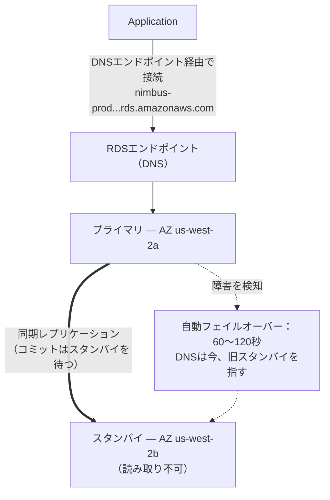

# 第8章：決して病欠しないデータベース管理者

アラートが入ってきたのは午前3時でした。

Priyaは起きている唯一の人でした。彼女の電話がナイトスタンドで光り、彼女は暗闇の中でそれを読みました。画面の明るさが高すぎました。彼女は身を起こしました。記憶を頼りにラップトップを見つけ、明かりをつけずに開きました。

暗い部屋でキーボードが静かにカチカチ鳴りました。

データベースサーバーがセキュリティパッチを必要としていました——再起動を要する類いのものです。脆弱性は本物で、パッチは利用可能で、顧客を妨げずにそれを適用する窓は今、トラフィックが低い真夜中でした。

彼女はサーバーに接続しました。パッチを取得しました。それを適用しました。

それからリリースノートを読みました。

そのパッケージの更新は、PostgreSQLが接続パラメータを定義するのに使う構成ファイルに触れました。リリースノートには警告が含まれていました。アップグレードがどう実行されたかによって、カスタマイズされた構成ファイルがパッケージのデフォルトバージョンで置き換えられうる、と。

彼らの構成ファイルはカスタマイズされていました。Leoが2カ月前に、max_connectionsの設定をチューニングするためにそれを編集していたのです。

パッチが実行されました。サーバーが再起動しました。データベースがオンラインに戻りました。

Priyaはクエリをテストしました。機能しました。

ログを確認しました。すべてが正常に見えました。

彼女は午前4時15分にベッドに戻りました。

午前9時5分、Leoはアプリケーションを開いてエラーを得ました。彼はデータベースを確認しました。Max connectionsはデフォルトに設定されていました。100。彼らのアプリケーションは最大500の接続プールを使うよう構成されていました。

すべての新しい接続の試みが失敗していました。アプリケーションは事実上、データベースへのアクセスを失っていました。

「何が起きたの?」とMayaは尋ねました。

「パッチよ」とPriyaは言いました。彼女はすでに構成ファイルを見ていました。「パッケージの更新が、私たちのカスタマイズされた構成ファイルをデフォルトのもので上書きした。Leoのmax_connectionsのチューニングがただ消えてる——サーバーは標準の設定で再起動して、誰もエラーを得なかった。それは静かにデフォルトにフォールバックしたの。」

「直すのにどれくらい?」とLeoは尋ねました。

「20分」とPriyaは言いました。「でもメンテナンスの窓が必要。これは構成の変更と再起動を要する。」

「2時間後にランチで開くレストランがある」とTomは言いました。

Priyaは18分でそれを直しました。メンテナンスの窓は実際のダウンタイム12分でした。レストランは影響を受けましたが、ピークはまだ始まっていませんでした。

朝、彼女はチームに何が起きたかを話しました。沈黙がありました。

「それはまた起きるな」とTomは言いました。

「パッチがあるたびに起きる」とPriyaは言いました。「そして常にパッチがある。これをするもっと良い方法があるはずよ。」

8秒のクエリ時間はまだ未解決でした。そして同じ週に、これです。午前3時のメンテナンスの窓が朝のインシデントになりました。両方の問題は同じ根本原因を持っていました——Nimbusは、自分たちが管理する備えのないデータベースを動かしていたのです。

解決策がありました。それはただ、データベースを自分たちで管理する必要があるという考えを手放すことを要求しました。

**伝統的なデータベースの問題**

EC2インスタンスで自分でデータベースを動かすとき、あなたはすべての責任を負います。

データベースソフトウェアのインストール。それを安全に構成すること。セキュリティの脆弱性が発見されたときにパッチを当てること。バックアップを取ること。バックアップが実際に機能することをテストすること（ほとんどのチームが手遅れになるまで飛ばすステップ）。ディスク容量の監視。冗長性のためのレプリケーションの設定。プライマリサーバーがダウンしたときのためのフェイルオーバーの構成。クエリのパフォーマンスのチューニング。負荷の下での接続の管理。

これらのどれもアプリケーションではありません。どれも機能を加えません。すべてが専門知識を要します。

専門知識の要件が重要な問題です。資格のあるデータベース管理者は、データベースの動かし方だけでなく、以下の方法を理解しています：

- 遅いクエリのログを監視し、パフォーマンスのボトルネックを特定する
- ディスクI/Oを避けるためにワーキングセットのメモリをサイジングする
- 特定時点の復旧のためにWALアーカイブを構成する
- 自動フェイルオーバーを伴う同期ストリーミングレプリケーションを設定する
- 負荷の下での接続の枯渇を防ぐために接続プーリングをチューニングする
- データの損失や長いダウンタイムなしにメジャーバージョンのアップグレードを適用する

これは別個の、専門的なスキルセットです。シニアDBAが高い給料を要求するのは、まさにこれらすべてをうまくやるのが難しいからです。ほとんどのスタートアップはそのために雇えません。ほとんどの開発チームはそれを持っていません。

ほとんどの開発チームはデータベース管理者ではありません。これは予測可能なパターンを生みます。データベースはインストールされ、最小限に構成され、それから何かが破滅的にうまくいかなくなるまでほとんど忘れられます。NimbusのPostgreSQLインスタンスはデフォルトの構成で動いていました——max_connectionsが100、接続プーリングなし、Leoが2回実行してから忘れた手作業のバックアップ、そしてレプリケーションはまったくなし。

午前3時のパッチのインシデントは、アプリケーションを構築するのが優れていて、データベースの運用のバックグラウンドがない人々によって運営されるシステムの症状でした。それは批判ではありません——ほとんどのスタートアップの正確な描写です。解決策はDBAを雇うことではありません。解決策は、DBAレベルの運用を自動的に提供するサービスを使うことです。

「それが私たちがしたことなの?」とMayaは尋ねました。

Leoの答えは沈黙で、それはイエスと同じでした。

**マネージドデータベース**

決して病欠せず、すべてのセキュリティパッチを自動的に扱い、求められずに毎晩バックアップを取り、何かが壊れたら自分自身を直すデータベース管理者を雇うと想像してください。彼らはあなたを煩わせずにこれらすべてをします——そして、いかなる状況下でも、あなたのアプリケーションロジックに決して触れません。

AWSはこのサービスを**RDS**——Relational Database Service——と呼びます。

RDSでは、AWSが以下を管理します：

- データベースエンジンのインストールとパッチ適用
- 自動バックアップ（S3に保存、最大35日間保持）
- 自動フェイルオーバー（プライマリがダウンしたら、スタンバイが自動的に引き継ぐ）
- 監視とメトリクス
- 保存時と転送中の暗号化
- ストレージの自動スケーリング（有効にすれば、ディスクがいっぱいになると成長する）

あなたが管理するのは：

- データベースのスキーマ（テーブルの構造）
- クエリとアプリケーションロジック
- 誰がデータベースにアクセスできるか
- どのインスタンスタイプがデータベースを動かすか
- パラメータのチューニング（RDSは賢明なデフォルトを提供するが）

**サポートされるエンジン**

RDSはいくつかの人気のあるデータベースエンジンをサポートします：

- **MySQL** — 最も広く使われているオープンソースのリレーショナルデータベース
- **PostgreSQL** — 強力で、拡張可能で、複雑なワークロードにますます人気
- **MariaDB** — オープンソースのMySQLフォーク、完全に互換性がある
- **Oracle** — エンタープライズグレード、レガシーの要件を持つ大きな組織で使われる
- **Microsoft SQL Server** — Windowsの多い環境のため
- **Amazon Aurora** — AWS独自のMySQL/PostgreSQL互換エンジン、クラウドのために構築された
  （第24章でAuroraを深く扱います）

Nimbusにとって、選択はPostgreSQLでした。それはLeoが知っているもので、リレーショナルデータをうまく扱いました。エンジンの選択は、ほとんどのアプリケーションにとって、思うより重要ではありません——RDSの運用上の利点は、どれにでも当てはまります。

1つのニュアンス：RDSでエンジンを動かすとき、AWSはマイナーバージョンのパッチを自動的に保守します（あなたが構成したメンテナンスの窓の間に）。メジャーバージョンのアップグレード——たとえばPostgreSQL 14から15へ移ること——は、あなたがスケジュールして実行する手作業の操作です。AWSはメジャーバージョンのアップグレードを慎重にテストしますが、まずステージング環境でそれらをテストすべきです。メジャーバージョンの変更は、特定のSQL構文、拡張機能、またはドライバーのバージョンとの互換性の問題を導入しうります。

LeoはRDSがマイナーパッチを適用し、アプリケーションログがサブリリースで削除された関数についての非推奨の警告を一瞬表示したときに、これを発見しました。マイナーパッチは本質的に透過的であるべきです——しかし各メンテナンスの窓の後にアプリケーションログを監視するのは良い実践です。

「マイナーパッチが何かを壊したら何が起きるか、考えたことある?」とPriyaは尋ねました。

「前のスナップショットにロールバックする」とLeoは言いました。

「それはどれくらいかかる?」

Leoは彼らのデータベースサイズのRDSの復元時間を調べました。`db.m6i.large`の50GBのデータベースには：スナップショットから復元するのにおよそ15〜30分。

「じゃあ、パッチが本番を壊したら15〜30分の復旧の窓がある」とPriyaは言いました。「そしてパッチを早朝のメンテナンスの窓で適用するから、少なくとも影響は最小よ。」

「それにパッチをまずステージングでテストする」とLeoが付け加えました。

「ええ」とPriyaは言いました。「それもね。」

**RDSインスタンスのサイジング：すべてのワークロードが等しいわけではない**

RDSインスタンスを作成するとき、インスタンスタイプを選びます——EC2と同じ概念ですが、データベースのワークロードにスコープされています。AWSはRDSのインスタンスタイプをいくつかの有用な階層に整理しています。

**db.t3ファミリー**：バースト可能なパフォーマンスのインスタンス。持続的な高CPUを必要としない開発、ステージング、軽い本番ワークロードのために設計されています。`db.t3.micro`は、低トラフィックの開発データベースに適しています。`db.t3.medium`は、時折のバーストを伴う中程度の本番負荷を扱います。

Tシリーズインスタンスのトレードオフ：それらは低稼働期間中にCPUクレジットを蓄積し、バースト中にそれらのクレジットを使います。Tシリーズインスタンスを持続的な高CPUで動かすと、クレジットを使い果たし、パフォーマンスは不十分かもしれないベースラインにスロットルします。

**db.m6iファミリー**：一貫した、バーストしないパフォーマンスを持つ汎用インスタンス。`db.m6i.large`は本番データベースの一般的な出発点です。これらにはクレジットの制限がありません——CPUは必要なときにいつでもフルキャパシティで利用できます。

**db.r6iファミリー**：メモリ最適化インスタンス。MファミリーよりvCPUあたり多くのRAM。大きなワーキングセットを持つデータベース——アクセスのたびにディスクから取得するのではなく、データがメモリにあることから恩恵を受けるクエリ——に適しています。RAMを追加するとデータベースのパフォーマンスが劇的に向上するなら、Rファミリーが正しい選択です。

Nimbusのために：

- 開発とステージング：`db.t3.medium`。開発のクエリに十分、低コスト。
- 本番：`db.m6i.large`。一貫したパフォーマンス、メニューと注文のワーキングセットに十分なRAM、クレジットのスロットリングなし。

「m6i.largeはt3.mediumよりどれだけ高くつくんだ?」とTomは尋ねました。

Leoは料金ページを確認しました。`db.t3.medium`は約月55ドルでした。`db.m6i.large`は約月140ドルでした。差は本物でしたが、信頼性の差もそうでした。

「t3は持続的な負荷の下でスロットルする」とPriyaは言いました。「忙しい金曜があってCPUが4時間高いままなら、t3はクレジットを使い果たしてスロットルする。m6iはしない。」

Tomは数字を書き留めました。彼は2週間前の金曜の障害のコストも書き留めました。比較は僅差ではありませんでした。

本番は`db.m6i.large`になりました。

**マルチAZ：引き継ぐスタンバイ**

これが信頼性の計算を完全に変える機能です。

**マルチAZデプロイメント**は、RDSがプライマリとは異なるアベイラビリティーゾーンに同期スタンバイインスタンスを維持することを意味します。プライマリにコミットされたすべてのトランザクションは、コミットが確認される前にスタンバイに同期的にレプリケートされます。

プライマリが故障すると——ハードウェア障害、AZの障害、ソフトウェアのクラッシュ——RDSは自動的にスタンバイにフェイルオーバーします。データベースのエンドポイントのDNSレコードが更新されます。あなたのアプリケーションが新しいプライマリに再接続します。

フェイルオーバーには60〜120秒かかります。その窓の間、あなたのアプリケーションは接続エラーを経験します。適切に書かれたアプリケーションは、これを優雅に扱うべきです（バックオフを伴う接続の再試行）。

スタンバイはリードレプリカではありません。読み取りのトラフィックを配信しません。その唯一の目的は、引き継ぐ準備ができていることです。



（注：より新しい**マルチAZ DBクラスター**のデプロイメントオプションは、読み取り**可能な**2つのスタンバイを保持し、約35秒でフェイルオーバーします——試験は、ここで説明する古典的なマルチAZ*インスタンス*デプロイメントとそれを区別するかもしれません。）

「マルチAZはいくらかかる?」とTomは尋ねました。

単一のインスタンスのおおよそ2倍のコスト——なぜなら、文字通り2つのデータベースインスタンスを動かしているからです。スタンバイはプライマリと同じコストがかかります。

Tomは注文履歴を開き、金曜のピーク中の1時間あたりの収益を見積もりました。

「で、もしフェイルオーバーの窓の間に誰かが侵入しようとしたら?」とPriyaは尋ねました。「プライマリがダウンしてスタンバイが昇格している間、私たちが露出している60秒があるの?」

「フェイルオーバーは透過的よ」とMayaは言いました。「でも質問は正当だわ。接続文字列はハードコードされたIPではなくRDSエンドポイントを使うべき——さもないとフェイルオーバーがシームレスにならない。」

マルチAZはその日の午後に有効にされました。

**自動バックアップと特定時点の復旧**

RDSは毎日自動バックアップを取ります。AWSはこれらのバックアップをS3に保存します（RDSによって管理される——S3コンソールで直接それらを見ることはありません）。バックアップの保持期間内の任意の時点にデータベースを復元できます。

バックアップは構成可能な**バックアップウィンドウ**——低トラフィックの期間、たいてい早朝——の間に起きます。（これは、RDSがパッチと構成の変更を適用する**メンテナンスウィンドウ**とは別の設定です。試験は、これらが2つの異なる窓であることをテストするのが好きです。）ほとんどのエンジンタイプでは、バックアップはダウンタイムを引き起こしません——そしてマルチAZデプロイメントでは、スナップショットはスタンバイから取られるので、プライマリはまったく触れられません。

**特定時点の復旧**は最も価値のある機能の一つです。保持期間内の任意の秒に復元できます。毎日のスナップショットだけでなく——*任意の秒*に。これが可能なのは、RDSが毎日のバックアップに加えてトランザクションログを継続的にアーカイブするからです。

誰かが午後2時37分に誤って`DELETE FROM orders WHERE 1=1`を実行しても、午後2時36分に復元できます。

Leoはこれを理解したとき目に見えてリラックスしました。

「バックアップ保持を1日に設定しちゃった」とLeoは言いました。「あ——でもそれでいいよね? 変えられる?」

「最低7日に変えて」とPriyaは言いました。「本番には30日。」

Leoは即座にそれを更新しました。

「先月俺が削除したものから復旧できたかな?」と彼は尋ねました。

「RDSの前? いいえ」とPriyaは言いました。「RDSの後? ええ。」

こう思っているかもしれません。自動バックアップと手動スナップショットの違いは何か? 自動バックアップは保持期間が切れると削除されます（最大35日）。手動スナップショットは、明示的に削除するまで無期限に保持されます。データベースの状態を永続的に保存する必要があるなら——大きな移行の前、リスクのあるデプロイメントの前——手動スナップショットを取りましょう。

**RDS Proxy：規模における接続の問題を解決する**

RDSに移行してから2週間後、Leoはメトリクスの中であることに気づきました。

データベースはクエリを問題なく処理していました。しかし開いている接続の数が高かった——彼が予想したより高い。Auto Scaling Groupがピーク中にEC2インスタンスを追加すると、各新しいインスタンスが自分自身のデータベース接続のプールを開きました。10のEC2インスタンス、それぞれ50の接続プールで：データベースへの500の同時接続。

「PostgreSQLには各接続のオーバーヘッドがある」とPriyaは言いました。「メモリ、接続ハンドラのためのCPU。500の接続は、実際の作業を何もする前に、接続の管理だけでデータベースのリソースの意味のある量を使う。」

「接続プールのサイズを減らせる?」とLeoは尋ねました。

「できる」とPriyaは言いました。「でもそうすると、ピーク中にリクエストが接続を待ってキューに入るリスクがある。」

より良い解決策：**RDS Proxy**。

RDS Proxyは、アプリケーションとデータベースの間に位置します。EC2インスタンスは、RDSインスタンスに直接ではなく、Proxyに接続します。Proxyはデータベース接続のプールを維持し、アプリケーションのリクエストをそれらにまたがって多重化します。10のEC2インスタンスがそれぞれ50の接続をProxyに開いても、Proxyは100の実際のデータベース接続だけを維持し——すべてのアプリケーションのリクエストにまたがってそれらを効率的に共有するかもしれません。

利点：

**接続プーリング**：より少ない実際のデータベース接続は、RDSインスタンスのより少ないメモリのオーバーヘッドと、負荷の下でのより良いパフォーマンスを意味します。

**より速いフェイルオーバー**：マルチAZのフェイルオーバー中、Proxyはバックエンドでデータベース接続を再確立しつつ、アプリケーション側への接続を維持します。アプリケーションは、完全な接続のリセットではなく、短い一時停止を見ます。RDS Proxyはフェイルオーバーの影響を60〜120秒からたいてい30秒以下に減らします。

**IAM認証**：アプリケーションにデータベースの認証情報を埋め込む代わりに、アプリケーションはIAMロールを使ってRDS Proxyに認証できます。Proxyが実際のデータベースの認証情報を扱います。これはアプリケーション環境からシークレットを完全に排除します。

「RDS Proxyはいくらかかる?」とTomは尋ねました。

それは基盤となるRDSインスタンスのvCPU時間あたりおよそ0.015ドルで、インスタンス自体とは別に課金されます。`db.m6i.large`（2 vCPU）には、Proxyはおよそ月22ドルを加えます。

Tomは接続数のグラフ——ピーク中にデータベースのリソースを競う500の接続——を見て、月22ドルのコストを見ました。

「接続のオーバーヘッドを扱うためにより大きなRDSインスタンスにアップグレードするより安い」と彼は言いました。

RDS Proxyはその週に有効にされました。

「で、もし誰かがProxyを通じて侵入しようとしたら?」とPriyaは尋ねました。「ProxyのIAM認証は攻撃面を減らすの?」

「ええ」とPriyaは自分の質問に答えました。「アプリケーション環境にデータベースの認証情報がないということは、アプリケーションから盗むデータベースの認証情報がないということ。」

彼女はProxyのIAM認証を有効にしました。

**リードレプリカ：読み取りトラフィックのスケーリング**

マルチAZは可用性についてです。**リードレプリカ**はパフォーマンスについてです。

リードレプリカは、読み取りクエリを配信できる、プライマリデータベースの非同期のコピーです。主要なRDSエンジン——MySQL、PostgreSQL、MariaDB——には最大15のリードレプリカを持てます（Auroraも、同じストレージボリュームを共有する最大15のAuroraレプリカをサポートします）。

アプリケーションは、読み取りクエリをレプリカに、書き込みクエリをプライマリに送るよう変更されます。これは負荷を分配します。プライマリが書き込みと複雑なトランザクションを扱い、レプリカが読み取りを扱います。

重要な特性：

- レプリケーションは**非同期**です——プライマリとレプリカの間に小さな遅延（ラグ）が
  ありえます。レコードを書いてすぐにレプリカから読むと、
  まだそれが見えないかもしれません。
- リードレプリカは同じリージョンにも、異なるリージョンにもありえます（クロスリージョン
  レプリカはレイテンシを加えますが、地理的な分散を可能にします）。
- リードレプリカは、災害のシナリオでスタンドアロンのデータベースに昇格できます。

Nimbusにとって：メニューのルックアップは読み取りです。注文履歴は読み取りです。トラフィックの大多数は読み取りトラフィックです。リードレプリカを追加して読み取りをそれにルーティングすることは、プライマリデータベースの負荷を大幅に削減します。

Auroraを論じる第24章で、リードレプリカをより徹底的に扱います。

**読み取りが多いならレプリカを追加、でもラグに注意**

ワークロードが読み取りが多いなら、リードレプリカを追加することはプライマリの負荷を減らしクエリのパフォーマンスを改善します——しかしレプリケーションは非同期で、それはレプリカがプライマリよりわずかに遅れうることを意味します。アプリケーションがレコードを書いてすぐにそれを読み戻すなら、レプリカではなくプライマリから読まなければなりません。これを間違えると、微妙で、デバッグしにくいデータの鮮度のバグを生みます。ユーザーが注文する、確認ページがレプリカをクエリする、レプリカが追いついていない、注文が欠けているように見える。これはread-your-writes整合性と呼ばれ、チームが初めてレプリカを追加するときに犯す最も一般的なミスです。

**Performance Insights：遅いクエリを見つける**

8秒のメニューの読み込み時間はまだ問題でした。RDSへの移行は信頼性を改善しましたが、クエリは依然として遅かったのです。

Leoはリードレプリカを追加し、メニューのクエリをそれにルーティングしました。メニューの読み込み時間は約4秒に下がりました。良くなった。まだ良くはない。

「クエリはまだ遅い」とMayaは言いました。「ボトルネックを改善したけど、それを直してはいない。」

RDSには**Performance Insights**という機能が含まれています——どのクエリが最も多くのデータベースのリソースを消費しているか、どのセッションが待っているか、そして何を待っているかを示す監視ツールです。

LeoはリードレプリカでPerformance Insightsを有効にし、午後のテストセッション中にメニューページを繰り返し読み込みました。

Performance Insightsのダッシュボードは、負荷を支配する1つのクエリを示しました。`menu_items`テーブルのフルテーブルスキャンで、メニューページが読み込まれるたびに全2万2,000行を取得していました。アプリケーションがフィルタリングしていた列である`restaurant_id`にインデックスがありませんでした。

インデックスなしの実行時間：8.2秒。

Leoはインデックスを追加しました。

```sql
CREATE INDEX idx_menu_items_restaurant_id ON menu_items(restaurant_id);
```

インデックスありの実行時間：14ミリ秒。

8,200ミリ秒から14ミリ秒へ。顧客を追い払うレストランの注文アプリと、彼らが考えもせずに使うアプリの違いです。

「ずっとそれが問題だったの?」とMayaは言いました。

「それが問題だった」とLeoは言いました。

「で、Performance Insightsはそれをどれくらいで見つけたの?」

「約20分。」

Tomはすでに計算していました。3週間の最適でないメニューの読み込み時間、その期間中の推定20万のメニューページの読み込み、遅さによる推定15%の離脱。彼が行き着いた数字は居心地の悪いものでした。

「次回はローンチの前に欠けているインデックスを追加しろ」と彼は言いました。

「チェックリストを作るわ」とPriyaは言いました。彼女はすでにそれを書いていました。

**RDSを使わないとき**

RDSは幅広いリレーショナルデータベースのワークロードに優れています。それはすべてに対する正しい答えではありません。

**OSレベルのアクセスが必要なとき**：RDSは基盤となるオペレーティングシステムへのアクセスを与えません。カスタムのOSパッケージをインストールしたり、カーネルパラメータを変更したり、データベースサーバーへのrootアクセスを要するツールを実行したりできません。データベースがOSアクセスを要求する要件を持つなら——特定のOracleの構成、カスタムのストレージドライバー、特定のネットワークインターフェース——EC2インスタンスで直接データベースを動かす必要があります。

**サポートされていないエンジンを使っているとき**：RDSはMySQL、PostgreSQL、MariaDB、Oracle、SQL Server、Auroraをサポートします。アプリケーションが異なるデータベースエンジンを使うなら——CockroachDB、SingleStore、Greenplum——RDSではなくEC2でそれを動かします。

**書き込みが多い水平スケーリングが必要なとき**：RDSはレプリカを通じて読み取りをスケールします。書き込みは1つのプライマリインスタンスに行きます。ワークロードが書き込みが多く、複数の書き込みノードにまたがって分散される必要があるなら、RDSは正しいアーキテクチャではありません。AuroraのGlobal Databaseは大規模で役立ちますが、極端な書き込みスケールの要件には、DynamoDB（第9章）やEC2で動くCockroachDBのような分散データベースが適切なツールです。

**マネージドのコストが運用上のコストを超えるとき**：チームが本物のデータベース管理の専門知識を持つ、非常に大きく安定したワークロードには、自分自身のツールを使ってEC2でPostgreSQLを動かす方がRDSより安いことがあります。これは主にDBAのショップでないチームには珍しいことです。しかしそれは本物で、良いアーキテクトはそれを認めます。

Nimbusにとって——専任のDBAリソースのない、マネージドサービスでPostgreSQLを動かす、予測不可能な成長を持つスタートアップ——RDSは明らかに正しい選択でした。

**RDSパラメータグループとオプショングループ**

試験に出てくる2つの構成のメカニズム：

**パラメータグループ**は、データベースエンジンの設定を制御します——最大接続数、クエリキャッシュのサイズ、タイムアウトの値のような。RDSは、ほとんどの場合に機能するデフォルトのパラメータグループを作ります。特定の設定をチューニングする必要があるときに、カスタムのパラメータグループを作ります。

**オプショングループ**は、一部のエンジンの追加機能を有効にします——Oracleのネイティブネットワーク暗号化やSQL Serverの透過的データ暗号化のような。ほとんどのオープンソースのエンジンのデプロイメントは、カスタムのオプショングループを必要としません。

これらのメカニズムを通じてデータベースエンジンの振る舞いをカスタマイズできます——しかしデフォルトは、始めるほとんどのチームに機能します。

### データを取り込む：AWS Database Migration Service

数週間後、Tomはスライドを持ってスタンドアップにやって来ました。

Nimbusは小さな地域の競合他社を買収していました。彼らの注文システムは、コロケーション施設のMySQLデータベースで動いていました。システムは移行中にオフラインになれませんでした——レストランがそれを使っていたのです。

「彼らのデータをRDSに移す必要がある」とTomは言いました。「システムをダウンさせずに。」

「データベースはどれくらい大きいの?」とLeoは尋ねました。

「約80ギガバイト。」

「いつ切り替える必要がある?」

「6週間。」

Priyaはすでにドキュメントを開いていました。「AWS DMSね」と彼女は言いました。

**AWS DMS（Database Migration Service）**は、最小のダウンタイムでソースデータベースからターゲットデータベースにデータを移します。それは移行を2つのフェーズで扱います。既存のデータのフルロード、それに続く、ソースが動き続ける間の変更の継続的なレプリケーション。

2つの移行のタイプがあります：

**同種の移行：** ソースとターゲットが同じエンジン——MySQLからRDS MySQL、PostgreSQLからAurora PostgreSQL。スキーマは互換性があります。DMSがデータを直接移行します。

**異種の移行：** ソースとターゲットが異なるエンジン——OracleからAurora PostgreSQL、SQL ServerからRDS MySQL。スキーマがまず変換されなければなりません。これは、スキーマを翻訳するために**AWS Schema Conversion Tool（SCT）**を、それからデータを移すためにDMSを要求します。

Nimbusの買収のために：MySQLからRDS MySQL。同種。SCTは不要。

実際にどう機能するか：

1. DMSがソース——コロケーションのMySQLデータベース——から読む
2. **フルロード**：DMSがすべての既存のデータをターゲットのRDSインスタンスにコピーする
3. **CDC（Change Data Capture）**：フルロードの後、DMSがソースデータベースのトランザクションログを読み、進行中の変更をほぼリアルタイムでターゲットにレプリケートする
4. ソースは動き続ける。チームの準備ができたら、接続文字列を切り替える。

「じゃあレストランの注文システムはずっとライブのまま?」とTomは尋ねました。

「ずっとよ」とPriyaは確認しました。「ソースとターゲットはCDCを通じて同期し続ける。準備ができたら、エンドポイントを切り替える。ダウンタイムは、その変更が伝播するのにかかる秒数。」

DMSは数十のソースとターゲットの組み合わせをサポートします。Oracle、SQL Server、MySQL、PostgreSQL、MongoDB、DynamoDB、S3、Redshift、Auroraなど。

「待って——でも*なぜ*異種の移行に別のツールが必要なの?」とMayaは尋ねました。「DMSがスキーマの違いをただ割り出せないの?」

「OracleのVARCHARはPostgreSQLのVARCHARと同じじゃない」とPriyaは言いました。「データ型、ストアドプロシージャ、シーケンス、独自の関数——それらは1対1でマッピングしない。SCTはソースのスキーマを分析し、ターゲットに最も近い同等物を生成する。それからDMSがその変換されたスキーマにデータを移す。スキーマの変換をデータの移動から分離することが、プロセスを信頼できるものにする。」

「で、もし誰かがDMSのレプリケーションインスタンスを通じて侵入しようとしたら?」とPriyaは少し後に自問しました。「それはソースへの読み取りアクセスとターゲットへの書き込みアクセスを必要とする。」

「両端で最小権限」とLeoは言いました。「ソースには読み取り専用のIAM。書き込みアクセスは移行のターゲットだけにスコープ。そしてレプリケーションインスタンスはプライベートサブネットにとどまる。」

Priyaはそれを書き留めました。

## 強みと限界

**RDSが優れている理由**：

- データベースソフトウェアの管理の運用上の負担を排除する
- 自動バックアップと特定時点の復旧
- 最小のRTOで自動フェイルオーバーのためのマルチAZ
- 読み取りトラフィックのスケーリングのためのリードレプリカ
- 保存時と転送中の暗号化が組み込み
- すべての主要なリレーショナルデータベースエンジンがサポートされる
- 接続プーリングと改善されたフェイルオーバー応答のためのRDS Proxy

**RDSに限界があるところ**：

- 基盤となるOSにアクセスできません。データベースが
  OSレベルのアクセスを要求する要件を持つなら、自分自身のEC2ベースのデータベースを動かす必要があるかもしれません。
- RDSはサーバーレスではありません（例外あり——Aurora Serverlessが存在、
  第24章で扱う）。アイドルでも、動いているインスタンスに払います。
- RDSは水平にシャーディングされたデータベースのために設計されていません。書き込みが多いリレーショナルワークロードの
  大規模なスケールアウトには、最終的に異なるアーキテクチャが必要かもしれません。
- 非リレーショナル（NoSQL）のデータパターンには、DynamoDB（第9章）の方が適切です。

## まとめ

Priyaの午前3時のパッチの窓は症状でした。根本原因は、Nimbusが、マネージドサービスがより良く扱えるデータベースを管理していたことでした。RDSは午前3時の起床の電話を排除するだけではありません——それはパッチ適用、フェイルオーバー、バックアップ、接続管理の責任をAWSに移し、チームを実際に顧客にサービスを提供するアプリケーションコードに集中させます。トレードオフはOSレベルのアクセスの喪失で、それはめったに問題にならず、聞こえるよりはるかに少ない。

- **Amazon RDS**はマネージドのリレーショナルデータベースサービスです。AWSがパッチ適用、バックアップ、フェイルオーバー、ストレージを扱います。あなたがスキーマ、クエリ、アプリケーションロジックを扱います。
- **マルチAZ**は、異なるAZに同期スタンバイを維持します。自動フェイルオーバーは60〜120秒で起きます。接続文字列には常にRDSエンドポイントのDNS名を使いましょう——ハードコードされたIPではなく——そうすればフェイルオーバーが透過的になります。
- **リードレプリカ**は、読み取りトラフィックを配信する非同期のコピーです。レプリケーションのラグは、それらがわずかに遅れうることを意味します——read-your-writes整合性は、書き込みの直後にプライマリから読むことを要求します。
- **RDS Proxy**は接続をプールし、オーバーヘッドを減らしフェイルオーバーの速度を改善します。何千もの短命の接続を作りうるLambdaベースのワークロードに不可欠です。
- **Performance Insights**は遅いクエリを特定します——欠けているインデックスを見つけることが、8秒のクエリを14ミリ秒のものに変えうります。メジャーバージョンのアップグレードは手作業です。まずステージングでテストしましょう。

## 試験のヒント

*SAA-C03ドメイン3——タスク3.3（データベースソリューション）*

- **マルチAZは高可用性のためであり、パフォーマンスのためではありません。** スタンバイは
  読み取りトラフィックを配信しません。リードレプリカがパフォーマンスのためです。この区別は頻繁にテストされます。
- **マルチAZのフェイルオーバーは自動です。** それがいつどう起きるかを構成しません。
  RDSがプライマリを監視し、自動的にフェイルオーバーをトリガーします。
- **レプリケーションのラグが重要です。** リードレプリカはプライマリよりわずかに遅れうります。
  アプリケーションが書いたばかりのデータを読む必要があるなら、レプリカではなく
  プライマリから読まなければなりません。これは「read-your-writes整合性」と呼ばれます。
- **自動バックアップは0〜35日間保持されます。** 保持を0に設定すると
  自動バックアップが無効になります。手動スナップショットは、
  削除するまで無期限に保持されます。
- **RDSのストレージの自動スケーリング**はディスクフルの障害を防ぎます。それを有効にしましょう。それはスケール
  アップだけで、決してダウンしません。試験は、あなたがこの非対称性を知っているかをテストするかもしれません。
- **RDS Proxy**は、LambdaがRDSに接続する関わるシナリオ
  （Lambdaは何千もの短命の接続を作りうり、Proxyなしではデータベースを圧倒する）、
  またはより速いマルチAZのフェイルオーバーを要するシナリオで、試験に現れます。
- **db.t3インスタンスはバーストしてスロットルします。** 小さなRDSインスタンスでの断続的な
  パフォーマンスの劣化を描写する試験のシナリオは、TシリーズインスタンスのCPUクレジットの枯渇を
  描写しているかもしれません。修正はMまたはRシリーズのインスタンスにアップグレードすることです。
- **マルチAZのDNSエンドポイント**：マルチAZのフェイルオーバーが起きると、RDSエンドポイントのDNS
  レコードが新しいプライマリを指すよう更新されます。RDSエンドポイントを使う
  （ハードコードされたIPではなく）アプリケーションは自動的に再接続します。長いDNS TTLや
  ハードコードされたIPアドレスを持つアプリケーションは自動的に再接続しません。常にRDSエンドポイントを使いましょう。
- **リードレプリカの昇格**：リードレプリカはスタンドアロンのDBインスタンスに昇格できます
  ——プライマリが失われてマルチAZが構成されていなかった場合の災害復旧に役立ちます。
  昇格は一方向の操作です。レプリカはプライマリになり、もはや元から
  レプリケートしません。「手作業での昇格」または
  「リードレプリカをプライマリに変換する」ことについて尋ねる試験のシナリオは、この操作を含みます。
- **Performance Insights**は、待機時間とCPU使用量でトップのSQLクエリを特定します。
  試験のシナリオがRDSデータベースの遅いクエリをどう診断するかを尋ねるとき、Performance
  InsightsがAWSネイティブの答えです。
- **RDS対EC2でのデータベースの実行**：試験は時にこれを選択として提示します。
  RDSはマネージドの運用を提供しますがOSレベルのアクセスを制限します。EC2ベースのデータベースは
  完全な制御を与えますが、運用にDBAの専門知識を要します。試験のシナリオの「OSレベルのアクセスが必要」
  というフレーズは、RDSよりEC2を選ぶシグナルです。
- **AWS DMS：** フルロード + CDCを使って最小のダウンタイムでデータベースを移行します。同種（同じエンジン） = DMSが直接。異種（異なるエンジン） = まずSCTでスキーマを変換し、それからDMSでデータを移す。試験のトリガー：「最小のダウンタイムでデータベースを移行する」または「OracleからAuroraへ」 → DMS + SCT。

## 演習

**演習1——想起**

自分の言葉で：RDSにおけるマルチAZとリードレプリカの違いは何ですか?
それぞれがどんな問題を解決しますか?

*（ヒント：1つはダウンタイムから守ります。もう1つは読み取りが多い
負荷の下でパフォーマンスを改善します。それらは異なる問題を解決し、一緒に使えます。）*

**演習2——SAA-C03シナリオ**

*シナリオ*：ある会社が、RDSで本番のPostgreSQLデータベースを動かしています。データベースは
1日中実行されるレポートのクエリのため、高い読み取りトラフィックを経験します。
チームはデータベースの可用性についても懸念しています——障害のシナリオで、彼らは
数分以上のダウンタイムを許容できません。彼らは、レポートのワークロードからの
プライマリデータベースへの影響を最小化したいと考えています。

どのRDSの機能の組み合わせが、両方の懸念に最もよく対処しますか?

A) マルチAZを有効にし、すべてのクエリをスタンバイインスタンスに対して実行する  
B) より頻繁な手動スナップショットを取り、プライマリが故障したらそれらから復元する  
C) 複数のリードレプリカを作り、コストを減らすためにマルチAZを無効にする  
D) フェイルオーバー保護のためにマルチAZを有効にし、レポートのクエリのためにリードレプリカを作る

**ヒント1**：2つの要件は：(1)障害中の可用性、(2)読み取りの
オフロード。どの機能がどの要件に対処しますか?

**ヒント2**：マルチAZは自動フェイルオーバーを提供します。スタンバイは読み取りトラフィックを配信しません。
だからマルチAZ単独では読み取りの問題に役立ちません。

**ヒント3**：リードレプリカは読み取りトラフィックを配信します。マルチAZはフェイルオーバーを提供します。両方が必要です。

**解答**: D

**解説**：マルチAZは異なるAZのスタンバイへの自動フェイルオーバーを提供します——
これは可用性の要件に対処します。リードレプリカは、レポートのクエリが
プライマリデータベースに影響を与えずに実行されることを可能にします——これはパフォーマンスの
要件に対処します。両方の機能を同時に使えます。

**なぜAではないのか?** マルチAZのスタンバイは読み取りトラフィックを配信できません。それはもっぱら
フェイルオーバーのためです。それを直接クエリしようとすることはサポートされていません。

**なぜBではないのか?** 手動スナップショットはデータベースの完全なコピーを復元します——はるかに長い
プロセス（大きなデータベースには潜在的に数時間）。これは「数分の
ダウンタイム」の要件を満たしません。

**なぜCではないのか?** リードレプリカは読み取りのパフォーマンスに役立ちますが、自動
フェイルオーバーを提供しません。プライマリが故障したら、手作業でリードレプリカを昇格する必要があり——
それは時間がかかり、自動的ではありません。

*SAA-C03ドメイン3——タスク3.3*

**演習3——アーキテクチャの課題** *（オプション）*

Nimbusは、既存の自己管理のPostgreSQLデータベース（EC2インスタンスで動いている）を
RDS PostgreSQLに移行することを検討しています。移行は最小のダウンタイムで
起きる必要があります——理想的には15分未満。データベースは200GBです。

どのアプローチを推奨しますか? どのAWSサービスが移行に役立つかもしれませんか?
本番のトラフィックを切り替える前に、どんなリスクをテストしますか?

*（唯一の正解はありません。AWS Database Migration Service、
論理レプリケーション、そして切り替え中のデータの不整合のリスクを考えてみましょう。）*

## エピローグ

その日の終わりまでに、NimbusはマルチAZを有効にしてRDS PostgreSQLに移行していました。
移行自体は午後のほとんどを要しました——Leoはバックアップと復元のアプローチを使い、
短いメンテナンスの窓を伴って。

Tomは請求を注意深く見ていました。

「RDSインスタンスは」と彼は言いました。「EC2のデータベースの2倍のコストがかかる。」

「で、自動バックアップは?」とMayaは尋ねました。

「もう少し。」

「で、プライマリが死んだら無料で得られるフェイルオーバーは?」

Tomはそれに価格を持っていませんでした。彼はそれを質問として書き留めました。

3日後、データベースは健全でした。Leoが欠けているインデックスを追加した後、クエリ時間は劇的に下がっていました。メニューは1秒未満で読み込まれました。

「問題は」とPriyaは言いました。「データベースエンジンじゃない。データモデルよ。」

彼女は間を置きました。

「このデータの一部はまったくリレーショナルじゃない。メニューのアイテム、レストランのプロフィール、
配達ゾーン——このデータは可変の形を持っている。SQLが私たちと戦っている。」

Leoはすでに何かを調べていました。

「メニューに別の種類のデータベースを使ったらどうだろう?」と彼は言いました。

次の章では：100万人が一度に注文しても遅くならないデータベース。
