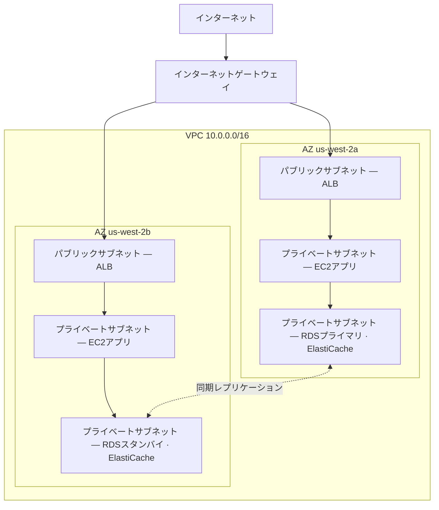

# 第11章：クラウドのあなただけの一角

プリヤは絵が描かれた1枚の紙を持っていました。

それは複雑な絵ではありませんでした。「AWS」とラベル付けされた長方形。長方形の中には、ボックスの集まり：EC2インスタンス、RDSデータベース、ElastiCacheクラスター。すべてをすべてに接続する線。そして長方形の外には、1つのラベル：「インターネット」。

彼女はそれをテーブルの中央に置きました。

---

*キャッシングレイヤーは機能していました。Redisはページロードを188ミリ秒から12ミリ秒に削減しました。しかし、レオがその勝利を祝っている間、プリヤはネットワークログを読んでいました。そして彼女は見たものが気に入りませんでした。すべてのサービスが同じフラットなネットワーク上にありました。データベースにはパブリックIPアドレスがありました。Redisクラスターは技術的には外部から到達可能でした。アプリケーションは機能していましたが、アーキテクチャは駐車場でした。フェンスなし、ゲートなし、ゾーンなしです。*

---

「これが私たちが持っているものです」と彼女は言いました。「私たちのデータベースにはパブリックIPアドレスがあります。キャッシュレイヤーはインターネットから到達できます。EC2インスタンスはすべて同じフラットなネットワーク上にあります。」

「それで問題なさそうだけど」とレオは言いました。「セキュリティグループがある。」

「あなたが設定したセキュリティグループです」とプリヤは言いました。「夜に。初期セットアップ中に。」

レオは何も言いませんでした。

「設定を批判しているのではありません」と彼女は言いました。「すべてがフラットなパブリックネットワーク上にあると、1つの設定ミスが、機能するシステムと、インターネット上の誰もがアクセスできるシステムとの違いになると言っているのです。」

彼女は赤いマーカーを取り、データベースの周りに円を描きました。

「これはインターネットから到達できてはいけません。まったく。セキュリティグループのルールを通じてでも、堅牢化された設定を通じてでもありません。構造的に到達不可能であるべきです。」

「ネットワークアーキテクチャについて話す必要があります」とマヤは言いました。

「3か月前に話す必要がありました」とプリヤは言いました。「でも今でも大丈夫です。」

チームは数週間ぶりに初めてホワイトボードの周りに集まりました。

**開かれた駐車場の問題**

巨大なパブリック駐車場を想像してください。1万台の車。どの車もどこにでも駐車できます。ゾーン間に障壁はなく、ゲートもなく、予約されたセクションもありません。

これがオープンなネットワークです。すべてのサービスが他のすべてのサービスに到達できます。Webサーバーはデータベースと話せます。データベースはインターネットに到達できます。キャッシュレイヤーはどこからでも接続を受け取れます。

すべてがすべてと話せるとき、1つの侵害がすべてに影響します。

「つまり、誰かが駐車場に侵入したら」とトムは言いました。「どの車にも入っていける。」

「そして、どの車からでも、どこへでも運転できます」とプリヤは確認しました。「私たちはフェンスが欲しい。施錠されたゲートが欲しい。ゾーンが欲しいのです。」

VPCは、AWSでそれらのゾーンを構築する方法です。

**VPCとは何か？**

「待って、でも*なぜ*そのようにするの？」とマヤは尋ねました。「すべてのリソースにすでにセキュリティグループがあるなら、なぜVPCが必要なの？セキュリティグループが同じ仕事をしているんじゃないの？」

セキュリティグループとVPCは異なるレベルで保護します。セキュリティグループは特定のリソースにアタッチされたルールです。「このEC2インスタンスは、ロードバランサーからのポート8080のトラフィックのみを受け入れる」と言います。しかし、それはまだパブリックネットワーク上にあります。IPアドレスはまだ到達可能で、ルールはドアのところで接続をブロックするだけです。VPCは、ドアをパブリックな通りから完全に取り除きます。プライベートサブネット内のリソースはインターネットへの*ルート*を持たず、慣習としてパブリックIPも持ちません。したがって、セキュリティグループが何と言おうと、インターネットから到達できません。それは設定上のものではなく、構造上の保証です。

**Virtual Private Cloud（VPC）**は、AWSクラウドの論理的に分離されたセクションです。あなたが定義するプライベートネットワークで、デフォルトではあなたのリソースだけがアクセスできます。

巨大なパブリック駐車場の中にある、フェンスで囲まれたプライベートな区画と考えてください。あなたの区画には独自のルールがあります。誰が入れるか、誰が出られるか、セクション間にどんなルートが存在するか。

VPCを作成するとき、次のものを定義します。

**CIDRブロック**：ネットワーク内で利用可能なIPアドレスの範囲です。たとえば、`10.0.0.0/16`は65,536個の可能なIPアドレス（10.0.0.0から10.0.255.255まで）を与えます。

**サブネット**：VPCの細分化で、それぞれにIPアドレス範囲の一部が割り当てられ、特定のアベイラビリティーゾーンに関連付けられます。

**ルートテーブル**：ネットワークトラフィックがどこに行くかを決定するルールです。

**インターネットゲートウェイ**：VPCとパブリックインターネット間の接続です。

**サブネット：パブリック対プライベート**

すべてのリソースがパブリックにアクセス可能であるべきではありません。

Webサーバーはインターネットからのトラフィックを受け入れる必要があります。ユーザーのブラウザがそれに到達する必要があるからです。

データベースは、インターネットからのトラフィックを*決して*受け入れるべきではありません。Webサーバーだけがそれと話せるべきです。

ここでサブネットが登場します。

**パブリックサブネット**は、インターネットゲートウェイに接続され、パブリックIPアドレスを持つリソースを持つことができます。トラフィックはインターネットとの間で流れることができます。

**プライベートサブネット**は、そのルートテーブルにインターネットへのルートを持ちません。プライベートサブネット内のリソースは、VPC内の他のリソースとのみ通信できます（特定の送信ルートを設定しない限り）。慣習として、パブリックIPアドレスも持ちません。

Nimbusの場合、設計は明確になりました。



ロードバランサーはパブリック向けです。インターネットからのトラフィックを受け取る必要があります。EC2インスタンスはプライベートです。ロードバランサーからのトラフィックだけを受け取ります。データベースはプライベートです。EC2インスタンスからのトラフィックだけを受け取ります。

「つまり、データベースに到達するには」とトムは言いました。「誰かがロードバランサーを通り抜け、それからEC2インスタンスを通り抜け、それからデータベースのセキュリティグループを通り抜けなければならない？」

「3つのレイヤーです」とプリヤは確認しました。「多層防御です。」

---

**NimbusのCIDRプラン**

「待って、でも*なぜ*そのようにするの？」とマヤは、CIDRブロックの選択を見ながら尋ねました。「なぜプリヤはIPアドレスの範囲にそんなにこだわるの？AWSのデフォルトを使えばいいんじゃないの？」

「CIDRブロックは後で変更するのが非常に難しいからです」とプリヤは言いました。「そして、このVPCを別のVPCやオンプレミスのネットワークに接続することがあれば、重複するIP範囲が、デバッグが苦痛なルーティング障害を引き起こすからです。」

彼女はホワイトボードにプランを描きました。

NimbusのVPC：`10.0.0.0/16`、合計65,536アドレス。

| サブネット | CIDR | AZ | 用途 |
|---|---|---|---|
| Public A | 10.0.0.0/24 | us-west-2a | ロードバランサー |
| Public B | 10.0.1.0/24 | us-west-2b | ロードバランサー |
| Private App A | 10.0.10.0/24 | us-west-2a | EC2アプリサーバー |
| Private App B | 10.0.11.0/24 | us-west-2b | EC2アプリサーバー |
| Private Data A | 10.0.20.0/24 | us-west-2a | RDS、ElastiCache |
| Private Data B | 10.0.21.0/24 | us-west-2b | RDS、ElastiCache |

「全部を/16にすればいいのでは？」とレオは尋ねました。

「異なるAZのサブネットはアドレス空間を共有すべきではないからです。各サブネットは1つのAZにあります。このVPCを別のVPCとピアリングすることがあれば、より細かくするほど、競合が起きにくくなります。そして各/24は251個の使用可能なアドレスを与えます。どの単一のティアにも十分すぎるほどです。」

「AWSは各サブネットで5つのアドレスを予約している」とトムはドキュメントを見ながら観察しました。「だから256ではなく251なんですね。」

「正解です。最初の4つと最後の1つ。ネットワークアドレス、VPCルーター、DNSサーバー、将来の使用、ブロードキャストです。」

「では、/24が使う最小ですか？」

「実際には。VPNゲートウェイのサブネットのような、ほんの一握りのIPしか必要としない非常に小さいサブネットには/28を使います。でも、アプリケーションのティアには、/24が妥当な最小です。」

トムは数字を書き留め、サイズ間の月間コストの差を計算しました。彼はいつもそうしていました。

---

**避けるべきCIDR計画の間違い**

「サブネットを使い果たしたらどうなるか、考えたことはありますか？」とプリヤは尋ねました。彼女は知らないから尋ねたのではありませんでした。チームの他のメンバーが答えを身につける必要があったから尋ねたのです。

レオは考えました。「サブネットをもっと追加できる？」

「VPCにサブネットを追加できます。でも、既存のサブネットのサイズを変更することはできません。プライベートアプリサブネットがいっぱいになったら（251アドレスでは足りない）、新しいサブネットを作成してインスタンスをそこに移行する必要があります。」

「それは実際どれくらいの頻度で起きるんですか？」

「よく計画していれば、めったに起きません。でも、人々は3つのよくある間違いをします。」

彼女はそれらを列挙しました。

**間違いその1**：小さすぎるVPC CIDRを使うこと。VPC全体に`10.0.0.0/24`（254アドレス）を使うと、サブネットの計画を終える前にスペースを使い果たします。柔軟性のために`/16`から始めましょう。

**間違いその2**：VPC間で重複するCIDRを使うこと。本番VPCが`10.0.0.0/16`で、ステージングVPCも`10.0.0.0/16`だと、それらを決してピアリングしたり、Transit Gatewayを通じて接続したりできません。ルーターは、どのVPCにトラフィックを送るべきか分かりません。

**間違いその3**：将来のティアのためにアドレス空間を予約しないこと。Nimbusのプランは`10.0.30.0/24`と`10.0.31.0/24`を未割り当てのままにしました。アドレス空間全体を再構築することなく、将来の内部ツールティア、モニタリングサブネット、またはVPNエンドポイントサブネットのための余地です。

「必要だと思う量の2倍を計画しましょう」とプリヤは言いました。「サブネットは無料です。`/16`からのIPアドレス空間は豊富です。間違って計画するコストはネットワークの移行です。」

---

**NATゲートウェイ：それでもダウンロードできるプライベートサブネット**

プライベートサブネットはインターネットに到達できません。しかし、時には到達する必要があります。EC2インスタンスがソフトウェアアップデートをダウンロードする必要があります。アプリケーションが外部APIを呼び出す必要があります。

ここで**NATゲートウェイ**（Network Address Translation、ネットワークアドレス変換）が登場します。

NATゲートウェイはパブリックサブネットに置かれます。プライベートサブネットのリソースはNATゲートウェイに送信トラフィックを送ることができ、NATゲートウェイがそれをインターネットに中継します。しかし、インターネットは接続を逆方向に開始することはできません。

一方向の回転ドアのようなものです。あなたは出ることができます。外の誰も入ってこられません。

「それは月にいくらかかる？」とトムは尋ねました。

NATゲートウェイの料金には2つの構成要素があります。各NATゲートウェイの時間単位の料金と、GB単位のデータ処理料金です。

Nimbusがこれをセットアップした時点では、それはNATゲートウェイあたり月に約32ドル、加えて処理されたデータ1 GBあたり0.045ドルでした。少ないトラフィック量では、固定コストが支配的です。大規模では、データ料金がかなりの額になることがあります。

トムは、NATゲートウェイの設定を終える前に、データ処理コストの請求アラートを設定しました。彼は、誰も見ていないときのAWSのデータコストがどんなものか見たことがありました。

チームの不意を突く驚き：NATゲートウェイを流れるすべてのバイトが課金されます。プライベートサブネットのEC2インスタンスが大きなソフトウェアパッケージをダウンロードしたり、外部サービスにログをストリーミングしたり、外部APIに大量のデータを送ったりしていると、NATゲートウェイのデータ料金が請求書に驚きとして現れます。AWS間のトラフィックの解決策：VPCエンドポイントは、トラフィックをAWSサービス（S3、DynamoDB）にプライベートにルーティングし、NATゲートウェイを完全にバイパスして、それらのデータ料金を排除します。

「つまり、プライベートサブネットのEC2インスタンスはNATゲートウェイを通じてOSアップデートをダウンロードする」とトムは言いました。「そのアップデートは何ギガバイト?」

「インスタンスあたり、月あたり、たぶん2〜5 GB」とレオは言いました。

「10インスタンス分。12か月分。1 GBあたり0.045ドルで—」

「年間11〜27ドル」とプリヤは締めくくりました。「この場合は許容範囲です。」

「でも、ログをストリーミングしていたら—たとえば、すべてのアプリケーションログを外部の可観測性サービスに送っていたら—」

「それらはVPCエンドポイントを通じてルーティングするか、NATを通じて出る代わりにCloudWatch Logsを使います。」

トムは計算ツールを閉じました。計算は十分に明確でした。

### NATインスタンス：予算重視の代替案

「待って」とトムは、まだ料金ページを見つめながら言いました。「プライベートインスタンスがインターネットに到達できるようにするためだけに、ギガバイト単位で払っているのか？それが唯一の選択肢なのか？」

「それはマネージドな選択肢です」とプリヤは言いました。「古い方法もありますが、トレードオフが伴います。」

NATゲートウェイが存在する前、チームは通常のEC2インスタンス（「NATインスタンス」）で同じ送信ルーティングを実現していました。パブリックサブネットでEC2インスタンスを起動し、OSでIPフォワーディングを有効にし、送信元/送信先チェック（AWSがデフォルトで有効にして、インスタンス宛てでないパケットをドロップする）を無効にし、プライベートサブネットのルートテーブルをそのインスタンスのENIに向けます。プライベートインスタンスからのトラフィックは、NATゲートウェイと同じように、それを通ってインターネットに流れます。

それは今でも機能します。AWSは今でもそれを文書化しています。そして、非常に少ないトラフィック量（ほんの一握りのインスタンスがときどきパッケージをダウンロードする単一の開発環境）では、`t3.micro`のNATインスタンスは月に5ドル未満になることがあります。NATゲートウェイの固定時間料金プラスGB単位の料金に対してです。

| | NATゲートウェイ | NATインスタンス |
|---|---|---|
| 管理 | AWSが完全に管理 | あなたがEC2を管理 |
| 可用性 | AZ内で冗長 | 単一のEC2—単一障害点 |
| 帯域幅 | 最大100 Gbps、自動的にスケール | EC2インスタンスタイプで制限される |
| コスト | 0.045ドル/GB + 時間料金 | EC2インスタンスのコストのみ |

コストの優位性はすぐに消えます。意味のあるトラフィック量では、GB単位のNATゲートウェイ料金は、その帯域幅を処理するために必要なEC2インスタンスタイプと競合します。そしてNATゲートウェイは、パッチ適用ゼロ、モニタリングゼロ、そして故障時のインシデント対応ゼロです（故障しませんが）。

「では、実際にいつNATインスタンスを使うんですか？」とレオは尋ねました。

「使い捨ての開発環境です」とプリヤは言いました。「1つか2つのインスタンスを動かし、ときどきパッケージの更新をして、固定コストを最小化したい場所。本番ワークロード、つまり可用性が必要なものには、AZごとに1つのNATゲートウェイです。」

試験はこのトレードオフを名指しでテストします。パターン：「低トラフィックの開発またはテスト環境でNATコストを最小化する」はNATインスタンスを指します。「高可用性を必要とする本番ワークロード」はAZごとにデプロイされたNATゲートウェイを指します。

こう思っているかもしれません。セキュリティグループがすでに存在し、デフォルトでトラフィックをブロックするなら、なぜプライベートサブネットを持つVPCが意味のある保護を追加するのか？「セキュリティグループによってブロックされている」と「構造的に到達不可能」は異なるものだからです。セキュリティグループの設定ミス（1つの間違ったルール、1つの開いたポート）は、パブリックIPを持つリソースを露出させることがあります。プライベートサブネットのリソースには、そもそも到達すべきパブリックIPがありません。データベースに到達しようと試みることすらできる前に、ロードバランサーと稼働中のEC2インスタンスを侵害しなければならないでしょう。プライベートサブネットは、ルールレベルではなくネットワークレベルで分離を強制します。

**ルートテーブル：トラフィックが道を見つける方法**

すべてのサブネットには、トラフィックにどこに行くかを伝える**ルートテーブル**があります。

典型的なパブリックサブネットのルートテーブルは次のようになります。

| 宛先 | ターゲット                      |
|-------------|-----------------------------|
| 10.0.0.0/16 | local                       |
| 0.0.0.0/0   | igw-xxxx（インターネットゲートウェイ） |

最初のルール：VPC範囲内の任意のIPへのトラフィックはローカルに留まります。2番目のルール：他のすべてのトラフィック（`0.0.0.0/0`は「すべて」を意味する）はインターネットゲートウェイに行きます。

プライベートサブネットのルートテーブル：

| 宛先 | ターゲット                 |
|-------------|------------------------|
| 10.0.0.0/16 | local                  |
| 0.0.0.0/0   | nat-xxxx（NATゲートウェイ） |

プライベートサブネットのトラフィックはローカルに留まるか、NATゲートウェイを通じて出ます。インターネットゲートウェイへの直接ルートはありません。

**セキュリティグループ対NACL（プレビュー）**

VPC内では、リソースレベルでトラフィックを制御する2つのツールがあります。

**セキュリティグループ**（第15章で詳しく説明します）は、個々のリソース（EC2インスタンス、RDSインスタンス、ロードバランサー）の仮想ファイアウォールとして機能します。これらは*ステートフル*です。トラフィックが入ることが許可されると、応答トラフィックは自動的に出ることが許可されます。

**ネットワークACL（NACL）**は、サブネットレベルで動作し、*ステートレス*です。インバウンドとアウトバウンドの両方のトラフィックを別々に明示的に許可する必要があります。

ほとんどのユースケースでは、セキュリティグループで十分です。NACLは、サブネットレベルの制御が必要なとき（たとえば、特定のIP範囲がサブネットに到達することを決して許さないようにする）に追加のレイヤーを加えます。

「インスタンスレベルではセキュリティグループ」とレオはホワイトボードに書きました。「サブネットレベルではNACL。」

「そして、ポート22を0.0.0.0/0に開いたままにしないこと」とプリヤはレオを見ながら付け加えました。

「あれは一度だけだった」とレオは言いました。

「それは常にぴったり一度だけです」とプリヤは言いました。「そうでなくなるまでは。」

「もし誰かが侵入を試みたら？」とプリヤは、まだホワイトボードのところで言いました。「設定ミスのあるセキュリティグループを通じてではなく—もし彼らがロードバランサーそのものを侵害したら？プライベートサブネットへの横移動を何が止めるの?」

「プライベートサブネットのEC2インスタンスは、ロードバランサーのセキュリティグループからのトラフィックだけを受け入れます」とレオは言いました。「ロードバランサーが侵害されても、攻撃者は通常のAPI呼び出しのように見えるリクエストしかできません。」

「そしてデータベースはEC2のセキュリティグループからのトラフィックだけを受け入れます」とプリヤは言いました。「多層防御です。すべてのレイヤーが、前のレイヤーが失敗するかもしれないと仮定します。」

---

**VPCフローログ：何が起きているかを見る**

「ネットワークに目を向ける必要があります」とプリヤは、VPC再設計の3日目に言いました。

「セキュリティグループとNACLがある」とレオは言いました。「トラフィックは制御されている。」

「制御されているのと、見えるのは違います。何か変なことが起きたら—予期しない接続の試み、奇妙なポートへのトラフィック—どうやってそれを知るの?」

VPCフローログは、VPCを流れるネットワークトラフィックに関するメタデータをキャプチャします。パケットの内容ではなく、接続レベルの情報だけです。送信元IP、宛先IP、ポート、プロトコル、パケット数、バイト数、開始時刻、終了時刻、そしてトラフィックが受け入れられたか拒否されたかです。

典型的なフローログのエントリは次のようになります。

```
2 123456789012 eni-0abc123 10.0.10.5 10.0.20.8 49321 5432 6 20 4320 1620000000 1620000060 ACCEPT OK
```

これは次のことを伝えます。`10.0.10.5`（アプリサブネットのEC2インスタンス）から`10.0.20.8`（RDSインスタンス）へ、ポート5432（PostgreSQL）、20パケット、4,320バイト、受け入れられた。通常のトラフィックです。

しかし、フローログを有効にして数日後、プリヤはこれを見つけました。

```
2 123456789012 eni-0abc123 185.220.101.55 10.0.10.5 0 8080 6 1 40 1620003200 1620003201 REJECT OK
```

外部IP（`185.220.101.55`）が、ポート8080でEC2インスタンスへの接続を試みていました。接続はセキュリティグループによって拒否されました。しかし、その試みはログに記録されました。

彼女はそのIPを調べました。それは、自動スキャンで知られるルーマニアのアドレスブロックに属していました。インターネット上のあらゆるパブリックIPが絶えず受け取る、背景ノイズのような探りの一種です。

「誰かが私たちを探っています」と彼女は言いました。

「でも拒否されている」とレオは言いました。

「今回は。GuardDutyを有効にして」—第17章できちんと出会う脅威検知サービスです—「先に進む前に。私たちには、ただ境界をブロックするだけでなく、振る舞いの検知が必要です。」

フローログはCloudWatch LogsまたはS3に保存されます。CloudWatch InsightsまたはAthenaを使ってクエリできます。プリヤは、毎晩実行され、AWS以外のIP範囲からの拒否された接続の試みにフラグを立てるCloudWatch Insightsクエリを設定しました。

「それは月にいくらかかる？」とトムは尋ねました。

「フローログは、CloudWatchまたはS3に取り込まれるデータのGB単位で課金されます。私たちのトラフィック量では、たぶん月に8〜15ドルです。」

トムは一瞬止まりました。「そして代替案は、誰かが私たちのネットワークを探っていることを知らないことだ。」

「ええ。」

「それでいい」と彼は言い、コンソールを開きました。

**フローログでポートスキャンを読む**

フローログを有効にして2週間後、プリヤは毎晩のCloudWatch Insightsクエリを実行し、新しいものを見つけました。1つの拒否された接続ではなく—数十、急速な連続で、同じ送信元IPから、連続するポートにわたって。

```
185.220.101.55 → 10.0.10.5 port 22   REJECT
185.220.101.55 → 10.0.10.5 port 23   REJECT
185.220.101.55 → 10.0.10.5 port 25   REJECT
185.220.101.55 → 10.0.10.5 port 80   REJECT
185.220.101.55 → 10.0.10.5 port 443  REJECT
185.220.101.55 → 10.0.10.5 port 3306 REJECT
185.220.101.55 → 10.0.10.5 port 5432 REJECT
185.220.101.55 → 10.0.10.5 port 6379 REJECT
```

すべて5秒の窓の中。すべて拒否。

「これはポートスキャンです」とプリヤは言いました。「誰かがこのインスタンスがどのサービスを実行しているかを探っています。」

「でも全部拒否されている」とレオは言いました。「だからセキュリティグループは仕事をしている。」

「セキュリティグループは仕事をしています。スキャンは、それでも攻撃者にとって有益です。タイムアウト内に拒否されなかったポートがどれかを教えます。つまり、それらのポートがどこかで開いているということです。そして、このホストが生きていて調査する価値があると教えます。」

「私たちはどうするの?」

「2つのことです」とプリヤは言いました。「1つ目：そのIPが属する/24範囲をブロックするNACLルールを追加します。そのIPだけでなく、サブネット全体です。ポートスキャナーは範囲内でIPをローテーションします。2つ目：単一の送信元IPが60秒間に10を超える拒否された接続を生成したときに発火するCloudWatchアラームを追加します。そのパターンはほぼ常にスキャンです。」

彼女は両方を設定しました。アラームは翌週に2回発火しました。一度は同じルーマニアの範囲から、一度はシンガポールを拠点とする自動スキャナーから。両方とも検知から数分以内にNACLでブロックされました。

フローログは攻撃を止めません。攻撃を見えるようにします。そして見える攻撃には対応できます。代替案—トラフィックが見えないまま流れること—は、問題の最初の兆候が、試みではなく被害であることを意味します。

---

**単一NATゲートウェイの罠**

VPC再設計の3か月後、プリヤは障害シミュレーションを実行しました。彼女は、`us-west-2a`アベイラビリティーゾーンが中断を経験したら、Nimbusに何が起きるかを知りたかったのです。

ほとんどは問題ありませんでした。ロードバランサーは`us-west-2b`のインスタンスにフェイルオーバーしました。`us-west-2b`のRDSスタンバイはすでにライブでした。ElastiCacheはレプリカを昇格させました。アプリケーションはリクエストを提供し続けました。

それからレオは、`us-west-2b`のEC2インスタンスがOSアップデートの通知を受け取らなくなったことに気づきました。彼はNATゲートウェイの設定を確認しました。

1つありました。`us-west-2a`に。

「両方のAZのプライベートサブネットからのすべての送信インターネットトラフィックが、1つのAZにある1つのNATゲートウェイを通ってルーティングされている」とプリヤは言いました。

「つまり、`us-west-2a`がダウンしたら—」

「`us-west-2b`のすべてのEC2インスタンスが送信インターネットアクセスを失います。アップデートをダウンロードできません。外部APIに到達できません。キャッシュされていないSecrets Managerのルックアップは失敗します。送信インターネットを必要とするものはすべて壊れます。」

修正：AZごとに1つのNATゲートウェイ。各AZのプライベートサブネットは、同じAZのNATゲートウェイに送信トラフィックをルーティングします。AZが故障したとき、そのAZのトラフィックだけが影響を受けます。

「そしてその修正の値札は？」とトムは尋ねました。

「2番目のAZのNATゲートウェイに、月に追加の32ドルです。」

トムは一瞬黙りました。

「障害中に`us-west-2b`のEC2キャパシティが外部APIに到達できないことは」とプリヤは言いました。「32ドルより高くつきます。」

トムは変更を承認しました。

これは最もよくあるVPC設計の間違いの1つです。高可用性に見えて、実際には単一障害点であるNATゲートウェイです。3つのAZにリソースがあり、NATゲートウェイが1つなら、3 AZのコンピュート回復力と1 AZのネットワーク回復力を持つことになります。2つは一致しません。

ルール：AZごとに1つのNATゲートウェイを、そのAZのパブリックサブネットに。各AZのプライベートルートテーブルは、自身のNATゲートウェイを指します。コストは控えめです。可用性の改善は本物です。


---

**VPCピアリング：プライベートネットワークを接続する**

Nimbusが複数のVPCに成長したらどうでしょうか？（これは起こります。チームは大きくなります。サービスは別々のアカウントに分離されます。）

**VPCピアリング**は、2つのVPCが同じネットワーク上にあるかのようにプライベートに通信できるようにします。トラフィックはAWSのプライベートネットワークを離れません。

重要な制限：

- VPCピアリングは推移的ではありません。VPC AがVPC Bとピアリングし、VPC BがVPC Cとピアリングしても、AとCは通信できません。A-Cの直接ピアを追加しない限り。
- ピアリングされたVPC間でCIDRブロックは重複できません。

多数のVPCを持つ大規模なアーキテクチャには、**AWS Transit Gateway**（第25章）が、ピアリング接続の完全なメッシュを必要とせずに推移的なルーティングを処理します。

---

**AWS PrivateLink：AWSサービスへのプライベートアクセス**

「プライベートサブネットからS3に到達するのは?」とレオは尋ねました。「私たちのEC2インスタンスはレシートをS3に書き込む。今、そのトラフィックはNATゲートウェイを通って出ている。」

「VPCエンドポイントです」とプリヤは言いました。「具体的には、S3とDynamoDB用のゲートウェイエンドポイントです。無料です。」

**VPCエンドポイント**は、VPCとAWSサービスの間にプライベートな接続を作成し、パブリックインターネットを完全にバイパスします。プライベートサブネットとAWSサービス間のトラフィックは、AWSのネットワーク上に留まります。NATゲートウェイの料金なし。インターネットへの露出なし。

S3とDynamoDBには、**ゲートウェイエンドポイント**が無料で簡単です。S3/DynamoDBのトラフィックをNATゲートウェイの代わりにエンドポイントに向けるエントリをルートテーブルに追加します。

他のAWSサービス（Secrets Manager、KMS、SNS、SQS）には、**インターフェイスエンドポイント**が、プライベートIPアドレスを持つElastic Network Interface（ENI）をサブネットに作成します。サービスへのトラフィックはそのプライベートIPに行きます。インターフェイスエンドポイントはお金がかかります。**エンドポイントがプロビジョニングされるAZごとに**約0.01ドル/時間（3つのAZにENIを持つエンドポイントは時間料金の3倍かかる）、加えて処理されたデータ約0.01ドル/GBです。しかし、機密性の高いAPI呼び出し（Secrets Managerのルックアップなど）をNATゲートウェイを通じて、またはパブリックインターネット越しにルーティングする必要を排除します。

「つまり、私たちのEC2インスタンスはS3、DynamoDB、Secrets Manager、KMSに到達できます」とプリヤは言いました。「すべてプライベートサブネットから、インターネットへの露出なしで、そしてS3とDynamoDBについては、NATゲートウェイのデータ料金なしで。」

トムは再計算しました。S3トラフィックの節約は、数か月以内にSecrets Manager用のインターフェイスエンドポイントのコストを相殺するでしょう。

「PrivateLinkは一般的な名前です」とプリヤは付け加えました。「AWS PrivateLinkは、インターフェイスエンドポイントの基盤となる技術です。試験は両方の用語を使います。」

---

**デバッグのチェックリスト**

VPC再設計の3か月後、レオはネットワークを壊しました。劇的にではなく—彼はルートテーブルの関連付けを変更し、誤ってプライベートアプリサブネットをそのNATゲートウェイのルートから切断しました。

EC2インスタンスは外部APIに到達できませんでした。互いには到達でき、データベースにも到達できました。ただインターネットには到達できませんでした。送信HTTPS呼び出しが失敗し始めました。

彼は40分間トラブルシューティングしてから、プリヤがチェックリストを渡しました。

「VPCで何かが他の何かに到達しないときは、これらを順番に確認します」と彼女は言いました。

1. **送信元のセキュリティグループ**：アウトバウンドルールは正しいか？送ろうとしているトラフィックを許可しているか？
2. **宛先のセキュリティグループ**：インバウンドルールは正しいか？送信元からのトラフィックを許可しているか？
3. **送信元サブネットのNACL**：応答トラフィックをブロックするインバウンドの拒否ルールはあるか？アウトバウンドの許可ルールはあるか？
4. **宛先サブネットのNACL**：インバウンドの許可ルールはあるか？応答のためのアウトバウンドの許可ルールはあるか？
5. **送信元サブネットのルートテーブル**：宛先へのルートがあるか？ルートは正しいターゲット（NATゲートウェイ、IGW、VPCエンドポイント）を指しているか？
6. **宛先サブネットのルートテーブル**：送信元への戻りルートがあるか？
7. **VPCエンドポイントのポリシー**：VPCエンドポイントを使っている場合、エンドポイントポリシーはそのアクションを許可しているか？
8. **IAM権限**：EC2ロールはそのサービスを呼び出す権限を持っているか？（AWS API呼び出しの場合）

レオはステップ5でそれを見つけました。ルートテーブルが間違ったプライベートサブネットに再関連付けされていました。NATゲートウェイのルートが欠けていました。

「3か月前にこのリストがあったら」と彼は言いました。「5分で見つけられただろう。」

「これからはずっと持っていられます」とプリヤは言いました。

## Direct Connect：専用線

VPC再設計の3か月後、NimbusはHarborview Dining Groupとの契約を成立させました。1日に200万ドルの取引を処理する、100拠点のエンタープライズチェーンです。

技術レビューの通話はうまく始まりました。それから、彼らのコンプライアンス責任者がミュートを解除しました。

「本番の取引データをパブリックインターネット経由でルーティングすることはできません」と彼女は言いました。「私たちの監査人は、データセンターとあらゆるクラウド環境の間に、専用で、プライベートで、監査可能なネットワークパスを要求します。Site-to-Site VPNは受け入れられません。それは他のみんなと帯域幅を共有します。消費者のトラフィックと同じ配線を通ります。」

トムはレオを見ました。レオはプリヤを見ました。

「正確に言うと」とプリヤは慎重に言いました。「PCI DSS自体は、インターネット上の暗号化されたVPNを禁止していません。暗号化された転送は標準を満たします。あなたが説明しているのは、より厳格なあなたの監査人の内部ポリシーです。それは正当です。そしてそれのためのサービスがあります。」

**AWS Direct Connect**は、オンプレミスのデータセンターとAWSの間の専用の物理ネットワーク接続です。この接続はパブリックインターネットを完全にバイパスします。あなたのトラフィックは共有インフラに決して触れず、他の誰とも帯域幅を争わず、あなたのものでない配線を決して通りません。

Direct Connectのセットアップは、AWSとコロケーションまたはネットワークプロバイダーと協力して、Direct Connectのロケーション（AWSが専用機器を持つデータセンター）に物理的なクロスコネクトを設置することを意味します。物理リンクが設置されたら、その上に、VPCまたはAWSサービスに直接接続する仮想インターフェイスを確立します。

**主な特徴：**

帯域幅は2つの形式で提供されます。*専用接続*はAWSハードウェアに直接行きます：1 Gbps、10 Gbps、または100 Gbps。*ホスト接続*はAWSパートナーを通り、50 Mbpsから10 Gbpsまでのより細かいオプションを提供します。完全な専用ポートが必要でないときに便利です。

レイテンシは一貫しています。インターネットの帯域幅を争っていないため、AWSへの往復時間は予測可能です。1取引あたり数百回のAPI呼び出しをするPOSシステムを持つHarborviewにとって、一貫した5ms未満のレイテンシは、200msのチェックアウトと400msのチェックアウトの違いでした。

プライバシーは設定上ではなく構造上のものです。Site-to-Site VPNは暗号化されていますが、それでもパブリックインターネットを通過します。みんなが使うのと同じ物理インフラです。Direct Connectのトラフィックはパブリックインターネットに決して触れません。Harborviewのコンプライアンスチームにとって、それが要件であり、どんなにVPNを設定してもそれを満たせませんでした。

コストはVPNより高いです。Direct Connect接続のポート時間料金、加えてデータ転送料金を払います。接続は安くなく、プロビジョニングに数週間から数か月かかります。物理的なクロスコネクトの設置は、金曜の午後に立ち上げるようなものではありません。

「待って」とマヤは言いました。「VPNが暗号化されているなら、なぜパブリックインターネットを通ることが問題なの?」

コンプライアンス要件は暗号化だけに関するものではないからです。分離に関するものです。VPNはトラフィックの内容を暗号化しますが、トラフィックはそれでも共有された物理インフラを通過します。パス上のルーターを制御する誰もが、暗号化されたパケットを見て、記録し、後で復号を試みることができます。専用の物理リンクには共有ルーターがありません。パスは物理的にあなたのものです。厳格なデータ主権要件を持つ業界（金融、医療、政府）にとって、その区別はコンプライアンスを満たすか満たさないかの違いです。

「もう1つ」とプリヤは言いました。「Direct Connectはデフォルトでプライベートですが、デフォルトで暗号化されていません。両方が欲しいなら—プライベートかつ暗号化—Direct Connect接続の上でIPSec VPNを実行します。それは専用帯域幅プラス暗号化を与えます。両方です。」

トムはすでに料金ページを見つけていました。彼は1 Gbps専用接続の月間コミットメントを見ました。

「Harborviewの1日200万ドルの量なら、これは端数の誤差で元が取れる」と彼は言いました。

彼は提案書を送りました。

---

> **試験のヒント — Direct Connect対VPN**
>
> *SAA-C03 ドメイン：セキュアなアーキテクチャの設計（ドメイン1）*
>
> - **VPN**：暗号化、プロビジョニングが速い（数分）、パブリックインターネットを通る、帯域幅とレイテンシが変動する。
> - **Direct Connect**：専用の物理リンク、一貫した帯域幅とレイテンシ、プライベート（トラフィックはパブリックインターネットに決して触れない）、しかしデフォルトで暗号化されていない。プロビジョニングに数週間から数か月かかる。
> - **暗号化かつプライベート**：Direct Connectの上にIPSec VPNを実行します。専用帯域幅と暗号化の両方が得られます。
> - **試験のトリガー**：「AWSへの一貫した、プライベートな、専用の帯域幅」または「コンプライアンスがトラフィックがパブリックインターネットを通らないことを要求する」→ Direct Connect。「暗号化かつプライベート」→ Direct Connect + IPSec VPN。「セットアップが速く、低コストで、パブリックインターネットの使用が許容される」→ Site-to-Site VPN。
> - **コストとセットアップ時間**が試験がテストするトレードオフです：VPN = 速い + 安い。Direct Connect = プロビジョニングが遅い + 高価 + 一貫している。

---

### Client VPN：個々のユーザーのためのリモートアクセス

Direct ConnectとSite-to-Site VPNはネットワークを接続します。オフィスやデータセンター全体をAWSに、です。しかしエンジニアは、個々のラップトップをVPCに接続する必要もあります。プライベートEC2インスタンスをデバッグしたり、プライベートRDSデータベースにクエリしたり、自宅から内部ツールにアクセスしたりするためです。

「もうこれを持っているんじゃない?」とマヤは尋ねました。「踏み台ホストがある。レオはそれを通してSSHすればいいんじゃない?」

「SSHには、はい」とプリヤは言いました。「でも、レオがラップトップのデータベースGUIからRDSインスタンスに接続する必要があったら？あるいはHTTP越しに内部のメトリクスダッシュボードにクエリするには？踏み台はSSHしか扱えません。Client VPNはどんなプロトコルでも機能します。」

**AWS Client VPN**は、個々のユーザーが、どんなデバイスからでも、どこからでもVPCに接続できるようにするマネージドVPNエンドポイントです。ユーザーはラップトップに標準のOpenVPNクライアントをインストールします。VPNエンドポイントはAWSにあります。

主な特徴：

- AWSによって管理される—VPNサーバーを運用しない
- OpenVPNベース—任意の標準OpenVPNクライアントで機能する
- Active Directory（ユーザーベース）、証明書ベースの相互TLS、またはSAML 2.0フェデレーション認証（IDプロバイダーを通じたSSO）による認証
- 接続された各クライアントはVPC内のプライベートIPを取得し、VPC内にいるかのようにプライベートリソース（RDS、ElastiCache、内部サービス）にアクセスできる
- **スプリットトンネル**（VPCトラフィックだけがVPNを通る—インターネットトラフィックは直接行く）または**フルトンネル**（すべてのトラフィックがVPNを通る）をサポート

「スプリットトンネル」とトムはすぐに言いました。

「なぜ?」とレオは尋ねました。

「フルトンネルだと、私のNetflixのストリームが私たちのVPNエンドポイントを通って、その分のデータ転送料金を払うことになるからだ。」

それは正しかったのです。スプリットトンネルは開発者アクセスのデフォルトの推奨です。VPCに向かうトラフィックはVPNを通り、インターネットトラフィックはまっすぐ出ます。VPNはプライベートである必要のあるものだけを扱います。

**Site-to-Site VPNとの違い：** Site-to-Siteは2つのネットワーク（オフィス ↔ VPC）を接続します。Client VPNは個々のデバイス（ラップトップ ↔ VPC）を接続します。

**踏み台ホストとの違い：** 踏み台ホストはSSHを必要とします。Client VPNはどんなプロトコルでも機能します。データベース接続、HTTPの内部サービス、TCPまたはUDP上で動作するものすべてです。

> **試験のヒント — Client VPN対Site-to-Site VPN**
>
> - **Site-to-Site VPN**：ネットワーク対ネットワーク（オフィスからVPC、データセンターからVPC）。
> - **Client VPN**：個々のデバイスからVPC（リモートで働くエンジニア、自宅からプライベートリソースにアクセス）。
> - 試験のトリガー：「ユーザーが自宅からプライベートVPCリソースにアクセスする必要がある」または「リモートの開発者がデータベースアクセスを必要とする」→ Client VPN。「支社全体をAWSに接続する」→ Site-to-Site VPN。

---

## 強みと限界

**VPC設計が重要な理由**：

- ネットワーク分離は多層防御です。1つのレイヤーを破っても、すべてを侵害したことにはなりません。
- プライベートサブネットは攻撃対象領域を大幅に削減します。
- ルートテーブルとセキュリティグループは、トラフィックフローを正確に制御します。
- VPCはすべてのAWSネットワーキングサービス（Direct Connect、VPN、Transit Gateway）と統合されます。
- フローログはネットワークトラフィックを見えるようにし、監査可能にします。

**複雑になるところ**：

- VPC設計は事前の計画を必要とします。CIDRブロックは後で変更するのが難しいです。
- 多すぎる小さなVPCはピアリングの複雑さを生みます（n二乗問題）。
- VPC内のネットワーク問題のデバッグには、ルートテーブル、セキュリティグループ、NACL、サブネットの関連付けを同時に理解する必要があります。
- NATゲートウェイのコストは大規模では驚かせることがあります（GB単位の処理料金）。
- VPCエンドポイントはNATコストを削減しますが、非ゲートウェイのエンドポイントには独自の時間料金がかかります。

## 概要

ネットワークの再設計には3日かかりました。すべてのリソースが正しい場所に収まりました。そして正しい場所とは、それを必要とするまさにそのサービスだけが到達でき、それ以外には到達できないことを意味しました。良いネットワーク設計は、侵害を難しくするだけではありません。侵害後に攻撃者ができることを制限します。

- **VPC**は、AWS内の論理的に分離されたプライベートネットワークです。パブリッククラウドの中にある、あなたのフェンスで囲まれた区画です。
- **サブネット**は、VPCをアベイラビリティーゾーンごとに分割します。パブリックサブネットはインターネットゲートウェイに接続します。プライベートサブネットはしません。
- インターネット向けのリソース（ロードバランサー）はパブリックサブネットに置きます。それ以外のすべて（EC2、データベース、キャッシュ）はプライベートサブネットに置きます。
- **ルートテーブル**は、トラフィックがどこに流れるかを制御します。すべてのサブネットに1つあります。
- **NATゲートウェイ**（パブリックサブネット内）は、プライベートリソースがインバウンド接続を受け入れることなく、送信インターネット接続を開始できるようにします。
- **VPCフローログ**は、すべてのネットワークトラフィックに関するメタデータを記録します。セキュリティの可視性とデバッグに不可欠です。
- **VPCエンドポイント**は、NATゲートウェイやパブリックインターネットを通ることなく、プライベートサブネットをAWSサービスに接続します。ゲートウェイエンドポイント（S3、DynamoDB）は無料です。
- CIDRブロックを慎重に計画しましょう。リソースがデプロイされた後で変更するのは非常に難しいです。

## 試験のヒント

*SAA-C03 ドメイン：セキュアなアーキテクチャの設計（ドメイン1、タスク1.2）*

- **パブリック対プライベートサブネット**：違いはルートテーブルです。パブリックサブネットはインターネットゲートウェイへのルートを持ちます。プライベートサブネットは持ちません。
- **NATゲートウェイの配置**：常に*パブリック*サブネットに。プライベートサブネットのリソースは、送信トラフィックをそこにルーティングします。
- **NATの高可用性**：AZごとにNATゲートウェイを作成します。AZ-aに1つのNATゲートウェイがあり、AZ-bのインスタンスがそれを通ってルーティングしている場合、AZ-aの障害はAZ-bのインターネットアクセスもダウンさせます。
- **VPCピアリングは推移的ではない**：試験は3つのVPCを説明し、中間のVPCを通じて通信できるかを尋ねます。答えは、直接ピアリングまたはTransit Gatewayがなければ「いいえ」です。
- **CIDRの重複**：ピアリングされたVPCは重複するCIDRブロックを持てません。古典的な試験の罠です。
- **踏み台ホスト（ジャンプボックス）**：プライベートEC2インスタンスにSSHするには、パブリックサブネットに踏み台ホストが必要です。踏み台はパブリックIPを持つ唯一のマシンです。プライベートインスタンスは踏み台のセキュリティグループからのSSHだけを受け入れます。
- **VPCエンドポイント**：プライベートリソースが、NATゲートウェイを通ることなくAWSサービス（S3、DynamoDB）に到達できるようにします。2つのタイプ：**ゲートウェイエンドポイント**（S3、DynamoDB—無料）と**インターフェイスエンドポイント**（他のサービス—時間単位プラスデータで課金）。
- **VPCフローログ**：メタデータのみ—パケットの内容ではありません。セキュリティ分析、ネットワークデバッグ、コンプライアンスに使われます。CloudWatch LogsまたはS3に送れます。
- **NATゲートウェイ対NATインスタンス**：NATゲートウェイはマネージドで、HAで、自動的にスケールしますが、GB単位で課金されます。NATインスタンスはIPフォワーディングを持つ自己管理のEC2です。非常に低いトラフィック量では安いですが、単一障害点です。試験のトリガー：「開発/テストでNATコストを最小化」→ NATインスタンス。
- **Direct Connect対VPN**：VPN = 暗号化、プロビジョニングが速い、パブリックインターネットを通る、帯域幅が変動する。Direct Connect = 専用の物理リンク、一貫した帯域幅/レイテンシ、プライベート（デフォルトで暗号化されていない）、プロビジョニングに数週間。試験のトリガー：「一貫した、プライベートな、専用の帯域幅」→ Direct Connect。「暗号化かつプライベート」→ Direct Connect + その上のIPSec VPN。「速く、低コストで、パブリックインターネットが許容できる」→ Site-to-Site VPN。
- **Client VPN対Site-to-Site VPN**：Site-to-Site = ネットワーク対ネットワーク（オフィスからVPC）。Client VPN = 個々のデバイスからVPC（リモートで働くエンジニア）。試験のトリガー：「ユーザーが自宅からプライベートリソースにアクセスする必要がある」→ Client VPN。「支社をAWSに接続する」→ Site-to-Site VPN。

## 演習

**演習1—想起**

データベースがプライベートサブネットにあるべき理由を説明してください。これは具体的にどんな脅威を緩和しますか？

*（ヒント：パブリックインターネット上にあるデータベースに対して誰かができて、VPC内からのみアクセス可能なデータベースに対してできないことは何ですか？）*

**演習2—SAA-C03シナリオ**

*シナリオ*：ある会社がAWS上で3層のWebアプリケーションを設計しています。Web層（ALB + EC2）はインターネットトラフィックを受け入れる必要があります。アプリケーション層（EC2）はWeb層からのトラフィックのみを受け取る必要があります。データベース層（RDS）はアプリケーション層からのトラフィックのみを受け取る必要があります。アプリケーション層のEC2インスタンスはインターネットからソフトウェアパッケージをダウンロードする必要があります。ソリューションは高可用性でなければなりません。

これらの要件を最もよく満たすアーキテクチャはどれですか？

A) すべての層をパブリックサブネットに。セキュリティグループが層間のトラフィックを制限する
B) Web層をパブリックサブネットに。アプリとデータベース層をプライベートサブネットに。パブリックサブネットに1つのNATゲートウェイ
C) Web層をパブリックサブネットに。アプリとデータベース層をプライベートサブネットに。AZごとに1つのNATゲートウェイ
D) すべての層をプライベートサブネットに。インターネットゲートウェイがすべての層に双方向のインターネットアクセスを提供する

**ヒント1**：「高可用性」は単一障害点がないことを意味します。どのオプションがNATゲートウェイを単一障害点として導入しますか？

**ヒント2**：NATゲートウェイのAZがダウンしたら、どのインスタンスがインターネットアクセスを失いますか？

**ヒント3**：要件を注意深く読んでください。アプリケーション層は*アウトバウンド*のインターネットアクセスが必要で、インバウンドではありません。

**解答**: C

**説明**：パブリックサブネットのWeb層は、ALBを通じてインターネット向けのアクセスを提供します。プライベートサブネットのアプリとデータベース層は、それらがインターネットから直接到達できないことを保証します。AZごとに1つのNATゲートウェイ（各パブリックサブネットに1つ）は、プライベートサブネットのインスタンスに高可用性のアウトバウンドインターネットアクセスを提供します。1つのAZが故障しても、他のAZのNATゲートウェイがトラフィックを提供し続けます。

**なぜAではないのか？** すべての層をパブリックサブネットにすると、アプリケーションとデータベースをインターネットに直接露出させ、階層化されたセキュリティモデルの目的を無効にします。

**なぜBではないのか？** 単一AZの1つのNATゲートウェイは単一障害点です。そのAZのNATゲートウェイが故障すると、すべてのプライベートインスタンスがアウトバウンドのインターネットアクセスを失います。

**なぜDではないのか？** インターネットゲートウェイは双方向の接続性を提供します。インターネットゲートウェイへのルートを持つプライベートサブネットは、実質的にパブリックサブネットです。

*SAA-C03 ドメイン：セキュアなアーキテクチャの設計—タスク1.2*

**演習3—アーキテクチャチャレンジ** *(オプション)*

Nimbusは成長しています。エンジニアリングチームは「メニューサービス」を独自のVPCを持つ独自のアカウントに分離したいと考えており、一方でメインのNimbusアプリケーションは別のアカウントとVPCに保ちたいと考えています。

メインのアプリケーションがメニューサービスにクエリできるように、これら2つのVPCをどう接続しますか？計画する必要のある制約は何ですか？Nimbusが、すべて通信する必要のある10個の別々のマイクロサービスVPCを持っていたら、代わりに何を使いますか？

*（単一の正解はありません。目的は、マルチVPCのネットワーク設計を練習することです。）*

## クレジット後のシーン

プリヤはネットワークを再設計しました。

3日後、すべてのリソースが正しい場所にありました。プライベートサブネットのEC2インスタンス。パブリックサブネットのロードバランサー。アプリケーションレイヤーからのみアクセス可能なRDSとElastiCache。必要最小限のポートを持つセキュリティグループ。

「もうデプロイしたんだ—あ。」レオは、何かを確認するためにデータベースに直接SSHしようとしました。彼にはできませんでした。接続はタイムアウトしました。それは実は正しかったのですが、彼はパニックになり、アーキテクチャが意図したとおりに機能していると気づく前に、一時的なセキュリティグループのルールを開いてしまいました。

プリヤはコメントなしでそのルールを閉じました。

「タイムアウトは良かったです」と彼女は言いました。

「ただ1つ確認したかっただけなんだ」とレオは言いました。

「何を?」

「インデックスが正しく設定されているか。」

プリヤはラップトップを開きました。「Secrets Managerに正しいデータベース認証情報を持つアプリケーションインスタンスを経由して、踏み台ホストから確認できます。」

「それは4ホップだ。」

「その通りです。」彼女は何かを入力しました。「インデックスは設定されています。どういたしまして。」

レオはしばらく画面を見ました。

「これを学ぶよ」と彼は言いました。

「すでに学んでいます」と彼女は言いました。「あなたは、セキュリティ制御が存在しないことに文句を言う代わりに、セキュリティ制御について文句を言っただけです。」

次の章では：インターネットがNimbusを見つける方法—ドメイン名の目に見えない仕組みです。
