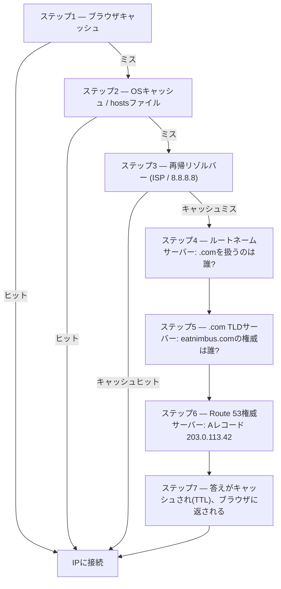

# 第12章：インターネットがあなたを見つける方法

マヤはブラウザで`nimbus-alb-123456789.us-west-2.elb.amazonaws.com`をもう一度更新し、それから椅子にもたれて天井を見上げました。ページは読み込まれました。アプリは機能しました。しかし、レストランパートナーにリンクを共有するたびに、彼女はうまく名づけられない小さな恥ずかしさを感じていました。

そのURLは技術的な遺物であって、プロダクトではありませんでした。

---

*前章のネットワーク再設計はうまくいきました。すべてのリソースが正しい場所にありました。パブリックサブネットのロードバランサー、プライベートサブネットに閉じ込められたデータベース。インフラはセキュアで、正しくセグメント化されていました。しかし、Nimbusが最初の一般公開に向けて準備する中で、新しい問題が現れました。AWSが自動的に割り当てたロードバランサーのURLは、人々が信頼するプロダクトではなく、システムの識別子のように見えました。彼らは本物のドメイン名が必要でした。そして、誰かが`eatnimbus.com`と入力した瞬間と、ページが現れる瞬間との間に何が起きるのかを理解する必要がありました。*

---

Nimbusは稼働していました。ロードバランサーにはパブリックIPがありました。EC2インスタンスにはプライベートIPがありました。データベースはプライベートサブネットに閉じ込められていました。プリヤはネットワーク図に賛同してうなずきました。

トムはロードバランサーのURLを見ました：`nimbus-alb-123456789.us-west-2.elb.amazonaws.com`。

「それが顧客がブラウザに入力するもの?」と彼は尋ねました。

「それがAWSが自動的に割り当てるものです」とマヤは言いました。

「それを名刺に載せるつもりはないぞ。」

「私もよ。」

彼らはドメイン名が必要でした。彼らはドメインレジストラから`eatnimbus.com`を購入しました。今、その名前をAWSのインフラに接続する必要がありました。

「インターネットは、`eatnimbus.com`がus-west-2のロードバランサーを意味すると、どうやって知るんだ?」とレオは尋ねました。

良い質問です、レオ。

**電話帳のたとえ話**

スマートフォンの前は、どの都市にも電話帳がありました。「マリオのピザ」に連絡したいなら、電話番号を暗記するのではなく、名前を引いて、番号を得て、電話しました。

インターネットには独自の電話帳があります。**Domain Name System（DNS）**です。

DNSは、人間が読める名前（`eatnimbus.com`のような）を、機械が読めるIPアドレス（`203.0.113.42`のような）に変換します。ウェブサイトを訪れるたびに、あなたのコンピュータは静かにDNSでドメイン名を引き、接続するIPアドレスを得ます。

サーバーのIPアドレスを変更したら、DNSレコードを更新します。電話帳の番号を変えるようなものです。そしてインターネットは、あなたの新しい場所であなたを見つけます。

**DNS解決の完全な旅**

「でも、ルックアップは*実際に*どう機能するんだ?」とレオは尋ねました。「つまり、ステップごとに。私のブラウザは`eatnimbus.com`という名前を知っている。次に何が起きるんだ?」

ほとんどのドキュメントはこれを軽く流します。それは重要です。

ブラウザが`eatnimbus.com`を解決する必要があるとき、すべてのホップを順番に示します。

**ステップ1—ブラウザキャッシュ**：ブラウザは、最近すでにこの名前を解決したかどうかを確認します。はいなら、キャッシュされたIPを使います。いいえなら、続行します。

**ステップ2—OSキャッシュ/ローカルリゾルバー**：オペレーティングシステムは、自身のDNSキャッシュとローカルの`hosts`ファイルを確認します。見つかれば完了です。見つからなければ、設定されたDNSリゾルバー（通常はISPのもの、または8.8.8.8のようなパブリックなもの）に転送します。

**ステップ3—再帰リゾルバー**：再帰リゾルバー（あなたのISPまたはGoogleの8.8.8.8）が主役です。これにもキャッシュがあります。答えを知っていれば、すぐにそれを返します。知らなければ、実際の解決チェーンを開始します。

**ステップ4—ルートネームサーバー**：再帰リゾルバーは、13のルートネームサーバークラスター（世界中にデプロイされている）の1つに連絡します。ルートサーバーは`eatnimbus.com`がどこにあるか知りません。しかし、`.com`ドメインを管理しているのが誰か（`.com` TLDサーバー）を知っています。それらのアドレスを返します。

**ステップ5—TLD（トップレベルドメイン）ネームサーバー**：再帰リゾルバーは`.com` TLDサーバーに連絡します。TLDサーバーも`eatnimbus.com`がどこにあるか知りません。しかし、`eatnimbus.com`に権威を持つネームサーバー（実際にDNSレコードを保持するサーバー）がどれか知っています。それらのアドレスを返します。

**ステップ6—権威ネームサーバー**：再帰リゾルバーはRoute 53のネームサーバー（`eatnimbus.com`の権威ネームサーバー）に連絡します。Route 53は実際のレコードを持っています。Aレコードを返します：`eatnimbus.com → 203.0.113.42`。この答えは権威あるものです。キャッシュされたものではなく、本物の答えです。

**ステップ7—応答がキャッシュされ、返される**：再帰リゾルバーは、レコードのTTL（有効期限）の間、答えをキャッシュします。IPをブラウザに返します。ブラウザはそれをキャッシュします。ブラウザは接続します。



「IPアドレスを見つけるだけで7ホップか」とトムは言いました。

「通常は合計で100ミリ秒未満です」とプリヤは言いました。「ステップ3から6は、あらゆるレベルで積極的にキャッシュされます。人気のあるドメインでは、ステップ4と5（ルートとTLDのルックアップ）は、再帰リゾルバーがすでにそれらのサーバーをキャッシュしているため、完全にスキップされることがよくあります。チェーン全体は通常20〜40ミリ秒で実行されます。」

「そして最初のルックアップの後は、ブラウザキャッシュのおかげで、その後のリクエストはすべてをスキップする」とレオは付け加えました。

「その通り。DNSが瞬時に感じられるのは、ほとんどのルックアップがキャッシュヒットだからです。完全なチェーンは、レコードが新しいか、そのTTLが期限切れになったときだけ実行されます。」

**Route 53の登場**

Amazon Route 53はAWSのマネージドDNSサービスです。ポート53が標準のDNSポートであるため、Route 53と呼ばれます。（AWSは時々、物事を率直に名づけます。）

Route 53はいくつかのことをします。

**ドメイン登録**：Route 53を通じて直接ドメイン名を購入できます。

**DNSホスティング（ホストゾーン）**：ドメインのための*ホストゾーン*を作成し、Route 53が、世界にあなたをどこで見つけるかを伝えるDNSレコードを管理します。

**ヘルスチェック**：Route 53はエンドポイントを監視し、不健全なものからトラフィックを逸らすことができます。

**トラフィックルーティングポリシー**：Route 53は、シンプルなDNSを超える複数のルーティング戦略をサポートします。加重、レイテンシベース、地理位置情報、フェイルオーバーです。

**DNSレコード：電話帳のエントリ**

DNSレコードは名前を宛先にマッピングします。最も一般的なタイプ：

**Aレコード**：名前をIPv4アドレスにマッピングします。
`eatnimbus.com → 203.0.113.42`

**AAAAレコード**：名前をIPv6アドレスにマッピングします。

**CNAMEレコード**：名前を別の名前（エイリアス）にマッピングします。
`www.eatnimbus.com → eatnimbus.com`

**MXレコード**：ドメインのメールを処理するサーバーを指定します。

**TXTレコード**：任意のテキストを保存します。ドメイン検証（ドメインを所有していることの証明）やメール認証（SPF、DKIM）によく使われます。

Nimbusの場合、主要なセットアップ：

- `eatnimbus.com` → ロードバランサーを指すエイリアスレコード
- `www.eatnimbus.com` → `eatnimbus.com`を指すCNAME
- `api.eatnimbus.com` → APIロードバランサーを指すエイリアスレコード

「待って」とトムは言いました。「ロードバランサーのIPは変わることがある。AWSがドキュメントでそう言っていた。」

良い指摘です、トム。

**エイリアスレコード：動的IPに対するAWSの解決策**

ロードバランサー、CloudFrontディストリビューション、S3ウェブサイトは、静的IPアドレスではなくDNS名を持ちます。基盤となるIPは変わることがあります。

ロードバランサーのDNS名を指すCNAMEを作成すれば機能します。しかし、DNSの標準のため、ルートドメイン（`www`なしの`eatnimbus.com`）にはCNAMEを使えません。

Route 53はこれを**エイリアスレコード**で解決します。DNSへのAWS固有の拡張です。エイリアスレコードは、名前をAWSリソース（ロードバランサー、CloudFrontディストリビューション、S3ウェブサイト）に直接マッピングし、Route 53が動的なIP解決を自動的に処理します。エイリアスレコードはルートドメインレベルで使えます。そして、外部サービスへの通常のDNSクエリとは異なり、AWSリソースへのエイリアスレコードのクエリは無料です。

「つまり、ロードバランサーを指す`eatnimbus.com`にはエイリアスレコードを使う」とレオは確認しました。

「そしてRoute 53が、ロードバランサーがその時々で使っているどんなIPでも処理します」とプリヤは付け加えました。

「無料で」とトムは、突然とても興味を持って言いました。彼はRoute 53の料金ページを開きました。「それ以外は?」

「ホストゾーンあたり50セント」とレオは言いました。「加えて、DNSクエリ100万件あたり約40セント。今の私たちのトラフィックなら、たぶん月に2ドル未満です。」

トムは満足して料金ページを閉じました。

**ルーティングポリシー：「それはどこ?」だけではない**

ここでRoute 53が面白くなります。DNSは単なるルックアップサービスではありません。トラフィック管理ツールになれます。

**シンプルルーティング**：1つのレコード、1つの宛先。標準のDNSです。

**加重ルーティング**：複数の宛先の間でトラフィックを重みで分割します。移行中に、新しいサーバーに90%、古いサーバーに10%を送ります。新しいサーバーに確信を持てるまで重みを調整し、それから100%に切り替えます。

**レイテンシベースルーティング**：ユーザーを、彼らにとって最もレイテンシの低いAWSリージョンにルーティングします。シアトルのユーザーは`us-west-2`にルーティングされます。東京のユーザーは`ap-northeast-1`にルーティングされます。同じドメイン名、異なる宛先です。

**地理位置情報ルーティング**：ユーザーの地理的な位置に基づいてルーティングします。すべてのヨーロッパのユーザーは`eu-west-1`に行きます。すべての北米のユーザーは`us-east-1`に行きます。データ主権（EUユーザーのデータをEUリージョンに保つ）やコンテンツのカスタマイズ（言語、通貨）に有用です。ルーティングの決定はハードな境界を使います。ユーザーは国、大陸、または米国の州にいて、そこに行きます。

**地理的近接ルーティング**：ユーザーの地理的位置に基づいてトラフィックをルーティングし、*かつ*、**バイアス**値でそれらの決定を調整できます。正のバイアスは、リソースにルーティングされる地理的領域を拡大し、より多くのトラフィックを引き寄せます。負のバイアスはそれを縮小します。ハードな国と大陸の境界を使う地理位置情報とは異なり、地理的近接は連続的です。小さなバイアス値は、固定の線を引き直すことなく、トラフィックを1つのリージョンから別のリージョンに徐々にシフトできます。

この2つを区別するシナリオ：ある会社が`us-east-1`から`us-west-2`に徐々に移行していて、トラフィックを段階的に西にシフトしたい（スイッチを切り替えるのではなく、時間をかけてダイヤルする）場合、西のエンドポイントに増加する正のバイアスを持つ地理的近接が正しいツールです。地理位置情報は、すべての西海岸のユーザーをオレゴンにルーティングするか、しないかのどちらかです。ダイヤルがありません。2024年1月以降、地理的近接はDNSレコード上で（コンソール、API、CLIで）直接、通常のルーティングポリシーとして利用可能です。もはやRoute 53 Traffic Flowを必要としませんが、そこでも引き続き利用可能です。

**フェイルオーバールーティング**：プライマリとセカンダリのエンドポイントを指定します。プライマリがRoute 53のヘルスチェックに失敗すると、トラフィックは自動的にセカンダリにリダイレクトされます。これは災害復旧のDNSレイヤーです。

「待って、でも*なぜ*すでにマルチAZがあるのに、2番目のリージョンへのフェイルオーバールーティングを設定するの?」とマヤは尋ねました。「マルチAZが障害を処理するはずでは?」

良い質問です。マルチAZは、リージョン内の単一のアベイラビリティーゾーンの障害から保護します。1つのデータセンターがダウンすると、別のAZのスタンバイが引き継ぎます。しかし、AWSリージョン全体が利用できなくなったら？あるいはリージョン全体のサービス中断があったら？DNSフェイルオーバールーティングは異なるレベルで動作します。そのリージョンのヘルスチェックが失敗したとき、リージョン全体からトラフィックを逸らします。マルチAZはリージョン内の回復力です。DNSフェイルオーバーはリージョン間の回復力です。

**マルチバリュー応答ルーティング**：クエリに対して最大8つの健全なIPアドレスを返し、クライアントに選ばせます。複数のサーバーにトラフィックを分散するための、ロードバランサーへのシンプルな代替です。

「つまり、Route 53は単なる電話帳ではない」とマヤは言いました。「どこから電話をかけているかに基づいて電話をルーティングできる、賢い電話帳だ。」

「そして番号が不健全なら、あなたを切断します」とプリヤは付け加えました。

---

**レイテンシルーティングとヘルスチェック：思考実験**

プリヤはホワイトボードにシナリオをスケッチしました。Nimbusの東海岸のユーザーベースが成長を続けて、ある日チームが`us-east-1`（北バージニア）に軽量なスタックを立ち上げたとします。完全なマルチリージョンのアクティブ・アクティブ構成ではなく（それは高価で複雑です）、静的コンテンツと閲覧ページを提供するロードバランサーと読み取り専用のEC2インスタンスのセットです。注文は依然として`us-west-2`のプライマリデータベースに西へ行きます。閲覧トラフィック（リクエストの70%を占める）は、どちらの海岸からでも提供できます。

閲覧エンドポイントのRoute 53設定は次のようになります。

```
browse.eatnimbus.com
  → レイテンシレコード: us-east-1 ALB (ヘルスチェック付き, set-identifier "east")
  → レイテンシレコード: us-west-2 ALB (ヘルスチェック付き, set-identifier "west")
```

（レコードは*ホスト名*、`browse.eatnimbus.com`であることに注意してください。DNSは名前をルーティングし、URLパスは決してルーティングしません。`/browse`のようなパスベースのルーティングはロードバランサーの仕事で、Route 53のものではありません。）

レイテンシルーティングでは、シアトルのユーザーは`us-west-2`エンドポイントに解決されます。ボストンのユーザーは`us-east-1`に行きます。Route 53は、そのインフラから各リージョンへのレイテンシを継続的に測定し、ユーザーごとに速い方を選びます。

「でも、西のリージョンに問題があったら?」とトムは尋ねました。「シアトルの閲覧ユーザーは行き詰まる。」

「それがヘルスチェックの目的です」とプリヤは言いました。「各レイテンシレコードは、それぞれのロードバランサーにヘルスチェックを持ちます。`us-west-2`のヘルスチェックが3回連続で失敗すると、Route 53はそのレコードを返すのをやめます。通常はオレゴンが速いユーザーに対してもです。シアトルのユーザーは、オレゴンが回復するまで東にルーティングされます。」

「つまり、レイテンシルーティングはどのリージョンが通常優先されるかを決めて」とマヤは言いました。「ヘルスチェックは、優先されるリージョンがダウンしたら、その優先を上書きするの?」

「その通り。レイテンシポリシーは通常の条件下で勝者を選びます。ヘルスチェックは、機能しなくなった勝者を取り除きます。」

レオは障害のシナリオについて考えました。「それで、それらのレコードのTTLは?」

「60秒です」とプリヤは言いました。「30秒間隔で3回失敗したチェックでそれが作動します。障害を検知するのに最大90秒。それからDNSリゾルバーが変更を拾うのに最大60秒です。」

「最悪の場合で2分半か」とレオは言いました。

「だから、気にかけるようになる*前に*TTLを下げるんです。後ではなく。」

この組み合わせ（すべてのレコードにヘルスチェックを持つレイテンシルーティング）は、マルチリージョンのデプロイにおける最も強力なRoute 53設定の1つです。ユーザーは常に最も速い健全なリージョンに行きます。リージョンに問題があると、システムは自己修復します。そしてその全体がDNSです。追加のインフラなし、プロキシサーバーなし、リージョン間のロードバランサーなしです。

---

**ヘルスチェック失敗の事件**

Nimbusのステージング環境は、フェイルオーバールーティングの偶然のデモンストレーションを彼らに与えました。

彼らはテストとして、ステージングのロードバランサーにRoute 53のヘルスチェックを設定していました。30秒ごとに`/health`エンドポイントをチェックします。ある金曜の午後、レオはバグのあるデプロイをステージングにプッシュしました。ヘルスエンドポイントが500エラーを返し始めたのです。彼のローカルテストは通りましたが、サーバーで壊れました。

Route 53は失敗を記録しました。3回連続で失敗したチェックの後、エンドポイントを不健全とマークしました。フェイルオーバーレコードが作動し、ステージングのトラフィックを「メンテナンス中」と書かれた読み取り専用のフォールバックページにルーティングしました。

レオの最初のアラートは、QAエンジニアからのSlackメッセージでした：「ステージングがメンテナンスページを表示している。」

レオはデプロイを確認しました。500エラーはログで明白でした。彼はデプロイをロールバックしました。ヘルスエンドポイントが200を返してから90秒以内に、Route 53はチェックを再評価し、3回連続の成功を見て、トラフィックをステージングのロードバランサーに戻しました。メンテナンスページは消えました。

メンテナンスページにいた合計時間：7分。

「あれはシステムが正しく機能していました」とプリヤは言いました。

「分かってる」とレオは言いました。「怖いのは、ヘルスチェックがなかったら何が起きていたかを考えることだ。500エラーは本物のユーザーに行っていただろう。」

「本番では、ヘルスチェックがセカンダリリージョンまたは静的エラーページにフェイルオーバーしていたでしょう。ユーザーはエラーの代わりに、維持された体験を見ていたでしょう。」

「フェイルオーバーは実際どれくらいかかるの?」とマヤは尋ねました。「ヘルスチェックが失敗してから、DNSが異なるルーティングを始めるまで。」

「ヘルスチェックの間隔はデフォルトで30秒。フェイルオーバーを作動させるのに3回連続の失敗。それは問題を検知するのに最大90秒。それからDNSのTTL。60秒なら、伝播はさらに1分です。」

「つまり最悪の場合、約3分?」

「そのくらいです。だから、重要なレコードではTTLを低くしたいし、ヘルスチェックの間隔は予算が許す限り短くしたいのです。」

---

**ヘルスチェック：障害を迂回する**

「もし誰かが侵入を試みたら?」とプリヤは言いました。「DNSはパブリックです。誰でも`eatnimbus.com`がどこを指すか調べられます。それは、攻撃者がどのIPを狙えばいいか正確に分かることを意味します。」

「それは本当です」とレオは言いました。「でも、彼らが見つけるIPはロードバランサーのIPです。ALBがパブリックアドレスを持つ唯一のものです。その背後のすべて（EC2、RDS、ElastiCache）はプライベートサブネットにあります。DNSは彼らに玄関を教えます。その背後に何があるかは教えません。」

Route 53はヘルスチェックでエンドポイントを監視できます。エンドポイントが失敗すると、Route 53は次のことができます。

- DNS応答から削除する（そこにトラフィックを送るのをやめる）
- バックアップエンドポイントへのフェイルオーバーをトリガーする
- CloudWatch経由でアラートを送る

ヘルスチェックは、DNSルーティングと実際のアプリケーションの健全性の間のリンクです。フェイルオーバー構成では：Route 53は30秒ごとにプライマリエンドポイントを監視します。3回連続のチェックが失敗すると、Route 53はセカンダリエンドポイントのアドレスを返し始めます。これらの数字はどれも固定ではありません。30秒は標準の間隔です（有料の「高速」オプションは10秒ごとにチェックします）。そして失敗のしきい値はデフォルトで3回連続のチェックですが、1から10まで設定可能です。

これは瞬時ではありません。DNSには伝播時間があります。Route 53がDNSレコードを変更すると、世界中のDNSリゾルバーが変更を拾う必要があり、TTL設定によって数秒から数分かかることがあります。

**TTL：DNSキャッシュ**

DNS応答は複数のレベルでキャッシュされます。ルーター、ISP、ブラウザでです。DNSレコードの**TTL（有効期限）**は、キャッシュに、再び確認する前にどれだけ長く答えを覚えておくかを伝えます。

高いTTL（1時間以上）：DNSクエリが少なく、Route 53への負荷が低いですが、変更の伝播に時間がかかります。

低いTTL（60秒以下）：変更は素早く伝播しますが、より多くのDNSクエリが必要です。

計画された移行（新しいサーバーを指すようにDNSを更新する）の前に、1日前にTTLを60秒に下げます。それから変更を加えると、約1分で伝播します。移行後、通常の値に戻します。

「もうデプロイしたんだ—あ。」レオはTTLを下げる前にDNSレコードを更新していました。彼は自分の間違いに気づき、数え始めました。古いTTLは1時間でした。一部のユーザーは次の60分間、古いサーバーを取得することになります。

「移行中だけ下げて、その前ではなくしたら」とレオはゆっくりと言いました。「古いTTLのせいで、一部のユーザーは1時間古いサーバーを見ることになる。」

「その通り」とプリヤは言いました。「DNS移行は、移行中だけでなく、移行の前に計画が必要です。」

こう思っているかもしれません。TTLが1時間に設定されている場合、すべてのユーザーはDNS変更の後、新しいサーバーを見る前にまるまる1時間待つことになるのか？正確にはそうではありません。TTLは、リゾルバーがTTLが期限切れになるまで再確認しないことを意味します。あるユーザーのDNSリゾルバーが1時間のTTLで55分前に古い値をキャッシュしたなら、彼らは5分で新しい値を得ます。5分前にキャッシュしたなら、55分待ちます。平均すると、ユーザーはTTLの半分の期間以内に変更を見ます。だから、事前にTTLを下げることがとても重要なのです。変更が起きる前に、最悪の場合の伝播の窓を縮めます。

---

**プライベートホストゾーン：内部DNS**

プリヤは、パブリックドメインがライブになって2週間後、新しい要件を提起しました。

「私たちのEC2インスタンスはデータベースに到達する必要があります」と彼女は言いました。「今、彼らはRDSのエンドポイントDNS名（`nimbus-prod.abc123.us-west-2.rds.amazonaws.com`）を使っています。それは機能しますが、パブリックなDNS名です。データベース構成を変更したいとき、すべてのアプリケーション構成ファイルを更新する必要があります。」

「プライベートなDNS名を使えばいい」とレオは言いました。「`db.nimbus.internal`のような。私たちのサービスが内部で使う、現在のデータベースエンドポイントが何であれそれにマッピングするものを。」

「その通り。Route 53のプライベートホストゾーンです。」

**プライベートホストゾーン**は、VPC内でのみ解決されるDNSドメインです。`nimbus.internal`への外部のDNSクエリは応答を得ません。しかし、VPC内からは、`db.nimbus.internal`がRDSエンドポイントに解決されます。

彼らはそれをセットアップしました。

- プライベートホストゾーン：`nimbus.internal`
- CNAMEレコード：`db.nimbus.internal → nimbus-prod.abc123.us-west-2.rds.amazonaws.com`
- CNAMEレコード：`cache.nimbus.internal → nimbus-cache.abc123.usw2.cache.amazonaws.com`
- Aレコード：`api.nimbus.internal → 10.0.10.5`（内部EC2のIP。Aレコードは名前をIPアドレスにマッピングし、CNAMEは名前を別の名前にマッピングします。このインスタンスは静的なプライベートIPを保つので、ここでは問題ありません。Auto Scalingの背後にあるものには、代わりにロードバランサーを指します）

今、アプリケーション構成はこう読みました。

```
DATABASE_HOST=db.nimbus.internal
CACHE_HOST=cache.nimbus.internal
```

新しいRDSインスタンスに移行したとき、彼らは1つのDNSレコードを更新しました。アプリケーションのデプロイは不要でした。

「これも、データベース移行中にプライベートDNSが重要な理由です」とプリヤは言いました。「`db.nimbus.internal`を新しいエンドポイントを指すように更新します。トラフィックがシフトします。古いエンドポイントはTTLの窓の間、利用可能なままです。アプリケーション構成の変更なしです。」

**内部DNSのデバッグの物語**

3週間後、レオは新しいサービス（バックグラウンドワーカー）をデプロイしましたが、データベースに到達できませんでした。ワーカーはAPIサーバーと同じVPC、同じプライベートサブネットにありました。APIサーバーはデータベースに到達できました。ワーカーはできませんでした。

彼はセキュリティグループを確認しました。ワーカーのセキュリティグループにはPostgreSQL用のアウトバウンドルールがありました。データベースのセキュリティグループにはワーカーのセキュリティグループからのインバウンドルールがありました。すべて正しく見えました。

彼はワーカーインスタンスから`nslookup db.nimbus.internal`を実行しました。

応答なし。

「DNSルックアップが失敗している」と彼はプリヤに言いました。

彼女はワーカーインスタンスのVPC構成を見ました。「ワーカーは実際どのVPCにいるの？プライベートホストゾーンはVPCに関連付けられています。インスタンスが関連付けられたVPCにいなければ、そのゾーンはそれに対して単に存在しません。」

「メインVPCだよ。他のすべてと同じ。」

「そう?」

プライベートホストゾーンは、それらが提供する各VPCに明示的に関連付けられる必要があります。関連付けはVPCごとで、決してサブネットごとではありません。プリヤはゾーンを作成したときにメインVPCを関連付けていました。しかしレオは、別の実験のために作成したテストVPCに誤ってワーカーをデプロイしていました。異なるVPC。プライベートホストゾーンに関連付けられていません。

「ワーカーが間違ったVPCにいます」とプリヤは言いました。

「もうデプロイしたんだ—あ。」レオはワーカーを正しいVPCに移しました。DNSは解決しました。ワーカーはデータベースに接続しました。

「1つのVPC」とレオはメモを取りながら言いました。「複数にする理由がない限り。」

---

**DNSSEC：DNS応答を認証する**

「DNSスプーフィングについて考えたことはありますか?」とプリヤは尋ねました。「もし誰かが私たちのDNSクエリを傍受して偽のIPを返したら？私たちのユーザーのブラウザは、私たちのではなく攻撃者のサーバーに接続してしまいます。」

**DNSSEC（DNS Security Extensions）**は、DNSレコードに暗号的に署名することでこれを解決します。DNS応答にDNSSEC署名が含まれていると、リゾルバーは、応答が権威ネームサーバーから来て改ざんされていないことを検証できます。

Route 53はパブリックホストゾーンのDNSSEC署名をサポートしています。プロセスは次を含みます。

1. Route 53のホストゾーンでDNSSECを有効にする
2. Route 53がKMSに保存される鍵署名鍵（KSK）を生成する
3. Route 53がゾーン署名鍵ですべてのレコードに署名する
4. 親ドメインレジストラ（.com TLD）にDS（Delegation Signer）レコードを追加する
5. DNSSECをサポートするリゾルバーが、応答の真正性を検証できるようになる

「DNSスプーフィングはどれくらい一般的なの?」とレオは尋ねました。

「パブリックインターネットでは、まれですが可能です」とプリヤは言いました。「ほとんどのISPリゾルバーは今日DNSSEC検証をサポートしています。DNSSECの有効化にはお金がかからず、意味のある真正性のレイヤーを追加します。」

「それは月にいくらかかる?」とトムは尋ねました。

「DNSSEC署名の有効化自体はRoute 53では無料です」とプリヤは言いました。「唯一の本当のコストは、鍵署名鍵を保持するKMS鍵です：月に1ドル、加えてKMS API呼び出し。そして1つの鍵は複数のホストゾーンで共有できます。DNSハイジャック攻撃に対する保護は、私たちの規模では実質的に無料です。」

トムは昼食前にそれを有効にしました。

---

**Route 53 Resolver：ハイブリッドDNS**

Nimbusが最終的にAWS VPCをVPNを通じてオンプレミスの開発ネットワークに接続したとき、新しい問題が現れました。オンプレミスのサーバーがAWSのプライベートDNS名（`db.nimbus.internal`のような）を解決する必要があり、AWSのリソースがオンプレミスのホスト名（`jenkins.corp.nimbus.local`のような）を解決する必要がありました。

DNS解決はデフォルトでネットワーク境界を越えません。AWSのリソースはRoute 53 Resolver（すべてのVPCに組み込まれている）を使ってDNSを解決します。オンプレミスのサーバーは独自のDNSサーバーを使います。どちらも他方のレコードを見られません。

**Route 53 Resolverエンドポイント**がこのギャップを橋渡しします。

**インバウンドエンドポイント**：オンプレミスのDNSサーバーは、AWSがホストするDNSゾーンのクエリを、VPC内のインバウンドエンドポイントIPに転送できます。Route 53 Resolverがクエリを処理し、結果を返します。

**アウトバウンドエンドポイント**：EC2インスタンスがオンプレミスのホスト名を解決する必要があるとき、Resolverはそれらのクエリをアウトバウンドエンドポイントを通じてオンプレミスのDNSサーバーに転送します。

「つまり翻訳サービスのようなものね」とマヤは言いました。「AWSのDNSとオンプレミスのDNSは互いに直接話さない。Resolverエンドポイントが仲介者として機能する。」

「その通り。オンプレミスのサーバーは今や`db.nimbus.internal`を解決できます。EC2インスタンスは`jenkins.corp.nimbus.local`を解決できます。両方の側が両方の世界のDNS名を見ます。」

Nimbusの場合、これは開発チームが、オフィスからAWSのステージング環境に対して統合テストを実行したいときに関連してきました。Resolverエンドポイントがなければ、彼らはhostsファイルを手動で編集していたでしょう。それらがあれば、内部DNSはVPNを越えて単に機能しました。

Resolverエンドポイントのアーキテクチャ：

- **インバウンドエンドポイント**：VPC内の2つの異なるAZに作成された2つのENI（Elastic Network Interface）。それぞれがプライベートIPを取得します。オンプレミスのDNSサーバーを、AWSがホストするゾーンのクエリをこれらのIPに転送するように設定します。トラフィックはVPNまたはDirect Connectを通ります。
- **アウトバウンドエンドポイント**：2つのAZの2つのENI。転送ルールを作成します：「`corp.nimbus.local`のクエリはこれらのオンプレミスDNSサーバーIPに行く」。EC2インスタンスは自動的にResolverを使い、それが転送ルールを参照してクエリをオンプレミスに送ります。

「なぜエンドポイントごとに2つのENI?」とレオは尋ねました。

「高可用性です」とプリヤは言いました。「1つのAZがネットワーク接続を失っても、もう1つのエンドポイントIPがまだ機能します。NATゲートウェイと同じ原理です。」

「それは月にいくらかかる?」とトムは尋ねました。

Resolverエンドポイントは、**Elastic Network Interfaceあたり**約0.125ドル/時間かかり、各エンドポイントは可用性のために少なくとも2つのENIを必要とします。したがって現実的な下限は、エンドポイントあたり月に約180ドル、加えてDNSクエリ100万件あたり0.40ドルです。内部の名前を解決するためにハイブリッドDNSを使うチームにとって、コストは控えめです。そして、複数の開発者マシンとCI/CDシステムにわたってhostsファイルを維持する必要を排除します。

「ホスト名をhostsファイルに入れればいいんじゃない」とレオは提案しました。

「すべての開発者マシン、すべてのCIランナー、すべての新しいオンボーディングで」とプリヤは言いました。「何かが変わるたびに。」

「エンドポイントの価値はある」とレオは言いました。

「あります。」

## 強みと限界

**Route 53が正しい選択なのは**：ドメイン名をAWS内で完全に登録・管理する。レイテンシ、地理位置情報、または複数のエンドポイントにわたる加重分散に基づいてトラフィックをルーティングする。リージョン間またはプライマリと災害復旧エンドポイントの間でヘルスチェックベースのフェイルオーバーをする。エイリアスレコードを通じてDNSを他のAWSサービスと統合する。内部のサービスディスカバリのためのプライベートホストゾーン。

**Route 53が必要なものではないとき**：Route 53はDNSサービスであって、ロードバランサーではありません。リージョン内で複数のサーバーやコンテナの間でトラフィックを分散する必要があるなら、Application Load Balancerを使います。Route 53は、ロードバランサーのように接続レベルで加重ラウンドロビンをできません。リージョン間のレイテンシベースルーティングは、ユーザーが本当にグローバルに分散していて、ミリ秒がコンバージョンに重要なときにのみ意味のある、コストと運用上の複雑さを追加します。ほとんどの単一リージョンのアプリケーションでは、ALBを指す1つのエイリアスレコードが、あなたに必要なすべてのRoute 53設定です。

## 概要

`nimbus-alb-123456789.us-west-2.elb.amazonaws.com`から`eatnimbus.com`に移ることは、小さなことのように感じられました。そうではありませんでした。DNSはインターネット全体が動くアドレスシステムであり、Route 53はそのシステムを、ルックアップだけでなく、トラフィック管理と回復力のために使うツールを与えます。

- **DNS**はドメイン名をIPアドレスに変換します。インターネットの電話帳です。
- **Route 53**はAWSのマネージドDNSサービスです。ドメイン登録、DNSホスティング、ヘルスチェック、ルーティングポリシーです。
- **Aレコード**は名前をIPv4アドレスにマッピングします。**CNAME**は名前を別の名前にマッピングします。**エイリアスレコード**は名前をAWSリソース（ロードバランサー、CloudFront、S3）にマッピングします。
- ルートドメインや動的IPを持つリソースには、CNAMEではなくエイリアスレコードを使います。
- ルーティングポリシーはシンプルなDNSを超えます：**加重**（トラフィック分割）、**レイテンシベース**（パフォーマンス）、**地理位置情報**（データ主権—ハードな国/大陸の境界）、**地理的近接**（バイアスダイヤルによる距離ベース—段階的なトラフィックシフト）、**フェイルオーバー**（災害復旧）。
- **プライベートホストゾーン**は、VPCリソースに内部DNSを提供します。ハードコードされたIPではなく名前によるサービス間通信です。
- **DNSSEC**はレコードに暗号的に署名し、DNSスプーフィングから保護します。
- **Route 53 Resolverエンドポイント**はハイブリッドネットワークを橋渡しします。AWSとオンプレミスのDNSが互いの名前を解決できます。

## 試験のヒント

*SAA-C03 ドメイン：高パフォーマンスアーキテクチャの設計（ドメイン3、タスク3.4）*

- **エイリアス対CNAME**：エイリアスレコードはルートドメインで使えます。CNAMEは使えません。AWSリソースへのエイリアスレコードは無料です。CNAMEのDNSクエリは課金されます。試験がルートドメインをロードバランサーにマッピングすることについて尋ねたら→エイリアスレコード。
- **ルーティングポリシーのユースケース**（一般的な試験シナリオ）：
  - 「トラフィックを新しいバージョンに徐々に移行する」→加重ルーティング
  - 「ユーザーを最も近いAWSリージョンにルーティングする」→レイテンシベースルーティング
  - 「EUユーザーのデータをEUリージョンに保つ」→地理位置情報ルーティング
  - 「プライマリがダウンしたときの自動DNSフェイルオーバー」→ヘルスチェック付きフェイルオーバールーティング
  - 「トラフィックを新しいリージョンに徐々にシフトする」または「私たちのEUデプロイに引き寄せるトラフィックを増やす」→正のバイアスを持つ地理的近接ルーティング
- **地理的近接対地理位置情報**：地理位置情報はユーザーの国/大陸でハードな境界を使ってルーティングします。地理的近接は地理的距離で、設定可能なバイアスを使ってルーティングします。トラフィックを新しいリージョンに徐々にシフトしたり、特定のデプロイにより多くのユーザーを引き寄せたりする必要があるときに使います。2024年1月以降、レコード上で通常のルーティングポリシーとして利用可能です（Traffic Flowは不要になりました）。
- **Route 53のヘルスチェック**：HTTP/HTTPS/TCPエンドポイントをチェックでき、CloudWatchアラームをトリガーできます。試験はこれらを災害復旧シナリオで使います。
- **TTLと伝播**：TTLがDNSリゾルバーがレコードをどれだけ長くキャッシュするかを制御することを知っておきましょう。短いTTL = 速い変更。試験シナリオ：「チームはDNSを更新したが、ユーザーはまだ古いサーバーにヒットしている」→TTLが高すぎる。
- **プライベートホストゾーン**：Route 53は、VPC内でのみ解決されるDNSレコードを作成できます。試験はこれを内部のサービスディスカバリに使います（例：プライベートRDSエンドポイントに解決される`database.internal`）。
- Route 53は**グローバル**です。リージョンにデプロイされません。ホストゾーンを作成するときにリージョンの選択は不要です。
- **Route 53 Resolverエンドポイント**：オンプレミスとAWSのDNSが互いの名前を解決する必要があるハイブリッドシナリオで使われます。オンプレミス→AWSにはインバウンドエンドポイント。AWS→オンプレミスにはアウトバウンドエンドポイント。

## 演習

**演習1—想起**

CNAMEレコードとエイリアスレコードの違いを説明してください。それぞれをいつ使いますか？

*（ヒント：ルートドメインでのCNAMEの制約と、動的なAWSリソースでのエイリアスレコードの振る舞いを考えてみてください。）*

**演習2—SAA-C03シナリオ**

*シナリオ*：あるメディア会社が2つのAWSリージョンからウェブサイトを運用しています：`us-east-1`（プライマリ）と`eu-west-1`（セカンダリ）。チームは、プライマリリージョンが利用できなくなったら、トラフィックが自動的に`eu-west-1`にルーティングされることを望んでいます。会社はまた、このフェイルオーバーメカニズムが、実際にプライマリリージョンをダウンさせることなく、正しく機能することを検証したいと考えています。

これらの要件を最もよく満たすRoute 53の設定はどれですか？

A) `us-east-1`に100%の重み、`eu-west-1`に0%の重みを持つ加重ルーティング
B) 両方のエンドポイントにヘルスチェックを持つレイテンシベースルーティング
C) プライマリエンドポイントにヘルスチェックを持ち、`eu-west-1`を指すセカンダリレコードを持つフェイルオーバールーティング
D) 北米が`us-east-1`を指し、ヨーロッパが`eu-west-1`を指す地理位置情報ルーティング

**ヒント1**：要件はプライマリがダウンしたときの自動フェイルオーバーです。どのルーティングポリシーがまさにこのために設計されていますか？

**ヒント2**：「プライマリリージョンをダウンさせずにテストする」—ヘルスチェックはテストのために手動で「不健全」に設定できます。

**ヒント3**：レイテンシベースルーティングは、フェイルオーバーではなく速度のために最適化します。

**解答**: C

**説明**：フェイルオーバールーティングは、まさにこのユースケースのために設計されています。プライマリレコードはヘルスチェック付きで`us-east-1`を指します。セカンダリレコードは`eu-west-1`を指します。ヘルスチェックが失敗すると、Route 53は自動的にセカンダリレコードを提供します。ヘルスチェックは、実際にプライマリリージョンを中断させることなく、テストのために手動で失敗させることができます。

**なぜAではないのか？** 100%/0%の加重ルーティングは実質的に静的です。プライマリが失敗したときに自動的に切り替わりません。

**なぜBではないのか？** *ヘルスチェック付き*のレイテンシレコードは不健全なエンドポイントを返すのをやめるので、Bは実際の障害を生き延びます。しかし、それは通常のトラフィックパターンを変えてしまい（ユーザーは、要求されたプライマリ/セカンダリではなく、レイテンシでリージョン間に分割される）、フェイルオーバーを*テスト*するきれいな方法がありません。本番でプライマリのヘルスチェックを実際に失敗させる必要があるでしょう。フェイルオーバールーティングは、述べられた意図をモデル化します。指定されたプライマリ、指定されたセカンダリ、ヘルスチェックの状態を強制することでテスト可能です。

**なぜDではないのか？** 地理位置情報ルーティングはエンドポイントの健全性ではなく、ユーザーの位置でルーティングします。ヨーロッパのユーザーは、`us-east-1`が健全でも`eu-west-1`に行き詰まります。そして北米のユーザーは、`us-east-1`がダウンしても`eu-west-1`にフェイルオーバーしません。

*SAA-C03 ドメイン：高パフォーマンスアーキテクチャの設計—タスク3.4*

**演習3—アーキテクチャチャレンジ** *(オプション)*

Nimbusは国際的に拡大しています。彼らは`eatnimbus.com`が、西海岸、東海岸、オーストラリアのユーザーに対して素早く読み込まれることを望んでいます。彼らにはまた規制要件があります。ヨーロッパのユーザーが出した注文は、EUのサーバーで処理されなければなりません。

両方の要件に対応するRoute 53のルーティング戦略を設計してください。どのルーティングポリシーまたはポリシーの組み合わせを使いますか？各リージョンにどんなインフラが必要ですか？

*（単一の正解はありません。目的は、マルチリージョンのルーティング設計を練習することです。）*

## クレジット後のシーン

`eatnimbus.com`がライブになりました。

マヤはそれをブラウザに入力し、Nimbusの注文ページが読み込まれました。彼女はフローをテストするためだけに、自分の家族のレストランからアレパを注文しました。注文は通りました。キッチンがそれを受け取りました。

彼女は椅子にもたれました。

トムはすでにRoute 53のヘルスチェックログを読んでいました。「us-west-2のチェッカーからの応答時間は18ミリ秒だ。」

「それは速いの?」とマヤは尋ねました。

「DNSにしては？はい。シアトルのユーザーにとっても。彼らは実質的にオレゴンのすぐ隣だ。」

「でも、ボストンのユーザーには?」

トムはレイテンシのグラフを見ました。「約80ミリ秒だ。」

マヤはそれについて考えました。「もし私たちの東海岸のパートナーが成長を続けて、私たちのサーバーがオレゴンにあったら…」

「すべてのリクエストがボストンからオレゴンへ往復する」とレオが部屋の向こうから言いました。「光の速さだ。物理には勝てない。」

「つまり、ボストンに近いサーバーが必要だ。」

「あるいは、彼らに代わってコンテンツを提供する、ボストンに近い何かが。」

その考えが空中に漂いました。

次の章では：Nimbusのコンテンツを、どこにいるすべてのユーザーからもミリ秒の距離に置く倉庫です。
