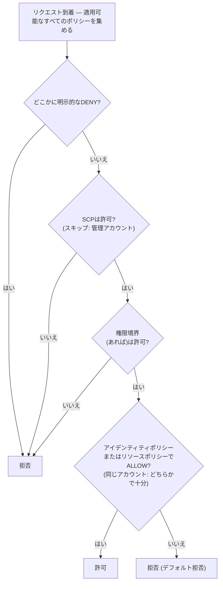

# 第14章：誰が何をすることを許されているか

新しいエンジニアたちは月曜日に始まることになっていました。スージンとラファエル。マヤは彼らの最初の週について考えていました。何にアクセスする必要があるか、何に触れるべきでないか、そして現在のIAMのセットアップが、さらに2人に拡張できる状態にあるのかどうかを。

彼女はオフィスが人で埋まる前に、コーヒーを片手に、リストを作っていました。

---

*CloudFrontはデプロイされました。キャッシュヒット率は良好でした。パフォーマンスは上がりました。しかし、チームが新しいエンジニアを迎える準備をする中で、静かな問題が表面化しました。IAMの設定は、急いでいた人々によって構築されていました。アクセスキーは設定ファイルにありました。一部のロールは必要以上の権限を持っていました。そして2人の新しい人が、複数のユーザーを念頭に置いて設計されていない本番システムへの認証情報を手渡されようとしていました。*

---

トムはアクセスキーをテキストファイルに開いていて、貼り付ける準備ができていました。

「何をしているの?」とプリヤは尋ねました。

「EC2インスタンスがS3から設定ファイルを読む必要がある。認証情報をサーバーの構成に入れているんだ。」

彼女はしばらく画面を見ました。「そのファイルを閉じて。」

「ただ—」

「もし誰かがそのサーバーに入り込んだら」と彼女は言いました。「そのキーを手に入れます。そしてそのキーは、IAMユーザーが触れることを許されているものすべてに触れます。それはおそらく、ただのS3以上です。」

トムはファイルを閉じました。

「もっと良い方法があります」と彼女は言いました。「サーバー自体がロールを持てます。職務上の肩書きのようなものと考えてください。インスタンスは認証情報を必要としません。システムはすでに、それが何で、何をすることを許されているかを知っているからです。」

トムは懐疑的な様子でした。「つまり、サーバーが自分自身を認証する?」

「ええ。パスワードなし。設定ファイルのキーなし。誤ってgitにコミットされうるものなしで。」

その最後の部分が刺さりました。トムは2週間前、自分でアクセスキーをリポジトリにコミットしかけていました。最後の瞬間にdiffで気づいたのです。彼は新しいブラウザタブを開きました。

**IAMを再訪：全体像**

第3章でIAMを紹介しました。ユーザー、グループ、ロール、ポリシーです。今、より深く掘り下げる時です。

IAMポリシーは、どのリソースに対してどのアクションが許可または拒否されるかを指定するJSONドキュメントです。次のように見えます。

```json
{
  "Version": "2012-10-17",
  "Statement": [
    {
      "Effect": "Allow",
      "Action": [
        "s3:GetObject",
        "s3:PutObject"
      ],
      "Resource": "arn:aws:s3:::nimbus-assets/*"
    }
  ]
}
```

このポリシーは、`nimbus-assets`バケット内のオブジェクトの読み取りと書き込みを許可し、それ以外は何も許可しません。削除は許可しません。バケットのリストも許可しません。他のどのS3操作も許可しません。他のどのAWSサービスも許可しません。

これが権限を付与する正しい方法です。具体的なアクション、具体的なリソースです。

**「Administrator Access」の問題**

`AdministratorAccess`のようなAWSマネージドポリシーは、素早く始めるために設計されています。本物のチームメンバーを抱える本番システムを運用するためには設計されていません。

`AdministratorAccess`は、すべてのリソースに対してすべてのアクションを付与します。このポリシーを持つチームメンバーが間違いを犯した場合（誤ってS3バケットを削除した、間違ったEC2インスタンスを終了した、セキュリティグループのルールを変更した）、AWSが彼らを止めるためにできることは何もありません。権限は付与されたのです。

チームメンバーの認証情報が侵害された場合（フィッシング攻撃、漏洩したアクセスキー、ラップトップの盗難）、攻撃者はAWSアカウント内のすべてに対する管理者アクセスを持ちます。

「では、スージンは何を持つべき?」とレオは尋ねました。

「スージンは何をする必要がある?」とプリヤは応えました。

「APIをデプロイする。ログを確認する。それ以外は何もしない。」

「それなら、彼女が得るのは：コードパイプラインにプッシュする能力、CloudWatchログへの読み取りアクセス、それ以外は何もなしです。」

「それは…とても具体的だ。」

「ええ。それがポイントです。」

**IAMロール：サービスのためのアイデンティティ**

第3章では、認証情報を保存せずにEC2インスタンスがAWSサービスにアクセスする方法としてロールを紹介しました。これを具体的にしましょう。

NimbusのAPIを実行するEC2インスタンスは、次のことをする必要があります。

- DynamoDBから読む（メニュー）
- DynamoDBに書く（注文）
- S3にオブジェクトを置く（レシート、アップロード）
- CloudWatchにログを書く
- Secrets Managerからシークレットを読む

アクセスキーを持つユーザーを作成してそのキーをEC2インスタンスに保存する（セキュリティの悪夢です。アクセスキーはSSHアクセスを持つ誰にでも読まれうる）代わりに、まさにこれらの権限を持つEC2インスタンスのための**IAMロール**を作成します。

「待って、でも*なぜ*そのようにするの?」とマヤは尋ねました。「EC2インスタンスはすでに私たちのコードを実行している。コードにアクセスキーを与えればいいんじゃない?」

アクセスキーは、どこかにある静的な認証情報だからです。設定ファイル、環境変数、誰かが間違いを犯せばgitリポジトリの中に。コピーされ、流出させられ、誤ってコミットされうるものです。IAMロールは異なって機能します。EC2インスタンスは自動的にロールを引き受けます。AWSはインスタンスメタデータサービスを通じて一時的な認証情報を提供します。認証情報は自動的にローテーションされます。数時間ごとに期限切れになり、あなたからの何のアクションもなしに更新されます。漏洩するものがありません。保存されているものがないからです。

「そして、もし誰かがEC2インスタンスをハッキングしたら?」とレオは尋ねました。

「彼らはEC2ロールが許可することをできます」とプリヤは言いました。「メニューを読む、注文を書く、ログを送る、です。S3バケットを削除できません。EC2インスタンスを終了できません。IAMに触れられません。」

「EC2ロールがそれらの権限を持っていないから。」

「その通りです。」

---

**EC2のロール引き受けがどう機能するか、ステップごとに**

「何かが計算に合わない」とマヤは言いました。「インスタンスに認証情報が保存されていないなら、インスタンスはどうやって実際にAWSに自分が誰かを証明するの？どこかに認証情報があるはずだ。」

あります。しかしそれは一時的で、自動的にローテーションされ、インスタンスの内部からのみアクセス可能です。

EC2インスタンスがIAMロールがアタッチされた状態で起動すると、AWSは次のことをします。

**ステップ1**：AWS STS（Security Token Service）が一時的な認証情報を生成します。アクセスキーID、シークレットアクセスキー、セッショントークンです。EC2インスタンスロールでは、これらは通常約6時間有効で、AWSは期限切れになる前に自動的にローテーションします。

**ステップ2**：AWSはこれらの認証情報を特別なIPアドレス`169.254.169.254`で利用可能にします。これが**インスタンスメタデータサービス（IMDS）**です。EC2インスタンスの内部からのみ到達可能です。インスタンスの外部からは何もアクセスできません。

**ステップ3**：アプリケーションコードが任意のAWS SDK（boto3、Java SDK、Node.js SDK）を呼び出すと、SDKは自動的にインスタンスメタデータエンドポイントにクエリします。

```
GET http://169.254.169.254/latest/meta-data/iam/security-credentials/{role-name}
```

**ステップ4**：SDKは一時的な認証情報を受け取り、それを使ってAPIリクエストに署名します。たとえばS3から読むリクエストです。

**ステップ5**：AWSは認証情報を検証し、ロールにアタッチされたIAMポリシーを確認し、リクエストを許可するか拒否します。

**ステップ6**：認証情報が期限切れになる約15分前に、EC2インスタンスは自動的にメタデータサービスからそれらを更新します。アプリケーションコードはこれを処理する必要はありません。SDKが透過的にそれを行います。

プロセス全体は開発者には見えません。あなたは`s3.get_object(...)`と書きます。SDKが残りを処理します。

「つまり、認証情報は存在する」とマヤは言いました。「それはただ一時的で、自動ローテーションされ、インスタンスメタデータエンドポイントにロックされている。」

「だからこそ、静的なアクセスキーよりはるかに安全なんです」とプリヤは言いました。「静的なキーは、一度盗まれると、誰かが手動でローテーションするまで有効です。盗まれた一時的な認証情報は自分で期限切れになります。数か月ではなく数時間以内に。」

「そして、もしインスタンスの内部にいる誰かがメタデータエンドポイントにクエリしたら?」

「現在の一時的な認証情報を得られます。それは本当のリスクで、だからAWSはIMDSv2—Instance Metadata Serviceバージョン2を導入しました。IMDSv2は、呼び出し元がまずPUTリクエストでセッショントークンを取得することを要求します。これは、悪意のあるコードがサーバーを騙して攻撃者の代わりにメタデータURLを取得させる、Server-Side Request Forgery（サーバーサイドリクエストフォージェリ）と呼ばれる種類の攻撃を防ぎます。」

レオはEC2の起動構成を更新してIMDSv2を強制しました。1つの設定、起動時に適用されます。

---

**ロール引き受け：サービスが他のサービスになる方法**

ロールは次によって引き受けられます。

- **AWSサービス**（EC2、Lambda、ECSタスクなど）
- 自分のアカウント内の**IAMユーザー**（ロールの昇格—特定のタスクのために、より多くの権限を持つロールを引き受ける）
- **他のAWSアカウントのIAMユーザー**（クロスアカウントアクセス—別の組織のアカウントがあなたのアカウントのロールを引き受けられる）
- **外部のIDプロバイダー**（Google、Active Directory、Okta—人間のユーザーのためのフェデレーテッドアクセス）

「Nimbusが、私たちのAWSリソースへのアクセスを必要とするサードパーティのサービスを使ったらどうなるか、考えたことはありますか?」とプリヤは尋ねました。「たとえば外部の分析ベンダー。私たちは彼らのためにIAMユーザーを作成してアクセスキーを手渡したくありません。」

「クロスアカウントロールです」とレオは言いました。「私たちのアカウントにロールを作成し、『この特定の外部アカウントがこのロールを引き受けることを許可する』という信頼ポリシーを書きます。彼らは自分の認証情報を使ってロールを引き受け、一時的なアクセスを得ます。管理するキーなし、漏洩するキーなしです。」

この最後のパターン—**アイデンティティフェデレーション**—は、大きな組織が各人のために個々のIAMユーザーを作成することなく、従業員にAWSアクセスを与える方法です。あなたの会社のActive Directoryにあなたの認証情報があります。AWSにログインするとき、あなたはActive Directoryに対して認証し、AWSはあなたにロールを付与します。

---

**クロスアカウントアクセス：会計チームのシナリオ**

6か月後、Nimbusは財務レポートを手伝う会計事務所を雇いました。会計チームは、Nimbusのs3課金バケットの課金データへの読み取りアクセスを必要としていました。しかし彼らは自分の別々のAWSアカウントから運営していました。Nimbusは彼らのためにIAMユーザーを作成したくありませんでした。外部の会社の誰かに静的なアクセスキーを手渡すのは、まさに間違っていると感じられました。

「クロスアカウントロールです」とプリヤは言いました。

セットアップには3つの部分があります。

**パート1**：Nimbusのアカウントで、IAMロールを作成します—`AccountingReadRole`と呼びます。課金S3バケットに対する`s3:GetObject`と`s3:ListBucket`を許可するポリシーをアタッチします。それ以外は何も。

**パート2**：`AccountingReadRole`に信頼ポリシーを追加します。信頼ポリシーは、どの外部のアイデンティティがこのロールを引き受けることを許可されるかを言います。

```json
{
  "Version": "2012-10-17",
  "Statement": [{
    "Effect": "Allow",
    "Principal": {
      "AWS": "arn:aws:iam::ACCOUNTING-FIRM-ACCOUNT-ID:role/AccountingAppRole"
    },
    "Action": "sts:AssumeRole"
  }]
}
```

これはこう言います：会計事務所のAWSアカウント内の特定のロールだけがこのロールを引き受けられる。他の誰でもない。

**パート3**：会計事務所のアカウントで、彼らのアプリケーションは`sts:AssumeRole`を使って`AccountingReadRole`の一時的な認証情報を得ます。それらの認証情報は、`AccountingReadRole`が許可することだけにスコープされます。会計アプリケーションは課金ファイルを読めます。それらに書けません。Nimbusアカウント内の他の何にも触れられません。

まさにこのシナリオのために、もう1つの堅牢化ステップがあります。そしてそれは名前のついた試験トピックです。会計事務所は多くのクライアントにサービスを提供します。彼らの悪意のあるクライアントが、Nimbusの`AccountingReadRole`のARNを知り、事務所のソフトウェアにそれを「分析」するよう依頼するとします。事務所のソフトウェアにはロールを引き受ける正当な権限があります。間違った顧客の代わりにNimbusのデータにアクセスするよう騙されうるのです。これが**混乱した代理人問題（confused deputy problem）**で、修正は**ExternalId**です。Nimbusは一意の秘密の値を生成し、それを条件として信頼ポリシーに入れ（`"sts:ExternalId": "nimbus-7f3a..."`）、それを会計事務所だけと共有します。事務所のソフトウェアは、すべての`AssumeRole`呼び出しでそのExternalIdを渡さなければならず、顧客ごとに*異なる*ExternalIdを使います。だから間違った顧客の代わりに行われたリクエストは失敗します。試験のトリガー：「サードパーティがクロスアカウントアクセスを必要とする」→ロール + 信頼ポリシー + **ExternalId**。共有キーを持つIAMユーザーは決してダメです。

「彼らのアクセスを取り消す必要があったら?」とトムは尋ねました。

「信頼ポリシーを削除するか、ロールを削除します」とプリヤは言いました。「完了です。探し回る認証情報なし、無効化するキーなし。ロールがアクセスです。ロールを削除すれば、アクセスは消えます。」

「そして、彼らがそれを使うたびにCloudTrailで見られる」とレオは付け加えました。

「彼らが行ったすべてのAPI呼び出しがログに記録されます。どのバケット、どのファイル、いつ、どんな結果か。」

トムはパターンを書き留めました。それはまた出てきます。すべての統合パートナー、すべての外部ベンダー、AWSアクセスを必要とするすべてのサードパーティツールが、アクセスキーを持つユーザーではなく、信頼ポリシーを持つロールを得ることになります。

---

**IAMポリシーの評価：決定のロジック**

「複数のポリシーが同じリクエストに適用されるときに何が起きるか、考えたことはありますか?」とプリヤは尋ねました。「IAMユーザーにポリシーがある。彼らがアクセスしているリソースにリソースポリシーがある。SCPがあるかもしれない。AWSはどう決めるの?」

理解すべき重要なことは、AWSがポリシーを一度に1つのタイプずつ、順番に確認するのでは**ない**ということです。リクエストに適用される*すべての*ポリシー（アイデンティティベース、リソースベース、SCP、権限境界、セッションポリシー）を集め、その山全体に一度に一連のルールを適用します。

**ルール1—明示的な拒否が常に勝つ。** 適用可能なポリシー（IAM、リソースベース、SCP、境界）のいずれかがアクションを明示的に拒否すると、リクエストは拒否されます。明示的な拒否を上書きできるものは何もありません。

**ルール2—SCPと権限境界はフィルターとして機能する。** これらは決して何も付与しません。アクションは、適用可能なすべてのSCPと（存在する場合）権限境界によって*許可*されなければなりません。さもなければ拒否されます。他のポリシーが何と言おうと。

**ルール3—同じアカウント内では、1つの許可で十分。** アイデンティティのIAMポリシー*または*リソースのポリシーの*どちらか*の明示的な許可が、アクションを許可します。これらは和集合であって、シーケンスではありません。リソースポリシーがIAMポリシーの「前に」評価されるわけではありません。

**ルール4—デフォルト拒否。** アクションを明示的に許可するものが何もなければ、拒否されます。



結果：どこかに明示的な拒否 = 拒否。どこにも許可なし = 拒否。アイデンティティポリシー*または*リソースポリシーからの許可 = 許可（拒否、SCP、境界がブロックしない限り）。

試験が大好きなもう1つの事実：**SCPは組織の管理アカウントには適用されません**（サービスリンクロールにも）。「us-west-2以外でEC2なし」と言うSCPは、すべてのメンバーアカウントを制約します。しかし管理アカウントは手つかずです。これが、AWSがワークロードを管理アカウントから完全に外しておくよう言う理由の1つです。

試験の受験者をつまずかせる1つのニュアンス：**クロスアカウントアクセス**では、ターゲットアカウントのリソースベースポリシーだけでは不十分です。ソースアカウントのアイデンティティも、そのアクションを実行するための明示的な権限を自身のIAMポリシーに必要とします。アカウントBにオブジェクトを読ませるS3バケットポリシーを付与しても、アカウントBのIAMユーザーが`s3:GetObject`を許可するIAMポリシーを持っていなければ、アクセスはやはり拒否されます。両方の側がアクションを許可しなければなりません。リソースポリシーがターゲット側でドアを開け、ソースアカウントのIAMポリシーがユーザーにそこを通る権限を付与します。

「つまり、プリヤのSCPが『eu-west-1でEC2なし』と言って、彼女のIAMポリシーが『すべてのEC2アクションを許可』と言っても、彼女はeu-west-1でインスタンスを作成できない?」とレオは尋ねました。

「正解です」とプリヤは言いました。「SCPは、IAMポリシーが評価される前に、何が可能かをフィルターします。アクションが成功するには両方が同意しなければなりません。」

「そして、IAMポリシーの明示的な拒否は、リソースポリシーの明示的な許可を上書きする?」

「常に。チェーンのどこかにある明示的な拒否が勝ちます。」

---

**権限境界：ロールが付与できるものを制限する**

ここに微妙だが重要な問題があります。デフォルトでは、IAMは、ユーザーが現在持っていない権限を付与することを防ぎません。

スージンが`iam:CreatePolicy`と`iam:AttachUserPolicy`を持っているなら、S3書き込みアクセスを付与するポリシーを作成して自分にアタッチできます。既存のポリシーがS3読み取りしか許可していなくてもです。この種類の脆弱性は**権限昇格（privilege escalation）**と呼ばれ、まさにこれが権限境界が存在する理由です。

しかし、IAM権限の作成をチームリードに委任しつつ、彼らが意図した以上に付与できないことを保証したいなら？

**権限境界**は、アイデンティティに付与されうる最大の権限を設定します。アイデンティティのアタッチされたポリシーがより広くても、実効的な権限は権限境界によって制限されます。

例：チームリードにIAMロールを作成することを許可するポリシーを与えます。しかし、「このチームリードが作成したロールは決してS3削除アクセスを持てない」と言う権限境界をアタッチします。チームリードがS3フルアクセスを持つロールを作成しても、境界はS3削除が効力を持つことを防ぎます。

こう思っているかもしれません。権限境界とService Control Policyの違いは何か？似ているように聞こえます。どちらも、どの権限が効力を持てるかを制限します。区別はスコープです。権限境界は特定のIAMアイデンティティ（ユーザーまたはロール）に適用され、そのアイデンティティが決してできることを制限します。SCPはAWSアカウント全体または組織単位に適用されます。アカウント内のすべてのアイデンティティ（管理者を含む）に影響する組織レベルのガードレールです。IAM管理をチームリードに委任しているときは権限境界を使います。アカウント内の誰も上書きできない組織全体のルールが必要なときはSCPを使います。

これは高度な概念ですが、試験に登場し、組織が大規模にIAM管理を委任する方法を反映しています。

**具体的な権限境界：ロール作成を安全に委任する**

Nimbusは成長していました。スージンは、プラットフォームチームの各シニアエンジニアが、自分が所有するLambda関数のためのIAMロールを作成できるようにすることを提案しました。プリヤがそれぞれを承認する必要なしにです。

「リスクは」とプリヤは言いました。「シニアエンジニアが`AdministratorAccess`を持つLambdaロールを作成することです。間違いによってか、注意深く考えないことによってか。」

「だから権限境界を使います」とスージンは言いました。

プリヤは`NimbusDeveloperBoundary`という権限境界ポリシーを作成しました。

```json
{
  "Version": "2012-10-17",
  "Statement": [
    {
      "Effect": "Allow",
      "Action": [
        "s3:GetObject", "s3:PutObject",
        "dynamodb:GetItem", "dynamodb:PutItem", "dynamodb:Query",
        "cloudwatch:PutMetricData", "logs:CreateLogGroup",
        "logs:CreateLogStream", "logs:PutLogEvents",
        "secretsmanager:GetSecretValue",
        "xray:PutTraceSegments"
      ],
      "Resource": "*"
    }
  ]
}
```

それから彼女は各シニアエンジニアにロールを作成することを許可しましたが、この境界をアタッチした場合のみです。

```json
{
  "Effect": "Allow",
  "Action": ["iam:CreateRole", "iam:AttachRolePolicy"],
  "Resource": "*",
  "Condition": {
    "StringEquals": {
      "iam:PermissionsBoundary": "arn:aws:iam::ACCOUNT_ID:policy/NimbusDeveloperBoundary"
    }
  }
}
```

この条件がなければ、エンジニアは任意の権限を持つロールを作成できます。この条件があれば、彼らが作成するどのロールも`NimbusDeveloperBoundary`がアタッチされていなければなりません。`AdministratorAccess`プラス`NimbusDeveloperBoundary`を持つロールは、2つの積集合を持ちます。実効的には境界にリストされたサービスだけです。

「つまり、彼らはロールを作成できる」とレオは言いました。「でも、それらのロールは決して、S3から読む、DynamoDBに書く、CloudWatchにログする以上のことができない。」

「正解です。彼らはIAMに触れるロールを作成できません。EC2インスタンスを削除するロールを作成できません。境界が天井を定義します。」

「そして、彼らが境界をアタッチし忘れたら?」

「条件が`CreateRole`呼び出しの成功を防ぎます。境界が含まれていない限り、作成は失敗します。」

プリヤはスージンと演習を進めました。20分のセットアップ。結果：エンジニアは、すべてのデプロイにセキュリティレビューなしで、自分のLambdaロール作成をセルフサービスでき、プラットフォームチームは、どのLambda関数も定義された権限以上を決して持たないという確信を保ちました。

**IAM Access Analyzer：権限の監査**

プリヤはチームのIAMセットアップのレビューに2日間を費やしました。彼女は次を見つけました。

- レオの個人ユーザーが管理者アクセスを持っていた（発見されたとおり）
- 古いLambda関数がすべてのS3バケットを読む権限を持っていた（テストの残り）
- サービスロールが、もはや存在しないDynamoDBテーブルへの書き込みアクセスを持っていた

これは普通のことです。IAMの設定は時間とともにゴミが溜まります。

**IAM Access Analyzer**は、AWSアカウントの外部からアクセス可能なリソース（S3バケット、IAMロール、KMSキー、Lambda関数、SQSキュー）を自動的に特定するAWSサービスです。また、ポリシーをIAMのベストプラクティスに照らしてチェックするポリシー検証機能、そしてCloudTrailイベントを分析して最小権限ポリシーを作成するポリシー生成機能も含みます。

「それは月にいくらかかる?」とトムは、ブラウザから顔を上げて尋ねました。

「外部アクセス分析は無料です」とプリヤは言いました。「継続的に実行され、コンソールに発見を報告します。未使用アクセス分析—最近使われていないロールと権限を特定する—は、分析されるIAMロールあたり月に約0.20ドルかかります。」

トムはブラウザに戻りました。

外部アクセスの発見が最もすぐに価値があります。プリヤがAccess Analyzerを有効にすると、2つのことを見つけました。

1つ目、`nimbus-receipts`S3バケットには、特定の外部AWSアカウントからの読み取りを許可するバケットポリシーがありました。8か月前に最初のレシートエクスポート機能を構築するのを手伝った請負業者のアカウントです。請負業者はもう関与していませんでした。バケットポリシーは決してクリーンアップされていませんでした。

「誰も意図しなかった8か月のアクセス」とプリヤは言いました。

「彼らはまだそれにアクセスしていたの?」とトムは尋ねました。

レオはS3アクセスログを開きました。6か月間そのアカウントからのリクエストなし。しかし権限はそこにありました。Access Analyzerがそれを表面化しました。手動のレビューでは誰も見つけなかったでしょう。

2つ目、`nimbus-dev-assets`S3バケットがパブリック読み取りに設定されていました。それは開発中は意図的でした。パブリックアクセスでテストする方が簡単だったのです。それは忘れられていました。

「パブリックアクセスブロックの上書きを削除します」とプリヤは言いました。「そしてアカウントレベルでS3 Block Public Accessを有効にします。それは、個々のバケット設定に関係なく、どのバケットもパブリックになることを防ぎます。」

彼らは両方をしました。

毎月実行される未使用アクセス分析は、90日間使われていないロールを表面化します。それらは削除の候補です。IAMの設定は自然に一方向に成長します。ロールとポリシーが溜まります。Access Analyzerはクリーンアップを見えるようにします。

定期的なIAM監査は運用の一部であるべきです。Access Analyzerは監査を置き換えません。監査を管理可能にします。

**Service Control Policy：組織レベルのガードレール**

AWS環境が複数のアカウント（大きなチームの一般的なパターン—開発アカウント、ステージングアカウント、本番アカウント）に成長したら、**AWS Organizations**は中央のアカウントからそれらを管理させます。1つのすぐ実用的な利点：**一括請求**です。すべてのメンバーアカウントが、管理アカウントによって支払われる1つの請求書にまとまり、使用量がアカウント全体で集約されます。だからボリューム割引（たとえばS3の料金ティア）やReserved InstanceまたはSavings Plansの割引が、アカウントごとではなく組織全体に適用されます。トムは、Organizationsについて他の何かを理解する前に、それに賛同しました。

Organizations内では、**Service Control Policy（SCP）**が、管理者を含むアカウント内の*すべての*IAMエンティティに影響するガードレールを適用します。

SCPの例：「開発アカウントの誰も、eu-west-1リージョンでEC2インスタンスを作成できない。」

開発アカウントで管理者アクセスを持つ人でも、このSCPに違反できません。それはアカウントレベルの上、組織レベルで強制されます。

SCPは権限を付与しません。制限します。アカウント内のどのIAMエンティティも決して持てる最大の権限を定義します。

Nimbusがマルチアカウント構造（共有本番アカウント、開発アカウント、セキュリティアカウント）を確立したとき、プリヤは3つの基礎的なSCPを書きました。

**SCP 1—リージョンロック**：すべてのアカウントが`us-east-1`と`us-west-2`に制限されます。開発者が誤って`ap-southeast-1`にデプロイすると、アクションは拒否されます。これは、意図しないリージョンでのシャドーインフラを防ぎます。

**SCP 2—CloudTrail保護**：どのアカウントの誰もCloudTrailを無効にしたりCloudTrailログを削除したりできません。アカウント管理者でも。CloudTrailが暗くなると、セキュリティの可視性もそれとともに消えます。このSCPはそれを構造的に不可能にします。

**SCP 3—rootユーザーのロックダウン**：メンバーアカウントのrootユーザーによって実行されるすべてのアクションを拒否します（AWSの推奨パターンは、条件付きでMFAを要求するのではなく、rootに一致する`aws:PrincipalArn`への完全な拒否です。条件付きMFAのSCPは、MFAを提示できないサービスフローを壊します）。rootユーザーはほとんど決して使われるべきではありません。日々の作業はロールに属します。覚えておいてください：SCPはメンバーアカウントのrootユーザーに適用されますが、管理アカウントには**決して**適用されません。

「これら3つのポリシーは、過去1年に私たちが見た3つの本物のインシデントを防いだでしょう」とプリヤは言いました。「リージョンロックは、私たちが運営していないリージョンで誤って200のEC2インスタンスを起動した開発者を止めたでしょう。CloudTrail保護は、私たちの前の雇用主でのインサイダー脅威のインシデントを止めたでしょう。rootのロックダウンはただの衛生です。」

「これはセキュリティアカウントにも適用される?」とレオは尋ねました。

「セキュリティアカウントは異なるSCPを持ちます。制限が少ない。セキュリティチームは時々、他のアカウントができないことをする必要があるからです。でもCloudTrail保護はどこでも適用されます。ロギングは神聖です。」

経験則：SCPは、どのアカウントでもどんな状況でも、どこでも決して起こるべきでないことのために。IAMポリシーは、各チームとサービスが具体的に必要とすることのために。

---

## ランディングゾーンの自動化：AWS Control Tower

SCPは機能していました。マルチアカウント構造は形になりつつありました。しかしプリヤは静かに計算をしていて、その数字が気に入りませんでした。

「8つのアカウント」と彼女は言いました。「そして新しいチェーンをまだ数えてもいない。」

Nimbusは単一のAWSアカウントを超えて成長していました。本番がありました。ステージングがありました。買収した3つのレストランチェーンがありました。それぞれが独自のAWS環境を運用し、それぞれがNimbusのガバナンスモデルに折り込まれる必要がありました。合計で8つのアカウント、さらに増える予定です。

スージンはこの問題を知っていました。「前の会社では、新しいアカウントをそれぞれ手動でセットアップしていました」と彼女は言いました。「rootアカウントのメール、IAMユーザー、SCPのアタッチ、CloudTrail、Config、GuardDuty—アカウントあたり最低2時間。そして何かが常にわずかに違っていました。あるアカウントはCloudTrailがus-east-1だけにありました。別のアカウントはGuardDutyが無効でした。誰かが有効にし忘れたからです。50のアカウントを持つ頃には、違いを監査することがそれ自体プロジェクトでした。」

「私たちはそうやらない」とプリヤは言いました。

**AWS Control Tower**は、マルチアカウントAWS環境のセットアップとガバナンスを自動化します。各新しいアカウントのためにOrganizations、SCP、CloudTrail、Config、GuardDutyを手動で配線する代わりに、Control Towerが構造を構築・維持します。

Control Towerをセットアップすると、**ランディングゾーン**を作成します。事前設定された、セキュアなマルチアカウント環境で、管理アカウント、ログアーカイブアカウント、監査アカウントを持ち、すべてAWSのベストプラクティスに従います。ログアーカイブアカウントは、組織内のすべてのアカウントからCloudTrailログを収集します。監査アカウントはセキュリティツールをホストします。このベースラインは自動的にセットアップされます。あなたのチームが2日かけてではなく、Control Towerが数分で。

ランディングゾーンが存在したら、Control Towerはそれを**コントロール**（古い名前の**ガードレール**は、試験を含めどこにでもまだ登場します）を通じて管理します。3つの形式の事前構築されたガバナンスルールです。*予防的コントロール*はSCPです。準拠しないアクションが起こる前にブロックします。*検出的コントロール*はAWS Configルールです。ドリフトをスキャンしてControl Towerのダッシュボードに報告します。*プロアクティブコントロール*はCloudFormationフックです。リソースをプロビジョニングされる*前に*準拠についてチェックし、後でフラグを立てるのではなくデプロイを失敗させます。プリヤのCloudTrail保護SCPは、Control Towerの言語に翻訳すると、予防的コントロールです。パブリックアクセスを持つS3バケットにフラグを立てるConfigルールは検出的コントロールです。CloudFormationスタックが暗号化されていないEBSボリュームを作成するのをブロックするフックはプロアクティブコントロールです。

スージンのアカウントあたり2時間の問題を解決した部分：**Account Factory**です。Nimbusが別のレストランチェーンを買収すると、エンジニアリングチームはAccount Factoryを開き、アカウント名とメールを入力し、プロビジョンをクリックします。数分後、正しいIAMロール、CloudTrail、Config、そしてすべてのガードレールがすでに適用された、事前設定された新しいAWSアカウントが届きます。ほぼ正しい、ではありません。1つ欠けている、でもありません。他のすべてのアカウントと同一です。

「待って、でも*なぜ*そのようにするの?」とマヤは尋ねました。「私たちはすでにOrganizationsとSCPを持っている。なぜその上に別のサービスを追加するの?」

OrganizationsとSCPはガードレールを与えますが、他のすべては自分で構築・維持します。Control Towerは完全なランディングゾーンを与えます。アカウント構造、ログアーカイブ、監査アカウント、ベースラインのセキュリティ設定、そしてAccount Factoryで、すべてAWSによって維持されます。Control Towerは内部でOrganizationsを使いますが、Organizations単独では提供しない自動化された意見のあるセットアップを追加します。今日ゼロから始めて、大規模で一貫したガバナンスが必要なら、Control Towerが答えです。すでに手動で構築した成熟したOrganizationsのセットアップがあるなら、それをControl Towerに登録できます。あるいはそのままにしておけます。

試験の受験者をつまずかせる区別：「特定のアクションをアカウント全体で制限するSCPを適用する」→Organizations + SCPを直接使いたい。「AWSのベストプラクティスに従ってセキュアなマルチアカウント環境を自動的にセットアップし、新しいアカウントのプロビジョニングワークフローを持つ」→Control Towerが欲しい。

「Meridian Kitchenのアカウントを登録するのにどれくらいかかる?」とレオは尋ねました。

「Account Factoryは新しいアカウントを約30分でプロビジョニングします」とプリヤは言いました。「完全に設定されています。『ほぼ設定されている』ではありません。」

トムは何も言いませんでした。彼はエンジニアの2時間のコストを、8倍し、これから来る何個ものアカウントで掛け算したものを見ていました。

---

> **試験のヒント — AWS Control Tower**
>
> *SAA-C03 ドメイン：セキュアなアーキテクチャの設計（ドメイン1）*
>
> - **Control Tower**は、ガードレールとAccount Factoryを持つマルチアカウントのランディングゾーンのセットアップを自動化します。新しいAWS組織を始めるとき、または一貫したガバナンスのベースラインで大規模にアカウントをプロビジョニングする必要があるときに使います。
> - **予防的コントロール = SCP。** 準拠しないアクションが起こる前にブロックします。
> - **検出的コントロール = AWS Configルール。** ドリフトを検出してダッシュボードに報告します。
> - **プロアクティブコントロール = CloudFormationフック。** プロビジョニングの前にリソースを検証します。3つのコントロールタイプ、3つのメカニズム—試験はマッピングをテストします。
> - **Account Factory**は、組織のセキュリティベースラインで事前設定された新しいアカウントを自動的にプロビジョニングします。手動のセットアップなし。
> - **Control Tower対Organizations**：Organizations + SCP = すべてを自分で構築・管理。Control Tower = AWSがランディングゾーンを構築し、内部でOrganizationsを使って、ガードレールの更新をあなたのために管理します。
> - **試験のトリガー**：「新しいアカウントをセキュリティベースラインで自動的にセットアップする」→Control Tower。「アクションを制限する特定のSCPをアカウント全体で適用する」→Organizations + SCPを直接。

---

**CI/CDパイプライン：忘れてしまう認証情報**

「私たちのデプロイパイプラインの認証情報で何が起きるか、考えたことはありますか?」とプリヤは尋ねました。

NimbusアプリケーションをデプロイするGitHub Actionsのワークフローは、以前はGitHub Secretsとして保存されたAWSアクセスキーを使っていました。これは標準的なやり方でしたが、長命のアクセスキーがサードパーティのシステムに存在することを意味しました。

「もしGitHubが侵害されたら?」とプリヤは尋ねました。「あるいはリポジトリが誤ってパブリックになって、誰かがシークレットを読んだら?」

解決策：GitHub OIDCフェデレーションです。GitHub ActionsはOpenID Connectをサポートします。GitHubのIDプロバイダーから一時的なトークンを取得し、それをIAMロールを通じてAWS認証情報と交換できます。静的なアクセスキーは決して作成されません。

デプロイロールのIAM信頼ポリシー：

```json
{
  "Effect": "Allow",
  "Principal": {
    "Federated": "arn:aws:iam::ACCOUNT_ID:oidc-provider/token.actions.githubusercontent.com"
  },
  "Action": "sts:AssumeRoleWithWebIdentity",
  "Condition": {
    "StringEquals": {
      "token.actions.githubusercontent.com:aud": "sts.amazonaws.com",
      "token.actions.githubusercontent.com:sub": "repo:nimbus-org/nimbus-api:ref:refs/heads/main"
    }
  }
}
```

この信頼ポリシーは、GitHub Actionsにデプロイロールを引き受けることを許可しますが、`nimbus-api`リポジトリの`main`ブランチから実行されているときだけです。フォーク、外部の貢献者からのプルリクエスト、または異なるブランチはロールを引き受けられません。

「GitHub Secretsにアクセスキーなし」とレオは言いました。「パイプラインはGitHubのIDトークンを使ってAWSに認証する。」

「そしてロールは、デプロイが実際に必要とすることだけを許可します」とプリヤは付け加えました。「ECRにプッシュ、ECSサービスを更新、S3にファイルを置く。それ以外は何も。」

「もうデプロイしたんだ—あ。」レオは`main`ブランチでOIDCフェデレーションをテストしましたが、ステージング環境が`staging`ブランチからデプロイすることを忘れていました。条件が制限的すぎました。彼は条件を更新して`ref:refs/heads/main`と`ref:refs/heads/staging`を許可しました。

古いアクセスキーは削除されました。デプロイパイプラインは今や、長命の認証情報なしで運用されました。

---

**エンタープライズ規模のIAM**

スージンは、300人のエンジニアと500のAWSアカウントを持つ会社から来ていました。彼女はNimbusのIAMセットアップを見て、しばらく何も言いませんでした。

「きれいです」と彼女はついに言いました。「良い最小権限。でも、この会社が50人のエンジニアを持つとき、この構造は苦痛になります。」

「何が変わるの?」とマヤは尋ねました。

「個々のユーザーの権限を管理するのをやめて、IAM Identity Centerを通じてユーザーのグループを管理し始めます」とスージンは言いました。「複数のアカウント—開発、ステージング、本番、セキュリティ、共有サービス—を持ちます。エンジニアは一部のアカウントにアクセスする必要があり、他にはありません。各アカウントの個々のIAMユーザーでそれをするのは、維持すべき何百もの設定です。」

IAM Identity Center（旧AWS Single Sign-On）がこれを解決します。エンジニアは企業の認証情報で一度ログインします。Identity Centerは、彼らのアイデンティティを、特定のアカウントの権限セット（ポリシーの束）にマッピングします。開発者は開発とステージングへの読み取りアクセス、本番の自分のサービスのリソースへの書き込みアクセスを得ます。セキュリティエンジニアはすべてのアカウントへの読み取りアクセスを得ます。

「誰が何にアクセスできるか、すべてのアカウントにわたって管理する1つの場所」とスージンは言いました。「誰かが参加したら、グループに追加します。彼らが去ったら、Identity Centerから削除すれば、すべてへの彼らのアクセスが消えます。」

「そしてクリーンアップする個々のIAMユーザーなし」とレオは言いました。

「正解。IAMユーザーは存在しません。フェデレーションが存在します。」

エンタープライズのパターン：複数のアカウントを持つAWS Organizations、人間のアクセスを中央で管理するIdentity Center、自動化のための各アカウントのサービスロール、アカウント全体でガードレールを強制するSCP。長命のアクセスキーなし。共有認証情報なし。誰かが去ったときの手動のデプロビジョニングなし。

「私たちはまだそこにいない」とマヤは言いました。

「ええ」とスージンは言いました。「でも、それが方向性です。今あなたがする決定はすべて、そこに到達するのを難しくするのではなく、簡単にすべきです。」

**企業ディレクトリはどこにあるか？AWS Directory Service**

フェデレーションの絵にもう1つ部品があります。Identity Centerはアイデンティティの*ソース*を必要とします。企業のアイデンティティが実際にある場所です。多くの企業にとって、そのソースはMicrosoft Active Directoryで、AWSは**AWS Directory Service**という傘の下で、それを接続する3つの方法を提供します。

**AWS Managed Microsoft AD**は、実際のMicrosoft Active Directoryで、2つのAZにわたるAWS管理のドメインコントローラーで実行されます。本物のADがサポートするすべてをサポートします。グループポリシー、オンプレミスADとの信頼関係、ADに依存するAWSワークロード—FSx for Windows File Server、Windows認証を持つAmazon RDS for SQL Server、ドメインに参加したEC2インスタンスです。これは、AWSの*中に*完全なディレクトリが必要なとき、またはクラウドでADを認識するアプリケーションを実行しているときの選択です。（これは、第6章でレオがCopper KettleのFSx移行に使ったディレクトリです。）

**AD Connector**はディレクトリではまったくありません。プロキシです。VPNまたはDirect Connectのリンク越しに、認証リクエストをあなたの*既存のオンプレミス*ADに転送します。ディレクトリデータはAWSに保存もキャッシュもされません。ユーザーは既存の認証情報を保ち、オンプレミスADが唯一の信頼できる情報源のままです。これは、要件が「既存の企業認証情報を使う」と「アイデンティティ情報がクラウドに保存されてはならない」と言うときの選択です。

**Simple AD**は、低コストのSambaベースのディレクトリで、基本的なAD互換性を持ちます。LDAPとシンプルなドメイン参加を必要とする小規模で独立した環境に機能しますが、信頼、MFA、高度なAD機能をサポートしません。主に小規模なディレクトリの予算オプションとして、そして試験のおとりとして存在します。

「決定木は短いです」とスージンは言いました。「既存のオンプレミスADがあって、それをクラウドにコピーしない要求がある？AD Connector。AWSで実行されるADに依存するワークロード、または信頼関係？Managed Microsoft AD。小さな独立したディレクトリと小さな予算？Simple AD。それで全部です。」

---

## ユーザーがAWSアカウントでないとき

Nimbusのレストラン運営者ポータルは3週間ライブでした。レストランオーナーはログインして注文を見て、営業時間を更新し、週次レポートをダウンロードできました。マヤがその体験を設計しました。レオがそれを構築しました。プリヤはその全体を通じて静かでした。いつになく静かでした。

「認証をどう扱っているの?」とプリヤはある木曜の午後に尋ねました。

「RDSにusersテーブルを作った」とレオは言いました。「ユーザー名、ハッシュ化されたパスワード、レストランID。標準的なものだ。」

プリヤは画面を見ました。「つまり、私たちはパスワードを管理している。それらを保存している。ログインフローを処理している。リセットメール。ブルートフォース保護。」

「うん?」

「私たちは、誰かのアカウントが侵害されたときにも責任がある。リセットメールがなりすましアドレスに行ったとき。レストランオーナーが、どこか別の場所での漏洩からパスワードを再利用したとき。」

レオはそのすべてについて考えていませんでした。

「まさにこの問題のためのマネージドサービスがあります」とプリヤは言いました。「そしてそれはIAMではありません。IAMはあなたのAWSアカウント、あなたのエンジニア、あなたのデプロイパイプラインのためです。あなたが必要とするのは、あなたの*アプリケーションユーザー*のための認証を処理する何かです。AWSアカウントを持たない人々。ただ注文を見るためにログインしようとしている人々です。」

そのサービスが**Amazon Cognito**です。

**ユーザープール：マネージドなユーザーディレクトリ**

Cognitoユーザープールを、アプリケーションのためのマネージドなユーザーディレクトリと考えてください。ユーザーが誰で、どう認証するかについてのすべてを、あなたが何も構築することなく処理します。

ユーザープールは次を与えます。

- **サインアップとサインインのフロー**：組み込みのUIまたはホストされたページを使ったカスタムUI。メール検証、電話番号検証、または両方。
- **パスワード管理**：ポリシー、ハッシュ化、リセットフロー、一時パスワード—すべて管理されます。
- **MFA**：SMSまたは認証アプリ経由のワンタイムパスワード。あなたが有効にすれば、Cognitoがプロンプトを処理します。
- **ソーシャルIDプロバイダー**：Google、Facebook、または任意のOpenID Connectプロバイダーを接続します。ユーザーは既存のアカウントでサインインできます。CognitoがOAuthフローを処理し、プールにリンクされたユーザーを作成します。

ユーザーがユーザープールに対して正常に認証すると、Cognitoは**JWT**を発行します。JSON Web Token、具体的にはIDトークン（ユーザーが誰か）とアクセストークン（アプリケーション内で何をすることを許されているか）です。バックエンドは各リクエストでJWTを検証します。

「私たちが持っていたものの何が悪いの?」とマヤは尋ねました。「以前やっていたように、ユーザーをデータベースに照らして確認すればいいんじゃない?」

以前あなたがやっていたすべて—パスワードのハッシュ化、セッション管理、リセットフロー、ブルートフォース保護—をCognitoが自動的に、正しく、追加のエンジニアリングコストなしで行うからです。JWTは署名され、期限切れになるトークンです。バックエンドはすべてのリクエストでデータベースのルックアップを必要としません。ただ署名を検証するだけです。そして後でMFAやGoogleサインインを追加するなら、認証コードに触れることなくCognitoで設定します。

レオはその午後、400行の認証コードを削除しました。

**アイデンティティプール：アプリユーザーをAWSアイデンティティに変える**

ユーザープールは認証を処理します。「この人は誰か？」という問いに答えます。しかし時々、アプリケーションは、そのユーザーがAWSリソースと直接やり取りすることを必要とします。レストランオーナーのポータルが週次レポートのための署名付きS3 URLを生成したり、Lambdaを呼び出すAPI Gatewayエンドポイントを呼び出したりするかもしれません。そのために、ユーザーは一時的なAWS認証情報を必要とします。

それが**Cognitoアイデンティティプール**（Federated Identitiesとも呼ばれる）がすることです。アイデンティティプールは、認証されたソース（Cognitoユーザープール、Google、Facebook、または別のOpenID Connectプロバイダー）からのトークンを取り、それをSTSを通じて一時的なAWS認証情報と交換します。

フロー：

1. ユーザーがユーザープールに対して認証 → JWTを受け取る
2. アプリケーションがJWTをアイデンティティプールに渡す
3. アイデンティティプールがSTSを呼び出して一時的な認証情報を生成し、ユーザーをあなたが定義するIAMロールにマッピングする
4. アプリケーションがそれらの認証情報を使ってAWSサービスを直接呼び出す

これが「アプリユーザーを一時的なAWSアイデンティティに変える」ことです。認証情報は、IAMロールで許可することだけにスコープされます。レストランオーナーは自分のS3レポートフォルダへの読み取りアクセスを得て、それ以外は何も得ません。

**2つは一緒に機能する**

最も一般的なパターン：

```
ユーザーがログイン
    → Cognitoユーザープール (認証 — JWTを発行)
        → Cognitoアイデンティティプール (認可 — JWTがAWS認証情報と交換される)
            → 特定のIAMロールのための一時的なAWS認証情報
```

ユーザープールが答えます：「この人は誰で、彼らの認証情報は有効か？」
アイデンティティプールが答えます：「この認証された人はどんなAWSリソースにアクセスできるか？」

Nimbusのレストランポータルの場合：ユーザープールがログイン、パスワードリセット、オプションのGoogleサインインを処理します。ポータルのほとんどの機能はNimbus APIを呼び出し、それがJWTを直接検証します。レポートダウンロード機能だけがアイデンティティプールを使って一時的なS3認証情報を得ます。そしてそのレストランのデータの特定のプレフィックスから読むためだけにです。

「そして、もし誰かがJWTを操作しようとしたら?」とプリヤは尋ねました。

「JWTはCognitoの秘密鍵で署名されています」とレオは言いました。「バックエンドはCognitoの公開鍵を使って署名を検証します。改ざんされたJWTは即座に検証に失敗します。」

「そしてアイデンティティプールの認証情報はどのIAMロールにスコープされている?」

「`arn:aws:s3:::nimbus-reports/{sub}/*`に対する`s3:GetObject`を許可するロールです。`{sub}`はユーザーのCognitoユーザーIDです。各レストランオーナーは自分のレポートだけを読めます。」

プリヤはそれを承認しました。

---

> **試験のヒント — Cognito**
>
> *SAA-C03 ドメイン：セキュアなアーキテクチャの設計（ドメイン1）*
>
> - **ユーザープール = 認証（あなたは誰?）**。サインアップ、サインイン、MFA、ソーシャルIdPフェデレーション、JWTの発行。試験のシグナル：「アプリケーションユーザーが認証する必要がある」「Webアプリケーションのユーザーディレクトリ」「ソーシャルサインイン」「JWTトークン」。
> - **アイデンティティプール = 認可（どんなAWSリソースにアクセスできる?）**。ユーザープールまたは外部IdPからのトークンを一時的なAWS認証情報と交換します。試験のシグナル：「認証されたユーザーがS3/DynamoDB/API Gatewayへの直接アクセスを必要とする」「フェデレーテッドアイデンティティがAWS認証情報を必要とする」。
> - **試験は区別をテストします。** 「モバイルアプリがユーザーにサインインさせて、それから直接S3に写真をアップロードさせる必要がある」→認証にはユーザープール、S3認証情報にはアイデンティティプール。2つを混同するのが典型的なCognitoの罠です。
> - **Cognito対IAM Identity Center**：Cognitoはあなたの*アプリケーションユーザー*（顧客、パートナー、外部の関係者）のためです。IAM Identity Centerは、AWSアカウントにアクセスするあなたの*従業員とエンジニア*のためです。異なる問題を解決します。

---

## 強みと限界

**IAMロールと最小権限が重要な理由**：

- 認証情報が侵害されたときの影響範囲を制限する
- すぐに完全なアクセスを得るのではなく、攻撃者に複数のシステムを通じて昇格することを要求する
- 監査証跡を提供する—CloudTrailがどのロールが何をしたかをログする
- アクセスについての意識的な決定を強制する—「このサービスは実際に何を必要とするか？」

**複雑になるところ**：

- 正確なIAMポリシーを書くには、各サービスのAWSのアクション/リソースモデルを理解する必要がある（そして各サービスには何十ものアクションがある）
- 過度に制限的なポリシーはアプリケーションを壊す—複数のサービスにわたる「アクセス拒否」エラーのデバッグは時間がかかる
- IAMはわずかな遅れで変更を伝播する（通常は数秒、時にはそれ以上）—混乱を招くタイミングの問題を引き起こしうる
- クロスアカウントロールは慎重な信頼ポリシーの設定を必要とする

## 概要

週末のIAMの全面見直しは謙虚にさせるものでした。作業が技術的に難しかったからではなく、どれだけのアクセスが意図なしに溜まっていたかを見えるようにしたからです。良いIAM設計は、それ自体のために制限的であることではありません。各サービスが何を必要とするかを正確に知り、まさにそれを付与し、あらゆる逸脱を説明できることです。

- 本番で**管理者アクセス**を避けましょう。それは運用ではなくセットアップのためです。
- IAMポリシーは**Effect**、**Action**、**Resource**を指定します。3つすべてで具体的にしましょう。
- EC2インスタンス、Lambda関数、その他のAWSサービスは、アクセスキーではなく**IAMロール**を使うべきです。
- **権限境界**は、アタッチされたポリシーに関係なく、どのアイデンティティも持てる最大の権限を制限します。チームリードにIAMロール作成を安全に委任するために使います。
- **SCP**（Service Control Policy）は、管理者でも上書きできない組織全体の制限を適用します。
- **クロスアカウントロール**は、外部のアカウントが一時的な認証情報を使ってあなたのリソースにアクセスすることを許します。静的なアクセスキーなし。
- **IAMポリシーの評価**：適用可能なすべてのポリシーが一緒に評価されます。どこかの明示的な拒否が勝つ。SCPと権限境界は許可しなければならない（フィルターであって、決して付与しない）。同じアカウント内では、アイデンティティポリシーまたはリソースポリシーの*どちらか*の許可で十分。さもなければデフォルト拒否。SCPは管理アカウントには決して適用されません。
- EC2インスタンスの**IMDSv2**は、メタデータサービスへのServer-Side Request Forgery攻撃を防ぎます。常にそれを強制しましょう。
- **IAM Identity Center**は、複数のアカウントにわたる人間のアクセスへのエンタープライズなアプローチです。個々のIAMユーザーはスケールしません。
- **Amazon Cognito**は、*アプリケーションユーザー*のためのマネージドな認証・認可サービスです。あなたのプロダクトにログインする必要のある顧客とパートナーであって、AWSアカウントへのアクセスを必要とするエンジニアではありません。ユーザープールは認証（サインアップ、サインイン、MFA、ソーシャルIdP、JWT）を処理します。アイデンティティプールは認可（ユーザープールのJWTを一時的なAWS認証情報と交換）を処理します。

## 試験のヒント

*SAA-C03 ドメイン：セキュアなアーキテクチャの設計（ドメイン1、タスク1.1）*

- **EC2のためのIAMロール**：EC2がS3、DynamoDB、Secrets Manager、または任意のAWSサービスにアクセスする必要があるときの典型的な答えです。インスタンスにアクセスキーを決して保存しないでください。
- **ポリシー評価のロジック**：IAMがリクエストを評価するとき、明示的な許可/拒否の階層を使います。明示的な**Deny**は、明示的なAllowに対してさえ、常に勝ちます。デフォルトはDenyです。
- **権限境界**：IAM管理を委任するときに使われます。試験シナリオ：「開発者が自分のLambda関数のためのロールを作成できるようにするが、彼らが持つ以上の権限を付与することを防ぐ。」→権限境界。
- **SCPは権限を付与しない**：制限するだけです。SCPがS3を許可してIAMポリシーがそれを拒否すると、S3は拒否されます。SCPがS3を拒否してIAMポリシーがそれを許可すると、S3は拒否されます。
- **リソースベースのポリシー**：一部のAWSサービス（S3、SQS、Lambda）にはリソースベースのポリシーがあります。アイデンティティではなくリソースにアタッチされた権限です。これらはIAMポリシーと並んで機能します。
- **クロスアカウントアクセス**：アカウントBにそれを引き受けることを許可する信頼ポリシーを持つ、アカウントAのIAMロール。アカウントBのユーザー/ロールは、それから`sts:AssumeRole`を使ってアカウントAの一時的な認証情報を得ます。
- **IAMユーザー対フェデレーテッドアクセス**：大きな組織には、個々のIAMユーザーよりもフェデレーテッドアクセス（IAM Identity Centerまたはアイデンティティプロバイダーとの直接フェデレーション経由）が好まれます。
- **インスタンスメタデータサービス**：EC2ロールは、`http://169.254.169.254/latest/meta-data/iam/security-credentials/`を通じて一時的な認証情報を配信します。IMDSv2は、SSRF攻撃を防ぐためにセッショントークンの要件を追加します。試験はセキュリティのためにどのバージョンを使うか尋ねるかもしれません—常にIMDSv2です。
- **IAMポリシー評価の順序**：どこかの明示的な拒否 = 拒否。SCPは最大値を制限する。リソースベースのポリシーは独立してアクセスを付与できる。アイデンティティベースのポリシーは明示的な許可を必要とする。デフォルトは常に拒否。
- **Access Analyzer**：外部（アカウントの外）に共有されているリソースを特定します。無料。継続的に実行されます。試験は、チームがどのS3バケットがパブリックにアクセス可能か、または未知の外部アカウントと共有されているかを監査する必要があるシナリオで使います。
- **IAM Identity Center**：マルチアカウントの人間のアクセスのためのモダンなアプローチ。企業のIDプロバイダー（Active Directory、Okta）にマッピングします。試験は「複数のAWSアカウント」と「中央集権的なアクセス管理」のシナリオで使います。
- **Amazon Cognitoユーザープール**：アプリケーションユーザーのためのマネージドなユーザーディレクトリ（サインアップ、サインイン、MFA、ソーシャルIdP）。JWTを返します。試験のシグナル：「モバイル/Webアプリがユーザー認証を必要とする」「ソーシャルサインイン」「JWTベースの認証」。
- **Amazon Cognitoアイデンティティプール**：ユーザープール（または外部IdP）のトークンを、STSを通じて一時的なAWS認証情報と交換します。試験のシグナル：「認証されたアプリユーザーがS3/DynamoDBへの直接アクセスを必要とする」。試験はユーザープール対アイデンティティプールの区別をテストします—ユーザープール = あなたは誰か、アイデンティティプール = どんなAWSリソースにアクセスできるか。
- **AWS Control Tower**：コントロール（ガードレール）とAccount Factoryを持つ自動化されたマルチアカウントのランディングゾーン。予防的コントロール = SCP。検出的コントロール = Configルール。プロアクティブコントロール = CloudFormationフック。Account Factoryは、組織のセキュリティベースラインで新しいアカウントを自動的にプロビジョニングします。試験のトリガー：「新しいアカウントをセキュリティベースラインで自動的にセットアップする」→Control Tower。「特定のアクションを制限するSCPを適用する」→Organizations + SCPを直接。
- **AWS Directory Service**：3つのオプション、3つのトリガー。**AWS Managed Microsoft AD** = AWSで実行される実際のMicrosoft AD（信頼関係、FSx for WindowsのようなADに依存するワークロード、5,000人を超えるユーザー）。**AD Connector** = あなたの*既存のオンプレミス*ADへのプロキシ—クラウドにディレクトリデータなし、認証情報のキャッシュなし。**Simple AD** = 低コストの、Sambaベースの、基本的なAD機能を持つ小規模で独立したディレクトリ。試験のトリガー：「既存のオンプレミスADの認証情報を、AWSに保存せずに使う」→AD Connector。「AWSでADを認識するワークロードを実行する/オンプレミスADとの信頼を確立する」→Managed Microsoft AD。

## 演習

**演習1—想起**

ユーザーにアタッチされたIAMポリシーと、EC2インスタンスによって引き受けられるIAMロールの違いを説明してください。それぞれをいつ使いますか？

*（ヒント：認証情報について考えてみてください—それらはどこにあり、誰がそのローテーションを管理しますか？）*

**演習2—SAA-C03シナリオ**

*シナリオ*：あるLambda関数が、S3バケットから読み、DynamoDBテーブルに書く必要があります。開発者は、開発中の簡単さのために、Lambda関数に`AdministratorAccess`を持つロールを与えました。本番に移る前に、セキュリティチームは最小権限に従いたいと考えています。

次のうち最良のアプローチはどれですか？

A) Lambda関数の実行ロールに、特定のバケットに対する`s3:GetObject`と特定のテーブルに対する`dynamodb:PutItem`を付与するインラインポリシーをアタッチする
B) S3読み取りとDynamoDB書き込みの権限を持つ新しいIAMユーザーを作成し、アクセスキーを生成し、キーをLambdaの環境変数に保存する
C) `AdministratorAccess`を保ちつつ、S3とDynamoDB以外のすべてのアクションをブロックするSCPを追加する
D) S3読み取りとDynamoDB書き込みの権限を持つIAMグループを作成し、Lambda関数をグループに追加する

**ヒント1**：Lambda関数はアクセスキーではなく実行ロールを使います。どのオプションがこれを尊重しますか？

**ヒント2**：最小権限は、広範なポリシーではなく、特定のリソースに対する特定のアクションを意味します。

**ヒント3**：IAMグループはLambda関数ではなくユーザーを含みます。

**解答**: A

**説明**：Lambda実行ロールは、関数が必要とする特定の権限だけを持つべきです。特定のアクション（`s3:GetObject`）と特定のリソース（バケットのARN、DynamoDBテーブルのARN）にスコープされたインラインポリシーが、最小権限の実装です。

**なぜBではないのか？** Lambdaの環境変数にアクセスキーを保存することはセキュリティのアンチパターンです。キーは、Lambdaコンソールアクセスを持つ誰にでも、または実行コンテキストを通じて読まれうるからです。Lambda関数は、IAMからの一時的な認証情報を持つ実行ロールを使います。

**なぜCではないのか？** SCPは組織/アカウントレベルで適用され、関数ごとの権限制御として機能しません。SCPを持つAdministratorAccessは間違ったレイヤーです。

**なぜDではないのか？** Lambda関数はIAMグループに追加できません。グループはIAMユーザーのためだけです。

*SAA-C03 ドメイン：セキュアなアーキテクチャの設計—タスク1.1*

**演習3—アーキテクチャチャレンジ** *(オプション)*

Nimbusは3つのチームに成長しました。コアAPIチーム、レストランパートナーポータルチーム、分析チームです。各チームには5人の開発者がいて、共有AWSアカウントにデプロイします。

次のようなIAM構造を設計してください。

- 各チームに自分のサービスだけへのアクセスを与える
- 分析チームが本番データベースに書くことを防ぐ
- 各チームのチームリードが自分のサービスのためのIAMロールを作成できるようにするが、自分の権限を昇格できないようにする
- すべてのサービスを管理できるプラットフォームチームのための管理者グループを提供する

どのIAM構成要素を使いますか？権限境界はどこに適用しますか？

*（単一の正解はありません。目的は、マルチチームのIAM設計を練習することです。）*

## クレジット後のシーン

レオは金曜の午後にIAMの再構築を始めました。

「もうデプロイしたんだ—あ。」彼はステージングでテストする前に、新しいロールを本番にプッシュしました。APIは、彼が気づくまでの11分間、アクセス拒否のエラーを投げました。彼はそれをロールバックし、ステージングで修正し、再びデプロイしました。今回はうまくいきました。

月曜までに、すべてのサービスがまさに必要な権限を持つロールを持っていました。スージンとラファエルは、実際の職務に一致するグループメンバーシップを持っていました。レオ自身は管理者アクセスを手放し、自分で設計したロールを使っていました。自分の仕事をする権限を持ち、それ以上は何も持たないロールです。

予想より長くかかりました。

プリヤは火曜の朝に彼の作業をレビューしました。彼女はポリシードキュメントを注意深く読みました。

「これは良い」と彼女は言いました。

「ありがとう」とレオは、JSONに謙虚にさせられた週末を過ごした人の安堵とともに言いました。

「1つ残してる。」

レオは身を固くしました。

「最初のバージョンの古いデプロイキー。GitHub Actionsのシークレットの中に。」

「あれは無効化された。」

プリヤは何かを入力しました。「されてた?」

一拍。

「無効化するよ」とレオは言いました。

「CloudTrailのログは、先週それが3回API呼び出しをしたことを示している。」

より長い一拍。

「何かがそれを使っていた」とレオは言いました。「調査する。」

次の章では：顔を覚える警備員と、バッジだけを読むドアの違いです。
