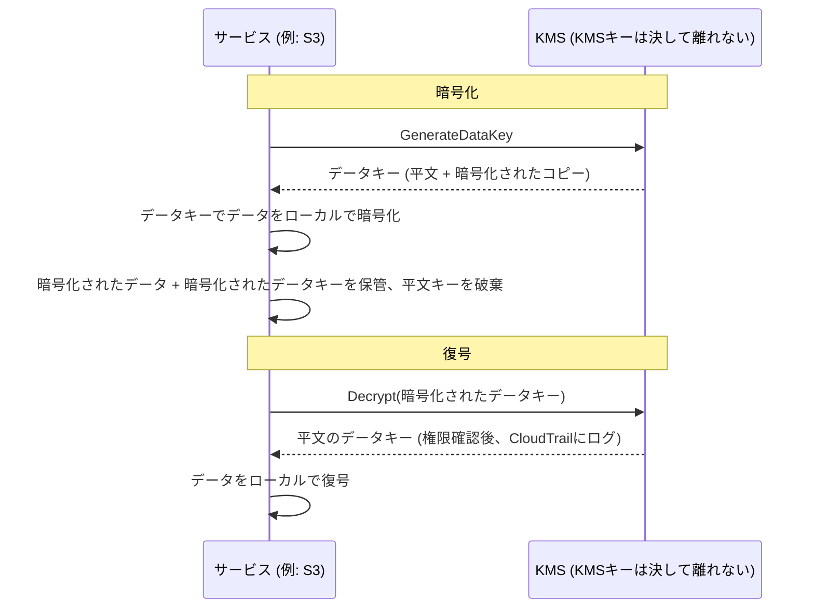

# 第16章：キー、ロック、そしてシークレット

gitリポジトリには、2年前にさかのぼる何千ものコミットがありました。レオは20分間スクロールしていて、歴史を1本の糸でたどっていました。あるデータベース接続文字列が最初に現れたのがいつかを探していました。彼はそれをもう少しで見逃すところでした。それはある火曜の午後、2つの目立たないコミットの間に挟まれていて、その後会社を去った誰かによってプッシュされていました。

データベースのパスワード。平文で。履歴の中に。

---

*前章のネットワーク制御は今や厳しくなっていました。セキュリティグループは横移動を制限しました。NACLは既知の悪いIP範囲をブロックしました。境界は堅牢化されました。しかし、セキュリティ監査は、境界が修正できない何かを見つけました。6か月間gitの履歴に住んでいた認証情報です。境界セキュリティは、内部のシークレットが安全だと仮定します。これは安全ではありませんでした。*

---

レオはgitの履歴をレビューしていて、それを見つけました。データベースのパスワード。6か月前に、平文で、もはやNimbusで働いていない誰かによってコミットされていました。それは`.env`ファイルの一部で、接続文字列の2行下に、デプロイパイプラインのIAMアクセスキーも含んでいました。コミットはパブリックでした。パスワードはその後変更されていましたが、彼らはそれを確実には知りませんでした。彼らは、どちらかの認証情報がこれまでに触れたすべてのシステムを確認しました。4時間かかりました。それが、Nimbusがシークレットをコードに入れるのをやめると決めた日でした。

「誰かがリポジトリをフォークしたらどうなるか、考えたことはありますか?」とプリヤは言いました。「gitの履歴は永続的です。パスワードを変更しても、修正前にリポジトリをクローンした誰もが、まだローカルの履歴に古い認証情報を持っています。」

「確認した」とレオは言いました。「パスワードは3か月前に変更された。すべてのシステムで確認済みだ。」

「それは最低限です」とプリヤは言いました。「でも、その認証情報が触れたすべてのシステムをレビューする必要があります。あなたが知っているものだけでなく。」

**4時間の監査**

レオは午前10時にgitの履歴で漏洩した`.env`ファイルを見つけていました。午後2時までに、彼らは肝心な問いへの答えを得ていました。どちらかの認証情報（データベースのパスワードか、それと一緒にコミットされたアクセスキー）が、Nimbusのシステム以外の誰かによって使われたか？

監査は4つのカテゴリを通りました。

**RDSアクセスログ**：データベースへのすべての接続が、タイムスタンプ付きでログされていました。漏洩したパスワードは3つの接続文字列に現れました。すべてNimbus VPCのEC2インスタンスから、すべて予期される送信元IPで。外部の接続なし。パスワードは外部からデータベースに接続するのに使われていませんでした。

**S3アクセスログ**：漏洩したアクセスキーは、デプロイパイプラインのIAMユーザーに属していて、`nimbus-receipts`バケットへの権限を持っていました。レオは過去6か月のS3サーバーアクセスログをクエリしました。すべてのアクセスは`us-west-2`のEC2インスタンスから、またはCloudFrontのオリジン取得ロールから来ていました。異常なし。

**CloudTrail API呼び出し**：漏洩したアクセスキーIDで行われたすべてのAWS API呼び出し。レオはそのキーのCloudTrailイベントをフィルターしました。312イベント、すべてデプロイパイプラインからの定型的な`s3:PutObject`呼び出しで、すべて同じIPから、すべて営業時間内でした。キーは1つのIPアドレスからだけ使われていて、それはCI/CDサーバーと一致しました。

「そしてCI/CDサーバーは」とプリヤは言いました。「VPCの中にあります。データを外部のエンドポイントにHTTPSで流出させる必要があったでしょうし、それはフローログで見えたでしょう。」

「確認した」とレオは言いました。「過去6か月、そのサーバーから非AWSのIPへのアウトバウンドHTTPSはなかった。」

**評決**：どちらの認証情報も、Nimbusチーム以外の誰かによって使われていませんでした。露出はリスクであって、侵害ではありませんでした。

「でも確実ではありません」とプリヤは言いました。「ログに基づいて合理的に確信できます。確実にはできません。その区別が重要です。」

「何が私たちを確実にする?」

「認証情報の露出の後、何もあなたを確実にしません。認証情報をローテーションし、アクセスを監査し、発見を文書化し、より良い制御で前に進みます。確実性は手に入りません。」

トムは会話の間、計算していました。「3人のエンジニアの4時間。完全に計上したコストで4000ドルとしよう。プラス、認証情報のローテーション、文書化、インシデントの記録。」

「そしてそれは調査だけです」とプリヤは言いました。「侵害なら桁違いに多かったでしょう。規制の通知。顧客への連絡。罰金の可能性。」

「つまり、4000ドルの教訓は安かった」とトムは言いました。

「かなり」とプリヤは言いました。「繰り返さないようにしましょう。」

---

**2つの問題：シークレットの保管とデータの暗号化**

機密情報をめぐるセキュリティには、2つの異なる問題があります。

**認証情報の保管**（データベースのパスワード、APIキー、接続文字列）：これらはどこにあるか？誰がアクセスできるか？アプリケーションを再デプロイせずにどうローテーションするか？

**データの暗号化**（顧客情報、支払い記録、PII）：誰かがあなたのデータベースやS3バケットへの不正なアクセスを得ても、データを読めないことをどう保証するか？

AWSには各問題のための専用のサービスがあります。

- **AWS Secrets Manager**：認証情報を安全に保管・管理します
- **AWS KMS（Key Management Service）**：データの暗号化・復号のための暗号化キーを管理します

Secrets Managerをキーチェーンと考えてください。キー（認証情報）を保持し、整理しておき、スケジュールでローテーションします。KMSを金庫と考えてください。貴重なものを保持するのではなく、貴重なものを守るロックを開けるキーを保持します。

**AWS Secrets Manager：ハードコードされた認証情報はもうない**

Secrets Managerは、シークレットのための安全なストアです。データベースの認証情報、APIキー、OAuthトークン、SSHキー、または機密性のある何でもです。

アプリケーションが環境変数や設定ファイルからパスワードを読む代わりに、起動時（または必要なとき）にSecrets Manager APIを呼び出してシークレットを取得します。シークレットはディスクに決して触れません。コードに決して現れません。環境変数の中にありません。

フローはこのようになります。

**古い方法**：
```
DB_PASSWORD=supersecretpassword123  # .envファイルまたは環境変数の中
```

**Secrets Managerの方法**：
```python
import boto3
client = boto3.client('secretsmanager')
secret = client.get_secret_value(SecretId='nimbus/production/db-password')
password = json.loads(secret['SecretString'])['password']
```

EC2インスタンスは、その特定のシークレットに対して`secretsmanager:GetSecretValue`を呼び出す権限を持つIAMロールを必要とします。他のどのサービスもそれを読めません。シークレットは決してコードの中にありません。

こう思っているかもしれません。なぜ環境変数を使わないのか？よりシンプルです。デプロイ時に設定し、アプリケーションが読みます。環境変数は隠れているように見えますが、デプロイ設定、CI/CDのシークレットストアに保存され、デバッグセッション中にログされる可能性があり、実行中のプロセスへのアクセスを持つ誰にでも見えます。さらに重要なことに、それらは静的です。一度設定されると、誰かが手動で更新するまで変わりません。Secrets Managerは、IAMアクセス制御、CloudTrailを通じた完全な監査ロギング、自動ローテーションを持つ暗号化されたサービスに認証情報を保管します。環境変数はローテーションしません。漏洩した環境変数は、誰かが手動で変更するまで有効なままです。

**自動ローテーション：本当の力**

Secrets Managerの最大の機能はシークレットの保管ではありません。それらを自動的にローテーションすることです。

シナリオはこうです。30日ごとに、Secrets Managerは新しいデータベースパスワードを生成し、RDSでそれを更新し、保管されたシークレットを更新し、アプリケーションは次に必要なときに新しいパスワードを取得します。手動の介入なし。デプロイなし。「これをローテーションするのを覚えておかないと」なし。

ローテーションはLambda関数として実装されます。AWSはRDSデータベース（MySQL、PostgreSQL、Aurora）のテンプレートを提供します。任意の認証情報タイプのために関数をカスタマイズできます。

「それは月にいくらかかる?」とトムは尋ねました。

Secrets Managerは、シークレットごと、月ごと、加えてAPI呼び出しごとに課金します。少数のデータベースパスワードとAPIキーには、コストは月に数ドルです。インシデントのコストと比べれば無視できます。

「先週の侵害」とプリヤは言いました。「調査と修復にいくらかかったでしょう?」

トムはしばらく黙りました。「私の時間、あなたの時間、レオの週末を含めて…数千ドル。」

「Secrets Managerは、悪用される前に静的なキーを捕らえていたでしょう。そして自動的にそれをローテーションしていたでしょう。」

トムは料金ページを開きました。

**ローテーション中に何が起きるか**

「待って、でも*なぜ*そのようにするの?」とマヤは尋ねました。「データベースのパスワードがローテーションすると、アプリケーションは壊れる？デプロイなしでどうやって新しいパスワードを拾うの?」

これは正当な懸念でした。中断なしのローテーションには注意が必要です。

Secrets Managerのローテーションは段階で機能します。「古いパスワードが突然無効になり、アプリケーションがクラッシュする」シナリオを防ぐように設計されています。

**段階1：新しいシークレットバージョンを作成。** Secrets Managerは新しいパスワードを生成し、それをシークレットの保留中のバージョンとして保管します。現在のバージョンはまだアクティブです。

**段階2：サービスに設定。** ローテーションLambdaがデータベースを呼び出して、パスワードを新しい値に更新します。注意：デフォルトの**単一ユーザー**ローテーション戦略では、古いパスワードがちょうど機能しなくなり（PostgreSQLの`ALTER ROLE ... PASSWORD`は即座に効力を持ちます）、新しいバージョンがまだ現在のものでない短い瞬間があります。ゼロダウンタイムのローテーションのために、Secrets Managerは**交互ユーザー**戦略をサポートします。同一の権限を持つ2つのデータベースユーザーで、ローテーションは常に*非アクティブな*ものを更新してから切り替えます。アクティブな認証情報が途中で無効になることは決してありません。覚えておくべき試験のフレーズは「交互ユーザーローテーション戦略（alternating users rotation strategy）」です。

**段階3：新しいシークレットをテスト。** ローテーションLambdaは、それで接続することで新しいパスワードが機能することを検証します。これが失敗すると、ローテーションはロールバックされます。

**段階4：完了。** Secrets Managerは新しいバージョンを現在のバージョンとしてマークし、古いバージョンを以前のバージョンに降格します。以前のバージョンは猶予期間の間保持されます。

猶予期間の間、両方のバージョンが取得可能です。アプリケーションが古いシークレットをキャッシュしていてまだ新しいものを拾っていなくても、それでも接続できます。次に`GetSecretValue`を呼び出すと、現在の（新しい）バージョンを得ます。

「つまり、アプリケーションを再起動する必要は決してない」とレオは言いました。

「必ずしもそうではありません。アプリケーションが起動時にシークレットをキャッシュして決してリフレッシュしないなら、スケジュールでリフレッシュするか、認証失敗を再取得で処理する必要があります。」

「つまり、ローテーションLambdaとアプリケーションは協力する必要がある」とマヤは言いました。

「Secrets Managerは自分の半分をします。アプリケーションコードはもう半分をする必要があります。必要なときにシークレットを取得し、認証失敗を再取得で処理することです。」

レオはアプリケーションを更新して、データベースの認証例外をキャッチし、失敗時に、リトライの前にSecrets Managerから新鮮なシークレットを取得するようにしました。2行のエラー処理。ローテーションはユーザーに見えなくなりました。

---

**CI/CDパイプラインのシークレット注入**

「デプロイパイプラインが必要なシークレットをどう得るか、考えたことはありますか?」とプリヤは尋ねました。「パイプラインはインフラをデプロイします。AWS認証情報が必要です。マイグレーションスクリプトのためにデータベース接続文字列が必要かもしれません。」

レオは現在のセットアップを説明しました。シークレットはGitHub Actions Secretsとして保管されていました。GitHubで保管時に暗号化され、実行時に環境変数として注入されます。

「認証情報はGitHubの中にある」とプリヤは言いました。

「暗号化されている。」

「サードパーティのシステムの中に。1つのGitHubの侵害が、私たちのすべてのパイプラインのシークレットを露出させます。」

解決策：デプロイパイプラインはOIDCフェデレーション（第14章でカバー）を通じてAWSに認証し、必要なシークレットを実行時にSecrets Managerから取得します。GitHubに保管されるシークレットなし。パイプラインのAWSロールは、特定のシークレットを読む権限を持ち、それ以外は何も持ちません。

```yaml
# GitHub Actionsワークフロー
- name: Get DB Migration Credentials
  env:
    AWS_DEFAULT_REGION: us-west-2
  run: |
    SECRET=$(aws secretsmanager get-secret-value \
      --secret-id nimbus/staging/db-migration \
      --query SecretString --output text)
    DB_URL=$(echo $SECRET | jq -r '.url')
    # DB_URLでマイグレーションを実行 — ファイルに決して保管しない
    flyway -url="$DB_URL" migrate
```

シークレットは取得され、メモリ内で使われ、破棄されます。ディスクに決して書かれず、ジョブの後に残る環境変数に決して保管されず、ログファイルに決して入りません。

「シークレットがログに印刷されたら?」とレオは尋ねました。

「GitHub Actionsは、GitHub Secretsとして設定されたシークレットの値を自動的にマスクします。でもこのシークレットはGitHub Secretではありません。Secrets Managerから来ます。手動でマスクするか、もっと良いのは、決してログしないことです。」

「つまり規律は：取得、使用、破棄。シークレットを決してログしない。決してファイルに保管しない。」

「その規律」とプリヤは言いました。「が、4時間の監査が、私たちが失敗していたと確認したものです。」


**AWS KMS：ロック工場**

「待って、でも*なぜ*そのようにするの?」とマヤは尋ねました。「なぜ別のキー管理サービスを？データを自分で暗号化して、キーをSecrets Managerに保管すればいいんじゃない?」

暗号化キーをSecrets Managerに保管できます。でも、誰がキーへのアクセスを制御するのか？何がキーがローテーションされることを保証するのか？キーが承認されたサービスだけによって使われたことを監査人に何が証明するのか？KMSはこれらすべての問いに答えます。それは単なるストレージではありません。ハードウェアに裏打ちされたセキュリティ、キーごとのきめ細かいIAMポリシー、すべての使用の完全な監査証跡を持つキーライフサイクル管理サービスです。Secrets Managerは、システムに接続するために必要なものを保管します。KMSはシステムそのものを保護します。

AWS KMS（Key Management Service）は**暗号化キー**を管理します。データの暗号化と復号に使われる秘密の値です。

たとえ：KMSはマスターキーを保持するロックボックス会社のようなものです。あなたのデータ（箱の中身）は暗号化されます。KMSキーを使う権限を持つ誰かだけがそれを復号できます。KMSはすべてのキーのすべての使用をCloudTrailにログします。

**カスタマーマスターキー（CMK）**—今はKMSキーと呼ばれる—は、3つのタイプの所有権で提供されます。

**AWS所有のキー**：AWSが所有し、多くの顧客アカウントにわたって使うキーです。あなたは決して見ず、決して支払わず、アカウントに現れません。いくつかのサービスのデフォルトがそれらを使います（たとえばDynamoDBのデフォルト暗号化）。

（明確にしておく価値のある1つの区別：S3のデフォルトの**SSE-S3**暗号化は、KMSキーモデルではまったく*ありません*。S3はKMSの外で完全に独自のAES-256キーを管理し、見るべきキーも、キー使用の監査証跡もありません。**SSE-KMS**は、KMSを通るS3のオプションで、AWS管理キー`aws/s3`またはカスタマー管理キーのどちらかを使います。試験のトリガー：「誰が暗号化キーを使ったか監査する」または「ローテーションとキーポリシーを制御する」→カスタマー管理キーを持つSSE-KMS。すべての使用がCloudTrailに入ります。）

**AWS管理のキー**：AWSが、S3、EBS、RDSのようなサービスのために、*あなたのアカウント内で*キーを自動的に作成・管理します（`aws/s3`のような名前）。それを見て、CloudTrailでその使用を監査できますが、そのポリシーやローテーションを変更できません。AWSが毎年自動的にローテーションします。無料です。

**カスタマー管理のキー**：KMSでキーを作成し、そのすべての側面を制御します。誰が使えるか、いつローテーションするか、誰が管理できるか。90日から2,560日（7年）の間で設定可能な期間で自動キーローテーションを有効にできます。デフォルトのローテーション期間は365日（毎年）です。即座に**オンデマンドローテーション**をトリガーすることもできます。疑わしい露出の後、スケジュールを待たずに役立ちます。注意：自動ローテーションは、KMSが生成したマテリアルを持つ対称キーに適用されます。非対称キーとインポートされたキーマテリアルは自動ローテーションできません。コスト：キーあたり月1ドル、加えてAPI呼び出しごとの料金。

カスタマー管理のKMSキーを選べば、ローテーションスケジュール、アクセスポリシー、監査の可視性を完全に制御できますが、キーごとに月ごとに支払い、キー管理の責任を負います。AWS管理のキーを選べば、運用上のオーバーヘッドゼロで、キー自体のコストなしで暗号化を得られますが、ローテーションスケジュールやキーポリシーをカスタマイズできません。それらは完全にAWSによって管理されます。

**AWSサービスでの暗号化：KMS統合**

ほとんどのAWSサービスは暗号化のためにKMSと統合します。

**S3**：バケットで「KMSによるサーバーサイド暗号化」を有効にします。すべてのオブジェクトがKMSキーで保管時に暗号化されます。オブジェクトを読むには、S3バケット*と*KMSキーの両方への権限が必要です。

**RDS**：作成時に暗号化を有効にします。データベースストレージ、バックアップ、スナップショットがすべてKMSキーで暗号化されます。注意：暗号化は既存の暗号化されていないRDSインスタンスでは有効にできません。スナップショットを取り、暗号化を有効にしてスナップショットをコピーし、復元する必要があります。

**EBS**：KMSでボリュームを暗号化します。暗号化されたスナップショットから作成された新しいボリュームは自動的に暗号化されます。

**DynamoDB**：KMSを使った保管時の暗号化は、すべてのテーブルでデフォルトで有効です。

**ElastiCache Redis**：機密性のあるキャッシュデータのためのKMSによる保管時の暗号化。

原則：データは保管時（ディスクに保存）と転送時（ネットワークを越えて移動）に暗号化されるべきです。KMSは保管時の暗号化を扱います。TLS/SSL（AWSサービスによって自動的に提供される）は転送時の暗号化を扱います。

**エンベロープ暗号化：KMSが実際にどう機能するか**

KMSの振る舞いと試験の問題を理解するのに役立つ詳細があります。

KMSは、ほとんどの場合、データを直接暗号化しません。**エンベロープ暗号化**を使います。

1. KMSが**データキー**（一意の対称キー）を生成する
2. サービスがデータキーを使ってデータをローカルで暗号化する（速い—対称暗号化）
3. サービスがKMSに、データキー自体を暗号化するよう依頼する（あなたのKMSキーを使って）
4. 暗号化されたデータと暗号化されたデータキーの両方が保管される
5. あなたの実際のデータは決してサービスを離れない—データキーだけが暗号化/復号のためにKMSに行く

データを読むとき：

1. サービスがKMSにデータキーの復号を依頼する
2. KMSが権限を確認し、データキーを復号し、返す
3. サービスが復号されたデータキーを使ってデータをローカルで復号する



これは、KMSが、すべてをKMS APIを通じて送ることなく、非常に大きなデータを扱えることを意味します。小さなキーだけがKMSに行きます。CloudTrailはすべてのKMS API呼び出しをログします。すべての暗号化と復号の操作です。

**KMSキーポリシー：アクセスモデル**

「IAMポリシーとキーポリシーが衝突したら何が起きるか、考えたことはありますか?」とプリヤは尋ねました。「KMSはIAMの上に独自のアクセス制御を持ちます。」

KMSキーには**キーポリシー**があります。キー自体にアタッチされたリソースベースのポリシーです。IAMポリシーとは異なり、異なる評価ルールに従います。

プリンシパルがKMSキーを使うには、2つのことが真でなければなりません。

**1つ目**：キーポリシーがそれを許可しなければなりません。キーポリシーがプリンシパルにアクセスを明示的に付与しなければ、彼らはキーを使えません。彼らのIAMポリシーが何と言おうとです。これは、IAMポリシーだけで十分なほとんどのAWSリソースとは異なります。

**2つ目**：プリンシパルのIAMポリシーがKMSアクション（例：`kms:Decrypt`、`kms:GenerateDataKey`）を許可しなければなりません。

両方がイエスと言わなければなりません。どちらか一方がノーと言えば、アクションは拒否されます。

AWSがカスタマー管理のキーのために作成するデフォルトのキーポリシーには、「rootアカウントはこのキーを管理できる」と言う文が含まれています。これは重要です。それは、キーポリシーが直接彼らを名指ししなくても、アカウントレベルのIAM管理者が常にキーへのアクセスを付与できることを意味します。rootアカウントの委任が整っているからです。

「つまり、キーポリシーからrootアカウントを削除したら」とレオは尋ねました。「そのキーに対してIAMポリシーが機能しなくなる?」

「正解です。rootアカウントの委任を削除することは、キーポリシーで名指しされた特定のプリンシパルだけがキーを使えるように、キーをとても厳しくロックダウンする方法です。アカウント管理者でさえも使えません。それはまた、自分自身のキーから自分を誤って締め出す方法でもあります。」

「回復できる?」

「AWSサポートに連絡することによってのみです。誰もキーを使えず、キーポリシーを更新できないなら、そのキーで暗号化されたデータは実質的にアクセス不可能です。」

「つまり、とても良い理由なしにキーポリシーからrootアカウントを削除しない。」

「正解です。」

---

**非対称キー：署名と検証**

KMSは非対称キーペアもサポートします。公開鍵と秘密鍵です。

ユースケース：

**デジタル署名**：秘密鍵でドキュメントやJWTトークンに署名します。公開鍵を持つ誰もが、署名が秘密鍵の保持者から来たこと、そして内容が改ざんされていないことを検証できます。

**公開鍵暗号化**：誰もが公開鍵でデータを暗号化できます。秘密鍵の保持者だけがそれを復号できます。

Nimbusの場合、非対称キーは、レストランパートナーのためのwebhook署名システムを実装したときに関連してきました。Nimbusがレストランパートナーのサーバーにイベント（新しい注文、ステータスの更新）を送るとき、パートナーは、イベントが実際にNimbusから来て偽造されていないことを検証する必要がありました。

実装：

1. Nimbusが非対称KMSキー（RSA 2048ビット、SIGN_VERIFYアルゴリズム）を作成する
2. webhookを送るとき、Nimbusは秘密鍵で`kms:Sign`を呼び出してイベントペイロードに署名する
3. 署名がwebhookヘッダーに含まれる
4. Nimbusが公開鍵を公開する（KMSコンソールからダウンロード可能）
5. レストランパートナーのサーバーが公開鍵を取得し、それを使ってすべての受信webhookの署名を検証する

秘密鍵は決してKMSを離れません。Nimbusは生の秘密鍵マテリアルに決してアクセスできません。KMSはハードウェアセキュリティモジュールの内部で署名操作を実行します。

「つまり、誰かがNimbusのサーバーを侵害しても」とラファエルは言いました。「webhookの署名を偽造できない。秘密鍵はKMSにあって、どのサーバーにもない。」

「正解。署名にはKMS API呼び出しが必要です。すべてのAPI呼び出しはCloudTrailにログされます。誰かが不正なイベントに署名しようとしたら、私たちはそのAPI呼び出しを見るでしょう。」

---

**キー削除の物語**

KMSのセットアップから3か月後、トムは間違いを犯しました。

彼は使われていないAWSリソースをクリーンアップしていました。古いLambda関数、古くなったS3バケット、放棄されたCloudWatchダッシュボードです。彼は素早く動いていました。彼は誤ってKMSキーを削除予定にしました。

キーは`nimbus/prod/order-receipts`でした。注文レシートのS3バケットを暗号化するのに使われるカスタマー管理のキーです。

「昨日12個のリソースをバッチ削除して、12番目が何かを確認しなかった」とトムは平坦に言いました。彼は削除を予定にして先に進んでいました。彼は翌朝、自分の行動をレビューしたときに間違いに気づきました。

彼はKMSコンソールを開きました。キーのステータスは「削除保留中。7日後に削除」と表示されました。

彼はそれを最小の待機期間で予定にしていました。

「キャンセルできる?」と彼は尋ねました。

プリヤはドキュメントを開きました。「はい。待機期間の間、キーは無効化されますが削除されません。削除をキャンセルできます。」

トムは1分以内に削除をキャンセルしました。キーはアクティブなステータスに復元されました。

「7日が最小の待機期間です」とプリヤは言いました。「AWSはそれを強制します。キーが削除されてデータがそれで暗号化されていたら、そのデータは永遠に消えるからです。回復不能。待機期間は、間違いに気づく時間を与えます。」

「待機期間はどれくらいにすべき?」

「最大は30日です。本番データを暗号化するどのキーにも、30日を使います。事故に対する追加の3週間の保護は、わずかな不便に値します。」

トムはすべての本番キーの削除設定を30日に更新しました。彼はまた、KMSキーのステータスが「削除保留中」に変わったら発火するCloudWatchアラームをセットアップしました。だから次に誰か（彼を含めて）が同じ間違いをしたとき、チームは5分以内に知るでしょう。

---

**Secrets Manager対Parameter Store**

AWSには**Systems Manager Parameter Store**もあり、設定値（シークレットだけでなく）を保管します。Parameter Storeはより安いです。標準パラメータには無料です。KMSを使って暗号化されたパラメータも保管できます。

ローテーションが必要なシークレットには：Secrets Manager。

設定値と機密でないパラメータには：Parameter Store（無料枠はとても寛大です）。

アプリケーション設定（ポート番号、機能フラグ、環境固有の設定）には：Parameter Store。

| | Secrets Manager | SSM Parameter Store |
|---|---|---|
| 自動ローテーション | あり（Lambdaに裏打ち） | なし |
| コスト | 約0.40ドル/シークレット/月 | 無料（標準）|
| 暗号化 | 常に | オプション（KMSで）|
| バージョニング | あり | あり |
| クロスアカウントアクセス | あり | 限定的 |
| 最適な用途 | データベースパスワード、APIキー | 設定値、機能フラグ |

## ドアの証明書

シークレットの移行から2週間後、プリヤは電話でNimbusのステージング環境をレビューしていて、アドレスバーに気づきました。

「保護されていません。」

彼女は本番のURLを開きました。同じことです。

「レオ」と彼女は電話をテーブルに置きながら言いました。「私たち、HTTPで動いているの?」

レオは確認しました。「ALBのリスナーはポート80だ。HTTPSをセットアップしなかった。」

「つまり、ユーザーが行うすべてのリクエスト—すべての注文、すべてのログイン—が暗号化されていないHTTPで行われている?」

「RDSの接続にはTLSがある」とレオは申し出ました。

「それはアプリケーションとデータベースの間の転送中のデータです。私が話しているのは、ユーザーのブラウザと私たちのロードバランサーの間の転送中のデータです。それはまったく暗号化されていません。」

トムは聞いていました。「それはセキュリティの問題か、認識の問題か?」

「両方です」とプリヤは言いました。「暗号化されていないHTTPは、ユーザーと私たちのサーバーの間の任意のネットワーク—コーヒーショップのルーター、ISP—がトラフィックを読めることを意味します。パスワード、注文の詳細、セッショントークン。そしてモダンなブラウザは『保護されていません』とユーザーに警告します。それはコンバージョン率を殺します。」

「つまり、TLS証明書が必要だ」とマヤは言いました。「いくらかかる?」

「無料です」とプリヤは言いました。「AWS Certificate Managerです。」

**AWS Certificate Manager（ACM）**は、AWS管理のサービス（ALB、CloudFrontディストリビューション、API Gateway）で使うための無料のTLS/SSL証明書をプロビジョニングします。証明書を買わず、更新カレンダーを管理せず、秘密鍵マテリアルに触れません。ACMが証明書のライフサイクル全体を扱います。

ACMが発行する証明書は13か月有効です。期限切れの前に、ACMが自動的にそれを更新します。更新が成功すると、新しい証明書が、あなたの何のアクションもなしにロードバランサーまたはディストリビューションにアタッチされます。ブラウザの鍵マークは緑のままです。あなたが設定し忘れた期限切れアラートは決して発火しません。

**ACM証明書の2つのタイプ**：

**パブリック証明書**は、Amazonの認証局によって発行され、すべての主要なブラウザに信頼されます。ALB、CloudFront、API Gatewayで使うのに完全に無料です。DNSまたはメールでドメインの所有権を検証します。

**プライベート証明書**は、AWS Private CAによって発行されます。内部サービス（サービス間のmTLS、内部ツール、VPNクライアント）のために運用するマネージドなプライベート認証局です。Private CAには月額コストがあります。

Nimbusの場合、パブリック証明書が正しい選択でした。

**DNS検証対メール検証**：

レオはACMコンソールを開き、`eatnimbus.com`と`*.eatnimbus.com`の証明書リクエストを開始しました。

「所有権をどう検証したいか尋ねている」と彼は言いました。「DNSかメールか。」

「DNS」とプリヤは言いました。「常にDNS。」

DNS検証では、ACMは特定のCNAMEレコードをあなたのホストゾーンに追加します。Route 53はこれを自動的にできます。コンソールでワンクリックです。そのCNAMEレコードが存在する限り、ACMは何の人間のアクションもなしに証明書を自動更新できます。メール検証は、ドメインの登録された連絡先にメールを送り、証明書が更新されるたびに手動のクリックを必要とします。そのクリックは忘れられます。DNS検証は誰も何も覚えておく必要がありません。

「つまり、CNAMEレコードを一度追加すれば」とレオは言いました。「永遠に更新される?」

「誰かがCNAMEレコードを削除するまでは」とプリヤは言いました。「CNAMEレコードを削除しないで。」

レオは証明書をリクエストし、Route 53に検証CNAMEを追加し（ACMが自動的にするよう申し出ました）、5分待ちました。証明書のステータスがIssuedに変わりました。彼はそれをALBのポート443のHTTPSリスナーにアタッチし、ポート80にすべてのHTTPトラフィックをHTTPSに送るリダイレクトルールを追加しました。

トムは本番のURLを更新しました。

鍵マークが現れました。

フラグを立てる価値のある1つのリージョンの詳細：証明書はリージョナルなリソースで、それを使うサービスと同じリージョンになければなりません。ALBにはALBのリージョンです。**CloudFront**には、証明書は**`us-east-1`**でリクエスト（またはインポート）されなければなりません。常に、オリジンがどこで実行されるかに関係なくです。CloudFrontはそこに固定されたグローバルなサービスだからです。レオはすでに第13章でこれにつまずいていました。これも信頼できる試験の事実です。

**ACM証明書ができない1つのこと**：

「証明書をダウンロードできる?」とレオは尋ねました。「内部の管理EC2インスタンスにインストールしたい。」

「いいえ」とプリヤは言いました。

無料のACMパブリック証明書はエクスポートできません。秘密鍵をダウンロードして、EC2インスタンス、Nginxサーバー、またはAWS管理のサービス以外の何かにインストールできません。秘密鍵マテリアルは決してACMを離れません。これは意図的です。秘密鍵が漏洩したり、安全でなく保管されたり、証明書が期限切れになったときに忘れられたりするのを防ぎます。

インストール可能な証明書を必要とするユースケース—カスタムプロキシとして機能するEC2インスタンス、オンプレミスのサーバー—には、3つの経路があります。サードパーティの認証局（たとえばLet's Encrypt）からの証明書、証明書エクスポートが有効なAWS Private CA、または—2025年6月以降—ACMの有料の**エクスポート可能なパブリック証明書**（発行時にオプトイン、FQDNまたはワイルドカードごとに課金）で、その秘密鍵はどこでも使うために*エクスポートできます*。

「私たちのALBとCloudFrontディストリビューションには」とプリヤは言いました。「ACMがまさに正しいです。無料で、自動で、キーに決して触れません。」

## 強みと限界

**AWS Secrets Manager**：

- コードの変更やデプロイなしの自動シークレットローテーション
- シークレットごとのきめ細かいIAMアクセス制御（各シークレットは別々のIAMリソース）
- バージョニング—ローテーション中に以前のバージョンがアクセス可能なまま、接続の切断を防ぐ
- CloudTrailによる監査—すべての`GetSecretValue`呼び出しが呼び出し元のアイデンティティとともにログされる
- クロスアカウントアクセス—1つのアカウントのシークレットを別のアカウントのロールと共有できる
- コスト：約0.40ドル/シークレット/月 + API呼び出し（おおよそ1万API呼び出しあたり0.05ドル）

**AWS KMS**：

- 完全な監査証跡を持つ中央集権的なキー管理—すべての暗号化と復号がログされる
- カスタマー管理キーの設定可能な自動キーローテーション（90日から2,560日、デフォルト365日）—古いキーマテリアルは既存のデータを依然として復号し、新しいキーマテリアルは新しいデータを暗号化する
- キーごとのきめ細かいIAM権限（キーポリシー + IAMポリシー—両方が許可しなければならない）
- ハードウェアセキュリティモジュール（HSM）に裏打ち—キーは決して平文でHSMを離れない
- 災害復旧シナリオのためのマルチリージョンキーのサポート
- デジタル署名と検証のための非対称キーのサポート
- コスト：キーあたり月1ドル + 1万API呼び出しあたり0.03ドル

**複雑になるところ**：

- KMSのキーポリシーはIAMポリシーとは別（で、それと並んで評価される）—アクセス拒否のエラーのデバッグには両方を確認する必要がある
- 保管時の暗号化は事前に計画しなければならない—既存の暗号化されていないRDSインスタンスをその場で暗号化できない
- KMSのキー削除には7〜30日の待機期間がある—安全メカニズムだが、セットアップ中に忘れやすく、誤ってトリガーすると危険
- ローテーションには、認証失敗時にシークレットを再取得するアプリケーションコードが必要—Secrets Managerは認証情報をローテーションするが、アプリケーションがそれを拾わなければならない
- Secrets Managerのコストは、大規模ではシークレットの数とAPI呼び出しのボリュームとともにスケールする
- デフォルトのキーポリシー（rootアカウントの委任を含む）を保つことが重要—それを削除すると管理者がキーから締め出されうる

## 概要

侵害された認証情報が触れたすべてのシステムを通じてそれを追跡するのに費やした4時間は、Secrets Managerが防げた4時間でした。自動ローテーションは、盗まれた認証情報が短い寿命を持つことを意味します。KMSは、誰かがデータに到達しても、使う権限のないキーなしにそれを読めないことを意味します。そして30日のキー削除待機期間は、誤った削除が、データ損失イベントになる前にキャンセルできることを意味します。

- 認証情報を、コード、環境変数、またはバージョン管理にコミットされた設定ファイルに決して保管しないでください。
- **Secrets Manager**は認証情報を安全に保管し、自動的にローテーションします。アプリケーションは実行時にAPIを通じてシークレットを取得します。
- **ローテーション**は段階で起こります：新しいバージョンを作成、サービスで更新、テスト、昇格。古いバージョンと新しいバージョンが短時間両方有効で、ローテーション中の接続の切断を防ぎます。
- **KMS**は暗号化キーを管理します。ほとんどのAWSサービスは保管時の暗号化のためにKMSと統合します。
- **エンベロープ暗号化**：KMSはデータを直接ではなくキーを暗号化します。サービスはローカルのデータキーを使ってデータを暗号化し、KMSがそれを暗号化します。小さなキーだけがKMS APIを通ります。
- **カスタマー管理のKMSキー**：ローテーション（設定可能な90〜2,560日、デフォルト365日の毎年）、アクセス、監査の完全な制御（月1ドル）。**AWS管理のキー**：自動で、設定不要、無料。
- **KMSキーポリシー**：キーポリシーはIAMと並んで機能するリソースベースのポリシーです。両方がイエスと言わなければなりません。デフォルトのキーポリシーのrootアカウントの委任は、IAM管理者が常にアクセスを付与できることを保証します。
- **非対称キー**：KMSは署名と検証のためにRSAとECCのキーペアをサポートします。秘密鍵は決してHSMを離れません。
- **キー削除**：最小7日、最大30日の待機期間。削除されたキーは、永久にアクセス不可能な暗号化されたデータを意味します。本番キーには30日を使い、削除保留中のステータスを監視します。
- **CI/CDのシークレット**：OIDCフェデレーションを使って実行時にSecrets Managerから取得します。シークレットをCI/CDプラットフォームの変数として決して保管しないでください。

## 試験のヒント

*SAA-C03 ドメイン：セキュアなアーキテクチャの設計（ドメイン1、タスク1.3）*

- **Secrets Manager対SSM Parameter Store**：自動ローテーションが必要な認証情報にはSecrets Manager。一般的な設定にはParameter Store。試験はローテーション要件とコスト感度でそれらを区別します。
- **KMSキーポリシー**：KMSキーは独自のキーポリシー（リソースベースのポリシー）を持ちます。IAMポリシーだけではKMSキーへのアクセスを付与しません。キーポリシーが明示的にそれを許可しなければなりません。キーポリシーとIAMポリシーの両方がアクションを許可しなければなりません。
- **RDSの暗号化**：既存の暗号化されていないRDSインスタンスで暗号化を有効にできません。プロセス：スナップショットを作成 → 暗号化を有効にしてスナップショットをコピー → 暗号化されたスナップショットから復元 → トラフィックを新しいインスタンスに移行。
- **EBSの暗号化**：新しいボリュームは暗号化できます。暗号化されたボリュームのスナップショットは常に暗号化されます。暗号化されていないボリュームは直接暗号化できません—スナップショット + コピー + 復元。
- **CloudTrail + KMS**：すべてのKMS API呼び出しはCloudTrailにログされます。これは重要なコンプライアンス機能です。試験が、誰がどのデータを復号したか監査する方法を尋ねたら、答えはCloudTrail + KMSです。
- **マルチリージョンKMSキー**：キーマテリアルを複数のリージョンにレプリケートして、クロスリージョンのAPI呼び出しなしに復号が起きるようにします。試験は、暗号化されたデータを持つマルチリージョンの災害復旧にこれを使います。
- **KMS対CloudHSM**：KMSはマルチテナント（AWSによって管理される）です。CloudHSMは、あなただけが制御する専用のハードウェアセキュリティモジュールです。試験のシグナル：「FIPS 140-2 Level 3」「専用HSM」「カスタマー管理の暗号操作」→CloudHSM。
- **エンベロープ暗号化**：KMSがデータキーを生成し、サービスがそれを使ってデータをローカルで暗号化し、KMSがデータキーを暗号化します。試験の問題：「なぜKMSは大量のデータを直接暗号化しないのか？」→パフォーマンス。エンベロープ暗号化は大きなデータをローカルに保ちます。
- **非対称KMSキー**：デジタル署名、JWT検証、または公開鍵暗号化に使われます。秘密鍵は決してKMSを離れません。`kms:Sign`が署名するAPI呼び出し。`kms:Verify`が検証する。
- **キー削除の待機期間**：7〜30日。この期間中、キーは無効化され使えませんが、削除はキャンセルできます。削除後、そのキーで暗号化された任意のデータは永久に回復不能です。
- **ACM（AWS Certificate Manager）**：ALB、CloudFront、API Gatewayで使うための無料のパブリックTLS証明書。DNS検証による自動更新。無料のパブリック証明書は秘密鍵をエクスポートできません。AWS内だけに存在します（2025年以降、EC2/オンプレミス用途のための有料の*エクスポート可能なパブリック証明書*オプションが存在します）。試験のトリガー：「ロードバランサーまたはCDNでHTTPS」→ACM。

## 演習

**演習1—想起**

エンベロープ暗号化の概念を説明してください。なぜKMSは、アプリケーションのデータを直接暗号化するのではなく、小さなデータキーを暗号化するのですか？

*（ヒント：1GBのデータを暗号化する場合に何が起きるか、そして1GBをリモートのKMSサービスに送ることのパフォーマンスへの影響が何かを考えてみてください。）*

**演習2—SAA-C03シナリオ**

*シナリオ*：ある金融サービス会社が、機密性のある顧客データをRDS MySQLデータベースに保管しています。新しいコンプライアンス要件が次を義務付けます。

1. すべてのデータが保管時に暗号化されなければならない
2. すべての暗号化キーの使用が監査可能でなければならない
3. 暗号化キーがカスタマー制御でなければならない（AWSによって管理されない）
4. データベースのパスワードが90日ごとに自動的にローテーションされなければならない

データベースは6か月前に暗号化を有効にせずに作成されました。4つすべての要件を最もよく満たすアクションのセットはどれですか？

A) 既存のデータベースでRDS暗号化を有効にする。カスタマー管理のKMSキーを作成する。Secrets Managerを90日ローテーションで設定する
B) 既存のデータベースのスナップショットを作成する。カスタマー管理のKMSキーで暗号化してスナップショットをコピーする。暗号化されたスナップショットから復元する。Secrets Managerを90日ローテーションで設定する
C) AWS管理のキーで新しい暗号化されたRDSインスタンスを作成する。古いインスタンスからデータを移行する。Secrets Managerを90日ローテーションで設定する
D) AWS管理のキーを使って既存のデータベースでRDSの保管時暗号化を有効にする。Secrets Managerを90日ローテーションで設定する

**ヒント1**：既存の暗号化されていないRDSインスタンスで直接暗号化を有効にできません。

**ヒント2**：「カスタマー制御」のキーはカスタマー管理のKMSキーを意味し、AWS管理のキーではありません。

**ヒント3**：スナップショットコピーのプロセスは、暗号化されたRDSへの標準的な移行パスです。

**解答**: B

**説明**：RDS暗号化は既存のインスタンスで有効にできません。標準的なアプローチは：既存のインスタンスをスナップショット → カスタマー管理のKMSキーを使って暗号化を有効にしてスナップショットをコピー（要件1、2、3を満たす）→ 暗号化されたスナップショットから復元、です。カスタマー管理のKMSキーは、すべての使用をCloudTrailに自動的にログし（監査）、暗号化キーをあなたの制御下に保ちます。Secrets Managerは自動的な90日のパスワードローテーションを扱います（要件4を満たす）。

**なぜAではないのか？** 既存の暗号化されていないRDSインスタンスでその場で暗号化を有効にできません。

**なぜCではないのか？** AWS管理のキーは「カスタマー制御」要件（要件3）を満たしません。

**なぜDではないのか？** Aと同じ問題（その場で有効にできない）に加えて、AWS管理のキーが要件3を満たしません。

*SAA-C03 ドメイン：セキュアなアーキテクチャの設計—タスク1.3*

**演習3—アーキテクチャチャレンジ** *(オプション)*

Nimbusは次の機密データを保管する必要があります。

- 本番RDSインスタンスのデータベースパスワード
- Stripe APIシークレットキー（支払い処理に使われる）
- DynamoDBの顧客注文履歴を暗号化するための対称暗号化キー
- レストランごとの設定値（APIエンドポイント、機能フラグ—機密ではない）

それぞれにどのAWSサービスまたはアプローチを使いますか？それぞれにどのローテーション戦略を適用しますか？

*（単一の正解はありません。目的は、セキュリティツールをユースケースにマッチさせる練習をすることです。）*

## クレジット後のシーン

「もうデプロイしたんだ—あ。」レオは、開発環境がまだ古い環境変数を使っている間に、本番のシークレットをSecrets Managerに移行しました。開発環境が壊れました。彼は開発の設定を手動でロールバックしなければなりませんでした。

「まずステージング」とプリヤは言いました。「それから本番。」

「分かってる」とレオは言いました。

シークレットは移行されました。

データベースパスワード：Secrets Manager、30日ごとにローテーション。

APIキー：Secrets Manager、支払いプロバイダーのAPIを呼び出して新しいキーを生成するローテーションLambdaで。

顧客の注文データ：カスタマー管理のKMSキーで暗号化。

古い認証情報：無効化。古い設定ファイル：削除。古いGitHub Actionsのシークレット：除去。

「私たちは今や監査の準備ができています」とプリヤは言いました。

「監査の準備ができているとは?」とマヤは言いました。

「コンプライアンス監査人が、コードにハードコードされた、またはインフラに露出した認証情報がないことを証明するよう私たちに求めたら、彼らに示せます。すべてのシークレットはSecrets Managerにあり、すべての暗号化キーはKMSにあり、すべてのアクセスはCloudTrailにログされている、と。」

「最後に誰かがCloudTrailのログを確認したのはいつ?」

一拍。

「私は毎週それらを確認しています」とプリヤは言いました。

「そして何か異常なことが現れたら、私たちはどうやって知るの?」

「それが」とプリヤはラップトップを閉じながら言いました。「次の会話です。」

次の章では：Nimbusとインターネットの間に立つ3つの防御のレイヤーです。
