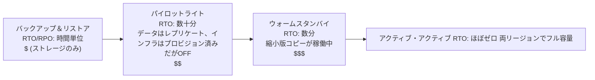

# Chapter 18: When Things Break

午後11時17分、明かりが消えました。

Nimbus のオフィスではありません。レオは自宅にいて、ソファに座り、ノートパソコンを半分閉じていました。明かりが消えたのは、彼が一度も訪れたことのないオレゴンのデータセンター、見たこともない建物、触れたこともないサーバーでいっぱいの部屋でした。彼はまだ知りませんでした。完全な沈黙の瞬間が、ほんの一瞬だけありました。遠く離れたどこかでバックアップ用の発電機が動き出す前のことです。目を開けているのか閉じているのか分からないほどの暗闇です。

そして、Slack の通知が届きました。

---

第17章の監視システムが整ったあと、チームは自信のようなものを感じていました。アラートは発報していました。ダッシュボードは緑色でした。ログは CloudWatch に流れ込んでいました。彼らは Nimbus インフラストラクチャのあらゆる隅に可視性を組み込むために3週間を費やしていました。

誰も口に出して言わなかったこと、そして監視が守ってくれなかったことは、可視性と回復力は別物だということでした。何かが完璧なほど詳細に壊れていくのを見ることはできます。見ているだけでは、それを止めることはできません。

その教訓は、木曜日の午後11時23分にやってきました。

---

レオは Slack の通知を受け取りました。

「us-west-2 — データセンタークラスター障害 — 劣化したサービス。」

彼は AWS コンソールを開きました。Availability Zone のひとつにある EC2 インスタンスが、ステータスチェックに失敗していました。彼の Auto Scaling Group は不健全なインスタンスを検出し、代替インスタンスを起動していました。同じゾーンで。

障害が発生しているクラスターの中で。

新しいインスタンスも起動できませんでした。同じハードウェア障害ゾーンにあったのです。

「ロードバランサーは両方の AZ にトラフィックをルーティングしている」とレオは誰にともなく言いました。「トラフィックの半分が、動作しないインスタンスに送られている。」

彼は EC2 コンソールを開いてクリックし始めました。Load Balancers の下で、Application Load Balancer は両方のターゲットグループを healthy と表示していました。なぜなら、ポート80でのヘルスチェックが成功しており、障害の発生しているインスタンスでさえそのチェックには応答していたからです。ただ、実際のリクエストを処理できないだけでした。

彼は障害の発生している AZ をターゲットグループから削除しようとしました。コンソールは変更を受け付けました。しかし、バランスを維持するように構成された Auto Scaling Group は、すぐに終了したインスタンスを置き換えようとし始めました。同じ障害ゾーンの中で。

レオは画面を見つめました。彼は事態を悪化させてしまったのです。

彼は ASG の構成を呼び出しました。「Availability Zone 間で容量のバランスを取る」設定が有効になっていました。通常の運用ではこれは良い設計です。しかし今は、彼に対して積極的に抵抗していました。

彼は ASG を健全なゾーンのみを使うように変更しました。変更を適用しました。

コンソールは変更を「In Service」と表示しました。

3分後、最初の健全な代替インスタンスが立ち上がりました。

ロードバランサーがトラフィックのルーティングを始めました。エラー率は52%から4%に下がりました。残りの4%は、まだ接続をドレインしている最後の数台の不健全なインスタンスに着地したリクエストでした。

午後11時45分までに — 障害が始まってから22分後 — トラフィックは安定しました。

彼が気づいて手動で ASG を健全なゾーンのみに切り替えるまで、22分間の劣化したサービスでした。

「これはすべてが1つの AZ にあったから起きたのね」と、翌朝プリヤが言いました。

「いいえ」とレオは言いました。「インスタンスは2つの AZ にありました。問題は、代替インスタンスが障害の発生している AZ で立ち上がっていたことです。」

「それで、データベースは?」

レオは止まりました。

「RDS のプライマリが障害ゾーンにありました」と彼は言いました。「Multi-AZ は実際に役目を果たしました。約90秒で健全なゾーンのスタンバイにフェイルオーバーしました。しかし、私たちのアプリケーションサーバーは死んだ接続を開いたままにし、エンドポイントの DNS 名を再解決する代わりに、キャッシュされた IP アドレスに再試行を続けました。データベースは11時25分には健全でした。私が接続プールを再起動するまで、アプリはきれいに再接続しませんでした。」

22分間の劣化したサービスは、38分になっていました。

8か月前にレオが Auto Scaling Group を設定したとき、彼は「AZ 間で容量のバランスを取る」設定にチェックを入れ、それで十分だと考えていました。「大丈夫だよ」と彼は当時マヤに言っていました。「AWS が AZ まわりのことを自動的に処理してくれる。」AWS が処理するという点では彼は正しかったのですが、「自動的に」が何を意味するかについては間違っていました。

「もし」と翌朝マヤが尋ねました。「すべてを正しく構成していたら、どうなっていたのかしら? 実際の障害において、正しい Multi-AZ 構成はどんなものになるの?」

レオはそれについて考えました。午後11時45分からずっと考えていたことでした。

仮定上の正しい構成では、ASG は EC2 のステータスだけでなく ALB のヘルスを見るインスタンスヘルスチェックを持っていたはずです。AZ が障害を起こすと、それらのインスタンスのヘルスチェックは30秒以内に失敗していたはずです。ASG は障害を検出し、すぐに代替インスタンスの起動を始め、そして1つの AZ で起動が継続的に失敗すると、グループは障害ゾーンに抵抗するのではなく、残りの健全なゾーンに容量をシフトします。

ロードバランサーは、同じ30秒以内に、障害の発生している AZ のターゲットをローテーションから外していたはずです。トラフィックは健全な AZ に集中していたでしょう。

データベースについては、Multi-AZ のフェイルオーバー自体は機能していました。欠けていたのはクライアント側の規律でした。再接続時にエンドポイントの DNS 名を再解決する (IP をキャッシュしない) 接続プール、短い DNS キャッシュ TTL、そしてリトライロジックです。それらが整っていれば、RDS のフェイルオーバーは16分の長い尾ではなく、60〜120秒のわずかな途切れになります。

顧客から見える総影響: データベースがフェイルオーバーする間の60〜90秒のレイテンシ劣化。38分間のカスケードするエラーではありません。

「私たちはこれを乗り切るためのインフラをすべて持っていました」とレオは言いました。「ただ、それを正しく構成していなかっただけです。」

その一文は、当初のインシデントそのものよりも口にするのが難しいものでした。

**電力グリッドのたとえ話**

自宅にどのように電気が届くかを考えてみてください。電力は、1つの発電機から1本のワイヤーを通じて届くわけではありません。それはグリッド — 互いをバックアップし合う発電機、変電所、送電線のネットワーク — から来ます。1つの変電所が火災を起こすと、他の変電所がその周りに電力を再ルーティングします。あなたは気づきません。明かりはついたままです。

AWS の Availability Zone も同じように機能します。すべてが依存する1つの巨大なデータセンターの代わりに、AWS はリソースを複数の物理的に分離された施設に分散します。1つの施設が電力を失ったりハードウェア障害を起こしたりしても、他の施設は稼働し続けます。トラフィックは自動的に再ルーティングされます。アプリケーションは稼働を続けます。なぜなら、切断すべき1本のワイヤーなど最初から存在しなかったからです。

これが **Multi-AZ アーキテクチャ** です。1つの障害が決してすべてを停止させないように、リソースを物理的に分離された施設に分散することです。

Multi-Region はその次のレベルです。まったく別の都市にバックアップ発電機を持つことを想像してください。ローカルの電力グリッド全体がダウンしても、遠隔地の都市が引き継ぎます。設定はより複雑ですが、壊滅的な障害に対してより回復力があります。

なぜ AWS は、Multi-AZ が単に2つのデータセンターにリソースを分散するだけのことなら、すべてに対してそれをデフォルトにしないのか、と疑問に思うかもしれません。答えはコストです。Multi-AZ はインフラストラクチャをおよそ2倍にします。そして、開発環境やトラフィックの少ない社内ツールにとっては、その追加コストは正当化されません。しかし本番ワークロードについては、問いが逆転します。それを持たない場合のダウンタイムを許容できますか?

**障害の語彙**

回復力を設計する前に、自分が何に対して設計しているのかを表す言葉が必要です。

「そもそも、私たちが十分に回復力があるかどうかをどうやって測ればいいの?」とプリヤが尋ねました。

「2つの数字だ」とレオは言いました。「どれだけ長くダウンしていられるか、そしてどれだけのデータを失えるか。」

**可用性 (Availability)**: システムが稼働している時間の割合。「フォーナイン」(99.99%) は、年間52分未満のダウンタイムを意味します。「ファイブナイン」(99.999%) は、年間約5分を意味します。

**RTO (Recovery Time Objective、復旧時間目標)**: システムがビジネス上の問題になるまで、どれだけ長くダウンしていられるか? RTO が4時間なら、SLA が違反される前にサービスを復旧させるのに4時間あります。

**RPO (Recovery Point Objective、復旧ポイント目標)**: どれだけのデータを失う余裕があるか? RPO が1時間なら、壊滅的な障害において最大1時間分のデータを失うことを許容できます。障害の直前1時間に書き込まれたものはすべて失われます。

**フォールトトレランス (Fault tolerance)**: コンポーネントが障害を起こしても、(あるレベルで) 動作を継続する能力。

**ディザスタリカバリ (Disaster recovery、DR)**: 壊滅的な障害 — データセンター火災、リージョン全体の停止、誤った大量削除 — から復旧するプロセス。

これら5つの概念が、この章のすべてのアーキテクチャ上の決定を駆動します。

**RTO と RPO は技術的な決定ではなくビジネス上の決定である**

数字そのものよりも、誰がそれを設定するかが重要です。エンジニアは RTO を推測できます。ビジネスのステークホルダーは、30分の停止が実際にいくらの損失になるかを知っています。

同じ技術スタックを持つ2つの会社を考えてみましょう。

証券取引を処理するフィンテック企業: RTO は4分、RPO はゼロ。取引システムが市場の取引時間中に4分間ダウンすると、数千件のトランザクションを取りこぼすかもしれません。取りこぼした各トランザクションには直接的な金額価値があります。データ損失ゼロは哲学的な話ではありません。確定した取引を1件失うことは、コンプライアンス上の問題と顧客からの訴訟を意味します。これを達成するためのアーキテクチャコスト: 同期レプリケーションを備えたアクティブ・アクティブの Multi-AZ、6桁台の年間インフラストラクチャ予算。

レストランの注文プラットフォーム: RTO は30分、RPO は5分。ディナーのピーク時の30分の停止は本当に痛手で、実際の損失になります。しかし、障害前の最後の5分間の注文を失うことは、少数の顧客が再注文する必要があるという意味です。煩わしいけれど、壊滅的ではありません。これを達成するためのアーキテクチャコスト: ウォームスタンバイの Multi-AZ、フィンテックの予算のほんの一部。

「待って — でも *なぜ* レストランのプラットフォームは5分のデータ損失を受け入れるの?」とレオがこれを説明したとき、マヤは尋ねました。「それでも顧客の注文を失うことに変わりはないんじゃない?」

「問題は、そのデータ損失を防ぐことに、その価値以上のコストがかかるかどうかだ」とレオは言いました。「RPO を5分から0に減らすには、リージョン間での同期レプリケーションが必要になる。それは相当なコストとエンジニアリングの投資だ。私たちの規模のレストランアプリにとっては、5分の RPO が正しいトレードオフなんだ。」

教訓: RTO と RPO は技術的な最小値ではありません。それらは数字で表現されたビジネス上のトレードオフです。それらを設定するには、(何が達成可能かを知る) エンジニアリングチームと、(何が許容できるかを知る) ビジネスのステークホルダーの両方が必要です。

**Multi-AZ: Availability Zone 障害を乗り切る**

Availability Zone (AZ) は、Region 内の物理的に分離されたデータセンターです。AZ は独立するように設計されています。別々の電源、別々の冷却、別々のネットワークインフラストラクチャ。しかし、それらの間のネットワークレイテンシが1〜2ミリ秒になるほど近接しています。

**Multi-AZ デプロイメント** は、Region 内の2つ以上の AZ にリソースを分散します。1つの AZ が障害を起こすと:

- ロードバランサーは、障害の発生した AZ の不健全なインスタンスへのルーティングを停止します
- Auto Scaling Group はインスタンスを置き換えます — ただし *健全な* AZ で
- RDS は健全な AZ のスタンバイにフェイルオーバーします

レオの間違い: 彼の Auto Scaling Group は、代替インスタンスを健全な AZ に限定するように構成されていませんでした。AZ 間のバランスを維持するように構成されていたのです。ゾーンが障害を起こしたとき、ASG はインスタンス数のバランスを取るために、そこで — 障害ゾーンで — 代替インスタンスを立ち上げようとしました。

修正: ASG を、健全な AZ にのみ起動するように構成し、常に最低2つの AZ をアクティブに保ちます。

より深い教訓: 障害シナリオを、本番で発生する前にテストすること。

Multi-AZ を選択すると、自動フェイルオーバーとほぼゼロの RPO が得られます。しかし、通常の運用中はトラフィックを処理しないインフラストラクチャに対して支払うことになります。そのスタンバイ RDS インスタンスは常に稼働し、常にレプリケーションを行い、プライマリが障害を起こすまでクエリには一切応答しません。それがトレードオフです。何も壊れていないときでも、信頼性にはお金がかかります。

**カオスエンジニアリング: 最初の実行はどうだったか**

Nimbus での最初のカオスエンジニアリングの実行は、ドキュメントが聞こえさせるほどきれいなものではありませんでした。

レオはランブックのステップ2を実行しました。RDS の Multi-AZ フェイルオーバーを強制したのです。彼は AWS CLI を使いました:

```
aws rds reboot-db-instance \
    --db-instance-identifier nimbus-prod \
    --force-failover
```

コマンドはすぐに返りました。レオはタイマーを開始しました。

T+0s: フェイルオーバーが開始された。RDS コンソールはプライマリのステータスを「rebooting」と表示。

T+18s: アプリケーションログにデータベース接続エラーが出始める。接続プールは、もはやプライマリではない古いプライマリを試している。

T+34s: RDS コンソールがステータスを「backing-up」と表示。新しいプライマリが昇格されている。DNS の CNAME (データベースエンドポイント) が更新されている。

T+52s: アプリケーションログに再び成功した接続が表示され始める。接続プールは古いプライマリへのリトライを使い果たし、いまや新しいプライマリを指す CNAME に再接続した。

T+4:17: すべての接続が再確立。エラー率はゼロに戻る。

合計: 4分17秒。

「それはデータベースが257秒間利用できなかったということだ」とトムが言いました。「私たちのレストランパートナーのタブレットは、4分間スピナーを表示し続ける。」

「私たちの SLA は5分だ」とレオが言いました。

「では、合格ね」とプリヤが言いました。「ギリギリだけど。」

「2つの観察点がある」とトムが言いました。「ひとつ: 私たちが合格したのは、RTO のコミットメントが寛大だったからであって、アーキテクチャが特別速いからではない。ふたつ: 余分な34秒を稼いだのは、接続プールのリトライ動作だ。もしアプリケーションが10秒で諦めていたら、私たちは失敗していた。」

レオは、観察されたタイミングを記録するようランブックを更新しました。次の四半期の目標: 接続プールのパラメータとアプリケーションのヘルスチェックロジックを調整することで、フェイルオーバーの検出時間を52秒から30秒未満に短縮すること。

「カオスエンジニアリングは一度きりのテストではない」とプリヤが言いました。「フィードバックループなのよ。テストして、実際の数字を見つけて、改善して、また テストする。」

6か月後、彼らがフェイルオーバーテストを3回目に実行したとき、復旧時間は1分44秒でした。RDS が速くなったからではなく、彼らがアプリケーションを調整したからです。

**障害のシミュレーション: カオスエンジニアリング**

「私たちの Multi-AZ 構成が実際に機能するって、どうやって分かるの?」とマヤが尋ねました。

「わざと物を壊すんだ」とレオが言いました。

「待って — でも *なぜ* そんなやり方をするの?」とマヤが言いました。「AWS のドキュメントが機能すると書いてあるんだから、それを信じればいいんじゃない?」

「ドキュメントはサービスがどう機能するかを記述している。*君の構成* がどう機能するかは記述していない。それらは別物なんだ。」

プリヤが身を乗り出しました。「ロードバランサーのヘルスチェックと ASG のヘルスチェックが食い違ったときに何が起こるか、考えたことはある? ロードバランサーはインスタンスをローテーションから外すかもしれないけれど、ASG はそのインスタンスを健全だと思って置き換えない。ロードバランサーから見えない容量を抱えることになる。」

「それこそ、まさにカオスエンジニアリングが見つけるたぐいのものだ」とレオが言いました。

これは無謀に聞こえます。実際には、チームができる最も責任ある行動です。

**RTO のコミットメントをテストする**

RTO についての不都合な真実があります。ほとんどのチームは RTO を設定し、それから実際にそれを満たせるかどうかを一度もテストしません。

30分の RTO は保証ではありません。目標です。それを達成できるかどうかを知る唯一の方法は、障害をシミュレートして復旧の時間を計ることです。

午後11時23分のインシデントのあと、Nimbus チームは各障害モードを四半期ごとにテストすることを約束しました。単に手動でではなく、書面の合格基準を伴って。AZ 障害からの復旧は10分以内に完了しなければなりません。RDS フェイルオーバーからの復旧は5分以内に完了しなければなりません。バックアップからのデータベースリストア (バックアップ・アンド・リストアの DR テスト) は2時間以内に完了しなければなりません。

これらの数字は、レストランパートナーとの会話から得られました。彼らは、10分未満のディナーピーク時の停止は「痛いが許容できる」と言いました。30分を超えると、それは契約に関わる会話でした。

「SLA の交渉は RTO を設定する前に行うべきだ」とマヤが言いました。「後ではなく。」

彼女は間違っていませんでした。彼らは逆順でやってしまったのです。社内で RTO を設定してから、それをビジネスが実際に要求するものと照らし合わせる必要があることに気づいたのでした。

RTO と RPO を正しい順序で設定する: まずビジネス要件、次にそれを満たすアーキテクチャ、3番目に検証のためのテスト。ほとんどのチームはアーキテクチャから始めて逆算します。数字はそのために損なわれます。

**カオスエンジニアリング** とは、システムが障害を正しく処理することを検証するために、意図的にシステムに障害を注入する手法です。EC2 インスタンスを意図的に終了させます。RDS インスタンスを手動でフェイルオーバーさせます。ロードバランサーからサブネットをブロックします。

システムが RTO 内で自動的に復旧すれば、設計は機能しています。

もし復旧しなければ、それを管理された環境で学んだことになります。午前2時の本番インシデント中ではなく。

Nimbus の場合: レオは各障害シナリオをテストするためのランブック (文書化された手順) を書きました。四半期に一度、彼らは意図的に1つのコンポーネントを障害させ、復旧時間を測定しました。復旧に RTO より長くかかった場合、設計を修正しました。

**Multi-Region: リージョン障害を乗り切る**

ほとんどの AWS 障害は、リージョン全体ではなく Availability Zone に影響します。リージョン障害はまれですが、起こります。

リージョン障害において (または、どこでも非常に低いレイテンシを必要とするグローバルアプリケーションにおいて)、**Multi-Region** が答えになります。アプリケーションを2つ以上の AWS リージョンにデプロイするのです。

Multi-Region は根本的な複雑さを導入します:

**データレプリケーション**: データベースはリージョン間で同期している必要があります。us-east-1 に書き込まれたデータはすべて、最終的に eu-west-1 に到達しなければなりません。「最終的に」が問題です。そのタイムラグの間、リージョンは世界についてわずかに異なるビューを持ちます。

**アクティブ・パッシブ vs アクティブ・アクティブ**:

- **アクティブ・パッシブ**: 1つのリージョンがすべてのトラフィックを処理します。もう一方はウォームスタンバイです。障害時に、DNS がトラフィックをスタンバイに切り替えます。よりシンプルですが、スタンバイはアイドル状態でコストがかかります。
- **アクティブ・アクティブ**: 両方のリージョンが同時にトラフィックを処理します。構築はより複雑 (同時書き込みの競合解決が必要) ですが、グローバルでのレイテンシが低く、アイドルリソースがありません。

アクティブ・アクティブは、書き込みについて慎重に考えるまでは魅力的に聞こえます。顧客が us-east-1 で注文を行い、同時にレストランが eu-west-1 でメニューを更新し、リージョン間にネットワークパーティションがある場合、どちらの書き込みが勝つのでしょうか? これは実践における CAP 定理です。分散システムにおいて、ネットワークパーティション中は、一貫性 (両方のリージョンが同じデータに同意する) と可用性 (両方のリージョンが、食い違っている間でもリクエストを受け付け続ける) のどちらかを選ばなければなりません。アクティブ・アクティブはこの選択を排除しません。それを、データモデルの中で明示的に行うことを要求します。

Nimbus の場合: アクティブ・パッシブ。彼らはメニューと注文のデータにおいて、同時書き込みの競合について推論したくありませんでした。単一の権威あるプライマリリージョンのほうが、この段階ではよりシンプルで安全でした。

**フェイルオーバー時間**: DNS の変更が伝播するには時間がかかります (TTL に依存)。伝播のウィンドウの間、一部のユーザーは依然として障害リージョンに到達します。非常に低い RTO を設計するには、スタンバイを事前にウォームアップし、計画的な切り替えの前に TTL を最小化する必要があります。

**Route 53 DNS フェイルオーバー: DR のネットワーク層**

DR 戦略の全スペクトラムに入る前に、DNS がフェイルオーバーにどう適合するかを理解しておく価値があります。なぜなら、それが実際にリージョン間でトラフィックを切り替えるものであることが多いからです。

**Amazon Route 53** はヘルスチェックベースのルーティングをサポートします。次のように構成します:

1. プライマリエンドポイントを監視するヘルスチェック (通常は、健全なら200を返す HTTP エンドポイント)
2. プライマリリージョンを指すプライマリ DNS レコード
3. DR リージョンを指すセカンダリ (フェイルオーバー) DNS レコード

Route 53 がプライマリのヘルスチェックが失敗していることを検出すると、DNS 応答をセカンダリレコードに自動的に切り替えます。あなたのドメインを解決するユーザーは、いまや DR リージョンの IP を取得します。

「それで、もし誰かがフェイルオーバーのウィンドウ中に侵入しようとしたら?」とプリヤが尋ねました。「私たちのドメインの SSL 証明書 — それは両方のリージョンで機能するの、それとも HTTPS が壊れるの?」

「証明書は両方のリージョンでプロビジョニングする必要がある」とレオは確認しました。「ACM (AWS Certificate Manager) を使っている場合、それは各リージョンで独立して証明書をリクエストするということだ。」

Route 53 フェイルオーバーの仕組み:

- ヘルスチェックは世界中の複数の AWS ロケーションから30秒ごとに実行されます
- 3回連続して失敗すると (90秒)、Route 53 はエンドポイントを unhealthy としてマークします
- DNS 応答はただちにフェイルオーバーレコードに切り替わります
- ただし: DNS TTL は依然として適用されます。TTL が300秒なら、すでにプライマリ IP をキャッシュしたクライアントは、最大5分間、障害リージョンに到達し続けます

これが、TTL の短縮が災害前の準備の一部である理由です。インシデント中に TTL を変更することはできません (変更が間に合うように伝播しません)。TTL の変更は、それが必要になる数日前または数週間前に行う必要があります。そうすることで、障害が発生したときにはリゾルバのキャッシュがすでに短い TTL を使っているようにするのです。

「つまり、DNS の TTL を短縮することは復旧アクションではない」とレオが言いました。「事前配置のアクションだ。」

「私たちはそれをやった?」とマヤが尋ねました。

やっていませんでした。

その会話のあと、レオは eatnimbus.com の TTL を300秒から60秒に短縮しました。その変更にコストはかからず、彼らの最悪ケースのフェイルオーバー時間を、最大8分から3分弱に改善しました。

**ディザスタリカバリ戦略: スペクトラム**

一般的な DR 戦略は4つあり、最も安価 (復旧が最も遅い) から最も高価 (復旧が最も速い) まで並べられます:



**バックアップ・アンド・リストア** (時間単位の RPO/RTO):

- すべてを別リージョンの S3 にバックアップします
- 災害時: インフラストラクチャをゼロからプロビジョニングし、バックアップから復元します
- コスト: 非常に低い (ストレージにのみ支払う)
- 復旧時間: 時間単位

**パイロットライト** (分単位〜1時間の RPO/RTO):

- データを継続的にレプリケートし、コアインフラストラクチャを DR リージョンに *プロビジョン済みだがスイッチオフの状態で* 保ちます — テンプレート、AMI、停止済みまたはゼロサイズのリソース。トラフィックを処理するものは何もなく、データレプリケーションだけが「点灯」しています (それがパイロットライトです)
- コアデータはレプリケートされます (DR リージョンの RDS リードレプリカ)
- 災害時: DR リージョンのコンピュートを起動/スケールアップし、リードレプリカをプライマリに昇格させ、DNS を切り替えます
- (下記のウォームスタンバイとの対比: そちらでは、アプリケーションの縮小版コピーが実際に *稼働しています*)
- コスト: 中程度 (データレプリケーションとプロビジョン済みだがオフのリソースに支払い、稼働中のコンピュートには支払わない)
- 復旧時間: 数十分

**ウォームスタンバイ** (秒単位〜分単位の RPO/RTO):

- 完全なアプリケーションの縮小版を DR リージョンで稼働させます
- 完全に動作可能ですが、容量は削減されています
- 災害時: スケールアップし、DNS を切り替えます
- コスト: より高い (常にフルスタックを削減されたスケールで稼働させる)
- 復旧時間: 数分

**アクティブ・アクティブ / マルチサイト** (ほぼゼロの RPO/RTO):

- 2つ以上のリージョンでフル容量を、同時にトラフィックを処理します
- 復旧は不要 — 1つのリージョンが障害を起こすと、トラフィックは自動的に他方にルーティングされます
- コスト: 最も高い (フルスケールでの2つの完全なデプロイメント)
- 復旧時間: 秒単位 (DNS 伝播のみ)

このスペクトラムの中間を自動化するサービスが1つあります。**AWS Elastic Disaster Recovery (DRS)** は、サーバー — オンプレミスまたは EC2 — をブロック単位で低コストのステージングエリアに継続的にレプリケートし、災害が発生したときに数分でフル復旧インスタンスを起動できます。実質的に、これは *マネージドなパイロットライト* です。ほぼウォームスタンバイ並みの復旧時間を、バックアップ・アンド・リストアに近い価格で実現します。試験のシグナル: 「マネージドな DR サービスでサーバーベースのワークロードのダウンタイムとデータ損失を最小化する」 → Elastic Disaster Recovery。

この段階の Nimbus の場合: ウォームスタンバイ。彼らはアクティブ・アクティブを賄う余裕はありませんでしたが、バックアップ・アンド・リストアは彼らのビジネス要件には遅すぎました。

**Amazon RDS: Multi-AZ vs リードレプリカ vs Multi-Region**

これら3つは別物であり、よく混同されます:

| 機能          | Multi-AZ                     | リードレプリカ   | Multi-Region リードレプリカ |
|---------------|------------------------------|------------------|---------------------------|
| 目的          | 高可用性 (フェイルオーバー)  | 読み取りスケーリング | 読み取りスケーリング + DR  |
| データ同期    | 同期                         | 非同期           | 非同期                    |
| フェイルオーバー | 自動                       | 手動昇格         | 手動昇格                  |
| 読み取り可能? | いいえ (スタンバイはパッシブ) | はい           | はい                      |
| クロスリージョン? | いいえ (同一リージョン)   | はい (オプション) | はい                     |
| 用途          | HA、RPO~0                    | 読み取り負荷     | ディザスタリカバリ        |

重要な洞察: Multi-AZ のスタンバイは **同期** です。プライマリへのすべての書き込みは、書き込みが確認応答される前にスタンバイ上で確定されます。これは、プライマリが障害を起こしてもデータが失われないことを意味します。RPO = 0。

リードレプリカは **非同期** です。レプリケーションラグがあります。プライマリが障害を起こしてリードレプリカを昇格させると、数秒または数分の最近の書き込みを失う可能性があります。RPO > 0。

**Aurora Global Database: 本番向けの Multi-Region**

真のマルチリージョン回復力を必要とするチームにとって、**Aurora Global Database** は計算式を変えます。別リージョンの標準的な RDS リードレプリカは、通常数秒で測られるラグを伴う非同期レプリケーションを使います。つまり、リージョン障害ではその数秒分の書き込みが失われます。Aurora Global Database は、プライマリリージョンとセカンダリリージョン間で1秒未満のレプリケーションラグを達成する専用のレプリケーションインフラストラクチャを使います。

インシデント後のレビューでチームがそれを議論したとき、レオは比較を呼び出しました:

- 標準的な RDS クロスリージョンリードレプリカ: レプリケーションラグは通常1〜10秒、高負荷時には最大数分。スタンドアロンデータベースへの昇格には数分かかり、手動の手順を伴います。
- Aurora Global Database のセカンダリ: レプリケーションラグは通常1秒未満。セカンダリからプライマリへの昇格は1分未満です。

「つまり、もし us-west-2 が完全にダウンしても」とレオは説明しました。「私たちは1秒未満のデータ損失の可能性で済み、1分以内に us-east-1 からトラフィックを処理できる。」

「それは月にいくらかかるんだ?」とトムがすぐに尋ねました。

標準的な Multi-AZ より高くつきます。Aurora Global Database は、リージョン間のレプリケーションに対して書き込み I/O ごとの料金を追加します。Nimbus の現在のボリュームでは、既存の Aurora コストに加えて月40〜60ドルを追加することになります。

「それがトレードオフだ」とレオが言いました。「速さに対して支払うか。あるいは、標準的なクロスリージョンリードレプリカの、より遅い昇格とわずかに高い RPO を受け入れるか。」

今のところ、Nimbus はウォームスタンバイにとどまりました。Aurora Global Database は、次の資金調達ラウンドに向けたアーキテクチャの希望リストに載りました。

「同じフェイルオーバーのウィンドウ、その1つ下の層」とプリヤが言いました。「証明書はカバーした。次は認証情報 — 1つのインスタンスでローテーションしている。スタンバイは同期されている?」

レオはドキュメントを呼び出しました。良い質問でした。RDS Multi-AZ はデータをレプリケートしますが、シークレットの構成はレプリケートしません。Secrets Manager のローテーションは、フェイルオーバーのランブックの一部としてテストする必要がありました。

## 強みと限界

**Multi-AZ**:

- 本番ワークロードに不可欠 — 単一 AZ は単一障害点です
- AWS サービスによく対応している (RDS、ElastiCache、EKS、ALB はすべて Multi-AZ をサポート)
- 提供される保護に比べて、比較的低いコストオーバーヘッド
- AZ 障害は最も一般的なカテゴリの AWS 障害です — Multi-AZ は最も起こりやすいシナリオをカバーします

**Multi-Region**:

- 正しく実装するのが複雑、特にデータベースについて
- データレジデンシー/主権の要件が、実際にそれを必要とする場合があります (EU ユーザーのデータは EU 内にとどまる必要がある)
- グローバルユーザー向けのレイテンシのメリットはルーティングから来るもので、マルチリージョンそのものからではありません (静的コンテンツには CloudFront を使う)
- ほとんどの組織はアクティブ・アクティブを必要としません。ほとんどはウォームスタンバイへの投資が不足しています
- Multi-Region ウォームスタンバイのコストは些細なものではありませんが、それがない場合のリージョン障害のコストははるかに高くなり得ます

**Multi-AZ をスキップしてよいとき** (まれなケース):

- ダウンタイムが許容される開発・ステージング環境
- SLA 要件のない、真に重要でない社内ツール
- 障害時に単に再実行できるバッチワークロード

Multi-AZ をスキップする圧力は、ほとんど常にコストに関するものです。その議論を受け入れる前に、起こりやすい障害モードのコストを計算してください。顧客の離反、SLA のペナルティ、復旧のためのエンジニアリング時間。ほとんどの本番環境では、Multi-AZ は午前3時の呼び出しから救ってくれた最初の1回で元が取れます。

## 概要

第17章の監視作業は障害を可視化しました。この章は、インフラストラクチャがそれらを乗り切れるようにすることについてです。どちらも重要であり、もう一方なしにはどちらも十分ではありません。

その木曜日の夜の Nimbus のインシデントは、38分間の劣化したサービスという代償を払いました。3つの構成ミスが組み合わさりました。ASG が代替インスタンスの起動から障害 AZ を除外しなかったこと、RDS スタンバイがたまたま障害ゾーンにあったこと、そして本番で頼る前にフェイルオーバープロセスを誰もテストしていなかったことです。

3つすべて、午後のうちに修正可能でした。インシデントは、「ベストプラクティスのドキュメント」が決してできなかったやり方で、その修正を緊急なものにしました。

それがカオスエンジニアリングに対する正直な論拠です。それが厳密なエンジニアリング手法だから (実際そうですが) ではなく、オレゴンのデータセンターがハードウェア障害を起こす夜まで理論上のものに思える構成ミスを、それが浮かび上がらせるからです。

- **RTO** (Recovery Time Objective): どれだけ長くダウンしていられるか。**RPO** (Recovery Point Objective): どれだけのデータを失えるか。
- **Multi-AZ** は、Region 内の Availability Zone にリソースを分散します。AZ 障害から保護します。
- **Multi-Region** は、複数の AWS リージョンにデプロイします。リージョン障害から保護し、より低いレイテンシでグローバルユーザーにサービスを提供します。
- DR 戦略 (安価から高価まで): バックアップ＆リストア → パイロットライト → ウォームスタンバイ → アクティブ・アクティブ。
- RDS Multi-AZ スタンバイ: 同期、自動フェイルオーバー、リージョン内で RPO = 0。リードレプリカ: 非同期、手動昇格、RPO > 0。
- 障害は本番で発生する前に意図的にテストする (カオスエンジニアリング)。

## 試験のヒント

*SAA-C03 ドメイン: 回復力のあるアーキテクチャの設計 (ドメイン2、タスク2.2)*

- **RTO vs RPO**: 試験では要件 (「組織は1時間を超えるダウンタイムとデータ損失を許容できない」) が与えられ、正しい DR 戦略を選ばせてきます。マッピング: データ損失なし = 同期レプリケーション = Multi-AZ またはアクティブ・アクティブ。1時間のダウンタイム = バックアップ・アンド・リストアは遅すぎる。ウォームスタンバイなら機能するかもしれない。
- **Multi-AZ RDS vs リードレプリカ**: 試験は HA (Multi-AZ) 対 読み取りスケーリング (リードレプリカ) を問います。Multi-AZ スタンバイは読み取り不可です。リードレプリカは DR のために (手動で) プライマリに昇格できます。
- **パイロットライト vs ウォームスタンバイ**: パイロットライトは最小限のインフラストラクチャしか稼働していません (データレプリケーションのみ)。ウォームスタンバイは縮小されているが機能するアプリケーションが稼働しています。違いはどれだけ速くスケールアップできるかです。
- **Aurora Global Database**: マルチリージョンのアクティブ・パッシブ向けの Aurora 固有の機能。プライマリリージョンが書き込みを処理し、セカンダリリージョンが1秒未満のレプリケーションラグで読み取りを処理します。フェイルオーバー時、セカンダリは1分未満で昇格できます。試験のシグナル: 「Aurora、マルチリージョン、RTO < 1分」。
- **AWS Backup**: EBS、RDS、DynamoDB、EFS、Storage Gateway 向けの一元化されたバックアップサービス。試験はバックアップ・アンド・リストアのシナリオで使います。
- **Elastic Disaster Recovery (DRS)**: 「サーバー (オンプレミスまたは EC2) 向けの最小限のダウンタイム/データ損失でのマネージド DR」「自分で構築せずにパイロットライト」 → DRS (継続的なブロックレベルレプリケーション + オンデマンドの復旧起動)。
- **Route 53 フェイルオーバー**: DR の DNS 層。プライマリのヘルスチェックが失敗 → Route 53 がセカンダリにルーティング。伝播時間があるため、これは即時ではありません。

## 演習

**演習1 — 想起**

RTO と RPO の違いを説明してください。組織が低い RTO (長くダウンしていられない) を持ちながら、高い RPO (最近のデータを失うことを許容できる) を持つのはなぜでしょうか?

*(ヒント: すべてのトランザクションを保存するよりも、顧客に素早くサービスを提供することのほうが重要なビジネスを考えてみてください。)*

**演習2 — SAA-C03 シナリオ**

*シナリオ*: 医療会社が、`us-east-1` の PostgreSQL 互換データベース上で患者記録システムを運用しています。規制要件により、システムは **完全なリージョン障害** を、**秒単位** で測られる RPO (ほぼゼロのデータ損失) と30分未満の RTO で乗り切らなければなりません。プライマリリージョン内では、データ損失は一切許容されません。

これらの要件を最も満たすアーキテクチャはどれですか?

A) `us-east-1` の RDS Multi-AZ で、`us-west-2` の S3 への日次自動バックアップ  
B) `us-east-1` の RDS Multi-AZ で、手動昇格用に構成された `us-west-2` のリードレプリカ  
C) `us-east-1` の RDS で、`us-west-2` のウォームスタンバイとアクティブ・アクティブレプリケーション  
D) プライマリを `us-east-1` に、セカンダリを `us-west-2` に置いた Aurora Global Database

**ヒント1**: 2つのスコープを分けて考えてください。リージョン *内* では、RPO = 0 は同期レプリケーションを意味します (Multi-AZ — そして Aurora のストレージ層は3つの AZ にわたって同期です)。リージョン *間* では、現実的なオプションはすべて非同期でレプリケートします — 問題はラグがどれだけ小さいかです。

**ヒント2**: RTO = 30分は、制御された昇格のための時間があることを意味します。完全に自動的なミリ秒単位のフェイルオーバーは必要ありません。

**ヒント3**: 各オプションのクロスリージョン RPO を比較してください。日次バックアップ (時間単位)、RDS クロスリージョンリードレプリカ (秒〜分、負荷時には上限なし)、Aurora Global Database (通常1秒未満)。

**解答**: D

**説明**: Aurora Global Database は、通常1秒未満のラグでストレージ層においてセカンダリリージョンにレプリケートします — リージョン災害に対する「秒単位の RPO」を満たします — そしてセカンダリは1分未満で昇格でき、30分の RTO に余裕をもって収まります。プライマリリージョン内では、Aurora のストレージは3つの AZ にわたって同期的にレプリケートされ、リージョン内のゼロ損失要件を満たします。**ニュアンスを記憶してください**: Aurora Global はリージョン間では *非同期* です — そのクロスリージョン RPO はゼロに *近い* のであって、決して正確にゼロではありません。試験問題が絶対的な RPO = 0 を要求する場合、それは *同期* レプリケーション (Multi-AZ、単一リージョン) にマッピングされます — 標準的なクロスリージョンオプションでそれを提供するものはありません。

**なぜ A ではないのか?** 日次の S3 バックアップは、最大24時間のクロスリージョン RPO を与えます。それはリージョン障害で何時間分もの患者データを失うことです。

**なぜ B ではないのか?** RDS クロスリージョンリードレプリカは、負荷時にラグが上限なく増大しうる標準的な非同期レプリケーションを使います — 「秒」が分になり得ます。動作はしますが、サブ秒のストレージレベルレプリケーションを持つオプションが存在するときには、BEST ではありません。

**なぜ C ではないのか?** リージョン間での PostgreSQL の「アクティブ・アクティブレプリケーション」は、標準的な RDS 機能ではありません。このオプションは、相当なカスタムエンジニアリングを要する能力を記述しています。

*SAA-C03 ドメイン: 回復力のあるアーキテクチャの設計 — タスク2.2*

**演習3 — アーキテクチャチャレンジ** *(オプション)*

Nimbus は、シアトルで開催される大規模なフードフェスティバルの注文サービスを提供するように選ばれました。72時間にわたり、彼らは通常の50倍のトラフィックを予想しており、ダウンタイムは一切許容されません (フェスティバル主催者の契約は、イベント中のあらゆるダウンタイムに対する金銭的ペナルティを規定しています)。

そのフェスティバルのウィンドウに特化した DR 戦略を設計してください。その72時間の間、アクティブ・アクティブに切り替えますか? フェイルオーバーをどのように事前テストしますか? あなたの RTO はどれくらいになり、イベント前にそれをどのように検証しますか?

*(唯一の正解はありません。目標は、特定の SLA 要件に対する DR の設計を練習することです。)*

## Post-Credits Scene

レオはカオスエンジニアリングのランブックを構築しました。

四半期ごとに、計画されたメンテナンスウィンドウで、チームは次のことを行うのでした:

1. 1つの AZ の EC2 インスタンスを1つ終了させ、ASG が健全なゾーンでそれを正しく置き換えるのを観察する
2. RDS Multi-AZ フェイルオーバーを手動で強制し、アプリケーションが60秒以内に再接続することを確認する
3. ASG の Availability Zone を調整して、完全な AZ 障害をシミュレートする
4. 1週間前のバックアップを新しい RDS インスタンスに復元し、データが正しく見えることを確認する

最初の実行 — 5分の SLA をかろうじてクリアした4分17秒のフェイルオーバー — は、すでにマージンがどれほど薄いかを彼らに示していました。

「これを逃したら、契約には金銭的ペナルティがある」とトムが言いました。

「では、もっと速くする必要がある」とレオが言いました。そして彼は、数分ではなく数秒でのフェイルオーバーを約束するマネージドデータベースのドキュメントを読み始めました。

次の章では: Nimbus のあらゆる部分が自分のペースで動けるようにするチケットマシン。
