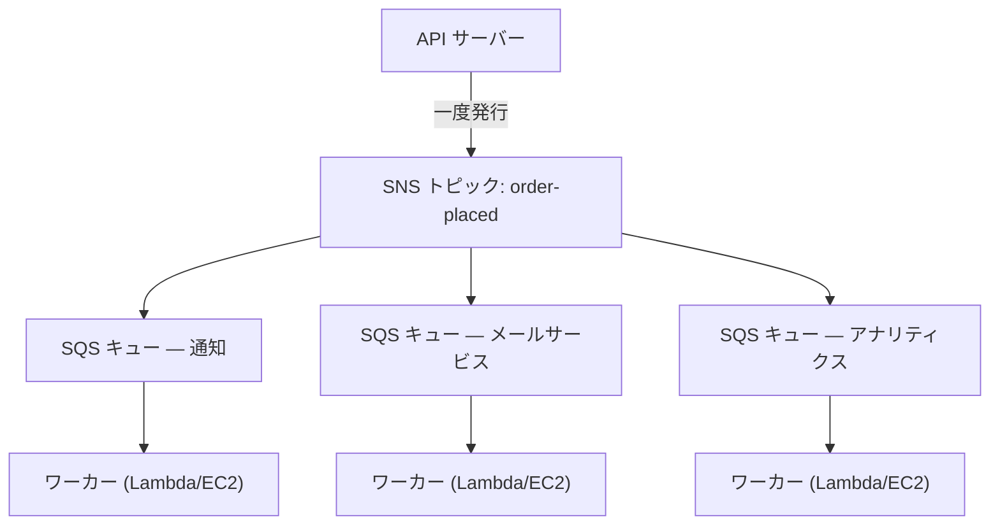

# Chapter 19: The Ticket Machine

チケットマシンは静かな革命でした。番号を取って、呼ばれるのを待つ。列はキューになりました。人々は座れるようになりました。サービスカウンターは自分のペースで働きました。誰も誰かをブロックしませんでした。

チケットマシンが登場する前は、列に並ばなければなりませんでした。列の中での自分の位置には、自分が物理的に存在することが必要でした。待っている間、ほかには何もできませんでした。そして、列の先頭の人が遅ければ、その後ろの全員が止まってしまいました。

チケットマシンは、到着とサービスを分離しました。到着して、番号を取ると、システムがあなたの順番を覚えていてくれます。座りに行けます。サービスカウンターは、自分が扱える限りのペースで番号を処理していきます。カウンターが一時的に閉まっていても、新たに到着した人はやはり番号をもらえます。彼らは待ちます。仕事は消えません。キューに並ぶのです。

この小さな発明は、人間のシステムにおける疎結合の最も古い例のひとつです。この章の終わりまでに、Nimbus は自分自身のチケットマシンを — ソフトウェアで — 構築することになります。そしてそれが必要になった理由は、金曜日の夕方の16分間のダウンタイムから始まります。

---

チームは AZ 障害を乗り切りました。レオはカオスエンジニアリングのプロセスを修正し、ランブックは堅固でした。トラフィックは回復し、再び増え始めていました。実際、以前よりも速いペースで。レオが夜遅くに読んでいた Aurora のドキュメントは、Nimbus が実際にいる場所よりまだ数章先を行っていました。

しかし、トラフィックが増え、より多くのレストランがオンボーディングするにつれて、別の種類のボトルネックが見えてきました。インフラストラクチャの中ではありません。アプリケーションコードそのものの中にです。1時間あたり200件の注文では問題なく機能していたリクエストチェーンが、800件で負荷の兆候を見せ始めていました。

そして、14日の夕方がやってきました。

---

それはアナリティクスダッシュボードから始まりました。金曜日の午後6時47分、アナリティクスサービスへのデプロイがタイムアウトのバグを持ち込みました。サービスは通常の200ミリ秒の代わりに8秒で応答し始めました。

注文フローは同期的でした。すべての注文は、顧客に確認する前にアナリティクスサービスを待っていました。負荷が増えるにつれ、8秒は12秒になりました。API の接続プールは、アナリティクスのステップが完了するのを待つリクエストで埋まり始めました。

午後6時53分、接続プールが上限に達しました。新しいリクエストはただちに失敗し始めました。注文が処理できなかったからではなく、処理を始めるための利用可能な接続がなかったからです。

「アナリティクスサービスが注文フローを停止させた」と、翌朝ログを見ながらレオが言いました。「両者は互いに何の関係もない。アナリティクスサービスはダッシュボードを計算するだけだ。」

「でも、同じリクエストチェーンの中にある」とプリヤが言いました。

「16分間のダウンタイム」とマヤが言いました。「そして3人の顧客が二重に課金された。」

二重課金はダウンタイムよりも悪いものでした。接続プールの飽和の混乱の中で、実際には成功していたいくつかのリクエストに対してリトライメカニズムが発火していたのです。決済ステップが完了し、それからリクエストが応答を返す前にタイムアウトし、リトライが決済を再度試みました。同じカード、同じ金額、2回の課金です。

「リトライメカニズムは助けになるはずだった」とレオが言いました。

「間違った方向に助けたのよ」とプリヤが言いました。「それに、あの顧客たちに返金しようとするとどうなるか考えた? 返金プロセスは、失敗したのと同じ注文フローを使っているのよ。」

16分間のダウンタイムと3件の二重課金。それが同期リクエストチェーンのビジネスコストでした。

---

Nimbus には、注文が人気になるまでは問題に感じられなかった問題がありました。

注文が行われるたびに、API サーバーは次のことをしなければなりませんでした:

1. 注文をデータベースに保存する
2. レストランのタブレットに通知を送る
3. 顧客に確認メールを送る
4. レストランのアナリティクスダッシュボードを更新する
5. 請求のためにイベントをログに記録する

繁盛しているデリのカウンターでは、レジの人は次の顧客に移る前に、スライサーがスライスを終えるのを待ちません。注文を取り、それをキッチンに渡し、次の人に対応を始めます。キッチンは自分のペースで注文を処理します。顧客はより速いサービスを受けます。キッチンは突然の急増に圧倒されません。キッチンに手が空かない瞬間があれば、注文はレジでエラーを起こす代わりに、カウンターの後ろに積み上がります。

それがたとえ話でした。Nimbus にはカウンターとキッチンがありませんでした。顧客が立ち去れるようになる前に、すべてを順番に1人でこなす人がいただけでした。

そして14日、肉を切る人に問題が起きました。だからカウンターが止まりました。だからその後のすべての顧客が待ちました。キッチンも、レジも、顧客も — すべてが、チェーンの中の1つのステップが遅くなったために一時停止しました。

修正は、肉を切るのを速くすることではありませんでした。修正は、ステップを分離することでした。レジで注文を取り、チケットを引き渡し、キッチンに働かせるのです。

「私たちは密結合している」とプリヤが言いました。「下流のステップのどれかが失敗すると、注文全体が失敗する。アナリティクスサービスが侵害されて、不正な形式のメッセージを消費し始めたらどうなるか、考えたことある? 注文全体が失敗するのよ — それを待っているから。」

「もし注文を保存して、顧客にすぐ確認できたら」とレオが言いました。「そして残りをバックグラウンドで処理できたら?」

「それがキューよ」とプリヤが言いました。

重要な洞察: 顧客は、確認を受け取る前にアナリティクスダッシュボードが更新されたかどうかを知る必要はありません。彼らは注文が受け付けられたことを知る必要があるのです。それらは別物です。同期チェーンはそれらを混同していました。

**疎結合のモデル**

これが **疎結合 (decoupling)** です。仕事を受け付けるコンポーネントを、それを処理するコンポーネントから分離することです。

Nimbus の注文フローのすべてのステップは、API が顧客に応答する前に同期的に行われなければなりませんでした。メールサービスが遅ければ (時々そうでした)、顧客は待ちました。アナリティクスダッシュボードがダウンしていれば (時々そうでした)、注文は失敗しました。

14日のカスケードは、これがなぜ重要なのかをまさに示しました。アナリティクスサービスは、顧客の注文が受け付けられるかどうかとは何の関係もありませんでした。しかし、同じ同期チェーンの中に座っていたため、その障害が全員の障害になりました。

ソフトウェアシステムでは、キューはしばしばメッセージブローカーです。プロデューサーからメッセージを受け付け、それらをコンシューマーに配信するサービスです。

注文フローが非同期になったのに、顧客はどうやって注文が実際に受け付けられたことを知るのか、と疑問に思うかもしれません。答えはアーキテクチャ設計の中にあります。API は注文をデータベースに保存し (同期的 — これが権威ある確認です)、それからイベントをキューに発行します。顧客の確認は、データベースへの書き込みが成功したことに基づくのであって、下流のサービスが完了したことに基づくのではありません。メールサービスが遅くても、顧客はすでに確認を得ています。メールは、あったらいいなというフォローアップにすぎません。

**Amazon SQS: キュー**

**Amazon SQS (Simple Queue Service)** は、AWS のマネージドメッセージキューサービスです。コンシューマーによって処理されるまで、メッセージを耐久的に保存します。

基本的な流れ:

1. **プロデューサー** (API サーバー) がキューにメッセージを置きます: `{ "orderId": "ORD-5532", "restaurantId": "47", "items": [...] }`
2. API はただちに顧客に応答します: 「注文が確認されました!」
3. **コンシューマー** (別個のワーカーサービス) がキューからメッセージを読み取り、それらを処理します: レストラン通知を送る、確認メールを送る、アナリティクスを更新する

顧客のエクスペリエンス: 即座の確認。下流の処理: 非同期に、ワーカーのペースで行われます。

**SQS の主要な概念**

**メッセージの可視性タイムアウト (Message visibility timeout)**: コンシューマーが SQS からメッセージを読み取ると、そのメッセージは一定期間 (デフォルト: 30秒)、他のコンシューマーから *見えなくなり* ます。これにより、コンシューマーにそれを処理する時間が与えられます。コンシューマーが正常に終了すれば、メッセージを削除します。コンシューマーがクラッシュすれば、可視性タイムアウトが切れ、メッセージは別のコンシューマーがリトライできるよう再び見えるようになります。

これが at-least-once 配信を保証します。すべてのメッセージは、コンシューマーが処理の途中で失敗しても、少なくとも1回は処理されます。

メッセージが処理中に見えなくなるが、コンシューマーがクラッシュしたときに削除されないのなら、2回処理され得るのではないか、と疑問に思うかもしれません。はい — そしてこれが at-least-once 配信と呼ばれるものです。それは、すべてのコンシューマーが、同じメッセージを複数回受け取っても問題を起こさないように設計されなければならないことを意味します。重複した注文確認メールは煩わしいものです。重複した課金はサポートチケットです。それに応じてコンシューマーを設計してください。

可視性タイムアウトは、想定される最長の処理時間よりも長くなければなりません。処理に通常20秒かかるが、ときどき90秒かかり、可視性タイムアウトが30秒なら、そのときどきの90秒の処理は SQS には失敗に見えます。メッセージは再び見えるようになります。2人目のコンシューマーがそれを拾います。いまや2つのワーカーが同じメッセージを処理しています。処理が冪等でなければ、問題が起きます。

よくある間違い: 可視性タイムアウトを平均処理時間と同じに設定すること。正しいアプローチ: 安全マージンを取って99パーセンタイルの処理時間に設定すること。P99 処理時間が45秒なら、可視性タイムアウトを90秒に設定します。

**デッドレターキュー (DLQ)**: メッセージが処理に何度も (設定可能 — 例: 5回のリトライ) 失敗すると、SQS はそれをデッドレターキューに移動します。メッセージを失うことなく、なぜメッセージが失敗しているのかを理解するために DLQ を調べます。

DLQ は、本番で実際に何が失敗しているのかを学ぶ場所です。それがなければ、失敗したメッセージは単に消え去り、調査する手段がなくなります。

SQS への移行から3週間後、レオは通知サービスの DLQ に23件のメッセージが溜まっていることに気づきました。彼は DLQ をチェックしていませんでした (正しくセットアップしてから、空のままだろうと思い込んでいたのです)。

彼は1件のメッセージを取り出し、ペイロードを見ました:

```json
{
  "orderId": "ORD-9821",
  "restaurantId": "12",
  "customerMessage": "Extra spicy please 🌶️🔥",
  "timestamp": "2024-01-18T19:43:11Z"
}
```

絵文字です。レストラン通知サービスは、レストランのレガシーなタブレット API に送信する前に、メッセージのペイロードを Latin-1 としてエンコードしていました。絵文字の文字は — UTF-8 でそれぞれ4バイト — 破損しており、タブレット API がリクエストを拒否する原因になっていました。メッセージはリトライされ、再び失敗し、再びリトライされ、再び失敗しました。5回のリトライ後、SQS はそれを DLQ に移動しました。

「23件すべてのメッセージに、顧客のメモ欄に絵文字が入っている」とレオが言いました。

「つまり、注文のメモに絵文字を追加したすべての顧客は、そのメモがレストランに届かずに静かに失敗していた、ということね」とマヤが言いました。

「そうだ。」

「どのくらいの間?」

レオは最も古いメッセージのタイムスタンプを確認しました。「3週間だ。」

プリヤは黙っていました。「それで、もし誰かが、注文のメモに絵文字を追加すると静かに失敗することに気づいたら? 絵文字付きで注文を出して、レストランが指示を決して見ないことを保証できる。それから、間違った注文だと文句を言える。」

誰もこれを悪用していませんでした。しかし、それは尋ねるべき正しい質問でした。

レオはエンコードのバグを修正しました。それから、DLQ から取り残された23件のメッセージすべてを再生するスクリプトを書きました。レストランは (3週間前の) 辛い絵文字の指示を受け取りました。顧客は決して知りませんでした。

教訓: DLQ は積極的に監視されなければなりません。セットアップして忘れるのではなく。増え続ける DLQ は、何かが繰り返し失敗していることの静かなシグナルです。

**キューのタイプ**:

**標準キュー (Standard queues)**: 最大スループット (1秒あたり無制限のメッセージ)。配信順序はベストエフォート (保証されません)。at-least-once 配信 (ごくまれに、メッセージが2回配信されることがあります)。

**FIFO キュー**: 厳密な先入れ先出しの順序付け。Exactly-once **処理** — 5分間のウィンドウ内で `MessageDeduplicationId` に基づく重複排除。順序付けは `MessageGroupId` *ごと* に保証されます。同じグループのメッセージは順序どおりに到着します。異なるグループは並列で処理でき、それが FIFO がスケールする仕組みです。ベースラインのスループットは、バッチングで1秒あたり3,000メッセージ (バッチングなしで300)。**ハイスループットモード** を有効にすると、メッセージグループ間でパーティション分割することで、これが1秒あたり数万に上がります。順序が重要なとき (金融取引、逐次的な状態変更) には FIFO を使います。

最大スループットが必要で、ときどきの重複メッセージを許容できるなら、SQS Standard を使ってください。ただし、すべてのコンシューマーを、重複を問題なく扱えるように設計しなければなりません。厳密な順序付けと exactly-once 処理が必要なら、SQS FIFO を使い、`MessageGroupId` をうまく設計してください。なぜなら、並列性 (したがってスループット) は多くのグループを持つことから来るからです。

Nimbus では、ほとんどのキューが標準キューを使いました。請求キューは、課金が順序どおりに処理されることを保証するために FIFO を使いました。

**キュー深度オートスケーリング: バックログに合わせてワーカーをスケールする**

SQS の最も強力な応用のひとつは、キュー深度をオートスケーリングのトリガーとして使うことです。CPU やメモリに基づいてスケールする代わりに、どれだけの仕事が待っているかに基づいてスケールします。

Nimbus の通知サービスでは、SQS のキュー深度 (処理を待っているメッセージの数) が、通知ワーカーを実行する ECS サービスの Application Auto Scaling ポリシーに接続されていました。

ポリシー: キューにワーカータスクあたり50件を超えるメッセージがあるとき、タスクを追加する。キューにワーカータスクあたり10件未満のメッセージがあるとき、タスクを削除する。

実際の効果: 金曜の夕方のピークに1,200件の注文が押し寄せたとき、通知キューの深度が急増し、ワーカーフリートは3分以内に2タスクから8タスクにスケールしました。深夜までにキューは空になり、フリートは2に戻りました。

「それは月にいくらかかるんだ?」と、オートスケーリングのグラフを見ながらトムが尋ねました。

「オートスケーリングそのものには追加料金はかからない」とレオが言いました。「でも、金曜の夕方に3時間、追加で6つの ECS タスク — それは意味のある額だ。」

トムは計算しました。「あのピークで月に約14ドル。そして以前は、8タスクをフルコストで継続的に動かしていた?」

「そうだ。」

「では、必要なときのバーストに対して支払い、それ以外は何も支払わない。」

これがキュー深度スケーリングのパターンです。キューがトラフィックの急増を吸収するバッファになり、ワーカーフリートがバッファを排出するためにスケールします。ユーザーは遅さを経験しません。注文が受け付けられたときに即座に確認を得たからです。ワーカーが追いつくのに少し時間がかかるだけです。そして、24時間365日ピーク容量を動かしていないため、コストは大幅に低くなります。

**Amazon SNS: ブロードキャスター**

**Amazon SNS (Simple Notification Service)** は、パブリッシュ/サブスクライブ (pub/sub) メッセージサービスです。1つのプロデューサー、1つのコンシューマー (キュー) ではなく、SNS は1つのメッセージが *多数の* サブスクライバーに同時に配信されることをサポートします。

モデル:

1. **パブリッシャー** が SNS の **トピック** にメッセージを送ります
2. そのトピックのすべての **サブスクライバー** がメッセージを同時に受信します (ファンアウト)

サブスクライバーは次のものになり得ます:

- SQS キュー (非同期処理のためにメッセージをキューにプッシュ)
- Lambda 関数 (関数を直接トリガー)
- HTTP/HTTPS エンドポイント (Webhook 配信)
- メールアドレス
- SMS (電話番号)

Nimbus では、注文が行われたイベントが `order-events` という SNS トピックに発行されます:

- レストラン通知サービスがサブスクライブ (自身の SQS キューで受信)
- メールサービスがサブスクライブ (自身の SQS キューで受信)
- アナリティクスサービスがサブスクライブ (自身の SQS キューで受信)
- 請求サービスがサブスクライブ (自身の FIFO SQS キューで受信)

1つの注文イベント。4つのサブスクライバー。すべてが同時に通知されます。それぞれが自分のペースで処理します。

「つまり SNS はアナウンスメントで」とマヤが言いました。「SQS は各チームがそのアナウンスメントを自分の速度で処理するインボックスね。それなら、なぜ両方を使うの? なぜ全員が SNS トピックに直接サブスクライブしないの?」

「SNS の直接配信は fire-and-forget だからだ」とレオが言いました。「SNS が発火したときにアナリティクスサービスがダウンしていたら、そのメッセージは消える。間に SQS キューがあれば、メッセージはサービスが回復するまで待つ。」

「まさにそう」とプリヤが言いました。「SNS/SQS のファンアウトは標準的なパターンよ。」

**SNS/SQS ファンアウトパターン**

この組み合わせ — SNS トピックが複数の SQS キューに供給する — は、AWS における最も重要なアーキテクチャパターンのひとつです:



各キューは独立しています。アナリティクスサービスは遅くなり得ます — そのキューは埋まりますが、通知サービスとメールサービスは影響を受けずに動き続けます。アナリティクスサービスがダウンすると、そのメッセージは復旧するまでキューで待ちます。何も失われません。

これが重要な特性です: **独立した障害**。1つのコンシューマーの問題は他に伝播しません。

**メッセージフィルタリング: すべてのサブスクライバーにすべてのメッセージを送るわけではない**

システムが成長するにつれて、すべてのサブスクライバーにすべてのメッセージを処理させたくはなくなります。アナリティクスサービスは、完了した注文だけを気にするなら、失敗した決済処理に関するメッセージを受け取るべきではありません。

**SNS メッセージフィルタリング** は、サブスクライバーがフィルタポリシーを指定できるようにします — 特定の属性に一致するメッセージのみを配信します。

レストラン通知サービスは、フィルタ付きでサブスクライブします: `status = "confirmed"` のメッセージのみ。

エラーアラートサービスは、フィルタ付きでサブスクライブします: `status = "failed"` のメッセージのみ。

各サブスクライバーは、必要なものだけを得ます。

フィルタリングがなければ、すべてのサブスクライバーがすべてのメッセージを受け取り、無関係なものを無視しなければなりません。これは処理を無駄にし、お金を無駄にし (SQS はメッセージごとに課金します)、ノイズを持ち込みます。フィルタリングのない大量の注文システムは、成功した注文でエラーアラートキューをあふれさせ、本当の障害を見つけにくくします。

フィルタポリシーはこのように見えます:

```json
{
  "status": ["confirmed"],
  "region": ["us-west-2", "us-east-1"]
}
```

このサブスクライバーは、status が「confirmed」で、かつ region が「us-west-2」または「us-east-1」のいずれかであるメッセージのみを受け取ります。ポリシーに一致しないメッセージは、このサブスクライバーのキューにはまったく配信されません — SQS に到達することすらありません。

「つまりフィルタリングは SNS の層で起こる」とプリヤが言いました。「メッセージが SQS に書き込まれる前に?」

「そのとおり。レストラン通知サービスの SQS キューは、それが対処すべきメッセージしか決して見ない。」

「それで、もし誰かが、すべてのサブスクライバーのフィルタに一致するように特別に細工したメッセージを SNS トピックに発行して侵入しようとしたら?」とプリヤが尋ねました。

SNS トピックには IAM リソースポリシーがありました。注文 API サービス (その IAM ロールによって) のみが発行を許可されていました。SNS のアクセスポリシーと SQS のキューポリシーがアクセス制御の層を形成していました。フィルタリングはルーティングのためだけで、セキュリティのためではありませんでした。

**SQS と SNS をいつ使うか**

**SQS 単独**: 1つのプロデューサー、1つのコンシューマー (または同じキューを奪い合う複数のコンシューマー)。メッセージは一度、順序どおり (FIFO) または順序なし (標準) に処理される必要があります。ワーカーキューのパターン — 1つのキュー、それから消費する複数のワーカー。

**SNS 単独**: fire-and-forget の通知。メール、SMS、または HTTP エンドポイントにプッシュします。メッセージをキューに入れる必要はありません — ただ通知して次に進みます。

**SNS + SQS (ファンアウト)**: 1つのイベント、複数の独立したコンシューマー。各コンシューマーは自身のキューを持ち、独立して処理し、独立して失敗できます。

## SNS FIFO トピック

SNS についての上記のすべては標準トピックを使っています — それらは実質的に無制限のスループットを持ち、サブスクライバーにほぼ同時に配信し、大多数のユースケースで仕事を片付けます。

しかし、標準 SNS トピックは順序付けを保証しません。10件のメッセージを順番に発行すると、サブスクライバーはそれらをわずかに異なる順序で受け取るかもしれません。Nimbus の注文通知にとっては、それで問題ありません — アナリティクスの更新がメール確認のほんの一瞬前に到着しても問題ありません。

一部のシナリオでは、それが問題になります。財務台帳を考えてみてください。2つのイベント — 貸方、それから借方 — が逆順で配信されると、両方のイベントが最終的に正しく処理されたとしても、処理中の残高計算は間違ったものになります。

**SNS FIFO トピック** は、SQS FIFO キューと同じ原則をファンアウトモデルに適用します。メッセージは発行された正確な順序でサブスクライバーに配信され、各メッセージは exactly-once で配信されます。

トレードオフ: SNS FIFO トピックは SQS FIFO と同様のベースラインスループットを持ち (トピックあたり1秒あたり3,000メッセージ。メッセージグループあたり1秒あたり300 — 2025年以降はさらに多くを扱えるハイスループットモードが利用可能)、**SQS キュー** にのみファンアウトします — FIFO、または2023年以降は Standard。Standard キューをサブスクライブすることは、順序を気にしないコンシューマー (たとえばアナリティクスフィード) に役立ちますが、順序付けと exactly-once がエンドツーエンドで生き残るのは FIFO キューへの場合 **のみ** です。SNS FIFO トピックを使って HTTP エンドポイントやメールアドレスに配信することはできません。

Nimbus の請求パイプラインでは — 一連の価格更新がレストランアカウントに順序どおりに適用されなければならなかった — 請求の SNS トピックが標準から FIFO に移行されました。SQS の請求キューはすでに FIFO でした。ファンアウトはいまや、値上げイベントが、それが依存する期間開始イベントよりも先に請求プロセッサに到着することが決してないことを保証しました。

> **試験のヒント — SNS FIFO**
>
> シナリオが複数のサブスクライバーにわたる **順序付けされたファンアウト配信** を要求する場合、答えは **SNS FIFO** です。標準 SNS は順序付けを保証しません。SNS FIFO は SQS キューにのみファンアウトします — 順序付けと exactly-once をエンドツーエンドで保つには、サブスクライバーは SQS **FIFO** キューでなければなりません (Standard キューのサブスクリプションは許可されますが、ベストエフォートの順序付けと at-least-once 配信になります)。デフォルトのスループットはトピックあたり1秒あたり3,000 — シナリオがはるかに高いボリューム *かつ* 厳密な順序付けを記述している場合、それは代替アーキテクチャ (たとえば、後の章で扱う Kinesis) を検討するシグナルです。

## レガシーキューが手放してくれないとき

Nimbus はこれまでで最大の買収を成立させようとしていました。Barato は、200のレストランと2年先行する運用実績を持つフードデリバリーの競合でした。エンジニアリングチームは統合計画のコールをスケジュールしました。

コールは、レオが黙り込むまで20分続きました。

「彼らの注文処理システムだが」と彼は言いました。「何の上で動いているんだ?」

「ActiveMQ です」と電話の向こうの Barato のエンジニアが言いました。「オンプレミスのブローカーです。アプリは Java です。2018年から動いています。すべてが AMQP を話します。」

「AMQP」とレオが言いました。

「はい。」

彼は画面上のアーキテクチャ図を見ました。Nimbus は SQS と SNS を動かしていました。SQS は AMQP を話しません。SNS は AMQP を話しません。Barato のアプリケーションは、それ以外を何も話しませんでした。

「これを書き直すには6か月かかる」と、コールのあとレオはチームに言いました。「最低でも。」

「6か月も買収を遅らせるわけにはいかない」とマヤが言いました。

「それに、AWS でベアメタルの ActiveMQ ブローカーを動かすこともできない」とプリヤが付け加えました。「セキュリティと信頼性の観点から、それがどう見えるか考えたことある? 自己管理のメッセージブローカーが、マネージドなパッチ適用も自動フェイルオーバーもなしに本番に置かれて、私たちのインフラに接続するのよ?」

「マネージドな選択肢がある」とレオがゆっくりと言いました。彼は彼らが話している間に読んでいたのです。「Amazon MQ だ。」

**Amazon MQ: マネージドなブローカー**

**Amazon MQ** は、Apache ActiveMQ と RabbitMQ 向けのマネージドメッセージブローカーサービスです。既存のブローカー — アプリケーションが何年も接続してきたのと同じブローカー — を、マネージドな AWS サービスとして実行します。AWS が基盤のインフラストラクチャを処理します: プロビジョニング、パッチ適用、フェイルオーバー、バックアップ。

Amazon MQ を SQS や SNS と異なるものにする重要な特性: それはレガシーのメッセージブローカーが話すプロトコルを話します。AMQP、STOMP、MQTT、OpenWire、NMS。SQS や SNS が単に理解しないプロトコルです。

Barato の統合では、計画は単純でした。AWS が ActiveMQ として構成された Amazon MQ ブローカーを動かします。Barato の Java アプリケーションは、オンプレミスのものの代わりに新しいブローカーのエンドポイントを指すようにします。アプリケーション側での変更: 新しい接続文字列で1つの設定ファイルを更新する。それだけでした。アプリケーションは、自分が Barato オフィスのサーバーではなくマネージドなクラウドブローカーと話していることを知る必要すらありませんでした。

「待って」とマヤが言いました。「最終的に彼らを Nimbus に統合するつもりなら、最初から SQS に移行すべきじゃない?」

「移行の道筋は存在するからだ」とレオが言いました。「そして、それは適切に行う価値がある — いずれは。でも今は、6か月ではなく30日で Barato を AWS インフラ上で稼働させる必要がある。Amazon MQ は、アプリケーションを変更せずにアプリケーションを動かす。それから、SQS への移行を、買収のための慌ただしい前提条件としてではなく、意図的なプロジェクトとして計画する時間を持てる。」

「それは月にいくらかかるんだ?」とトムが尋ねました。

Amazon MQ ブローカー — 信頼性のためのアクティブ/スタンバイのペア1組 — は、Barato のボリュームに適したブローカーで月200ドルほどの範囲でした。6か月の書き直し時間のコストに比べれば、議論の余地はありませんでした。

プリヤは1つの条件付きで計画を承認しました。Amazon MQ インスタンスはプライベートサブネットに置かれ、セキュリティグループのルールは Barato アプリケーションサーバーからの接続のみを許可します。パブリックな露出なし。監査ロギングを有効化。

移行には12日かかりました。Barato アプリケーションは13日目に Amazon MQ に接続しました。14日目、コードを1行も変更することなく、AWS インフラ上で最初の注文を処理しました。

---

> **試験のヒント — Amazon MQ**
>
> *SAA-C03 ドメイン: 回復力のあるアーキテクチャの設計 (ドメイン2)*
>
> 試験は Amazon MQ を SQS や SNS と単一の軸で区別します: **プロトコル互換性**。シナリオが、すでにメッセージブローカーを使い特定のプロトコルを話すアプリケーションを記述している場合、Amazon MQ がほぼ確実に答えです。
>
> 重要なシグナル: **「ActiveMQ」「RabbitMQ」「AMQP」「STOMP」「MQTT」「OpenWire」**、または **「アプリケーションコードを変更せずに」** と同等のあらゆるフレーズ。それらのフレーズを見たら、答えは Amazon MQ です — SQS でも SNS でもありません。
>
> シナリオが、疎結合を必要とする *新しい* アプリケーションを記述している、またはレガシーブローカーや特定のプロトコルに言及していない場合は、SQS/SNS を使います。
>
> もう1つのシグナル: 「既存のオンプレミスメッセージブローカーを AWS に移行する」。アプリが同じ種類のブローカーに対して同じプロトコルを話し続ける必要があるなら、Amazon MQ がリフト・アンド・シフトの答えです。

## 強みと限界

**なぜ SQS と SNS が強力なのか**:

- SQS は耐久的で信頼性の高いメッセージ配信を提供します — メッセージは複数の AZ にわたって保存されます
- 疎結合により、プロデューサーとコンシューマーのサービスの独立したスケーリングとデプロイが可能になります
- デッドレターキューにより、障害時にメッセージが静かに失われることがなくなります
- SNS ファンアウトパターンにより、プロデューサーを変更せずに新しいコンシューマーを追加できます

**複雑になるところ**:

- at-least-once 配信は、コンシューマーが *冪等* でなければならないことを意味します — 同じメッセージを2回処理しても問題 (重複注文、重複課金) を起こすべきではありません
- FIFO キューはより高価で、スループットの制限があります
- 複数のキューとサービスにまたがる失敗したメッセージのデバッグには、良いロギングと可観測性が必要です
- メッセージの順序付け保証は限定的です — 複数のサービスにわたって厳密な順序付けが重要なら、設計は複雑になります

**冪等性: 実践的な深掘り**

冪等性は、3人の顧客に二重課金してしまうまでは抽象的に聞こえます。

操作は、複数回実行しても1回実行したのと同じ結果になるなら **冪等 (idempotent)** です。課金操作は本来冪等ではありません: 2回実行すれば2回課金されます。冪等な課金操作は、試みる前に課金がすでに処理済みかどうかを確認します。

パターン: 各メッセージは一意の ID (注文 ID、または別個のメッセージ ID) を持ちます。処理の前に、コンシューマーはストア (DynamoDB がこれにうまく機能します) をチェックして、このメッセージ ID がすでに正常に処理済みかどうかを確認します。はいなら: 何もせず、メッセージを削除します。いいえなら: 処理し、ID を記録し、メッセージを削除します。

```python
def process_charge(message):
    order_id = message['orderId']
    
    # 冪等性チェック
    if already_processed(order_id):
        logger.info(f"Order {order_id} already charged, skipping duplicate")
        return  # メッセージはキューから削除される
    
    # 課金を処理する
    charge_result = payment_service.charge(
        amount=message['amount'],
        card_token=message['cardToken'],
        idempotency_key=order_id  # 決済プロセッサにも渡す
    )
    
    # これを処理したことを記録する
    mark_as_processed(order_id, charge_result)
```

冪等性キーは、それをサポートする下流のサービス (決済プロセッサ、メールシステム) にも渡されるべきです。たとえば Stripe は、同じ API 呼び出しが2回行われても重複課金を防ぐ `Idempotency-Key` ヘッダーを受け付けます。

「それで、相関 ID はどうなの?」とプリヤが尋ねました。「メッセージが複数のサービスを通って移動するとき、どのリクエストがどの下流のアクションを引き起こしたのかをどうやってトレースするの?」

**相関 ID: サービスをまたいだトレース**

顧客が注文を行うと、リクエストは次を流れます: API → SNS → SQS → 通知ワーカー → レストランのタブレット API → SQS → メールワーカー → SES。

相関 ID がなければ、ステップ6でレストランのタブレット API がエラーを返したとき、各サービスのログはイベントを示しますが、それを最初から特定の顧客の注文までトレースする方法がありません。

**相関 ID (correlation ID)** は、元のリクエストに付けられ、すべてのサービスのやり取りを通じて渡される一意の識別子です。各サービスは、自身のログに相関 ID を含めます。

プリヤが特定の相関 ID で CloudWatch を検索すると、その単一の注文の処理の一部であったすべてのログ行を — すべてのサービスにわたって — 得られます。

「1つ注意点がある」とプリヤが言いました。「相関 ID は外部から入ってくる。誰かが悪意ある ID を注入して、ロギングを台無しにできないかしら?」

相関 ID は内部的なものです — 処理ロジックには影響せず、ロギングだけに影響します。それらをサニタイズすること (英数字、固定長) で、ログ出力におけるインジェクション攻撃を防げます。

**疎結合が間違った選択であるとき**

「待って — でも *なぜ* すべてを疎結合しないの?」とマヤが尋ねました。

それは正当な質問でした。疎結合がカスケード障害を防ぎ、システムを回復力のあるものにするなら、なぜそれをどこにでも適用しないのでしょうか?

なぜなら、疎結合にはコストがあるからです。そして、それらのコストが利益を上回るシナリオがあります。

**即時の一貫性が必要なとき**: 注文を進める前に決済が確認されなければならず — そしてユーザーが画面上で結果を待っている — なら、決済を非同期キューに入れて、課金が成功したかどうかを知る前に確認を返すことはできません。ユーザーは最初の課金が完了する前に2回注文するかもしれません。非同期の疎結合は、応答が結果に依存する操作には機能しません。

**ワークフローが本質的に逐次的なとき**: ステップ3が判断を下すためにステップ2の結果を見なければならないなら、それらをキューから並列に実行することはできません。それらを無理にキューに押し込むと、しばしば同期版よりも複雑になる、ぎこちない結果受け渡しのメカニズムが生まれます。

**メッセージの順序付けが重要でボリュームが低いとき**: SQS Standard は順序付けを保証しません。SQS FIFO は保証しますが、デフォルトではバッチングで1秒あたり3,000メッセージで頭打ちになります (ハイスループットモードがそれを大幅に引き上げます)。ボリュームが低く、厳密に順序付けされたワークフローがあるなら、単純な同期キュー (データベースの行ロックのような) のほうがシンプルで信頼性が高いかもしれません。

**オーバーヘッドが利益を上回るとき**: ユーザーが1人で SLA のない小さな社内ツールは、おそらくファンアウト SNS トピックや DLQ を必要としません。キューと DLQ を監視する運用上のオーバーヘッドは現実のものです。アーキテクチャを問題の大きさに合わせてください。

問いは「これを疎結合すべきか?」ではありません。「この結合のコストは何か、そして疎結合はそのコストを、追加するコスト以上に減らすか?」です。

## 概要

疎結合は、第18章の回復力の原則を内部アーキテクチャに適用したものです。Multi-AZ がインフラストラクチャの単一障害点を排除するのと同じように、SQS と SNS はリクエストチェーンの単一障害点を排除します。

- **疎結合** は、仕事を生み出すコンポーネントを、それを処理するコンポーネントから分離します。
- **SQS** は、コンシューマーが遅い、オフライン、またはスケールアップ中のときに、プロデューサーが仕事を置く耐久的な場所を与えます。
- **SNS** は、パブリッシャーが誰なのかを知らずに、1つのイベントが複数の独立したコンシューマーに届くようにします。
- **SNS + SQS ファンアウト** は、各下流サービスが同じイベントを自分のペースで処理できるようにします。
- **DLQ、冪等性、相関 ID** は、非同期システムを謎ではなくデバッグ可能なものにする運用上の規律です。
- **やみくもに疎結合しないこと**: 同期ワークフロー、即時一貫性の要件、小さくリスクの低いツールは、追加される運用上の表面積を正当化しないかもしれません。

## 試験のヒント

*SAA-C03 ドメイン: 回復力のあるアーキテクチャの設計 (ドメイン2、タスク2.1)*

- **SQS Standard vs FIFO**: 試験は順序付けと配信保証で区別します。「順序どおりに処理しなければならない」 → FIFO。「最大スループット」 → Standard。
- **キュー深度オートスケーリング**: 「キュー深度に基づいてワーカーをスケールする」 → SQS メトリクス (ApproximateNumberOfMessagesVisible) を Application Auto Scaling または ECS Service Auto Scaling と併用。
- **可視性タイムアウト**: at-least-once 配信の重要な概念。コンシューマーが失敗すると、タイムアウト後にメッセージが再び見えるようになります。試験シナリオ: 「メッセージが2回処理されている」 → 可視性タイムアウトが短すぎる (コンシューマーの処理がタイムアウトより長くかかる)。
- **デッドレターキュー**: N 回のリトライ後に失敗したメッセージがここに移動されます。試験シナリオ: 「処理が繰り返し失敗しても、メッセージが失われないようにする」 → DLQ。
- **SNS ファンアウト**: 1つのイベントが複数のコンシューマーをトリガーする古典的な試験パターン。「注文確定通知がメール、SMS、在庫更新を同時にトリガーしなければならない」 → SQS サブスクリプション付きの SNS トピック。
- **SQS + Lambda**: Lambda は SQS キューをポーリングし、各メッセージバッチでトリガーするように構成できます。試験は大規模なイベント駆動処理にこれを使います。
- **SQS ロングポーリング**: コンシューマーが数秒ごとにポーリングする (ショートポーリング、API 呼び出しを無駄にする) 代わりに、ロングポーリングは最大20秒間メッセージを待ちます。コストと誤った空の応答を減らします。
- **SQS 拡張クライアントライブラリ**: キューのペイロード制限 (デフォルトで256KB。2025年以降は1MB まで引き上げ可能) より大きいメッセージには、SQS Extended Client Library を使います。これはメッセージ本文を S3 に保存し、SQS 経由で参照を送ります。試験は依然として256KB を SQS の制限として扱います — 「SQS メッセージが大きすぎる」 → Extended Client Library + S3。
- **SNS メッセージフィルタリング**: サブスクライバーは自身のフィルタポリシーに一致するメッセージのみを受け取ります。試験シナリオ: 「特定の基準に一致する通知のみをサブスクライバーに送る」 → SNS メッセージフィルタリング。
- **注**: SNS/SQS ファンアウトは、高スループットの非同期処理アーキテクチャに関するドメイン3のシナリオにも現れます。回復力とパフォーマンスの両方の問題に対してこのパターンを知っておいてください。
- **Amazon MQ のシグナル**: 「ActiveMQ」「RabbitMQ」「AMQP」「STOMP」「MQTT」「OpenWire」、または「アプリケーションコードを変更せずに」 → Amazon MQ、SQS ではない。シナリオが疎結合を必要とする新しいアプリケーションと言っていれば → SQS/SNS。
- **SNS FIFO vs Standard**: 標準 SNS は順序付けを保証しません。シナリオが **順序付けされたファンアウト** を要求するなら → SQS FIFO キューに供給する SNS FIFO トピック。覚えておくこと: SNS FIFO は HTTP エンドポイントやメールに配信できません — SQS キューにのみ (順序付け/exactly-once には FIFO。Standard サブスクリプションは機能しますが、ベストエフォートの順序付けと at-least-once に格下げされます)。

## 演習

**演習1 — 想起**

SNS/SQS ファンアウトパターンを説明してください。なぜこのパターンは、サービスが HTTP エンドポイントで SNS トピックに直接サブスクライブする代わりに、SQS キューを使うのでしょうか?

*(ヒント: SNS がメッセージを発行したときに HTTP エンドポイントのひとつがダウンしていたら何が起こるかを考えてみてください。)*

**演習2 — SAA-C03 シナリオ**

*シナリオ*: ある E コマースプラットフォームが1時間あたり10,000件の注文を処理しています。注文が行われると、システムは次のことをしなければなりません: (1) 注文をデータベースに保存する、(2) 在庫を差し引く、(3) 確認メールを送る、(4) アナリティクスダッシュボードを更新する。現在、4つのステップすべてが同期的に行われます — アナリティクスサービスが遅いと、顧客が待ちます。チームは、注文が失われないことを保証しつつ、顧客向けの応答時間を改善したいと考えています。

この要件を最も満たすアーキテクチャはどれですか?

A) SQS FIFO キューを使って、4つのステップすべてを順番に処理する  
B) API に注文を保存させてただちに顧客に確認させる。SNS トピックにイベントを発行する。在庫、メール、アナリティクスのサービスを SQS キュー経由でサブスクライブさせる  
C) 並列の EC2 インスタンスを使って、各ステップを同時に、同期的に処理する  
D) リクエスト検証付きの API Gateway を使って注文処理を高速化する

**ヒント1**: 顧客の確認は即座であるべきです。どのステップが応答の前に行われなければならず、どのステップが後で行えますか?

**ヒント2**: アナリティクスサービスが遅いことは、メールや在庫のサービスに影響すべきではありません。

**ヒント3**: SNS ファンアウトは、3つの下流サービスがイベントを同時に受け取れるようにします。

**解答**: B

**説明**: API は注文をデータベースに保存し (同期的 — 確認の前に行われなければならない)、ただちに確認を返します。それから `order-placed` イベントを SNS トピックに発行します。在庫、メール、アナリティクスのサービスは、それぞれ独立した SQS キュー経由でサブスクライブします。それらは自分のペースで処理します — アナリティクスが遅ければ、そのキューは増えますが、他のサービスは影響を受けません。いずれかのサービスが失敗すれば、そのメッセージは SQS キューに残ってリトライされます。設定された回数のリトライが失敗した後、それらは DLQ に移動されます。

**なぜ A ではないのか?** FIFO キューはメッセージを順番に処理します — これは同期的な遅延の助けになりません。また、逐次処理は、アナリティクスが遅いと依然としてメールがブロックされることを意味します。

**なぜ C ではないのか?** 「同期的に処理する並列の EC2 インスタンス」は、依然として顧客に応答する前にすべてのステップが完了することを要求します。インスタンスを追加しても、同期的な結合は解決しません。

**なぜ D ではないのか?** API Gateway は API のルーティングと検証を高速化しますが、下流の処理ステップを疎結合にはしません。

*SAA-C03 ドメイン: 回復力のあるアーキテクチャの設計 — タスク2.1*

**演習3 — アーキテクチャチャレンジ** *(オプション)*

Nimbus はレストランパートナー向けの通知システムを構築しています。顧客が注文を行うと、レストランは次の方法で通知される必要があります:

- タブレットアプリ (プッシュ通知)
- キッチンディスプレイシステム (ローカルハードウェアへの HTTP Webhook)
- バックアップ SMS (タブレット通知が失敗した場合)

タブレット通知サービスは信頼できます。キッチンの Webhook はときどきダウンします (レストランは閉店時にハードウェアの電源を切ります)。SMS はタブレット通知が失敗した場合にのみ発火すべきです。

SNS と SQS を使ってアーキテクチャを設計してください。「タブレットが失敗した場合のみ SMS」という要件をどう扱いますか? キッチンの Webhook がオフラインのときに、それがタブレット通知をブロックしないことをどう保証しますか?

次のことも考えてみてください: 平均の Webhook 応答時間が2秒だが、ハードウェアの遅いレストランでは最大30秒かかり得る場合、キッチンの Webhook 配信に適切な可視性タイムアウトは何ですか? Webhook のリトライが尽きた後に SMS フォールバックをトリガーする DLQ ポリシーはどんなものですか?

*(唯一の正解はありません。目標は、条件付きルーティングを伴うファンアウト設計を練習することです。)*

## Post-Credits Scene

新しい注文フローが稼働しました。

レオは、最初にフルロードテストを実行せずに、火曜日の午後にそれをデプロイしました。「大丈夫だよ」と彼はプリヤに言いました。「アーキテクチャは堅固だ。」

顧客が注文を行いました。API は95ミリ秒で応答しました。確認が彼らの電話に即座に表示されました。

舞台裏では: 4つのサービスが非同期に処理していました。アナリティクスサービスには、品目名に特定の特殊文字を含む注文でクラッシュするバグがありました。そのキューは2時間で3,200件のメッセージまで積み上がりました。

顧客は決して気づきませんでした。

レオがバグを修正してアナリティクスサービスが再起動すると、18分でバックログを処理しました。データは失われませんでした。DLQ は空でした。

彼は CloudWatch ダッシュボードを更新しました。キュー深度: 0。処理済みメッセージ: 3,200。エラー: 0 (修正後)。

「これがまさに、14日がどう見えたはずだったかだ」と彼は言いました。「アナリティクスに問題があった。キューがそれを吸収した。他のすべては動き続けた。」

「これが疎結合の意味よ」とプリヤが言いました。

「それは月にいくらかかるんだ?」とトムが、すでに料金ページを開きながら尋ねました。

「私たちの現在のボリュームでは、SQS で月に約12ドルだ。」彼は画面を見つめました。「もっとかかると思っていた。」

彼は、思いがけず安いものが思いがけず良いものでもあると気づいた人の表情をしていました。

「DLQ のアラートをセットアップして」とプリヤがレオに念を押しました。「もう3週間の静かな失敗はごめんよ。」

「もうやった」とレオが言いました。

今回は、彼はそれをやっていました。

次の章では: 誰かがノックしたときだけ実行され、誰もノックしないときは何のコストもかからない関数。
