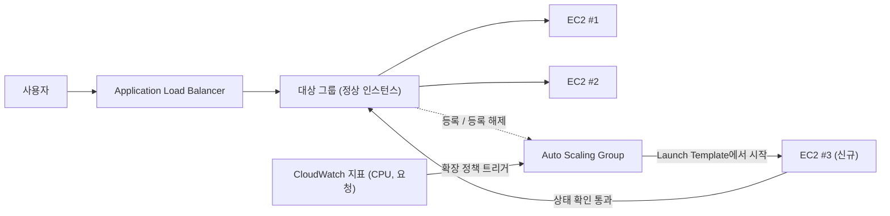

# 챕터 7: 바빠지면 커지는 식당

금요일 저녁 7시 43분이었습니다.

Tom의 의자는 살짝 뒤로 밀려 있었습니다. 누가 말을 걸어도 대답하지 않을 종류의 집중으로 무언가를 응시할 때 그러는 식으로요. 사무실은 한 시간 전에 텅 비었습니다. 그는 남아 있었습니다.

그는 다른 사람들이 소셜 미디어를 확인하는 식으로 — 반사적으로, 끊임없이, 딱히 의도하지 않은 채 — 새로고침하는 지표 대시보드 탭을 열어 두고 있었습니다.

스토리지 위기는 지나갔습니다. 데이터베이스는 자기 디스크를 가졌습니다. 사진은 S3에 살았습니다. 2주 동안, 시스템은 안정적이었습니다 — 흥미진진하지는 않고, 그저 안정적이었습니다. 그것은 기분 좋게 느껴졌어야 했습니다.

그런 다음 오류율이 12%를 넘었습니다.

"Leo," Tom이 말했습니다.

Leo는 이미 보고 있었습니다. 응답 시간: 올라가는 중. 대기열에 쌓인 요청: 올라가는 중. 단일 EC2 인스턴스가 — 지난달의 신중한 적정 크기 조정 작업 이후에도 — CPU 94%에 있었습니다.

"우리가 고객을 돌려보내고 있어요," Tom이 말했습니다.

"우리가 돌려보내는 게 아니에요," Leo가 말했습니다. "서버가요."

"그게 그거예요."

그랬습니다. 그리고 그것은 3주 동안 매주 금요일에 일어나고 있었습니다. Nimbus는 스토리지 위기에서 살아남았습니다 — 데이터베이스는 자기 디스크를 가졌고, 사진은 S3에 살았습니다 — 하지만 안정적인 것과 확장 가능한 것은 완전히 다른 문제입니다. 시스템은 작동했습니다. 그저 자라지 않았을 뿐입니다.

Maya에게서 Slack 메시지가 떴습니다: *대시보드에서 주문이 지난 금요일보다 40% 줄었다고 나와요. 무슨 일이에요?*

Tom이 답했습니다: *서버가 용량에 도달했어요. 작업 중이에요.*

3분이 지났습니다.

Maya: *지원 라인에 식당 주인이 전화해서 앱이 고장 났다고 해요.*

Leo는 키보드에 손을 올리고 있었습니다. 그는 인스턴스의 크기를 조정하고 있었습니다 — 수정의 수동 버전, 서버를 중지하고 인스턴스 유형을 바꿔야 하는 것이요. 그것은 다운타임을 의미했습니다.

"재시작이 얼마나 걸려?" Tom이 물었습니다.

"7분이요," Leo가 말했습니다.

"금요일 밤에 7분 더 장애를 겪게 되겠네요," Tom이 말했습니다. 그는 묻고 있는 게 아니었습니다. 그는 Maya에게 Slack 메시지를 입력했습니다. 그녀는 한 글자로 답했습니다: *ㅇㅋ*

재시작이 완료되었습니다. 인스턴스가 다시 올라왔습니다. CPU가 60%로 떨어졌습니다. 오류율이 떨어졌습니다. Tom은 15분 동안 말없이 지표를 지켜보았습니다.

9시 15분, 트래픽이 줄었습니다. 위기는 끝났습니다.

Leo는 자기 손을 보았습니다. 8시에는 약간 떨리고 있었는데 이제는 아니었습니다.

"우리 매주 금요일마다 그걸 할 수는 없어요," 그가 말했습니다.

"없죠," Tom이 말했습니다. "할 수 없어요."

팀은 시스템이 변동하는 부하를 자동으로 처리하는 것이 필요했습니다. 최악의 경우에 대비해 충분한 서버를 사서 한산한 시간에 돈을 낭비하는 게 아니라요. 그리고 트래픽 급증이 닥쳤을 때 수동으로 허둥대는 게 아니라요.

이것을 위한 패턴이 있습니다. AWS에는 그것을 구현하는 두 가지 서비스가 있습니다.

**개념: 수평 확장**

시스템이 더 많은 부하를 처리하게 하는 두 가지 방법이 있습니다.

**수직 확장(Vertical scaling)**은 단일 서버를 더 크게 만드는 것을 의미합니다. 더 많은 CPU. 더 많은 RAM. 우리는 4장에서 `t3.micro`에서 `t3.large`로 업그레이드할 때 이것을 했습니다. 도움이 됩니다. 하지만 한계가 있습니다: 어느 정도까지만 커질 수 있고, 인스턴스가 크기를 조정하려면 재시작해야 하며, 여전히 단일 장애 지점을 가집니다.

**수평 확장(Horizontal scaling)**은 더 많은 서버를 추가하는 것을 의미합니다. 하나의 큰 서버 대신, 다섯 개의 중간 서버를 돌립니다. 트래픽이 떨어지면, 두 개를 돌립니다. 급증하면, 열 개를 돌립니다.

수평 확장은 수직 확장이 가지지 못한 장점을 가집니다:

- 단일 장애 지점 없음. 서버 하나가 죽어도, 다른 것들이 계속 제공합니다.
- 용량을 추가하는 데 재시작 불필요.
- 사용하는 것만 비용 지불 — 필요할 때 서버를 추가하고, 필요 없을 때 제거.
- 선형 확장: 두 배의 서버, 대략 두 배의 처리량.

수직 확장이 따라올 수 없는 신뢰성 차원도 있습니다. 다섯 개의 서버를 가지고 있고 하나가 실패하면, 용량이 80%로 떨어집니다 — 실패한 인스턴스가 교체되는 동안 트래픽을 계속 제공하기에 충분합니다. 서버 하나를 가지고 있고 그것이 실패하면, 용량이 0%로 떨어집니다. 이중화는 수직 확장이 어떤 크기에서도 제공할 수 없는 방식으로 수평 확장에 내재되어 있습니다.

이것은 유지관리에도 중요합니다. 보안 패치가 서버 재시작을 요구할 때, 수평 확장은 인스턴스를 한 번에 하나씩 재시작하게 합니다 — 서비스 연속성을 유지하는 롤링 재시작이죠. 단일 대형 서버는 재시작 중 다운타임을 받아들이거나 블루/그린 배포 복잡성을 구현하는 것 중 하나를 요구합니다.

함정: 여러 서버가 있다면, 사용자는 어느 것과 통신할지 어떻게 아는가?

그리고 수평 확장이 부과하는 설계 제약이 있습니다: 여러분의 애플리케이션이 서로 간섭하지 않고 여러 동일한 서버에서 동시에 실행될 수 있어야 합니다. 이것이 **무상태(stateless)** 요구 사항입니다 — 각 요청은 자기 완결적이어야 하고, 특정 서버에 저장된 상태에 의존하지 않아야 합니다. 스티키 세션 문제를 만날 때 왜 이것이 중요한지 정확히 보게 됩니다.

**Application Load Balancer: 문 하나, 많은 방**

문에 호스트 스탠드가 있는 큰 식당을 생각해 보십시오. 손님이 도착하면 호스트가 그들을 사용 가능한 테이블로 안내합니다. 호스트는 어느 테이블이 바쁘고 어느 것이 비어 있는지 압니다. 손님은 테이블이 몇 개인지 알 필요가 없습니다 — 그들은 그냥 걸어 들어오고 호스트가 분배를 처리합니다.

**Application Load Balancer**(ALB)는 웹 요청으로 이것을 합니다.

사용자가 로드 밸런서에 연결합니다. 로드 밸런서는 들어오는 요청을 여러분의 EC2 인스턴스 플릿에 분배합니다. 각 사용자는 하나의 주소(로드 밸런서의 URL)를 봅니다. 그 주소 뒤에서, 요청은 돌아가고 있는 서버 수만큼에 걸쳐 분산됩니다.

ALB 자체는 AWS가 관리하는 인프라에서, 여러분의 리전의 여러 AZ에 걸쳐 분산되어 실행됩니다. 그것은 단일 서버가 아닙니다 — 관리형, 분산형 서비스입니다. 교차 영역 로드 밸런싱을 활성화하면(ALB의 기본값), 각 ALB 노드는 등록된 모든 대상이 어느 AZ에 있든 관계없이 요청을 고르게 분배합니다. 이것은 한 AZ가 다른 것보다 두 배 많은 정상 인스턴스를 가져 고르지 않은 부하를 초래하는 흔한 실패 모드를 방지합니다.

그것은 각 들어오는 HTTP 요청을 받아 다음과 같은 요인에 따라 어느 EC2 인스턴스(**대상(target)**이라고 불리는)가 그것을 처리해야 할지 결정합니다:

- 라운드 로빈(각 서버가 순번대로 돌아가며 받음)
- 최소 미처리 요청(진행 중인 요청이 가장 적은 서버가 다음 요청을 받음)
- 상태 — 정상 대상만 트래픽을 받음

**상태 확인(health check)**이 필수적입니다. ALB는 각 대상에 정기적으로 테스트 요청을 보냅니다. 대상이 올바르게 응답하지 않으면, ALB는 그것을 비정상으로 표시하고 그것에 트래픽을 보내는 것을 멈춥니다. 대상이 회복되면, 트래픽이 재개됩니다.

이것은 자동입니다. 여러분이 상태 확인 매개변수를 구성하면; ALB가 그것을 강제합니다.

세 가지 핵심 매개변수로 상태 확인을 구성합니다: 확인할 **경로(path)**(예: `/health`), **간격(interval)**(얼마나 자주 확인할지 — 5초에서 300초마다; 기본값 30), 그리고 **임계값(threshold)**(대상의 상태를 바꾸기 전 연속 성공 또는 실패 확인 횟수).

공격적인 상태 확인 간격은 문제를 더 빨리 잡지만 대상에 더 많은 트래픽을 더합니다. 30초 간격에 3회 실패 임계값은 실패하는 대상이 90초 안에 순번에서 제거된다는 뜻입니다. 10초 간격에 2회 실패 임계값은 20초 안에 제거된다는 뜻입니다 — 더 많은 상태 확인 트래픽을 대가로요.

Nimbus를 위해, Priya는 30초 간격에 3회 실패 임계값(비정상으로 선언하는 데 90초)과 2회 성공(회복 후 다시 정상으로 선언하는 데 60초)을 선택했습니다. 이것은 빠른 실패 감지와 짧은 네트워크 깜박임으로 인한 거짓 양성 회피의 균형을 맞췄습니다.

**상태 확인 구성: "살아 있는가?" 그 이상**

Leo의 첫 상태 확인은 단순한 TCP 핑이었습니다: "포트 80이 연결을 수락하는가?" 그것이 최소입니다. 서버는 데이터베이스가 다운된 동안, 애플리케이션이 오류 루프에 빠진 동안, 디스크가 가득 찬 동안에도 포트 80에서 연결을 수락하고 있을 수 있습니다.

Priya는 "정상"이 무엇을 의미해야 하는지에 대해 다른 견해를 가지고 있었습니다.

"상태 확인은 통과하는데 애플리케이션이 고장 나면 무슨 일이 일어날지 생각해 봤어요?" 그녀가 물었습니다. "연결을 수락할 수 있지만 데이터베이스를 쿼리할 수 없는 서버는 정상이 아니에요. 그건 그냥 응답하는 거예요."

Leo는 애플리케이션 코드에 `/health` 엔드포인트를 만들었습니다. 그 엔드포인트는 세 가지를 했습니다:
1. 애플리케이션 프로세스가 실행 중인지 확인
2. 데이터베이스에 테스트 쿼리를 만듦(단순한 `SELECT 1`)
3. S3 연결이 접근 가능한지 확인

세 가지 모두 통과하면, 엔드포인트가 HTTP 200을 반환했습니다. 어느 것이라도 실패하면, HTTP 503을 반환했습니다.

ALB 상태 확인은 30초마다 이 엔드포인트를 호출하도록 구성되었습니다. 연속 503 응답을 세 번 받으면, 인스턴스가 비정상으로 표시되고 순번에서 제거되었습니다.

"그건 데이터베이스가 다운되면," Priya가 말했습니다. "상태 확인이 그것을 잡아 90초 안에 영향받은 서버를 로드 밸런서에서 제거한다는 뜻이에요."

"서버 자체가 여전히 돌아가고 있더라도요," Tom이 말했습니다.

"바깥에서는 멀쩡해 보이더라도요."

ALB는, 실제 애플리케이션 상태 확인을 가리켰을 때, 단지 서버가 살아 있는지가 아니라 실제 문제의 훨씬 더 신뢰할 수 있는 탐지기가 되었습니다.

**Auto Scaling: 더 많은 테이블을 여는 식당**

ALB는 기존 서버에 걸쳐 트래픽을 분배합니다. 하지만 더 필요할 때 서버를 추가하지는 않습니다.

**Auto Scaling**이 합니다.

**Auto Scaling Group**(ASG)은 AWS에게 다음을 알려 주는 구성입니다:

- 항상 돌리고 있을 최소 인스턴스 수
- 허용되는 최대 인스턴스 수
- 확장(인스턴스 추가)하거나 축소(제거)할 조건

확장 조건은 **정책(policies)**이라고 불립니다. 가장 흔한 네 가지 유형:

**대상 추적(Target tracking)**: "평균 CPU 가동률을 70%로 유지하라." 평균 CPU가 70%를 초과하면, AWS가 새 인스턴스를 시작합니다. 아래로 떨어지면, 인스턴스가 종료됩니다. 이것은 대부분의 워크로드에 가장 단순하고 가장 권장되는 정책입니다 — 대상 지표를 설정하고 AWS가 얼마나 많은 인스턴스가 필요한지 알아내게 합니다. 대상은 CPU 가동률, 대상당 요청 수, 또는 어떤 사용자 정의 CloudWatch 지표든 될 수 있습니다.

**단계 확장(Step scaling)**: 특정 응답을 가진 특정 임계값을 정의합니다. "CPU가 60%를 초과하면, 인스턴스 1개를 추가하라. CPU가 80%를 초과하면, 3개를 추가하라. CPU가 30% 아래로 떨어지면, 1개를 제거하라." 대상 추적보다 더 세분화된 제어이지만, 더 많은 구성과 지속적인 조정이 필요합니다.

**예약 확장(Scheduled scaling)**: "매주 금요일 오후 6시 45분에, 최소 4개의 인스턴스가 돌아가고 있도록 보장하라." 이것은 예측 가능한 이벤트를 위한 선제적 확장입니다. 그것은 반응적 확장과 함께 작동합니다 — 예약 작업이 하한을 설정하고, 대상 추적이 필요에 따라 그 하한 위에 인스턴스를 추가합니다.

**예측 확장(Predictive scaling)**: 같은 아이디어의 머신러닝 버전. 여러분이 일정을 쓰는 대신, Auto Scaling이 최대 2주의 과거 부하를 분석하고 다음 48시간을 예측하여, 예측된 증가에 *앞서* 용량을 시작합니다. 주기적 트래픽 — 매주 금요일 저녁 러시, 매 평일 시장 개장 — 에 대해, 예측 확장이 패턴을 발견하고 자동으로 미리 예열하며, 패턴이 변화함에 따라 계속 조정합니다. 시험 트리거: "반복적/주기적 트래픽 급증; 인스턴스가 급증 *전에* 준비되어야 함" → 예측 확장. (예약 확장이 수동 답이고; 예측이 학습된 것입니다. 둘 다 항상 인스턴스 부팅 시간만큼 급증에 뒤처지는 반응 전용 확장을 이깁니다.)

Nimbus를 위해, 조합은 이러했습니다: 반응적 확장을 위한 대상 추적(CPU를 65%로 유지), 그리고 저녁 러시 전에 추가 인스턴스 2개를 미리 예열하기 위한 매주 금요일 오후 6시 45분의 예약 확장 작업.

이것은 자동입니다. 아무도 지표를 지켜볼 필요가 없습니다. 아무도 수동으로 서버를 시작할 필요가 없습니다. 시스템이 실시간으로 부하에 반응합니다.

Priya는 처음으로 금요일 러시 동안 이것이 라이브로 일어나는 것을 지켜보았습니다. 서버 수가 15분에 걸쳐 2개에서 5개로 갔다가, 러시 후 다시 2개로 돌아갔습니다.

"저거," 그녀가 말했습니다. "진짜로 인상적이네요."

Tom은 대신 비용 그래프를 보고 있었습니다. 청구서가 러시 동안 증가했다가 후에 떨어졌습니다. "우리가 사용한 것만 냈어요," 그가 똑같이 인상받아 말했습니다. "정상적인 일주일에 걸쳐 평균을 내면 한 달에 얼마나 들어?"

Leo가 계산기를 띄웠습니다. 금요일 피크가 월 청구서에 어쩌면 15%를 더했습니다. Auto Scaling 없이는, 일주일 내내 피크에 대비해 프로비저닝해야 했을 것입니다. 차이: 유휴 피크 용량에 낭비되는 월 약 120달러 대, Auto Scaling이 제대로 구성되었을 때 낭비되는 0달러.

축소에서 팀이 종종 놓치는 미묘한 점이 하나 있습니다: **축소 보호(scale-in protection)**. ASG의 특정 인스턴스를 축소로부터 보호되도록 구성할 수 있습니다 — 자동 축소 이벤트 동안 종료되지 않을 것이라는 뜻입니다. 이것은 중단되기를 원하지 않는 장기 실행 작업을 처리하는 중인 인스턴스에 유용합니다. 애플리케이션 코드도 장기 작업을 시작할 때 프로그래밍 방식으로 인스턴스 보호를 설정하고 작업이 완료될 때 보호를 제거할 수 있습니다. 이것은 ASG가 활성 작업 밑에서 양탄자를 빼내는 것을 방지합니다.

**Warm Pool: 모든 것이 차갑게 시작할 필요는 없다**

Auto Scaling이 처음 작동한 금요일, Tom은 "CPU가 임계값 초과"에서 "새 인스턴스가 트래픽 처리"까지 얼마나 걸리는지 시간을 쟀습니다.

4분 20초.

"그건 우리가 용량이 부족한 4분이에요," 그가 말했습니다.

"최소 인스턴스 수를 늘릴 수 있어요," Leo가 말했습니다.

"그건 일주일 내내 유휴 인스턴스에 비용을 낸다는 뜻이에요," Tom이 말했습니다.

중간 지점이 있었습니다: **Warm Pool**.

Warm Pool은 중지된 상태로 앉아 있는, 이미 부팅되고, 이미 구성되고, 이미 UserData 스크립트를 거친 사전 초기화된 EC2 인스턴스의 그룹입니다. 그것들은 트래픽 처리 시작을 제외한 모든 것을 했습니다.

Auto Scaling Group이 확장하기로 결정하면, 처음부터 새 차가운 인스턴스를 시작하는 대신(부팅하고, UserData를 실행하고, 상태 확인을 통과하는 데 3에서 5분이 걸립니다), Warm Pool에서 인스턴스를 시작합니다. 중지된 인스턴스를 시작하는 데는 약 30에서 60초가 걸립니다.

Nimbus의 금요일 패턴 — 오후 7시경 시작하는, 알려지고 예측 가능한 급증 — 을 위해, Priya는 영업 시간 동안 유지할 두 인스턴스의 Warm Pool을 구성했습니다. 오후 6시 45분이면, 두 개의 따뜻한 인스턴스가 준비되어, 중지되었지만 초기화된 채로 앉아 있었습니다. 오후 7시에 트래픽이 오르고 ASG가 확장해야 할 때, 따뜻한 인스턴스가 1분 이내에 시작되어 플릿에 합류했습니다.

"Warm Pool은 비용이 얼마나 들어?" Tom이 물었습니다.

중지된 EC2 인스턴스는 컴퓨팅에 대해 비용을 내지 않습니다 — 하지만 연결된 EBS 스토리지에 대해서는 비용을 냅니다. Warm Pool의 두 개의 `t3.small` 인스턴스: 스토리지 비용으로 월 약 4달러. 확장 시간이 4분에서 1분 미만으로 개선된 것은 금요일 밤에 월 4달러의 가치가 있었습니다.

**ALB 경로 기반 라우팅**

Nimbus가 성장하면서, Leo는 두 번째 구성 요소를 추가했습니다: 식당 관리를 위한 별도의 API 서비스. 식당 주인들은 같은 도메인을 통해 하지만 다른 URL 경로에서 이 서비스에 접근했습니다: `/` 대신 `/api/restaurant/`.

"잠깐 — 그런데 *왜* 그런 식으로 하죠?" Maya가 물었습니다. "왜 식당 관리 API에 완전히 다른 도메인을 주지 않아요?"

"그럴 수 있어요," Leo가 말했습니다. "하지만 그러면 두 번째 인증서, 두 번째 로드 밸런서, 두 번째 DNS 항목이 필요해요. 경로 기반 라우팅은 인증서 하나, 로드 밸런서 하나로 그걸 처리해요."

ALB는 이것을 기본적으로 지원했습니다. **경로 기반 라우팅 규칙**이 ALB에게 알려 주었습니다: URL이 `/api/restaurant/`로 시작하면, 요청을 식당 관리 대상 그룹으로 라우팅하라. URL이 다른 무엇으로든 시작하면, 그것을 고객 대면 애플리케이션 대상 그룹으로 라우팅하라.

두 개의 별도 EC2 인스턴스 플릿. 로드 밸런서 하나. URL 경로로 지시되는 트래픽.

"그러니까 우리가 고객 대면 앱과 독립적으로 식당 관리 API를 확장할 수 있는 거네요?" Maya가 물었습니다.

"바로 그거예요," Leo가 말했습니다. "식당 주인들이 메뉴 업데이트를 많이 하고 있으면, 그 API 서버가 확장돼요. 고객들이 많이 주문하고 있으면, 그 서버가 확장되고요. 그것들은 서로 영향을 주지 않아요."

Maya가 이것을 곱씹었습니다. "그리고 우리는 두 개 대신 ALB 하나만 비용을 내고요."

"맞아요," Tom이 말했습니다. 그에게는 숫자가 있었습니다. "ALB는 기본 요금으로 한 달에 약 20달러에 데이터 처리 요금이 더해져요. 두 워크로드를 처리하는 ALB 하나 대 두 개의 별도 것: 대략 월 20달러 절약. 그리고 여러 인증서와 DNS 레코드 관리를 피하고요."

"하지만," Priya가 말했습니다. "ALB 자체가 다운되면, 두 서비스가 함께 다운돼요."

"AWS는 ALB를 여러 AZ에 걸쳐 고가용성이도록 설계해요," Leo가 말했습니다. "ALB 실패의 위험은 두 개의 별도 로드 밸런서를 유지하는 복잡성에 비해 매우 낮아요."

Priya는 이것을 "수용된 트레이드오프, 문서화됨" 아래에 정리했습니다.

**ALB와 ASG가 함께 작동하는 방법**

두 서비스는 함께 사용되도록 설계되었습니다.

ALB를 앞에 둡니다. ALB는 **대상 그룹(target group)** — 트래픽을 받아야 하는 인스턴스의 모음 — 을 가리킵니다. Auto Scaling Group이 그 인스턴스를 관리합니다: 확장할 때 그것들을 대상 그룹에 추가하고, 축소할 때 제거합니다.

흐름:

1. 트래픽이 ALB에 도착
2. ALB가 정상 대상에 요청을 분배
3. 그 대상의 CPU/부하가 올라감
4. ASG가 부하 증가를 감지, 새 인스턴스를 시작
5. 새 인스턴스가 상태 확인을 통과, ALB에 등록됨
6. ALB가 그것들에 트래픽을 보내기 시작
7. 부하가 감소, ASG가 여분 인스턴스를 종료
8. ALB가 종료된 인스턴스에 트래픽 보내는 것을 멈춤

이것은 어떤 인간의 개입 없이 일어납니다.

**Launch Template: 새 인스턴스를 위한 청사진**

ASG가 새 인스턴스를 시작할 때, 그것은 무엇을 시작할지 알아야 합니다. 이것은 **Launch Template** — AMI, 인스턴스 유형, 적용할 보안 그룹, 그리고 모든 사용자 데이터(인스턴스가 부팅될 때 실행되는 시작 스크립트) — 에 정의됩니다.

흔한 패턴: 애플리케이션을 사용자 정의 AMI에 빌드합니다(4장 참조). ASG가 새 인스턴스가 필요하면, 그 AMI를 시작합니다. 새 인스턴스가 애플리케이션이 이미 설치된 채로 부팅됩니다. 수동 설정이 필요 없습니다.

더 동적인 환경을 위해, 시작 시 코드의 최신 버전을 가져와 설치하는 **사용자 데이터 스크립트**를 사용할 수도 있습니다. 이것은 더 유연하지만 부팅하는 데 더 오래 걸립니다.

올바른 선택은 인스턴스가 부팅하는 데 얼마나 걸려야 하는지와 애플리케이션이 얼마나 자주 바뀌는지에 달려 있습니다.

**스티키 세션: 미묘한 문제**

로드 밸런싱을 처음 구현할 때 많은 팀을 걸려 넘어지게 하는 무언가가 있습니다.

일부 웹 애플리케이션은 세션 데이터 — 로그인 상태, 장바구니 내용 — 를 서버 자체에(메모리나 로컬 디스크에) 저장합니다. 이것은 서버 하나에서는 잘 작동합니다. 여러 서버에서는, 망가집니다.

사용자가 로그인합니다. 요청이 서버 A로 갑니다. 서버 A가 세션을 저장합니다. 다음 요청이 서버 B로 갑니다. 서버 B에는 세션이 없습니다. 사용자가 로그아웃된 것처럼 보입니다.

이것은 두 가지 방법으로 해결될 수 있습니다:

**스티키 세션**(또는 세션 어피니티): 같은 사용자로부터의 요청을 항상 같은 서버로 보내도록 ALB를 구성합니다. 이것은 단기적 수정입니다. 그것은 로드 밸런싱을 약화시키고(일부 서버가 더 많은 "스티키" 사용자를 받음), 인스턴스가 종료될 때 문제를 만듭니다.

Maya가 스티키 세션 구성 페이지를 보았습니다. "사용자를 특정 서버에 고정하면, 그 서버가 축소 중에 종료될 때 무슨 일이 일어나요?"

"세션을 잃어요," Leo가 말했습니다.

"그럼 스티키 세션은 그냥 문제를 미루는 거네요."

"맞아요," Priya가 말했습니다. "진짜 수정은 무상태 애플리케이션 설계예요."

**무상태 애플리케이션 설계**: 세션 데이터를 외부에 저장합니다 — 데이터베이스나 ElastiCache 같은 캐시에(10장). 각 서버가 외부 저장소에서 어떤 사용자의 세션이든 재구성할 수 있습니다. 서버가 상호 교환 가능해집니다. 이것이 수평 확장 가능한 애플리케이션을 위한 올바른 접근입니다.

Priya는 이것을 "멀티 서버로 갈 때 내리는 가장 중요한 아키텍처 결정"이라고 불렀습니다. 그녀가 맞습니다. 우리는 10장에서 그것을 다시 만납니다.

**스티키 세션이라면 복잡성은 적지만 위험은 더 큽니다**

세션 상태 문제를 해결하기 위해 스티키 세션을 사용하면, 단기적으로 외부 세션 저장소를 설정할 필요를 줄입니다 — 하지만 스티키 서버가 축소 중 종료될 때, 그것에 묶인 모든 사용자가 한꺼번에 세션을 잃습니다. 실패는 점진적이지 않습니다; 갑작스럽고 사용자 무리에 동시에 영향을 미칩니다. 세션 상태를 외부화하면, 의존성(ElastiCache나 데이터베이스)을 더하지만 그 갑작스러운 실패 모드를 없앱니다. 정기적으로 확장되는 모든 애플리케이션에게, 무상태 설계에 대한 투자는 Auto Scaling이 활성 세션이 있는 인스턴스를 종료하는 첫 번째 순간에 본전을 뽑습니다.

**Tom의 비용 계산**

다음 주, Tom은 ALB와 ASG 설정에 대한 비용 모델을 만들었습니다.

ALB: 기본으로 월 약 20달러에 데이터 처리 요금. Nimbus의 트래픽 볼륨에서: 월 약 22달러.

Auto Scaling Group 자체: 추가 비용 없음. 그것이 돌리는 인스턴스에 대해 비용을 내지만, 그 인스턴스는 어차피 존재할 것입니다. ASG는 무료입니다; 컴퓨팅에 대해 비용을 냅니다.

Warm Pool: 두 개의 중지된 인스턴스를 위한 EBS 스토리지로 월 약 4달러.

총 추가 인프라 비용: 월 약 26달러, 또는 연 312달러.

그런 다음 Tom은 ALB와 ASG가 자리 잡기 전 세 번의 금요일의 사고 로그를 보았습니다. 각 사고는 장애 기간 동안 금요일 매출의 약 40%를 Nimbus에 비용으로 들였습니다. 평균 금요일 매출: 대략 2,400달러. 2,400달러의 40%는 사고당 960달러입니다. 세 사고: 3주 동안 약 2,880달러의 손실된 매출.

"ALB와 ASG는 1년에 312달러가 들어요," Tom이 말했습니다. "나쁜 금요일 세 번이 우리에게 거의 3,000달러를 들였어요. 그리고 그건 그냥 직접적인 매출 손실이에요 — 나쁜 경험 후에 Nimbus를 그만 쓴 사람들로부터의 고객 이탈이 아니라요."

Maya가 숫자를 읽었습니다. "인프라를 돌리세요."

"이미 돌리고 있어요," Leo가 말했습니다.

## ALB로 충분하지 않을 때: NLB와 GWLB

Leo는 Nimbus가 식당 파트너를 위해 조용히 추가한 IoT 통합을 검토하고 있었습니다 — 워크인 냉장고의 작은 온도 센서가 30초마다 Nimbus에 측정값을 보내, 주방 관리자가 냉장고가 안전 온도 위로 떠오르면 알림을 받을 수 있게 하는 것이요.

"잠깐," Leo가 말했습니다. "이 센서들이 UDP 패킷을 보내고 있어요."

"그게 문제예요?" Maya가 물었습니다.

"ALB는 UDP를 지원하지 않아요," Leo가 말했습니다. "ALB는 HTTP를 이해해요. 그게 다예요."

Priya는 이미 문서를 보고 있었습니다. "그게 Network Load Balancer의 용도예요."

**Network Load Balancer(NLB)**는 레이어 4 — 전송 계층 — 에서 작동합니다. 그것은 TCP와 UDP 패킷을 라우팅합니다. 그것은 그 패킷의 내용을 검사하지 않고, HTTP 헤더를 이해하지 않으며, 경로 기반 라우팅을 하지 않습니다. 그것이 하는 일은 클라이언트에서 대상으로 패킷을 엄청난 속도로 옮기는 것입니다.

- **단일 자릿수 밀리초 지연 시간으로 초당 수백만 요청.** ALB는 레이어 7에서 HTTP를 처리하는데, 이는 헤더를 파싱하고, 라우팅 규칙을 평가하고, TLS 연결을 종료한다는 뜻입니다. NLB는 그중 어느 것도 하지 않습니다 — 그것은 웹 프록시보다 고속 트래픽 지휘자에 가깝습니다.
- **클라이언트의 소스 IP 주소를 보존.** ALB가 연결을 받으면, 그것을 종료하고 대상으로 새 연결을 엽니다 — 여러분의 EC2 인스턴스는 사용자의 IP가 아니라 ALB의 IP를 봅니다. NLB는 이것을 하지 않습니다; 패킷의 소스 IP가 변경되지 않은 채 대상에 도착합니다. 애플리케이션이 요청이 어디서 오는지 알아야 한다면 — 지리 위치, 속도 제한, 또는 사기 탐지를 위해 — 그리고 그것이 정확해야 한다면, NLB가 올바른 선택입니다. (ALB는 원본 IP를 담은 `X-Forwarded-For` 헤더를 더하지만, 그것은 애플리케이션이 헤더를 읽을 것을 요구합니다; NLB는 실제 IP를 패킷에 직접 넣습니다.)
- **정적 IP 주소와 Elastic IP.** ALB의 IP 주소는 시간이 지남에 따라 바뀝니다 — AWS가 그것들을 관리하고 고정되어 있지 않습니다. NLB는 가용 영역당 정적 IP를 지원하고, 그것들에 Elastic IP를 할당할 수 있습니다. 다운스트림 시스템이 여러분의 로드 밸런서로부터의 트래픽을 허용하기 위해 특정 IP 주소를 화이트리스트해야 한다면 — 금융 서비스나 IoT 기기 관리의 흔한 요구 사항 — NLB가 유일한 옵션입니다. ALB는 이것을 할 수 없습니다.
- **TLS 패스스루.** NLB는 암호화된 TLS 트래픽을 복호화하지 않고 대상에 직접 전달할 수 있습니다. 대상이 TLS를 종료합니다. 이것은 컴플라이언스 요구 사항이 복호화가 특정 기기에서 일어나야 한다고 말할 때, 또는 로드 밸런서에서 TLS 인증서를 관리하고 싶지 않을 때 유용합니다.

"NLB가 그렇게 빠르면," Maya가 물었습니다. "왜 그냥 모든 것에 쓰지 않아요?"

"그건 멍청하니까요," Leo가 말했습니다. "가장 좋은 의미에서요. NLB는 HTTP가 뭔지 몰라요. 경로 기반 라우팅을 할 수 없어요. HTTP를 HTTPS로 리디렉션할 수 없어요. 보안 헤더를 더할 수 없어요. WAF와 통합할 수 없어요. 웹 애플리케이션 — HTTP를 말하는 모든 것 — 에는, ALB의 레이어 7 인식이 그 모든 기능을 가능하게 하는 것이에요. UDP인 센서 데이터에는, 우리에게 선택의 여지가 없고요."

"그리고 우리 웹 트래픽에는요?"

"ALB, 전과 같아요."

"그게 한 달에 얼마나 들어?" Tom이 물었습니다. "NLB가 더 저렴해?"

가격 모델은 ALB와 같습니다: 기본 시간당 요금에 처리된 트래픽에 기반한 Load Balancer Capacity Unit(LCU)당 요금. 동등한 트래픽 볼륨에서, 비용은 비슷합니다. Nimbus IoT 사용 사례 — 저볼륨 센서 데이터 — 의 경우, NLB 비용은 월 20달러 미만이 될 것입니다.

**Gateway Load Balancer(GWLB)**는 완전히 다른 종류입니다. 그것은 레이어 3 — IP 패킷 수준 — 에서 작동하며, 하나의 특정 목적을 위해 존재합니다: 타사 가상 네트워크 어플라이언스를 여러분의 트래픽 흐름에 삽입하는 것이요.

Nimbus가 보안 팀이 자사 VPC를 드나드는 모든 트래픽이 상용 방화벽 어플라이언스 — Palo Alto나 Fortinet 같은 공급업체의 소프트웨어를 돌리는 가상 머신 — 를 통과해야 한다고 요구하는 크기로 성장했다고 상상해 보십시오. GWLB 없이는, 그 어플라이언스를 통해 수동으로 트래픽을 라우팅하고 그것들을 어떻게 확장하고 고가용성으로 유지할지 알아내야 할 것입니다. GWLB로는, 어플라이언스를 대상으로 구성하면, 모든 트래픽이 GENEVE 프로토콜을 사용해 그것을 통해 투명하게 라우팅됩니다. 애플리케이션은 트래픽이 검사되고 있다는 것을 모릅니다. 방화벽은 네트워크 토폴로지를 알 필요가 없습니다. GWLB가 라우팅, 확장, 페일오버를 처리합니다.

초기 및 중기 단계의 대부분의 웹 애플리케이션 — Nimbus 포함 — 에게, GWLB는 여러분이 구성할 서비스가 아닙니다. 하지만 시험을 위해, 그리고 보안 요구 사항이 네트워크 수준 검사를 요구하는 날을 위해, 그것이 무엇을 위한 것인지 알게 될 것입니다.

Leo는 그날 오후 센서 엔드포인트를 위한 NLB를 추가했습니다. 온도 데이터가 흐르기 시작했습니다.

"첫 식당이 워크인 냉장고가 화씨 47도라는 알림을 받았어요," 그가 말했습니다. "그건 안전 임계값 위예요."

"실제로 47도예요?" Maya가 물었습니다.

"식당 주인이 확인했어요. 그들은 같은 날 오후에 수리 기사를 불렀어요."

Priya는 이것을 Nimbus 고객 영향 로그에 적었습니다. 보안 이벤트가 아니라. 그저 IoT 기능이 작동하는 것이었습니다.

**세 가지 로드 밸런서, 나란히**

AWS는 세 가지 유형의 로드 밸런서를 제공합니다. ALB는 레이어 7에서 HTTP와 HTTPS를 처리합니다 — 그것은 프로토콜을 이해하므로, URL 경로(`/api`를 한 그룹으로, `/static`을 다른 그룹으로), 호스트 헤더, 쿼리 매개변수에 기반해 라우팅할 수 있습니다. 이것이 대부분의 웹 애플리케이션이 사용하는 것이고, Nimbus가 자사 웹 트래픽에 사용하는 것입니다.

ALB는 또한 TLS 연결을 종료합니다 — SSL/HTTPS 인증서가 각 개별 EC2 인스턴스가 아니라 로드 밸런서에 설치됩니다. ALB가 요청을 복호화하고, HTTP 헤더를 검사하고, 규칙에 기반해 라우팅하고, (선택적으로) 대상으로 전달하기 전에 다시 암호화합니다. 이것은 인증서 관리를 상당히 단순화합니다: 모든 인스턴스의 인증서가 아니라 ALB의 인증서 하나를 관리합니다.

NLB는, 팀이 온도 센서로 본 것처럼, 레이어 4에서 TCP, UDP, TLS를 처리합니다 — 순수한 속도, 소스 IP 보존, 정적 IP. GWLB는 방화벽과 침입 탐지 시스템 같은 타사 어플라이언스를 통해 트래픽을 꿰기 위해 레이어 3에 앉습니다 — 주니어 수준에서는 거의 필요하지 않습니다.

Nimbus에게(그리고 대부분의 웹 애플리케이션에게), ALB가 올바른 선택입니다.

이런 생각이 들 수도 있습니다: 같은 애플리케이션에 ALB와 NLB를 둘 다 사용할 수 있는가? 네. 흔한 패턴은 ALB 앞의 NLB입니다 — NLB가 엣지에서 원시 TCP 종료를 처리하고, ALB가 그 뒤에서 HTTP 라우팅을 처리합니다. 이것은 복잡성과 비용을 더하고, 대부분의 웹 애플리케이션에는 필요하지 않습니다.

**시험을 위한 ALB 대 NLB**: 핵심 차별점은 레이어 7 대 레이어 4입니다. 시험 시나리오가 URL 기반 라우팅, 호스트 기반 라우팅, HTTP 헤더 검사, 또는 WebSocket을 언급하면 — 그것은 ALB입니다. TCP 패스스루, 소스 IP 보존, 초당 수백만 요청, 또는 비HTTP 프로토콜을 위한 극도로 낮은 지연 시간을 언급하면 — 그것은 NLB입니다. 시나리오가 그냥 "웹 애플리케이션을 위한 로드 밸런서"라고 말하면, 답은 거의 항상 ALB입니다.

## 강점과 한계

**ALB + Auto Scaling이 강력한 이유**:

- 무중단 확장(기존 연결을 방해하지 않고 인스턴스가 추가/제거됨)
- 자동 페일오버(비정상 인스턴스가 트래픽에서 자동으로 제거됨)
- 비용 효율성(돌아가는 인스턴스에 대해서만 지불)
- 단일 장애 지점 없음 — 여러 AZ에 걸친 여러 인스턴스

**복잡해지는 부분**:

- 상태 저장 애플리케이션은 특별한 처리가 필요함(스티키 세션이나 외부 상태)
- 확장에는 시간이 걸림 — 트래픽이 즉시 급증하면, 새 인스턴스가 준비되기 전까지
  지연이 있음. 예측 가능한 피크에는 Warm Pool로, 또는 더 높은 최소 수로 완화.
- 더 많은 움직이는 부분은 모니터링하고 디버깅할 것이 더 많음을 의미
- 일부 애플리케이션은 쉽게 수평 확장될 수 없음(데이터베이스, 특정 레거시
  시스템). 수평 확장은 무상태 계층에 가장 잘 작동함.

## 요약

두 서비스, 하나의 패턴 — 그리고 중요한 것은 그 패턴입니다. ALB가 분배를 처리하고; ASG가 플릿 크기를 처리합니다. 함께 그것들은 취약한 단일 인스턴스 설정을 인간이 깨어 있지 않고도 금요일 저녁 트래픽을 흡수할 수 있는 시스템으로 바꿉니다. 연 312달러의 인프라 비용 대 세 번의 금요일의 손실된 매출(~2,880달러)은 Tom이 스프레드시트에 넣고 결코 잊지 않는 종류의 계산입니다.

- **수평 확장**(더 많은 서버 추가)이 수직 확장보다 선호되는데, 그것이 단일 장애 지점을 없애고 탄력적 비용을 가능하게 하기 때문입니다. **Application Load Balancer(ALB)**는 들어오는 HTTP/HTTPS 트래픽을 분배하고 정상 인스턴스로만 라우팅합니다.
- **상태 확인은 실제 애플리케이션 기능을 테스트해야 합니다** — 데이터베이스 연결을 검증하는 `/health` 엔드포인트는 고객이 발견하기 전에 실제 실패를 잡습니다.
- **Auto Scaling Group(ASG)**은 확장 정책에 기반해 EC2 인스턴스 수를 자동으로 조정합니다. 대상 추적이 가장 흔한 유형입니다; 예약 확장은 금요일 저녁 러시 같은 예측 가능한 피크를 처리합니다.
- 상태 저장 애플리케이션은 장기적으로 스티키 세션에 의존하기보다 세션 상태를 외부화해야 합니다. 스티키 세션은 단기적 수정입니다; 상태 외부화가 올바른 아키텍처입니다.
- HTTP/HTTPS 트래픽에는, ALB를 사용하십시오. 원시 TCP/UDP 성능에는, NLB를 사용하십시오. ALB 경로 기반 라우팅은 단일 로드 밸런서가 URL 경로로 여러 애플리케이션 구성 요소를 제공하게 합니다.

## 시험 팁

*SAA-C03 도메인 2 — 태스크 2.1 (확장 가능한 아키텍처) / 도메인 3 — 태스크 3.2*

- **ASG 상태 확인은 EC2나 ALB에서 올 수 있습니다.** EC2 상태 확인은 인스턴스가
  실행 중인지만 감지합니다. ALB 상태 확인은 애플리케이션이 올바르게 응답하는지
  감지합니다. ALB 상태 확인이 더 철저하며 웹 애플리케이션에는 선호되어야
  합니다.
- **대상 추적 확장이 확장 정책에 대한 가장 흔한 시험 답입니다.**
  단순 확장(알람이 울리면 N개 인스턴스 추가)은 더 오래되고 덜 적응적입니다.
- **확장은 빠르고; 축소는 느립니다.** AWS는 활성 연결을 방해하지 않기 위해 축소 중
  인스턴스를 점진적으로 종료합니다 — ALB의 **등록 해제 지연(deregistration delay)** 설정으로 제어되는 동작입니다.
- **최소 인스턴스 수가 여러분의 복원력 하한입니다.** 최소 = 1로 설정하고
  그 인스턴스가 실패하면, ASG가 반응하기 전에 애플리케이션이 다운됩니다. 진짜 복원력을 위해
  최소 ≥ 2로 설정하고 AZ에 걸쳐 분산하십시오.
- **ALB는 AZ에 걸쳐 트래픽을 자동으로 분배할 수 있습니다.** 교차 영역 로드
  밸런싱이 활성화되면, 각 ALB 노드가 AZ에 관계없이 등록된 모든
  대상에 걸쳐 요청을 고르게 분배합니다. 이것은 AZ 인스턴스
  수가 다를 때 균형 잡힌 부하에 중요합니다.
- **ALB 경로 기반 라우팅**은 단일 로드 밸런서를 공유하는 여러 애플리케이션
  구성 요소를 묘사하는 시험 시나리오에 나옵니다. 올바른 용어는 URL 경로 조건에
  기반해 라우팅하는 "리스너 규칙(listener rules)"입니다.
- **로드 밸런서 선택:** ALB = HTTP/HTTPS, 레이어 7, 경로/헤더 라우팅, WebSocket, WAF 통합. NLB = TCP/UDP, 레이어 4, 극도의 성능, 정적 IP, 소스 IP 보존. GWLB = 레이어 3, 가상 방화벽/어플라이언스를 트래픽 경로에 삽입. 시험 트리거: "UDP 프로토콜" 또는 "로드 밸런서의 정적 IP" → NLB. "방화벽 어플라이언스를 트래픽 흐름에 삽입" → GWLB.

## 연습문제

**연습 1 — 복습**

여러분 자신의 말로: Application Load Balancer와 Auto Scaling Group의 차이는
무엇입니까? 각각이 어떤 문제를 해결하며, 왜 보통 그것들을 함께 사용합니까?

*(힌트: 하나는 이미 존재하는 트래픽을 분배하고; 다른 하나는 여러분이 가진
용량의 양을 조정합니다.)*

**연습 2 — SAA-C03 시나리오**

*시나리오*: 한 소매 회사의 전자상거래 웹사이트가 매우 변동하는 트래픽을 경험합니다:
평일에는 낮은 트래픽, 주말과 플래시 세일 이벤트 동안에는 거대한 급증.
그들은 한산한 기간 동안 사용하지 않는 용량을 유지하지 않으면서 애플리케이션이
피크 부하를 처리하기를 원합니다. 애플리케이션은 현재 세션 데이터를 서버 메모리에 저장합니다.

다음 중 그들의 확장성 요구 사항을 가장 잘 해결할 아키텍처 변경은 무엇입니까?

A) 피크 트래픽을 처리할 수 있는 단일 매우 큰 EC2 인스턴스로 업그레이드한다
B) ALB 뒤에 Auto Scaling Group을 가진 여러 EC2 인스턴스를 배포하고,
   세션 저장소를 ElastiCache로 외부화한다
C) 스티키 세션이 활성화된 ALB 뒤에 여러 EC2 인스턴스를 배포한다
D) 예상되는 각 트래픽 급증 전에 수동으로 EC2 인스턴스를 추가하고 후에 종료한다

**힌트 1**: "사용하지 않는 용량을 유지하지 않으면서"는 고정된 큰 인스턴스나 수동
관리가 아니라 자동 확장이 필요하다는 뜻입니다.

**힌트 2**: 서버 메모리의 세션 저장소는 멀티 인스턴스 배포에 문제입니다. 어떤
옵션이 이것을 해결합니까?

**힌트 3**: 옵션 C는 스티키 세션을 사용합니다 — 그것은 수정이 아니라 우회책입니다.
어떤 옵션이 확장과 세션 저장소 문제를 둘 다 제대로 해결합니까?

**정답**: B

**설명**: Auto Scaling Group을 가진 ALB는 자동, 탄력적 확장을 제공합니다
— 급증 동안 인스턴스가 추가되고 한산한 기간 동안 제거됩니다. 세션
저장소를 ElastiCache(외부 캐시)로 옮기는 것은 애플리케이션을 무상태로 만듭니다: 어느
인스턴스든 어느 사용자의 요청이든 처리할 수 있고, ALB가 트래픽을 자유롭게 분배할 수
있습니다. 이것이 아키텍처적으로 올바른 솔루션입니다.

**왜 A가 아닌가?** 단일 큰 인스턴스는, 아무리 커도, 여전히 단일 장애 지점입니다.
또한 대부분의 용량이 유휴 상태로 앉아 있는 한산한 기간 동안 돈을 낭비합니다.

**왜 C가 아닌가?** 스티키 세션은 사용자를 같은 인스턴스로 라우팅하여, 세션 문제를
부분적으로 완화하지만 로드 밸런싱을 약화시킵니다. 그 인스턴스가
종료되면(축소나 실패 중), 사용자는 어쨌든 세션을 잃습니다.

**왜 D가 아닌가?** 수동 확장은 누군가 트래픽 급증을 정확하게 예측하고
미리 행동할 것을 요구합니다. 그것은 느리고, 오류가 발생하기 쉽고, 노동 집약적입니다. Auto Scaling이 이것을
자동으로 처리합니다.

*SAA-C03 도메인 2 — 태스크 2.1 / 도메인 3 — 태스크 3.2*

**연습 3 — 아키텍처 도전 과제** *(선택)*

Nimbus에 큰 프로모션이 다가오고 있습니다: 다음 주 토요일 4시간 동안 모든 주문에
50% 할인. 작년에, 비슷한 프로모션이 정상의 10배 트래픽을 일으켰습니다. 팀은
급증이 갑작스럽고 정확히 4시간 지속될 것으로 예상합니다.

Auto Scaling이 결국 반응하겠지만, 지연이 있습니다. 이 알려진 급증을 위해 어떻게
설계하겠습니까? 반응적 확장과 선제적 확장의 차이는 무엇이며, 각각은 언제
합리적입니까?

*(단 하나의 정답은 없습니다. 예약 확장 작업, 사전 예열, 그리고 각 접근 방식의
비용 함의에 대해 생각해 보십시오.)*

## 포스트 크레딧 장면

Auto Scaling과 ALB를 배포한 후 첫 금요일, 팀은 함께 지표를 지켜보았습니다.

오후 7시 15분: 인스턴스 두 개 돌아가는 중. 정상 부하.
오후 7시 45분: 부하가 오름. Auto Scaling이 인스턴스 두 개를 더 시작.
오후 8시: 네 인스턴스가 피크를 처리. 응답 시간 안정적.
오후 9시 30분: 부하가 떨어짐. Auto Scaling이 인스턴스 두 개를 종료.
오후 9시 45분: 다시 인스턴스 두 개로.

사이트는 결코 다운되지 않았습니다. 단 한 번도요.

Leo는 지표 페이지를 세 번 새로고침했습니다, 마치 자기가 놓친 실패를 찾을 것이라 기대하는 것처럼요.

"아무것도 망가지지 않아서 약간 실망스러운 게 이상한 거예요?" 그가 말했습니다.

"네," Priya가 말했습니다.

Tom은 청구서를 보고 있었습니다. 비용이 트래픽을 거의 완벽하게 추적했습니다. "우리가 사용한 정확히 그것만 냈어요," 그가 말했습니다. "더도. 덜도 아니고."

그는 진심으로 놀란 것처럼 들렸습니다.

다음 날 아침, Maya가 오류 로그에서 새 문제를 발견했습니다. 장애가 아니라 — 더 나쁜 것을요.

"우리 데이터베이스가," 그녀가 말했습니다. "평균 8초의 쿼리 시간을 반환하고 있어요."

8초. 식당 주문 앱에게.

"누군가 메뉴를 로드할 때마다, 우리는 페이지를 구성하기 위해 데이터베이스의 모든 항목을 쿼리하고 있어요," Leo가 말했습니다. "그리고 우리는 이제 식당이 47개예요."

"메뉴 항목이 총 몇 개야?" Tom이 물었습니다.

Leo가 쿼리를 돌렸습니다.

"약 2만 2천 개요."

침묵.

다음 챕터에서: DBA가 필요 없는 데이터베이스 — 그냥 신용카드만 있으면 되는.
