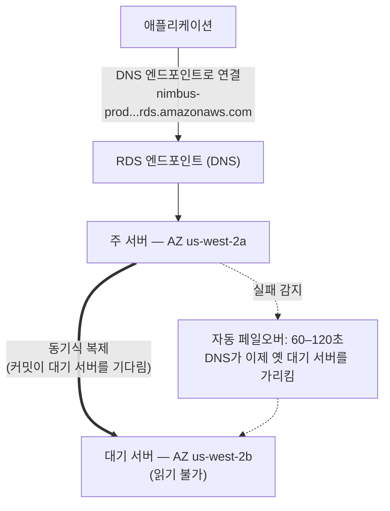

# 챕터 8: 결코 병가를 내지 않는 데이터베이스 관리자

알림이 들어온 것은 새벽 3시였습니다.

Priya가 유일하게 깨어 있었습니다. 그녀의 휴대폰이 협탁 위에서 켜졌고 그녀는 어둠 속에서, 화면 밝기가 너무 높은 채로 그것을 읽었습니다. 그녀는 일어나 앉았습니다. 기억으로 노트북을 찾아 불을 켜지 않고 열었습니다.

키보드가 어두운 방에서 조용히 딸깍거렸습니다.

데이터베이스 서버에 보안 패치가 필요했습니다 — 재시작이 필요한 종류의 것이요. 취약점은 실재했고, 패치는 사용 가능했으며, 고객을 방해하지 않고 그것을 적용할 수 있는 시간은 바로 지금, 한밤중, 트래픽이 낮을 때였습니다.

그녀는 서버에 연결했습니다. 패치를 가져왔습니다. 그것을 적용했습니다.

그런 다음 릴리스 노트를 읽었습니다.

패키지 업데이트가 PostgreSQL이 연결 매개변수를 정의하는 데 사용하는 구성 파일을 건드렸습니다. 릴리스 노트에는 경고가 포함되어 있었습니다: 업그레이드가 어떻게 수행되었는지에 따라, 사용자 정의된 구성 파일이 패키지의 기본 버전으로 교체될 수 있습니다.

그들의 구성 파일은 사용자 정의되어 있었습니다. Leo가 두 달 전에 max_connections 설정을 조정하기 위해 그것을 편집했습니다.

패치가 실행되었습니다. 서버가 재시작되었습니다. 데이터베이스가 다시 온라인이 되었습니다.

Priya가 쿼리를 테스트했습니다. 작동했습니다.

그녀는 로그를 확인했습니다. 모든 것이 정상으로 보였습니다.

그녀는 새벽 4시 15분에 다시 잠자리에 들었습니다.

오전 9시 5분, Leo가 애플리케이션을 열고 오류를 받았습니다. 그는 데이터베이스를 확인했습니다. Max connections가 기본값으로 설정되어 있었습니다: 100. 그들의 애플리케이션은 최대 500개의 연결 풀을 사용하도록 구성되어 있었습니다.

모든 새 연결 시도가 실패하고 있었습니다. 애플리케이션은 사실상 데이터베이스 접근을 잃었습니다.

"무슨 일이 일어난 거예요?" Maya가 물었습니다.

"패치요," Priya가 말했습니다. 그녀는 이미 구성 파일을 보고 있었습니다. "패키지 업데이트가 우리의 사용자 정의 구성 파일을 기본 것으로 덮어썼어요. Leo의 max_connections 조정이 그냥 사라졌어요 — 서버가 기본 설정으로 재시작했고 아무도 오류를 받지 않았어요. 그게 조용히 기본값으로 되돌아간 거예요."

"고치는 데 얼마나 걸려요?" Leo가 물었습니다.

"20분이요," Priya가 말했습니다. "하지만 유지관리 기간이 필요해요. 이건 구성 변경과 재시작이 필요해요."

"두 시간 후에 점심 영업을 여는 식당들이 있어요," Tom이 말했습니다.

Priya는 18분 만에 그것을 고쳤습니다. 유지관리 기간은 실제 다운타임 12분이었습니다. 식당들이 영향을 받았지만, 피크는 아직 시작되지 않았습니다.

아침에 그녀는 팀에게 무슨 일이 일어났는지 말했습니다. 침묵이 있었습니다.

"그건 또 일어날 거예요," Tom이 말했습니다.

"패치가 있을 때마다 일어날 거예요," Priya가 말했습니다. "그리고 패치는 항상 있어요. 이걸 하는 더 나은 방법이 있어야 해요."

8초의 쿼리 시간은 여전히 해결되지 않았습니다. 그리고 같은 주에, 이것: 아침 사고로 변한 새벽 3시 유지관리 기간. 두 문제는 같은 근본 원인을 가지고 있었습니다 — Nimbus는 그들이 관리할 장비를 갖추지 못한 데이터베이스를 돌리고 있었습니다.

해결책이 있었습니다. 그저 그들이 데이터베이스를 직접 관리해야 한다는 생각을 포기할 것을 요구했습니다.

**전통적인 데이터베이스 문제**

EC2 인스턴스에서 데이터베이스를 직접 돌릴 때, 모든 것에 책임이 있습니다.

데이터베이스 소프트웨어 설치. 안전하게 구성. 보안 취약점이 발견될 때 패치. 백업 수행. 백업이 실제로 작동하는지 테스트(대부분의 팀이 너무 늦을 때까지 건너뛰는 단계). 디스크 공간 모니터링. 이중화를 위한 복제 설정. 주 서버가 다운될 때를 위한 페일오버 구성. 쿼리 성능 조정. 부하 아래에서 연결 관리.

이 중 어느 것도 애플리케이션이 아닙니다. 이 중 어느 것도 기능을 더하지 않습니다. 이 모든 것이 전문 지식을 요구합니다.

전문 지식 요건이 핵심 문제입니다. 자격 있는 데이터베이스 관리자는 데이터베이스를 돌리는 법뿐만 아니라 다음을 어떻게 하는지도 이해합니다:

- 느린 쿼리 로그를 모니터링하고 성능 병목을 식별
- 디스크 I/O를 피하기 위해 작업 세트를 위한 메모리 크기 조정
- 특정 시점 복구를 위한 WAL 아카이빙 구성
- 자동 페일오버를 가진 동기식 스트리밍 복제 설정
- 부하 아래에서 연결 고갈을 방지하기 위한 연결 풀링 조정
- 데이터 손실이나 긴 다운타임 없이 메이저 버전 업그레이드 적용

이것은 별개의, 전문화된 기술 세트입니다. 시니어 DBA가 높은 급여를 받는 것은 바로 이 모든 것을 잘하는 것이 어렵기 때문입니다. 대부분의 스타트업은 그것을 위해 고용할 수 없습니다. 대부분의 개발 팀은 그것을 가지고 있지 않습니다.

대부분의 개발 팀은 데이터베이스 관리자가 아닙니다. 이것은 예측 가능한 패턴을 만듭니다: 데이터베이스가 설치되고, 최소한으로 구성되고, 그런 다음 무언가 재앙적으로 잘못될 때까지 대체로 잊혀집니다. Nimbus PostgreSQL 인스턴스는 기본 구성에서 돌아가고 있었습니다 — max_connections 100, 연결 풀링 없음, Leo가 두 번 돌리고 그런 다음 잊어버린 수동 백업, 그리고 복제 전혀 없음.

새벽 3시 패치 사고는 애플리케이션 구축에는 탁월하지만 데이터베이스 운영 배경이 없는 사람들이 운영하는 시스템의 증상이었습니다. 그것은 비판이 아닙니다 — 대부분의 스타트업에 대한 정확한 묘사입니다. 해결책은 DBA를 고용하는 것이 아닙니다. 해결책은 DBA 수준의 운영을 자동으로 제공하는 서비스를 사용하는 것입니다.

"그게 우리가 한 거예요?" Maya가 물었습니다.

Leo의 답은 침묵이었고, 그것은 예라는 것과 같았습니다.

**관리형 데이터베이스**

병가를 결코 내지 않고, 모든 보안 패치를 자동으로 처리하고, 요청받지 않아도 매일 밤 백업을 하고, 무언가 망가지면 스스로를 고치는 데이터베이스 관리자를 고용한다고 상상해 보십시오. 그들은 여러분을 귀찮게 하지 않고 이 모든 것을 합니다 — 그리고 어떤 상황에서도, 결코 여러분의 애플리케이션 로직을 건드리지 않습니다.

AWS는 이 서비스를 **RDS** — Relational Database Service — 라고 부릅니다.

RDS로, AWS는 다음을 관리합니다:

- 데이터베이스 엔진 설치 및 패치
- 자동 백업(S3에 저장, 최대 35일간 보관)
- 자동 페일오버(주 서버가 다운되면, 대기 서버가 자동으로 인계)
- 모니터링 및 지표
- 저장 시 및 전송 중 암호화
- 스토리지 자동 확장(활성화하면, 디스크가 가득 찰 때 커짐)

여러분은 다음을 관리합니다:

- 데이터베이스 스키마(테이블의 구조)
- 여러분의 쿼리와 애플리케이션 로직
- 누가 데이터베이스에 접근하는지
- 어느 인스턴스 유형이 데이터베이스를 돌리는지
- 매개변수 조정(다만 RDS가 합리적인 기본값을 제공함)

**지원되는 엔진**

RDS는 여러 인기 있는 데이터베이스 엔진을 지원합니다:

- **MySQL** — 가장 널리 사용되는 오픈소스 관계형 데이터베이스
- **PostgreSQL** — 강력하고, 확장 가능하며, 복잡한 워크로드에 점점 인기 있음
- **MariaDB** — 오픈소스 MySQL 포크, 완전 호환
- **Oracle** — 엔터프라이즈급, 레거시 요구 사항을 가진 대규모 조직에서 사용됨
- **Microsoft SQL Server** — Windows 중심 환경을 위한 것
- **Amazon Aurora** — 클라우드를 위해 구축된 AWS 자체 MySQL/PostgreSQL 호환 엔진
  (Aurora를 24장에서 깊이 다룹니다)

Nimbus의 경우, 선택은 PostgreSQL이었습니다. 그것은 Leo가 아는 것이었고, 관계형 데이터를 잘 처리했습니다. 엔진 선택은 대부분의 애플리케이션에서 여러분이 생각하는 것보다 덜 중요합니다 — RDS의 운영적 이점은 무엇이든 관계없이 적용됩니다.

한 가지 미묘한 점: RDS에서 엔진을 돌릴 때, AWS가 마이너 버전 패치를 자동으로 유지관리합니다(여러분이 구성한 유지관리 기간 동안). 메이저 버전 업그레이드 — 예를 들어 PostgreSQL 14에서 15로 가는 것 — 는 여러분이 일정을 잡고 실행하는 수동 작업입니다. AWS가 메이저 버전 업그레이드를 신중하게 테스트하지만, 여러분이 먼저 스테이징 환경에서 그것들을 테스트해야 합니다. 메이저 버전 변경은 특정 SQL 구문, 확장, 또는 드라이버 버전과의 호환성 문제를 도입할 수 있습니다.

Leo는 RDS가 마이너 패치를 적용하고 애플리케이션 로그가 서브 릴리스에서 제거된 함수에 대한 더 이상 사용되지 않음 경고를 잠시 보여 주었을 때 이것을 발견했습니다. 마이너 패치는 본질적으로 투명해야 합니다 — 하지만 각 유지관리 기간 후 애플리케이션 로그를 모니터링하는 것이 좋은 관행입니다.

"마이너 패치가 무언가를 망가뜨리면 무슨 일이 일어날지 생각해 봤어요?" Priya가 물었습니다.

"이전 스냅샷으로 롤백해요," Leo가 말했습니다.

"그게 얼마나 걸려요?"

Leo가 그들의 데이터베이스 크기에 대한 RDS 복원 시간을 찾아보았습니다. `db.m6i.large`의 50GB 데이터베이스의 경우: 스냅샷에서 복원하는 데 약 15에서 30분.

"그러니까 패치가 프로덕션을 망가뜨리면 15-에서-30분의 복구 기간이 있는 거네요," Priya가 말했습니다. "그리고 우리가 이른 아침 유지관리 기간에 패치를 적용하니까, 적어도 영향은 최소예요."

"그리고 우리가 먼저 스테이징에서 패치를 테스트하고요," Leo가 덧붙였습니다.

"네," Priya가 말했습니다. "그것도요."

**RDS 인스턴스 크기 조정: 모든 워크로드가 동등하지는 않다**

RDS 인스턴스를 만들 때, 인스턴스 유형을 선택합니다 — EC2와 같은 개념이지만, 데이터베이스 워크로드에 한정된 것이요. AWS는 RDS 인스턴스 유형을 몇 가지 유용한 계층으로 구성합니다.

**db.t3 패밀리**: 버스트 가능 성능 인스턴스. 지속적인 높은 CPU가 필요하지 않은 개발, 스테이징, 가벼운 프로덕션 워크로드를 위해 설계됨. `db.t3.micro`는 낮은 트래픽의 개발 데이터베이스에 적절합니다. `db.t3.medium`은 가끔의 버스트가 있는 적당한 프로덕션 부하를 처리합니다.

T 시리즈 인스턴스의 트레이드오프: 그것들은 낮은 가동률 기간 동안 CPU 크레딧을 축적하고 버스트 동안 그 크레딧을 씁니다. T 시리즈 인스턴스를 지속적인 높은 CPU로 돌리면, 크레딧을 소진하고 성능이 불충분할 수 있는 기준선으로 제한됩니다.

**db.m6i 패밀리**: 일관되고 버스트 불가능한 성능을 가진 범용 인스턴스. `db.m6i.large`는 프로덕션 데이터베이스의 흔한 출발점입니다. 이것들은 크레딧 한계가 없습니다 — CPU가 필요할 때마다 전체 용량으로 사용 가능합니다.

**db.r6i 패밀리**: 메모리 최적화 인스턴스. M 패밀리보다 vCPU당 더 많은 RAM. 큰 작업 세트를 가진 데이터베이스에 적절합니다 — 매 접근마다 디스크에서 가져오기보다 데이터가 메모리에 있음으로써 이득을 보는 쿼리. 데이터베이스 성능이 RAM을 추가할 때 극적으로 향상되면, R 패밀리가 올바른 선택입니다.

Nimbus의 경우:

- 개발 및 스테이징: `db.t3.medium`. 개발 쿼리에 적당, 낮은 비용.
- 프로덕션: `db.m6i.large`. 일관된 성능, 메뉴와 주문 작업 세트에 충분한 RAM, 크레딧 제한 없음.

"m6i.large가 t3.medium보다 얼마나 더 비싸?" Tom이 물었습니다.

Leo가 가격 페이지를 확인했습니다. `db.t3.medium`은 한 달에 약 55달러였습니다. `db.m6i.large`는 한 달에 약 140달러였습니다. 차이는 실재했지만, 신뢰성 차이도 그랬습니다.

"t3는 지속적인 부하 아래에서 제한될 거예요," Priya가 말했습니다. "바쁜 금요일에 CPU가 네 시간 동안 높게 유지되면, t3가 크레딧을 소진하고 제한돼요. m6i는 그러지 않고요."

Tom이 숫자를 적었습니다. 그는 또한 2주 전 금요일 장애의 비용을 적었습니다. 비교는 근소하지 않았습니다.

프로덕션은 `db.m6i.large`에 올라갔습니다.

**Multi-AZ: 인계하는 대기 서버**

이것이 신뢰성 계산을 완전히 바꾸는 기능입니다.

**Multi-AZ 배포**는 RDS가 주 서버와 다른 가용 영역에 동기식 대기 인스턴스를 유지한다는 것을 의미합니다. 주 서버에 커밋되는 모든 트랜잭션은 커밋이 확인되기 전에 대기 서버에 동기식으로 복제됩니다.

주 서버가 실패하면 — 하드웨어 고장, AZ 장애, 소프트웨어 충돌 — RDS가 자동으로 대기 서버로 페일오버합니다. 데이터베이스 엔드포인트의 DNS 레코드가 업데이트됩니다. 여러분의 애플리케이션이 새 주 서버에 다시 연결합니다.

페일오버는 60~120초가 걸립니다. 그 기간 동안, 여러분의 애플리케이션은 연결 오류를 경험할 것입니다. 제대로 작성된 애플리케이션은 이것을 우아하게 처리해야 합니다(백오프가 있는 연결 재시도).

대기 서버는 읽기 전용 복제본이 아닙니다. 그것은 읽기 트래픽을 제공하지 않습니다. 그것의 유일한 목적은 인계할 준비가 되어 있는 것입니다.



(참고: 더 새로운 **Multi-AZ DB Cluster** 배포 옵션은 *읽기 가능한* 대기 서버 *둘*을 유지하고 ~35초 만에 페일오버합니다 — 시험이 여기서 묘사된 고전적인 Multi-AZ *인스턴스* 배포와 그것을 구분할 수 있습니다.)

"Multi-AZ는 비용이 얼마나 들어?" Tom이 물었습니다.

대략 단일 인스턴스의 두 배 비용 — 말 그대로 두 개의 데이터베이스 인스턴스를 돌리고 있기 때문입니다. 대기 서버는 주 서버와 같은 비용이 듭니다.

Tom은 주문 기록을 열고 금요일 피크 동안 시간당 매출을 추정했습니다.

"그리고 페일오버 기간 동안 누군가 침입하려고 하면요?" Priya가 물었습니다. "주 서버가 다운되고 대기 서버가 승격되고 있을 때, 우리가 노출되는 60초가 있나요?"

"페일오버는 투명해요," Maya가 말했습니다. "하지만 질문은 타당해요. 연결 문자열은 하드코딩된 IP가 아니라 RDS 엔드포인트를 사용해야 해요 — 그렇지 않으면 페일오버가 매끄럽지 않을 거예요."

Multi-AZ가 그날 오후 활성화되었습니다.

**자동 백업과 특정 시점 복구**

RDS는 매일 자동 백업을 합니다. AWS는 이 백업을 S3에 저장합니다(RDS가 관리 — 여러분의 S3 콘솔에서 직접 보지 못합니다). 백업 보존 기간 내 어느 시점으로든 데이터베이스를 복원할 수 있습니다.

백업은 구성 가능한 **백업 기간(backup window)** 동안 일어납니다 — 낮은 트래픽 기간, 일반적으로 이른 아침. (이것은 RDS가 패치와 구성 변경을 적용하는 **유지관리 기간(maintenance window)**과 별개의 설정입니다. 시험은 이것들이 두 개의 다른 기간이라는 것을 테스트하기를 좋아합니다.) 대부분의 엔진 유형에서, 백업은 다운타임을 일으키지 않습니다 — 그리고 Multi-AZ 배포에서는, 스냅샷이 대기 서버에서 찍히므로, 주 서버는 전혀 건드려지지 않습니다.

**특정 시점 복구(Point-in-time recovery)**는 가장 가치 있는 기능 중 하나입니다: 보존 기간 내 어느 초로든 복원할 수 있습니다. 매일 스냅샷만이 아니라 — *어느 초로든*. 이것은 RDS가 매일 백업에 더해 트랜잭션 로그를 지속적으로 아카이브하기 때문에 가능합니다.

누군가 오후 2시 37분에 실수로 `DELETE FROM orders WHERE 1=1`을 실행하면, 오후 2시 36분으로 복원할 수 있습니다.

Leo는 이것을 이해했을 때 눈에 띄게 긴장을 풀었습니다.

"백업 보존을 이미 하루로 설정했어요," Leo가 말했습니다. "어 — 그래도 괜찮죠? 바꿀 수 있죠?"

"최소 7일로 바꿔요," Priya가 말했습니다. "프로덕션은 30일로."

Leo가 즉시 그것을 업데이트했습니다.

"지난달에 내가 삭제한 것에서 복구할 수 있었을까요?" 그가 물었습니다.

"RDS 전에는? 아니요," Priya가 말했습니다. "RDS 후에는? 예."

이런 생각이 들 수도 있습니다: 자동 백업과 수동 스냅샷의 차이는 무엇인가? 자동 백업은 보존 기간이 만료될 때 삭제됩니다(최대 35일). 수동 스냅샷은 여러분이 명시적으로 삭제할 때까지 무기한 보관됩니다. 데이터베이스 상태를 영구적으로 보존해야 한다면 — 메이저 마이그레이션 전에, 위험한 배포 전에 — 수동 스냅샷을 찍으십시오.

**RDS Proxy: 대규모에서 연결 문제 해결하기**

RDS로 마이그레이션한 지 2주 후, Leo가 지표에서 무언가를 알아챘습니다.

데이터베이스는 쿼리를 잘 처리하고 있었습니다. 하지만 열린 연결의 수가 높았습니다 — 그가 예상한 것보다 높았습니다. Auto Scaling Group이 피크 동안 EC2 인스턴스를 추가하면서, 각 새 인스턴스가 자기 데이터베이스 연결 풀을 열었습니다. EC2 인스턴스 열 개, 각각 50개의 연결 풀: 데이터베이스에 대한 동시 연결 500개.

"PostgreSQL은 각 연결에 대한 오버헤드가 있어요," Priya가 말했습니다. "메모리, 연결 핸들러를 위한 CPU. 500개의 연결은 실제 작업을 하기도 전에 — 그저 연결 관리를 위해 데이터베이스 리소스의 의미 있는 양을 사용해요."

"연결 풀 크기를 줄일 수 있어요?" Leo가 물었습니다.

"줄일 수 있어요," Priya가 말했습니다. "하지만 그러면 피크 동안 요청이 연결을 기다리며 대기열에 쌓일 위험이 있어요."

더 나은 해결책: **RDS Proxy**.

RDS Proxy는 애플리케이션과 데이터베이스 사이에 앉습니다. EC2 인스턴스가 RDS 인스턴스에 직접이 아니라 Proxy에 연결합니다. Proxy는 데이터베이스 연결 풀을 유지하고 애플리케이션 요청을 그것들에 걸쳐 다중화합니다. EC2 인스턴스 열 개가 각각 Proxy에 50개의 연결을 열면, Proxy는 실제 데이터베이스 연결을 100개만 유지할 수도 있습니다 — 모든 애플리케이션 요청에 걸쳐 그것들을 효율적으로 공유하면서요.

이점:

**연결 풀링**: 더 적은 실제 데이터베이스 연결은 RDS 인스턴스에 더 적은 메모리 오버헤드와 부하 아래에서 더 나은 성능을 의미합니다.

**더 빠른 페일오버**: Multi-AZ 페일오버 동안, Proxy는 백엔드에서 데이터베이스 연결을 다시 설정하는 동안 애플리케이션 측의 연결을 유지합니다. 애플리케이션은 완전한 연결 재설정이 아니라 짧은 일시 정지를 봅니다. RDS Proxy는 페일오버 영향을 60~120초에서 일반적으로 30초 이하로 줄입니다.

**IAM 인증**: 애플리케이션에 데이터베이스 자격 증명을 포함하는 대신, 애플리케이션이 IAM 역할을 사용해 RDS Proxy에 인증할 수 있습니다. Proxy가 실제 데이터베이스 자격 증명을 처리합니다. 이것은 애플리케이션 환경에서 비밀을 완전히 없앱니다.

"RDS Proxy는 비용이 얼마나 들어?" Tom이 물었습니다.

그것은 기반 RDS 인스턴스의 vCPU 시간당 대략 0.015달러로, 인스턴스 자체와 별도로 청구됩니다. `db.m6i.large`(2 vCPU)의 경우, Proxy가 한 달에 약 22달러를 더합니다.

Tom은 연결 수 그래프 — 피크 동안 데이터베이스 리소스를 두고 경쟁하는 연결 500개 — 를 보고, 월 22달러 비용을 보았습니다.

"그건 연결 오버헤드를 처리하기 위해 더 큰 RDS 인스턴스로 업그레이드하는 것보다 저렴해요," 그가 말했습니다.

RDS Proxy가 그 주에 활성화되었습니다.

"그리고 누군가 Proxy를 통해 침입하려고 하면요?" Priya가 물었습니다. "Proxy를 위한 IAM 인증이 공격 표면을 줄이나요?"

"네," Priya가 자기 질문에 답했습니다. "애플리케이션 환경에 데이터베이스 자격 증명이 없다는 것은 애플리케이션에서 훔칠 데이터베이스 자격 증명이 없다는 뜻이에요."

그녀는 Proxy를 위한 IAM 인증을 활성화했습니다.

**읽기 전용 복제본: 읽기 트래픽 확장하기**

Multi-AZ는 가용성에 관한 것입니다. **읽기 전용 복제본(read replicas)**은 성능에 관한 것입니다.

읽기 전용 복제본은 읽기 쿼리를 제공할 수 있는, 주 데이터베이스의 비동기 복사본입니다. 주요 RDS 엔진 — MySQL, PostgreSQL, MariaDB — 에 대해 최대 15개의 읽기 전용 복제본을 가질 수 있습니다(Aurora도 같은 스토리지 볼륨을 공유하며 최대 15개의 Aurora 복제본을 지원합니다).

애플리케이션은 읽기 쿼리를 복제본으로, 쓰기 쿼리를 주 서버로 보내도록 수정됩니다. 이것은 부하를 분산합니다: 주 서버가 쓰기와 복잡한 트랜잭션을 처리하고; 복제본이 읽기를 처리합니다.

핵심 특성:

- 복제는 **비동기적**입니다 — 주 서버와 복제본 사이에 작은 지연(랙)이 있을 수
  있습니다. 레코드를 쓰고 즉시 복제본에서 읽으면, 아직 그것을 보지
  못할 수도 있습니다.
- 읽기 전용 복제본은 같은 리전이나 다른 리전에 있을 수 있습니다(리전 간
  복제본은 지연 시간을 더하지만 지리적 분산을 가능하게 합니다).
- 읽기 전용 복제본은 재해 시나리오에서 독립형 데이터베이스로 승격될 수 있습니다.

Nimbus의 경우: 메뉴 조회는 읽기입니다. 주문 기록은 읽기입니다. 트래픽의 대다수가 읽기 트래픽입니다. 읽기 전용 복제본을 추가하고 읽기를 그것으로 라우팅하면 주 데이터베이스 부하를 상당히 줄입니다.

읽기 전용 복제본을 24장에서 Aurora를 논의할 때 더 철저히 다룹니다.

**읽기가 많다면 복제본을 추가하되 랙을 주시하라**

워크로드가 읽기 중심이면, 읽기 전용 복제본을 추가하는 것이 주 서버의 부하를 줄이고 쿼리 성능을 향상시킵니다 — 하지만 복제는 비동기적이고, 이는 복제본이 주 서버보다 약간 뒤처질 수 있다는 뜻입니다. 애플리케이션이 레코드를 쓰고 즉시 그것을 다시 읽으면, 복제본이 아니라 주 서버에서 읽어야 합니다. 이것을 잘못하면 미묘하고, 디버깅하기 어려운 데이터 신선도 버그를 만듭니다: 사용자가 주문을 하고, 확인 페이지가 복제본을 쿼리하고, 복제본이 아직 따라잡지 못해, 주문이 누락된 것처럼 보입니다. 이것은 읽기-후-쓰기 일관성(read-your-writes consistency)이라고 불리며, 팀이 복제본을 처음 추가할 때 저지르는 가장 흔한 실수입니다.

**Performance Insights: 느린 쿼리 찾기**

8초의 메뉴 로드 시간은 여전히 문제였습니다. RDS로의 이동이 신뢰성을 향상시켰지만, 쿼리는 여전히 느렸습니다.

Leo가 읽기 전용 복제본을 추가하고 메뉴 쿼리를 그것으로 라우팅했습니다. 메뉴 로드 시간이 약 4초로 떨어졌습니다. 더 나았습니다. 여전히 좋지는 않았습니다.

"쿼리가 여전히 느려요," Maya가 말했습니다. "병목을 개선했지만, 그걸 고치지는 못했어요."

RDS에는 **Performance Insights**라는 기능이 포함되어 있습니다 — 어떤 쿼리가 가장 많은 데이터베이스 리소스를 소비하는지, 어떤 세션이 기다리고 있는지, 그것들이 무엇을 기다리는지 보여 주는 모니터링 도구입니다.

Leo가 읽기 전용 복제본에서 Performance Insights를 활성화하고 오후 테스트 세션 동안 메뉴 페이지를 반복적으로 로드했습니다.

Performance Insights 대시보드는 부하를 지배하는 쿼리 하나를 보여 주었습니다: 메뉴 페이지가 로드될 때마다 모든 22,000개 행을 가져오는 `menu_items` 테이블의 전체 테이블 스캔. 애플리케이션이 필터링하던 열인 `restaurant_id`에 인덱스가 없었습니다.

인덱스 없이 실행 시간: 8.2초.

Leo가 인덱스를 추가했습니다.

```sql
CREATE INDEX idx_menu_items_restaurant_id ON menu_items(restaurant_id);
```

인덱스로 실행 시간: 14밀리초.

8,200밀리초에서 14밀리초로. 고객을 쫓아내는 식당 주문 앱과 그들이 생각 없이 사용하는 앱의 차이.

"그게 그동안 문제였어요?" Maya가 말했습니다.

"그게 문제였어요," Leo가 말했습니다.

"그리고 Performance Insights가 그걸 얼마 만에 찾았어요?"

"약 20분이요."

Tom은 이미 계산하고 있었습니다. 3주간의 차선책 메뉴 로드 시간, 그 기간 동안 추정 20만 회의 메뉴 페이지 로드, 느림으로 인한 추정 15% 이탈. 그가 도달한 숫자는 불편했습니다.

"다음에는 출시 전에 빠진 인덱스를 추가해요," 그가 말했습니다.

"체크리스트가 있을 거예요," Priya가 말했습니다. 그녀는 이미 그것을 쓰고 있었습니다.

**RDS를 사용하지 않을 때**

RDS는 광범위한 관계형 데이터베이스 워크로드에 탁월합니다. 그것이 모든 것에 올바른 답인 것은 아닙니다.

**OS 수준 접근이 필요할 때**: RDS는 기반 운영체제에 대한 접근을 주지 않습니다. 사용자 정의 OS 패키지를 설치하거나, 커널 매개변수를 수정하거나, 데이터베이스 서버에 루트 접근이 필요한 도구를 실행할 수 없습니다. 데이터베이스에 OS 접근을 요구하는 요구 사항이 있다면 — 특정 Oracle 구성, 사용자 정의 스토리지 드라이버, 특정 네트워크 인터페이스 — 데이터베이스를 EC2 인스턴스에서 직접 돌려야 합니다.

**지원되지 않는 엔진을 사용할 때**: RDS는 MySQL, PostgreSQL, MariaDB, Oracle, SQL Server, Aurora를 지원합니다. 애플리케이션이 다른 데이터베이스 엔진을 사용하면 — CockroachDB, SingleStore, Greenplum — RDS가 아니라 EC2에서 그것을 돌립니다.

**쓰기가 많은 수평 확장이 필요할 때**: RDS는 복제본을 통해 읽기를 확장합니다. 쓰기는 하나의 주 인스턴스로 갑니다. 워크로드가 쓰기 중심이고 여러 쓰기 노드에 걸쳐 분산되어야 한다면, RDS는 올바른 아키텍처가 아닙니다. Aurora의 Global Database가 대규모에서 도움이 될 수 있지만, 극단적인 쓰기 규모 요구 사항에는, DynamoDB(9장)나 EC2에서 돌아가는 CockroachDB 같은 분산 데이터베이스가 적절한 도구입니다.

**관리형 비용이 운영 비용을 초과할 때**: 팀이 진정한 데이터베이스 관리 전문 지식을 가진 매우 크고 안정적인 워크로드의 경우, 자기 도구로 EC2에서 PostgreSQL을 돌리는 것이 RDS보다 저렴할 수 있습니다. 이것은 주로 DBA 조직이 아닌 팀에게는 드뭅니다. 하지만 그것은 실재하고, 좋은 아키텍트는 그것을 인정합니다.

Nimbus의 경우 — 전담 DBA 리소스가 없고, 관리형 서비스에서 PostgreSQL을 돌리고, 예측 불가능한 성장을 가진 스타트업 — RDS가 명백히 올바른 선택이었습니다.

**RDS 파라미터 그룹과 옵션 그룹**

시험에 나오는 두 가지 구성 메커니즘:

**파라미터 그룹(Parameter groups)**은 데이터베이스 엔진 설정을 제어합니다 — 최대 연결, 쿼리 캐시 크기, 시간 초과 값 같은 것. RDS는 대부분의 경우에 작동하는 기본 파라미터 그룹을 만듭니다. 특정 설정을 조정해야 할 때 사용자 정의 파라미터 그룹을 만듭니다.

**옵션 그룹(Option groups)**은 일부 엔진에 대한 추가 기능을 활성화합니다 — Oracle의 네이티브 네트워크 암호화나 SQL Server의 투명 데이터 암호화 같은 것. 대부분의 오픈소스 엔진 배포는 사용자 정의 옵션 그룹이 필요하지 않습니다.

이 메커니즘을 통해 데이터베이스 엔진의 동작을 사용자 정의할 수 있습니다 — 하지만 기본값이 막 시작하는 대부분의 팀에게 작동합니다.

### 데이터 넣기: AWS Database Migration Service

몇 주 후, Tom이 슬라이드를 들고 스탠드업에 도착했습니다.

Nimbus가 작은 지역 경쟁사를 인수하고 있었습니다. 그들의 주문 시스템은 코로케이션 시설의 MySQL 데이터베이스에서 돌아갔습니다. 시스템은 마이그레이션 동안 오프라인이 될 수 없었습니다 — 식당들이 그것을 사용하고 있었습니다.

"우리는 그들의 데이터를 RDS로 옮겨야 해요," Tom이 말했습니다. "시스템을 다운시키지 않고요."

"데이터베이스가 얼마나 커요?" Leo가 물었습니다.

"약 80기가바이트요."

"그들이 언제 전환해야 해요?"

"6주요."

Priya는 이미 문서를 띄워 두었습니다. "AWS DMS요," 그녀가 말했습니다.

**AWS DMS(Database Migration Service)**는 최소한의 다운타임으로 소스 데이터베이스에서 대상 데이터베이스로 데이터를 옮깁니다. 그것은 두 단계로 마이그레이션을 처리합니다: 기존 데이터의 전체 로드, 그리고 소스가 계속 돌아가는 동안 변경의 지속적인 복제.

두 가지 마이그레이션 유형이 있습니다:

**동종 마이그레이션(Homogeneous migration):** 소스와 대상이 같은 엔진 — MySQL에서 RDS MySQL로, PostgreSQL에서 Aurora PostgreSQL로. 스키마가 호환됩니다; DMS가 데이터를 직접 마이그레이션합니다.

**이종 마이그레이션(Heterogeneous migration):** 소스와 대상이 다른 엔진 — Oracle에서 Aurora PostgreSQL로, SQL Server에서 RDS MySQL로. 스키마를 먼저 변환해야 합니다. 이것은 스키마를 번역하는 **AWS Schema Conversion Tool(SCT)**, 그런 다음 데이터를 옮기는 DMS를 요구합니다.

Nimbus 인수의 경우: MySQL에서 RDS MySQL로. 동종. SCT 불필요.

실제로 작동하는 방법:

1. DMS가 소스 — 코로케이션 MySQL 데이터베이스 — 에서 읽음
2. **전체 로드**: DMS가 모든 기존 데이터를 대상 RDS 인스턴스로 복사
3. **CDC(Change Data Capture)**: 전체 로드 후, DMS가 소스 데이터베이스의 트랜잭션 로그를 읽고 진행 중인 변경을 대상에 거의 실시간으로 복제
4. 소스가 계속 돌아감. 팀이 준비되면, 연결 문자열을 전환합니다.

"그러니까 식당 주문 시스템이 내내 라이브로 유지되는 거네요?" Tom이 물었습니다.

"내내요," Priya가 확인했습니다. "소스와 대상이 CDC를 통해 동기화 상태로 유지돼요. 우리가 준비되면, 엔드포인트를 전환해요. 다운타임은 그 변경이 전파되는 데 걸리는 초예요."

DMS는 수십 가지 소스와 대상 조합을 지원합니다: Oracle, SQL Server, MySQL, PostgreSQL, MongoDB, DynamoDB, S3, Redshift, Aurora, 그리고 더.

"잠깐 — 그런데 *왜* 이종 마이그레이션에 별도의 도구가 필요해요?" Maya가 물었습니다. "DMS가 그냥 스키마 차이를 알아낼 수 없어요?"

"Oracle의 VARCHAR는 PostgreSQL의 VARCHAR와 같지 않아요," Priya가 말했습니다. "데이터 유형, 저장 프로시저, 시퀀스, 독점 함수 — 그것들은 일대일로 매핑되지 않아요. SCT가 소스 스키마를 분석하고 대상을 위한 가장 가까운 등가물을 생성해요. 그런 다음 DMS가 그 변환된 스키마로 데이터를 옮기고요. 스키마 변환을 데이터 이동에서 분리하는 것이 과정을 신뢰할 수 있게 만드는 거예요."

"그리고 누군가 DMS 복제 인스턴스를 통해 침입하려고 하면요?" Priya가 잠시 후 자신에게 물었습니다. "그건 소스에 대한 읽기 접근과 대상에 대한 쓰기 접근이 필요해요."

"양쪽 끝에 최소 권한이요," Leo가 말했습니다. "소스에 읽기 전용 IAM. 마이그레이션 대상에만 범위가 정해진 쓰기 접근. 그리고 복제 인스턴스는 프라이빗 서브넷에 머물러요."

Priya가 그것을 적었습니다.

## 강점과 한계

**RDS가 탁월한 이유**:

- 데이터베이스 소프트웨어 관리의 운영 부담을 없앰
- 자동 백업과 특정 시점 복구
- 최소한의 RTO로 자동 페일오버를 위한 Multi-AZ
- 읽기 트래픽 확장을 위한 읽기 전용 복제본
- 저장 시 및 전송 중 암호화 내장
- 모든 주요 관계형 데이터베이스 엔진 지원
- 연결 풀링과 향상된 페일오버 응답을 위한 RDS Proxy

**RDS에 한계가 있는 곳**:

- 기반 OS에 접근할 수 없습니다. 데이터베이스에 OS 수준 접근을 요구하는 요구 사항이
  있다면, 자기 EC2 기반 데이터베이스를 돌려야 할 수 있습니다.
- RDS는 서버리스가 아닙니다(예외 있음 — Aurora Serverless가 존재함,
  24장에서 다룸). 유휴 상태라도 돌아가는 인스턴스에 대해 비용을 냅니다.
- RDS는 수평 샤딩된 데이터베이스를 위해 설계되지 않았습니다. 쓰기 중심 관계형
  워크로드의 대규모 확장에는, 결국 다른 아키텍처가 필요할 수 있습니다.
- 비관계형(NoSQL) 데이터 패턴에는, DynamoDB(9장)가 더 적절합니다.

## 요약

Priya의 새벽 3시 패치 기간이 증상이었습니다. 근본 원인은 Nimbus가 관리형 서비스가 더 잘 처리할 수 있는 데이터베이스를 관리하고 있었다는 것입니다. RDS는 단지 새벽 3시 기상 전화를 없애는 게 아닙니다 — 그것은 패치, 페일오버, 백업, 연결 관리에 대한 책임을 AWS로 이전하여, 팀이 실제로 고객에게 서비스하는 애플리케이션 코드에 집중하도록 해방합니다. 트레이드오프는 OS 수준 접근의 상실인데, 그것은 드물게 중요하고 들리는 것보다 훨씬 덜 중요합니다.

- **Amazon RDS**는 관리형 관계형 데이터베이스 서비스입니다. AWS가 패치, 백업, 페일오버, 스토리지를 처리합니다. 여러분이 스키마, 쿼리, 애플리케이션 로직을 처리합니다.
- **Multi-AZ**는 다른 AZ에 동기식 대기 서버를 유지합니다. 자동 페일오버가 60~120초 안에 일어납니다. 페일오버가 투명하도록 연결 문자열에는 하드코딩된 IP가 아니라 — 항상 RDS 엔드포인트 DNS 이름을 사용하십시오.
- **읽기 전용 복제본**은 읽기 트래픽을 제공하는 비동기 복사본입니다. 복제 랙은 그것들이 약간 뒤처질 수 있다는 뜻입니다 — 읽기-후-쓰기 일관성은 쓰기 직후에 주 서버에서 읽을 것을 요구합니다.
- **RDS Proxy**는 연결을 풀링하여, 오버헤드를 줄이고 페일오버 속도를 향상시킵니다. 수천 개의 수명이 짧은 연결을 만들 수 있는 Lambda 기반 워크로드에 결정적입니다.
- **Performance Insights**는 느린 쿼리를 식별합니다 — 빠진 인덱스를 찾는 것이 8초 쿼리를 14밀리초짜리로 바꿀 수 있습니다. 메이저 버전 업그레이드는 수동입니다; 먼저 스테이징에서 테스트하십시오.

## 시험 팁

*SAA-C03 도메인 3 — 태스크 3.3 (데이터베이스 솔루션)*

- **Multi-AZ는 성능이 아니라 고가용성을 위한 것입니다.** 대기 서버는 읽기 트래픽을
  제공하지 않습니다. 읽기 전용 복제본이 성능을 위한 것입니다. 이 구분이 자주 테스트됩니다.
- **Multi-AZ 페일오버는 자동입니다.** 언제 또는 어떻게 일어나는지 구성하지 않습니다.
  RDS가 주 서버를 모니터링하고 페일오버를 자동으로 트리거합니다.
- **복제 랙이 중요합니다.** 읽기 전용 복제본은 주 서버보다 약간 뒤처질 수 있습니다.
  애플리케이션이 방금 쓴 데이터를 읽어야 한다면, 복제본이 아니라
  주 서버에서 읽어야 합니다. 이것을 "읽기-후-쓰기 일관성"이라고 합니다.
- **자동 백업은 0~35일간 보관됩니다.** 보존을 0으로 설정하면
  자동 백업이 비활성화됩니다. 수동 스냅샷은 여러분이 삭제할 때까지 무기한
  보관됩니다.
- **RDS 스토리지 자동 확장**은 디스크 가득 참 장애를 방지합니다. 그것을 활성화하십시오. 그것은 위로만
  확장하고, 결코 아래로는 안 합니다. 시험이 여러분이 이 비대칭을 아는지 테스트할 수 있습니다.
- **RDS Proxy**는 Lambda 함수가 RDS에 연결되는 것을 수반하는 시험 시나리오
  (Lambda는 수천 개의 수명이 짧은 연결을 만들 수 있고, 이는 Proxy 없이 데이터베이스를
  압도합니다), 또는 더 빠른 Multi-AZ 페일오버를 요구하는 시나리오에 나옵니다.
- **db.t3 인스턴스는 버스트하고 제한됩니다.** 작은 RDS 인스턴스의 간헐적
  성능 저하를 묘사하는 시험 시나리오는 T 시리즈 인스턴스의 CPU 크레딧 고갈을
  묘사하고 있을 수 있습니다. 수정은 M이나 R 시리즈 인스턴스로 업그레이드하는 것입니다.
- **Multi-AZ DNS 엔드포인트**: Multi-AZ 페일오버가 일어나면, RDS 엔드포인트 DNS
  레코드가 새 주 서버를 가리키도록 업데이트됩니다. RDS 엔드포인트를 사용하는 애플리케이션은
  (하드코딩된 IP가 아니라) 자동으로 다시 연결합니다. 긴 DNS TTL이나
  하드코딩된 IP 주소를 가진 애플리케이션은 자동으로 다시 연결하지 않습니다. 항상 RDS 엔드포인트를 사용하십시오.
- **읽기 전용 복제본 승격**: 읽기 전용 복제본은 독립형 DB 인스턴스로 승격될 수 있습니다
  — 주 서버를 잃고 Multi-AZ가 구성되지 않았을 때 재해 복구에 유용합니다.
  승격은 일방향 작업입니다: 복제본이 주 서버가 되고 더 이상 원본에서
  복제하지 않습니다. "수동으로 승격" 또는 "읽기 전용 복제본을 주 서버로 변환"에 대해 묻는
  시험 시나리오는 이 작업을 수반합니다.
- **Performance Insights**는 대기 시간과 CPU 사용량으로 상위 SQL 쿼리를 식별합니다.
  시험 시나리오가 RDS 데이터베이스의 느린 쿼리를 어떻게 진단하는지 물으면, Performance
  Insights가 AWS 네이티브 답입니다.
- **RDS 대 EC2에서 데이터베이스 돌리기**: 시험이 가끔 이것을 선택으로 제시합니다.
  RDS는 관리형 운영을 제공하지만 OS 수준 접근을 제한합니다. EC2 기반 데이터베이스는
  완전한 제어를 주지만 운영에 DBA 전문 지식이 필요합니다. 시험 시나리오의 "OS 수준 접근 필요"
  문구는 RDS보다 EC2를 선택하라는 신호입니다.
- **AWS DMS:** 전체 로드 + CDC를 사용해 최소한의 다운타임으로 데이터베이스를 마이그레이션합니다. 동종(같은 엔진) = DMS 직접. 이종(다른 엔진) = SCT로 스키마를 먼저 변환한 다음, DMS로 데이터를 옮김. 시험 트리거: "최소한의 다운타임으로 데이터베이스 마이그레이션" 또는 "Oracle에서 Aurora로" → DMS + SCT.

## 연습문제

**연습 1 — 복습**

여러분 자신의 말로: RDS에서 Multi-AZ와 읽기 전용 복제본의 차이는 무엇입니까?
각각이 어떤 문제를 해결합니까?

*(힌트: 하나는 다운타임으로부터 보호하고; 다른 하나는 읽기 중심 부하 아래에서
성능을 향상시킵니다. 그것들은 서로 다른 문제를 해결하고 함께 사용될 수 있습니다.)*

**연습 2 — SAA-C03 시나리오**

*시나리오*: 한 회사가 RDS에서 프로덕션 PostgreSQL 데이터베이스를 돌립니다. 데이터베이스는
하루 종일 실행되는 보고 쿼리로 인해 높은 읽기 트래픽을 경험합니다.
팀은 또한 데이터베이스 가용성을 우려합니다 — 그들은 실패 시나리오에서 몇 분
이상의 다운타임을 감당할 수 없습니다. 그들은 보고 워크로드로부터 주
데이터베이스에 대한 영향을 최소화하고 싶어 합니다.

다음 중 두 우려 모두를 가장 잘 해결하는 RDS 기능의 조합은 무엇입니까?

A) Multi-AZ를 활성화하고 모든 쿼리를 대기 인스턴스에 대해 실행한다  
B) 더 자주 수동 스냅샷을 찍고 주 서버가 실패하면 그것들로부터 복원한다  
C) 여러 읽기 전용 복제본을 만들고 비용을 줄이기 위해 Multi-AZ를 비활성화한다  
D) 페일오버 보호를 위해 Multi-AZ를 활성화하고 보고 쿼리를 위한 읽기 전용 복제본을 만든다

**힌트 1**: 두 요구 사항은: (1) 실패 동안의 가용성, (2) 읽기 떠넘기기. 어떤
기능이 어떤 요구 사항을 해결합니까?

**힌트 2**: Multi-AZ는 자동 페일오버를 제공합니다. 대기 서버는 읽기 트래픽을 제공하지 않습니다.
그래서 Multi-AZ 단독으로는 읽기 문제에 도움이 되지 않습니다.

**힌트 3**: 읽기 전용 복제본이 읽기 트래픽을 제공합니다. Multi-AZ가 페일오버를 제공합니다. 둘 다 필요합니다.

**정답**: D

**설명**: Multi-AZ는 다른 AZ의 대기 서버로 자동 페일오버를 제공합니다 —
이것이 가용성 요구 사항을 해결합니다. 읽기 전용 복제본은 보고 쿼리가
주 데이터베이스에 영향을 주지 않고 실행되게 합니다 — 이것이 성능
요구 사항을 해결합니다. 두 기능 모두 동시에 사용될 수 있습니다.

**왜 A가 아닌가?** Multi-AZ 대기 서버는 읽기 트래픽을 제공할 수 없습니다. 그것은 오로지
페일오버를 위한 것입니다. 그것을 직접 쿼리하려는 시도는 지원되지 않습니다.

**왜 B가 아닌가?** 수동 스냅샷은 데이터베이스의 전체 복사본을 복원합니다 — 훨씬 더 긴
과정(큰 데이터베이스의 경우 잠재적으로 몇 시간). 이것은 "몇 분의
다운타임" 요구 사항을 충족하지 못합니다.

**왜 C가 아닌가?** 읽기 전용 복제본은 읽기 성능에 도움이 되지만 자동
페일오버를 제공하지 않습니다. 주 서버가 실패하면, 읽기 전용 복제본을 수동으로 승격해야 할 것입니다 —
시간이 걸리고 자동이 아닙니다.

*SAA-C03 도메인 3 — 태스크 3.3*

**연습 3 — 아키텍처 도전 과제** *(선택)*

Nimbus는 기존의 자체 관리형 PostgreSQL 데이터베이스(EC2 인스턴스에서 돌아가는)를
RDS PostgreSQL로 마이그레이션하는 것을 고려하고 있습니다. 마이그레이션은 최소한의
다운타임으로 일어나야 합니다 — 이상적으로는 15분 미만. 데이터베이스는 200GB입니다.

어떤 접근 방식을 추천하겠습니까? 어떤 AWS 서비스가 마이그레이션에 도움이 될 수 있습니까?
프로덕션 트래픽을 전환하기 전에 어떤 위험을 테스트하겠습니까?

*(단 하나의 정답은 없습니다. AWS Database Migration Service, 논리적 복제,
그리고 전환 동안의 데이터 불일치 위험에 대해 생각해 보십시오.)*

## 포스트 크레딧 장면

하루가 끝날 무렵, Nimbus는 Multi-AZ가 활성화된 RDS PostgreSQL로 마이그레이션했습니다.
마이그레이션 자체는 오후 대부분이 걸렸습니다 — Leo는 짧은 유지관리 기간과 함께
백업-후-복원 접근 방식을 사용했습니다.

Tom은 청구서를 주의 깊게 지켜보았습니다.

"RDS 인스턴스가," 그가 말했습니다. "EC2 데이터베이스의 두 배 비용이 들어요."

"그리고 자동 백업은요?" Maya가 물었습니다.

"조금 더요."

"그리고 주 서버가 죽으면 공짜로 얻을 페일오버는요?"

Tom에게는 그것에 대한 가격이 없었습니다. 그는 그것을 질문으로 적었습니다.

3일 후, 데이터베이스는 건강했습니다. Leo가 빠진 인덱스를 추가한 후 쿼리 시간이 극적으로 떨어졌습니다. 메뉴가 1초 이내에 로드되었습니다.

"문제는," Priya가 말했습니다. "데이터베이스 엔진이 아니에요. 데이터 모델이에요."

그녀가 멈췄습니다.

"이 데이터 중 일부는 관계형이 전혀 아니에요. 메뉴 항목, 식당 프로필,
배달 구역 — 이 데이터는 가변적인 형태를 가져요. SQL이 우리와 싸우고 있어요."

Leo는 이미 무언가를 연구하고 있었습니다.

"메뉴에 다른 종류의 데이터베이스를 쓰면 어때요?" 그가 말했습니다.

다음 챕터에서: 백만 명이 한꺼번에 주문해도 느려지지 않는 데이터베이스.
