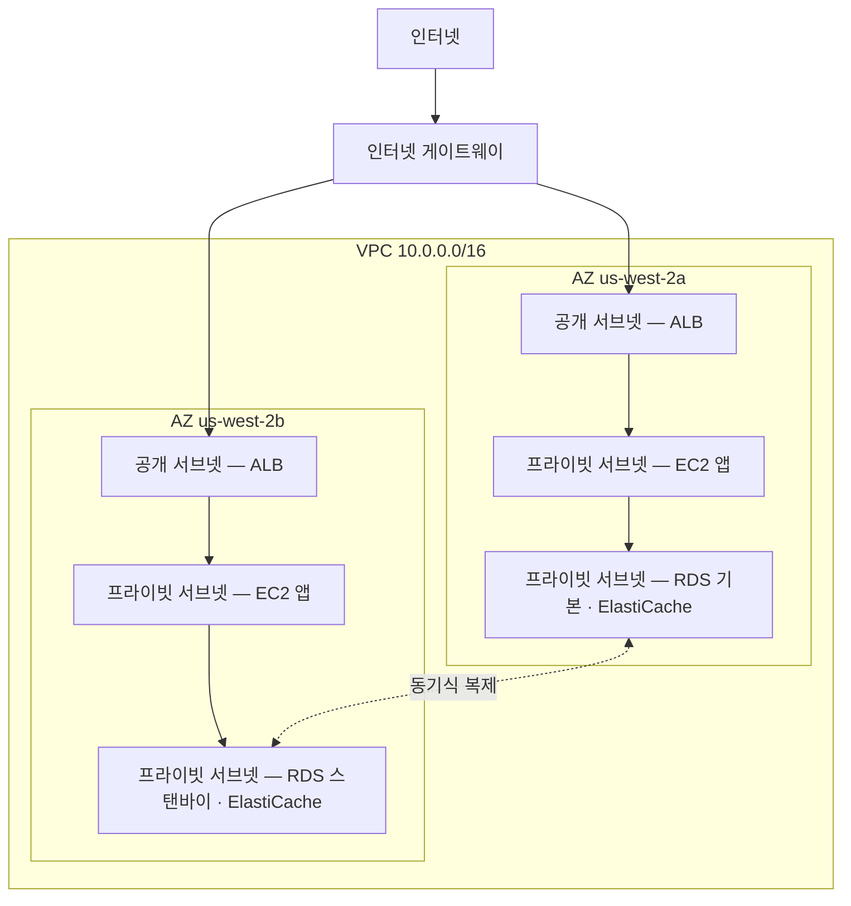

# 11장: 클라우드의 프라이빗 공간

Priya에게는 그림이 그려진 종이 한 장이 있었다.

복잡한 그림이 아니었다. 하나의 사각형, "AWS"라는 레이블. 사각형 안에 박스들의 클러스터: EC2 인스턴스들, RDS 데이터베이스, ElastiCache 클러스터. 모든 것이 서로 연결된 선들. 그리고 사각형 밖에, 하나의 레이블: "인터넷."

그녀가 테이블 중앙에 그것을 올려놓았다.

---

*캐싱 레이어가 작동하고 있었다. Redis가 페이지 로드를 188밀리초에서 12로 줄였다. 하지만 Leo가 그 승리를 축하하는 동안, Priya는 네트워크 로그를 읽고 있었다 — 그리고 그녀는 자신이 본 것이 마음에 들지 않았다. 모든 서비스가 같은 평평한 네트워크에 있었다. 데이터베이스에 공개 IP 주소가 있었다. Redis 클러스터가 기술적으로 외부에서 접근 가능했다. 애플리케이션은 작동했지만, 아키텍처는 주차장이었다: 울타리도, 게이트도, 구역도 없었다.*

---

"이게 우리가 가진 거야," 그녀가 말했다. "우리 데이터베이스에 공개 IP 주소가 있어. 우리 캐시 레이어는 인터넷에서 접근할 수 있어. 우리 EC2 인스턴스들이 모두 같은 평평한 네트워크에 있어."

"괜찮은 것 같은데요," Leo가 말했다. "보안 그룹이 있잖아요."

"당신이 설정한 보안 그룹이지," Priya가 말했다. "밤에. 초기 설정 중에."

Leo가 아무 말도 하지 않았다.

"설정을 비판하는 게 아니야," 그녀가 말했다. "모든 것이 평평한 공개 네트워크에 있을 때, 하나의 잘못된 설정이 작동하는 시스템과 인터넷의 모든 사람이 접근할 수 있는 시스템의 차이라는 거야."

그녀가 빨간 마커를 들고 데이터베이스 주위에 원을 그렸다.

"이것은 인터넷에서 접근할 수 없어야 해. 전혀. 보안 그룹 규칙을 통해서도 아니고, 강화된 설정을 통해서도 아니야. 구조적으로 접근 불가능해야 해."

"네트워크 아키텍처에 대해 이야기해야 할 것 같아," Maya가 말했다.

"3개월 전에 이야기해야 했어," Priya가 말했다. "하지만 지금도 괜찮아."

팀이 몇 주 만에 처음으로 화이트보드 앞에 모였다.

**열린 주차장의 문제**

거대한 공개 주차 건물을 상상해보라. 차 만 대. 어느 차든 어디든 주차할 수 있다. 구역 사이에 장벽도, 게이트도, 예약된 구역도 없다.

이것이 열린 네트워크다. 모든 서비스가 다른 모든 서비스에 접근할 수 있다. 웹 서버가 데이터베이스와 통신할 수 있다. 데이터베이스가 인터넷에 접근할 수 있다. 캐싱 레이어가 어디서든 연결을 받을 수 있다.

모든 것이 모든 것과 통신할 수 있을 때, 하나의 침해가 모든 것에 영향을 미친다.

"그러면 누군가 주차장에 침입하면," Tom이 말했다. "어느 차에든 들어갈 수 있군요."

"그리고 어느 차에서든, 어디든 운전할 수 있어," Priya가 확인했다. "우리는 울타리가 필요해. 잠긴 게이트가 필요해. 구역이 필요해."

VPC가 AWS에서 그 구역을 만드는 방법이다.

**VPC란 무엇인가?**

"잠깐 — 그런데 *왜* 그렇게 하는 거죠?" Maya가 물었다. "이미 모든 리소스에 보안 그룹이 있다면, 왜 VPC가 필요하죠? 보안 그룹이 같은 일을 하지 않나요?"

보안 그룹과 VPC는 다른 수준에서 보호한다. 보안 그룹은 특정 리소스에 연결된 규칙이다 — "이 EC2 인스턴스는 로드 밸런서에서 포트 8080의 트래픽만 받는다"고 말한다. 하지만 여전히 공개 네트워크에 있다. IP 주소는 여전히 접근 가능하다; 규칙은 단지 문에서 연결을 차단할 뿐이다. VPC는 문을 공개 거리에서 완전히 제거한다. 프라이빗 서브넷의 리소스는 인터넷으로의 *경로*가 없고 — 관례상 공개 IP도 없으므로 — 보안 그룹이 뭐라고 하든 인터넷에서 접근할 수 없다. 그것은 설정상의 보장이 아니라 구조적 보장이다.

**Virtual Private Cloud(VPC)**는 AWS 클라우드의 논리적으로 격리된 섹션이다 — 기본적으로 당신의 리소스만 접근할 수 있는, 당신이 정의하는 프라이빗 네트워크.

거대한 공개 주차 건물 안의 울타리 쳐진 프라이빗 주차장으로 생각하라. 당신의 주차장에는 자체 규칙이 있다: 누가 들어올 수 있고, 누가 나갈 수 있으며, 구역 사이에 어떤 경로가 존재하는지.

VPC를 만들 때, 다음을 정의한다:

**CIDR 블록**: 네트워크 내에서 사용 가능한 IP 주소의 범위. 예를 들어, `10.0.0.0/16`은 65,536개의 가능한 IP 주소를 제공한다(10.0.0.0부터 10.0.255.255까지).

**서브넷**: VPC의 분할로, 각각 IP 주소 범위의 일부를 할당받고 특정 가용 영역과 연결된다.

**라우팅 테이블**: 네트워크 트래픽이 어디로 가는지를 결정하는 규칙.

**인터넷 게이트웨이**: VPC와 공개 인터넷 사이의 연결.

**서브넷: 공개 vs. 프라이빗**

모든 리소스가 공개적으로 접근 가능해야 하는 것은 아니다.

웹 서버는 인터넷에서 트래픽을 받아야 한다 — 사용자의 브라우저가 거기 접근해야 한다.

데이터베이스는 *절대* 인터넷에서 트래픽을 받아서는 안 된다 — 웹 서버만 통신할 수 있어야 한다.

서브넷이 여기서 들어온다.

**공개 서브넷**은 인터넷 게이트웨이에 연결되어 있고 공개 IP 주소를 가진 리소스를 가질 수 있다. 트래픽이 인터넷으로, 인터넷으로부터 흐를 수 있다.

**프라이빗 서브넷**은 라우팅 테이블에 인터넷으로의 경로가 없다. 프라이빗 서브넷의 리소스는 VPC의 다른 리소스와만 통신할 수 있다(특정 아웃바운드 경로를 설정하지 않는 한). 관례상, 공개 IP 주소도 없다.

Nimbus의 경우, 설계가 명확해졌다:



로드 밸런서는 공개 facing이다 — 인터넷에서 트래픽을 받아야 한다. EC2 인스턴스는 프라이빗이다 — 로드 밸런서에서만 트래픽을 받는다. 데이터베이스는 프라이빗이다 — EC2 인스턴스에서만 트래픽을 받는다.

"그러면 데이터베이스에 접근하려면," Tom이 말했다. "누군가 로드 밸런서를, 그런 다음 EC2 인스턴스를, 그런 다음 데이터베이스 보안 그룹을 통과해야 하는 거네요?"

"세 개의 레이어," Priya가 확인했다. "심층 방어."

---

**Nimbus의 CIDR 계획**

"잠깐 — 그런데 *왜* 그렇게 하는 거죠?" Maya가 CIDR 블록 선택을 보며 물었다. "왜 Priya가 IP 주소 범위에 대해 그렇게 구체적이죠? 그냥 AWS가 기본으로 하는 걸 쓰면 안 되나요?"

"CIDR 블록은 나중에 변경하기 매우 어려우니까," Priya가 말했다. "그리고 이 VPC를 다른 VPC에, 또는 온프레미스 네트워크에 연결하게 되면, 겹치는 IP 범위가 디버깅하기 고통스러운 라우팅 실패를 일으키니까."

그녀가 화이트보드에 계획을 그렸다.

Nimbus의 VPC: `10.0.0.0/16` — 총 65,536개의 주소.

| 서브넷 | CIDR | AZ | 목적 |
|---|---|---|---|
| 공개 A | 10.0.0.0/24 | us-west-2a | 로드 밸런서 |
| 공개 B | 10.0.1.0/24 | us-west-2b | 로드 밸런서 |
| 프라이빗 앱 A | 10.0.10.0/24 | us-west-2a | EC2 앱 서버 |
| 프라이빗 앱 B | 10.0.11.0/24 | us-west-2b | EC2 앱 서버 |
| 프라이빗 데이터 A | 10.0.20.0/24 | us-west-2a | RDS, ElastiCache |
| 프라이빗 데이터 B | 10.0.21.0/24 | us-west-2b | RDS, ElastiCache |

"왜 그냥 전부 /16으로 만들지 않아요?" Leo가 물었다.

"다른 AZ의 서브넷이 주소 공간을 공유하면 안 되니까. 각 서브넷은 하나의 AZ에 있어. 이 VPC를 다른 것과 피어링하게 되면, 더 세분화될수록, 충돌이 생길 가능성이 낮아져. 그리고 각 /24는 251개의 사용 가능한 주소를 줘 — 어떤 단일 티어에든 충분하고도 남아."

"AWS가 각 서브넷에서 다섯 개의 주소를 예약하네요," Tom이 문서를 보며 관찰했다. "그래서 256이 아니라 251이군요."

"맞아. 처음 네 개와 마지막 하나. 네트워크 주소, VPC 라우터, DNS 서버, 미래 사용, 브로드캐스트."

"그러면 /24가 가장 작게 가는 거예요?"

"실제로는. 매우 작은 서브넷 — VPN 게이트웨이 서브넷 같은, IP가 몇 개만 필요한 — 에는 /28을 쓸 거야. 하지만 애플리케이션 티어에는, /24가 합리적인 최소야."

Tom은 숫자를 적고 크기 간 월간 비용 차이를 계산했다. 그는 항상 그랬다.

---

**피해야 할 CIDR 계획 실수**

"서브넷을 넘어서면 무슨 일이 일어나는지 생각해봤어?" Priya가 물었다. 그녀는 몰라서 묻는 게 아니었다. 나머지 팀이 답을 체득해야 했기 때문에 물었다.

Leo가 그것에 대해 생각했다. "서브넷을 더 추가할 수 있죠?"

"VPC에 서브넷을 추가할 수 있어. 하지만 기존 서브넷의 크기를 조정할 수는 없어. 프라이빗 앱 서브넷이 가득 차면 — 251개의 주소가 충분하지 않으면 — 새 서브넷을 만들고 인스턴스를 그것으로 마이그레이션해야 해."

"그게 실제로 얼마나 자주 일어나요?"

"잘 계획하면, 드물게. 하지만 사람들은 세 가지 흔한 실수를 저질러."

그녀가 그것들을 나열했다:

**실수 하나**: 너무 작은 VPC CIDR 사용. VPC 전체에 `10.0.0.0/24`(254개 주소)를 사용하면, 서브넷 계획을 끝내기 전에 공간이 떨어진다. 유연성을 위해 `/16`으로 시작하라.

**실수 둘**: VPC 간 겹치는 CIDR 사용. 프로덕션 VPC가 `10.0.0.0/16`이고 스테이징 VPC도 `10.0.0.0/16`이면, 절대 피어링하거나 전송 게이트웨이를 통해 연결할 수 없다. 라우터가 어느 VPC로 트래픽을 보낼지 모른다.

**실수 셋**: 미래 티어를 위한 주소 공간을 예약하지 않음. Nimbus의 계획은 `10.0.30.0/24`와 `10.0.31.0/24`를 미할당으로 남겼다 — 전체 주소 공간을 재구조화하지 않고, 미래의 내부 도구 티어, 모니터링 서브넷, 또는 VPN 엔드포인트 서브넷을 위한 공간.

"필요하다고 생각하는 것의 두 배를 계획하라," Priya가 말했다. "서브넷은 무료야. `/16`의 IP 주소 공간은 풍부해. 잘못 계획하는 비용은 네트워크 마이그레이션이야."

---

**NAT 게이트웨이: 여전히 무언가를 다운로드할 수 있는 프라이빗 서브넷**

프라이빗 서브넷은 인터넷에 접근할 수 없다. 하지만 때로는, 접근이 필요하다. EC2 인스턴스가 소프트웨어 업데이트를 다운로드해야 한다. 애플리케이션이 외부 API를 호출해야 한다.

여기서 **NAT 게이트웨이**(Network Address Translation)가 등장한다.

NAT 게이트웨이가 공개 서브넷에 앉아 있다. 프라이빗 서브넷의 리소스가 아웃바운드 트래픽을 NAT 게이트웨이로 보낼 수 있고, 이것이 인터넷으로 중계하지만 — 인터넷은 역으로 연결을 시작할 수 없다.

나가는 것은 할 수 있다. 밖에서는 아무도 들어올 수 없는 일방통행 회전문 같다.

"그게 한 달에 얼마나 들어?" Tom이 물었다.

NAT 게이트웨이 가격에는 두 가지 구성 요소가 있다: 각 NAT 게이트웨이에 대한 시간당 요금, 더하기 GB당 데이터 처리 수수료.

Nimbus가 이것을 설정한 시점에는, 그것이 NAT 게이트웨이당 대략 한 달에 32달러, 더하기 처리된 데이터 GB당 0.045달러였다. 작은 트래픽 볼륨의 경우, 고정 비용이 지배한다. 대규모에서는, 데이터 요금이 상당할 수 있다.

Tom은 NAT 게이트웨이 설정을 끝내기 전에 데이터 처리 비용에 대한 청구 알림을 설정했다. 그는 아무도 보지 않을 때 AWS 데이터 비용이 어떻게 보이는지 봤었다.

팀을 방심하게 한 놀라움: NAT 게이트웨이를 통해 흐르는 모든 바이트가 청구된다. 프라이빗 서브넷의 EC2 인스턴스가 큰 소프트웨어 패키지를 다운로드하거나, 외부 서비스로 로그를 스트리밍하거나, 외부 API로 상당한 데이터를 보내고 있다면, NAT 게이트웨이 데이터 요금이 청구서에 놀라움으로 나타난다. AWS-대-AWS 트래픽에 대한 해결책: VPC 엔드포인트가 AWS 서비스(S3, DynamoDB)로 트래픽을 비공개로 라우팅하여, NAT 게이트웨이를 완전히 우회하고 그 데이터 요금을 제거한다.

"그러면 프라이빗 서브넷의 EC2 인스턴스가 NAT 게이트웨이를 통해 OS 업데이트를 다운로드하네," Tom이 말했다. "그 업데이트가 몇 기가바이트야?"

"인스턴스당, 월당, 아마 2~5GB," Leo가 말했다.

"열 개의 인스턴스 곱하기. 열두 달 곱하기. GB당 0.045달러에—"

"연간 11에서 27달러," Priya가 마무리했다. "이 경우에는, 허용 가능해."

"하지만 우리가 로그를 스트리밍한다면 — 모든 애플리케이션 로그를 외부 관찰 가능성 서비스로 보내는 것처럼—"

"그것들은 VPC 엔드포인트를 통해 라우팅하거나 NAT를 통해 나가는 대신 CloudWatch Logs를 사용할 거야."

Tom이 계산기를 닫았다. 계산이 충분히 명확했다.

### NAT 인스턴스: 예산 대안

"잠깐," Tom이 여전히 가격 페이지를 바라보며 말했다. "프라이빗 인스턴스가 인터넷에 접근하게 하는 것만으로 기가바이트당 지불하는 거야? 그게 유일한 옵션이야?"

"그게 관리형 옵션이야," Priya가 말했다. "더 오래된 방법이 있지만, 트레이드오프가 따라와."

NAT 게이트웨이가 존재하기 전에, 팀은 일반 EC2 인스턴스 — "NAT 인스턴스" — 로 같은 아웃바운드 라우팅을 달성했다. 공개 서브넷에 EC2 인스턴스를 시작하고, OS에서 IP 포워딩을 활성화하고, 소스/대상 확인(AWS가 인스턴스로 주소 지정되지 않은 패킷을 떨어뜨리기 위해 기본으로 활성화하는)을 비활성화하고, 프라이빗 서브넷의 라우팅 테이블을 인스턴스의 ENI로 가리키게 한다. 프라이빗 인스턴스의 트래픽이 NAT 게이트웨이와 똑같이 그것을 통해 인터넷으로 흐른다.

여전히 작동한다. AWS는 여전히 그것을 문서화한다. 그리고 매우 낮은 트래픽 볼륨에서 — 몇 개의 인스턴스가 가끔 패키지를 다운로드하는 단일 개발 환경 — `t3.micro` NAT 인스턴스는 한 달에 5달러 미만일 수 있다, NAT 게이트웨이의 고정 시간당 요금 더하기 GB당 수수료에 비해.

| | NAT 게이트웨이 | NAT 인스턴스 |
|---|---|---|
| 관리 | AWS가 완전 관리 | 당신이 EC2를 관리 |
| 가용성 | AZ 내에서 중복 | 단일 EC2 — 단일 장애 지점 |
| 대역폭 | 최대 100Gbps, 자동 확장 | EC2 인스턴스 유형에 의해 제한 |
| 비용 | GB당 0.045달러 + 시간당 요금 | EC2 인스턴스 비용만 |

비용 이점은 빠르게 사라진다. 의미 있는 트래픽 볼륨에서, GB당 NAT 게이트웨이 요금은 그 대역폭을 처리하는 데 필요한 EC2 인스턴스 유형과 경쟁력이 있다 — 그리고 NAT 게이트웨이는 패치 제로, 모니터링 제로, 실패 시 사고 대응 제로다(실패하지 않는다).

"그러면 실제로 언제 NAT 인스턴스를 쓰죠?" Leo가 물었다.

"버리는 개발 환경," Priya가 말했다. "한두 개의 인스턴스를 실행하고, 가끔 패키지 업데이트를 하고, 고정 비용을 최소화하고 싶은 곳. 프로덕션 워크로드 — 가용해야 하는 모든 것 — 에는 NAT 게이트웨이, AZ당 하나."

시험은 이 트레이드오프를 이름으로 테스트한다. 패턴: "낮은 트래픽의 개발 또는 테스트 환경에서 NAT 비용 최소화"는 NAT 인스턴스를 가리킨다. "고가용성이 필요한 프로덕션 워크로드"는 AZ당 배포된 NAT 게이트웨이를 가리킨다.

여러분은 궁금할 것이다: 보안 그룹이 이미 존재하고 기본으로 트래픽을 차단한다면, 왜 프라이빗 서브넷을 가진 VPC가 의미 있는 보호를 추가하는가? 왜냐하면 "보안 그룹에 의해 차단됨"과 "구조적으로 접근 불가능함"은 다른 것이기 때문이다. 보안 그룹 잘못된 설정 — 하나의 잘못된 규칙, 하나의 열린 포트 — 이 공개 IP를 가진 리소스를 노출할 수 있다. 프라이빗 서브넷의 리소스는 애초에 접근할 공개 IP가 없다. 데이터베이스에 접근을 시도하기조차 전에 로드 밸런서와 실행 중인 EC2 인스턴스를 침해해야 할 것이다. 프라이빗 서브넷은 규칙 수준이 아니라 네트워크 수준에서 격리를 강제한다.

**라우팅 테이블: 트래픽이 길을 찾는 방법**

모든 서브넷에는 트래픽이 어디로 가야 하는지를 알려주는 **라우팅 테이블**이 있다.

일반적인 공개 서브넷 라우팅 테이블은 이렇게 보인다:

| 대상        | 타겟                        |
|-------------|-----------------------------|
| 10.0.0.0/16 | 로컬                        |
| 0.0.0.0/0   | igw-xxxx (인터넷 게이트웨이) |

첫 번째 규칙: VPC 범위의 모든 IP로의 트래픽은 로컬로 유지된다. 두 번째 규칙: 다른 모든 트래픽(`0.0.0.0/0`은 "모든 것"을 의미)이 인터넷 게이트웨이로 간다.

프라이빗 서브넷 라우팅 테이블:

| 대상        | 타겟                   |
|-------------|------------------------|
| 10.0.0.0/16 | 로컬                   |
| 0.0.0.0/0   | nat-xxxx (NAT 게이트웨이) |

프라이빗 서브넷 트래픽은 로컬로 유지되거나 NAT 게이트웨이를 통해 나간다. 인터넷 게이트웨이로의 직접 경로는 없다.

**보안 그룹 vs. NACL (미리 보기)**

VPC 안에서, 리소스 수준에서 트래픽을 제어하기 위한 두 가지 도구가 있다:

**보안 그룹**(15장에서 자세히 다룬다)은 개별 리소스를 위한 가상 방화벽 역할을 한다 — EC2 인스턴스, RDS 인스턴스, 로드 밸런서. 그것들은 *상태가 있다*: 트래픽이 들어오도록 허용되면, 응답 트래픽이 자동으로 나가도록 허용된다.

**네트워크 ACL(NACL)**은 서브넷 수준에서 운영되며 *무상태다*: 인바운드와 아웃바운드 트래픽을 별도로 명시적으로 허용해야 한다.

대부분의 사용 사례에서, 보안 그룹으로 충분하다. NACL은 서브넷 수준 제어가 필요할 때 추가 레이어를 추가한다 — 예를 들어, 특정 IP 범위가 서브넷에 절대 도달하지 못하도록 차단할 때.

"보안 그룹은 인스턴스 수준에서," Leo가 화이트보드에 적었다. "NACL은 서브넷 수준에서."

"그리고 절대 포트 22를 0.0.0.0/0에 열지 마," Priya가 Leo를 보며 덧붙였다.

"그건 한 번 있던 일이에요," Leo가 말했다.

"항상 정확히 한 번이야," Priya가 말했다. "그게 아닐 때까지."

"그리고 누군가 침입하려 하면?" Priya가 여전히 화이트보드에서 말했다. "잘못 설정된 보안 그룹을 통해서가 아니라 — 로드 밸런서 자체를 침해하면? 무엇이 그들이 프라이빗 서브넷으로 피벗하는 것을 막지?"

"프라이빗 서브넷 EC2 인스턴스는 로드 밸런서의 보안 그룹에서만 트래픽을 받아," Leo가 말했다. "로드 밸런서가 침해되더라도, 공격자는 정상적인 API 호출처럼 보이는 요청만 할 수 있어."

"그리고 데이터베이스는 EC2 보안 그룹에서만 트래픽을 받아," Priya가 말했다. "심층 방어. 모든 레이어가 이전 것이 실패할 수 있다고 가정해."

---

**VPC 흐름 로그: 무슨 일이 일어나는지 보기**

"네트워크에 눈이 필요해," VPC 재설계 3일째에 Priya가 말했다.

"보안 그룹과 NACL이 있잖아요," Leo가 말했다. "트래픽이 제어되고 있어요."

"제어된다는 게 보인다는 걸 의미하지 않아. 이상한 일이 일어나면 — 예상치 못한 연결 시도, 이상한 포트로의 트래픽 — 우리가 어떻게 알지?"

VPC 흐름 로그는 VPC를 통해 흐르는 네트워크 트래픽에 대한 메타데이터를 캡처한다. 패킷 내용이 아니라 — 연결 수준 정보만: 소스 IP, 대상 IP, 포트, 프로토콜, 패킷 수, 바이트 수, 시작 시간, 종료 시간, 그리고 트래픽이 수락됐는지 거부됐는지.

일반적인 흐름 로그 엔트리는 이렇게 보인다:

```
2 123456789012 eni-0abc123 10.0.10.5 10.0.20.8 49321 5432 6 20 4320 1620000000 1620000060 ACCEPT OK
```

이것은 알려준다: `10.0.10.5`(앱 서브넷의 EC2 인스턴스)에서 `10.0.20.8`(RDS 인스턴스)로, 포트 5432(PostgreSQL), 20개 패킷, 4,320바이트, 수락됨. 정상 트래픽.

하지만 흐름 로그를 활성화한 며칠 후, Priya가 이것을 발견했다:

```
2 123456789012 eni-0abc123 185.220.101.55 10.0.10.5 0 8080 6 1 40 1620003200 1620003201 REJECT OK
```

외부 IP — `185.220.101.55` — 가 포트 8080에서 EC2 인스턴스에 연결을 시도했다. 연결은 보안 그룹에 의해 거부됐다. 하지만 시도는 로깅됐다.

그녀가 IP를 조회했다. 그것은 자동화된 스캐닝으로 알려진 루마니아 주소 블록에 속했다 — 인터넷의 모든 공개 IP가 끊임없이 받는 종류의 배경 소음 탐색.

"누군가 우리를 탐색하고 있어," 그녀가 말했다.

"하지만 거부되고 있죠," Leo가 말했다.

"이번에는. GuardDuty" — 17장에서 제대로 만날 위협 탐지 서비스 — "를 활성화해, 우리가 넘어가기 전에. 우리는 단지 경계 차단이 아니라 행동 탐지가 필요해."

흐름 로그는 CloudWatch Logs나 S3에 저장된다. CloudWatch Insights나 Athena를 사용하여 쿼리할 수 있다. Priya는 매일 밤 실행되어 비-AWS IP 범위에서 거부된 연결 시도를 플래그하는 CloudWatch Insights 쿼리를 설정했다.

"그게 한 달에 얼마나 들어?" Tom이 물었다.

"흐름 로그는 CloudWatch나 S3로 수집되는 데이터 GB당 청구돼. 우리 트래픽 볼륨에서는, 아마 한 달에 8에서 15달러."

Tom이 멈췄다. "그리고 대안은 누군가 우리 네트워크를 탐색하는 것을 모르는 거고."

"맞아."

"그건 괜찮아," 그가 말하며 콘솔을 열었다.

**흐름 로그에서 포트 스캔 읽기**

흐름 로그를 활성화한 2주 후, Priya가 매일 밤의 CloudWatch Insights 쿼리를 실행하고 새로운 무언가를 발견했다. 하나의 거부된 연결이 아니라 — 수십 개가, 빠른 순서로, 같은 소스 IP에서, 연속된 포트에 걸쳐.

```
185.220.101.55 → 10.0.10.5 port 22   REJECT
185.220.101.55 → 10.0.10.5 port 23   REJECT
185.220.101.55 → 10.0.10.5 port 25   REJECT
185.220.101.55 → 10.0.10.5 port 80   REJECT
185.220.101.55 → 10.0.10.5 port 443  REJECT
185.220.101.55 → 10.0.10.5 port 3306 REJECT
185.220.101.55 → 10.0.10.5 port 5432 REJECT
185.220.101.55 → 10.0.10.5 port 6379 REJECT
```

모두 5초 윈도우 안에. 모두 거부됨.

"저건 포트 스캔이야," Priya가 말했다. "누군가 이 인스턴스가 어떤 서비스를 실행하고 있는지 탐색하고 있어."

"하지만 모두 거부됐어요," Leo가 말했다. "그러니까 보안 그룹이 제 일을 하고 있죠."

"보안 그룹이 제 일을 하고 있어. 스캔은 여전히 공격자에게 정보를 줘 — 어떤 포트가 타임아웃 내에 거부되지 *않았는지* 알려주는데, 그건 그 포트가 어딘가 열려 있다는 걸 의미해. 그리고 이 호스트가 살아 있고 조사할 가치가 있다는 걸 알려줘."

"우리가 뭘 하죠?"

"두 가지," Priya가 말했다. "첫째: 그 IP가 속한 /24 범위를 차단하는 NACL 규칙을 추가해. 그 IP만이 아니라 — 전체 서브넷. 포트 스캐너는 범위 내에서 IP를 돌려가며 써. 둘째: 단일 소스 IP가 60초 안에 열 개 이상의 거부된 연결을 생성하면 발화하는 CloudWatch 알람을 추가해. 그 패턴은 거의 항상 스캔이야."

그녀가 둘 다 설정했다. 알람이 다음 주에 두 번 발화했다 — 한 번은 같은 루마니아 범위에서, 한 번은 싱가포르 기반의 자동화 스캐너에서. 둘 다 탐지 후 몇 분 내에 NACL에서 차단됐다.

흐름 로그는 공격을 멈추지 않는다. 공격을 보이게 만든다. 그리고 보이는 공격은 대응할 수 있다. 대안 — 보이지 않게 흐르는 트래픽 — 은 문제의 첫 징후가 시도가 아니라 피해라는 것을 의미한다.

---

**단일 NAT 게이트웨이 함정**

VPC 재설계 3개월 후, Priya가 장애 시뮬레이션을 실행했다. 그녀는 `us-west-2a` 가용 영역에 중단이 발생하면 Nimbus에 무슨 일이 일어날지 알고 싶었다.

대부분은 괜찮았다. 로드 밸런서가 `us-west-2b`의 인스턴스로 장애 조치됐다. `us-west-2b`의 RDS 스탠바이는 이미 라이브였다. ElastiCache가 복제본을 승격했다. 애플리케이션이 계속 요청을 제공했다.

그런 다음 Leo는 `us-west-2b`의 EC2 인스턴스가 OS 업데이트 알림 받기를 멈췄다는 것을 알아챘다. 그가 NAT 게이트웨이 설정을 확인했다.

하나 있었다. `us-west-2a`에.

"두 AZ의 프라이빗 서브넷에서 나가는 모든 아웃바운드 인터넷 트래픽이 한 AZ의 한 NAT 게이트웨이를 통해 라우팅돼," Priya가 말했다.

"그러면 `us-west-2a`가 다운되면—"

"`us-west-2b`의 모든 EC2 인스턴스가 아웃바운드 인터넷 접근을 잃어. 업데이트를 다운로드할 수 없어. 외부 API에 접근할 수 없어. 캐시되지 않은 Secrets Manager 조회가 실패해. 아웃바운드 인터넷이 필요한 모든 것이 망가져."

수정: AZ당 하나의 NAT 게이트웨이. 각 AZ의 프라이빗 서브넷이 같은 AZ의 NAT 게이트웨이로 아웃바운드 트래픽을 라우팅한다. AZ가 실패하면, 그 AZ의 트래픽만 영향을 받는다.

"그리고 그 수정의 가격표는?" Tom이 물었다.

"두 번째 AZ의 NAT 게이트웨이를 위한 추가 한 달에 32달러."

Tom이 잠시 조용했다.

"중단 중 `us-west-2b`의 EC2 용량이 외부 API에 접근하지 못하는 것이," Priya가 말했다. "32달러보다 더 들어."

Tom이 변경을 승인했다.

이것은 가장 흔한 VPC 설계 실수 중 하나다: 고가용성으로 보이지만 실제로는 단일 장애 지점인 NAT 게이트웨이. 세 개의 AZ에 리소스가 있고 하나의 NAT 게이트웨이가 있다면, 3-AZ 컴퓨트 복원력이 있지만 1-AZ 네트워크 복원력이 있는 것이다. 둘이 맞지 않는다.

규칙: AZ당 하나의 NAT 게이트웨이, 그 AZ의 공개 서브넷에. 각 AZ의 프라이빗 라우팅 테이블이 자체 NAT 게이트웨이를 가리킨다. 비용은 적당하다. 가용성 개선은 실제다.


---

**VPC 피어링: 프라이빗 네트워크 연결**

Nimbus가 여러 VPC로 성장하면 어떻게 될까? (이런 일이 생긴다. 팀이 커진다. 서비스가 별도의 계정으로 격리된다.)

**VPC 피어링**을 통해 두 VPC가 같은 네트워크에 있는 것처럼 비공개로 통신할 수 있다. 트래픽이 AWS의 프라이빗 네트워크를 벗어나지 않는다.

중요한 한계:

- VPC 피어링은 전이적이지 않다. VPC A가 VPC B와 피어링하고, VPC B가 VPC C와 피어링해도, A와 C는 통신할 수 없다 — 직접 A-C 피어를 추가하지 않는 한.
- 피어링된 VPC 사이에 CIDR 블록이 겹칠 수 없다.

많은 VPC를 가진 더 큰 아키텍처의 경우, **AWS Transit Gateway**(25장)가 피어링 연결의 전체 메시를 필요로 하지 않고 전이적 라우팅을 처리한다.

---

**AWS PrivateLink: AWS 서비스에 대한 프라이빗 접근**

"프라이빗 서브넷에서 S3에 접근하는 건 어때요?" Leo가 물었다. "우리 EC2 인스턴스가 영수증을 S3에 써요. 지금은 그 트래픽이 NAT 게이트웨이를 통해 나가요."

"VPC 엔드포인트," Priya가 말했다. "구체적으로, S3와 DynamoDB를 위한 게이트웨이 엔드포인트 — 그것들은 무료야."

**VPC 엔드포인트**는 VPC와 AWS 서비스 사이에 프라이빗 연결을 만들어, 공개 인터넷을 완전히 우회한다. 프라이빗 서브넷과 AWS 서비스 사이의 트래픽이 AWS 네트워크에 머문다. NAT 게이트웨이 요금 없음. 인터넷 노출 없음.

S3와 DynamoDB의 경우, **게이트웨이 엔드포인트**는 무료이고 쉽다: S3/DynamoDB 트래픽을 NAT 게이트웨이 대신 엔드포인트로 가리키는 엔트리를 라우팅 테이블에 추가한다.

다른 AWS 서비스(Secrets Manager, KMS, SNS, SQS)의 경우, **인터페이스 엔드포인트**가 프라이빗 IP 주소를 가진 엘라스틱 네트워크 인터페이스(ENI)를 서브넷에 만든다. 서비스로의 트래픽이 그 프라이빗 IP로 간다. 인터페이스 엔드포인트는 비용이 든다 — **엔드포인트가 프로비저닝된 AZ당** 대략 시간당 0.01달러(세 개의 AZ에 ENI를 가진 엔드포인트는 시간당 요금의 세 배), 더하기 처리된 데이터 GB당 약 0.01달러 — 하지만 민감한 API 호출(Secrets Manager 조회 같은)을 NAT 게이트웨이를 통해 또는 공개 인터넷을 통해 라우팅할 필요를 제거한다.

"그러면 우리 EC2 인스턴스가 S3, DynamoDB, Secrets Manager, KMS에 접근할 수 있네," Priya가 말했다. "모두 프라이빗 서브넷에서, 인터넷 노출 없이, 그리고 S3와 DynamoDB의 경우, NAT 게이트웨이 데이터 요금 없이."

Tom이 다시 계산했다. S3 트래픽 절약이 몇 달 안에 Secrets Manager를 위한 인터페이스 엔드포인트 비용을 상쇄할 것이다.

"PrivateLink가 일반 이름이야," Priya가 덧붙였다. "AWS PrivateLink는 인터페이스 엔드포인트의 기반 기술이야. 시험은 두 용어를 모두 사용해."

---

**디버깅 체크리스트**

VPC 재설계 3개월 후, Leo가 네트워크를 망가뜨렸다. 극적으로는 아니고 — 그는 라우팅 테이블 연결을 수정했고 실수로 프라이빗 앱 서브넷을 NAT 게이트웨이 경로에서 분리했다.

EC2 인스턴스가 외부 API에 접근할 수 없었다. 서로에게는 접근할 수 있었고, 데이터베이스에는 접근할 수 있었다. 그냥 인터넷에만 안 됐다. 아웃바운드 HTTPS 호출이 실패하기 시작했다.

그는 Priya가 체크리스트를 건네주기 전에 40분 동안 문제를 해결했다.

"VPC에서 무언가가 다른 무언가에 접근하지 못하면, 이것들을 순서대로 확인해," 그녀가 말했다.

1. **소스의 보안 그룹**: 아웃바운드 규칙이 올바른가? 보내려는 트래픽을 허용하는가?
2. **대상의 보안 그룹**: 인바운드 규칙이 올바른가? 소스에서의 트래픽을 허용하는가?
3. **소스 서브넷의 NACL**: 응답 트래픽을 차단하는 인바운드 거부 규칙이 있는가? 아웃바운드 허용 규칙이 있는가?
4. **대상 서브넷의 NACL**: 인바운드 허용 규칙이 있는가? 응답을 위한 아웃바운드 허용 규칙이 있는가?
5. **소스 서브넷의 라우팅 테이블**: 대상으로의 경로가 있는가? 경로가 올바른 타겟(NAT 게이트웨이, IGW, VPC 엔드포인트)을 가리키는가?
6. **대상 서브넷의 라우팅 테이블**: 소스로 돌아가는 경로가 있는가?
7. **VPC 엔드포인트 정책**: VPC 엔드포인트를 사용한다면, 엔드포인트 정책이 그 작업을 허용하는가?
8. **IAM 권한**: EC2 역할이 서비스를 호출할 권한이 있는가? (AWS API 호출의 경우)

Leo는 5단계에서 그것을 발견했다. 라우팅 테이블이 잘못된 프라이빗 서브넷에 재연결됐다. NAT 게이트웨이 경로가 누락됐다.

"3개월 전에 이 목록이 있었다면," 그가 말했다. "5분 안에 찾았을 거예요."

"이제부터 갖고 있을 거야," Priya가 말했다.

## Direct Connect: 전용 회선

VPC 재설계 3개월 후, Nimbus는 Harborview Dining Group과 거래를 마무리했다 — 하루에 이백만 달러의 거래를 처리하는 백 곳의 엔터프라이즈 체인.

기술 검토 통화는 잘 시작됐다. 그런 다음 그들의 컴플라이언스 책임자가 음소거를 해제했다.

"우리는 프로덕션 거래 데이터를 공개 인터넷을 통해 라우팅할 수 없습니다," 그녀가 말했다. "우리 감사인은 우리 데이터 센터와 어떤 클라우드 환경 사이에 전용의, 프라이빗한, 감사 가능한 네트워크 경로를 요구합니다. Site-to-Site VPN은 허용되지 않습니다. 모든 사람과 대역폭을 공유합니다. 소비자 트래픽과 같은 선을 통해 이동합니다."

Tom이 Leo를 봤다. Leo가 Priya를 봤다.

"정확히 말하자면," Priya가 신중하게 말했다. "PCI DSS 자체는 인터넷을 통한 암호화된 VPN을 금지하지 않습니다 — 암호화된 전송이 표준을 충족합니다. 당신이 설명하는 것은 더 엄격한 당신 감사인의 내부 정책입니다. 그것은 합당합니다. 그리고 그것을 위한 서비스가 있습니다."

**AWS Direct Connect**는 온프레미스 데이터 센터와 AWS 사이의 전용 물리적 네트워크 연결이다. 그 연결은 공개 인터넷을 완전히 우회한다 — 당신의 트래픽이 공유 인프라를 절대 건드리지 않고, 다른 누구와도 대역폭을 위해 경쟁하지 않으며, 당신의 것이 아닌 선을 절대 이동하지 않는다.

Direct Connect 설정은 AWS와 코로케이션 또는 네트워크 제공자와 협력하여 Direct Connect 위치 — AWS가 전용 장비를 가진 데이터 센터 — 에 물리적 크로스 커넥트를 설치하는 것을 의미한다. 물리적 링크가 자리 잡으면, VPC나 AWS 서비스에 직접 연결되는 가상 인터페이스를 그 위에 설정한다.

**핵심 특성:**

대역폭은 두 가지 형태로 온다. *전용 연결*은 AWS 하드웨어로 직접 간다: 1Gbps, 10Gbps, 또는 100Gbps. *호스팅 연결*은 AWS 파트너를 통해 가며 50Mbps에서 최대 10Gbps까지 더 세분화된 옵션을 제공한다 — 전체 전용 포트가 필요하지 않을 때 유용하다.

지연 시간이 일관적이다. 인터넷 대역폭을 위해 경쟁하지 않기 때문에, AWS까지의 왕복 시간이 예측 가능하다. 거래당 수백 번의 API 호출을 하는 POS 시스템을 가진 Harborview의 경우, 일관된 5ms 미만 지연 시간이 200ms 체크아웃과 400ms 체크아웃의 차이였다.

프라이버시가 구조적이지, 설정상이 아니다. Site-to-Site VPN은 암호화되지만, 여전히 공개 인터넷을 횡단한다 — 다른 모든 사람이 사용하는 같은 물리적 인프라. Direct Connect 트래픽은 공개 인터넷을 절대 건드리지 않는다. Harborview의 컴플라이언스 팀에게, 그것이 요구사항이었고, 어떤 양의 VPN 설정도 그것을 충족하지 못할 것이다.

비용이 VPN보다 높다. Direct Connect 연결에 대한 포트-시간 요금 더하기 데이터 전송 가격을 지불한다. 연결은 저렴하지 않고, 프로비저닝하는 데 몇 주에서 몇 달이 걸린다 — 물리적 크로스 커넥트 설치는 금요일 오후에 띄우는 것이 아니다.

"잠깐만요," Maya가 말했다. "VPN이 암호화된다면, 공개 인터넷을 통해 간다는 게 왜 중요해요?"

왜냐하면 컴플라이언스 요구사항이 단지 암호화에 관한 것이 아니기 때문이다 — 격리에 관한 것이다. VPN은 트래픽의 내용을 암호화하지만, 트래픽은 여전히 공유 물리적 인프라를 횡단한다. 경로의 라우터를 제어하는 누구든 암호화된 패킷을 보고, 기록하고, 나중에 복호화를 시도할 수 있다. 전용 물리적 링크에는 공유 라우터가 없다. 경로가 물리적으로 당신의 것이다. 엄격한 데이터 주권 요구사항을 가진 산업 — 금융, 의료, 정부 — 에게, 그 구분이 컴플라이언트와 아닌 것의 차이다.

"한 가지 더," Priya가 말했다. "Direct Connect는 기본으로 프라이빗이지만, 기본으로 암호화되지는 않아. 둘 다 — 프라이빗하고 암호화된 — 을 원하면, Direct Connect 연결 위에 IPSec VPN을 실행해. 그게 전용 대역폭 더하기 암호화를 줘. 둘 다."

Tom은 이미 가격 페이지를 찾았다. 그는 1Gbps 전용 연결에 대한 월간 약정을 봤다.

"Harborview의 하루 200만 달러 볼륨은 이게 반올림 오차로 스스로 값을 한다는 걸 의미해," 그가 말했다.

그가 제안서를 보냈다.

---

> **시험 팁 — Direct Connect vs. VPN**
>
> *SAA-C03 도메인: 보안 아키텍처 설계(도메인 1)*
>
> - **VPN:** 암호화됨, 프로비저닝 빠름(분), 공개 인터넷을 이동함, 가변 대역폭과 지연 시간.
> - **Direct Connect:** 전용 물리적 링크, 일관된 대역폭과 지연 시간, 프라이빗(트래픽이 공개 인터넷을 절대 건드리지 않음), 하지만 기본으로 암호화되지 않음. 프로비저닝에 몇 주에서 몇 달이 걸림.
> - **암호화됨 그리고 프라이빗:** Direct Connect 위에 IPSec VPN을 실행. 전용 대역폭과 암호화를 모두 얻음.
> - **시험 트리거:** "AWS로의 일관되고, 프라이빗하고, 전용인 대역폭" 또는 "컴플라이언스가 트래픽이 공개 인터넷을 이동하지 않을 것을 요구" → Direct Connect. "암호화됨 그리고 프라이빗" → Direct Connect + IPSec VPN. "설정 빠름, 더 낮은 비용, 공개 인터넷 사용 허용 가능" → Site-to-Site VPN.
> - **비용과 설정 시간**이 시험이 테스트하는 트레이드오프다: VPN = 빠름 + 저렴; Direct Connect = 프로비저닝 느림 + 비쌈 + 일관됨.

---

### Client VPN: 개별 사용자를 위한 원격 접근

Direct Connect와 Site-to-Site VPN은 네트워크를 연결한다 — 전체 사무실이나 데이터 센터를 AWS에. 하지만 엔지니어는 개별 노트북을 VPC에 연결해야 하기도 한다: 프라이빗 EC2 인스턴스를 디버깅하거나, 프라이빗 RDS 데이터베이스를 쿼리하거나, 집에서 내부 도구에 접근하기 위해.

"우리 이미 이거 있지 않아요?" Maya가 물었다. "배스천 호스트가 있잖아요. Leo가 그것을 통해 SSH하면 안 되나요?"

"SSH에는, 맞아," Priya가 말했다. "하지만 Leo가 노트북의 데이터베이스 GUI에서 RDS 인스턴스에 연결해야 하면? 또는 HTTP를 통해 내부 메트릭 대시보드를 쿼리해야 하면? 배스천은 SSH만 처리해. Client VPN은 어떤 프로토콜에도 작동해."

**AWS Client VPN**은 개별 사용자가 어떤 기기에서든, 어디서든 VPC에 연결할 수 있게 하는 관리형 VPN 엔드포인트다. 사용자가 노트북에 표준 OpenVPN 클라이언트를 설치한다; VPN 엔드포인트는 AWS에 있다.

핵심 특성:

- AWS가 관리 — VPN 서버를 운영하지 않는다
- OpenVPN 기반 — 어떤 표준 OpenVPN 클라이언트와도 작동한다
- Active Directory(사용자 기반), 인증서 기반 상호 TLS, 또는 SAML 2.0 페더레이션 인증(ID 제공자를 통한 SSO)을 통한 인증
- 각 연결된 클라이언트는 VPC에서 프라이빗 IP를 받고 VPC 내부에 있는 것처럼 프라이빗 리소스(RDS, ElastiCache, 내부 서비스)에 접근할 수 있다
- **스플릿 터널**(VPC 트래픽만 VPN을 통과 — 인터넷 트래픽은 직접 간다) 또는 **풀 터널**(모든 트래픽이 VPN을 통과)을 지원

"스플릿 터널," Tom이 즉시 말했다.

"왜요?" Leo가 물었다.

"풀 터널은 내 Netflix 스트림이 우리 VPN 엔드포인트를 통해 가고 거기에 데이터 전송 요금을 내는 걸 의미하니까."

그것이 옳았다. 스플릿 터널이 개발자 접근에 대한 기본 권장 사항이다: VPC 바인딩 트래픽이 VPN을 통해 라우팅되고, 인터넷 트래픽은 곧장 나간다. VPN은 프라이빗해야 하는 것만 처리한다.

**vs. Site-to-Site VPN:** Site-to-Site는 두 네트워크를 연결한다(사무실 ↔ VPC). Client VPN은 개별 기기를 연결한다(노트북 ↔ VPC).

**vs. 배스천 호스트:** 배스천 호스트는 SSH를 요구한다; Client VPN은 어떤 프로토콜에도 작동한다 — 데이터베이스 연결, HTTP 내부 서비스, TCP나 UDP를 통해 실행되는 모든 것.

> **시험 팁 — Client VPN vs Site-to-Site VPN**
>
> - **Site-to-Site VPN:** 네트워크 대 네트워크(사무실에서 VPC로, 데이터 센터에서 VPC로).
> - **Client VPN:** 개별 기기에서 VPC로(원격으로 일하는 엔지니어, 집에서 프라이빗 리소스에 접근).
> - 시험 트리거: "사용자가 집에서 프라이빗 VPC 리소스에 접근해야 함" 또는 "원격 개발자가 데이터베이스 접근이 필요함" → Client VPN. "전체 지점 사무실을 AWS에 연결" → Site-to-Site VPN.

---

## 장점과 한계

**VPC 설계가 중요한 이유**:

- 네트워크 격리는 심층 방어다 — 하나의 레이어를 침해해도 모든 것이 침해되지는 않는다
- 프라이빗 서브넷은 공격 표면을 크게 줄인다
- 라우팅 테이블과 보안 그룹은 트래픽 흐름에 대한 정확한 제어를 제공한다
- VPC는 모든 AWS 네트워킹 서비스(Direct Connect, VPN, Transit Gateway)와 통합된다
- 흐름 로그는 네트워크 트래픽을 보이고 감사 가능하게 만든다

**복잡해지는 부분**:

- VPC 설계는 사전 계획이 필요하다 — CIDR 블록은 나중에 변경하기 어렵다
- 너무 많은 소형 VPC는 피어링 복잡성을 만든다(n-제곱 문제)
- VPC의 네트워크 문제를 디버깅하려면 라우팅 테이블, 보안 그룹, NACL, 서브넷 연결을 동시에 이해해야 한다
- NAT 게이트웨이 비용이 대규모에서 놀라울 수 있다(GB당 처리 수수료)
- VPC 엔드포인트는 NAT 비용을 줄이지만 비-게이트웨이 엔드포인트에 대해 자체 시간당 요금을 추가한다

## 요약

네트워크 재설계는 3일이 걸렸다. 모든 리소스가 올바른 위치에 자리 잡았다 — 그리고 올바른 위치는 그것이 필요로 하는 정확히 그 서비스만 접근할 수 있고, 다른 아무것도 접근할 수 없다는 것을 의미했다. 좋은 네트워크 설계는 단지 침해를 더 어렵게 만드는 것이 아니다; 침해 후 공격자가 할 수 있는 것을 제한한다.

- **VPC**는 AWS의 논리적으로 격리된 프라이빗 네트워크다 — 공개 클라우드 안의 울타리 쳐진 주차장.
- **서브넷**은 VPC를 가용 영역별로 분할한다. 공개 서브넷은 인터넷 게이트웨이에 연결된다; 프라이빗 서브넷은 연결되지 않는다.
- 인터넷 facing 리소스(로드 밸런서)는 공개 서브넷에 배치하라. 다른 모든 것(EC2, 데이터베이스, 캐시)은 프라이빗 서브넷에 배치하라.
- **라우팅 테이블**은 트래픽이 흐르는 곳을 제어한다. 모든 서브넷에 하나씩 있다.
- **NAT 게이트웨이**(공개 서브넷에)를 통해 프라이빗 리소스가 인바운드 연결을 받지 않고 아웃바운드 인터넷 연결을 시작할 수 있다.
- **VPC 흐름 로그**는 모든 네트워크 트래픽에 대한 메타데이터를 기록한다 — 보안 가시성과 디버깅에 필수적이다.
- **VPC 엔드포인트**는 NAT 게이트웨이나 공개 인터넷을 거치지 않고 프라이빗 서브넷을 AWS 서비스에 연결한다. 게이트웨이 엔드포인트(S3, DynamoDB)는 무료다.
- CIDR 블록을 신중하게 계획하라 — 리소스가 배포된 후에는 변경하기 매우 어렵다.

## 시험 팁

*SAA-C03 도메인: 보안 아키텍처 설계(도메인 1, 태스크 1.2)*

- **공개 vs. 프라이빗 서브넷**: 차이는 라우팅 테이블이다. 공개 서브넷은 인터넷 게이트웨이로의 경로를 갖고 있다. 프라이빗 서브넷은 갖고 있지 않다.
- **NAT 게이트웨이 위치**: 항상 *공개* 서브넷에. 프라이빗 서브넷 리소스는 아웃바운드 트래픽을 그것으로 라우팅한다.
- **NAT 고가용성**: AZ당 NAT 게이트웨이를 만들어라. AZ-a에 하나의 NAT 게이트웨이가 있고 AZ-b 인스턴스가 그것을 통해 라우팅하면, AZ-a 장애로 AZ-b의 인터넷 접근도 다운된다.
- **VPC 피어링은 전이적이지 않다**: 시험은 세 개의 VPC를 설명하고 중간 것을 통해 통신할 수 있는지 물을 것이다 — 직접 피어링이나 Transit Gateway 없이는 대답이 아니오다.
- **CIDR 겹침**: 피어링된 VPC는 겹치는 CIDR 블록을 가질 수 없다. 고전적인 시험 함정.
- **배스천 호스트(점프 박스)**: 프라이빗 EC2 인스턴스에 SSH하려면, 공개 서브넷에 배스천 호스트가 필요하다. 배스천이 공개 IP를 가진 유일한 머신이다; 프라이빗 인스턴스는 배스천의 보안 그룹에서만 SSH를 수락한다.
- **VPC 엔드포인트**: 프라이빗 리소스가 NAT 게이트웨이를 거치지 않고 AWS 서비스(S3, DynamoDB)에 접근할 수 있게 한다. 두 가지 유형: **게이트웨이 엔드포인트**(S3, DynamoDB — 무료)와 **인터페이스 엔드포인트**(다른 서비스 — 시간당 가격 더하기 데이터).
- **VPC 흐름 로그**: 메타데이터만 — 패킷 내용이 아니다. 보안 분석, 네트워크 디버깅, 컴플라이언스에 사용된다. CloudWatch Logs나 S3로 보낼 수 있다.
- **NAT 게이트웨이 vs. NAT 인스턴스**: NAT 게이트웨이는 관리형, HA, 자동 확장이지만 GB당 비용이 든다. NAT 인스턴스는 IP 포워딩을 가진 자체 관리 EC2다 — 매우 낮은 트래픽 볼륨에서 더 저렴하지만, 단일 장애 지점이다. 시험 트리거: "개발/테스트에서 NAT 비용 최소화" → NAT 인스턴스.
- **Direct Connect vs. VPN**: VPN = 암호화됨, 프로비저닝 빠름, 공개 인터넷 이동, 가변 대역폭. Direct Connect = 전용 물리적 링크, 일관된 대역폭/지연 시간, 프라이빗(기본으로 암호화 안 됨), 프로비저닝에 몇 주. 시험 트리거: "일관되고, 프라이빗하고, 전용인 대역폭" → Direct Connect. "암호화됨 그리고 프라이빗" → Direct Connect + 위에 IPSec VPN. "빠름, 더 낮은 비용, 공개 인터넷 허용 가능" → Site-to-Site VPN.
- **Client VPN vs. Site-to-Site VPN**: Site-to-Site = 네트워크 대 네트워크(사무실에서 VPC로). Client VPN = 개별 기기에서 VPC로(원격으로 일하는 엔지니어). 시험 트리거: "사용자가 집에서 프라이빗 리소스에 접근해야 함" → Client VPN. "지점 사무실을 AWS에 연결" → Site-to-Site VPN.

## 연습 문제

**연습 1 — 회상**

데이터베이스가 왜 프라이빗 서브넷에 있어야 하는지 설명하라. 이것이 어떤 구체적인 위협을 완화하는가?

*(힌트: 공개 인터넷에 있는 데이터베이스로 누군가 할 수 있는 일이 VPC 내에서만 접근 가능한 것으로는 할 수 없는 것은 무엇인가?)*

**연습 2 — SAA-C03 시나리오**

*시나리오*: 한 회사가 AWS에 3-계층 웹 애플리케이션을 설계하고 있다. 웹 계층(ALB + EC2)은 인터넷 트래픽을 받아야 한다. 애플리케이션 계층(EC2)은 웹 계층에서만 트래픽을 받아야 한다. 데이터베이스 계층(RDS)은 애플리케이션 계층에서만 트래픽을 받아야 한다. 애플리케이션 계층 EC2 인스턴스들은 인터넷에서 소프트웨어 패키지를 다운로드해야 한다. 솔루션은 고가용성이어야 한다.

다음 중 이 요구사항을 가장 잘 충족하는 아키텍처는?

A) 공개 서브넷의 모든 계층; 보안 그룹이 계층 간 트래픽을 제한  
B) 공개 서브넷의 웹 계층; 프라이빗 서브넷의 앱 및 데이터베이스 계층; 공개 서브넷에 하나의 NAT 게이트웨이  
C) 공개 서브넷의 웹 계층; 프라이빗 서브넷의 앱 및 데이터베이스 계층; AZ당 하나의 NAT 게이트웨이  
D) 프라이빗 서브넷의 모든 계층; 인터넷 게이트웨이가 모든 계층에 양방향 인터넷 접근 제공

**힌트 1**: "고가용성"은 단일 장애 지점이 없다는 것을 의미한다. 어떤 옵션이 NAT 게이트웨이를 단일 장애 지점으로 도입하는가?

**힌트 2**: NAT 게이트웨이의 AZ가 다운되면, 어떤 인스턴스가 인터넷 접근을 잃는가?

**힌트 3**: 요구사항을 주의 깊게 읽으라 — 애플리케이션 계층은 *아웃바운드* 인터넷 접근이 필요하지, 인바운드가 아니다.

**정답**: C

**설명**: 공개 서브넷의 웹 계층은 ALB를 통해 인터넷 facing 접근을 제공한다. 프라이빗 서브넷의 앱 및 데이터베이스 계층은 인터넷에서 직접 접근 불가능하도록 보장한다. AZ당 하나의 NAT 게이트웨이(각 공개 서브넷에 하나)가 프라이빗 서브넷 인스턴스를 위한 고가용성 아웃바운드 인터넷 접근을 제공한다 — 하나의 AZ가 실패해도, 다른 AZ의 NAT 게이트웨이가 계속 트래픽을 제공한다.

**왜 A가 아닌가?** 모든 계층을 공개 서브넷에 배치하면 애플리케이션과 데이터베이스가 인터넷에 직접 접근 가능하게 되어, 계층화된 보안 모델의 목적을 무력화한다.

**왜 B가 아닌가?** 단일 AZ의 하나의 NAT 게이트웨이는 단일 장애 지점이다. 그 AZ의 NAT 게이트웨이가 실패하면, 모든 프라이빗 인스턴스가 아웃바운드 인터넷 접근을 잃는다.

**왜 D가 아닌가?** 인터넷 게이트웨이는 양방향 연결을 제공한다 — 인터넷 게이트웨이로의 경로를 가진 프라이빗 서브넷은 사실상 공개 서브넷이 된다.

*SAA-C03 도메인: 보안 아키텍처 설계 — 태스크 1.2*

**연습 3 — 아키텍처 과제** *(선택 사항)*

Nimbus가 성장하고 있다. 엔지니어링 팀은 "메뉴 서비스"를 자체 계정과 자체 VPC로 분리하고 싶지만, 메인 Nimbus 애플리케이션은 별도의 계정과 VPC에 유지한다.

메인 애플리케이션이 메뉴 서비스를 쿼리할 수 있도록 두 VPC를 어떻게 연결하겠는가? 계획해야 할 제약사항은 무엇인가? Nimbus가 통신이 필요한 10개의 별도 마이크로서비스 VPC를 가졌다면 무엇을 사용하겠는가?

*(단 하나의 정답은 없다. 목표는 멀티 VPC 네트워크 설계를 연습하는 것이다.)*

## 포스트 크레딧 장면

Priya가 네트워크를 재설계했다.

3일 후, 모든 리소스가 올바른 위치에 있었다. 프라이빗 서브넷에 EC2 인스턴스. 공개 서브넷에 로드 밸런서. 애플리케이션 레이어에서만 접근 가능한 RDS와 ElastiCache. 최소한의 필요 포트를 가진 보안 그룹.

"제가 이미 배포했어요 — 아." Leo가 무언가를 확인하기 위해 데이터베이스에 직접 SSH하려 했다. 할 수 없었다. 연결이 타임아웃됐다 — 사실 그게 올바른 거였다 — 하지만 그는 당황해서 아키텍처가 의도대로 작동하고 있다는 것을 깨닫기 전에 임시 보안 그룹 규칙을 열었다.

Priya가 말없이 그 규칙을 닫았다.

"타임아웃은 좋았어," 그녀가 말했다.

"그냥 하나 확인하려 했어요," Leo가 말했다.

"뭘?"

"인덱스가 제대로 설정됐는지."

Priya가 노트북을 열었다. "Secrets Manager에 올바른 데이터베이스 자격증명이 있는 애플리케이션 인스턴스를 통해, 배스천 호스트를 통해 확인할 수 있어."

"그게 네 개의 홉이네요."

"그게 맞아." 그녀가 뭔가를 입력했다. "인덱스가 설정됐어. 천만에요."

Leo가 잠시 화면을 봤다.

"이걸 배울 거야," 그가 말했다.

"이미 배우고 있어," 그녀가 말했다. "보안 제어가 존재하지 않는다고 불평하는 것 대신 보안 제어에 대해 불평하고 있잖아."

다음 챕터에서: 인터넷이 Nimbus를 어떻게 찾는지 — 도메인 이름의 보이지 않는 기계.
