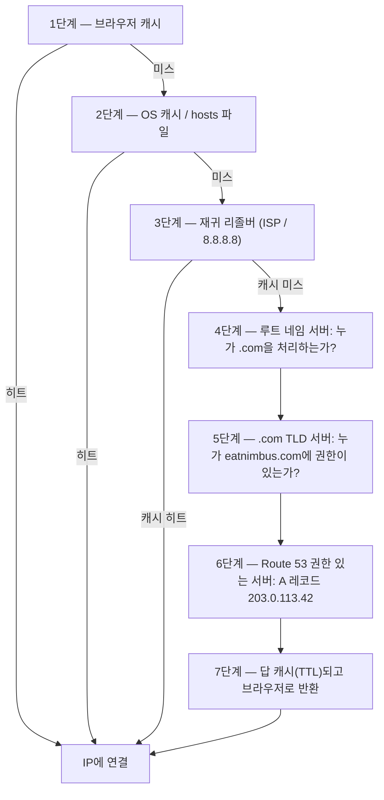

# 12장: 인터넷이 당신을 찾는 방법

Maya가 브라우저에서 `nimbus-alb-123456789.us-west-2.elb.amazonaws.com`을 한 번 더 새로고침하고, 뒤로 기대어 천장을 봤다. 페이지가 로드됐다. 앱이 작동했다. 하지만 그녀가 레스토랑 파트너와 링크를 공유할 때마다, 딱히 이름 붙일 수 없는 작은 부끄러움을 느꼈다.

그 URL은 제품이 아니라 기술적 산물이었다.

---

*지난 챕터의 네트워크 재설계는 잘 진행됐다. 모든 리소스가 올바른 위치에 있었다 — 공개 서브넷의 로드 밸런서, 프라이빗 서브넷에 잠긴 데이터베이스. 인프라는 안전하고 올바르게 분할됐다. 하지만 Nimbus가 첫 공개 출시를 준비하면서, 새로운 문제가 나타났다: AWS가 자동으로 할당한 로드 밸런서 URL은 사람들이 신뢰할 제품이 아니라 시스템 식별자처럼 보였다. 그들에게는 진짜 도메인 이름이 필요했다. 그리고 누군가 `eatnimbus.com`을 입력하는 순간과 페이지가 나타나는 순간 사이에 무슨 일이 일어나는지 이해해야 했다.*

---

Nimbus가 실행되고 있었다. 로드 밸런서에는 공개 IP가 있었다. EC2 인스턴스는 프라이빗 IP가 있었다. 데이터베이스는 프라이빗 서브넷에 잠겨 있었다. Priya가 네트워크 다이어그램을 보고 고개를 끄덕였다.

Tom이 로드 밸런서 URL을 봤다: `nimbus-alb-123456789.us-west-2.elb.amazonaws.com`.

"고객들이 브라우저에 이걸 입력하는 건가요?" 그가 물었다.

"이건 AWS가 자동으로 할당한 거야," Maya가 말했다.

"이걸 명함에 넣을 수는 없잖아요."

"나도 그래."

그들에게는 도메인 이름이 필요했다. 그들은 도메인 등록 기관에서 `eatnimbus.com`을 구입했다. 이제 그 이름을 AWS 인프라에 연결해야 했다.

"인터넷이 `eatnimbus.com`이 us-west-2의 로드 밸런서를 의미한다는 것을 어떻게 알아요?" Leo가 물었다.

좋은 질문, Leo.

**전화번호부 비유**

스마트폰 이전에, 모든 도시에는 전화번호부가 있었다. "마리오 피자"에 연락하려면 번호를 외우지 않았다 — 이름을 찾아서, 번호를 받아서, 전화했다.

인터넷에는 자체 전화번호부가 있다: **도메인 이름 시스템(DNS)**.

DNS는 사람이 읽을 수 있는 이름(예: `eatnimbus.com`)을 기계가 읽을 수 있는 IP 주소(예: `203.0.113.42`)로 변환한다. 웹사이트를 방문할 때마다, 컴퓨터는 자동으로 DNS에서 도메인 이름을 조회하고 연결할 IP 주소를 얻는다.

서버의 IP 주소를 바꾸면, DNS 레코드를 업데이트한다 — 전화번호부에서 번호를 바꾸는 것처럼 — 그러면 인터넷이 새 위치에서 당신을 찾는다.

**전체 DNS 해석 여정**

"하지만 조회가 실제로 *어떻게* 작동해요?" Leo가 물었다. "그러니까, 단계별로. 내 브라우저가 이름 `eatnimbus.com`을 알아요. 다음에 무슨 일이 일어나죠?"

대부분의 문서는 이것을 얼버무린다. 이것이 중요하다.

브라우저가 `eatnimbus.com`을 해석해야 할 때, 여기 모든 홉이, 순서대로 있다:

**1단계 — 브라우저 캐시**: 브라우저가 이 이름을 최근에 이미 해석했는지 확인한다. 그렇다면, 캐시된 IP를 사용한다. 아니면, 계속한다.

**2단계 — OS 캐시 / 로컬 리졸버**: 운영 체제가 자체 DNS 캐시와 로컬 `hosts` 파일을 확인한다. 발견되면, 완료. 아니면, 설정된 DNS 리졸버 — 보통 ISP의 것이나 8.8.8.8 같은 공개 것 — 로 전달한다.

**3단계 — 재귀 리졸버**: 재귀 리졸버(ISP나 Google의 8.8.8.8)가 일꾼이다. 캐시도 있다. 답을 알면, 즉시 반환한다. 아니면, 실제 해석 체인을 시작한다.

**4단계 — 루트 네임 서버**: 재귀 리졸버가 13개의 루트 네임 서버 클러스터(전 세계에 배포됨) 중 하나에 접촉한다. 루트 서버는 `eatnimbus.com`이 어디 있는지 모른다. 하지만 누가 `.com` 도메인을 관리하는지 안다 — `.com` TLD 서버. 그것들의 주소를 반환한다.

**5단계 — TLD(최상위 도메인) 네임 서버**: 재귀 리졸버가 `.com` TLD 서버에 접촉한다. TLD 서버도 `eatnimbus.com`이 어디 있는지 모른다. 하지만 어떤 네임 서버가 `eatnimbus.com`에 대해 권한이 있는지 안다 — 실제로 DNS 레코드를 보유하는 서버. 그 주소를 반환한다.

**6단계 — 권한 있는 네임 서버**: 재귀 리졸버가 Route 53의 네임 서버 — `eatnimbus.com`에 대한 권한 있는 네임 서버 — 에 접촉한다. Route 53에 실제 레코드가 있다. A 레코드를 반환한다: `eatnimbus.com → 203.0.113.42`. 이 답은 권한이 있다 — 캐시된 것이 아니라 진짜 답이다.

**7단계 — 응답 캐시되고 반환됨**: 재귀 리졸버가 레코드의 TTL(Time-To-Live) 기간 동안 답을 캐시한다. IP를 브라우저로 반환한다. 브라우저가 그것을 캐시한다. 브라우저가 연결한다.



"IP 주소 하나를 찾는 데 일곱 개의 홉이네," Tom이 말했다.

"보통 총 100밀리초 미만," Priya가 말했다. "3단계부터 6단계는 모든 수준에서 공격적으로 캐시돼. 인기 있는 도메인의 경우, 4단계와 5단계 — 루트와 TLD 조회 — 는 재귀 리졸버가 이미 그 서버를 캐시하고 있기 때문에 종종 완전히 건너뛰어. 전체 체인이 보통 20~40밀리초에 실행돼."

"그리고 첫 조회 후에는, 브라우저 캐시가 후속 요청이 그 전부를 건너뛰게 한다는 거죠," Leo가 덧붙였다.

"맞아. DNS는 대부분의 조회가 캐시 히트이기 때문에 즉각적으로 느껴져. 전체 체인은 레코드가 새것이거나 TTL이 만료됐을 때만 실행돼."

**Route 53 소개**

Amazon Route 53은 AWS의 관리형 DNS 서비스다. 포트 53이 표준 DNS 포트이기 때문에 Route 53이라고 불린다. (때로 AWS는 것들을 직접적으로 명명한다.)

Route 53은 여러 가지를 한다:

**도메인 등록**: Route 53을 통해 직접 도메인 이름을 구입할 수 있다.

**DNS 호스팅(호스팅 존)**: 도메인을 위한 *호스팅 존*을 만들고, Route 53이 세상에 당신을 어디서 찾을지 알려주는 DNS 레코드를 관리한다.

**상태 확인**: Route 53이 엔드포인트를 모니터링하고 비정상적인 것에서 트래픽을 라우팅할 수 있다.

**트래픽 라우팅 정책**: Route 53은 단순한 DNS 이상의 여러 라우팅 전략을 지원한다 — 가중치, 지연 시간 기반, 지리적 위치, 장애 조치.

**DNS 레코드: 전화번호부 항목**

DNS 레코드는 이름을 대상으로 매핑한다. 가장 흔한 유형:

**A 레코드**: 이름을 IPv4 주소로 매핑한다.
`eatnimbus.com → 203.0.113.42`

**AAAA 레코드**: 이름을 IPv6 주소로 매핑한다.

**CNAME 레코드**: 이름을 다른 이름(별칭)으로 매핑한다.
`www.eatnimbus.com → eatnimbus.com`

**MX 레코드**: 도메인의 이메일을 처리하는 서버를 지정한다.

**TXT 레코드**: 임의 텍스트를 저장한다. 일반적으로 도메인 확인(도메인을 소유한다는 것을 증명)과 이메일 인증(SPF, DKIM)에 사용된다.

Nimbus의 기본 설정:

- `eatnimbus.com` → 로드 밸런서를 가리키는 Alias 레코드
- `www.eatnimbus.com` → `eatnimbus.com`을 가리키는 CNAME
- `api.eatnimbus.com` → API 로드 밸런서를 가리키는 Alias 레코드

"잠깐," Tom이 말했다. "로드 밸런서의 IP가 바뀔 수 있어. AWS가 문서에서 그랬어."

좋은 지적, Tom.

**Alias 레코드: AWS의 동적 IP 솔루션**

로드 밸런서, CloudFront 배포, S3 웹사이트는 정적 IP 주소가 아닌 DNS 이름을 갖고 있다. 기본 IP가 바뀔 수 있다.

로드 밸런서의 DNS 이름을 가리키는 CNAME을 만들면 작동하지만 — 루트 도메인(`www` 없이 `eatnimbus.com`)에 CNAME을 사용할 수 없다. DNS 표준 때문이다.

Route 53은 **Alias 레코드**로 이것을 해결한다 — DNS의 AWS 특화 확장. Alias 레코드는 이름을 AWS 리소스(로드 밸런서, CloudFront 배포, S3 웹사이트)에 직접 매핑하고, Route 53이 동적 IP 해석을 자동으로 처리한다. Alias 레코드는 루트 도메인 수준에서 사용할 수 있다. 그리고 외부 서비스에 대한 일반 DNS 쿼리와 달리, AWS 리소스에 대한 Alias 레코드 쿼리는 무료다.

"그러면 로드 밸런서를 가리키는 `eatnimbus.com`에 Alias 레코드를 사용하는 거네요," Leo가 확인했다.

"그리고 Route 53이 언제든지 로드 밸런서가 사용하는 IP를 처리하는 거고요," Priya가 덧붙였다.

"무료로," Tom이 갑자기 매우 관심을 보이며 말했다. 그가 Route 53 가격 페이지를 열었다. "그리고 나머지는?"

"호스팅 존당 50센트," Leo가 말했다. "더하기 백만 DNS 쿼리당 약 40센트. 우리의 지금 트래픽에서는, 아마 한 달에 2달러 미만."

Tom이 만족하며 가격 페이지를 닫았다.

**라우팅 정책: 단순히 "어디에 있는가?" 이상**

여기서 Route 53이 흥미로워진다. DNS는 단순한 조회 서비스가 아니다 — 트래픽 관리 도구가 될 수 있다.

**단순 라우팅**: 하나의 레코드, 하나의 대상. 표준 DNS.

**가중치 라우팅**: 가중치로 여러 대상 사이에 트래픽을 분할. 마이그레이션 중에 90%를 새 서버로, 10%를 이전 서버로 보낸다. 새 서버에 자신이 생길 때까지 가중치를 조정하고, 그런 다음 100%로 전환한다.

**지연 시간 기반 라우팅**: 사용자를 그들에게 가장 낮은 지연 시간의 AWS 리전으로 라우팅. 시애틀의 사용자가 `us-west-2`로 라우팅된다. 도쿄의 사용자가 `ap-northeast-1`로 라우팅된다. 같은 도메인 이름, 다른 대상.

**지리적 위치 라우팅**: 사용자의 지리적 위치를 기반으로 라우팅. 모든 유럽 사용자가 `eu-west-1`로. 모든 북미 사용자가 `us-east-1`로. 데이터 주권(EU 사용자 데이터를 EU 리전에 유지) 또는 콘텐츠 맞춤화(언어, 통화)에 유용. 라우팅 결정은 단단한 경계를 사용한다 — 사용자는 한 국가, 한 대륙, 또는 한 미국 주에 있고, 그곳이 그들이 가는 곳이다.

**지리근접 라우팅**: 사용자의 지리적 위치를 기반으로 트래픽을 라우팅하고 *그리고* **바이어스** 값으로 그 결정을 조정할 수 있게 한다. 양의 바이어스는 리소스로 라우팅되는 지리적 영역을 확장한다 — 더 많은 트래픽을 끌어들인다. 음의 바이어스는 그것을 축소한다. 단단한 국가와 대륙 경계를 사용하는 지리적 위치와 달리, 지리근접은 연속적이다: 작은 바이어스 값이 어떤 고정 선도 다시 그리지 않고 한 리전에서 다른 리전으로 트래픽을 점진적으로 이동시킬 수 있다.

둘을 구분하는 시나리오: 회사가 `us-east-1`에서 `us-west-2`로 점진적으로 마이그레이션하고 있고 트래픽을 서쪽으로 점진적으로 이동시키고 싶다면 — 스위치를 뒤집는 게 아니라, 시간에 걸쳐 다이얼을 돌리는 — 서부 엔드포인트에 점점 커지는 양의 바이어스를 가진 지리근접이 올바른 도구다. 지리적 위치는 모든 서부 해안 사용자를 오리건으로 라우팅하거나 안 하거나다; 다이얼이 없다. 2024년 1월부터, 지리근접은 DNS 레코드(콘솔, API, CLI)에서 직접 일반 라우팅 정책으로 사용 가능하다 — 더 이상 Route 53 Traffic Flow를 필요로 하지 않지만, 거기에서도 여전히 사용 가능하다.

**장애 조치 라우팅**: 기본과 보조 엔드포인트를 지정. 기본 서버가 Route 53의 상태 확인에 실패하면, 트래픽이 자동으로 보조 서버로 리디렉션. DNS 레이어의 재해 복구다.

"잠깐 — 그런데 이미 멀티 AZ가 있다면 *왜* 두 번째 리전으로 장애 조치 라우팅을 설정하죠?" Maya가 물었다. "멀티 AZ가 장애를 처리하기로 되어 있지 않나요?"

좋은 질문. 멀티 AZ는 리전 내 단일 가용 영역의 장애로부터 보호한다 — 하나의 데이터 센터가 다운되면, 다른 AZ의 스탠바이가 인계받는다. 하지만 전체 AWS 리전이 사용 불가능해지면? 또는 리전 전체 서비스 중단이 있으면? DNS 장애 조치 라우팅은 다른 수준에서 운영된다: 한 리전의 상태 확인이 실패하면 그 전체 리전에서 트래픽을 라우팅해서 보낸다. 멀티 AZ는 리전 내 복원력이다. DNS 장애 조치는 리전 간 복원력이다.

**다중 값 답 라우팅**: 쿼리에 대해 최대 8개의 정상 IP 주소를 반환하여 클라이언트가 선택. 여러 서버에 트래픽을 배분하는 간단한 로드 밸런서 대안.

"그러면 Route 53은 단순한 전화번호부가 아니군요," Maya가 말했다. "전화가 어디서 걸려왔는지에 따라 전화를 라우팅할 수 있는 스마트 전화번호부네요."

"그리고 번호가 비정상이면 연결을 끊고요," Priya가 덧붙였다.

---

**지연 시간 라우팅 더하기 상태 확인: 사고 실험**

Priya가 화이트보드에 시나리오를 스케치했다. Nimbus의 동부 해안 사용자 기반이 계속 늘어나고, 어느 날 팀이 `us-east-1`(노던 버지니아)에 가벼운 스택을 세웠다고 가정하자 — 비싸고 복잡할 전체 멀티 리전 액티브-액티브 설정이 아니라, 로드 밸런서와 정적 콘텐츠 및 탐색 페이지를 제공하는 읽기 전용 EC2 인스턴스 세트. 주문은 여전히 서쪽 `us-west-2`의 기본 데이터베이스로 간다. 탐색 트래픽 — 요청의 70퍼센트를 차지하는 — 은 어느 해안에서든 제공될 수 있다.

탐색 엔드포인트를 위한 Route 53 설정은 이렇게 보일 것이다:

```
browse.eatnimbus.com
  → 지연 시간 레코드: us-east-1 ALB (상태 확인 포함, set-identifier "east")
  → 지연 시간 레코드: us-west-2 ALB (상태 확인 포함, set-identifier "west")
```

(레코드가 *호스트명*, `browse.eatnimbus.com`이라는 점에 유의하라 — DNS는 이름을 라우팅하지, URL 경로를 절대 라우팅하지 않는다. `/browse` 같은 경로 기반 라우팅은 Route 53이 아니라 로드 밸런서의 일이다.)

지연 시간 라우팅으로, 시애틀의 사용자는 `us-west-2` 엔드포인트로 해석될 것이다. 보스턴의 사용자는 `us-east-1`로 갈 것이다. Route 53은 인프라에서 각 리전까지의 지연 시간을 지속적으로 측정하고 사용자당 더 빠른 것을 고른다.

"하지만 서부 리전에 문제가 있으면?" Tom이 물었다. "시애틀의 탐색 사용자가 막히겠네요."

"그게 상태 확인이 있는 이유야," Priya가 말했다. "각 지연 시간 레코드는 각각의 로드 밸런서에 상태 확인을 받아. `us-west-2` 상태 확인이 세 번 연속 확인에 실패하면, Route 53이 그 레코드 반환을 멈춰 — 오리건이 보통 더 빠를 사용자에게조차. 시애틀 사용자는 오리건이 복구될 때까지 동쪽으로 라우팅돼."

"그러니까 지연 시간 라우팅은 보통 어느 리전이 선호되는지를 결정하고," Maya가 말했다. "상태 확인이 선호 리전이 다운되면 그 선호를 무시하는 거네요?"

"정확히. 지연 시간 정책이 정상 조건에서 승자를 고른다. 상태 확인이 작동을 멈춘 승자를 제거한다."

Leo가 장애 시나리오에 대해 생각했다. "그리고 그 레코드들의 TTL은?"

"60초," Priya가 말했다. "30초 간격으로 세 번의 실패한 확인으로 그것을 발동시켜 — 장애를 감지하는 데 최대 90초 — 그런 다음 DNS 리졸버가 변경 사항을 받는 데 최대 60초."

"최악의 경우 2분 30초네요," Leo가 말했다.

"그게 네가 그것을 신경 쓰기 전에 TTL을 낮추는 이유야, 후가 아니라."

이 조합 — 모든 레코드에 상태 확인이 있는 지연 시간 라우팅 — 은 멀티 리전 배포를 위한 가장 강력한 Route 53 설정 중 하나다. 사용자는 항상 가장 빠른 정상 리전으로 간다. 리전에 문제가 있을 때 시스템이 자가 치유한다. 그리고 그 전체가 DNS다: 추가 인프라 없음, 프록시 서버 없음, 리전 간 로드 밸런서 없음.

---

**상태 확인 장애 사고**

Nimbus의 스테이징 환경이 그들에게 장애 조치 라우팅의 우연한 시연을 줬다.

그들은 테스트로 스테이징 로드 밸런서에 Route 53 상태 확인을 설정했었다 — 30초마다 `/health` 엔드포인트를 확인. 어느 금요일 오후, Leo가 버그가 있는 배포를 스테이징에 푸시했다: 상태 엔드포인트가 500 오류를 반환하기 시작했다. 로컬 테스트는 통과했지만 서버에서 망가졌다.

Route 53이 실패를 기록했다. 세 번의 연속 실패한 확인 후, 그것이 엔드포인트를 비정상으로 표시했다. 장애 조치 레코드가 활성화되어, 스테이징 트래픽을 "유지 보수 진행 중"이라고 말하는 읽기 전용 폴백 페이지로 라우팅했다.

Leo의 첫 알림은 QA 엔지니어의 Slack 메시지였다: "스테이징이 유지 보수 페이지를 보여줘요."

Leo가 배포를 확인했다. 500 오류가 로그에서 명백했다. 그가 배포를 롤백했다. 상태 엔드포인트가 200을 반환한 지 90초 내에, Route 53이 확인을 재평가하고, 세 번의 연속 성공을 보고, 스테이징 로드 밸런서로 트래픽을 반환했다. 유지 보수 페이지가 사라졌다.

유지 보수 페이지에 있던 총 시간: 7분.

"그건 시스템이 올바르게 작동한 거야," Priya가 말했다.

"알아요," Leo가 말했다. "무서운 부분은 상태 확인이 없었다면 무슨 일이 일어났을지 생각하는 거예요. 500 오류가 실제 사용자에게 갔을 거예요."

"프로덕션에서는, 상태 확인이 보조 리전이나 정적 오류 페이지로 장애 조치했을 거야. 사용자가 오류 대신 유지된 경험을 봤을 거야."

"장애 조치가 실제로 얼마나 걸려요?" Maya가 물었다. "상태 확인이 실패할 때부터 DNS가 다르게 라우팅하기 시작할 때까지."

"상태 확인 간격은 기본으로 30초. 장애 조치를 발동시키는 세 번의 연속 실패. 그게 문제를 감지하는 데 최대 90초. 그런 다음 DNS TTL — 60초면, 전파가 또 1분."

"그러면 최악의 경우, 약 3분?"

"그 정도야. 그게 중요한 레코드에 TTL을 낮게, 상태 확인 간격을 예산이 허용하는 만큼 짧게 원하는 이유야."

---

**상태 확인: 장애를 우회한 라우팅**

"그리고 누군가 침입하려 하면?" Priya가 말했다. "DNS는 공개야. 누구든 `eatnimbus.com`이 어디를 가리키는지 조회할 수 있어. 그건 공격자가 어떤 IP를 타겟할지 정확히 안다는 거야."

"맞아요," Leo가 말했다. "하지만 그들이 찾는 IP는 로드 밸런서의 IP예요. ALB가 공개 주소를 가진 유일한 것이에요. 그 뒤에 있는 모든 것 — EC2, RDS, ElastiCache — 은 프라이빗 서브넷에 있어요. DNS는 그들에게 정문을 알려줘요. 그 뒤에 뭐가 있는지는 알려주지 않아요."

Route 53은 상태 확인으로 엔드포인트를 모니터링할 수 있다. 엔드포인트가 실패하면, Route 53은:

- DNS 응답에서 그것을 제거(거기에 트래픽 보내기 중단)
- 백업 엔드포인트로 장애 조치 트리거
- CloudWatch를 통해 알림 전송

상태 확인은 DNS 라우팅과 실제 애플리케이션 상태 사이의 링크다. 장애 조치 설정에서: Route 53은 30초마다 기본 엔드포인트를 모니터링한다. 세 번의 연속 확인이 실패하면, Route 53이 보조 엔드포인트의 주소를 반환하기 시작한다. 이 숫자들 중 어느 것도 고정되지 않았다: 30초가 표준 간격이고(유료 "빠른" 옵션은 10초마다 확인), 실패 임계값은 기본으로 3번의 연속 확인이지만 1에서 10까지 설정 가능하다.

이것은 즉각적이지 않다 — DNS는 전파 시간이 있다. Route 53이 DNS 레코드를 변경하면, 전 세계의 DNS 리졸버가 변경 사항을 받아야 하는데, TTL 설정에 따라 초에서 분이 걸릴 수 있다.

**TTL: DNS 캐시**

DNS 응답은 여러 수준에서 캐시된다 — 라우터, ISP, 브라우저에서. DNS 레코드의 **TTL(Time-To-Live)**은 캐시에 다시 확인하기 전에 얼마나 오래 답을 기억할지를 알려준다.

높은 TTL(1시간 이상): DNS 쿼리 적음, Route 53 부하 적음, 하지만 변경 사항 전파가 더 오래 걸린다.

낮은 TTL(60초 이하): 변경 사항이 빠르게 전파되지만, DNS 쿼리가 더 많이 필요하다.

계획된 마이그레이션(새 서버를 가리키도록 DNS 업데이트) 전에, 하루 전에 TTL을 60초로 낮춰라. 그러면 변경 사항을 만들면, 약 1분 내에 전파된다. 마이그레이션 후, 다시 정상 값으로 높여라.

"제가 이미 배포했어요 — 아." Leo가 TTL을 낮추기 전에 DNS 레코드를 업데이트했다. 그는 자기 실수를 깨닫고 세기 시작했다: 이전 TTL은 1시간이었다. 일부 사용자가 다음 60분 동안 이전 서버를 받을 것이다.

"마이그레이션 전이 아니라 마이그레이션 중에만 낮추면," Leo가 천천히 말했다. "이전 TTL은 일부 사용자가 1시간 동안 이전 서버를 볼 것이라는 것을 의미하네요."

"정확히," Priya가 말했다. "DNS 마이그레이션은 마이그레이션 중만이 아니라 마이그레이션 이전에 계획이 필요해."

여러분은 궁금할 것이다: TTL이 1시간으로 설정되면, 모든 사용자가 DNS 변경 후 새 서버를 보기 전에 꼬박 1시간을 기다린다는 것을 의미하는가? 정확히는 아니다. TTL은 리졸버가 TTL이 만료될 때까지 다시 확인하지 않는다는 것을 의미한다. 사용자의 DNS 리졸버가 55분 전에 1시간 TTL로 이전 값을 캐시했다면, 그들은 5분 후 새 값을 받는다. 5분 전에 캐시했다면, 55분을 기다린다. 평균적으로, 사용자는 TTL 기간의 절반 안에 변경 사항을 본다. 그게 TTL을 미리 낮추는 것이 그렇게 중요한 이유다: 변경이 일어나기 전에 최악의 경우 전파 윈도우를 축소한다.

---

**프라이빗 호스팅 존: 내부 DNS**

공개 도메인이 라이브된 2주 후 Priya가 새로운 요구사항을 제기했다.

"우리 EC2 인스턴스가 데이터베이스에 접근해야 해," 그녀가 말했다. "지금은 RDS 엔드포인트 DNS 이름 — `nimbus-prod.abc123.us-west-2.rds.amazonaws.com` — 을 사용하고 있어. 작동하지만, 공개 DNS 이름이야. 데이터베이스 설정을 바꾸고 싶으면, 모든 애플리케이션 설정 파일을 업데이트해야 해."

"프라이빗 DNS 이름을 쓸 수 있어요," Leo가 말했다. "`db.nimbus.internal` 같은. 우리 서비스가 내부적으로 사용하는, 현재 데이터베이스 엔드포인트가 뭐든 매핑되는 것."

"정확히. Route 53 프라이빗 호스팅 존."

**프라이빗 호스팅 존**은 VPC 안에서만 해석되는 DNS 도메인이다. `nimbus.internal`에 대한 외부 DNS 쿼리는 응답을 받지 못한다. 하지만 VPC 내에서, `db.nimbus.internal`은 RDS 엔드포인트로 해석된다.

그들이 그것을 설정했다:

- 프라이빗 호스팅 존: `nimbus.internal`
- CNAME 레코드: `db.nimbus.internal → nimbus-prod.abc123.us-west-2.rds.amazonaws.com`
- CNAME 레코드: `cache.nimbus.internal → nimbus-cache.abc123.usw2.cache.amazonaws.com`
- A 레코드: `api.nimbus.internal → 10.0.10.5` (내부 EC2 IP — A 레코드는 이름을 IP 주소에 매핑한다; CNAME은 이름을 다른 이름에 매핑한다. 이 인스턴스가 정적 프라이빗 IP를 유지하기 때문에 여기서는 괜찮다; Auto Scaling 뒤의 어떤 것이든 대신 로드 밸런서를 가리킬 것이다)

이제 애플리케이션 설정이 이렇게 읽혔다:

```
DATABASE_HOST=db.nimbus.internal
CACHE_HOST=cache.nimbus.internal
```

그들이 새 RDS 인스턴스로 마이그레이션했을 때, 하나의 DNS 레코드를 업데이트했다. 애플리케이션 배포가 필요 없었다.

"이게 데이터베이스 마이그레이션 중에 프라이빗 DNS가 중요한 이유이기도 해," Priya가 말했다. "`db.nimbus.internal`을 새 엔드포인트를 가리키도록 업데이트해. 트래픽이 이동해. 이전 엔드포인트는 TTL 윈도우 동안 사용 가능하게 유지돼. 애플리케이션 설정 변경 없음."

**내부 DNS 디버깅 이야기**

3주 후, Leo가 새 서비스 — 백그라운드 워커 — 를 배포했고, 그것이 데이터베이스에 접근할 수 없었다. 워커는 같은 VPC, API 서버와 같은 프라이빗 서브넷에 있었다. API 서버는 데이터베이스에 접근할 수 있었다. 워커는 그럴 수 없었다.

그가 보안 그룹을 확인했다. 워커의 보안 그룹에는 PostgreSQL을 위한 아웃바운드 규칙이 있었다. 데이터베이스 보안 그룹에는 워커의 보안 그룹에서의 인바운드 규칙이 있었다. 모든 것이 올바르게 보였다.

그가 워커 인스턴스에서 `nslookup db.nimbus.internal`을 실행했다.

응답 없음.

"DNS 조회가 실패하고 있어요," 그가 Priya에게 말했다.

그녀가 워커 인스턴스의 VPC 설정을 봤다. "워커가 실제로 어느 VPC에 있어? 프라이빗 호스팅 존은 VPC와 연결돼 — 인스턴스가 연결된 VPC에 없으면, 존이 그것에는 그냥 존재하지 않아."

"메인 VPC에 있어요. 다른 모든 것과 같이."

"그래?"

프라이빗 호스팅 존은 그것이 제공하는 각 VPC와 명시적으로 연결되어야 한다 — 연결은 VPC당이지, 서브넷당이 절대 아니다. Priya는 존을 만들 때 메인 VPC를 연결했다. 하지만 Leo는 실수로 다른 실험을 위해 만든 테스트 VPC에 워커를 배포했다. 다른 VPC. 프라이빗 호스팅 존과 연결되지 않음.

"워커가 잘못된 VPC에 있어," Priya가 말했다.

"제가 이미 배포했어요 — 아." Leo가 워커를 올바른 VPC로 옮겼다. DNS가 해석됐다. 워커가 데이터베이스에 연결됐다.

"하나의 VPC," Leo가 메모하며 말했다. "하나 이상에 대한 이유가 없는 한."

---

**DNSSEC: DNS 응답 인증**

"DNS 스푸핑에 대해 생각해봤어?" Priya가 물었다. "누군가 우리 DNS 쿼리를 가로채고 가짜 IP를 반환하면? 우리 사용자의 브라우저가 우리 것 대신 공격자의 서버에 연결할 거야."

**DNSSEC(DNS Security Extensions)**는 DNS 레코드를 암호학적으로 서명하여 이것을 해결한다. DNS 응답에 DNSSEC 서명이 포함되면, 리졸버는 응답이 권한 있는 네임 서버에서 왔고 변조되지 않았다는 것을 검증할 수 있다.

Route 53은 공개 호스팅 존에 대한 DNSSEC 서명을 지원한다. 그 과정은 다음을 포함한다:

1. Route 53에서 호스팅 존에 DNSSEC 활성화
2. Route 53이 KMS에 저장된 키 서명 키(KSK) 생성
3. Route 53이 존 서명 키로 모든 레코드 서명
4. 부모 도메인 등록 기관(.com TLD)에 DS(Delegation Signer) 레코드 추가
5. DNSSEC를 지원하는 리졸버가 이제 응답의 진정성을 검증할 수 있음

"DNS 스푸핑이 얼마나 흔해요?" Leo가 물었다.

"공개 인터넷에서는, 드물지만 가능해," Priya가 말했다. "오늘날 대부분의 ISP 리졸버가 DNSSEC 검증을 지원해. DNSSEC 활성화는 비용이 들지 않고 의미 있는 진정성 레이어를 추가해."

"그게 한 달에 얼마나 들어?" Tom이 물었다.

"DNSSEC 서명 자체를 활성화하는 것은 Route 53에서 무료야," Priya가 말했다. "유일한 실제 비용은 키 서명 키를 보유하는 KMS 키야: 한 달에 1달러, 더하기 KMS API 호출 — 그리고 하나의 키가 여러 호스팅 존에 걸쳐 공유될 수 있어. DNS 하이재킹 공격에 대한 보호는 우리 규모에서 사실상 무료야."

Tom이 점심 전에 그것을 활성화했다.

---

**Route 53 Resolver: 하이브리드 DNS**

Nimbus가 결국 VPN을 통해 AWS VPC를 온프레미스 개발 네트워크에 연결했을 때, 새로운 문제가 나타났다: 온프레미스 서버가 AWS 프라이빗 DNS 이름(`db.nimbus.internal` 같은)을 해석해야 했고, AWS 리소스가 온프레미스 호스트명(`jenkins.corp.nimbus.local` 같은)을 해석해야 했다.

DNS 해석은 기본으로 네트워크 경계를 넘지 않는다. AWS 리소스는 Route 53 Resolver(모든 VPC에 내장됨)를 사용하여 DNS를 해석한다. 온프레미스 서버는 자체 DNS 서버를 사용한다. 어느 쪽도 다른 쪽의 레코드를 볼 수 없다.

**Route 53 Resolver 엔드포인트**가 이 간극을 메운다:

**인바운드 엔드포인트**: 온프레미스 DNS 서버가 AWS 호스팅 DNS 존에 대한 쿼리를 VPC의 인바운드 엔드포인트 IP로 전달할 수 있다. Route 53 Resolver가 쿼리를 처리하고 결과를 반환한다.

**아웃바운드 엔드포인트**: EC2 인스턴스가 온프레미스 호스트명을 해석해야 할 때, Resolver가 그 쿼리를 아웃바운드 엔드포인트를 통해 온프레미스 DNS 서버로 전달한다.

"그러니까 번역 서비스 같은 거네요," Maya가 말했다. "당신의 AWS DNS와 온프레미스 DNS가 서로 직접 말하지 않아요. Resolver 엔드포인트가 중개자 역할을 하고요."

"정확히. 당신의 온프레미스 서버가 이제 `db.nimbus.internal`을 해석할 수 있어. 당신의 EC2 인스턴스가 `jenkins.corp.nimbus.local`을 해석할 수 있어. 양쪽이 양쪽 세계의 DNS 이름을 봐."

Nimbus의 경우, 이것은 개발 팀이 AWS의 스테이징 환경에 대해 사무실에서 통합 테스트를 실행하고 싶을 때 관련이 생겼다. Resolver 엔드포인트 없이는, 수동으로 hosts 파일을 편집하고 있었을 것이다. 그것들과 함께, 내부 DNS가 VPN을 가로질러 그냥 작동했다.

Resolver 엔드포인트의 아키텍처:

- **인바운드 엔드포인트**: VPC의 두 다른 AZ에 만들어진 두 개의 ENI(엘라스틱 네트워크 인터페이스). 각각 프라이빗 IP를 받는다. AWS 호스팅 존에 대한 쿼리를 이 IP로 전달하도록 온프레미스 DNS 서버를 설정한다. 트래픽이 VPN이나 Direct Connect를 통해 이동한다.
- **아웃바운드 엔드포인트**: 두 AZ의 두 개의 ENI. 전달 규칙을 만든다: "`corp.nimbus.local`에 대한 쿼리는 이 온프레미스 DNS 서버 IP로 간다." EC2 인스턴스가 자동으로 Resolver를 사용하는데, 그것이 전달 규칙을 참조하고 쿼리를 온프레미스로 보낸다.

"왜 엔드포인트당 두 개의 ENI예요?" Leo가 물었다.

"고가용성," Priya가 말했다. "하나의 AZ가 네트워크 연결을 잃으면, 다른 엔드포인트 IP가 여전히 작동해. NAT 게이트웨이와 같은 원칙이야."

"그게 한 달에 얼마나 들어?" Tom이 물었다.

Resolver 엔드포인트는 **엘라스틱 네트워크 인터페이스당** 시간당 대략 0.125달러가 들고, 각 엔드포인트는 가용성을 위해 최소 두 개의 ENI를 필요로 한다 — 그래서 현실적인 하한은 엔드포인트당 한 달에 약 180달러, 더하기 백만 DNS 쿼리당 0.40달러다. 내부 이름을 해석하기 위해 하이브리드 DNS를 사용하는 팀에게, 비용은 적당하다 — 그리고 여러 개발자 머신과 CI/CD 시스템에 걸쳐 hosts 파일을 유지할 필요를 제거한다.

"그냥 호스트명을 hosts 파일에 넣을 수 있어요," Leo가 제안했다.

"모든 개발자 머신, 모든 CI 러너, 모든 새 온보딩에," Priya가 말했다. "무언가 바뀔 때마다."

"엔드포인트가 그만한 가치가 있어요," Leo가 말했다.

"그래."

## 장점과 한계

**Route 53이 올바른 선택인 경우**: AWS 내에서 완전히 도메인 이름을 등록하고 관리할 때; 여러 엔드포인트에 걸쳐 지연 시간, 지리적 위치, 또는 가중치 배분을 기반으로 트래픽을 라우팅할 때; 리전 간 또는 기본 서버와 재해 복구 엔드포인트 사이의 상태 확인 기반 장애 조치를 위해; Alias 레코드를 통해 다른 AWS 서비스와 DNS를 통합할 때; 내부 서비스 검색을 위한 프라이빗 호스팅 존.

**Route 53이 필요하지 않은 경우**: Route 53은 DNS 서비스이지, 로드 밸런서가 아니다. 리전 내 여러 서버나 컨테이너 사이에 트래픽을 배분해야 한다면, Application Load Balancer를 사용하라 — Route 53은 로드 밸런서가 할 수 있는 방식으로 연결 수준에서 가중치 라운드 로빈을 할 수 없다. 리전 전체에 걸쳐 지연 시간 기반 라우팅을 추가하면 사용자가 실제로 전 세계에 분산되어 있고 밀리초가 전환율에 중요한 경우에만 의미가 있는 비용과 운영 복잡성이 추가된다. 대부분의 단일 리전 애플리케이션의 경우, ALB를 가리키는 단일 Alias 레코드가 필요한 모든 Route 53 설정이다.

## 요약

`nimbus-alb-123456789.us-west-2.elb.amazonaws.com`에서 `eatnimbus.com`으로 가는 것은 작은 일처럼 느껴졌다. 그렇지 않았다. DNS는 전체 인터넷이 운영되는 주소 시스템이고, Route 53은 그 시스템을 단지 조회뿐만 아니라 트래픽 관리와 복원력을 위해 사용하는 도구를 준다.

- **DNS**는 도메인 이름을 IP 주소로 변환한다 — 인터넷의 전화번호부.
- **Route 53**은 AWS의 관리형 DNS 서비스: 도메인 등록, DNS 호스팅, 상태 확인, 라우팅 정책.
- **A 레코드**는 이름을 IPv4 주소로 매핑한다. **CNAME**은 이름을 다른 이름으로 매핑한다. **Alias 레코드**는 이름을 AWS 리소스(로드 밸런서, CloudFront, S3)에 매핑한다.
- 루트 도메인과 동적 IP를 가진 리소스에는 CNAME이 아닌 Alias 레코드를 사용하라.
- 라우팅 정책은 단순한 DNS를 넘어선다: **가중치**(트래픽 분할), **지연 시간 기반**(성능), **지리적 위치**(데이터 주권 — 단단한 국가/대륙 경계), **지리근접**(바이어스 다이얼이 있는 거리 기반 — 점진적 트래픽 이동), **장애 조치**(재해 복구).
- **프라이빗 호스팅 존**은 VPC 리소스를 위한 내부 DNS를 제공한다 — 하드코딩된 IP가 아닌 이름으로 서비스 간 통신.
- **DNSSEC**는 레코드를 암호학적으로 서명하여, DNS 스푸핑으로부터 보호한다.
- **Route 53 Resolver 엔드포인트**는 하이브리드 네트워크를 연결한다 — AWS와 온프레미스 DNS가 서로의 이름을 해석할 수 있다.

## 시험 팁

*SAA-C03 도메인: 고성능 아키텍처 설계(도메인 3, 태스크 3.4)*

- **Alias vs CNAME**: Alias 레코드는 루트 도메인에서 사용할 수 있지만; CNAME은 사용할 수 없다. AWS 리소스에 대한 Alias 레코드는 무료; CNAME DNS 쿼리는 가격이 있다. 시험이 루트 도메인을 로드 밸런서에 매핑하는 것을 물을 때 → Alias 레코드.
- **라우팅 정책 사용 사례**(흔한 시험 시나리오):
  - "새 버전으로 트래픽을 점진적으로 마이그레이션" → 가중치 라우팅
  - "가장 가까운 AWS 리전으로 사용자 라우팅" → 지연 시간 기반 라우팅
  - "EU 사용자 데이터를 EU 리전에 유지" → 지리적 위치 라우팅
  - "기본 서버가 다운될 때 자동 DNS 장애 조치" → 상태 확인이 있는 장애 조치 라우팅
  - "새 리전으로 트래픽을 점진적으로 이동" 또는 "우리 EU 배포로 끌리는 트래픽 증가" → 양의 바이어스가 있는 지리근접 라우팅
- **지리근접 vs. 지리적 위치**: 지리적 위치는 사용자의 국가/대륙으로 단단한 경계를 가지고 라우팅한다. 지리근접은 설정 가능한 바이어스를 가지고 지리적 거리로 라우팅한다 — 새 리전으로 트래픽을 점진적으로 이동시키거나 특정 배포로 더 많은 사용자를 끌어들여야 할 때 사용하라. 2024년 1월부터 레코드에서 일반 라우팅 정책으로 사용 가능(Traffic Flow 더 이상 필요 없음).
- **Route 53 상태 확인**: HTTP/HTTPS/TCP 엔드포인트를 확인하고, CloudWatch 알람을 트리거할 수 있다. 시험은 재해 복구 시나리오에서 이것들을 사용한다.
- **TTL과 전파**: TTL이 DNS 리졸버가 레코드를 얼마나 오래 캐시하는지를 제어한다는 것을 알라. 짧은 TTL = 더 빠른 변경. 시험 시나리오: "팀이 DNS를 업데이트했지만 사용자가 여전히 이전 서버에 접근" → TTL이 너무 높다.
- **프라이빗 호스팅 존**: Route 53은 VPC 내에서만 해석되는 DNS 레코드를 만들 수 있다. 시험은 내부 서비스 검색에 이것을 사용한다(예: `database.internal`이 프라이빗 RDS 엔드포인트로 해석).
- Route 53은 **글로벌**이다 — 리전에 배포되지 않는다. 호스팅 존을 만들 때 리전 선택이 필요하지 않다.
- **Route 53 Resolver 엔드포인트**: 온프레미스와 AWS DNS가 서로의 이름을 해석해야 하는 하이브리드 시나리오에서 사용된다. 온프레미스 → AWS를 위한 인바운드 엔드포인트. AWS → 온프레미스를 위한 아웃바운드 엔드포인트.

## 연습 문제

**연습 1 — 회상**

CNAME 레코드와 Alias 레코드의 차이를 설명하라. 각각을 언제 사용하겠는가?

*(힌트: 루트 도메인에서의 CNAME 제약사항과 동적 AWS 리소스에 대한 Alias 레코드의 동작을 고려하라.)*

**연습 2 — SAA-C03 시나리오**

*시나리오*: 미디어 회사가 두 개의 AWS 리전에서 웹사이트를 운영한다: `us-east-1`(기본)과 `eu-west-1`(보조). 팀은 기본 리전이 사용 불가능해지면 트래픽이 자동으로 `eu-west-1`로 라우팅되길 원한다. 회사는 실제로 기본 리전을 다운시키지 않고 이 장애 조치 메커니즘이 올바르게 작동하는지도 검증하고 싶다.

다음 중 이 요구사항을 가장 잘 충족하는 Route 53 설정은?

A) `us-east-1`에 100% 가중치, `eu-west-1`에 0% 가중치를 가진 가중치 라우팅  
B) 두 엔드포인트 모두에 상태 확인이 있는 지연 시간 기반 라우팅  
C) 기본 엔드포인트에 상태 확인이 있는 장애 조치 라우팅과 `eu-west-1`을 가리키는 보조 레코드  
D) 북미가 `us-east-1`을, 유럽이 `eu-west-1`을 가리키는 지리적 위치 라우팅

**힌트 1**: 요구사항은 기본 서버가 다운될 때 자동 장애 조치다. 정확히 이를 위해 어떤 라우팅 정책이 설계되었는가?

**힌트 2**: "기본 리전을 다운시키지 않고 테스트" — 상태 확인은 테스트를 위해 수동으로 "비정상"으로 설정할 수 있다.

**힌트 3**: 지연 시간 기반 라우팅은 속도를 위해 최적화하지, 장애 조치를 위해서가 아니다.

**정답**: C

**설명**: 장애 조치 라우팅은 정확히 이 사용 사례를 위해 설계되었다. 기본 레코드는 상태 확인과 함께 `us-east-1`을 가리킨다. 보조 레코드는 `eu-west-1`을 가리킨다. 상태 확인이 실패하면, Route 53이 자동으로 보조 레코드를 제공한다. 상태 확인은 실제로 기본 리전을 중단시키지 않고 테스트를 위해 수동으로 실패하도록 강제할 수 있다.

**왜 A가 아닌가?** 100%/0% 가중치 라우팅은 사실상 정적 — 기본 서버가 실패할 때 자동으로 전환하지 않는다.

**왜 B가 아닌가?** *상태 확인이 있는* 지연 시간 레코드는 비정상 엔드포인트 반환을 멈추므로, B는 실제 중단에서 살아남을 것이다. 하지만 정상 트래픽 패턴을 바꾸고(사용자가 요구된 기본/보조가 아니라 지연 시간으로 리전에 걸쳐 분할됨) 장애 조치를 *테스트*할 깔끔한 방법이 없다: 프로덕션에서 실제로 기본의 상태 확인을 실패시켜야 할 것이다. 장애 조치 라우팅은 명시된 의도를 모델링한다 — 지정된 기본, 지정된 보조, 상태 확인 상태를 강제하여 테스트 가능.

**왜 D가 아닌가?** 지리적 위치 라우팅은 엔드포인트 상태가 아닌 사용자 위치로 라우팅한다. 유럽 사용자는 `us-east-1`이 정상이더라도 `eu-west-1`에 고정되고, 북미 사용자는 `us-east-1`이 다운되도 `eu-west-1`로 장애 조치하지 않는다.

*SAA-C03 도메인: 고성능 아키텍처 설계 — 태스크 3.4*

**연습 3 — 아키텍처 과제** *(선택 사항)*

Nimbus가 국제적으로 확장하고 있다. `eatnimbus.com`이 서부 해안, 동부 해안, 호주 사용자에게 빠르게 로드되길 원한다. 또한 규제 요구사항이 있다: 유럽 사용자의 주문은 EU 서버에서 처리되어야 한다.

두 요구사항 모두를 해결하는 Route 53 라우팅 전략을 설계하라. 어떤 라우팅 정책이나 정책 조합을 사용하겠는가? 각 리전에 어떤 인프라가 필요한가?

*(단 하나의 정답은 없다. 목표는 멀티 리전 라우팅 설계를 연습하는 것이다.)*

## 포스트 크레딧 장면

`eatnimbus.com`이 라이브되었다.

Maya가 브라우저에 그것을 입력했고, Nimbus 주문 페이지가 로드됐다. 그녀는 가족 레스토랑에서 arepa를 주문했다. 그냥 흐름을 테스트하기 위해. 주문이 처리됐다. 주방이 받았다.

그녀가 뒤로 기대었다.

Tom은 이미 Route 53 상태 확인 로그를 읽고 있었다. "us-west-2 검사기에서 응답 시간이 18밀리초예요."

"그게 빠른 건가요?" Maya가 물었다.

"DNS에서는? 네. 시애틀 사용자에게도 — 그들은 사실상 오리건 바로 옆이에요."

"하지만 보스턴의 사용자에게는요?"

Tom이 지연 시간 그래프를 봤다. "약 80밀리초요."

Maya가 그것에 대해 생각했다. "우리 동부 해안 파트너가 계속 늘어나고, 우리 서버가 오리건에 있다면..."

"모든 요청이 보스턴에서 오리건으로, 다시 돌아와," Leo가 방 건너편에서 말했다. "빛의 속도. 물리학을 이길 수 없어."

"그러면 보스턴에 더 가까운 서버가 필요하겠네요."

"아니면 그들을 대신해서 콘텐츠를 제공하는 보스턴에 더 가까운 것이 필요하거나요."

그 생각이 공기 중에 떠 있었다.

다음 챕터에서: Nimbus의 콘텐츠를 어디서든 모든 사용자에게 1밀리초 가까이 두는 창고들.
