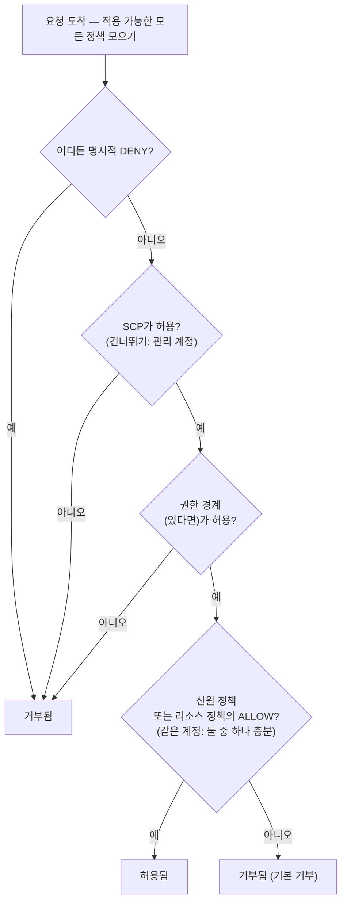

# 14장: 누가 무엇을 할 수 있는가

새 엔지니어들이 월요일에 시작했다. Soo-Jin과 Rafael. Maya는 그들의 첫 주에 대해 생각하고 있었다 — 무엇에 접근이 필요할지, 무엇을 건드리면 안 될지, 그리고 현재 IAM 설정이 두 명 더에게 확장될 준비가 되어 있기나 한지.

그녀는 사무실이 차기 전에 커피와 함께 앉아, 목록을 만들었다.

---

*CloudFront가 배포됐다. 캐시 히트율이 좋았다. 성능이 올랐다. 하지만 팀이 새 엔지니어를 영입할 준비를 하면서, 조용한 문제가 표면으로 떠올랐다: IAM 설정이 서두르는 사람들에 의해 구축됐다. 액세스 키가 설정 파일에 있었다. 일부 역할은 필요한 것보다 더 많은 권한을 갖고 있었다. 그리고 두 명의 새 사람이 여러 사용자를 염두에 두고 설계되지 않은 프로덕션 시스템에 자격증명을 건네받을 참이었다.*

---

Tom이 액세스 키를 텍스트 파일에 열고 붙여넣을 준비가 되어 있었다.

"뭐 해요?" Priya가 물었다.

"EC2 인스턴스가 S3에서 설정 파일을 읽어야 해요. 서버 설정에 자격증명을 넣으려고요."

그녀가 잠시 화면을 봤다. "그 파일 닫아요."

"그냥—"

"누군가 그 서버에 접근하면," 그녀가 말했다. "그 키들을 얻어. 그리고 그 키들은 IAM 사용자가 건드릴 수 있는 것은 무엇이든 건드려. 아마도 단지 S3보다 더 많이."

Tom이 파일을 닫았다.

"더 좋은 방법이 있어요," 그녀가 말했다. "서버 자체가 역할을 가질 수 있어요. 직함 같은 것 — 인스턴스가 자격증명이 필요 없어요. 시스템이 이미 그것이 무엇이고 무엇을 할 수 있는지 아니까요."

Tom이 회의적으로 봤다. "그러면 서버가 스스로를 인증해요?"

"예. 비밀번호 없이. 설정 파일에 키 없이. 실수로 git에 커밋될 수 있는 것 없이."

마지막 부분이 효과가 있었다. Tom은 2주 전에 거의 액세스 키를 레포에 커밋할 뻔했었다 — 마지막 순간에 diff에서 그것을 잡았다. 그가 새 브라우저 탭을 열었다.

**IAM 재방문: 전체 그림**

3장이 IAM을 소개했다: 사용자, 그룹, 역할, 정책. 이제 더 깊이 들어갈 시간이다.

IAM 정책은 어떤 리소스에서 어떤 액션이 허용되거나 거부되는지를 지정하는 JSON 문서다. 이렇게 보인다:

```json
{
  "Version": "2012-10-17",
  "Statement": [
    {
      "Effect": "Allow",
      "Action": [
        "s3:GetObject",
        "s3:PutObject"
      ],
      "Resource": "arn:aws:s3:::nimbus-assets/*"
    }
  ]
}
```

이 정책은 `nimbus-assets` 버킷의 객체를 읽고 쓰는 것을 허용하고, 그 외에는 아무것도 아니다. 삭제 안 됨. 버킷 목록 안 됨. 다른 S3 작업 안 됨. 다른 AWS 서비스 안 됨.

이것이 권한을 부여하는 올바른 방법이다: 특정 액션, 특정 리소스.

**"Administrator Access"의 문제**

`AdministratorAccess` 같은 AWS 관리 정책은 빠르게 시작하기 위해 설계되었다. 실제 팀원들과 프로덕션 시스템을 실행하기 위해 설계되지 않았다.

`AdministratorAccess`는 모든 리소스에서 모든 액션을 허용한다. 이 정책을 가진 팀원이 실수를 하면 — 실수로 S3 버킷을 삭제하거나, 잘못된 EC2 인스턴스를 종료하거나, 보안 그룹 규칙을 변경하면 — AWS가 막을 수 없다. 권한이 허가되었다.

팀원의 자격증명이 침해되면(피싱 공격, 유출된 액세스 키, 노트북 도난), 공격자가 AWS 계정의 모든 것에 관리자 접근권을 갖는다.

"그러면 Soo-Jin은 뭘 가져야 해요?" Leo가 물었다.

"Soo-Jin이 무엇을 해야 해요?" Priya가 대답했다.

"API를 배포해야 해요. 로그를 확인해야 해요. 그 외는 없어요."

"그러면 그녀는 코드 파이프라인에 푸시할 능력, CloudWatch 로그에 읽기 접근, 그 외는 없어요."

"그건... 매우 구체적이네요."

"예. 그게 요점이에요."

**IAM 역할: 서비스를 위한 신원**

3장에서 EC2 인스턴스가 자격증명을 저장하지 않고 AWS 서비스에 접근하는 방법으로 역할을 소개했다. 이것을 구체적으로 만들어보자.

Nimbus API를 실행하는 EC2 인스턴스는 다음이 필요하다:

- DynamoDB에서 읽기(메뉴)
- DynamoDB에 쓰기(주문)
- S3에 객체 넣기(영수증, 업로드)
- CloudWatch에 로그 쓰기
- Secrets Manager에서 시크릿 읽기

액세스 키를 가진 사용자를 만들고 그 키를 EC2 인스턴스에 저장하는 대신(보안 악몽 — 액세스 키는 SSH 접근을 가진 누구든 읽을 수 있다), EC2 인스턴스에 정확히 이 권한을 가진 **IAM 역할**을 만든다.

"잠깐 — 그런데 *왜* 그렇게 하는 거죠?" Maya가 물었다. "EC2 인스턴스가 이미 우리 코드를 실행하잖아요. 왜 그냥 코드에 액세스 키를 주지 않죠?"

왜냐하면 액세스 키는 어딘가에 사는 정적 자격증명이기 때문이다 — 설정 파일, 환경 변수, 누군가 실수하면 git 저장소. 그것들은 복사되고, 빼돌려지고, 우연히 커밋될 수 있다. IAM 역할은 다르게 작동한다: EC2 인스턴스가 역할을 자동으로 가정한다. AWS가 인스턴스 메타데이터 서비스를 통해 임시 자격증명을 제공한다. 자격증명이 자동으로 교체된다 — 몇 시간마다 만료되고 당신의 어떤 조치 없이 새로 고쳐진다. 저장된 것이 없으므로, 누출할 것이 없다.

"그리고 누군가 EC2 인스턴스에 해킹하면?" Leo가 물었다.

"EC2 역할이 허용하는 것을 할 수 있어," Priya가 말했다. "메뉴를 읽고, 주문을 쓰고, 로그를 보내는 것. S3 버킷을 삭제할 수 없어. EC2 인스턴스를 종료할 수 없어. IAM을 건드릴 수 없어."

"EC2 역할에 그 권한이 없기 때문에요."

"정확히."

---

**EC2 역할 가정이 단계별로 작동하는 방법**

"뭔가 말이 안 돼요," Maya가 말했다. "인스턴스에 저장된 자격증명이 없다면, 인스턴스가 실제로 자신이 누구인지 AWS에 어떻게 증명하죠? 어딘가에 자격증명이 있어야 해요."

있다. 하지만 임시적이고, 자동으로 교체되며, 인스턴스 내부에서만 접근 가능하다.

EC2 인스턴스가 IAM 역할이 연결된 상태로 시작하면, AWS는 다음을 한다:

**1단계**: AWS STS(Security Token Service)가 임시 자격증명을 생성한다 — 액세스 키 ID, 시크릿 액세스 키, 세션 토큰. EC2 인스턴스 역할의 경우 이것들은 보통 약 6시간 동안 유효하고, AWS가 만료 전에 자동으로 교체한다.

**2단계**: AWS가 이 자격증명을 특별한 IP 주소에서 사용 가능하게 만든다: `169.254.169.254`. 이것이 **인스턴스 메타데이터 서비스**(IMDS)다. EC2 인스턴스 내부에서만 도달 가능하다. 인스턴스 외부의 아무것도 그것에 접근할 수 없다.

**3단계**: 애플리케이션 코드가 어떤 AWS SDK(boto3, Java SDK, Node.js SDK)를 호출하면, SDK가 자동으로 인스턴스 메타데이터 엔드포인트를 쿼리한다:

```
GET http://169.254.169.254/latest/meta-data/iam/security-credentials/{role-name}
```

**4단계**: SDK가 임시 자격증명을 받고 그것을 사용하여 API 요청에 서명한다 — 예를 들어, S3에서 읽는 요청.

**5단계**: AWS가 자격증명을 검증하고, 역할에 연결된 IAM 정책을 확인하고, 요청을 허용하거나 거부한다.

**6단계**: 자격증명이 만료되기 약 15분 전에, EC2 인스턴스가 메타데이터 서비스에서 자동으로 그것들을 새로 고친다. 애플리케이션 코드는 이것을 처리할 필요가 절대 없다 — SDK가 투명하게 한다.

전체 과정이 개발자에게 보이지 않는다. `s3.get_object(...)`를 작성한다. SDK가 나머지를 처리한다.

"그러니까 자격증명이 존재하네요," Maya가 말했다. "그냥 임시적이고, 자동 교체되며, 인스턴스 메타데이터 엔드포인트에 잠겨 있는 거고요."

"그게 정적 액세스 키보다 훨씬 안전한 이유야," Priya가 말했다. "정적 키는, 한 번 도난당하면, 누군가 수동으로 교체할 때까지 유효해. 도난당한 임시 자격증명은 스스로 만료돼 — 몇 달이 아니라 몇 시간 내에."

"그리고 인스턴스 내부의 누군가 메타데이터 엔드포인트를 쿼리하면?"

"현재 임시 자격증명을 얻을 수 있어. 그건 실제 위험이고, 그게 AWS가 IMDSv2 — 인스턴스 메타데이터 서비스 버전 2 — 를 도입한 이유야. IMDSv2는 호출자가 먼저 PUT 요청을 통해 세션 토큰을 얻을 것을 요구해. 이것은 악의적인 코드가 서버를 속여 공격자를 대신해 메타데이터 URL을 가져오게 하는 서버 측 요청 위조라는 공격 클래스를 방지해."

Leo가 IMDSv2를 강제하도록 EC2 시작 설정을 업데이트했다. 시작 시간에 적용되는 하나의 설정.

---

**역할 가정: 서비스가 다른 서비스가 되는 방법**

역할은 다음에 의해 가정될 수 있다:

- **AWS 서비스**(EC2, Lambda, ECS 태스크 등)
- 자신의 계정의 **IAM 사용자**(역할 상승 — 특정 태스크를 위해 더 많은 권한을 가진 역할을 가정)
- **다른 AWS 계정의 IAM 사용자**(교차 계정 접근 — 다른 조직의 계정이 당신의 계정에서 역할을 가정할 수 있다)
- **외부 신원 공급자**(Google, Active Directory, Okta — 사람 사용자를 위한 페더레이션 접근)

"Nimbus가 우리 AWS 리소스에 접근이 필요한 타사 서비스를 사용하면 무슨 일이 일어나는지 생각해봤어?" Priya가 물었다. "예를 들어, 외부 분석 벤더. 우리는 그들을 위해 IAM 사용자를 만들고 액세스 키를 건네주고 싶지 않아."

"교차 계정 역할," Leo가 말했다. "우리 계정에 역할을 만들고 '이 특정 외부 계정이 이 역할을 가정하도록 허용됨'이라고 말하는 신뢰 정책을 작성해요. 그들은 자신의 자격증명을 사용하여 역할을 가정하고 임시 접근을 얻어요. 관리할 키 없음, 누출할 키 없음."

이 마지막 패턴 — **신원 페더레이션** — 은 대형 조직이 각 사람을 위한 개별 IAM 사용자를 만들지 않고 직원들에게 AWS 접근을 제공하는 방법이다. 회사의 Active Directory가 자격증명을 갖고 있다. AWS에 로그인하면, Active Directory에 대해 인증하고, AWS가 역할을 부여한다.

---

**교차 계정 접근: 회계 팀 시나리오**

6개월째에, Nimbus는 재무 리포팅을 돕기 위해 회계 회사를 영입했다. 회계 팀은 Nimbus S3 청구 버킷의 청구 데이터에 읽기 접근이 필요했다 — 하지만 그들은 자체 별도 AWS 계정에서 운영했다. Nimbus는 그들을 위해 IAM 사용자를 만들고 싶지 않았다. 외부 회사의 누군가에게 정적 액세스 키를 건네는 것은 정확히 잘못되게 느껴졌다.

"교차 계정 역할," Priya가 말했다.

설정에는 세 부분이 있다:

**1부**: Nimbus 계정에서, IAM 역할을 만든다 — `AccountingReadRole`이라고 부른다. 청구 S3 버킷의 `s3:GetObject`와 `s3:ListBucket`을 허용하는 정책을 연결한다. 그 외에는 아무것도.

**2부**: `AccountingReadRole`에 신뢰 정책을 추가한다. 신뢰 정책은 어떤 외부 신원이 이 역할을 가정하도록 허용되는지를 말한다:

```json
{
  "Version": "2012-10-17",
  "Statement": [{
    "Effect": "Allow",
    "Principal": {
      "AWS": "arn:aws:iam::ACCOUNTING-FIRM-ACCOUNT-ID:role/AccountingAppRole"
    },
    "Action": "sts:AssumeRole"
  }]
}
```

이것은 말한다: 회계 회사의 AWS 계정의 특정 역할만 이 역할을 가정할 수 있다. 다른 누구도 아니다.

**3부**: 회계 회사의 계정에서, 그들의 애플리케이션이 `sts:AssumeRole`을 사용하여 `AccountingReadRole`에 대한 임시 자격증명을 얻는다. 그 자격증명은 `AccountingReadRole`이 허용하는 것에만 범위가 지정된다. 회계 애플리케이션은 청구 파일을 읽을 수 있다. 그것에 쓸 수 없다. Nimbus 계정의 다른 어떤 것도 건드릴 수 없다.

정확히 이 시나리오를 위한 강화 단계가 하나 더 있다 — 그리고 그것은 이름 붙은 시험 주제다. 회계 회사는 많은 고객에게 서비스를 제공한다. 그들의 악의적인 고객이 Nimbus의 `AccountingReadRole`의 ARN을 알게 되고 회사의 소프트웨어에 그것을 "분석"하라고 요청한다고 가정하자. 회사의 소프트웨어는 역할을 가정할 합법적인 권한이 있다 — 잘못된 고객을 대신해 Nimbus의 데이터에 접근하도록 속을 수 있다. 이것이 **혼란스러운 대리인 문제**이고, 해결책은 **ExternalId**다: Nimbus가 고유한 시크릿 값을 생성하고, 그것을 신뢰 정책에 조건으로 넣고(`"sts:ExternalId": "nimbus-7f3a..."`), 회계 회사와만 공유한다. 회사의 소프트웨어는 모든 `AssumeRole` 호출에서 그 ExternalId를 전달해야 하고, 고객당 *다른* ExternalId를 사용한다 — 그래서 잘못된 고객을 대신해 이루어진 요청은 실패한다. 시험 트리거: "타사가 교차 계정 접근이 필요함" → 역할 + 신뢰 정책 + **ExternalId**. 절대 공유 키를 가진 IAM 사용자가 아니다.

"그들의 접근을 취소해야 하면?" Tom이 물었다.

"신뢰 정책을 삭제하거나 역할을 삭제해," Priya가 말했다. "끝. 찾아낼 자격증명 없음, 비활성화할 키 없음. 역할이 접근이야. 역할을 제거하면, 접근이 사라져."

"그리고 CloudTrail에서 그들이 사용한 모든 때를 볼 수 있어요," Leo가 덧붙였다.

"그들이 한 모든 API 호출, 로깅됨. 어떤 버킷, 어떤 파일, 무슨 시간, 무슨 결과."

Tom이 패턴을 적었다. 이것은 다시 나올 것이다 — 모든 통합 파트너, 모든 외부 벤더, AWS 접근이 필요한 모든 타사 도구가 액세스 키를 가진 사용자가 아니라 신뢰 정책을 가진 역할을 받을 것이다.

---

**IAM 정책 평가: 결정 로직**

"여러 정책이 같은 요청에 적용될 때 무슨 일이 일어나는지 생각해봤어?" Priya가 물었다. "IAM 사용자에게 정책이 있어. 그들이 접근하는 리소스에 리소스 정책이 있어. SCP가 있을 수 있어. AWS가 어떻게 결정하지?"

이해해야 할 중요한 것은 AWS가 정책을 한 번에 한 유형씩, 순서대로 확인하지 **않는다**는 것이다. 요청에 적용되는 *모든* 정책을 모은다 — 신원 기반, 리소스 기반, SCP, 권한 경계, 세션 정책 — 그리고 전체 더미에 한 번에 규칙 세트를 적용한다:

**규칙 1 — 명시적 거부가 항상 이긴다.** 적용 가능한 어떤 정책 — IAM, 리소스 기반, SCP, 또는 경계 — 이 액션을 명시적으로 거부하면, 요청이 거부된다. 아무것도 명시적 거부를 무시할 수 없다.

**규칙 2 — SCP와 권한 경계는 필터로 작동한다.** 그것들은 아무것도 부여하지 않는다. 액션은 모든 적용 가능한 SCP와 권한 경계(있다면)에 의해 *허용*되어야 한다, 아니면 거부된다 — 다른 정책이 뭐라고 하든.

**규칙 3 — 같은 계정 내에서, 하나의 허용으로 충분하다.** 신원의 IAM 정책 *또는* 리소스의 정책 *둘 중 하나*의 명시적 허용이 액션을 허용한다. 그것들은 순서가 아니라 합집합이다 — 리소스 정책이 IAM 정책 "전에" 평가되지 않는다.

**규칙 4 — 기본 거부.** 아무것도 액션을 명시적으로 허용하지 않으면, 거부된다.



결과: 어디든 명시적 거부 = 거부됨. 어디에도 허용 없음 = 거부됨. 신원 정책 *또는* 리소스 정책의 허용 = 허용됨, 거부, SCP, 또는 경계가 차단하지 않는 한.

시험이 좋아하는 또 하나의 사실: **SCP는 조직의 관리 계정에 적용되지 않는다**(서비스 연결 역할에도). "us-west-2 외 EC2 없음"이라고 말하는 SCP는 모든 멤버 계정을 제약한다 — 하지만 관리 계정은 건드리지 않는다. 이것이 AWS가 워크로드를 관리 계정에서 완전히 빼라고 말하는 이유 중 하나다.

시험 응시자를 걸려 넘어지게 하는 한 가지 뉘앙스: **교차 계정 접근**의 경우, 대상 계정의 리소스 기반 정책만으로는 충분하지 않다. 소스 계정의 신원도 자체 IAM 정책에서 액션을 수행할 명시적 권한이 필요하다. 계정 B가 당신의 객체를 읽도록 허용하는 S3 버킷 정책을 부여했지만, 계정 B의 IAM 사용자에게 `s3:GetObject`를 허용하는 IAM 정책이 없으면, 접근이 여전히 거부된다. 양쪽이 모두 액션을 허용해야 한다 — 리소스 정책이 대상 측에서 문을 열고, 소스 계정의 IAM 정책이 사용자에게 그것을 통과할 권한을 부여한다.

"그러면 Priya의 SCP가 'eu-west-1에 EC2 없음'이라고 말하고, 그녀의 IAM 정책이 '모든 EC2 액션 허용'이라고 말하면, 그녀는 여전히 eu-west-1에 인스턴스를 만들 수 없어요?" Leo가 물었다.

"맞아," Priya가 말했다. "SCP는 IAM 정책이 평가되기 전에 무엇이 가능한지를 필터링해. 액션이 성공하려면 둘 다 동의해야 해."

"그리고 IAM 정책의 명시적 거부가 리소스 정책의 명시적 허용을 무시해요?"

"항상. 체인 어디든의 명시적 거부가 이겨."

---

**권한 경계: 역할이 부여할 수 있는 것을 제한**

여기 미묘하지만 중요한 문제가 있다: 기본적으로, IAM은 사용자가 현재 갖고 있지 않은 권한을 부여하는 것을 방지하지 않는다.

Soo-Jin이 `iam:CreatePolicy`와 `iam:AttachUserPolicy`를 갖고 있다면, 기존 정책이 S3 읽기만 허용하더라도 S3 쓰기 접근을 부여하는 정책을 만들어 자신에게 연결할 수 있다. 이 취약성 클래스를 **권한 에스컬레이션**이라고 하며, 이것이 정확히 권한 경계가 존재하는 이유다.

하지만 팀 리더에게 IAM 권한 생성을 위임하고 싶지만, 의도한 것보다 더 많이 부여할 수 없도록 하고 싶다면?

**권한 경계**는 신원에 부여될 수 있는 최대 권한을 설정한다. 신원의 연결된 정책이 더 넓더라도, 효과적인 권한은 권한 경계로 제한된다.

예시: 팀 리더에게 IAM 역할을 만들 수 있는 정책을 줬다. 하지만 "이 팀 리더가 만드는 역할은 절대 S3 삭제 접근을 가질 수 없다"고 말하는 권한 경계를 연결했다. 팀 리더가 S3 전체 접근을 가진 역할을 만들더라도, 경계가 S3 삭제가 효과를 발휘하는 것을 방지한다.

여러분은 궁금할 것이다: 권한 경계와 서비스 제어 정책의 차이가 무엇인가? 비슷하게 들린다 — 둘 다 어떤 권한이 효과적일 수 있는지를 제한한다. 구분은 범위다. 권한 경계는 특정 IAM 신원(사용자나 역할)에 적용되고 그 신원이 할 수 있는 것을 제한한다. SCP는 전체 AWS 계정이나 조직 단위에 적용된다 — 관리자를 포함한 계정의 모든 신원에 영향을 미치는 조직 수준 가드레일이다. IAM 관리를 팀 리더에게 위임할 때 권한 경계를 사용하라. 계정의 누구도 재정의할 수 없는 조직 전체 규칙이 필요할 때 SCP를 사용하라.

이것은 고급 개념이지만, 시험에 나오며 대규모로 IAM 관리를 위임하는 방법을 반영한다.

**구체적인 권한 경계: 역할 생성을 안전하게 위임**

Nimbus가 성장하고 있었다. Soo-Jin은 플랫폼 팀의 각 시니어 엔지니어가 자신이 소유한 Lambda 함수를 위한 IAM 역할을 만들 수 있도록 허용하자고 제안했다 — Priya가 각각을 승인할 필요 없이.

"위험은," Priya가 말했다. "시니어 엔지니어가 `AdministratorAccess`를 가진 Lambda 역할을 만드는 거야 — 실수로든 신중하게 생각하지 않아서든."

"그래서 권한 경계를 써요," Soo-Jin이 말했다.

Priya가 `NimbusDeveloperBoundary`라는 권한 경계 정책을 만들었다:

```json
{
  "Version": "2012-10-17",
  "Statement": [
    {
      "Effect": "Allow",
      "Action": [
        "s3:GetObject", "s3:PutObject",
        "dynamodb:GetItem", "dynamodb:PutItem", "dynamodb:Query",
        "cloudwatch:PutMetricData", "logs:CreateLogGroup",
        "logs:CreateLogStream", "logs:PutLogEvents",
        "secretsmanager:GetSecretValue",
        "xray:PutTraceSegments"
      ],
      "Resource": "*"
    }
  ]
}
```

그런 다음 그녀는 각 시니어 엔지니어가 역할을 만들 수 있게 했지만, 이 경계를 연결한 경우에만:

```json
{
  "Effect": "Allow",
  "Action": ["iam:CreateRole", "iam:AttachRolePolicy"],
  "Resource": "*",
  "Condition": {
    "StringEquals": {
      "iam:PermissionsBoundary": "arn:aws:iam::ACCOUNT_ID:policy/NimbusDeveloperBoundary"
    }
  }
}
```

조건 없이는, 엔지니어가 어떤 권한이든 가진 역할을 만들 수 있다. 조건과 함께, 그들이 만드는 어떤 역할이든 `NimbusDeveloperBoundary`가 연결되어야 한다. `AdministratorAccess` 더하기 `NimbusDeveloperBoundary`를 가진 역할은 둘의 교집합을 가진다 — 사실상 경계에 나열된 서비스만.

"그러니까 그들은 역할을 만들 수 있지만," Leo가 말했다. "그 역할은 절대 S3에서 읽고, DynamoDB에 쓰고, CloudWatch에 로그하는 것 이상을 할 수 없네요."

"맞아. 그들은 IAM을 건드리는 역할을 만들 수 없어. EC2 인스턴스를 삭제하는 역할을 만들 수 없어. 경계가 천장을 정의해."

"그리고 경계 연결을 잊으면요?"

"조건이 `CreateRole` 호출이 성공하는 것을 방지해. 경계가 포함되지 않으면 생성이 실패해."

Priya가 Soo-Jin과 함께 연습을 진행했다. 20분의 설정. 결과: 엔지니어가 모든 배포에 대한 보안 검토 없이 Lambda 역할 생성을 스스로 서비스할 수 있었고, 플랫폼 팀은 어떤 Lambda 함수도 절대 정의된 권한 이상을 갖지 않을 것이라는 자신감을 유지했다.

**IAM Access Analyzer: 권한 감사**

Priya는 2일을 팀의 IAM 설정을 검토하는 데 보냈다. 그녀가 발견한 것:

- Leo의 개인 사용자에게 관리자 접근권이 있었다(발견된 대로)
- 이전 Lambda 함수에 모든 S3 버킷을 읽는 권한이 있었다(테스트에서 남겨진)
- 서비스 역할에 더 이상 존재하지 않는 DynamoDB 테이블에 쓰기 접근권이 있었다

이것이 정상이다. IAM 설정은 시간이 지남에 따라 잡동사니를 축적한다.

**IAM Access Analyzer**는 AWS 계정 외부에서 접근 가능한 리소스(S3 버킷, IAM 역할, KMS 키, Lambda 함수, SQS 큐)를 자동으로 식별하는 AWS 서비스다. 또한 정책을 IAM 모범 사례에 대해 확인하는 정책 검증 기능과, CloudTrail 이벤트를 분석하여 최소 권한 정책을 만드는 정책 생성 기능을 포함한다.

"그게 한 달에 얼마나 들어?" Tom이 브라우저에서 고개를 들며 물었다.

"외부 접근 분석은 무료야," Priya가 말했다. "지속적으로 실행되고 콘솔에 발견 사항을 보고해. 미사용 접근 분석 — 최근에 사용되지 않은 역할과 권한을 식별하는 — 은 분석된 IAM 역할당 한 달에 약 0.20달러야."

Tom이 브라우저로 돌아갔다.

외부 접근 발견 사항이 가장 즉각적으로 가치가 있다. Priya가 Access Analyzer를 활성화했을 때, 두 가지를 발견했다:

첫째, `nimbus-receipts` S3 버킷에는 특정 외부 AWS 계정 — 8개월 전 초기 영수증 내보내기 기능을 구축하는 것을 도운 계약자의 계정 — 에서 읽기를 허용하는 버킷 정책이 있었다. 계약자는 더 이상 참여하지 않았다. 버킷 정책은 절대 정리되지 않았다.

"아무도 의도하지 않은 8개월의 접근," Priya가 말했다.

"그들이 여전히 접근하고 있었어요?" Tom이 물었다.

Leo가 S3 접근 로그를 열었다. 6개월 동안 그 계정에서 요청 없음. 하지만 권한이 거기 있었다. Access Analyzer가 그것을 표면화했다; 수동 검토에서는 아무도 그것을 찾지 못했을 것이다.

둘째, `nimbus-dev-assets` S3 버킷이 공개 읽기로 설정되어 있었다. 그것은 개발 중에 의도적이었다 — 공개 접근으로 테스트하기가 더 쉬웠다. 그것이 잊혔다.

"공개 접근 차단 재정의를 제거해," Priya가 말했다. "그리고 계정 수준에서 S3 Block Public Access를 활성화해. 그것은 개별 버킷 설정과 무관하게 어떤 버킷도 공개가 되는 것을 방지해."

그들은 둘 다 했다.

월별로 실행되는 미사용 접근 분석은 90일 동안 사용되지 않은 역할을 표면화할 것이다. 그것들은 삭제 후보였다. IAM 설정은 자연스럽게 한 방향으로 성장한다 — 역할과 정책이 축적된다. Access Analyzer가 정리를 보이게 만든다.

정기적인 IAM 감사는 운영의 일부가 되어야 한다. Access Analyzer는 감사를 대체하지 않는다 — 감사를 관리 가능하게 만든다.

**서비스 제어 정책: 조직 수준 가드레일**

AWS 환경이 여러 계정으로 성장하면(대형 팀을 위한 공통 패턴 — 개발 계정, 스테이징 계정, 프로덕션 계정), **AWS Organizations**를 통해 중앙 계정에서 그것들을 관리할 수 있다. 하나의 즉각적이고 실용적인 이점: **통합 청구**. 모든 멤버 계정이 관리 계정이 지불하는 단일 청구서로 롤업되고, 사용량이 계정에 걸쳐 집계된다 — 그래서 볼륨 할인(예를 들어 S3 가격 티어)과 예약 인스턴스 또는 Savings Plans 할인이 계정별이 아니라 조직 전체에 적용된다. Tom은 그것에 대한 다른 어떤 것을 이해하기도 전에 Organizations를 승인했다.

Organizations 내에서, **서비스 제어 정책(SCP)**은 관리자를 포함한 계정의 *모든* IAM 엔티티에 영향을 미치는 가드레일을 적용한다.

예시 SCP: "개발 계정의 어느 누구도 eu-west-1 리전에 EC2 인스턴스를 만들 수 없다."

개발 계정에 관리자 접근권을 가진 누군가도 이 SCP를 위반할 수 없다. 조직 수준에서, 계정 수준 위에서 시행된다.

SCP는 권한을 부여하지 않는다 — 제한한다. 어떤 IAM 엔티티가 계정에서 가질 수 있는 최대 권한을 정의한다.

Nimbus가 멀티 계정 구조 — 공유 프로덕션 계정, 개발 계정, 보안 계정 — 를 확립했을 때, Priya가 세 개의 기초 SCP를 작성했다:

**SCP 1 — 리전 잠금**: 모든 계정이 `us-east-1`과 `us-west-2`로 제한된다. 개발자가 실수로 `ap-southeast-1`에 배포하면, 액션이 거부된다. 이것은 의도하지 않은 리전의 그림자 인프라를 방지한다.

**SCP 2 — CloudTrail 보호**: 어떤 계정의 누구도 CloudTrail을 비활성화하거나 CloudTrail 로그를 삭제할 수 없다. 계정 관리자조차도. CloudTrail이 꺼지면, 보안 가시성이 함께 사라진다 — 이 SCP가 그것을 구조적으로 불가능하게 만든다.

**SCP 3 — 루트 사용자 잠금**: 멤버 계정의 루트 사용자가 수행하는 모든 액션을 거부한다(AWS의 권장 패턴은 조건부로 MFA를 요구하는 것보다 루트와 일치하는 `aws:PrincipalArn`에 대한 전면 거부다 — 조건부 MFA SCP는 MFA를 제시할 수 없는 서비스 흐름을 망가뜨린다). 루트 사용자는 거의 절대 사용되어서는 안 된다; 일상 작업은 역할에 속한다. 기억하라: SCP는 멤버 계정 루트 사용자에 적용되지만, 관리 계정에는 **절대** 적용되지 않는다.

"이 세 정책은 우리가 지난 1년 동안 본 세 가지 실제 사고를 방지했을 거야," Priya가 말했다. "리전 잠금은 우리가 운영하지 않는 리전에 실수로 이백 개의 EC2 인스턴스를 시작한 개발자를 멈췄을 거야. CloudTrail 보호는 우리의 이전 고용주에서의 내부자 위협 사고를 멈췄을 거야. 루트 잠금은 그냥 위생이야."

"이게 보안 계정에도 적용돼요?" Leo가 물었다.

"보안 계정에는 다른 SCP가 있어 — 더 적은 제한, 보안 팀이 때로 다른 계정이 할 수 없는 것을 해야 하니까. 하지만 CloudTrail 보호는 어디에나 적용돼. 로깅은 신성해."

경험 법칙: 어디서든, 어떤 계정에서든, 어떤 상황에서든 절대 일어나서는 안 되는 것에는 SCP. 각 팀과 서비스가 구체적으로 필요로 하는 것에는 IAM 정책.

---

## 랜딩 존 자동화: AWS Control Tower

SCP가 작동하고 있었다. 멀티 계정 구조가 모양을 갖추고 있었다. 하지만 Priya는 조용히 계산을 하고 있었고, 그 숫자가 마음에 들지 않았다.

"여덟 개의 계정," 그녀가 말했다. "그리고 새 체인들을 세지도 않았어."

Nimbus는 단일 AWS 계정을 넘어 성장했다. 그들에게는 프로덕션이 있었다. 스테이징이 있었다. 인수한 세 개의 레스토랑 체인이 있었다 — 각각 자체 AWS 환경을 운영하고, 각각 Nimbus 거버넌스 모델로 접혀 들어가야 했다. 총 여덟 개의 계정, 더 오고 있었다.

Soo-Jin은 이 문제를 알았다. "지난 회사에서, 우리는 각 새 계정을 수동으로 설정했어요," 그녀가 말했다. "루트 계정 이메일, IAM 사용자, SCP 연결, CloudTrail, Config, GuardDuty — 계정당 최소 두 시간. 그리고 무언가가 항상 약간 달랐어요. 한 계정은 CloudTrail이 us-east-1에만 있었어요. 다른 계정은 누군가 활성화하는 것을 잊어서 GuardDuty가 비활성화됐어요. 오십 개의 계정이 되면, 차이를 감사하는 것이 자체 프로젝트였어요."

"그게 우리가 이걸 하는 방식이 아니야," Priya가 말했다.

**AWS Control Tower**는 멀티 계정 AWS 환경의 설정과 거버넌스를 자동화한다. 각 새 계정에 대해 Organizations, SCP, CloudTrail, Config, GuardDuty를 수동으로 연결하는 대신, Control Tower가 구조를 당신을 위해 구축하고 유지한다.

Control Tower를 설정하면, **랜딩 존**을 만든다: 관리 계정, 로그 아카이브 계정, 감사 계정을 가진 사전 설정되고 안전한 멀티 계정 환경, 모두 AWS 모범 사례를 따른다. 로그 아카이브 계정은 조직의 모든 계정에서 CloudTrail 로그를 수집한다. 감사 계정은 보안 도구를 호스팅한다. 이 기준선이 자동으로 설정된다 — 팀이 이틀에 걸쳐서가 아니라, Control Tower가 몇 분 안에.

랜딩 존이 존재하면, Control Tower가 **제어**(더 오래된 이름, **가드레일**이 시험을 포함하여 여전히 어디에나 나타난다)를 통해 그것을 관리한다 — 세 가지 형태의 사전 구축된 거버넌스 규칙. *예방 제어*는 SCP다: 비준수 액션이 일어나기 전에 차단한다. *탐지 제어*는 AWS Config 규칙이다: 드리프트를 스캔하고 Control Tower 대시보드에 보고한다. *능동 제어*는 CloudFormation 후크다: 리소스가 프로비저닝되기 *전에* 준수를 확인하여, 나중에 플래그하는 대신 배포를 실패시킨다. Priya의 CloudTrail 보호 SCP는, Control Tower 언어로 번역하면, 예방 제어다. 공개 접근을 가진 어떤 S3 버킷이든 플래그하는 Config 규칙은 탐지 제어다. CloudFormation 스택이 암호화되지 않은 EBS 볼륨을 만드는 것을 차단하는 후크는 능동 제어다.

Soo-Jin의 계정당 두 시간 문제를 해결한 부분: **Account Factory**. Nimbus가 다른 레스토랑 체인을 인수하면, 엔지니어링 팀이 Account Factory를 열고, 계정 이름과 이메일을 입력하고, 프로비저닝을 클릭한다. 몇 분 후, 올바른 IAM 역할, CloudTrail, Config, 그리고 이미 적용된 모든 가드레일로 사전 설정된 새 AWS 계정이 도착한다. 거의 올바른 것이 아니다. 하나 빠진 것이 아니다. 다른 모든 계정과 동일하다.

"잠깐 — 그런데 *왜* 그렇게 하는 거죠?" Maya가 물었다. "우리는 이미 Organizations와 SCP가 있어요. 왜 그 위에 또 다른 서비스를 추가하죠?"

왜냐하면 SCP를 가진 Organizations는 가드레일을 주지만 — 다른 모든 것을 직접 구축하고 유지하기 때문이다. Control Tower는 전체 랜딩 존을 준다: 계정 구조, 로그 아카이브, 감사 계정, 기준선 보안 설정, 그리고 Account Factory, 모두 AWS가 유지한다. Control Tower는 내부적으로 Organizations를 사용하지만, Organizations 단독으로는 제공하지 않는 자동화된 의견 있는 설정을 추가한다. 오늘 처음부터 시작하고 대규모로 일관된 거버넌스가 필요하면, Control Tower가 답이다. 이미 수동으로 구축한 성숙한 Organizations 설정이 있으면, 그것을 Control Tower에 등록하거나 — 그대로 둘 수 있다.

시험 응시자를 걸려 넘어지게 하는 구분: "계정에 걸쳐 특정 액션을 제한하기 위해 SCP 적용" → Organizations + SCP를 직접 원한다. "새 계정 프로비저닝 워크플로우와 함께 AWS 모범 사례를 따르는 안전한 멀티 계정 환경을 자동으로 설정" → Control Tower를 원한다.

"Meridian Kitchen 계정을 등록하는 데 얼마나 걸려요?" Leo가 물었다.

"Account Factory가 새 계정을 약 30분에 프로비저닝해," Priya가 말했다. "완전히 설정됨. '대부분 설정됨'이 아니라."

Tom은 아무 말도 하지 않았다. 그는 엔지니어 시간 두 시간의 비용을, 여덟 곱하기, 오고 있는 계정 수가 얼마든 곱하기 보고 있었다.

---

> **시험 팁 — AWS Control Tower**
>
> *SAA-C03 도메인: 보안 아키텍처 설계(도메인 1)*
>
> - **Control Tower**는 가드레일과 Account Factory로 멀티 계정 랜딩 존 설정을 자동화한다. 새 AWS 조직을 시작하거나 일관된 거버넌스 기준선으로 대규모로 계정을 프로비저닝해야 할 때 사용하라.
> - **예방 제어 = SCP.** 비준수 액션이 일어나기 전에 차단한다.
> - **탐지 제어 = AWS Config 규칙.** 드리프트를 감지하고 대시보드에 보고한다.
> - **능동 제어 = CloudFormation 후크.** 프로비저닝 전에 리소스를 검증한다. 세 가지 제어 유형, 세 가지 메커니즘 — 시험이 매핑을 테스트한다.
> - **Account Factory**는 조직의 보안 기준선으로 사전 설정된 새 계정을 프로비저닝한다 — 수동 설정 없음.
> - **Control Tower vs. Organizations:** Organizations + SCP = 당신이 모든 것을 구축하고 관리한다. Control Tower = AWS가 랜딩 존을 구축하고 가드레일 업데이트를 당신을 위해 관리한다, 내부적으로 Organizations를 사용하여.
> - **시험 트리거:** "보안 기준선으로 새 계정을 자동으로 설정" → Control Tower. "계정에 걸쳐 액션을 제한하기 위해 특정 SCP 적용" → Organizations + SCP를 직접.

---

**CI/CD 파이프라인: 잊는 자격증명**

"우리 배포 파이프라인의 자격증명에 무슨 일이 일어나는지 생각해봤어?" Priya가 물었다.

Nimbus 애플리케이션을 배포한 GitHub Actions 워크플로우는 이전에 GitHub Secrets로 저장된 AWS 액세스 키를 사용했었다. 이것은 표준 관행이었지만 — 그것은 장기 액세스 키가 타사 시스템에 존재한다는 것을 의미했다.

"GitHub이 침해되면?" Priya가 물었다. "또는 저장소가 실수로 공개되고 누군가 시크릿을 읽으면?"

해결책: GitHub OIDC 페더레이션. GitHub Actions는 OpenID Connect를 지원한다 — GitHub의 신원 공급자에서 임시 토큰을 얻고 그것을 IAM 역할을 통해 AWS 자격증명으로 교환할 수 있다. 정적 액세스 키가 절대 만들어지지 않는다.

배포 역할을 위한 IAM 신뢰 정책:

```json
{
  "Effect": "Allow",
  "Principal": {
    "Federated": "arn:aws:iam::ACCOUNT_ID:oidc-provider/token.actions.githubusercontent.com"
  },
  "Action": "sts:AssumeRoleWithWebIdentity",
  "Condition": {
    "StringEquals": {
      "token.actions.githubusercontent.com:aud": "sts.amazonaws.com",
      "token.actions.githubusercontent.com:sub": "repo:nimbus-org/nimbus-api:ref:refs/heads/main"
    }
  }
}
```

이 신뢰 정책은 GitHub Actions가 배포 역할을 가정하도록 허용한다 — 하지만 `nimbus-api` 저장소의 `main` 브랜치에서 실행될 때만. 포크, 외부 기여자의 풀 리퀘스트, 또는 다른 브랜치는 역할을 가정할 수 없다.

"GitHub Secrets에 액세스 키 없음," Leo가 말했다. "파이프라인이 GitHub의 신원 토큰을 사용하여 AWS로 인증해요."

"그리고 역할은 배포가 실제로 필요한 것만 허용해," Priya가 덧붙였다. "ECR에 푸시, ECS 서비스 업데이트, S3에 파일 넣기. 그 외는 없음."

"제가 이미 배포했어요 — 아." Leo가 `main` 브랜치에서 OIDC 페더레이션을 테스트했지만 스테이징 환경이 `staging` 브랜치에서 배포된다는 것을 잊었다. 조건이 너무 제한적이었다. 그가 `ref:refs/heads/main`과 `ref:refs/heads/staging`을 허용하도록 조건을 업데이트했다.

이전 액세스 키가 삭제됐다. 배포 파이프라인이 이제 어떤 장기 자격증명 없이 운영됐다.

---

**엔터프라이즈 규모의 IAM**

Soo-Jin은 삼백 명의 엔지니어와 오백 개의 AWS 계정을 가진 회사 출신이었다. 그녀는 Nimbus IAM 설정을 보고 잠시 아무 말도 하지 않았다.

"깔끔하네요," 그녀가 마침내 말했다. "좋은 최소 권한. 하지만 이 회사가 오십 명의 엔지니어를 가지면, 이 구조가 고통스러울 거예요."

"뭐가 바뀌어요?" Maya가 물었다.

"개별 사용자 권한 관리를 멈추고 IAM Identity Center를 통해 사용자 그룹을 관리하기 시작해요," Soo-Jin이 말했다. "여러 계정이 있어요 — 개발, 스테이징, 프로덕션, 보안, 공유 서비스. 엔지니어가 일부 계정에 접근이 필요하고 다른 것에는 아니에요. 각 계정의 개별 IAM 사용자로 그것을 하는 것은 유지할 수백 개의 설정이에요."

IAM Identity Center(이전 AWS Single Sign-On)가 이것을 해결한다. 엔지니어가 기업 자격증명으로 한 번 로그인한다. Identity Center가 그들의 신원을 특정 계정의 권한 세트 — 정책 묶음 — 에 매핑한다. 개발자가 개발과 스테이징에 읽기 접근, 프로덕션에서 자체 서비스의 리소스에 쓰기 접근을 받는다. 보안 엔지니어가 모든 계정에 읽기 접근을 받는다.

"모든 계정에 걸쳐 누가 무엇에 접근하는지 관리하는 한 곳," Soo-Jin이 말했다. "누군가 합류하면, 그룹에 추가해요. 떠나면, Identity Center에서 제거하고 모든 것에 대한 그들의 접근이 사라져요."

"그리고 정리할 개별 IAM 사용자가 없네요," Leo가 말했다.

"맞아요. IAM 사용자가 존재하지 않아요. 페더레이션이 존재해요."

엔터프라이즈 패턴: 여러 계정을 가진 AWS Organizations, 사람 접근을 중앙에서 관리하는 Identity Center, 자동화를 위한 각 계정의 서비스 역할, 계정 전체 가드레일을 시행하는 SCP. 장기 액세스 키 없음. 공유 자격증명 없음. 누군가 떠날 때 수동 프로비저닝 해제 없음.

"우리는 아직 거기 있지 않아요," Maya가 말했다.

"아니요," Soo-Jin이 말했다. "하지만 그게 방향이에요. 지금 내리는 모든 결정이 거기 가는 것을 더 쉽게 만들어야 해요, 더 어렵게가 아니라."

**기업 디렉터리는 어디 사는가? AWS Directory Service**

페더레이션 그림의 한 부분이 더 있다. Identity Center는 신원 *소스*가 필요하다 — 기업 신원이 실제로 사는 어딘가. 많은 기업에게, 그 소스는 Microsoft Active Directory이고, AWS는 **AWS Directory Service**라는 우산 아래 그것을 연결하는 세 가지 방법을 제공한다:

**AWS Managed Microsoft AD**는 실제 Microsoft Active Directory로, 두 AZ에 걸쳐 AWS가 관리하는 도메인 컨트롤러에서 실행된다. 실제 AD가 지원하는 모든 것을 지원한다: 그룹 정책, 온프레미스 AD와의 신뢰 관계, AD 의존 AWS 워크로드 — FSx for Windows File Server, Windows 인증을 가진 Amazon RDS for SQL Server, 도메인에 가입된 EC2 인스턴스. 이것은 AWS *안에* 완전한 디렉터리가 필요하거나, 클라우드에서 AD 인식 애플리케이션을 실행할 때의 선택이다. (이것은 Leo가 6장에서 Copper Kettle FSx 마이그레이션에 사용한 디렉터리다.)

**AD Connector**는 디렉터리가 전혀 아니다 — 프록시다. VPN이나 Direct Connect 링크를 통해 인증 요청을 *기존 온프레미스* AD로 전달한다. 디렉터리 데이터가 AWS에 저장되거나 캐시되지 않는다; 사용자가 기존 자격증명을 유지하고, 온프레미스 AD가 단일 진실의 원천으로 남는다. 이것은 요구사항이 "기존 기업 자격증명 사용"과 "어떤 신원 정보도 클라우드에 저장되어서는 안 됨"이라고 말할 때의 선택이다.

**Simple AD**는 저비용, Samba 기반 디렉터리로 기본 AD 호환성을 가진다. LDAP과 간단한 도메인 가입이 필요한 작고 독립적인 환경에 작동하지만, 신뢰, MFA, 또는 고급 AD 기능을 지원하지 않는다. 주로 작은 디렉터리를 위한 예산 옵션으로 — 그리고 시험 함정으로 존재한다.

"결정 트리는 짧아요," Soo-Jin이 말했다. "기존 온프레미스 AD와 그것을 클라우드에 복사하지 말라는 명령? AD Connector. AWS에서 실행되는 AD 의존 워크로드, 또는 신뢰 관계? Managed Microsoft AD. 작은 독립 디렉터리와 작은 예산? Simple AD. 그게 전부예요."

---

## 사용자가 AWS 계정이 아닐 때

Nimbus 레스토랑 운영자 포털이 3주 동안 라이브였다. 레스토랑 주인들이 로그인하여 주문을 보고, 영업 시간을 업데이트하고, 주간 리포트를 다운로드할 수 있었다. Maya가 경험을 설계했다. Leo가 그것을 구축했다. Priya는 전체 과정에서 조용했다 — 평소와 다르게 조용했다.

"인증을 어떻게 처리하고 있어?" Priya가 어느 목요일 오후에 물었다.

"RDS에 사용자 테이블을 구축했어요," Leo가 말했다. "사용자명, 해시된 비밀번호, 레스토랑 ID. 표준적인 것."

Priya가 화면을 봤다. "그러니까 우리가 비밀번호를 관리하고 있네. 그것들을 저장하고. 로그인 흐름을 처리하고. 재설정 이메일. 무차별 대입 보호."

"네?"

"누군가의 계정이 침해될 때도 우리가 책임이 있어. 재설정 이메일이 위조된 주소로 갈 때. 레스토랑 주인이 다른 어딘가의 침해에서 비밀번호를 재사용할 때."

Leo는 그 모든 것에 대해 생각하지 않았다.

"정확히 이 문제를 위한 관리형 서비스가 있어," Priya가 말했다. "그리고 그건 IAM이 아니야 — IAM은 당신의 AWS 계정, 당신의 엔지니어, 당신의 배포 파이프라인을 위한 거야. 당신이 필요한 것은 당신의 *애플리케이션 사용자*를 위한 인증을 처리하는 무언가야. AWS 계정이 없는 사람들. 그냥 주문을 보려고 로그인하려는 사람들."

그 서비스가 **Amazon Cognito**다.

**User Pool: 관리형 사용자 디렉터리**

Cognito User Pool을 애플리케이션을 위한 관리형 사용자 디렉터리로 생각하라. 사용자가 누구이고 어떻게 인증하는지에 대한 모든 것을 처리한다 — 당신이 그것을 전혀 구축하지 않고.

User Pool은 다음을 준다:

- **가입 및 로그인 흐름**: 호스팅된 페이지를 사용한 내장 UI 또는 사용자 정의 UI. 이메일 확인, 전화번호 확인, 또는 둘 다.
- **비밀번호 관리**: 정책, 해싱, 재설정 흐름, 임시 비밀번호 — 모두 관리됨.
- **MFA**: SMS나 인증자 앱을 통한 일회용 비밀번호. 당신이 활성화하면; Cognito가 프롬프트를 처리한다.
- **소셜 신원 공급자**: Google, Facebook, 또는 어떤 OpenID Connect 공급자든 연결. 사용자가 기존 계정으로 로그인할 수 있다. Cognito가 OAuth 흐름을 처리하고 당신의 풀에 연결된 사용자를 만든다.

사용자가 User Pool에 대해 성공적으로 인증하면, Cognito가 **JWT** — JSON Web Token, 구체적으로 ID 토큰(사용자가 누구인지)과 액세스 토큰(애플리케이션 내에서 무엇이 허용되는지) — 을 발행한다. 백엔드가 각 요청에서 JWT를 검증한다.

"우리가 가졌던 것에 뭐가 잘못됐어요?" Maya가 물었다. "이전에 하던 것처럼 그냥 사용자를 우리 데이터베이스에 대해 확인하면 안 돼요?"

왜냐하면 이전에 하던 모든 것 — 비밀번호 해싱, 세션 관리, 재설정 흐름, 무차별 대입 보호 — 을 Cognito가 자동으로, 올바르게, 추가 엔지니어링 비용 없이 하기 때문이다. JWT는 서명되고 만료되는 토큰이다. 백엔드가 모든 요청에서 데이터베이스 조회가 필요 없다; 그냥 서명을 검증한다. 그리고 나중에 MFA나 Google 로그인을 추가하면, 인증 코드를 건드리지 않고 Cognito에서 그것을 설정한다.

Leo가 그날 오후 400줄의 인증 코드를 삭제했다.

**Identity Pool: 앱 사용자를 AWS 신원으로 전환**

User Pool은 인증을 처리한다 — "이 사람이 누구인가?"라는 질문에 답한다. 하지만 때로 애플리케이션은 사용자가 AWS 리소스와 직접 상호작용해야 한다. 레스토랑 주인의 포털이 주간 리포트를 위한 사전 서명된 S3 URL을 생성하거나, Lambda를 호출하는 API Gateway 엔드포인트를 호출할 수 있다. 그것을 위해, 사용자가 임시 AWS 자격증명이 필요하다.

그것이 **Cognito Identity Pool**(페더레이션 신원이라고도 함)이 하는 것이다. Identity Pool은 인증된 소스 — Cognito User Pool, Google, Facebook, 또는 다른 OpenID Connect 공급자 — 에서 토큰을 받아 STS를 통해 임시 AWS 자격증명으로 교환한다.

흐름:

1. 사용자가 User Pool에 대해 인증 → JWT 받음
2. 애플리케이션이 JWT를 Identity Pool에 전달
3. Identity Pool이 STS를 호출하여 임시 자격증명을 생성하고, 사용자를 당신이 정의한 IAM 역할에 매핑
4. 애플리케이션이 그 자격증명을 사용하여 AWS 서비스를 직접 호출

이것이 "앱 사용자를 임시 AWS 신원으로 전환하는 것"이다. 자격증명은 IAM 역할에서 당신이 허용하는 것에만 정확히 범위가 지정된다 — 레스토랑 주인이 자체 S3 리포트 폴더에 읽기 접근을 받고 그 외는 없다.

**둘이 함께 작동한다**

가장 흔한 패턴:

```
사용자 로그인
    → Cognito User Pool (인증 — JWT 발행)
        → Cognito Identity Pool (권한 부여 — JWT가 AWS 자격증명으로 교환됨)
            → 특정 IAM 역할을 위한 임시 AWS 자격증명
```

User Pool이 답한다: "이 사람이 누구이고, 그들의 자격증명이 유효한가?"
Identity Pool이 답한다: "이 인증된 사람이 어떤 AWS 리소스에 접근할 수 있는가?"

Nimbus 레스토랑 포털의 경우: User Pool이 로그인, 비밀번호 재설정, 선택적 Google 로그인을 처리한다. 포털의 대부분의 기능은 JWT를 직접 검증하는 Nimbus API를 호출한다. 리포트 다운로드 기능만 임시 S3 자격증명을 얻기 위해 Identity Pool을 사용한다 — 그리고 그 레스토랑의 데이터에 대한 특정 접두사에서만 읽기 위해.

"그리고 누군가 JWT를 조작하려 하면?" Priya가 물었다.

"JWT는 Cognito의 프라이빗 키로 서명돼요," Leo가 말했다. "백엔드가 Cognito의 공개 키를 사용하여 서명을 검증해요. 변조된 JWT는 즉시 검증에 실패해요."

"그리고 Identity Pool 자격증명은 어떤 IAM 역할에 범위가 지정돼?"

"`arn:aws:s3:::nimbus-reports/{sub}/*`의 `s3:GetObject`를 허용하는 역할 — 여기서 `{sub}`은 사용자의 Cognito 사용자 ID예요. 각 레스토랑 주인은 자신의 리포트만 읽을 수 있어요."

Priya가 그것을 승인했다.

---

> **시험 팁 — Cognito**
>
> *SAA-C03 도메인: 보안 아키텍처 설계(도메인 1)*
>
> - **User Pool = 인증(당신은 누구인가?)**. 가입, 로그인, MFA, 소셜 IdP 페더레이션, JWT 발행. 시험 신호: "애플리케이션 사용자가 인증해야 함", "웹 애플리케이션을 위한 사용자 디렉터리", "소셜 로그인", "JWT 토큰".
> - **Identity Pool = 권한 부여(어떤 AWS 리소스에 접근할 수 있는가?)**. User Pool이나 외부 IdP의 토큰을 임시 AWS 자격증명으로 교환한다. 시험 신호: "인증된 사용자가 S3/DynamoDB/API Gateway에 직접 접근이 필요함", "페더레이션 신원이 AWS 자격증명이 필요함".
> - **시험이 구분을 테스트한다.** "모바일 앱이 사용자가 로그인하고 그런 다음 사진을 S3에 직접 업로드하게 해야 함" → 인증을 위한 User Pool, S3 자격증명을 위한 Identity Pool. 둘을 혼동하는 것이 고전적인 Cognito 함정이다.
> - **Cognito vs IAM Identity Center**: Cognito는 당신의 *애플리케이션 사용자*(고객, 파트너, 외부 당사자)를 위한 것이다. IAM Identity Center는 AWS 계정에 접근하는 당신의 *직원과 엔지니어*를 위한 것이다. 그것들은 다른 문제를 해결한다.

---

## 장점과 한계

**IAM 역할과 최소 권한이 중요한 이유**:

- 자격증명이 침해될 때 피해 반경을 제한한다
- 공격자가 즉시 전체 접근을 얻는 대신 여러 시스템을 통해 에스컬레이션해야 한다
- 감사 추적을 제공한다 — CloudTrail이 어떤 역할이 무엇을 했는지 로그한다
- 접근에 대한 의식적인 결정을 강제한다 — "이 서비스가 실제로 무엇이 필요한가?"

**복잡해지는 부분**:

- 정확한 IAM 정책 작성은 각 서비스의 액션/리소스 모델 이해가 필요하다(그리고 각 서비스에는 수십 개의 액션이 있다)
- 과도하게 제한적인 정책은 애플리케이션을 고장낸다 — 여러 서비스에 걸쳐 "접근 거부" 오류를 디버깅하는 것은 시간이 많이 걸린다
- IAM은 약간의 지연과 함께 변경을 전파한다(보통 초, 때로는 더) — 혼란스러운 타이밍 문제를 일으킬 수 있다
- 교차 계정 역할은 신중한 신뢰 정책 설정이 필요하다

## 요약

주말 IAM 정비는 겸손하게 만드는 것이었다 — 작업이 기술적으로 어려워서가 아니라, 의도 없이 얼마나 많은 접근이 축적됐는지를 보이게 만들었기 때문이다. 좋은 IAM 설계는 그 자체로 제한적인 것에 관한 것이 아니다. 각 서비스가 정확히 무엇이 필요한지 알고, 정확히 그것을 부여하고, 어떤 편차든 설명할 수 있는 것에 관한 것이다.

- 프로덕션에서 **관리자 접근**을 피하라 — 설정을 위한 것이지, 운영을 위한 것이 아니다.
- IAM 정책은 **효과**, **액션**, **리소스**를 지정한다 — 세 가지 모두에 구체적이어라.
- EC2 인스턴스, Lambda 함수, 다른 AWS 서비스는 액세스 키가 아닌 **IAM 역할**을 사용해야 한다.
- **권한 경계**는 연결된 정책과 무관하게 어떤 신원이 가질 수 있는 최대 권한을 제한한다. IAM 역할 생성을 팀 리더에게 안전하게 위임하는 데 사용하라.
- **SCP**(서비스 제어 정책)는 관리자조차 재정의할 수 없는 조직 전체 제한을 적용한다.
- **교차 계정 역할**은 외부 계정이 임시 자격증명을 사용하여 당신의 리소스에 접근하게 한다 — 정적 액세스 키 없음.
- **IAM 정책 평가**: 모든 적용 가능한 정책이 함께 평가된다 — 어디든의 명시적 거부가 이긴다; SCP와 권한 경계는 허용해야 한다(필터링하지, 절대 부여하지 않는다); 같은 계정 내에서 신원 정책 *또는* 리소스 정책 *둘 중 하나*의 허용으로 충분하다; 그렇지 않으면 기본 거부. SCP는 관리 계정에 절대 적용되지 않는다.
- EC2 인스턴스의 **IMDSv2**는 메타데이터 서비스에 대한 서버 측 요청 위조 공격을 방지한다. 항상 강제하라.
- **IAM Identity Center**는 여러 계정에 걸친 사람 접근에 대한 엔터프라이즈 접근 방식이다. 개별 IAM 사용자는 확장되지 않는다.
- **Amazon Cognito**는 *애플리케이션 사용자*를 위한 관리형 인증 및 권한 부여 서비스다 — AWS 계정에 접근이 필요한 엔지니어가 아니라, 당신의 제품에 로그인해야 하는 고객과 파트너. User Pool이 인증을 처리한다(가입, 로그인, MFA, 소셜 IdP, JWT). Identity Pool이 권한 부여를 처리한다(User Pool JWT를 임시 AWS 자격증명으로 교환).

## 시험 팁

*SAA-C03 도메인: 보안 아키텍처 설계(도메인 1, 태스크 1.1)*

- **EC2를 위한 IAM 역할**: EC2가 S3, DynamoDB, Secrets Manager, 또는 다른 AWS 서비스에 접근해야 할 때의 표준 답. 절대 인스턴스에 액세스 키를 저장하지 마라.
- **정책 평가 로직**: IAM이 요청을 평가할 때, 명시적 허용/거부 계층을 사용한다. 명시적 **거부**는 항상 이기며, 명시적 허용에도 그렇다. 기본값은 거부다.
- **권한 경계**: IAM 관리를 위임할 때 사용. 시험 시나리오: "개발자가 Lambda 함수를 위한 역할을 만들도록 허용하지만, 자신이 가진 것 이상의 권한을 부여하는 것을 방지." → 권한 경계.
- **SCP는 권한을 부여하지 않는다**: 제한만 한다. SCP가 S3를 허용하지만 IAM 정책이 거부하면, S3가 거부된다. SCP가 S3를 거부하지만 IAM 정책이 허용하면, S3가 거부된다.
- **리소스 기반 정책**: 일부 AWS 서비스(S3, SQS, Lambda)는 신원이 아닌 리소스에 연결된 리소스 기반 정책을 갖고 있다. 이것들은 IAM 정책과 함께 작동한다.
- **교차 계정 접근**: 계정 A의 IAM 역할, 계정 B가 가정하도록 허용하는 신뢰 정책 포함. 계정 B의 사용자/역할은 그런 다음 `sts:AssumeRole`을 사용하여 계정 A에서 임시 자격증명을 얻는다.
- **IAM 사용자 vs. 페더레이션 접근**: 대형 조직의 경우, 페더레이션 접근(IAM Identity Center 또는 IdP와의 직접 페더레이션을 통해)이 개별 IAM 사용자보다 선호된다.
- **인스턴스 메타데이터 서비스**: EC2 역할이 `http://169.254.169.254/latest/meta-data/iam/security-credentials/`를 통해 임시 자격증명을 전달한다. IMDSv2가 SSRF 공격을 방지하기 위해 세션 토큰 요구사항을 추가한다. 시험은 보안을 위해 어떤 버전을 사용할지 물을 수 있다 — 항상 IMDSv2.
- **IAM 정책 평가 순서**: 어디든의 명시적 거부 = 거부됨. SCP가 최대치를 제한한다. 리소스 기반 정책이 독립적으로 접근을 부여할 수 있다. 신원 기반 정책은 명시적 허용을 요구한다. 기본값은 항상 거부.
- **Access Analyzer**: 외부에 공유된(당신의 계정 외부) 리소스를 식별한다. 무료. 지속적으로 실행. 시험은 팀이 어떤 S3 버킷이 공개적으로 접근 가능하거나 알 수 없는 외부 계정과 공유되는지 감사해야 하는 시나리오에서 사용한다.
- **IAM Identity Center**: 멀티 계정 사람 접근을 위한 현대적 접근 방식. 기업 신원 공급자(Active Directory, Okta)에 매핑된다. 시험은 "여러 AWS 계정"과 "중앙 집중식 접근 관리"가 있는 시나리오에서 사용한다.
- **Amazon Cognito User Pool**: 애플리케이션 사용자를 위한 관리형 사용자 디렉터리(가입, 로그인, MFA, 소셜 IdP). JWT를 반환한다. 시험 신호: "모바일/웹 앱이 사용자 인증이 필요함", "소셜 로그인", "JWT 기반 인증".
- **Amazon Cognito Identity Pool**: User Pool(또는 외부 IdP) 토큰을 STS를 통해 임시 AWS 자격증명으로 교환한다. 시험 신호: "인증된 앱 사용자가 S3/DynamoDB에 직접 접근이 필요함". 시험이 User Pool vs Identity Pool 구분을 테스트한다 — User Pool = 당신은 누구인가, Identity Pool = 어떤 AWS 리소스에 접근할 수 있는가.
- **AWS Control Tower**: 제어(가드레일)와 Account Factory를 가진 자동화된 멀티 계정 랜딩 존. 예방 제어 = SCP. 탐지 제어 = Config 규칙. 능동 제어 = CloudFormation 후크. Account Factory가 조직의 보안 기준선으로 새 계정을 자동으로 프로비저닝한다. 시험 트리거: "보안 기준선으로 새 계정을 자동으로 설정" → Control Tower. "특정 액션을 제한하기 위해 SCP 적용" → Organizations + SCP를 직접.
- **AWS Directory Service**: 세 가지 옵션, 세 가지 트리거. **AWS Managed Microsoft AD** = AWS에서 실행되는 실제 Microsoft AD(신뢰 관계, FSx for Windows 같은 AD 의존 워크로드, >5,000명 사용자). **AD Connector** = *기존 온프레미스* AD로의 프록시 — 클라우드에 디렉터리 데이터 없음, 자격증명 캐싱 없음. **Simple AD** = 저비용, Samba 기반, 기본 AD 기능을 가진 작은 독립 디렉터리. 시험 트리거: "기존 온프레미스 AD 자격증명을 AWS에 저장하지 않고 사용" → AD Connector. "AWS에서 AD 인식 워크로드 실행 / 온프레미스 AD와 신뢰 확립" → Managed Microsoft AD.

## 연습 문제

**연습 1 — 회상**

사용자에게 연결된 IAM 정책과 EC2 인스턴스가 가정한 IAM 역할의 차이를 설명하라. 각각을 언제 사용하겠는가?

*(힌트: 자격증명에 대해 생각해보라 — 어디에 사는지, 그리고 누가 교체를 관리하는지.)*

**연습 2 — SAA-C03 시나리오**

*시나리오*: Lambda 함수가 S3 버킷에서 읽고 DynamoDB 테이블에 쓸 필요가 있다. 개발자가 개발 중 단순함을 위해 Lambda 함수에 `AdministratorAccess`가 있는 역할을 줬다. 프로덕션으로 이동하기 전에, 보안 팀이 최소 권한을 따르길 원한다.

다음 중 가장 좋은 접근 방식은?

A) Lambda 함수의 실행 역할에 특정 버킷의 `s3:GetObject`와 특정 테이블의 `dynamodb:PutItem`을 부여하는 인라인 정책 연결  
B) S3 읽기와 DynamoDB 쓰기 권한이 있는 새 IAM 사용자를 만들고; 액세스 키를 생성하고; Lambda 환경 변수에 키를 저장  
C) S3와 DynamoDB를 제외한 모든 액션을 차단하는 SCP를 추가하면서 `AdministratorAccess`를 유지  
D) S3 읽기와 DynamoDB 쓰기 권한이 있는 IAM 그룹을 만들고 Lambda 함수를 그룹에 추가

**힌트 1**: Lambda 함수는 실행 역할을 사용하지, 액세스 키가 아니다. 어떤 옵션이 이것을 존중하는가?

**힌트 2**: 최소 권한은 특정 액션에 대한 특정 리소스를 의미하지, 광범위한 정책이 아니다.

**힌트 3**: IAM 그룹은 사용자를 포함하지, Lambda 함수가 아니다.

**정답**: A

**설명**: Lambda 실행 역할은 함수에 필요한 특정 권한만 가져야 한다. 특정 액션(`s3:GetObject`)과 특정 리소스(버킷 ARN, DynamoDB 테이블 ARN)에 범위가 지정된 인라인 정책이 최소 권한 구현이다.

**왜 B가 아닌가?** Lambda 환경 변수에 액세스 키를 저장하는 것은 보안 안티패턴이다 — 키는 Lambda 콘솔 접근을 가진 누구든 또는 실행 컨텍스트를 통해 읽을 수 있다. Lambda 함수는 IAM에서 임시 자격증명을 가진 실행 역할을 사용한다.

**왜 C가 아닌가?** SCP는 조직/계정 수준에서 적용되며 함수별 권한 제어로 기능하지 않는다. AdministratorAccess에 SCP를 추가하는 것은 잘못된 레이어다.

**왜 D가 아닌가?** Lambda 함수를 IAM 그룹에 추가할 수 없다. 그룹은 IAM 사용자만을 위한 것이다.

*SAA-C03 도메인: 보안 아키텍처 설계 — 태스크 1.1*

**연습 3 — 아키텍처 과제** *(선택 사항)*

Nimbus는 세 팀으로 성장했다: 핵심 API 팀, 레스토랑 파트너 포털 팀, 분석 팀. 각 팀에는 다섯 명의 개발자가 있으며 공유 AWS 계정에 배포한다.

다음을 수행하는 IAM 구조를 설계하라:

- 각 팀에게 자신의 서비스에만 접근 권한 부여
- 분석 팀이 프로덕션 데이터베이스에 쓰는 것 방지
- 각 팀의 팀 리더가 서비스를 위한 IAM 역할을 만들 수 있도록 허용하지만, 자신의 권한을 에스컬레이션하는 것은 방지
- 모든 서비스를 관리할 수 있는 플랫폼 팀을 위한 관리자 그룹 제공

어떤 IAM 구조를 사용하겠는가? 권한 경계는 어디에 적용하겠는가?

*(단 하나의 정답은 없다. 멀티 팀 IAM 설계를 연습하는 것이 목표다.)*

## 포스트 크레딧 장면

Leo는 금요일 오후에 IAM 재작업을 시작했다.

"제가 이미 배포했어요 — 아." 그가 스테이징에서 테스트하기 전에 새 역할을 프로덕션에 푸시했다. API가 그가 알아채기 전 11분 동안 접근 거부 오류를 던졌다. 그가 그것을 롤백하고, 스테이징에서 고치고, 다시 배포했다. 이번에는 작동했다.

월요일이 되자, 모든 서비스에는 정확히 필요한 권한을 가진 역할이 있었다. Soo-Jin과 Rafael은 실제 직무 기능과 일치하는 그룹 멤버십을 갖고 있었다. Leo 자신은 관리자 접근을 포기하고 자신이 설계한 역할을 사용하고 있었다 — 자신의 일을 할 수 있는 권한과 그 이상은 없었다.

예상보다 더 오래 걸렸다.

Priya가 화요일 아침에 그의 작업을 검토했다. 그녀는 정책 문서를 주의 깊게 읽었다.

"이거 좋은데요," 그녀가 말했다.

"감사해요," Leo가 주말을 JSON에 겸손해지며 보낸 누군가의 안도감으로 말했다.

"하나 남겼어요."

Leo가 뻣뻣해졌다.

"첫 번째 버전의 이전 배포 키. GitHub Actions 시크릿에."

"비활성화됐어요."

Priya가 뭔가를 입력했다. "됐나요?"

멈춤.

"비활성화할게요," Leo가 말했다.

"CloudTrail 로그가 지난주에 세 번의 API 호출을 했다고 보여요."

더 긴 멈춤.

"무언가 그것을 사용하고 있었어요," Leo가 말했다. "조사할게요."

다음 챕터에서: 얼굴을 기억하는 보안 경비와 배지만 읽는 문의 차이.
