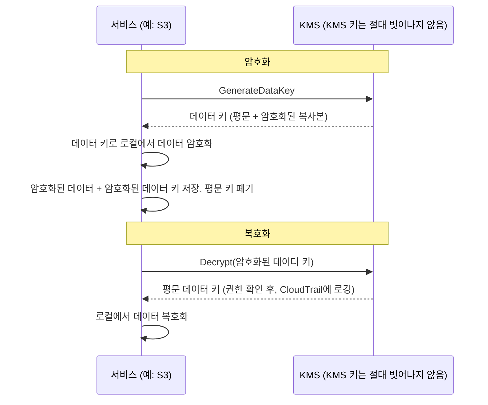

# 16장: 키, 잠금장치, 그리고 시크릿

git 저장소에는 2년 전으로 거슬러 올라가는 수천 개의 커밋이 있었다. Leo는 20분 동안 스크롤하며, 히스토리를 통해 실타래를 따라가고 있었다 — 특정 데이터베이스 연결 문자열이 처음 나타난 때를 찾아서. 그는 거의 놓칠 뻔했다. 그것은 화요일 오후, 두 개의 평범한 커밋 사이에 끼어 있었고, 그 이후 회사를 떠난 누군가가 푸시했다.

데이터베이스 비밀번호. 평문으로. 히스토리에.

---

*지난 챕터의 네트워크 제어는 이제 엄격했다. 보안 그룹이 측면 이동을 제한했다. NACL이 알려진-나쁜 IP 범위를 차단했다. 경계가 강화됐다. 하지만 보안 감사가 경계가 고칠 수 없는 무언가를 발견했다: 6개월 동안 git 히스토리에 살아 있던 자격증명. 경계 보안은 내부의 시크릿이 안전하다고 가정한다. 이것은 그렇지 않았다.*

---

Leo가 git 히스토리를 검토하다가 발견했다. 데이터베이스 비밀번호. 6개월 전에, 평문으로, Nimbus에 더 이상 근무하지 않는 누군가가 커밋했다 — 연결 문자열 두 줄 아래에 배포 파이프라인의 IAM 액세스 키도 포함한 `.env` 파일의 일부. 커밋이 공개적이었다. 비밀번호는 그 이후로 변경됐다 — 하지만 그들은 확실히 알지 못했다. 그들은 두 자격증명 중 하나라도 건드렸던 모든 시스템을 확인했다. 4시간이 걸렸다. 그날 Nimbus는 코드에 시크릿을 넣는 것을 중단하기로 결정했다.

"누군가 레포를 포크하면 무슨 일이 일어나는지 생각해봤어?" Priya가 말했다. "Git 히스토리는 영구적이야. 비밀번호를 바꾸더라도, 수정 전에 레포를 클론한 누구든 로컬 히스토리에 여전히 이전 자격증명을 갖고 있어."

"확인했어요," Leo가 말했다. "비밀번호가 3개월 전에 변경됐어요. 모든 시스템 확인됐어요."

"그게 최소야," Priya가 말했다. "하지만 그 자격증명이 건드린 모든 시스템이 검토되어야 해. 네가 아는 것뿐만 아니라."

**4시간 감사**

Leo가 오전 10시에 git 히스토리에서 유출된 `.env` 파일을 발견했다. 오후 2시까지, 그들은 중요한 질문에 대한 답을 얻었다: 두 자격증명 중 하나라도 — 데이터베이스 비밀번호나 그것과 함께 커밋된 액세스 키 — Nimbus 시스템 외의 누군가에 의해 사용됐는가?

감사는 네 가지 범주를 거쳤다.

**RDS 접근 로그**: 데이터베이스로의 모든 연결, 타임스탬프가 찍히고 로깅됨. 유출된 비밀번호가 세 개의 연결 문자열에 나타났다 — 모두 Nimbus VPC의 EC2 인스턴스에서, 모두 예상된 소스 IP로. 외부 연결 없음. 비밀번호가 외부에서 데이터베이스에 연결하는 데 사용되지 않았다.

**S3 접근 로그**: 유출된 액세스 키는 `nimbus-receipts` 버킷에 대한 권한이 있는 배포 파이프라인의 IAM 사용자에 속했다. Leo가 지난 6개월에 대한 S3 서버 접근 로그를 쿼리했다. 모든 접근이 `us-west-2` EC2 인스턴스나 CloudFront 오리진 가져오기 역할에서 왔다. 이상 없음.

**CloudTrail API 호출**: 유출된 액세스 키 ID로 이루어진 모든 AWS API 호출. Leo가 그 키에 대해 CloudTrail 이벤트를 필터링했다. 312개의 이벤트 — 모두 배포 파이프라인에서의 일상적인 `s3:PutObject` 호출, 모두 같은 IP에서, 모두 업무 시간 내에. 키는 CI/CD 서버와 일치하는 하나의 IP 주소에서만 사용됐다.

"그리고 CI/CD 서버는," Priya가 말했다. "VPC 내부에 있어. 외부 엔드포인트로 HTTPS를 통해 데이터를 유출해야 했을 거고, 우리가 흐름 로그에서 그것을 봤을 거야."

"확인했어요," Leo가 말했다. "지난 6개월 동안 그 서버에서 비-AWS IP로의 아웃바운드 HTTPS 없음."

**판결**: 두 자격증명 모두 Nimbus 팀 외의 누군가에 의해 사용되지 않았다. 노출은 위험이었지, 침해가 아니었다.

"하지만 확실할 수는 없어," Priya가 말했다. "로그를 기반으로 합리적으로 확신할 수 있어. 확실할 수는 없어. 그 구분이 중요해."

"무엇이 우리를 확실하게 만들까요?"

"자격증명 노출 후 아무것도 너를 확실하게 만들지 않아. 자격증명을 교체하고, 접근을 감사하고, 발견 사항을 문서화하고, 더 나은 제어로 앞으로 나아가. 확실성은 이용할 수 없어."

Tom이 대화 중에 계산하고 있었다. "엔지니어 세 명의 4시간. 완전 부담 비용으로 4천 달러 정도. 더하기 자격증명 교체, 문서화, 사건 작성."

"그리고 그건 조사일 뿐이야," Priya가 말했다. "침해는 몇 배 더 컸을 거야. 규제 통지. 고객 커뮤니케이션. 가능한 벌금."

"그러니까 4천 달러 교훈이 싼 거였네요," Tom이 말했다.

"상당히," Priya가 말했다. "반복하지 말자."

---

**두 가지 문제: 시크릿 저장과 데이터 암호화**

민감한 정보 주변의 보안에는 두 가지 별개의 문제가 있다:

**자격증명 저장**(데이터베이스 비밀번호, API 키, 연결 문자열): 어디에 있는가? 누가 접근할 수 있는가? 애플리케이션을 재배포하지 않고 어떻게 교체하는가?

**데이터 암호화**(고객 정보, 결제 레코드, PII): 누군가 데이터베이스나 S3 버킷에 무단 접근하더라도 데이터를 읽을 수 없도록 어떻게 보장하는가?

AWS는 각 문제에 대한 전용 서비스가 있다:

- **AWS Secrets Manager**: 자격증명을 안전하게 저장하고 관리한다
- **AWS KMS (Key Management Service)**: 데이터를 암호화하고 복호화하기 위한 암호화 키를 관리한다

Secrets Manager를 키링으로 생각하라: 키(자격증명)를 보유하고, 정리된 상태로 유지하고, 일정에 따라 교체한다. KMS를 금고로 생각하라: 가치 있는 것을 보유하지 않는다 — 가치 있는 것을 보호하는 잠금을 여는 키를 보유한다.

**AWS Secrets Manager: 더 이상 하드코딩된 자격증명 없음**

Secrets Manager는 시크릿을 위한 안전한 저장소다: 데이터베이스 자격증명, API 키, OAuth 토큰, SSH 키, 또는 민감한 모든 것.

애플리케이션이 환경 변수나 설정 파일에서 비밀번호를 읽는 대신, 시작 시(또는 필요할 때) Secrets Manager API를 호출하고 시크릿을 검색한다. 시크릿이 디스크에 닿지 않는다. 코드에 나타나지 않는다. 환경 변수에 없다.

흐름은 이렇게 보인다:

**이전 방식**:
```
DB_PASSWORD=supersecretpassword123  # .env 파일 또는 환경 변수에
```

**Secrets Manager 방식**:
```python
import boto3
client = boto3.client('secretsmanager')
secret = client.get_secret_value(SecretId='nimbus/production/db-password')
password = json.loads(secret['SecretString'])['password']
```

EC2 인스턴스는 해당 특정 시크릿에 대해 `secretsmanager:GetSecretValue`를 호출하는 권한이 있는 IAM 역할이 필요하다. 다른 서비스는 읽을 수 없다. 시크릿은 절대 코드에 없다.

여러분은 궁금할 것이다: 왜 그냥 환경 변수를 사용하지 않는가? 그것들이 더 간단하다 — 배포 시간에 설정하면, 애플리케이션이 읽는다. 환경 변수는 숨겨진 것처럼 보이지만, 배포 설정, CI/CD 시크릿 저장소에 저장되고, 디버그 세션 중 로깅될 수 있고, 실행 중인 프로세스에 접근하는 누구에게나 보인다. 더 중요하게, 그것들은 정적이다: 한 번 설정되면, 누군가 수동으로 업데이트할 때까지 바뀌지 않는다. Secrets Manager는 IAM 접근 제어, CloudTrail을 통한 전체 감사 로깅, 자동 교체가 있는 암호화된 서비스에 자격증명을 저장한다. 환경 변수는 교체되지 않는다. 유출된 환경 변수는 누군가 수동으로 바꿀 때까지 유효하게 남는다.

**자동 교체: 진정한 힘**

Secrets Manager의 가장 큰 기능은 시크릿을 저장하는 것이 아니라 — 자동으로 교체하는 것이다.

시나리오: 30일마다 Secrets Manager가 새 데이터베이스 비밀번호를 생성하고, RDS에서 업데이트하고, 저장된 시크릿을 업데이트하며, 애플리케이션이 다음에 필요할 때 새 비밀번호를 검색한다. 수동 개입 없음. 배포 없음. "이걸 교체해야 한다는 것을 기억해야 한다"가 없음.

교체는 Lambda 함수로 구현된다. AWS는 RDS 데이터베이스(MySQL, PostgreSQL, Aurora)를 위한 템플릿을 제공한다. 어떤 자격증명 유형에든 함수를 커스터마이징할 수 있다.

"그게 한 달에 얼마나 들어?" Tom이 물었다.

Secrets Manager는 시크릿당 월별 더하기 API 호출당 요금을 부과한다. 소수의 데이터베이스 비밀번호와 API 키에 대해, 비용은 월 달러 단위 — 사건 비용에 비해 무시할 수 있다.

"지난주 침해가," Priya가 말했다. "조사하고 수정하는 데 얼마나 들었을까요?"

Tom이 잠시 조용했다. "내 시간, 당신 시간, Leo의 주말 포함... 수천 달러 정도요."

"Secrets Manager가 정적 키가 악용되기 전에 잡아냈을 거예요. 그리고 자동으로 교체했을 거예요."

Tom이 가격 페이지를 열었다.

**교체 중 무슨 일이 일어나는가**

"잠깐 — 그런데 *왜* 그렇게 하는 거죠?" Maya가 물었다. "데이터베이스 비밀번호가 교체되면, 애플리케이션이 망가져요? 배포 없이 어떻게 새 비밀번호를 받죠?"

이것은 합당한 우려였다. 중단 없는 교체는 주의가 필요하다.

Secrets Manager 교체는 단계로 작동한다 — "이전 비밀번호가 갑자기 무효, 애플리케이션 크래시" 시나리오를 방지하도록 설계됨:

**1단계: 새 시크릿 버전 생성.** Secrets Manager가 새 비밀번호를 생성하고 시크릿의 대기 버전으로 저장한다. 현재 버전이 여전히 활성이다.

**2단계: 서비스에 설정.** 교체 Lambda가 데이터베이스를 호출하여 비밀번호를 새 값으로 업데이트한다. 유의하라: 기본 **단일 사용자** 교체 전략으로는 이전 비밀번호가 막 작동을 멈췄고(PostgreSQL의 `ALTER ROLE ... PASSWORD`가 즉시 효과를 발휘) 새 버전이 아직 현재가 아닌 짧은 순간이 있다. 무중단 교체를 위해, Secrets Manager는 **교대 사용자** 전략을 지원한다: 동일한 권한을 가진 두 데이터베이스 사용자, 교체가 항상 *비활성* 것을 업데이트하고 그런 다음 전환한다 — 활성 자격증명이 비행 중간에 절대 무효화되지 않는다. 기억할 시험 문구는 "교대 사용자 교체 전략"이다.

**3단계: 새 시크릿 테스트.** 교체 Lambda가 새 비밀번호로 연결하여 작동하는지 검증한다. 이것이 실패하면, 교체가 롤백된다.

**4단계: 완료.** Secrets Manager가 새 버전을 현재 버전으로 표시하고 이전 버전을 이전 버전으로 강등한다. 이전 버전은 유예 기간 동안 유지된다.

유예 기간 동안, 두 버전 모두 검색 가능하다. 애플리케이션이 이전 시크릿을 캐시했고 아직 새것을 받지 못했다면, 여전히 연결할 수 있다. 다음에 `GetSecretValue`를 호출할 때, 현재(새) 버전을 받는다.

"그러니까 애플리케이션이 절대 재시작될 필요가 없네요," Leo가 말했다.

"꼭 그렇지는 않아. 애플리케이션이 시작 시 시크릿을 캐시하고 절대 새로 고치지 않으면, 일정에 따라 새로 고치거나 인증 실패를 시크릿을 다시 가져옴으로써 처리해야 해."

"그러니까 교체 Lambda와 애플리케이션이 협력해야 하네요," Maya가 말했다.

"Secrets Manager가 절반을 해. 애플리케이션 코드가 나머지 절반을 해야 해: 필요할 때 시크릿 가져오기, 인증 실패를 다시 가져옴으로써 처리하기."

Leo가 데이터베이스 인증 예외를 잡고, 실패 시 재시도 전에 Secrets Manager에서 새 시크릿을 가져오도록 애플리케이션을 업데이트했다. 두 줄의 오류 처리. 교체가 사용자에게 보이지 않게 됐다.

---

**CI/CD 파이프라인 시크릿 주입**

"배포 파이프라인이 필요한 시크릿을 어떻게 얻는지 생각해봤어?" Priya가 물었다. "파이프라인이 인프라를 배포해. AWS 자격증명이 필요해. 마이그레이션 스크립트를 위한 데이터베이스 연결 문자열이 필요할 수 있어."

Leo가 현재 설정을 설명했다: 시크릿이 GitHub Actions Secrets로 저장됐다 — GitHub에서 저장 시 암호화되고, 런타임에 환경 변수로 주입됨.

"자격증명이 GitHub에 있네," Priya가 말했다.

"암호화됐어요."

"타사 시스템에. 하나의 GitHub 침해가 모든 파이프라인 시크릿을 노출해."

해결책: 배포 파이프라인이 OIDC 페더레이션(14장에서 다룸)을 통해 AWS에 인증하고 런타임에 Secrets Manager에서 필요한 시크릿을 검색한다. GitHub에 저장된 시크릿 없음. 파이프라인의 AWS 역할은 특정 시크릿을 읽는 권한을 갖고, 그 외는 없다.

```yaml
# GitHub Actions 워크플로우
- name: Get DB Migration Credentials
  env:
    AWS_DEFAULT_REGION: us-west-2
  run: |
    SECRET=$(aws secretsmanager get-secret-value \
      --secret-id nimbus/staging/db-migration \
      --query SecretString --output text)
    DB_URL=$(echo $SECRET | jq -r '.url')
    # DB_URL로 마이그레이션 실행 — 절대 파일에 저장되지 않음
    flyway -url="$DB_URL" migrate
```

시크릿이 가져와지고, 메모리에서 사용되고, 폐기된다. 절대 디스크에 쓰여지지 않고, 작업 후 지속되는 환경 변수에 절대 저장되지 않고, 로그 파일에 절대 없다.

"시크릿이 로그에 출력되면요?" Leo가 물었다.

"GitHub Actions가 GitHub Secrets로 설정된 시크릿의 값을 자동으로 마스킹해. 하지만 이 시크릿은 GitHub Secret이 아니야 — Secrets Manager에서 와. 수동으로 마스킹하거나, 더 좋게는, 절대 로깅하지 마."

"그러니까 규율은: 가져오기, 사용하기, 폐기하기. 절대 시크릿을 로깅하지 않기. 절대 파일에 저장하지 않기."

"그 규율이," Priya가 말했다. "4시간 감사가 우리가 실패하고 있었다고 확인한 거야."


**AWS KMS: 잠금 공장**

"잠깐 — 그런데 *왜* 그렇게 하는 거죠?" Maya가 물었다. "왜 별도의 키 관리 서비스죠? 데이터를 직접 암호화하고 키를 Secrets Manager에 저장하면 안 되나요?"

암호화 키를 Secrets Manager에 저장할 수 있다. 하지만 그러면 누가 키에 대한 접근을 제어하는가? 무엇이 키가 교체되도록 보장하는가? 무엇이 감사자에게 키가 승인된 서비스에 의해서만 사용됐다는 것을 증명하는가? KMS가 이 모든 질문에 답한다. 단지 저장이 아니다 — 하드웨어 지원 보안, 키당 세밀한 IAM 정책, 모든 사용의 완전한 감사 추적을 가진 키 수명 주기 관리 서비스다. Secrets Manager는 시스템에 연결하는 데 필요한 것을 저장한다. KMS는 시스템 자체를 보호한다.

AWS KMS(Key Management Service)는 **암호화 키** — 데이터를 암호화하고 복호화하는 데 사용되는 비밀 값 — 를 관리한다.

비유: KMS는 마스터 키를 보유하는 잠금 상자 회사와 같다. 당신의 데이터(상자의 내용물)는 암호화된다. KMS 키를 사용하는 권한을 가진 사람만 복호화할 수 있다. KMS는 CloudTrail에서 모든 키의 모든 사용을 기록한다.

**고객 마스터 키(CMK)** — 이제 KMS 키라고 불리는 — 는 세 가지 소유 유형이 있다:

**AWS 소유 키**: AWS가 소유하고 많은 고객 계정에 걸쳐 사용하는 키 — 절대 볼 수 없고, 절대 비용을 지불하지 않으며, 계정에 나타나지 않는다. 여러 서비스 기본값이 그것들을 사용한다(예를 들어 DynamoDB의 기본 암호화).

(명확히 해둘 가치가 있는 한 가지 구분: S3의 기본 **SSE-S3** 암호화는 KMS 키 모델이 전혀 *아니다* — S3가 자체 AES-256 키를 KMS 외부에서 완전히 관리하며, 볼 키도 없고 키 사용 감사 추적도 없다. **SSE-KMS**가 KMS를 거치는 S3 옵션으로, AWS 관리 키 `aws/s3`나 고객 관리 키를 사용한다. 시험 트리거: "누가 암호화 키를 사용했는지 감사" 또는 "교체와 키 정책 제어" → 고객 관리 키를 가진 SSE-KMS — 모든 사용이 CloudTrail에 도착한다.)

**AWS 관리 키**: AWS가 S3, EBS, RDS 같은 서비스를 위해 *당신의 계정에* 자동으로 키를 만들고 관리한다(`aws/s3`처럼 명명됨). CloudTrail에서 그것을 보고 사용을 감사할 수 있지만, 정책이나 교체를 바꿀 수 없다 — AWS가 매년 자동으로 교체한다. 무료.

**고객 관리 키**: KMS에서 키를 만들고 모든 측면을 제어한다: 누가 사용할 수 있는지, 언제 교체되는지, 누가 관리할 수 있는지. 90일에서 2,560일(7년) 사이의 설정 가능한 기간으로 자동 키 교체를 활성화할 수 있다; 기본 교체 기간은 365일(연간)이다. **온디맨드 교체**를 즉시 트리거할 수도 있다 — 일정을 기다리지 않고, 의심되는 노출 후에 유용하다. 참고: 자동 교체는 KMS가 생성한 자료를 가진 대칭 키에 적용된다 — 비대칭 키와 가져온 키 자료는 자동 교체할 수 없다. 비용: 키당 월 $1 더하기 API 호출당 요금.

고객 관리 KMS 키를 선택하면, 교체 일정, 접근 정책, 감사 가시성에 대한 완전한 제어를 얻지만, 키당 월별로 지불하고 키 관리의 책임을 진다; AWS 관리 키를 선택하면, 운영 오버헤드 제로와 키 자체에 대한 비용 없이 암호화를 얻지만, 교체 일정이나 키 정책을 커스터마이징할 수 없다 — 그것들은 AWS에 의해 완전히 관리된다.

**AWS 서비스의 암호화: KMS 통합**

대부분의 AWS 서비스는 암호화를 위해 KMS와 통합한다:

**S3**: 버킷에서 "KMS를 사용하는 서버 측 암호화"를 활성화한다. 모든 객체가 KMS 키로 저장 시 암호화된다. 객체를 읽으려면 S3 버킷과 KMS 키 *모두*에 대한 권한이 필요하다.

**RDS**: 생성 시 암호화를 활성화한다. 데이터베이스 스토리지, 백업, 스냅샷이 모두 KMS 키로 암호화된다. 참고: 기존 암호화되지 않은 RDS 인스턴스에서 암호화를 활성화할 수 없다 — 스냅샷을 만들고, 암호화가 활성화된 상태로 스냅샷을 복사하고, 복원해야 한다.

**EBS**: KMS로 볼륨을 암호화한다. 암호화된 스냅샷에서 만들어진 새 볼륨이 자동으로 암호화된다.

**DynamoDB**: 모든 테이블에서 KMS를 사용한 저장 시 암호화가 기본으로 활성화된다.

**ElastiCache Redis**: 민감한 캐시된 데이터에 대해 KMS를 사용한 저장 시 암호화.

원칙: 데이터는 저장 시(디스크에 저장) 및 전송 중(네트워크를 통해 이동)에 암호화되어야 한다. KMS가 저장 시 암호화를 처리한다. TLS/SSL(AWS 서비스에 의해 자동으로 제공됨)이 전송 중 암호화를 처리한다.

**봉투 암호화: KMS가 실제로 작동하는 방법**

여기에 KMS 동작과 시험 질문을 이해하는 데 도움이 되는 세부 사항이 있다.

KMS는 대부분의 경우 데이터를 직접 암호화하지 않는다. **봉투 암호화**를 사용한다:

1. KMS가 **데이터 키**(고유한 대칭 키)를 생성한다
2. 서비스가 데이터 키를 사용하여 로컬로 데이터를 암호화한다(빠름 — 대칭 암호화)
3. 서비스가 KMS에 데이터 키 자체를 암호화하도록 요청한다(KMS 키 사용)
4. 암호화된 데이터와 암호화된 데이터 키 모두 저장된다
5. 실제 데이터는 절대 서비스를 벗어나지 않는다 — 데이터 키만 암호화/복호화를 위해 KMS로 간다

데이터를 읽을 때:

1. 서비스가 KMS에 데이터 키를 복호화하도록 요청한다
2. KMS가 권한을 확인하고, 데이터 키를 복호화하고, 반환한다
3. 서비스가 복호화된 데이터 키를 사용하여 로컬로 데이터를 복호화한다



이것은 KMS가 모든 것을 KMS API를 통해 보내지 않고 매우 큰 데이터를 처리할 수 있다는 것을 의미한다. 작은 키만 KMS로 간다. CloudTrail이 모든 KMS API 호출을 기록한다 — 모든 암호화 및 복호화 작업을.

**KMS 키 정책: 접근 모델**

"IAM 정책과 키 정책이 충돌하면 무슨 일이 일어나는지 생각해봤어?" Priya가 물었다. "KMS는 IAM 위에 자체 접근 제어가 있어."

KMS 키는 **키 정책**을 갖고 있다 — 키 자체에 연결된 리소스 기반 정책. 그것들은 IAM 정책과 구별되고 다른 평가 규칙을 따른다.

주체가 KMS 키를 사용하려면, 두 가지가 참이어야 한다:

**첫째**: 키 정책이 그것을 허용해야 한다. 키 정책이 주체에게 명시적으로 접근을 부여하지 않으면, 그들은 키를 사용할 수 없다 — IAM 정책이 뭐라고 하든. 이것은 IAM 정책만으로 충분한 대부분의 AWS 리소스와 다르다.

**둘째**: 주체의 IAM 정책이 KMS 액션(예: `kms:Decrypt`, `kms:GenerateDataKey`)을 허용해야 한다.

둘 다 예라고 말해야 한다. 둘 중 하나가 아니오라고 말하면 액션이 거부된다.

AWS가 고객 관리 키를 위해 만드는 기본 키 정책은 "루트 계정이 이 키를 관리할 수 있다"고 말하는 문장을 포함한다. 이것이 중요하다: 키 정책이 직접 명명하지 않더라도 계정 수준 IAM 관리자가 항상 키에 접근을 부여할 수 있다는 것을 의미한다 — 루트 계정 위임이 자리 잡고 있기 때문이다.

"그러면 키 정책에서 루트 계정을 제거하면," Leo가 물었다. "IAM 정책이 그 키에 대해 작동을 멈춰요?"

"맞아. 루트 계정 위임을 제거하는 것은 키를 너무 엄격하게 잠가서 키 정책에 명명된 특정 주체만 — 계정 관리자조차도 아니라 — 사용할 수 있게 하는 방법이야. 자신의 키에서 자신을 우연히 잠가버리는 방법이기도 해."

"복구할 수 있어요?"

"AWS Support에 연락해서만. 아무도 키를 사용할 수 없고 키 정책을 업데이트할 수 없으면, 그 키로 암호화된 데이터가 사실상 접근 불가능해."

"그러니까 극도로 좋은 이유 없이 키 정책에서 루트 계정을 제거하지 마라."

"맞아."

---

**비대칭 키: 서명과 검증**

KMS는 또한 비대칭 키 쌍 — 공개 키와 프라이빗 키 — 을 지원한다.

사용 사례:

**디지털 서명**: 프라이빗 키로 문서나 JWT 토큰에 서명한다. 공개 키를 가진 누구든 서명이 프라이빗 키 소유자에게서 왔고, 내용이 변조되지 않았다는 것을 검증할 수 있다.

**공개 키 암호화**: 누구든 공개 키로 데이터를 암호화할 수 있다. 프라이빗 키 소유자만 복호화할 수 있다.

Nimbus의 경우, 비대칭 키는 레스토랑 파트너를 위한 웹훅 서명 시스템을 구현했을 때 관련이 생겼다. Nimbus가 레스토랑 파트너의 서버에 이벤트(새 주문, 상태 업데이트)를 보낼 때, 파트너는 이벤트가 실제로 Nimbus에서 왔고 위조되지 않았다는 것을 검증해야 했다.

구현:

1. Nimbus가 비대칭 KMS 키를 만든다(RSA 2048비트, SIGN_VERIFY 알고리즘)
2. 웹훅을 보낼 때, Nimbus가 이벤트 페이로드에 서명하기 위해 프라이빗 키로 `kms:Sign`을 호출한다
3. 서명이 웹훅 헤더에 포함된다
4. Nimbus가 공개 키를 게시한다(KMS 콘솔에서 다운로드 가능)
5. 레스토랑 파트너의 서버가 공개 키를 가져와 모든 들어오는 웹훅의 서명을 검증하는 데 사용한다

프라이빗 키는 절대 KMS를 벗어나지 않는다. Nimbus는 절대 원시 프라이빗 키 자료에 접근할 수 없다. KMS가 하드웨어 보안 모듈 안에서 서명 작업을 수행한다.

"그러니까 누군가 Nimbus 서버를 침해하더라도," Rafael이 말했다. "웹훅 서명을 위조할 수 없네요. 프라이빗 키가 어떤 서버가 아니라 KMS에 있으니까요."

"맞아. 서명은 KMS API 호출이 필요해. 모든 API 호출이 CloudTrail에 로깅돼. 누군가 사기 이벤트에 서명하려 하면, API 호출을 볼 거야."

---

**키 삭제 이야기**

KMS 설정 3개월 후, Tom이 실수를 했다.

그는 사용하지 않는 AWS 리소스 — 이전 Lambda 함수, 오래된 S3 버킷, 버려진 CloudWatch 대시보드 — 를 정리하고 있었다. 그는 빠르게 움직이고 있었다. 그가 실수로 KMS 키를 삭제로 예약했다.

키는 `nimbus/prod/order-receipts`였다 — 주문 영수증 S3 버킷을 암호화하는 데 사용된 고객 관리 키.

"어제 열두 개의 리소스를 일괄 삭제했고 열두 번째가 뭔지 확인하지 않았어요," Tom이 무미건조하게 말했다. 그는 삭제를 예약하고 넘어갔다. 그는 다음 날 아침 자신의 행동을 검토할 때 실수를 알아챘다.

그가 KMS 콘솔을 열었다. 키 상태가 이렇게 읽혔다: "삭제 대기 중. 7일 후 삭제."

그는 그것을 최소 대기 기간으로 예약했었다.

"취소할 수 있어요?" 그가 물었다.

Priya가 문서를 열었다. "응. 대기 기간 동안, 키가 비활성화되지만 삭제되지 않아. 삭제를 취소할 수 있어."

Tom이 1분 내에 삭제를 취소했다. 키가 활성 상태로 복원됐다.

"7일이 최소 대기 기간이야," Priya가 말했다. "AWS가 그것을 강제하는 건 키가 삭제되고 데이터가 그것으로 암호화됐다면, 그 데이터가 영원히 사라지기 때문이야. 복구 불가능. 대기 기간이 실수를 깨달을 시간을 줘."

"대기 기간이 얼마나 길어야 해요?"

"최대는 30일이야. 프로덕션 데이터를 암호화하는 어떤 키든, 30일을 사용해. 사고에 대한 추가 3주의 보호가 사소한 불편보다 가치 있어."

Tom이 모든 프로덕션 키 삭제 설정을 30일로 업데이트했다. 그는 또한 어떤 KMS 키 상태든 "삭제 대기 중"으로 바뀌면 발화하는 CloudWatch 알람을 설정했다 — 그래서 다음에 누군가(그를 포함하여)가 같은 실수를 하면, 팀이 5분 내에 알 것이다.

---

**Secrets Manager vs. Parameter Store**

AWS에는 또한 설정 값(시크릿만이 아닌)을 저장하는 **Systems Manager Parameter Store**가 있다. Parameter Store는 더 저렴하다 — 표준 파라미터는 무료. KMS를 사용하여 암호화된 파라미터도 저장할 수 있다.

교체가 필요한 시크릿: Secrets Manager.

설정 값과 민감하지 않은 파라미터: Parameter Store(무료 계층이 매우 관대하다).

애플리케이션 설정(포트 번호, 기능 플래그, 환경별 설정): Parameter Store.

| | Secrets Manager | SSM Parameter Store |
|---|---|---|
| 자동 교체 | 예(Lambda 지원) | 아니오 |
| 비용 | 시크릿당 월 ~$0.40 | 무료(표준) |
| 암호화 | 항상 | 선택적(KMS 사용) |
| 버전 관리 | 예 | 예 |
| 교차 계정 접근 | 예 | 제한적 |
| 가장 적합 | 데이터베이스 비밀번호, API 키 | 설정 값, 기능 플래그 |

## 문 위의 인증서

시크릿 마이그레이션 2주 후, Priya가 전화로 Nimbus 스테이징 환경을 검토하다가 주소 표시줄을 알아챘다.

"안전하지 않음."

그녀가 프로덕션 URL을 열었다. 같은 것.

"Leo," 그녀가 전화기를 테이블에 놓으며 말했다. "우리 HTTP로 실행되고 있어?"

Leo가 확인했다. "ALB 리스너가 포트 80에 있어요. HTTPS를 절대 설정하지 않았어요."

"그러니까 우리 사용자가 하는 모든 요청 — 모든 주문, 모든 로그인 — 이 암호화되지 않은 HTTP로 가고 있어?"

"RDS 연결에 TLS가 있어요," Leo가 제안했다.

"그건 애플리케이션과 데이터베이스 사이의 전송 중 데이터야. 나는 사용자의 브라우저와 우리 로드 밸런서 사이의 전송 중 데이터를 말하는 거야. 그건 전혀 암호화되지 않았어."

Tom이 듣고 있었다. "그게 보안 문제예요 아니면 인식 문제예요?"

"둘 다," Priya가 말했다. "암호화되지 않은 HTTP는 사용자와 우리 서버 사이의 어떤 네트워크 — 커피숍 라우터, ISP — 가 트래픽을 읽을 수 있다는 거야. 비밀번호, 주문 세부 사항, 세션 토큰. 그리고 현대 브라우저가 사용자에게 '안전하지 않음'으로 경고해. 그게 전환율을 죽여."

"그러니까 TLS 인증서가 필요하네요," Maya가 말했다. "그게 얼마나 들어요?"

"무료," Priya가 말했다. "AWS Certificate Manager."

**AWS Certificate Manager(ACM)**는 AWS 관리 서비스 — ALB, CloudFront 배포, API Gateway — 와 함께 사용하기 위한 무료 TLS/SSL 인증서를 프로비저닝한다. 인증서를 구입하거나, 갱신 캘린더를 관리하거나, 프라이빗 키 자료를 건드리지 않는다. ACM이 전체 인증서 수명 주기를 처리한다.

ACM이 발급한 인증서는 13개월 동안 유효하다. 만료 전에, ACM이 자동으로 갱신한다. 갱신이 성공하면, 새 인증서가 당신의 어떤 조치 없이 로드 밸런서나 배포에 연결된다. 브라우저의 자물쇠가 녹색으로 유지된다. 당신이 설정하는 것을 잊은 만료 알림이 절대 발화하지 않는다.

**두 가지 유형의 ACM 인증서**:

**공개 인증서**는 Amazon의 인증 기관에 의해 발급되고 모든 주요 브라우저에 의해 신뢰된다. ALB, CloudFront, API Gateway와 함께 사용하기에 완전히 무료다. DNS나 이메일을 통해 도메인 소유권을 검증한다.

**프라이빗 인증서**는 AWS Private CA에 의해 발급된다 — 내부 서비스(서비스 간 mTLS, 내부 도구, VPN 클라이언트)를 위해 운영하는 관리형 프라이빗 인증 기관. Private CA는 월별 비용이 있다.

Nimbus의 경우, 공개 인증서가 올바른 선택이었다.

**DNS 검증 vs. 이메일 검증**:

Leo가 ACM 콘솔을 열고 `eatnimbus.com`과 `*.eatnimbus.com`에 대한 인증서 요청을 시작했다.

"소유권을 어떻게 검증할지 묻네요," 그가 말했다. "DNS나 이메일."

"DNS," Priya가 말했다. "항상 DNS."

DNS 검증으로, ACM이 특정 CNAME 레코드를 호스팅 존에 추가한다. Route 53이 이것을 자동으로 할 수 있다 — 콘솔에서 한 번 클릭. 그 CNAME 레코드가 존재하는 한, ACM이 어떤 사람 조치 없이 인증서를 자동 갱신할 수 있다. 이메일 검증은 도메인의 등록된 연락처에 이메일을 보내고 인증서가 갱신될 때마다 수동 클릭을 요구한다. 그 클릭이 잊혀진다. DNS 검증은 누구도 무언가를 기억할 것을 요구하지 않는다.

"그러니까 CNAME 레코드를 한 번 추가하면," Leo가 말했다. "영원히 갱신돼요?"

"누군가 CNAME 레코드를 삭제할 때까지," Priya가 말했다. "CNAME 레코드를 삭제하지 마."

Leo가 인증서를 요청하고, Route 53에 검증 CNAME을 추가하고(ACM이 자동으로 하겠다고 제안), 5분을 기다렸다. 인증서 상태가 발급됨으로 바뀌었다. 그가 그것을 포트 443의 ALB HTTPS 리스너에 연결하고 모든 HTTP 트래픽을 HTTPS로 보내기 위해 포트 80에 리디렉션 규칙을 추가했다.

Tom이 프로덕션 URL을 새로고침했다.

자물쇠가 나타났다.

표시할 가치가 있는 한 가지 리전 세부 사항: 인증서는 리전 리소스이고, 그것을 사용하는 서비스와 같은 리전에 있어야 한다. ALB의 경우, 그것은 ALB의 리전이다. **CloudFront**의 경우, 인증서는 **`us-east-1`**에서 요청(또는 가져오기)되어야 한다 — 항상, 오리진이 어디서 실행되든 무관하게 — CloudFront가 거기 고정된 글로벌 서비스이기 때문이다. Leo는 13장에서 이미 이것에 걸려 넘어졌다; 그것은 신뢰할 수 있는 시험 사실이기도 하다.

**ACM 인증서가 할 수 없는 한 가지**:

"인증서를 다운로드할 수 있어요?" Leo가 물었다. "내부 관리 EC2 인스턴스에 설치하고 싶어요."

"아니," Priya가 말했다.

무료 ACM 공개 인증서는 내보낼 수 없다. 프라이빗 키를 다운로드하여 EC2 인스턴스, Nginx 서버, 또는 AWS 관리 서비스 외부의 어떤 것에든 설치할 수 없다. 프라이빗 키 자료는 절대 ACM을 벗어나지 않는다. 이것은 의도적이다 — 프라이빗 키가 유출되거나, 안전하지 않게 저장되거나, 인증서가 만료될 때 잊혀지는 것을 방지한다.

설치 가능한 인증서가 필요한 사용 사례 — 사용자 정의 프록시로 작동하는 EC2 인스턴스, 온프레미스 서버 — 에는 세 가지 경로가 있다: 타사 기관(예를 들어 Let's Encrypt)의 인증서, 인증서 내보내기가 활성화된 AWS Private CA, 또는 — 2025년 6월부터 — 프라이빗 키를 어디서든 사용할 수 있도록 *내보낼 수* 있는 ACM의 유료 **내보내기 가능 공개 인증서**(발급 시 옵트인, FQDN이나 와일드카드당 청구).

"우리 ALB와 CloudFront 배포에는," Priya가 말했다. "ACM이 정확히 맞아. 무료, 자동, 그리고 우리가 절대 키를 건드리지 않아."

## 장점과 한계

**AWS Secrets Manager**:

- 코드 변경이나 배포 없이 자동 시크릿 교체
- 시크릿당 세밀한 IAM 접근 제어(각 시크릿이 별도의 IAM 리소스)
- 버전 관리 — 교체 중 이전 버전이 접근 가능하게 남아, 연결 끊김을 방지
- CloudTrail을 통한 감사 — 모든 `GetSecretValue` 호출이 호출자의 신원과 함께 로깅됨
- 교차 계정 접근 — 한 계정의 시크릿을 다른 계정의 역할과 공유할 수 있음
- 비용: 시크릿당 월 ~$0.40 + API 호출(대략 10,000 API 호출당 $0.05)

**AWS KMS**:

- 전체 감사 추적이 있는 중앙 집중식 키 관리 — 모든 암호화 및 복호화 로깅
- 고객 관리 키에 대한 설정 가능한 자동 키 교체(90일에서 2,560일; 기본 365일) — 이전 키 자료가 여전히 기존 데이터를 복호화하고, 새 키 자료가 새 데이터를 암호화
- 키당 세밀한 IAM 권한(키 정책 + IAM 정책 — 둘 다 허용해야 함)
- Hardware Security Module(HSM) 지원 — 키가 절대 평문으로 HSM을 벗어나지 않음
- 재해 복구 시나리오를 위한 멀티 리전 키 지원
- 디지털 서명과 검증을 위한 비대칭 키 지원
- 비용: 키당 월 $1 + 10,000 API 호출당 $0.03

**복잡해지는 부분**:

- KMS 키 정책은 IAM 정책과 별개이고(그리고 함께 평가됨) — 접근 거부 오류를 디버깅하려면 둘 다 확인이 필요하다
- 저장 시 암호화는 사전에 계획되어야 한다 — 기존 암호화되지 않은 RDS 인스턴스를 제자리에서 암호화할 수 없다
- KMS에서 키 삭제는 7-30일의 대기 기간이 있다 — 안전 메커니즘이지만, 설정 중 잊기 쉽고 우연히 트리거하기 위험하다
- 교체는 애플리케이션 코드가 인증 실패 시 시크릿을 다시 가져오는 것을 처리하는 것을 요구한다 — Secrets Manager가 자격증명을 교체하지만, 애플리케이션이 그것을 받아야 한다
- Secrets Manager 비용은 대규모에서 시크릿 수와 API 호출 볼륨으로 확장된다
- 기본 키 정책(루트 계정 위임 포함)을 보존하는 것이 중요하다 — 그것을 제거하면 관리자가 키에서 잠길 수 있다

## 요약

침해된 자격증명을 그것이 건드린 모든 시스템을 통해 추적하는 데 보낸 4시간은 Secrets Manager가 방지할 수 있었던 4시간이었다. 자동 교체는 도난당한 자격증명이 짧은 수명을 가진다는 것을 의미한다. KMS는 누군가 데이터에 도달하더라도, 사용 권한이 없는 키 없이는 그것을 읽을 수 없다는 것을 의미한다. 그리고 30일 키 삭제 대기 기간은 우연한 삭제가 데이터 손실 사건이 되기 전에 취소될 수 있다는 것을 의미한다.

- 자격증명을 코드, 환경 변수, 또는 버전 관리에 커밋된 설정 파일에 절대 저장하지 마라.
- **Secrets Manager**는 자격증명을 안전하게 저장하고 자동으로 교체한다. 애플리케이션이 런타임에 API를 통해 시크릿을 가져온다.
- **교체**는 단계로 일어난다: 새 버전 생성, 서비스에서 업데이트, 테스트, 승격. 이전과 새 버전 모두 잠시 유효하여, 교체 중 연결 끊김을 방지한다.
- **KMS**는 암호화 키를 관리한다. 대부분의 AWS 서비스는 저장 시 암호화를 위해 KMS와 통합한다.
- **봉투 암호화**: KMS는 데이터가 아니라 키를 암호화한다. 서비스가 로컬 데이터 키를 사용하여 데이터를 암호화하고, KMS가 그것을 암호화한다. 작은 키만 KMS API를 통과한다.
- **고객 관리 KMS 키**: 교체(설정 가능 90–2,560일, 기본 365일 연간), 접근, 감사에 대한 완전한 제어(월 $1). **AWS 관리 키**: 자동, 설정 불필요, 무료.
- **KMS 키 정책**: 키 정책은 IAM과 함께 작동하는 리소스 기반 정책이다. 둘 다 예라고 말해야 한다. 기본 키 정책의 루트 계정 위임은 IAM 관리자가 항상 접근을 부여할 수 있도록 보장한다.
- **비대칭 키**: KMS는 서명과 검증을 위한 RSA와 ECC 키 쌍을 지원한다. 프라이빗 키가 절대 HSM을 벗어나지 않는다.
- **키 삭제**: 최소 7일, 최대 30일 대기 기간. 삭제된 키는 영구적으로 접근 불가능한 암호화된 데이터를 의미한다. 프로덕션 키에 30일을 사용하고, 삭제 대기 상태를 모니터링하라.
- **CI/CD 시크릿**: OIDC 페더레이션을 사용하여 런타임에 Secrets Manager에서 가져오라. 시크릿을 CI/CD 플랫폼 변수로 절대 저장하지 마라.

## 시험 팁

*SAA-C03 도메인: 보안 아키텍처 설계(도메인 1, 태스크 1.3)*

- **Secrets Manager vs. SSM Parameter Store**: 자동 교체가 필요한 자격증명에는 Secrets Manager; 일반 설정에는 Parameter Store. 시험은 교체 요구사항과 비용 민감성으로 그것들을 구분한다.
- **KMS 키 정책**: KMS 키는 자체 키 정책(리소스 기반 정책)을 갖고 있다. IAM 정책만으로는 KMS 키에 접근이 허가되지 않는다 — 키 정책이 명시적으로 그것을 허용해야 한다. 키 정책과 IAM 정책 둘 다 액션을 허용해야 한다.
- **RDS 암호화**: 기존 암호화되지 않은 RDS 인스턴스에서 암호화를 활성화할 수 없다. 프로세스: 스냅샷 만들기 → 암호화가 활성화된 상태로 스냅샷 복사 → 암호화된 스냅샷에서 복원 → 새 인스턴스로 트래픽 마이그레이션.
- **EBS 암호화**: 새 볼륨은 암호화될 수 있다. 암호화된 볼륨의 스냅샷은 항상 암호화된다. 암호화되지 않은 볼륨은 직접 암호화할 수 없다 — 스냅샷 + 복사 + 복원.
- **CloudTrail + KMS**: 모든 KMS API 호출이 CloudTrail에 기록된다. 이것이 핵심 컴플라이언스 기능이다. 시험이 누가 어떤 데이터를 복호화했는지 어떻게 감사하는지 물으면, 답은 CloudTrail + KMS다.
- **멀티 리전 KMS 키**: 교차 리전 API 호출 없이 복호화가 일어날 수 있도록 여러 리전에 키 자료를 복제한다. 시험은 암호화된 데이터가 있는 멀티 리전 재해 복구를 위해 이것을 사용한다.
- **KMS vs. CloudHSM**: KMS는 멀티 테넌트(AWS에 의해 관리). CloudHSM은 당신만 제어하는 전용 하드웨어 보안 모듈. 시험 신호: "FIPS 140-2 레벨 3," "전용 HSM," "고객 관리 암호화 작업" → CloudHSM.
- **봉투 암호화**: KMS가 데이터 키를 생성하고, 서비스가 그것을 사용하여 로컬로 데이터를 암호화하고, KMS가 데이터 키를 암호화한다. 시험 질문: "KMS가 왜 큰 양의 데이터를 직접 암호화하지 않는가?" → 성능; 봉투 암호화가 큰 데이터를 로컬로 유지한다.
- **비대칭 KMS 키**: 디지털 서명, JWT 검증, 또는 공개 키 암호화에 사용. 프라이빗 키가 절대 KMS를 벗어나지 않는다. `kms:Sign`이 서명하는 API 호출; `kms:Verify`가 검증하는 것.
- **키 삭제 대기 기간**: 7-30일. 이 기간 동안, 키가 비활성화되고 사용 불가능하지만, 삭제가 취소될 수 있다. 삭제 후, 그 키로 암호화된 데이터는 영구적으로 복구 불가능하다.
- **ACM (AWS Certificate Manager)**: ALB, CloudFront, API Gateway와 함께 사용하기 위한 무료 공개 TLS 인증서. DNS 검증을 통한 자동 갱신. 무료 공개 인증서는 프라이빗 키를 내보낼 수 없다 — AWS 내부에만 산다(EC2/온프레미스 사용을 위한 유료 *내보내기 가능 공개 인증서* 옵션이 2025년부터 존재). 시험 트리거: "로드 밸런서나 CDN의 HTTPS" → ACM.

## 연습 문제

**연습 1 — 회상**

봉투 암호화 개념을 설명하라. KMS는 왜 애플리케이션 데이터를 직접 암호화하는 대신 작은 데이터 키를 암호화하는가?

*(힌트: 암호화해야 할 1GB의 데이터가 있고, 원격 KMS 서비스에 1GB를 보내는 것의 성능 영향에 대해 생각해보라.)*

**연습 2 — SAA-C03 시나리오**

*시나리오*: 금융 서비스 회사가 RDS MySQL 데이터베이스에 민감한 고객 데이터를 저장한다. 새 컴플라이언스 요구사항은 다음을 요구한다:

1. 모든 데이터는 저장 시 암호화되어야 한다
2. 모든 암호화 키 사용은 감사 가능해야 한다
3. 암호화 키는 고객 제어여야 한다(AWS에 의해 관리되지 않음)
4. 데이터베이스 비밀번호는 90일마다 자동으로 교체되어야 한다

데이터베이스는 6개월 전에 암호화 없이 만들어졌다. 네 가지 요구사항을 모두 가장 잘 충족하는 액션 세트는?

A) 기존 데이터베이스에서 RDS 암호화를 활성화하고; 고객 관리 KMS 키를 만들고; 90일 교체로 Secrets Manager를 설정  
B) 기존 데이터베이스의 스냅샷을 만들고; 고객 관리 KMS 키를 사용하여 암호화가 활성화된 상태로 스냅샷을 복사하고; 암호화된 스냅샷에서 복원하고; 90일 교체로 Secrets Manager를 설정  
C) AWS 관리 키로 새 암호화된 RDS 인스턴스를 만들고; 이전 인스턴스에서 데이터를 마이그레이션하고; 90일 교체로 Secrets Manager를 설정  
D) AWS 관리 키를 사용하여 기존 데이터베이스에서 RDS 저장 시 암호화를 활성화하고; 90일 교체로 Secrets Manager를 설정

**힌트 1**: 기존 암호화되지 않은 RDS 인스턴스에서 암호화를 직접 활성화할 수 없다.

**힌트 2**: "고객 제어" 키는 고객 관리 KMS 키를 의미하지, AWS 관리 키가 아니다.

**힌트 3**: 스냅샷 복사 프로세스가 암호화된 RDS로의 표준 마이그레이션 경로다.

**정답**: B

**설명**: RDS 암호화는 기존 인스턴스에서 활성화할 수 없다. 표준 접근 방식은: 기존 인스턴스 스냅샷 → 고객 관리 KMS 키를 사용하여 암호화가 활성화된 상태로 스냅샷 복사(요구사항 1, 2, 3 충족) → 암호화된 스냅샷에서 복원. 고객 관리 KMS 키는 모든 사용을 CloudTrail에 자동으로 기록(감사)하고 암호화 키를 당신의 제어 아래 유지한다. Secrets Manager가 자동 90일 비밀번호 교체를 처리한다(요구사항 4 충족).

**왜 A가 아닌가?** 기존 암호화되지 않은 RDS 인스턴스에서 암호화를 제자리에서 활성화할 수 없다.

**왜 C가 아닌가?** AWS 관리 키는 "고객 제어" 요구사항(요구사항 3)을 충족하지 않는다.

**왜 D가 아닌가?** A와 같은 문제(제자리에서 활성화할 수 없음) 더하기 AWS 관리 키가 요구사항 3을 충족하지 않는다.

*SAA-C03 도메인: 보안 아키텍처 설계 — 태스크 1.3*

**연습 3 — 아키텍처 과제** *(선택 사항)*

Nimbus는 다음 민감한 데이터를 저장해야 한다:

- 프로덕션 RDS 인스턴스의 데이터베이스 비밀번호
- Stripe API 시크릿 키(결제 처리에 사용)
- DynamoDB의 고객 주문 내역을 암호화하기 위한 대칭 암호화 키
- 레스토랑별 설정 값(API 엔드포인트, 기능 플래그 — 민감하지 않음)

각각에 어떤 AWS 서비스나 접근 방식을 사용하겠는가? 각각에 어떤 교체 전략을 적용하겠는가?

*(단 하나의 정답은 없다. 목표는 보안 도구를 사용 사례에 매핑하는 것을 연습하는 것이다.)*

## 포스트 크레딧 장면

"제가 이미 배포했어요 — 아." Leo가 개발 환경이 여전히 이전 환경 변수를 사용하는 동안 프로덕션 시크릿을 Secrets Manager로 마이그레이션했다. 개발 환경이 망가졌다. 그가 개발 설정을 수동으로 롤백해야 했다.

"먼저 스테이지," Priya가 말했다. "그런 다음 프로덕션."

"알아요," Leo가 말했다.

시크릿이 마이그레이션됐다.

데이터베이스 비밀번호: Secrets Manager, 30일마다 교체.

API 키: Secrets Manager, 결제 공급자의 API를 호출하여 새 키를 생성하는 교체 Lambda.

고객 주문 데이터: 고객 관리 KMS 키로 암호화됨.

이전 자격증명: 비활성화됨. 이전 설정 파일: 삭제됨. 이전 GitHub Actions 시크릿: 제거됨.

"이제 감사 준비가 됐어요," Priya가 말했다.

"감사 준비가 됐다는 게 뭔가요?" Maya가 물었다.

"컴플라이언스 감사자가 우리 코드나 인프라에 자격증명이 하드코딩되지 않았다는 것을 증명하도록 요청하면, 보여줄 수 있어요: 모든 시크릿이 Secrets Manager에 있고, 모든 암호화 키가 KMS에 있고, 모든 접근이 CloudTrail에 기록됩니다."

"마지막으로 CloudTrail 로그를 확인한 게 언제예요?"

멈춤.

"매주 확인해요," Priya가 말했다.

"그리고 뭔가 이상한 게 나타나면, 어떻게 알 수 있죠?"

"그건," Priya가 노트북을 닫으며 말했다. "다음 대화야."

다음 챕터에서: Nimbus와 인터넷 사이에 서 있는 세 레이어의 방어.
