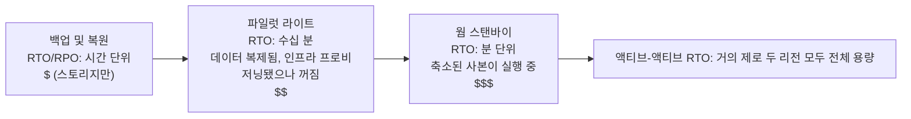

# 18장: 무언가 고장날 때

밤 11시 17분, 불이 꺼졌습니다.

Nimbus 사무실이 아니었습니다 — Leo는 집에 있었고, 소파에 앉아 노트북을 반쯤 닫은 상태였습니다. 불이 꺼진 곳은 그가 한 번도 가본 적 없는 오리건의 데이터 센터, 본 적 없는 건물, 만져본 적 없는 서버로 가득 찬 방이었습니다. 그는 아직 알지 못했습니다. 잠깐의 순간 — 정말 잠깐의 순간 — 어딘가 멀리서 백업 발전기가 작동하기 전까지 완전한 정적이 흘렀습니다. 눈을 떴는지 감았는지 알 수 없는 그런 어둠이었습니다.

그러고 나서 Slack 알림이 도착했습니다.

---

17장의 모니터링 시스템이 갖춰진 후, 팀은 자신감 비슷한 것을 느꼈습니다. 알림이 작동하고 있었습니다. 대시보드는 초록색이었습니다. 로그가 CloudWatch로 흘러들어가고 있었습니다. 그들은 Nimbus 인프라의 모든 구석에 가시성을 연결하는 데 3주를 보냈습니다.

아무도 소리 내어 말하지 않았던 것 — 모니터링이 보호해주지 못하는 것 — 은 가시성과 복원력이 서로 다른 것이라는 사실이었습니다. 무언가가 완벽한 세부 사항까지 실패하는 것을 지켜볼 수는 있습니다. 그것을 지켜보는 것이 실패를 막아주지는 않습니다.

그 교훈은 목요일 밤 11시 23분에 찾아왔습니다.

---

Leo가 Slack 알림을 받았습니다.

"us-west-2 — 데이터 센터 클러스터 장애 — 서비스 저하."

그가 AWS 콘솔을 열었습니다. 가용 영역 중 하나의 EC2 인스턴스들이 상태 확인 실패를 보이고 있었습니다. 그의 Auto Scaling Group이 비정상 인스턴스를 감지하고 교체본을 가동하고 있었습니다 — 같은 영역에서.

실패하고 있던 클러스터에서요.

새 인스턴스도 시작할 수 없었습니다. 그것들은 같은 하드웨어 장애 구역에 있었습니다.

"로드 밸런서가 두 AZ 모두로 트래픽을 라우팅하고 있어," Leo가 혼잣말을 했습니다. "트래픽의 절반이 작동하지 않는 인스턴스로 가고 있어."

그가 EC2 콘솔을 열고 클릭하기 시작했습니다. Load Balancers 아래에서, Application Load Balancer는 두 대상 그룹 모두를 정상으로 표시했습니다 — 포트 80에서 상태 확인이 통과했고, 실패하고 있던 인스턴스조차도 그 확인에는 응답하고 있었기 때문입니다. 단지 실제 요청을 처리할 수 없었을 뿐입니다.

그가 실패하는 AZ를 대상 그룹에서 제거하려 했습니다. 콘솔이 변경을 수용했습니다. 하지만 균형을 유지하도록 설정된 Auto Scaling Group이 즉시 종료된 인스턴스를 교체하려 시도하기 시작했습니다 — 같은 실패하는 영역에서요.

Leo가 화면을 응시했습니다. 그는 방금 상황을 더 악화시켰습니다.

그가 ASG 설정을 불러왔습니다. "가용 영역 전체에 용량 균형 유지" 설정이 활성화되어 있었습니다. 정상 운영에서는 이것이 좋은 설계였습니다. 지금 이 순간에는 그것이 적극적으로 그와 싸우고 있었습니다.

그가 ASG를 정상 영역만 사용하도록 변경했습니다. 변경을 적용했습니다.

콘솔이 변경을 "In Service"로 표시했습니다.

3분 후, 첫 번째 정상 교체 인스턴스가 올라왔습니다.

로드 밸런서가 트래픽 라우팅을 시작했습니다. 오류율이 52%에서 4%로 떨어졌습니다. 남은 4%는 여전히 연결을 비우고 있던 마지막 몇 개의 비정상 인스턴스에 도달한 요청이었습니다.

밤 11시 45분 — 장애가 시작된 지 22분 후 — 트래픽이 안정되었습니다.

그가 알아차리고 ASG를 정상 영역만 사용하도록 수동으로 전환하기까지 22분의 서비스 저하가 있었습니다.

"이건 모든 게 하나의 AZ에 있었기 때문에 일어난 거예요," Priya가 다음날 아침 말했습니다.

"아니요," Leo가 말했습니다. "두 AZ에 인스턴스가 있었어요. 문제는 교체 인스턴스가 실패하는 AZ에서 생성되고 있었다는 거예요."

"그러면 데이터베이스는요?"

Leo가 멈췄습니다.

"RDS 기본 서버가 실패하는 영역에 있었어요," 그가 말했습니다. "멀티 AZ는 실제로 제 역할을 했어요 — 약 90초 만에 정상 영역의 스탠바이로 장애 조치했죠. 하지만 우리 애플리케이션 서버들이 죽은 연결을 계속 열어둔 채로 엔드포인트의 DNS 이름을 다시 해석하는 대신 캐시된 IP 주소로 재시도했어요. 데이터베이스는 11시 25분에 정상이 되었어요. 그런데 우리 앱은 제가 연결 풀을 재시작하기 전까지 깔끔하게 재연결되지 않았죠."

22분의 서비스 저하가 38분이 되었습니다.

8개월 전 Leo가 Auto Scaling Group을 설정했을 때, 그는 "AZ 전체에 용량 균형 유지" 설정을 체크하고 그것으로 충분하다고 생각했습니다. "괜찮을 거예요," 그가 당시 Maya에게 말했습니다. "AWS가 AZ 관련 작업을 자동으로 처리해요." 그가 AWS가 그것을 처리한다는 점에서는 옳았습니다 — 그리고 "자동으로"가 무슨 의미인지에 대해서는 틀렸습니다.

"제대로 설정했더라면," Maya가 다음날 아침 물었습니다, "무슨 일이 일어났을까요? 실제 장애에서 올바른 멀티 AZ 구성은 어떤 모습일까요?"

Leo가 그것에 대해 생각했습니다. 그는 밤 11시 45분부터 계속 그것을 생각하고 있었습니다.

가상의 올바른 구성에서는: ASG가 단순히 EC2 상태가 아니라 ALB 상태를 보는 인스턴스 상태 확인을 가졌을 것입니다. AZ가 실패하면, 그 인스턴스들의 상태 확인이 30초 이내에 실패했을 것입니다. ASG가 실패를 감지하고 즉시 교체본을 시작했을 것입니다 — 그리고 한 AZ에서 시작이 지속적으로 실패하면, 그룹은 실패하는 영역과 싸우는 대신 남은 정상 영역으로 용량을 이동시킵니다.

로드 밸런서는 같은 30초 이내에 실패하는 AZ의 대상을 순환에서 제거했을 것입니다. 트래픽이 정상 AZ로 집중되었을 것입니다.

데이터베이스의 경우: 멀티 AZ 장애 조치 자체는 작동했습니다 — 빠졌던 것은 클라이언트 측의 규율이었습니다. 재연결 시 (IP를 캐싱하는 대신) 엔드포인트의 DNS 이름을 다시 해석하는 연결 풀, 짧은 DNS 캐시 TTL, 그리고 재시도 로직. 그것들이 갖춰져 있다면, RDS 장애 조치는 16분짜리 꼬리가 아니라 60~120초짜리 짧은 깜빡임입니다.

고객에게 보이는 총 영향: 데이터베이스가 장애 조치하는 동안 60~90초의 지연 저하. 38분의 연쇄 오류가 아니었습니다.

"우리는 이걸 견뎌낼 인프라를 모두 갖추고 있었어요," Leo가 말했습니다. "단지 잘못 설정했을 뿐이에요."

그 문장은 원래의 사건보다 말하기가 더 어려웠습니다.

**전력 그리드 비유**

집에 전기가 어떻게 들어오는지 생각해보십시오. 전력은 하나의 발전기에서 나오는 하나의 선을 통해 오지 않습니다. 전력은 그리드에서 옵니다 — 서로를 백업하는 발전기, 변전소, 송전선의 네트워크입니다. 하나의 변전소에 화재가 나면, 다른 것들이 그 주변으로 전력을 재라우팅합니다. 여러분은 알아차리지 못합니다. 불은 계속 켜져 있습니다.

AWS 가용 영역도 같은 방식으로 작동합니다. 모든 것이 의존하는 하나의 거대한 데이터 센터 대신, AWS는 여러 개의 물리적으로 분리된 시설에 리소스를 분산합니다. 하나의 시설이 전력을 잃거나 하드웨어 장애를 겪으면, 다른 것들이 계속 실행됩니다. 트래픽이 자동으로 재라우팅됩니다. 애플리케이션은 계속 가동됩니다 — 애초에 끊을 수 있는 단일 선이 없었기 때문입니다.

이것이 **멀티 AZ 아키텍처**입니다: 하나의 장애가 결코 모든 것을 무너뜨리지 못하도록 물리적으로 분리된 시설에 리소스를 분산하는 것입니다.

멀티 리전은 그다음 수준입니다: 완전히 다른 도시에 백업 발전기를 갖는 것을 상상해보십시오. 로컬 전력 그리드 전체가 다운되면, 원격 도시가 인계받습니다. 설정하기는 더 복잡하지만, 재앙적 장애에는 더 탄력적입니다.

여러분은 궁금해할지 모릅니다: 멀티 AZ가 단지 두 데이터 센터에 리소스를 분산하는 것을 의미한다면, 왜 AWS는 그것을 모든 것의 기본값으로 만들지 않을까요? 답은 비용입니다. 멀티 AZ는 인프라를 대략 두 배로 늘립니다 — 그리고 개발 환경이나 트래픽이 적은 내부 도구의 경우, 그 추가 비용은 정당화되지 않습니다. 하지만 프로덕션 워크로드의 경우, 질문이 뒤집힙니다: 그것이 없을 때 다운타임을 감당할 수 있습니까?

**실패의 어휘**

복원력을 설계하기 전에, 무엇에 대비해 설계하는지를 표현할 단어가 필요합니다.

"우리가 충분히 탄력적인지 어떻게 측정하죠?" Priya가 물었습니다.

"두 가지 숫자예요," Leo가 말했습니다. "우리가 얼마나 오래 다운될 수 있는지, 그리고 얼마나 많은 데이터를 잃을 수 있는지."

**가용성(Availability)**: 시스템이 운영되는 시간의 비율. "네 개의 9"(99.99%)는 연간 52분 미만의 다운타임을 의미합니다. "다섯 개의 9"(99.999%)는 연간 약 5분을 의미합니다.

**RTO(Recovery Time Objective)**: 비즈니스 문제가 되기 전에 시스템이 얼마나 오래 다운될 수 있는가? RTO가 4시간이면, SLA가 위반되기 전에 서비스를 복원할 4시간이 있습니다.

**RPO(Recovery Point Objective)**: 얼마나 많은 데이터를 잃어도 되는가? RPO가 1시간이면, 재앙적 장애에서 최대 한 시간의 데이터 손실을 허용할 수 있습니다. 장애 직전 마지막 한 시간 동안 작성된 모든 것이 사라집니다.

**장애 허용(Fault tolerance)**: 구성 요소가 실패할 때 (어느 수준에서든) 계속 운영하는 능력.

**재해 복구(DR, Disaster recovery)**: 재앙적 장애에서 복구하는 프로세스 — 데이터 센터 화재, 리전 전체 중단, 우발적 대량 삭제.

이 다섯 가지 개념이 이 챕터의 모든 아키텍처 결정을 이끕니다.

**RTO와 RPO는 기술적 결정이 아니라 비즈니스 결정입니다**

숫자 자체보다 그것을 누가 정하는지가 더 중요합니다. 엔지니어는 RTO를 추측할 수 있습니다. 비즈니스 이해관계자는 30분의 중단이 실제로 얼마의 비용이 드는지 압니다.

동일한 기술 스택을 가진 두 회사를 생각해보십시오:

증권 거래를 처리하는 핀테크 회사: RTO 4분, RPO 0. 장중에 4분간 다운된 거래 시스템은 수천 건의 거래를 놓칠 수 있습니다. 놓친 각 거래에는 직접적인 금전적 가치가 있습니다. 데이터 손실 제로는 철학적인 것이 아닙니다 — 확정된 거래 하나를 잃는 것은 규제 준수 문제와 고객 소송을 의미합니다. 이를 달성하는 아키텍처 비용: 동기적 복제를 갖춘 액티브-액티브 멀티 AZ, 여섯 자리 수의 연간 인프라 예산.

레스토랑 주문 플랫폼: RTO 30분, RPO 5분. 저녁 러시 시간 중 30분의 중단은 정말로 고통스럽고 실제 비용이 듭니다. 하지만 장애 직전 마지막 5분의 주문을 잃는다는 것은 소수의 고객이 다시 주문해야 한다는 의미입니다 — 짜증나지만, 재앙적이지는 않습니다. 이를 달성하는 아키텍처 비용: 웜 스탠바이 멀티 AZ, 핀테크 예산의 일부.

"잠깐 — 그런데 *왜* 레스토랑 플랫폼이 5분의 데이터 손실을 받아들이죠?" Leo가 이것을 설명했을 때 Maya가 물었습니다. "그것도 여전히 고객 주문을 잃는 거 아닌가요?"

"문제는 그 데이터 손실을 막는 비용이 그만한 가치가 있는지예요," Leo가 말했습니다. "RPO를 5분에서 0으로 줄이려면 리전 간 동기적 복제가 필요해요. 그건 상당한 비용과 엔지니어링 투자예요. 우리 규모의 레스토랑 앱에는 5분 RPO가 올바른 절충안이에요."

교훈: RTO와 RPO는 기술적 최솟값이 아닙니다. 그것들은 숫자로 표현된 비즈니스 절충안입니다. 그것들을 정하려면 (무엇이 달성 가능한지 아는) 엔지니어링 팀과 (무엇이 수용 가능한지 아는) 비즈니스 이해관계자가 모두 필요합니다.

**멀티 AZ: 가용 영역 장애에서 살아남기**

가용 영역(AZ)은 리전 내의 물리적으로 분리된 데이터 센터입니다. AZ는 독립적으로 설계되어 있습니다: 분리된 전원 공급 장치, 분리된 냉각 장치, 분리된 네트워크 인프라. 하지만 그것들 사이의 네트워크 지연이 1~2밀리초일 만큼 충분히 가깝습니다.

**멀티 AZ 배포**는 리전 내 두 개 이상의 AZ에 걸쳐 리소스를 분산합니다. 하나의 AZ가 실패하면:

- 로드 밸런서가 실패한 AZ의 비정상 인스턴스로 라우팅하는 것을 중단합니다
- Auto Scaling Group이 인스턴스를 교체합니다 — 단, *정상* AZ에서
- RDS가 정상 AZ의 스탠바이로 장애 조치합니다

Leo의 실수: 그의 Auto Scaling Group이 교체 인스턴스를 정상 AZ로 제한하도록 설정되어 있지 않았습니다. 그것은 AZ 간 균형을 유지하도록 설정되어 있었습니다. 영역이 실패했을 때, ASG가 거기서 — 실패하는 영역에서 — 교체본을 가동하여 인스턴스 수의 균형을 맞추려 했습니다.

수정: 정상 AZ에만 인스턴스를 시작하도록 ASG를 설정하고, 항상 최소 두 개의 AZ가 활성 상태이도록 합니다.

더 깊은 교훈: 장애 시나리오가 프로덕션에서 일어나기 전에 그것들을 테스트하는 것.

멀티 AZ를 선택하면, 자동 장애 조치와 거의 제로에 가까운 RPO를 얻습니다 — 하지만 정상 운영 중에는 어떤 트래픽도 처리하지 않는 인프라에 비용을 지불하고 있습니다. 그 스탠바이 RDS 인스턴스는 항상 실행되고, 항상 복제하며, 기본 서버가 실패할 때까지 결코 쿼리에 응답하지 않습니다. 그것이 절충안입니다: 신뢰성은 아무것도 고장나지 않았을 때조차 비용이 듭니다.

**카오스 엔지니어링: 첫 실행은 어떤 모습이었나**

Nimbus에서의 첫 카오스 엔지니어링 실행은 문서에서 들리는 것만큼 깔끔하지 않았습니다.

Leo가 런북의 2단계를 실행했습니다: RDS 멀티 AZ 장애 조치를 강제하는 것. 그는 AWS CLI를 사용했습니다:

```
aws rds reboot-db-instance \
    --db-instance-identifier nimbus-prod \
    --force-failover
```

명령이 즉시 반환되었습니다. Leo가 타이머를 시작했습니다.

T+0초: 장애 조치 시작. RDS 콘솔이 기본 서버 상태를 "rebooting"으로 표시합니다.

T+18초: 애플리케이션 로그가 데이터베이스 연결 오류를 보이기 시작합니다. 연결 풀이 더 이상 기본 서버가 아닌 이전 기본 서버를 시도하고 있습니다.

T+34초: RDS 콘솔이 상태를 "backing-up"으로 표시합니다. 새 기본 서버가 승격되고 있습니다. DNS CNAME(데이터베이스 엔드포인트)이 업데이트되고 있습니다.

T+52초: 애플리케이션 로그가 다시 성공적인 연결을 보이기 시작합니다. 연결 풀이 이전 기본 서버에서 재시도를 소진하고 이제 새 기본 서버를 가리키는 CNAME에 재연결했습니다.

T+4:17: 모든 연결이 재수립되었습니다. 오류율이 다시 0으로 돌아왔습니다.

총: 4분 17초.

"그건 257초의 데이터베이스 사용 불가예요," Tom이 말했습니다. "우리 레스토랑 파트너들의 태블릿이 4분 동안 회전하는 표시기를 보여줘요."

"우리 SLA는 5분이라고 되어 있어요," Leo가 말했습니다.

"그럼 통과했네요," Priya가 말했습니다. "간신히요."

"두 가지 관찰점이 있어요," Tom이 말했습니다. "첫째: 우리가 통과한 건 우리 아키텍처가 특별히 빨라서가 아니라 RTO 약속이 넉넉했기 때문이에요. 둘째: 추가로 34초를 벌어준 건 연결 풀 재시도 동작이에요. 애플리케이션이 10초 후에 포기했다면, 우리는 실패했을 거예요."

Leo가 관찰된 타이밍을 문서화하도록 런북을 업데이트했습니다. 다음 분기의 목표: 연결 풀 매개변수와 애플리케이션의 상태 확인 로직을 조정하여 장애 조치 감지 시간을 52초에서 30초 미만으로 줄이는 것.

"카오스 엔지니어링은 일회성 테스트가 아니에요," Priya가 말했습니다. "그건 피드백 루프예요. 테스트하고, 실제 숫자를 찾고, 개선하고, 다시 테스트해요."

6개월 후 장애 조치 테스트를 세 번째로 실행했을 때, 복구 시간은 1분 44초였습니다. RDS가 빨라져서가 아니라 — 그들이 애플리케이션을 조정했기 때문입니다.

**실패 시뮬레이션: 카오스 엔지니어링**

"우리 멀티 AZ 설정이 실제로 작동하는지 어떻게 알죠?" Maya가 물었습니다.

"우리가 일부러 무언가를 고장내요," Leo가 말했습니다.

"잠깐 — 그런데 *왜* 그런 식으로 하죠?" Maya가 말했습니다. "그냥 AWS 문서가 작동한다고 하니까 믿으면 안 되나요?"

"왜냐하면 문서는 서비스가 어떻게 작동하는지를 설명하기 때문이에요. *여러분의 구성*이 어떻게 작동하는지는 설명하지 않아요. 그건 다른 거예요."

Priya가 몸을 앞으로 기울였습니다. "로드 밸런서 상태 확인과 ASG 상태 확인이 일치하지 않으면 어떻게 되는지 생각해봤어요? 로드 밸런서가 인스턴스를 순환에서 제거할 수 있지만, ASG는 그 인스턴스가 정상이라고 생각하고 교체하지 않을 수 있어요. 로드 밸런서에는 보이지 않는 용량을 갖게 되는 거죠."

"그게 바로 카오스 엔지니어링이 찾아낼 그런 종류의 것이에요," Leo가 말했습니다.

이것은 무모하게 들립니다. 실제로는 팀이 할 수 있는 가장 책임감 있는 일입니다.

**RTO 약속 테스트하기**

RTO에 관한 불편한 진실이 여기 있습니다: 대부분의 팀은 RTO를 정해놓고, 실제로 그것을 충족할 수 있는지는 결코 테스트하지 않습니다.

30분의 RTO는 보장이 아닙니다. 그것은 목표입니다. 그것을 달성할 수 있을지 아는 유일한 방법은 장애를 시뮬레이션하고 복구 시간을 측정하는 것입니다.

밤 11시 23분의 사건 이후, Nimbus 팀은 분기마다 각 장애 모드를 테스트하기로 약속했습니다. 단순히 수동으로가 아니라 — 작성된 합격 기준과 함께요. AZ 장애로부터의 복구는 10분 이내에 완료되어야 했습니다. RDS 장애 조치로부터의 복구는 5분 이내에 완료되어야 했습니다. 백업으로부터의 데이터베이스 복원(백업-및-복원 DR 테스트)은 2시간 이내에 완료되어야 했습니다.

이 숫자들은 레스토랑 파트너들과의 대화에서 나왔는데, 그들은 10분 미만의 저녁 러시 중단은 "고통스럽지만 수용 가능"하다고 말했습니다. 30분을 넘으면 계약 차원의 대화였습니다.

"SLA 협상은 RTO를 정하기 전에 일어나야 해요," Maya가 말했습니다. "나중이 아니라요."

그녀가 틀리지 않았습니다. 그들은 거꾸로 했었습니다. 그들은 내부적으로 RTO를 정하고 나서 비즈니스가 실제로 요구하는 것에 비추어 그것을 확인해야 한다는 것을 깨달았습니다.

RTO와 RPO를 올바른 순서로 정하기: 비즈니스 요구사항이 먼저, 그것을 충족하는 아키텍처가 두 번째, 검증하는 테스트가 세 번째. 대부분의 팀은 아키텍처에서 시작해서 거꾸로 작업합니다. 숫자가 그로 인해 고통받습니다.

**카오스 엔지니어링**은 시스템이 장애를 올바르게 처리하는지 검증하기 위해 의도적으로 시스템에 장애를 주입하는 실천입니다. EC2 인스턴스를 의도적으로 종료합니다. RDS 인스턴스를 수동으로 장애 조치합니다. 로드 밸런서에서 서브넷을 차단합니다.

시스템이 RTO 내에 자동으로 복구되면, 설계가 작동하는 것입니다.

그렇지 않으면, 새벽 2시 프로덕션 사건 중이 아니라 통제된 환경에서 그것을 배운 것입니다.

Nimbus의 경우: Leo가 각 장애 시나리오를 테스트하기 위한 런북(문서화된 절차)을 작성했습니다. 분기에 한 번, 그들은 의도적으로 하나의 구성 요소를 실패시키고 복구 시간을 측정했습니다. 복구가 RTO보다 오래 걸리면, 그들은 설계를 수정했습니다.

**멀티 리전: 지역 장애에서 살아남기**

대부분의 AWS 장애는 전체 리전이 아닌 가용 영역에 영향을 미칩니다. 지역 장애는 드물지만 — 발생합니다.

지역 장애에서(또는 모든 곳에서 매우 낮은 지연이 필요한 글로벌 애플리케이션의 경우), **멀티 리전**이 답입니다: 두 개 이상의 AWS 리전에 애플리케이션을 배포합니다.

멀티 리전은 근본적인 복잡성을 도입합니다:

**데이터 복제**: 데이터베이스가 리전 전체에 걸쳐 동기화되어야 합니다. us-east-1에 작성된 모든 데이터는 결국 eu-west-1에 도달해야 합니다. "결국"이 문제입니다 — 시차 동안, 리전들은 세계에 대해 약간 다른 뷰를 갖습니다.

**액티브-패시브 vs 액티브-액티브**:

- **액티브-패시브**: 하나의 리전이 모든 트래픽을 처리합니다. 다른 하나는 웜 스탠바이입니다. 장애 시, DNS가 트래픽을 스탠바이로 전환합니다. 더 단순하지만, 스탠바이는 유휴 상태이고 비쌉니다.
- **액티브-액티브**: 두 리전 모두 동시에 트래픽을 처리합니다. 구축하기 더 복잡하지만(동시 쓰기를 위한 충돌 해결이 필요함), 전 세계적으로 낮은 지연과 유휴 리소스가 없습니다.

액티브-액티브는 쓰기에 대해 신중하게 생각하기 전까지는 매력적으로 들립니다. 고객이 us-east-1에서 주문을 하고 동시에 레스토랑이 eu-west-1에서 메뉴를 업데이트하는데, 두 리전 사이에 네트워크 분할이 있다면, 어느 쓰기가 이깁니까? 이것이 실제로 적용된 CAP 정리입니다: 분산 시스템에서, 네트워크 분할 동안, 일관성(두 리전이 동일한 데이터에 동의함)과 가용성(두 리전이 서로 일치하지 않더라도 계속 요청을 받아들임) 사이에서 선택해야 합니다. 액티브-액티브는 이 선택을 제거하지 않습니다. 그것은 여러분이 데이터 모델에서 그 선택을 명시적으로 하도록 요구합니다.

Nimbus의 경우: 액티브-패시브. 그들은 자신들의 메뉴와 주문 데이터에서 동시 쓰기 충돌에 대해 추론하고 싶지 않았습니다. 단일 권위 있는 기본 리전이 이 단계에서는 더 단순하고 더 안전했습니다.

**장애 조치 시간**: DNS 변경은 전파하는 데 시간이 걸립니다(TTL에 따라). 전파 창 동안, 일부 사용자는 여전히 실패한 리전에 도달합니다. 매우 낮은 RTO를 위해 설계하려면 스탠바이를 미리 예열하고 계획된 전환에 앞서 TTL을 최소화해야 합니다.

**Route 53 DNS 장애 조치: DR의 네트워크 레이어**

전체 DR 전략 스펙트럼에 도달하기 전에, DNS가 장애 조치에 어떻게 들어맞는지 이해할 가치가 있습니다 — 그것이 종종 실제로 리전 간 트래픽을 전환하는 것이기 때문입니다.

**Amazon Route 53**은 상태 확인 기반 라우팅을 지원합니다. 다음을 구성합니다:

1. 기본 엔드포인트를 모니터링하는 상태 확인(일반적으로 정상이면 200을 반환하는 HTTP 엔드포인트)
2. 기본 리전을 가리키는 기본 DNS 레코드
3. DR 리전을 가리키는 보조(장애 조치) DNS 레코드

Route 53이 기본 상태 확인이 실패하고 있음을 감지하면, 자동으로 DNS 응답을 보조 레코드로 전환합니다. 여러분의 도메인을 해석하는 사용자들은 이제 DR 리전의 IP를 받습니다.

"그러면 장애 조치 창 동안 누군가 침입을 시도하면 어떻게 되죠?" Priya가 물었습니다. "우리 도메인의 SSL 인증서는 — 두 리전 모두에서 작동하나요, 아니면 HTTPS가 깨지나요?"

"인증서는 두 리전 모두에 프로비저닝되어야 해요," Leo가 확인했습니다. "ACM(AWS Certificate Manager)을 사용한다면, 그건 각 리전에서 독립적으로 인증서를 요청하는 것을 의미해요."

Route 53 장애 조치의 메커니즘:

- 상태 확인이 전 세계의 여러 AWS 위치에서 30초마다 실행됩니다
- 3회 연속 실패(90초) 후, Route 53이 엔드포인트를 비정상으로 표시합니다
- DNS 응답이 즉시 장애 조치 레코드로 전환됩니다
- 하지만: DNS TTL은 여전히 적용됩니다. TTL이 300초이면, 이미 기본 IP를 캐시한 클라이언트는 최대 5분 동안 실패한 리전에 계속 도달합니다

이것이 TTL을 줄이는 것이 재해 이전 준비의 일부인 이유입니다. 사건 중에 TTL을 변경할 수는 없습니다(변경이 제때 전파되지 않습니다). TTL 변경은 필요하기 며칠 또는 몇 주 전에 이루어져야 하며, 그래야 장애가 발생할 때 리졸버 캐시가 이미 짧은 TTL을 사용하고 있습니다.

"그러니까 DNS TTL을 줄이는 건 복구 조치가 아니에요," Leo가 말했습니다. "그건 사전 배치 조치예요."

"우리가 했나요?" Maya가 물었습니다.

그들은 하지 않았습니다.

그 대화 후, Leo가 eatnimbus.com의 TTL을 300초에서 60초로 줄였습니다. 그 변경은 비용이 들지 않았고 최악의 경우 장애 조치 시간을 잠재적인 8분에서 3분 미만으로 개선했습니다.

**재해 복구 전략: 스펙트럼**

가장 저렴한(그리고 복구가 가장 느린) 것부터 가장 비싼(그리고 복구가 가장 빠른) 것까지 정렬된 네 가지 일반적인 DR 전략이 있습니다:



**백업 및 복원**(RPO/RTO 시간 단위):

- 다른 리전의 S3에 모든 것을 백업합니다
- 재해 시: 처음부터 인프라를 프로비저닝하고, 백업에서 복원합니다
- 비용: 매우 낮음(스토리지에만 비용 지불)
- 복구 시간: 시간 단위

**파일럿 라이트**(RPO/RTO 분~1시간):

- 데이터를 지속적으로 복제하고 DR 리전에 핵심 인프라를 *프로비저닝하되 꺼진 상태로* 유지합니다 — 템플릿, AMI, 중지되거나 크기가 0인 리소스. 어떤 것도 트래픽을 처리하지 않습니다. 오직 데이터 복제만 "켜져" 있습니다(그것이 파일럿 라이트입니다)
- 핵심 데이터가 복제됩니다(DR 리전의 RDS 읽기 복제본)
- 재해 시: DR 리전의 컴퓨팅을 시작/확장하고, 읽기 복제본을 기본으로 승격하고, DNS를 전환합니다
- (아래의 웜 스탠바이와 대조: 거기서는 애플리케이션의 축소된 사본이 실제로 *실행 중*입니다)
- 비용: 보통(데이터 복제와 프로비저닝되었지만 꺼진 리소스에 비용 지불, 실행 중인 컴퓨팅에는 아님)
- 복구 시간: 수십 분

**웜 스탠바이**(RPO/RTO 초~분):

- DR 리전에서 전체 애플리케이션의 축소된 버전을 실행합니다
- 완전히 운영되지만 용량이 줄어 있습니다
- 재해 시: 확장하고, DNS를 전환합니다
- 비용: 더 높음(항상 축소된 규모로 전체 스택 실행)
- 복구 시간: 분 단위

**액티브-액티브 / 멀티 사이트**(RPO/RTO 거의 제로):

- 두 개 이상의 리전에서 전체 용량으로 동시에 트래픽을 처리합니다
- 복구가 필요 없음 — 하나의 리전이 실패하면, 트래픽이 자동으로 다른 것으로 라우팅됩니다
- 비용: 가장 높음(전체 규모로 두 개의 전체 배포)
- 복구 시간: 초 단위(DNS 전파만)

이 스펙트럼의 중간을 자동화하는 서비스가 하나 있습니다: **AWS Elastic Disaster Recovery(DRS)**는 여러분의 서버 — 온프레미스 또는 EC2 — 를 블록 단위로 저비용 스테이징 영역으로 지속적으로 복제하고, 재해가 닥치면 몇 분 안에 전체 복구 인스턴스를 시작할 수 있습니다. 사실상, 그것은 *관리형 파일럿 라이트*입니다: 백업-및-복원에 가까운 가격으로 웜 스탠바이에 가까운 복구 시간을 제공합니다. 시험 신호: "관리형 DR 서비스로 서버 기반 워크로드의 다운타임과 데이터 손실을 최소화" → Elastic Disaster Recovery.

이 단계의 Nimbus의 경우: 웜 스탠바이. 그들은 액티브-액티브를 감당할 수 없었지만, 백업 및 복원은 비즈니스 요구사항에 너무 느렸습니다.

**Amazon RDS: 멀티 AZ vs 읽기 복제본 vs 멀티 리전**

이 세 가지는 서로 구별되며 흔히 혼동됩니다:

| 기능 | 멀티 AZ | 읽기 복제본 | 멀티 리전 읽기 복제본 |
|---------------|------------------------------|------------------|---------------------------|
| 목적 | 고가용성(장애 조치) | 읽기 확장 | 읽기 확장 + DR |
| 데이터 동기화 | 동기적 | 비동기적 | 비동기적 |
| 장애 조치 | 자동 | 수동 승격 | 수동 승격 |
| 읽기 가능? | 아니요(스탠바이는 패시브) | 예 | 예 |
| 교차 리전? | 아니요(같은 리전) | 예(선택적) | 예 |
| 사용 용도 | HA, RPO~0 | 읽기 부하 | 재해 복구 |

핵심 통찰: 멀티 AZ 스탠바이는 **동기적**입니다 — 기본 서버에 대한 모든 쓰기는 쓰기가 확인되기 전에 스탠바이에서 확인됩니다. 이것은 기본 서버가 실패하면 데이터가 손실되지 않는다는 것을 의미합니다. RPO = 0.

읽기 복제본은 **비동기적**입니다 — 복제 지연이 있습니다. 기본 서버가 실패하고 읽기 복제본을 승격하면, 최근 쓰기 중 몇 초 또는 몇 분을 잃을 수 있습니다. RPO > 0.

**Aurora 글로벌 데이터베이스: 프로덕션을 위한 멀티 리전**

진정한 멀티 리전 복원력이 필요한 팀의 경우, **Aurora 글로벌 데이터베이스**가 계산을 바꿉니다. 다른 리전의 표준 RDS 읽기 복제본은 일반적으로 초 단위로 측정되는 지연을 가진 비동기적 복제를 사용합니다 — 즉, 지역 장애는 그 몇 초의 쓰기를 잃게 됩니다. Aurora 글로벌 데이터베이스는 기본 리전과 보조 리전 사이에 1초 미만의 복제 지연을 달성하는 전용 복제 인프라를 사용합니다.

팀이 사후 검토에서 이것을 논의했을 때, Leo가 비교를 불러왔습니다:

- 표준 RDS 교차 리전 읽기 복제본: 일반적으로 1~10초의 복제 지연, 부하가 심할 때는 분 단위까지. 독립형 데이터베이스로의 승격은 몇 분이 걸리고 수동 단계를 포함합니다.
- Aurora 글로벌 데이터베이스 보조: 일반적으로 1초 미만의 복제 지연. 보조에서 기본으로의 승격은 1분 미만이 걸립니다.

"그건 us-west-2가 완전히 다운되면," Leo가 설명했습니다, "우리가 1초 미만의 잠재적 데이터 손실을 가지며 1분 이내에 us-east-1에서 트래픽을 처리할 수 있다는 뜻이에요."

"그게 월 얼마나 들죠?" Tom이 즉시 물었습니다.

표준 멀티 AZ보다 많습니다. Aurora 글로벌 데이터베이스는 리전 간 복제를 위한 쓰기당 I/O 요금을 추가합니다. Nimbus의 현재 볼륨의 경우, 기존 Aurora 비용에 더해 월 $40~60을 추가할 것입니다.

"그게 절충안이에요," Leo가 말했습니다. "속도에 비용을 지불하든가. 아니면 표준 교차 리전 읽기 복제본의 더 느린 승격과 약간 더 높은 RPO를 받아들이든가."

지금으로서는, Nimbus가 웜 스탠바이를 유지했습니다. Aurora 글로벌 데이터베이스는 다음 자금 조달 라운드를 위한 아키텍처 희망 목록에 올랐습니다.

"같은 장애 조치 창, 한 레이어 아래로," Priya가 말했습니다. "인증서는 다뤘어요. 이제 자격 증명 — 그것들이 한 인스턴스에서 교체되고 있어요. 스탠바이가 동기화되어 있나요?"

Leo가 문서를 불러왔습니다. 좋은 질문이었습니다. RDS 멀티 AZ는 데이터를 복제하지, 비밀 구성을 복제하지 않습니다 — Secrets Manager 교체는 장애 조치 런북의 일부로 테스트되어야 했습니다.

## 장점과 한계

**멀티 AZ**:

- 프로덕션 워크로드에 필수적 — 단일 AZ는 단일 장애 지점입니다
- AWS 서비스로 잘 지원됨(RDS, ElastiCache, EKS, ALB 모두 멀티 AZ 지원)
- 제공하는 보호에 비해 상대적으로 낮은 비용 오버헤드
- AZ 장애는 가장 흔한 범주의 AWS 장애입니다 — 멀티 AZ는 가장 가능성 높은 시나리오를 다룹니다

**멀티 리전**:

- 특히 데이터베이스의 경우 올바르게 구현하기 복잡합니다
- 데이터 거주지/주권 요구사항이 실제로 그것을 요구할 수 있습니다(EU 사용자 데이터는 EU에 머물러야 합니다)
- 글로벌 사용자를 위한 지연 이점은 멀티 리전 자체가 아니라 라우팅에서 옵니다(정적 콘텐츠에는 CloudFront 사용)
- 대부분의 조직은 액티브-액티브가 필요하지 않습니다. 대부분은 웜 스탠바이에 과소 투자합니다
- 멀티 리전 웜 스탠바이의 비용은 사소하지 않지만, 그것 없이 발생하는 지역 장애의 비용은 훨씬 더 높을 수 있습니다

**멀티 AZ를 건너뛰어도 될 때**(드문 경우):

- 다운타임이 수용 가능한 개발 및 스테이징 환경
- SLA 요구사항이 없는 진정으로 중요하지 않은 내부 도구
- 장애 시 단순히 다시 실행할 수 있는 배치 워크로드

멀티 AZ를 건너뛰라는 압력은 거의 항상 비용에 관한 것입니다. 그 주장을 받아들이기 전에, 가능성 있는 장애 모드의 비용을 계산하십시오: 고객 이탈, SLA 위약금, 복구를 위한 엔지니어링 시간. 대부분의 프로덕션 환경에서, 멀티 AZ는 새벽 3시 호출에서 여러분을 구해주는 첫 번째 순간에 그 비용을 회수합니다.

## 요약

17장의 모니터링 작업은 장애를 가시화했습니다. 이 챕터는 인프라가 장애를 견뎌내게 만드는 것에 관한 것입니다. 둘 다 중요합니다. 어느 하나만으로는 충분하지 않습니다.

그 목요일 밤의 Nimbus 사건은 38분의 서비스 저하를 초래했습니다. 세 가지 구성 실수가 결합되었습니다: ASG가 실패하는 AZ를 교체 시작에서 제외하지 않았고, RDS 스탠바이가 마침 실패하는 영역에 있었으며, 아무도 프로덕션에서 그것에 의존하기 전에 장애 조치 프로세스를 테스트하지 않았습니다.

세 가지 모두 오후 하나면 고칠 수 있었습니다. 그 사건은 "모범 사례 문서"가 결코 하지 못했던 방식으로 수정을 긴급하게 만들었습니다.

그것이 카오스 엔지니어링에 대한 정직한 논거입니다: 그것이 엄격한 엔지니어링 실천이라서가 아니라(물론 그렇기도 하지만), 오리건 데이터 센터에 하드웨어 장애가 발생하는 밤까지는 이론적으로 보이는 구성 실수를 드러내기 때문입니다.

- **RTO**(Recovery Time Objective): 얼마나 오래 다운될 수 있는가. **RPO**(Recovery Point Objective): 얼마나 많은 데이터를 잃을 수 있는가.
- **멀티 AZ**는 리전 내 가용 영역에 걸쳐 리소스를 분산합니다. AZ 장애로부터 보호합니다.
- **멀티 리전**은 여러 AWS 리전에 배포합니다. 지역 장애로부터 보호하고 더 낮은 지연으로 글로벌 사용자에게 서비스합니다.
- DR 전략(가장 저렴한 것부터 가장 비싼 것까지): 백업 및 복원 → 파일럿 라이트 → 웜 스탠바이 → 액티브-액티브.
- RDS 멀티 AZ 스탠바이: 동기적, 자동 장애 조치, 리전 내 RPO = 0. 읽기 복제본: 비동기적, 수동 승격, RPO > 0.
- 프로덕션에서 일어나기 전에 의도적으로 장애를 테스트하십시오(카오스 엔지니어링).

## 시험 팁

*SAA-C03 도메인: 탄력적 아키텍처 설계(도메인 2, 태스크 2.2)*

- **RTO vs RPO**: 시험은 요구사항을 제공하고("조직은 1시간 이하의 다운타임과 데이터 손실 없음만 허용할 수 있다") 올바른 DR 전략을 선택하도록 요구할 것입니다. 매핑: 데이터 손실 없음 = 동기적 복제 = 멀티 AZ 또는 액티브-액티브. 1시간 다운타임 = 백업-및-복원은 너무 느림; 웜 스탠바이가 작동할 수 있음.
- **멀티 AZ RDS vs 읽기 복제본**: 시험은 HA(멀티 AZ) vs 읽기 확장(읽기 복제본)을 물을 것입니다. 멀티 AZ 스탠바이는 읽을 수 없습니다. 읽기 복제본은 DR을 위해 기본으로 승격될 수 있습니다(수동으로).
- **파일럿 라이트 vs 웜 스탠바이**: 파일럿 라이트는 최소한의 인프라만 실행 중입니다(데이터 복제만). 웜 스탠바이는 축소되었지만 기능하는 애플리케이션을 실행 중입니다. 차이는 얼마나 빨리 확장할 수 있는지입니다.
- **Aurora 글로벌 데이터베이스**: 멀티 리전 액티브-패시브를 위한 Aurora 특화 기능. 기본 리전이 쓰기를 처리하고; 보조 리전이 1초 미만의 복제 지연으로 읽기를 처리합니다. 장애 조치 시, 보조를 1분 미만에 승격할 수 있습니다. 시험 신호: "Aurora, 멀티 리전, RTO < 1분."
- **AWS Backup**: EBS, RDS, DynamoDB, EFS, Storage Gateway를 위한 중앙 집중식 백업 서비스. 시험은 백업-및-복원 시나리오를 위해 이것을 사용합니다.
- **Elastic Disaster Recovery(DRS)**: "서버(온프레미스 또는 EC2)를 위한 최소 다운타임/데이터 손실의 관리형 DR," "직접 구축하지 않는 파일럿 라이트" → DRS(지속적인 블록 수준 복제 + 온디맨드 복구 시작).
- **Route 53 장애 조치**: DR의 DNS 레이어. 기본 상태 확인 실패 → Route 53이 보조로 라우팅합니다. 전파 시간은 이것이 즉각적이지 않다는 것을 의미합니다.

## 연습 문제

**연습 1 — 회상**

RTO와 RPO의 차이를 설명하십시오. 조직이 낮은 RTO(오래 다운될 수 없음)를 가지지만 높은 RPO(최근 데이터 손실을 허용할 수 있음)를 가질 수 있는 이유는 무엇입니까?

*(힌트: 모든 거래를 보존하는 것보다 고객에게 빠르게 서비스하는 것이 더 중요한 비즈니스를 생각해보십시오.)*

**연습 2 — SAA-C03 시나리오**

*시나리오*: 의료 회사가 `us-east-1`에서 PostgreSQL 호환 데이터베이스로 환자 레코드 시스템을 실행합니다. 규제 요구사항은 시스템이 **완전한 지역 중단**을 견뎌야 하며, **초 단위**로 측정되는 RPO(거의 제로에 가까운 데이터 손실)와 30분 미만의 RTO를 가져야 한다고 명령합니다. 기본 리전 내에서는, 어떤 데이터 손실도 허용되지 않습니다.

이 요구사항을 가장 잘 충족하는 아키텍처는 무엇입니까?

A) `us-east-1`의 RDS 멀티 AZ와 `us-west-2`의 S3에 일일 자동 백업  
B) `us-east-1`의 RDS 멀티 AZ와 수동 승격을 위해 구성된 `us-west-2`의 읽기 복제본  
C) `us-east-1`의 RDS와 `us-west-2`의 웜 스탠바이 및 액티브-액티브 복제  
D) `us-east-1`을 기본으로, `us-west-2`를 보조로 하는 Aurora 글로벌 데이터베이스

**힌트 1**: 두 범위를 분리하십시오. 리전 *내*에서, RPO = 0은 동기적 복제를 의미합니다(멀티 AZ — 그리고 Aurora의 스토리지 레이어는 3개 AZ에 걸쳐 동기적입니다). 리전 *간*에서, 모든 현실적인 옵션은 비동기적으로 복제합니다 — 문제는 지연이 얼마나 작은가입니다.

**힌트 2**: RTO = 30분은 제어된 승격을 위한 시간이 있다는 것을 의미합니다. 완전 자동 밀리초 장애 조치가 필요하지 않습니다.

**힌트 3**: 각 옵션의 교차 리전 RPO를 비교하십시오: 일일 백업(시간 단위), RDS 교차 리전 읽기 복제본(초에서 분, 부하 시 무한정), Aurora 글로벌 데이터베이스(일반적으로 1초 미만).

**정답**: D

**설명**: Aurora 글로벌 데이터베이스는 스토리지 레이어에서 일반적으로 1초 미만의 지연으로 보조 리전에 복제합니다 — 지역 재해에 대해 "초 단위 RPO"를 충족합니다 — 그리고 보조를 1분 미만에 승격할 수 있어 30분 RTO 안에 충분히 들어갑니다. 기본 리전 내에서, Aurora의 스토리지는 세 개의 AZ에 걸쳐 동기적으로 복제되어 리전 내 무손실 요구사항을 충족합니다. **미묘한 점을 기억하십시오**: Aurora 글로벌은 리전 간에 *비동기적*입니다 — 그것의 교차 리전 RPO는 *거의* 제로이지, 정확히 제로가 아닙니다. 시험 문제가 절대적인 RPO = 0을 요구한다면, 그것은 *동기적* 복제(멀티 AZ, 단일 리전)에 매핑됩니다 — 어떤 표준 교차 리전 옵션도 그것을 제공하지 않습니다.

**왜 A가 아닌가?** 일일 S3 백업은 최대 24시간의 교차 리전 RPO를 제공합니다. 그건 지역 장애에서 몇 시간의 환자 데이터 손실입니다.

**왜 B가 아닌가?** RDS 교차 리전 읽기 복제본은 부하 시 지연이 무한정 커질 수 있는 표준 비동기적 복제를 사용합니다 — "초 단위"가 분 단위가 될 수 있습니다. 작동하지만, 하위 초 단위의 스토리지 수준 복제를 갖춘 옵션이 존재할 때 최선이 아닙니다.

**왜 C가 아닌가?** PostgreSQL의 리전 간 "액티브-액티브 복제"는 표준 RDS 기능이 아닙니다. 이 옵션은 상당한 맞춤형 엔지니어링이 필요한 기능을 설명합니다.

*SAA-C03 도메인: 탄력적 아키텍처 설계 — 태스크 2.2*

**연습 3 — 아키텍처 과제** *(선택 사항)*

Nimbus가 시애틀의 대형 음식 축제에 주문 서비스를 제공하도록 선정되었습니다. 72시간 동안, 그들은 정상 트래픽의 50배를 예상하며, 다운타임에 대한 무관용입니다(축제 주최자의 계약에 이벤트 중 어떤 다운타임에 대해서도 재정 위약금이 명시되어 있습니다).

이 특정 축제 창을 위한 DR 전략을 설계하십시오. 그 72시간 동안 액티브-액티브로 전환하시겠습니까? 장애 조치를 어떻게 사전 테스트하시겠습니까? RTO는 무엇이며, 이벤트 전에 어떻게 검증하시겠습니까?

*(단 하나의 정답은 없습니다. 목표는 특정 SLA 요구사항을 위한 DR 설계를 연습하는 것입니다.)*

## 포스트 크레딧 장면

Leo가 카오스 엔지니어링 런북을 구축했습니다.

분기마다, 계획된 유지 보수 창에서, 팀이 다음을 수행했습니다:

1. 한 AZ에서 하나의 EC2 인스턴스를 종료하고 ASG가 정상 영역에서 그것을 올바르게 교체하는지 지켜봅니다
2. RDS 멀티 AZ 장애 조치를 수동으로 강제하고 애플리케이션이 60초 내에 재연결하는지 확인합니다
3. ASG의 가용 영역을 조정하여 완전한 AZ 장애를 시뮬레이션합니다
4. 일주일 된 백업을 새 RDS 인스턴스에 복원하고 데이터가 올바르게 보이는지 확인합니다

첫 실행 — 5분 SLA를 간신히 통과한 4분 17초 장애 조치 — 은 이미 그들에게 그 여유가 얼마나 빠듯한지 보여주었습니다.

"그걸 놓치면 계약에 재정 위약금이 있어요," Tom이 말했습니다.

"그러면 더 빠르게 만들어야 해요," Leo가 말했습니다. 그리고 그는 분이 아니라 초 단위의 장애 조치를 약속하는 관리형 데이터베이스에 대한 문서를 읽기 시작했습니다.

다음 챕터에서: 모든 Nimbus 부분이 자체 속도로 작동할 수 있게 해주는 티켓 머신.
