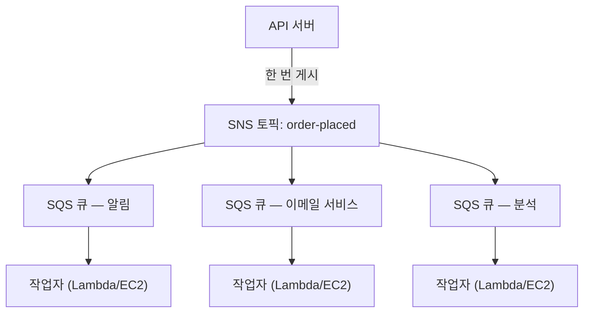

# 19장: 티켓 머신

티켓 머신은 조용한 혁명이었습니다. 번호를 뽑고, 호출되기를 기다립니다. 줄이 큐가 되었습니다. 사람들이 앉을 수 있었습니다. 서비스 카운터가 자체 속도로 작동했습니다. 아무도 누군가를 막지 않았습니다.

티켓 머신 이전에는, 줄을 서야 했습니다. 줄에서의 위치는 여러분의 물리적 존재를 필요로 했습니다. 기다리는 동안 다른 것을 할 수 없었습니다. 그리고 줄 맨 앞에 있는 사람이 느리면, 그 뒤의 모든 사람이 멈췄습니다.

티켓 머신은 도착과 서비스를 분리했습니다. 여러분이 도착해서, 번호를 뽑고, 시스템이 여러분의 자리를 기억했습니다. 가서 앉을 수 있었습니다. 서비스 카운터는 자신이 감당할 수 있는 어떤 속도로든 번호를 처리해나갔습니다. 카운터가 일시적으로 닫혀 있어도, 새로 도착한 사람들은 여전히 번호를 받았습니다. 그들은 기다렸습니다. 작업이 사라지지 않았습니다 — 큐에 들어갔습니다.

이 작은 발명품은 인간 시스템에서 가장 오래된 분리(decoupling)의 예 중 하나입니다. 이 챕터의 끝에서, Nimbus는 자체 티켓 머신을 — 소프트웨어로 — 구축할 것이며, 그것이 필요했던 이유는 어느 금요일 저녁의 16분 다운타임에서 시작됩니다.

---

팀은 AZ 장애에서 살아남았습니다. Leo가 카오스 엔지니어링 프로세스를 고쳤고, 런북은 탄탄했습니다. 트래픽이 회복되었고 다시 성장하고 있었습니다 — 사실, 이전보다 더 빠르게요. Leo가 밤늦게 읽고 있던 Aurora 문서는 여전히 Nimbus가 실제로 있는 곳보다 몇 챕터 앞서 있었습니다.

하지만 트래픽이 성장하고 더 많은 레스토랑이 온보딩되면서, 다른 종류의 병목이 보이기 시작했습니다. 인프라가 아니라요. 애플리케이션 코드 자체에서요. 시간당 200건의 주문에서는 잘 작동하던 요청 체인이 800건에서는 부담을 보이기 시작했습니다.

그리고 14일 저녁이 왔습니다.

---

그것은 분석 대시보드에서 시작되었습니다. 금요일 오후 6시 47분, 분석 서비스로의 배포가 타임아웃 버그를 도입했습니다. 서비스가 평소의 200밀리초 대신 8초 만에 응답하기 시작했습니다.

주문 흐름은 동기적이었습니다. 모든 주문이 고객에게 확인하기 전에 분석 서비스를 기다렸습니다. 부하가 증가하면서 8초가 12초가 되었습니다. API의 연결 풀이 분석 단계가 완료되기를 기다리는 요청으로 채워지기 시작했습니다.

오후 6시 53분, 연결 풀이 한계에 도달했습니다. 새 요청이 즉시 실패하기 시작했습니다 — 주문을 처리할 수 없어서가 아니라, 처리를 시작할 가용 연결이 없어서요.

"분석 서비스가 주문 흐름을 무너뜨렸어," Leo가 다음날 아침 로그를 보며 말했습니다. "둘은 서로 아무 관계도 없어. 분석 서비스는 그냥 대시보드를 계산할 뿐이야."

"하지만 둘은 같은 요청 체인에 있어요," Priya가 말했습니다.

"16분의 다운타임," Maya가 말했습니다. "그리고 고객 세 명이 두 번 청구됐어요."

이중 청구가 다운타임보다 더 나빴습니다. 연결 풀 포화의 혼란 속에서, 실제로 성공한 일부 요청에 재시도 메커니즘이 작동했습니다 — 결제 단계가 완료되었는데, 그러고 나서 반환되기 전에 요청이 타임아웃되었고, 재시도가 결제를 다시 시도했습니다. 같은 카드, 같은 금액, 두 번의 청구.

"재시도 메커니즘은 도움이 되어야 하는 거였어," Leo가 말했습니다.

"그게 잘못된 방향으로 도움이 됐어요," Priya가 말했습니다. "그리고 그 고객들에게 환불을 시도하면 어떻게 되는지 생각해봤어요? 환불 프로세스는 실패한 바로 그 주문 흐름을 사용해요."

16분의 다운타임과 세 건의 이중 청구. 그것이 동기적 요청 체인의 비즈니스 비용이었습니다.

---

Nimbus에는 주문이 인기를 얻기 전까지는 문제처럼 느껴지지 않던 문제가 있었습니다.

주문이 들어올 때마다, API 서버가 다음을 해야 했습니다:

1. 데이터베이스에 주문 저장
2. 레스토랑 태블릿에 알림 전송
3. 고객에게 확인 이메일 전송
4. 레스토랑 분석 대시보드 업데이트
5. 결제를 위한 이벤트 기록

바쁜 델리 카운터에서, 계산대 직원은 절단기가 슬라이싱을 마칠 때까지 기다린 후 다음 고객으로 이동하지 않습니다. 그들은 주문을 받고, 그것을 주방에 건네고, 다음 사람을 응대하기 시작합니다. 주방은 자체 속도로 주문을 처리합니다. 고객은 더 빠른 서비스를 받습니다. 주방은 갑작스러운 폭주에 압도되지 않습니다. 주방이 느린 순간이 있으면, 주문은 계산대에서 오류를 일으키는 대신 카운터 뒤에 쌓입니다.

그것이 비유였습니다. Nimbus에는 카운터와 주방이 없었습니다. 고객이 떠나기 전에 한 사람이 모든 것을 순서대로 하고 있었습니다.

그리고 14일에, 고기를 자르던 사람에게 문제가 생겼습니다. 그래서 카운터가 멈췄습니다. 그래서 그 이후의 모든 고객이 기다렸습니다. 주방, 계산대, 고객 — 모두가 멈췄습니다. 체인의 한 단계가 느려졌기 때문입니다.

해결책은 고기 자르기를 더 빠르게 만드는 것이 아니었습니다. 해결책은 단계들을 분리하는 것이었습니다. 계산대에서 주문을 받고, 티켓을 넘기고, 주방이 작업하게 하는 것이었습니다.

"우리는 긴밀하게 결합되어 있어요," Priya가 말했습니다. "어떤 다운스트림 단계가 실패하면, 전체 주문이 실패해요. 분석 서비스가 손상되어 잘못된 형식의 메시지를 소비하기 시작하면 어떻게 되는지 생각해봤어요? 전체 주문이 실패해요 — 우리가 그것을 기다리고 있으니까요."

"주문을 저장하고 즉시 고객에게 확인하고," Leo가 말했습니다, "나머지는 백그라운드에서 처리할 수 있다면요?"

"그게 큐예요," Priya가 말했습니다.

핵심 통찰: 고객은 확인을 받기 전에 분석 대시보드가 업데이트되었는지 알 필요가 없습니다. 그들은 자신의 주문이 접수되었다는 것을 알아야 합니다. 그것들은 서로 다른 것입니다. 동기적 체인은 그것들을 뒤섞었습니다.

**분리 모델**

이것이 **분리(decoupling)**입니다: 작업을 수락하는 구성 요소를 그것을 처리하는 구성 요소로부터 분리하는 것.

Nimbus의 주문 흐름의 모든 단계는 API가 고객에게 응답하기 전에 동기적으로 일어나야 했습니다. 이메일 서비스가 느리면(때로는 그랬습니다), 고객이 기다렸습니다. 분석 대시보드가 다운되면(때로는 그랬습니다), 주문이 실패했습니다.

14일의 연쇄는 정확히 왜 이것이 중요한지를 보여주었습니다. 분석 서비스는 고객의 주문이 수락되었는지 여부와 아무 관계가 없었습니다. 하지만 그것이 같은 동기적 체인에 있었기 때문에, 그것의 실패가 모두의 실패가 되었습니다.

소프트웨어 시스템에서, 큐는 종종 메시지 브로커입니다 — 생산자로부터 메시지를 수락하고 소비자에게 전달하는 서비스.

여러분은 궁금해할지 모릅니다: 주문 흐름이 이제 비동기적이라면, 고객은 자신의 주문이 실제로 접수되었는지 어떻게 알까요? 답은 아키텍처 설계에 있습니다: API가 데이터베이스에 주문을 저장하고(동기적 — 이것이 권위 있는 확인입니다), 그러고 나서 이벤트를 큐에 게시합니다. 고객 확인은 다운스트림 서비스의 완료가 아니라 데이터베이스 쓰기 성공에 기반합니다. 이메일 서비스가 느리더라도, 고객은 이미 확인을 받았습니다. 이메일은 그저 있으면 좋은 후속 조치일 뿐입니다.

**Amazon SQS: 큐**

**Amazon SQS(Simple Queue Service)**는 AWS의 관리형 메시지 큐 서비스입니다. 소비자가 메시지를 처리할 때까지 메시지를 내구성 있게 저장합니다.

기본 흐름:

1. **생산자**(API 서버)가 큐에 메시지를 넣습니다: `{ "orderId": "ORD-5532", "restaurantId": "47", "items": [...] }`
2. API가 즉시 고객에게 응답합니다: "주문이 확인되었습니다!"
3. **소비자**(별도의 작업자 서비스들)가 큐에서 메시지를 읽고 처리합니다: 레스토랑 알림 전송, 확인 이메일 전송, 분석 업데이트

고객 경험: 즉시 확인. 다운스트림 처리: 작업자의 속도로 비동기적으로 일어납니다.

**SQS 핵심 개념**

**메시지 가시성 타임아웃**: 소비자가 SQS에서 메시지를 읽을 때, 메시지는 일정 기간 동안 다른 소비자에게 *보이지 않게* 됩니다(기본값: 30초). 이것은 소비자에게 처리할 시간을 줍니다. 소비자가 성공적으로 완료하면, 메시지를 삭제합니다. 소비자가 충돌하면, 가시성 타임아웃이 만료되고 메시지가 다른 소비자가 재시도할 수 있도록 다시 보이게 됩니다.

이것은 최소 한 번(at-least-once) 배달을 보장합니다: 소비자가 처리 도중에 실패하더라도, 모든 메시지는 최소 한 번 처리됩니다.

여러분은 궁금해할지 모릅니다: 메시지가 처리되는 동안 보이지 않게 되지만 소비자가 충돌할 때 삭제되지 않는다면, 두 번 처리될 수 있지 않을까요? 그렇습니다 — 그리고 이것을 최소 한 번 배달이라고 부릅니다. 이것은 모든 소비자가 같은 메시지를 두 번 이상 받아도 문제를 일으키지 않도록 설계되어야 한다는 것을 의미합니다. 중복 주문 확인 이메일은 짜증납니다. 중복 청구는 지원 티켓입니다. 그에 따라 소비자를 설계하십시오.

가시성 타임아웃은 예상되는 가장 긴 처리 시간보다 길어야 합니다. 처리가 일반적으로 20초 걸리지만 가끔 90초 걸리고, 가시성 타임아웃이 30초라면, 그 가끔의 90초 처리는 SQS에 실패처럼 보일 것입니다. 메시지가 다시 보이게 됩니다. 두 번째 소비자가 그것을 집어 듭니다. 이제 두 작업자가 같은 메시지를 처리하고 있습니다. 처리가 멱등적이지 않다면, 문제가 생깁니다.

흔한 실수: 가시성 타임아웃을 평균 처리 시간과 같게 설정하는 것. 올바른 접근법: 안전 여유와 함께 99번째 백분위수 처리 시간으로 설정하는 것. P99 처리 시간이 45초라면, 가시성 타임아웃을 90초로 설정하십시오.

**Dead-letter 큐(DLQ)**: 메시지가 너무 여러 번 처리에 실패하면(설정 가능 — 예: 5번 재시도), SQS가 그것을 dead-letter 큐로 이동합니다. 메시지를 잃지 않고 메시지가 실패하는 이유를 이해하기 위해 DLQ를 검사합니다.

DLQ는 프로덕션에서 실제로 무엇이 실패하고 있는지 배우는 곳입니다. 그것이 없으면, 실패한 메시지는 그냥 사라지고 조사할 방법이 없습니다.

SQS 마이그레이션 3주 후, Leo는 알림 서비스의 DLQ에 23개의 메시지가 쌓인 것을 알아차렸습니다. 그는 DLQ를 확인하고 있지 않았습니다(그것을 올바르게 설정한 다음 비어 있을 것이라고 가정했습니다).

그가 메시지 하나를 꺼내 페이로드를 살펴봤습니다:

```json
{
  "orderId": "ORD-9821",
  "restaurantId": "12",
  "customerMessage": "Extra spicy please 🌶️🔥",
  "timestamp": "2024-01-18T19:43:11Z"
}
```

이모지. 레스토랑 알림 서비스가 레스토랑의 레거시 태블릿 API로 전송하기 전에 메시지 페이로드를 Latin-1로 인코딩하고 있었습니다. 이모지 문자 — UTF-8에서 각각 4바이트 — 가 손상되어 태블릿 API가 요청을 거부하게 만들었습니다. 메시지가 재시도되고, 다시 실패하고, 다시 재시도되고, 다시 실패했습니다. 5번 재시도 후, SQS가 그것을 DLQ로 이동했습니다.

"23개 메시지 전부 고객 메모 필드에 이모지가 있어요," Leo가 말했습니다.

"그러니까 주문 메모에 이모지를 추가한 모든 고객은 그 메모가 조용히 레스토랑에 도달하지 못한 거네요," Maya가 말했습니다.

"맞아요."

"얼마나 오래요?"

Leo가 가장 오래된 메시지의 타임스탬프를 확인했습니다. "3주요."

Priya가 조용했습니다. "그리고 누군가 주문 메모에 이모지를 추가하면 조용히 실패한다는 걸 알아냈다면요? 이모지로 주문을 하고 레스토랑이 그 지시를 결코 보지 못하도록 보장할 수 있어요. 그러고 나서 잘못된 주문에 대해 불평하는 거죠."

아무도 이것을 악용하지 않았습니다. 하지만 그것은 던질 만한 옳은 질문이었습니다.

Leo가 인코딩 버그를 고쳤습니다. 그러고 나서 DLQ에서 발이 묶인 23개 메시지 모두를 다시 재생하는 스크립트를 작성했습니다. 레스토랑들은 그들의 (3주 묵은) 매운 이모지 지시를 받았습니다. 고객들은 결코 알지 못했습니다.

교훈: DLQ는 설정하고 잊어버리는 것이 아니라 적극적으로 모니터링되어야 합니다. 늘어나는 DLQ는 무언가가 반복적으로 실패하고 있다는 조용한 신호입니다.

**큐 유형**:

**표준 큐**: 최대 처리량(초당 무제한 메시지). 배달 순서는 최선의 노력(보장되지 않음). 최소 한 번 배달(매우 드물게, 메시지가 두 번 배달될 수 있음).

**FIFO 큐**: 엄격한 선입선출 순서. 정확히 한 번 **처리** — 5분 창 내에서 `MessageDeduplicationId`에 기반한 중복 제거. 순서는 `MessageGroupId` *별로* 보장됩니다: 같은 그룹의 메시지는 순서대로 도착하고; 다른 그룹은 병렬로 처리될 수 있으며, 이것이 FIFO가 확장되는 방식입니다. 기준 처리량은 배치로 초당 3,000개 메시지(배치 없이는 300개)입니다. **고처리량 모드**를 활성화하면 메시지 그룹 전체에 파티셔닝하여 이를 초당 수만 개로 높입니다. 순서가 중요할 때 FIFO를 사용하십시오(금융 거래, 순차적 상태 변경).

최대 처리량이 필요하고 가끔의 중복 메시지를 견딜 수 있다면, SQS Standard를 사용하십시오 — 하지만 모든 소비자가 문제를 일으키지 않고 중복을 처리하도록 설계해야 합니다. 엄격한 순서와 정확히 한 번 처리가 필요하다면, SQS FIFO를 사용하십시오 — 그리고 `MessageGroupId`를 잘 설계하십시오. 병렬성(따라서 처리량)은 많은 그룹을 갖는 데서 오기 때문입니다.

Nimbus의 경우, 대부분의 큐가 표준 큐를 사용했습니다. 결제 큐는 청구가 순서대로 처리되도록 보장하기 위해 FIFO를 사용했습니다.

**큐 깊이 기반 Auto Scaling: 백로그에 맞춰 작업자 확장하기**

SQS의 가장 강력한 응용 중 하나는 큐 깊이를 Auto Scaling 트리거로 사용하는 것입니다. CPU나 메모리에 기반해 확장하는 대신, 얼마나 많은 작업이 대기하고 있는지에 기반해 확장합니다.

Nimbus의 알림 서비스의 경우: SQS 큐 깊이(처리를 기다리는 메시지 수)가 알림 작업자를 실행하는 ECS 서비스의 Application Auto Scaling 정책에 연결되었습니다.

정책: 큐에 작업자 태스크당 50개 이상의 메시지가 있으면, 태스크를 추가합니다. 큐에 작업자 태스크당 10개 미만의 메시지가 있으면, 태스크를 제거합니다.

실제 효과: 금요일 저녁 피크에 1,200건의 주문이 들어왔을 때, 알림 큐 깊이가 급증했고 작업자 플릿이 3분 이내에 2개 태스크에서 8개 태스크로 확장되었습니다. 자정쯤, 큐가 비었고 플릿이 다시 2개로 돌아왔습니다.

"그게 월 얼마나 들죠?" Tom이 Auto Scaling 그래프를 보며 물었습니다.

"Auto Scaling 자체에는 추가 비용이 없어요," Leo가 말했습니다. "하지만 금요일 저녁에 3시간 동안 6개의 추가 ECS 태스크 — 그건 의미 있는 비용이에요."

Tom이 계산했습니다. "그 피크에 대해 월 약 $14네요. 그리고 이전에는, 우리가 전체 비용으로 8개 태스크를 계속 실행하고 있었고요?"

"맞아요."

"그러니까 우리는 필요할 때 버스트에 비용을 지불하고 그 외에는 아무것도 안 내는 거네요."

이것이 큐 깊이 확장 패턴입니다: 큐가 트래픽 급증을 흡수하는 버퍼가 되고, 작업자 플릿이 버퍼를 비우기 위해 확장됩니다. 사용자는 느림을 경험하지 않습니다 — 주문이 수락되었을 때 즉시 확인을 받았습니다. 작업자가 따라잡는 데 조금 더 걸릴 뿐입니다. 그리고 24시간 내내 피크 용량을 실행하지 않기 때문에, 비용이 상당히 낮습니다.

**Amazon SNS: 방송자**

**Amazon SNS(Simple Notification Service)**는 게시/구독(pub/sub) 메시지 서비스입니다. 하나의 생산자, 하나의 소비자(큐)가 아니라, SNS는 하나의 메시지가 *많은* 구독자에게 동시에 배달되는 것을 지원합니다.

모델:

1. **게시자**가 SNS **토픽**에 메시지를 전송합니다
2. 해당 토픽의 모든 **구독자**가 동시에 메시지를 받습니다(팬 아웃)

구독자는 다음이 될 수 있습니다:

- SQS 큐(비동기 처리를 위해 큐에 메시지 푸시)
- Lambda 함수(함수를 직접 트리거)
- HTTP/HTTPS 엔드포인트(웹훅 배달)
- 이메일 주소
- SMS(전화번호)

Nimbus의 경우, 주문 접수 이벤트가 `order-events`라는 SNS 토픽에 게시됩니다:

- 레스토랑 알림 서비스가 구독(자체 SQS 큐에서 수신)
- 이메일 서비스가 구독(자체 SQS 큐에서 수신)
- 분석 서비스가 구독(자체 SQS 큐에서 수신)
- 결제 서비스가 구독(자체 FIFO SQS 큐에서 수신)

하나의 주문 이벤트. 네 명의 구독자. 모두 동시에 알림을 받습니다. 각자 자체 속도로 처리합니다.

"그러면 SNS가 공지이고," Maya가 말했습니다, "SQS가 각 팀이 자신의 속도로 공지를 처리하는 받은 편지함이군요. 그러면 왜 둘 다 쓰죠? 왜 그냥 모두가 SNS 토픽을 직접 구독하지 않고요?"

"왜냐하면 직접 SNS 배달은 발사 후 망각(fire-and-forget)이기 때문이에요," Leo가 말했습니다. "SNS가 발사될 때 분석 서비스가 다운되어 있으면, 그 메시지는 사라져요. 중간에 SQS 큐가 있으면, 메시지는 서비스가 복구될 때까지 기다려요."

"정확해요," Priya가 말했습니다. "SNS/SQS 팬 아웃이 표준 패턴이에요."

**SNS/SQS 팬 아웃 패턴**

이 조합 — 여러 SQS 큐에 공급하는 SNS 토픽 — 은 AWS에서 가장 중요한 아키텍처 패턴 중 하나입니다:



각 큐는 독립적입니다. 분석 서비스가 느릴 수 있습니다 — 그것의 큐가 채워지지만, 알림과 이메일 서비스는 영향받지 않고 계속됩니다. 분석 서비스가 다운되면, 그것의 메시지는 그것이 다시 올라올 때까지 큐에서 기다립니다. 아무것도 잃지 않습니다.

이것이 핵심 속성입니다: **독립적 실패**. 한 소비자의 문제가 다른 것들에 전파되지 않습니다.

**메시지 필터링: 모든 구독자에게 모든 메시지를 보내지 않기**

시스템이 성장하면서, 모든 구독자가 모든 메시지를 처리하기를 원하지 않게 됩니다. 분석 서비스가 완료된 주문만 신경 쓴다면 결제 처리 실패에 관한 메시지를 받아서는 안 됩니다.

**SNS 메시지 필터링**을 통해 구독자가 필터 정책을 지정할 수 있습니다 — 특정 속성과 일치하는 메시지만 배달합니다.

레스토랑 알림 서비스는 필터로 구독합니다: `status = "confirmed"`인 메시지만.

오류 알림 서비스는 필터로 구독합니다: `status = "failed"`인 메시지만.

각 구독자는 필요한 것만 받습니다.

필터링 없이는, 모든 구독자가 모든 메시지를 받고 관련 없는 것을 무시해야 합니다. 이것은 처리를 낭비하고, 돈을 낭비하며(SQS는 메시지당 요금을 부과합니다), 노이즈를 도입합니다. 필터링 없는 대량 주문 시스템은 오류 알림 큐를 성공한 주문으로 넘쳐나게 만들 것입니다 — 실제 실패를 찾기 어렵게 만들면서요.

필터 정책은 다음과 같습니다:

```json
{
  "status": ["confirmed"],
  "region": ["us-west-2", "us-east-1"]
}
```

이 구독자는 status가 "confirmed"이고 region이 "us-west-2" 또는 "us-east-1" 중 하나인 메시지만 받습니다. 정책과 일치하지 않는 메시지는 이 구독자의 큐로 전혀 배달되지 않습니다 — 그것들은 SQS에 도달조차 하지 않습니다.

"그러니까 필터링은 SNS 레이어에서 일어나네요," Priya가 말했습니다, "메시지가 SQS에 쓰이기 전에요?"

"맞아요. 레스토랑 알림 서비스의 SQS 큐는 항상 그것이 처리해야 할 메시지만 봅니다."

"그러면 누군가 모든 구독자 필터와 일치하는 특별히 조작된 메시지를 SNS 토픽에 게시해서 침입을 시도하면 어떻게 되죠?" Priya가 물었습니다.

SNS 토픽에는 IAM 리소스 정책이 있었습니다: 주문 API 서비스(그것의 IAM 역할에 의해)만 게시할 수 있었습니다. SNS 액세스 정책과 SQS 큐 정책이 액세스 제어 레이어를 형성했습니다 — 필터링은 그저 라우팅을 위한 것이지, 보안을 위한 것이 아니었습니다.

**SQS vs SNS를 언제 사용하는가**

**SQS 단독**: 하나의 생산자, 하나의 소비자(또는 같은 큐에서 경쟁하는 여러 소비자). 메시지가 한 번, 순서대로(FIFO) 또는 순서 없이(표준) 처리되어야 합니다. 작업자 큐 패턴 — 하나의 큐, 그것에서 소비하는 여러 작업자.

**SNS 단독**: 발사 후 망각 알림. 이메일, SMS, 또는 HTTP 엔드포인트로 푸시. 메시지를 큐에 넣을 필요가 없습니다 — 그냥 알리고 넘어갑니다.

**SNS + SQS(팬 아웃)**: 하나의 이벤트, 여러 독립적인 소비자. 각 소비자가 자체 큐를 가지고, 독립적으로 처리하며, 독립적으로 실패할 수 있습니다.

## SNS FIFO 토픽

위의 SNS에 관한 모든 내용은 표준 토픽을 사용합니다 — 그것들은 사실상 무제한 처리량을 가지고, 거의 동시에 구독자에게 배달하며, 대다수의 사용 사례에 대해 일을 해냅니다.

하지만 표준 SNS 토픽은 순서를 보장하지 않습니다. 열 개의 메시지를 순서대로 게시하면, 구독자가 약간 다른 순서로 받을 수 있습니다. Nimbus 주문 알림의 경우, 그것은 괜찮습니다 — 분석 업데이트가 이메일 확인보다 1초의 일부 먼저 도착하는 것은 중요하지 않습니다.

일부 시나리오에서는, 그것이 중요합니다. 금융 원장을 생각해보십시오: 두 이벤트 — 입금 그다음 출금 — 이 역순으로 배달되면, 두 이벤트가 결국 올바르게 처리되더라도 처리 중 잔액 계산이 잘못될 것입니다.

**SNS FIFO 토픽**은 SQS FIFO 큐와 동일한 원칙을 팬 아웃 모델에 적용합니다. 메시지가 게시된 정확한 순서로 구독자에게 배달되고, 각 메시지가 정확히 한 번 배달됩니다.

절충안: SNS FIFO 토픽은 SQS FIFO와 유사한 기준 처리량을 가지며(토픽당 초당 3,000개 메시지; 메시지 그룹당 초당 300개 — 2025년부터 훨씬 더 높은 처리량을 위한 고처리량 모드 사용 가능), **SQS 큐**로만 팬 아웃합니다 — FIFO 또는, 2023년부터, Standard. 표준 큐를 구독하는 것은 순서에 신경 쓰지 않는 소비자(예를 들어 분석 피드)에게 유용하지만, 순서와 정확히 한 번이 끝에서 끝까지 유지되는 것은 **오직** FIFO 큐로의 경우입니다. SNS FIFO 토픽을 HTTP 엔드포인트나 이메일 주소로 배달하는 데 사용할 수 없습니다.

Nimbus의 결제 파이프라인의 경우 — 일련의 가격 업데이트가 레스토랑 계정에 순서대로 적용되어야 했던 곳 — 결제 SNS 토픽이 표준에서 FIFO로 마이그레이션되었습니다. SQS 결제 큐는 이미 FIFO였습니다. 팬 아웃은 이제 가격 인상 이벤트가 그것이 의존하는 기간 시작 이벤트보다 결제 프로세서에 먼저 도착하지 않도록 보장했습니다.

> **시험 팁 — SNS FIFO**
>
> 시나리오가 여러 구독자에 걸친 **순서가 보장된 팬 아웃 배달**을 요구하면, 답은 **SNS FIFO**입니다. 표준 SNS는 순서를 보장하지 않습니다. SNS FIFO는 SQS 큐로만 팬 아웃합니다 — 순서와 정확히 한 번을 끝에서 끝까지 유지하려면, 구독자가 SQS **FIFO** 큐여야 합니다(표준 큐 구독은 허용되지만 최선의 노력 순서와 최소 한 번 배달을 받습니다). 기본 처리량은 토픽당 초당 3,000개입니다 — 시나리오가 훨씬 더 높은 볼륨 *그리고* 엄격한 순서를 설명한다면, 그것은 대안 아키텍처(예를 들어 Kinesis, 이후 챕터에서 다룸)를 살펴보라는 신호입니다.

## 레거시 큐가 놓아주지 않을 때

Nimbus는 지금까지 가장 큰 인수를 막 마무리하려 하고 있었습니다: Barato, 200개 레스토랑과 2년의 운영 선두를 가진 음식 배달 경쟁사. 엔지니어링 팀이 통합 계획 회의를 잡았습니다.

회의는 Leo가 조용해지기까지 20분간 지속되었습니다.

"그들의 주문 처리 시스템," 그가 말했습니다. "무엇 위에서 실행되죠?"

"ActiveMQ요," 반대편의 Barato 엔지니어가 말했습니다. "온프레미스 브로커요. 앱은 Java예요. 2018년부터 실행되고 있어요. 모든 게 AMQP를 사용해요."

"AMQP," Leo가 말했습니다.

"네."

그가 화면의 아키텍처 다이어그램을 보았습니다. Nimbus는 SQS와 SNS를 실행했습니다. SQS는 AMQP를 사용하지 않습니다. SNS는 AMQP를 사용하지 않습니다. Barato 애플리케이션은 그것밖에 사용하지 않았습니다.

"그걸 다시 작성하려면 6개월이 걸릴 거예요," Leo가 회의 후 팀에게 말했습니다. "최소한요."

"인수를 6개월 동안 미룰 수 없어요," Maya가 말했습니다.

"그리고 AWS에서 베어메탈 ActiveMQ 브로커를 실행할 수도 없어요," Priya가 덧붙였습니다. "보안과 신뢰성 관점에서 그게 어떤 모습인지 생각해봤어요? 관리형 패치 없이, 자동 장애 조치 없이, 우리 인프라에 연결되는, 프로덕션에 앉아 있는 자체 관리형 메시지 브로커요?"

"관리형 옵션이 있어요," Leo가 천천히 말했습니다. 그는 그들이 이야기하는 동안 읽고 있었습니다. "Amazon MQ요."

**Amazon MQ: 관리형 브로커**

**Amazon MQ**는 Apache ActiveMQ와 RabbitMQ를 위한 관리형 메시지 브로커 서비스입니다. 그것은 여러분의 기존 브로커 — 여러분의 애플리케이션이 수년간 연결되어 온 바로 그 브로커 — 를 실행하지만, 관리형 AWS 서비스로서 실행합니다. AWS가 기반 인프라를 처리합니다: 프로비저닝, 패치, 장애 조치, 백업.

Amazon MQ를 SQS 및 SNS와 다르게 만드는 핵심 속성: 그것은 레거시 메시지 브로커가 사용하는 프로토콜을 사용합니다. AMQP, STOMP, MQTT, OpenWire, NMS. SQS와 SNS가 그냥 이해하지 못하는 프로토콜들.

Barato 통합의 경우, 계획은 간단했습니다. AWS가 ActiveMQ로 구성된 Amazon MQ 브로커를 실행합니다. Barato Java 애플리케이션이 온프레미스 것 대신 새 브로커 엔드포인트를 가리키게 됩니다. 애플리케이션 측의 변경: 새 연결 문자열로 하나의 구성 파일을 업데이트하는 것. 그게 전부였습니다. 애플리케이션은 그것이 Barato 사무실의 서버 대신 관리형 클라우드 브로커와 통신하고 있다는 것을 알 필요가 없었습니다.

"잠깐만요," Maya가 말했습니다. "결국 그들을 Nimbus에 통합할 거라면, 처음부터 SQS로 마이그레이션하는 게 낫지 않나요?"

"마이그레이션 경로가 존재하기 때문이에요," Leo가 말했습니다. "그리고 제대로 할 가치가 있어요 — 결국에는요. 하지만 지금, 우리는 Barato를 6개월이 아니라 30일 안에 AWS 인프라에서 운영해야 해요. Amazon MQ는 애플리케이션을 변경하지 않고 애플리케이션을 실행시켜요. 그러면 우리는 SQS 마이그레이션을 인수를 위한 허둥지둥한 전제 조건이 아니라 신중한 프로젝트로 계획할 시간을 갖게 돼요."

"그게 월 얼마나 들죠?" Tom이 물었습니다.

Amazon MQ 브로커 — 신뢰성을 위한 단일 액티브/스탠바이 쌍 — 는 Barato의 볼륨에 적합한 브로커의 경우 월 $200 범위였습니다. 6개월의 재작성 시간 비용과 비교하면, 그것은 논쟁거리가 아니었습니다.

Priya가 하나의 조건으로 계획을 승인했습니다: Amazon MQ 인스턴스는 프라이빗 서브넷에 살고, Barato 애플리케이션 서버로부터의 연결만 허용하는 보안 그룹 규칙을 가질 것. 공개 노출 없음. 감사 로깅 활성화.

마이그레이션은 12일 걸렸습니다. Barato 애플리케이션이 13일째에 Amazon MQ에 연결되었습니다. 14일째에, 그것은 단 한 줄의 코드 변경 없이 AWS 인프라에서 첫 주문을 처리했습니다.

---

> **시험 팁 — Amazon MQ**
>
> *SAA-C03 도메인: 탄력적 아키텍처 설계(도메인 2)*
>
> 시험은 단일 축에서 Amazon MQ를 SQS 및 SNS와 구별합니다: **프로토콜 호환성**. 시나리오가 이미 메시지 브로커를 사용하고 특정 프로토콜을 사용하는 애플리케이션을 설명하면, Amazon MQ가 거의 확실히 답입니다.
>
> 핵심 신호: **"ActiveMQ," "RabbitMQ," "AMQP," "STOMP," "MQTT," "OpenWire,"** 또는 **"애플리케이션 코드를 변경하지 않고"**에 해당하는 모든 문구. 그 문구를 보면, 답은 Amazon MQ입니다 — SQS도 SNS도 아닙니다.
>
> 시나리오가 분리가 필요한 *새* 애플리케이션을 설명하거나, 레거시 브로커나 특정 프로토콜을 언급하지 않으면, SQS/SNS를 사용하십시오.
>
> 한 가지 신호 더: "기존 온프레미스 메시지 브로커를 AWS로 마이그레이션." 앱이 같은 종류의 브로커에 같은 프로토콜로 계속 통신해야 한다면, Amazon MQ가 리프트 앤 시프트 답입니다.

## 장점과 한계

**SQS와 SNS가 강력한 이유**:

- SQS는 내구성 있고 신뢰할 수 있는 메시지 배달을 제공합니다 — 메시지는 여러 AZ에 걸쳐 저장됩니다
- 분리는 생산자와 소비자 서비스의 독립적인 확장과 배포를 가능하게 합니다
- Dead-letter 큐는 실패 시 어떤 메시지도 조용히 손실되지 않도록 보장합니다
- SNS 팬 아웃 패턴은 생산자를 변경하지 않고 새 소비자를 추가하는 것을 허용합니다

**복잡해지는 부분**:

- 최소 한 번 배달은 소비자가 *멱등적*이어야 한다는 것을 의미합니다 — 같은 메시지를 두 번 처리해도 문제(중복 주문, 중복 청구)를 일으켜서는 안 됩니다
- FIFO 큐는 더 비싸고 처리량 제한이 있습니다
- 여러 큐와 서비스에 걸쳐 실패한 메시지를 디버깅하려면 좋은 로깅과 관찰 가능성이 필요합니다
- 메시지 순서 보장은 제한적입니다 — 여러 서비스에 걸쳐 엄격한 순서가 중요하다면, 설계가 복잡해집니다

**멱등성: 실용적 심층 탐구**

멱등성은 세 명의 고객이 이중 청구되기 전까지는 추상적으로 들립니다.

연산은 그것을 여러 번 실행해도 한 번 실행한 것과 같은 결과를 낸다면 **멱등적**입니다. 청구 연산은 자연스럽게 멱등적이지 않습니다: 두 번 실행하면 두 번 청구됩니다. 멱등적 청구 연산은 청구를 시도하기 전에 청구가 이미 처리되었는지 확인합니다.

패턴: 각 메시지가 고유 ID(주문 ID, 또는 별도의 메시지 ID)를 지닙니다. 처리하기 전에, 소비자가 이 메시지 ID가 이미 성공적으로 처리되었는지 확인하기 위해 저장소(DynamoDB가 이에 잘 맞습니다)를 확인합니다. 예이면: 아무것도 하지 않고 메시지를 삭제합니다. 아니오이면: 처리하고, ID를 기록하고, 메시지를 삭제합니다.

```python
def process_charge(message):
    order_id = message['orderId']
    
    # 멱등성 확인
    if already_processed(order_id):
        logger.info(f"Order {order_id} already charged, skipping duplicate")
        return  # 메시지가 큐에서 삭제됨
    
    # 청구 처리
    charge_result = payment_service.charge(
        amount=message['amount'],
        card_token=message['cardToken'],
        idempotency_key=order_id  # 결제 처리자에게도 전달
    )
    
    # 이것을 처리했다고 기록
    mark_as_processed(order_id, charge_result)
```

멱등성 키는 그것을 지원하는 다운스트림 서비스(결제 처리자, 이메일 시스템)에도 전달되어야 합니다. 예를 들어 Stripe는 같은 API 호출이 두 번 이루어지더라도 중복 청구를 방지하는 `Idempotency-Key` 헤더를 받습니다.

"그러면 상관관계 ID는요?" Priya가 물었습니다. "메시지가 여러 서비스를 거쳐 이동할 때, 어떤 요청이 어떤 다운스트림 동작을 일으켰는지 어떻게 추적하죠?"

**상관관계 ID: 서비스 전반 추적**

고객이 주문을 하면, 요청은 다음을 통해 흐릅니다: API → SNS → SQS → 알림 작업자 → 레스토랑 태블릿 API → SQS → 이메일 작업자 → SES.

상관관계 ID 없이는, 6단계에서 레스토랑 태블릿 API가 오류를 반환하면, 각 서비스의 로그가 이벤트를 보여주지만, 처음부터 특정 고객의 주문으로 거슬러 추적할 방법이 없습니다.

**상관관계 ID**는 원래 요청에 첨부되어 모든 서비스 상호작용을 통해 전달되는 고유 식별자입니다. 각 서비스가 그것의 로그에 상관관계 ID를 포함합니다.

Priya가 특정 상관관계 ID로 CloudWatch를 검색하면, 그 단일 주문의 처리의 일부였던 모든 로그 라인을 — 모든 서비스에 걸쳐 — 얻습니다.

"한 가지 주의점," Priya가 말했습니다. "상관관계 ID는 외부에서 들어와요. 누군가 악의적인 ID를 주입해서 우리 로깅을 망칠 수 있나요?"

상관관계 ID는 내부적입니다 — 그것들은 처리 로직이 아니라 로깅에만 영향을 미칩니다. 그것들을 정제하면(영숫자, 고정 길이) 로그 출력에서의 주입 공격을 방지합니다.

**분리가 잘못된 선택일 때**

"잠깐 — 그런데 *왜* 모든 것을 분리하지 않죠?" Maya가 물었습니다.

타당한 질문이었습니다. 분리가 연쇄 실패를 방지하고 시스템을 탄력적으로 만든다면, 왜 모든 곳에 적용하지 않을까요?

분리에는 비용이 있기 때문입니다. 그리고 그 비용이 이익을 능가하는 시나리오가 있습니다.

**즉각적인 일관성이 필요할 때**: 주문이 진행되기 전에 결제가 확인되어야 하고 — 사용자가 결과를 화면에서 기다리고 있다면 — 결제를 비동기 큐에 넣고 청구가 성공했는지 알기 전에 확인을 반환할 수 없습니다. 사용자가 첫 청구가 완료되기 전에 두 번 주문할 수 있습니다. 비동기 분리는 응답이 결과에 의존하는 연산에는 작동하지 않습니다.

**워크플로가 본질적으로 순차적일 때**: 3단계가 결정을 내리기 위해 2단계의 결과를 봐야 한다면, 그것들은 큐에서 병렬로 실행될 수 없습니다. 그것들을 큐에 강제로 넣으면 종종 동기적 버전보다 더 복잡해지는 어색한 결과 전달 메커니즘을 만들게 됩니다.

**메시지 순서가 중요하고 볼륨이 낮을 때**: SQS Standard는 순서를 보장하지 않습니다. SQS FIFO는 보장하지만, 기본적으로 배치로 초당 3,000개 메시지로 제한됩니다(고처리량 모드가 그것을 상당히 높입니다). 볼륨이 낮고 엄격하게 순서가 정해진 워크플로가 있다면, 단순한 동기적 큐(데이터베이스 행 잠금 같은)가 더 단순하고 더 신뢰할 수 있을지 모릅니다.

**오버헤드가 이익을 초과할 때**: 사용자가 한 명이고 SLA가 없는 작은 내부 도구는 아마 팬 아웃 SNS 토픽과 DLQ가 필요하지 않을 것입니다. 큐와 DLQ를 모니터링하는 운영 오버헤드는 실재합니다. 아키텍처를 문제에 맞게 조정하십시오.

질문은 "이것을 분리해야 하는가?"가 아닙니다. "이 결합의 비용은 무엇이며, 분리가 그것이 추가하는 것보다 그 비용을 더 많이 줄이는가?"입니다.

## 요약

분리는 18장의 복원력 원칙을 내부 아키텍처에 적용한 것입니다: 멀티 AZ가 인프라의 단일 장애 지점을 제거하는 것과 같은 방식으로, SQS와 SNS는 요청 체인의 단일 장애 지점을 제거합니다.

- **분리**는 작업을 생성하는 구성 요소를 그것을 처리하는 구성 요소로부터 분리합니다.
- **SQS**는 소비자가 느리거나, 오프라인이거나, 확장 중일 때 생산자에게 작업을 둘 내구성 있는 장소를 제공합니다.
- **SNS**는 하나의 이벤트가 게시자가 그들이 누구인지 모르는 채로 여러 독립적인 소비자에게 도달하게 합니다.
- **SNS + SQS 팬 아웃**은 각 다운스트림 서비스가 같은 이벤트를 자체 속도로 처리하게 합니다.
- **DLQ, 멱등성, 상관관계 ID**는 비동기 시스템을 신비로운 것이 아니라 디버깅 가능하게 만드는 운영 규율입니다.
- **맹목적으로 분리하지 마십시오**: 동기적 워크플로, 즉각적인 일관성 요구사항, 작고 위험이 낮은 도구는 추가된 운영 표면을 정당화하지 못할 수 있습니다.

## 시험 팁

*SAA-C03 도메인: 탄력적 아키텍처 설계(도메인 2, 태스크 2.1)*

- **SQS Standard vs FIFO**: 시험은 순서와 배달 보장으로 구별합니다. "순서대로 처리해야 함" → FIFO. "최대 처리량" → Standard.
- **큐 깊이 기반 Auto Scaling**: "큐 깊이에 기반해 작업자 확장" → Application Auto Scaling 또는 ECS Service Auto Scaling과 함께 사용되는 SQS 지표(ApproximateNumberOfMessagesVisible).
- **가시성 타임아웃**: 최소 한 번 배달을 위한 핵심 개념. 소비자가 실패하면, 타임아웃 후 메시지가 다시 보입니다. 시험 시나리오: "메시지가 두 번 처리됨" → 가시성 타임아웃이 너무 짧음(소비자가 처리하는 데 타임아웃보다 더 오래 걸림).
- **Dead-letter 큐**: N번 재시도 후 실패한 메시지가 여기로 이동합니다. 시험 시나리오: "처리가 반복적으로 실패하더라도 어떤 메시지도 손실되지 않도록 보장" → DLQ.
- **SNS 팬 아웃**: 하나의 이벤트가 여러 소비자를 트리거하는 고전적인 시험 패턴. "주문 접수 알림이 이메일, SMS, 인벤토리 업데이트를 동시에 트리거해야 함" → SQS 구독이 있는 SNS 토픽.
- **SQS + Lambda**: Lambda가 SQS 큐를 폴링하고 각 메시지 배치에서 트리거하도록 구성될 수 있습니다. 시험은 대규모 이벤트 기반 처리를 위해 이것을 사용합니다.
- **SQS 롱 폴링**: 소비자가 몇 초마다 폴링(쇼트 폴링, API 호출 낭비)하는 대신, 롱 폴링은 메시지를 최대 20초 기다립니다. 비용과 거짓 빈 응답을 줄입니다.
- **SQS 확장 클라이언트 라이브러리**: 큐의 페이로드 제한보다 큰 메시지(기본 256KB; 2025년부터 1MB까지 상향 가능)의 경우, SQS Extended Client Library를 사용하십시오. 이것은 메시지 본문을 S3에 저장하고 SQS를 통해 참조를 보냅니다. 시험은 여전히 256KB를 SQS 제한으로 취급합니다 — "SQS 메시지가 너무 큼" → Extended Client Library + S3.
- **SNS 메시지 필터링**: 구독자는 그들의 필터 정책과 일치하는 메시지만 받습니다. 시험 시나리오: "특정 기준과 일치하는 알림만 구독자에게 보냄" → SNS 메시지 필터링.
- **참고**: SNS/SQS 팬 아웃은 고처리량 비동기 처리 아키텍처에 관한 도메인 3 시나리오에도 나타납니다. 복원력과 성능 질문 모두를 위해 이 패턴을 알아두십시오.
- **Amazon MQ 신호**: "ActiveMQ," "RabbitMQ," "AMQP," "STOMP," "MQTT," "OpenWire," 또는 "애플리케이션 코드를 변경하지 않고" → SQS가 아니라 Amazon MQ. 시나리오가 분리가 필요한 새 애플리케이션을 말하면 → SQS/SNS.
- **SNS FIFO vs Standard**: 표준 SNS는 순서를 보장하지 않습니다. 시나리오가 **순서가 보장된 팬 아웃**을 요구하면 → SQS FIFO 큐에 공급하는 SNS FIFO 토픽. 기억하십시오: SNS FIFO는 HTTP 엔드포인트나 이메일로 배달할 수 없습니다 — SQS 큐로만(순서/정확히 한 번을 위해서는 FIFO; Standard 구독은 작동하지만 최선의 노력 순서와 최소 한 번으로 다운그레이드됨).

## 연습 문제

**연습 1 — 회상**

SNS/SQS 팬 아웃 패턴을 설명하십시오. 왜 그 패턴은 서비스가 HTTP 엔드포인트로 SNS 토픽을 직접 구독하게 하는 대신 SQS 큐를 사용합니까?

*(힌트: SNS가 메시지를 게시할 때 HTTP 엔드포인트 중 하나가 다운되어 있으면 어떻게 되는지 생각해보십시오.)*

**연습 2 — SAA-C03 시나리오**

*시나리오*: 전자상거래 플랫폼이 시간당 10,000건의 주문을 처리합니다. 주문이 들어오면, 시스템은: (1) 데이터베이스에 주문 저장, (2) 인벤토리 차감, (3) 확인 이메일 전송, (4) 분석 대시보드 업데이트를 해야 합니다. 현재, 네 단계 모두가 동기적으로 일어납니다 — 분석 서비스가 느리면, 고객이 기다립니다. 팀은 어떤 주문도 잃지 않으면서 고객 대면 응답 시간을 개선하기를 원합니다.

이 요구사항을 가장 잘 해결하는 아키텍처는 무엇입니까?

A) 네 단계 모두를 순서대로 처리하기 위해 SQS FIFO 큐 사용  
B) API가 주문을 저장하고 즉시 고객에게 확인; SNS 토픽에 이벤트 게시; 인벤토리, 이메일, 분석 서비스가 SQS 큐를 통해 구독  
C) 각 단계를 동시에 동기적으로 처리하기 위해 병렬 EC2 인스턴스 사용  
D) 주문 처리 속도를 높이기 위해 요청 검증이 있는 API Gateway 사용

**힌트 1**: 고객 확인은 즉각적이어야 합니다. 어떤 단계가 응답 전에 일어나야 하고, 어떤 것이 이후에 일어날 수 있습니까?

**힌트 2**: 분석 서비스가 느린 것이 이메일이나 인벤토리 서비스에 영향을 미쳐서는 안 됩니다.

**힌트 3**: SNS 팬 아웃은 세 개의 다운스트림 서비스 모두가 이벤트를 동시에 받게 합니다.

**정답**: B

**설명**: API가 데이터베이스에 주문을 저장하고(동기적 — 확인 전에 완료되어야 함) 즉시 확인을 반환합니다. 그러고 나서 `order-placed` 이벤트를 SNS 토픽에 게시합니다. 인벤토리, 이메일, 분석 서비스 각각이 독립적인 SQS 큐를 통해 구독합니다. 그들은 자체 속도로 처리합니다 — 분석이 느리면, 그것의 큐가 쌓이지만 다른 서비스는 영향받지 않습니다. 어떤 서비스가 실패하면, 그것의 메시지는 SQS 큐에 남아 재시도됩니다; 구성된 수의 실패한 재시도 후 DLQ로 이동됩니다.

**왜 A가 아닌가?** FIFO 큐는 메시지를 순서대로 처리합니다 — 이것은 동기적 느려짐에 도움이 되지 않습니다. 또한, 순차적 처리는 분석이 느린 것이 여전히 이메일을 차단한다는 것을 의미합니다.

**왜 C가 아닌가?** "병렬 EC2 인스턴스가 동기적으로 처리"는 여전히 고객에게 응답하기 전에 모든 단계가 완료되어야 합니다. 인스턴스를 추가하는 것은 동기적 결합을 해결하지 못합니다.

**왜 D가 아닌가?** API Gateway는 API 라우팅과 검증을 가속화하지만, 다운스트림 처리 단계를 분리하지 않습니다.

*SAA-C03 도메인: 탄력적 아키텍처 설계 — 태스크 2.1*

**연습 3 — 아키텍처 과제** *(선택 사항)*

Nimbus가 레스토랑 파트너를 위한 알림 시스템을 구축하고 있습니다. 고객이 주문을 하면, 레스토랑은 다음을 통해 알림을 받아야 합니다:

- 그들의 태블릿 앱(푸시 알림)
- 주방 디스플레이 시스템(그들의 로컬 하드웨어로의 HTTP 웹훅)
- 백업 SMS(태블릿 알림이 실패하면)

태블릿 알림 서비스는 신뢰할 수 있습니다. 주방 웹훅은 때때로 다운됩니다(레스토랑이 마감 시간에 하드웨어를 끕니다). SMS는 태블릿 알림이 실패하는 경우에만 발사되어야 합니다.

SNS와 SQS를 사용해 아키텍처를 설계하십시오. "태블릿이 실패하면 SMS만"이라는 요구사항을 어떻게 처리하겠습니까? 주방 웹훅이 오프라인일 때 그것이 태블릿 알림을 막지 않도록 어떻게 보장하겠습니까?

또한 고려하십시오: 평균 웹훅 응답 시간이 2초이지만 느린 하드웨어를 가진 레스토랑은 최대 30초가 걸릴 수 있다면, 주방 웹훅 배달에 어떤 가시성 타임아웃이 적절합니까? 웹훅 재시도가 소진된 후 어떤 DLQ 정책이 SMS 폴백을 트리거하겠습니까?

*(단 하나의 정답은 없습니다. 목표는 조건부 라우팅으로 팬 아웃 설계를 연습하는 것입니다.)*

## 포스트 크레딧 장면

새 주문 흐름이 라이브였습니다.

Leo가 먼저 전체 부하 테스트를 실행하지 않고 화요일 오후에 그것을 배포했습니다. "괜찮을 거예요," 그가 Priya에게 말했습니다. "아키텍처가 탄탄해요."

고객이 주문을 했습니다. API가 95밀리초에 응답했습니다. 확인이 그들의 전화기에 즉시 나타났습니다.

뒤에서: 네 개의 서비스가 비동기적으로 처리하고 있었습니다. 분석 서비스에 아이템 이름에 특정 특수 문자가 포함된 주문에서 충돌하게 하는 버그가 있었습니다. 그것의 큐가 두 시간에 걸쳐 3,200개의 메시지까지 쌓였습니다.

고객은 결코 알아차리지 못했습니다.

Leo가 버그를 고치고 분석 서비스가 재시작되었을 때, 그것은 18분 만에 백로그를 처리했습니다. 데이터가 손실되지 않았습니다. DLQ가 비어 있었습니다.

그가 CloudWatch 대시보드를 새로 고쳤습니다. 큐 깊이: 0. 처리된 메시지: 3,200. 오류: 0(수정 후).

"이게 정확히 14일이 어땠을 모습이에요," 그가 말했습니다. "분석에 문제가 있었어요. 큐가 그것을 흡수했어요. 다른 모든 게 계속 작동했어요."

"이게 분리가 의미하는 거예요," Priya가 말했습니다.

"그게 월 얼마나 들죠?" Tom이 이미 가격 페이지를 보며 물었습니다.

"우리 현재 볼륨에서, SQS에 대해 월 약 12달러요." 그가 화면을 응시했습니다. "더 많을 줄 알았어요."

그는 예상치 못하게 저렴한 무언가가 또한 예상치 못하게 좋다는 것을 발견한 누군가의 표정을 했습니다.

"DLQ 알림을 설정해," Priya가 Leo에게 상기시켰습니다. "또 3주간의 조용한 실패는 원하지 않아."

"이미 했어요," Leo가 말했습니다.

이번에는 그가 해두었습니다.

다음 챕터에서: 누군가 노크할 때만 실행되고 — 그러지 않을 때 아무 비용도 들지 않는 함수.
