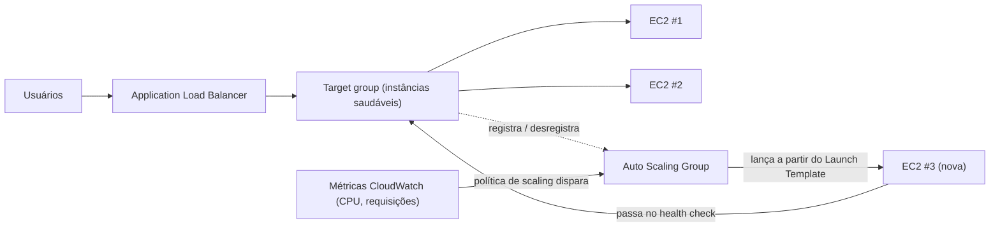

# Capítulo 7: O Restaurante Que Cresce Quando Fica Movimentado

Eram 19h43 de uma sexta-feira à noite.

A cadeira do Tom estava ligeiramente recuada, do jeito que ficava quando ele estava olhando para algo com o tipo de concentração que significava que ele não ia responder se você falasse com ele. O escritório tinha esvaziado uma hora atrás. Ele tinha ficado.

Ele tinha uma aba aberta no painel de métricas que ele atualizava do jeito que outras pessoas checam redes sociais — reflexivamente, constantemente, sem bem querer.

A crise de armazenamento estava para trás. O banco de dados tinha seu próprio disco. As fotos viviam no S3. Por duas semanas, o sistema tinha estado estável — não empolgante, só estável. Aquilo deveria ter dado uma sensação boa.

Então a taxa de erro cruzou 12%.

"Leo," disse Tom.

Leo já estava olhando. Tempos de resposta: subindo. Requisições enfileiradas: subindo. A única instância EC2 — mesmo depois do cuidadoso exercício de dimensionamento correto do mês passado — estava a 94% de CPU.

"A gente está afastando clientes," disse Tom.

"A gente não está afastando eles," disse Leo. "O servidor está."

"É a mesma coisa."

Era. E vinha acontecendo toda sexta por três semanas. A Nimbus tinha sobrevivido à crise de armazenamento — o banco de dados tinha seu próprio disco, as fotos viviam no S3 — mas estável e escalável são problemas completamente diferentes. O sistema funcionava. Ele só não crescia.

Uma mensagem do Slack apareceu da Maya: *o dashboard diz pedidos 40% abaixo da sexta passada. o que está acontecendo?*

Tom respondeu: *servidor no limite. resolvendo.*

Três minutos se passaram.

Maya: *a gente tem um dono de restaurante ligando para o suporte dizendo que o app está quebrado.*

Leo estava com as mãos no teclado. Ele estava redimensionando a instância — a versão manual da correção, a que exigia parar o servidor e mudar o tipo de instância. O que significava inatividade.

"Quanto tempo vai levar o reinício?" perguntou Tom.

"Sete minutos," disse Leo.

"A gente vai ter mais sete minutos de interrupção numa sexta à noite," disse Tom. Ele não estava perguntando. Ele digitou uma mensagem no Slack para Maya. Ela respondeu com um único caractere: *k*

O reinício terminou. A instância voltou. A CPU caiu para 60%. A taxa de erro caiu. Tom observou as métricas por quinze minutos sem falar.

Às 21h15, o tráfego diminuiu. A crise tinha acabado.

Leo olhou para as próprias mãos, que tinham estado tremendo ligeiramente às 20h e não estavam mais.

"A gente não pode fazer isso toda sexta," disse ele.

"Não," disse Tom. "A gente não pode."

A equipe precisava que seu sistema lidasse com carga variável automaticamente. Não comprar
servidor suficiente para o pior caso e desperdiçar dinheiro nos momentos calmos. E não correr
manualmente quando picos de tráfego acontecem.

Há um padrão para isso. A AWS tem dois serviços que o implementam.

**O Conceito: Escalonamento Horizontal**

Há duas formas de fazer um sistema lidar com mais carga.

**Escalonamento vertical** significa deixar o único servidor maior. Mais CPU. Mais RAM.
Fizemos isso no Capítulo 4 quando fizemos upgrade de `t3.micro` para `t3.large`. Ajuda.
Mas tem limites: você só pode ir até certo tamanho, a instância tem que reiniciar para redimensionar,
e você ainda tem um ponto único de falha.

**Escalonamento horizontal** significa adicionar mais servidores. Em vez de um servidor grande, rode
cinco servidores médios. Quando o tráfego cai, rode dois. Quando dá pico, rode dez.

O escalonamento horizontal tem vantagens que o vertical não tem:

- Sem ponto único de falha. Se um servidor morre, os outros continuam servindo.
- Nenhum reinício necessário para adicionar capacidade.
- Pague apenas pelo que você está usando — adicione servidores quando precisa, remova quando não precisa.
- Escalonamento linear: o dobro de servidores, aproximadamente o dobro da taxa de transferência.

Há também uma dimensão de confiabilidade que o escalonamento vertical não consegue igualar. Quando você tem
cinco servidores e um falha, sua capacidade cai para 80% — o suficiente para continuar servindo tráfego
enquanto a instância com falha é substituída. Quando você tem um servidor e ele falha, a capacidade
cai para 0%. A redundância é intrínseca ao escalonamento horizontal de uma forma que o escalonamento
vertical não consegue fornecer em nenhum tamanho.

Isso importa para manutenção também. Quando um patch de segurança exige um reinício de servidor,
o escalonamento horizontal deixa você reiniciar instâncias uma de cada vez — reinícios em rolagem que
mantêm a continuidade do serviço. Um único servidor grande exige ou aceitar inatividade
durante o reinício ou implementar a complexidade de deploy blue/green.

A pegadinha: se você tem múltiplos servidores, como os usuários sabem com qual falar?

E há uma restrição de design que o escalonamento horizontal impõe: sua aplicação
deve ser capaz de rodar em múltiplos servidores idênticos simultaneamente sem os servidores
interferirem uns com os outros. Este é o requisito **stateless** (sem estado) — cada requisição
deve ser autocontida, não dependente de estado armazenado em um servidor específico. Vamos ver
exatamente por que isso importa quando encontrarmos o problema das sticky sessions.

**O Application Load Balancer: Uma Porta, Muitas Salas**

Pense em um restaurante grande com uma recepção na porta. Os clientes chegam e o recepcionista
os direciona para uma mesa disponível. O recepcionista sabe quais mesas estão ocupadas e quais estão
livres. Os clientes não precisam saber quantas mesas existem — eles só entram e o
recepcionista cuida da distribuição.

Um **Application Load Balancer** (ALB) faz isso com requisições web.

Os usuários se conectam ao balanceador de carga. O balanceador de carga distribui as requisições recebidas
pela sua frota de instâncias EC2. Cada usuário vê um endereço (a URL do balanceador de carga).
Por trás daquele endereço, as requisições são espalhadas por quantos servidores estiverem rodando.

O próprio ALB roda em infraestrutura gerenciada pela AWS, distribuída por múltiplas AZs
na sua Região. Não é um único servidor — é um serviço gerenciado e distribuído.
Quando você habilita o balanceamento de carga entre zonas (cross-zone, o padrão para ALBs), cada nó do ALB
distribui requisições uniformemente por todos os targets registrados independentemente de em qual AZ
eles estão. Isso previne o modo de falha comum em que uma AZ tem o dobro de
instâncias saudáveis que outra, resultando em carga desigual.

Ele recebe cada requisição HTTP de entrada e decide qual instância EC2 (chamada de
**target**) deve lidar com ela, com base em fatores como:

- Round-robin (cada servidor recebe sua vez na rotação)
- Least outstanding requests (o servidor com menos requisições em andamento recebe a próxima requisição)
- Saúde — apenas targets saudáveis recebem tráfego

**Health checks** (verificações de saúde) são essenciais. O ALB regularmente envia requisições de teste a cada target.
Se um target não responde corretamente, o ALB o marca como não saudável e para de enviar
tráfego para ele. Quando o target se recupera, o tráfego retoma.

Isso é automático. Você configura os parâmetros do health check; o ALB os aplica.

Você configura health checks com três parâmetros-chave: o **caminho** (path) a verificar (ex.: `/health`),
o **intervalo** (com que frequência verificar — a cada 5 a 300 segundos; padrão 30), e o **limiar** (threshold, quantas
verificações consecutivas bem-sucedidas ou falhas antes de mudar o status de saúde do target).

Intervalos agressivos de health check pegam problemas mais rápido mas adicionam mais tráfego aos targets.
Um intervalo de 30 segundos com um limiar de 3 falhas significa que um target em falha é removido da
rotação dentro de 90 segundos. Um intervalo de 10 segundos com um limiar de 2 falhas significa
remoção dentro de 20 segundos — ao custo de mais tráfego de health check.

Para a Nimbus, Priya escolheu um intervalo de 30 segundos com um limiar de 3 falhas (90 segundos
para declarar não saudável) e 2 sucessos (60 segundos para declarar saudável de novo após recuperação).
Isso equilibrou a detecção rápida de falhas com evitar falsos positivos de breves
falhas de rede.

**Configuração de Health Check: Mais Que "Está Vivo?"**

O primeiro health check do Leo era um ping TCP simples: "A porta 80 está aceitando conexões?" Esse é o mínimo. O servidor poderia estar aceitando conexões na porta 80 enquanto o banco de dados estava fora, enquanto a aplicação estava em um loop de erro, enquanto o disco estava cheio.

Priya tinha uma visão diferente do que "saudável" deveria significar.

"A gente pensou no que acontece se o health check passa mas a aplicação está quebrada?" perguntou ela. "Um servidor que consegue aceitar conexões mas não consegue consultar o banco de dados não está saudável. Ele só está responsivo."

Leo construiu um endpoint `/health` no código da aplicação. O endpoint fazia três coisas:
1. Confirmava que o processo da aplicação estava rodando
2. Fazia uma consulta de teste ao banco de dados (um simples `SELECT 1`)
3. Confirmava que a conexão com o S3 estava acessível

Se os três passassem, o endpoint retornava HTTP 200. Se algum falhasse, retornava HTTP 503.

O health check do ALB foi configurado para chamar esse endpoint a cada 30 segundos. Se recebesse três respostas 503 consecutivas, a instância era marcada como não saudável e removida da rotação.

"Isso significa que se o banco de dados cai," disse Priya, "o health check vai pegar isso e remover os servidores afetados do balanceador de carga dentro de 90 segundos."

"Mesmo se os próprios servidores ainda estiverem rodando," disse Tom.

"Mesmo se eles parecerem bem por fora."

O ALB, apontado para um health check real de aplicação, se tornou um detector muito mais confiável de problemas reais — não só da vivacidade do servidor.

**Auto Scaling: O Restaurante Que Abre Mais Mesas**

Um ALB distribui tráfego pelos seus servidores existentes. Mas ele não adiciona servidores
quando você precisa de mais.

O **Auto Scaling** adiciona.

Um **Auto Scaling Group** (ASG) é uma configuração que diz à AWS:

- O número mínimo de instâncias para sempre ter rodando
- O número máximo de instâncias permitido
- As condições sob as quais escalar para fora (adicionar instâncias) ou para dentro (removê-las)

As condições de escalonamento são chamadas de **políticas**. Os quatro tipos mais comuns:

**Target tracking**: "Mantenha a utilização média de CPU em 70%." Quando a CPU média excede
70%, a AWS lança novas instâncias. Quando cai abaixo, instâncias são encerradas.
Esta é a política mais simples e mais recomendada para a maioria das cargas de trabalho — defina uma métrica
alvo e deixe a AWS descobrir quantas instâncias são necessárias. O alvo pode ser utilização
de CPU, contagem de requisições por target, ou qualquer métrica customizada do CloudWatch.

**Step scaling**: Defina limiares específicos com respostas específicas. "Quando a CPU
excede 60%, adicione 1 instância. Quando a CPU excede 80%, adicione 3 instâncias. Quando a CPU cai
abaixo de 30%, remova 1 instância." Controle mais granular que o target tracking, mas
exige mais configuração e ajuste contínuo.

**Scheduled scaling**: "Às 18h45 toda sexta, garanta que pelo menos 4 instâncias estejam
rodando." Este é escalonamento proativo para eventos previsíveis. Ele funciona junto com
o escalonamento reativo — a ação agendada define um piso, e o target tracking adiciona
instâncias acima desse piso conforme necessário.

**Predictive scaling**: a versão de machine learning da mesma ideia. Em vez de você escrever o cronograma, o Auto Scaling analisa até duas semanas de carga histórica e prevê as próximas 48 horas, lançando capacidade *antes* da rampa prevista. Para tráfego cíclico — um horário de pico de jantar toda sexta, uma abertura de mercado todo dia útil — o predictive scaling descobre o padrão e pré-aquece automaticamente, e continua ajustando à medida que o padrão muda. Gatilho de exame: "picos de tráfego recorrentes/cíclicos; instâncias devem estar prontas *antes* do pico" → predictive scaling. (O scheduled scaling é a resposta manual; o predictive é a aprendida. Ambos vencem o escalonamento só-reativo, que sempre fica atrás do pico pelo tempo de boot da instância.)

Para a Nimbus, a combinação foi: target tracking para escalonamento reativo (manter a CPU
em 65%), mais uma ação de scheduled scaling toda sexta às 18h45 para pré-aquecer 2
instâncias adicionais antes do horário de pico do jantar.

Isso é automático. Ninguém tem que observar as métricas. Ninguém tem que lançar
servidores manualmente. O sistema reage à carga em tempo real.

Priya viu isso acontecer ao vivo durante um horário de pico de sexta pela primeira vez. A contagem
de servidores foi de 2 para 5 ao longo de quinze minutos, depois de volta para 2 depois do pico.

"Isso," disse ela, "é genuinamente impressionante."

Tom estava olhando para o gráfico de custo em vez disso. A conta aumentou durante o pico e caiu
depois. "A gente só pagou pelo que usou," disse ele, igualmente impressionado. "Quanto isso custa por mês, em média ao longo de uma semana normal?"

Leo abriu a calculadora. Os picos de sexta adicionavam talvez 15% à conta mensal. Sem Auto Scaling, eles teriam precisado provisionar para o pico a semana toda. A diferença: aproximadamente US$ 120/mês desperdiçados em capacidade de pico ociosa, versus US$ 0 desperdiçado com Auto Scaling configurado apropriadamente.

Há uma sutileza no scale-in que as equipes frequentemente deixam passar: a **proteção contra scale-in**. Você
pode configurar instâncias específicas em um ASG para serem protegidas do scale-in — significando
que elas não serão encerradas durante eventos automáticos de scale-in. Isso é útil para instâncias
que estão no meio do processamento de um job de longa duração que você não quer interromper.
O código da aplicação também pode definir a proteção de instância programaticamente quando inicia um
job longo e remove a proteção quando o job se completa. Isso previne que o ASG
puxe o tapete debaixo do trabalho ativo.

**Warm Pools: Nem Tudo Precisa Começar Frio**

Na sexta em que o Auto Scaling entrou em ação pela primeira vez, Tom cronometrou quanto tempo levava de "CPU excede o limiar" até "novas instâncias servindo tráfego".

Quatro minutos e vinte segundos.

"Isso são quatro minutos em que a gente está com pouca capacidade," disse ele.

"A gente poderia aumentar a contagem mínima de instâncias," disse Leo.

"Isso significa pagar por instâncias ociosas a semana toda," disse Tom.

Havia um meio-termo: **Warm Pools**.

Um Warm Pool é um grupo de instâncias EC2 pré-inicializadas que ficam em estado parado, já inicializadas, já configuradas, já passadas pelo script de UserData. Elas fizeram tudo exceto começar a servir tráfego.

Quando o Auto Scaling Group decide escalar para fora, em vez de lançar uma nova instância fria do zero (o que leva de três a cinco minutos para inicializar, rodar o UserData e passar nos health checks), ele inicia uma instância do Warm Pool. Iniciar uma instância parada leva cerca de 30 a 60 segundos.

Para o padrão de sexta da Nimbus — um surto conhecido e previsível começando por volta das 19h — Priya configurou um Warm Pool de duas instâncias para manter durante o horário comercial. Às 18h45, duas instâncias mornas estavam prontas, paradas mas inicializadas. Quando o tráfego subiu às 19h e o ASG precisou escalar, as instâncias mornas iniciaram em menos de um minuto e se juntaram à frota.

"Quanto o Warm Pool custa?" perguntou Tom.

Uma instância EC2 parada não paga por computação — mas paga pelo armazenamento EBS anexado. Duas instâncias `t3.small` num Warm Pool: cerca de US$ 4/mês em custos de armazenamento. A melhoria no tempo de scale-out de quatro minutos para menos de um minuto valia US$ 4/mês numa sexta à noite.

**Roteamento Baseado em Caminho do ALB**

À medida que a Nimbus crescia, Leo adicionou um segundo componente: um serviço de API separado para gestão de restaurantes. Os donos de restaurante acessavam esse serviço através do mesmo domínio mas em um caminho de URL diferente: `/api/restaurant/` em vez de `/`.

"Espera — mas *por que* a gente faria desse jeito?" perguntou Maya. "Por que não dar à API de gestão de restaurantes um domínio totalmente diferente?"

"A gente poderia," disse Leo. "Mas aí a gente ia precisar de um segundo certificado, um segundo balanceador de carga, uma segunda entrada de DNS. O roteamento baseado em caminho lida com isso com um certificado, um balanceador de carga."

O ALB suportava isso nativamente. Uma **regra de roteamento baseado em caminho** dizia ao ALB: quando a URL começa com `/api/restaurant/`, roteie a requisição para o target group de gestão de restaurantes. Quando a URL começa com qualquer outra coisa, roteie-a para o target group da aplicação voltada para o cliente.

Duas frotas separadas de instâncias EC2. Um balanceador de carga. Tráfego direcionado por caminho de URL.

"Então a gente pode escalar a API de gestão de restaurantes independentemente do app voltado para o cliente?" perguntou Maya.

"Exatamente," disse Leo. "Se os donos de restaurante estão fazendo muitas atualizações de cardápio, esses servidores de API escalam. Se os clientes estão pedindo muito, esses servidores escalam. Eles não afetam um ao outro."

Maya refletiu sobre isso. "E a gente só paga por um ALB em vez de dois."

"Correto," disse Tom. Ele tinha um número. "O ALB custa cerca de US$ 20 por mês em taxas de base mais cobranças de processamento de dados. Um ALB lidando com ambas as cargas de trabalho versus dois separados: cerca de US$ 20 economizados por mês. E a gente evita gerenciar múltiplos certificados e registros de DNS."

"Mas," disse Priya, "se o próprio ALB cair, os dois serviços caem juntos."

"A AWS projeta o ALB para ser altamente disponível em múltiplas AZs," disse Leo. "O risco de falha do ALB é muito baixo comparado à complexidade de manter dois balanceadores de carga separados."

Priya arquivou isso sob "trade-off aceito, documentado".

**Como o ALB e o ASG Trabalham Juntos**

Os dois serviços são projetados para serem usados juntos.

Você coloca o ALB na frente. O ALB aponta para um **target group** — uma coleção de
instâncias que devem receber tráfego. O Auto Scaling Group gerencia essas instâncias:
ele as adiciona ao target group ao escalar para fora, as remove ao escalar para dentro.

O fluxo:

1. O tráfego chega ao ALB
2. O ALB distribui requisições aos targets saudáveis
3. CPU/carga sobe nesses targets
4. O ASG detecta o aumento de carga, lança novas instâncias
5. Novas instâncias passam nos health checks, são registradas no ALB
6. O ALB começa a enviar tráfego para elas
7. A carga diminui, o ASG encerra instâncias extras
8. O ALB para de enviar tráfego para instâncias encerradas

Isso acontece sem qualquer intervenção humana.

**Launch Templates: O Projeto para Novas Instâncias**

Quando o ASG lança uma nova instância, ele precisa saber o que lançar. Isso é definido
em um **Launch Template** — uma AMI, um tipo de instância, os security groups a aplicar,
e quaisquer dados de usuário (scripts de inicialização que rodam quando a instância inicializa).

Um padrão comum: você incorpora sua aplicação em uma AMI customizada (veja o Capítulo 4).
Quando o ASG precisa de uma nova instância, ele lança essa AMI. A nova instância inicializa com
sua aplicação já instalada. Nenhuma configuração manual necessária.

Para ambientes mais dinâmicos, você também pode usar **scripts de user data** que puxam e
instalam a versão mais recente do seu código na inicialização. Isso é mais flexível mas leva
mais tempo para inicializar.

A escolha certa depende de quanto tempo suas instâncias precisam para inicializar e com que frequência sua
aplicação muda.

**Sticky Sessions: Um Problema Sutil**

Eis algo que pega muitas equipes quando elas implementam balanceamento de carga pela primeira vez.

Algumas aplicações web armazenam dados de sessão — estado de login, conteúdo de carrinho de compras — no
próprio servidor (na memória ou no disco local). Isso funciona bem com um servidor.
Com múltiplos servidores, quebra.

Um usuário faz login. A requisição vai para o Servidor A. O Servidor A armazena a sessão. A próxima
requisição vai para o Servidor B. O Servidor B não tem sessão. O usuário parece deslogado.

Isso pode ser abordado de duas formas:

**Sticky sessions** (ou afinidade de sessão): Configure o ALB para sempre enviar requisições
do mesmo usuário para o mesmo servidor. Esta é uma correção de curto prazo. Ela mina o balanceamento
de carga (alguns servidores recebem mais usuários "grudados" que outros) e cria problemas
quando uma instância é encerrada.

Maya olhou a página de configuração de sticky sessions. "Se a gente fixa usuários em servidores específicos, o que acontece quando esses servidores são encerrados durante o scale-in?"

"Eles perdem a sessão," disse Leo.

"Então sticky sessions só está adiando o problema."

"Correto," disse Priya. "A correção real é o design de aplicação stateless."

**Design de aplicação stateless**: Armazene dados de sessão externamente — em um banco de dados ou
em um cache como o ElastiCache (Capítulo 10). Cada servidor pode reconstruir a sessão de qualquer usuário
a partir do armazenamento externo. Os servidores se tornam intercambiáveis. Esta é a abordagem certa
para aplicações escaláveis horizontalmente.

Priya chamou isso de "a decisão arquitetural mais importante que você toma quando vai
para múltiplos servidores". Ela tem razão. Encontramos isso de novo no Capítulo 10.

**Se Sticky Sessions Então Menos Complexidade Mas Mais Risco**

Se você usa sticky sessions para resolver o problema de estado de sessão, então você reduz a necessidade de configurar armazenamento de sessão externo no curto prazo — mas quando um servidor com sessões grudadas é encerrado durante o scale-in, todos os usuários vinculados a ele perdem suas sessões de uma vez. A falha não é gradual; é súbita e afeta um conjunto de usuários simultaneamente. Se você externaliza o estado da sessão, você adiciona uma dependência (ElastiCache ou um banco de dados) mas elimina esse modo de falha súbita. Para qualquer aplicação que escala regularmente, o investimento em design stateless se paga na primeira vez que o Auto Scaling encerra uma instância com sessões ativas nela.

**O Cálculo de Custo do Tom**

Na semana seguinte, Tom construiu um modelo de custo para a configuração de ALB e ASG.

O ALB: aproximadamente US$ 20/mês de base mais cobranças de processamento de dados. No volume de tráfego da Nimbus: cerca de US$ 22/mês.

O próprio Auto Scaling Group: nenhum custo adicional. Você paga pelas instâncias que ele roda, mas essas instâncias existiriam de qualquer forma. O ASG é gratuito; você paga por computação.

O Warm Pool: cerca de US$ 4/mês em armazenamento EBS para duas instâncias paradas.

Custo total adicional de infraestrutura: aproximadamente US$ 26/mês, ou US$ 312/ano.

Tom então olhou para o registro de incidentes das três sextas antes de o ALB e o ASG estarem no lugar. Cada incidente tinha custado à Nimbus aproximadamente 40% da receita de sexta durante a janela de interrupção. Receita média de sexta: cerca de US$ 2.400. 40% de US$ 2.400 são US$ 960 por incidente. Três incidentes: aproximadamente US$ 2.880 em receita perdida em três semanas.

"O ALB e o ASG custam US$ 312 por ano," disse Tom. "Três sextas ruins nos custaram quase US$ 3.000. E isso é só a perda direta de receita — não a evasão de clientes de pessoas que pararam de usar a Nimbus depois de uma experiência ruim."

Maya leu os números. "Rode a infraestrutura."

"Já rodando," disse Leo.

## Quando o ALB Não É Suficiente: NLB e GWLB

Leo estava revisando a integração de IoT que a Nimbus tinha silenciosamente adicionado para parceiros restaurantes — pequenos sensores de temperatura em câmaras frias que enviavam leituras para a Nimbus a cada trinta segundos, para que gerentes de cozinha pudessem receber alertas se um refrigerador ultrapassasse a temperatura segura.

"Espera," disse Leo. "Esses sensores estão enviando pacotes UDP."

"Isso é um problema?" perguntou Maya.

"O ALB não suporta UDP," disse Leo. "O ALB entende HTTP. Só isso."

Priya já estava olhando a documentação. "É para isso que serve o Network Load Balancer."

O **Network Load Balancer (NLB)** opera na Camada 4 — a camada de transporte. Ele roteia pacotes TCP e UDP. Ele não inspeciona o conteúdo desses pacotes, não entende cabeçalhos HTTP, não faz roteamento baseado em caminho. O que ele faz é mover pacotes de clientes para targets em velocidade extraordinária.

- **Milhões de requisições por segundo com latência de milissegundos de um dígito.** O ALB processa HTTP na Camada 7, o que significa que ele analisa cabeçalhos, avalia regras de roteamento e termina conexões TLS. O NLB não faz nada disso — ele é mais próximo de um direcionador de tráfego de alta velocidade que de um proxy web.
- **Preserva o endereço IP de origem do cliente.** Quando um ALB recebe uma conexão, ele a termina e abre uma nova para o target — sua instância EC2 vê o IP do ALB, não o do usuário. O NLB não faz isso; o IP de origem do pacote chega inalterado ao target. Se sua aplicação precisa saber de onde as requisições estão vindo — para geolocalização, limitação de taxa ou detecção de fraude — e você precisa que isso seja preciso, o NLB é a escolha certa. (O ALB adiciona um cabeçalho `X-Forwarded-For` que carrega o IP original, mas isso exige que a aplicação leia o cabeçalho; o NLB coloca o IP real diretamente no pacote.)
- **Endereços IP estáticos e Elastic IPs.** Os endereços IP do ALB mudam com o tempo — a AWS os gerencia e eles não são fixos. O NLB suporta IPs estáticos por Zona de Disponibilidade, e você pode atribuir Elastic IPs a eles. Se sistemas downstream precisam colocar um endereço IP específico em lista de permissão para permitir tráfego do seu balanceador de carga — um requisito comum em serviços financeiros ou gestão de dispositivos IoT — o NLB é a única opção. O ALB não consegue fazer isso.
- **TLS pass-through.** O NLB pode passar tráfego TLS criptografado diretamente para os targets sem descriptografá-lo. O target termina o TLS. Isso é útil quando requisitos de conformidade dizem que a descriptografia deve acontecer em um dispositivo específico, ou quando você não quer gerenciar certificados TLS no balanceador de carga.

"Se o NLB é tão rápido," perguntou Maya, "por que a gente não usa ele para tudo?"

"Porque ele é burro," disse Leo. "No melhor sentido. O NLB não sabe o que é HTTP. Ele não consegue fazer roteamento baseado em caminho. Ele não consegue redirecionar HTTP para HTTPS. Ele não consegue adicionar cabeçalhos de segurança. Ele não consegue integrar com o WAF. Para uma aplicação web — qualquer coisa que fala HTTP — a consciência de Camada 7 do ALB é o que torna todos esses recursos possíveis. Para os dados dos sensores, que são UDP, a gente não tem escolha."

"E para o nosso tráfego web?"

"ALB, igual a antes."

"Quanto isso custa por mês?" perguntou Tom. "O NLB é mais barato?"

O modelo de preço é o mesmo do ALB: uma cobrança horária de base mais uma cobrança por Load Balancer Capacity Unit (LCU) com base no tráfego processado. Em volumes de tráfego equivalentes, o custo é comparável. Para o caso de uso de IoT da Nimbus — dados de sensores de baixo volume — o custo do NLB ficaria abaixo de US$ 20/mês.

O **Gateway Load Balancer (GWLB)** é um bicho completamente diferente. Ele opera na Camada 3 — o nível de pacote IP — e existe para um propósito específico: inserir appliances de rede virtuais de terceiros no seu fluxo de tráfego.

Imagine que a Nimbus crescesse a um tamanho em que a equipe de segurança exigisse que todo o tráfego entrando e saindo de suas VPCs passasse por um appliance de firewall comercial — uma máquina virtual rodando software de um fornecedor como Palo Alto ou Fortinet. Sem o GWLB, você teria que rotear manualmente o tráfego através desses appliances e descobrir como escalá-los e mantê-los altamente disponíveis. Com o GWLB, você configura o appliance como um target, e todo o tráfego é transparentemente roteado através dele usando o protocolo GENEVE. A aplicação não sabe que o tráfego está sendo inspecionado. O firewall não precisa saber a topologia de rede. O GWLB cuida do roteamento, do escalonamento e do failover.

Para a maioria das aplicações web nos estágios inicial e intermediário — incluindo a Nimbus — o GWLB não é um serviço que você vai configurar. Mas para o exame, e para o dia em que um requisito de segurança exigir inspeção no nível de rede, você vai saber para que ele serve.

Leo adicionou um NLB para o endpoint dos sensores naquela tarde. Os dados de temperatura começaram a fluir.

"O primeiro restaurante recebe um alerta de que a câmara fria deles está a 47 graus," disse ele. "Isso é acima do limiar seguro."

"Está de fato a 47 graus?" perguntou Maya.

"O dono do restaurante confirmou. Eles chamaram um técnico de reparo na mesma tarde."

Priya anotou isso no registro de impacto a clientes da Nimbus. Não um evento de segurança. Só o recurso de IoT funcionando.

**Os Três Balanceadores de Carga, Lado a Lado**

A AWS oferece três tipos de balanceadores de carga. O ALB lida com HTTP e HTTPS na Camada 7 —
ele entende o protocolo, então pode rotear com base no caminho de URL (`/api` para um grupo,
`/static` para outro), cabeçalhos de host e parâmetros de consulta. Isso é o que a maioria das aplicações
web usa, e é o que a Nimbus usa para seu tráfego web.

O ALB também termina conexões TLS — certificados SSL/HTTPS são instalados no
balanceador de carga, não em cada instância EC2 individual. O ALB descriptografa a requisição,
inspeciona os cabeçalhos HTTP, roteia com base em regras, e (opcionalmente) recriptografa antes de
encaminhar para o target. Isso simplifica significativamente a gestão de certificados: você
gerencia um certificado no ALB em vez de um certificado em cada instância.

O NLB, como a equipe viu com os sensores de temperatura, lida com TCP, UDP e TLS na
Camada 4 — velocidade pura, preservação de IP de origem, IPs estáticos. O GWLB fica na Camada 3 para
costurar tráfego através de appliances de terceiros como firewalls e sistemas de detecção de intrusão
— raramente necessário no nível júnior.

Para a Nimbus (e para a maioria das aplicações web), o ALB é a escolha certa.

Você pode estar se perguntando: você pode usar tanto ALB quanto NLB para a mesma aplicação? Sim. Um padrão comum é NLB na frente do ALB — o NLB lida com a terminação TCP pura na borda, o ALB lida com o roteamento HTTP por trás dele. Isso adiciona complexidade e custo, e não é necessário para a maioria das aplicações web.

**ALB vs. NLB para o exame**: O diferenciador-chave é Camada 7 vs. Camada 4. Se
o cenário de exame menciona roteamento baseado em URL, roteamento baseado em host, inspeção de cabeçalho HTTP,
ou WebSockets — isso é ALB. Se menciona TCP pass-through, preservar IP de origem,
milhões de requisições por segundo, ou latência extremamente baixa para protocolos não-HTTP — isso é
NLB. Quando um cenário só diz "balanceador de carga para uma aplicação web", a resposta é
quase sempre ALB.

## Pontos Fortes e Limitações

**Por que ALB + Auto Scaling é poderoso**:

- Escalonamento sem inatividade (instâncias são adicionadas/removidas sem interromper conexões existentes)
- Failover automático (instâncias não saudáveis são removidas do tráfego automaticamente)
- Eficiência de custo (pague apenas por instâncias em execução)
- Sem ponto único de falha — múltiplas instâncias em múltiplas AZs

**Onde fica complicado**:

- Aplicações com estado (stateful) precisam de tratamento especial (sticky sessions ou estado externo)
- Escalar para fora leva tempo — se o tráfego dá pico instantaneamente, há um atraso antes de novas
  instâncias estarem prontas. Mitigue com Warm Pools para picos previsíveis ou uma contagem mínima mais alta.
- Mais partes móveis significa mais para monitorar e depurar
- Algumas aplicações não podem ser escaladas horizontalmente facilmente (bancos de dados, certos sistemas
  legados). O escalonamento horizontal funciona melhor para camadas stateless.

## Resumo

Dois serviços, um padrão — e o padrão é o que importa. O ALB cuida da distribuição; o ASG cuida do tamanho da frota. Juntos eles transformam uma configuração frágil de instância única em um sistema que consegue absorver o tráfego de jantar de sexta sem um ser humano acordado. O custo de infraestrutura de US$ 312/ano versus três sextas de receita perdida (~US$ 2.880) é o tipo de matemática que o Tom coloca em uma planilha e nunca esquece.

- O **escalonamento horizontal** (adicionar mais servidores) é preferido em relação ao escalonamento vertical porque elimina pontos únicos de falha e permite custo elástico. Um **Application Load Balancer (ALB)** distribui o tráfego HTTP/HTTPS de entrada e só roteia para instâncias saudáveis.
- **Health checks devem testar a funcionalidade real da aplicação** — um endpoint `/health` que verifica a conectividade com o banco de dados pega falhas reais antes dos clientes.
- Um **Auto Scaling Group (ASG)** ajusta automaticamente o número de instâncias EC2 com base em políticas de escalonamento. O target tracking é o tipo mais comum; o scheduled scaling lida com picos previsíveis como o horário de pico do jantar de sexta.
- Aplicações com estado devem externalizar o estado da sessão em vez de depender de sticky sessions no longo prazo. Sticky sessions são uma correção de curto prazo; externalizar o estado é a arquitetura correta.
- Para tráfego HTTP/HTTPS, use ALB. Para desempenho TCP/UDP puro, use NLB. O roteamento baseado em caminho do ALB deixa um único balanceador de carga servir múltiplos componentes de aplicação por caminho de URL.

## Dicas de Exame

*Domínio SAA-C03 2 — Tarefa 2.1 (arquiteturas escaláveis) / Domínio 3 — Tarefa 3.2*

- **Health checks do ASG podem vir do EC2 ou do ALB.** Health checks do EC2 só detectam
  se a instância está rodando. Health checks do ALB detectam se a aplicação está
  respondendo corretamente. Health checks do ALB são mais completos e devem ser preferidos
  para aplicações web.
- **O target tracking scaling é a resposta de exame mais comum** para políticas de escalonamento.
  O simple scaling (adicionar N instâncias quando o alarme dispara) é mais antigo e menos adaptativo.
- **Scale-out é rápido; scale-in é lento.** A AWS encerra instâncias gradualmente durante
  o scale-in para evitar interromper conexões ativas — um comportamento controlado pela configuração de **deregistration delay** do ALB.
- **A contagem mínima de instâncias é seu piso de resiliência.** Se você define mínimo = 1
  e essa instância falha, sua aplicação está fora antes de o ASG poder reagir. Defina
  mínimo ≥ 2 e espalhe pelas AZs para resiliência de verdade.
- **O ALB pode distribuir tráfego entre AZs automaticamente.** Com o balanceamento de carga entre zonas
  (cross-zone) habilitado, cada nó do ALB distribui requisições uniformemente por todos os targets
  registrados independentemente da AZ. Isso é importante para carga balanceada quando as contagens de
  instância por AZ diferem.
- **O roteamento baseado em caminho do ALB** aparece em cenários de exame descrevendo múltiplos componentes
  de aplicação compartilhando um único balanceador de carga. O termo correto é "listener rules" que
  roteiam com base em condições de caminho de URL.
- **Seleção de balanceador de carga:** ALB = HTTP/HTTPS, Camada 7, roteamento por caminho/cabeçalho, WebSockets, integração com WAF. NLB = TCP/UDP, Camada 4, desempenho extremo, IPs estáticos, preservação de IP de origem. GWLB = Camada 3, inserir firewalls/appliances virtuais no caminho do tráfego. Gatilho de exame: "protocolo UDP" ou "IP estático no balanceador de carga" → NLB. "Inserir appliance de firewall no fluxo de tráfego" → GWLB.

## Exercícios

**Exercício 1 — Recordação**

Com suas próprias palavras: qual é a diferença entre um Application Load Balancer e
um Auto Scaling Group? Que problema cada um resolve, e por que você tipicamente
os usa juntos?

*(Dica: Um distribui tráfego que já existe; o outro ajusta quanta
capacidade você tem.)*

**Exercício 2 — Cenário SAA-C03**

*Cenário*: O site de e-commerce de uma empresa de varejo passa por tráfego altamente variável:
tráfego baixo durante os dias úteis, picos enormes nos fins de semana e durante eventos de flash sale.
Eles querem que sua aplicação lide com cargas de pico sem manter capacidade não utilizada
durante períodos calmos. A aplicação atualmente armazena dados de sessão na memória do servidor.

Qual mudança de arquitetura MELHOR atenderia aos requisitos de escalabilidade deles?

A) Fazer upgrade para uma única instância EC2 muito grande que possa lidar com o tráfego de pico
B) Implantar múltiplas instâncias EC2 atrás de um ALB com um Auto Scaling Group, e
   externalizar o armazenamento de sessão para o ElastiCache
C) Implantar múltiplas instâncias EC2 atrás de um ALB com sticky sessions habilitadas
D) Adicionar manualmente instâncias EC2 antes de cada pico de tráfego esperado e encerrá-las
   depois

**Dica 1**: "Sem manter capacidade não utilizada" significa que você precisa de escalonamento automático,
não de uma instância grande fixa ou gestão manual.

**Dica 2**: O armazenamento de sessão na memória do servidor é um problema para implantações de
múltiplas instâncias. Quais opções abordam isso?

**Dica 3**: A opção C usa sticky sessions — isso é uma gambiarra, não uma correção.
Qual opção aborda tanto o escalonamento quanto o problema de armazenamento de sessão apropriadamente?

**Resposta**: B

**Explicação**: Um ALB com um Auto Scaling Group fornece escalonamento automático e elástico
— instâncias são adicionadas durante picos e removidas durante períodos calmos. Mover o armazenamento
de sessão para o ElastiCache (um cache externo) torna a aplicação stateless: qualquer
instância pode lidar com a requisição de qualquer usuário, e o ALB pode distribuir o tráfego livremente.
Esta é a solução arquiteturalmente correta.

**Por que não A?** Uma única instância grande, não importa quão grande, ainda é um ponto único
de falha. Ela também desperdiça dinheiro durante períodos calmos quando a maior parte da capacidade fica ociosa.

**Por que não C?** Sticky sessions roteiam um usuário para a mesma instância, o que parcialmente
mitiga o problema de sessão mas mina o balanceamento de carga. Se essa instância
encerra (durante scale-in ou falha), o usuário perde a sessão de qualquer forma.

**Por que não D?** O escalonamento manual exige que alguém preveja picos de tráfego corretamente
e aja com antecedência. É lento, propenso a erros e trabalhoso. O Auto Scaling lida
com isso automaticamente.

*Domínio SAA-C03 2 — Tarefa 2.1 / Domínio 3 — Tarefa 3.2*

**Exercício 3 — Desafio de Arquitetura** *(Opcional)*

A Nimbus tem uma grande promoção chegando: 50% de desconto em todos os pedidos por 4 horas
no próximo sábado. Ano passado, uma promoção similar causou 10x o tráfego normal. A equipe
espera que o pico seja súbito e dure exatamente 4 horas.

O Auto Scaling vai eventualmente reagir, mas há um atraso. Como você projetaria para esse
pico conhecido? Qual é a diferença entre escalonamento reativo e proativo, e quando
cada um faz sentido?

*(Não há uma única resposta correta. Pense em ações de scheduled scaling,
pré-aquecimento, e as implicações de custo de cada abordagem.)*

## Cena Pós-Créditos

Na primeira sexta depois de implantar o Auto Scaling e o ALB, a equipe observou as
métricas juntos.

19h15: duas instâncias rodando. Carga normal.
19h45: a carga sobe. O Auto Scaling lança mais duas instâncias.
20h00: quatro instâncias lidando com o pico. Tempos de resposta estáveis.
21h30: a carga cai. O Auto Scaling encerra duas instâncias.
21h45: de volta a duas instâncias.

O site nunca ficou fora. Nenhuma vez.

Leo atualizou a página de métricas três vezes, como se esperasse encontrar uma falha que tivesse deixado passar.

"É estranho que eu me sinta ligeiramente decepcionado de nada ter quebrado?" disse ele.

"Sim," disse Priya.

Tom estava olhando para a conta. O custo tinha acompanhado o tráfego quase perfeitamente.
"A gente pagou exatamente pelo que usou," disse ele. "Não mais. Não menos."

Ele soava genuinamente surpreso.

Na manhã seguinte, Maya encontrou um novo problema nos logs de erro. Não uma interrupção — pior.

"Nosso banco de dados," disse ela, "está retornando tempos de consulta de oito segundos em média."

Oito segundos. Para um app de pedidos de restaurante.

"Toda vez que alguém carrega o cardápio, a gente está consultando cada item no banco de dados para
construir a página," disse Leo. "E a gente tem quarenta e sete restaurantes agora."

"Quantos itens de cardápio no total?" perguntou Tom.

Leo rodou a consulta.

"Cerca de vinte e dois mil."

Silêncio.

No próximo capítulo: o banco de dados que não exige um DBA — só um cartão de crédito.
