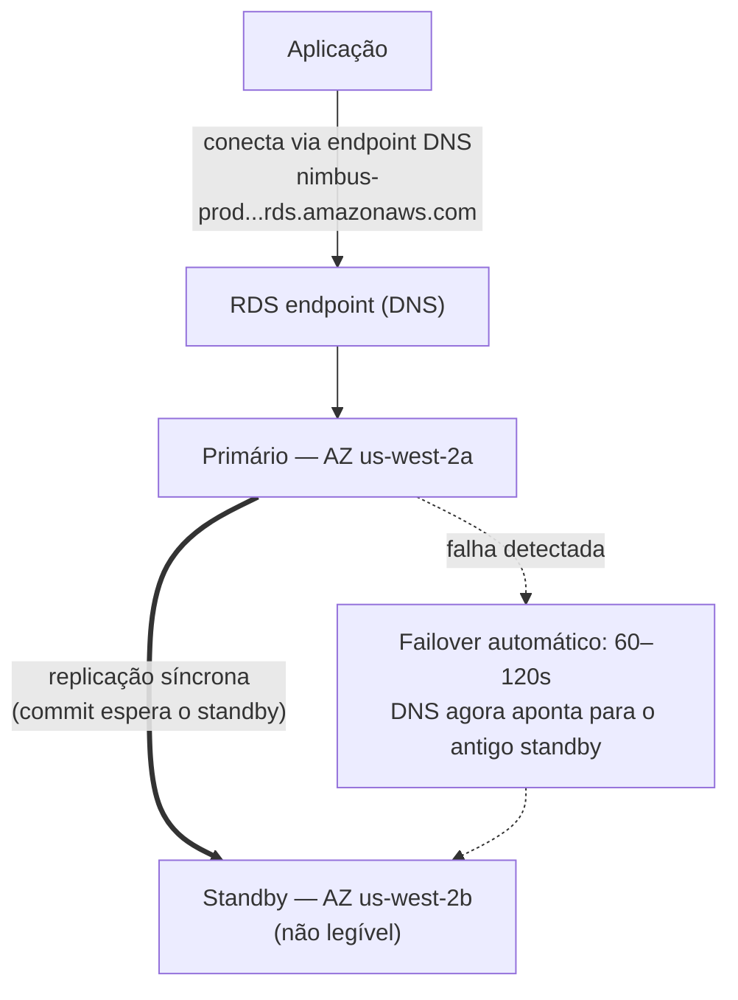

# Capítulo 8: O Administrador de Banco de Dados Que Nunca Falta por Doença

Eram 3 da manhã quando o alerta chegou.

Priya era a única acordada. O celular dela acendeu na mesa de cabeceira e ela o leu no escuro, o brilho da tela alto demais. Ela se sentou. Encontrou o laptop de memória e o abriu sem acender a luz.

O teclado clicava baixinho no quarto escuro.

O servidor de banco de dados precisava de um patch de segurança — do tipo que exigia um reinício. A
vulnerabilidade era real, o patch estava disponível, e a janela para aplicá-lo
sem perturbar os clientes era agora, no meio da noite, quando o tráfego
estava baixo.

Ela se conectou ao servidor. Puxou o patch. Aplicou-o.

Então leu as notas de lançamento.

A atualização do pacote tocava no arquivo de configuração que o PostgreSQL usa para definir parâmetros de conexão. As notas de lançamento incluíam um aviso: dependendo de como o upgrade fosse feito, um arquivo de configuração customizado poderia ser substituído pela versão padrão do pacote.

O arquivo de configuração deles tinha sido customizado. Leo o tinha editado dois meses atrás para ajustar a configuração max_connections.

O patch rodou. O servidor reiniciou. O banco de dados voltou a ficar online.

Priya testou uma consulta. Funcionou.

Ela verificou os logs. Tudo parecia normal.

Ela voltou para a cama às 4h15.

Às 9h05, Leo abriu a aplicação e recebeu um erro. Ele verificou o banco de dados. Max connections estava definido como o padrão: 100. A aplicação deles estava configurada para usar pools de conexão de até 500.

Toda nova tentativa de conexão estava falhando. A aplicação tinha efetivamente perdido o acesso ao banco de dados.

"O que aconteceu?" perguntou Maya.

"O patch," disse Priya. Ela já estava olhando o arquivo de configuração. "A atualização do pacote sobrescreveu nosso arquivo de config customizado com o padrão. O ajuste de max_connections do Leo simplesmente sumiu — o servidor reiniciou com as configurações de fábrica e ninguém recebeu um erro. Ele silenciosamente voltou para o padrão."

"Quanto tempo para corrigir?" perguntou Leo.

"Vinte minutos," disse Priya. "Mas a gente precisa de uma janela de manutenção. Isso exige uma mudança de configuração e um reinício."

"A gente tem restaurantes abrindo para o almoço em duas horas," disse Tom.

Priya corrigiu em dezoito minutos. A janela de manutenção foi de doze minutos de inatividade real. Restaurantes foram afetados, mas o pico ainda não tinha começado.

De manhã ela contou à equipe o que tinha acontecido. Houve um silêncio.

"Isso vai acontecer de novo," disse Tom.

"Vai acontecer toda vez que tiver um patch," disse Priya. "E sempre tem
patches. Tem que haver uma forma melhor de fazer isso."

Os tempos de consulta de oito segundos ainda estavam sem solução. E na mesma semana, isto: uma janela de manutenção às 3h que virou um incidente matinal. Ambos os problemas tinham a mesma causa raiz — a Nimbus estava rodando um banco de dados que ela não estava equipada para gerenciar.

Havia uma solução. Ela só exigia abrir mão da ideia de que eles precisavam gerenciar o banco de dados por conta própria.

**O Problema do Banco de Dados Tradicional**

Quando você roda um banco de dados por conta própria em uma instância EC2, você é responsável por tudo.

Instalar o software do banco de dados. Configurá-lo com segurança. Aplicar patches quando vulnerabilidades
de segurança são descobertas. Fazer backups. Testar que os backups de fato funcionam
(um passo que a maioria das equipes pula até ser tarde demais). Monitorar o espaço em disco. Configurar
replicação para redundância. Configurar failover para quando o servidor primário cair.
Ajustar o desempenho de consultas. Gerenciar conexões sob carga.

Nada disso é a aplicação. Nada disso adiciona recursos. Tudo isso exige expertise.

O requisito de expertise é a questão-chave. Um administrador de banco de dados qualificado entende
não só como rodar um banco de dados, mas como:

- Monitorar logs de consultas lentas e identificar gargalos de desempenho
- Dimensionar memória para o working set para evitar I/O de disco
- Configurar arquivamento de WAL para recuperação pontual (point-in-time)
- Configurar replicação por streaming síncrona com failover automático
- Ajustar o pool de conexões para prevenir esgotamento de conexões sob carga
- Aplicar upgrades de versão maior sem perda de dados ou inatividade prolongada

Este é um conjunto de habilidades distinto e especializado. DBAs sêniores comandam altos salários precisamente
porque fazer tudo isso bem é difícil. A maioria das startups não consegue contratar para isso. A maioria das
equipes de desenvolvimento não tem isso.

A maioria das equipes de desenvolvimento não é de administradores de banco de dados. Isso cria um padrão previsível:
o banco de dados é instalado, configurado minimamente, e depois quase esquecido até algo
dar catastroficamente errado. A instância PostgreSQL da Nimbus estava rodando na configuração
padrão — max_connections em 100, sem pool de conexões, backups manuais que Leo
tinha rodado duas vezes e depois esquecido, e sem replicação alguma.

O incidente do patch às 3h foi o sintoma de um sistema operado por pessoas que eram excelentes
em construir aplicações e não tinham experiência em operações de banco de dados. Isso não é uma
crítica — é uma descrição precisa da maioria das startups. A solução não é
contratar um DBA. A solução é usar um serviço que fornece operações de nível de DBA
automaticamente.

"Foi isso que a gente fez?" perguntou Maya.

A resposta do Leo foi silêncio, que era o mesmo que sim.

**O Banco de Dados Gerenciado**

Imagine contratar um administrador de banco de dados que nunca falta por doença, automaticamente lida com
cada patch de segurança, faz um backup toda noite sem ser pedido, e se conserta
quando algo quebra. Eles fazem tudo isso sem incomodar você — e
nunca, sob nenhuma circunstância, tocam na lógica da sua aplicação.

A AWS chama esse serviço de **RDS** — Relational Database Service.

Com o RDS, a AWS gerencia:

- Instalar e aplicar patches no motor do banco de dados
- Backups automatizados (armazenados no S3, retidos por até 35 dias)
- Failover automatizado (quando o primário cai, um standby assume automaticamente)
- Monitoramento e métricas
- Criptografia em repouso e em trânsito
- Auto-escalonamento de armazenamento (se você habilitar, o disco cresce quando enche)

Você gerencia:

- O schema do banco de dados (a estrutura das suas tabelas)
- Suas consultas e a lógica da aplicação
- Quem tem acesso ao banco de dados
- Qual tipo de instância roda o banco de dados
- Ajuste de parâmetros (embora o RDS forneça padrões sensatos)

**Motores Suportados**

O RDS suporta vários motores de banco de dados populares:

- **MySQL** — o banco de dados relacional open-source mais usado
- **PostgreSQL** — poderoso, extensível, cada vez mais popular para cargas de trabalho complexas
- **MariaDB** — fork open-source do MySQL, totalmente compatível
- **Oracle** — de nível empresarial, usado em grandes organizações com requisitos legados
- **Microsoft SQL Server** — para ambientes com forte presença de Windows
- **Amazon Aurora** — o motor próprio da AWS compatível com MySQL/PostgreSQL, construído para a nuvem
  (cobrimos o Aurora a fundo no Capítulo 24)

Para a Nimbus, a escolha foi o PostgreSQL. Era o que Leo conhecia, e ele lidava bem com dados
relacionais. A escolha do motor importa menos do que você pensaria para a maioria das aplicações —
os benefícios operacionais do RDS se aplicam independentemente.

Uma nuance: quando você roda um motor no RDS, a AWS mantém os patches de versão menor
automaticamente (durante sua janela de manutenção configurada). Upgrades de versão maior —
ir do PostgreSQL 14 para o 15, por exemplo — são uma operação manual que você
agenda e executa. A AWS testa os upgrades de versão maior cuidadosamente, mas você deveria testá-los
em um ambiente de staging primeiro. Mudanças de versão maior podem introduzir problemas de compatibilidade
com sintaxe SQL específica, extensões ou versões de driver.

Leo descobriu isso quando o RDS aplicou um patch menor e o log da aplicação brevemente
mostrou um aviso de obsolescência sobre uma função que tinha sido removida em uma sub-release.
Patches menores deveriam ser essencialmente transparentes — mas monitorar os logs da sua aplicação
depois de cada janela de manutenção é uma boa prática.

"A gente pensou no que acontece se um patch menor quebra alguma coisa?" perguntou Priya.

"A gente faz rollback para o snapshot anterior," disse Leo.

"Quanto tempo isso leva?"

Leo pesquisou o tempo de restauração do RDS para o tamanho do banco de dados deles. Para um banco de dados de 50GB em uma
`db.m6i.large`: aproximadamente 15 a 30 minutos para restaurar de um snapshot.

"Então a gente tem uma janela de recuperação de 15 a 30 minutos se um patch quebra a produção," disse Priya. "E a gente aplica o patch na janela de manutenção da madrugada, então pelo menos o impacto é mínimo."

"E a gente testa patches em staging primeiro," acrescentou Leo.

"Sim," disse Priya. "Isso também."

**Dimensionamento de Instância RDS: Nem Todas as Cargas de Trabalho São Iguais**

Quando você cria uma instância RDS, você escolhe um tipo de instância — o mesmo conceito do EC2, mas escopado para cargas de trabalho de banco de dados. A AWS organiza os tipos de instância RDS em alguns níveis úteis.

**Família db.t3**: Instâncias de desempenho burstable. Projetadas para desenvolvimento, staging e cargas de trabalho de produção leves que não precisam de CPU alta sustentada. Uma `db.t3.micro` é apropriada para um banco de dados de desenvolvimento com baixo tráfego. Uma `db.t3.medium` lida com carga de produção moderada com picos ocasionais.

O trade-off com instâncias série T: elas acumulam créditos de CPU durante períodos de baixa utilização e gastam esses créditos durante picos. Se você roda uma instância série T com CPU alta sustentada, você esgota os créditos e o desempenho é throttled até uma linha de base que pode ser insuficiente.

**Família db.m6i**: Instâncias de uso geral com desempenho consistente e não burstable. A `db.m6i.large` é um ponto de partida comum para bancos de dados de produção. Estas não têm limites de crédito — a CPU está disponível em capacidade total sempre que você precisa.

**Família db.r6i**: Instâncias otimizadas para memória. Mais RAM por vCPU que a família M. Apropriadas para bancos de dados com working sets grandes — consultas que se beneficiam de os dados estarem em memória em vez de buscá-los do disco a cada acesso. Se o desempenho do seu banco de dados melhora dramaticamente quando você adiciona RAM, a família R é a escolha certa.

Para a Nimbus:

- Desenvolvimento e staging: `db.t3.medium`. Adequado para consultas de desenvolvimento, baixo custo.
- Produção: `db.m6i.large`. Desempenho consistente, RAM suficiente para o working set de cardápio e pedidos, sem throttling de crédito.

"Quanto a mais a m6i.large custa que a t3.medium?" perguntou Tom.

Leo verificou a página de preços. A `db.t3.medium` custava cerca de US$ 55/mês. A `db.m6i.large` custava cerca de US$ 140/mês. A diferença era real, mas a diferença de confiabilidade também era.

"A t3 vai dar throttle sob carga sustentada," disse Priya. "Se a gente tem uma sexta movimentada e a CPU fica alta por quatro horas, a t3 fica sem créditos e dá throttle. A m6i não."

Tom anotou o número. Ele também anotou o custo das interrupções de sexta de duas semanas atrás. A comparação não chegava nem perto.

A produção foi para a `db.m6i.large`.

**Multi-AZ: O Standby Que Assume**

Este é o recurso que muda o cálculo de confiabilidade completamente.

**Implantação Multi-AZ** significa que o RDS mantém uma instância standby síncrona em uma
Zona de Disponibilidade diferente do primário. Toda transação confirmada no primário
é replicada de forma síncrona para o standby antes de o commit ser reconhecido.

Quando o primário falha — falha de hardware, interrupção de AZ, crash de software — o RDS
automaticamente faz failover para o standby. O registro de DNS para o endpoint do banco de dados
é atualizado. Sua aplicação reconecta ao novo primário.

O failover leva de 60 a 120 segundos. Durante essa janela, sua aplicação vai experimentar
erros de conexão. Aplicações bem escritas devem lidar com isso graciosamente (retentativas de conexão
com backoff).

O standby não é uma read replica. Ele não serve tráfego de leitura. Seu único propósito é
estar pronto para assumir.



(Nota: a opção mais nova de implantação **Multi-AZ DB Cluster** mantém *dois* standbys que
**são** legíveis e faz failover em ~35 segundos — o exame pode distingui-la da
implantação clássica Multi-AZ de *instância* descrita aqui.)

"Quanto o Multi-AZ custa?" perguntou Tom.

Cerca do dobro do custo de uma única instância — porque você está literalmente rodando dois
bancos de dados. O standby custa o mesmo que o primário.

Tom abriu o histórico de pedidos e estimou a receita por hora durante o pico de sexta.

"E se alguém tentar invadir durante a janela de failover?" perguntou Priya. "Quando o primário está fora e o standby está sendo promovido, há sessenta segundos em que a gente está exposto?"

"O failover é transparente," disse Maya, "mas a pergunta é justa. As strings de conexão deveriam usar o endpoint do RDS, não IPs hardcoded — caso contrário o failover não vai ser perfeito."

O Multi-AZ foi habilitado naquela tarde.

**Backups Automatizados e Recuperação Pontual**

O RDS faz backups automatizados todo dia. A AWS armazena esses backups no S3 (gerenciado pelo
RDS — você não os vê diretamente no seu console do S3). Você pode restaurar o banco de dados
para qualquer ponto dentro do seu período de retenção de backup.

Os backups acontecem durante uma **janela de backup** configurável — um período de baixo tráfego,
tipicamente na madrugada. (Esta é uma configuração separada da **janela de manutenção**,
que é quando o RDS aplica patches e mudanças de configuração. O exame
gosta de testar que estas são duas janelas diferentes.) Para a maioria dos tipos de motor, os backups
não causam inatividade — e em implantações Multi-AZ, o snapshot é tirado do
standby, então o primário não é tocado de forma alguma.

A **recuperação pontual** (point-in-time recovery) é um dos recursos mais valiosos: você pode restaurar para
qualquer segundo dentro do seu período de retenção. Não só snapshots diários — *qualquer segundo*.
Isso é possível porque o RDS arquiva continuamente logs de transação além dos
backups diários.

Se alguém acidentalmente roda `DELETE FROM orders WHERE 1=1` às 14h37, você pode
restaurar para 14h36.

Leo visivelmente relaxou quando entendeu isso.

"Eu já configurei a retenção de backup para um dia," disse Leo. "Ah — mas tudo bem, certo? A gente pode mudar?"

"Mude para no mínimo sete dias," disse Priya. "Trinta para produção."

Leo a atualizou imediatamente.

"A gente poderia ter recuperado o que eu deletei mês passado?" perguntou ele.

"Antes do RDS? Não," disse Priya. "Depois do RDS? Sim."

Você pode estar se perguntando: qual é a diferença entre um backup automatizado e um snapshot manual? Backups automatizados são excluídos quando o período de retenção expira (até 35 dias). Snapshots manuais são retidos indefinidamente até você excluí-los explicitamente. Se você precisa preservar um estado de banco de dados permanentemente — antes de uma grande migração, antes de uma implantação arriscada — tire um snapshot manual.

**RDS Proxy: Resolvendo o Problema de Conexão em Escala**

Duas semanas após migrar para o RDS, Leo notou algo nas métricas.

O banco de dados estava lidando com consultas bem. Mas o número de conexões abertas estava alto — mais alto do que ele esperava. Com o Auto Scaling Group adicionando instâncias EC2 durante o pico, cada nova instância abria seu próprio pool de conexões de banco de dados. Dez instâncias EC2, cada uma com um pool de conexões de 50: quinhentas conexões simultâneas ao banco de dados.

"O PostgreSQL tem uma sobrecarga para cada conexão," disse Priya. "Memória, CPU para o manipulador de conexão. Quinhentas conexões usam uma quantidade significativa dos recursos do banco de dados só para gestão de conexões — antes de ter feito qualquer trabalho de verdade."

"A gente pode reduzir o tamanho do pool de conexões?" perguntou Leo.

"A gente poderia," disse Priya. "Mas aí a gente arrisca requisições se enfileirarem esperando uma conexão durante o pico."

A solução melhor: **RDS Proxy**.

O RDS Proxy fica entre a aplicação e o banco de dados. As instâncias EC2 se conectam ao Proxy, não diretamente à instância RDS. O Proxy mantém um pool de conexões de banco de dados e multiplexa as requisições da aplicação entre elas. Se dez instâncias EC2 cada uma abre cinquenta conexões ao Proxy, o Proxy pode manter apenas cem conexões reais ao banco de dados — compartilhando-as eficientemente entre todas as requisições da aplicação.

Os benefícios:

**Pool de conexões**: Menos conexões reais ao banco de dados significa menos sobrecarga de memória na instância RDS e melhor desempenho sob carga.

**Failover mais rápido**: Durante um failover Multi-AZ, o Proxy mantém a conexão do lado da aplicação enquanto restabelece a conexão com o banco de dados no backend. As aplicações veem uma pausa breve em vez de um reset completo de conexão. O RDS Proxy reduz o impacto de failover de 60–120 segundos para tipicamente 30 segundos ou menos.

**Autenticação IAM**: Em vez de embutir credenciais de banco de dados na aplicação, a aplicação pode se autenticar no RDS Proxy usando uma função IAM. O Proxy lida com as credenciais reais do banco de dados. Isso elimina segredos do ambiente da aplicação por completo.

"Quanto o RDS Proxy custa?" perguntou Tom.

Ele custa cerca de US$ 0,015 por vCPU-hora da instância RDS subjacente, cobrado separadamente da própria instância. Para uma `db.m6i.large` (2 vCPUs), o Proxy adiciona aproximadamente US$ 22/mês.

Tom olhou para o gráfico de contagem de conexões — quinhentas conexões competindo por recursos do banco de dados durante o pico — e olhou para o custo de US$ 22/mês.

"Isso é mais barato que fazer upgrade para uma instância RDS maior para lidar com a sobrecarga de conexões," disse ele.

O RDS Proxy foi habilitado naquela semana.

"E se alguém tentar invadir através do Proxy?" perguntou Priya. "A autenticação IAM para o Proxy reduz a superfície de ataque?"

"Sim," Priya respondeu a própria pergunta. "Nenhuma credencial de banco de dados no ambiente da aplicação significa que não há credenciais de banco de dados para roubar da aplicação."

Ela habilitou a autenticação IAM para o Proxy.

**Read Replicas: Escalando o Tráfego de Leitura**

O Multi-AZ é sobre disponibilidade. **Read replicas** são sobre desempenho.

Uma read replica é uma cópia assíncrona do seu banco de dados primário que pode servir consultas de
leitura. Você pode ter até 15 read replicas para os principais motores RDS — MySQL, PostgreSQL e MariaDB (o Aurora suporta até 15 Aurora Replicas também, compartilhando o mesmo volume de armazenamento).

A aplicação é modificada para enviar consultas de leitura para a replica e consultas de escrita para o
primário. Isso distribui a carga: o primário lida com escritas e transações
complexas; as replicas lidam com leituras.

Características-chave:

- A replicação é **assíncrona** — pode haver um pequeno atraso (lag) entre o
  primário e a replica. Se você escreve um registro e imediatamente lê da replica,
  você pode não vê-lo ainda.
- Read replicas podem estar na mesma Região ou em uma Região diferente (replicas
  entre regiões adicionam latência mas viabilizam distribuição geográfica).
- Read replicas podem ser promovidas a bancos de dados standalone em um cenário de desastre.

Para a Nimbus: buscas de cardápio são leituras. Histórico de pedidos são leituras. A vasta maioria do
tráfego é tráfego de leitura. Adicionar uma read replica e rotear leituras para ela corta a carga do
banco de dados primário significativamente.

Cobrimos read replicas mais detalhadamente no Capítulo 24 quando discutimos o Aurora.

**Se Pesado em Leitura Então Adicione uma Replica Mas Observe o Lag**

Se sua carga de trabalho é pesada em leitura, adicionar uma read replica reduz a carga no primário e melhora o desempenho de consultas — mas a replicação é assíncrona, o que significa que a replica pode estar ligeiramente atrás do primário. Se sua aplicação escreve um registro e imediatamente o lê de volta, ela deve ler do primário, não da replica. Errar isso produz bugs sutis e difíceis de depurar de atualidade de dados: um usuário faz um pedido, a página de confirmação consulta a replica, a replica não alcançou, o pedido aparece faltando. Isso se chama consistência read-your-writes, e é o erro mais comum que as equipes cometem quando adicionam replicas pela primeira vez.

**Performance Insights: Encontrando a Consulta Lenta**

O tempo de carregamento de cardápio de oito segundos ainda era um problema. A migração para o RDS melhorou a confiabilidade, mas a consulta ainda estava lenta.

Leo adicionou uma read replica e roteou as consultas de cardápio para ela. O tempo de carregamento de cardápio caiu para cerca de quatro segundos. Melhor. Ainda não bom.

"A consulta ainda está lenta," disse Maya. "A gente melhorou o gargalo, mas não o corrigiu."

O RDS inclui um recurso chamado **Performance Insights** — uma ferramenta de monitoramento que mostra quais consultas estão consumindo mais recursos do banco de dados, quais sessões estão esperando, e pelo que elas estão esperando.

Leo habilitou o Performance Insights na read replica e carregou a página de cardápio repetidamente durante uma sessão de teste à tarde.

O painel do Performance Insights mostrou uma consulta dominando a carga: uma varredura completa de tabela (full table scan) da tabela `menu_items`, buscando todas as 22.000 linhas toda vez que uma página de cardápio carregava. Não havia índice em `restaurant_id` — a coluna pela qual a aplicação estava filtrando.

Tempo de execução sem índice: 8,2 segundos.

Leo adicionou o índice.

```sql
CREATE INDEX idx_menu_items_restaurant_id ON menu_items(restaurant_id);
```

Tempo de execução com índice: 14 milissegundos.

8.200 milissegundos para 14 milissegundos. A diferença entre um app de pedidos de restaurante que afasta clientes e um que eles usam sem pensar nisso.

"Esse era o problema o tempo todo?" disse Maya.

"Esse era o problema," disse Leo.

"E o Performance Insights o encontrou em quanto tempo?"

"Cerca de vinte minutos."

Tom já estava calculando. Três semanas de tempos de carregamento de cardápio subótimos, estimados 200.000 carregamentos de página de cardápio durante esse período, estimados 15% de abandono devido à lentidão. O número em que ele chegou era desconfortável.

"Adicione os índices faltantes antes do lançamento da próxima vez," disse ele.

"Vai ter um checklist," disse Priya. Ela já estava escrevendo.

**Quando Não Usar o RDS**

O RDS é excelente para uma ampla gama de cargas de trabalho de banco de dados relacional. Ele não é a resposta certa para tudo.

**Quando você precisa de acesso no nível do SO**: O RDS não dá a você acesso ao sistema operacional subjacente. Você não pode instalar pacotes de SO customizados, modificar parâmetros do kernel, ou rodar ferramentas que exijam acesso root ao servidor de banco de dados. Se seu banco de dados tem requisitos que demandam acesso ao SO — certas configurações do Oracle, drivers de armazenamento customizados, interfaces de rede específicas — você precisa rodar o banco de dados em uma instância EC2 diretamente.

**Quando você está usando um motor não suportado**: O RDS suporta MySQL, PostgreSQL, MariaDB, Oracle, SQL Server e Aurora. Se sua aplicação usa um motor de banco de dados diferente — CockroachDB, SingleStore, Greenplum — você o roda no EC2, não no RDS.

**Quando você precisa de escalonamento horizontal pesado em escrita**: O RDS escala leituras através de replicas. Escritas vão para uma instância primária. Se sua carga de trabalho é pesada em escrita e precisa ser distribuída por múltiplos nós de escrita, o RDS não é a arquitetura certa. O Global Database do Aurora pode ajudar em larga escala, mas para requisitos de escala de escrita extrema, bancos de dados distribuídos como o DynamoDB (Capítulo 9) ou o CockroachDB rodando no EC2 são as ferramentas apropriadas.

**Quando o custo gerenciado excede o custo operacional**: Para cargas de trabalho muito grandes e estáveis em que sua equipe tem expertise genuína de administração de banco de dados, rodar PostgreSQL no EC2 com suas próprias ferramentas pode ser mais barato que o RDS. Isso é incomum para equipes que não são primariamente lojas de DBA. Mas é real, e um bom arquiteto reconhece isso.

Para a Nimbus — uma startup sem recursos dedicados de DBA, rodando PostgreSQL em um serviço gerenciado, com crescimento imprevisível — o RDS era claramente a escolha certa.

**Parameter Groups e Option Groups do RDS**

Dois mecanismos de configuração aparecem no exame:

**Parameter groups** controlam configurações do motor do banco de dados — como número máximo de conexões,
tamanho do cache de consultas, valores de timeout. O RDS cria um parameter group padrão que funciona
para a maioria dos casos. Você cria parameter groups customizados quando precisa ajustar configurações específicas.

**Option groups** habilitam recursos adicionais para alguns motores — como a criptografia
de rede nativa do Oracle ou a criptografia de dados transparente do SQL Server. A maioria das implantações
de motor open-source não precisa de option groups customizados.

Você pode customizar o comportamento do motor do banco de dados através desses mecanismos — mas os padrões funcionam para a maioria das equipes começando.

### Colocando os Dados Para Dentro: AWS Database Migration Service

Algumas semanas depois, Tom chegou ao standup com um slide.

A Nimbus estava adquirindo um pequeno concorrente regional. O sistema de pedidos deles rodava em um banco de dados MySQL em uma instalação de colocation. O sistema não podia ficar offline durante a migração — restaurantes estavam usando.

"A gente precisa mover os dados deles para o RDS," disse Tom. "Sem derrubar o sistema."

"Quão grande é o banco de dados?" perguntou Leo.

"Cerca de 80 gigabytes."

"Quando eles precisam fazer o cutover?"

"Seis semanas."

Priya já tinha aberto a documentação. "AWS DMS," disse ela.

O **AWS DMS (Database Migration Service)** move dados de um banco de dados de origem para um banco de dados de destino com inatividade mínima. Ele lida com a migração em duas fases: uma carga completa dos dados existentes, seguida de replicação contínua de mudanças à medida que a origem continua rodando.

Há dois tipos de migração:

**Migração homogênea:** origem e destino são o mesmo motor — MySQL para RDS MySQL, PostgreSQL para Aurora PostgreSQL. O schema é compatível; o DMS migra os dados diretamente.

**Migração heterogênea:** origem e destino são motores diferentes — Oracle para Aurora PostgreSQL, SQL Server para RDS MySQL. O schema deve ser convertido primeiro. Isso requer a **AWS Schema Conversion Tool (SCT)** para traduzir o schema, e depois o DMS para mover os dados.

Para a aquisição da Nimbus: MySQL para RDS MySQL. Homogênea. Sem SCT necessário.

Como funciona na prática:

1. O DMS lê da origem — o banco de dados MySQL do colocation
2. **Carga completa**: o DMS copia todos os dados existentes para a instância RDS de destino
3. **CDC (Change Data Capture)**: depois da carga completa, o DMS lê o log de transação do banco de dados de origem e replica as mudanças em andamento para o destino em quase tempo real
4. A origem continua rodando. Quando a equipe está pronta, eles trocam a string de conexão.

"Então o sistema de pedidos do restaurante fica no ar o tempo todo?" perguntou Tom.

"O tempo todo," confirmou Priya. "A origem e o destino ficam em sincronia via CDC. Quando a gente está pronto, troca o endpoint. A inatividade são os segundos que essa mudança leva para se propagar."

O DMS suporta dezenas de combinações de origem e destino: Oracle, SQL Server, MySQL, PostgreSQL, MongoDB, DynamoDB, S3, Redshift, Aurora e mais.

"Espera — mas *por que* a gente precisa de uma ferramenta separada para migrações heterogêneas?" perguntou Maya. "O DMS não pode simplesmente descobrir as diferenças de schema?"

"Um VARCHAR no Oracle não é o mesmo que um VARCHAR no PostgreSQL," disse Priya. "Tipos de dados, stored procedures, sequences, funções proprietárias — eles não mapeiam um-para-um. A SCT analisa o schema de origem e gera o equivalente mais próximo para o destino. O DMS então move os dados para esse schema convertido. Separar a conversão de schema do movimento de dados é o que torna o processo confiável."

"E se alguém tentar invadir através da instância de replicação do DMS?" Priya perguntou a si mesma um momento depois. "Ela precisa de acesso de leitura à origem e acesso de escrita ao destino."

"Menor privilégio nas duas pontas," disse Leo. "IAM somente-leitura na origem. Acesso de escrita escopado apenas ao destino da migração. E a instância de replicação fica na sub-rede privada."

Priya anotou.

## Pontos Fortes e Limitações

**Por que o RDS é excelente**:

- Elimina o ônus operacional de gerenciar o software de banco de dados
- Backups automatizados e recuperação pontual
- Multi-AZ para failover automático com RTO mínimo
- Read replicas para escalar o tráfego de leitura
- Criptografia em repouso e em trânsito embutida
- Todos os principais motores de banco de dados relacional suportados
- RDS Proxy para pool de conexões e resposta de failover melhorada

**Onde o RDS tem limites**:

- Você não pode acessar o SO subjacente. Se seu banco de dados tem requisitos que demandam
  acesso no nível do SO, você pode precisar rodar seu próprio banco de dados baseado em EC2.
- O RDS não é serverless (com exceções — o Aurora Serverless existe, coberto no
  Capítulo 24). Você paga por uma instância em execução mesmo que ela esteja ociosa.
- O RDS não é projetado para bancos de dados horizontalmente fragmentados (sharded). Para escalonamento massivo
  para fora de cargas de trabalho relacionais pesadas em escrita, você pode eventualmente precisar de uma arquitetura diferente.
- Para padrões de dados não relacionais (NoSQL), o DynamoDB (Capítulo 9) é mais apropriado.

## Resumo

A janela de patch das 3h da Priya foi o sintoma. A causa raiz era que a Nimbus estava gerenciando um banco de dados que um serviço gerenciado poderia lidar melhor. O RDS não só elimina a ligação de despertar às 3h — ele transfere a responsabilidade por patches, failover, backups e gestão de conexões para a AWS, liberando a equipe para focar no código da aplicação que de fato serve os clientes. O trade-off é a perda de acesso no nível do SO, que importa raramente e muito menos do que parece.

- O **Amazon RDS** é um serviço de banco de dados relacional gerenciado. A AWS cuida de patches, backups, failover e armazenamento. Você cuida de schema, consultas e lógica da aplicação.
- O **Multi-AZ** mantém um standby síncrono em uma AZ diferente. O failover automático ocorre em 60–120 segundos. Sempre use o nome DNS do endpoint do RDS nas strings de conexão — não IPs hardcoded — para que o failover seja transparente.
- **Read replicas** são cópias assíncronas que servem tráfego de leitura. O lag de replicação significa que elas podem estar ligeiramente atrás — a consistência read-your-writes exige ler do primário imediatamente após uma escrita.
- O **RDS Proxy** faz pool de conexões, reduzindo a sobrecarga e melhorando a velocidade de failover. Crítico para cargas de trabalho baseadas em Lambda que podem criar milhares de conexões de curta duração.
- O **Performance Insights** identifica consultas lentas — encontrar um índice faltante pode transformar uma consulta de 8 segundos em uma de 14 milissegundos. Upgrades de versão maior são manuais; teste em staging primeiro.

## Dicas de Exame

*Domínio SAA-C03 3 — Tarefa 3.3 (soluções de banco de dados)*

- **Multi-AZ é para alta disponibilidade, não desempenho.** O standby não serve
  tráfego de leitura. Read replicas são para desempenho. Esta distinção é testada com frequência.
- **O failover Multi-AZ é automático.** Você não configura quando ou como ele acontece.
  O RDS monitora o primário e dispara o failover automaticamente.
- **O lag de replicação importa.** Read replicas podem estar ligeiramente atrás do primário.
  Se sua aplicação exige ler dados que acabou de escrever, ela deve ler do
  primário, não da replica. Isso se chama "consistência read-your-writes".
- **Backups automatizados são retidos por 0–35 dias.** Definir a retenção como 0
  desabilita os backups automatizados. Snapshots manuais são retidos indefinidamente até
  você excluí-los.
- **O auto-escalonamento de armazenamento do RDS** previne interrupções por disco cheio. Habilite-o. Ele só escala
  para cima, nunca para baixo. O exame pode testar se você conhece essa assimetria.
- **O RDS Proxy** aparece em cenários de exame envolvendo funções Lambda conectando-se ao RDS
  (o Lambda pode criar milhares de conexões de curta duração, que sobrecarregam o banco de dados
  sem um Proxy), ou cenários que exigem failover Multi-AZ mais rápido.
- **Instâncias db.t3 dão burst e throttle.** Cenários de exame descrevendo degradação
  intermitente de desempenho em instâncias RDS pequenas podem estar descrevendo esgotamento de créditos de CPU
  em instâncias série T. A correção é fazer upgrade para uma instância série M ou R.
- **Endpoint DNS do Multi-AZ**: Quando um failover Multi-AZ ocorre, o registro DNS do endpoint
  do RDS é atualizado para apontar para o novo primário. Aplicações que usam o endpoint do RDS
  (não um IP hardcoded) reconectam automaticamente. Aplicações com TTLs de DNS longos ou
  endereços IP hardcoded não reconectam automaticamente. Sempre use o endpoint do RDS.
- **Promoção de read replica**: Uma read replica pode ser promovida a uma instância de BD standalone
  — útil para recuperação de desastres se o primário for perdido e o Multi-AZ não foi configurado.
  A promoção é uma operação de mão única: a replica se torna um primário e não está mais
  replicando do original. Cenários de exame perguntando sobre "promover manualmente" ou
  "converter uma read replica em primário" envolvem essa operação.
- **O Performance Insights** identifica as principais consultas SQL por tempo de espera e uso de CPU.
  Quando um cenário de exame pergunta como diagnosticar consultas lentas em um banco de dados RDS, o Performance
  Insights é a resposta nativa da AWS.
- **RDS vs. rodar um banco de dados no EC2**: O exame às vezes apresenta isso como uma escolha.
  O RDS fornece operações gerenciadas mas limita o acesso no nível do SO. Bancos de dados baseados em EC2 dão
  a você controle total mas exigem expertise de DBA para operações. A frase "acesso no nível do SO necessário"
  em um cenário de exame é um sinal para escolher EC2 em vez de RDS.
- **AWS DMS:** Migra bancos de dados com inatividade mínima usando carga completa + CDC. Homogênea (mesmo motor) = DMS diretamente. Heterogênea (motores diferentes) = SCT para converter o schema primeiro, depois DMS para mover os dados. Gatilho de exame: "migrar banco de dados com inatividade mínima" ou "Oracle para Aurora" → DMS + SCT.

## Exercícios

**Exercício 1 — Recordação**

Com suas próprias palavras: qual é a diferença entre Multi-AZ e read replicas no RDS?
Que problema cada um resolve?

*(Dica: Um protege contra inatividade; o outro melhora o desempenho sob carga
pesada em leitura. Eles resolvem problemas diferentes e podem ser usados juntos.)*

**Exercício 2 — Cenário SAA-C03**

*Cenário*: Uma empresa roda um banco de dados PostgreSQL de produção no RDS. O banco de dados
passa por alto tráfego de leitura devido a consultas de relatórios rodando ao longo do dia.
A equipe também está preocupada com a disponibilidade do banco de dados — eles não podem se dar ao luxo de mais que
alguns minutos de inatividade em um cenário de falha. Eles querem minimizar o impacto no
banco de dados primário das cargas de trabalho de relatórios.

Qual combinação de recursos do RDS MELHOR aborda ambas as preocupações?

A) Habilitar Multi-AZ e rodar todas as consultas contra a instância standby  
B) Tirar snapshots manuais mais frequentes e restaurar deles se o primário falhar  
C) Criar múltiplas read replicas e desabilitar o Multi-AZ para reduzir custos  
D) Habilitar Multi-AZ para proteção de failover e criar uma read replica para consultas de relatórios

**Dica 1**: Os dois requisitos são: (1) disponibilidade durante falha, (2) descarregar
leituras. Quais recursos abordam qual requisito?

**Dica 2**: O Multi-AZ fornece failover automático. O standby NÃO serve tráfego de leitura.
Então o Multi-AZ sozinho não ajuda com o problema de leitura.

**Dica 3**: Read replicas servem tráfego de leitura. O Multi-AZ fornece failover. Você precisa de ambos.

**Resposta**: D

**Explicação**: O Multi-AZ fornece failover automático para um standby em uma AZ diferente —
isso aborda o requisito de disponibilidade. Uma read replica permite que consultas de relatórios
rodem sem impactar o banco de dados primário — isso aborda o requisito de
desempenho. Ambos os recursos podem ser usados simultaneamente.

**Por que não A?** O standby Multi-AZ não pode servir tráfego de leitura. Ele é exclusivamente para
failover. Tentar consultá-lo diretamente não é suportado.

**Por que não B?** Snapshots manuais restauram uma cópia completa do banco de dados — um processo muito mais
longo (potencialmente horas para bancos de dados grandes). Isso não atende a um requisito de "alguns minutos
de inatividade".

**Por que não C?** Read replicas ajudam com o desempenho de leitura mas não fornecem failover
automático. Se o primário falha, você precisaria promover manualmente uma read replica —
o que leva tempo e não é automático.

*Domínio SAA-C03 3 — Tarefa 3.3*

**Exercício 3 — Desafio de Arquitetura** *(Opcional)*

A Nimbus está considerando migrar seu banco de dados PostgreSQL autogerenciado existente
(rodando em uma instância EC2) para o RDS PostgreSQL. A migração precisa acontecer
com inatividade mínima — idealmente menos de 15 minutos. O banco de dados tem 200 GB.

Que abordagem você recomendaria? Quais serviços da AWS podem ajudar com a migração?
Que riscos você testaria antes de fazer o cutover do tráfego de produção?

*(Não há uma única resposta correta. Pense no AWS Database Migration Service,
replicação lógica, e o risco de inconsistência de dados durante o cutover.)*

## Cena Pós-Créditos

No fim do dia, a Nimbus tinha migrado para o RDS PostgreSQL com Multi-AZ habilitado. A
migração em si levou a maior parte da tarde — Leo usou uma abordagem de backup-e-restauração,
com uma breve janela de manutenção.

Tom tinha observado a conta cuidadosamente.

"A instância RDS," disse ele, "custa o dobro do que o banco de dados no EC2 custava."

"E os backups automatizados?" perguntou Maya.

"Um pouco mais."

"E o failover que a gente vai ter de graça se o primário morrer?"

Tom não tinha um preço para isso. Ele anotou como uma pergunta.

Três dias depois, o banco de dados estava saudável. Os tempos de consulta tinham caído dramaticamente depois que Leo adicionou o índice faltante. O cardápio carregava em menos de um segundo.

"O problema," disse Priya, "não é o motor do banco de dados. É o modelo de dados."

Ela fez uma pausa.

"Parte desses dados não é relacional de jeito nenhum. Itens de cardápio, perfis de restaurante,
zonas de entrega — esses dados têm formatos variáveis. O SQL está lutando contra a gente."

Leo já estava pesquisando algo.

"E se a gente usasse um tipo diferente de banco de dados para o cardápio?" disse ele.

No próximo capítulo: o banco de dados que não fica lento, nem mesmo quando um milhão de pessoas pedem de uma vez.
