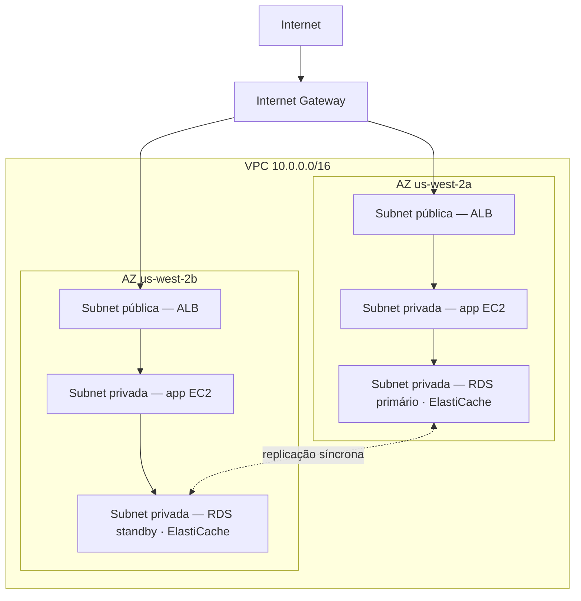

# Capítulo 11: O Seu Canto Privado na Nuvem

Priya tinha um pedaço de papel com um desenho.

Não era um desenho complicado. Um retângulo, com a etiqueta "AWS". Dentro do retângulo, um conjunto de caixas: instâncias EC2, uma base de dados RDS, um cluster ElastiCache. Linhas a ligar tudo a tudo. E fora do retângulo, uma única etiqueta: "Internet".

Ela colocou-o no centro da mesa.

---

*A camada de cache estava a funcionar. O Redis tinha cortado os carregamentos de página de 188 milissegundos para 12. Mas enquanto Leo andava a celebrar essa vitória, Priya andava a ler logs de rede — e não gostava do que via. Cada serviço estava na mesma rede plana. A base de dados tinha um endereço IP público. O cluster Redis era tecnicamente alcançável de fora. A aplicação funcionava, mas a arquitetura era um parque de estacionamento: sem cercas, sem portões, sem zonas.*

---

"É isto que temos", disse ela. "A nossa base de dados tem um endereço IP público. A nossa camada de cache pode ser alcançada a partir da internet. As nossas instâncias EC2 estão todas na mesma rede plana."

"Isso parece bem", disse Leo. "Temos grupos de segurança."

"Grupos de segurança que você configurou", disse Priya. "À noite. Durante a configuração inicial."

Leo não disse nada.

"Não estou a criticar a configuração", disse ela. "Estou a dizer que quando tudo vive numa rede pública plana, uma única configuração incorreta é a diferença entre um sistema que funciona e um que é acessível a toda a gente na internet."

Ela pegou num marcador vermelho e desenhou um círculo em volta da base de dados.

"Isto não devia ser alcançável a partir da internet. De forma alguma. Não através de uma regra de grupo de segurança, não através de uma configuração reforçada. Devia ser estruturalmente inalcançável."

"Precisamos de falar sobre arquitetura de rede", disse Maya.

"Precisávamos de ter falado sobre isso há três meses", disse Priya. "Mas agora também serve."

A equipa juntou-se em torno de um quadro branco pela primeira vez em semanas.

**O Problema com o Parque de Estacionamento Aberto**

Imagine um enorme parque de estacionamento público. Dez mil carros. Qualquer carro pode estacionar em qualquer lugar. Não há barreiras entre zonas, sem portões, sem secções reservadas.

Esta é uma rede aberta. Cada serviço pode alcançar qualquer outro serviço. O seu servidor web pode falar com a sua base de dados. A sua base de dados pode alcançar a internet. A sua camada de cache pode receber conexões de qualquer lugar.

Quando tudo pode falar com tudo, um comprometimento afeta tudo.

"Então se alguém invadir o parque de estacionamento", disse Tom, "pode entrar em qualquer carro."

"E de qualquer carro, conduzir para qualquer lugar", confirmou Priya. "Queremos cercas. Queremos portões fechados. Queremos zonas."

O VPC é como você constrói essas zonas na AWS.

**O Que É um VPC?**

"Espera — mas *por que* faríamos dessa forma?", perguntou Maya. "Se já temos grupos de segurança em cada recurso, por que precisamos de um VPC? Os grupos de segurança não estão a fazer o mesmo trabalho?"

Os grupos de segurança e os VPCs protegem a níveis diferentes. Um grupo de segurança é uma regra anexada a um recurso específico — diz "esta instância EC2 só aceita tráfego na porta 8080 a partir do balanceador de carga". Mas continua na rede pública. O endereço IP continua alcançável; a regra apenas bloqueia a conexão à porta. Um VPC remove a porta da rua pública por completo. Um recurso numa subnet privada não tem *rota* para a internet — e por convenção nenhum IP público — pelo que não pode ser alcançado a partir da internet, independentemente do que o grupo de segurança diga. Isso é uma garantia estrutural, não de configuração.

Uma **Virtual Private Cloud (VPC)** é uma secção logicamente isolada da nuvem AWS — uma rede privada que você define, à qual apenas os seus recursos podem aceder por padrão.

Pense nela como um terreno privado vedado dentro do enorme parque de estacionamento público. O seu terreno tem as suas próprias regras: quem pode entrar, quem pode sair, que rotas existem entre secções.

Quando você cria um VPC, define:

**Um bloco CIDR**: O intervalo de endereços IP disponíveis dentro da sua rede. Por exemplo, `10.0.0.0/16` dá-lhe 65.536 endereços IP possíveis (10.0.0.0 a 10.0.255.255).

**Subnets**: Subdivisões do seu VPC, cada uma com uma porção do seu intervalo de endereços IP e associada a uma Zona de Disponibilidade específica.

**Tabelas de rotas**: Regras que determinam para onde vai o tráfego de rede.

**Internet Gateway**: A conexão entre o seu VPC e a internet pública.

**Subnets: Pública vs Privada**

Nem todos os recursos devem ser publicamente acessíveis.

O seu servidor web precisa de aceitar tráfego da internet — os browsers dos utilizadores precisam de o alcançar.

A sua base de dados *nunca* deve aceitar tráfego da internet — apenas o seu servidor web deve poder falar com ela.

É aqui que entram as subnets.

Uma **subnet pública** está ligada a um Internet Gateway e pode ter recursos com endereços IP públicos. O tráfego pode fluir de e para a internet.

Uma **subnet privada** não tem rota para a internet na sua tabela de rotas. Os recursos numa subnet privada só podem comunicar com outros recursos no seu VPC (a não ser que você configure rotas de saída específicas). Por convenção, também não têm endereços IP públicos.

Para a Nimbus, o design ficou claro:



O balanceador de carga é voltado para o público — precisa de receber tráfego da internet. As instâncias EC2 são privadas — apenas recebem tráfego do balanceador de carga. As bases de dados são privadas — apenas recebem tráfego das instâncias EC2.

"Então para alcançar a base de dados", disse Tom, "alguém teria de passar pelo balanceador de carga, depois pela instância EC2, depois pelo grupo de segurança da base de dados?"

"Três camadas", confirmou Priya. "Defesa em profundidade."

---

**O Plano de CIDR da Nimbus**

"Espera — mas *por que* faríamos dessa forma?", perguntou Maya, olhando para as escolhas de bloco CIDR. "Por que é que Priya é tão específica sobre os intervalos de endereços IP? Não podemos simplesmente usar o que a AWS coloca por padrão?"

"Porque os blocos CIDR são muito difíceis de alterar mais tarde", disse Priya. "E porque se algum dia conectarmos este VPC a outro VPC, ou a uma rede on-premises, intervalos de IP sobrepostos causam falhas de encaminhamento que são dolorosas de depurar."

Ela desenhou o plano no quadro branco.

VPC da Nimbus: `10.0.0.0/16` — 65.536 endereços no total.

| Subnet | CIDR | AZ | Finalidade |
|---|---|---|---|
| Pública A | 10.0.0.0/24 | us-west-2a | Balanceadores de carga |
| Pública B | 10.0.1.0/24 | us-west-2b | Balanceadores de carga |
| App Privada A | 10.0.10.0/24 | us-west-2a | Servidores de app EC2 |
| App Privada B | 10.0.11.0/24 | us-west-2b | Servidores de app EC2 |
| Dados Privados A | 10.0.20.0/24 | us-west-2a | RDS, ElastiCache |
| Dados Privados B | 10.0.21.0/24 | us-west-2b | RDS, ElastiCache |

"Por que não fazer tudo /16?", perguntou Leo.

"Porque subnets em AZs diferentes não devem partilhar um espaço de endereços. Cada subnet está numa AZ. Se algum dia fizermos peering deste VPC com outro, quanto mais granulares formos, menos provável é termos conflitos. E cada /24 dá-nos 251 endereços utilizáveis — mais do que suficiente para qualquer camada única."

"A AWS reserva cinco endereços em cada subnet", observou Tom, olhando para a documentação. "É por isso que são 251, não 256."

"Correto. Os primeiros quatro e o último. Endereço de rede, router do VPC, servidor DNS, uso futuro, broadcast."

"Então /24 é o mais pequeno que você iria?"

"Na prática. Você usaria /28 para subnets muito pequenas — como uma subnet de gateway VPN, que só precisa de um punhado de IPs. Mas para camadas de aplicação, /24 é um mínimo razoável."

Tom anotou os números e calculou a diferença de custo mensal entre tamanhos. Ele sempre o fazia.

---

**Erros de Planeamento de CIDR a Evitar**

"Já pensámos no que acontece se ultrapassarmos uma subnet?", perguntou Priya. Ela não estava a perguntar porque não sabia. Estava a perguntar porque o resto da equipa precisava de internalizar a resposta.

Leo pensou nisso. "Podemos adicionar mais subnets?"

"Você pode adicionar subnets a um VPC. Mas não pode redimensionar uma subnet existente. Se a sua subnet de app privada encher — 251 endereços não chegam — você precisaria de criar uma nova subnet e migrar instâncias para ela."

"Com que frequência é que isso acontece de facto?"

"Raramente, se você planear bem. Mas as pessoas cometem três erros comuns."

Ela listou-os:

**Erro um**: Usar um CIDR de VPC demasiado pequeno. Se você usar `10.0.0.0/24` para todo o VPC (254 endereços), ficará sem espaço antes de ter acabado de planear as subnets. Comece com `/16` para flexibilidade.

**Erro dois**: Usar CIDRs sobrepostos entre VPCs. Se o seu VPC de produção é `10.0.0.0/16` e o seu VPC de staging também é `10.0.0.0/16`, você nunca poderá fazer peering deles nem conectá-los através de um transit gateway. Os routers não saberão para qual VPC enviar o tráfego.

**Erro três**: Não reservar espaço de endereços para camadas futuras. O plano da Nimbus deixou `10.0.30.0/24` e `10.0.31.0/24` por atribuir — espaço para uma futura camada de ferramentas internas, uma subnet de monitorização ou uma subnet de endpoint VPN, sem ter de reestruturar todo o espaço de endereços.

"Planeie para o dobro do que você acha que precisa", disse Priya. "As subnets são gratuitas. O espaço de endereços IP de um `/16` é abundante. O custo de planear errado é uma migração de rede."

---

**O NAT Gateway: Subnets Privadas Que Ainda Podem Descarregar Coisas**

As subnets privadas não podem alcançar a internet. Mas por vezes precisam. A sua instância EC2 precisa de descarregar uma atualização de software. A sua aplicação precisa de chamar uma API externa.

É aqui que entra o **NAT Gateway** (Network Address Translation).

Um NAT Gateway fica numa subnet pública. Os recursos em subnets privadas podem enviar tráfego de saída para o NAT Gateway, que o retransmite para a internet — mas a internet não pode iniciar conexões de volta.

É como uma porta giratória unidirecional. Você pode sair. Ninguém de fora pode entrar.

"Quanto é que isso custa por mês?", perguntou Tom.

O preço do NAT Gateway tem dois componentes: uma taxa horária por cada NAT Gateway, mais uma taxa de processamento de dados por GB.

Na altura em que a Nimbus configurou isto, isso era aproximadamente $32/mês por NAT Gateway, mais $0,045 por GB de dados processados. Para volumes de tráfego pequenos, o custo fixo domina. Em escala, as taxas de dados podem ser substanciais.

Tom configurou um alerta de faturação para os custos de processamento de dados antes de terminar a configuração do NAT Gateway. Ele tinha visto como eram os custos de dados da AWS quando ninguém os vigiava.

A surpresa que apanhava as equipas desprevenidas: cada byte que flui através de um NAT Gateway é cobrado. Se as suas instâncias EC2 em subnets privadas estão a descarregar grandes pacotes de software, a transmitir logs para serviços externos ou a enviar dados significativos para APIs externas, as taxas de dados do NAT Gateway aparecem na fatura como uma surpresa. A solução para tráfego AWS-para-AWS: os VPC Endpoints encaminham tráfego para serviços AWS (S3, DynamoDB) privadamente, contornando o NAT Gateway por completo e eliminando essas taxas de dados.

"Então as instâncias EC2 na subnet privada descarregam atualizações do SO através do NAT Gateway", disse Tom. "Essas atualizações são quantos gigabytes?"

"Por instância, por mês, talvez dois a cinco GB", disse Leo.

"Vezes dez instâncias. Vezes doze meses. A $0,045 por GB—"

"Onze a vinte e sete dólares por ano", concluiu Priya. "Neste caso, aceitável."

"Mas se estivéssemos a transmitir logs — como enviar todos os nossos logs de aplicação para um serviço de observabilidade externo—"

"Encaminharíamos esses através de um VPC Endpoint ou usaríamos o CloudWatch Logs em vez de sair pelo NAT."

Tom fechou a calculadora. As contas eram suficientemente claras.

### NAT Instance: A Alternativa de Orçamento

"Espera", disse Tom, ainda a fixar a página de preços. "Estamos a pagar por gigabyte só para deixar as instâncias privadas alcançarem a internet? É a única opção?"

"É a opção gerida", disse Priya. "Há uma forma mais antiga, mas vem com compromissos."

Antes de o NAT Gateway existir, as equipas conseguiam o mesmo encaminhamento de saída com uma instância EC2 normal — uma "NAT instance". Você lançava uma instância EC2 numa subnet pública, ativava o reencaminhamento de IP no SO, desativava a verificação de origem/destino (que a AWS ativa por padrão para descartar pacotes não endereçados à instância) e apontava a tabela de rotas da subnet privada para a ENI da instância. O tráfego das instâncias privadas fluía através dela para a internet, tal como num NAT Gateway.

Ainda funciona. A AWS ainda o documenta. E a volumes de tráfego muito baixos — um único ambiente de dev onde um punhado de instâncias ocasionalmente descarrega pacotes — uma NAT instance `t3.micro` pode custar menos de cinco dólares por mês, contra a taxa horária fixa do NAT Gateway mais as taxas por GB.

| | NAT Gateway | NAT Instance |
|---|---|---|
| Gestão | Totalmente gerida pela AWS | Você gere a EC2 |
| Disponibilidade | Redundante dentro da AZ | Uma única EC2 — ponto único de falha |
| Largura de banda | Até 100 Gbps, escala automaticamente | Limitada pelo tipo de instância EC2 |
| Custo | $0,045/GB + taxa horária | Apenas o custo da instância EC2 |

A vantagem de custo desaparece rapidamente. A volumes de tráfego significativos, a taxa por GB do NAT Gateway é competitiva com o tipo de instância EC2 que você precisaria para lidar com essa largura de banda — e o NAT Gateway requer zero patching, zero monitorização e zero resposta a incidentes quando falha (não falha).

"Então quando é que usaríamos de facto uma NAT instance?", perguntou Leo.

"Um ambiente de dev descartável", disse Priya. "Algures onde você está a rodar uma ou duas instâncias, a fazer atualizações de pacotes ocasionais, e quer minimizar o custo fixo. Cargas de trabalho de produção — qualquer coisa que precise de estar disponível — NAT Gateway, um por AZ."

O exame testa este compromisso pelo nome. O padrão: "minimizar o custo de NAT num ambiente de dev ou test com pouco tráfego" aponta para a NAT Instance. "Carga de trabalho de produção que requer alta disponibilidade" aponta para o NAT Gateway implantado por AZ.

Você pode estar a perguntar-se: se os grupos de segurança já existem e bloqueiam tráfego por padrão, por que é que um VPC com subnets privadas acrescenta proteção significativa? Porque "bloqueado por um grupo de segurança" e "estruturalmente inalcançável" são coisas diferentes. Uma configuração incorreta de grupo de segurança — uma regra errada, uma porta aberta — pode expor um recurso que tem um IP público. Um recurso numa subnet privada não tem IP público para alcançar em primeiro lugar. Você teria de comprometer o balanceador de carga e uma instância EC2 em execução antes de poder sequer tentar alcançar a base de dados. As subnets privadas impõem isolamento ao nível da rede, não ao nível da regra.

**Tabelas de Rotas: Como o Tráfego Encontra o Seu Caminho**

Cada subnet tem uma **tabela de rotas** que diz ao tráfego para onde ir.

Uma tabela de rotas de subnet pública típica parece-se com isto:

| Destino     | Alvo                        |
|-------------|-----------------------------|
| 10.0.0.0/16 | local                       |
| 0.0.0.0/0   | igw-xxxx (Internet Gateway) |

A primeira regra: o tráfego para qualquer IP no intervalo do seu VPC fica local. A segunda regra: todo o outro tráfego (`0.0.0.0/0` significa "tudo") vai para o Internet Gateway.

Uma tabela de rotas de subnet privada:

| Destino     | Alvo                   |
|-------------|------------------------|
| 10.0.0.0/16 | local                  |
| 0.0.0.0/0   | nat-xxxx (NAT Gateway) |

O tráfego de subnet privada fica local ou sai através do NAT Gateway. Sem rota direta para o Internet Gateway.

**Grupos de Segurança vs NACLs (Pré-visualização)**

Dentro do VPC, você tem duas ferramentas para controlar tráfego ao nível do recurso:

Os **Grupos de Segurança** (o Capítulo 15 cobre isto em profundidade) atuam como firewalls virtuais para recursos individuais — uma instância EC2, uma instância RDS, um balanceador de carga. São *com estado*: se o tráfego é permitido à entrada, o tráfego de resposta é automaticamente permitido à saída.

As **Network ACLs (NACLs)** operam ao nível da subnet e são *sem estado*: você tem de permitir explicitamente tanto o tráfego de entrada como o de saída separadamente.

Para a maioria dos casos de uso, os Grupos de Segurança são suficientes. As NACLs acrescentam uma camada extra quando você precisa de controlos ao nível da subnet — por exemplo, bloquear um intervalo de IP específico de alguma vez alcançar uma subnet.

"Grupos de segurança ao nível da instância", escreveu Leo no quadro branco. "NACLs ao nível da subnet."

"E nunca deixe a porta 22 aberta para 0.0.0.0/0", acrescentou Priya, olhando para Leo.

"Foi uma vez", disse Leo.

"É sempre exatamente uma vez", disse Priya, "até não ser."

"E se alguém tentar invadir?", disse Priya, ainda no quadro branco. "Não através de um grupo de segurança mal configurado — e se comprometerem o próprio balanceador de carga? O que os impede de saltar para a subnet privada?"

"As instâncias EC2 da subnet privada só aceitam tráfego do grupo de segurança do balanceador de carga", disse Leo. "Mesmo que o balanceador de carga seja comprometido, o atacante só pode fazer pedidos que se parecem com chamadas de API normais."

"E a base de dados só aceita tráfego do grupo de segurança da EC2", disse Priya. "Defesa em profundidade. Cada camada assume que a anterior pode falhar."

---

**VPC Flow Logs: Ver o Que Está a Acontecer**

"Precisamos de olhos na rede", disse Priya, três dias depois do início do redesenho do VPC.

"Temos grupos de segurança e NACLs", disse Leo. "O tráfego está controlado."

"Controlado não significa visível. Se algo estranho acontece — uma tentativa de conexão inesperada, tráfego para uma porta estranha — como é que sabemos?"

Os VPC Flow Logs capturam metadados sobre o tráfego de rede que flui através do seu VPC. Não os conteúdos dos pacotes — apenas a informação ao nível da conexão: IP de origem, IP de destino, porta, protocolo, contagem de pacotes, contagem de bytes, hora de início, hora de fim, e se o tráfego foi aceite ou rejeitado.

Uma entrada típica de flow log parece-se com isto:

```
2 123456789012 eni-0abc123 10.0.10.5 10.0.20.8 49321 5432 6 20 4320 1620000000 1620000060 ACCEPT OK
```

Isto diz-lhe: de `10.0.10.5` (uma instância EC2 na subnet de app) para `10.0.20.8` (a instância RDS), porta 5432 (PostgreSQL), 20 pacotes, 4.320 bytes, aceite. Tráfego normal.

Mas alguns dias depois de ativar os Flow Logs, Priya encontrou isto:

```
2 123456789012 eni-0abc123 185.220.101.55 10.0.10.5 0 8080 6 1 40 1620003200 1620003201 REJECT OK
```

Um IP externo — `185.220.101.55` — tinha tentado uma conexão à instância EC2 na porta 8080. A conexão foi rejeitada pelo grupo de segurança. Mas a tentativa foi registada.

Ela procurou o IP. Pertencia a um bloco de endereços romeno conhecido por scanning automatizado — o tipo de sondagem de ruído de fundo que cada IP público na internet recebe constantemente.

"Alguém nos está a sondar", disse ela.

"Mas a ser rejeitado", disse Leo.

"Desta vez. Ativa o GuardDuty" — um serviço de deteção de ameaças que vamos conhecer devidamente no Capítulo 17 — "antes de avançarmos. Precisamos de deteção comportamental, não apenas de bloqueio de perímetro."

Os Flow Logs são guardados no CloudWatch Logs ou no S3. Podem ser consultados usando o CloudWatch Insights ou o Athena. Priya configurou uma consulta do CloudWatch Insights que corria todas as noites e sinalizava quaisquer tentativas de conexão rejeitadas de intervalos de IP não-AWS.

"Quanto é que isso custa por mês?", perguntou Tom.

"Os flow logs são cobrados por GB de dados ingeridos no CloudWatch ou no S3. Com o nosso volume de tráfego, provavelmente oito a quinze dólares por mês."

Tom fez uma pausa. "E a alternativa é não saber que alguém está a sondar a nossa rede."

"Sim."

"Está bem", disse ele, e abriu a consola.

**Ler um Port Scan nos Flow Logs**

Duas semanas depois de ativar os flow logs, Priya rodou a sua consulta noturna do CloudWatch Insights e encontrou algo novo. Não uma conexão rejeitada — dezenas, em sequência rápida, do mesmo IP de origem, por portas consecutivas.

```
185.220.101.55 → 10.0.10.5 porta 22   REJECT
185.220.101.55 → 10.0.10.5 porta 23   REJECT
185.220.101.55 → 10.0.10.5 porta 25   REJECT
185.220.101.55 → 10.0.10.5 porta 80   REJECT
185.220.101.55 → 10.0.10.5 porta 443  REJECT
185.220.101.55 → 10.0.10.5 porta 3306 REJECT
185.220.101.55 → 10.0.10.5 porta 5432 REJECT
185.220.101.55 → 10.0.10.5 porta 6379 REJECT
```

Tudo dentro de uma janela de cinco segundos. Tudo rejeitado.

"Isso é um port scan", disse Priya. "Alguém está a sondar quais serviços esta instância está a correr."

"Mas tudo rejeitado", disse Leo. "Então o grupo de segurança está a fazer o seu trabalho."

"O grupo de segurança está a fazer o seu trabalho. O scan continua a ser informativo para o atacante — diz-lhe quais portas *não* rejeitaram dentro de um timeout, o que significa que essas portas estão abertas algures. E diz-lhe que este host está vivo e vale a pena investigar."

"O que fazemos?"

"Duas coisas", disse Priya. "Primeiro: adicionar uma regra de NACL para bloquear o intervalo /24 a que esse IP pertence. Não apenas esse IP — a subnet inteira. Os port scanners rodam IPs dentro de um intervalo. Segundo: adicionar um alarme do CloudWatch que dispara quando qualquer IP de origem único gera mais de dez conexões rejeitadas em sessenta segundos. Esse padrão é quase sempre um scan."

Ela configurou ambos. O alarme disparou duas vezes na semana seguinte — uma vez do mesmo intervalo romeno, uma vez de um scanner automatizado baseado em Singapura. Ambos foram bloqueados na NACL minutos após a deteção.

Os flow logs não param ataques. Tornam os ataques visíveis. E ataques visíveis podem ter resposta. A alternativa — tráfego a fluir invisivelmente — significa que o primeiro sinal de um problema é o dano, não a tentativa.

---

**A Armadilha do NAT Gateway Único**

Três meses depois do redesenho do VPC, Priya rodou uma simulação de falha. Ela queria saber o que aconteceria à Nimbus se a zona de disponibilidade `us-west-2a` sofresse uma disrupção.

A maior parte estava bem. O balanceador de carga fez failover para instâncias em `us-west-2b`. O standby do RDS em `us-west-2b` já estava ativo. O ElastiCache promoveu a réplica. A aplicação continuou a servir pedidos.

Depois Leo reparou que as suas instâncias EC2 em `us-west-2b` tinham parado de receber notificações de atualização do SO. Ele verificou a configuração do NAT Gateway.

Havia um. Em `us-west-2a`.

"Todo o tráfego de saída para a internet das subnets privadas em ambas as AZs é encaminhado através de um único NAT Gateway numa única AZ", disse Priya.

"Então se `us-west-2a` ficar inoperacional—"

"Cada instância EC2 em `us-west-2b` perde o acesso de saída à internet. Não podem descarregar atualizações. Não podem alcançar APIs externas. As pesquisas no Secrets Manager que não estão em cache falham. Tudo o que requeira internet de saída quebra."

A correção: um NAT Gateway por AZ. As subnets privadas de cada AZ encaminham o tráfego de saída para o NAT Gateway na mesma AZ. Quando uma AZ falha, apenas o tráfego dessa AZ é afetado.

"E qual é o preço dessa correção?", perguntou Tom.

"Mais trinta e dois dólares por mês pelo NAT Gateway da segunda AZ."

Tom ficou em silêncio por um momento.

"A capacidade EC2 em `us-west-2b` a falhar em alcançar APIs externas durante uma interrupção", disse Priya, "custa mais do que trinta e dois dólares."

Tom aprovou a mudança.

Este é um dos erros de design de VPC mais comuns: um NAT Gateway que parece altamente disponível mas é na verdade um ponto único de falha. Se você tem recursos em três AZs e um NAT Gateway, você tem resiliência de computação em três AZs mas resiliência de rede de uma AZ. As duas não combinam.

A regra: um NAT Gateway por AZ, na subnet pública dessa AZ. A tabela de rotas privada de cada AZ aponta para o seu próprio NAT Gateway. O custo é modesto. A melhoria de disponibilidade é real.


---

**VPC Peering: Conectar Redes Privadas**

E se a Nimbus crescer para múltiplos VPCs? (Isto acontece. As equipas ficam grandes. Os serviços ficam isolados em contas separadas.)

O **VPC Peering** deixa dois VPCs comunicar privadamente como se estivessem na mesma rede. O tráfego não sai da rede privada da AWS.

Limites importantes:

- O VPC peering não é transitivo. Se o VPC A faz peering com o VPC B, e o VPC B faz peering com o VPC C, A e C não podem comunicar — a não ser que você adicione um peer A-C direto.
- Os blocos CIDR não podem sobrepor-se entre VPCs com peering.

Para arquiteturas maiores com muitos VPCs, o **AWS Transit Gateway** (Capítulo 25) trata do encaminhamento transitivo sem exigir uma malha completa de conexões de peering.

---

**AWS PrivateLink: Acesso Privado a Serviços AWS**

"E quanto a alcançar o S3 a partir da subnet privada?", perguntou Leo. "As nossas instâncias EC2 escrevem recibos no S3. Neste momento esse tráfego sai pelo NAT Gateway."

"VPC Endpoints", disse Priya. "Especificamente, Gateway Endpoints para S3 e DynamoDB — são gratuitos."

Um **VPC Endpoint** cria uma conexão privada entre o seu VPC e um serviço AWS, contornando a internet pública por completo. O tráfego entre a sua subnet privada e o serviço AWS fica na rede AWS. Sem taxa de NAT Gateway. Sem exposição à internet.

Para o S3 e o DynamoDB, os **Gateway Endpoints** são gratuitos e fáceis: adicione uma entrada à tabela de rotas a apontar o tráfego de S3/DynamoDB para o endpoint em vez de para o NAT Gateway.

Para outros serviços AWS (Secrets Manager, KMS, SNS, SQS), os **Interface Endpoints** criam uma interface de rede elástica (ENI) na sua subnet com um endereço IP privado. O tráfego para o serviço vai para esse IP privado. Os interface endpoints custam dinheiro — aproximadamente $0,01/hora **por AZ em que o endpoint é provisionado** (um endpoint com ENIs em três AZs custa três vezes a taxa horária), mais cerca de $0,01/GB de dados processados — mas eliminam a necessidade de encaminhar chamadas de API sensíveis (como pesquisas no Secrets Manager) através de um NAT Gateway ou pela internet pública.

"Então as nossas instâncias EC2 podem alcançar o S3, o DynamoDB, o Secrets Manager e o KMS", disse Priya, "tudo a partir da subnet privada, sem qualquer exposição à internet, e para o S3 e o DynamoDB, sem quaisquer taxas de dados de NAT Gateway."

Tom recalculou. As poupanças de tráfego do S3 compensariam o custo do Interface Endpoint para o Secrets Manager dentro de alguns meses.

"PrivateLink é o nome geral", acrescentou Priya. "O AWS PrivateLink é a tecnologia subjacente dos Interface Endpoints. O exame usa ambos os termos."

---

**Uma Checklist de Depuração**

Três meses depois do redesenho do VPC, Leo partiu a rede. Não dramaticamente — ele tinha modificado uma associação de tabela de rotas e desconectado acidentalmente a subnet de app privada da sua rota de NAT Gateway.

As instâncias EC2 não conseguiam alcançar APIs externas. Conseguiam alcançar-se umas às outras, e conseguiam alcançar as bases de dados. Só não a internet. As chamadas HTTPS de saída começaram a falhar.

Ele passou quarenta minutos a resolver problemas antes de Priya lhe entregar uma checklist.

"Quando algo não alcança outra coisa num VPC, verifique estes por ordem", disse ela.

1. **Grupo de segurança na origem**: A regra de saída está correta? Permite o tráfego que você está a tentar enviar?
2. **Grupo de segurança no destino**: A regra de entrada está correta? Permite tráfego da origem?
3. **NACL na subnet de origem**: Há uma regra de negação de entrada a bloquear o tráfego de resposta? Há uma regra de permissão de saída?
4. **NACL na subnet de destino**: Há uma regra de permissão de entrada? Há uma regra de permissão de saída para respostas?
5. **Tabela de rotas na subnet de origem**: Tem uma rota para o destino? A rota aponta para o alvo correto (NAT Gateway, IGW, VPC Endpoint)?
6. **Tabela de rotas na subnet de destino**: Tem uma rota de volta para a origem?
7. **Política de VPC Endpoint**: Se usar um VPC Endpoint, a política do endpoint permite a ação?
8. **Permissões de IAM**: O role da EC2 tem permissão para chamar o serviço? (Para chamadas de API da AWS)

Leo encontrou-o no passo 5. A tabela de rotas tinha sido reassociada à subnet privada errada. A rota de NAT Gateway estava em falta.

"Se eu tivesse tido esta lista há três meses", disse ele, "tê-lo-ia encontrado em cinco minutos."

"Você vai tê-la a partir de agora", disse Priya.

## Direct Connect: A Linha Dedicada

Três meses depois do redesenho do VPC, a Nimbus fechou um acordo com o Harborview Dining Group — uma cadeia empresarial de cem localizações que processava dois milhões de dólares em transações por dia.

A chamada de revisão técnica começou bem. Depois a responsável de conformidade deles abriu o microfone.

"Não podemos encaminhar dados de transações de produção pela internet pública", disse ela. "Os nossos auditores exigem um caminho de rede dedicado, privado e auditável entre o nosso data center e qualquer ambiente de nuvem. A Site-to-Site VPN não é aceitável. Partilha largura de banda com toda a gente. Viaja pelos mesmos fios que o tráfego de consumidor."

Tom olhou para Leo. Leo olhou para Priya.

"Para ser precisa", disse Priya cuidadosamente, "o próprio PCI DSS não proíbe uma VPN encriptada pela internet — o transporte encriptado satisfaz o padrão. O que você está a descrever é a política interna dos seus auditores, que é mais estrita. Isso é legítimo. E há um serviço para isso."

O **AWS Direct Connect** é uma conexão de rede física dedicada entre o seu data center on-premises e a AWS. A conexão contorna a internet pública por completo — o seu tráfego nunca toca em infraestrutura partilhada, nunca compete por largura de banda com mais ninguém, e nunca viaja por um fio que não é seu.

Configurar o Direct Connect significa trabalhar com a AWS e um fornecedor de colocation ou de rede para instalar um cross-connect físico numa localização Direct Connect — um data center onde a AWS tem equipamento dedicado. Uma vez que o link físico esteja no lugar, você estabelece interfaces virtuais sobre ele que se conectam ao seu VPC ou a serviços AWS diretamente.

**As características-chave:**

A largura de banda vem em duas formas. As *conexões dedicadas* vão direto ao hardware da AWS: 1 Gbps, 10 Gbps, ou 100 Gbps. As *conexões hospedadas* vão através de um AWS Partner e oferecem opções mais granulares de 50 Mbps até 10 Gbps — útil quando você não precisa de uma porta dedicada completa.

A latência é consistente. Porque você não está a competir por largura de banda da internet, o tempo de ida-e-volta para a AWS é previsível. Para a Harborview, cujos sistemas de ponto de venda faziam centenas de chamadas de API por transação, a latência consistente abaixo de 5ms era a diferença entre um checkout de 200ms e um de 400ms.

A privacidade é estrutural, não de configuração. Uma Site-to-Site VPN é encriptada, mas continua a atravessar a internet pública — a mesma infraestrutura física usada por todos os outros. O tráfego do Direct Connect nunca toca na internet pública. Para a equipa de conformidade da Harborview, esse era o requisito, e nenhuma quantidade de configuração de VPN o satisfaria.

O custo é mais alto do que a VPN. Você paga uma taxa de porta-hora pela conexão Direct Connect mais o preço de transferência de dados. A conexão não é barata, e leva semanas a meses a provisionar — uma instalação de cross-connect físico não é algo que você levante numa sexta-feira à tarde.

"Espera lá", disse Maya. "Se a VPN é encriptada, por que é que importa que vá pela internet pública?"

Porque o requisito de conformidade não é apenas sobre encriptação — é sobre isolamento. A VPN encripta os conteúdos do tráfego, mas o tráfego continua a atravessar infraestrutura física partilhada. Qualquer pessoa que controle um router no caminho pode ver os pacotes encriptados, gravá-los e tentar desencriptá-los mais tarde. Um link físico dedicado não tem routers partilhados. O caminho é fisicamente seu. Para indústrias com requisitos rigorosos de soberania de dados — finanças, saúde, governo — essa distinção é a diferença entre estar em conformidade e não estar.

"Mais uma coisa", disse Priya. "O Direct Connect é privado por padrão, mas não encriptado por padrão. Se você quer ambos — privado e encriptado — corre uma VPN IPSec sobre a conexão Direct Connect. Isso dá-lhe largura de banda dedicada mais encriptação. Ambos."

Tom já tinha encontrado a página de preços. Olhou para o compromisso mensal de uma conexão Dedicada de 1 Gbps.

"O volume diário de $2M da Harborview significa que isto se paga em erros de arredondamento", disse ele.

Ele enviou a proposta.

---

> **Dica de Exame — Direct Connect vs. VPN**
>
> *Domínio SAA-C03: Projetar Arquiteturas Seguras (Domínio 1)*
>
> - **VPN:** encriptada, rápida de provisionar (minutos), viaja pela internet pública, largura de banda e latência variáveis.
> - **Direct Connect:** link físico dedicado, largura de banda e latência consistentes, privado (o tráfego nunca toca na internet pública), mas não encriptado por padrão. Leva semanas a meses a provisionar.
> - **Encriptado E privado:** corra uma VPN IPSec por cima do Direct Connect. Você obtém largura de banda dedicada e encriptação.
> - **Gatilho de exame:** "largura de banda consistente, privada e dedicada para a AWS" ou "a conformidade exige que o tráfego não viaje pela internet pública" → Direct Connect. "Encriptado E privado" → Direct Connect + VPN IPSec. "Rápido de configurar, custo mais baixo, aceitável usar a internet pública" → Site-to-Site VPN.
> - **O custo e o tempo de configuração** são os compromissos que o exame testa: VPN = rápida + barata; Direct Connect = lento a provisionar + caro + consistente.

---

### Client VPN: Acesso Remoto para Utilizadores Individuais

O Direct Connect e a Site-to-Site VPN conectam redes — um escritório ou data center inteiro à AWS. Mas os engenheiros também precisam de conectar portáteis individuais a um VPC: para depurar uma instância EC2 privada, consultar uma base de dados RDS privada ou aceder a ferramentas internas a partir de casa.

"Já não temos isto?", perguntou Maya. "Temos um host bastião. O Leo não pode simplesmente fazer SSH através dele?"

"Para SSH, sim", disse Priya. "Mas e se o Leo precisar de se conectar à instância RDS a partir de uma GUI de base de dados no seu portátil? Ou consultar o painel de métricas interno por HTTP? O bastião só trata de SSH. O Client VPN funciona para qualquer protocolo."

O **AWS Client VPN** é um endpoint de VPN gerido que deixa utilizadores individuais conectarem-se ao seu VPC a partir de qualquer dispositivo, de qualquer lugar. Os utilizadores instalam um cliente OpenVPN padrão no seu portátil; o endpoint de VPN está na AWS.

Características-chave:

- Gerido pela AWS — você não corre um servidor de VPN
- Baseado em OpenVPN — funciona com qualquer cliente OpenVPN padrão
- Autenticação via Active Directory (baseada em utilizador), TLS mútuo baseado em certificado, ou autenticação federada SAML 2.0 (SSO através de um fornecedor de identidade)
- Cada cliente conectado recebe um IP privado no seu VPC e pode aceder a recursos privados (RDS, ElastiCache, serviços internos) como se estivesse dentro do VPC
- Suporta **split-tunnel** (apenas o tráfego do VPC vai pela VPN — o tráfego da internet vai diretamente) ou **full-tunnel** (todo o tráfego pela VPN)

"Split-tunnel", disse Tom imediatamente.

"Por quê?", perguntou Leo.

"Porque full-tunnel significa que o meu stream da Netflix vai pelo nosso endpoint de VPN e eu pago taxas de transferência de dados sobre ele."

Isso estava correto. O split-tunnel é a recomendação padrão para acesso de programadores: o tráfego destinado ao VPC encaminha através da VPN, o tráfego da internet sai diretamente. A VPN trata apenas do que precisa de ser privado.

**vs. Site-to-Site VPN:** A Site-to-Site conecta duas redes (escritório ↔ VPC). O Client VPN conecta dispositivos individuais (portátil ↔ VPC).

**vs. host bastião:** um host bastião requer SSH; o Client VPN funciona para qualquer protocolo — conexões de base de dados, serviços internos HTTP, qualquer coisa que corra sobre TCP ou UDP.

> **Dica de Exame — Client VPN vs Site-to-Site VPN**
>
> - **Site-to-Site VPN:** rede-para-rede (escritório para VPC, data center para VPC).
> - **Client VPN:** dispositivo individual para VPC (engenheiros a trabalhar remotamente, a aceder a recursos privados a partir de casa).
> - Gatilho de exame: "os utilizadores precisam de aceder a recursos privados do VPC a partir de casa" ou "programadores remotos precisam de acesso à base de dados" → Client VPN. "Conectar um escritório de filial inteiro à AWS" → Site-to-Site VPN.

---

## Pontos Fortes e Limitações

**Por que o design de VPC importa**:

- O isolamento de rede é defesa em profundidade — violar uma camada não significa comprometer tudo
- As subnets privadas reduzem significativamente a superfície de ataque
- As tabelas de rotas e os grupos de segurança dão controlo preciso sobre os fluxos de tráfego
- Os VPCs integram-se com cada serviço de rede AWS (Direct Connect, VPN, Transit Gateway)
- Os Flow Logs tornam o tráfego de rede visível e auditável

**Onde fica complicado**:

- O design de VPC requer planeamento antecipado — os blocos CIDR são difíceis de alterar mais tarde
- Demasiados VPCs pequenos criam complexidade de peering (problema n-ao-quadrado)
- Depurar problemas de rede em VPCs requer perceber tabelas de rotas, grupos de segurança, NACLs e associações de subnets simultaneamente
- Os custos do NAT Gateway podem surpreender em escala (taxas de processamento por GB)
- Os VPC Endpoints reduzem os custos de NAT mas acrescentam as suas próprias taxas horárias para endpoints que não sejam de gateway

## Resumo

O redesenho da rede levou três dias. Cada recurso acabou no lugar certo — e o lugar certo significava que só podia ser alcançado pelos exatos serviços que precisavam dele, e mais nada. Um bom design de rede não torna apenas as violações mais difíceis; limita o que um atacante pode fazer depois de uma violação.

- Um **VPC** é uma rede privada logicamente isolada na AWS — o seu terreno vedado dentro da nuvem pública.
- As **subnets** dividem o seu VPC por Zona de Disponibilidade. As subnets públicas ligam-se ao Internet Gateway; as subnets privadas não.
- Coloque recursos voltados para a internet (balanceadores de carga) em subnets públicas. Coloque todo o resto (EC2, bases de dados, caches) em subnets privadas.
- As **tabelas de rotas** controlam onde flui o tráfego. Cada subnet tem uma.
- O **NAT Gateway** (numa subnet pública) deixa recursos privados iniciar conexões de saída à internet sem aceitar conexões de entrada.
- Os **VPC Flow Logs** registam metadados sobre todo o tráfego de rede — essencial para visibilidade de segurança e depuração.
- Os **VPC Endpoints** conectam subnets privadas a serviços AWS sem passar pelo NAT Gateway ou pela internet pública. Os Gateway Endpoints (S3, DynamoDB) são gratuitos.
- Planeie os seus blocos CIDR com cuidado — são muito difíceis de alterar depois de os recursos serem implantados.

## Dicas de Exame

*Domínio SAA-C03: Projetar Arquiteturas Seguras (Domínio 1, Tarefa 1.2)*

- **Subnet pública vs privada**: a diferença é a tabela de rotas. A subnet pública tem uma rota para um Internet Gateway. A subnet privada não tem.
- **Colocação do NAT Gateway**: sempre na subnet *pública*. Os recursos de subnet privada encaminham o tráfego de saída para ele.
- **Alta disponibilidade para NAT**: crie um NAT Gateway por AZ. Se você tiver um NAT Gateway na AZ-a e as instâncias da AZ-b encaminharem através dele, a falha da AZ-a desativa também o acesso à internet da AZ-b.
- **O VPC Peering não é transitivo**: o exame descreverá três VPCs e perguntará se podem comunicar através do do meio — a resposta é não sem peering direto ou Transit Gateway.
- **Sobreposição de CIDR**: VPCs com peering não podem ter blocos CIDR sobrepostos. Armadilha clássica de exame.
- **Host bastião (jump box)**: para fazer SSH numa instância EC2 privada, você precisa de um host bastião na subnet pública. O bastião é a única máquina com um IP público; as instâncias privadas só aceitam SSH do grupo de segurança do bastião.
- **VPC Endpoints**: permitem que recursos privados alcancem serviços AWS (S3, DynamoDB) sem passar pelo NAT Gateway. Dois tipos: **Gateway endpoints** (S3, DynamoDB — gratuitos) e **Interface endpoints** (outros serviços — preço por hora mais dados).
- **VPC Flow Logs**: apenas metadados — não os conteúdos dos pacotes. Usados para análise de segurança, depuração de rede e conformidade. Podem ser enviados para o CloudWatch Logs ou o S3.
- **NAT Gateway vs. NAT Instance:** o NAT Gateway é gerido, HA, escala automaticamente mas custa por GB. A NAT Instance é uma EC2 auto-gerida com reencaminhamento de IP — mais barata a volumes de tráfego muito baixos, mas um ponto único de falha. Gatilho de exame: "minimizar o custo de NAT em dev/test" → NAT Instance.
- **Direct Connect vs. VPN:** VPN = encriptada, rápida de provisionar, viaja pela internet pública, largura de banda variável. Direct Connect = link físico dedicado, largura de banda/latência consistentes, privado (não encriptado por padrão), semanas a provisionar. Gatilho de exame: "largura de banda consistente, privada e dedicada" → Direct Connect. "Encriptado E privado" → Direct Connect + VPN IPSec por cima. "Rápido, custo mais baixo, internet pública aceitável" → Site-to-Site VPN.
- **Client VPN vs. Site-to-Site VPN:** Site-to-Site = rede-para-rede (escritório para VPC). Client VPN = dispositivo individual para VPC (engenheiros a trabalhar remotamente). Gatilho de exame: "os utilizadores precisam de aceder a recursos privados a partir de casa" → Client VPN. "Conectar um escritório de filial à AWS" → Site-to-Site VPN.

## Exercícios

**Exercício 1 — Recordar**

Explique por que uma base de dados deve estar numa subnet privada. Que ameaça específica isso mitiga?

*(Sugestão: O que pode alguém fazer a uma base de dados que está na internet pública que não pode fazer a uma que só é acessível de dentro do VPC?)*

**Exercício 2 — Cenário SAA-C03**

*Cenário*: Uma empresa está a projetar uma aplicação web de três camadas na AWS. A camada web (ALB + EC2) deve aceitar tráfego da internet. A camada de aplicação (EC2) deve apenas receber tráfego da camada web. A camada de base de dados (RDS) deve apenas receber tráfego da camada de aplicação. As instâncias EC2 da camada de aplicação precisam de descarregar pacotes de software da internet. A solução deve ser altamente disponível.

Qual arquitetura MELHOR satisfaz estes requisitos?

A) Todas as camadas em subnets públicas; grupos de segurança restringem o tráfego entre camadas  
B) Camada web em subnets públicas; camadas de aplicação e base de dados em subnets privadas; um NAT Gateway numa subnet pública  
C) Camada web em subnets públicas; camadas de aplicação e base de dados em subnets privadas; um NAT Gateway por AZ  
D) Todas as camadas em subnets privadas; um Internet Gateway fornece acesso bidirecional à internet a todas as camadas

**Sugestão 1**: "Altamente disponível" significa sem ponto único de falha. Qual opção introduz um NAT Gateway como ponto único de falha?

**Sugestão 2**: Se a AZ do NAT Gateway ficar inoperacional, quais instâncias perdem acesso à internet?

**Sugestão 3**: Leia o requisito cuidadosamente — a camada de aplicação precisa de acesso à internet *de saída*, não de entrada.

**Resposta**: C

**Explicação**: A camada web em subnets públicas fornece acesso voltado para a internet através do ALB. As camadas de aplicação e base de dados em subnets privadas garantem que não são diretamente alcançáveis a partir da internet. Um NAT Gateway por AZ (um em cada subnet pública) fornece acesso de saída à internet de alta disponibilidade para instâncias de subnets privadas — se uma AZ falhar, o NAT Gateway da outra AZ continua a servir tráfego.

**Por que não A?** Subnets públicas para todas as camadas expõem a aplicação e a base de dados diretamente à internet, derrotando o propósito do modelo de segurança em camadas.

**Por que não B?** Um NAT Gateway numa única AZ é um ponto único de falha. Se o NAT Gateway dessa AZ falhar, todas as instâncias privadas perdem o acesso de saída à internet.

**Por que não D?** Um Internet Gateway fornece conectividade bidirecional — subnets privadas com uma rota para o Internet Gateway são efetivamente subnets públicas.

*Domínio SAA-C03: Projetar Arquiteturas Seguras — Tarefa 1.2*

**Exercício 3 — Desafio de Arquitetura** *(Opcional)*

A Nimbus está a crescer. A equipa de engenharia quer separar o "serviço de menus" na sua própria conta com o seu próprio VPC, mantendo a aplicação principal da Nimbus numa conta e VPC separados.

Como conectaria estes dois VPCs para que a aplicação principal possa consultar o serviço de menus? Quais são as restrições que você precisaria de planear? O que usaria em vez disso se a Nimbus tivesse dez VPCs de microsserviços separados que todos precisassem de comunicar?

*(Não existe uma resposta única correta. O objetivo é praticar o design de rede multi-VPC.)*

## Cena Pós-Créditos

Priya redesenhou a rede.

Três dias depois, cada recurso estava no lugar certo. Instâncias EC2 em subnets privadas. Balanceadores de carga em subnets públicas. RDS e ElastiCache acessíveis apenas a partir da camada de aplicação. Grupos de segurança com as portas mínimas necessárias.

"Eu já fiz o deploy — oh." Leo tinha tentado fazer SSH diretamente na base de dados para verificar algo. Não conseguiu. A conexão expirou — o que estava correto, na verdade — mas ele entrou em pânico e abriu uma regra de grupo de segurança temporária antes de perceber que a arquitetura estava a funcionar como pretendido.

Priya tinha fechado a regra sem comentário.

"O timeout foi bom", disse ela.

"Só precisava de verificar uma coisa", disse Leo.

"O quê?"

"Se o índice estava configurado corretamente."

Priya abriu o portátil. "Posso verificar a partir do host bastião, através da instância de aplicação, que tem as credenciais corretas da base de dados no Secrets Manager."

"São quatro saltos."

"É o correto." Ela escreveu algo. "O índice está configurado. De nada."

Leo olhou para o ecrã por um momento.

"Vou aprender isto", disse ele.

"Já estás", disse ela. "Acabaste de te queixar dos controlos de segurança em vez de te queixares de que não existiam."

No próximo capítulo: como a internet encontra a Nimbus — a maquinaria invisível dos nomes de domínio.
