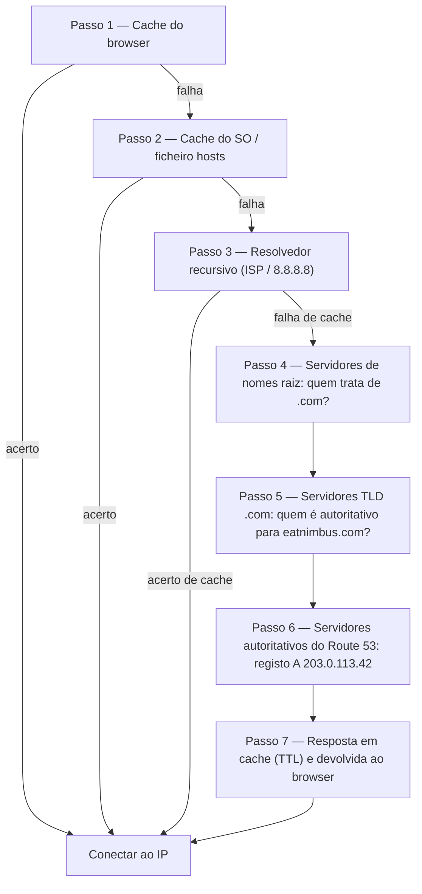

# Capítulo 12: Como a Internet o Encontra

Maya atualizou `nimbus-alb-123456789.us-west-2.elb.amazonaws.com` no seu browser mais uma vez, depois recostou-se e olhou para o teto. A página carregou. A aplicação funcionou. Mas sempre que partilhava o link com um restaurante parceiro, sentia um pequeno embaraço que não conseguia bem nomear.

Aquele URL era um artefacto técnico, não um produto.

---

*O redesenho de rede do capítulo anterior tinha corrido bem. Cada recurso estava no lugar certo — balanceadores de carga em subnets públicas, bases de dados trancadas nas privadas. A infraestrutura estava segura e corretamente segmentada. Mas à medida que a Nimbus se preparava para o seu primeiro lançamento público, um novo problema tinha aparecido: o URL do balanceador de carga que a AWS tinha atribuído automaticamente parecia um identificador de sistema, não um produto em que as pessoas confiariam. Eles precisavam de um nome de domínio real. E precisavam de perceber o que acontecia entre o momento em que alguém escrevia `eatnimbus.com` e o momento em que a página aparecia.*

---

A Nimbus estava a funcionar. O balanceador de carga tinha um IP público. As instâncias EC2 tinham um IP privado. As bases de dados estavam trancadas em subnets privadas. Priya tinha acenado com aprovação ao diagrama de rede.

Tom olhou para o URL do balanceador de carga: `nimbus-alb-123456789.us-west-2.elb.amazonaws.com`.

"É isso que os clientes escrevem no browser?", perguntou ele.

"É o que a AWS atribui automaticamente", disse Maya.

"Não vou pôr isso num cartão de visita."

"Eu também não."

Eles precisavam de um nome de domínio. Compraram `eatnimbus.com` num registador de domínios. Agora precisavam de ligar esse nome à sua infraestrutura AWS.

"Como é que a internet sabe que `eatnimbus.com` significa o balanceador de carga em us-west-2?", perguntou Leo.

Boa pergunta, Leo.

**A Analogia da Lista Telefónica**

Antes dos smartphones, cada cidade tinha uma lista telefónica. Se você quisesse contactar a "Pizzaria do Mário", não memorizava o número de telefone — procurava o nome, obtinha o número e ligava.

A internet tem a sua própria lista telefónica: o **Domain Name System (DNS)**.

O DNS traduz nomes legíveis por humanos (como `eatnimbus.com`) em endereços IP legíveis por máquinas (como `203.0.113.42`). Sempre que você visita um website, o seu computador procura silenciosamente o nome de domínio no DNS e obtém o endereço IP para se ligar.

Se você mudasse o endereço IP do seu servidor, atualizaria o registo DNS — como mudar o seu número na lista telefónica — e a internet encontrá-lo-ia na sua nova localização.

**A Jornada Completa de Resolução DNS**

"Mas *como* é que a pesquisa funciona de facto?", perguntou Leo. "Tipo, passo a passo. O meu browser conhece o nome `eatnimbus.com`. O que acontece a seguir?"

A maior parte da documentação passa por cima disto. Importa.

Quando o seu browser precisa de resolver `eatnimbus.com`, eis cada salto, por ordem:

**Passo 1 — Cache do browser**: O browser verifica se já resolveu este nome recentemente. Se sim, usa o IP em cache. Se não, continua.

**Passo 2 — Cache do SO / resolvedor local**: O seu sistema operativo verifica a sua própria cache DNS e o ficheiro `hosts` local. Se encontrado, está feito. Se não, reencaminha para o seu resolvedor DNS configurado — normalmente o do seu ISP ou um público como o 8.8.8.8.

**Passo 3 — Resolvedor recursivo**: O resolvedor recursivo (o seu ISP ou o 8.8.8.8 da Google) é o cavalo de batalha. Também tem uma cache. Se souber a resposta, devolve-a imediatamente. Se não, inicia a cadeia de resolução propriamente dita.

**Passo 4 — Servidores de nomes raiz**: O resolvedor recursivo contacta um dos 13 clusters de servidores de nomes raiz (implantados mundialmente). O servidor raiz não sabe onde está `eatnimbus.com`. Mas sabe quem gere os domínios `.com` — os servidores TLD `.com`. Devolve o endereço deles.

**Passo 5 — Servidores de nomes TLD (Top Level Domain)**: O resolvedor recursivo contacta os servidores TLD `.com`. Os servidores TLD também não sabem onde está `eatnimbus.com`. Mas sabem quais servidores de nomes são autoritativos para `eatnimbus.com` — os servidores que realmente detêm os registos DNS. Devolvem esses endereços.

**Passo 6 — Servidores de nomes autoritativos**: O resolvedor recursivo contacta os servidores de nomes do Route 53 — os servidores de nomes autoritativos para `eatnimbus.com`. O Route 53 tem os registos reais. Devolve o registo A: `eatnimbus.com → 203.0.113.42`. Esta resposta é autoritativa — é a resposta real, não uma em cache.

**Passo 7 — Resposta em cache e devolvida**: O resolvedor recursivo guarda a resposta em cache durante a duração do TTL (Tempo de Vida) no registo. Devolve o IP ao seu browser. O seu browser guarda-o em cache. O seu browser conecta-se.



"São sete saltos só para encontrar um endereço IP", disse Tom.

"Normalmente menos de 100 milissegundos no total", disse Priya. "Os passos 3 a 6 são guardados em cache agressivamente em cada nível. Para domínios populares, os passos 4 e 5 — as pesquisas raiz e TLD — são muitas vezes saltados por completo porque o resolvedor recursivo já tem esses servidores em cache. A cadeia inteira normalmente corre em 20 a 40 milissegundos."

"E depois da primeira pesquisa, a cache do browser significa que os pedidos subsequentes saltam tudo isso", acrescentou Leo.

"Certo. O DNS parece instantâneo porque a maioria das pesquisas são acertos de cache. A cadeia completa só corre quando um registo é novo ou o seu TTL expirou."

**Conheça o Route 53**

O Amazon Route 53 é o serviço DNS gerido da AWS. Chama-se Route 53 porque a porta 53 é a porta DNS padrão. (Por vezes a AWS nomeia as coisas de forma direta.)

O Route 53 faz várias coisas:

**Registo de domínios**: Você pode comprar nomes de domínio diretamente através do Route 53.

**Alojamento DNS (zonas alojadas)**: Você cria uma *zona alojada* para o seu domínio, e o Route 53 gere os registos DNS que dizem ao mundo onde o encontrar.

**Verificações de saúde**: O Route 53 pode monitorizar os seus endpoints e encaminhar o tráfego para longe dos que estão insalubres.

**Políticas de encaminhamento de tráfego**: O Route 53 suporta múltiplas estratégias de encaminhamento para além do DNS simples — ponderado, baseado em latência, geolocalização, failover.

**Registos DNS: As Entradas da Lista Telefónica**

Um registo DNS mapeia um nome para um destino. Os tipos mais comuns:

**Registo A**: Mapeia um nome para um endereço IPv4.
`eatnimbus.com → 203.0.113.42`

**Registo AAAA**: Mapeia um nome para um endereço IPv6.

**Registo CNAME**: Mapeia um nome para outro nome (um alias).
`www.eatnimbus.com → eatnimbus.com`

**Registo MX**: Especifica quais servidores tratam do e-mail para o domínio.

**Registo TXT**: Guarda texto arbitrário. Normalmente usado para verificação de domínio (provar que você é dono do domínio) e autenticação de e-mail (SPF, DKIM).

Para a Nimbus, a configuração principal:

- `eatnimbus.com` → Registo Alias a apontar para o balanceador de carga
- `www.eatnimbus.com` → CNAME a apontar para `eatnimbus.com`
- `api.eatnimbus.com` → Registo Alias a apontar para o balanceador de carga da API

"Espera", disse Tom. "O IP do balanceador de carga pode mudar. A AWS disse-o na documentação."

Boa observação, Tom.

**Registos Alias: A Solução da AWS para IPs Dinâmicos**

Os balanceadores de carga, distribuições CloudFront e websites S3 têm nomes DNS, não endereços IP estáticos. Os IPs subjacentes podem mudar.

Se você criar um CNAME a apontar para o nome DNS de um balanceador de carga, funciona — mas você não pode usar CNAMEs para domínios raiz (`eatnimbus.com` sem o `www`) por causa dos padrões DNS.

O Route 53 resolve isto com **registos Alias** — uma extensão DNS específica da AWS. Um registo Alias mapeia um nome diretamente para um recurso AWS (balanceador de carga, distribuição CloudFront, website S3), e o Route 53 trata da resolução dinâmica do IP automaticamente. Os registos Alias podem ser usados ao nível do domínio raiz. E ao contrário das consultas DNS normais a serviços externos, as consultas de registos Alias a recursos AWS são gratuitas.

"Então usamos um registo Alias para `eatnimbus.com` a apontar para o balanceador de carga", confirmou Leo.

"E o Route 53 trata de qualquer IP que o balanceador de carga esteja a usar em qualquer momento", acrescentou Priya.

"De graça", disse Tom, de repente muito interessado. Ele abriu a página de preços do Route 53. "E o resto?"

"Cinquenta cêntimos por zona alojada", disse Leo. "Mais cerca de quarenta cêntimos por milhão de consultas DNS. Para o nosso tráfego neste momento, provavelmente menos de dois dólares por mês."

Tom fechou a página de preços satisfeito.

**Políticas de Encaminhamento: Mais do Que Apenas "Onde Está?"**

É aqui que o Route 53 fica interessante. O DNS não é apenas um serviço de pesquisa — pode ser uma ferramenta de gestão de tráfego.

**Encaminhamento simples**: Um registo, um destino. DNS padrão.

**Encaminhamento ponderado**: Divida o tráfego entre múltiplos destinos por peso. Envie 90% para o novo servidor, 10% para o antigo durante uma migração. Ajuste os pesos até estar confiante no novo servidor, depois mude para 100%.

**Encaminhamento baseado em latência**: Encaminhe os utilizadores para a região AWS com a menor latência para eles. Um utilizador em Seattle é encaminhado para `us-west-2`. Um utilizador em Tóquio é encaminhado para `ap-northeast-1`. Mesmo nome de domínio, destinos diferentes.

**Encaminhamento por geolocalização**: Encaminhe com base na localização geográfica do utilizador. Todos os utilizadores europeus vão para `eu-west-1`. Todos os utilizadores da América do Norte vão para `us-east-1`. Útil para soberania de dados (manter dados de utilizadores da UE em regiões da UE) ou personalização de conteúdo (idioma, moeda). As decisões de encaminhamento usam fronteiras rígidas — um utilizador está num país, num continente ou num estado dos EUA, e é para lá que vai.

**Encaminhamento por geoproximidade**: Encaminha o tráfego com base na localização geográfica dos utilizadores *e* permite-lhe ajustar essas decisões com um valor de **bias** (viés). Um bias positivo expande a área geográfica que encaminha para um recurso — atraindo mais tráfego. Um bias negativo encolhe-a. Ao contrário da geolocalização, que usa fronteiras rígidas de país e continente, a geoproximidade é contínua: um pequeno valor de bias pode deslocar gradualmente o tráfego de uma região para outra sem redesenhar quaisquer linhas fixas.

O cenário que distingue os dois: se uma empresa está a migrar gradualmente de `us-east-1` para `us-west-2` e quer deslocar incrementalmente o tráfego para oeste — não acionar um interruptor, mas regulá-lo ao longo do tempo — a geoproximidade com um bias positivo crescente no endpoint oeste é a ferramenta certa. A geolocalização ou encaminharia todos os utilizadores da Costa Oeste para o Oregon ou não; não tem regulador. Desde janeiro de 2024, a geoproximidade está disponível como uma política de encaminhamento regular diretamente nos registos DNS (Consola, API, CLI) — já não requer o Route 53 Traffic Flow, embora também continue disponível lá.

**Encaminhamento por failover**: Designe um endpoint primário e um secundário. Se o primário falhar a verificação de saúde do Route 53, o tráfego é automaticamente redirecionado para o secundário. Esta é a camada DNS da recuperação de desastres.

"Espera — mas *por que* configuraríamos encaminhamento por failover para uma segunda região se já temos Multi-AZ?", perguntou Maya. "O Multi-AZ não é suposto tratar de falhas?"

Boa pergunta. O Multi-AZ protege contra a falha de uma única Zona de Disponibilidade dentro de uma região — se um data center cai, o standby noutra AZ assume. Mas e se uma região AWS inteira ficar indisponível? Ou e se houver uma disrupção de serviço a nível de toda a região? O encaminhamento por failover de DNS opera a um nível diferente: encaminha o tráfego para longe de uma região inteira quando a verificação de saúde dessa região falha. O Multi-AZ é resiliência intra-região. O failover de DNS é resiliência inter-região.

**Encaminhamento de resposta multi-valor**: Devolva até oito endereços IP saudáveis para uma consulta, deixando o cliente escolher. Uma alternativa simples a um balanceador de carga para distribuir tráfego por múltiplos servidores.

"Então o Route 53 não é apenas uma lista telefónica", disse Maya. "É uma lista telefónica inteligente que pode encaminhar chamadas com base de onde você está a ligar."

"E desligá-lo se o número estiver insalubre", acrescentou Priya.

---

**Encaminhamento por Latência Mais Verificações de Saúde: Uma Experiência Mental**

Priya esboçou um cenário no quadro branco. Suponha que a base de utilizadores da Costa Leste da Nimbus continuasse a crescer, e um dia a equipa montasse uma stack leve em `us-east-1` (Norte da Virgínia) — não uma configuração multi-região ativa-ativa completa, que seria cara e complexa, mas um balanceador de carga e um conjunto de instâncias EC2 só de leitura a servir conteúdo estático e páginas de navegação. Os pedidos continuariam a ir para oeste, para a base de dados primária em `us-west-2`. O tráfego de navegação — que representava setenta por cento dos pedidos — poderia ser servido a partir de qualquer costa.

A configuração do Route 53 para o endpoint de navegação seria assim:

```
browse.eatnimbus.com
  → Registo de latência: ALB us-east-1 (com verificação de saúde, set-identifier "east")
  → Registo de latência: ALB us-west-2 (com verificação de saúde, set-identifier "west")
```

(Repare que o registo é um *hostname*, `browse.eatnimbus.com` — o DNS encaminha nomes, nunca caminhos de URL. O encaminhamento baseado em caminho como `/browse` é trabalho do balanceador de carga, não do Route 53.)

Com o encaminhamento por latência, um utilizador em Seattle seria resolvido para o endpoint `us-west-2`. Um utilizador em Boston iria para `us-east-1`. O Route 53 mede continuamente a latência da sua infraestrutura para cada região e escolhe a mais rápida por utilizador.

"Mas e se a região oeste tiver um problema?", perguntou Tom. "Os nossos utilizadores de navegação em Seattle ficariam presos."

"É para isso que servem as verificações de saúde", disse Priya. "Cada registo de latência recebe uma verificação de saúde no seu respetivo balanceador de carga. Se a verificação de saúde de `us-west-2` falhar três verificações consecutivas, o Route 53 para de devolver esse registo — mesmo para utilizadores onde o Oregon seria normalmente mais rápido. Os utilizadores de Seattle são encaminhados para leste até o Oregon recuperar."

"Então o encaminhamento por latência determina qual região é normalmente preferida", disse Maya, "e as verificações de saúde anulam essa preferência se a região preferida cair?"

"Exatamente. A política de latência escolhe o vencedor em condições normais. As verificações de saúde removem um vencedor que deixou de funcionar."

Leo pensou no cenário de falha. "E o TTL nesses registos?"

"Sessenta segundos", disse Priya. "Três verificações falhadas a intervalos de trinta segundos para o disparar — até noventa segundos para detetar a falha — depois até sessenta segundos para os resolvedores DNS captarem a mudança."

"Dois minutos e meio no pior caso", disse Leo.

"Por isso é que você baixa o TTL antes de se importar com ele, não depois."

Esta combinação — encaminhamento por latência com verificações de saúde em cada registo — é uma das configurações mais poderosas do Route 53 para implantações multi-região. Os utilizadores vão sempre para a região saudável mais rápida. O sistema autocorrige-se quando uma região tem problemas. E tudo isto é DNS: sem infraestrutura adicional, sem servidores proxy, sem balanceadores de carga entre regiões.

---

**O Incidente da Falha na Verificação de Saúde**

O ambiente de staging da Nimbus deu-lhes uma demonstração acidental do encaminhamento por failover.

Eles tinham configurado verificações de saúde do Route 53 no balanceador de carga de staging como teste — a verificar o endpoint `/health` a cada 30 segundos. Numa sexta-feira à tarde, Leo enviou um deploy para staging que tinha um bug: o endpoint de saúde começou a devolver erros 500. Passou nos seus testes locais mas quebrou no servidor.

O Route 53 notou as falhas. Após três verificações consecutivas falhadas, marcou o endpoint como insalubre. O registo de failover ativou-se, encaminhando o tráfego de staging para uma página de fallback só de leitura que dizia "Manutenção em curso".

O primeiro alerta de Leo foi uma mensagem no Slack de um engenheiro de QA: "O staging está a mostrar a página de manutenção."

Leo verificou o deploy. Os erros 500 eram óbvios nos logs. Ele reverteu o deploy. Dentro de 90 segundos de o endpoint de saúde voltar a devolver 200s, o Route 53 reavaliou a verificação, viu três sucessos consecutivos, e devolveu o tráfego ao balanceador de carga de staging. A página de manutenção desapareceu.

Tempo total na página de manutenção: sete minutos.

"Foi o sistema a funcionar corretamente", disse Priya.

"Eu sei", disse Leo. "A parte assustadora é pensar no que teria acontecido sem a verificação de saúde. Os erros 500 teriam ido para utilizadores reais."

"Em produção, a verificação de saúde teria feito failover para a região secundária ou a página de erro estática. Os utilizadores teriam visto uma experiência mantida em vez de erros."

"Quanto tempo demora o failover de facto?", perguntou Maya. "Desde quando a verificação de saúde falha até quando o DNS começa a encaminhar de forma diferente?"

"O intervalo da verificação de saúde é 30 segundos por padrão. Três falhas consecutivas para disparar o failover. Isso são até 90 segundos para detetar o problema. Depois o TTL do DNS — se for 60 segundos, a propagação é mais um minuto."

"Então no pior caso, cerca de três minutos?"

"Por aí. Por isso é que você quer o seu TTL baixo em registos críticos, e o seu intervalo de verificação de saúde tão curto quanto o seu orçamento permitir."

---

**Verificações de Saúde: Encaminhar em Torno de Falhas**

"E se alguém tentar invadir?", disse Priya. "O DNS é público. Qualquer pessoa pode ver para onde aponta `eatnimbus.com`. Isso significa que um atacante sabe exatamente qual IP atacar."

"Isso é verdade", disse Leo. "Mas o IP que eles encontram é o IP do balanceador de carga. O ALB é a única coisa com um endereço público. Tudo o que está atrás dele — EC2, RDS, ElastiCache — está em subnets privadas. O DNS diz-lhes a porta da frente. Não lhes diz o que está atrás dela."

O Route 53 pode monitorizar os seus endpoints com verificações de saúde. Se um endpoint falhar, o Route 53 pode:

- Removê-lo das respostas DNS (parar de enviar tráfego para lá)
- Acionar um failover para um endpoint de reserva
- Enviar um alerta via CloudWatch

As verificações de saúde são a ligação entre o encaminhamento DNS e a saúde real da aplicação. Numa configuração de failover: o Route 53 monitoriza o endpoint primário a cada 30 segundos. Se três verificações consecutivas falharem, o Route 53 começa a devolver o endereço do endpoint secundário. Nenhum destes números é fixo: 30 segundos é o intervalo padrão (uma opção "rápida" paga verifica a cada 10 segundos), e o limiar de falha tem por padrão 3 verificações consecutivas mas é configurável de 1 a 10.

Isto não é instantâneo — o DNS tem tempo de propagação. Assim que o Route 53 muda um registo DNS, os resolvedores DNS por todo o mundo precisam de captar a mudança, o que pode demorar segundos a minutos dependendo das definições de TTL.

**TTL: A Cache DNS**

As respostas DNS são guardadas em cache em múltiplos níveis — no seu router, no seu ISP, no seu browser. O **TTL (Tempo de Vida)** num registo DNS diz às caches quanto tempo devem lembrar a resposta antes de verificar novamente.

TTL alto (1 hora ou mais): Menos consultas DNS, menor carga no Route 53, mas as mudanças demoram mais a propagar-se.

TTL baixo (60 segundos ou menos): As mudanças propagam-se rapidamente, mas são necessárias mais consultas DNS.

Antes de uma migração planeada (atualizar o DNS para apontar para um novo servidor), baixe o seu TTL para 60 segundos com um dia de antecedência. Depois, quando você fizer a mudança, ela propaga-se em cerca de um minuto. Após a migração, suba-o de volta ao valor normal.

"Eu já fiz o deploy — oh." Leo tinha atualizado o registo DNS antes de baixar o TTL. Ele percebeu o seu erro e começou a contar: o TTL antigo era uma hora. Alguns utilizadores estariam a receber o servidor antigo pelos próximos sessenta minutos.

"Se simplesmente o baixarmos durante a migração e não antes", disse Leo devagar, "o TTL antigo significa que alguns utilizadores verão o servidor antigo durante uma hora."

"Exatamente", disse Priya. "As migrações de DNS requerem planeamento antes da migração, não apenas durante."

Você pode estar a perguntar-se: se o TTL está definido para uma hora, isso significa que cada utilizador esperará uma hora inteira depois de uma mudança de DNS antes de ver o novo servidor? Não exatamente. O TTL significa que os resolvedores não voltarão a verificar até o TTL expirar. Se o resolvedor DNS de um utilizador guardou em cache o valor antigo há 55 minutos com um TTL de 1 hora, ele receberá o novo valor em 5 minutos. Se o guardou em cache há 5 minutos, esperará 55 minutos. Em média, os utilizadores veem a mudança dentro de metade da duração do TTL. É por isso que baixar o TTL com antecedência é tão importante: encolhe a janela de propagação do pior caso antes de a mudança acontecer.

---

**Zonas Alojadas Privadas: DNS Interno**

Priya levantou um novo requisito duas semanas depois de o domínio público estar ativo.

"As nossas instâncias EC2 precisam de alcançar a base de dados", disse ela. "Neste momento estão a usar o nome DNS do endpoint do RDS — `nimbus-prod.abc123.us-west-2.rds.amazonaws.com`. Isso funciona, mas é um nome DNS público. Se algum dia quisermos mudar a configuração da nossa base de dados, todos os ficheiros de configuração da aplicação precisam de ser atualizados."

"Podíamos usar um nome DNS privado", disse Leo. "Como `db.nimbus.internal`. Algo que os nossos serviços usem internamente que mapeia para o endpoint atual da base de dados, seja ele qual for."

"Exatamente. Zonas alojadas privadas do Route 53."

Uma **zona alojada privada** é um domínio DNS que só resolve dentro do seu VPC. As consultas DNS externas para `nimbus.internal` não obtêm resposta. Mas de dentro do VPC, `db.nimbus.internal` resolve para o endpoint do RDS.

Eles configuraram-na:

- Zona alojada privada: `nimbus.internal`
- Registo CNAME: `db.nimbus.internal → nimbus-prod.abc123.us-west-2.rds.amazonaws.com`
- Registo CNAME: `cache.nimbus.internal → nimbus-cache.abc123.usw2.cache.amazonaws.com`
- Registo A: `api.nimbus.internal → 10.0.10.5` (IP de EC2 interno — os registos A mapeiam nomes para endereços IP; os CNAMEs mapeiam nomes para outros nomes. Funciona aqui porque esta instância mantém um IP privado estático; para qualquer coisa por trás de Auto Scaling você apontaria para um balanceador de carga em vez disso)

Agora a configuração da aplicação dizia:

```
DATABASE_HOST=db.nimbus.internal
CACHE_HOST=cache.nimbus.internal
```

Quando eles migraram para uma nova instância RDS, atualizaram um registo DNS. Nenhum deploy de aplicação necessário.

"É também por isto que o DNS privado importa durante uma migração de base de dados", disse Priya. "Você atualiza `db.nimbus.internal` para apontar para o novo endpoint. O tráfego desloca-se. O endpoint antigo permanece disponível durante a janela de TTL. Nenhuma mudança na configuração da aplicação."

**A História da Depuração de DNS Interno**

Três semanas depois, Leo implantou um novo serviço — um worker em background — e ele não conseguia alcançar a base de dados. O worker estava no mesmo VPC, na mesma subnet privada que os servidores de API. Os servidores de API conseguiam alcançar a base de dados. O worker não.

Ele verificou os grupos de segurança. O grupo de segurança do worker tinha uma regra de saída para PostgreSQL. O grupo de segurança da base de dados tinha uma regra de entrada do grupo de segurança do worker. Tudo parecia correto.

Ele rodou `nslookup db.nimbus.internal` a partir da instância do worker.

Sem resposta.

"A pesquisa de DNS está a falhar", disse ele a Priya.

Ela olhou para a configuração de VPC da instância do worker. "Em qual VPC é que o worker está de facto? As zonas alojadas privadas estão associadas a VPCs — se a instância não estiver num VPC associado, a zona simplesmente não existe para ela."

"Está no VPC principal. Como tudo o resto."

"Está mesmo?"

As zonas alojadas privadas têm de ser explicitamente associadas a cada VPC que servem — a associação é por VPC, nunca por subnet. Priya tinha associado o VPC principal quando criou a zona. Mas Leo tinha implantado acidentalmente o worker num VPC de teste que ele tinha criado para uma experiência diferente. VPC diferente. Não associado à zona alojada privada.

"O worker está no VPC errado", disse Priya.

"Eu já fiz o deploy — oh." Leo moveu o worker para o VPC correto. O DNS resolveu. O worker conectou-se à base de dados.

"Um VPC", disse Leo, fazendo uma nota. "A não ser que tenhamos uma razão para mais do que um."

---

**DNSSEC: Autenticar Respostas DNS**

"Já pensámos em spoofing de DNS?", perguntou Priya. "E se alguém intercetar a nossa consulta DNS e devolver um IP falso? Os browsers dos nossos utilizadores conectar-se-iam ao servidor do atacante em vez do nosso."

O **DNSSEC (DNS Security Extensions)** resolve isto assinando criptograficamente os registos DNS. Quando uma resposta DNS inclui uma assinatura DNSSEC, o resolvedor pode verificar que a resposta veio do servidor de nomes autoritativo e não foi adulterada.

O Route 53 suporta assinatura DNSSEC para zonas alojadas públicas. O processo envolve:

1. Ativar o DNSSEC na zona alojada no Route 53
2. O Route 53 gera uma key signing key (KSK) guardada no KMS
3. O Route 53 assina todos os registos com a zone signing key
4. Você adiciona um registo DS (Delegation Signer) no registador do domínio pai (TLD .com)
5. Os resolvedores que suportam DNSSEC podem agora verificar a autenticidade das respostas

"Quão comum é o spoofing de DNS?", perguntou Leo.

"Na internet pública, raro mas possível", disse Priya. "A maioria dos resolvedores de ISP suporta validação DNSSEC hoje em dia. Ativar o DNSSEC não custa nada e acrescenta uma camada significativa de autenticidade."

"Quanto é que isso custa por mês?", perguntou Tom.

"Ativar a própria assinatura DNSSEC é gratuito no Route 53", disse Priya. "O único custo real é a chave KMS que detém a key-signing key: $1/mês, mais chamadas à API do KMS — e uma chave pode ser partilhada por múltiplas zonas alojadas. A proteção contra ataques de sequestro de DNS é efetivamente gratuita na nossa escala."

Tom ativou-o antes do almoço.

---

**Route 53 Resolver: DNS Híbrido**

Quando a Nimbus eventualmente conectou o seu VPC AWS à sua rede de desenvolvimento on-premises através de uma VPN, surgiu um novo problema: os servidores on-premises precisavam de resolver nomes DNS privados da AWS (como `db.nimbus.internal`), e os recursos AWS precisavam de resolver hostnames on-premises (como `jenkins.corp.nimbus.local`).

A resolução de DNS não atravessa fronteiras de rede por padrão. Os recursos AWS resolvem DNS usando o Route 53 Resolver (incorporado em cada VPC). Os servidores on-premises usam os seus próprios servidores DNS. Nenhum consegue ver os registos do outro.

Os **Route 53 Resolver Endpoints** preenchem esta lacuna:

**Endpoints de entrada (inbound)**: Os servidores DNS on-premises podem reencaminhar consultas para zonas DNS alojadas na AWS para um IP de endpoint de entrada no seu VPC. O Route 53 Resolver trata da consulta e devolve o resultado.

**Endpoints de saída (outbound)**: Quando as instâncias EC2 precisam de resolver hostnames on-premises, o Resolver reencaminha essas consultas para os servidores DNS on-premises através do endpoint de saída.

"Então é como um serviço de tradução", disse Maya. "O seu DNS da AWS e o seu DNS on-premises não falam diretamente um com o outro. Os endpoints do Resolver atuam como intermediários."

"Exatamente. Os seus servidores on-premises podem agora resolver `db.nimbus.internal`. As suas instâncias EC2 podem resolver `jenkins.corp.nimbus.local`. Ambos os lados veem nomes DNS de ambos os mundos."

Para a Nimbus, isto tornou-se relevante quando a equipa de desenvolvimento quis correr testes de integração a partir do seu escritório contra um ambiente de staging na AWS. Sem os endpoints do Resolver, eles teriam estado a editar manualmente ficheiros hosts. Com eles, o DNS interno simplesmente funcionou através da VPN.

A arquitetura para os endpoints do Resolver:

- **Endpoint de entrada**: Duas ENIs (Elastic Network Interfaces) criadas em duas AZs diferentes no seu VPC. Cada uma recebe um IP privado. Você configura o seu servidor DNS on-premises para reencaminhar consultas para as suas zonas alojadas na AWS para estes IPs. O tráfego viaja através da sua VPN ou Direct Connect.
- **Endpoint de saída**: Duas ENIs em duas AZs. Você cria regras de reencaminhamento: "as consultas para `corp.nimbus.local` vão para estes IPs de servidor DNS on-premises". As instâncias EC2 usam automaticamente o Resolver, que consulta as suas regras de reencaminhamento e envia a consulta para on-premises.

"Por que duas ENIs por endpoint?", perguntou Leo.

"Alta disponibilidade", disse Priya. "Se uma AZ perde conectividade de rede, o outro IP de endpoint ainda funciona. Mesmo princípio dos NAT Gateways."

"Quanto é que isso custa por mês?", perguntou Tom.

Os endpoints do Resolver custam aproximadamente $0,125 por hora **por elastic network interface**, e cada endpoint requer pelo menos duas ENIs para disponibilidade — por isso um piso realista é cerca de $180 por mês por endpoint, mais $0,40 por milhão de consultas DNS. Para uma equipa que usa DNS híbrido para resolver nomes internos, o custo é modesto — e elimina a necessidade de manter ficheiros hosts em várias máquinas de programadores e sistemas de CI/CD.

"Podíamos simplesmente pôr os hostnames nos ficheiros hosts", sugeriu Leo.

"Em cada máquina de programador, cada CI runner, cada novo onboarding", disse Priya. "Cada vez que algo muda."

"O endpoint vale a pena", disse Leo.

"Vale."

## Pontos Fortes e Limitações

**O Route 53 é a escolha certa para**: registar e gerir nomes de domínio inteiramente dentro da AWS; encaminhar tráfego com base em latência, geolocalização ou distribuição ponderada por múltiplos endpoints; failover baseado em verificação de saúde entre regiões ou entre um endpoint primário e um de recuperação de desastres; integrar DNS com outros serviços AWS através de registos alias; zonas alojadas privadas para descoberta de serviços interna.

**Quando o Route 53 não é o que você precisa**: O Route 53 é um serviço DNS, não um balanceador de carga. Se você precisa de distribuir tráfego entre múltiplos servidores ou contentores dentro de uma região, use um Application Load Balancer — o Route 53 não consegue fazer round-robin ponderado ao nível da conexão como um balanceador de carga consegue. O encaminhamento baseado em latência entre regiões acrescenta custo e complexidade operacional que só faz sentido quando os seus utilizadores estão genuinamente distribuídos globalmente e os milissegundos importam para a conversão. Para a maioria das aplicações de uma única região, um único registo Alias a apontar para um ALB é toda a configuração de Route 53 que você precisa.

## Resumo

Passar de `nimbus-alb-123456789.us-west-2.elb.amazonaws.com` para `eatnimbus.com` pareceu uma coisa pequena. Não era. O DNS é o sistema de endereços em que toda a internet corre, e o Route 53 dá-lhe ferramentas para usar esse sistema não apenas para pesquisas, mas para gestão de tráfego e resiliência.

- O **DNS** traduz nomes de domínio em endereços IP — a lista telefónica da internet.
- O **Route 53** é o serviço DNS gerido da AWS: registo de domínios, alojamento DNS, verificações de saúde e políticas de encaminhamento.
- Os **registos A** mapeiam nomes para endereços IPv4. Os **CNAMEs** mapeiam nomes para outros nomes. Os **registos Alias** mapeiam nomes para recursos AWS (balanceadores de carga, CloudFront, S3).
- Use registos Alias (não CNAMEs) para domínios raiz e para recursos com IPs dinâmicos.
- As políticas de encaminhamento vão além do DNS simples: **ponderado** (divisão de tráfego), **baseado em latência** (desempenho), **geolocalização** (soberania de dados — fronteiras rígidas de país/continente), **geoproximidade** (baseado em distância com um regulador de bias — deslocação gradual de tráfego), **failover** (recuperação de desastres).
- As **zonas alojadas privadas** fornecem DNS interno para recursos do VPC — comunicação serviço-a-serviço por nome, não por IP fixo no código.
- O **DNSSEC** assina criptograficamente os registos, protegendo contra spoofing de DNS.
- Os **Route 53 Resolver Endpoints** preenchem a lacuna de redes híbridas — o DNS da AWS e o on-premises podem resolver os nomes um do outro.

## Dicas de Exame

*Domínio SAA-C03: Projetar Arquiteturas de Alto Desempenho (Domínio 3, Tarefa 3.4)*

- **Alias vs CNAME**: Os registos Alias podem ser usados no domínio raiz; os CNAMEs não podem. As consultas de registos Alias a recursos AWS são gratuitas; as consultas DNS CNAME têm preço. Quando o exame pergunta sobre mapear um domínio raiz para um balanceador de carga → registo Alias.
- **Casos de uso de política de encaminhamento** (cenários comuns de exame):
  - "Migrar gradualmente o tráfego para uma nova versão" → Encaminhamento ponderado
  - "Encaminhar utilizadores para a região AWS mais próxima" → Encaminhamento baseado em latência
  - "Manter dados de utilizadores da UE em regiões da UE" → Encaminhamento por geolocalização
  - "Failover de DNS automático quando o primário cai" → Encaminhamento por failover com verificações de saúde
  - "Deslocar gradualmente o tráfego para uma nova região" ou "aumentar o tráfego atraído para a nossa implantação na UE" → Encaminhamento por geoproximidade com bias positivo
- **Geoproximidade vs. Geolocalização:** A geolocalização encaminha pelo país/continente do utilizador com fronteiras rígidas. A geoproximidade encaminha por distância geográfica com um bias configurável — use-a quando você precisa de deslocar gradualmente o tráfego para uma nova região ou atrair mais utilizadores para uma implantação específica. Disponível como uma política de encaminhamento regular nos registos desde janeiro de 2024 (Traffic Flow já não é necessário).
- **Verificações de saúde do Route 53**: Podem verificar endpoints HTTP/HTTPS/TCP, e podem acionar alarmes do CloudWatch. O exame usa-as em cenários de recuperação de desastres.
- **TTL e propagação**: Saiba que o TTL controla quanto tempo os resolvedores DNS guardam em cache um registo. TTL curto = mudanças mais rápidas. Cenário de exame: "a equipa atualizou o DNS mas os utilizadores ainda estão a aceder ao servidor antigo" → TTL demasiado alto.
- **Zonas alojadas privadas**: O Route 53 pode criar registos DNS que só resolvem dentro de um VPC. O exame usa isto para descoberta de serviços interna (ex.: `database.internal` a resolver para um endpoint RDS privado).
- O Route 53 é **global** — não é implantado numa região. Não é necessária seleção de região ao criar zonas alojadas.
- **Route 53 Resolver Endpoints**: Usados em cenários híbridos onde o DNS on-premises e o da AWS precisam de resolver os nomes um do outro. Endpoint de entrada para on-premises → AWS. Endpoint de saída para AWS → on-premises.

## Exercícios

**Exercício 1 — Recordar**

Explique a diferença entre um registo CNAME e um registo Alias. Quando usaria cada um?

*(Sugestão: Considere as restrições aos CNAMEs em domínios raiz, e o comportamento dos registos Alias com recursos AWS dinâmicos.)*

**Exercício 2 — Cenário SAA-C03**

*Cenário*: Uma empresa de média opera um website a partir de duas regiões AWS: `us-east-1` (primária) e `eu-west-1` (secundária). A equipa quer que o tráfego seja automaticamente encaminhado para `eu-west-1` se a região primária ficar indisponível. A empresa também quer verificar que este mecanismo de failover funciona corretamente sem realmente desativar a região primária.

Qual configuração do Route 53 MELHOR satisfaz estes requisitos?

A) Encaminhamento ponderado com 100% de peso em `us-east-1` e 0% de peso em `eu-west-1`  
B) Encaminhamento baseado em latência com verificações de saúde em ambos os endpoints  
C) Encaminhamento por failover com uma verificação de saúde no endpoint primário e um registo secundário a apontar para `eu-west-1`  
D) Encaminhamento por geolocalização com a América do Norte a apontar para `us-east-1` e a Europa a apontar para `eu-west-1`

**Sugestão 1**: O requisito é failover automático quando o primário cai. Qual política de encaminhamento é projetada exatamente para isto?

**Sugestão 2**: "Testar sem desativar a região primária" — as verificações de saúde podem ser definidas manualmente como "insalubre" para testes.

**Sugestão 3**: O encaminhamento baseado em latência otimiza para velocidade, não para failover.

**Resposta**: C

**Explicação**: O encaminhamento por failover é projetado exatamente para este caso de uso. O registo primário aponta para `us-east-1` com uma verificação de saúde. O registo secundário aponta para `eu-west-1`. Se a verificação de saúde falhar, o Route 53 serve automaticamente o registo secundário. As verificações de saúde podem ser forçadas a falhar para testes sem realmente perturbar a região primária.

**Por que não A?** O encaminhamento ponderado com 100%/0% é efetivamente estático — não muda automaticamente quando o primário falha.

**Por que não B?** Os registos de latência *com verificações de saúde* de facto param de devolver um endpoint insalubre, por isso B sobreviveria a uma interrupção real. Mas muda o padrão de tráfego normal (os utilizadores seriam divididos entre regiões por latência, não primário/secundário como exigido) e não tem uma forma limpa de *testar* o failover: você teria de falhar de facto a verificação de saúde do primário em produção. O encaminhamento por failover modela a intenção declarada — primário designado, secundário designado, testável forçando o estado da verificação de saúde.

**Por que não D?** O encaminhamento por geolocalização encaminha pela localização do utilizador, não pela saúde do endpoint. Os utilizadores europeus ficariam presos no `eu-west-1` mesmo que `us-east-1` estivesse saudável, e os utilizadores norte-americanos não fariam failover para `eu-west-1` mesmo que `us-east-1` ficasse inoperacional.

*Domínio SAA-C03: Projetar Arquiteturas de Alto Desempenho — Tarefa 3.4*

**Exercício 3 — Desafio de Arquitetura** *(Opcional)*

A Nimbus está a expandir-se internacionalmente. Eles querem que `eatnimbus.com` carregue rapidamente para utilizadores na Costa Oeste, na Costa Leste e na Austrália. Têm também um requisito regulatório: os pedidos feitos por utilizadores europeus devem ser processados por servidores na UE.

Projete uma estratégia de encaminhamento do Route 53 que satisfaça ambos os requisitos. Que política de encaminhamento ou combinação de políticas usaria? Que infraestrutura em cada região precisaria?

*(Não existe uma resposta única correta. O objetivo é praticar o design de encaminhamento multi-região.)*

## Cena Pós-Créditos

`eatnimbus.com` estava ativo.

Maya tinha-o escrito no seu browser, e a página de pedidos da Nimbus tinha carregado. Ela tinha pedido arepa do restaurante da sua própria família, só para testar o fluxo. O pedido tinha passado. A cozinha tinha-o recebido.

Ela recostou-se.

Tom já estava a ler os logs de verificação de saúde do Route 53. "O tempo de resposta é de 18 milissegundos a partir dos verificadores de us-west-2."

"Isso é rápido?", perguntou Maya.

"Para DNS? Sim. Para utilizadores de Seattle, também — estão praticamente ao lado do Oregon."

"Mas para um utilizador em Boston?"

Tom olhou para o gráfico de latência. "Cerca de 80 milissegundos."

Maya pensou nisso. "Se os nossos parceiros da Costa Leste continuarem a crescer, e os nossos servidores estão no Oregon..."

"Cada pedido viaja de Boston para o Oregon e de volta", disse Leo do outro lado da sala. "Velocidade da luz. Você não consegue vencer a física."

"Então precisamos de servidores mais perto de Boston."

"Ou algo mais perto de Boston que sirva conteúdo em nome deles."

Esse pensamento ficou no ar.

No próximo capítulo: os armazéns que colocam o conteúdo da Nimbus a um milissegundo de distância de cada utilizador, em todo o lado.
